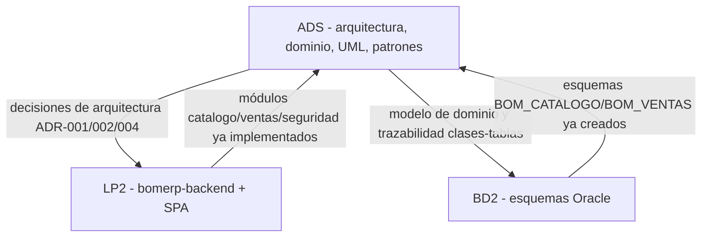

# ADS - Análisis y Diseño de Sistemas de Información

**Repositorio:** [262ciclo4/bomerp](https://github.com/262ciclo4/bomerp)

Diseña técnicamente sistemas de información empresariales definiendo arquitectura, modelos estructurales y dinámicos, mecanismos de integración y decisiones arquitectónicas, aplicando principios de diseño, patrones de software y buenas prácticas de ingeniería, garantizando mantenibilidad, escalabilidad, interoperabilidad y trazabilidad entre requerimientos, diseño e implementación. A diferencia de BD2 (acotado a la base de datos) o LP2 (que construye solo una porción del backend), ADS mira el sistema empresarial completo: infraestructura, servicios externos e integraciones, además de base de datos, backend y frontend.

## Producto del curso

Producto del curso = Producto U3:

```text
Diseño Técnico Profesional Documentado.
```

Resultado esperado del curso:

Al finalizar el curso, el estudiante integra arquitectura, modelo de dominio, catálogo UML, patrones de diseño, mecanismos de integración y ADRs en un diseño técnico profesional trazable, listo como insumo directo para BD2 y LP2. El producto se presenta en equipo, pero cada estudiante evidencia y defiende su aporte individual.

## Contenido

### U1: Arquitectura y Diseño Estructural

Producto U1: arquitectura documentada mediante vistas arquitectónicas y principios de diseño aplicados.

Resultado esperado U1: el estudiante define la arquitectura del sistema aplicando principios de diseño estructural, modelando mediante C4 u otro enfoque arquitectónico y justificando decisiones técnicas alineadas a los requerimientos del negocio.

Artefacto de referencia para el Proyecto Integrador: [ADS - Producto de Unidad 1](../proyecto-integrador/u1/ads-producto.md).

| Sesión | Tema (sílabo) | Artefacto | Trabajo principal |
|---|---|---|---|
| [S1](sesiones/S01_Fundamentos_Arquitectura_Software.md) | Fundamentos de Arquitectura de Software: rol de la arquitectura, stakeholders, atributos de calidad, relación entre arquitectura y requerimientos, estándar IEEE 42010 opcional. | Mapa arquitectónico inicial | Identificar stakeholders, atributos de calidad y decisiones arquitectónicas iniciales del sistema. |
| S2 | Modelo C4 y Vistas Arquitectónicas: C1 contexto, C2 contenedores, C3 componentes, C4 código, vista de despliegue y relación con UML. | Vistas C1-C4 | Elaborar vistas C1 y C2 del sistema. |
| S3 | Diseño Estructural y Principios SOLID: SOLID, cohesión, acoplamiento, modularidad y abstracción. | Evaluación de módulos | Evaluar módulos y responsabilidades de LP2 según principios de diseño. |
| S4 | Arquitecturas Modernas: monolito modular, arquitectura en capas, arquitectura hexagonal, trade-offs, microservicios, clean architecture, escalabilidad horizontal, stateless y cuándo Domain-Driven Design (DDD) orienta la elección hacia arquitectura hexagonal o Clean Architecture. | Estilo arquitectónico elegido | Comparar estilos arquitectónicos y justificar la elección para el proyecto (monolito modular con Spring Modulith, ver ADR-001 de LP2). |
| S5 | Integración del diseño arquitectónico: vistas arquitectónicas, límites, responsabilidades, principios de diseño, estilos arquitectónicos y decisiones técnicas. | — | **Producto U1:** arquitectura documentada mediante vistas arquitectónicas y principios de diseño aplicados. |

### U2: Diseño Dinámico, Modelado UML y Patrones

Producto U2: catálogo UML con patrones de diseño e integración aplicados.

Resultado esperado U2: el estudiante modela la estructura y comportamiento del sistema utilizando UML, aplicando principios de diseño orientado a objetos, patrones de software y mecanismos de integración propios de sistemas empresariales.

Artefacto de referencia para el Proyecto Integrador: [ADS - Producto de Unidad 2](../proyecto-integrador/u2/ads-producto.md).

| Sesión | Tema (sílabo) | Artefacto | Trabajo principal |
|---|---|---|---|
| S6 | Descubrimiento y Modelado del Dominio: identificación de entidades, reglas de negocio, agrupación funcional, delimitación de módulos, casos de uso relevantes, objetos de valor y diseño estratégico de Domain-Driven Design (lenguaje ubicuo, agregado como límite de consistencia). | Modelo de dominio | Modelar el dominio inicial a partir del SRS y reglas de negocio. |
| S7 | Diseño de Clases del Dominio: entidades persistentes, atributos, operaciones, relaciones, multiplicidades, agregación, composición, herencia y restricciones. | Diagrama de clases | Elaborar el diagrama de clases del dominio. |
| S8 | Diseño de Clases Avanzado y Transformación Objeto-Relacional: refinamiento del modelo de clases, transformación UML a modelo relacional, clases, tablas, claves, asociaciones, claves foráneas y trazabilidad dominio-clases-base de datos. | Modelo relacional trazado | Relacionar clases del dominio con tablas, claves y asociaciones persistentes (insumo directo para BD2). |
| S9 | Diagramas Dinámicos UML: diagramas de secuencia, actividades, ciclo de vida de objetos, interacción entre componentes, comunicación y estados opcionales. | Diagramas de secuencia/actividades | Modelar escenarios críticos mediante diagramas dinámicos. |
| S10 | Patrones de Diseño y Arquitectura Empresarial: Controller, Service Layer, Repository, DTO, APIs REST, contratos request-response, Mapper, Dependency Injection y Repository/agregado como patrones tácticos de Domain-Driven Design frente al Service Layer clásico. | Contratos REST | Aplicar patrones empresariales al diseño del sistema (insumo directo para LP2). |
| S11 | Integración y Sistemas Empresariales: APIs externas, servicios de terceros, eventos de dominio, publicación/suscripción, integración entre servicios, IA, mensajería asíncrona y patrones de integración. | Diseño de integraciones | Diseñar mecanismos de integración empresarial del proyecto. |
| S12 | Integración del diseño dinámico: modelado UML, patrones de diseño, mecanismos de integración y decisiones técnicas aplicadas. | — | **Producto U2:** catálogo UML con patrones de diseño e integración aplicados. |

### U3: Proyecto de Diseño Técnico Profesional

Producto U3 / producto del curso: diseño técnico profesional documentado, con arquitectura completa, modelo de dominio, UML, APIs, integraciones, patrones, ADRs y trazabilidad.

Resultado esperado U3: el estudiante integra arquitectura, modelos UML, patrones de diseño, mecanismos de integración y decisiones arquitectónicas en un diseño técnico profesional listo para ser implementado en cursos posteriores.

Artefacto de referencia para el Proyecto Integrador: [ADS - Producto de Unidad 3](../proyecto-integrador/u3/ads-producto.md).

| Sesión | Tema (sílabo) | Artefacto | Trabajo principal |
|---|---|---|---|
| S13 | Integración del Diseño Técnico: consolidación de arquitectura, modelo de dominio, UML, patrones e integraciones. | Dossier consolidado | Integrar artefactos técnicos en un solo dossier. |
| S14 | Decisiones Arquitectónicas y Trazabilidad: ADRs, atributos de calidad, justificación técnica de decisiones y trazabilidad entre requerimientos, arquitectura y diseño. | ADRs | Elaborar ADRs formales y matriz de trazabilidad técnica. |
| S15 | Integración del diseño técnico profesional: arquitectura, modelo de dominio, UML, patrones, ADRs, atributos de calidad, integraciones y trazabilidad. | Dossier técnico | Exposición, defensa técnica y justificación arquitectónica. **Producto U3 = Producto Final del Curso.** |
| S16 | Integración de arquitectura y diseño de sistemas: vistas arquitectónicas, principios de diseño, modelado UML, patrones, decisiones arquitectónicas y trazabilidad. | — | Evaluación individual, recuperación de sustentaciones pendientes, cierre académico. |

## Arquitectura de referencia (trazabilidad con LP2 y BD2)



- ADS documenta las decisiones; LP2 y BD2 las verifican contra código real (`mvnw test`, esquemas Oracle), no solo las describen.
- Si el módulo asignado al grupo ya tiene código en `lp2/bomerp-backend`, los diagramas y ADR de ADS deben usar los mismos nombres de paquete/servicio que el backend ya implementa.
- Si el backend todavía no llegó a esa parte, se documenta explícitamente como "previsto para S0X", no como si ya existiera.

## Flujo de trabajo

1. El estudiante define la arquitectura inicial (stakeholders, atributos de calidad, estilo arquitectónico) antes de que LP2 o BD2 implementen nada.
2. El modelo de dominio (entidades, reglas de negocio, módulos) se construye en U2 y se traza directamente a las clases y tablas que BD2 y LP2 ya implementaron o van a implementar.
3. Los contratos REST diseñados en S10 son el insumo directo del contrato que LP2 expone.
4. Cada decisión arquitectónica relevante se registra como ADR, con contexto, decisión, alternativas consideradas y consecuencias — mismo formato que las ADR reales de LP2 en `docs/lp2/adr/`.
5. El producto final (U3) consolida arquitectura, dominio, UML, patrones e integraciones en un dossier técnico defendido individualmente.

## Enlaces

- [Sílabo 2026-2](silabo_ads_2026_2.md)
- [ADR-001 de LP2 - Arquitectura del backend](../lp2/adr/ADR-001-arquitectura-backend.md)
- [ADR-002 de LP2 - Spring Modulith](../lp2/adr/ADR-002-spring-modulith.md)
- [ADR-004 de LP2 - JWT diferido a S10](../lp2/adr/ADR-004-jwt-diferido.md)
