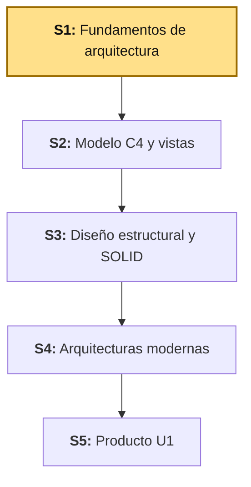
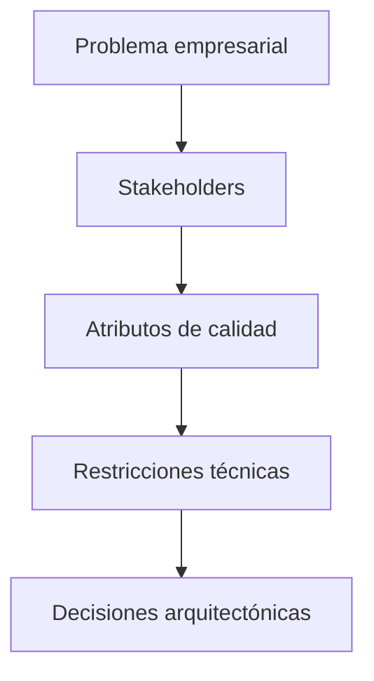
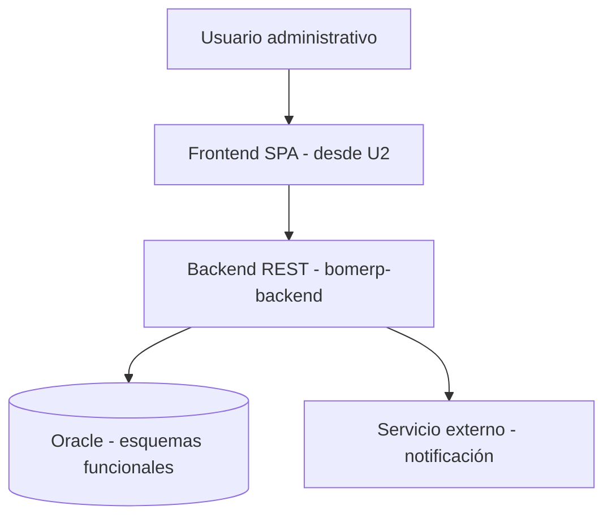

# S1 - Fundamentos de Arquitectura de Software

## 1. Introducción

Tiempo: 20 min.

### 1.1 Presentación de la sesión

La arquitectura de un sistema decide qué tan bien resiste el crecimiento del proyecto y el paso del tiempo. A diferencia de BD2 (acotado a la base de datos) o LP2 (que construye solo una porción del backend), ADS mira el sistema empresarial completo: infraestructura, servicios externos e integraciones, además de base de datos, backend y frontend. Esta sesión identifica stakeholders y atributos de calidad, y define la primera visión arquitectónica inicial.

### 1.2 Índice

1. Rol de la arquitectura de software.
2. Stakeholders técnicos y de negocio.
3. Atributos de calidad.
4. Relación entre arquitectura y requerimientos (estándar IEEE 42010, opcional).

### 1.3 Propósito de aprendizaje

Al concluir la clase, estarás en condiciones de:

- **Identificar y definir** el problema técnico del sistema, sus stakeholders y sus atributos de calidad iniciales, explicando cómo la arquitectura orienta la base Oracle, el backend REST y la futura SPA.

### 1.4 Producto de sesión

Mapa arquitectónico inicial del sistema: contexto, stakeholders, atributos de calidad priorizados y primeras decisiones técnicas.

### 1.5 Metodología

**Tabla 1. Metodología de la sesión**

| Actividades a Realizar en el Periodo | Orientaciones generales (Orientaciones Metodológicas) | Material de estudio recomendado |
|---|---|---|
| Revisión previa individual | Leer el sílabo de la Unidad 1 y el caso BomERP (ver 1.6). Trabajo individual, antes de clase; identificar de antemano el dominio y proceso principal del propio proyecto. | Sílabo ADS U1. |
| Clase presencial | Identificación guiada de stakeholders, atributos de calidad y primer estilo arquitectónico para BomERP. Trabajo individual, siguiendo al docente paso a paso; consulta inmediata ante dudas de priorización. | Plantillas de las tablas de 3.1-3.6. |
| Evaluación formativa | Revisión en clase del mapa arquitectónico inicial (dominio, stakeholders, atributos, estilo). La evidencia se completa y sustenta de forma individual, fuera del aula, según los criterios mínimos de la sección 4.4. | Indicaciones de entrega (4.3), rúbrica de evaluación (4.6). |

### 1.6 Motivación de la sesión

#### 1.6.1 Caso: BomERP (`Categoria`–`Producto`–`Venta`–`DetalleVenta`)

BomERP necesita gestionar un catálogo de productos, registrar ventas con su detalle, mantener el stock consistente y dejar evidencia técnica de seguridad, rendimiento y auditoría. El equipo no debe empezar solo creando endpoints o tablas; primero debe decidir cómo se organizará el sistema y qué cualidades debe cumplir. LP2 ya avanzó con el backend (listados de `Categoria`/`Producto` en S1, CRUD completo en S2); esta sesión define la arquitectura que justifica esas decisiones y las que siguen.

**Preguntas de análisis**

**Activación de conocimientos previos**

1. ¿Qué partes tendrá el sistema empresarial?
2. ¿Qué decisiones debe tomar ADS antes de que LP2 implemente la API?
3. ¿Qué necesita BD2 para que Oracle no sea un componente aislado?

**Comprensión arquitectónica**

1. ¿Qué usuarios o áreas se ven afectadas?
2. ¿Qué atributos de calidad son críticos: seguridad, rendimiento, auditabilidad, mantenibilidad, disponibilidad?

### 1.7 Ubicación en el curso

- Unidad: U1 - Arquitectura y Diseño Estructural.
- Producto del curso: Diseño Técnico Profesional Documentado.
- Producto de unidad: arquitectura documentada mediante vistas arquitectónicas y principios de diseño aplicados.
- Avance del producto en esta sesión: visión inicial, stakeholders, atributos de calidad y decisiones base para el sistema.

Roadmap del producto de la unidad:

**Figura 1. Roadmap del producto de la unidad**



## 2. Explica

Tiempo: 25 min.

### 2.1 Arquitectura de la sesión

**Figura 2. Panorama arquitectónico del sistema BomERP**



Lectura del diagrama:

- La arquitectura no arranca dibujando cajas: arranca entendiendo el problema, quién lo vive (stakeholders) y qué cualidades importan (atributos de calidad) — de ahí salen restricciones y, recién al final, decisiones.
- Sin este orden, una "decisión arquitectónica" termina siendo solo una preferencia técnica sin respaldo verificable.
- Integración (referencia, no requisito para esta sesión): si el equipo también lleva BD2 y LP2, estas mismas decisiones son las que orientan el motor Oracle (soporte transaccional, seguridad, auditoría) y el backend REST — evitando que cada curso avance como producto separado. **Errores frecuentes**: dejar que BD2 aparezca como ejercicio aparte sin conectar Oracle con el dominio; que LP2 cree endpoints sin diseño previo (sin recursos ni componentes definidos); o no dejar trazabilidad entre la decisión y su evidencia — se resuelve con una matriz decisión-BD2-LP2.

Este diagrama es el mapa que guía el resto de la explicación: cada apartado siguiente desarrolla uno de sus componentes, en el mismo orden del Índice (1.2).

### 2.2 Rol de la arquitectura de software

La arquitectura de software define las decisiones importantes del sistema: componentes, responsabilidades, relaciones, restricciones y atributos de calidad. No es solo un diagrama; es la base que permite construir una solución coherente, sin importar en cuántas piezas (base de datos, backend, frontend) se termine implementando. Una arquitectura mal justificada acumula **deuda técnica**: decisiones tomadas por comodidad hoy que cuestan más resolver mañana.

**Errores frecuentes**: tratar la arquitectura como solo un dibujo, sin justificar decisiones con atributos de calidad; o elegir un estilo (por ejemplo, microservicios) porque está de moda, sin evaluar si el alcance, el equipo y la operación del proyecto lo justifican.

Alcance metodológico de S1:

```text
En S1 no se construye todavía el catálogo C4 completo.
Se define la visión arquitectónica inicial, los stakeholders,
los atributos de calidad y las primeras decisiones técnicas.

Las vistas C4, componentes, patrones y ADRs se refinan
en las siguientes sesiones.
```

### 2.3 Stakeholders técnicos y de negocio

Un **stakeholder de negocio** es quien vive el proceso (usuario administrativo, vendedor, auditor); un **stakeholder técnico** es quien construye o mantiene el sistema (DBA, desarrollador backend o frontend). Ambos condicionan decisiones distintas: el de negocio prioriza qué debe hacer el sistema, el técnico prioriza cómo se sostiene en el tiempo.

### 2.4 Atributos de calidad

Un **atributo de calidad** (seguridad, rendimiento, auditabilidad, mantenibilidad, disponibilidad) es una propiedad del sistema que debe verificarse con evidencia, no darse por supuesta. Una **restricción** es una condición que la arquitectura no puede violar (tecnología ya elegida, tiempo del ciclo, tamaño del equipo).

**Error frecuente**: tratar todos los atributos como "importantes" sin priorizar — se eligen de 3 a 5 atributos críticos para la unidad, no una lista completa sin jerarquía.

### 2.5 Relación entre arquitectura y requerimientos

Una **decisión arquitectónica** conecta un requerimiento con una elección técnica concreta y su justificación; una **vista arquitectónica** (contexto, contenedores, componentes, código) documenta esa decisión desde un ángulo distinto. El estándar **IEEE 42010** (referencia opcional, no obligatoria en S1) formaliza cómo documentar vistas arquitectónicas y sus interesados.

## 3. Aplica: actividad práctica guiada

Tiempo: 2h.

**Actividad:** elaboración guiada de la primera visión arquitectónica de BomERP: dominio, stakeholders, atributos de calidad y estilo arquitectónico inicial (Producto de la sesión en 1.4).

**Propósito de la actividad:** construir la primera visión arquitectónica de BomERP — dominio, stakeholders, atributos de calidad priorizados, estilo arquitectónico y decisiones iniciales documentadas — que justifique las decisiones que ADS, LP2 y BD2 tomarán en las sesiones siguientes.

**Orientaciones metodológicas:** en el laboratorio, el docente guía la identificación de stakeholders, atributos de calidad y el primer estilo arquitectónico para BomERP paso a paso frente a la clase; los estudiantes completan las mismas tablas para el dominio de su propio proyecto de equipo (ver sección 4).

**Actividades para realizar:**

- **3.1** Definir el dominio técnico.
- **3.2** Identificar stakeholders.
- **3.3** Priorizar atributos de calidad.
- **3.4** Proponer estilo arquitectónico inicial.
- **3.5** Bosquejar arquitectura inicial.
- **3.6** Registrar decisiones iniciales.
- **3.7** Trazar ADS con BD2 y LP2.

### 3.1 Definir el dominio técnico

**Producto del paso:** dominio y proceso principal del sistema.

Ejemplo resuelto con BomERP — cada equipo completa la misma tabla para el dominio de su propio proyecto (ver sección 4):

**Tabla 2. Dominio técnico del proyecto BomERP**

| Elemento | Respuesta (BomERP) |
|---|---|
| Dominio del proyecto | Catálogo y ventas de un ERP comercial (continuidad de Ciclo 3) |
| Proceso principal | Venta de productos con control de stock |
| Entidad transaccional principal | `Venta`–`DetalleVenta` |
| Usuarios principales | Administrador de catálogo, vendedor, auditor |
| Sistema externo posible | Servicio de notificación (correo) al confirmar una venta |

### 3.2 Identificar stakeholders

**Producto del paso:** mapa de stakeholders.

**Tabla 3. Mapa de stakeholders**

| Stakeholder | Interés | Atributo de calidad asociado |
|---|---|---|
| Usuario administrativo | Gestionar catálogo y ventas sin fricción | Usabilidad / mantenibilidad |
| Responsable del proceso (vendedor) | Que la venta y el stock queden consistentes | Integridad |
| DBA (BD2) | Esquema Oracle estable, auditable y con permisos mínimos | Auditabilidad / seguridad |
| Desarrollador backend (LP2) | Contrato de API claro y mantenible | Mantenibilidad |
| Auditor o supervisor | Trazabilidad de cambios de estado de una venta | Auditabilidad |

### 3.3 Priorizar atributos de calidad

**Producto del paso:** atributos de calidad priorizados.

**Tabla 4. Atributos de calidad priorizados**

| Atributo | Por qué importa | Evidencia esperada en el proyecto |
|---|---|---|
| Integridad | El total de una venta y el stock de un producto no pueden quedar inconsistentes | Transacción JPA en `Venta–DetalleVenta` (S4) y restricciones Oracle |
| Rendimiento | Las consultas de ventas por estado y fecha son frecuentes | Índice `idx_venta_estado_fecha` (BD2) y filtros de API (LP2 S5) |
| Auditabilidad | Debe quedar evidencia de quién anuló una venta y cuándo | Trigger `trg_venta_estado_audit` (BD2) |
| Mantenibilidad | El backend crecerá sesión a sesión durante 16 semanas | Un solo proyecto Spring Boot, módulos verificados con Spring Modulith |
| Seguridad | El acceso debe protegerse antes de llegar a producción | JWT y roles, previstos para S10 (no se implementan en U1) |

### 3.4 Proponer estilo arquitectónico inicial

**Producto del paso:** decisión arquitectónica inicial.

**Tabla 5. Evaluación de estilos arquitectónicos**

| Opción | ¿Aplica a BomERP? | Justificación |
|---|---|---|
| Monolito modular | Sí | Un solo ejecutable, equipo pequeño, módulos por dominio (`catalogo`, `ventas`, ...) verificados con Spring Modulith |
| Arquitectura en capas | Sí, dentro de cada módulo | Cada módulo separa controller, service, repository y entity |
| Arquitectura hexagonal | No, para este corte | Agrega indirección (puertos/adaptadores) que el alcance de LP2 no necesita todavía |
| Microservicios | No | Fuera del alcance de LP2; se estudia conceptualmente en ADS, se practica en Aplicaciones Distribuidas |
| Clean Architecture | Parcialmente | Se aplican sus principios de separación de capas, sin adoptar la estructura formal completa |

### 3.5 Bosquejar arquitectura inicial

**Producto del paso:** primer esquema arquitectónico.

**Figura 3. Primer esquema arquitectónico de BomERP**



Este esquema es intencionalmente simple: el modelo C4 completo (C1-C3) se construye en S2. Aquí solo se fija que hay una SPA, un backend único y una base Oracle, sin entrar todavía en componentes internos.

### 3.6 Registrar decisiones iniciales

**Producto del paso:** primeras ADR resumidas.

**Tabla 6. Decisiones arquitectónicas iniciales (ADR resumidas)**

| Código | Decisión | Justificación | Consecuencia |
|---|---|---|---|
| ADR-001 | Un solo proyecto Spring Boot, sin reactor Maven multi-módulo | El sílabo de LP2 pide organización por capas, no distribución; menos fricción de build | El backend se despliega como un único `.jar` |
| ADR-002 | Módulos de negocio como paquetes verificados con Spring Modulith, no como artefactos Maven | Verifica límites de dependencia automáticamente en vez de solo documentarlos | Un test (`ModularityTests`) falla si un módulo viola el límite de otro |
| ADR-004 | JWT se implementa recién en S10 | Evita construir seguridad antes de tener recursos que proteger | U1 expone endpoints sin autenticación; no es el estado final |

Detalle completo: [ADR-001](../../lp2/adr/ADR-001-arquitectura-backend.md), [ADR-002](../../lp2/adr/ADR-002-spring-modulith.md), [ADR-003](../../lp2/adr/ADR-003-spring-boot-4.md) y [ADR-004](../../lp2/adr/ADR-004-jwt-diferido.md). Estas decisiones se retoman y amplían en S14 (ADRs y trazabilidad técnica).

### 3.7 Trazar ADS con BD2 y LP2

**Producto del paso:** matriz de integración inicial.

**Tabla 7. Matriz de integración ADS-BD2-LP2**

| Decisión ADS | Evidencia esperada en BD2 | Evidencia esperada en LP2 |
|---|---|---|
| Integridad transaccional | Restricciones `CHECK` y `pkg_venta` con validación de stock | Transacción JPA en `Venta–DetalleVenta` (S4) |
| Auditabilidad | Trigger `trg_venta_estado_audit` | Acción "anular venta" que dispara el cambio auditado (S4-S5) |
| Rendimiento | Índice `idx_venta_estado_fecha` | Filtros y consultas de venta (S5) |
| Mantenibilidad (Modulith) | Esquemas Oracle con propietario funcional propio | `ModularityTests` en verde (S1 en adelante) |
| Seguridad con JWT | Usuario técnico `BOMERP_APP` sin ser dueño de objetos | Endpoints protegidos desde S10 |

Sesión equivalente en los otros dos cursos, misma semana: [BD2 - S1 PL/SQL Aplicado al Negocio](../../bd2/sesiones/S01_PLSQL_Aplicado_Negocio.md) y [LP2 - S1 Arquitectura Backend REST Profesional](../../lp2/sesiones/S01_Arquitectura_Backend_REST_Profesional.md).

**Evidencia de aprendizaje:**

- Dominio técnico, stakeholders y atributos de calidad priorizados de BomERP.
- Estilo arquitectónico y bosquejo de arquitectura inicial, con las decisiones (ADR) registradas.
- Matriz de integración inicial con BD2 y LP2.

## 4. Crea: actividad autónoma

Tiempo: 2h fuera del aula.

### 4.1 Actividad

Elaboración autónoma de la visión arquitectónica inicial del proyecto propio del equipo, documentada en evidencia individual.

Completa y evidencia estas tareas:

1. Describir el dominio y proceso principal del proyecto.
2. Identificar al menos cinco stakeholders.
3. Priorizar al menos cuatro atributos de calidad.
4. Proponer un estilo arquitectónico inicial.
5. Elaborar un diagrama inicial del sistema.
6. Registrar tres decisiones arquitectónicas iniciales.

### 4.2 Propósito

Que cada estudiante demuestre, de forma individual y fuera del aula, que puede reproducir el patrón de análisis construido en clase sin el acompañamiento del docente.

Cada estudiante consolida la visión arquitectónica inicial del proyecto.

### 4.3 Indicaciones

Entrega un PDF con el siguiente nombre:

```text
S01_ADS_Equipo##_ApellidoNombre.pdf
```

Cada captura de pantalla del informe debe mostrar, sin recortar, el reloj del sistema (fecha y hora) y tu usuario o foto de perfil (Windows, VS Code o navegador) visibles en pantalla — es lo que permite verificar que la evidencia es tuya y que corresponde al momento real de tu trabajo.

#### 4.3.1 Estructura del informe

**Datos del estudiante**

- Nombre:
- Equipo:
- Sesión: S01 - Fundamentos de Arquitectura de Software
- Rol o aporte realizado:
- Link de GitHub:

**Evidencia técnica**

Incluye capturas o salidas con una breve explicación debajo de cada una, organizadas en los mismos 4 bloques de la rúbrica (4.6) — así queda claro qué evidencia corresponde a cada criterio evaluado:

1. *Dominio y stakeholders*
    - Tabla de dominio técnico.
    - Mapa de stakeholders.
2. *Atributos de calidad*
    - Tabla de atributos de calidad.
3. *Decisiones arquitectónicas*
    - ADR resumidas.
4. *Diagrama arquitectónico inicial*
    - Diagrama arquitectónico inicial.

**Error o hallazgo**

Describe al menos un error o hallazgo: qué decisión parecía obvia, qué riesgo técnico detectaste, qué ajuste hiciste y qué aprendiste sobre arquitectura.

**Reflexión técnica breve**

Responde en 5 a 8 líneas:

```text
¿Por qué una arquitectura debe justificar decisiones y no solo mostrar componentes?
```

### 4.4 Criterios mínimos de aceptación

La evidencia individual se considera completa si:

- El archivo respeta el nombre solicitado.
- Identifica dominio, proceso y stakeholders.
- Prioriza atributos de calidad.
- Presenta un diagrama inicial comprensible.
- Incluye decisiones arquitectónicas justificadas.
- Cada captura de la evidencia técnica muestra el reloj del sistema y el usuario/perfil visible, sin recortar.
- Las fechas y horas de las capturas son coherentes con el historial de commits de su repositorio en GitHub.
- Incluye un error o hallazgo técnico diagnosticado.
- Incluye la reflexión técnica breve solicitada.

### 4.5 Preguntas de defensa

1. ¿Qué problema técnico atiende la arquitectura propuesta?
2. ¿Qué stakeholder condiciona más las decisiones?
3. ¿Qué atributo de calidad es más crítico y por qué?
4. ¿Por qué elegiste ese estilo arquitectónico?

### 4.6 Rúbrica de evaluación

**Tabla 8. Rúbrica de evaluación**

| Criterio | Peso (%) | A (20 pts) | B (15 pts) | C (10 pts) | D (5 pts) | Nivel obtenido |
|---|---:|---|---|---|---|---:|
| 1. Dominio y stakeholders* | 25 | Define dominio, proceso y stakeholders con claridad técnica y trazabilidad al proyecto real del equipo. | Define dominio y stakeholders principales, con detalles menores. | Presenta dominio o stakeholders incompletos. | No define contexto verificable. | |
| 2. Atributos de calidad* | 25 | Prioriza atributos de calidad y evidencia cómo se verificarán. | Identifica atributos relevantes, con justificación parcial. | Lista atributos sin justificación suficiente. | No identifica atributos. | |
| 3. Decisiones arquitectónicas* | 25 | Registra decisiones justificadas, con consecuencias y alternativas consideradas. | Presenta decisiones comprensibles y justificadas. | Presenta decisiones débiles o genéricas. | No presenta decisiones. | |
| 4. Diagrama arquitectónico inicial* | 25 | Diagrama claro, coherente y conectado con el dominio y las decisiones registradas. | Diagrama comprensible, con inconsistencias menores. | Diagrama incompleto o poco conectado con el resto del informe. | No presenta diagrama. | |

\* Agregado manual.

Nota final = suma de (`Peso` / 100 × `Puntos del nivel obtenido`) = ____ / 20.

Para usar la rúbrica con IA, solicita:

```text
Evalúa el PDF usando la rúbrica de la sesión.
Para cada criterio selecciona el nivel obtenido usando la escala A=20, B=15, C=10, D=5 puntos.
Justifica brevemente cada nivel asignado.
Verifica que cada captura muestre reloj del sistema y usuario/perfil visible, y que las fechas sean coherentes con el historial de commits de GitHub. Si falta esta evidencia o hay inconsistencias, indícalo explícitamente antes de calificar.
Calcula la nota final con la fórmula: suma de (Peso/100 × Puntos del nivel obtenido), directamente sobre 20.
Indica 2 fortalezas y 2 recomendaciones.
```

## 5. Cierre

Tiempo: 5 min.

**Resumen breve:** hoy BomERP pasó de no tener arquitectura declarada a tener dominio, stakeholders, atributos de calidad priorizados, un estilo arquitectónico inicial y las primeras decisiones registradas — la base que LP2 y BD2 usan desde su propia S1.

**Dinámica participativa:** en una ronda rápida (o con una herramienta digital tipo formulario o encuesta en vivo), cada estudiante comparte en una frase el atributo de calidad que priorizó y por qué.

**Metacognición:** cada estudiante responde en voz alta o por escrito: ¿qué parte de la sesión te costó más entender, y cómo la resolviste?

**Proyección:** el mapa arquitectónico de hoy se retoma y se hace más preciso en S2 (modelo C4), y las decisiones registradas hoy se verifican contra lo que LP2 y BD2 vayan construyendo — igual que en cualquier proyecto profesional, donde la arquitectura se revisa y ajusta a medida que el sistema crece.

## Bibliografía

1. Brown, S. (2024). *The C4 model for visualising software architecture*. https://c4model.com/
2. International Organization for Standardization. (2022). *ISO/IEC/IEEE 42010:2022 — Software, systems and enterprise — Architecture description*. https://www.iso.org/standard/74393.html
3. Spring. (2024). *Spring Modulith reference documentation*. VMware. https://docs.spring.io/spring-modulith/reference/
