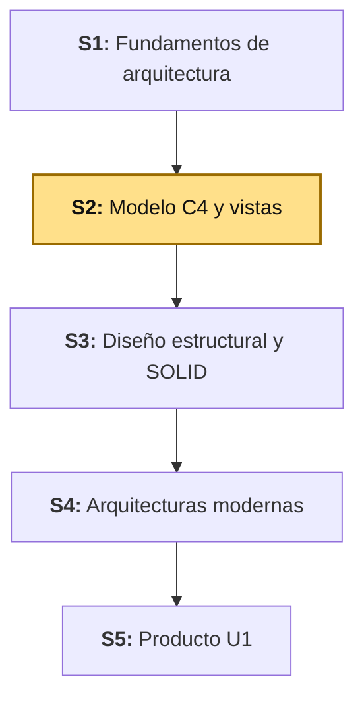
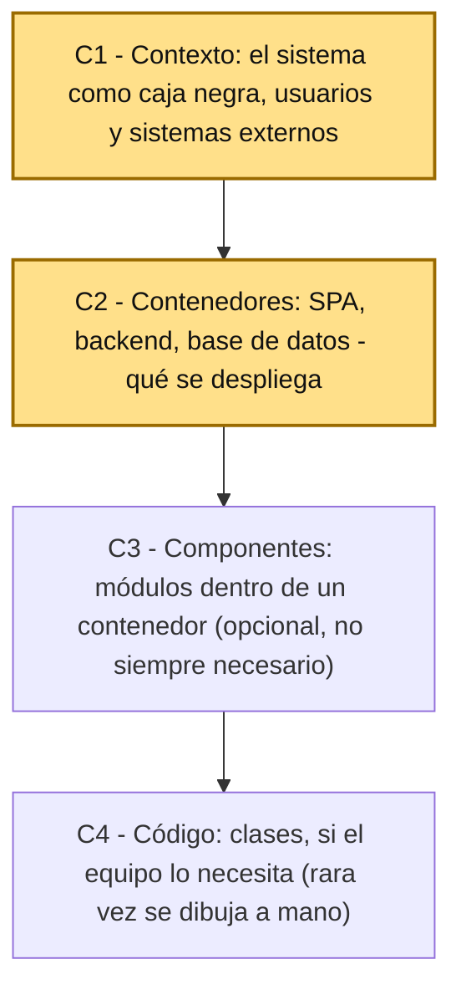
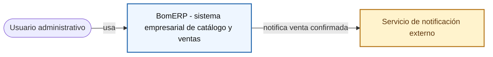
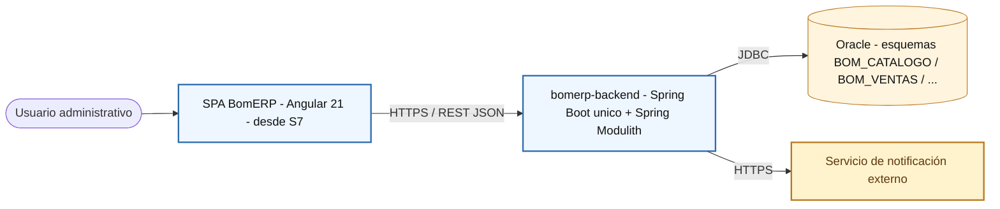

# S2 - Modelo C4 y Vistas Arquitectónicas

## 1. Introducción

Tiempo: 20 min.

### 1.1 Presentación de la sesión

En S1 el equipo definió dominio, stakeholders, atributos de calidad y un primer bosquejo arquitectónico. Esta sesión formaliza ese bosquejo con el **modelo C4**: primero la vista de contexto (C1), luego la de contenedores (C2) — las dos vistas que se elaboran hoy. Las vistas de componentes (C3), código (C4), la vista de despliegue y su relación con UML se explican como panorama conceptual, para ubicar dónde encaja cada una, pero se refinan en sesiones posteriores.

### 1.2 Índice

1. Modelo C4: niveles de abstracción.
2. Vista de contexto (C1) y vista de contenedores (C2).
3. Vistas de componentes (C3), código (C4) y despliegue — panorama conceptual.
4. Relación entre C4 y UML.

### 1.3 Propósito de aprendizaje

Al concluir la clase, estarás en condiciones de:

- **Elaborar** las vistas C1 (contexto) y C2 (contenedores) de un sistema empresarial, reconociendo dónde encajan C3, C4, la vista de despliegue y UML en el resto del modelo arquitectónico.

### 1.4 Producto de sesión

Vistas C1 (contexto) y C2 (contenedores) de BomERP, con sus elementos documentados en tabla, y el panorama conceptual de C3, C4 y despliegue registrado para las sesiones que los refinan.

### 1.5 Metodología

**Tabla 1. Metodología de la sesión**

| Actividades a Realizar en el Periodo | Orientaciones generales (Orientaciones Metodológicas) | Material de estudio recomendado |
|---|---|---|
| Revisión previa individual | Revisar el mapa arquitectónico inicial de S1 (dominio, stakeholders, atributos de calidad). Trabajo individual, antes de clase. | S1 (Tablas 2-6), sitio oficial de C4 model. |
| Clase presencial | Elaboración guiada de las vistas C1 y C2 de BomERP. Trabajo individual, siguiendo al docente paso a paso; consulta inmediata ante dudas de nivel de abstracción. | Plantillas de las tablas de 3.1-3.4. |
| Evaluación formativa | Revisión en clase de las vistas C1 y C2 (elementos, relaciones, nivel de abstracción correcto). La evidencia se completa y sustenta de forma individual, fuera del aula, según los criterios mínimos de la sección 4.4. | Indicaciones de entrega (4.3), rúbrica de evaluación (4.6). |

### 1.6 Motivación de la sesión

#### 1.6.1 Caso: BomERP (contexto y contenedores)

El bosquejo de S1 (Figura 3 de esa sesión) ya mostraba que existe una SPA, un backend y una base Oracle — pero sin fijar todavía quién usa el sistema desde afuera, ni qué otros sistemas externos participan, ni cómo se llama cada contenedor real. El modelo C4 resuelve eso con dos niveles separados: primero quién ve el sistema como una caja negra (C1), después qué contenedores desplegables tiene por dentro (C2) — sin mezclar ambos niveles en un solo diagrama.

**Preguntas de análisis**

**Activación de conocimientos previos**

1. En el diagrama de S1 (Figura 3), ¿qué elementos corresponden a "contexto" (C1) y cuáles ya son "contenedores" (C2)?
2. ¿Qué pasa si un diagrama mezcla actores, contenedores y clases internas al mismo tiempo?

**Comprensión del modelo C4**

1. ¿Por qué C1 no debe mostrar tecnologías (Spring Boot, Angular, Oracle) y C2 sí?
2. ¿Qué diferencia hay entre un "sistema externo" y un "contenedor" del propio sistema?

### 1.7 Ubicación en el curso

- Unidad: U1 - Arquitectura y Diseño Estructural.
- Producto del curso: Diseño Técnico Profesional Documentado.
- Producto de unidad: arquitectura documentada mediante vistas arquitectónicas y principios de diseño aplicados.
- Avance del producto en esta sesión: vistas C1 y C2 formalizadas, con el resto del modelo C4 ubicado conceptualmente.

Roadmap del producto de la unidad:

**Figura 1. Roadmap del producto de la unidad**



## 2. Explica

Tiempo: 25 min.

### 2.1 Arquitectura de la sesión

**Figura 2. Los cuatro niveles del modelo C4**



Lectura del diagrama:

- Cada nivel hace **zoom** sobre el anterior: C1 es la vista más alejada (todo el sistema es una caja), C4 es la más cercana (clases individuales). Nunca se salta un nivel ni se mezclan dos en el mismo diagrama.
- Esta sesión se detiene en C1 y C2 (resaltados) — son los niveles que todo proyecto necesita. C3 y C4 son opcionales: se dibujan solo si un contenedor específico lo amerita (ver 2.5).
- **Error frecuente**: empezar directamente por C2 o C3 sin haber definido C1 — sin el contexto, no queda claro para quién existe el sistema ni con qué otros sistemas conversa.

Este diagrama es el mapa que guía el resto de la explicación: cada apartado siguiente desarrolla uno de sus componentes, en el mismo orden del Índice (1.2).

### 2.2 Modelo C4: niveles de abstracción

El **modelo C4** (Context, Containers, Components, Code) de Simon Brown organiza la arquitectura en niveles de zoom progresivo, cada uno con una audiencia distinta: C1 sirve para explicarle el sistema a cualquier persona, técnica o no; C2 ya es para el equipo técnico; C3 y C4 son detalle interno, útiles solo cuando un contenedor concreto lo justifica.

Alcance metodológico de S2:

```text
En S2 se elaboran C1 y C2 completos. C3, C4, la vista de
despliegue y la relación con UML se explican como panorama
conceptual (2.5-2.6), para ubicar dónde encajan — se detallan
recién cuando la arquitectura de un contenedor específico lo
necesite (referencia: LP2 ADR-001, ADR-002).
```

### 2.3 Vista de contexto (C1)

La **vista de contexto** muestra el sistema como una sola caja negra: quién lo usa (personas) y con qué otros sistemas conversa (sistemas externos) — sin mostrar tecnología, sin mostrar contenedores internos.

**Error frecuente**: incluir el nombre de un framework o motor de base de datos en C1 — esa información es de C2 en adelante, no de contexto.

### 2.4 Vista de contenedores (C2)

La **vista de contenedores** abre la caja negra de C1 y muestra las piezas desplegables por separado (una SPA, un backend, una base de datos), con la tecnología de cada una y cómo se comunican entre sí (protocolo, formato).

**Error frecuente**: llamar "contenedor" a una clase o a un paquete interno — un contenedor es algo que se ejecuta o se despliega de forma independiente (un proceso, una aplicación, una base de datos), no una unidad de código dentro de uno de ellos.

### 2.5 Vistas de componentes (C3), código (C4) y despliegue

La **vista de componentes** (C3) abre un contenedor específico y muestra sus piezas internas (por ejemplo, los módulos `catalogo`/`ventas` dentro del backend de LP2); la **vista de código** (C4) llega al nivel de clases, y casi nunca se dibuja a mano — se genera desde el código (por ejemplo, con herramientas como el `Documenter` de Spring Modulith que ya usa LP2). La **vista de despliegue** agrega dónde corre físicamente cada contenedor (servidor, contenedor Docker, nube).

**Nota de alcance:** C3 se retoma en S3 (diseño estructural) al evaluar los módulos de LP2 con SOLID; la vista de despliegue se retoma en S4 (arquitecturas modernas, escalabilidad horizontal). No se elaboran hoy.

### 2.6 Relación entre C4 y UML

C4 y UML no compiten: C4 organiza los **niveles de zoom** de la arquitectura (de qué tamaño es la caja que estoy dibujando), mientras que UML aporta el **vocabulario de diagramas** dentro de cada nivel (por ejemplo, un diagrama de despliegue UML puede usarse para detallar la vista de despliegue de C4). Esta relación se profundiza en S9 (diagramas dinámicos UML).

## 3. Aplica: actividad práctica guiada

Tiempo: 2h.

**Actividad:** elaboración guiada de las vistas C1 (contexto) y C2 (contenedores) de BomERP (Producto de la sesión en 1.4).

**Propósito de la actividad:** construir las vistas C1 y C2 de BomERP a partir del dominio, stakeholders y bosquejo arquitectónico de S1, documentando los elementos de cada vista en tabla antes de dibujar el diagrama.

**Orientaciones metodológicas:** en el laboratorio, el docente elabora C1 y C2 de BomERP paso a paso frente a la clase; los estudiantes completan las mismas tablas y diagramas para el dominio de su propio proyecto de equipo (ver sección 4).

**Actividades para realizar:**

- **3.1** Identificar los elementos de la vista de contexto (C1).
- **3.2** Dibujar la vista de contexto (C1).
- **3.3** Identificar los elementos de la vista de contenedores (C2).
- **3.4** Dibujar la vista de contenedores (C2).
- **3.5** Relacionar con LP2 y BD2.

### 3.1 Identificar los elementos de la vista de contexto (C1)

**Producto del paso:** tabla de elementos de C1.

**Requisito antes de continuar:** ten a la mano la Tabla 2 (dominio técnico) y la Tabla 3 (mapa de stakeholders) de S1 — C1 se construye directamente a partir de ellas, no desde cero.

**Tabla 2. Elementos de la vista de contexto (C1) de BomERP**

| Elemento | Tipo | Descripción |
|---|---|---|
| Usuario administrativo | Persona | Gestiona catálogo y ventas |
| BomERP | Sistema (el propio) | Sistema empresarial de catálogo y ventas |
| Servicio de notificación | Sistema externo | Envía correo al confirmar una venta |

### 3.2 Dibujar la vista de contexto (C1)

**Producto del paso:** diagrama C1 de BomERP.

**Figura 3. Vista de contexto (C1) de BomERP**



Sin tecnología, sin contenedores internos: BomERP es una sola caja. El detalle interno aparece recién en C2.

### 3.3 Identificar los elementos de la vista de contenedores (C2)

**Producto del paso:** tabla de elementos de C2.

**Tabla 3. Elementos de la vista de contenedores (C2) de BomERP**

| Contenedor | Tecnología | Responsabilidad |
|---|---|---|
| SPA BomERP | Angular 21 (desde S7) | Interfaz de usuario del catálogo y ventas |
| `bomerp-backend` | Spring Boot único, Spring Modulith | API REST modular (LP2) |
| Oracle | Oracle Database Free 23ai | Persistencia por esquemas funcionales (BD2) |

### 3.4 Dibujar la vista de contenedores (C2)

**Producto del paso:** diagrama C2 de BomERP.

**Figura 4. Vista de contenedores (C2) de BomERP**



`bomerp-backend` es un solo contenedor, no uno por módulo de negocio — los módulos (`catalogo`, `ventas`, ...) son componentes internos (C3), no contenedores separados; eso es justamente lo que distingue el monolito modular de LP2 de una arquitectura de microservicios (ver Tabla 5 de S1).

### 3.5 Relacionar con LP2 y BD2

**Producto del paso:** matriz de integración de la sesión.

**Tabla 4. Matriz de integración ADS-BD2-LP2 (S2)**

| Elemento C2 | Evidencia esperada en BD2 | Evidencia esperada en LP2 |
|---|---|---|
| Contenedor `bomerp-backend` | Esquema `BOM_CATALOGO` conectado (S1) | Proyecto Spring Boot único, ejecutable (S1) |
| Conexión `API -> Oracle` (JDBC) | Usuario técnico `BOMERP_APP` con permisos mínimos (S1) | `application-dev.yml` con `datasource` configurado (S1) |
| Contenedor SPA BomERP | — | Previsto desde S7, sin implementar todavía |

Sesión equivalente en los otros dos cursos, misma semana: [BD2 - S2 Triggers DML y Auditoría](../../bd2/sesiones/S02_Triggers_DML_Auditoria.md) y [LP2 - S2 CRUD REST Completo de Producto](../../lp2/sesiones/S02_CRUD_REST_Completo_Producto.md).

**Evidencia de aprendizaje:**

- Vista de contexto (C1) de BomERP, con su tabla de elementos.
- Vista de contenedores (C2) de BomERP, con su tabla de elementos.
- Matriz de integración con BD2 y LP2.

## 4. Crea: actividad autónoma

Tiempo: 2h fuera del aula.

### 4.1 Actividad

Elaboración autónoma de las vistas C1 y C2 del proyecto propio del equipo, documentada en evidencia individual.

Completa y evidencia estas tareas:

1. Identificar los elementos de la vista de contexto (C1): personas y sistemas externos.
2. Dibujar la vista de contexto (C1).
3. Identificar los elementos de la vista de contenedores (C2): contenedores y tecnología.
4. Dibujar la vista de contenedores (C2).
5. Explicar en una tabla cómo se conecta cada contenedor con BD2 y LP2.

### 4.2 Propósito

Que cada estudiante demuestre, de forma individual y fuera del aula, que puede reproducir el patrón de modelado C4 construido en clase sin el acompañamiento del docente.

Cada estudiante consolida las vistas C1 y C2 del proyecto propio.

### 4.3 Indicaciones

Entrega un PDF con el siguiente nombre:

```text
S02_ADS_Equipo##_ApellidoNombre.pdf
```

Cada captura de pantalla del informe debe mostrar, sin recortar, el reloj del sistema (fecha y hora) y tu usuario o foto de perfil (Windows, VS Code o navegador) visibles en pantalla — es lo que permite verificar que la evidencia es tuya y que corresponde al momento real de tu trabajo.

#### 4.3.1 Estructura del informe

**Datos del estudiante**

- Nombre:
- Equipo:
- Sesión: S02 - Modelo C4 y Vistas Arquitectónicas
- Rol o aporte realizado:
- Link de GitHub:

**Evidencia técnica**

Incluye capturas o diagramas con una breve explicación debajo de cada uno, organizados en los mismos 4 bloques de la rúbrica (4.6) — así queda claro qué evidencia corresponde a cada criterio evaluado:

1. *Vista de contexto (C1)*
    - Tabla de elementos de C1.
    - Diagrama C1.
2. *Vista de contenedores (C2)*
    - Tabla de elementos de C2.
    - Diagrama C2.
3. *Coherencia con la arquitectura de S1*
    - Explicación de cómo C1/C2 reflejan las decisiones y el bosquejo de S1.
4. *Integración con BD2 y LP2*
    - Matriz de integración de la sesión.

**Error o hallazgo**

Describe al menos un error o hallazgo: un elemento mal ubicado en el nivel equivocado (por ejemplo, tecnología en C1, o una clase tratada como contenedor), qué lo causó y cómo lo corregiste.

**Reflexión técnica breve**

Responde en 5 a 8 líneas:

```text
¿Por qué separar C1 y C2 en dos diagramas distintos, en vez de mostrar todo en uno solo?
```

**Anexo: Feedback de la sesión**

Pega esta página como la última hoja del PDF, con tus respuestas.

1. ¿Cuál es el aprendizaje más importante que te llevas de la clase de hoy?
2. ¿Qué punto de la clase te resultó más confuso o te dejó con dudas?
3. ¿Tienes alguna pregunta que te gustaría que sea respondida la siguiente clase?
4. Sobre tu nivel de comprensión de la clase de hoy, marca una opción:
    - ¡Entendido! - Lo domino y podría explicarlo.
    - Más o menos. - Entendí la idea general, pero tengo dudas.
    - Necesito ayuda. - Me siento perdido/a con este tema.
5. ¿Cómo puedo ayudarte a comprender mejor el tema?
6. Pensando en tu participación y esfuerzo en la clase de hoy, ¿cómo te autoevaluarías? Marca una opción:
    - Muy Comprometido/a: Me esforcé al máximo.
    - Comprometido/a: Sé que podría haberme esforzado un poco más.
    - Poco Comprometido/a: Hoy no di mi mejor esfuerzo.
7. Mi satisfacción con la clase fue... (califica del 1 al 10, donde 1 es insatisfecho y 10 es muy satisfecho).

### 4.4 Criterios mínimos de aceptación

La evidencia individual se considera completa si:

- El archivo respeta el nombre solicitado.
- Presenta la vista de contexto (C1) con personas y sistemas externos identificados.
- Presenta la vista de contenedores (C2) con tecnología por contenedor.
- No mezcla niveles de abstracción (tecnología en C1, o clases tratadas como contenedores en C2).
- Explica la relación de cada contenedor con BD2 y LP2.
- Cada captura de la evidencia técnica muestra el reloj del sistema y el usuario/perfil visible, sin recortar.
- Las fechas y horas de las capturas son coherentes con el historial de commits de su repositorio en GitHub.
- Incluye un error o hallazgo técnico diagnosticado.
- Incluye la reflexión técnica breve solicitada.
- Incluye el Anexo de feedback de la sesión respondido, como última página del PDF.

### 4.5 Preguntas de defensa

1. ¿Por qué la tecnología no debe aparecer en C1?
2. ¿Qué diferencia hay entre un contenedor y un componente?
3. ¿Qué sistema externo identificaste y por qué no es un contenedor propio?
4. ¿Cuándo elaborarías C3 para tu proyecto?

### 4.6 Rúbrica de evaluación

**Tabla 5. Rúbrica de evaluación**

| Criterio | Peso (%) | A (20 pts) | B (15 pts) | C (10 pts) | D (5 pts) | Nivel obtenido |
|---|---:|---|---|---|---|---:|
| 1. Vista de contexto (C1)* | 25 | C1 correcta: personas y sistemas externos claros, sin tecnología ni contenedores internos. | C1 comprensible, con algún elemento fuera de nivel. | C1 incompleta o con varios elementos fuera de nivel. | No presenta C1. | |
| 2. Vista de contenedores (C2)* | 25 | C2 correcta: contenedores reales con tecnología y comunicación entre ellos bien definida. | C2 comprensible, con detalles menores. | C2 incompleta o con contenedores mal definidos. | No presenta C2. | |
| 3. Coherencia con la arquitectura de S1* | 25 | C1/C2 reflejan con claridad el dominio, stakeholders y bosquejo de S1. | Coherencia parcial con S1. | Poca relación con las decisiones de S1. | Sin relación con S1. | |
| 4. Integración con BD2 y LP2* | 25 | Matriz de integración clara, con evidencia esperada específica por curso. | Matriz presente, con vaguedad menor. | Matriz incompleta o genérica. | No presenta matriz. | |

\* Agregado manual.

Nota final = suma de (`Peso` / 100 × `Puntos del nivel obtenido`) = ____ / 20.

Para usar la rúbrica con IA, solicita:

```text
Evalúa el PDF usando la rúbrica de la sesión.
Para cada criterio selecciona el nivel obtenido usando la escala A=20, B=15, C=10, D=5 puntos.
Justifica brevemente cada nivel asignado.
Verifica que cada captura muestre reloj del sistema y usuario/perfil visible, y que las fechas sean coherentes con el historial de commits de GitHub. Si falta esta evidencia o hay inconsistencias, indícalo explícitamente antes de calificar.
Calcula la nota final con la fórmula: suma de (Peso/100 × Puntos del nivel obtenido), directamente sobre 20.
Indica 2 fortalezas y 2 recomendaciones.
```

## 5. Cierre

Tiempo: 5 min.

**Resumen breve:** hoy el bosquejo arquitectónico de S1 se formalizó en dos vistas C4 concretas — contexto (C1) y contenedores (C2) — dejando ubicados conceptualmente los niveles que faltan (C3, C4, despliegue) para cuando la arquitectura los necesite.

**Dinámica participativa:** en una ronda rápida (o con una herramienta digital tipo formulario o encuesta en vivo), cada estudiante comparte en una frase qué contenedor de su proyecto le costó más ubicar correctamente.

**Metacognición:** cada estudiante responde el Anexo de feedback de la sesión, incluido en su evidencia individual (ver 4.3.1). El docente analiza esas respuestas con IA para identificar temas recurrentes o dudas comunes del equipo, y con esos indicadores construye el cierre real de la sesión — que se entrega al inicio de S3, no al final de esta clase.

**Proyección:** C1 y C2 de hoy son la base sobre la que S3 evalúa los módulos de LP2 con SOLID, y S4 explora estilos arquitectónicos más avanzados (incluida la vista de despliegue) — el mismo modelo C4, cada vez con más detalle.

## Bibliografía

1. Brown, S. (2024). *The C4 model for visualising software architecture*. https://c4model.com/
2. Brown, S. (2024). *C4 model - Context diagram*. https://c4model.com/diagrams/system-context
3. Brown, S. (2024). *C4 model - Container diagram*. https://c4model.com/diagrams/container
