# S2 - Modelo C4 y Vistas Arquitectónicas

## 1. Introducción

Tiempo: 20 min.

### 1.1 Presentación de la sesión

En la sesión 1 el equipo definió dominio, stakeholders, atributos de calidad y un primer bosquejo arquitectónico. Esta sesión formaliza ese bosquejo con el **modelo C4**: contexto (C1), contenedores (C2), y una primera versión de componentes (C3) y código (C4) — las cuatro vistas que se elaboran hoy. La vista de despliegue y su relación con UML se explican como panorama conceptual, para ubicar dónde encajan, y se detallan en sesiones posteriores.

### 1.2 Índice

1. Modelo C4: niveles de abstracción.
2. Vista de contexto (C1) y vista de contenedores (C2).
3. Vista de componentes (C3) — primera versión.
4. Vista de código (C4) — primera versión.
5. Vista de despliegue — panorama conceptual.
6. Relación entre C4 y UML.

### 1.3 Propósito de aprendizaje

Al concluir la clase, estarás en condiciones de:

- **Elaborar** las vistas C1 (contexto), C2 (contenedores), y una primera versión de C3 (componentes) y C4 (código) de un sistema empresarial, reconociendo dónde encaja la vista de despliegue y UML en el resto del modelo arquitectónico.

### 1.4 Producto de sesión

Vistas C1 (contexto), C2 (contenedores), y una primera versión de C3 (componentes) y C4 (código) de BomERP, con sus elementos documentados en tabla, y el panorama conceptual de la vista de despliegue registrado para las sesiones que la refinan.

**Nota:** el sílabo acota la actividad calificada de esta sesión a C1 y C2 (ver 1.5); esta guía la extiende deliberadamente hasta una primera versión de C3 y C4, porque el módulo `catalogo` de LP2 ya tiene código real para dibujarlos sin inventar nada — se refinan en sesiones posteriores (S3 evalúa los módulos con SOLID, S4 explora estilos arquitectónicos y la vista de despliegue).

### 1.5 Metodología

**Tabla 1. Metodología de la sesión**

| Actividades a Realizar en el Periodo | Orientaciones generales (Orientaciones Metodológicas) | Material de estudio recomendado |
|---|---|---|
| Revisión previa individual | Revisar el mapa arquitectónico inicial de S1 (dominio, stakeholders, atributos de calidad). Trabajo individual, antes de clase. | S1 (Tablas 2-6), sitio oficial de C4 model. |
| Clase presencial | Elaboración guiada de las vistas C1, C2, C3 y C4 de BomERP. Trabajo individual, siguiendo al docente paso a paso; consulta inmediata ante dudas de nivel de abstracción. | Plantillas de las tablas de 3.1-3.8. |
| Evaluación formativa | Revisión en clase de las vistas C1, C2, C3 y C4 (elementos, relaciones, nivel de abstracción correcto). La evidencia se completa y sustenta de forma individual, fuera del aula, según los criterios mínimos de la sección 4.4. | Indicaciones de entrega (4.3), rúbrica de evaluación (4.6). |

### 1.6 Motivación de la sesión

#### 1.6.1 Caso: BomERP (contexto y contenedores)

**BomERP** (Business Operations Management) es el sistema empresarial de referencia que el equipo construye a lo largo de la carrera — no solo catálogo y ventas (el alcance actual de LP2), sino la gestión de operaciones del negocio en general (ver el [`README.md`](https://github.com/262ciclo4/bomerp) raíz del repositorio). El bosquejo de S1 (Figura 3 de esa sesión) ya mostraba que existe una SPA, un backend y una base Oracle — pero sin fijar todavía quién usa el sistema desde afuera, ni qué otros sistemas externos participan, ni cómo se llama cada contenedor real. El modelo C4 resuelve eso con dos niveles separados: primero quién ve el sistema como una caja negra (C1), después qué contenedores desplegables tiene por dentro (C2) — sin mezclar ambos niveles en un solo diagrama.

**Preguntas de análisis**

**Activación de conocimientos previos**

1. En el diagrama de S1 (Figura 3), ¿qué elementos corresponden a "contexto" (C1) y cuáles ya son "contenedores" (C2)?
2. ¿Qué pasa si un diagrama mezcla actores, contenedores y clases internas al mismo tiempo?

**Comprensión del modelo C4**

1. ¿Por qué C1 no debe mostrar tecnologías (Spring Boot, Angular, Oracle) y C2 sí?
2. ¿Qué diferencia hay entre un "sistema externo" y un "contenedor" del propio sistema?

### 1.7 Ubicación en el curso

- Unidad: U1 - Arquitectura y Diseño Estructural.
- Producto del curso: Diseño Técnico Profesional Documentado.
- Producto de unidad: arquitectura documentada mediante vistas arquitectónicas y principios de diseño aplicados.
- Avance del producto en esta sesión: vistas C1 y C2 formalizadas, más una primera versión de C3 y C4, con la vista de despliegue ubicada conceptualmente.

Roadmap del producto de la unidad:

**Figura 1. Roadmap del producto de la unidad**

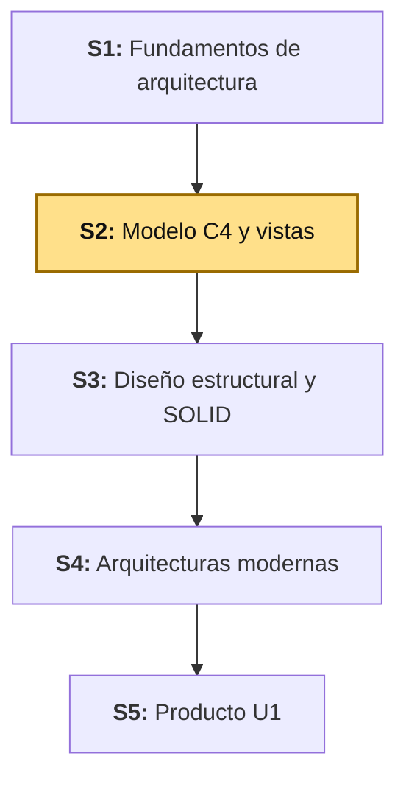

## 2. Explica

Tiempo: 25 min.

### 2.1 Arquitectura de la sesión

**Figura 2. Los cuatro niveles del modelo C4**

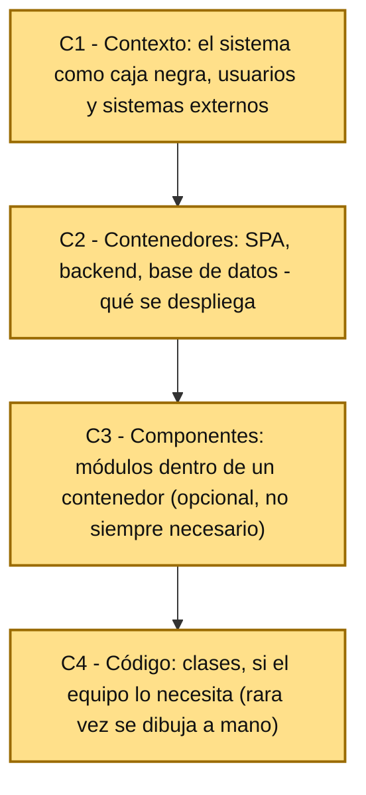

Lectura del diagrama:

- Cada nivel hace **zoom** sobre el anterior: C1 es la vista más alejada (todo el sistema es una caja), C4 es la más cercana (clases individuales). Nunca se salta un nivel ni se mezclan dos en el mismo diagrama.
- Esta sesión trabaja los cuatro niveles (resaltados): C1 y C2 completos, y una primera versión de C3 y C4 sobre `bomerp-backend` — en general C3 y C4 son opcionales, se dibujan solo si un contenedor específico lo amerita (ver 2.5), y `bomerp-backend` ya lo amerita porque tiene código real.
- **Error frecuente**: empezar directamente por C2 o C3 sin haber definido C1 — sin el contexto, no queda claro para quién existe el sistema ni con qué otros sistemas conversa.

Este diagrama es el mapa que guía el resto de la explicación: cada apartado siguiente desarrolla uno de sus componentes, en el mismo orden del Índice (1.2).

### 2.2 Modelo C4: niveles de abstracción

El **modelo C4** (Context, Containers, Components, Code) de Simon Brown organiza la arquitectura en niveles de zoom progresivo, cada uno con una audiencia distinta: C1 sirve para explicarle el sistema a cualquier persona, técnica o no; C2 ya es para el equipo técnico; C3 y C4 son detalle interno, útiles solo cuando un contenedor concreto lo justifica.

Alcance metodológico de S2:

```text
En S2 se elaboran C1 y C2 completos, y una primera versión de C3
y C4 sobre bomerp-backend (el único contenedor con lógica interna
real hoy). La vista de despliegue y la relación con UML se
explican como panorama conceptual (2.7-2.8), para ubicar dónde
encajan — se detallan recién cuando la arquitectura lo necesite
(referencia: LP2 ADR-001, ADR-002).
```

### 2.3 Vista de contexto (C1)

La **vista de contexto** muestra el sistema como una sola caja negra: quién lo usa (personas) y con qué otros sistemas conversa (sistemas externos) — sin mostrar tecnología, sin mostrar contenedores internos.

**Ejemplo de referencia — versión extendida de BomERP.** ADS ve **todo el bosque** (a diferencia de LP2, que solo construye una porción del backend, ver 1.1 de ADS) — este ejemplo agrega piezas que el proyecto real de LP2 todavía no tiene, pero que cualquier ERP empresarial real termina conectando tarde o temprano: app móvil, pasarela de pagos, entidades del Estado peruano (RENIEC, SUNAT), un servicio de IA, y un sistema legado de la misma empresa. Mismo patrón que usa [c4model.com/diagrams/system-context](https://c4model.com/diagrams/system-context):

**Figura 3. Vista de contexto (C1) — ejemplo de referencia extendido (BomERP)**

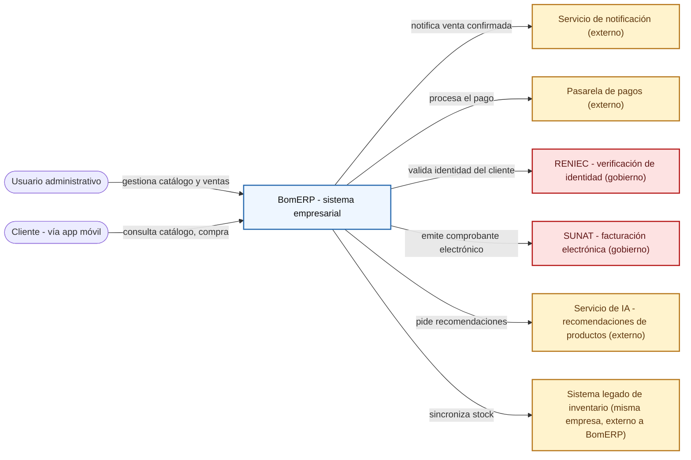

Nota cómo no aparece ni un solo nombre de tecnología (nada de "Angular", "Spring Boot", "Oracle") — a este nivel eso todavía no importa, solo quién usa el sistema y con qué otros sistemas conversa. Todo lo que está fuera de la caja `BomERP` es "sistema externo" para efectos de C1, sin importar si es del Estado (RENIEC, SUNAT — con su propio color, porque tienen reglas de integración distintas a un proveedor comercial), un servicio de terceros (pasarela de pagos, IA) o un sistema legado de la **misma** empresa: si no lo controla el equipo de BomERP, es una caja externa. Estas ocho piezas son **hipotéticas** (BomERP hoy solo tiene el servicio de notificación) — sirven para practicar el rango completo de lo que ADS debe reconocer, antes de dibujar la versión real y mínima de BomERP en 3.1-3.2. Estos mecanismos de integración (APIs externas, IA, sistemas legados) se profundizan en S11.

**Error frecuente**: incluir el nombre de un framework o motor de base de datos en C1 — esa información es de C2 en adelante, no de contexto.

### 2.4 Vista de contenedores (C2)

La **vista de contenedores** abre la caja negra de C1 y muestra las piezas desplegables por separado (una SPA, un backend, una base de datos), con la tecnología de cada una y cómo se comunican entre sí (protocolo, formato).

**Mismo ejemplo extendido, un nivel más de zoom** ([c4model.com/diagrams/container](https://c4model.com/diagrams/container)):

**Figura 4. Vista de contenedores (C2) — ejemplo de referencia extendido (BomERP)**

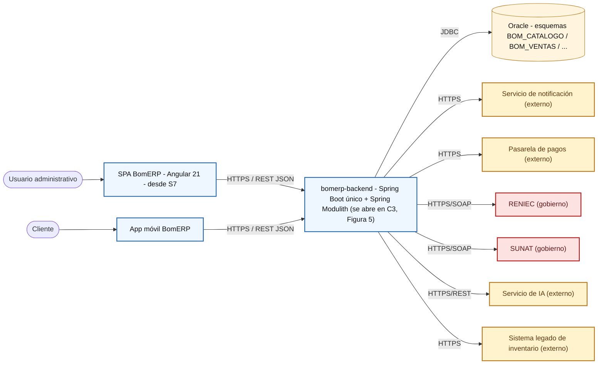

`Admin`, `Cliente` y los seis sistemas externos se repiten igual que en C1 — C2 no descarta el contexto, lo mantiene y le agrega detalle por dentro. Recién aquí aparece tecnología (Angular, JDBC, REST JSON) y protocolo de comunicación entre piezas, incluido el protocolo de cada integración externa (SOAP para RENIEC/SUNAT, REST para el servicio de IA — un detalle que C1 no necesita, pero C2 sí). Nota que `SPA` y `App` son dos contenedores distintos que llegan al **mismo** `bomerp-backend`, y que **todas** las integraciones externas pasan por ese único backend — ningún cliente (`SPA`/`App`) habla directo con RENIEC o la pasarela de pagos.

**Error frecuente**: llamar "contenedor" a una clase o a un paquete interno — un contenedor es algo que se ejecuta o se despliega de forma independiente (un proceso, una aplicación, una base de datos), no una unidad de código dentro de uno de ellos.

### 2.5 Vista de componentes (C3)

La **vista de componentes** abre **un** contenedor específico (no todos) y muestra sus piezas internas: agrupaciones de clases con una responsabilidad relacionada (un controller, un servicio, un repositorio, una fachada) — todavía no son clases individuales, eso es C4.

**Mismo ejemplo, dentro de `bomerp-backend`, con dos módulos reales de BomERP** (`catalogo` y `ventas`; mismo patrón que [c4model.com/diagrams/component](https://c4model.com/diagrams/component)):

**Figura 5. Vista de componentes (C3) — ejemplo de referencia (BomERP, módulos `catalogo` y `ventas`)**

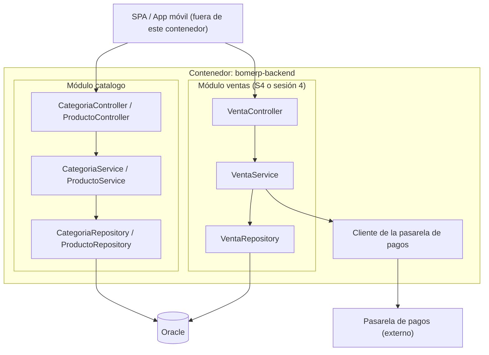

Los componentes internos de `bomerp-backend` (`CategoriaController`, `VentaService`, `VentaRepository`, etc.) no eran visibles en C2 (Figura 4) — ahí `bomerp-backend` era una sola caja. C3 abre esa caja y muestra esos componentes; el `subgraph` de **módulo** (`catalogo`, `ventas`) que los agrupa no es en sí un componente C4 — es una agrupación adicional que coincide con el límite que Spring Modulith verifica automáticamente con `ModularityTests` (ver ADR-002 de LP2), y se dibuja aquí solo para que se vea a qué módulo pertenece cada componente. `catalogo` ya existe hoy; `ventas` llega recién en S4 — aquí aparece para mostrar cómo se vería C3 con dos módulos.

**Adelanto de Domain-Driven Design (DDD, se profundiza en S6):** cada módulo de esta figura (`catalogo`, `ventas`) es candidato a ser un **bounded context** — un límite dentro del cual un término del negocio ("producto", "venta") tiene un solo significado, con su propio lenguaje ubicuo. `PagosCli` (el cliente de la pasarela de pagos, dentro de `ventas`) es un ejemplo de **anticorruption layer**: una capa que traduce entre el modelo interno de BomERP y el modelo externo de la pasarela, para que un cambio en la API de pagos no obligue a cambiar `VentaService`. No hace falta dominar estos términos hoy — basta con notar que los límites de módulo de C3 no son arbitrarios, ya anticipan una decisión de diseño de dominio.

**Error frecuente**: dibujar C3 para **todos** los contenedores del sistema — se dibuja solo para el/los contenedor(es) con complejidad interna real (como `bomerp-backend`, con varios módulos), no como rutina para cada uno.

### 2.6 Vista de código (C4)

La **vista de código** llega al nivel de clases e interfaces — el nivel más detallado del modelo, y el que casi nunca se dibuja a mano: se genera desde el código (por ejemplo, con herramientas como el `Documenter` de Spring Modulith que ya usa LP2), porque mantenerlo sincronizado manualmente con cada cambio del código es prácticamente imposible.

**Mismo ejemplo, con clases reales de LP2** (dentro del componente `ProductoService` de `catalogo`; mismo patrón que [c4model.com/diagrams/code](https://c4model.com/diagrams/code)):

**Figura 6. Vista de código (C4) — ejemplo de referencia (BomERP, `ProductoService`)**

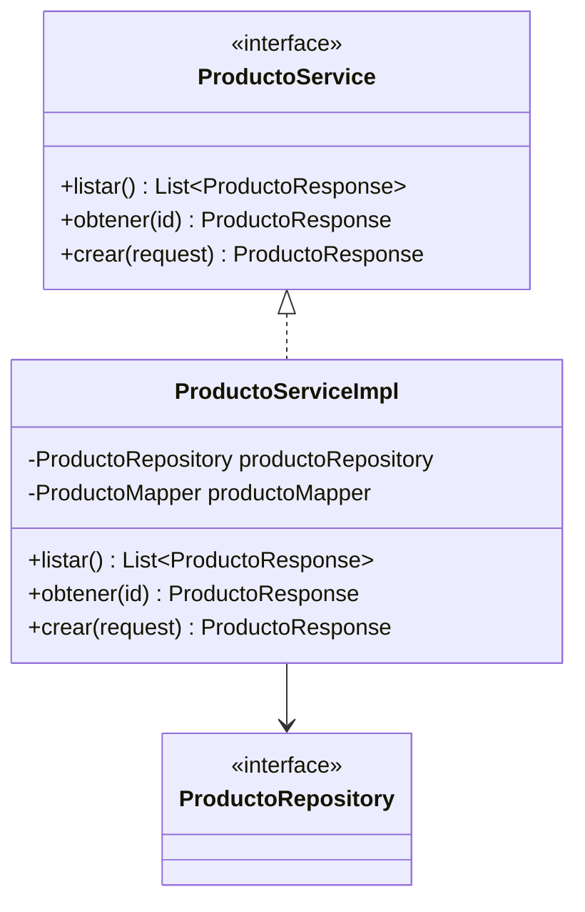

`ProductoService` (la interfaz) es el componente que ya apareció como una sola caja en C3 (Figura 5, dentro de `catalogo`); `ProductoServiceImpl` es su implementación concreta — clases reales del backend de LP2 (S2). Este nivel de detalle rara vez aporta valor dibujado a mano: la mayoría de equipos profesionales lo genera automáticamente y solo lo revisa cuando algo específico lo amerita.

No es un diagrama por capas (presentación/negocio/datos) ni un diagrama de entidades de todo el dominio: C4-código hace zoom a **un solo componente elegido** (el que ya se abrió en C3) y muestra sus clases e interfaces internas. Un diagrama de entidades de todo el esquema (`Producto`, `Categoria`, `Venta`, ...) es otro artefacto — un diagrama de clases/dominio UML — fuera del alcance de C4; los ejemplos oficiales de [c4model.com/diagrams/code](https://c4model.com/diagrams/code) también acotan a un solo componente.

**Error frecuente**: dibujarlo a mano para "completar" el modelo — si nadie lo va a mantener sincronizado con el código real, un diagrama C4 desactualizado es peor que no tenerlo (documentación que miente).

### 2.7 Vista de despliegue

La **vista de despliegue** agrega dónde corre físicamente cada contenedor: qué servidor, qué contenedor Docker, qué región de nube — la infraestructura real detrás de las cajas lógicas de C2.

**Mismo ejemplo, con la infraestructura real que LP2 ya construyó** (escalamiento horizontal, LP2 S1 3.3; mismo patrón que [c4model.com/diagrams/deployment](https://c4model.com/diagrams/deployment)):

**Figura 7. Vista de despliegue — ejemplo de referencia (BomERP, escalamiento horizontal)**

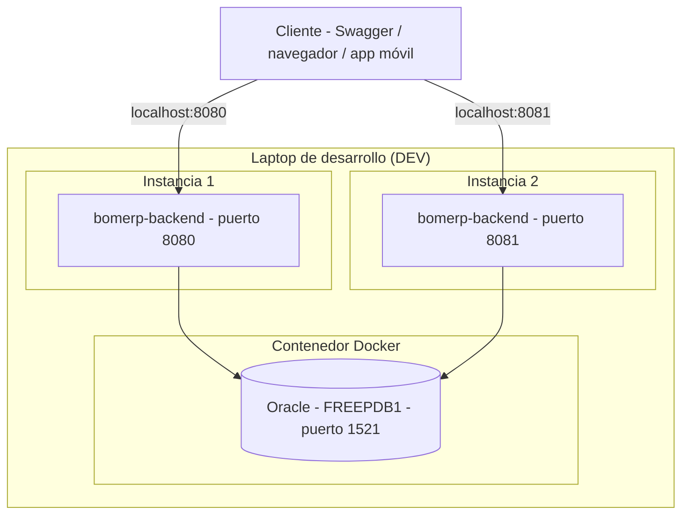

`bomerp-backend` es un solo contenedor en C2 (Figura 4), pero aquí se ve corriendo en **dos** instancias físicas distintas (puerto 8080 y 8081) — la vista de despliegue muestra cuántas copias existen y dónde, algo que C2 no representa. Esto no es hipotético: es exactamente lo que LP2 ya construyó y probó en S1 (3.3).

**Error frecuente**: confundir la vista de despliegue con C2 — C2 muestra **qué** contenedores existen (lógico); despliegue muestra **dónde** corren físicamente (infraestructura). Un mismo contenedor puede tener varias instancias desplegadas, como en este ejemplo.

**Nota de alcance:** C3 se retoma en S3 (diseño estructural) al evaluar los módulos de LP2 con SOLID; la vista de despliegue se retoma en S4 (arquitecturas modernas, escalabilidad horizontal). Los tres ejemplos de arriba son de referencia — algunos ya son reales (C3 con `catalogo`, C4 con `ProductoService`, despliegue), otros hipotéticos (`ventas`, app móvil, pasarela de pagos) para completar el patrón; ninguno es tarea de esta sesión.

### 2.8 Relación entre C4 y UML

C4 y UML no compiten: C4 organiza los **niveles de zoom** de la arquitectura (de qué tamaño es la caja que estoy dibujando), mientras que UML aporta el **vocabulario de diagramas** dentro de cada nivel (por ejemplo, un diagrama de despliegue UML puede usarse para detallar la vista de despliegue de C4). Esta relación se profundiza en S9 (diagramas dinámicos UML).

**Ejemplo: el mismo componente `ProductoService` (Figura 12, C4), visto ahora como diagrama de secuencia** — objetos concretos intercambiando mensajes en orden temporal, con una rama de éxito y una de error; eso es UML, no C4 (C4 no muestra orden de mensajes ni ramas; solo estructura estática). Clases reales de LP2 S02 (`ProductoMapper`, `ProductoRequest`/`ProductoResponse`, `GlobalExceptionHandler`, `CorrelationIdFilter`) — documentadas en la guía de LP2 S02, aunque a la fecha de esta sesión todavía no todas están implementadas en el repositorio (`ProductoMapper` y el DTO de entrada quedan pendientes, ver LP2 S02 3.2-3.4):

**Figura 8. Diagrama de secuencia UML — `POST /productos` (no C4)**

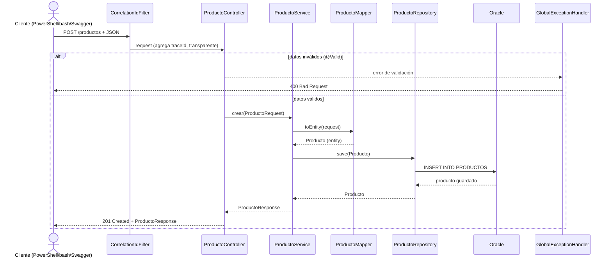

`alt`/`else` es la notación UML para una rama condicional ("si/sino") dentro de un diagrama de secuencia: solo uno de los dos bloques se ejecuta en cada petición real, nunca los dos. Aquí, `alt datos inválidos (@Valid)` es la rama que responde 400 cuando la validación falla; `else datos válidos` es la que realmente crea el producto y responde 201.

El controller entra y sale por DTO, nunca por la entidad directa; `GlobalExceptionHandler` intercepta el error sin que el controller lo llame explícitamente — Spring lo enruta ahí solo porque la excepción se lanzó dentro de la petición. La diferencia con la Figura 12 (C4, sección 3): esa muestra **estructura** (qué depende de qué, siempre); esta muestra **comportamiento** (el orden exacto de mensajes para un caso concreto, con su rama de error) — esa distinción, y más diagramas de secuencia como este, se retoman en S9.

El diagrama de secuencia es solo uno de los diagramas UML disponibles para complementar C4 — no el único, y ninguno es obligatorio por rutina: se dibuja el que haga falta, solo en la medida que se requiera para entender el problema puntual que se está explicando, igual que C3/C4 no se dibujan para cada contenedor "por si acaso" (ver 2.1). Según qué se necesite explicar, se usan por ejemplo:

- **Diagrama de clases**: estructura estática de clases/interfaces con sus atributos, métodos y relaciones — es, de hecho, la notación que ya usó C4-código (Figura 12).
- **Diagrama de entidad-relación**: modelo de datos completo (tablas, claves primarias/foráneas, cardinalidad) — el que BD2 ya trabaja sobre `BOM_CATALOGO` desde S1.
- **Diagrama de estados**: los estados posibles de un objeto y qué evento dispara cada transición (por ejemplo, una venta pasando de `ACTIVA` a `ANULADA` — regla que BD2 implementa en `BOM_VENTAS` recién en S4, ver [BD2 - Producto de Unidad 1](../../proyecto-integrador/u1/bd2-producto.md)).
- **Diagrama de actividad**: el flujo de un proceso de negocio con decisiones y pasos paralelos — más cercano a un algoritmo o proceso que a objetos concretos intercambiando mensajes (a diferencia del de secuencia).
- **Diagrama de casos de uso**: quién (actor) puede hacer qué con el sistema, a alto nivel — el más cercano a C1, pero desde la perspectiva de acciones del usuario, no de sistemas.

Cada uno responde una pregunta distinta: secuencia responde "¿en qué orden se llaman los objetos?", clases responde "¿qué depende de qué?", estados responde "¿qué puede pasarle a este objeto a lo largo del tiempo?", actividad responde "¿cómo fluye este proceso de negocio?". Elegir el diagrama correcto para la pregunta que se quiere responder es tan importante como saber dibujarlo — se retoma con más detalle en S9.

## 3. Aplica: actividad práctica guiada

Tiempo: 2h.

**Actividad:** elaboración guiada de las vistas C1 (contexto), C2 (contenedores) y una primera versión de C3 (componentes) y C4 (código) de BomERP (Producto de la sesión en 1.4).

**Propósito de la actividad:** construir las vistas C1, C2, C3 y C4 de BomERP a partir del dominio, stakeholders y bosquejo arquitectónico de S1, documentando los elementos de cada vista en tabla antes de dibujar el diagrama.

**Orientaciones metodológicas:** en el laboratorio, el docente elabora C1, C2, C3 y C4 de BomERP paso a paso frente a la clase; los estudiantes completan las mismas tablas y diagramas para el dominio de su propio proyecto de equipo (ver sección 4).

**A diferencia del ejemplo extendido de 2.3-2.7** (que agregaba app móvil, pasarela de pagos y un segundo módulo `ventas` para mostrar el patrón completo), aquí se dibuja la versión **real y actual** de BomERP — solo lo que el proyecto tiene hoy, sin piezas hipotéticas. Por eso C3 y C4 aquí son una **propuesta inicial**, no la versión definitiva: hoy solo existe el módulo `catalogo`; cuando LP2 sume `ventas` (S4) y más adelante otros módulos, esta misma C3 se amplía, y C4 se dibuja para cada componente nuevo que lo amerite.

**Actividades para realizar:**

- **3.1** Identificar los elementos de la vista de contexto (C1).
- **3.2** Dibujar la vista de contexto (C1).
- **3.3** Identificar los elementos de la vista de contenedores (C2).
- **3.4** Dibujar la vista de contenedores (C2).
- **3.5** Identificar los elementos de la vista de componentes (C3).
- **3.6** Dibujar la vista de componentes (C3).
- **3.7** Identificar los elementos de la vista de código (C4).
- **3.8** Dibujar la vista de código (C4).
- **3.9** Relacionar con LP2 y BD2.

### 3.1 Identificar los elementos de la vista de contexto (C1)

**Producto del paso:** tabla de elementos de C1.

**Requisito antes de continuar:** ten a la mano la Tabla 2 (dominio técnico) y la Tabla 3 (mapa de stakeholders) de S1 — C1 se construye directamente a partir de ellas, no desde cero.

**Tabla 2. Elementos de la vista de contexto (C1) de BomERP**

| Elemento | Tipo | Descripción |
|---|---|---|
| Usuario administrativo | Persona | Gestiona catálogo y ventas |
| Cliente | Persona | Compra y paga en línea |
| BomERP | Sistema (el propio) | Sistema empresarial (Business Operations Management) |
| Pasarela de pagos | Sistema externo | Procesa el pago de una venta |

### 3.2 Dibujar la vista de contexto (C1)

**Producto del paso:** diagrama C1 de BomERP.

**Figura 9. Vista de contexto (C1) de BomERP**

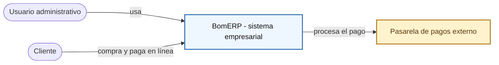

Sin tecnología, sin contenedores internos: BomERP es una sola caja. El detalle interno aparece recién en C2.

### 3.3 Identificar los elementos de la vista de contenedores (C2)

**Producto del paso:** tabla de elementos de C2.

**Tabla 3. Elementos de la vista de contenedores (C2) de BomERP**

| Contenedor | Tecnología | Responsabilidad |
|---|---|---|
| SPA BomERP | Angular 21 (desde S7) | Interfaz de usuario del catálogo y ventas |
| `bomerp-backend` | Spring Boot único, Spring Modulith | API REST modular (LP2) |
| Oracle | Oracle Database Free 23ai | Persistencia por esquemas funcionales (BD2) |

### 3.4 Dibujar la vista de contenedores (C2)

**Producto del paso:** diagrama C2 de BomERP.

**Figura 10. Vista de contenedores (C2) de BomERP**

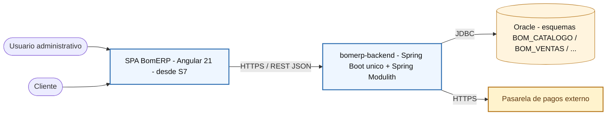

`bomerp-backend` es un solo contenedor, no uno por módulo de negocio — los módulos (`catalogo`, `ventas`, ...) son componentes internos (C3), no contenedores separados; eso es justamente lo que distingue el monolito modular de LP2 de una arquitectura de microservicios (ver Tabla 5 de S1).

### 3.5 Identificar los elementos de la vista de componentes (C3)

**Producto del paso:** tabla de elementos de C3.

**Tabla 4. Elementos de la vista de componentes (C3) de BomERP — contenedor `bomerp-backend`**

| Componente | Tipo | Responsabilidad |
|---|---|---|
| CategoriaController / ProductoController | Controller | Expone los endpoints REST del catálogo |
| CategoriaService / ProductoService | Service | Lógica de negocio del catálogo |
| CategoriaRepository / ProductoRepository | Repository | Acceso a datos vía Spring Data JPA |

Solo el módulo `catalogo` existe hoy en código real; `ventas` (Figura 5, sección 2) llega en S4 — por eso esta tabla tiene un único módulo, a diferencia del ejemplo extendido. La tabla lista solo **componentes** (Controller/Service/Repository, con contrato propio); DTO y Entity no son componentes — son las formas de dato que cruzan cada frontera, y se marcan en el diagrama (Figura 11) sin ser una fila más aquí.

### 3.6 Dibujar la vista de componentes (C3)

**Producto del paso:** diagrama C3 de BomERP.

**Figura 11. Vista de componentes (C3) de BomERP — módulo `catalogo`**

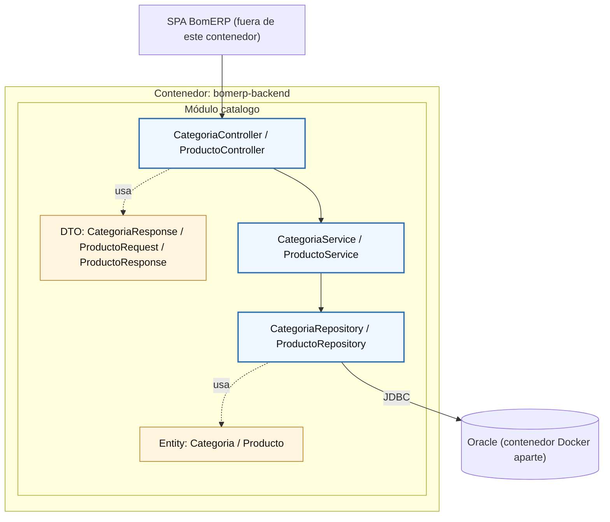

Un solo módulo por ahora. Cuando LP2 llegue a `ventas` (S4), esta vista se amplía con un segundo `subgraph` al lado de `catalogo` — mismo patrón que el ejemplo con dos módulos de la Figura 5 (sección 2).

`CatDTO` y `CatEntity` (en amarillo, distintos de los componentes en azul) son las clases de datos que cada componente usa: el `Controller` recibe/devuelve DTO en el cuerpo HTTP, el `Repository` persiste y lee Entity — pero quien ejecuta la conexión real (JDBC) contra Oracle es el `Repository`, no el `Entity`; el `Entity` es una clase pasiva sin lógica de conexión propia. Por eso `CatEntity` va con línea punteada ("usa"), y la única flecha sólida hacia `DB` sale de `CatRepo`. Oracle no vive dentro de `bomerp-backend`: corre en su propio contenedor Docker (`bomerp-oracle`, ver C2 y BD2 S1), fuera del contenedor que abre esta vista C3.

### 3.7 Identificar los elementos de la vista de código (C4)

**Producto del paso:** tabla de elementos de C4.

**Tabla 5. Elementos de la vista de código (C4) de BomERP — componente `CategoriaService` / `ProductoService`**

| Clase / Interfaz | Tipo | Responsabilidad |
|---|---|---|
| `ProductoService` | Interfaz | Contrato del servicio de catálogo (productos) |
| `ProductoServiceImpl` | Clase | Implementación real; depende de `ProductoRepository` y `ProductoMapper` |
| `ProductoRepository` | Interfaz (Spring Data JPA) | Acceso a datos de `PRODUCTOS`, gestiona la entidad `Producto` |
| `Producto` | Entidad JPA | Datos de un producto (`id`, `nombre`, `precio`, `stock`) |
| `CategoriaService` | Interfaz | Contrato del servicio de catálogo (categorías) |
| `CategoriaServiceImpl` | Clase | Implementación real; depende de `CategoriaRepository` |
| `CategoriaRepository` | Interfaz (Spring Data JPA) | Acceso a datos de `CATEGORIAS`, gestiona la entidad `Categoria` |
| `Categoria` | Entidad JPA | Datos de una categoría (`id`, `nombre`, `descripcion`) |

Las **entidades** (`Producto`, `Categoria`) no son componentes de C3 — no exponen una interfaz/contrato propio, son estructuras de datos que el `Repository` gestiona. Por eso en la Tabla 4/Figura 11 (C3) aparecieron solo como anotación de datos (`CatEntity`, en amarillo), no como fila de la tabla de componentes; aquí en C4 se abren como clases reales con sus atributos, junto al resto.

### 3.8 Dibujar la vista de código (C4)

**Producto del paso:** diagrama C4 de BomERP.

**Figura 12. Vista de código (C4) de BomERP — componentes `CategoriaService` y `ProductoService`**

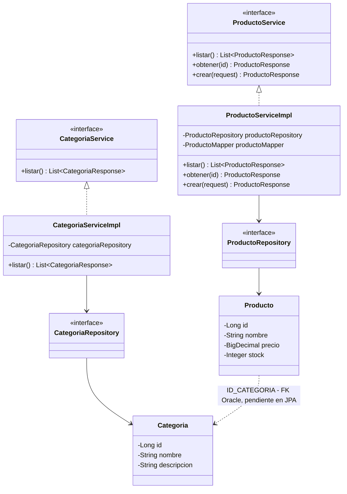

Mismo patrón que el ejemplo de 2.6 (Figura 6) — pero aquí ya no es "ejemplo": son las clases reales de `lp2/bomerp-backend` a la fecha, y esta figura es el producto entregable de la sesión, no una ilustración. Ahora sí se abren **los dos** servicios que en C3 (Figura 11) aparecían fusionados en una sola caja (`CategoriaController / ProductoController`, `CategoriaService / ProductoService`) — C4 es donde esa fusión se separa en clases reales.

ADS no se limita a copiar el código de LP2 tal cual está hoy: la relación `Producto` → `Categoria` **sí existe** a nivel de esquema (`FK_PRODUCTO_CATEGORIA` sobre `ID_CATEGORIA`, ver `S01_02_tablas.sql` de BD2), así que el diagrama la dibuja — con línea punteada (`..>`), distinta de las líneas sólidas del resto, para marcar que todavía no está mapeada como `@ManyToOne` en la entidad `Producto.java`. Ese vacío entre el esquema real y el código real es exactamente el tipo de "error o hallazgo" que se documenta en la evidencia (4.3.1).

### 3.9 Relacionar con LP2 y BD2

**Producto del paso:** matriz de integración de la sesión.

**Tabla 6. Matriz de integración ADS-BD2-LP2 (S2)**

| Elemento C2 | Evidencia esperada en BD2 | Evidencia esperada en LP2 |
|---|---|---|
| Contenedor `bomerp-backend` | Esquema `BOM_CATALOGO` conectado (S1) | Proyecto Spring Boot único, ejecutable (S1) |
| Conexión `API -> Oracle` (JDBC) | Usuario técnico `BOMERP_APP` con permisos mínimos (S1) | `application-dev.yml` con `datasource` configurado (S1) |
| Contenedor SPA BomERP | — | Previsto desde S7, sin implementar todavía |
| Componentes de C3/C4 (`ProductoService`, `ProductoRepository`, ...) | Tablas `BOM_CATALOGO.CATEGORIAS`/`PRODUCTOS` accedidas por `ProductoRepository` (S1) | Clases reales de `catalogo` (S1-S2) |

Sesión equivalente en los otros dos cursos, misma semana: [BD2 - S2 Triggers DML y Auditoría](../../bd2/sesiones/S02_Triggers_DML_Auditoria.md) y [LP2 - S2 CRUD REST Completo de Producto](../../lp2/sesiones/S02_CRUD_REST_Completo_Producto.md).

**Evidencia de aprendizaje:**

- Vista de contexto (C1) de BomERP, con su tabla de elementos.
- Vista de contenedores (C2) de BomERP, con su tabla de elementos.
- Vista de componentes (C3) de BomERP, con su tabla de elementos — primera versión.
- Vista de código (C4) de BomERP, con su tabla de elementos — primera versión.
- Matriz de integración con BD2 y LP2.

## 4. Crea: actividad autónoma

Tiempo: 2h fuera del aula.

### 4.1 Actividad

Elaboración autónoma de las vistas C1, C2 y una primera versión de C3 y C4 del proyecto propio del equipo, documentada en evidencia individual.

Completa y evidencia estas tareas:

1. Identificar los elementos de la vista de contexto (C1): personas y sistemas externos.
2. Dibujar la vista de contexto (C1).
3. Identificar los elementos de la vista de contenedores (C2): contenedores y tecnología.
4. Dibujar la vista de contenedores (C2).
5. Identificar los elementos de la vista de componentes (C3) del contenedor con más lógica interna.
6. Dibujar la vista de componentes (C3) — primera versión, con los módulos/componentes que ya existan en código.
7. Identificar los elementos de la vista de código (C4) de un componente puntual.
8. Dibujar la vista de código (C4) de ese componente — primera versión.
9. Explicar en una tabla cómo se conecta cada contenedor con BD2 y LP2.

### 4.2 Propósito

Que cada estudiante demuestre, de forma individual y fuera del aula, que puede reproducir el patrón de modelado C4 construido en clase sin el acompañamiento del docente.

Cada estudiante consolida las vistas C1, C2, C3 y C4 del proyecto propio.

### 4.3 Indicaciones

Entrega un PDF con el siguiente nombre:

```text
S02_ADS_Equipo##_ApellidoNombre.pdf
```

Cada captura de pantalla del informe debe mostrar, sin recortar, el reloj del sistema (fecha y hora) y tu usuario o foto de perfil (Windows, VS Code o navegador) visibles en pantalla — es lo que permite verificar que la evidencia es tuya y que corresponde al momento real de tu trabajo.

#### 4.3.1 Estructura del informe

**Datos del estudiante**

- Nombre:
- Equipo:
- Sesión: S02 - Modelo C4 y Vistas Arquitectónicas
- Rol o aporte realizado:
- Link de GitHub:

**Evidencia técnica**

Incluye capturas o diagramas con una breve explicación debajo de cada uno, organizados en los mismos 6 bloques de la rúbrica (4.6) — así queda claro qué evidencia corresponde a cada criterio evaluado:

1. *Vista de contexto (C1)*
    - Tabla de elementos de C1.
    - Diagrama C1.
2. *Vista de contenedores (C2)*
    - Tabla de elementos de C2.
    - Diagrama C2.
3. *Vista de componentes (C3) — primera versión*
    - Tabla de elementos de C3.
    - Diagrama C3.
4. *Vista de código (C4) — primera versión*
    - Tabla de elementos de C4.
    - Diagrama C4.
5. *Coherencia con la arquitectura de S1*
    - Explicación de cómo C1/C2/C3/C4 reflejan las decisiones y el bosquejo de S1.
6. *Integración con BD2 y LP2*
    - Matriz de integración de la sesión.

**Error o hallazgo**

Describe al menos un error o hallazgo: un elemento mal ubicado en el nivel equivocado (por ejemplo, tecnología en C1, o una clase tratada como contenedor), qué lo causó y cómo lo corregiste.

**Reflexión técnica breve**

Responde en 5 a 8 líneas:

```text
¿Por qué separar C1 y C2 en dos diagramas distintos, en vez de mostrar todo en uno solo?
```

**Anexo: Feedback de la sesión**

Pega esta página como la última hoja del PDF, con tus respuestas.

1. ¿Cuál es el aprendizaje más importante que te llevas de la clase de hoy?
2. ¿Qué punto de la clase te resultó más confuso o te dejó con dudas?
3. ¿Tienes alguna pregunta que te gustaría que sea respondida la siguiente clase?
4. Sobre tu nivel de comprensión de la clase de hoy, marca una opción:
    - ¡Entendido! - Lo domino y podría explicarlo.
    - Más o menos. - Entendí la idea general, pero tengo dudas.
    - Necesito ayuda. - Me siento perdido/a con este tema.
5. ¿Cómo puedo ayudarte a comprender mejor el tema?
6. Pensando en tu participación y esfuerzo en la clase de hoy, ¿cómo te autoevaluarías? Marca una opción:
    - Muy Comprometido/a: Me esforcé al máximo.
    - Comprometido/a: Sé que podría haberme esforzado un poco más.
    - Poco Comprometido/a: Hoy no di mi mejor esfuerzo.
7. Mi satisfacción con la clase fue... (califica del 1 al 10, donde 1 es insatisfecho y 10 es muy satisfecho).

### 4.4 Criterios mínimos de aceptación

La evidencia individual se considera completa si:

- El archivo respeta el nombre solicitado.
- Presenta la vista de contexto (C1) con personas y sistemas externos identificados.
- Presenta la vista de contenedores (C2) con tecnología por contenedor.
- Presenta una primera versión de la vista de componentes (C3) del contenedor con más lógica interna.
- Presenta una primera versión de la vista de código (C4) de un componente puntual.
- No mezcla niveles de abstracción (tecnología en C1, clases tratadas como contenedores en C2, o módulos tratados como componentes en C3).
- Explica la relación de cada contenedor con BD2 y LP2.
- Cada captura de la evidencia técnica muestra el reloj del sistema y el usuario/perfil visible, sin recortar.
- Las fechas y horas de las capturas son coherentes con el historial de commits de su repositorio en GitHub.
- Incluye un error o hallazgo técnico diagnosticado.
- Incluye la reflexión técnica breve solicitada.
- Incluye el Anexo de feedback de la sesión respondido, como última página del PDF.

### 4.5 Preguntas de defensa

1. ¿Por qué la tecnología no debe aparecer en C1?
2. ¿Qué diferencia hay entre un contenedor y un componente?
3. ¿Qué sistema externo identificaste y por qué no es un contenedor propio?
4. ¿Por qué tu C3 y C4 son una "primera versión" y no la definitiva? ¿Qué tendría que pasar en tu proyecto para que cambien?

### 4.6 Rúbrica de evaluación

**Tabla 7. Rúbrica de evaluación**

| Criterio | Peso (%) | A (20 pts) | B (15 pts) | C (10 pts) | D (5 pts) | Nivel obtenido |
|---|---:|---|---|---|---|---:|
| 1. Vista de contexto (C1)* | 15 | C1 correcta: personas y sistemas externos claros, sin tecnología ni contenedores internos. | C1 comprensible, con algún elemento fuera de nivel. | C1 incompleta o con varios elementos fuera de nivel. | No presenta C1. | |
| 2. Vista de contenedores (C2)* | 15 | C2 correcta: contenedores reales con tecnología y comunicación entre ellos bien definida. | C2 comprensible, con detalles menores. | C2 incompleta o con contenedores mal definidos. | No presenta C2. | |
| 3. Vista de componentes (C3)* | 20 | C3 correcta: componentes reales del contenedor con más lógica interna, sin mezclar con módulos ni contenedores. | C3 comprensible, con algún componente fuera de nivel. | C3 incompleta o con componentes mal definidos. | No presenta C3. | |
| 4. Vista de código (C4)* | 20 | C4 correcta: clases/interfaces reales de un componente puntual, con sus relaciones bien representadas. | C4 comprensible, con detalles menores. | C4 incompleta o con relaciones mal representadas. | No presenta C4. | |
| 5. Coherencia con la arquitectura de S1* | 15 | C1/C2/C3/C4 reflejan con claridad el dominio, stakeholders y bosquejo de S1. | Coherencia parcial con S1. | Poca relación con las decisiones de S1. | Sin relación con S1. | |
| 6. Integración con BD2 y LP2* | 15 | Matriz de integración clara, con evidencia esperada específica por curso. | Matriz presente, con vaguedad menor. | Matriz incompleta o genérica. | No presenta matriz. | |

\* Agregado manual.

Nota final = suma de (`Peso` / 100 × `Puntos del nivel obtenido`) = ____ / 20.

Para usar la rúbrica con IA, solicita:

```text
Evalúa el PDF usando la rúbrica de la sesión.
Para cada criterio selecciona el nivel obtenido usando la escala A=20, B=15, C=10, D=5 puntos.
Justifica brevemente cada nivel asignado.
Verifica que cada captura muestre reloj del sistema y usuario/perfil visible, y que las fechas sean coherentes con el historial de commits de GitHub. Si falta esta evidencia o hay inconsistencias, indícalo explícitamente antes de calificar.
Calcula la nota final con la fórmula: suma de (Peso/100 × Puntos del nivel obtenido), directamente sobre 20.
Indica 2 fortalezas y 2 recomendaciones.
```

## 5. Cierre

Tiempo: 5 min.

**Resumen breve:** hoy el bosquejo arquitectónico de S1 se formalizó en cuatro vistas C4 concretas — contexto (C1), contenedores (C2), componentes (C3) y código (C4) — estas dos últimas como primera versión, dejando ubicada conceptualmente la vista de despliegue para cuando la arquitectura la necesite.

**Dinámica participativa:** en una ronda rápida (o con una herramienta digital tipo formulario o encuesta en vivo), cada estudiante comparte en una frase qué contenedor de su proyecto le costó más ubicar correctamente.

**Metacognición:** cada estudiante responde el Anexo de feedback de la sesión, incluido en su evidencia individual (ver 4.3.1). El docente analiza esas respuestas con IA para identificar temas recurrentes o dudas comunes del equipo, y con esos indicadores construye el cierre real de la sesión — que se entrega al inicio de S3, no al final de esta clase.

**Proyección:** C1, C2, C3 y C4 de hoy son la base sobre la que S3 refina C3 evaluando los módulos de LP2 con SOLID, y S4 explora estilos arquitectónicos más avanzados (incluida la vista de despliegue) — el mismo modelo C4, cada vez con más detalle.

## Bibliografía

1. Brown, S. (2024). *The C4 model for visualising software architecture*. https://c4model.com/
2. Brown, S. (2024). *C4 model - The four levels (diagrams overview)*. https://c4model.com/diagrams
3. Brown, S. (2024). *C4 model - Context diagram*. https://c4model.com/diagrams/system-context
4. Brown, S. (2024). *C4 model - Container diagram*. https://c4model.com/diagrams/container
5. Brown, S. (2024). *C4 model - Component diagram*. https://c4model.com/diagrams/component
6. Brown, S. (2024). *C4 model - Code diagram*. https://c4model.com/diagrams/code
7. Brown, S. (2024). *C4 model - Deployment diagram*. https://c4model.com/diagrams/deployment
