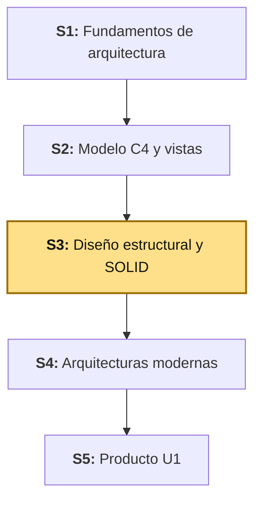
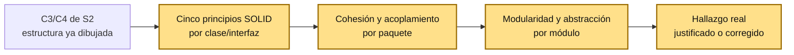

# S3 - Diseño Estructural y Principios SOLID

## 1. Introducción

Tiempo: 20 min.

### 1.1 Presentación de la sesión

En S2, la Figura 12 (C4) dejó una nota pendiente: la relación `Producto` → `Categoria` existe en el esquema Oracle (`ID_CATEGORIA`, `FK_PRODUCTO_CATEGORIA`, ver BD2 S1) pero todavía no estaba mapeada como `@ManyToOne` en el código real de LP2 — un vacío marcado explícitamente como "error o hallazgo" en esa sesión. Esta semana LP2 (S3) cerró exactamente ese vacío: `Producto` ya tiene la asociación, `Categoria` completó su CRUD, y ambos módulos usan MapStruct para el mapeo. Esta sesión no diseña nada nuevo — **evalúa** ese código real (`catalogo/categoria`, `catalogo/producto`) contra los principios SOLID, cohesión, acoplamiento, modularidad y abstracción, y documenta qué cumple, qué es una tensión de diseño válida, y qué sería una violación real si apareciera.

### 1.2 Índice

1. Principios SOLID: qué resuelven y por qué importan.
2. Cohesión y acoplamiento.
3. Modularidad y abstracción.
4. Evaluación de los módulos reales de LP2 (`categoria`, `producto`) contra estos criterios.

### 1.3 Propósito de aprendizaje

Al concluir la clase, estarás en condiciones de:

- **Evaluar** un módulo de software real contra los cinco principios SOLID, su cohesión, su acoplamiento y su nivel de abstracción, distinguiendo una tensión de diseño justificada de una violación real.

### 1.4 Producto de sesión

Evaluación documentada de `catalogo/categoria` y `catalogo/producto` (LP2, código real a la fecha de esta sesión) contra SOLID, cohesión, acoplamiento, modularidad y abstracción, con al menos un hallazgo real identificado y su justificación o su corrección propuesta.

### 1.5 Metodología

**Tabla 1. Metodología de la sesión**

| Actividades a Realizar en el Periodo | Orientaciones generales (Orientaciones Metodológicas) | Material de estudio recomendado |
|---|---|---|
| Revisión previa individual | Repasar la vista C3/C4 de S2 (Figuras 11-12) y el código real de `lp2/bomerp-backend/.../catalogo/`. Trabajo individual, antes de clase; identificar qué clases existen hoy en cada paquete. | S2 (Tabla 4, Tabla 5), `lp2/bomerp-backend/src/main/java/.../catalogo/`. |
| Clase presencial | Evaluación guiada de `categoria` y `producto` contra los cinco principios SOLID, cohesión, acoplamiento, modularidad y abstracción. Trabajo individual, siguiendo al docente paso a paso; consulta inmediata ante dudas sobre si algo es una violación real o una tensión aceptable. | Pasos 3.1 a 3.7 de esta guía, código real de LP2. |
| Evaluación formativa | Revisión en clase de la tabla de evaluación SOLID y de los hallazgos identificados. La evidencia se completa y sustenta de forma individual, fuera del aula, según los criterios mínimos de la sección 4.4. | Indicaciones de entrega (4.3), rúbrica de evaluación (4.6). |

### 1.6 Motivación de la sesión

#### 1.6.1 Caso: el vacío que S2 encontró y S3 evalúa

En S2 (Figura 12), el diagrama de código dibujó `Producto ..> Categoria` con línea punteada, marcando explícitamente que la relación existía en Oracle pero no en el código Java. Esa nota no era un adorno: era una predicción de que, cuando LP2 cerrara ese vacío, el diseño resultante tendría que evaluarse — ¿la forma en que se resolvió respeta SOLID, o introdujo acoplamiento innecesario entre `categoria` y `producto`?

LP2 (S3, esta misma semana) resolvió el vacío: `Producto` ahora tiene `@ManyToOne`/`@JoinColumn("ID_CATEGORIA")` hacia `Categoria`, `ProductoServiceImpl` valida que el `categoriaId` recibido exista antes de guardar, y `ProductoResponse` embebe un `CategoriaResumen` (no la entidad `Categoria` completa). Esta sesión evalúa exactamente esa solución real, no un ejemplo hipotético.

**Preguntas de análisis**

**Activación de conocimientos previos**

1. Antes de revisar el código real, ¿qué esperarías que pasara si `ProductoServiceImpl` importara directamente `CategoriaRepository` y llamara a un método interno suyo en vez de pasar por `CategoriaService`?
2. ¿Qué principio SOLID (de los cinco) crees que es el más fácil de violar sin darte cuenta al agregar una asociación entre dos entidades?

**Comprensión de SOLID aplicado**

1. `ProductoServiceImpl` ahora depende de `CategoriaRepository` (no de `CategoriaService`) para validar el `categoriaId`. ¿Es esto una violación de algún principio, o una decisión aceptable? Justifica con el criterio de cohesión/acoplamiento de 2.3.
2. ¿Por qué `ProductoResponse` embebe `CategoriaResumen` y no la entidad `Categoria` completa? Relaciónalo con abstracción (2.4).

### 1.7 Ubicación en el curso

- Unidad: U1 - Arquitectura y Diseño Estructural.
- Producto del curso: Diseño Técnico Profesional Documentado.
- Producto de unidad: arquitectura documentada mediante vistas arquitectónicas y principios de diseño aplicados.
- Avance del producto en esta sesión: evaluación SOLID/cohesión/acoplamiento de los módulos reales de LP2, con hallazgos documentados.

Roadmap del producto de la unidad:

**Figura 1. Roadmap del producto de la unidad**



## 2. Explica

Tiempo: 25 min.

### 2.1 Arquitectura de la sesión

**Figura 2. De C3/C4 (S2) a la evaluación SOLID (S3)**



Esta sesión no dibuja una vista nueva: toma la estructura que C3/C4 (S2) ya documentó y la somete a un criterio de calidad distinto — no "¿está bien dibujado?", sino "¿está bien diseñado?".

### 2.2 Principios SOLID

**Tabla 2. Los cinco principios SOLID**

| Principio | Pregunta que responde | Señal de violación |
|---|---|---|
| **S** — Responsabilidad única (*Single Responsibility*) | ¿Esta clase tiene una sola razón para cambiar? | Una clase que valida, persiste y formatea salida al mismo tiempo. |
| **O** — Abierto/cerrado (*Open/Closed*) | ¿Puedo extender el comportamiento sin modificar código existente? | Agregar un caso nuevo obliga a editar un `if`/`switch` ya existente en vez de agregar una clase nueva. |
| **L** — Sustitución de Liskov (*Liskov Substitution*) | ¿Cualquier implementación de una interfaz puede reemplazar a otra sin romper nada? | Una implementación que lanza una excepción no documentada por el contrato, o que exige un estado adicional que otras no necesitan. |
| **I** — Segregación de interfaces (*Interface Segregation*) | ¿La interfaz expone solo lo que el cliente necesita? | Una interfaz con métodos que la mayoría de sus clientes no usa nunca. |
| **D** — Inversión de dependencias (*Dependency Inversion*) | ¿La clase depende de abstracciones (interfaces) o de implementaciones concretas? | Un `service` que hace `new AlgoRepositoryImpl()` en vez de recibir `AlgoRepository` inyectado. |

Los cinco principios no son reglas aisladas: **S** evita que una clase crezca sin control, **O**/**L** garantizan que se pueda extender sin romper lo existente, **I** evita interfaces infladas, y **D** es el que hace posible **O** y **L** en la práctica — sin depender de abstracciones, no hay forma de sustituir una implementación por otra sin tocar el código que la usa.

### 2.3 Cohesión y acoplamiento

**Cohesión**: qué tan relacionado está lo que vive *dentro* de un mismo paquete o clase. Alta cohesión = todo lo que está junto tiene un propósito común.

**Acoplamiento**: qué tan dependiente es una parte del sistema de los detalles internos de otra. Bajo acoplamiento = un cambio interno en A no obliga a cambiar B.

**Tabla 3. Cohesión y acoplamiento, en una frase**

| | Alta cohesión / bajo acoplamiento (deseable) | Baja cohesión / alto acoplamiento (evitar) |
|---|---|---|
| Cohesión | Un paquete `producto/` que solo contiene clases sobre `Producto`. | Un paquete `utils/` con validación, formateo de fechas y lógica de negocio mezclados. |
| Acoplamiento | `ProductoController` depende de la interfaz `ProductoService`, no de `ProductoServiceImpl`. | `ProductoController` construye un `ProductoRepository` directamente, saltándose el service. |

No son principios independientes de SOLID — son la razón *por qué* SOLID funciona: **S** produce alta cohesión (una responsabilidad por clase); **D** produce bajo acoplamiento (depender de interfaces, no de implementaciones).

### 2.4 Modularidad y abstracción

**Modularidad**: el sistema se divide en unidades (módulos) con un límite explícito y verificable — en LP2, el límite es el paquete de módulo (`catalogo`, `ventas`, ...) bajo `pe.edu.upeu.bomerp`, verificado automáticamente por Spring Modulith (`ModularityTests`, ADR-002 de LP2): un módulo solo puede llamar al `Service` público de otro, nunca a su `Repository` ni a su `Entity` directamente.

**Abstracción**: exponer solo lo necesario, ocultando el detalle de implementación. Un DTO es abstracción sobre una entidad (el cliente HTTP nunca ve columnas de Oracle, solo los campos que el contrato REST decide mostrar); una interfaz de servicio es abstracción sobre su implementación.

**Nota de alcance:** `categoria` y `producto` (esta sesión) son **paquetes dentro del mismo módulo** `catalogo`, no dos módulos distintos — la regla de "solo `Service` público, nunca `Repository` ajeno" es la que Spring Modulith verifica **entre módulos** (`catalogo` vs. `ventas`), no necesariamente dentro de un mismo módulo. Que `ProductoServiceImpl` use `CategoriaRepository` directamente (en vez de `CategoriaService`) es una decisión de diseño **dentro** de `catalogo` — se evalúa en 3.4, no es una violación de `ModularityTests`.

## 3. Aplica: actividad práctica guiada

Tiempo: 2h.

**Actividad:** evaluación guiada de `catalogo/categoria` y `catalogo/producto` (código real de LP2, S1-S3) contra SOLID, cohesión, acoplamiento, modularidad y abstracción (Producto de la sesión en 1.4).

**Propósito de la actividad:** aplicar los criterios de 2.2-2.4 sobre clases reales, no hipotéticas, distinguiendo qué es un diseño correcto, qué es una tensión aceptable, y qué sería una violación real.

**Orientaciones metodológicas:** en el laboratorio, el docente evalúa `categoria` y `producto` paso a paso frente a la clase, con el código real de LP2 abierto; los estudiantes replican la misma evaluación sobre el módulo de su propio proyecto (sección 4).

**Actividades para realizar:**

- **3.1** Evaluar responsabilidad única (S) por clase.
- **3.2** Evaluar abierto/cerrado, Liskov e interfaces (O, L, I).
- **3.3** Evaluar inversión de dependencias (D).
- **3.4** Evaluar cohesión y acoplamiento entre `categoria` y `producto`.
- **3.5** Evaluar modularidad y abstracción.
- **3.6** Documentar el hallazgo real.
- **3.7** Relacionar con LP2 y BD2.

### 3.1 Evaluar responsabilidad única (S) por clase

**Producto del paso:** tabla de responsabilidad única sobre las clases reales de `producto`.

**Tabla 4. Responsabilidad única — `catalogo/producto`**

| Clase | Responsabilidad única | ¿Cumple? |
|---|---|---|
| `ProductoController` | Traducir HTTP ↔ llamadas al service; aplicar `@Valid`. | Sí — no contiene lógica de negocio ni acceso a datos. |
| `ProductoServiceImpl` | Orquestar la regla de negocio de `Producto` (CRUD + validar que la `Categoria` referenciada exista). | Sí, con matiz — ver 3.4: validar la referencia es parte de la responsabilidad de `Producto` ("un producto no puede crearse con una categoría inexistente"), no una responsabilidad ajena. |
| `ProductoRepository` | Acceso a datos de `Producto` vía Spring Data JPA. | Sí — una interfaz, sin lógica propia. |
| `ProductoMapper` | Convertir entre `ProductoRequest`/`Producto`/`ProductoResponse`. | Sí — MapStruct genera la implementación, cero lógica de negocio dentro. |
| `Producto` (entidad) | Representar los datos persistentes de un producto. | Sí — sin comportamiento de negocio, solo campos y su mapeo JPA. |

Repite la misma tabla para `categoria` (`CategoriaController`, `CategoriaServiceImpl`, `CategoriaRepository`, `CategoriaMapper`, `Categoria`) — el patrón es idéntico.

### 3.2 Evaluar abierto/cerrado, Liskov e interfaces (O, L, I)

**Producto del paso:** análisis de extensibilidad sobre `ProductoService`/`CategoriaService`.

`ProductoService`/`CategoriaService` son **interfaces**, con una sola implementación cada una (`ProductoServiceImpl`/`CategoriaServiceImpl`) hoy. Eso ya deja el diseño **abierto** a extensión: si mañana se necesitara, por ejemplo, una versión con caché (`ProductoServiceCacheado implements ProductoService`), `ProductoController` no cambiaría una sola línea — solo cambiaría qué implementación se inyecta.

**Liskov (L):** cualquier implementación futura de `ProductoService` debe poder sustituir a `ProductoServiceImpl` sin que `ProductoController` note la diferencia — mismo contrato (misma firma, mismas excepciones esperadas: `ResourceNotFoundException` cuando el id no existe). Hoy no hay una segunda implementación, así que L se cumple **por diseño de la interfaz**, no por evidencia de sustitución real todavía.

**Segregación de interfaces (I):** `ProductoService` expone exactamente `listar`, `obtener`, `crear`, `actualizar`, `eliminar`, `listarPorCategoria` — todos usados por `ProductoController`. No hay un método "de más" que ningún cliente use. Compara esto con una interfaz hipotética `ServicioGenerico<T>` con quince métodos: forzaría a `ProductoServiceImpl` a implementar operaciones que `ProductoController` nunca llama.

### 3.3 Evaluar inversión de dependencias (D)

**Producto del paso:** verificación de que las dependencias reales van hacia abstracciones, no implementaciones.

```java
@RestController
@RequiredArgsConstructor
public class ProductoController {
    private final ProductoService productoService; // interfaz, no ProductoServiceImpl
    ...
}

@Service
@RequiredArgsConstructor
public class ProductoServiceImpl implements ProductoService {
    private final ProductoRepository productoRepository;   // interfaz Spring Data JPA
    private final CategoriaRepository categoriaRepository; // interfaz Spring Data JPA
    private final ProductoMapper productoMapper;           // interfaz MapStruct
    ...
}
```

Las tres dependencias de `ProductoServiceImpl` son interfaces (`ProductoRepository`, `CategoriaRepository`, `ProductoMapper`), inyectadas por Spring vía `@RequiredArgsConstructor` — ninguna se instancia con `new`. Esto es Inversión de Dependencias real, no solo declarada: `ProductoServiceImpl` no sabe (ni le importa) si `ProductoRepository` lo implementa Spring Data JPA u otra tecnología de persistencia.

### 3.4 Evaluar cohesión y acoplamiento entre `categoria` y `producto`

**Producto del paso:** justificación explícita del acoplamiento real entre los dos paquetes.

`ProductoServiceImpl` depende de `CategoriaRepository` directamente (no de `CategoriaService`):

```java
private Categoria buscarCategoriaOFallar(Long categoriaId) {
    return categoriaRepository.findById(categoriaId)
            .orElseThrow(() -> new ResourceNotFoundException("Categoria no encontrada: " + categoriaId));
}
```

**¿Es esto una violación?** No, y la razón importa más que la conclusión: `categoria` y `producto` son paquetes **dentro del mismo módulo** (`catalogo`), no dos módulos separados verificados por Spring Modulith (2.4). La regla "solo `Service` público, nunca `Repository` ajeno" protege el límite **entre módulos** (para que, por ejemplo, `ventas` nunca dependa del `Repository` interno de `catalogo`) — dentro de un mismo módulo, acoplar dos paquetes hermanos mediante sus repositorios es una decisión de diseño interna, no una violación arquitectónica.

**Dicho eso, es acoplamiento real y vale la pena nombrarlo:** si `producto` necesita validar contra `categoria` cada vez con más frecuencia (por ejemplo, en S4 al construir `ventas`, que también necesitará consultar `Producto`), la alternativa más desacoplada sería que `ProductoServiceImpl` dependiera de `CategoriaService` (la abstracción pública del paquete `categoria`) en vez de `CategoriaRepository` directamente — mismo principio de Inversión de Dependencias (2.2), aplicado ahora entre paquetes hermanos, no solo entre capas.

**Tabla 5. Acoplamiento actual vs. alternativa más desacoplada**

| | Acoplamiento actual (real, LP2 S3) | Alternativa (vía `CategoriaService`) |
|---|---|---|
| Dependencia de `ProductoServiceImpl` | `CategoriaRepository` (acceso directo a datos) | `CategoriaService.obtener(id)` (contrato público) |
| Qué expone `categoria` hacia afuera | Su capa de persistencia completa | Solo lo que `CategoriaService` decide exponer |
| Costo de cambiar `categoria` internamente | Podría afectar a `producto` si cambia el `Repository` | `producto` no se entera mientras el contrato de `CategoriaService` no cambie |

No hay una respuesta única "correcta" — es una tensión real de diseño, y documentarla (con el criterio de arriba) es el hallazgo que se espera en 3.6.

### 3.5 Evaluar modularidad y abstracción

**Producto del paso:** confirmación de que el límite de módulo (`catalogo`) se respeta, y que las abstracciones (DTO, interfaces) cumplen su función.

- **Modularidad:** `catalogo` sigue siendo el único módulo con código real; `ModularityTests` (LP2) verifica que ningún otro módulo (todavía inexistente: `ventas` llega en S4) acceda a sus repositorios o entidades directamente. Nada que evaluar todavía más allá de eso — la prueba real es automática, no una opinión de diseño.
- **Abstracción — DTO:** `ProductoResponse` embebe `CategoriaResumen` (`id`, `nombre`), no la entidad `Categoria` completa (que también tiene `descripcion`) — el contrato REST expone exactamente lo que un cliente necesita para mostrar un producto con su categoría, sin acoplar la API pública a cada campo interno de `Categoria`.
- **Abstracción — interfaces de servicio:** ya evaluado en 3.2/3.3; se repite aquí como confirmación de que la abstracción no es solo una interfaz vacía — realmente oculta la implementación (MapStruct, Spring Data JPA) del resto del sistema.

### 3.6 Documentar el hallazgo real

**Producto del paso:** al menos un hallazgo real, con su justificación o su corrección propuesta.

Ejemplo de hallazgo real de esta sesión (documentado en 3.4): *"`ProductoServiceImpl` depende de `CategoriaRepository` en vez de `CategoriaService`. No es una violación de `ModularityTests` (mismo módulo), pero si `producto` empieza a necesitar más operaciones sobre `categoria` a medida que el sistema crece, migrar a `CategoriaService` reduciría el acoplamiento entre ambos paquetes sin costo arquitectónico."* Tu evidencia individual (4.3.1) debe incluir un hallazgo equivalente, real, sobre el módulo de tu propio proyecto — no una copia de este.

### 3.7 Relacionar con LP2 y BD2

**Producto del paso:** matriz de integración de la sesión.

**Tabla 6. Matriz de integración ADS-LP2-BD2 (S3)**

| Criterio evaluado | Evidencia real en LP2 | Relación con BD2 |
|---|---|---|
| Responsabilidad única, inversión de dependencias | `ProductoServiceImpl`/`CategoriaServiceImpl` (LP2 S3) | — |
| Acoplamiento `producto` → `categoria` | `ProductoServiceImpl.buscarCategoriaOFallar()` (LP2 S3) | `FK_PRODUCTO_CATEGORIA` sobre `ID_CATEGORIA` (BD2 S1) — el acoplamiento a nivel de código refleja una relación real ya existente a nivel de esquema. |
| Modularidad | `ModularityTests` (LP2, desde S1) | — |
| Abstracción (DTO) | `CategoriaResumen`, `ProductoResponse` (LP2 S3) | — |

Sesión equivalente en los otros dos cursos, misma semana: [LP2 - S3 Objetos Relacionados Categoria-Producto](../../lp2/sesiones/S03_Objetos_Relacionados_Categoria_Producto.md). BD2 todavía no publica su guía de S3 en este repositorio.

**Evidencia de aprendizaje:**

- Tabla de responsabilidad única (S) para `categoria` y `producto`.
- Análisis de abierto/cerrado, Liskov e interfaces (O, L, I) sobre `ProductoService`/`CategoriaService`.
- Verificación de inversión de dependencias (D) con código real.
- Evaluación justificada de cohesión/acoplamiento entre `categoria` y `producto`.
- Al menos un hallazgo real documentado.
- Matriz de integración con LP2 y BD2.

## 4. Crea: actividad autónoma

Tiempo: 2h fuera del aula.

### 4.1 Actividad

Evaluación autónoma de los principios SOLID, cohesión, acoplamiento, modularidad y abstracción sobre el módulo del proyecto propio del equipo, documentada en evidencia individual.

Completa y evidencia estas tareas:

1. Elaborar la tabla de responsabilidad única (S) de las clases reales de tu módulo.
2. Analizar abierto/cerrado, Liskov e interfaces (O, L, I) sobre tu(s) interfaz(ces) de servicio.
3. Verificar inversión de dependencias (D) con tu propio código (constructor injection, sin `new` de implementaciones concretas).
4. Evaluar cohesión y acoplamiento entre dos paquetes relacionados de tu módulo (o justificar por qué no aplica todavía).
5. Evaluar modularidad (si tu proyecto ya tiene más de un módulo) y abstracción (DTO vs. entidad).
6. Documentar al menos un hallazgo real, con su justificación o corrección propuesta.

### 4.2 Propósito

Que cada estudiante demuestre, de forma individual y fuera del aula, que puede aplicar los criterios de evaluación SOLID construidos en clase sin el acompañamiento del docente.

Esta actividad autónoma se desarrolla sobre el proyecto de fin de curso del equipo. El producto de la unidad se construye por acumulación de los avances de cada sesión; por eso, la evidencia de esta sesión debe incorporarse a la documentación del proyecto y quedar trazable en GitHub.

### 4.3 Indicaciones

Entrega un PDF con el siguiente nombre:

```text
S03_ADS_Equipo##_ApellidoNombre.pdf
```

Cada captura de pantalla del informe debe mostrar, sin recortar, el reloj del sistema (fecha y hora) y tu usuario o foto de perfil (Windows, VS Code o navegador) visibles en pantalla — es lo que permite verificar que la evidencia es tuya y que corresponde al momento real de tu trabajo.

#### 4.3.1 Estructura del informe

**Datos del estudiante**

- Nombre:
- Equipo:
- Sesión: S03 - Diseño Estructural y Principios SOLID
- Rol o aporte realizado:
- Link de GitHub:

**Evidencia técnica**

Incluye capturas o extractos con una breve explicación debajo de cada uno, organizados en los mismos 5 bloques de la rúbrica (4.6):

1. *Responsabilidad única (S)*
    - Tabla de responsabilidad única de tus clases reales.
2. *Abierto/cerrado, Liskov e interfaces (O, L, I)*
    - Análisis de extensibilidad de tu(s) interfaz(ces) de servicio.
3. *Inversión de dependencias (D)*
    - Código real mostrando inyección por interfaz, sin `new` de implementaciones.
4. *Cohesión, acoplamiento, modularidad y abstracción*
    - Evaluación justificada entre dos paquetes relacionados de tu módulo.
5. *Hallazgo real*
    - Hallazgo documentado, con justificación o corrección propuesta.

**Error o hallazgo**

Describe al menos un hallazgo real de diseño (no necesariamente un error — puede ser una tensión de diseño justificada, como el de 3.4).

**Reflexión técnica breve**

Responde en 5 a 8 líneas:

```text
¿Por qué el acoplamiento entre dos paquetes del mismo módulo no es
automáticamente una violación de diseño, y qué lo diferencia del
acoplamiento entre dos módulos distintos?
```

**Anexo: Feedback de la sesión**

Pega esta página como la última hoja del PDF, con tus respuestas.

1. ¿Cuál es el aprendizaje más importante que te llevas de la clase de hoy?
2. ¿Qué punto de la clase te resultó más confuso o te dejó con dudas?
3. ¿Tienes alguna pregunta que te gustaría que sea respondida la siguiente clase?
4. Sobre tu nivel de comprensión de la clase de hoy, marca una opción:
    - ¡Entendido! - Lo domino y podría explicarlo.
    - Más o menos. - Entendí la idea general, pero tengo dudas.
    - Necesito ayuda. - Me siento perdido/a con este tema.
5. ¿Cómo puedo ayudarte a comprender mejor el tema?
6. Pensando en tu participación y esfuerzo en la clase de hoy, ¿cómo te autoevaluarías? Marca una opción:
    - Muy Comprometido/a: Me esforcé al máximo.
    - Comprometido/a: Sé que podría haberme esforzado un poco más.
    - Poco Comprometido/a: Hoy no di mi mejor esfuerzo.
7. Mi satisfacción con la clase fue... (califica del 1 al 10, donde 1 es insatisfecho y 10 es muy satisfecho).

### 4.4 Criterios mínimos de aceptación

La evidencia individual se considera completa si:

- El archivo respeta el nombre solicitado.
- Presenta la tabla de responsabilidad única (S) sobre clases reales de su módulo.
- Analiza abierto/cerrado, Liskov e interfaces (O, L, I) con argumentos concretos, no genéricos.
- Verifica inversión de dependencias (D) con código real (constructor injection por interfaz).
- Evalúa cohesión y acoplamiento entre al menos dos paquetes relacionados, con justificación.
- Incluye al menos un hallazgo real de diseño, justificado o con corrección propuesta.
- Cada captura de la evidencia técnica muestra el reloj del sistema y el usuario/perfil visible, sin recortar.
- Las fechas y horas de las capturas son coherentes con el historial de commits de su repositorio en GitHub.
- Incluye la reflexión técnica breve solicitada.
- Incluye el Anexo de feedback de la sesión respondido, como última página del PDF.

### 4.5 Preguntas de defensa

1. ¿Qué diferencia hay entre una violación real de SOLID y una tensión de diseño aceptable?
2. ¿Por qué `ProductoController` depende de la interfaz `ProductoService` y no de `ProductoServiceImpl` directamente?
3. ¿Qué significa que `ProductoService` esté "abierto a extensión, cerrado a modificación"?
4. ¿Por qué el acoplamiento entre `producto` y `categoria` no es una violación de `ModularityTests`?
5. ¿Qué diferencia hay entre exponer una entidad JPA directamente y exponer un DTO?

### 4.6 Rúbrica de evaluación

**Tabla 7. Rúbrica de evaluación**

| Criterio | Peso (%) | A (20 pts) | B (15 pts) | C (10 pts) | D (5 pts) | Nivel obtenido |
|---|---:|---|---|---|---|---:|
| 1. Responsabilidad única (S)* | 20 | Tabla completa y correcta sobre clases reales, con matices bien argumentados. | Tabla correcta, con algún matiz superficial. | Tabla incompleta o con responsabilidades mal identificadas. | No presenta la tabla. | |
| 2. Abierto/cerrado, Liskov e interfaces (O, L, I)* | 20 | Análisis concreto y correcto de los tres principios sobre código real. | Análisis correcto pero genérico en algún principio. | Análisis superficial o con confusión entre principios. | No presenta el análisis. | |
| 3. Inversión de dependencias (D)* | 20 | Verificación clara con código real, identificando cada dependencia inyectada. | Verificación correcta, con algún detalle faltante. | Verificación parcial o poco clara. | No verifica D. | |
| 4. Cohesión, acoplamiento, modularidad y abstracción* | 20 | Evaluación justificada y correcta, distinguiendo acoplamiento aceptable de violación real. | Evaluación correcta, con justificación básica. | Evaluación superficial o sin distinguir niveles de acoplamiento. | No evalúa cohesión/acoplamiento. | |
| 5. Hallazgo real* | 20 | Hallazgo real, bien justificado, con corrección propuesta o argumento sólido de por qué no se corrige. | Hallazgo real, con justificación básica. | Hallazgo genérico o poco fundamentado. | No presenta hallazgo. | |

\* Agregado manual.

Nota final = suma de (`Peso` / 100 × `Puntos del nivel obtenido`) = ____ / 20.

Para usar la rúbrica con IA, solicita:

```text
Evalúa el PDF usando la rúbrica de la sesión.
Para cada criterio selecciona el nivel obtenido usando la escala A=20, B=15, C=10, D=5 puntos.
Justifica brevemente cada nivel asignado.
Verifica que cada captura muestre reloj del sistema y usuario/perfil visible, y que las fechas sean coherentes con el historial de commits de GitHub. Si falta esta evidencia o hay inconsistencias, indícalo explícitamente antes de calificar.
Calcula la nota final con la fórmula: suma de (Peso/100 × Puntos del nivel obtenido), directamente sobre 20.
Indica 2 fortalezas y 2 recomendaciones.
```

## 5. Cierre

Tiempo: 5 min.

**Resumen breve:** hoy se evaluó el código real de LP2 (`catalogo/categoria`, `catalogo/producto`) contra los cinco principios SOLID, cohesión, acoplamiento, modularidad y abstracción — cerrando el vacío que S2 dejó marcado explícitamente (la relación `Producto`-`Categoria`), y documentando una tensión de diseño real (el acoplamiento de `producto` hacia `CategoriaRepository`) sin forzarla a una corrección automática.

**Dinámica participativa:** en una ronda rápida, cada estudiante comparte en una frase el hallazgo real que encontró en el módulo de su propio proyecto.

**Metacognición:** cada estudiante responde el Anexo de feedback de la sesión, incluido en su evidencia individual (ver 4.3.1). El docente analiza esas respuestas con IA para identificar temas recurrentes o dudas comunes del equipo, y con esos indicadores construye el cierre real de la sesión — que se entrega al inicio de S4, no al final de esta clase.

**Proyección:** la evaluación estructural de hoy es la base de S4, donde se comparan estilos arquitectónicos completos (monolito modular, hexagonal, microservicios) y se retoma la vista de despliegue — un módulo con buena cohesión y bajo acoplamiento es más fácil de migrar entre estilos que uno que ya arrastra violaciones de SOLID.

## Bibliografía

1. Martin, R. C. (2003). *Agile Software Development: Principles, Patterns, and Practices*. Prentice Hall.
2. Martin, R. C. (2017). *Clean Architecture: A Craftsman's Guide to Software Structure and Design*. Prentice Hall.
3. Fowler, M. (2024). *CouplingAndCohesion*. martinfowler.com. https://martinfowler.com/ieeeSoftware/coupling.pdf
4. Broadcom Inc. (2025). *Spring Framework reference documentation — Dependency Injection*. VMware Tanzu. https://docs.spring.io/spring-framework/reference/core/beans/dependencies.html
