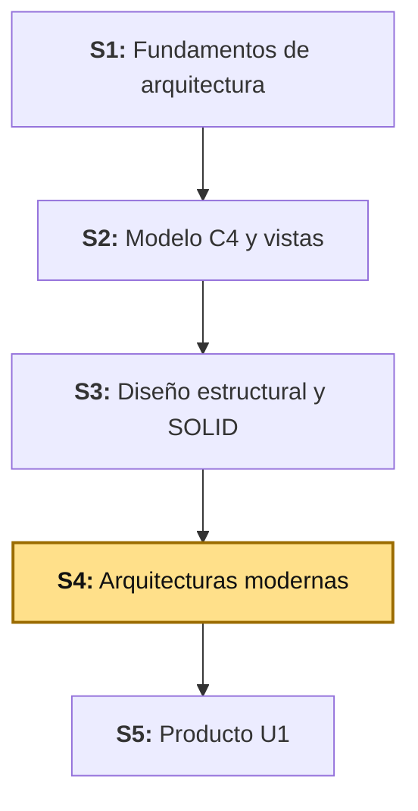
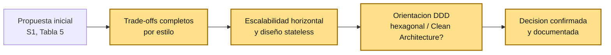
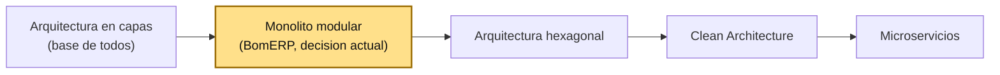
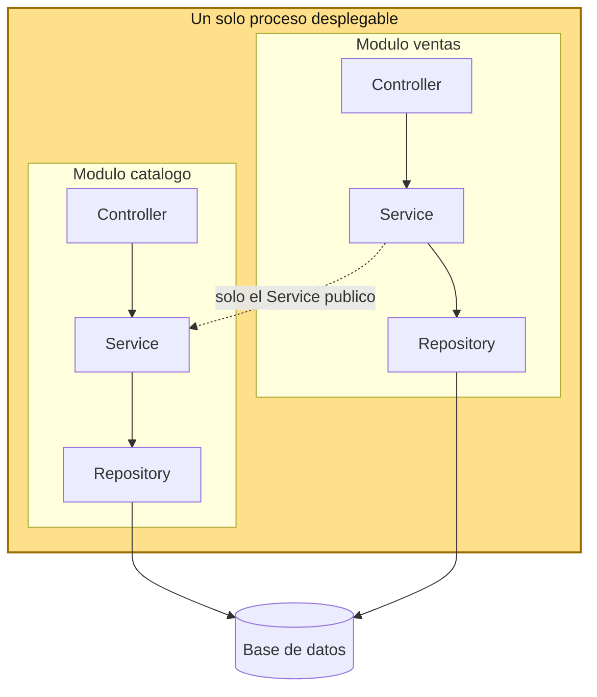
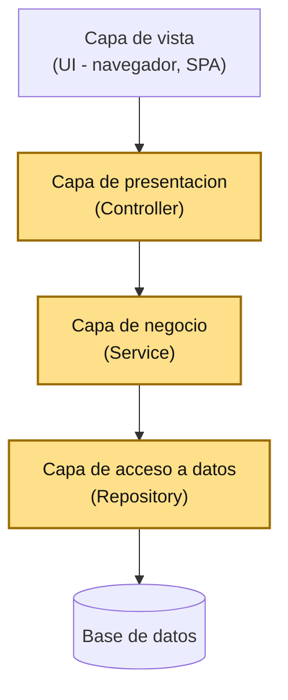
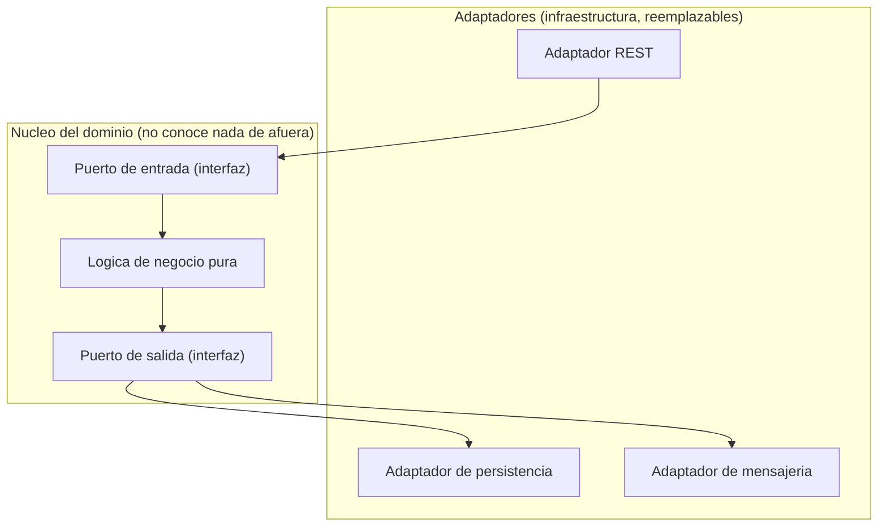
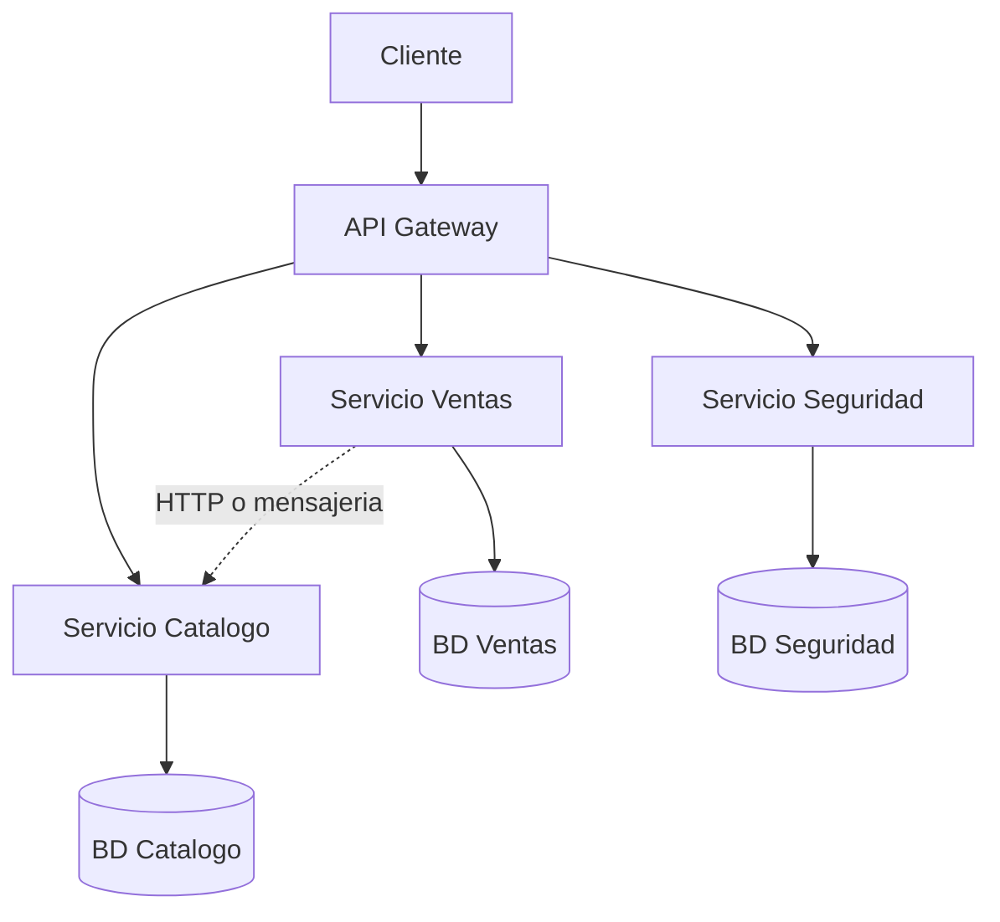
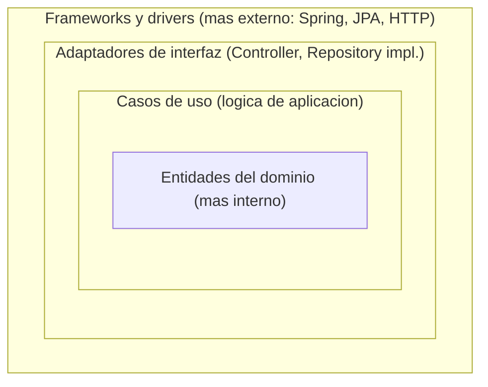
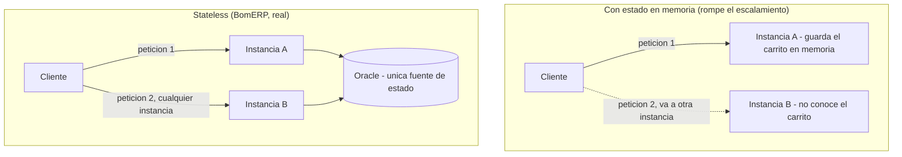

# S4 - Arquitecturas Modernas

## 1. Introducción

Tiempo: 20 min.

### 1.1 Presentación de la sesión

Elegir un estilo arquitectónico no es una decisión que se tome una sola vez y se dé por cerrada — se propone temprano, con la información disponible en ese momento, y se confirma o se ajusta cuando aparece evidencia real que la pone a prueba. Esta sesión toma esa segunda parte: profundiza en los estilos arquitectónicos modernos (monolito modular, arquitectura en capas, arquitectura hexagonal, microservicios, Clean Architecture), sus trade-offs, qué significa que un sistema escale horizontalmente y sea *stateless*, y en qué momento el diseño estratégico de Domain-Driven Design (DDD) empuja la elección hacia hexagonal o Clean Architecture — para justificar con criterio una decisión, no solo nombrarla.

### 1.2 Índice

1. Estilos arquitectónicos: monolito modular, capas, hexagonal, microservicios y Clean Architecture.
2. Trade-offs entre estilos.
3. Escalabilidad horizontal y diseño *stateless*.
4. Domain-Driven Design: cuándo orienta hacia hexagonal o Clean Architecture.

### 1.3 Propósito de aprendizaje

Al concluir la clase, estarás en condiciones de:

- **Comparar** estilos arquitectónicos modernos por sus trade-offs, y **justificar** con evidencia real la elección de un estilo para un proyecto concreto, incluyendo su capacidad de escalar horizontalmente y su diseño *stateless*.

### 1.4 Producto de sesión

Comparación documentada de los cinco estilos arquitectónicos contra BomERP, con trade-offs explícitos, evidencia real de escalabilidad horizontal y diseño *stateless*, y la justificación formal del estilo elegido (monolito modular con Spring Modulith).

### 1.5 Metodología

**Tabla 1. Metodología de la sesión**

| Actividades a Realizar en el Periodo | Orientaciones generales (Orientaciones Metodológicas) | Material de estudio recomendado |
|---|---|---|
| Revisión previa individual | Repasar la Tabla 5 de S1 (evaluación inicial de estilos arquitectónicos) y la vista de despliegue de S2 (Figura 7, escalamiento horizontal de LP2). Trabajo individual, antes de clase. | S1 (3.4, Tabla 5), S2 (2.7, Figura 7). |
| Clase presencial | Comparación guiada de los cinco estilos, evaluación de escalabilidad horizontal y diseño *stateless* con evidencia real, y análisis de cuándo DDD orienta hacia hexagonal o Clean Architecture. Trabajo individual, siguiendo al docente paso a paso. | Pasos 3.1 a 3.6 de esta guía, ADR-001 y ADR-004 de LP2. |
| Evaluación formativa | Revisión en clase de la tabla de trade-offs y de la justificación documentada. La evidencia se completa y sustenta de forma individual, fuera del aula, según los criterios mínimos de la sección 4.4. | Indicaciones de entrega (4.3), rúbrica de evaluación (4.6). |

### 1.6 Motivación de la sesión

#### 1.6.1 Caso: la decisión que se tomó demasiado rápido

Es común que un equipo elija un estilo arquitectónico temprano, con poca información, y después nunca vuelva a cuestionarlo — ni cuando el sistema crece, ni cuando aparece un requisito que el estilo elegido no maneja bien. "Elegimos microservicios porque es lo que se usa en la industria" o "seguimos con el monolito porque ya lo tenemos" son las dos caras del mismo problema: una decisión arquitectónica que dejó de estar justificada por trade-offs reales, y pasó a sostenerse solo por inercia o por moda.

La forma correcta de evitarlo no es elegir "bien" desde el principio y no volver a tocarlo — es tratar la elección de estilo arquitectónico como algo que se revisita con evidencia: ¿el sistema realmente necesita escalar de la forma que el estilo elegido permite? ¿el equipo y el alcance justifican la complejidad adicional de separar en más piezas? ¿el dominio tiene la complejidad que justificaría una arquitectura hexagonal o Clean Architecture? Esta sesión aplica exactamente esas preguntas.

**Preguntas de análisis**

**Activación de conocimientos previos**

1. ¿Alguna vez viste (o usaste) una tecnología o un estilo arquitectónico "porque está de moda", sin evaluar si realmente aplicaba al problema? ¿Qué pasó?

**Comprensión de arquitecturas modernas**

1. ¿Qué diferencia hay entre elegir un estilo arquitectónico por sus trade-offs reales y elegirlo por tendencia?

### 1.7 Ubicación en el curso

- Unidad: U1 - Arquitectura y Diseño Estructural.
- Producto del curso: Diseño Técnico Profesional Documentado.
- Producto de unidad: arquitectura documentada mediante vistas arquitectónicas y principios de diseño aplicados.
- Avance del producto en esta sesión: estilo arquitectónico confirmado y justificado con trade-offs, escalabilidad horizontal, diseño *stateless* y orientación DDD.

Roadmap del producto de la unidad:

**Figura 1. Roadmap del producto de la unidad**



## 2. Explica

Tiempo: 25 min.

### 2.1 Arquitectura de la sesión

**Figura 2. De la propuesta inicial (S1) a la decisión justificada (S4)**



Esta sesión no descarta la propuesta de S1 ni empieza de cero — toma esa primera decisión y la somete a un análisis más profundo: trade-offs explícitos, evidencia real de escalabilidad y una pregunta que S1 todavía no se hizo (¿el dominio de BomERP es lo bastante complejo como para justificar hexagonal o Clean Architecture?).

### 2.2 Estilos arquitectónicos y sus trade-offs

Cada estilo arquitectónico resuelve un problema específico, a cambio de un costo específico — no hay un estilo "mejor" en abstracto, solo un estilo más o menos adecuado para un alcance, un equipo y un momento del proyecto concretos.

**Tabla 2. Estilos arquitectónicos modernos**

| Estilo | Qué es | Cuándo conviene | Costo que agrega |
|---|---|---|---|
| **Monolito modular** | Un solo ejecutable, dividido internamente en módulos con límites verificables (no solo carpetas por convención). | Equipo pequeño, un solo despliegue, límites de dominio ya identificados. | Todo se despliega junto — no se puede escalar ni desplegar un módulo por separado. |
| **Arquitectura en capas** | El código se organiza en capas horizontales (presentación, negocio, datos), cada una dependiendo solo de la inmediatamente inferior. | Casi cualquier sistema — es la base sobre la que se aplican los demás estilos. | Si se usa sola, no impone límites *entre módulos de dominio*, solo entre capas técnicas. |
| **Arquitectura hexagonal** (puertos y adaptadores) | El dominio queda en el centro, aislado de frameworks y tecnología externa mediante puertos (interfaces) y adaptadores (implementaciones). | El dominio tiene reglas de negocio complejas que deben poder probarse sin levantar infraestructura (base de datos, HTTP). | Agrega indirección (interfaces, mapeos) que un dominio simple no necesita. |
| **Microservicios** | Cada módulo de negocio es un proceso independiente, con su propia base de datos y su propio ciclo de despliegue. | Equipos grandes, módulos que necesitan escalar o desplegarse a ritmos distintos. | Complejidad operacional real: red, descubrimiento de servicios, consistencia entre bases de datos distintas, versionado de contratos. |
| **Clean Architecture** | Generaliza la idea de la arquitectura hexagonal en círculos concéntricos de dependencia (entidades, casos de uso, adaptadores, frameworks), todos apuntando hacia el centro. | Sistemas grandes donde la lógica de negocio debe sobrevivir a cambios de framework o de tecnología de persistencia. | Requiere disciplina para no romper la regla de dependencia (nada del centro conoce nada de afuera); cuesta más al equipo que recién empieza. |

Ningún estilo elimina el trade-off del anterior — lo cambia por otro. Monolito modular cambia "no puedo escalar un módulo por separado" por "no tengo que operar red ni bases de datos distribuidas"; microservicios hace exactamente el cambio contrario.

**Ejemplo de referencia (LP2).** BomERP usa monolito modular con arquitectura en capas dentro de cada módulo (`catalogo/producto/{controller,service,repository,entity}`, ver ADR-001 de LP2) — no hexagonal, no microservicios. La razón documentada en el ADR no es "monolito es más fácil" en abstracto: es que el sílabo de LP2 no evalúa despliegue distribuido, el equipo es pequeño, y todo el sistema se despliega como un único ejecutable — el trade-off de microservicios (complejidad operacional) no tendría ninguna ganancia real a cambio, en este proyecto. Microservicios se estudia conceptualmente aquí, en ADS, y se practica de verdad en el curso de Aplicaciones Distribuidas (una etapa posterior de la cadena BomERP), con un proyecto de referencia propio (`producto-ms`, un reactor Maven multi-módulo) — dos cursos distintos, con el mismo nombre corto de tres letras, pero contenidos y proyectos diferentes.

**Figura 3. Los cinco estilos, de menos a más piezas independientes**



La Figura 3 no es una escala de "mejor a peor" — es una escala de cuántas piezas independientes tiene el sistema y cuánta indirección hay entre el dominio y la infraestructura. BomERP está en el segundo escalón, no porque los demás sean superiores, sino porque el alcance real del proyecto no justifica moverse más a la derecha (todavía).

La Tabla 2 resume los cinco estilos en una fila cada uno — suficiente para compararlos, pero no para reconocer el diagrama típico de cada uno ni para saber dónde se usa en la práctica. Los siguientes cinco apartados profundizan uno por uno, en el mismo orden.

### 2.3 Monolito modular, en profundidad

Un monolito modular es **un solo proceso desplegable**, pero organizado por dentro en módulos con límites explícitos — la diferencia con un monolito "a secas" (todo mezclado, sin límites) es justamente esa organización interna, verificada por herramientas, no solo por convención de carpetas.

**Figura 4. Diagrama típico de un monolito modular**



Todos los módulos comparten el mismo proceso y el mismo ciclo de despliegue — cuando se despliega una versión nueva, se despliega el ejecutable completo, no un módulo por separado. La flecha punteada entre `ventas` y `catalogo` es la regla clave: un módulo puede llamar al `Service` público de otro, nunca a su `Repository` — el mismo límite que impondría un microservicio, pero verificado en tiempo de compilación/prueba (Spring Modulith), no por una llamada de red.

**Dónde se usa en la práctica:** equipos pequeños o medianos, productos con un solo ciclo de despliegue, o empresas que empiezan como monolito modular y solo separan un módulo en microservicio el día que un problema real (no anticipado) lo justifica — Shopify es un caso frecuentemente citado en la industria de un monolito modular a gran escala, mantenido así de forma deliberada.

**Ejemplo de referencia (LP2).** Esta es exactamente la arquitectura real de BomERP hoy — la Figura 4 no es un ejemplo genérico, es el diagrama de `lp2/bomerp-backend` (ADR-001 de LP2), con `catalogo` como único módulo real hasta ahora y `ventas` previsto para LP2 S4.

### 2.4 Arquitectura en capas, en profundidad

La arquitectura en capas organiza el código en niveles horizontales — cada capa depende solo de la que tiene inmediatamente debajo, nunca al revés, y nunca se salta una capa para llegar directo a otra más abajo.

**Figura 5. Diagrama típico de arquitectura en capas**



La capa de vista es la única que no vive dentro del backend — es quien consume la API (un navegador, una SPA, otra aplicación). Las tres capas resaltadas sí son las que Spring Boot organiza como código: `Controller` (presentación), `Service` (negocio) y `Repository` (acceso a datos).

**Dónde se usa en la práctica:** es la base casi universal de cualquier aplicación empresarial — no compite con los otros cuatro estilos, vive **dentro** de ellos. Un monolito modular tiene capas dentro de cada módulo (como BomERP); un microservicio tiene capas dentro de cada servicio; incluso hexagonal y Clean Architecture son, en el fondo, una forma más estricta de organizar capas, con una regla extra sobre la dirección de las dependencias.

**Error frecuente:** confundir "capas" con "monolito" — son ejes distintos. Capas responde "¿cómo se organiza el código dentro de una pieza?"; monolito modular / microservicios responde "¿cuántas piezas desplegables hay?". BomERP usa las dos a la vez: capas dentro de cada módulo, monolito modular como forma de desplegar todos los módulos juntos.

**Ejemplo de referencia (LP2).** `catalogo/producto/{controller,service,repository,entity}` (LP2, desde S1) sigue este flujo exacto: `ProductoController` nunca llama a `ProductoRepository` directo, siempre pasa por `ProductoService` (ADR-001 de LP2).

### 2.5 Arquitectura hexagonal (puertos y adaptadores), en profundidad

La arquitectura hexagonal pone el dominio (las reglas de negocio) en el centro, sin que conozca nada de la tecnología que lo rodea. La comunicación con el exterior pasa por **puertos** (interfaces que el dominio define, según lo que necesita) y **adaptadores** (implementaciones concretas de esos puertos, una por cada tecnología externa: REST, base de datos, mensajería).

**Figura 6. Diagrama típico de arquitectura hexagonal**



La flecha siempre entra al núcleo por un puerto de entrada y sale por un puerto de salida — nunca un adaptador llama directo a `Logica`, y `Logica` nunca importa una clase de `RestAdapter` ni de `DbAdapter`. Eso es lo que permite probar `Logica` con pruebas unitarias puras, sin levantar servidor HTTP ni base de datos, y lo que permite cambiar de tecnología (por ejemplo, de REST a mensajería) sin tocar el dominio — solo se escribe un adaptador nuevo.

**Dónde se usa en la práctica:** dominios con reglas de negocio genuinamente complejas que deben sobrevivir a cambios de tecnología — sistemas bancarios centrales, motores de tarificación de seguros, o cualquier núcleo de negocio que un equipo espera mantener por años, mientras la infraestructura de alrededor cambia varias veces.

**Ejemplo de referencia (LP2).** `catalogo/producto` no tiene esta estructura, y no debería tenerla todavía — `ProductoServiceImpl` llama directo a `ProductoRepository` (Spring Data JPA), sin un puerto de por medio (confirmado en 2.4 más abajo, Tabla 5). No es un error: es que hoy no hay lógica de negocio compleja que justifique la indirección.

### 2.6 Microservicios, en profundidad

En microservicios, cada módulo de negocio es un **proceso independiente**, con su propia base de datos, su propio ciclo de despliegue y, generalmente, su propio repositorio de código. La comunicación entre servicios es siempre por red (HTTP, mensajería), nunca por llamada directa en memoria.

**Figura 7. Diagrama típico de microservicios**



Cada base de datos le pertenece a un solo servicio — ningún otro servicio la consulta directo, ni siquiera para leer; si `Ventas` necesita un dato de `Catalogo`, se lo pide por red (`S2 -.-> S1`), nunca leyendo la base de `Catalogo` directamente. Esa regla es la misma que un monolito modular impone entre módulos (2.3) — la diferencia es que acá se aplica por proceso y por red, no dentro de un mismo ejecutable.

**Dónde se usa en la práctica:** organizaciones grandes, con muchos equipos trabajando en paralelo que necesitan desplegar sin coordinarse entre sí, y servicios con necesidades de escala muy distintas entre ellos (por ejemplo, un servicio de búsqueda que recibe mil veces más tráfico que uno de facturación) — casos frecuentemente citados son Netflix, Amazon y Uber, documentados en sus propios blogs de ingeniería.

**Ejemplo de referencia (LP2).** BomERP no usa microservicios (2.2), y el ADR-001 de LP2 lo dice explícitamente: el costo (red, bases de datos distribuidas, versionado de contratos) no tiene ninguna ganancia real a cambio en un proyecto de equipo pequeño con un solo ciclo de despliegue. El curso de Aplicaciones Distribuidas (etapa posterior de la cadena BomERP) sí trabaja este estilo de verdad, con `producto-ms` como proyecto de referencia.

### 2.7 Clean Architecture, en profundidad

Clean Architecture generaliza la idea de hexagonal en **círculos concéntricos**: entidades del dominio en el centro, casos de uso alrededor, adaptadores de interfaz más afuera, y frameworks/herramientas en el borde exterior. La regla que lo sostiene todo es la **regla de dependencia**: el código de un círculo solo puede depender de círculos más internos, nunca de uno más externo.

**Figura 8. Diagrama típico de Clean Architecture (círculos concéntricos)**



La flecha de dependencia siempre apunta hacia adentro: `Frameworks` puede conocer `Adapters`, `Adapters` puede conocer `UseCases`, `UseCases` puede conocer `Entities` — pero `Entities` no conoce nada de lo que está afuera. Es la misma idea de hexagonal (2.5), expresada como niveles en vez de puertos/adaptadores; en la práctica, muchos equipos usan los dos términos de forma casi intercambiable.

**Dónde se usa en la práctica:** sistemas grandes y de vida larga, donde el equipo espera que la lógica de negocio sobreviva a más de un cambio de framework — es un patrón frecuente en apps Android/iOS grandes (para que la lógica de negocio no dependa del framework de UI) y en sistemas empresariales que ya pasaron por al menos una migración de tecnología dolorosa.

**Ejemplo de referencia (LP2).** Igual que con hexagonal, BomERP aplica los *principios* de separación de capas (Tabla 5 de S1: "parcialmente") sin adoptar la estructura formal completa de círculos — el mismo criterio de 2.4 (DDD) decide si algún módulo llega a justificarlo más adelante.

### 2.8 Escalabilidad horizontal y diseño *stateless*

**Escalabilidad horizontal**: la capacidad de atender más carga agregando más copias idénticas de la aplicación (más instancias), en vez de agregarle más recursos a una sola instancia (escalar verticalmente). Para que escalar horizontalmente funcione, cualquier petición debe poder ser atendida por **cualquier** instancia, indistintamente.

**Diseño *stateless***: que ninguna instancia guarde en memoria información específica de un cliente entre una petición y la siguiente (por ejemplo, datos de sesión). Si una instancia guardara ese estado, las peticiones de ese cliente tendrían que ir siempre a la misma instancia (*sticky session*) — lo que rompe la promesa de "cualquier instancia atiende cualquier petición" y limita cuánto se puede escalar.

Los dos conceptos están relacionados pero no son lo mismo: *stateless* es una propiedad del diseño (nadie guarda estado por cliente); escalabilidad horizontal es la consecuencia práctica que ese diseño hace posible.

**Ejemplo de referencia (LP2).** LP2 ya demostró esto con evidencia real, no como ejercicio teórico: S1 (3.3) levantó dos instancias de `bomerp-backend` en paralelo (puertos `8080` y `8081`), ambas conectadas a la misma Oracle, y verificó que cualquiera de las dos responde `/api/v1/hello` y `/actuator/health` sin ninguna coordinación entre ellas. Eso funciona porque el backend nunca guardó estado de cliente en memoria — ni siquiera hay autenticación todavía (JWT se difiere a S10, ver ADR-004 de LP2), así que no hay sesión que sincronizar entre instancias. Cuando JWT llegue en S10, seguirá siendo *stateless*: un JWT es un token autocontenido que el cliente reenvía en cada petición — ninguna instancia necesita recordar quién inició sesión.

**Figura 9. Por qué el diseño *stateless* es lo que permite escalar horizontalmente**



En el bloque de arriba, la segunda petición del cliente cae en una instancia distinta que nunca vio la primera — si el estado viviera en memoria, se perdería. En el bloque de abajo (el real), no importa a qué instancia llegue cada petición: la única fuente de estado es Oracle, compartida por todas.

### 2.9 Domain-Driven Design: cuándo orienta hacia hexagonal o Clean Architecture

DDD (introducido como adelanto en S2, 2.5) distingue el dominio (las reglas de negocio) de todo lo demás (frameworks, base de datos, HTTP). Cuando ese dominio es simple — pocas reglas, poca lógica que no sea CRUD — separar el dominio del resto con puertos y adaptadores (hexagonal) o con círculos concéntricos (Clean Architecture) agrega una indirección que no paga su costo: más interfaces, más mapeos, más código para el mismo resultado.

La orientación cambia cuando el dominio gana complejidad real: reglas de negocio que no dependen de ninguna tecnología concreta, lógica que debe poder probarse sin levantar base de datos ni servidor HTTP, o un **agregado** (límite de consistencia de DDD) con invariantes que deben protegerse sin importar quién lo modifique. Ahí, aislar el dominio deja de ser indirección innecesaria y pasa a ser lo que hace posible probar y mantener esa lógica sin arrastrar infraestructura.

**Ejemplo de referencia (LP2).** Hoy, `catalogo/producto` es esencialmente CRUD con una validación de referencia (LP2 S3) — no hay lógica de negocio compleja que aislar del framework todavía. Eso confirma la Tabla 5 de S1: hexagonal y Clean Architecture no aplican "para este corte". Pero `ventas/Venta-DetalleVenta` (LP2 S4, cabecera-detalle con cálculos y control de stock) es un candidato más real a agregado DDD — si su lógica de cálculo y consistencia creciera lo suficiente, sería el primer módulo de BomERP donde valdría la pena evaluar aislarlo del framework con un puerto explícito. Hoy todavía no se justifica: la complejidad real hay que verla en el código antes de pagar el costo de la indirección, no anticiparla.

## 3. Aplica: actividad práctica guiada

Tiempo: 2h.

**Actividad:** comparación guiada de los cinco estilos arquitectónicos contra BomERP, con trade-offs, evidencia de escalabilidad horizontal, diseño *stateless* y orientación DDD (Producto de la sesión en 1.4).

**Propósito de la actividad:** justificar con evidencia real, no con preferencia, el estilo arquitectónico ya elegido para el proyecto — confirmándolo donde corresponda y documentando explícitamente por qué las alternativas no aplican todavía.

**Orientaciones metodológicas:** en el laboratorio, el docente evalúa cada estilo contra BomERP paso a paso frente a la clase, con el código y los ADR reales de LP2 abiertos; los estudiantes replican la misma evaluación sobre el proyecto de su propio equipo (sección 4).

**Actividades para realizar:**

- **3.1** Profundizar la evaluación de estilos arquitectónicos.
- **3.2** Verificar escalabilidad horizontal con evidencia real.
- **3.3** Verificar el diseño *stateless*.
- **3.4** Evaluar si DDD orienta hacia hexagonal o Clean Architecture.
- **3.5** Documentar el hallazgo o la confirmación.
- **3.6** Relacionar con LP2 y BD2.

### 3.1 Profundizar la evaluación de estilos arquitectónicos

**Producto del paso:** tabla de trade-offs de los cinco estilos, aplicada a BomERP.

**Tabla 3. Trade-offs de los cinco estilos, aplicados a BomERP**

| Estilo | ¿Aplica a BomERP hoy? | Trade-off que se ganaría | Trade-off que se pagaría |
|---|---|---|---|
| Monolito modular (real) | Sí | Un solo despliegue, límites verificados por Spring Modulith sin costo operacional | No se puede escalar ni desplegar un módulo por separado |
| Arquitectura en capas (real, dentro de cada módulo) | Sí | Separación clara controller/service/repository/entity | No impone límites entre módulos de dominio por sí sola (eso lo da Modulith) |
| Arquitectura hexagonal | No, todavía | Dominio aislado de framework, más fácil de probar sin infraestructura | Interfaces y mapeos adicionales que hoy no protegen ninguna lógica compleja |
| Microservicios | No | Escalar y desplegar módulos por separado | Red, bases de datos distribuidas, versionado de contratos — sin equipo ni alcance que lo justifique |
| Clean Architecture | Parcial (principios, no estructura formal) | Dominio protegido de cambios de framework a largo plazo | Disciplina y código adicional que el corte actual de LP2 no evalúa |

Esta tabla profundiza la Tabla 5 de S1 (que solo respondía sí/no) agregando explícitamente qué se gana y qué se paga en cada caso — la justificación real está en esas dos columnas, no en el sí/no.

### 3.2 Verificar escalabilidad horizontal con evidencia real

**Producto del paso:** confirmación de que BomERP escala horizontalmente, con evidencia real de LP2.

Repasa LP2 S1 (3.3, Figura 7): dos instancias de `bomerp-backend`, puertos `8080` y `8081`, ambas conectadas a la misma Oracle. Si tienes el proyecto de LP2 disponible, reproduce los comandos de 3.3.1-3.3.2 de esa guía y confirma que ambas instancias responden de forma independiente.

**Tabla 4. Evidencia de escalabilidad horizontal**

| Verificación | Resultado esperado (LP2 S1, 3.3.2) |
|---|---|
| `GET /api/v1/hello` en el puerto 8080 | Responde, sin depender de la instancia 8081 |
| `GET /api/v1/hello` en el puerto 8081 | Responde, sin depender de la instancia 8080 |
| `GET /actuator/health` en ambos puertos | `200 OK` en los dos, de forma independiente |
| Configuración necesaria para que ambas compartan estado | Ninguna — ambas usan la misma Oracle como única fuente de estado |

### 3.3 Verificar el diseño *stateless*

**Producto del paso:** confirmación explícita de por qué BomERP es *stateless* hoy.

Revisa el código real de `ProductoServiceImpl`/`CategoriaServiceImpl` (LP2 S1-S3): ningún método guarda datos en un campo de instancia entre peticiones — cada método recibe todo lo que necesita como parámetro, y el único estado que persiste vive en Oracle. Revisa también ADR-004 de LP2: JWT (cuando llegue en S10) es un token autocontenido, verificado en cada petición, sin sesión guardada en el servidor.

**Error frecuente**: confundir "no tiene autenticación todavía" con "es *stateless* por eso". BomERP es *stateless* por diseño (nada de estado de cliente en memoria), no porque le falte JWT — y seguirá siendo *stateless* cuando JWT se implemente en S10.

### 3.4 Evaluar si DDD orienta hacia hexagonal o Clean Architecture

**Producto del paso:** evaluación honesta de la complejidad real del dominio de BomERP hoy.

Revisa `catalogo/categoria` y `catalogo/producto` (LP2 S1-S3): CRUD, una validación de referencia, sin reglas de negocio que dependan de cálculos complejos o de invariantes multi-entidad. Compáralo con lo que se anticipa para `ventas/Venta-DetalleVenta` (LP2 S4, todavía no implementado): cabecera-detalle con cálculos, control de stock y una operación atómica — más cerca de un agregado DDD real.

**Tabla 5. ¿El dominio ya justifica hexagonal o Clean Architecture?**

| Módulo | Complejidad real hoy | ¿Justifica aislar el dominio? |
|---|---|---|
| `catalogo` (real, LP2 S1-S3) | CRUD + validación de referencia | No — la indirección no protegería ninguna lógica que hoy no exista |
| `ventas` (previsto, LP2 S4) | Cabecera-detalle, cálculos, control de stock, operación atómica | Todavía por verse — candidato más real, se evalúa cuando el código exista |

### 3.5 Documentar el hallazgo o la confirmación

**Producto del paso:** conclusión documentada, con su justificación.

A diferencia de S3 (donde el hallazgo esperado era una tensión de diseño), acá el resultado más probable es una **confirmación**: monolito modular con Spring Modulith sigue siendo la elección correcta para BomERP, con evidencia real de escalabilidad horizontal y diseño *stateless*, y sin que el dominio actual justifique todavía hexagonal o Clean Architecture. Documentar una confirmación bien justificada es tan válido como documentar un hallazgo — lo que se evalúa es la calidad del razonamiento, no que aparezca un problema donde no lo hay.

### 3.6 Relacionar con LP2 y BD2

**Producto del paso:** matriz de integración de la sesión.

**Tabla 6. Matriz de integración ADS-LP2-BD2 (S4)**

| Criterio evaluado | Evidencia real en LP2 | Relación con BD2 |
|---|---|---|
| Monolito modular con límites verificados | `ModularityTests` (LP2, desde S1); ADR-001 y ADR-002 | Un esquema Oracle por módulo funcional (`BOM_CATALOGO`, `BOM_VENTAS`), mismo criterio de límite |
| Escalabilidad horizontal | Dos instancias en paralelo (LP2 S1, 3.3) | Ambas instancias comparten la misma Oracle — la base de datos es el punto de escalabilidad a vigilar, no el backend |
| Diseño *stateless* | Sin sesión en memoria; JWT diferido y autocontenido (ADR-004) | — |
| Orientación DDD | `catalogo` no la justifica todavía; `ventas` es candidato (LP2 S4) | — |

Sesión equivalente en los otros dos cursos, misma semana: LP2 y BD2 todavía no publican su guía de S4 en este repositorio.

**Evidencia de aprendizaje:**

- Tabla de trade-offs de los cinco estilos arquitectónicos, aplicada a BomERP.
- Evidencia real de escalabilidad horizontal (LP2 S1, 3.3) verificada.
- Justificación explícita del diseño *stateless*.
- Evaluación de si DDD orienta hacia hexagonal o Clean Architecture, con al menos un módulo real analizado.
- Conclusión documentada (confirmación o hallazgo), con su justificación.
- Matriz de integración con LP2 y BD2.

## 4. Crea: actividad autónoma

Tiempo: 2h fuera del aula.

### 4.1 Actividad

Evaluación autónoma de estilos arquitectónicos, escalabilidad horizontal, diseño *stateless* y orientación DDD sobre el proyecto propio del equipo, documentada en evidencia individual.

Completa y evidencia estas tareas:

1. Elaborar la tabla de trade-offs de los cinco estilos arquitectónicos, aplicada a tu propio proyecto.
2. Verificar (o justificar por qué no aplica todavía) la escalabilidad horizontal de tu backend.
3. Justificar explícitamente si tu diseño es *stateless*, y por qué.
4. Evaluar si la complejidad real de tu dominio justifica hexagonal o Clean Architecture en algún módulo.
5. Documentar tu conclusión (confirmación o hallazgo), con su justificación.

### 4.2 Propósito

Que cada estudiante demuestre, de forma individual y fuera del aula, que puede justificar con evidencia real una decisión arquitectónica, sin el acompañamiento del docente.

Esta actividad autónoma se desarrolla sobre el proyecto de fin de curso del equipo. El producto de la unidad se construye por acumulación de los avances de cada sesión; por eso, la evidencia de esta sesión debe incorporarse a la documentación del proyecto y quedar trazable en GitHub.

### 4.3 Indicaciones

Entrega un PDF con el siguiente nombre:

```text
S04_ADS_Equipo##_ApellidoNombre.pdf
```

Cada captura de pantalla del informe debe mostrar, sin recortar, el reloj del sistema (fecha y hora) y tu usuario o foto de perfil (Windows, VS Code o navegador) visibles en pantalla — es lo que permite verificar que la evidencia es tuya y que corresponde al momento real de tu trabajo.

#### 4.3.1 Estructura del informe

**Datos del estudiante**

- Nombre:
- Equipo:
- Sesión: S04 - Arquitecturas Modernas
- Rol o aporte realizado:
- Link de GitHub:

**Evidencia técnica**

Incluye capturas o extractos con una breve explicación debajo de cada uno, organizados en los mismos 4 bloques de la rúbrica (4.6):

1. *Trade-offs de estilos arquitectónicos*
    - Tabla de trade-offs aplicada a tu proyecto.
2. *Escalabilidad horizontal*
    - Evidencia de verificación (o justificación de por qué no aplica todavía).
3. *Diseño stateless*
    - Justificación explícita, con código real citado.
4. *Orientación DDD*
    - Evaluación de al menos un módulo real de tu proyecto.

**Error o hallazgo**

Describe al menos un hallazgo real (no necesariamente un error — puede ser una confirmación bien justificada, como en 3.5).

**Reflexión técnica breve**

Responde en 5 a 8 líneas:

```text
¿Por qué una decisión arquitectónica tomada al inicio del proyecto necesita
revisarse con evidencia, en vez de darse por cerrada?
```

**Anexo: Feedback de la sesión**

Pega esta página como la última hoja del PDF, con tus respuestas.

1. ¿Cuál es el aprendizaje más importante que te llevas de la clase de hoy?
2. ¿Qué punto de la clase te resultó más confuso o te dejó con dudas?
3. ¿Tienes alguna pregunta que te gustaría que sea respondida la siguiente clase?
4. Sobre tu nivel de comprensión de la clase de hoy, marca una opción:
    - ¡Entendido! - Lo domino y podría explicarlo.
    - Más o menos. - Entendí la idea general, pero tengo dudas.
    - Necesito ayuda. - Me siento perdido/a con este tema.
5. ¿Cómo puedo ayudarte a comprender mejor el tema?
6. Pensando en tu participación y esfuerzo en la clase de hoy, ¿cómo te autoevaluarías? Marca una opción:
    - Muy Comprometido/a: Me esforcé al máximo.
    - Comprometido/a: Sé que podría haberme esforzado un poco más.
    - Poco Comprometido/a: Hoy no di mi mejor esfuerzo.
7. Mi satisfacción con la clase fue... (califica del 1 al 10, donde 1 es insatisfecho y 10 es muy satisfecho).

### 4.4 Criterios mínimos de aceptación

La evidencia individual se considera completa si:

- El archivo respeta el nombre solicitado.
- Presenta la tabla de trade-offs de los cinco estilos arquitectónicos, aplicada a su propio proyecto.
- Verifica o justifica explícitamente la escalabilidad horizontal.
- Justifica explícitamente el diseño *stateless* (o su ausencia), con código real citado.
- Evalúa si algún módulo real justifica hexagonal o Clean Architecture, con argumento concreto.
- Incluye una conclusión documentada (confirmación o hallazgo), con su justificación.
- Cada captura de la evidencia técnica muestra el reloj del sistema y el usuario/perfil visible, sin recortar.
- Las fechas y horas de las capturas son coherentes con el historial de commits de su repositorio en GitHub.
- Incluye la reflexión técnica breve solicitada.
- Incluye el Anexo de feedback de la sesión respondido, como última página del PDF.

### 4.5 Preguntas de defensa

1. ¿Por qué monolito modular y no microservicios, para este proyecto en particular?
2. ¿Qué evidencia real (no teórica) demuestra que tu backend escala horizontalmente?
3. ¿Por qué tu backend es (o no es) *stateless*, y qué relación tiene eso con la escalabilidad horizontal?
4. ¿Qué tendría que pasar en tu dominio para que valga la pena aislarlo con arquitectura hexagonal?
5. ¿Por qué "microservicios" y "Aplicaciones Distribuidas" no son lo mismo que esta sesión de ADS?

### 4.6 Rúbrica de evaluación

**Tabla 7. Rúbrica de evaluación**

| Criterio | Peso (%) | A (20 pts) | B (15 pts) | C (10 pts) | D (5 pts) | Nivel obtenido |
|---|---:|---|---|---|---|---:|
| 1. Trade-offs de estilos arquitectónicos* | 25 | Tabla completa y correcta, con trade-offs reales aplicados al proyecto propio. | Tabla correcta, con algún trade-off superficial. | Tabla incompleta o con trade-offs genéricos. | No presenta la tabla. | |
| 2. Escalabilidad horizontal* | 25 | Evidencia real de verificación, o justificación sólida de por qué no aplica todavía. | Evidencia o justificación correcta, con detalles menores. | Evidencia superficial o justificación poco clara. | No evalúa escalabilidad horizontal. | |
| 3. Diseño stateless* | 25 | Justificación explícita y correcta, con código real citado. | Justificación correcta, con citas parciales. | Justificación superficial o incorrecta. | No justifica el diseño stateless. | |
| 4. Orientación DDD* | 25 | Evaluación concreta de al menos un módulo real, con argumento sólido. | Evaluación correcta, con argumento básico. | Evaluación genérica o poco fundamentada. | No evalúa orientación DDD. | |

\* Agregado manual.

Nota final = suma de (`Peso` / 100 × `Puntos del nivel obtenido`) = ____ / 20.

Para usar la rúbrica con IA, solicita:

```text
Evalúa el PDF usando la rúbrica de la sesión.
Para cada criterio selecciona el nivel obtenido usando la escala A=20, B=15, C=10, D=5 puntos.
Justifica brevemente cada nivel asignado.
Verifica que cada captura muestre reloj del sistema y usuario/perfil visible, y que las fechas sean coherentes con el historial de commits de GitHub. Si falta esta evidencia o hay inconsistencias, indícalo explícitamente antes de calificar.
Calcula la nota final con la fórmula: suma de (Peso/100 × Puntos del nivel obtenido), directamente sobre 20.
Indica 2 fortalezas y 2 recomendaciones.
```

## 5. Cierre

Tiempo: 5 min.

**Resumen breve:** hoy la propuesta inicial de S1 (monolito modular con Spring Modulith) se sometió a un análisis más profundo — trade-offs explícitos de los cinco estilos, evidencia real de escalabilidad horizontal y diseño *stateless* (LP2 S1, 3.3), y una evaluación honesta de si el dominio actual de BomERP ya justifica hexagonal o Clean Architecture. La conclusión más probable no es un cambio de rumbo, sino una confirmación bien justificada — y eso también es un resultado válido.

**Dinámica participativa:** en una ronda rápida, cada estudiante comparte en una frase qué estilo arquitectónico le pareció más tentador "por moda" antes de evaluar sus trade-offs reales.

**Metacognición:** cada estudiante responde el Anexo de feedback de la sesión, incluido en su evidencia individual (ver 4.3.1). El docente analiza esas respuestas con IA para identificar temas recurrentes o dudas comunes del equipo, y con esos indicadores construye el cierre real de la sesión — que se entrega al inicio de S5, no al final de esta clase.

**Proyección:** la confirmación (o el ajuste) de estilo arquitectónico de hoy es la base de S5, donde se integra todo lo trabajado en la unidad (vistas arquitectónicas, principios de diseño, estilo arquitectónico) en el Producto U1 de ADS.

## Bibliografía

1. Martin, R. C. (2017). *Clean Architecture: A Craftsman's Guide to Software Structure and Design*. Prentice Hall.
2. Fowler, M. (2015). *Microservices*. martinfowler.com. https://martinfowler.com/articles/microservices.html
3. Fowler, M. (2015). *MonolithFirst*. martinfowler.com. https://martinfowler.com/bliki/MonolithFirst.html
4. Evans, E. (2003). *Domain-Driven Design: Tackling Complexity in the Heart of Software*. Addison-Wesley.
5. Cockburn, A. (2005). *Hexagonal Architecture*. https://alistair.cockburn.us/hexagonal-architecture/
