# S4 - Arquitecturas Modernas

## 1. Introducción

Tiempo: 20 min.

### 1.1 Presentación de la sesión

Elegir un estilo arquitectónico no es una decisión que se tome una sola vez y se dé por cerrada — se propone temprano, con la información disponible en ese momento, y se confirma o se ajusta cuando aparece evidencia real que la pone a prueba. Esta sesión toma esa segunda parte: profundiza en los estilos arquitectónicos modernos (arquitectura en capas, arquitectura hexagonal, Clean Architecture, monolito modular, microservicios, serverless y microfrontend), sus trade-offs, qué significa que un sistema escale horizontalmente y sea *stateless*, y en qué momento el diseño estratégico de Domain-Driven Design (DDD) empuja la elección hacia hexagonal o Clean Architecture — para justificar con criterio una decisión, no solo nombrarla.

### 1.2 Índice

1. Estilos arquitectónicos: capas, hexagonal, Clean Architecture, monolito modular, microservicios, serverless y microfrontend.
2. Trade-offs entre estilos.
3. Escalabilidad horizontal y diseño *stateless*.
4. Domain-Driven Design: cuándo orienta hacia hexagonal o Clean Architecture.

### 1.3 Propósito de aprendizaje

Al concluir la clase, estarás en condiciones de:

- **Comparar** estilos arquitectónicos modernos por sus trade-offs, y **justificar** con evidencia real la elección de un estilo para un proyecto concreto, incluyendo su capacidad de escalar horizontalmente y su diseño *stateless*.

### 1.4 Producto de sesión

Comparación documentada de los siete estilos arquitectónicos contra BomERP, con trade-offs explícitos, evidencia real de escalabilidad horizontal y diseño *stateless*, y la justificación formal del estilo elegido (monolito modular con Spring Modulith).

### 1.5 Metodología

**Tabla 1. Metodología de la sesión**

| Actividades a Realizar en el Periodo | Orientaciones generales (Orientaciones Metodológicas) | Material de estudio recomendado |
|---|---|---|
| Revisión previa individual | Repasar la Tabla 5 de S1 (evaluación inicial de estilos arquitectónicos) y la vista de despliegue de S2 (Figura 7, escalamiento horizontal de LP2). Trabajo individual, antes de clase. | S1 (3.4, Tabla 5), S2 (2.7, Figura 7). |
| Clase presencial | Comparación guiada de los siete estilos, evaluación de escalabilidad horizontal y diseño *stateless* con evidencia real, y análisis de cuándo DDD orienta hacia hexagonal o Clean Architecture. Trabajo individual, siguiendo al docente paso a paso. | Pasos 3.1 a 3.6 de esta guía (3.7 opcional), ADR-001 y ADR-004 de LP2. |
| Evaluación formativa | Revisión en clase de la tabla de trade-offs y de la justificación documentada. La evidencia se completa y sustenta de forma individual, fuera del aula, según los criterios mínimos de la sección 4.4. | Indicaciones de entrega (4.3), rúbrica de evaluación (4.6). |

### 1.6 Motivación de la sesión

#### 1.6.1 Caso: la decisión que se tomó demasiado rápido

Es común que un equipo elija un estilo arquitectónico temprano, con poca información, y después nunca vuelva a cuestionarlo — ni cuando el sistema crece, ni cuando aparece un requisito que el estilo elegido no maneja bien. "Elegimos microservicios porque es lo que se usa en la industria" o "seguimos con el monolito porque ya lo tenemos" son las dos caras del mismo problema: una decisión arquitectónica que dejó de estar justificada por trade-offs reales, y pasó a sostenerse solo por inercia o por moda.

La forma correcta de evitarlo no es elegir "bien" desde el principio y no volver a tocarlo — es tratar la elección de estilo arquitectónico como algo que se revisita con evidencia: ¿el sistema realmente necesita escalar de la forma que el estilo elegido permite? ¿el equipo y el alcance justifican la complejidad adicional de separar en más piezas? ¿el dominio tiene la complejidad que justificaría una arquitectura hexagonal o Clean Architecture? Esta sesión aplica exactamente esas preguntas.

**Preguntas de análisis**

**Activación de conocimientos previos**

1. ¿Alguna vez viste (o usaste) una tecnología o un estilo arquitectónico "porque está de moda", sin evaluar si realmente aplicaba al problema? ¿Qué pasó?

**Comprensión de arquitecturas modernas**

1. ¿Qué diferencia hay entre elegir un estilo arquitectónico por sus trade-offs reales y elegirlo por tendencia?

### 1.7 Ubicación en el curso

- Unidad: U1 - Arquitectura y Diseño Estructural.
- Producto del curso: Diseño Técnico Profesional Documentado.
- Producto de unidad: arquitectura documentada mediante vistas arquitectónicas y principios de diseño aplicados.
- Avance del producto en esta sesión: estilo arquitectónico confirmado y justificado con trade-offs, escalabilidad horizontal, diseño *stateless* y orientación DDD.

Roadmap del producto de la unidad:

**Figura 1. Roadmap del producto de la unidad**

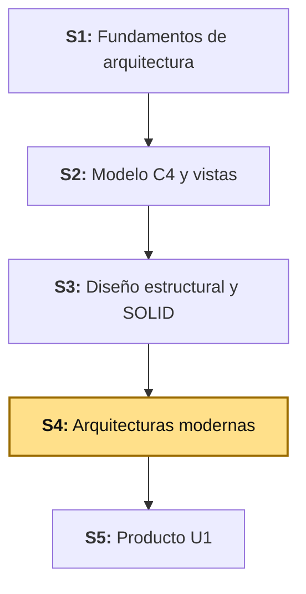

## 2. Explica

Tiempo: 55 min.

### 2.1 Arquitectura de la sesión

**Figura 2. De la propuesta inicial (S1) a la decisión justificada (S4)**

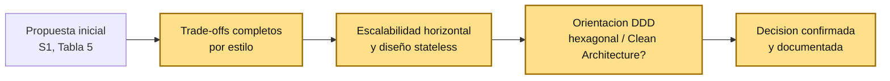

Esta sesión no descarta la propuesta de S1 ni empieza de cero — toma esa primera decisión y la somete a un análisis más profundo: trade-offs explícitos, evidencia real de escalabilidad y una pregunta que S1 todavía no se hizo (¿el dominio de BomERP es lo bastante complejo como para justificar hexagonal o Clean Architecture?).

### 2.2 Estilos arquitectónicos y sus trade-offs

Cada estilo arquitectónico resuelve un problema específico, a cambio de un costo específico — no hay un estilo "mejor" en abstracto, solo un estilo más o menos adecuado para un alcance, un equipo y un momento del proyecto concretos.

Antes de compararlos, vale la pena ver qué tienen en común los siete estilos de esta sesión: todos aparecieron entre 2003 y 2016, lo que justifica llamarlos "modernos" frente a otros patrones muy anteriores y todavía vigentes.

**Tabla 2. Línea de tiempo de patrones y estilos arquitectónicos relacionados (2003-2016)**

| Año | Patrón / estilo | Origen |
|---|---|---|
| 2003 | Domain-Driven Design (DDD) | Eric Evans, libro *Domain-Driven Design: Tackling Complexity in the Heart of Software*. |
| 2003 | Event-Driven Architecture (EDA) | Roy W. Schulte (Gartner), formalizado en *Growing Role of Events in Enterprise Applications*. |
| 2005 | Event Sourcing | Martin Fowler, ensayo que formaliza el patrón (popularizado después por Greg Young). |
| 2005 | Arquitectura hexagonal | Alistair Cockburn. |
| 2008 | Onion Architecture | Jeffrey Palermo. |
| ~2010 | CQRS | Greg Young — lo discute desde ~2006 y lo formaliza en su blog ~2010. |
| 2011-2012 | Microservicios (el término) | Taller de arquitectos cerca de Venecia (2011); el nombre se fija en 2012; el artículo que lo popularizó (Fowler y Lewis) es de 2014. |
| 2012 | Clean Architecture | Robert C. Martin. |
| 2012-2014 | Serverless | Ken Fromm acuña el término (2012); adopción masiva con el lanzamiento de AWS Lambda (2014). |
| 2016 | Microfrontend | ThoughtWorks Technology Radar. |

Ninguno de los siete estilos que profundiza esta sesión (capas, hexagonal, Clean Architecture, monolito modular, microservicios, serverless, microfrontend) tiene más de 25 años — y varios, menos de 15. Eso los distingue de patrones mucho más antiguos y todavía vigentes, como MVC (1978-1979, Trygve Reenskaug, Xerox PARC): MVC no es menos válido, pertenece a otra categoría. Organiza la capa de presentación (cómo se estructura una vista y su interacción con el usuario), no cómo se organiza un sistema de backend completo — por eso MVC, MVP y MVVM no compiten con monolito modular, hexagonal o microservicios: resuelven un problema distinto, a otro nivel de la aplicación.

**Tabla 3. Estilos arquitectónicos modernos**

| Estilo | Qué es | Cuándo conviene | Costo que agrega |
|---|---|---|---|
| **Arquitectura en capas** | El código se organiza en capas horizontales (presentación, negocio, datos), cada una dependiendo solo de la inmediatamente inferior. | Casi cualquier sistema — es la base sobre la que se aplican los demás estilos. | Si se usa sola, no impone límites *entre módulos de dominio*, solo entre capas técnicas. |
| **Arquitectura hexagonal** (puertos y adaptadores) | El dominio queda en el centro, aislado de frameworks y tecnología externa mediante puertos (interfaces) y adaptadores (implementaciones). | El dominio tiene reglas de negocio complejas que deben poder probarse sin levantar infraestructura (base de datos, HTTP). | Agrega indirección (interfaces, mapeos) que un dominio simple no necesita. |
| **Clean Architecture** | Generaliza la idea de la arquitectura hexagonal en círculos concéntricos de dependencia (entidades, casos de uso, adaptadores, frameworks), todos apuntando hacia el centro. | Sistemas grandes donde la lógica de negocio debe sobrevivir a cambios de framework o de tecnología de persistencia. | Requiere disciplina para no romper la regla de dependencia (nada del centro conoce nada de afuera); cuesta más al equipo que recién empieza. |
| **Monolito modular** | Un solo ejecutable, dividido internamente en módulos con límites verificables (no solo carpetas por convención). | Equipo pequeño, un solo despliegue, límites de dominio ya identificados. | Todo se despliega junto — no se puede escalar ni desplegar un módulo por separado. |
| **Microservicios** | Cada módulo de negocio es un proceso independiente, con su propia base de datos y su propio ciclo de despliegue. | Equipos grandes, módulos que necesitan escalar o desplegarse a ritmos distintos. | Complejidad operacional real: red, descubrimiento de servicios, consistencia entre bases de datos distintas, versionado de contratos. |
| **Serverless** (FaaS) | Cada función se despliega y ejecuta por separado, disparada por un evento; el proveedor cloud administra el servidor. | Cargas esporádicas o con picos impredecibles, sin justificación para un proceso corriendo 24/7. | *Cold start*, límite de tiempo de ejecución por invocación, y el mismo problema de consistencia que microservicios, más agudo. |
| **Microfrontend** | Cada fragmento de la interfaz se construye, prueba y despliega por separado; una aplicación contenedora los ensambla. | Varios equipos de frontend trabajando en la misma aplicación, sin coordinar un release único. | Complejidad de integración entre fragmentos, duplicación de dependencias, coherencia visual entre equipos. |

Ningún estilo elimina el trade-off del anterior — lo cambia por otro. Monolito modular cambia "no puedo escalar un módulo por separado" por "no tengo que operar red ni bases de datos distribuidas"; microservicios hace exactamente el cambio contrario.

**Ejemplo de referencia (LP2).** BomERP usa monolito modular con arquitectura en capas dentro de cada módulo (`catalogo/producto/{controller,service,repository,entity}`, ver ADR-001 de LP2) — no hexagonal, no microservicios. La razón documentada en el ADR no es "monolito es más fácil" en abstracto: es que el sílabo de LP2 no evalúa despliegue distribuido, el equipo es pequeño, y todo el sistema se despliega como un único ejecutable — el trade-off de microservicios (complejidad operacional) no tendría ninguna ganancia real a cambio, en este proyecto. Microservicios se estudia conceptualmente aquí, en ADS, y se practica de verdad en el curso de Aplicaciones Distribuidas (una etapa posterior de la cadena BomERP), con un proyecto de referencia propio (`producto-ms`, un reactor Maven multi-módulo) — dos cursos distintos, con el mismo nombre corto de tres letras, pero contenidos y proyectos diferentes.

**Figura 3. Dos ejes independientes: organización interna vs. alcance de despliegue**

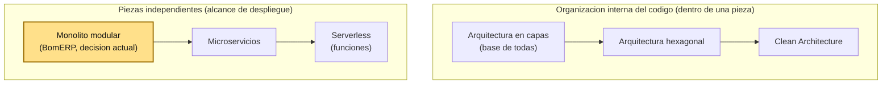

La Figura 3 separa dos preguntas que esta sesión insiste en no mezclar (2.3, "Error frecuente"): cuántas piezas independientes tiene el sistema (eje inferior) y cómo se organiza el código *dentro* de cada pieza (eje superior). Son ejes independientes entre sí — un monolito modular o un microservicio, cada uno por separado, puede construirse con capas, con hexagonal o con Clean Architecture por dentro (2.7). BomERP está en el primer escalón de ambos ejes — capas como organización interna, monolito modular como alcance —, no porque los demás sean superiores, sino porque el alcance real del proyecto no justifica moverse más a la derecha en ninguno de los dos (todavía).

Microfrontend no aparece en ninguno de los dos ejes porque no es una decisión sobre el backend — igual que ya se explicó con MVC/MVVM (2.2, Tabla 2), es la misma idea de piezas independientes aplicada a la capa de presentación, no al backend; por eso se trata por separado (2.9).

La Tabla 3 resume los siete estilos en una fila cada uno — suficiente para compararlos, pero no para reconocer el diagrama típico de cada uno ni para saber dónde se usa en la práctica. Los siguientes siete apartados profundizan uno por uno, en el mismo orden.

### 2.3 Arquitectura en capas, en profundidad

La arquitectura en capas organiza el código en niveles horizontales — cada capa depende solo de la que tiene inmediatamente debajo, nunca al revés, y nunca se salta una capa para llegar directo a otra más abajo.

**Figura 4. Diagrama típico de arquitectura en capas**

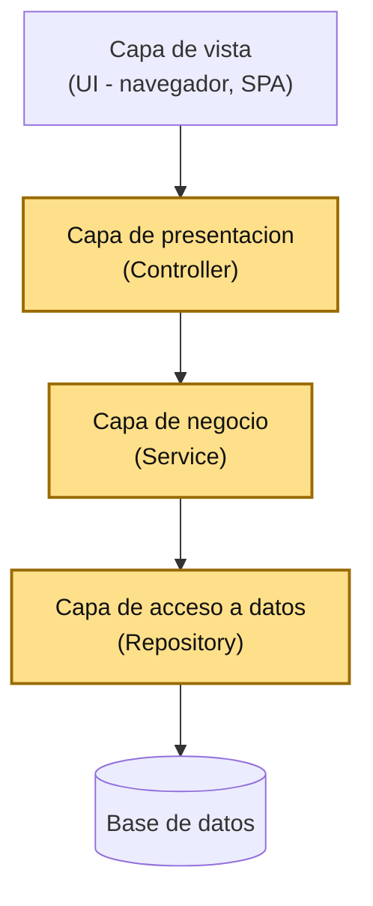

La capa de vista es la única que no vive dentro del backend — es quien consume la API (un navegador, una SPA, otra aplicación). Las tres capas resaltadas sí son las que Spring Boot organiza como código: `Controller` (presentación), `Service` (negocio) y `Repository` (acceso a datos).

**Dónde se usa en la práctica:** es la base casi universal de cualquier aplicación empresarial — no compite con los otros seis estilos, vive **dentro** de ellos. Un monolito modular tiene capas dentro de cada módulo (como BomERP); un microservicio tiene capas dentro de cada servicio; incluso hexagonal y Clean Architecture son, en el fondo, una forma más estricta de organizar capas, con una regla extra sobre la dirección de las dependencias.

**Error frecuente:** confundir "capas" con "monolito" — son ejes distintos. Capas responde "¿cómo se organiza el código dentro de una pieza?"; monolito modular / microservicios responde "¿cuántas piezas desplegables hay?". BomERP usa las dos a la vez: capas dentro de cada módulo, monolito modular como forma de desplegar todos los módulos juntos.

**Ejemplo de referencia (LP2).** `catalogo/producto/{controller,service,repository,entity}` (LP2, desde S1) sigue este flujo exacto: `ProductoController` nunca llama a `ProductoRepository` directo, siempre pasa por `ProductoService` (ADR-001 de LP2).

**Figura 5. La Figura 4, con las clases reales de LP2**

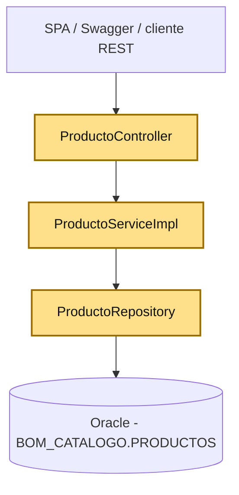

Mismo diagrama, mismas cuatro cajas — la única diferencia con la Figura 4 es que acá cada capa tiene su nombre de clase real, no una etiqueta genérica.

### 2.4 Arquitectura hexagonal (puertos y adaptadores), en profundidad

La arquitectura hexagonal pone el dominio (las reglas de negocio) en el centro, sin que conozca nada de la tecnología que lo rodea. La comunicación con el exterior pasa por **puertos** (interfaces que el dominio define, según lo que necesita) y **adaptadores** (implementaciones concretas de esos puertos, una por cada tecnología externa: REST, base de datos, mensajería).

**Figura 6. Diagrama típico de arquitectura hexagonal**

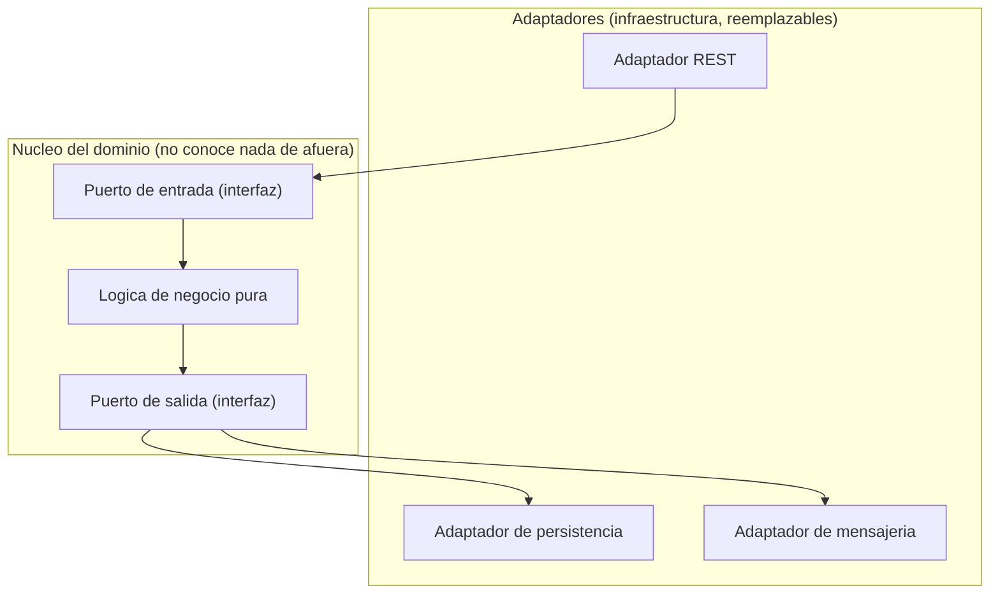

La flecha siempre entra al núcleo por un puerto de entrada y sale por un puerto de salida — nunca un adaptador llama directo a `Logica`, y `Logica` nunca importa una clase de `RestAdapter` ni de `DbAdapter`. Eso es lo que permite probar `Logica` con pruebas unitarias puras, sin levantar servidor HTTP ni base de datos, y lo que permite cambiar de tecnología (por ejemplo, de REST a mensajería) sin tocar el dominio — solo se escribe un adaptador nuevo.

**Dónde se usa en la práctica:** dominios con reglas de negocio genuinamente complejas que deben sobrevivir a cambios de tecnología — cualquier núcleo de negocio que un equipo espera mantener por años, mientras la infraestructura de alrededor (proveedor de pagos, base de datos, mensajería) cambia varias veces sin que el dominio se entere. ThoughtWorks (consultora de arquitectura, ver Bibliografía) documenta este mismo criterio con un caso didáctico: separar la lógica de negocio de un pedido (reglas, cálculos) de sus adaptadores externos (pagos, notificaciones, persistencia), justamente para poder cambiar cualquiera de esos proveedores sin tocar la regla de negocio.

**Ejemplo de referencia (LP2).** `catalogo/producto` no tiene esta estructura, y no debería tenerla todavía — `ProductoServiceImpl` llama directo a `ProductoRepository` (Spring Data JPA), sin un puerto de por medio. No es un error: es que hoy no hay lógica de negocio compleja que justifique la indirección.

**Figura 7. Cómo quedaría `catalogo/producto` si se migrara a hexagonal**

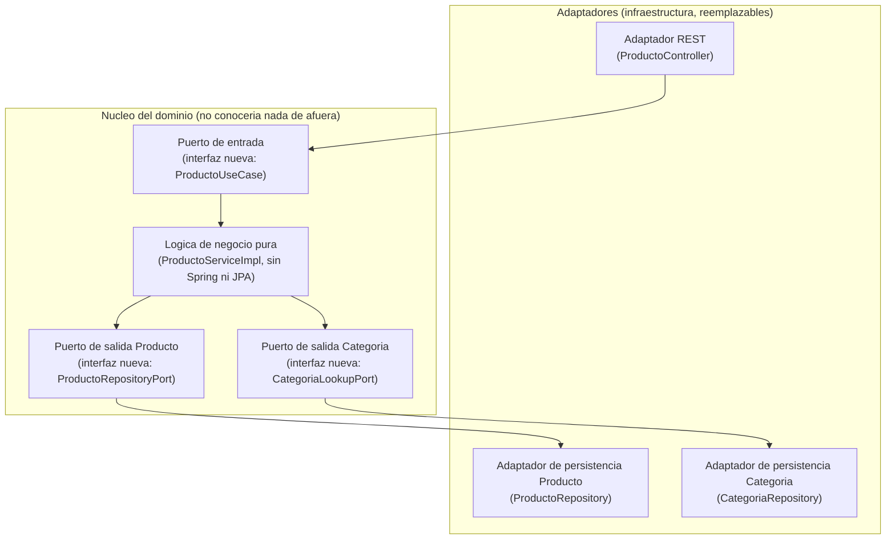

`CategoriaRepository` aparece como un segundo adaptador de salida porque `ProductoServiceImpl` real ya depende de él (para validar `categoriaId`, LP2 S3, 3.9) — no solo de `ProductoRepository`. Una migración a hexagonal tendría que aislar esa dependencia también, con su propio puerto.

`ProductoServiceImpl` hoy cumple *aproximadamente* el rol de "lógica de negocio" de la Figura 6, pero sin los puertos que la aislarían de verdad. Migrar no movería mucho código: `ProductoController` y `ProductoRepository` se quedan donde están, solo pasan a implementar una interfaz nueva en vez de ser llamados directo.

### 2.5 Clean Architecture, en profundidad

Clean Architecture generaliza la idea de hexagonal en **círculos concéntricos**: entidades del dominio en el centro, casos de uso alrededor, adaptadores de interfaz más afuera, y frameworks/herramientas en el borde exterior. La regla que lo sostiene todo es la **regla de dependencia**: el código de un círculo solo puede depender de círculos más internos, nunca de uno más externo.

**Figura 8. Diagrama típico de Clean Architecture (círculos concéntricos)**

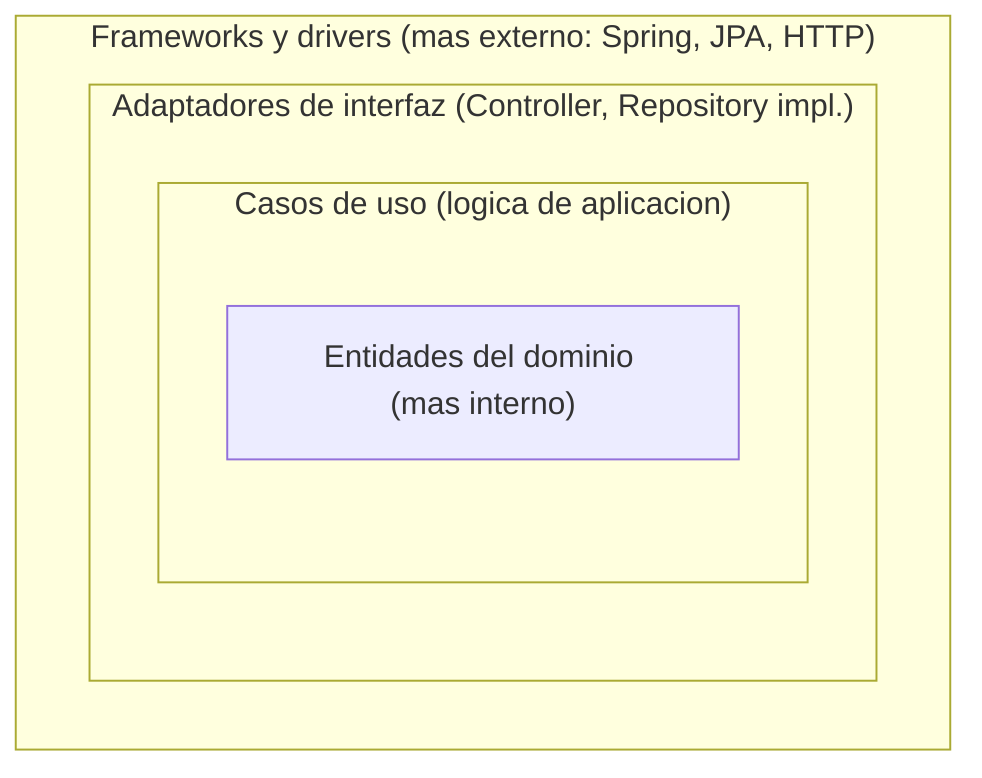

La flecha de dependencia siempre apunta hacia adentro: `Frameworks` puede conocer `Adapters`, `Adapters` puede conocer `UseCases`, `UseCases` puede conocer `Entities` — pero `Entities` no conoce nada de lo que está afuera. Es la misma idea de hexagonal (2.4), expresada como niveles en vez de puertos/adaptadores; en la práctica, muchos equipos usan los dos términos de forma casi intercambiable.

**Dónde se usa en la práctica:** sistemas grandes y de vida larga, donde el equipo espera que la lógica de negocio sobreviva a más de un cambio de framework. El caso más verificable es la propia **Guía de arquitectura de apps de Google para Android** (`developer.android.com`, ver Bibliografía), inspirada explícitamente en Clean Architecture — con un matiz honesto: Google organiza sus capas `Presentación → Dominio → Datos` (dependencia en un solo sentido), mientras que la Clean Architecture original de Martin invierte también la capa de Datos (`Presentación → Dominio ← Datos`, la capa de Datos implementa interfaces que define el Dominio). Es una adaptación pragmática de la idea, no una copia literal de la regla de dependencia — y es exactamente el tipo de decisión que esta sesión pide justificar, no copiar sin cuestionar.

**Ejemplo de referencia (LP2).** Igual que con hexagonal, BomERP aplica los *principios* de separación de capas (Tabla 5 de S1: "parcialmente") sin adoptar la estructura formal completa de círculos — el mismo criterio de 2.11 (DDD) decide si algún módulo llega a justificarlo más adelante.

**Figura 9. Dónde caería cada clase real de LP2 en los círculos de Clean Architecture**

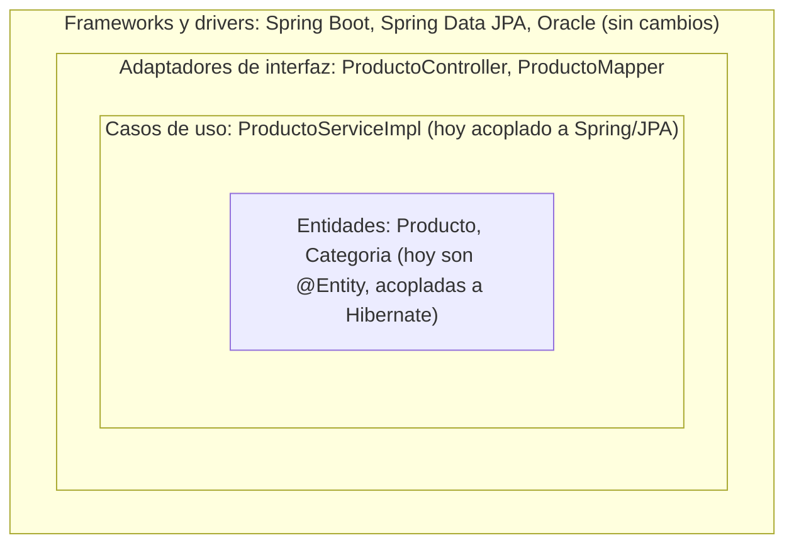

Es casi el mismo ejercicio que la Figura 7 (hexagonal) con otro vocabulario — no es casualidad (2.5): Clean Architecture es la misma idea de aislar el dominio, expresada como círculos en vez de puertos y adaptadores. Lo que hoy "no encaja" en el círculo que le tocaría es siempre lo mismo: `ProductoServiceImpl` (caso de uso) y `Producto`/`Categoria` (entidades) todavía dependen de Spring y de Hibernate — la migración movería esa dependencia hacia afuera, no las reescribiría desde cero.

### 2.6 Monolito modular, en profundidad

Un monolito modular es **un solo proceso desplegable**, pero organizado por dentro en módulos con límites explícitos — la diferencia con un monolito "a secas" (todo mezclado, sin límites) es justamente esa organización interna, verificada por herramientas, no solo por convención de carpetas.

**Figura 10. Diagrama típico de un monolito modular**

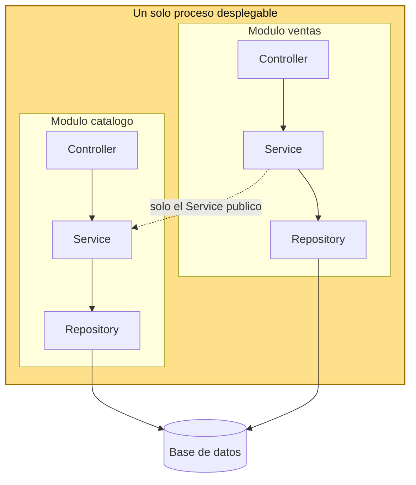

Todos los módulos comparten el mismo proceso y el mismo ciclo de despliegue — cuando se despliega una versión nueva, se despliega el ejecutable completo, no un módulo por separado. La flecha punteada entre `ventas` y `catalogo` es la regla clave: un módulo puede llamar al `Service` público de otro, nunca a su `Repository` — el mismo límite que impondría un microservicio, pero verificado en tiempo de compilación/prueba (Spring Modulith), no por una llamada de red.

**ACID por defecto: la contraparte de BASE.** Así como en 2.7 el teorema CAP obliga a microservicios a elegir entre Consistencia y Disponibilidad, aquí ocurre lo contrario: al vivir en un solo proceso con una sola base de datos, cualquier operación puede ejecutarse dentro de una transacción **ACID** completa (Atomicidad, Consistencia, Aislamiento, Durabilidad) sin ceder nada a cambio — no hay red que particionar. La alternativa que sí tiene que asumir un sistema distribuido se llama **BASE** (*Basically Available, Soft state, Eventually consistent*, Pritchett, 2008): disponible casi todo el tiempo, con un estado que no es inmediatamente consistente entre nodos y que converge después. Un monolito modular no necesita elegir BASE — tiene ACID de fábrica.

**Tabla 4. ACID vs. BASE: lo que el monolito modular no tiene que negociar**

| Propiedad | ACID (monolito modular) | BASE (lo que asumiría un sistema distribuido) |
|---|---|---|
| Consistencia | Fuerte, garantizada por la transacción | Eventual, converge después de un tiempo |
| Disponibilidad | No es un trade-off — no hay partición de red que resolver | Se prioriza sobre la consistencia inmediata (2.7, Tabla 5) |
| Ejemplo | `@Transactional` cubre toda la operación en una sola transacción | Un servicio acepta un dato que puede estar temporalmente desactualizado (2.7, Figura 13) |

**Límites internos: el Acyclic Dependencies Principle (ADP).** Ganar ACID gratis no significa que un monolito modular pueda organizarse de cualquier forma por dentro — la teoría que gobierna sus límites internos es el **Acyclic Dependencies Principle** (Robert C. Martin, 1996-1997, junto con el Common Closure Principle y el Common Reuse Principle): el grafo de dependencias entre módulos no puede tener ciclos. Si `catalogo` dependiera de `ventas` y `ventas` de `catalogo`, ningún módulo se podría desplegar, probar ni entender por separado — la "modularidad" sería solo de nombre. ADP es la contraparte de SOLID (ADS S3) a nivel de módulo, en vez de a nivel de clase.

**Figura 11. Grafo de dependencias entre módulos: con ciclo (viola ADP) vs. sin ciclo**

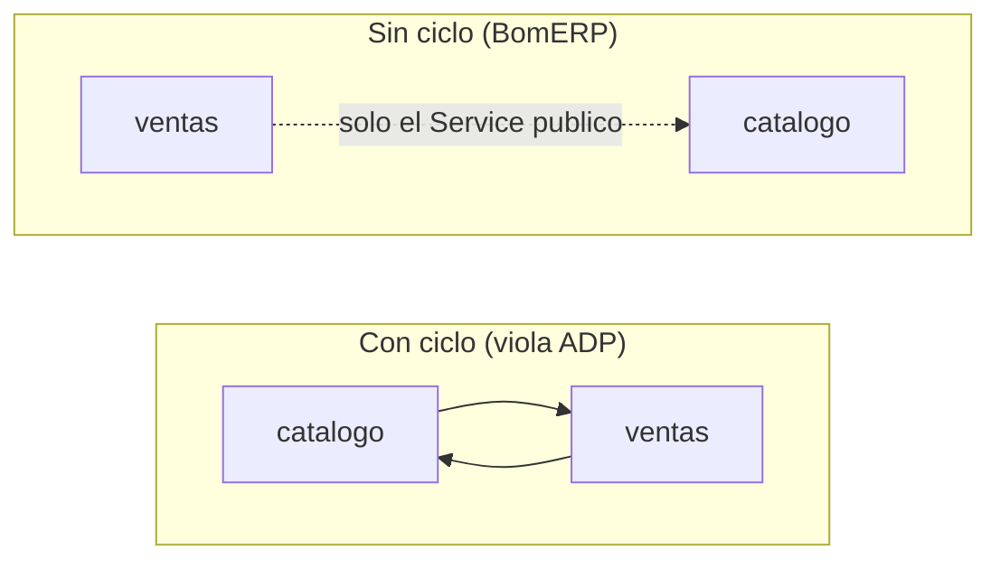

**Dónde se usa en la práctica:** equipos pequeños o medianos, productos con un solo ciclo de despliegue, o empresas que empiezan como monolito modular y solo separan un módulo en microservicio el día que un problema real (no anticipado) lo justifica — Shopify es un caso frecuentemente citado en la industria de un monolito modular a gran escala, mantenido así de forma deliberada.

**Ejemplo de referencia (LP2).** Esta es exactamente la arquitectura real de BomERP hoy — la Figura 10 no es un ejemplo genérico, es el diagrama de `lp2/bomerp-backend` (ADR-001 de LP2), con `catalogo` como único módulo real hasta ahora y `ventas` previsto para LP2 S4. La ganancia de ACID tampoco es teórica: el bug de `LazyInitializationException` que corrigió LP2 S3 se resolvió agregando `@Transactional` a `ProductoServiceImpl.crear()` — guardar `Producto`, resolver `Categoria` y construir la respuesta corren dentro de una única transacción, sin coordinar nada entre procesos porque no hay más de uno. Y el límite entre módulos (ADP) no se sostiene por convención: `ModularityTests` (LP2, desde S1) ejecuta `ApplicationModules.of(BomErpApplication.class).verify()` y falla la build si algún módulo introduce un ciclo de dependencias.

### 2.7 Microservicios, en profundidad

En microservicios, cada módulo de negocio es un **proceso independiente**, con su propia base de datos, su propio ciclo de despliegue y, generalmente, su propio repositorio de código. La comunicación entre servicios es siempre por red (HTTP, mensajería), nunca por llamada directa en memoria.

La definición es más simple de lo que parece si no se mezcla con otra pregunta distinta: microservicios solo decide **cuántos procesos independientes hay y dónde están sus límites** — no dice nada sobre cómo se organiza el código *dentro* de cada uno. Cada microservicio, por separado, puede construirse con capas (2.3), con arquitectura hexagonal (2.4), con Clean Architecture (2.5), o incluso sin ninguna disciplina interna — son decisiones independientes. Es común, de hecho, que un microservicio con lógica de negocio compleja use hexagonal por dentro, mientras otro más simple (un CRUD) use solo capas.

**Figura 12. Diagrama típico de microservicios**

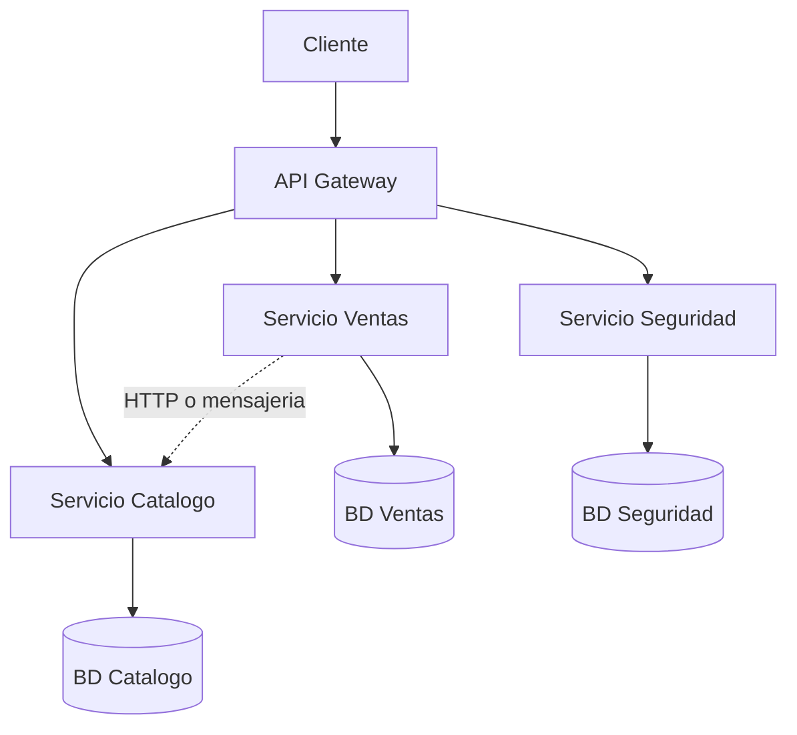

Cada base de datos le pertenece a un solo servicio — ningún otro servicio la consulta directo, ni siquiera para leer; si `Ventas` necesita un dato de `Catalogo`, se lo pide por red (`S2 -.-> S1`), nunca leyendo la base de `Catalogo` directamente. Esa regla es la misma que un monolito modular impone entre módulos (2.6) — la diferencia es que acá se aplica por proceso y por red, no dentro de un mismo ejecutable.

**Escalabilidad independiente, la otra cara de separar en procesos.** A diferencia de un monolito modular (2.6), donde toda la aplicación escala junta — más instancias del ejecutable completo —, en microservicios cada servicio escala según su propia carga: si el `Servicio Catalogo` recibe mil veces más tráfico de lectura que el `Servicio Seguridad`, se agregan instancias solo de `Catalogo`, sin tocar el resto. Esa independencia es la ganancia real que compensa la complejidad operacional (2.2, Tabla 3) — sin ella, separar en procesos no tendría sentido.

**El costo real: teorema CAP.** El teorema CAP dice que un sistema distribuido no puede garantizar al mismo tiempo tres propiedades: **Consistencia** (todas las réplicas ven el mismo dato al mismo tiempo), **Disponibilidad** (toda petición recibe una respuesta) y **Tolerancia a particiones** (el sistema sigue funcionando aunque falle la red entre nodos). En microservicios, la partición de red **va a ocurrir** — dos servicios se comunican por red, y la red falla tarde o temprano —, así que la P no es negociable; la decisión real está entre C y A cuando eso pasa.

**Tabla 5. Teorema CAP: la decisión real en microservicios**

| Si prioriza | Qué gana | Qué pierde | Ejemplo típico |
|---|---|---|---|
| Consistencia (CP) | Todos los servicios ven siempre el mismo dato | Ante una partición de red, el sistema puede rechazar peticiones hasta poder confirmar el dato real | Un servicio de inventario que no acepta una venta si no puede confirmar el stock exacto con `Catalogo` en ese instante |
| Disponibilidad (AP) | El sistema sigue respondiendo aunque haya partición de red | Los datos pueden quedar temporalmente desactualizados entre servicios | `Ventas` acepta un pedido con el precio que tenía cacheado de `Catalogo`, aunque haya cambiado hace unos segundos |

La mayoría de sistemas de microservicios reales eligen AP con **consistencia eventual**: cada servicio sigue respondiendo con los datos que tiene, y la inconsistencia temporal se reconcilia después — por ejemplo, con eventos (`Catalogo` publica "el precio cambió", `Ventas` actualiza su copia cuando el evento le llega). El patrón que coordina operaciones que cruzan varios servicios sin una transacción distribuida real se llama **Saga**: una secuencia de pasos locales, cada uno con su propia compensación si algo falla más adelante, en vez de una única transacción ACID sobre varias bases de datos.

**Figura 13. Consistencia fuerte vs. consistencia eventual, si BomERP migrara a microservicios**

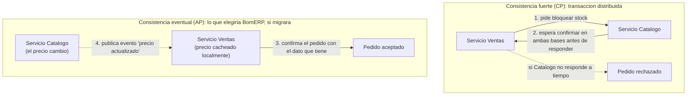

**Dónde se usa en la práctica:** organizaciones grandes, con muchos equipos trabajando en paralelo que necesitan desplegar sin coordinarse entre sí, y servicios con necesidades de escala muy distintas entre ellos (por ejemplo, un servicio de búsqueda que recibe mil veces más tráfico que uno de facturación) — casos frecuentemente citados son Netflix, Amazon y Uber, documentados en sus propios blogs de ingeniería.

**Ejemplo de referencia (LP2).** BomERP no usa microservicios — el ADR-001 de LP2 lo dice explícitamente: el costo (red, bases de datos distribuidas, versionado de contratos, y ahora también CAP y consistencia eventual) no tiene ninguna ganancia real a cambio en un proyecto de equipo pequeño con un solo ciclo de despliegue. Con una sola Oracle compartida, `ProductoServiceImpl` y `CategoriaServiceImpl` (LP2 S3) leen el dato real dentro de la misma transacción — no hay partición de red que resolver, ni necesidad de elegir entre C y A. Esa es la ganancia concreta de no separar en procesos todavía: no es que el equipo no sepa resolver consistencia eventual, es que el proyecto no paga ese costo si no lo necesita.

### 2.8 Serverless, en profundidad

Serverless (o *Function as a Service*, FaaS) lleva la independencia de piezas un paso más allá que microservicios (2.7): en vez de desplegar un proceso que corre todo el tiempo, se despliega una **función individual** que el proveedor cloud ejecuta solo cuando un evento la dispara (una petición HTTP, un mensaje en cola, un archivo subido) — y se apaga apenas termina. El equipo no administra servidores ni contenedores, ni siquiera el ciclo de vida del proceso: solo el código de la función.

**Nube no es sinónimo de serverless.** "Ir a la nube" es una decisión distinta, en un eje que ni la Figura 3 (2.2) cubre: no es "cuántas piezas independientes hay" ni "cómo se organiza el código dentro de una pieza", es **quién opera cada pieza de infraestructura**. Un monolito modular puede desplegarse en la nube sin volverse serverless — el mismo `bomerp-backend`, el mismo proceso, corriendo en una VM o un contenedor administrado (AWS ECS, Azure App Service, Google Cloud Run) en vez de un servidor propio. Serverless siempre implica nube; nube no implica serverless.

Dentro de "ir a la nube" hay todavía otra decisión, independiente de la anterior: **IaaS** (la nube solo da la máquina virtual vacía; el equipo instala y opera su propio Kafka, su propia base de datos, su propio Grafana, igual que lo haría on-premise) frente a **servicios administrados** (el proveedor ya tiene Kafka, la base de datos o el *gateway* como producto — el equipo solo los consume, no los opera). Migrar de un Kafka propio a uno administrado (AWS MSK, Confluent Cloud) reduce la carga operativa, pero cuesta *vendor lock-in*: portar ese Kafka administrado a otro proveedor no es tan simple como mover una VM de un lado a otro.

**Figura 14. Diagrama típico de serverless (FaaS)**

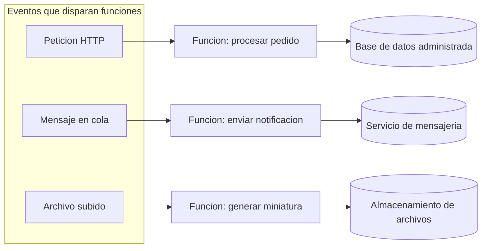

**El costo real: *cold start* y ejecución acotada.** Cada función se apaga por completo entre invocaciones — si pasó suficiente tiempo desde la última llamada, la siguiente paga un ***cold start***: el proveedor tiene que aprovisionar el entorno de ejecución desde cero antes de correr el código, lo que puede agregar cientos de milisegundos o varios segundos de latencia. Además, cada función corre con un límite estricto de tiempo de ejecución — no sirve para procesos largos. Y hereda el mismo problema de consistencia que microservicios (2.7) de forma más aguda: como no hay proceso persistente, no hay ni siquiera memoria local entre invocaciones donde cachear nada.

**Dónde se usa en la práctica:** cargas de trabajo esporádicas o con picos impredecibles — procesar una imagen subida, responder a un webhook, correr un job programado — donde pagar por un servidor corriendo 24/7 no tiene sentido. AWS Lambda (2014, ver Tabla 2 y Bibliografía) es el caso más citado y el que popularizó el modelo.

**Ejemplo de referencia (LP2).** BomERP no usa serverless, y no le falta hoy: cada endpoint de `catalogo/producto` corre en un proceso que ya está activo (`bomerp-backend`), sin picos de carga esporádicos que justifiquen pagar solo por invocación. Si en algún momento apareciera una tarea puntual y poco frecuente (por ejemplo, generar un reporte mensual pesado), sería un candidato razonable para extraerla como función serverless, sin migrar el resto del backend — la misma lógica de "extraer solo lo que lo justifica" que ya aplica microservicios (2.7) o hexagonal (2.4).

### 2.9 Microfrontend, en profundidad

Microfrontend aplica la misma idea de microservicios (2.7) — piezas independientes, con su propio ciclo de despliegue — pero a la **capa de presentación**, no al backend. Cada equipo puede construir, probar y desplegar un fragmento de la interfaz (por ejemplo, "catálogo" y "ventas" como fragmentos separados) que se ensamblan en una sola aplicación visible para el usuario final.

A diferencia de los otros seis estilos de esta sesión — todos sobre cómo se organiza el backend —, Microfrontend vive del otro lado de la API: es la misma distinción que ya se hizo con MVC/MVVM (2.2, Tabla 2). No compite con monolito modular o microservicios, los complementa desde la capa de presentación.

**Figura 15. Diagrama típico de microfrontend**

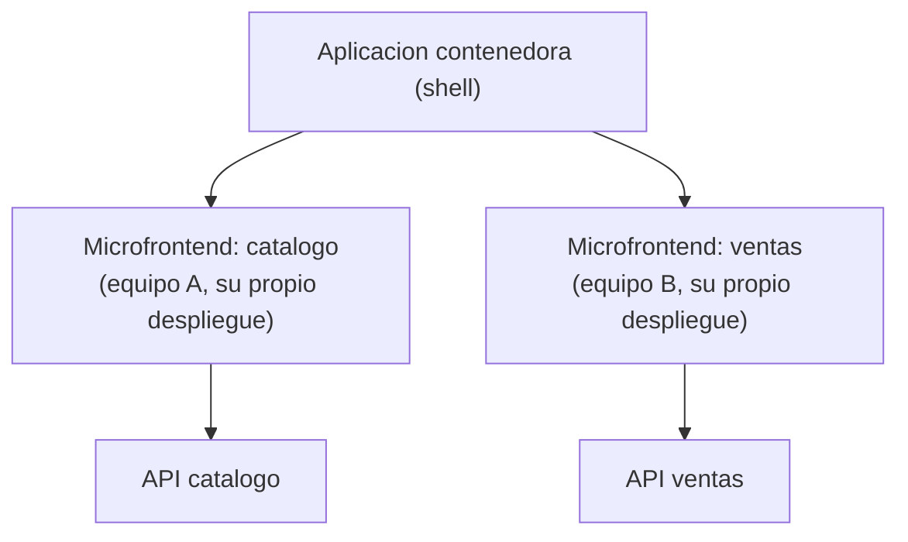

**Dónde se usa en la práctica:** organizaciones grandes con varios equipos de frontend trabajando en la misma aplicación, que necesitan desplegar su parte sin coordinar un release único de todo el frontend — Zalando (Project Mosaic), IKEA (composición del catálogo por fragmentos) y Spotify (su cliente de escritorio, con paneles independientes) son casos documentados públicamente en sus propios blogs de ingeniería.

**Ejemplo de referencia (LP2).** LP2 no usa microfrontend, y no debería usarlo todavía: la SPA de LP2 (prevista para S7) la construye un solo equipo pequeño, sin necesidad de desplegar fragmentos por separado — coordinar múltiples despliegues de UI solo paga cuando hay varios equipos de frontend compitiendo por el mismo release, que no es el caso de BomERP.

### 2.10 Escalabilidad horizontal y diseño *stateless*

**Escalabilidad horizontal**: la capacidad de atender más carga agregando más copias idénticas de la aplicación (más instancias), en vez de agregarle más recursos a una sola instancia (escalar verticalmente). Para que escalar horizontalmente funcione, cualquier petición debe poder ser atendida por **cualquier** instancia, indistintamente.

**Diseño *stateless***: que ninguna instancia guarde en memoria información específica de un cliente entre una petición y la siguiente (por ejemplo, datos de sesión). Si una instancia guardara ese estado, las peticiones de ese cliente tendrían que ir siempre a la misma instancia (*sticky session*) — lo que rompe la promesa de "cualquier instancia atiende cualquier petición" y limita cuánto se puede escalar.

Los dos conceptos están relacionados pero no son lo mismo: *stateless* es una propiedad del diseño (nadie guarda estado por cliente); escalabilidad horizontal es la consecuencia práctica que ese diseño hace posible.

**Ejemplo de referencia (LP2).** LP2 ya demostró esto con evidencia real, no como ejercicio teórico: S1 (3.3) levantó dos instancias de `bomerp-backend` en paralelo (puertos `8080` y `8081`), ambas conectadas a la misma Oracle, y verificó que cualquiera de las dos responde `/api/v1/hello` y `/actuator/health` sin ninguna coordinación entre ellas. Eso funciona porque el backend nunca guardó estado de cliente en memoria — ni siquiera hay autenticación todavía (JWT se difiere a S10, ver ADR-004 de LP2), así que no hay sesión que sincronizar entre instancias. Cuando JWT llegue en S10, seguirá siendo *stateless*: un JWT es un token autocontenido que el cliente reenvía en cada petición — ninguna instancia necesita recordar quién inició sesión.

**Figura 16. Por qué el diseño *stateless* es lo que permite escalar horizontalmente**


En el bloque de arriba, la segunda petición del cliente cae en una instancia distinta que nunca vio la primera — si el estado viviera en memoria, se perdería. En el bloque de abajo (el real), no importa a qué instancia llegue cada petición: la única fuente de estado es Oracle, compartida por todas.

### 2.11 Domain-Driven Design: cuándo orienta hacia hexagonal o Clean Architecture

DDD (introducido como adelanto en S2, 2.5) distingue el dominio (las reglas de negocio) de todo lo demás (frameworks, base de datos, HTTP). Cuando ese dominio es simple — pocas reglas, poca lógica que no sea CRUD — separar el dominio del resto con puertos y adaptadores (hexagonal) o con círculos concéntricos (Clean Architecture) agrega una indirección que no paga su costo: más interfaces, más mapeos, más código para el mismo resultado.

La orientación cambia cuando el dominio gana complejidad real: reglas de negocio que no dependen de ninguna tecnología concreta, lógica que debe poder probarse sin levantar base de datos ni servidor HTTP, o un **agregado** (límite de consistencia de DDD) con invariantes que deben protegerse sin importar quién lo modifique. Ahí, aislar el dominio deja de ser indirección innecesaria y pasa a ser lo que hace posible probar y mantener esa lógica sin arrastrar infraestructura.

**Ejemplo de referencia (LP2).** Hoy, `catalogo/producto` es esencialmente CRUD con una validación de referencia (LP2 S3) — no hay lógica de negocio compleja que aislar del framework todavía. Eso confirma la Tabla 5 de S1: hexagonal y Clean Architecture no aplican "para este corte". Pero `ventas/Venta-DetalleVenta` (LP2 S4, cabecera-detalle con cálculos y control de stock) es un candidato más real a agregado DDD — si su lógica de cálculo y consistencia creciera lo suficiente, sería el primer módulo de BomERP donde valdría la pena evaluar aislarlo del framework con un puerto explícito. Hoy todavía no se justifica: la complejidad real hay que verla en el código antes de pagar el costo de la indirección, no anticiparla.

## 3. Aplica: actividad práctica guiada

Tiempo: 2h.

**Actividad:** comparación guiada de los siete estilos arquitectónicos contra BomERP, con trade-offs, evidencia de escalabilidad horizontal, diseño *stateless* y orientación DDD (Producto de la sesión en 1.4).

**Propósito de la actividad:** justificar con evidencia real, no con preferencia, el estilo arquitectónico ya elegido para el proyecto — confirmándolo donde corresponda y documentando explícitamente por qué las alternativas no aplican todavía.

**Orientaciones metodológicas:** en el laboratorio, el docente evalúa cada estilo contra BomERP paso a paso frente a la clase, con el código y los ADR reales de LP2 abiertos, **como ejemplo de referencia** — no todos los equipos llevan LP2 en este ciclo. Los pasos 3.2-3.4 y 3.6 usan LP2 porque ya tiene código real que verificar; si tu equipo no lleva LP2, aplica el mismo criterio ahora mismo sobre tu propio backend (los puntos equivalentes están en 4.1, numerados igual) en vez de esperar a la actividad autónoma.

**Actividades para realizar:**

- **3.1** Profundizar la evaluación de estilos arquitectónicos.
- **3.2** Verificar escalabilidad horizontal con evidencia real.
- **3.3** Verificar el diseño *stateless*.
- **3.4** Evaluar si DDD orienta hacia hexagonal o Clean Architecture.
- **3.5** Documentar el hallazgo o la confirmación.
- **3.6** Relacionar con LP2 y BD2.
- **3.7** (opcional) Spike de arquitectura hexagonal.

### 3.1 Profundizar la evaluación de estilos arquitectónicos

**Producto del paso:** tabla de trade-offs de los siete estilos, aplicada a BomERP.

**Tabla 6. Trade-offs de los siete estilos, aplicados a BomERP**

| Estilo | ¿Aplica a BomERP hoy? | Trade-off que se ganaría | Trade-off que se pagaría |
|---|---|---|---|
| Arquitectura en capas (dentro de cada módulo) | Sí | Separación clara controller/service/repository/entity | No impone límites entre módulos de dominio por sí sola (eso lo da Modulith) |
| Arquitectura hexagonal | No, todavía | Dominio aislado de framework, más fácil de probar sin infraestructura | Interfaces y mapeos adicionales que hoy no protegen ninguna lógica compleja |
| Clean Architecture | Parcial (principios, no estructura formal) | Dominio protegido de cambios de framework a largo plazo | Disciplina y código adicional que el corte actual de LP2 no evalúa |
| Monolito modular | Sí | Un solo despliegue, límites verificados por Spring Modulith sin costo operacional | No se puede escalar ni desplegar un módulo por separado |
| Microservicios | No | Escalar y desplegar módulos por separado | Red, bases de datos distribuidas, versionado de contratos — sin equipo ni alcance que lo justifique |
| Serverless | No | Pagar solo por invocación, sin administrar servidores | *Cold start*, ejecución acotada — sin cargas esporádicas que lo justifiquen |
| Microfrontend | No | Despliegue independiente por fragmento de UI | Complejidad de integración — un solo equipo de frontend, sin necesidad de coordinar releases |

Esta tabla profundiza la Tabla 5 de S1 (que solo respondía sí/no) agregando explícitamente qué se gana y qué se paga en cada caso — la justificación real está en esas dos columnas, no en el sí/no.

Dos filas no se llenan igual que las demás: la de **Monolito modular** se justifica citando ACID y ADP (2.6), no solo "es más simple"; la de **Microservicios** se justifica citando el teorema CAP (2.7), no solo "más complejidad operacional". Repetir la conclusión sin nombrar el concepto que la sostiene cuenta como trade-off superficial en la rúbrica (4.6).

**Cómo verificar ACID y ADP con evidencia, no solo de memoria:**

- **ACID**: identifica en el código la operación que escribe más de una entidad relacionada en un mismo caso de uso (en LP2, `ProductoServiceImpl.crear()`, que guarda `Producto` y resuelve `Categoria`) y confirma que está cubierta por `@Transactional` de principio a fin. Si tu equipo no lleva LP2, aplica el mismo chequeo sobre tu propio service layer: busca el método que más entidades toca en una sola operación y verifica si tu framework la envuelve en una transacción.
- **ADP**: en LP2, corre `mvnw test -Dtest=ModularityTests` y confirma que pasa — esa prueba falla la build si algún módulo introduce un ciclo de dependencias. Si tu proyecto usa Spring Modulith, corre el equivalente; si no tiene una herramienta que lo verifique, revisa manualmente los `import` de tus paquetes de módulo y confirma que ninguno importa de vuelta a un módulo que ya depende de él.

### 3.2 Verificar escalabilidad horizontal con evidencia real

**Producto del paso:** confirmación de que BomERP escala horizontalmente, con evidencia real de LP2.

Repasa LP2 S1 (3.3, Figura 7): dos instancias de `bomerp-backend`, puertos `8080` y `8081`, ambas conectadas a la misma Oracle. Si tienes el proyecto de LP2 disponible, reproduce los comandos de 3.3.1-3.3.2 de esa guía y confirma que ambas instancias responden de forma independiente.

Si tu equipo no lleva LP2, aplica el mismo chequeo ahora sobre tu propio backend: levanta dos instancias en paralelo si tu stack lo permite, o justifica explícitamente por qué no aplica todavía (4.1, punto 2) — no lo dejes para la actividad autónoma.

**Tabla 7. Evidencia de escalabilidad horizontal**

| Verificación | Resultado esperado (LP2 S1, 3.3.2) |
|---|---|
| `GET /api/v1/hello` en el puerto 8080 | Responde, sin depender de la instancia 8081 |
| `GET /api/v1/hello` en el puerto 8081 | Responde, sin depender de la instancia 8080 |
| `GET /actuator/health` en ambos puertos | `200 OK` en los dos, de forma independiente |
| Configuración necesaria para que ambas compartan estado | Ninguna — ambas usan la misma Oracle como única fuente de estado |

### 3.3 Verificar el diseño *stateless*

**Producto del paso:** confirmación explícita de por qué BomERP es *stateless* hoy.

Revisa el código real de `ProductoServiceImpl`/`CategoriaServiceImpl` (LP2 S1-S3): ningún método guarda datos en un campo de instancia entre peticiones — cada método recibe todo lo que necesita como parámetro, y el único estado que persiste vive en Oracle. Revisa también ADR-004 de LP2: JWT (cuando llegue en S10) es un token autocontenido, verificado en cada petición, sin sesión guardada en el servidor.

Si tu equipo no lleva LP2, revisa tu propio service layer con el mismo criterio: ¿algún campo de instancia guarda datos de un cliente entre peticiones? (4.1, punto 3).

**Error frecuente**: confundir "no tiene autenticación todavía" con "es *stateless* por eso". BomERP es *stateless* por diseño (nada de estado de cliente en memoria), no porque le falte JWT — y seguirá siendo *stateless* cuando JWT se implemente en S10.

### 3.4 Evaluar si DDD orienta hacia hexagonal o Clean Architecture

**Producto del paso:** evaluación honesta de la complejidad real del dominio de BomERP hoy.

Revisa `catalogo/categoria` y `catalogo/producto` (LP2 S1-S3): CRUD, una validación de referencia, sin reglas de negocio que dependan de cálculos complejos o de invariantes multi-entidad. Compáralo con lo que se anticipa para `ventas/Venta-DetalleVenta` (LP2 S4, todavía no implementado): cabecera-detalle con cálculos, control de stock y una operación atómica — más cerca de un agregado DDD real.

Si tu equipo no lleva LP2, aplica el mismo análisis sobre los módulos de tu propio dominio: ¿cuál es hoy el más simple (CRUD) y cuál el más cercano a un agregado real? (4.1, punto 4).

**Tabla 8. ¿El dominio ya justifica hexagonal o Clean Architecture?**

| Módulo | Complejidad real hoy | ¿Justifica aislar el dominio? |
|---|---|---|
| `catalogo` (LP2 S1-S3) | CRUD + validación de referencia | No — la indirección no protegería ninguna lógica que hoy no exista |
| `ventas` (previsto, LP2 S4) | Cabecera-detalle, cálculos, control de stock, operación atómica | Todavía por verse — candidato más real, se evalúa cuando el código exista |

### 3.5 Documentar el hallazgo o la confirmación

**Producto del paso:** conclusión documentada, con su justificación.

A diferencia de S3 (donde el hallazgo esperado era una tensión de diseño), acá el resultado más probable es una **confirmación**: monolito modular con Spring Modulith sigue siendo la elección correcta para BomERP, con evidencia real de escalabilidad horizontal y diseño *stateless*, y sin que el dominio actual justifique todavía hexagonal o Clean Architecture. Documentar una confirmación bien justificada es tan válido como documentar un hallazgo — lo que se evalúa es la calidad del razonamiento, no que aparezca un problema donde no lo hay.

### 3.6 Relacionar con LP2 y BD2

**Producto del paso:** matriz de integración de la sesión.

**Tabla 9. Matriz de integración ADS-LP2-BD2 (S4)**

| Criterio evaluado | Evidencia real en LP2 | Relación con BD2 |
|---|---|---|
| Monolito modular con límites verificados | `ModularityTests` (LP2, desde S1); ADR-001 y ADR-002 | Un esquema Oracle por módulo funcional (`BOM_CATALOGO`, `BOM_VENTAS`), mismo criterio de límite |
| Escalabilidad horizontal | Dos instancias en paralelo (LP2 S1, 3.3) | Ambas instancias comparten la misma Oracle — la base de datos es el punto de escalabilidad a vigilar, no el backend |
| Diseño *stateless* | Sin sesión en memoria; JWT diferido y autocontenido (ADR-004) | — |
| Orientación DDD | `catalogo` no la justifica todavía; `ventas` es candidato (LP2 S4) | — |

Sesión equivalente en los otros dos cursos, misma semana: LP2 y BD2 todavía no publican su guía de S4 en este repositorio.

Esta matriz es específica de BomERP, donde ADS, BD2 y LP2 comparten el mismo repositorio. Si tu equipo trabaja un proyecto distinto, documenta la matriz equivalente entre tus propios artefactos de ADS y el código o la base de datos que tu equipo sí construya — la estructura (criterio, evidencia real, relación con la base de datos) es la que importa, no los nombres de LP2/BD2.

**Evidencia de aprendizaje:**

- Tabla de trade-offs de los siete estilos arquitectónicos, aplicada a BomERP.
- Evidencia real de escalabilidad horizontal (LP2 S1, 3.3) verificada.
- Justificación explícita del diseño *stateless*.
- Evaluación de si DDD orienta hacia hexagonal o Clean Architecture, con al menos un módulo real analizado.
- Conclusión documentada (confirmación o hallazgo), con su justificación.
- Matriz de integración con LP2 y BD2.

### 3.7 Spike opcional: envolver `ProductoServiceImpl` con puertos hexagonales

!!! note "Opcional"
    Este paso no forma parte de las tareas obligatorias (3.1-3.6) ni de la rúbrica (4.6). Complétalo solo si te queda tiempo en el laboratorio.

**Producto del paso (opcional):** una implementación mínima y descartable de los puertos que bosqueja la Figura 7 (2.4), solo para sentir la indirección real de hexagonal — no se integra al proyecto.

Si tienes LP2 disponible (o tu propio proyecto tiene una estructura similar controller/service/repository), en una rama descartable: crea una interfaz `ProductoUseCase` (puerto de entrada) y una interfaz `ProductoRepositoryPort` (puerto de salida), y haz que `ProductoServiceImpl` implemente la primera y dependa de la segunda en vez de depender directo de `ProductoRepository`. No hace falta más que eso — ni pruebas nuevas, ni integrarlo a `main`.

**Reflexión esperada (2-3 líneas):** ¿Cuánto código cambió realmente? ¿Qué ganaste a cambio de esa indirección, y se sintió proporcional al beneficio para la complejidad real de `catalogo/producto` hoy (2.11)?

## 4. Crea: actividad autónoma

Tiempo: 2h fuera del aula.

### 4.1 Actividad

Evaluación autónoma de estilos arquitectónicos, escalabilidad horizontal, diseño *stateless* y orientación DDD sobre el proyecto propio del equipo, documentada en evidencia individual.

Completa y evidencia estas tareas:

1. Elaborar la tabla de trade-offs de los siete estilos arquitectónicos, aplicada a tu propio proyecto.
2. Verificar (o justificar por qué no aplica todavía) la escalabilidad horizontal de tu backend.
3. Justificar explícitamente si tu diseño es *stateless*, y por qué.
4. Evaluar si la complejidad real de tu dominio justifica hexagonal o Clean Architecture en algún módulo.
5. Documentar tu conclusión (confirmación o hallazgo), con su justificación.

### 4.2 Propósito

Que cada estudiante demuestre, de forma individual y fuera del aula, que puede justificar con evidencia real una decisión arquitectónica, sin el acompañamiento del docente.

Esta actividad autónoma se desarrolla sobre el proyecto de fin de curso del equipo. El producto de la unidad se construye por acumulación de los avances de cada sesión; por eso, la evidencia de esta sesión debe incorporarse a la documentación del proyecto y quedar trazable en GitHub.

### 4.3 Indicaciones

Entrega un PDF con el siguiente nombre:

```text
S04_ADS_Equipo##_ApellidoNombre.pdf
```

Cada captura de pantalla del informe debe mostrar, sin recortar, el reloj del sistema (fecha y hora) y tu usuario o foto de perfil (Windows, VS Code o navegador) visibles en pantalla — es lo que permite verificar que la evidencia es tuya y que corresponde al momento real de tu trabajo.

#### 4.3.1 Estructura del informe

**Datos del estudiante**

- Nombre:
- Equipo:
- Sesión: S04 - Arquitecturas Modernas
- Rol o aporte realizado:
- Link de GitHub:

**Evidencia técnica**

Incluye capturas o extractos con una breve explicación debajo de cada uno, organizados en los mismos 4 bloques de la rúbrica (4.6):

1. *Trade-offs de estilos arquitectónicos*
    - Tabla de trade-offs aplicada a tu proyecto.
2. *Escalabilidad horizontal*
    - Evidencia de verificación (o justificación de por qué no aplica todavía).
3. *Diseño stateless*
    - Justificación explícita, con código real citado.
4. *Orientación DDD*
    - Evaluación de al menos un módulo real de tu proyecto.

**Error o hallazgo**

Describe al menos un hallazgo real (no necesariamente un error — puede ser una confirmación bien justificada, como en 3.5).

**Reflexión técnica breve**

Responde en 5 a 8 líneas:

```text
¿Por qué una decisión arquitectónica tomada al inicio del proyecto necesita
revisarse con evidencia, en vez de darse por cerrada?
```

**Anexo: Feedback de la sesión**

Pega esta página como la última hoja del PDF, con tus respuestas.

1. ¿Cuál es el aprendizaje más importante que te llevas de la clase de hoy?
2. ¿Qué punto de la clase te resultó más confuso o te dejó con dudas?
3. ¿Tienes alguna pregunta que te gustaría que sea respondida la siguiente clase?
4. Sobre tu nivel de comprensión de la clase de hoy, marca una opción:
    - ¡Entendido! - Lo domino y podría explicarlo.
    - Más o menos. - Entendí la idea general, pero tengo dudas.
    - Necesito ayuda. - Me siento perdido/a con este tema.
5. ¿Cómo puedo ayudarte a comprender mejor el tema?
6. Pensando en tu participación y esfuerzo en la clase de hoy, ¿cómo te autoevaluarías? Marca una opción:
    - Muy Comprometido/a: Me esforcé al máximo.
    - Comprometido/a: Sé que podría haberme esforzado un poco más.
    - Poco Comprometido/a: Hoy no di mi mejor esfuerzo.
7. Mi satisfacción con la clase fue... (califica del 1 al 10, donde 1 es insatisfecho y 10 es muy satisfecho).

### 4.4 Criterios mínimos de aceptación

La evidencia individual se considera completa si:

- El archivo respeta el nombre solicitado.
- Presenta la tabla de trade-offs de los siete estilos arquitectónicos, aplicada a su propio proyecto.
- Verifica o justifica explícitamente la escalabilidad horizontal.
- Justifica explícitamente el diseño *stateless* (o su ausencia), con código real citado.
- Evalúa si algún módulo real justifica hexagonal o Clean Architecture, con argumento concreto.
- Incluye una conclusión documentada (confirmación o hallazgo), con su justificación.
- Cada captura de la evidencia técnica muestra el reloj del sistema y el usuario/perfil visible, sin recortar.
- Las fechas y horas de las capturas son coherentes con el historial de commits de su repositorio en GitHub.
- Incluye la reflexión técnica breve solicitada.
- Incluye el Anexo de feedback de la sesión respondido, como última página del PDF.

### 4.5 Preguntas de defensa

1. ¿Por qué monolito modular y no microservicios, para este proyecto en particular?
2. ¿Qué evidencia real (no teórica) demuestra que tu backend escala horizontalmente?
3. ¿Por qué tu backend es (o no es) *stateless*, y qué relación tiene eso con la escalabilidad horizontal?
4. ¿Qué tendría que pasar en tu dominio para que valga la pena aislarlo con arquitectura hexagonal?
5. ¿Por qué "microservicios" y "Aplicaciones Distribuidas" no son lo mismo que esta sesión de ADS?
6. ¿Por qué un monolito modular tiene ACID por defecto, y qué se pierde exactamente si se separa en microservicios (teorema CAP)?
7. ¿Qué es el Acyclic Dependencies Principle, y cómo se verifica (o no) en tu propio proyecto?

### 4.6 Rúbrica de evaluación

**Tabla 10. Rúbrica de evaluación**

| Criterio | Peso (%) | A (20 pts) | B (15 pts) | C (10 pts) | D (5 pts) | Nivel obtenido |
|---|---:|---|---|---|---|---:|
| 1. Trade-offs de estilos arquitectónicos* | 25 | Tabla completa y correcta, con trade-offs reales aplicados al proyecto propio, citando ACID/ADP y CAP donde corresponda (3.1). | Tabla correcta, con algún trade-off superficial o sin citar ACID/CAP donde correspondía. | Tabla incompleta o con trade-offs genéricos. | No presenta la tabla. | |
| 2. Escalabilidad horizontal* | 25 | Evidencia real de verificación, o justificación sólida de por qué no aplica todavía. | Evidencia o justificación correcta, con detalles menores. | Evidencia superficial o justificación poco clara. | No evalúa escalabilidad horizontal. | |
| 3. Diseño stateless* | 25 | Justificación explícita y correcta, con código real citado. | Justificación correcta, con citas parciales. | Justificación superficial o incorrecta. | No justifica el diseño stateless. | |
| 4. Orientación DDD* | 25 | Evaluación concreta de al menos un módulo real, con argumento sólido. | Evaluación correcta, con argumento básico. | Evaluación genérica o poco fundamentada. | No evalúa orientación DDD. | |

\* Agregado manual.

Nota final = suma de (`Peso` / 100 × `Puntos del nivel obtenido`) = ____ / 20.

Para usar la rúbrica con IA, solicita:

```text
Evalúa el PDF usando la rúbrica de la sesión.
Para cada criterio selecciona el nivel obtenido usando la escala A=20, B=15, C=10, D=5 puntos.
Justifica brevemente cada nivel asignado.
Verifica que cada captura muestre reloj del sistema y usuario/perfil visible, y que las fechas sean coherentes con el historial de commits de GitHub. Si falta esta evidencia o hay inconsistencias, indícalo explícitamente antes de calificar.
Calcula la nota final con la fórmula: suma de (Peso/100 × Puntos del nivel obtenido), directamente sobre 20.
Indica 2 fortalezas y 2 recomendaciones.
```

## 5. Cierre

Tiempo: 5 min.

**Resumen breve:** hoy la propuesta inicial de S1 (monolito modular con Spring Modulith) se sometió a un análisis más profundo — trade-offs explícitos de los siete estilos, evidencia real de escalabilidad horizontal y diseño *stateless* (LP2 S1, 3.3), y una evaluación honesta de si el dominio actual de BomERP ya justifica hexagonal o Clean Architecture. La conclusión más probable no es un cambio de rumbo, sino una confirmación bien justificada — y eso también es un resultado válido.

**Dinámica participativa:** en una ronda rápida, cada estudiante comparte en una frase qué estilo arquitectónico le pareció más tentador "por moda" antes de evaluar sus trade-offs reales.

**Metacognición:** cada estudiante responde el Anexo de feedback de la sesión, incluido en su evidencia individual (ver 4.3.1). El docente analiza esas respuestas con IA para identificar temas recurrentes o dudas comunes del equipo, y con esos indicadores construye el cierre real de la sesión — que se entrega al inicio de S5, no al final de esta clase.

**Proyección:** la confirmación (o el ajuste) de estilo arquitectónico de hoy es la base de S5, donde se integra todo lo trabajado en la unidad (vistas arquitectónicas, principios de diseño, estilo arquitectónico) en el Producto U1 de ADS.

## Bibliografía

1. Amazon Web Services. (2014). *AWS Lambda* [anuncio de producto]. AWS re:Invent, noviembre de 2014. https://press.aboutamazon.com/2014/11/amazon-web-services-announces-aws-lambda
2. Cockburn, A. (2005). *Hexagonal Architecture*. https://alistair.cockburn.us/hexagonal-architecture/
3. Evans, E. (2003). *Domain-Driven Design: Tackling Complexity in the Heart of Software*. Addison-Wesley.
4. Fowler, M. (2015). *Microservices*. martinfowler.com. https://martinfowler.com/articles/microservices.html
5. Fowler, M. (2015). *MonolithFirst*. martinfowler.com. https://martinfowler.com/bliki/MonolithFirst.html
6. Gilbert, S., & Lynch, N. (2002). Brewer's conjecture and the feasibility of consistent, available, partition-tolerant web services. *ACM SIGACT News*, 33(2), 51-59.
7. Google. (2025). *Guide to app architecture*. Android Developers. https://developer.android.com/topic/architecture
8. Jackson, C. (2019). *Micro Frontends*. martinfowler.com. https://martinfowler.com/articles/micro-frontends.html
9. Martin, R. C. (1996). Granularity. *C++ Report*, 8(10) — origen del Acyclic Dependencies Principle (ADP), Common Closure Principle (CCP) y Common Reuse Principle (CRP).
10. Martin, R. C. (2017). *Clean Architecture: A Craftsman's Guide to Software Structure and Design*. Prentice Hall.
11. Pritchett, D. (2008). BASE: An ACID alternative. *ACM Queue*, 6(3), 48-55. https://queue.acm.org/detail.cfm?id=1394128
12. Thoughtworks. (2024). *Hexagonal architecture explained through a practical example*. https://www.thoughtworks.com/insights/blog/architecture/hexagonal-architecture-explained-practical-example
