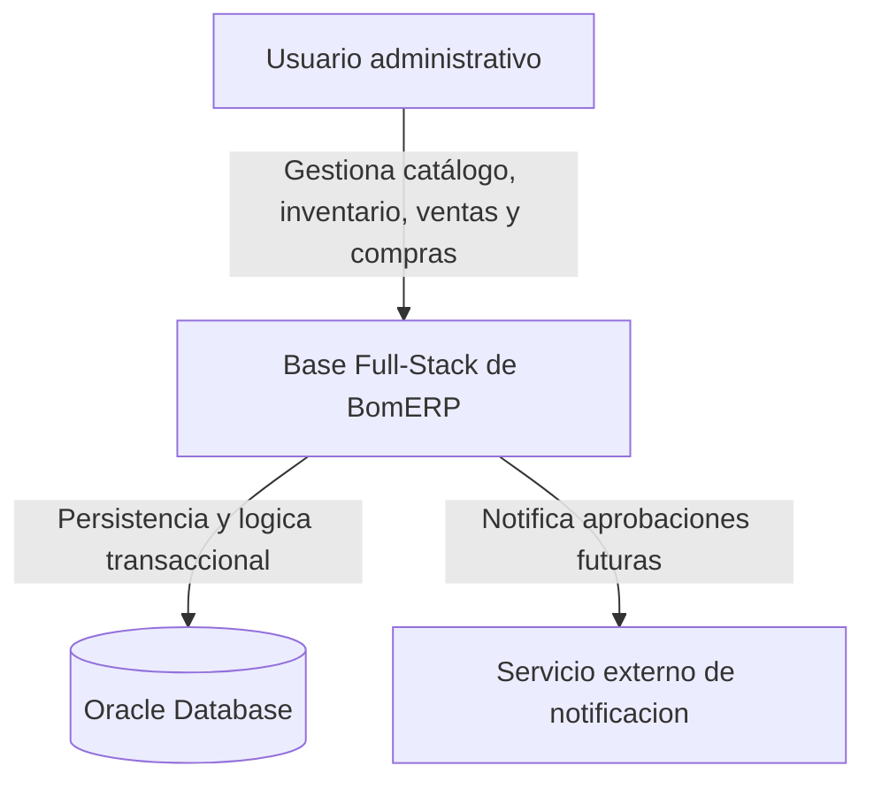
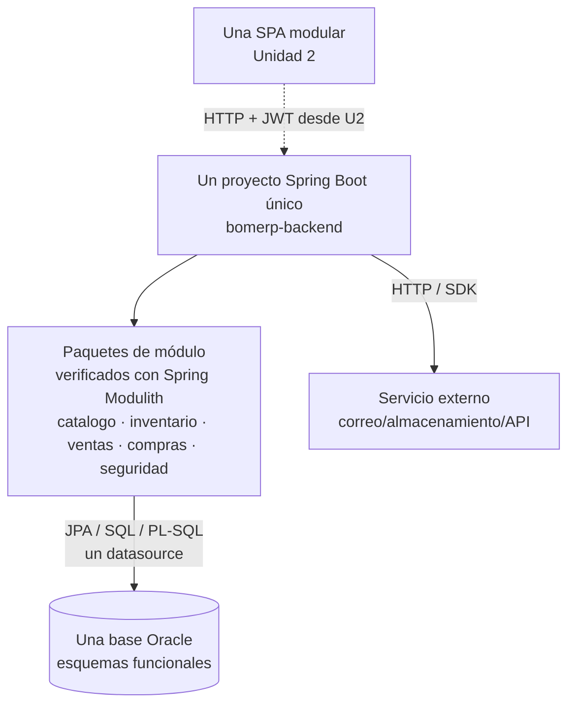
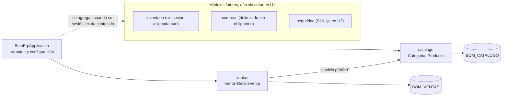

# S05 - Evaluación de la Unidad I

## 1. Propósito de la evaluación

Esta sesión no enseña contenido nuevo: cierra la Unidad I de **ADS**. El sílabo (sesión 5) define dos actividades para esta evaluación:

1. Resolver la evaluación teórico-práctica de los temas de la Unidad I (sesiones 1 a 4).
2. Presentar y sustentar la Arquitectura documentada mediante vistas arquitectónicas y principios de diseño aplicados.

**Solo ADS evalúa su Unidad I en esta sesión.** BD2 y LP2 sustentan su propia Unidad I recién en su sesión 6: a ambos les queda todavía su propia sesión 5 de trabajo (índices y evaluación del motor transaccional en BD2; consultas, reportes y trazabilidad en LP2) antes de estar listos para evaluarse. ADS evalúa primero porque su producto no es código ejecutable: es la arquitectura documentada que BD2 y LP2 ya vienen usando como base desde su sesión 1. El "Primer corte integrado" de los tres cursos (arquitectura + motor transaccional + backend REST) se sustenta conjuntamente en la sesión 6, según el cronograma del Proyecto Integrador.

## 2. Producto evaluado

Del sílabo, el producto de la Unidad I es:

> Arquitectura documentada con vistas de contexto, contenedores, componentes, principios de diseño aplicados y justificación del estilo arquitectónico elegido.

Ese producto ya existe como [`docs/proyecto-integrador/u1/ads-producto.md`](../../proyecto-integrador/u1/ads-producto.md). Esta sección lo reproduce completo para que la sesión sea autocontenida; `ads-producto.md` sigue siendo la fuente única — si hay una edición futura, se hace ahí y se refleja aquí.

**Lo que sigue (2.1-2.6) es el ejemplo BomERP del docente, no una plantilla obligatoria.** Cada sede (Lima, Juliaca, Tarapoto) y cada grupo dentro de una misma sede tiene su propio dominio, definido en su propio `brief.md` de S2 — no todos siguen CoMarket/BomERP. Lo que sí es exigible a todos es la estructura: contexto técnico, atributos de calidad, vistas C1-C3, principios de diseño, ADR y trazabilidad técnica U1, cada uno con el contenido real de su propio proyecto.

### Lo que acumulaste sesión por sesión

Este producto no se construye en S05: se ensambla con lo que cada sesión anterior ya te pidió sobre tu propio proyecto.

**Tabla 1. De la sesión al documento final**

| Sesión | Qué produjiste (tu propio proyecto) | Dónde queda en tu arquitectura documentada |
|---|---|---|
| S1 | Mapa arquitectónico inicial: contexto, stakeholders, atributos de calidad priorizados y primeras decisiones técnicas. | 2.1 Contexto técnico y 2.2 Atributos de calidad |
| S2 | Vistas C1 (contexto), C2 (contenedores) y una primera versión de C3/C4 de tu propio sistema. | 2.3 Vistas arquitectónicas (C1, C2) |
| S3 | Evaluación de tus propios módulos contra SOLID, cohesión, acoplamiento, modularidad y abstracción, con al menos un hallazgo real. | 2.4 Principios de diseño aplicados |
| S4 | Comparación de estilos arquitectónicos contra tu propio proyecto, con trade-offs y la justificación formal del estilo elegido. | 2.3 (C3 final) y 2.5 Decisiones de arquitectura (ADR) |
| S5 (esta sesión) | Ensamblas todo lo anterior en un solo documento y lo sustentas. | El documento completo + sección 4 de esta guía |

Lo que sustentas en S05 es **tu arquitectura**: el estilo que tú elegiste en S4, justificado frente a alternativas, documentado con tus propias vistas C1-C3 y tus propios principios aplicados — no la de BomERP. Las secciones 2.1-2.6 muestran cómo se ve ese documento terminado usando el ejemplo del docente; tu entregable real es un documento con la misma estructura, pero con el contenido que tú construiste en S1-S4.

### 2.1 Contexto técnico

**Tabla 2. Contexto técnico del producto U1 (ejemplo BomERP)**

| Elemento | Definición |
|---|---|
| Dominio | Continuidad de CoMarket: catálogo, inventario, ventas, compras y seguridad. El flujo funcional obligatorio parte de `Categoria–Producto–Venta–DetalleVenta`. |
| Problema técnico | La organización debe evolucionar el sistema MVC de Ciclo 3 hacia una API REST, una SPA y una base Oracle operable sin perder las reglas del dominio. |
| Producto U1 integrado | Arquitectura base + motor transaccional Oracle + backend REST empresarial. |
| Estilo inicial | Monolito modular basado en dominios funcionales, con arquitectura interna en capas. |
| Restricción | La base de datos empresarial se administra en Oracle. |
| Usuarios técnicos | Arquitecto, DBA, desarrollador backend, futuro desarrollador frontend y auditor. |

### 2.2 Atributos de calidad

**Tabla 3. Atributos de calidad del producto U1 (ejemplo BomERP)**

| Atributo | Decisión inicial | Evidencia |
|---|---|---|
| Seguridad futura | Decisión de autenticación y autorización para U2. | ADR previsto; JWT no se implementa en el corte U1. |
| Mantenibilidad | Un ejecutable Spring Boot único, con paquetes de módulo cohesionados por dominio y capas internas. | Límites, dependencias y componentes documentados; verificados por `ModularityTests`. |
| Integridad | Reglas transaccionales en servicio y Oracle. | Paquetes PL/SQL y restricciones. |
| Rendimiento | Índices y consultas optimizadas por fecha. | Script BD2 e índices. |
| Auditabilidad | Trigger de auditoría de cambios de precio y stock de producto (`TRG_PRODUCTO_AUDITORIA`). | Tabla y trigger de auditoría. |
| Escalabilidad inicial | API stateless preparada para SPA. | Decisión arquitectónica ADR-001. |

### 2.3 Vistas arquitectónicas

**Figura 1. Vista C1 - Contexto (ejemplo BomERP)**



**Figura 2. Vista C2 - Contenedores (ejemplo BomERP)**



**Figura 3. Vista C3 - Componentes backend (ejemplo BomERP)**



Al cierre de U1 (S6) solo existen `catalogo` y `ventas` como paquetes reales — `inventario`, `compras` y `seguridad` se dibujan como módulos futuros para no adelantar alcance de sesiones que todavía no llegaron (mismo criterio que ADR-001).

Reglas de la vista: son el patrón arquitectónico exigible a todos (monolito modular verificado con Spring Modulith), aunque los nombres de proyecto y de módulo (`bomerp-backend`, `catalogo`, `ventas`) son los del ejemplo BomERP — cada equipo los reemplaza por los propios.

- Un solo proyecto Maven (`bomerp-backend`), sin reactor multi-módulo; `BomErpApplication` es su única clase de arranque y genera el único artefacto ejecutable.
- Cada módulo de negocio es un paquete directo bajo el paquete raíz (`catalogo`, `ventas`, ...), verificado como módulo de aplicación por **Spring Modulith**, no por límites de artefacto Maven.
- Los módulos se comunican en la misma JVM mediante servicios Java públicos; no usan Feign ni HTTP interno.
- Cada módulo organiza internamente sus capas (controller, dto, entity, repository, service).
- Un módulo puede consumir el servicio público de otro, pero nunca su repositorio ni su entidad — Spring Modulith verifica esta regla automáticamente (`ModularityTests`), no queda solo como convención documentada.
- No se crea un `shared-kernel` inicial: los tipos permanecen en su módulo propietario y solo se extraen cuando exista una semántica compartida real y estable.
- Todos usan un datasource; `@Transactional` conserva atomicidad entre esquemas Oracle.
- Las FK entre esquemas se permiten con una dirección controlada hacia Catálogo y Seguridad, evitando ciclos.

### 2.4 Principios de diseño aplicados

**Tabla 4. Principios de diseño aplicados (ejemplo BomERP)**

| Principio | Aplicación |
|---|---|
| Responsabilidad única | Cada módulo concentra una capacidad del negocio; sus controladores reciben peticiones, los servicios coordinan casos de uso y los repositorios administran persistencia propia. |
| Abierto/cerrado | Nuevas reglas de venta o anulación pueden agregarse sin cambiar el controlador. |
| Inversión de dependencias | Servicios dependen de contratos de repositorio, no de detalles de persistencia. |
| Bajo acoplamiento | Los módulos se comunican mediante servicios públicos y no comparten repositorios; JWT se incorpora en U2. |
| Alta cohesión | Catálogo, Inventario, Ventas, Compras y Seguridad concentran reglas y datos de su dominio funcional. |

### 2.5 Decisiones de arquitectura (ADR)

Las decisiones ya están formalizadas como ADR reales en `docs/lp2/adr/` — verificadas contra el código (`mvnw test`), no solo documentadas:

**Tabla 5. ADR reales, verificados contra el código (ejemplo BomERP)**

| ADR real | Decisión | Justificación |
|---|---|---|
| [ADR-001](../../lp2/adr/ADR-001-arquitectura-backend.md) | Un único proyecto Spring Boot, sin reactor Maven multi-módulo. | Reduce fricción de build sin introducir distribución que el sílabo no evalúa. |
| [ADR-002](../../lp2/adr/ADR-002-spring-modulith.md) | Módulos de negocio verificados con Spring Modulith. | Verifica límites de dependencia automáticamente (`ModularityTests`), no solo por convención documentada. |
| [ADR-003](../../lp2/adr/ADR-003-spring-boot-4.md) | Spring Boot exacto en 4.0.7. | Versión que exige SpringDoc OpenAPI dentro del rango compatible, verificada contra `start.spring.io`. |

**Tabla 6. Decisiones previstas, aún no formalizadas como ADR de código (ejemplo BomERP)**

| Código previsto | Decisión | Se formaliza en |
|---|---|---|
| ADR-004 | API REST protegida con JWT. | S10 (Seguridad backend) |
| ADR-005 | Una sola SPA organizada por funcionalidades (`core`/`shared`/módulos). | S7 (Creación de la SPA) |

### 2.6 Trazabilidad técnica U1

**Tabla 7. Trazabilidad técnica U1 (ejemplo BomERP)**

| Decisión ADS | Evidencia BD2 | Evidencia LP2 |
|---|---|---|
| Auditoría de cambios | Trigger `TRG_PRODUCTO_AUDITORIA` sobre precio/stock | `POST`/`PUT` sobre `/api/v1/productos` (cualquier alta o cambio dispara el trigger, sin que el backend lo sepa). |
| Monolito modular y capas internas | Esquemas `BOM_CATALOGO` y `BOM_VENTAS` (los únicos que existen al cierre de U1; `BOM_INVENTARIO`, `BOM_COMPRAS` y `BOM_SEGURIDAD` se crean recién cuando su sesión los necesite) | Paquetes de módulo Spring Modulith, servicios públicos, controllers, services y repositories propios. |
| Seguridad stateless prevista | Usuario/rol como soporte futuro | ADR y contrato para implementación en S10-S11. |
| Rendimiento por consultas frecuentes | Índice `IX_VENTAS_FECHA` sobre `FECHA` | Filtro `desde`/`hasta` en `GET /api/v1/ventas`. |

## 3. Evaluación teórico-práctica (S1-S4)

Cubre los cuatro temas dictados antes de esta sesión. El docente puede tomarla escrita, oral o mixta.

**Tabla 8. Temario de la evaluación teórico-práctica**

| Sesión | Tema | Qué puede evaluar el docente |
|---|---|---|
| S1 | Fundamentos de arquitectura de software | Rol de la arquitectura, stakeholders, atributos de calidad y su relación con los requerimientos. |
| S2 | Modelo C4 y vistas arquitectónicas | Diferencia entre C1, C2, C3 y C4; qué información pertenece a cada nivel y por qué la vista C3 del propio proyecto no expone el detalle hexagonal/capas de su módulo transaccional. |
| S3 | Diseño estructural y principios SOLID | Aplicación de SOLID, cohesión, acoplamiento, modularidad y abstracción sobre los módulos reales del propio proyecto (equivalentes a `catalogo`/`ventas` en el ejemplo BomERP). |
| S4 | Arquitecturas modernas | Monolito modular vs. microservicios vs. hexagonal vs. Clean Architecture, cuándo DDD orienta hacia hexagonal/Clean, y los errores comunes de cada estilo. |

Preguntas de referencia (el docente puede formular equivalentes):

1. ¿Por qué tu producto U1 usa monolito modular con capas internas y no microservicios ni hexagonal desde el inicio?
2. Un módulo pone `@Entity` en su clase de dominio y la llama "hexagonal". ¿Por qué eso no es hexagonal?
3. Un método solo hace `repository.save(entidad)` sin ninguna regla de negocio. ¿Por qué llamarlo "caso de uso" es incorrecto?
4. Aplica la prueba del papel y lápiz a una regla de negocio de tu propio módulo transaccional: ¿es una entidad o un caso de uso?
5. ¿Qué verifica `ModularityTests` que una simple convención documentada no puede garantizar?
6. ¿Qué cambiaría en tu vista C3 si tu módulo transaccional migrara a hexagonal? ¿Ese cambio afectaría tu vista C2?

## 4. Sustentación de la arquitectura

**Tabla 9. Distribución de tiempo por integrante**

| Momento | Tiempo | Propósito |
|---|---:|---|
| Presentación técnica | 8 min | Explicar el producto (sección 2), las decisiones tomadas y su justificación. |
| Evidencia de integración | 5 min | Mostrar cómo BD2 y LP2 respetan la arquitectura (Tabla 7): esquemas Oracle reales, paquetes Spring Modulith reales, `ModularityTests` en verde. |
| Preguntas individuales | 5 min | Verificar dominio y aporte propio, con base en la Tabla 8 y las decisiones de la sección 2. |

**Tabla 10. Entregables obligatorios**

| Entregable | Evidencia mínima | Criterio de aceptación |
|---|---|---|
| Producto de unidad | `ads-producto.md` (sección 2 de esta guía) completo | Coherente con el sílabo y con el código real de LP2/BD2 |
| Evidencia de integración | Esquemas `BOM_CATALOGO`/`BOM_VENTAS` en Oracle, paquetes `catalogo`/`ventas` en el código, `ModularityTests` en verde | Trazabilidad verificable, no solo documentada |
| Sustentación individual | Preguntas y defensa por integrante (sección 3 y Tabla 8) | Autoría demostrada |

Secuencia sugerida de presentación:

1. Presentar el dominio y el problema técnico (Tabla 2).
2. Recorrer las vistas C1, C2 y C3 (Figuras 1-3) explicando qué decisión arquitectónica sostiene cada una.
3. Justificar el estilo elegido (monolito modular con capas internas) frente a las alternativas de S4, citando al menos un error común que se evitó.
4. Mostrar los principios SOLID aplicados (Tabla 4) sobre código real de `catalogo` o `ventas`.
5. Mostrar la evidencia de integración: `ModularityTests` en verde, esquemas Oracle creados, endpoints REST vivos.
6. Cerrar con la trazabilidad técnica (Tabla 7) y los ADR previstos aún no formalizados (Tabla 6).

Criterios mínimos de aceptación:

- Las tres vistas (C1, C2, C3) son coherentes entre sí y con el código real de LP2.
- El estilo arquitectónico elegido está justificado frente a al menos una alternativa de S4, citando al menos un atributo de calidad concreto de la Tabla 3 (sección 2.2).
- Cada principio SOLID de la Tabla 4 se sustenta con un ejemplo real, no solo con la definición.
- La evidencia de integración (Tabla 10) es verificable en vivo, no solo narrada.
- Cada integrante responde individualmente al menos una pregunta de la Tabla 8 o de la sección 2.

## 5. Rúbrica de evaluación

Los cinco criterios son cita literal del resultado de aprendizaje de la Unidad I en el sílabo de ADS. El criterio 4 exige explícitamente que el trade-off se sustente en atributos de calidad concretos (Tabla 3) — el sílabo enseña "atributos de calidad" en S1 pero no lo separa en un criterio propio; esta rúbrica lo evalúa dentro de este criterio en vez de dejarlo sin evaluación.

**Tabla 11. Rúbrica de evaluación**

| Criterio | Peso | A (20 pts) | B (15 pts) | C (10 pts) | D (5 pts) | Nivel obtenido |
|---|---:|---|---|---|---|---:|
| 1. Representa vistas arquitectónicas mediante C4 o equivalente | 20% | C1, C2 y C3 completas, coherentes entre sí y con el código real. | Las tres vistas están presentes, con alguna inconsistencia menor frente al código. | Falta una vista o hay inconsistencias relevantes. | No presenta vistas arquitectónicas verificables. | |
| 2. Define límites, responsabilidades y componentes del sistema | 20% | Límites de módulo claros y verificados por `ModularityTests`; responsabilidades sin solapamiento. | Límites claros, verificación parcial. | Límites confusos o con solapamiento de responsabilidades. | No define límites ni responsabilidades. | |
| 3. Aplica principios SOLID, cohesión, acoplamiento, modularidad y abstracción | 20% | Cada principio de la Tabla 4 se sustenta con un ejemplo real del código. | La mayoría de principios se sustenta con ejemplos reales. | Aplicación superficial o solo teórica. | No aplica los principios. | |
| 4. Justifica estilos arquitectónicos y trade-offs | 20% | Justifica monolito modular con capas frente a al menos una alternativa de S4, citando trade-offs reales en términos de atributos de calidad concretos de la Tabla 3 (ej. mantenibilidad vs. escalabilidad). | Justifica el estilo elegido con trade-offs generales, mencionando al menos un atributo de calidad de la Tabla 3. | Menciona el estilo o los atributos de calidad sin conectar uno con otro. | No justifica el estilo elegido ni cita atributos de calidad. | |
| 5. Mantiene coherencia con los requerimientos del negocio | 20% | La arquitectura resuelve el dominio de la Tabla 2 y la trazabilidad de la Tabla 7 es verificable en vivo. | La arquitectura resuelve el dominio; la trazabilidad es mayormente verificable. | Coherencia parcial con el dominio o trazabilidad débil. | No hay coherencia demostrable con el dominio. | |

Nota final = suma de (`Peso` × `Puntos del nivel obtenido`) / 100 × 20 = ____.

Para usar la rúbrica con IA, solicita:

```text
Evalúa la sustentación y el producto (ads-producto.md o la sección 2 de esta guía) usando la rúbrica de esta sesión.
Para cada criterio selecciona el nivel obtenido: A=20, B=15, C=10, D=5.
Justifica brevemente cada nivel con evidencia concreta (vistas, código, trazabilidad).
Calcula la nota final con la fórmula: suma de (Peso × Puntos del nivel obtenido) / 100 × 20.
Indica 2 fortalezas y 2 recomendaciones para la sustentación conjunta de S06.
```
