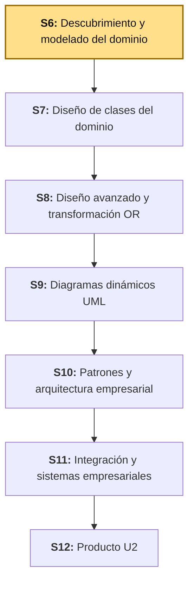
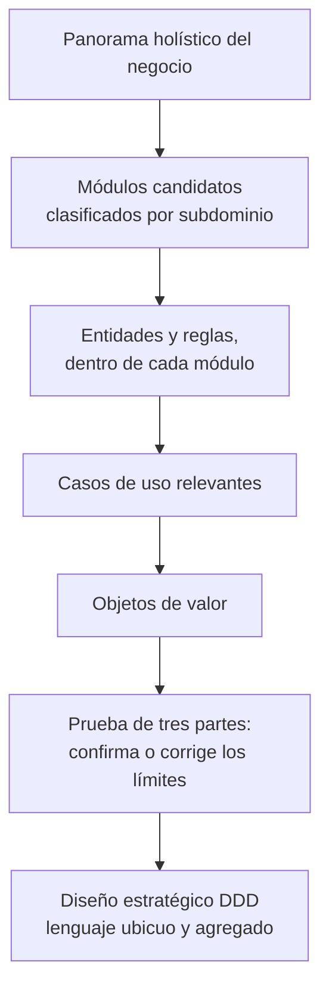
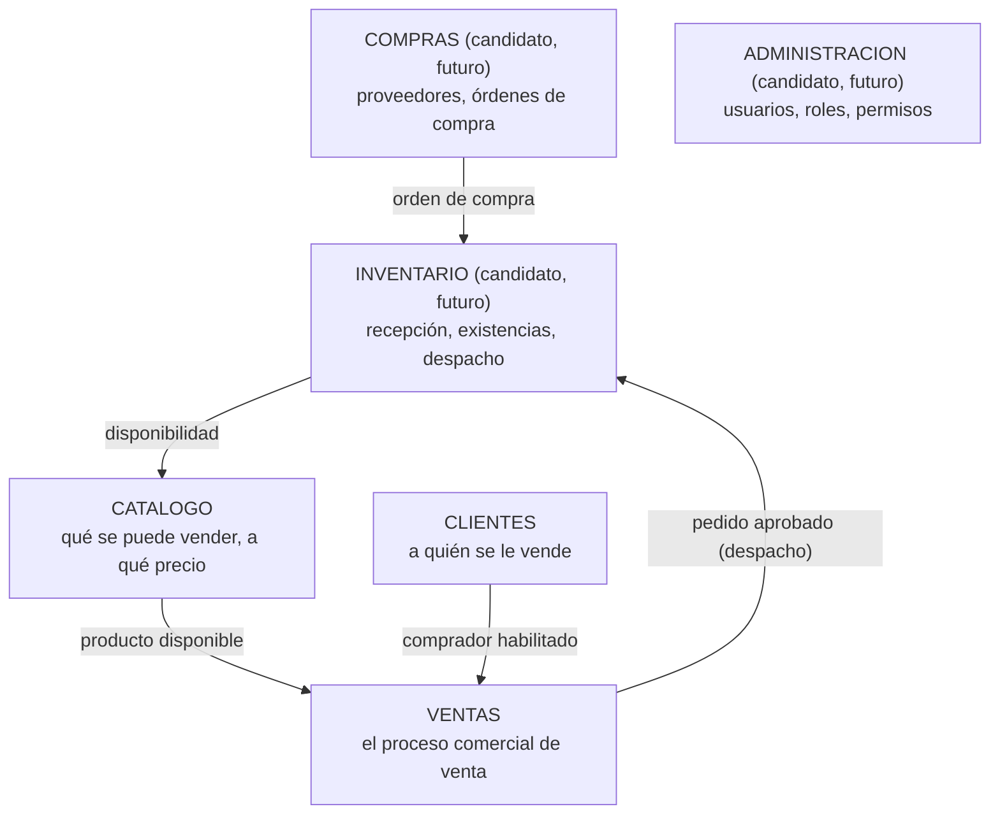
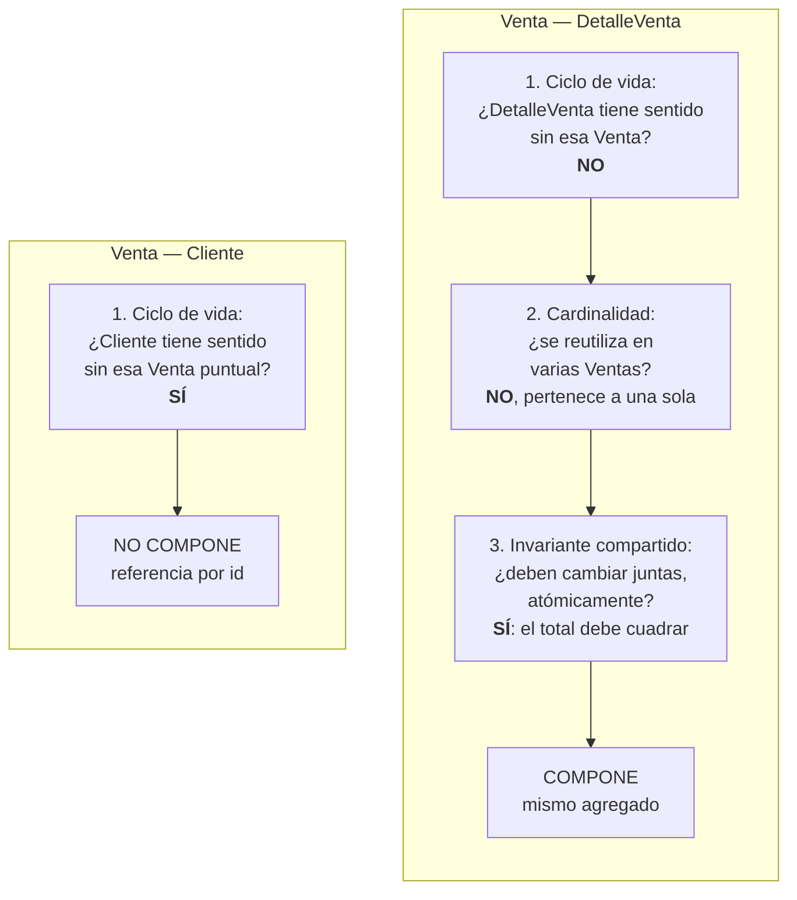
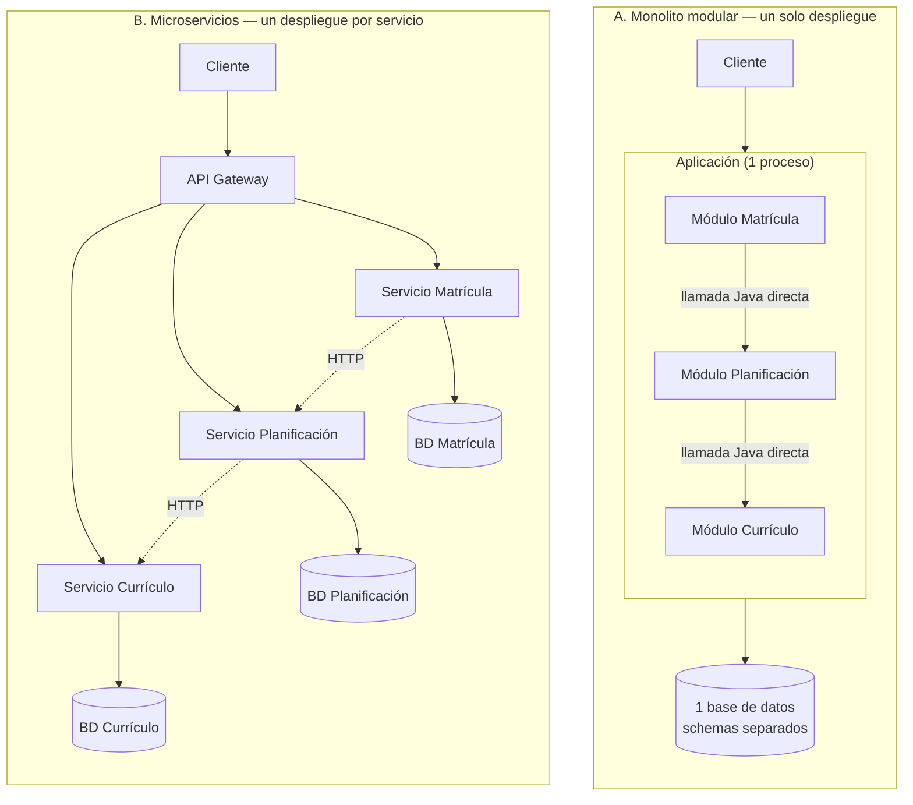
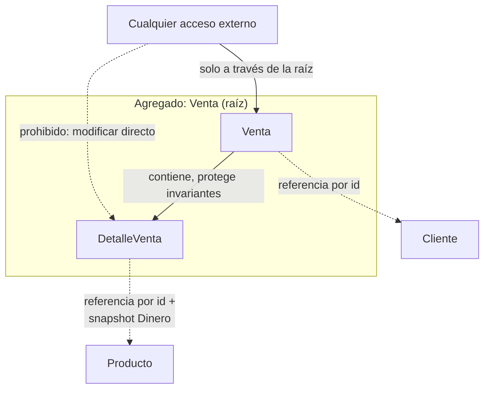
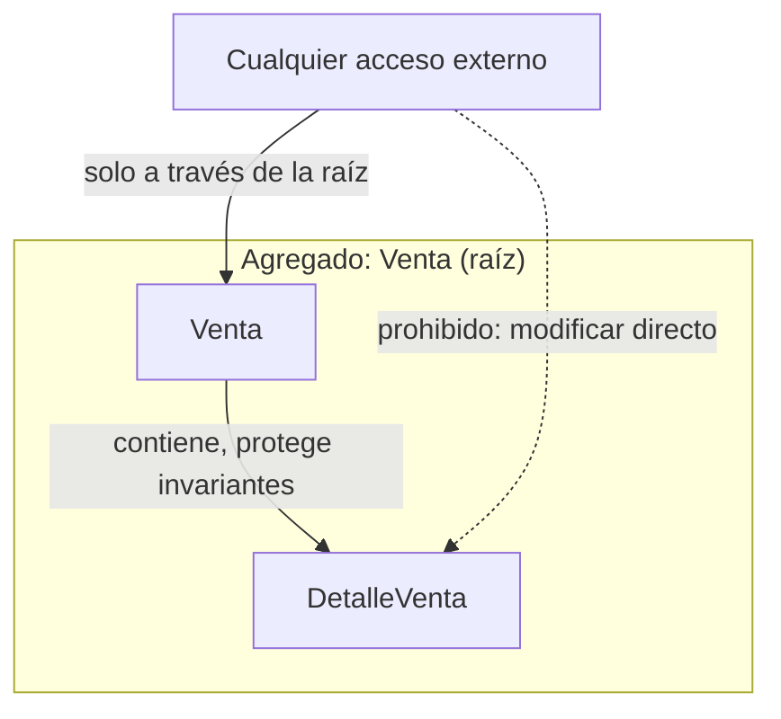
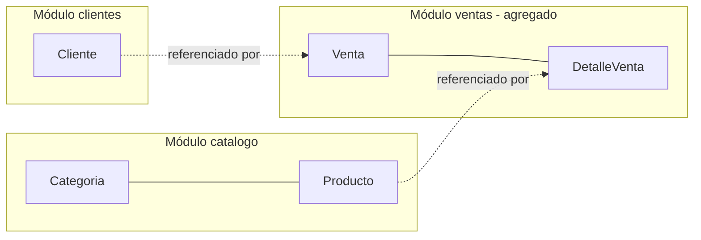
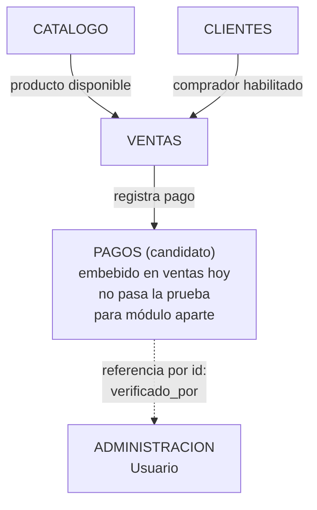
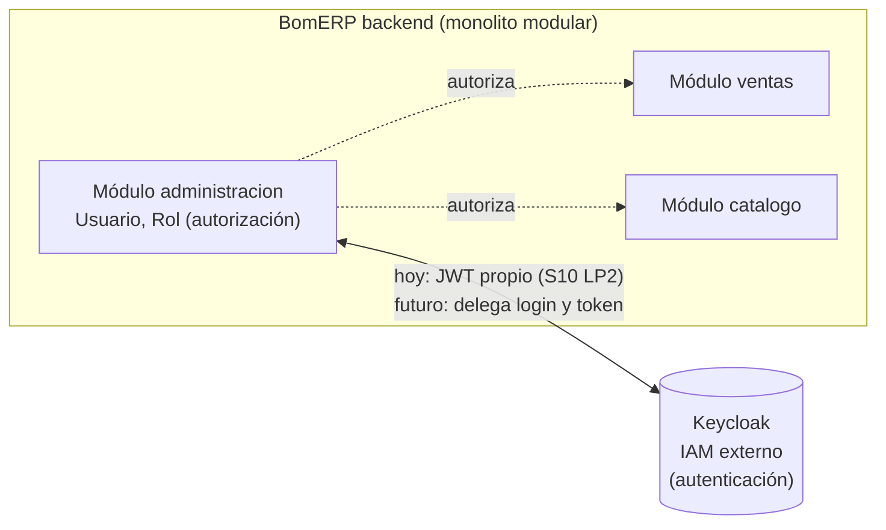

# S6 - Descubrimiento y Modelado del Dominio

## 1. Introducción

Tiempo: 20 min.

### 1.1 Presentación de la sesión

La Unidad I dejó decidido el estilo arquitectónico y las vistas C1-C3 del sistema; todavía no dice qué reglas de negocio protege ese sistema por dentro. Esta sesión abre la Unidad II mirando hacia adentro del contenedor "backend" — pero no empieza por las clases: empieza por el negocio completo, de punta a punta, antes de bajar a una sola entidad. Recién cuando el panorama del negocio está claro se descubren entidades, reglas y el límite de consistencia real (el **agregado**) que LP2 va a implementar como transacción y BD2 como restricción Oracle.

### 1.2 Índice

1. Panorama holístico del negocio y módulos candidatos.
2. Clasificación de subdominios (Core, Supporting, Generic).
3. Entidades y reglas de negocio, dentro de cada módulo.
4. Casos de uso relevantes.
5. Objetos de valor.
6. Prueba de tres partes: confirmar o corregir los límites entre módulos.
7. Diseño estratégico de Domain-Driven Design (lenguaje ubicuo, agregado como límite de consistencia).

### 1.3 Propósito de aprendizaje

Al concluir la clase, estarás en condiciones de:

- **Descubrir y modelar** el dominio de tu propio proyecto de punta a punta: partir del panorama holístico del negocio para proponer módulos candidatos, clasificarlos por tipo de subdominio, descubrir dentro de cada uno sus entidades y reglas, reconocer casos de uso relevantes y objetos de valor, y aplicar la prueba de tres partes para confirmar o corregir esos límites antes de delimitar el agregado que protege la consistencia del proceso transaccional.

### 1.4 Producto de sesión

Modelo de dominio inicial: panorama holístico del negocio, módulos candidatos clasificados por subdominio, entidades y reglas de negocio dentro de cada uno, casos de uso relevantes, objetos de valor y el primer diseño estratégico de DDD (lenguaje ubicuo y agregado) de tu propio proyecto.

### 1.5 Metodología

**Tabla 1. Metodología de la sesión**

| Actividades a Realizar en el Periodo | Orientaciones generales (Orientaciones Metodológicas) | Material de estudio recomendado |
|---|---|---|
| Revisión previa individual | Releer el brief del propio proyecto (o el SRS, si continúa un dominio existente de Ciclo 3) sin fijarse todavía en clases ni tablas — solo en qué hace el negocio, de principio a fin. Trabajo individual, antes de clase. | Sílabo ADS U2, brief propio del equipo. |
| Clase presencial | Descubrimiento guiado de punta a punta para BomERP: panorama del negocio, módulos, entidades, reglas, casos de uso, objetos de valor y agregado. Trabajo individual, siguiendo al docente paso a paso; consulta inmediata ante dudas de límite de módulo. | Plantillas de las tablas de 3.1-3.9. |
| Evaluación formativa | Revisión en clase del modelo de dominio inicial completo. La evidencia se completa y sustenta de forma individual, fuera del aula, según los criterios mínimos de la sección 4.4. | Indicaciones de entrega (4.3), rúbrica de evaluación (4.6). |

### 1.6 Motivación de la sesión

#### 1.6.1 Caso: BomERP, de punta a punta

BomERP ya tiene arquitectura y vistas C1-C3 (Unidad I), pero ninguna de esas vistas dice qué pasa si dos cambios simultáneos dejan el total de una venta descuadrado con sus detalles, o si el stock de un producto queda en negativo. Esas son reglas de negocio del dominio, no decisiones de arquitectura. Y antes de llegar a esas reglas, hay una pregunta todavía más básica que responder primero: **¿qué hace BomERP, de principio a fin, sin nombrar todavía ninguna clase?** Un equipo que salta directo a "tengo una tabla Venta" sin haber mirado el negocio completo corre el riesgo de descubrir a mitad de camino que le faltó un módulo entero (como pasó con `Cliente`, ver 2.2) o que agrupó mal dos cosas que no debían ir juntas.

**Preguntas de análisis**

**Activación de conocimientos previos**

1. Sin mirar ninguna tabla ni clase todavía: ¿qué hace tu proyecto, de principio a fin, en una sola frase?
2. ¿Qué áreas o etapas grandes del negocio ya intuyes, aunque no sepas todavía qué entidades tiene cada una?
3. ¿Por qué "Producto" y "Venta" no deberían vivir en el mismo módulo funcional?

**Comprensión del modelado de dominio**

1. ¿Qué diferencia hay entre nombrar un módulo del negocio ("ventas") y nombrar una entidad concreta ("Venta")? ¿Cuál se puede reconocer antes de escribir una sola clase?
2. Si dos operaciones distintas pueden dejar inconsistente el total de una venta frente a sus detalles, ¿qué objeto debería ser responsable de impedirlo?

### 1.7 Ubicación en el curso

- Producto del curso: Diseño Técnico Profesional Documentado.
- Producto de unidad: Catálogo UML con patrones de diseño e integración aplicados.
- Avance del producto en esta sesión: panorama holístico, módulos delimitados por subdominio, entidades, reglas de negocio, casos de uso relevantes, objetos de valor y agregado inicial.

Roadmap del producto de la unidad:

**Figura 1. Roadmap del producto de la unidad**



## 2. Explica

Tiempo: 25 min.

### 2.1 Arquitectura de la sesión

**Figura 2. Flujo de descubrimiento del dominio: del todo a la parte**



Lectura del diagrama:

- El modelo de dominio no arranca en las entidades: arranca en el negocio completo. Primero se sketchea qué módulos existen (A→B), recién ahí se descubre qué hay dentro de cada uno (C), y solo al final se valida si esos límites resisten una prueba técnica (F) — no al revés.
- Este orden importa especialmente en un proyecto nuevo (el Brief técnico de tu propio equipo): todavía no existe ningún documento con entidades ya escritas — si empezaras por "¿qué entidades tengo?", la respuesta sería "ninguna todavía". El panorama holístico sí se puede responder desde el día uno, sin haber escrito una sola clase.
- Integración (referencia, no requisito para esta sesión): el agregado que se delimite al final de este flujo es el mismo límite que LP2 ya implementó como transacción (`@Transactional` sobre `Venta`–`DetalleVenta`, su propia S4) y que BD2 restringe con `CHECK`/triggers a nivel de esquema.

Este diagrama es el mapa que guía el resto de la explicación: cada apartado siguiente desarrolla uno de sus componentes, en el mismo orden del Índice (1.2).

### 2.2 Panorama holístico del negocio y módulos candidatos

Antes de nombrar una sola entidad, se sketchea el negocio completo, de punta a punta: un flujo funcional con los módulos candidatos y cómo se conectan, sin bajar todavía al detalle de qué tabla tiene cada uno.

**Figura 3. Panorama holístico de BomERP: módulos candidatos, sin entidades todavía**



`Administracion` no aparece conectada al flujo: no participa de la secuencia de negocio, la sostiene de forma transversal (autenticación y permisos para los demás). Se nombra `administracion`, no `seguridad`: la autenticación de hoy (JWT, contenido de LP2 S10) es una decisión de implementación que se espera reemplazar con un IAM externo como Keycloak más adelante — el módulo de dominio necesita un nombre que sobreviva ese cambio, no uno atado a la tecnología actual. Este panorama se arma sin haber escrito todavía ninguna clase — basta con conocer, en una frase por caja, qué hace cada parte del negocio. `Clientes` aparece aquí, en el panorama, no porque alguien haya encontrado un atributo escondido en una tabla: aparece porque cualquier negocio de venta tiene, de forma evidente, un lado que vende y otro a quien se le vende — verlo desde el panorama completo evita el error de descubrirlo tarde, ya con `Venta` medio modelada (ver la Prueba de tres partes, 2.7, para el caso donde el panorama y las entidades no coinciden).

**¿De dónde sale este panorama, en la práctica?** La Figura 3 no aparece de la nada — hay tres formas legítimas de llegar a ella, y el proyecto propio decide cuál aplica:

- **Juicio de experto:** conversar con quien conoce el negocio de primera mano. Para tu propio Brief técnico, ese experto suele ser accesible de inmediato: quien redactó el brief, o el propio equipo si el proyecto nace de una idea propia. Es la vía más directa cuando el negocio ya está definido, aunque sea informalmente.
- **Event Storming (Alberto Brandolini):** un taller colaborativo con el negocio en vivo — el equipo completo (técnicos y stakeholders) pega notas post-it de color naranja con eventos de negocio ("Reserva registrada", "Venta anulada") sobre una superficie compartida, en orden cronológico, sin discutir todavía tablas ni clases. Los módulos candidatos emergen de cómo esos eventos se agrupan solos. Es la técnica más rica, pero exige tener al negocio en vivo y tiempo de taller — no siempre está disponible en un curso.
- **Benchmarking contra un sistema de referencia:** cuando no hay experto disponible ni tiempo de taller — el caso típico al analizar un sistema ya existente solo a partir de su documento de alcance (ver el ejercicio de Telo) — se compara el alcance real contra lo que un sistema de esa misma categoría suele resolver en la industria. Es la vía menos precisa de las tres: hay que declararla explícitamente como tal, porque el resultado es una hipótesis a validar, no un hecho confirmado por el negocio.

Estas tres técnicas responden la misma pregunta ("¿qué módulos tiene este negocio?") con distinto nivel de certeza — de mayor a menor: negocio en vivo con taller (Event Storming) > negocio ya definido con experto accesible (juicio de experto) > solo un documento escrito, sin nadie a quien preguntar (benchmarking). Ninguna es "la correcta" de forma absoluta; la que corresponde es la que el insumo disponible permite aplicar.

**Error frecuente**: saltar directo a diseñar tablas o clases sin haber sketcheado antes el panorama completo — el resultado casi siempre es un módulo importante descubierto tarde (como `Clientes` o `Proveedor`), cuando ya cuesta más corregirlo. Un segundo error, más sutil: presentar un panorama construido por benchmarking como si viniera de un experto real — hay que decir explícitamente con qué técnica se llegó a cada módulo candidato, porque cambia cuánta confianza merece.

### 2.3 Clasificación de subdominios

Con los módulos candidatos ya nombrados (2.2), toca decidir qué tan importante es cada uno para el negocio — no todos merecen el mismo esfuerzo de modelado.

**Tabla 2. Subdominios de BomERP**

| Módulo candidato | Tipo de subdominio | Por qué |
|---|---|---|
| `ventas` | **Core** (el negocio mismo) | Es la razón de existir de un ERP comercial: ahí vive la lógica más valiosa y compleja (consistencia transaccional, anulación, auditoría). |
| `catalogo` | Supporting | Necesario para que exista algo que vender, pero no es el diferenciador — cualquier ERP tiene un catálogo parecido. |
| `clientes` | Supporting | Necesario para saber a quién se le vende y aplicar reglas propias del cliente (suspensión, tipo), pero no es el diferenciador — un directorio de clientes es genérico entre ERP. |
| `inventario` (candidato) | Supporting | Sostiene la disponibilidad para vender; acoplado a `catalogo`, pero su lógica de movimientos es genérica entre distintos ERP. |
| `compras` (candidato) | Supporting | Sostiene el inventario, con reglas de aprobación propias del negocio, pero es un proceso bastante estándar en cualquier ERP. |
| `administracion` (candidato) | **Generic** (problema ya resuelto) | Autenticación y autorización no son el negocio de BomERP — por eso otros proyectos de este mismo programa lo resuelven con un IAM externo (Keycloak) en vez de construirlo; aquí se construye con JWT solo porque es contenido de aprendizaje del sílabo de LP2 (S10), no porque diferencie al negocio. |

Un subdominio **Core** justifica invertir el mayor esfuerzo de modelado (por eso `ventas` es el único módulo, junto con `catalogo` y `clientes`, con sesión propia ya en esta unidad); un subdominio **Generic** casi nunca debería construirse desde cero en un proyecto real — se reconoce igual, aunque este curso lo construya por razones pedagógicas.

**Error frecuente**: tratar todos los módulos candidatos como si tuvieran la misma importancia — un subdominio Core exige el modelado más cuidadoso; uno Generic no debería competir por ese mismo esfuerzo.

### 2.4 Entidades y reglas de negocio, dentro de cada módulo

Recién ahora, con el panorama y la clasificación ya hechos, se baja al detalle de cada módulo: qué entidades tiene y qué reglas de negocio protege. Una **entidad** tiene identidad propia (un identificador que la distingue) y cambia de estado en el tiempo sin dejar de ser la misma instancia. Una **regla de negocio** es una condición que el dominio impone sobre esos cambios de estado, independiente de cómo se implemente después en código o base de datos.

En BomERP, dentro de los módulos con sesión propia esta unidad:

- **`catalogo`**: `Categoria`, `Producto`. Regla: un producto se registra con una categoría existente; un descuento no puede dejar el precio fuera de rango razonable.
- **`ventas`**: `Venta`, `DetalleVenta`. Regla: el total de una venta debe cuadrar con la suma de sus detalles; solo una venta en estado `REGISTRADA` puede anularse; no puede registrarse un detalle con stock insuficiente; una venta debe estar asociada a un cliente registrado.
- **`clientes`**: `Cliente`. Regla: un cliente suspendido no puede registrar una venta nueva. `Cliente` ya aparecía referenciado en el diagrama de clases de `u2/ads-producto.md` (`Venta.cliente`) — confirma, a nivel de entidad, lo que el panorama de 2.2 ya había anticipado a nivel de módulo.

Los módulos candidatos sin sesión propia (`inventario`, `compras`, `administracion`) todavía no se modelan en profundidad — tienen nombre y razón de ser (2.2-2.3), pero sus entidades (`MovimientoStock`, `OrdenCompra`/`Proveedor`, `Usuario`/`Rol`) esperan a que su propia sesión les dé contenido.

**Error frecuente**: confundir una regla de negocio con una validación de formato (por ejemplo, "el nombre no puede estar vacío") — las reglas de negocio protegen invariantes del dominio, no solo la forma de un dato.

### 2.5 Casos de uso relevantes

Un **caso de uso relevante** describe una interacción completa entre un actor y el sistema que produce un resultado de valor para el negocio — no cada método de una clase, solo los que un stakeholder reconocería como "algo que el sistema hace por mí".

En BomERP: *Registrar producto*, *Registrar venta* (cabecera y detalle en la misma operación), *Anular venta*, *Consultar ventas por filtro y rango de fecha*, *Registrar cliente*, *Suspender cliente*. No son casos de uso relevantes operaciones internas como "calcular subtotal de una línea" — esas son parte de la implementación de *Registrar venta*, no un caso de uso aparte.

**Error frecuente**: listar un caso de uso por cada operación CRUD (crear, listar, actualizar, eliminar) sin filtrar cuáles realmente representan una decisión o un proceso de negocio.

### 2.6 Objetos de valor

Un **objeto de valor** no tiene identidad propia: dos instancias con el mismo contenido son intercambiables, y una vez creado no cambia — cualquier "cambio" en realidad crea una instancia nueva. Se usa para conceptos que el dominio compara por su valor, no por quién los creó.

En BomERP: `Dinero` (monto + moneda) es un candidato claro de objeto de valor para `Producto.precio` y `DetalleVenta.precioUnitario`/`subtotal` — dos montos de S/ 50.00 son el mismo valor sin importar en qué línea aparezcan. Un `RangoFecha` (desde/hasta) para las consultas de S5 de LP2 es otro candidato: se compara por su contenido, no por identidad.

**Error frecuente**: modelar todo como entidad "por si acaso necesita cambiar" — eso agrega identidad y ciclo de vida innecesarios a algo que el dominio solo necesita comparar por su valor.

### 2.7 Prueba de tres partes: confirmar o corregir los límites

El panorama de 2.2 y las entidades de 2.4 son una **propuesta**, no una certeza — ahora se verifica si resiste una prueba técnica, antes de darla por buena.

**Prueba de tres partes: ¿referencia o composición?** Dos entidades relacionadas no se componen automáticamente solo por estar cerca en el flujo de negocio. Se componen (una vive dentro del agregado de la otra) solo si las tres pruebas dan que sí:

1. **Ciclo de vida:** ¿la entidad "hija" tiene sentido sin la entidad "padre"? (`DetalleVenta` no tiene sentido sin su `Venta` → compone. `Cliente` sí tiene sentido sin ninguna `Venta` puntual → no compone, se referencia).
2. **Cardinalidad:** ¿la misma instancia se reutiliza en muchas instancias del padre a lo largo del tiempo? Si sí, componerla duplicaría sus datos en cada una.
3. **Invariante compartido:** ¿alguna regla de negocio exige que ambas cambien juntas, atómicamente, en la misma transacción? Si la relación solo exige que la referencia sea válida *al momento de* usarla (no que cambien juntas), no compone.

Aplicada a BomERP: `ventas` consume `catalogo` y `clientes` **por referencia, no por composición** — `DetalleVenta` guarda solo el id de `Producto` (más una copia congelada del precio, ver `Dinero` en 2.6); `Venta` guarda solo el id de `Cliente`, que existe antes, durante y después de cualquier venta puntual. `DetalleVenta`, en cambio, sí compone dentro de `Venta`: no tiene sentido sin ella (1), pertenece a exactamente una (2), y el invariante del total exige que cambien juntas atómicamente (3).

**Figura 4. Prueba de tres partes aplicada: `Venta`–`DetalleVenta` vs. `Venta`–`Cliente`**



Nótese que `Venta`–`Cliente` no necesita llegar a la pregunta 2 ni 3: basta con fallar la primera para saber que no compone — las tres preguntas se responden en orden, y la primera respuesta negativa ya decide.

En este caso la prueba **confirma** lo que el panorama de 2.2 ya sugería (`clientes` como módulo aparte). No siempre es así: a veces el panorama agrupa mal dos cosas, y es la prueba la que corrige el límite — por eso no se salta este paso ni siquiera cuando el panorama parece obvio.

**Nota metodológica — cuándo empezar por el todo y cuándo por las entidades.** Esta sesión empieza por el panorama (2.2) porque tu Brief técnico es un proyecto nuevo: todavía no existe ningún documento con entidades ya escritas. Cuando el insumo es distinto — analizar un **sistema existente** ya documentado (un alcance ya escrito, un sistema heredado, un caso de estudio) — el camino inverso es igual de válido: partir de las entidades y reglas que ya están documentadas, agruparlas en módulos candidatos, y usar esta misma prueba para confirmar o corregir esa agrupación. El orden cambia según qué insumo tienes al empezar; la prueba de tres partes se aplica igual en los dos sentidos.

**Para profundizar (lectura fuera de clase, no se explica en vivo).**

**Fundamento de la prueba.** No es una invención de esta guía: simplifica dos de las **"Rules of Aggregate Design" de Vaughn Vernon** (*Implementing Domain-Driven Design*, Bibliografía) — la Regla 1 ("protege invariantes reales dentro del límite de consistencia") es la base de la prueba 3; la Regla 3 ("referencia otros agregados solo por identidad, nunca por objeto completo") es la base de por qué `Venta` guarda `clienteId`, no un `Cliente` completo. Las pruebas 1 y 2 son una forma más concreta y verificable de aplicar esas reglas.

**El mismo caso, con `Proveedor`.** Esta prueba separa igual `Proveedor` de `OrdenCompra` dentro de `compras`, aunque `compras` todavía no tenga sesión propia: un proveedor existe antes y después de cualquier orden puntual (1), participa en muchas órdenes a la vez (2), y aprobar una orden no exige modificar el proveedor en la misma transacción (3).

**El tamaño del módulo no es el criterio.** `clientes` tiene una sola entidad y aun así es su propio módulo, con el mismo derecho que `ventas`, que tiene dos — el número de tablas no decide el límite, la prueba sí.

**La prueba dice cuándo puedes separar, no que siempre debas hacerlo al máximo.** Separar tiene un costo real: más referencias cruzadas, más piezas que coordinar, incluso dentro de un mismo monolito modular. Regla práctica (la misma que recomienda Vernon): ante la duda, empieza con menos módulos, más grandes, y sepáralos después, cuando el dolor real de tenerlos juntos aparezca.

**Bounded context no es lo mismo que microservicio.** Seis módulos funcionales dentro de un solo backend siguen siendo manejables; seis microservicios separados es un problema de otra naturaleza. La prueba decide límites conceptuales; cuántos servicios desplegar es una decisión de arquitectura aparte (Unidad 2, S10).

**Otras técnicas de DDD para delimitar módulos** (fuera del alcance de esta sesión): *Event Storming* (ya presentado en 2.2 como forma de construir el panorama holístico) también sirve, después del taller, para refinar límites entre módulos: cuando dos eventos que "deberían" estar juntos terminan agrupándose en columnas separadas sobre la superficie de post-its, esa separación espontánea suele anticipar la misma respuesta que daría la prueba de tres partes; el **cambio de significado del lenguaje ubicuo** (Evans) — si la misma palabra significa algo distinto en dos partes del sistema, ahí hay una señal de límite; los **patrones de Context Mapping** (Shared Kernel, Customer/Supplier, Anti-Corruption Layer) — describen cómo se relacionan dos bounded contexts ya delimitados.

**Dos ejemplos ilustrativos, en un dominio distinto al de BomERP** (para ver los mismos principios aplicados a otro negocio, no como precedente a copiar — cada límite se valida con la prueba de tres partes de tu propio proyecto):

**Figura 5. Ejemplo ilustrativo: ERP de seis módulos, un solo backend**


`Inventario` junta recepción y despacho a propósito: comparten el mismo invariante (la existencia nunca queda negativa) — pasan la prueba 3 como una sola unidad, el mismo criterio que usa Odoo (`stock` frente a `purchase`/`sale`) para agrupar sus propios módulos.

**Figura 6. Ejemplo ilustrativo: los mismos módulos, dos formas válidas de desplegarlos**



Los mismos tres módulos conceptuales se implementan de dos formas, sin que el modelo de dominio cambie — `Matrícula` se separaría como microservicio propio por escala (picos de matrícula en fechas puntuales), no porque la prueba de tres partes lo distinga más que a los demás: la prueba decide el límite conceptual (A o B tienen los mismos tres módulos); cuántos servicios desplegar es la decisión operativa aparte que ya señaló el párrafo anterior.

**Hallazgo de aplicar DDD aquí:** `Producto.stock`, tal como ya se usa en BD2/LP2 (S4-S5), es en realidad una vista denormalizada de algo que el módulo `inventario` todavía no existe para gobernar. Cuando `inventario` reciba su propia sesión, su primer trabajo de modelado será decidir si esa columna se conserva como caché de lectura o se recalcula desde el ledger de movimientos — no es un error de BD2/LP2, es una decisión de límite de contexto que esta sesión recién deja planteada.

### 2.8 Diseño estratégico de Domain-Driven Design

**Domain-Driven Design (DDD)** es un enfoque para diseñar software modelando el código directamente sobre el dominio del negocio, no sobre la base de datos ni sobre la conveniencia técnica — la idea central es que el modelo de software y el modelo mental del negocio deben ser el mismo modelo. DDD trabaja en dos niveles: el **diseño estratégico** (el de esta sesión, incluido el panorama de 2.2) delimita el vocabulario compartido y los límites de consistencia del dominio; el **diseño táctico** (patrones como Aggregate, Repository o Entity ya implementados en código, que esta misma asignatura contrasta con el Service Layer clásico en **S10 de ADS**, "Patrones de Diseño y Arquitectura Empresarial") construye esos límites dentro del código. Sin el diseño estratégico primero, el diseño táctico no tiene sobre qué límite aplicarse — por eso esta sesión antecede a S10.

El **lenguaje ubicuo** es el vocabulario que el equipo técnico y el negocio comparten sin traducción: si el negocio dice "anular una venta", el código dice `venta.anular()`, no `venta.setEstado(3)`. El **agregado** es el límite de consistencia transaccional: un conjunto de entidades que deben cambiar juntas, atómicamente, para que una regla de negocio nunca quede violada — se accede siempre a través de su raíz (*aggregate root*), nunca modificando un elemento interno por su cuenta.

**Tabla 3. Lenguaje ubicuo de BomERP**

| Término del negocio | Significado compartido | Cómo se ve en el código |
|---|---|---|
| Venta | Transacción comercial registrada, con su detalle. | `Venta.registrar()` |
| Anular | Revertir una venta activa sin eliminarla del historial. | `Venta.anular()` |
| Stock | Cantidad disponible de un producto para la venta. | `Producto.stock` |
| Suspender | Impedir que un cliente registre ventas nuevas, sin borrar su historial. | `Cliente.suspender()` |

En BomERP, `Venta` es la raíz del agregado `Venta`–`DetalleVenta`: sus invariantes (el total debe cuadrar con la suma de los detalles; el stock del producto nunca queda negativo; solo una venta `REGISTRADA` puede anularse) solo se protegen si toda modificación pasa por `Venta`. `Categoria`, `Producto` y `Cliente` no comparten ese agregado — quedan referenciados por id (2.7), no compuestos.

**Figura 7. Agregado `Venta`–`DetalleVenta`: qué queda dentro del límite y qué queda referenciado por fuera**



La línea sólida (`Venta`→`DetalleVenta`) es composición dentro del agregado; las líneas punteadas hacia `Cliente` y `Producto` son referencia por id, la misma distinción de la prueba de tres partes (2.7) — este diagrama es la versión visual de esa tabla.

**Error frecuente**: declarar "todo es un agregado" o, al contrario, un único agregado gigante para todo el sistema — el agregado se delimita por la regla de negocio que protege, no por conveniencia de diseño.

## 3. Aplica: actividad práctica guiada

Tiempo: 2h.

**Actividad:** descubrimiento guiado del modelo de dominio de BomERP, de punta a punta: panorama holístico, módulos por subdominio, entidades, reglas, casos de uso relevantes, objetos de valor, prueba de tres partes y diseño estratégico de DDD (Producto de la sesión en 1.4).

**Propósito de la actividad:** construir el primer modelo de dominio de BomERP siguiendo el mismo orden que un proyecto nuevo exige — del negocio completo hacia el detalle — nombrando en términos de dominio el mismo límite que LP2 ya implementó como transacción (S4) y que BD2 ya restringe a nivel de esquema (S1-S5).

**Orientaciones metodológicas:** en el laboratorio, el docente guía el descubrimiento de punta a punta para BomERP paso a paso frente a la clase; los estudiantes completan las mismas tablas para el dominio de su propio proyecto de equipo (ver sección 4).

**Actividades para realizar:**

- **3.1** Sketch del panorama holístico y módulos candidatos.
- **3.2** Clasificar los módulos por subdominio.
- **3.3** Identificar entidades y reglas de negocio, dentro de cada módulo.
- **3.4** Reconocer casos de uso relevantes.
- **3.5** Identificar objetos de valor.
- **3.6** Aplicar la prueba de tres partes.
- **3.7** Aplicar diseño estratégico de DDD (lenguaje ubicuo y agregado).
- **3.8** Bosquejar el modelo de dominio inicial.
- **3.9** Trazar ADS con BD2 y LP2.
- **3.10** Extender el modelo: pagos y Keycloak (opcional).

### 3.1 Sketch del panorama holístico y módulos candidatos

**Producto del paso:** flujo funcional del negocio con módulos candidatos, sin entidades todavía.

**Tabla 4. Panorama holístico de BomERP**

| Módulo candidato | Qué hace, en una frase |
|---|---|
| `compras` (futuro) | Consigue lo que hace falta para vender o producir. |
| `inventario` (futuro) | Sostiene y mueve la disponibilidad física. |
| `catalogo` | Define qué se puede vender y a qué precio. |
| `clientes` | Registra a quién se le vende. |
| `ventas` | Concreta la transacción comercial. |
| `administracion` (futuro) | Sostiene el acceso, de forma transversal. |

### 3.2 Clasificar los módulos por subdominio

**Producto del paso:** cada módulo candidato clasificado como Core, Supporting o Generic, con su razón.

**Tabla 5. Subdominios de BomERP (repetida de 2.3, para completar en tu propio proyecto)**

| Módulo candidato | Tipo de subdominio | Por qué |
|---|---|---|
| `ventas` | Core | La lógica más valiosa y compleja del negocio. |
| `catalogo` | Supporting | Necesario, no diferenciador. |
| `clientes` | Supporting | Necesario, no diferenciador. |
| `inventario` | Supporting | Necesario, no diferenciador. |
| `compras` | Supporting | Necesario, no diferenciador. |
| `administracion` | Generic | Problema ya resuelto en la industria. |

### 3.3 Identificar entidades y reglas de negocio, dentro de cada módulo

**Producto del paso:** listado de entidades con sus reglas de negocio, agrupadas por el módulo al que ya pertenecen (3.1-3.2).

**Tabla 6. Entidades y reglas de negocio de BomERP, por módulo**

| Módulo | Entidad | Identificador | Regla de negocio asociada |
|---|---|---|---|
| `catalogo` | `Categoria` | id | Un producto se registra con una categoría existente. |
| `catalogo` | `Producto` | id | Un descuento no puede dejar el precio fuera de rango razonable. |
| `ventas` | `Venta` | id | El total debe cuadrar con la suma de los detalles; solo una venta `REGISTRADA` puede anularse; debe estar asociada a un cliente registrado. |
| `ventas` | `DetalleVenta` | id | No puede registrarse con stock insuficiente del producto asociado. |
| `clientes` | `Cliente` | id | Un cliente suspendido no puede registrar una venta nueva. |

### 3.4 Reconocer casos de uso relevantes

**Producto del paso:** lista de casos de uso relevantes por módulo.

**Tabla 7. Casos de uso relevantes de BomERP**

| Módulo | Caso de uso | Valor para el negocio |
|---|---|---|
| `catalogo` | Registrar producto | Ampliar el catálogo disponible para la venta. |
| `catalogo` | Actualizar stock | Mantener el inventario disponible confiable. |
| `ventas` | Registrar venta | Concretar una transacción comercial con su detalle. |
| `ventas` | Anular venta | Revertir una transacción sin dejar el stock inconsistente. |
| `ventas` | Consultar ventas por filtro y fecha | Dar soporte a reportes y auditoría. |
| `clientes` | Registrar cliente | Habilitar a un comprador para registrar ventas. |
| `clientes` | Suspender cliente | Impedir nuevas ventas a un cliente sin borrar su historial. |

### 3.5 Identificar objetos de valor

**Producto del paso:** objetos de valor candidatos y qué reemplazan.

**Tabla 8. Objetos de valor candidatos**

| Objeto de valor | Reemplaza a | Por qué es objeto de valor |
|---|---|---|
| `Dinero` (monto + moneda) | `precio`, `precioUnitario`, `subtotal` sueltos como `BigDecimal` | Se compara por contenido; dos montos iguales son intercambiables; no tiene ciclo de vida propio. |
| `RangoFecha` (desde/hasta) | Parámetros sueltos `desde`, `hasta` en la consulta de S5 (LP2) | Se compara por contenido; agrupa una validación propia (desde ≤ hasta) en un solo lugar. |

### 3.6 Aplicar la prueba de tres partes

**Producto del paso:** confirmación o corrección de los límites de módulo propuestos en 3.1-3.3, aplicando la prueba de 2.7.

**Tabla 9. Prueba de tres partes aplicada a BomERP**

| Relación | Ciclo de vida | Cardinalidad | Invariante compartido | ¿Compone? |
|---|---|---|---|---|
| `Venta` – `DetalleVenta` | `DetalleVenta` no existe sin `Venta` | Pertenece a una sola `Venta` | El total debe cuadrar, atómicamente | **Sí compone** |
| `Venta` – `Cliente` | `Cliente` existe sin ninguna venta puntual | Se reutiliza en muchas ventas | No exige cambiar juntos | No compone, se referencia |
| `DetalleVenta` – `Producto` | `Producto` existe sin ese detalle | Se reutiliza en muchos detalles | No exige cambiar juntos | No compone, se referencia |

### 3.7 Aplicar diseño estratégico de DDD

**Producto del paso:** glosario de lenguaje ubicuo y delimitación del agregado.

**Tabla 10. Lenguaje ubicuo de BomERP (repetida de 2.8, para completar en tu propio proyecto)**

| Término del negocio | Significado compartido | Cómo se ve en el código |
|---|---|---|
| Venta | Transacción comercial registrada, con su detalle. | `Venta.registrar()` |
| Anular | Revertir una venta activa sin eliminarla del historial. | `Venta.anular()` |

**Figura 8. Agregado `Venta`–`DetalleVenta` (repetida de 2.8, para completar en tu propio proyecto)**



### 3.8 Bosquejar el modelo de dominio inicial

**Producto del paso:** esquema inicial del modelo de dominio (sin atributos ni operaciones todavía — eso se detalla en S7).

**Figura 9. Esquema inicial del modelo de dominio de BomERP**



Este esquema es intencionalmente simple: el diagrama de clases completo, con atributos, operaciones y multiplicidades, se construye en S7.

**Dónde vive esto en el modelo C4 (S2):** los módulos de la Figura 9 son el mismo nivel que la **Vista C3 (Componentes)** de `ads-producto.md` U1 — de hecho son los mismos boxes (`CAT`, `VEN`) que ya aparecen ahí. No son C2 (Contenedores): BomERP es un monolito modular con un solo backend. En un ERP real que creciera hasta necesitar microservicios, el bounded context mejor delimitado (no un corte arbitrario de código) es la costura natural para extraerlo como su propio contenedor C2.

### 3.9 Trazar ADS con BD2 y LP2

**Producto del paso:** matriz de integración del modelo de dominio.

**Tabla 11. Matriz de integración ADS-BD2-LP2**

| Decisión de dominio (ADS) | Evidencia esperada en BD2 | Evidencia esperada en LP2 |
|---|---|---|
| Agregado `Venta`–`DetalleVenta` | Transacción PL/SQL o restricción que impide guardar detalle sin cabecera | `@Transactional` en el servicio de registro de venta — ya construido en la S4 de LP2 |
| Regla: stock nunca negativo | `CHECK` o trigger sobre `Producto.stock` | Validación de stock antes de persistir el detalle |
| Objeto de valor `Dinero` | Columna con precisión y escala fija para montos | Clase `Dinero` o equivalente, sin `BigDecimal` suelto en la entidad |
| Módulos `catalogo`/`ventas`/`clientes` | Esquemas Oracle con propietario funcional propio | Paquetes de módulo verificados con Spring Modulith |

Misma semana, ritmo distinto: ADS cierra Unidad I una sesión antes que BD2 y LP2 (S5 frente a S6), así que mientras tú arrancas Unidad II descubriendo el dominio, tus compañeros de equipo están cerrando y sustentando el producto de Unidad I de esos dos cursos: [BD2 - S6 Evaluación de la Unidad I](../../bd2/sesiones/S06_Evaluacion_Unidad_1.md) y [LP2 - S6 Evaluación de la Unidad I](../../lp2/sesiones/S06_Evaluacion_Unidad_1.md). Esta matriz no describe trabajo futuro: por la continuidad de Ciclo 3, BD2 y LP2 ya construyeron buena parte de `Venta`–`DetalleVenta` en su propia Unidad I — esta sesión formaliza en términos de dominio (agregado, objeto de valor) el límite que esos dos cursos ya empezaron a construir de forma pragmática, sin nombrarlo así todavía.

### 3.10 Extender el modelo: pagos y Keycloak (opcional)

Este paso no forma parte de las tareas obligatorias (3.1-3.9) ni de la rúbrica (4.6). Complétalo solo si te queda tiempo en el laboratorio.

**Producto del paso (opcional):** verificar si `pagos` necesita módulo propio, y cómo se conecta `administracion` con un IAM externo — dos preguntas que ninguna de las tablas anteriores obligó a responder todavía.

**a) ¿Los pagos de una venta necesitan módulo propio, o viven dentro de `ventas`?** Aplica la prueba de tres partes: `Pago` no tiene sentido sin una `Venta` (1), no se reutiliza entre ventas distintas (2), y el invariante "la suma de los pagos no excede el total de la venta" exige que cambien atómicamente (3) — compone dentro del agregado `Venta`, el mismo resultado que `DetalleVenta`. `Pago` sí referencia a `administracion` por fuera del agregado: guarda el id del `Usuario` que verificó el pago, el mismo patrón que usa Telo con `ReservaComprobante`→`Usuario`.

**Figura 10. `pagos`, candidato embebido en `ventas`, enlazado con `administracion`**



`Pagos` aparece como caja, igual que en el panorama de Telo, precisamente para no cometer el error de la sección 2.2: un paso real del negocio (alguien cobra una venta) no desaparece solo porque hoy vive adentro de otro módulo. La caja existe; la prueba de tres partes (arriba) es la que decide que, por ahora, no se despega de `ventas` — dentro del agregado, `Pago` compone junto a `DetalleVenta`, no aparte.

**b) ¿Cómo queda enlazado `administracion` con Keycloak?** `Usuario` (2.4) sigue siendo la entidad de dominio dentro de BomERP — Keycloak no reemplaza esa entidad, reemplaza *dónde* se valida la contraseña y se emite el token. Hoy (JWT, S10 de LP2) esa validación ocurre dentro del propio backend; con Keycloak, `administracion` delega la autenticación a un sistema externo y solo conserva la autorización (qué puede hacer ese usuario dentro de BomERP).

**Figura 11. `administracion` y Keycloak: la autenticación se externaliza, la autorización no**



Este es un cambio de **implementación** (2.2: el nombre `administracion` ya se eligió para sobrevivir justo este cambio), no de **dominio**: `Usuario` sigue siendo la misma entidad, con la misma regla de negocio (login único, autoriza operaciones administrativas); solo cambia qué componente valida la contraseña.

**Evidencia de aprendizaje:**

- Panorama holístico y módulos candidatos de BomERP.
- Módulos clasificados por subdominio, con entidades y reglas de negocio dentro de cada uno.
- Casos de uso relevantes y objetos de valor candidatos.
- Prueba de tres partes aplicada, glosario de lenguaje ubicuo y agregado delimitado, con su esquema inicial.
- Matriz de integración con BD2 y LP2.

## 4. Crea: actividad autónoma

Tiempo: 2h fuera del aula.

### 4.1 Actividad

Descubrimiento y modelado autónomo del dominio del proyecto propio del equipo, de punta a punta, documentado en evidencia individual.

Completa y evidencia estas tareas:

1. Sketchear el panorama holístico del negocio (sin entidades) y proponer al menos seis módulos candidatos.
2. Clasificar cada módulo candidato como Core, Supporting o Generic, con su razón.
3. Identificar al menos cuatro entidades con su regla de negocio asociada, agrupadas por el módulo al que pertenecen — de los seis módulos candidatos, elegir los dos o tres que sí se modelan en profundidad esta unidad (el equivalente propio de `catalogo`/`ventas`/`clientes`) y justificar por qué los demás quedan como candidatos futuros.
4. Reconocer al menos tres casos de uso relevantes.
5. Identificar al menos un objeto de valor candidato.
6. Aplicar la prueba de tres partes a al menos dos relaciones entre entidades de módulos distintos.
7. Elaborar el glosario de lenguaje ubicuo y delimitar el agregado del proceso transaccional propio.
8. Bosquejar el esquema inicial del modelo de dominio.

### 4.2 Propósito

Que cada estudiante demuestre, de forma individual y fuera del aula, que puede reproducir el patrón de descubrimiento de dominio construido en clase —del panorama holístico a la entidad, no al revés— sin el acompañamiento del docente.

Cada estudiante consolida el modelo de dominio inicial del proyecto.

### 4.3 Indicaciones

Entrega un PDF con el siguiente nombre:

```text
S06_ADS_Equipo##_ApellidoNombre.pdf
```

Cada captura de pantalla del informe debe mostrar, sin recortar, el reloj del sistema (fecha y hora) y tu usuario o foto de perfil (Windows, VS Code o navegador) visibles en pantalla — es lo que permite verificar que la evidencia es tuya y que corresponde al momento real de tu trabajo.

#### 4.3.1 Estructura del informe

**Datos del estudiante**

- Nombre:
- Equipo:
- Sesión: S06 - Descubrimiento y Modelado del Dominio
- Rol o aporte realizado:
- Link de GitHub:

**Evidencia técnica**

Incluye capturas o salidas con una breve explicación debajo de cada una, organizadas en los mismos 4 bloques de la rúbrica (4.6) — así queda claro qué evidencia corresponde a cada criterio evaluado:

1. *Panorama holístico y subdominios*
    - Tabla de módulos candidatos (panorama).
    - Tabla de clasificación por subdominio.
2. *Entidades, reglas y casos de uso*
    - Tabla de entidades y reglas de negocio, por módulo.
    - Tabla de casos de uso relevantes.
3. *Objetos de valor y prueba de tres partes*
    - Tabla de objetos de valor candidatos.
    - Prueba de tres partes aplicada a al menos dos relaciones.
4. *Diseño estratégico DDD y esquema*
    - Glosario de lenguaje ubicuo, agregado delimitado (figura) y esquema inicial del modelo de dominio.

**Error o hallazgo**

Describe al menos un error o hallazgo: qué módulo o entidad no apareció en tu panorama inicial y solo se reveló al bajar al detalle (o viceversa), qué ajuste hiciste y qué aprendiste sobre modelado de dominio.

**Reflexión técnica breve**

Responde en 5 a 8 líneas:

```text
¿Por qué empezar por el panorama holístico del negocio, en vez de por
las entidades, reduce el riesgo de descubrir tarde un módulo completo?
```

### 4.4 Criterios mínimos de aceptación

La evidencia individual se considera completa si:

- El archivo respeta el nombre solicitado.
- Presenta un panorama holístico con al menos seis módulos candidatos, antes de cualquier entidad.
- Clasifica cada módulo como Core, Supporting o Generic, con razón explícita.
- Identifica entidades con su regla de negocio asociada, agrupadas por módulo, distinguiendo cuáles se modelan en profundidad esta unidad y cuáles quedan como candidatos futuros.
- Reconoce casos de uso relevantes, no solo operaciones CRUD sueltas.
- Identifica al menos un objeto de valor justificado.
- Aplica la prueba de tres partes a al menos dos relaciones entre módulos distintos.
- Presenta el glosario de lenguaje ubicuo y el agregado delimitado.
- Cada captura de la evidencia técnica muestra el reloj del sistema y el usuario/perfil visible, sin recortar.
- Las fechas y horas de las capturas son coherentes con el historial de commits de su repositorio en GitHub.
- Incluye un error o hallazgo técnico diagnosticado.
- Incluye la reflexión técnica breve solicitada.

### 4.5 Preguntas de defensa

1. ¿Qué módulo de tu panorama holístico casi no incluyes, y por qué finalmente sí lo justificaste?
2. ¿Qué regla de negocio protege el agregado que delimitaste?
3. Aplica la prueba de tres partes en vivo a una relación de tu propio dominio: ¿compone o se referencia?
4. ¿Por qué separaste tus módulos funcionales de esa forma y no de otra?

### 4.6 Rúbrica de evaluación

**Tabla 12. Rúbrica de evaluación**

| Criterio | Peso (%) | A (20 pts) | B (15 pts) | C (10 pts) | D (5 pts) | Nivel obtenido |
|---|---:|---|---|---|---|---:|
| 1. Panorama holístico y subdominios* | 25 | Presenta un panorama de al menos seis módulos candidatos, antes de las entidades, cada uno clasificado por subdominio con razón clara. | Presenta panorama y clasificación, con alguna razón genérica. | Panorama incompleto, o construido a partir de entidades ya definidas en vez del negocio completo. | No presenta panorama ni clasificación por subdominio. | |
| 2. Entidades, reglas y casos de uso* | 25 | Identifica entidades con reglas de negocio claras, agrupadas correctamente por módulo, y reconoce casos de uso relevantes. | Identifica entidades y casos de uso, con agrupación o justificación parcial. | Entidades o casos de uso incompletos, o mal agrupados por módulo. | No identifica entidades ni casos de uso verificables. | |
| 3. Objetos de valor y prueba de tres partes* | 25 | Objeto de valor bien justificado y prueba de tres partes aplicada correctamente a al menos dos relaciones, con conclusión coherente. | Objeto de valor y prueba presentes, con justificación general. | Objeto de valor o prueba débil o aplicada de forma superficial. | No presenta objeto de valor ni aplica la prueba. | |
| 4. Diseño estratégico DDD y esquema* | 25 | Glosario de lenguaje ubicuo claro, agregado delimitado sobre una regla de negocio real, y esquema coherente con todo lo anterior. | Glosario, agregado y esquema presentes, con inconsistencias menores. | Glosario, agregado o esquema débil, genérico o poco conectado con el resto. | No presenta glosario, agregado ni esquema. | |

\* Agregado manual.

Nota final = suma de (`Peso` / 100 × `Puntos del nivel obtenido`) = ____ / 20.

Para usar la rúbrica con IA, solicita:

```text
Evalúa el PDF usando la rúbrica de la sesión.
Para cada criterio selecciona el nivel obtenido usando la escala A=20, B=15, C=10, D=5 puntos.
Justifica brevemente cada nivel asignado.
Verifica que cada captura muestre reloj del sistema y usuario/perfil visible, y que las fechas sean coherentes con el historial de commits de GitHub. Si falta esta evidencia o hay inconsistencias, indícalo explícitamente antes de calificar.
Calcula la nota final con la fórmula: suma de (Peso/100 × Puntos del nivel obtenido), directamente sobre 20.
Indica 2 fortalezas y 2 recomendaciones.
```

## 5. Cierre

Tiempo: 5 min.

**Resumen breve:** hoy BomERP pasó de tener arquitectura declarada a tener un dominio descubierto de punta a punta — panorama holístico primero, módulos clasificados por subdominio, entidades y reglas dentro de cada uno, casos de uso, objetos de valor, una prueba técnica para confirmar los límites, y un agregado que protege la consistencia transaccional.

**Dinámica participativa:** en una ronda rápida (o con una herramienta digital tipo formulario o encuesta en vivo), cada estudiante comparte en una frase qué módulo de su panorama holístico casi no había considerado antes de esta sesión.

**Metacognición:** cada estudiante responde en voz alta o por escrito: ¿en qué momento de hoy sentiste la tentación de saltar directo a las entidades, sin pasar primero por el panorama completo?

**Proyección:** el modelo de dominio de hoy se refina en S7 con el diagrama de clases completo (atributos, operaciones, relaciones y multiplicidades). El agregado delimitado hoy no es una construcción futura: es el mismo límite que LP2 ya protegió con `@Transactional` desde su propia Unidad I — esta sesión lo nombra en términos de dominio, no lo estrena.

## Bibliografía

1. Evans, E. (2003). *Domain-Driven Design: Tackling Complexity in the Heart of Software*. Addison-Wesley.
2. Vernon, V. (2013). *Implementing Domain-Driven Design*. Addison-Wesley.
3. Seidl, M., Scholz, M., Huemer, C., & Kappel, G. (2015). *UML@Classroom: An Introduction to Object-Oriented Modeling*. Springer.
