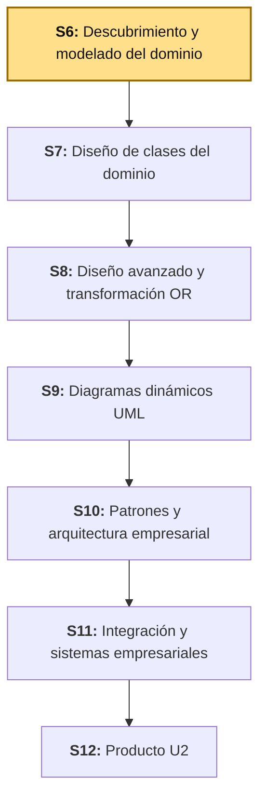
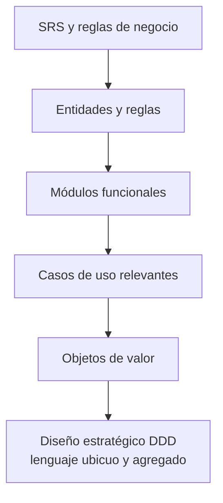
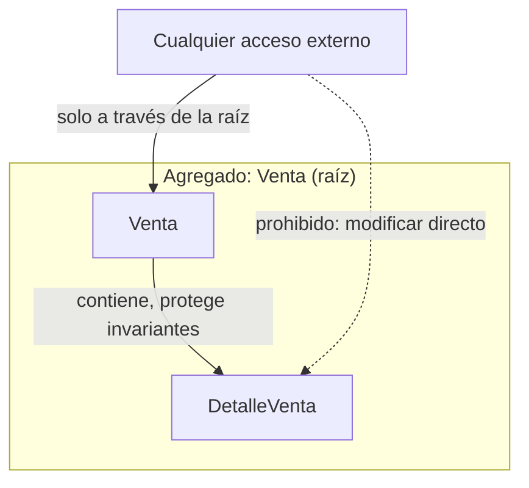
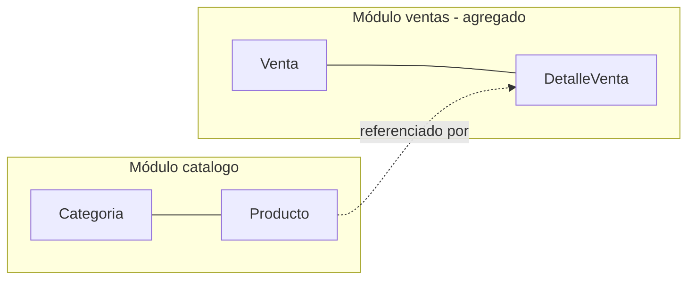

# S6 - Descubrimiento y Modelado del Dominio

## 1. Introducción

Tiempo: 20 min.

### 1.1 Presentación de la sesión

La Unidad I dejó decidido el estilo arquitectónico y las vistas C1-C3 del sistema; todavía no dice qué reglas de negocio protege ese sistema por dentro. Esta sesión abre la Unidad II mirando hacia adentro del contenedor "backend": qué entidades existen, qué reglas gobiernan sus cambios de estado, cómo se agrupan en módulos y qué límite de consistencia necesita protección real, no solo documentación. Ese límite (el **agregado**) es lo que LP2 va a implementar como transacción y BD2 como restricción Oracle — sin descubrirlo aquí, ambos cursos improvisan por separado.

### 1.2 Índice

1. Identificación de entidades y reglas de negocio.
2. Agrupación funcional y delimitación de módulos.
3. Casos de uso relevantes.
4. Objetos de valor.
5. Diseño estratégico de Domain-Driven Design (lenguaje ubicuo, agregado como límite de consistencia).

### 1.3 Propósito de aprendizaje

Al concluir la clase, estarás en condiciones de:

- **Descubrir y modelar** el dominio de tu propio proyecto: identificar entidades y reglas de negocio, agruparlas en módulos funcionales, reconocer casos de uso relevantes y objetos de valor, y aplicar diseño estratégico de Domain-Driven Design para delimitar el agregado que protege la consistencia del proceso transaccional.

### 1.4 Producto de sesión

Modelo de dominio inicial: entidades, reglas de negocio, módulos funcionales delimitados, casos de uso relevantes, objetos de valor y el primer diseño estratégico de DDD (lenguaje ubicuo y agregado) de tu propio proyecto.

### 1.5 Metodología

**Tabla 1. Metodología de la sesión**

| Actividades a Realizar en el Periodo | Orientaciones generales (Orientaciones Metodológicas) | Material de estudio recomendado |
|---|---|---|
| Revisión previa individual | Releer el SRS y las reglas de negocio del propio proyecto (Ciclo 3, si continúa un dominio existente). Trabajo individual, antes de clase; traer identificadas al menos cinco entidades candidatas. | Sílabo ADS U2, SRS propio del equipo. |
| Clase presencial | Descubrimiento guiado de entidades, reglas, módulos, casos de uso, objetos de valor y agregado para BomERP. Trabajo individual, siguiendo al docente paso a paso; consulta inmediata ante dudas de límite de módulo. | Plantillas de las tablas de 3.1-3.7. |
| Evaluación formativa | Revisión en clase del modelo de dominio inicial (entidades, reglas, módulos, agregado). La evidencia se completa y sustenta de forma individual, fuera del aula, según los criterios mínimos de la sección 4.4. | Indicaciones de entrega (4.3), rúbrica de evaluación (4.6). |

### 1.6 Motivación de la sesión

#### 1.6.1 Caso: BomERP (`Categoria`–`Producto`–`Venta`–`DetalleVenta`)

BomERP ya tiene arquitectura y vistas C1-C3 (Unidad I), pero ninguna de esas vistas dice qué pasa si dos cambios simultáneos dejan el total de una venta descuadrado con sus detalles, o si el stock de un producto queda en negativo. Esas son reglas de negocio del dominio, no decisiones de arquitectura — y hasta que no se descubren y modelan explícitamente, cualquier implementación en LP2 las resuelve por intuición, distinta en cada módulo.

**Preguntas de análisis**

**Activación de conocimientos previos**

1. ¿Qué entidades del sistema ya mencionaste en tu arquitectura de Unidad I sin definir todavía sus reglas internas?
2. ¿Qué pasa hoy en tu proyecto si un descuento deja el precio de un producto en un valor absurdo?
3. ¿Por qué "Producto" y "Venta" no deberían vivir en el mismo módulo funcional?

**Comprensión del modelado de dominio**

1. ¿Qué diferencia hay entre una entidad (tiene identidad, cambia en el tiempo) y un objeto de valor (se compara por su contenido, es inmutable)?
2. Si dos operaciones distintas pueden dejar inconsistente el total de una venta frente a sus detalles, ¿qué objeto debería ser responsable de impedirlo?

### 1.7 Ubicación en el curso

- Producto del curso: Diseño Técnico Profesional Documentado.
- Producto de unidad: Catálogo UML con patrones de diseño e integración aplicados.
- Avance del producto en esta sesión: entidades, reglas de negocio, módulos delimitados, casos de uso relevantes, objetos de valor y agregado inicial.

Roadmap del producto de la unidad:

**Figura 1. Roadmap del producto de la unidad**



## 2. Explica

Tiempo: 25 min.

### 2.1 Arquitectura de la sesión

**Figura 2. Flujo de descubrimiento del dominio de BomERP**



Lectura del diagrama:

- El modelo de dominio no arranca dibujando clases: arranca releyendo el SRS y las reglas de negocio ya conocidas, de ahí salen entidades, luego módulos, casos de uso, objetos de valor y recién al final el agregado — en ese orden, porque el agregado se decide sobre entidades y reglas ya identificadas, no al revés.
- Sin este orden, el "agregado" termina siendo una decisión arbitraria sin relación con una regla de negocio real que proteger.
- Integración (referencia, no requisito para esta sesión): el agregado que se delimite aquí es el mismo límite que LP2 implementará como transacción (S9 de LP2) y que BD2 restringe con `CHECK`/triggers a nivel de esquema. **Errores frecuentes**: modelar entidades sin revisar antes las reglas de negocio (el agregado queda mal delimitado); tratar todo objeto como entidad, incluso lo que se compara solo por su valor (precio, rango de fechas); o delimitar módulos por conveniencia de archivo en vez de por cohesión de reglas.

Este diagrama es el mapa que guía el resto de la explicación: cada apartado siguiente desarrolla uno de sus componentes, en el mismo orden del Índice (1.2).

### 2.2 Identificación de entidades y reglas de negocio

Una **entidad** tiene identidad propia (un identificador que la distingue) y cambia de estado en el tiempo sin dejar de ser la misma instancia. Una **regla de negocio** es una condición que el dominio impone sobre esos cambios de estado, independiente de cómo se implemente después en código o base de datos.

En BomERP: `Categoria`, `Producto`, `Venta` y `DetalleVenta` son entidades (cada una con su propio identificador y ciclo de vida). Reglas de negocio ya conocidas del dominio: un producto se registra con una categoría existente; una venta no puede registrarse con stock insuficiente; el total de una venta debe cuadrar con la suma de sus detalles; solo una venta en estado `REGISTRADA` puede anularse.

**Error frecuente**: confundir una regla de negocio con una validación de formato (por ejemplo, "el nombre no puede estar vacío") — las reglas de negocio protegen invariantes del dominio, no solo la forma de un dato.

### 2.3 Agrupación funcional y delimitación de módulos

Un **módulo funcional** agrupa entidades y reglas que cambian juntas por la misma razón de negocio — la misma cohesión que ya se verificó con Spring Modulith en Unidad I, pero decidida aquí desde el dominio, no desde el código.

En BomERP: `catalogo` agrupa `Categoria` y `Producto` (cambian por decisiones de inventario/precio); `ventas` agrupa `Venta` y `DetalleVenta` (cambian juntas por el proceso de venta). `inventario`, `compras` y `seguridad` quedan delimitados como módulos futuros — se nombran para no mezclar su responsabilidad con `catalogo`/`ventas`, pero no se modelan en profundidad hasta que su propia sesión les dé contenido.

**Error frecuente**: agrupar por tipo técnico (todas las entidades juntas, todos los DTO juntos) en vez de por razón de negocio — eso es organización por capa, no por módulo funcional.

### 2.4 Casos de uso relevantes

Un **caso de uso relevante** describe una interacción completa entre un actor y el sistema que produce un resultado de valor para el negocio — no cada método de una clase, solo los que un stakeholder reconocería como "algo que el sistema hace por mí".

En BomERP: *Registrar producto*, *Registrar venta* (cabecera y detalle en la misma operación), *Anular venta*, *Consultar ventas por filtro y rango de fecha*. No son casos de uso relevantes operaciones internas como "calcular subtotal de una línea" — esas son parte de la implementación de *Registrar venta*, no un caso de uso aparte.

**Error frecuente**: listar un caso de uso por cada operación CRUD (crear, listar, actualizar, eliminar) sin filtrar cuáles realmente representan una decisión o un proceso de negocio.

### 2.5 Objetos de valor

Un **objeto de valor** no tiene identidad propia: dos instancias con el mismo contenido son intercambiables, y una vez creado no cambia — cualquier "cambio" en realidad crea una instancia nueva. Se usa para conceptos que el dominio compara por su valor, no por quién los creó.

En BomERP: `Dinero` (monto + moneda) es un candidato claro de objeto de valor para `Producto.precio` y `DetalleVenta.precioUnitario`/`subtotal` — dos montos de S/ 50.00 son el mismo valor sin importar en qué línea aparezcan, y sumar o comparar montos debe hacerse con una lógica propia (por ejemplo, no mezclar monedas), no con aritmética suelta repetida en cada clase. Un `RangoFecha` (desde/hasta) para las consultas de S5 de LP2 es otro candidato: se compara por su contenido, no por identidad.

**Error frecuente**: modelar todo como entidad "por si acaso necesita cambiar" — eso agrega identidad y ciclo de vida innecesarios a algo que el dominio solo necesita comparar por su valor.

### 2.6 Diseño estratégico de Domain-Driven Design

**Domain-Driven Design (DDD)** es un enfoque para diseñar software modelando el código directamente sobre el dominio del negocio, no sobre la base de datos ni sobre la conveniencia técnica — la idea central es que el modelo de software y el modelo mental del negocio deben ser el mismo modelo, no dos traducciones que se desalinean con el tiempo. DDD trabaja en dos niveles: el **diseño estratégico** (el que corresponde a esta sesión) delimita el vocabulario compartido y los límites de consistencia del dominio; el **diseño táctico** (patrones como Aggregate, Repository o Entity ya implementados en código, que esta misma asignatura contrasta con el Service Layer clásico en **S10 de ADS**, "Patrones de Diseño y Arquitectura Empresarial") construye esos límites dentro del código. Sin el diseño estratégico primero, el diseño táctico no tiene sobre qué límite aplicarse — por eso esta sesión antecede a S10.

Las dos herramientas de diseño estratégico que se aplican en esta sesión son el lenguaje ubicuo y el agregado.

El **lenguaje ubicuo** es el vocabulario que el equipo técnico y el negocio comparten sin traducción: si el negocio dice "anular una venta", el código dice `venta.anular()`, no `venta.setEstado(3)`. El **agregado** es el límite de consistencia transaccional: un conjunto de entidades que deben cambiar juntas, atómicamente, para que una regla de negocio nunca quede violada — se accede siempre a través de su raíz (*aggregate root*), nunca modificando un elemento interno por su cuenta.

En BomERP, `Venta` es la raíz del agregado `Venta`–`DetalleVenta`: sus invariantes (el total debe cuadrar con la suma de los detalles; el stock del producto nunca queda negativo; solo una venta `REGISTRADA` puede anularse) solo se protegen si toda modificación pasa por `Venta`, no directamente por `DetalleVenta`. `Categoria` y `Producto` no comparten ese mismo agregado — un cambio de categoría no necesita la misma atomicidad que registrar una venta completa.

**Error frecuente**: declarar "todo es un agregado" o, al contrario, un único agregado gigante para todo el sistema — el agregado se delimita por la regla de negocio que protege, no por conveniencia de diseño.

## 3. Aplica: actividad práctica guiada

Tiempo: 2h.

**Actividad:** descubrimiento guiado del modelo de dominio de BomERP: entidades, reglas de negocio, módulos, casos de uso relevantes, objetos de valor y diseño estratégico de DDD (Producto de la sesión en 1.4).

**Propósito de la actividad:** construir el primer modelo de dominio de BomERP — entidades con sus reglas, módulos delimitados, casos de uso relevantes, objetos de valor y el agregado que protege la consistencia transaccional — que LP2 implementará como transacción (S9) y BD2 restringirá a nivel de esquema.

**Orientaciones metodológicas:** en el laboratorio, el docente guía el descubrimiento de entidades, reglas, módulos, casos de uso, objetos de valor y agregado para BomERP paso a paso frente a la clase; los estudiantes completan las mismas tablas para el dominio de su propio proyecto de equipo (ver sección 4).

**Actividades para realizar:**

- **3.1** Identificar entidades y reglas de negocio.
- **3.2** Delimitar módulos funcionales.
- **3.3** Reconocer casos de uso relevantes.
- **3.4** Identificar objetos de valor.
- **3.5** Aplicar diseño estratégico de DDD (lenguaje ubicuo y agregado).
- **3.6** Bosquejar el modelo de dominio inicial.
- **3.7** Trazar ADS con BD2 y LP2.

### 3.1 Identificar entidades y reglas de negocio

**Producto del paso:** listado de entidades con sus reglas de negocio asociadas.

**Tabla 2. Entidades y reglas de negocio de BomERP**

| Entidad | Identificador | Regla de negocio asociada |
|---|---|---|
| `Categoria` | id | Un producto se registra con una categoría existente. |
| `Producto` | id | Un descuento no puede dejar el precio fuera de rango razonable. |
| `Venta` | id | El total debe cuadrar con la suma de los detalles; solo una venta `REGISTRADA` puede anularse. |
| `DetalleVenta` | id | No puede registrarse con stock insuficiente del producto asociado. |

### 3.2 Delimitar módulos funcionales

**Producto del paso:** agrupación de entidades en módulos con su razón de cohesión.

**Tabla 3. Módulos funcionales de BomERP**

| Módulo | Entidades | Razón de cohesión |
|---|---|---|
| `catalogo` | `Categoria`, `Producto` | Cambian juntas por decisiones de inventario y precio. |
| `ventas` | `Venta`, `DetalleVenta` | Cambian juntas por el proceso transaccional de venta. |
| `inventario` (futuro) | — | Sin sesión asignada aún; no se modela en profundidad todavía. |
| `compras` (futuro) | — | Delimitado, no obligatorio en esta unidad. |
| `seguridad` (futuro) | — | Se implementa en S10 (Patrones y arquitectura empresarial). |

### 3.3 Reconocer casos de uso relevantes

**Producto del paso:** lista de casos de uso relevantes por módulo.

**Tabla 4. Casos de uso relevantes de BomERP**

| Módulo | Caso de uso | Valor para el negocio |
|---|---|---|
| `catalogo` | Registrar producto | Ampliar el catálogo disponible para la venta. |
| `catalogo` | Actualizar stock | Mantener el inventario disponible confiable. |
| `ventas` | Registrar venta | Concretar una transacción comercial con su detalle. |
| `ventas` | Anular venta | Revertir una transacción sin dejar el stock inconsistente. |
| `ventas` | Consultar ventas por filtro y fecha | Dar soporte a reportes y auditoría. |

### 3.4 Identificar objetos de valor

**Producto del paso:** objetos de valor candidatos y qué reemplazan.

**Tabla 5. Objetos de valor candidatos**

| Objeto de valor | Reemplaza a | Por qué es objeto de valor |
|---|---|---|
| `Dinero` (monto + moneda) | `precio`, `precioUnitario`, `subtotal` sueltos como `BigDecimal` | Se compara por contenido; dos montos iguales son intercambiables; no tiene ciclo de vida propio. |
| `RangoFecha` (desde/hasta) | Parámetros sueltos `desde`, `hasta` en la consulta de S5 (LP2) | Se compara por contenido; agrupa una validación propia (desde ≤ hasta) en un solo lugar. |

### 3.5 Aplicar diseño estratégico de DDD

**Producto del paso:** glosario de lenguaje ubicuo y delimitación del agregado.

**Tabla 6. Lenguaje ubicuo de BomERP**

| Término del negocio | Significado compartido | Cómo se ve en el código |
|---|---|---|
| Venta | Transacción comercial registrada, con su detalle. | `Venta.registrar()` |
| Anular | Revertir una venta activa sin eliminarla del historial. | `Venta.anular()` |
| Stock | Cantidad disponible de un producto para la venta. | `Producto.stock` |

**Figura 3. Agregado `Venta`–`DetalleVenta`**



### 3.6 Bosquejar el modelo de dominio inicial

**Producto del paso:** esquema inicial del modelo de dominio (sin atributos ni operaciones todavía — eso se detalla en S7).

**Figura 4. Esquema inicial del modelo de dominio de BomERP**



Este esquema es intencionalmente simple: el diagrama de clases completo, con atributos, operaciones y multiplicidades, se construye en S7. Aquí solo se fija qué entidades existen, en qué módulo viven y cuál es el agregado.

### 3.7 Trazar ADS con BD2 y LP2

**Producto del paso:** matriz de integración del modelo de dominio.

**Tabla 7. Matriz de integración ADS-BD2-LP2**

| Decisión de dominio (ADS) | Evidencia esperada en BD2 | Evidencia esperada en LP2 |
|---|---|---|
| Agregado `Venta`–`DetalleVenta` | Transacción PL/SQL o restricción que impide guardar detalle sin cabecera | `@Transactional` en el servicio de registro de venta (S9 de LP2) |
| Regla: stock nunca negativo | `CHECK` o trigger sobre `Producto.stock` | Validación de stock antes de persistir el detalle |
| Objeto de valor `Dinero` | Columna con precisión y escala fija para montos | Clase `Dinero` o equivalente, sin `BigDecimal` suelto en la entidad |
| Módulos `catalogo`/`ventas` | Esquemas Oracle con propietario funcional propio | Paquetes de módulo verificados con Spring Modulith |

Sesión equivalente en los otros dos cursos, misma semana: [BD2 - S2 Triggers DML y Auditoría](../../bd2/sesiones/S02_Triggers_DML_Auditoria.md) y [LP2 - S3 Objetos Relacionados Categoria-Producto](../../lp2/sesiones/S03_Objetos_Relacionados_Categoria_Producto.md).

**Evidencia de aprendizaje:**

- Entidades y reglas de negocio, módulos delimitados y casos de uso relevantes de BomERP.
- Objetos de valor candidatos y su justificación.
- Glosario de lenguaje ubicuo y agregado delimitado, con su esquema inicial.
- Matriz de integración con BD2 y LP2.

## 4. Crea: actividad autónoma

Tiempo: 2h fuera del aula.

### 4.1 Actividad

Descubrimiento y modelado autónomo del dominio del proyecto propio del equipo, documentado en evidencia individual.

Completa y evidencia estas tareas:

1. Identificar al menos cuatro entidades con su regla de negocio asociada.
2. Delimitar al menos dos módulos funcionales con su razón de cohesión.
3. Reconocer al menos tres casos de uso relevantes.
4. Identificar al menos un objeto de valor candidato.
5. Elaborar el glosario de lenguaje ubicuo y delimitar el agregado del proceso transaccional propio.
6. Bosquejar el esquema inicial del modelo de dominio.

### 4.2 Propósito

Que cada estudiante demuestre, de forma individual y fuera del aula, que puede reproducir el patrón de descubrimiento de dominio construido en clase sin el acompañamiento del docente.

Cada estudiante consolida el modelo de dominio inicial del proyecto.

### 4.3 Indicaciones

Entrega un PDF con el siguiente nombre:

```text
S06_ADS_Equipo##_ApellidoNombre.pdf
```

Cada captura de pantalla del informe debe mostrar, sin recortar, el reloj del sistema (fecha y hora) y tu usuario o foto de perfil (Windows, VS Code o navegador) visibles en pantalla — es lo que permite verificar que la evidencia es tuya y que corresponde al momento real de tu trabajo.

#### 4.3.1 Estructura del informe

**Datos del estudiante**

- Nombre:
- Equipo:
- Sesión: S06 - Descubrimiento y Modelado del Dominio
- Rol o aporte realizado:
- Link de GitHub:

**Evidencia técnica**

Incluye capturas o salidas con una breve explicación debajo de cada una, organizadas en los mismos 4 bloques de la rúbrica (4.6) — así queda claro qué evidencia corresponde a cada criterio evaluado:

1. *Entidades, reglas y módulos*
    - Tabla de entidades y reglas de negocio.
    - Tabla de módulos funcionales.
2. *Casos de uso y objetos de valor*
    - Tabla de casos de uso relevantes.
    - Tabla de objetos de valor candidatos.
3. *Diseño estratégico DDD*
    - Glosario de lenguaje ubicuo.
    - Agregado delimitado (figura del agregado).
4. *Esquema del modelo de dominio*
    - Esquema inicial del modelo de dominio.

**Error o hallazgo**

Describe al menos un error o hallazgo: qué entidad confundiste inicialmente con un objeto de valor (o viceversa), qué regla de negocio se te había pasado, qué ajuste hiciste y qué aprendiste sobre modelado de dominio.

**Reflexión técnica breve**

Responde en 5 a 8 líneas:

```text
¿Por qué el agregado se decide a partir de una regla de negocio real
y no a partir de qué tan cómodo es agrupar clases en el código?
```

### 4.4 Criterios mínimos de aceptación

La evidencia individual se considera completa si:

- El archivo respeta el nombre solicitado.
- Identifica entidades con su regla de negocio asociada.
- Delimita módulos funcionales con razón de cohesión explícita.
- Reconoce casos de uso relevantes, no solo operaciones CRUD sueltas.
- Identifica al menos un objeto de valor justificado.
- Presenta el glosario de lenguaje ubicuo y el agregado delimitado.
- Cada captura de la evidencia técnica muestra el reloj del sistema y el usuario/perfil visible, sin recortar.
- Las fechas y horas de las capturas son coherentes con el historial de commits de su repositorio en GitHub.
- Incluye un error o hallazgo técnico diagnosticado.
- Incluye la reflexión técnica breve solicitada.

### 4.5 Preguntas de defensa

1. ¿Qué regla de negocio protege el agregado que delimitaste?
2. ¿Por qué el objeto de valor que identificaste no necesita identidad propia?
3. ¿Qué pasaría si alguien modificara una entidad interna del agregado sin pasar por su raíz?
4. ¿Por qué separaste tus módulos funcionales de esa forma y no de otra?

### 4.6 Rúbrica de evaluación

**Tabla 8. Rúbrica de evaluación**

| Criterio | Peso (%) | A (20 pts) | B (15 pts) | C (10 pts) | D (5 pts) | Nivel obtenido |
|---|---:|---|---|---|---|---:|
| 1. Entidades, reglas y módulos* | 25 | Identifica entidades con reglas de negocio claras y módulos delimitados con cohesión real. | Identifica entidades y módulos principales, con detalles menores. | Entidades o módulos incompletos o poco justificados. | No identifica entidades ni módulos verificables. | |
| 2. Casos de uso y objetos de valor* | 25 | Reconoce casos de uso relevantes y objetos de valor bien justificados. | Reconoce casos de uso y objetos de valor, con justificación parcial. | Lista casos de uso u objetos de valor sin justificación suficiente. | No reconoce casos de uso ni objetos de valor. | |
| 3. Diseño estratégico DDD* | 25 | Glosario de lenguaje ubicuo claro y agregado delimitado sobre una regla de negocio real. | Glosario y agregado presentes, con justificación general. | Glosario o agregado débil o genérico. | No presenta glosario ni agregado. | |
| 4. Esquema del modelo de dominio* | 25 | Esquema claro, coherente con entidades, módulos y agregado ya definidos. | Esquema comprensible, con inconsistencias menores. | Esquema incompleto o poco conectado con el resto del informe. | No presenta esquema. | |

\* Agregado manual.

Nota final = suma de (`Peso` / 100 × `Puntos del nivel obtenido`) = ____ / 20.

Para usar la rúbrica con IA, solicita:

```text
Evalúa el PDF usando la rúbrica de la sesión.
Para cada criterio selecciona el nivel obtenido usando la escala A=20, B=15, C=10, D=5 puntos.
Justifica brevemente cada nivel asignado.
Verifica que cada captura muestre reloj del sistema y usuario/perfil visible, y que las fechas sean coherentes con el historial de commits de GitHub. Si falta esta evidencia o hay inconsistencias, indícalo explícitamente antes de calificar.
Calcula la nota final con la fórmula: suma de (Peso/100 × Puntos del nivel obtenido), directamente sobre 20.
Indica 2 fortalezas y 2 recomendaciones.
```

## 5. Cierre

Tiempo: 5 min.

**Resumen breve:** hoy BomERP pasó de tener arquitectura declarada a tener un dominio descubierto — entidades con sus reglas, módulos delimitados, casos de uso relevantes, objetos de valor y un agregado que protege la consistencia transaccional, con su propio lenguaje ubicuo.

**Dinámica participativa:** en una ronda rápida (o con una herramienta digital tipo formulario o encuesta en vivo), cada estudiante comparte en una frase qué regla de negocio protege el agregado que delimitó.

**Metacognición:** cada estudiante responde en voz alta o por escrito: ¿qué te costó más distinguir hoy, una entidad de un objeto de valor o el límite del agregado, y cómo lo resolviste?

**Proyección:** el modelo de dominio de hoy se refina en S7 con el diagrama de clases completo (atributos, operaciones, relaciones y multiplicidades), y el agregado delimitado hoy es el mismo límite que LP2 implementará como transacción en su propia Unidad 2.

## Bibliografía

1. Evans, E. (2003). *Domain-Driven Design: Tackling Complexity in the Heart of Software*. Addison-Wesley.
2. Vernon, V. (2013). *Implementing Domain-Driven Design*. Addison-Wesley.
3. Seidl, M., Scholz, M., Huemer, C., & Kappel, G. (2015). *UML@Classroom: An Introduction to Object-Oriented Modeling*. Springer.
