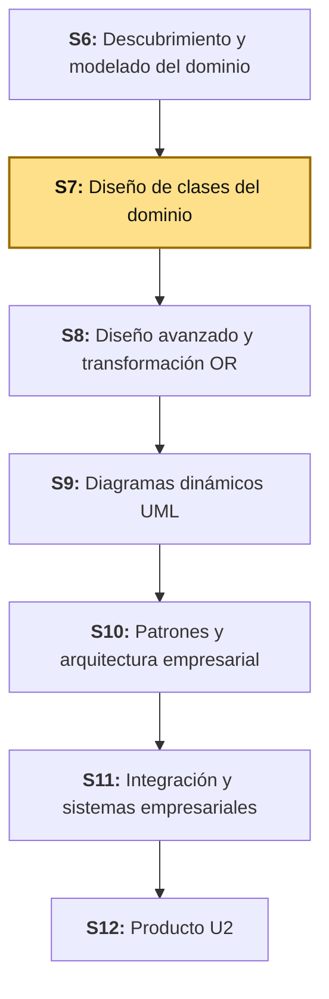
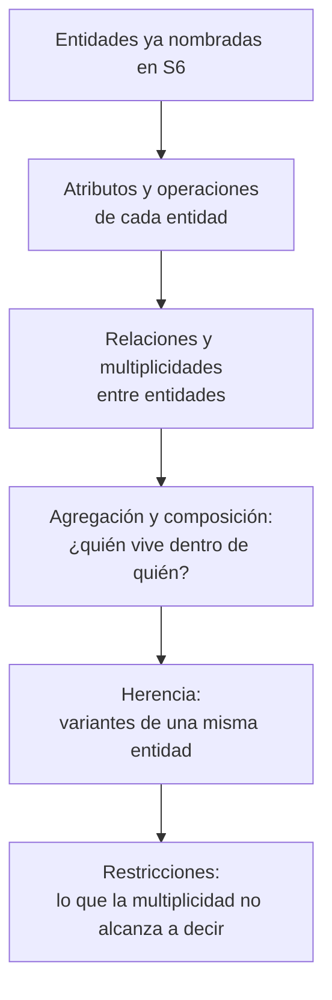
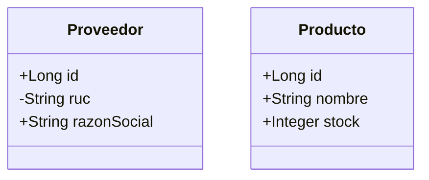
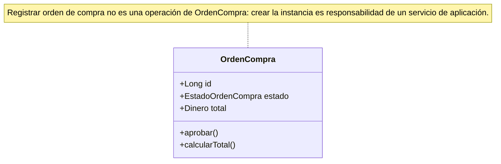
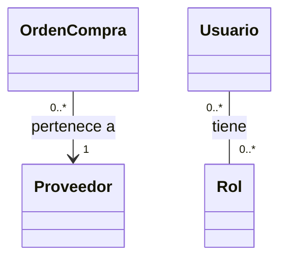
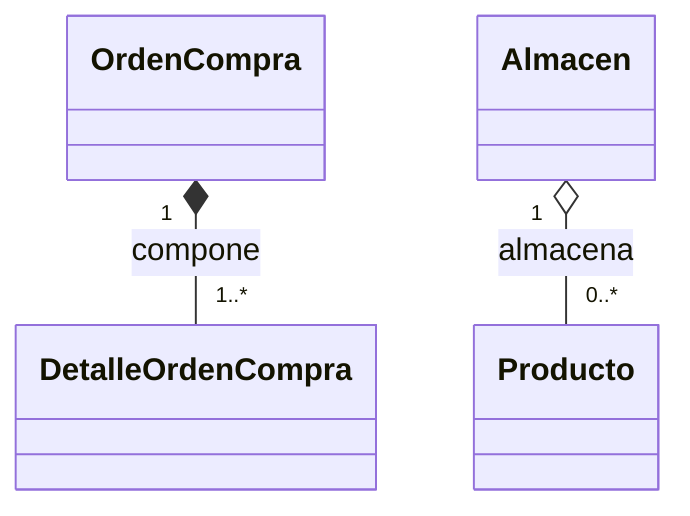
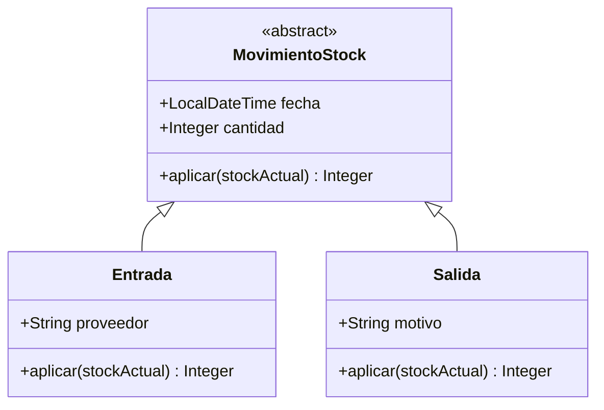
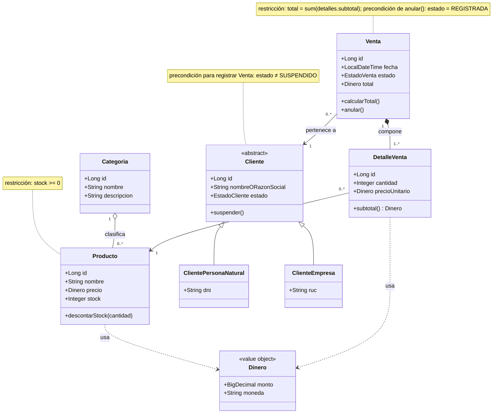

# S7 - Diseño de Clases del Dominio

## 1. Introducción

Tiempo: 20 min.

### 1.1 Presentación de la sesión

S6 descubrió el dominio de punta a punta, pero se detuvo a propósito antes del detalle: entidades nombradas, reglas descritas en prosa, un esquema con cajas y líneas sin atributos ni multiplicidades (S6, 3.8). Esa falta de detalle no es un defecto — es simplemente el límite de lo que un panorama holístico necesita responder. Esta sesión baja un nivel: convierte esas cajas en un diagrama de clases real, con atributos, operaciones, relaciones, multiplicidades, agregación, composición, herencia y las restricciones que ninguna multiplicidad alcanza a expresar. El porqué de necesitar ese detalle ahora, y no antes, se desarrolla en 1.6, a partir del caso.

### 1.2 Índice

1. Entidades persistentes y atributos.
2. Operaciones de clase.
3. Relaciones y multiplicidades.
4. Agregación y composición.
5. Herencia.
6. Restricciones del modelo de clases.

### 1.3 Propósito de aprendizaje

Al concluir la clase, estarás en condiciones de:

- **Elaborar** el diagrama de clases UML del dominio de tu propio proyecto: entidades persistentes con atributos y operaciones, relaciones con multiplicidades correctas, agregación, composición y herencia donde el dominio realmente lo requiera, y las restricciones que ninguna multiplicidad alcanza a expresar.

### 1.4 Producto de sesión

Diagrama de clases UML del dominio de tu propio proyecto: entidades persistentes con sus atributos y operaciones, relaciones con multiplicidades, al menos una relación de agregación, una de composición y una jerarquía de herencia, y las restricciones del modelo documentadas junto al diagrama.

### 1.5 Metodología

**Tabla 1. Metodología de la sesión**

| Actividades a Realizar en el Periodo | Orientaciones generales (Orientaciones Metodológicas) | Material de estudio recomendado |
|---|---|---|
| Revisión previa individual | Releer el modelo de dominio inicial propio (S6): módulos, entidades, reglas de negocio, objetos de valor y agregado delimitado. Trabajo individual, antes de clase. | S6 (3.1-3.8), esquema inicial del propio proyecto. |
| Clase presencial | Construcción guiada del diagrama de clases completo para BomERP: atributos, operaciones, relaciones, multiplicidades, agregación, composición, herencia y restricciones. Trabajo individual, siguiendo al docente paso a paso; consulta inmediata ante dudas de agregación vs. composición. | Esquema inicial de S6 (Figura 9), plantillas de las tablas de 3.1-3.7. |
| Evaluación formativa | Revisión en clase del diagrama de clases completo. La evidencia se completa y sustenta de forma individual, fuera del aula, según los criterios mínimos de la sección 4.4. | Indicaciones de entrega (4.3), rúbrica de evaluación (4.6). |

### 1.6 Motivación de la sesión
 
#### 1.6.1 Caso: el rectángulo que cada quien completaba distinto

El esquema de S6 (Figura 9) dibuja `Venta` y `DetalleVenta` como dos cajas conectadas por una línea — pero no dice cuántos detalles admite una venta, qué pasa si `cantidad` llega en cero, ni si `Cliente` puede existir sin ninguna venta todavía. Dos integrantes del mismo equipo, mirando exactamente la misma caja, completaron su prototipo de base de datos con reglas distintas: uno permitió guardar una venta sin ningún detalle, el otro no. Ninguno de los dos estaba equivocado con la información que tenía — el esquema de S6 nunca lo dijo, porque todavía no era su trabajo decirlo.

Esta sesión no descubre ningún módulo ni entidad nueva: toma exactamente lo que S6 ya nombró y le agrega el detalle que evita que dos personas del mismo equipo lean la misma caja de formas distintas.

**Preguntas de análisis**

**Activación de conocimientos previos**

1. Del esquema de dominio que bosquejaste en S6, ¿qué pregunta concreta sobre una relación entre dos entidades quedó sin responder?

**Comprensión del diagrama de clases**

1. ¿Qué diferencia hay entre decir "una venta tiene detalles" (S6) y decir "una venta tiene entre 1 y N detalles" (multiplicidad)? ¿Por qué la segunda frase deja menos espacio para que dos personas la interpreten distinto?
2. Si `DetalleVenta` no tiene sentido sin su `Venta` (prueba de tres partes, S6 2.7), ¿qué símbolo del diagrama de clases debería representar esa relación, y por qué uno distinto no serviría igual?

### 1.7 Ubicación en el curso

- Producto del curso: Diseño Técnico Profesional Documentado.
- Producto de unidad: Catálogo UML con patrones de diseño e integración aplicados.
- Avance del producto en esta sesión: diagrama de clases completo del dominio, con atributos, operaciones, relaciones, multiplicidades, agregación, composición, herencia y restricciones.

Roadmap del producto de la unidad:

**Figura 1. Roadmap del producto de la unidad**



## 2. Explica

Tiempo: 25 min.

### 2.1 Arquitectura de la sesión

**Figura 2. Flujo de construcción del diagrama de clases: de la caja al modelo completo**



Lectura del diagrama: el diagrama de clases no reemplaza el trabajo de S6 — lo detalla, en el mismo orden en que un lector necesita esa información (primero qué datos tiene cada clase, después cómo se protege a sí misma, después cómo se relaciona con las demás). Cada apartado siguiente desarrolla uno de sus componentes, en el mismo orden del Índice (1.2).

### 2.2 Entidades persistentes y atributos

Un diagrama de clases representa cada clase como un rectángulo con tres compartimentos: nombre, atributos y operaciones (Fowler, 2004).

**Figura 3. Anatomía de una clase UML**



`Proveedor` (módulo candidato `compras`, S6 2.2-2.3) es el ejemplo de anatomía: `+`/`-` son visibilidad (público/privado), igual que en Java — `id` y `razonSocial` son públicos, `ruc` es privado, los tres son **atributos** (nombre y tipo, `+razonSocial: String`), no cómo se guardan en una base de datos real; esa traducción (columna, tipo SQL, longitud) es trabajo de BD2, no del modelo de dominio. `Producto` ya aplica esa misma anatomía a una entidad real que sí se modela en profundidad esta unidad, con un subconjunto de sus atributos — el resto (`precio`, y las demás entidades: `Categoria`, `Cliente`, `Venta`, `DetalleVenta`) se completa recién en 3.2, no antes, para no repetir el mismo trabajo dos veces.

**Error frecuente**: agregar un atributo que en realidad es una relación con otra clase (por ejemplo, `Venta.idCliente: Long`) en vez de modelarlo como una relación real (`Venta` -- `Cliente`, con su multiplicidad). Un identificador foráneo es una decisión de persistencia (BD2/LP2); el dominio modela la relación entre objetos, no la llave que la implementa.

### 2.3 Operaciones de clase

Una **operación** es un comportamiento que la propia clase ejecuta para proteger sus reglas de negocio — no cualquier función que alguien podría escribir sobre sus datos. El principio detrás de esto (*Information Expert*, un patrón GRASP) dice que la responsabilidad de una operación debe caer en la clase que tiene la información necesaria para cumplirla (Larman, 2004): `Venta` es quien debería saber calcular su propio total, no un servicio externo leyéndole los atributos uno por uno.

Esta decisión ya se anticipó en S6 (2.8, diseño táctico): un modelo donde las entidades solo tienen atributos y toda la lógica vive afuera, en una capa de "servicio", es un **Anemic Domain Model** — funciona, pero deja a la entidad sin poder proteger sus propias reglas. `Venta.anular()`, `Venta.calcularTotal()` y `Producto.descontarStock(cantidad)` son operaciones reales de esta sesión, no solo getters/setters.

**Figura 4. Operaciones de clase, con un ejemplo de otro módulo de BomERP (`compras`)**



`aprobar()` y `calcularTotal()` sí son operaciones reales de `OrdenCompra` — es la propia orden la que conoce su estado y puede protegerlo (mismo criterio que `Venta.anular()`). "Registrar orden de compra", en cambio, no aparece como operación: crear la instancia es responsabilidad externa, la nota lo deja explícito en el propio diagrama en vez de solo en el texto.

**¿`OrdenCompraService` no necesitaría entonces un método `aprobar()` también? Sí — pero no es el mismo trabajo duplicado.** Que `aprobar()` sea una operación de la entidad no elimina el servicio de aplicación: el servicio sigue existiendo para todo lo que la entidad no debe saber hacer (buscar la orden por id en el repositorio, abrir la transacción, guardar el cambio, devolver un DTO al controlador). La diferencia está en qué hace cada método por dentro:

```text
OrdenCompraService.aprobar(id):
    orden = repositorio.buscarPorId(id)   // el servicio SÍ sabe de repositorios
    orden.aprobar()                       // delega la regla a quien la protege
    repositorio.guardar(orden)            // el servicio SÍ sabe de persistencia
```

El servicio **delega** en `OrdenCompra.aprobar()` la única parte que de verdad es una regla de negocio (¿puede aprobarse desde este estado?); él mismo nunca reimplementa esa validación. El error que sí sería un problema — y que recaería otra vez en Anemic Domain Model — es que `OrdenCompraService.aprobar()` cambiara `orden.estado` directamente (`orden.setEstado(APROBADA)`) sin pasar por `orden.aprobar()`: ahí la regla quedaría solo en el servicio, y cualquier otro punto del código que también cambie el estado podría saltársela.

**No todo caso de uso frecuente se vuelve una operación de entidad — hay que revisarlos uno por uno.** S6 (2.5) ya había identificado los casos de uso relevantes de `catalogo` y `ventas`; *Information Expert* decide, caso por caso, si la responsabilidad cae en una entidad o en otra capa (un servicio de aplicación, o una consulta de repositorio, S05 de LP2):

- **Registrar producto** — no es una operación de `Producto` sobre sí mismo: crear la instancia es responsabilidad de quien orquesta el alta (un servicio de aplicación), no de la entidad todavía inexistente. Lo que sí es responsabilidad de `Producto` es proteger sus propias reglas al construirse (por ejemplo, que el precio no sea negativo) — eso puede vivir en el constructor, no en una operación aparte.
- **Registrar venta** — igual: orquestar la creación de `Venta` junto con sus `DetalleVenta` y descontar el stock de cada `Producto` es un proceso que coordina varias entidades a la vez (agregado completo), responsabilidad de un servicio de aplicación. Dentro de ese proceso, `Venta.calcularTotal()` sí es la operación de la entidad.
- **Anular venta** — sí es una operación real de `Venta` (`anular()`, ya en el diagrama): la propia entidad conoce su estado y puede rechazar la operación si no está `REGISTRADA` (restricción, 2.7).
- **Consultar ventas por filtro y rango de fecha** — no es una operación de ninguna instancia de `Venta`: ninguna venta puntual "se consulta a sí misma". Es una responsabilidad de consulta (repositorio), ya resuelta en código por LP2 (S5, filtros JPQL) — queda fuera del diagrama de clases del dominio.
- **Registrar cliente** / **Suspender cliente** — mismo criterio que arriba: registrar es orquestación externa; `Cliente.suspender()` (ya en el diagrama) sí es una operación real, porque es la propia entidad la que cambia su estado y protege que ese cambio sea válido.

La regla práctica: si el caso de uso *cambia el estado* de una instancia ya existente y esa instancia puede validar la regla con lo que ya tiene (`anular()`, `suspender()`, `descontarStock()`), es una operación de la entidad. Si el caso de uso *crea* algo nuevo, *coordina* varias entidades a la vez, o *busca/filtra* entre muchas instancias, es responsabilidad de otra capa — no del diagrama de clases del dominio.

### 2.4 Relaciones y multiplicidades

Una **relación** conecta dos clases que colaboran para cumplir una responsabilidad del dominio. La **multiplicidad**, escrita en cada extremo, dice cuántas instancias de un lado pueden asociarse con una instancia del otro — `0..1` (cero o una), `1` (exactamente una), `0..*` (cero o muchas) y `1..*` (una o muchas) son las notaciones estándar (OMG, 2017), válidas en cualquier dominio, no solo en BomERP:

**Figura 5. Multiplicidad, con ejemplos de otros módulos de BomERP (`compras`, `administracion`)**



`OrdenCompra -- Proveedor` (`0..*` a `1`, módulo `compras`): un proveedor puede no tener ninguna orden de compra todavía, pero cada orden se emite a exactamente un proveedor, nunca a cero. `Usuario -- Rol` (`0..*` a `0..*`, módulo `administracion`): un usuario puede tener varios roles, y un mismo rol se asigna a varios usuarios — una multiplicidad **muchos a muchos**, distinta de la anterior.

**¿Por qué una sí lleva flecha y la otra no.** Una línea simple, sin flecha, no significa "no depende de nadie" — en la práctica se lee como navegable en ambos sentidos (Fowler, 2004). Eso es exactamente lo que pasa con `Usuario -- Rol`: un M:N normal necesita consultarse en los dos sentidos ("los roles de este usuario" y "los usuarios con este rol"), así que la línea simple es la elección correcta, no una omisión. `OrdenCompra -- Proveedor`, en cambio, sí tiene un lado dueño de la relación: es `OrdenCompra` quien guarda la referencia (`idProveedor`, una llave foránea) — `Proveedor` no necesita mantener una lista de sus órdenes para que el negocio funcione. Por eso la flecha va de `OrdenCompra` hacia `Proveedor`, no al revés: apunta hacia quien se consulta, no hacia quien depende de quién.

**¿Y la flecha de dependencia (`..>`)? No es lo que hace falta aquí.** La dependencia en UML es una relación débil y temporal — una clase que usa a otra de paso (por ejemplo, como tipo de un parámetro), sin guardar ninguna referencia ni tener multiplicidad propia (OMG, 2017). `OrdenCompra` y `Proveedor` no es ese caso: es una relación estructural, permanente, con multiplicidad real — una asociación, no una dependencia. Lo que responde "quién depende de quién para existir" no es el tipo de flecha, es el **mínimo** de la multiplicidad: `Proveedor` tiene mínimo `0` del lado de `OrdenCompra` (puede existir sin ninguna orden), mientras que `OrdenCompra` tiene mínimo `1` del lado de `Proveedor` (no puede existir sin exactamente un proveedor) — por eso `Proveedor` existe primero.

Aplicado al dominio que sí se modela en profundidad esta unidad (Figura 8, 3.6): `Categoria "1" -- "0..*" Producto` dice algo que el esquema de S6 nunca dijo — una categoría puede tener cero productos, y un producto pertenece a exactamente una categoría, nunca a varias. `Venta -- Cliente` y `DetalleVenta -- Producto` siguen el mismo criterio que `OrdenCompra -- Proveedor`: la flecha va del lado que guarda la llave foránea (`Venta`, `DetalleVenta`) hacia el lado referenciado (`Cliente`, `Producto`) — aplicado a una regla real, la de S6 (2.4), "una venta debe estar asociada a un cliente registrado".

**Error frecuente**: dejar una relación sin multiplicidad, "porque ya se entiende". Sin ese dato explícito, el equipo de LP2 no sabe si debe validar que una venta tenga al menos un detalle (`1..*`) o si acepta ventas vacías (`0..*`) — exactamente el problema del caso de 1.6.1.

### 2.5 Agregación y composición

Ambas son relaciones "todo-parte", pero con una diferencia de ciclo de vida que S6 (2.7) ya empezó a resolver con la prueba de tres partes: en la **composición** (diamante relleno, `*--`), la parte no tiene sentido sin el todo y muere con él; en la **agregación** (diamante vacío, `o--`), la parte puede existir, moverse o compartirse entre varios todos, sin depender de uno en particular (Fowler, 2004).

**Figura 6. Composición vs. agregación, con ejemplos de otros módulos de BomERP (`compras`, `inventario`)**



**Composición** (`OrdenCompra *-- DetalleOrdenCompra`, módulo `compras`): un detalle de orden de compra no tiene sentido fuera de su orden — nadie lo traslada a otra orden; si la orden se elimina, el detalle deja de existir con ella. Es exactamente el mismo patrón que `Venta`-`DetalleVenta` (ver abajo), aplicado a un módulo distinto. **Agregación** (`Almacen o-- Producto`, módulo `inventario`): un producto puede moverse de un almacén a otro sin perder su identidad, y si un almacén cierra, el negocio real espera que sus productos se trasladen a otro, no que desaparezcan con él.

El mismo criterio, aplicado al dominio que sí se modela en profundidad esta unidad (Figura 8, 3.6): `Venta "1" *-- "1..*" DetalleVenta` es composición, mismo caso que `OrdenCompra`-`DetalleOrdenCompra` — la prueba de tres partes de S6 ya concluyó que un `DetalleVenta` no tiene sentido sin su `Venta`. `Categoria "1" o-- "0..*" Producto` es agregación, mismo caso que `Almacen`-`Producto` — un `Producto` puede recategorizarse sin perder su identidad, y si una `Categoria` se elimina, el negocio real espera que sus productos se reasignen, no que desaparezcan con ella.

**Error frecuente**: usar composición por defecto para cualquier relación "contenedor-contenido" sin aplicar la prueba de tres partes. No toda caja dibujada cerca de otra en S6 compone — hay que verificarlo, no asumirlo por cercanía visual.

### 2.6 Herencia

La **herencia** (generalización/especialización) modela una relación "es-un": una superclase declara atributos y operaciones comunes, y cada subclase agrega solo lo que la distingue. Se justifica cuando dos o más variantes de una entidad comparten comportamiento real, no solo cuando "podrían" separarse en algún momento (Fowler, 2004) — una bandera booleana (`esEmpresa: Boolean`) suele alcanzar cuando la única diferencia es un dato, sin comportamiento distinto.

**Figura 7. Herencia, con un ejemplo de otro módulo de BomERP (`inventario`)**



**La flecha de herencia no es una flecha de navegabilidad — no se puede invertir "según el diseño" como sí se podía en 2.4.** `MovimientoStock <|-- Entrada` se lee "`Entrada` es-un `MovimientoStock`": el triángulo vacío siempre apunta hacia la superclase, sin importar si esta se dibuja arriba o abajo — es una convención de layout, no de significado. Si se invirtiera (`Entrada <|-- MovimientoStock`), la frase pasaría a ser "`MovimientoStock` es-un `Entrada`" — falso, y además contradictorio: `MovimientoStock` tendría que ser, al mismo tiempo, un tipo de `Entrada` *y* un tipo de `Salida`, cuando en realidad es exactamente lo opuesto — la clase general de la que `Entrada` y `Salida` son casos particulares. Por eso es `abstract`: no decide todavía si suma o resta, cada subclase sí lo decide.

Es una relación completamente distinta a la asociación de 2.4, aunque ambas se dibujen con una línea: la asociación (`-->`) representa una decisión de diseño (quién referencia a quién en código, normalmente vía una llave foránea); la herencia representa un hecho lógico del dominio (qué es un caso particular de qué), y por eso no admite la misma libertad — no hay una "llave foránea" de `Entrada` hacia `MovimientoStock` como la habría de `OrdenCompra` hacia `Proveedor`; en código es `extends` (Java), y en la base de datos es una estrategia de mapeo objeto-relacional completa (tabla única, por subclase o por clase concreta) — contenido de S8, ya anticipado en la Tabla 6.

`inventario` (módulo candidato de S6, 2.2-2.3, todavía sin sesión propia esta unidad) tiene su propio caso de herencia, distinto de `catalogo`/`ventas`: una `Entrada` de mercadería y una `Salida` comparten la misma operación (`aplicar(stockActual)`), pero cada una la resuelve al revés — `Entrada` suma la cantidad al stock actual, `Salida` la resta. Es comportamiento real, no un atributo distinto — exactamente el criterio que justifica modelar herencia en primer lugar (arriba).

Aplicado de nuevo al caso que sí se modela en profundidad esta unidad (Figura 8, 3.6): `Cliente` sigue el mismo criterio — una persona natural se identifica con DNI, una empresa con RUC, documentos distintos que validan contra un sistema externo distinto (RENIEC o SUNAT, ver el modelo C4 de S2). Igual que `aplicar()` cambia de operación aritmética según la subclase, la validación de identidad cambiaría de sistema externo según el tipo de cliente — comportamiento real, no un dato suelto.

**Error frecuente**: modelar herencia para cada variante posible de un dato (por ejemplo, una subclase por cada método de pago) cuando la única diferencia real es el valor de un atributo, no el comportamiento — eso infla el diagrama sin agregar ninguna regla de negocio nueva.

### 2.7 Restricciones del modelo de clases

Una **restricción** es una regla que el diagrama no puede expresar solo con multiplicidades — se escribe como texto, entre llaves, junto a la clase o relación que limita (notación OCL simplificada, OMG, 2017). `Producto.stock >= 0` no es una multiplicidad: ninguna relación entre `Producto` y otra clase puede impedir por sí sola que el stock baje de cero.

Las reglas de negocio que S6 (2.4) ya redactó en prosa ("el total de una venta debe cuadrar con la suma de sus detalles", "solo una venta en estado `REGISTRADA` puede anularse") son exactamente las restricciones que esta sesión formaliza junto al diagrama — no se inventan reglas nuevas, se les da la forma que un diagrama de clases puede documentar.

## 3. Aplica: actividad práctica guiada

Tiempo: 90 min.

### 3.1 Verificar el punto de partida

**Producto del paso:** confirmación de que el esquema inicial de S6 (Figura 9) sigue siendo el punto de partida válido — entidades y relaciones nombradas, sin atributos ni multiplicidades todavía.

Retoma el esquema inicial: `Categoria`, `Producto` (módulo `catalogo`); `Venta`, `DetalleVenta` (módulo `ventas`, agregado); `Cliente` (módulo `clientes`), referenciado por `Venta`.

### 3.2 Completar atributos y operaciones

**Producto del paso:** cada entidad con sus atributos y al menos una operación real.

**Tabla 2. Atributos y operaciones por entidad**

| Entidad | Atributos | Operaciones |
|---|---|---|
| `Categoria` | `id: Long`, `nombre: String`, `descripcion: String` | — |
| `Producto` | `id: Long`, `nombre: String`, `precio: Dinero`, `stock: Integer` | `descontarStock(cantidad: Integer)` |
| `Cliente` | `id: Long`, `nombreORazonSocial: String`, `estado: EstadoCliente` | `suspender()` |
| `Venta` | `id: Long`, `fecha: LocalDateTime`, `estado: EstadoVenta`, `total: Dinero` | `calcularTotal()`, `anular()` |
| `DetalleVenta` | `id: Long`, `cantidad: Integer`, `precioUnitario: Dinero` | `subtotal(): Dinero` |

`Dinero` (monto + moneda) es el objeto de valor que S6 (2.6) ya había identificado — aparece aquí como el tipo de `precio`, `total` y `precioUnitario`, no como una entidad más con identidad propia.

**(Opcional, referencia) Cómo se vería `Dinero` en código, para cuando el equipo decida implementarlo:**

```java
public record Dinero(BigDecimal monto, String moneda) {

    public Dinero multiplicar(int cantidad) {
        return new Dinero(monto.multiply(BigDecimal.valueOf(cantidad)), moneda);
    }
}
```

Un `record` de Java: inmutable, con igualdad por valor (2.6) — `multiplicar()` devuelve un `Dinero` nuevo en vez de modificar el existente, y es lo que permitiría escribir `DetalleVenta.subtotal()` como `precioUnitario.multiplicar(cantidad)`. Esta sesión no exige implementarlo, solo modelarlo: LP2 (S1-S5) sigue representando `precio`/`total`/`precioUnitario` con `BigDecimal` suelto — introducir `Dinero` es un refactor pendiente, no un requisito de esta sesión de diseño (ver Tabla 6, 3.7). Queda aquí como referencia para el día en que sí se aplique, no como parte de lo evaluado hoy.

**El patrón detrás de `Dinero`, si alguna vez se implementa completo:** un objeto de valor que representa dinero no es una idea suelta — tiene nombre propio, el patrón **Money**, publicado originalmente en 2002 (Fowler, 2024). Además de restringir la suma solo entre la misma moneda (ya presente arriba), el patrón agrega una operación adicional que un `BigDecimal` suelto nunca resuelve por sí solo: `allocate()`, repartir un monto entre varias partes sin perder ni inventar céntimos por redondeo (por ejemplo, dividir S/ 0.05 al 50%/50% entre dos cuentas no da exactamente la mitad a cada una — el patrón decide a cuál de las dos le toca el céntimo sobrante). No es contenido de esta sesión; se nombra para que quien implemente `Dinero` en LP2 sepa que no está resolviendo el problema desde cero.

### 3.3 Definir relaciones, multiplicidades, agregación y composición

**Producto del paso:** cada relación del esquema de S6 con su multiplicidad y su tipo (asociación, agregación o composición) ya decidido.

**Tabla 3. Relaciones del modelo de dominio de BomERP**

| Relación | Multiplicidad | Tipo | Por qué |
|---|---|---|---|
| `Categoria` - `Producto` | `1` - `0..*` | Agregación | Un producto puede recategorizarse sin perder identidad (2.5). |
| `Cliente` - `Venta` | `1` - `0..*` | Asociación | `Venta` referencia a `Cliente`, pero no lo compone — `Cliente` tiene sentido sin ninguna venta puntual (S6, prueba de tres partes). |
| `Venta` - `DetalleVenta` | `1` - `1..*` | Composición | `DetalleVenta` no tiene sentido sin su `Venta` (S6, prueba de tres partes). |
| `DetalleVenta` - `Producto` | `0..*` - `1` | Asociación | Cada detalle referencia exactamente un producto; un producto puede aparecer en muchos detalles. |

`Venta - DetalleVenta` con multiplicidad `1..*` (no `0..*`) es una decisión deliberada: obliga a que una venta siempre tenga al menos un detalle — resuelve exactamente la pregunta que el caso de 1.6.1 dejó sin responder.

### 3.4 Modelar la jerarquía de herencia de `Cliente`

**Producto del paso:** `Cliente` como superclase abstracta, con dos subclases que capturan la diferencia real entre persona natural y empresa.

**Tabla 4. Jerarquía de `Cliente`**

| Clase | Atributo propio | Validación externa (referencia, S11) |
|---|---|---|
| `Cliente` (abstracta) | `id`, `nombreORazonSocial`, `estado` | — |
| `ClientePersonaNatural` | `dni: String` | RENIEC |
| `ClienteEmpresa` | `ruc: String` | SUNAT |

La validación contra RENIEC/SUNAT no se implementa en esta sesión — es contenido de S11 (Integración y Sistemas Empresariales), ya anticipado en el modelo C4 de S2. Lo que sí corresponde a esta sesión es dejar la jerarquía lista para que esa validación futura tenga dónde encajar, sin rediseñar la clase `Cliente` cuando llegue.

### 3.5 Documentar las restricciones del modelo

**Producto del paso:** las reglas de negocio de S6 (2.4), formalizadas como restricciones junto al diagrama.

**Tabla 5. Restricciones del modelo de dominio de BomERP**

| Restricción | Clase/relación que limita |
|---|---|
| `{total = sum(detalles.subtotal)}` | `Venta` |
| `{stock >= 0}` | `Producto` |
| `{estado = 'REGISTRADA'}` como precondición de `anular()` | `Venta` |
| `{estado ≠ 'SUSPENDIDO'}` como precondición de registrar una venta nueva | `Cliente` |

### 3.6 Ensamblar el diagrama de clases completo

**Producto del paso:** el diagrama de clases del dominio de BomERP, con todo lo construido en 3.2-3.5 en un solo lugar.

**Figura 8. Diagrama de clases del dominio de BomERP**



Este diagrama es el que se ajusta y sustenta en 4.1 (trabajo autónomo) sobre el dominio propio de cada equipo — no una plantilla a copiar, sino el resultado esperado de aplicar 3.2-3.5 sobre entidades distintas.

### 3.7 Trazar con BD2 y LP2

**Producto del paso:** matriz de integración del diagrama de clases.

**Tabla 6. Matriz de integración ADS-BD2-LP2**

| Decisión de clase (ADS) | Evidencia esperada en BD2 | Evidencia esperada en LP2 |
|---|---|---|
| `Venta "1" *-- "1..*" DetalleVenta` | `FOREIGN KEY` `NOT NULL` de `DETALLE_VENTAS` hacia `VENTAS` | `@OneToMany(cascade = CascadeType.ALL)` en `Venta` (LP2 S4) |
| `Categoria "1" o-- "0..*" Producto` | `FOREIGN KEY` de `PRODUCTOS` hacia `CATEGORIAS`, sin `ON DELETE CASCADE` (S3 LP2, hallazgo del `DELETE` con productos asociados) | `@ManyToOne` de `Producto` hacia `Categoria`, sin cascada de borrado |
| `{stock >= 0}` sobre `Producto` | `CHECK (stock >= 0)` en Oracle | Validación antes de `descontarStock()` en el servicio (LP2 S4) |
| `Cliente` con herencia (`ClientePersonaNatural`/`ClienteEmpresa`) | Estrategia de mapeo objeto-relacional para herencia (tabla única, por subclase o por clase concreta) — contenido de S8 | Aún no implementado en LP2; candidato cuando el módulo `clientes` reciba su propia sesión |
| `Dinero` como objeto de valor (no entidad) | Columna `NUMERIC(10,2)` para el monto, sin tabla propia — un objeto de valor nunca tiene su propia fila | Refactor pendiente (3.2): `precio`/`total`/`precioUnitario` siguen en `BigDecimal` suelto en LP2, todavía no en `Dinero` |

La fila de `Cliente` queda deliberadamente incompleta: la estrategia de mapear una jerarquía de herencia a tablas relacionales es, precisamente, el contenido de S8 ("Diseño avanzado y transformación OR") — esta sesión modela la herencia en UML; la siguiente decide cómo esa herencia baja a tablas.

## 4. Crea: actividad autónoma

Tiempo: 2h fuera del aula.

### 4.1 Actividad

Elaboración autónoma del diagrama de clases del dominio del proyecto propio del equipo, documentado en evidencia individual.

Completa y evidencia estas tareas:

1. Completar atributos y al menos una operación real (no un getter/setter) para cada entidad ya identificada en S6.
2. Definir las relaciones entre entidades con su multiplicidad correcta.
3. Decidir, para cada relación "todo-parte" de tu dominio, si es agregación o composición, aplicando la prueba de tres partes de S6.
4. Modelar al menos una jerarquía de herencia real (dos o más variantes con comportamiento distinto, no solo un atributo distinto).
5. Documentar al menos tres restricciones del modelo que ninguna multiplicidad exprese por sí sola.
6. Ensamblar el diagrama de clases completo del propio dominio.

### 4.2 Propósito

Que cada estudiante demuestre, de forma individual y fuera del aula, que puede completar un diagrama de clases real a partir del modelo de dominio inicial de S6, sin el acompañamiento del docente.

Cada estudiante consolida el diagrama de clases del proyecto.

### 4.3 Indicaciones

Entrega un PDF con el siguiente nombre:

```text
S07_ADS_Equipo##_ApellidoNombre.pdf
```

Cada captura de pantalla del informe debe mostrar, sin recortar, el reloj del sistema (fecha y hora) y tu usuario o foto de perfil (Windows, VS Code o navegador) visibles en pantalla — es lo que permite verificar que la evidencia es tuya y que corresponde al momento real de tu trabajo.

#### 4.3.1 Estructura del informe

**Datos del estudiante**

- Nombre:
- Equipo:
- Sesión: S07 - Diseño de Clases del Dominio
- Rol o aporte realizado:
- Link de GitHub:

**Evidencia técnica**

Incluye capturas o salidas con una breve explicación debajo de cada una, organizadas en los mismos 4 bloques de la rúbrica (4.6):

1. *Atributos y operaciones*
    - Tabla de atributos y operaciones por entidad.
2. *Relaciones, multiplicidades, agregación y composición*
    - Tabla de relaciones con multiplicidad y tipo, con la prueba de tres partes aplicada.
3. *Herencia*
    - Jerarquía de herencia modelada, con la diferencia de comportamiento entre subclases explicada.
4. *Restricciones y diagrama completo*
    - Tabla de restricciones y el diagrama de clases completo ensamblado.

**Error o hallazgo**

Describe al menos un error o hallazgo: una relación que reclasificaste de composición a agregación (o al revés) al aplicar la prueba de tres partes con más detalle que en S6, una multiplicidad que corregiste, o una jerarquía de herencia que descartaste por no tener comportamiento distinto real.

**Reflexión técnica breve**

Responde en 5 a 8 líneas:

```text
¿Por qué una multiplicidad `1..*` en vez de `0..*` sobre la relación
Venta-DetalleVenta evita el mismo problema del caso de 1.6.1?
```

### 4.4 Criterios mínimos de aceptación

La evidencia individual se considera completa si:

- El archivo respeta el nombre solicitado.
- Cada entidad de S6 tiene atributos con tipo y al menos una operación real, no solo getters/setters.
- Cada relación tiene multiplicidad explícita en ambos extremos.
- Aplica la prueba de tres partes para decidir agregación o composición en al menos una relación "todo-parte".
- Modela al menos una jerarquía de herencia con comportamiento distinto real entre subclases.
- Documenta al menos tres restricciones que ninguna multiplicidad exprese.
- Presenta el diagrama de clases completo ensamblado.
- Cada captura de la evidencia técnica muestra el reloj del sistema y el usuario/perfil visible, sin recortar.
- Las fechas y horas de las capturas son coherentes con el historial de commits de su repositorio en GitHub.
- Incluye un error o hallazgo técnico diagnosticado.
- Incluye la reflexión técnica breve solicitada.

### 4.5 Preguntas de defensa

1. De una relación "todo-parte" de tu propio dominio, aplica la prueba de tres partes en vivo: ¿agregación o composición?
2. ¿Qué jerarquía de herencia modelaste, y qué comportamiento (no solo un atributo) distingue a cada subclase?
3. ¿Por qué `Producto.stock >= 0` no se puede expresar solo con una multiplicidad?
4. ¿Qué diferencia hay entre un atributo real y un identificador foráneo modelado por error como atributo?

### 4.6 Rúbrica de evaluación

**Tabla 7. Rúbrica de evaluación**

| Criterio | Peso (%) | A (20 pts) | B (15 pts) | C (10 pts) | D (5 pts) | Nivel obtenido |
|---|---:|---|---|---|---|---:|
| 1. Atributos y operaciones* | 25 | Todas las entidades con atributos tipados y al menos una operación real por entidad relevante, sin anemia de dominio. | Atributos completos, con alguna operación faltante o poco justificada. | Atributos incompletos, u operaciones limitadas a getters/setters. | No presenta atributos ni operaciones verificables. | |
| 2. Relaciones, multiplicidades, agregación y composición* | 25 | Todas las relaciones con multiplicidad correcta, y agregación/composición decidida con la prueba de tres partes aplicada explícitamente. | Relaciones y multiplicidades correctas, con la prueba de tres partes aplicada de forma parcial. | Multiplicidades incompletas o tipo de relación asumido sin justificar. | No presenta relaciones ni multiplicidades verificables. | |
| 3. Herencia* | 25 | Jerarquía de herencia justificada por comportamiento real distinto entre subclases, bien integrada al resto del modelo. | Herencia presente, con justificación parcial o débil. | Herencia forzada, sin comportamiento distinto real entre subclases. | No presenta herencia. | |
| 4. Restricciones y diagrama completo* | 25 | Al menos tres restricciones bien formuladas, y diagrama completo, coherente con todo lo anterior. | Restricciones y diagrama presentes, con inconsistencias menores. | Restricciones débiles o diagrama incompleto. | No presenta restricciones ni diagrama ensamblado. | |

\* Agregado manual.

Nota final = suma de (`Peso` / 100 × `Puntos del nivel obtenido`) = ____ / 20.

Para usar la rúbrica con IA, solicita:

```text
Evalúa el PDF usando la rúbrica de la sesión.
Para cada criterio selecciona el nivel obtenido usando la escala A=20, B=15, C=10, D=5 puntos.
Justifica brevemente cada nivel asignado.
Verifica que cada captura muestre reloj del sistema y usuario/perfil visible, y que las fechas sean coherentes con el historial de commits de GitHub. Si falta esta evidencia o hay inconsistencias, indícalo explícitamente antes de calificar.
Calcula la nota final con la fórmula: suma de (Peso/100 × Puntos del nivel obtenido), directamente sobre 20.
Indica 2 fortalezas y 2 recomendaciones.
```

## 5. Cierre

Tiempo: 5 min.

**Resumen breve:** hoy el esquema inicial de S6 ganó el detalle que le faltaba: atributos y operaciones por entidad, relaciones con multiplicidad explícita, agregación y composición decididas con la prueba de tres partes, una jerarquía de herencia real en `Cliente`, y las restricciones que ninguna multiplicidad alcanza a expresar.

**Dinámica participativa:** en una ronda rápida, cada estudiante comparte en una frase qué relación de su propio dominio le costó más decidir entre agregación y composición.

**Metacognición:** cada estudiante responde en voz alta o por escrito: ¿qué relación de tu esquema de S6 habrías modelado distinto si hubieras conocido la prueba de tres partes desde el inicio?

**Proyección:** S8 no descubre entidades nuevas: decide cómo el diagrama de hoy —en particular, la jerarquía de herencia de `Cliente`— se transforma en tablas relacionales reales, cerrando la brecha objeto-relacional que BD2 y LP2 necesitan resolver antes de escribir una sola migración.

## Bibliografía

1. Fowler, M. (2004). *UML Distilled: A Brief Guide to the Standard Object Modeling Language* (3rd ed.). Addison-Wesley.
2. Larman, C. (2004). *Applying UML and Patterns: An Introduction to Object-Oriented Analysis and Design and Iterative Development* (3rd ed.). Prentice Hall.
3. Object Management Group [OMG]. (2017). *OMG Unified Modeling Language (OMG UML), Version 2.5.1*. https://www.omg.org/spec/UML/2.5.1/
4. Fowler, M. (2024). *Money*. martinfowler.com. https://martinfowler.com/eaaCatalog/money.html
