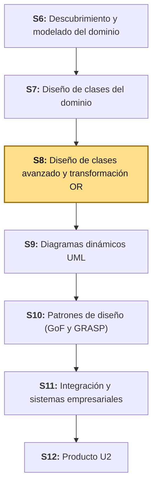
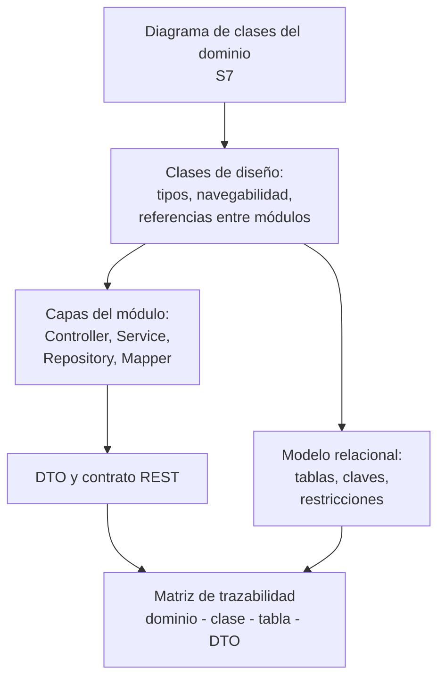
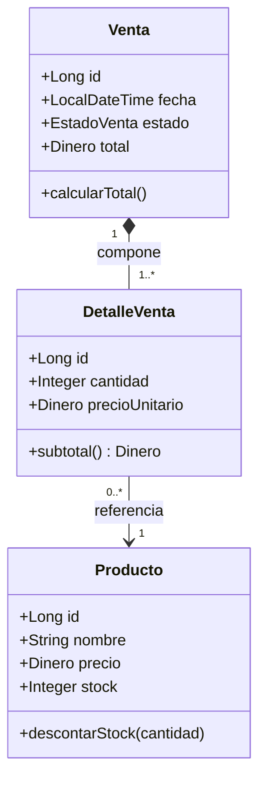
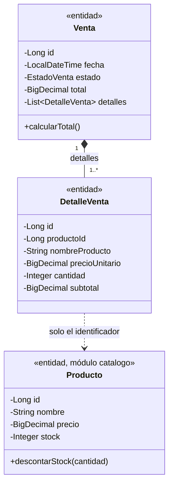
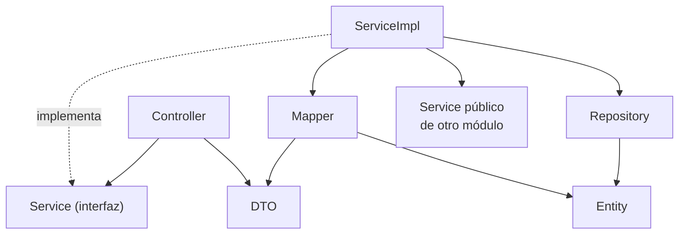
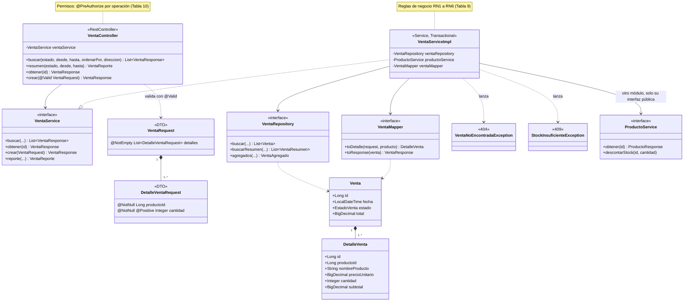
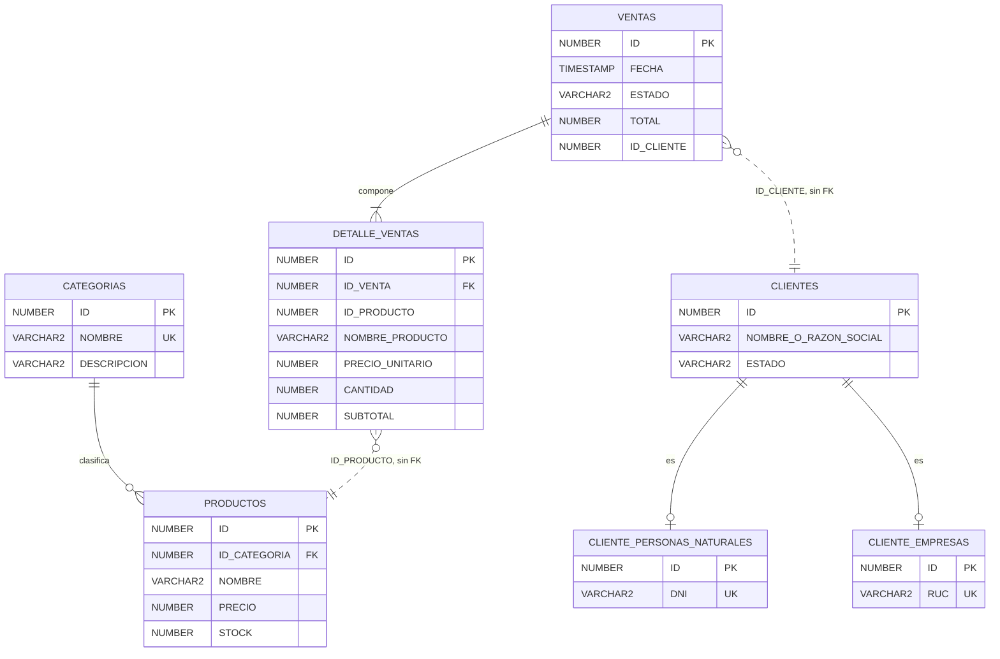

# S8 - Diseño de Clases Avanzado y Transformación Objeto-Relacional

## 1. Introducción

Tiempo: 20 min.

### 1.1 Presentación de la sesión

S7 dejó un diagrama de clases del dominio completo: atributos, operaciones, relaciones con multiplicidad, agregación, composición, herencia y restricciones. Ese diagrama responde qué conceptos tiene el negocio y cómo se relacionan, y se detiene a propósito antes de una pregunta que el software sí necesita responder: qué clases concretas van a existir, cómo se reparten las responsabilidades entre ellas y cómo se guardan los datos en tablas. Esta sesión baja ese nivel: refina las clases del dominio en clases de diseño, las organiza en capas, define lo que entra y sale de cada operación, y transforma el resultado en un modelo relacional con la trazabilidad completa entre dominio, clases y base de datos. El porqué de hacerlo ahora, y no directamente en código, se desarrolla en 1.6, a partir del caso.

### 1.2 Índice

1. De clase de dominio a clase de diseño.
2. Clases de diseño por capas.
3. DTO, mapper y contrato REST.
4. Transformación objeto-relacional: clases, tablas y claves.
5. Asociaciones, herencia y objetos de valor en tablas.
6. Trazabilidad dominio-clases-base de datos.

### 1.3 Propósito de aprendizaje

Al concluir la clase, estarás en condiciones de:

- **Diseñar** las clases de un módulo de tu propio proyecto en capas, definir sus DTO y su contrato de servicio, y **transformar** ese diseño en un modelo relacional, dejando la trazabilidad entre el dominio, las clases y las tablas documentada.

### 1.4 Producto de sesión

Diseño de clases de un módulo de tu propio proyecto, con su transformación objeto-relacional: diagrama de clases de diseño por capas (Controller, Service, Repository, Mapper, entidades y DTO), contrato REST conceptual del módulo, tabla de correspondencia clase-tabla con tipos, claves y restricciones, decisión justificada para la herencia y para el objeto de valor, modelo relacional dibujado, y matriz de trazabilidad dominio-clase-tabla-DTO.

### 1.5 Metodología

**Tabla 1. Metodología de la sesión**

| Actividades a Realizar en el Periodo | Orientaciones generales (Orientaciones Metodológicas) | Material de estudio recomendado |
|---|---|---|
| Revisión previa individual | Releer el diagrama de clases del dominio propio (S7): atributos, operaciones, relaciones, herencia y restricciones, junto con la matriz de integración de S7 (3.7). Trabajo individual, antes de clase. | S7 (3.2-3.7), diagrama de clases del dominio propio. |
| Clase presencial | Construcción guiada del diseño de clases del módulo `ventas` de BomERP: refinamiento, capas, DTO, contrato REST, transformación a tablas y matriz de trazabilidad. Trabajo individual, siguiendo al docente paso a paso; consulta inmediata ante dudas sobre asociaciones entre módulos o estrategia de herencia. | Figura 9 de S7, plantillas de las tablas de 3.2-3.8. |
| Evaluación formativa | Revisión en clase del diseño de capas y de la tabla de correspondencia clase-tabla. La evidencia se completa y sustenta de forma individual, fuera del aula, según los criterios mínimos de la sección 4.4. | Indicaciones de entrega (4.3), rúbrica de evaluación (4.6). |

### 1.6 Motivación de la sesión

#### 1.6.1 Caso: el precio que cambió después de la venta

Un equipo traduce su diagrama de clases del dominio a tablas de forma literal. En el diagrama, `DetalleVenta` se relaciona con `Producto`, así que en la base de datos `DETALLE_VENTAS` guarda solo una llave foránea hacia `PRODUCTOS` y lee el precio con un `JOIN`. Funciona en las pruebas. Una semana después, el precio de un producto cambia en el catálogo y el total de todas las ventas antiguas de ese producto cambia con él: los reportes de ayer ya no coinciden con los de hoy. Además, esa llave foránea obliga al módulo `ventas` a depender del esquema de `catalogo`, justo lo que la arquitectura del proyecto quería evitar.

Ninguna de las dos decisiones del equipo era descuidada: el diagrama de S7 dice que `DetalleVenta` "referencia" a `Producto`, y una asociación se implementa, por defecto, con una llave foránea. El problema es que nadie hizo el paso intermedio: preguntar qué significa esa asociación **al persistirse**. La respuesta correcta para `DetalleVenta` no es una llave foránea con `JOIN`, sino una **referencia por identificador** más una **copia del nombre y del precio** de ese momento — y esa decisión solo aparece cuando el diagrama de dominio se refina como clase de diseño y se transforma a tablas con criterio, no con una regla mecánica.

**Preguntas de análisis**

**Activación de conocimientos previos**

1. En el diagrama de clases del dominio de tu proyecto (S7), ¿qué relación conecta clases que pertenecen a módulos distintos?

**Comprensión del diseño de clases y su transformación**

1. ¿Qué diferencia hay entre decir "`DetalleVenta` referencia a `Producto`" (dominio) y decir "`DetalleVenta` guarda el identificador, el nombre y el precio del producto en ese momento" (persistencia)? ¿Qué pregunta responde cada frase?
2. Si `Venta` recibe del cliente el `total` y el `precioUnitario` de cada línea, ¿qué podría salir mal? ¿Qué campos debería decidir el servidor, y no el cliente?

### 1.7 Ubicación en el curso

- Producto del curso: Diseño Técnico Profesional Documentado.
- Producto de unidad: Catálogo UML con patrones de diseño e integración aplicados.
- Avance del producto en esta sesión: diseño de clases por capas de un módulo, contrato REST conceptual, modelo relacional y matriz de trazabilidad dominio-clase-tabla-DTO.

Roadmap del producto de la unidad:

**Figura 1. Roadmap del producto de la unidad**



## 2. Explica

Tiempo: 25 min.

### 2.1 Arquitectura de la sesión

**Figura 2. Del diagrama de clases del dominio al modelo relacional trazado**



Lectura del diagrama: el diseño de clases parte del dominio y se bifurca en dos caminos que se vuelven a unir. Por un lado, las clases se organizan en capas y definen lo que entra y sale de cada operación (DTO y contrato REST). Por el otro, se transforman en tablas. La matriz de trazabilidad es el punto donde ambos caminos se verifican entre sí. Cada apartado siguiente desarrolla uno de esos pasos, en el mismo orden del Índice (1.2).

El estilo de organización no se decide en esta sesión: ya está fijado desde S4 y formalizado en las ADR de LP2. El backend es un **monolito modular**: un solo proyecto, con un paquete por módulo de negocio (`catalogo`, `ventas`, ...) y, dentro de cada módulo, organización **en capas** (`controller`, `service`, `repository`, `entity`, `dto`, `mapper`). Hoy se diseña dentro de ese marco. Si tu equipo eligió otro estilo en S4, aplica el mismo razonamiento con la estructura que justificaste en tu ADR.

### 2.2 De clase de dominio a clase de diseño

Una **clase de diseño** —un elemento del diagrama de clases UML (OMG, 2017)— es una clase de dominio refinada con las decisiones que el software necesita y el modelo de negocio no tiene por qué contener: tipos concretos, visibilidad, identidad, navegabilidad y responsabilidades (Larman, 2004). El diagrama de S7 dice **qué** es el dominio; la clase de diseño dice **cómo** se representa en un sistema concreto, sin escribir todavía el código.

Es el mismo tipo de diagrama (UML) y son las mismas clases, pero se conservan **dos versiones**, cada una con su propósito. La diferencia de fondo es el lenguaje: el modelo de dominio es general, independiente de cómo se programe, mientras que las clases de diseño se expresan en el lenguaje del proyecto (Java, en BomERP), con sus tipos, sus colecciones y sus construcciones (`enum`, `record`). El diagrama de dominio de S7, que no se modifica, dice qué significa el negocio (`Dinero`, la asociación entre `DetalleVenta` y `Producto`). El diagrama de diseño de hoy se **deriva** de él y dice cómo se representa en el software (`BigDecimal`, `productoId`). Larman (2004) distingue estas dos perspectivas: el modelo de dominio, conceptual, y el diagrama de clases de diseño, que parte de él.

"Refinar" no significa corregir el diagrama de S7, que ya está completo como modelo de dominio, sino **agregarle lo que S7 dejó fuera a propósito**: las decisiones de implementación. Si el diagrama de S7 se sobrescribiera, se perdería el significado de negocio: la asociación real entre una venta y un producto desaparecería, reemplazada por un identificador. Por eso la matriz de trazabilidad (2.7) enlaza cada clase de dominio con su clase de diseño. Más abajo se muestran las dos versiones de tres clases, lado a lado. El diagrama por capas de 2.3 es un tercer diagrama: no deriva las entidades, agrega a su alrededor las clases que las usan.

**Tabla 2. Decisiones que convierten una clase de dominio en clase de diseño**

| Decisión | Pregunta que resuelve | Ejemplo en BomERP |
|---|---|---|
| Tipo concreto | ¿Con qué tipo del lenguaje se representa cada atributo? | `fecha` es `LocalDateTime`; `estado`, un `enum`; el importe (`Dinero` en el dominio) se representa con `BigDecimal`, decisión explicada en la lectura de la Figura 4. |
| Identidad | ¿Cómo se identifica cada objeto? | `id: Long`, generado por la base de datos, no por la aplicación. |
| Navegabilidad | ¿Desde qué clase se puede llegar a la otra? | `Producto` conoce a su `Categoria`; `Categoria` no lista sus productos. |
| Enumeraciones | ¿Qué valores admite un atributo de estado? | `EstadoVenta` como `enum`, no como texto libre. |
| Referencia entre módulos | ¿Una clase de otro módulo se referencia por objeto o por identificador? | `DetalleVenta` guarda `productoId`, no un objeto `Producto`. |
| Atributo derivado | ¿Se calcula cada vez o se guarda? | `subtotal` y `total` se guardan: son una foto del momento de la venta. |
| Ubicación de la operación | ¿La regla vive en la entidad o en un servicio? | `descontarStock` valida `stock >= 0` sobre `Producto`; el servicio solo orquesta. |

**Ejemplo: de las clases de S7 a las clases de diseño.** El diagrama de dominio de S7 (Figura 9 de S7) muestra `Venta`, `DetalleVenta` y `Producto` con los tipos del negocio. Ese es el punto de partida:

**Figura 3. `Venta`, `DetalleVenta` y `Producto` en el modelo de dominio (S7)**



Aplicando las decisiones de la Tabla 2 a esas tres clases, se deriva el siguiente diseño:

**Figura 4. Las mismas clases como clases de diseño, derivadas de la Figura 3**



Lectura de las dos figuras, cambio por cambio:

- **Tipos del lenguaje.** Los atributos se declaran con tipos de Java (`Long`, `LocalDateTime`, `Integer`, un `enum` para el estado). Los importes, que en el dominio son `Dinero`, se declaran `BigDecimal`. Implementar `Dinero` como una clase propia (por ejemplo, un `record` de Java) es una **decisión de diseño opcional**, no una obligación: sirve cuando el sistema maneja varias monedas o cuando conviene que el importe valide o formatee por sí mismo. Con una sola moneda, una clase `Dinero` no cambiaría ningún comportamiento, así que BomERP se queda con `BigDecimal`; si aparece una segunda moneda, se introduce.
- **Visibilidad.** Los atributos pasan de públicos (`+`) a privados (`-`): la clase de diseño los protege y los expone por operaciones.
- **Navegabilidad.** `Venta` guarda ahora la colección `detalles`, explícita, porque desde una venta hay que llegar a sus líneas.
- **Referencia entre módulos.** La flecha de asociación `DetalleVenta` --> `Producto` se convierte en una dependencia punteada: `DetalleVenta` ya no guarda un `Producto`, sino su `productoId`, más una copia de `nombreProducto` y de `precioUnitario` de ese momento.
- **Atributo derivado.** La operación `subtotal()` de `DetalleVenta` se vuelve un atributo `subtotal`, calculado una vez al registrar la venta y guardado.
- **Lo que no cambia.** La composición `Venta` *-- `DetalleVenta` con su multiplicidad `1..*`, y `descontarStock` en `Producto`: esas decisiones del dominio se conservan.

**Referencia entre módulos.** Cuando dos clases pertenecen a módulos distintos, la clase de diseño no las conecta con una asociación directa: guarda el **identificador** de la otra, y si necesita sus datos los pide por la interfaz pública del otro módulo. Así el límite del módulo, dibujado en C3 (S2), sigue siendo un límite en el código y en la base de datos.

**Error frecuente**: dibujar en el diagrama de diseño una asociación directa entre clases de módulos distintos (`DetalleVenta` --> `Producto`). En LP2 el build falla en `ModularityTests` (ADR-002), porque `ventas` accede a tipos internos de `catalogo` que no fueron expuestos. La corrección no es exponer la entidad, sino guardar el identificador y pedir los datos por el servicio público del módulo.

### 2.3 Clases de diseño por capas

Una **arquitectura en capas** organiza las clases de un módulo en niveles con una regla de dependencia: cada capa conoce solo a la que tiene debajo, nunca a la de arriba. En una API REST, la "vista" del esquema MVC clásico vive fuera del backend (la SPA), por eso el módulo se describe en capas y no como MVC completo. Estas capas son el interior de **un** componente del nivel 3 del modelo C4 (un módulo del ERP): describirlas es trabajar en el nivel 4 (código), y cada módulo del sistema repite el mismo esquema dentro de su propia carpeta (3.3).

**Tabla 3. Capas de un módulo y sus clases**

| Capa | Clase de diseño | Responsabilidad | Depende de |
|---|---|---|---|
| Presentación | `Controller` | Recibe la petición HTTP, valida la forma de los datos y devuelve la respuesta. No contiene reglas de negocio. | `Service` (interfaz) |
| Lógica de aplicación | `Service` (interfaz) y `ServiceImpl` | Orquesta un caso de uso: abre la transacción, coordina repositorio, mapper y servicios de otros módulos. | `Repository`, `Mapper`, `Service` de otro módulo |
| Acceso a datos | `Repository` | Guarda y consulta entidades. Uno por raíz de agregado, no por tabla. | `Entity` |
| Traducción | `Mapper` | Convierte entre entidades y DTO. | `Entity`, `DTO` |
| Dominio | `Entity` | Datos y reglas propias de cada concepto del negocio. | — |
| Contrato | `DTO` | Forma de los datos que cruzan la frontera de la API. | — |

**Figura 5. Regla de dependencia entre capas**



Tres reglas hacen que el diagrama sea verificable. Primero, el `Controller` depende de la **interfaz** del servicio, no de su implementación. Segundo, hay un `Repository` por **raíz de agregado**: `Venta` tiene repositorio, `DetalleVenta` no, porque solo se accede a él a través de su `Venta` (S6, agregado como límite de consistencia). Tercero, un servicio jamás llama al repositorio de otro módulo: usa el servicio público de ese módulo (ADR-002).

**Qué decide cada capa además de su forma.** Un diagrama de clases de diseño que solo lista clases y flechas no dice si el sistema es correcto. Lo que lo hace construible es qué garantiza cada capa, y por eso se diseña junto con las clases:

- **Contrato (`Service` como interfaz).** Cada operación declara qué recibe, qué devuelve, qué precondiciones exige y qué errores lanza. Es la única puerta del módulo: quien lo usa depende de ese contrato, no de cómo se implementa.
- **Validación de forma (`Controller` + DTO).** Antes de entrar al servicio se comprueba que el dato *está bien formado*: campos obligatorios, rangos, longitudes, formatos. Se declara sobre el DTO de entrada (Bean Validation: `@NotEmpty`, `@Positive`, `@Size`) y se activa con `@Valid` en el parámetro del controlador. Una petición malformada responde `400` sin tocar el negocio.
- **Reglas de negocio (`ServiceImpl`).** Lo que depende del estado del sistema —¿hay stock?, ¿el producto está activo?, ¿la venta ya fue anulada?— solo puede comprobarse con datos y no con la forma; vive en el servicio, dentro de una transacción, y sus violaciones son excepciones de negocio (`404`, `409`, `422`). Nunca en el controlador y nunca en el DTO.
- **Autorización (permisos).** Qué rol puede ejecutar cada operación se declara sobre el método del servicio (o del controlador) con una anotación como `@PreAuthorize`, no dentro del cuerpo con `if`. Se decide por **caso de uso**, con el mínimo privilegio, y también por **propiedad del dato** cuando corresponde: un vendedor ve sus ventas, un supervisor ve todas.
- **Errores (`exception`, transversal).** Un manejador único traduce cada excepción de negocio a su código HTTP y a un cuerpo de error uniforme, de modo que el contrato REST de todos los módulos responde igual.

Autenticar (¿quién eres?) y autorizar (¿qué puedes hacer?) son dos cosas distintas. Esta sesión diseña la segunda: la tabla de permisos por operación. El mecanismo que entrega la identidad al backend se elige en la arquitectura de seguridad y no cambia este diseño, porque las anotaciones solo dependen de los roles que reciben.

El porqué de cada rol —por ejemplo, el patrón GRASP *Controller* o el patrón GoF *Facade*— se estudia en S10 (Patrones de Diseño GoF y GRASP). Hoy solo se dibuja qué clases existen, qué responsabilidad tiene cada una y quién depende de quién.

### 2.4 DTO, mapper y contrato REST

Un **DTO** (*Data Transfer Object*) es una clase que solo transporta datos a través de una frontera —aquí, la API— sin comportamiento de negocio (Fowler, 2003). Existe para que la forma de lo que se expone no dependa de la forma de las entidades: exponer una entidad directamente filtra columnas internas, arrastra relaciones perezosas y obliga a cambiar la API cada vez que cambia la tabla.

**Tabla 4. Tipos de DTO de un módulo**

| Tipo | Para qué sirve | Ejemplo en `ventas` |
|---|---|---|
| Request | Datos que el cliente envía; solo lo que el cliente puede decidir. | `VentaRequest`, `DetalleVentaRequest` |
| Response | Datos que la API devuelve de un recurso. | `VentaResponse`, `DetalleVentaResponse` |
| Resumen | Vista reducida para listados y reportes. | `VentaResumen` |
| Agregado | Resultado de un cálculo sobre muchos registros. | `VentaAgregado` |
| Reporte | DTO compuesto de otros DTO. | `VentaReporte` |

**Qué no entra en un Request.** El cliente decide qué producto compra y cuántas unidades (`productoId`, `cantidad`). No decide el `total`, el `precioUnitario`, la `fecha` ni el `estado`: esos los fija el servidor con datos del catálogo y del momento. Un Request que acepta el total confía en un dato que cualquiera puede alterar con una simple petición: una regla de negocio no puede depender de un dato que el propio cliente declara.

Un **mapper** es la clase que traduce entre entidades y DTO en ambos sentidos, para que ni el servicio ni el controlador repitan esa conversión.

El **contrato REST** conceptual de un módulo lista, por cada operación: método y ruta, DTO de entrada, DTO de salida y códigos de respuesta. Es el insumo directo del backend (LP2) y se diseña antes de programar.

### 2.5 Transformación objeto-relacional: clases, tablas y claves

Los objetos y las tablas modelan el mundo de forma distinta: los objetos forman grafos con herencia y referencias, las tablas son filas con llaves. Esa diferencia se llama **desajuste de impedancia objeto-relacional** (Fowler, 2003). Transformar un diseño de clases a tablas es aplicar reglas explícitas para cerrar esa brecha, no traducir nombres uno a uno.

**Tabla 5. Reglas base de la transformación**

| Elemento de la clase | Elemento relacional | Convención de BomERP |
|---|---|---|
| Clase persistente | Tabla | Nombre en plural y mayúsculas, dentro del esquema `BOM_<MODULO>`. |
| Atributo | Columna con tipo de la base | `String` -> `VARCHAR2(n)`, `Long`/`Integer` -> `NUMBER`, `BigDecimal` -> `NUMBER(p,s)`, `LocalDateTime` -> `TIMESTAMP`. |
| Identidad | Llave primaria | `ID NUMBER GENERATED BY DEFAULT AS IDENTITY PRIMARY KEY`. |
| Atributo obligatorio | `NOT NULL` | Según la multiplicidad mínima del atributo. |
| Atributo único | `UNIQUE` | `Categoria.nombre`. |
| Enumeración | `VARCHAR2` con restricción `CHECK` | `EstadoVenta` -> `ESTADO VARCHAR2(20)`. |
| Restricción de clase (`{stock >= 0}`) | `CHECK` | `CK_PRODUCTO_STOCK CHECK (STOCK >= 0)`. |

Ejemplo real, la clase `Categoria` y su tabla en Oracle:

```sql
CREATE TABLE BOM_CATALOGO.CATEGORIAS (
    ID NUMBER GENERATED BY DEFAULT AS IDENTITY PRIMARY KEY,
    NOMBRE VARCHAR2(80) NOT NULL UNIQUE,
    DESCRIPCION VARCHAR2(200)
);
```

`id` se vuelve la llave primaria, `nombre` (obligatorio y único) se vuelve `NOT NULL UNIQUE`, y `descripcion` (opcional) queda sin restricción. La tabla y sus columnas son trabajo de BD2; el diseño de la correspondencia es de ADS.

### 2.6 Asociaciones, herencia y objetos de valor en tablas

**Asociaciones.** La multiplicidad y el tipo de relación de S7 deciden dónde va la llave foránea y cómo se protege.

**Tabla 6. De la relación del dominio a la estructura relacional**

| Relación en el dominio | Estructura relacional | Ejemplo |
|---|---|---|
| Composición `1` - `1..*` | Llave foránea `NOT NULL` en la tabla de la parte. La cascada se decide en la aplicación. | `DETALLE_VENTAS.ID_VENTA NOT NULL` |
| Agregación o asociación `1` - `0..*` | Llave foránea en la tabla del lado "muchos". Sin borrado en cascada. | `PRODUCTOS.ID_CATEGORIA` |
| Muchos a muchos | Tabla intermedia con dos llaves foráneas. | (no aparece en BomERP) |
| Entre módulos distintos | Columna con el identificador, **sin** llave foránea. | `DETALLE_VENTAS.ID_PRODUCTO` |

La última fila es una decisión de diseño real de BomERP: `ID_PRODUCTO` no lleva llave foránea hacia `BOM_CATALOGO.PRODUCTOS`, a propósito, con el mismo criterio de separación que LP2 aplica a nivel de módulo Java. La integridad entre módulos la garantiza el servicio del otro módulo, no una restricción entre esquemas.

**Herencia.** Una jerarquía de clases no existe en una tabla, así que hay que elegir cómo bajarla. Hay tres estrategias (Fowler, 2003), que en JPA se llaman `SINGLE_TABLE`, `JOINED` y `TABLE_PER_CLASS` (Jakarta EE, 2024).

**Tabla 7. Estrategias para mapear una jerarquía de herencia**

| Estrategia | Estructura | Ventaja | Costo |
|---|---|---|---|
| Tabla única (*Single Table*) | Una tabla con las columnas de todas las clases. | Consultas polimórficas simples, sin `JOIN`. | Columnas propias de cada subclase deben ser nulables; se pierde `NOT NULL` real. |
| Una tabla por clase (*Class Table*) | Una tabla para la superclase y una por cada subclase, unidas por la llave. | Cada columna conserva su `NOT NULL`; las referencias hacia la superclase apuntan a una sola tabla. | Cada lectura completa exige un `JOIN`. |
| Una tabla por clase concreta (*Concrete Table*) | Una tabla por subclase, cada una con todas sus columnas. | Sin `JOIN` para leer una subclase. | Las consultas sobre la superclase requieren `UNION`; una llave foránea hacia "cualquier cliente" no puede apuntar a una sola tabla. |

*Nota.* Adaptado de *Patterns of Enterprise Application Architecture*, por M. Fowler, 2003, Addison-Wesley.

El criterio de decisión es qué se necesita proteger y qué se consulta más: si las subclases tienen columnas obligatorias propias y otras clases las referencian, conviene una tabla por clase; si son casi idénticas y se consultan siempre juntas, tabla única.

**Objetos de valor.** Un objeto de valor no tiene identidad ni tabla propia (S6, S7): sus atributos se guardan como columnas de la tabla que lo usa. `Dinero` (monto y moneda) se guarda como una columna `NUMBER(p,s)` para el monto. Si el sistema maneja una sola moneda, la moneda no se persiste y se documenta como restricción; si aparece una segunda moneda, se agrega una columna `MONEDA` en cada tabla que use `Dinero`.

**Atributos derivados.** Un atributo que se calcula de otros (`subtotal = precioUnitario * cantidad`) se persiste solo si tiene un motivo: conservar el valor de ese momento aunque cambien los datos de origen, o evitar recalcularlo en consultas pesadas. `DETALLE_VENTAS.SUBTOTAL` y `VENTAS.TOTAL` se guardan por ambos motivos: `SUM(TOTAL)` alimenta el reporte de ventas.

### 2.7 Trazabilidad dominio-clases-base de datos

La **trazabilidad** relaciona cada elemento de un nivel con su equivalente en el siguiente: concepto del dominio, clase de diseño, tabla y columnas, DTO. Se documenta en una **matriz** y sirve para dos cosas: que BD2 y LP2 reciban un diseño verificable, y detectar brechas entre niveles. El Proyecto Integrador excluye explícitamente el diseño técnico que no se refleja en la aplicación.

La matriz revela inconsistencias que ningún diagrama por separado muestra. Ejemplo real en BomERP: en el dominio, `Categoria "1" o-- "0..*" Producto` exige que todo producto tenga exactamente una categoría; la clase `Producto` la declara obligatoria (`nullable = false`), pero el DDL del catálogo define `ID_CATEGORIA NUMBER` sin `NOT NULL`. Solo al poner las tres columnas de la matriz lado a lado aparece la brecha: la base de datos permite un producto sin categoría, y el diseño no.

## 3. Aplica: actividad práctica guiada

Tiempo: 90 min.

**Actividad:** diseño guiado de las clases del módulo `ventas` de BomERP, de punta a punta: refinamiento, capas, DTO, contrato REST, transformación a tablas, decisiones de herencia y objeto de valor, modelo relacional y matriz de trazabilidad (Producto de la sesión en 1.4).

**Propósito de la actividad:** llevar el diagrama de clases del dominio de S7 hasta un diseño verificable contra el backend de LP2 y el esquema de BD2, con las decisiones justificadas.

**Orientaciones metodológicas:** en el laboratorio, el docente guía el diseño de `ventas` paso a paso frente a la clase; los estudiantes completan las mismas tablas para un módulo de su propio proyecto (ver sección 4).

**Actividades para realizar:**

- **3.1** Verificar el punto de partida.
- **3.2** Refinar las clases de dominio en clases de diseño.
- **3.3** Definir la estructura de carpetas del ERP y diseñar las capas del módulo `ventas`.
- **3.4** Definir los DTO y el contrato REST.
- **3.5** Transformar las clases en tablas.
- **3.6** Decidir la herencia de `Cliente` y el objeto de valor `Dinero`.
- **3.7** Dibujar el modelo relacional completo.
- **3.8** Armar la matriz de trazabilidad.

### 3.1 Verificar el punto de partida

**Producto del paso:** confirmación de que el diagrama de clases de S7 (Figura 9) y su Tabla de restricciones siguen siendo el punto de partida válido.

Retoma las clases de S7: `Categoria` y `Producto` (módulo `catalogo`), `Venta` y `DetalleVenta` (módulo `ventas`, agregado) y `Cliente` con sus dos subclases (módulo `clientes`). El módulo que se diseña hoy es `ventas`, porque es el que cruza a los otros dos.

### 3.2 Refinar las clases de dominio en clases de diseño

**Producto del paso:** cada clase con sus decisiones de refinamiento (Tabla 2 aplicada).

**Tabla 8. Refinamiento de las clases del dominio de BomERP**

| Clase de dominio (S7) | Clase de diseño | Decisiones |
|---|---|---|
| `Categoria` | `Categoria` (entidad) | `id: Long`; `nombre` obligatorio y único, hasta 80 caracteres; `descripcion` opcional, hasta 200. |
| `Producto` | `Producto` (entidad) | `precio: Dinero` -> `BigDecimal` (moneda única); `stock >= 0` validado en `descontarStock`; `Producto` conoce a `Categoria` (navegabilidad unidireccional). |
| `Venta` | `Venta` (entidad, raíz del agregado) | `estado: EstadoVenta` (enumeración); `total: BigDecimal` persistido; lista de `detalles` con cascada y eliminación de huérfanos (composición). |
| `DetalleVenta` | `DetalleVenta` (entidad) | Guarda `productoId` (no un objeto `Producto`); copia `nombreProducto` y `precioUnitario`; `subtotal` persistido. |
| `Cliente` (abstracta) y subclases | `Cliente`, `ClientePersonaNatural`, `ClienteEmpresa` | Previsto: hoy `Venta` no referencia a `Cliente` en LP2. Cuando exista, `Venta` guardará `clienteId` (otro módulo, por identificador). |

`Venta.calcularTotal()` aparece como operación en el diagrama de S7 y hoy, en LP2, el total se calcula dentro de `VentaServiceImpl.crear`: es un refactor pendiente que la matriz de 3.8 deja registrado, no un error del diseño.

### 3.3 Definir la estructura de carpetas y diseñar las capas del módulo `ventas`

**Producto del paso:** la estructura de carpetas del backend de un ERP con varios módulos, y el diagrama de código (nivel 4 del modelo C4) del componente `ventas`.

**Del nivel 3 al nivel 4: las carpetas.** En el modelo C4 de S2, cada módulo de negocio de BomERP es un **componente** del nivel 3 (C3). El nivel 4 (código) hace zoom a **un solo** componente y muestra sus clases e interfaces (Brown, 2024). Las carpetas del proyecto son el lugar donde ambos niveles se tocan: las carpetas de primer nivel son los componentes de C3, y todo lo que hay dentro de cada una es el nivel 4 de ese componente. Esta sesión diseña ese nivel 4 antes de escribir el código; una vez que el código existe, herramientas como el `Documenter` de Spring Modulith (S2, 2.6) pueden mantener el diagrama sincronizado.

Un ERP tiene muchos módulos, así que la estructura de carpetas tiene que servir igual para el primero que para el décimo. Este es el árbol de BomERP: los módulos que ya existen en LP2 y los previstos por S6.

```text
lp2/bomerp-backend/src/main/java/pe/edu/upeu/bomerp/
├── BomerpBackendApplication.java
├── CorsConfig.java, OpenApiConfig.java      # transversal: configuración común
├── exception/                               # transversal: errores comunes
├── filter/                                  # transversal: trazabilidad de peticiones
│
├── catalogo/                                # C3: módulo
│   ├── categoria/{controller,dto,entity,mapper,repository,service}
│   └── producto/{controller,dto,entity,mapper,repository,service}
│
├── ventas/                                  # C3: módulo (el de hoy)
│   └── venta/{controller,dto,entity,mapper,repository,service}
│                                            # Venta y DetalleVenta: un solo agregado, un solo paquete
│
├── clientes/                                # previsto (S6)
│   └── cliente/{controller,dto,entity,mapper,repository,service}
├── inventario/                              # previsto (S6)
├── compras/                                 # previsto (S6)
└── administracion/                          # previsto (S6)
```

Siete reglas hacen que el árbol crezca sin desordenarse:

1. **El primer nivel es el módulo, no la capa técnica.** Se organiza por `catalogo`, `ventas`, `clientes`, y no por `controller`, `service`, `repository` en la raíz. Con decenas de módulos, una carpeta `controller/` con cientos de clases mezcladas esconde los límites del negocio; una carpeta por módulo los hace visibles y verificables (ADR-002).
2. **El segundo nivel es la raíz de agregado, no la tabla.** `venta/` es un paquete; `DetalleVenta` no tiene el suyo, vive dentro de `venta/entity` porque no se accede a él sino a través de `Venta` (S6). Un módulo con varios agregados (por ejemplo, `ventas` con `venta`, `cotizacion` y `devolucion`) agrega un paquete de segundo nivel por cada uno.
3. **El tercer nivel son las capas, y son las mismas seis en todos los agregados.** Quien conoce un módulo, conoce todos: `controller`, `service`, `repository`, `entity`, `dto` y `mapper`.
4. **Lo compartido por todos los módulos vive fuera de ellos.** Errores comunes, filtros y configuración van en el paquete raíz o en uno transversal; un módulo de negocio nunca aloja código que otro módulo necesita.
5. **Un módulo solo muestra su interfaz de servicio al resto.** El paquete `service` de cada módulo declara qué interfaces son públicas (`@NamedInterface`, como hace `catalogo` con `ProductoService`); todo lo demás es interno y ningún otro módulo puede tocarlo.
6. **Las dependencias entre módulos van en una sola dirección.** `ventas` usa a `catalogo` y a `clientes`; nunca al revés. Un ciclo entre módulos hace que ninguno pueda cambiarse sin arrastrar al otro, y `ModularityTests` lo detecta.
7. **Un módulo previsto se crea cuando su sesión lo necesita, no antes.** `clientes`, `inventario`, `compras` y `administracion` figuran en el árbol para que el diseño los tenga en cuenta, pero su carpeta aparece recién cuando LP2 llega a ese módulo.

Con las carpetas resueltas, ahora sí el nivel 4 de un componente. El diagrama siguiente hace zoom a `ventas`: es el mismo tipo de diagrama de código de S2 de S2 (2.6), pero con las seis capas del módulo, y se repite tal cual —uno por módulo— para el resto del ERP. Un solo diagrama de código para todo el sistema cruzaría componentes de C3, y ya no sería de nivel 4.

**Figura 6. Diagrama de código (C4, nivel 4) del componente `ventas`: clases de diseño por capas**



Lectura del diagrama: `VentaController` conoce solo la interfaz `VentaService`. `VentaServiceImpl` es la única clase que reúne repositorio, mapper y el servicio de otro módulo (`ProductoService`, del módulo `catalogo`), y lo hace por su interfaz pública, nunca por `ProductoRepository` (regla 5). `Venta` tiene repositorio; `DetalleVenta` no, porque vive dentro del agregado (regla 2). Los DTO se detallan en 3.4. LP2 declara `total`, `precioUnitario` y `subtotal` como `BigDecimal`, que coincide con esta decisión.

Las clases y flechas solo dicen quién conoce a quién. Lo que hace verificable al módulo es lo que cada capa **garantiza**, y se diseña ahora, no al programar. Para `ventas`:

**Tabla 9. Contrato, validaciones, reglas de negocio y permisos del módulo `ventas`**

| Operación | Capa | Qué garantiza |
|---|---|---|
| `crear(VentaRequest)` | Contrato (`VentaService`) | Precondición: usuario autenticado. Postcondición: devuelve la venta con `total` calculado y el stock descontado; si falla algo, no queda nada guardado. Errores: `400`, `404`, `409`. |
| `crear` | Validación de forma (`Controller` + DTO) | `detalles` no vacío; en cada detalle, `productoId` obligatorio y `cantidad` entera positiva. Se declara en `VentaRequest` y `DetalleVentaRequest` y se activa con `@Valid`. Falla con `400`. |
| `crear` | RN1 (`ServiceImpl`) | Cada `productoId` debe existir en `catalogo` y estar activo; si no, `404`. |
| `crear` | RN2 | Debe haber stock suficiente para cada `cantidad`; si no, `409` (`StockInsuficienteException`). |
| `crear` | RN3 | `nombreProducto` y `precioUnitario` se copian del producto **en ese momento** (instantánea), nunca del cliente. |
| `crear` | RN4 | `subtotal = precioUnitario × cantidad` y `total` es la suma de los subtotales, calculados por el servidor. |
| `crear` | RN5 | La venta nace en estado inicial `REGISTRADA`, con la `fecha` del servidor. |
| `crear` | RN6 (transacción) | Guardar la venta y descontar el stock ocurren en **una sola transacción**: si el descuento falla, la venta se deshace. |
| `obtener(id)` | Contrato y regla | Si no existe, `404` (`VentaNoEncontradaException`). Un vendedor solo obtiene una venta propia. |
| `buscar(...)`, `reporte(...)` | Validación y regla | `desde` no puede ser posterior a `hasta` (`400`); `ordenarPor` solo admite columnas de una lista cerrada, para no construir consultas con texto del cliente. |

**Tabla 10. Permisos por operación de `ventas` (mínimo privilegio)**

| Operación | `VENDEDOR` | `SUPERVISOR` | `ADMIN` | Mecanismo |
|---|---|---|---|---|
| `crear` | Sí | Sí | No | `@PreAuthorize("hasAnyRole('VENDEDOR','SUPERVISOR')")` |
| `obtener` | Solo las propias | Todas | Todas | `hasAnyRole(...)` más comprobación de propiedad en el servicio |
| `buscar` | Solo las propias | Todas | Todas | El servicio agrega el filtro por usuario según el rol |
| `reporte` | No | Sí | Sí | `@PreAuthorize("hasAnyRole('SUPERVISOR','ADMIN')")` |

Un `ADMIN` administra el sistema pero no vende: por eso no aparece en `crear`. Si un rol sin permiso invoca la operación, la respuesta es `403`; si no hay identidad, `401`. Esos dos códigos se agregan al contrato REST de 3.4 para todas las operaciones.

### 3.4 Definir los DTO y el contrato REST

**Producto del paso:** DTO del módulo y contrato de sus operaciones.

**Tabla 11. DTO del módulo `ventas`**

| DTO | Campos | Decide |
|---|---|---|
| `VentaRequest` | `detalles: List<DetalleVentaRequest>` (al menos uno) | El cliente |
| `DetalleVentaRequest` | `productoId`, `cantidad` (positiva) | El cliente |
| `VentaResponse` | `id`, `fecha`, `estado`, `total`, `detalles` | El servidor |
| `DetalleVentaResponse` | `productoId`, `nombreProducto`, `precioUnitario`, `cantidad`, `subtotal` | El servidor |
| `VentaResumen` | `id`, `fecha`, `estado`, `total`, `cantidadDetalles` | El servidor |

`VentaRequest` no contiene `total`, `fecha`, `estado` ni `precioUnitario`: el servidor los calcula con datos del catálogo y del momento (2.4).

**Tabla 12. Contrato REST del módulo `ventas`**

| Método y ruta | Entrada | Salida | Códigos |
|---|---|---|---|
| `GET /api/v1/ventas` | Filtros opcionales: `estado`, `desde`, `hasta`, `ordenarPor`, `direccion` | Lista de `VentaResponse` | `200`, `400` (rango de fechas inválido), `401`, `403` |
| `GET /api/v1/ventas/resumen` | Filtros opcionales: `estado`, `desde`, `hasta` | `VentaReporte` | `200`, `400`, `401`, `403` |
| `GET /api/v1/ventas/{id}` | Identificador en la ruta | `VentaResponse` | `200`, `401`, `403`, `404` |
| `POST /api/v1/ventas` | `VentaRequest` | `VentaResponse` | `201`, `400` (datos inválidos), `401`, `403`, `404` (producto inexistente), `409` (stock insuficiente) |

### 3.5 Transformar las clases en tablas

**Producto del paso:** correspondencia clase-tabla con tipos, claves y restricciones, aplicando la Tabla 5.

**Tabla 13. Correspondencia clase-tabla del dominio de BomERP**

| Clase | Tabla | Columnas y restricciones |
|---|---|---|
| `Categoria` | `BOM_CATALOGO.CATEGORIAS` | `ID` PK; `NOMBRE VARCHAR2(80)` `NOT NULL` `UNIQUE`; `DESCRIPCION VARCHAR2(200)` |
| `Producto` | `BOM_CATALOGO.PRODUCTOS` | `ID` PK; `NOMBRE VARCHAR2(120)` `NOT NULL`; `PRECIO NUMBER(10,2)` `NOT NULL` `CHECK (>= 0)`; `STOCK NUMBER(10)` `NOT NULL` `CHECK (>= 0)`; `ID_CATEGORIA` FK -> `CATEGORIAS` |
| `Venta` | `BOM_VENTAS.VENTAS` | `ID` PK; `FECHA TIMESTAMP` `NOT NULL`; `ESTADO VARCHAR2(20)` `NOT NULL`; `TOTAL NUMBER(12,2)` `NOT NULL` `CHECK (>= 0)` |
| `DetalleVenta` | `BOM_VENTAS.DETALLE_VENTAS` | `ID` PK; `ID_VENTA` FK `NOT NULL` -> `VENTAS`; `ID_PRODUCTO NUMBER` `NOT NULL` (**sin FK**, 2.6); `NOMBRE_PRODUCTO VARCHAR2(120)`; `PRECIO_UNITARIO NUMBER(10,2)`; `CANTIDAD NUMBER(10)` `CHECK (> 0)`; `SUBTOTAL NUMBER(12,2)` `CHECK (>= 0)` |

### 3.6 Decidir la herencia de `Cliente` y el objeto de valor `Dinero`

**Producto del paso:** decisiones justificadas, con la alternativa descartada.

**Tabla 14. Decisiones de transformación de BomERP**

| Elemento | Decisión | Por qué | Alternativa descartada |
|---|---|---|---|
| Jerarquía `Cliente` | Una tabla por clase, en el esquema `BOM_CLIENTES`: `CLIENTES` y, unidas por la llave, `CLIENTE_PERSONAS_NATURALES` (`DNI`) y `CLIENTE_EMPRESAS` (`RUC`). | `DNI` y `RUC` son obligatorios y únicos en su subclase; una tabla única los volvería nulables. Y `Venta` referencia a *cualquier* cliente: necesita una sola tabla destino. | Tabla única (pierde `NOT NULL`); tabla por clase concreta (`Venta` no podría apuntar a una sola tabla). |
| `Dinero` | En las clases, `BigDecimal`; en las tablas, solo el monto: `NUMBER(p,s)` en cada tabla que lo usa. La moneda (soles) se documenta como restricción del sistema. | Moneda única en BomERP; un objeto de valor no tiene tabla propia. | Tabla `MONEDAS` o columna `MONEDA`, innecesarias mientras exista una sola. |
| `Venta` -> `Cliente` | `ID_CLIENTE` sin FK, como `ID_PRODUCTO`. | `clientes` y `ventas` son módulos distintos. | FK entre esquemas, que rompe el límite del módulo. |

### 3.7 Dibujar el modelo relacional completo

**Producto del paso:** diagrama entidad-relación con las tablas de 3.5 y las decisiones de 3.6.

**Figura 7. Modelo relacional de BomERP**



Las líneas punteadas son referencias por identificador, sin llave foránea, entre módulos distintos (2.6). Las tablas de `clientes` son el diseño previsto: hoy no existen en BD2 ni en LP2.

### 3.8 Armar la matriz de trazabilidad

**Producto del paso:** matriz dominio-clase-tabla-DTO, con las brechas detectadas.

**Tabla 15. Matriz de trazabilidad de BomERP**

| Dominio (S7) | Clase de diseño (LP2) | Tabla y columnas (BD2) | DTO | Estado |
|---|---|---|---|---|
| `Venta "1" *-- "1..*" DetalleVenta` | `Venta.detalles` con cascada y huérfanos | `DETALLE_VENTAS.ID_VENTA` FK `NOT NULL`, sin cascada en la base | `VentaResponse.detalles` | Trazado, implementado |
| `Categoria "1" o-- "0..*" Producto` | `Producto.categoria` (`nullable = false`) | `PRODUCTOS.ID_CATEGORIA` FK, **nulable** | `ProductoResponse` | **Brecha**: el DDL permite un producto sin categoría |
| `DetalleVenta` -> `Producto` | `DetalleVenta.productoId` | `ID_PRODUCTO` sin FK, con nombre y precio copiados | `DetalleVentaResponse` | Trazado, decisión deliberada (2.6) |
| `{stock >= 0}` | Validación en `descontarStock` | `CK_PRODUCTO_STOCK` | — | Trazado |
| `Venta.calcularTotal()` | Hoy en `VentaServiceImpl.crear` | `TOTAL` persistido | `VentaResponse.total` | **Brecha**: la operación no vive en la entidad, refactor pendiente |
| `Cliente` con herencia | Aún no implementado | Diseño de 3.6, sin tablas todavía | — | Previsto |

Las dos brechas de la matriz no son fallas de la sesión: son exactamente lo que la trazabilidad existe para mostrar. Cada una se corrige en el curso donde corresponde (BD2 el `NOT NULL`, LP2 el refactor), con el diseño de hoy como referencia.

**Evidencia de aprendizaje:**

- Refinamiento de las clases de dominio de BomERP en clases de diseño.
- Estructura de carpetas del backend por módulos, siguiendo el modelo C4.
- Diagrama de clases del módulo `ventas` por capas (nivel 4 de C4), con su regla de dependencia.
- Contrato, validaciones, reglas de negocio y permisos por operación del módulo.
- DTO y contrato REST del módulo.
- Correspondencia clase-tabla con tipos, claves y restricciones.
- Decisiones de herencia y objeto de valor, con la alternativa descartada.
- Modelo relacional y matriz de trazabilidad con sus brechas.

## 4. Crea: actividad autónoma

Tiempo: 2h fuera del aula.

### 4.1 Actividad

Diseño autónomo de un módulo del proyecto propio del equipo, con su transformación objeto-relacional, documentado en evidencia individual.

Completa y evidencia estas tareas:

1. Elegir un módulo de tu proyecto que se relacione con al menos otro módulo, y derivar de tu diagrama de clases de S7 las clases de diseño de ese módulo, con las decisiones de la Tabla 2. El diagrama de S7 se conserva sin cambios, como referencia de dominio: el de diseño es una segunda versión, con su trazabilidad.
2. Definir el árbol de carpetas de tu sistema con todos sus módulos (los existentes y los previstos), con un paquete por módulo, uno por raíz de agregado y las capas dentro; luego dibujar el diagrama de clases de diseño por capas de ese módulo (nivel 4 de C4): `Controller`, `Service` (interfaz e implementación), `Repository`, `Mapper`, entidades y DTO, respetando la regla de dependencia y la relación con el otro módulo solo por su interfaz pública. Para las operaciones de escritura, documentar su contrato, las validaciones de forma del DTO, al menos tres reglas de negocio del servicio y la tabla de permisos por rol.
3. Definir los DTO del módulo y su contrato REST conceptual, con al menos cuatro operaciones, indicando qué campos decide el servidor y no el cliente.
4. Elaborar la correspondencia clase-tabla con tipos, claves y restricciones, y decidir la estrategia de mapeo de la jerarquía de herencia de tu diagrama de S7 y el tratamiento de tu objeto de valor, con la alternativa descartada en cada caso.
5. Dibujar el modelo relacional del módulo, marcando cómo se referencian los módulos entre sí.
6. Armar la matriz de trazabilidad dominio-clase-tabla-DTO y registrar al menos una brecha, con su corrección propuesta.

### 4.2 Propósito

Que cada estudiante demuestre, de forma individual y fuera del aula, que puede llevar el diagrama de clases de su propio dominio hasta un diseño por capas y un modelo relacional trazado, sin el acompañamiento del docente.

Cada estudiante consolida el diseño de clases y el modelo relacional del proyecto, insumo directo para BD2 y LP2.

### 4.3 Indicaciones

Entrega un PDF con el siguiente nombre:

```text
S08_ADS_Equipo##_ApellidoNombre.pdf
```

Cada captura de pantalla del informe debe mostrar, sin recortar, el reloj del sistema (fecha y hora) y tu usuario o foto de perfil (Windows, VS Code o navegador) visibles en pantalla — es lo que permite verificar que la evidencia es tuya y que corresponde al momento real de tu trabajo.

#### 4.3.1 Estructura del informe

**Datos del estudiante**

- Nombre:
- Equipo:
- Sesión: S08 - Diseño de Clases Avanzado y Transformación Objeto-Relacional
- Rol o aporte realizado:
- Link de GitHub:

**Evidencia técnica**

Incluye capturas o salidas con una breve explicación debajo de cada una, organizadas en los mismos 4 bloques de la rúbrica (4.6):

1. *Clases de diseño y capas*
    - Tabla de refinamiento, árbol de carpetas del sistema por módulos y diagrama de clases del módulo por capas.
2. *DTO y contrato REST*
    - Tabla de DTO y contrato REST del módulo, con los campos que decide el servidor.
3. *Transformación objeto-relacional*
    - Correspondencia clase-tabla y decisiones de herencia y objeto de valor, con la alternativa descartada.
4. *Modelo relacional y trazabilidad*
    - Modelo relacional dibujado y matriz de trazabilidad con al menos una brecha.

**Error o hallazgo**

Describe al menos un error o hallazgo: una asociación entre módulos que corregiste de llave foránea a referencia por identificador, un campo que sacaste del Request porque debía decidirlo el servidor, o una brecha entre tu diseño y una tabla real que la matriz permitió detectar.

**Reflexión técnica breve**

Responde en 5 a 8 líneas:

```text
¿Qué relación de tu proyecto cruza dos módulos, y por qué la persististe
como referencia por identificador (con copia de los datos que necesitas
conservar) en vez de una llave foránea?
```

### 4.4 Criterios mínimos de aceptación

La evidencia individual se considera completa si:

- El archivo respeta el nombre solicitado.
- Las clases del módulo están refinadas con tipos, identidad y navegabilidad, y la relación con otro módulo se resuelve sin asociación directa.
- El árbol de carpetas tiene un paquete por módulo, un subpaquete por raíz de agregado y las mismas capas en cada uno, con lo transversal fuera de los módulos.
- Cada operación de escritura declara contrato, validaciones de forma (`@Valid`), reglas de negocio en el servicio con su código de error, y qué rol puede ejecutarla.
- El diagrama por capas muestra `Controller`, `Service` (interfaz e implementación), `Repository`, `Mapper`, entidades y DTO, con la regla de dependencia respetada.
- Hay un `Repository` por raíz de agregado, no por tabla.
- El contrato REST tiene al menos cuatro operaciones con DTO de entrada, DTO de salida y códigos de respuesta.
- Ningún Request contiene campos que deba decidir el servidor.
- La correspondencia clase-tabla incluye tipos, llaves y restricciones.
- La estrategia de herencia y el tratamiento del objeto de valor están justificados, con la alternativa descartada.
- El modelo relacional y la matriz de trazabilidad están completos, con al menos una brecha registrada.
- Cada captura de la evidencia técnica muestra el reloj del sistema y el usuario/perfil visible, sin recortar.
- Las fechas y horas de las capturas son coherentes con el historial de commits de su repositorio en GitHub.
- Incluye un error o hallazgo técnico diagnosticado.
- Incluye la reflexión técnica breve solicitada.

### 4.5 Preguntas de defensa

1. De una relación de tu módulo con otro módulo, ¿por qué la persististe como identificador y no como asociación directa?
2. ¿Qué campos de tus Request decide el servidor, y qué podría salir mal si los decidiera el cliente?
3. ¿Por qué tu jerarquía de herencia usa la estrategia que elegiste, y qué pierdes frente a la alternativa que descartaste?
4. ¿Qué diferencia hay entre `Service` como interfaz y su implementación, y por qué el `Controller` depende solo de la primera?
5. ¿Qué brecha detectó tu matriz de trazabilidad, y en qué curso se corrige?

### 4.6 Rúbrica de evaluación

**Tabla 16. Rúbrica de evaluación**

| Criterio | Peso (%) | A (20 pts) | B (15 pts) | C (10 pts) | D (5 pts) | Nivel obtenido |
|---|---:|---|---|---|---|---:|
| 1. Clases de diseño y capas* | 25 | Clases refinadas con decisiones explícitas, estructura de carpetas por módulos coherente con C4 y diagrama por capas completo, con la regla de dependencia y la relación entre módulos bien resueltas; contrato, validaciones, reglas de negocio y permisos por rol definidos y ubicados en la capa correcta. | Diagrama por capas completo, con alguna decisión de refinamiento sin justificar. | Capas incompletas, carpetas organizadas por capa técnica en vez de por módulo, o relación entre módulos resuelta con asociación directa. | No presenta clases de diseño ni capas verificables. | |
| 2. DTO y contrato REST* | 25 | Contrato de al menos cuatro operaciones, DTO bien separados y campos del servidor fuera de los Request, con justificación. | Contrato y DTO completos, con algún campo del servidor mal ubicado. | Contrato incompleto o DTO que exponen entidades. | No presenta DTO ni contrato verificables. | |
| 3. Transformación objeto-relacional* | 25 | Correspondencia clase-tabla completa con tipos, llaves y restricciones, y decisiones de herencia y objeto de valor justificadas con la alternativa descartada. | Correspondencia completa, con decisiones justificadas de forma parcial. | Correspondencia incompleta o decisiones sin justificar. | No presenta transformación a tablas. | |
| 4. Modelo relacional y trazabilidad* | 25 | Modelo relacional coherente con la correspondencia, y matriz con al menos una brecha detectada y su corrección propuesta. | Modelo y matriz presentes, con inconsistencias menores. | Matriz incompleta o sin brechas analizadas. | No presenta modelo ni matriz. | |

\* Agregado manual.

Nota final = suma de (`Peso` / 100 × `Puntos del nivel obtenido`) = ____ / 20.

Para usar la rúbrica con IA, solicita:

```text
Evalúa el PDF usando la rúbrica de la sesión.
Para cada criterio selecciona el nivel obtenido usando la escala A=20, B=15, C=10, D=5 puntos.
Justifica brevemente cada nivel asignado.
Verifica que cada captura muestre reloj del sistema y usuario/perfil visible, y que las fechas sean coherentes con el historial de commits de GitHub. Si falta esta evidencia o hay inconsistencias, indícalo explícitamente antes de calificar.
Calcula la nota final con la fórmula: suma de (Peso/100 × Puntos del nivel obtenido), directamente sobre 20.
Indica 2 fortalezas y 2 recomendaciones.
```

## 5. Cierre

Tiempo: 5 min.

**Resumen breve:** hoy el diagrama de clases del dominio de S7 se convirtió en un diseño que se puede construir: clases de diseño con decisiones explícitas, un módulo organizado en capas con una regla de dependencia verificable, DTO y contrato REST que separan lo que decide el cliente de lo que decide el servidor, y una transformación a tablas cuyas decisiones —herencia, objeto de valor, referencias entre módulos— quedaron justificadas y trazadas en una matriz que también mostró sus propias brechas.

**Dinámica participativa:** en una ronda rápida, cada estudiante comparte en una frase qué relación de su propio módulo cruza a otro módulo, y cómo la resolvió en la base de datos.

**Metacognición:** cada estudiante responde en voz alta o por escrito: ¿qué decisión de tu diseño habrías tomado distinto si hubieras pensado en las tablas solo después de escribir el código?

**Proyección:** S9 usa las clases de hoy como participantes: los diagramas de secuencia y de actividades muestran cómo colaboran `Controller`, `Service`, `Repository` y el servicio de otro módulo en un escenario crítico. S10 explica por qué esas clases están organizadas así, con los patrones GoF y GRASP que las respaldan.

## Bibliografía

1. Fowler, M. (2003). *Patterns of Enterprise Application Architecture*. Addison-Wesley.
2. Larman, C. (2004). *Applying UML and Patterns: An Introduction to Object-Oriented Analysis and Design and Iterative Development* (3rd ed.). Prentice Hall.
3. Object Management Group [OMG]. (2017). *OMG Unified Modeling Language (OMG UML), Version 2.5.1*. https://www.omg.org/spec/UML/2.5.1/
4. Jakarta EE. (2024). *Jakarta Persistence*. Eclipse Foundation. https://jakarta.ee/specifications/persistence/
