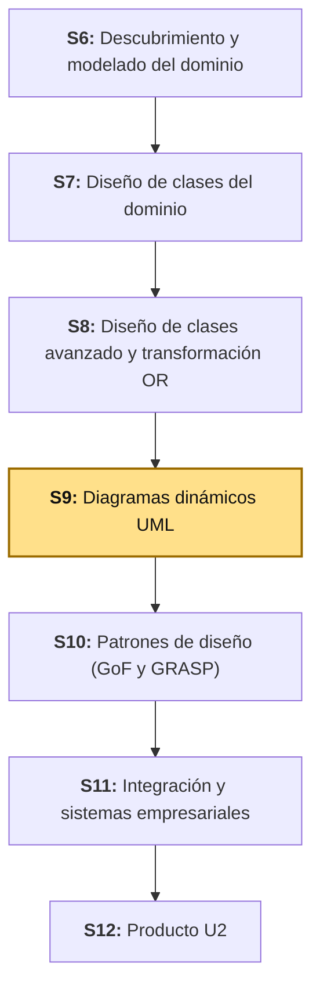
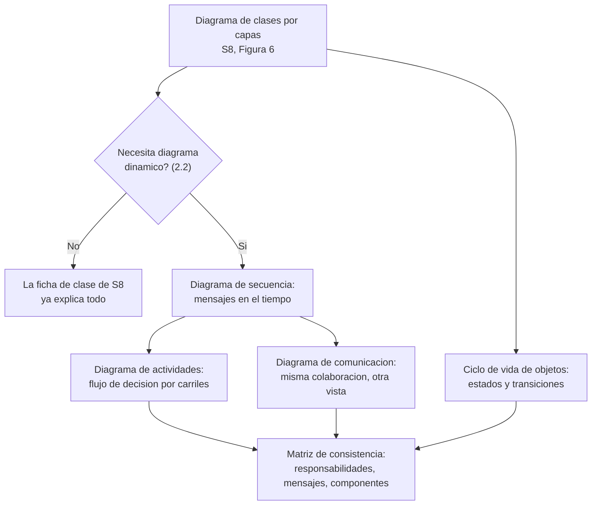
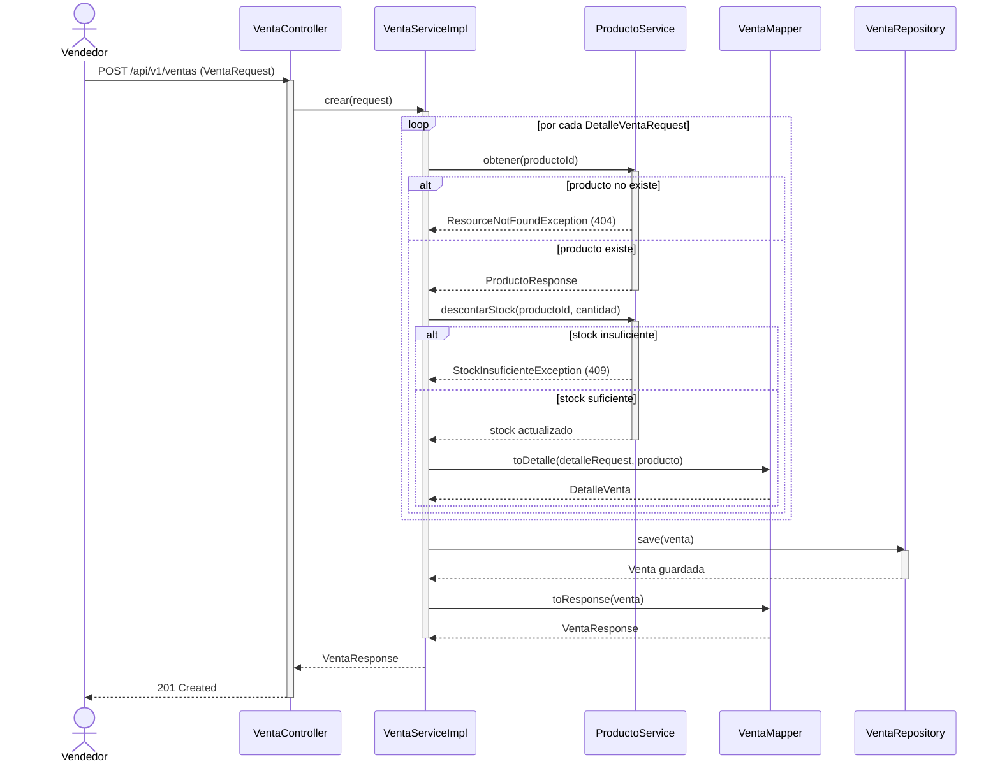
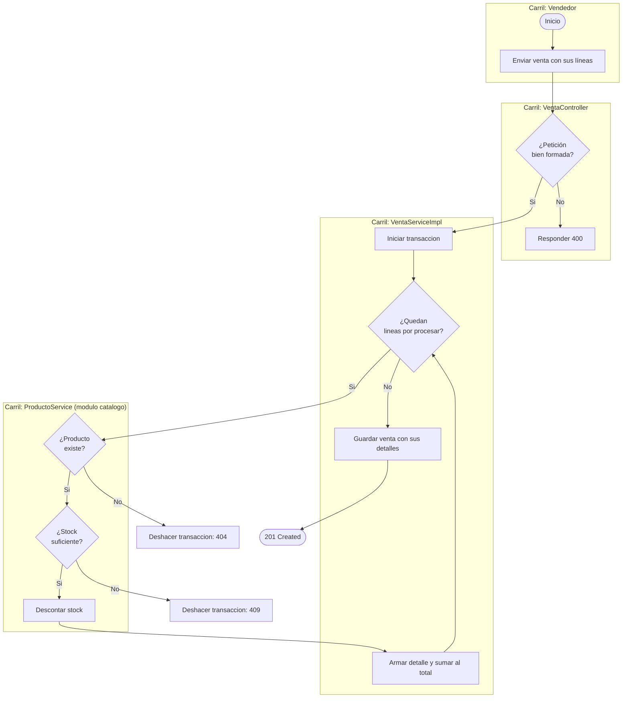
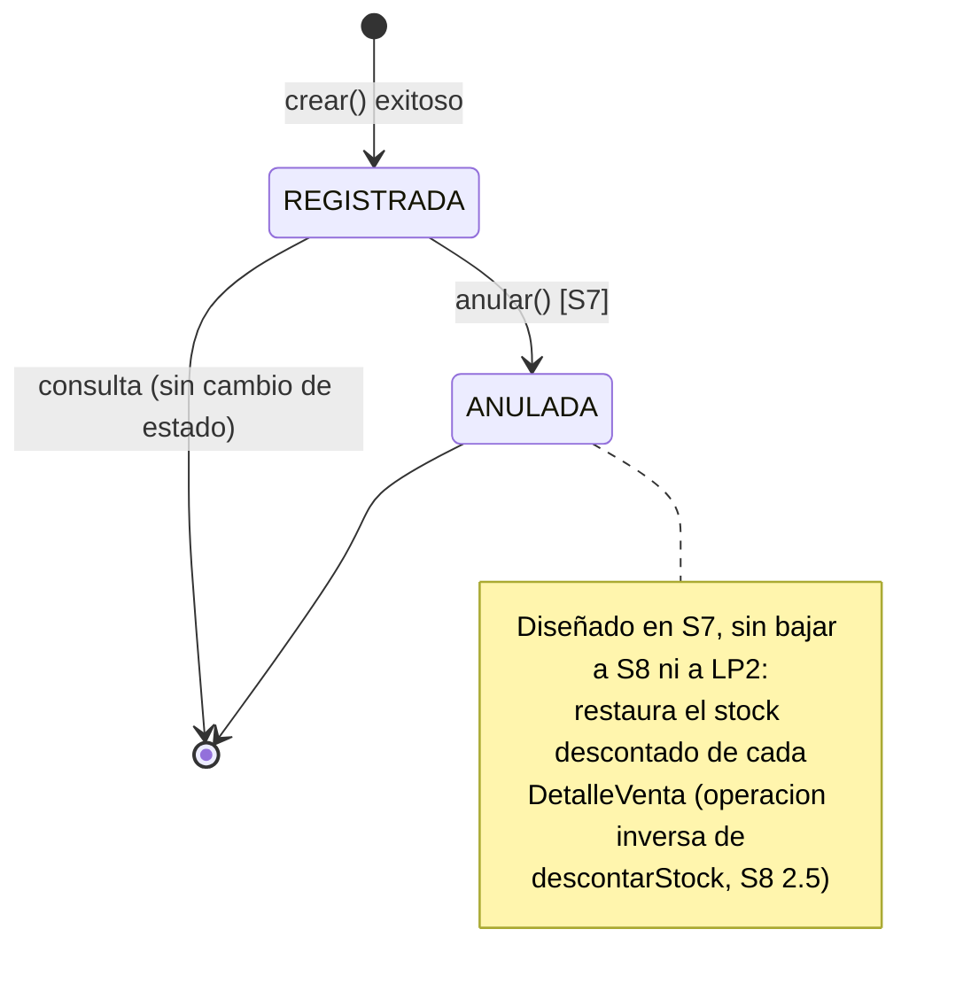
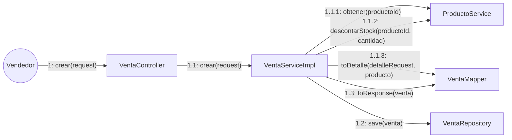

# S9 - Diagramas Dinámicos UML

## 1. Introducción

Tiempo: 20 min.

### 1.1 Presentación de la sesión

S8 cerró el diagrama de clases de diseño del módulo `ventas` por capas (Figura 6 de esa guía, explícitamente ubicada como "diagrama de código, nivel 4 de C4" — el zoom máximo del modelo C4, *Context, Container, Component, Code*, Brown, 2024, dentro de **un solo** componente del nivel 3): qué clases existen, de qué capa es cada una y quién depende de quién. Ese diagrama es **estructural** — una fotografía fija de las piezas y sus conexiones posibles —, y para la mayoría de las operaciones de `ventas` esa fotografía ya basta: `buscar` y `obtener` son una llamada directa, sin ramas que se combinen ni colaboraciones repetidas, y la ficha de clase de S8 (Tabla 13) ya dice todo lo que hace falta saber sobre ellas. `crear`, en cambio, no se deja explicar así: ¿en qué orden exacto colaboran las clases cuando una venta se registra de verdad?, ¿qué pasa si el producto no existe, y qué pasa si no hay stock, y qué pasa si eso ocurre a mitad de un bucle sobre varias líneas? Una misma flecha de dependencia (`VentaServiceImpl --> ProductoService`) puede significar una llamada, cien llamadas en un bucle, o ninguna si una condición falla antes — el diagrama de clases no distingue esos casos, y por eso una operación como `crear` sí necesita una vista adicional.

Esta sesión no sube ni baja de nivel: se queda en el **mismo nivel 4 (Código)** que fijó S8, y le agrega la vista que el nivel 4 estructural no puede responder por sí solo — el **comportamiento en el tiempo** de esas mismas clases, con diagramas de secuencia, de actividades, el ciclo de vida de `Venta` y una vista alternativa de la misma colaboración (comunicación). El modelo C4 nombra exactamente este complemento: el *Dynamic diagram*, un diagrama suplementario (no un quinto nivel) que muestra cómo colaboran en tiempo de ejecución los elementos de cualquiera de los cuatro niveles estáticos, para un escenario concreto — y que el propio C4 model define, de forma explícita, basado en un diagrama de comunicación UML (*Unified Modeling Language*) (Brown, 2024).

**Regla general, no solo de esta sesión.** Ningún diagrama dinámico de hoy introduce una clase que no esté ya en la Figura 6 de S8: `VentaController`, `VentaServiceImpl`, `ProductoService`, `VentaMapper` y `VentaRepository` son exactamente los mismos participantes, vistos ahora en movimiento en vez de en reposo. Un diagrama de secuencia, de actividades o de comunicación no es un modelo aparte con sus propios elementos — es **el mismo** diagrama de clases, leído desde otro ángulo. El criterio para decidir si hace falta un diagrama dinámico más (hoy, en cualquier otro módulo de BomERP, o en cualquier proyecto futuro) es siempre el mismo: se agrega uno nuevo cuando el diagrama de clases, por sí solo, deja de alcanzar para entender cómo fluye un caso de negocio concreto —su orden, sus decisiones combinadas, su concurrencia—, nunca para describir clases o relaciones que el diagrama de clases todavía no tiene. Si un escenario necesitara una clase que no existe en la Figura 6, la tarea no es dibujarla dentro del diagrama de secuencia: es volver a S8 y extender el diagrama de clases primero. 2.2 convierte esta regla en un criterio verificable, con ejemplos reales de `ventas` a ambos lados.

El porqué de modelar explícitamente el orden y la concurrencia entre componentes —no solo las dependencias que ya existen— se desarrolla en 1.6, a partir de uno de los casos más estudiados de la ingeniería de software.

### 1.2 Índice

1. Cuándo hace falta (y cuándo no) un diagrama dinámico adicional.
2. Diagrama de secuencia: colaboración ordenada en el tiempo.
3. Diagrama de actividades: flujo de decisión del proceso de negocio.
4. Ciclo de vida de objetos (diagrama de estados, opcional).
5. Diagrama de comunicación: la misma colaboración, otra vista.

### 1.3 Propósito de aprendizaje

Al concluir la clase, estarás en condiciones de:

- **Decidir, con un criterio verificable**, qué operaciones de tu propio diseño necesitan un diagrama dinámico y cuáles no, **modelar** la que sí lo necesita con secuencia, actividades, ciclo de vida y comunicación —reutilizando siempre las mismas clases del diagrama de S8—, y **verificar** que responsabilidades, mensajes y componentes sean consistentes entre todos los diagramas dinámicos y el diagrama de clases.

### 1.4 Producto de sesión

Catálogo de diagramas dinámicos del escenario "registrar una venta" de BomERP: la decisión documentada de qué operaciones de `VentaController` sí necesitan un diagrama dinámico y cuáles no, con su justificación; diagrama de secuencia de la operación elegida (`crear`) con los casos alternativos de error (producto inexistente, stock insuficiente); diagrama de actividades equivalente organizado por carriles (*swimlanes*); diagrama de ciclo de vida de `Venta` (con sus estados diseñados desde S7, y la brecha real frente a S8/LP2 identificada); diagrama de comunicación de la misma colaboración del diagrama de secuencia; y una matriz de consistencia que cruza cada mensaje contra las fichas de clase de S8.

### 1.5 Metodología

**Tabla 1. Metodología de la sesión**

| Actividades a Realizar en el Periodo | Orientaciones generales (Orientaciones Metodológicas) | Material de estudio recomendado |
|---|---|---|
| Revisión previa individual | Releer el diagrama de clases por capas del módulo propio (S8, Figura 6) y las fichas de clase (S8, Tablas 12-15): qué recibe y devuelve cada operación. Trabajo individual, antes de clase. | S8 (Figura 6, Tablas 10-15). |
| Clase presencial | Decisión guiada de qué operaciones de `ventas` necesitan diagrama dinámico, y construcción de los diagramas de secuencia, actividades, ciclo de vida y comunicación de la operación elegida, con la matriz de consistencia final. Trabajo individual, siguiendo al docente paso a paso; consulta inmediata ante dudas sobre fragmentos alternativos o concurrencia. | Pasos 3.1 a 3.6 de esta guía. |
| Evaluación formativa | Revisión en clase del criterio de decisión aplicado, del diagrama de secuencia y de la matriz de consistencia. La evidencia se completa y sustenta de forma individual, fuera del aula, según los criterios mínimos de la sección 4.4. | Indicaciones de entrega (4.3), rúbrica de evaluación (4.6). |

### 1.6 Motivación de la sesión

#### 1.6.1 Caso: Therac-25, la condición de carrera que ningún diagrama de clases hubiera mostrado

Entre 1985 y 1987, la máquina de radioterapia Therac-25 entregó dosis de radiación hasta cien veces mayores que las prescritas a seis pacientes, causando al menos tres muertes y quemaduras internas graves en los demás. La causa técnica central fue una **condición de carrera** (*race condition*): el software ejecutaba dos tareas en paralelo —una que leía la entrada del operador por teclado y otra que posicionaba el haz— compartiendo memoria sin ningún mecanismo de exclusión mutua. Si el operador seleccionaba el modo de tratamiento, corregía un parámetro con el cursor y volvía a confirmar en menos de ocho segundos, la tarea que posicionaba el haz leía un valor que ya no coincidía con lo que la pantalla mostraba.

Fuente: Leveson, N. G., & Turner, C. S. (1993). *An investigation of the Therac-25 accidents*. IEEE Computer, 26(7), 18-41.

El error ya existía en el modelo anterior, el Therac-20 — pero el Therac-20 tenía interbloqueos de **seguridad en hardware** que impedían que ese error llegara al paciente. El Therac-25 confió esa seguridad enteramente al software, sin ningún mecanismo equivalente. Leveson y Turner (1993) señalan que el problema no fue solo ese error puntual, sino una cadena de decisiones de sistema: quitar los interbloqueos de hardware, asumir que la confiabilidad del modelo anterior garantizaba la del nuevo, e ignorar el diseño de la interfaz del operador.

Un diagrama de clases —incluso uno perfecto, con todas las dependencias correctas— jamás hubiera mostrado este problema: las dos tareas en conflicto *sí* tenían una relación correcta en la estructura del sistema. Lo que faltaba era una vista que mostrara **el orden en el tiempo**, la ventana de ocho segundos y qué pasaba si dos flujos tocaban el mismo dato casi al mismo tiempo — exactamente lo que un diagrama de secuencia, uno de actividades con concurrencia, o un diagrama de estados bien construido están hechos para exponer antes de escribir una sola línea de código.

**Preguntas de análisis**

**Activación de conocimientos previos**

1. Antes de leer la causa técnica, ¿por qué un diagrama de clases, aunque esté bien hecho, no podría mostrar un problema que depende del *orden* en que ocurren las cosas?

**Comprensión de los diagramas dinámicos**

1. Según el caso, ¿qué información necesitaría un diagrama de secuencia (o de estados) para que un equipo detectara el riesgo de la ventana de ocho segundos antes de que el sistema llegara a producción?
2. En tu propio proyecto, ¿hay algún objeto (como `Venta`) cuyo comportamiento dependa de en qué estado se encuentra, y no solo de qué datos tiene?

### 1.7 Ubicación en el curso

- Producto del curso: Diseño Técnico Profesional Documentado.
- Producto de unidad: Catálogo UML con patrones de diseño e integración aplicados.
- Avance del producto en esta sesión: diagramas dinámicos (secuencia, actividades, ciclo de vida, comunicación) de un escenario crítico de un módulo, verificados contra las clases y fichas de S8.

**Figura 1. Roadmap del producto de la unidad**



## 2. Explica

Tiempo: 35 min.

### 2.1 Arquitectura de la sesión

**Figura 2. Del diagrama de clases por capas a los diagramas dinámicos**



Lectura del diagrama: no toda operación de la Figura 6 de S8 llega al mismo punto. Primero se decide (2.2) si la operación necesita un diagrama dinámico; si no lo necesita, la ficha de clase de S8 queda como la documentación completa, sin diagramas adicionales. Si sí lo necesita, los cuatro diagramas de hoy convergen en una sola verificación — la matriz de consistencia — que confirma que ninguno contradice al diagrama de clases ni a los otros. Los cuatro viven dentro del **mismo nivel 4 (Código) de C4** que ya fijó la Figura 6 de S8 — ninguno dibuja un componente nuevo ni cruza a nivel 3 (salvo la llamada puntual a `ProductoService`, que ya era una dependencia entre componentes documentada en S8) — y corresponden, en conjunto, a lo que el propio modelo C4 llama un *Dynamic diagram* (1.1): la vista suplementaria que muestra cómo colaboran en tiempo de ejecución los elementos que un diagrama estático ya fijó. Cada apartado siguiente desarrolla uno de los bloques, en el mismo orden del Índice (1.2).

### 2.2 Cuándo hace falta (y cuándo no) un diagrama dinámico adicional

Dibujar un diagrama dinámico para cada operación del sistema —incluidas las triviales— no agrega información: solo repite, en otro formato, lo que la ficha de clase de S8 ya dice en una fila. El criterio para decidir si una operación concreta lo necesita no es "¿esta operación es importante?", sino una pregunta más precisa: **¿el diagrama de clases y la ficha de S8 ya explican por completo cómo fluye esta operación, o hay algo —orden, ramas combinadas, repetición, coordinación entre componentes— que solo se ve dibujando el tiempo?**

**Tabla 2. Señales de que una operación necesita un diagrama dinámico**

| Señal | ¿Aporta un diagrama dinámico? | Ejemplo real en `VentaController` (S8) |
|---|---|---|
| Una sola llamada, sin bucles ni ramas que se combinen | No — la ficha de clase ya lo dice completo | `obtener(id)` (S8, Tabla 13): una búsqueda, un `404` si no existe. Una fila de tabla alcanza. |
| Varios filtros opcionales, pero sin colaboración entre distintos objetos | No — sigue siendo una sola llamada al repositorio | `buscar(...)`, `resumen(...)` (S8, Tabla 13): arman un `Sort` y delegan; no hay nada que una secuencia muestre mejor que la firma de la operación. |
| Bucle sobre una colección, con una colaboración por elemento | Sí — un bucle no se ve en una fila de tabla | `crear(request)`: una iteración por cada línea de `detalles`, con dos llamadas a `ProductoService` en cada vuelta. |
| Más de una condición que se combina o se anida (no solo "si falla, error X") | Sí — las condiciones compuestas se pierden en una tabla plana | `crear`: ¿existe el producto? Y **solo si existe**, ¿hay stock suficiente? |
| Colaboración entre dos o más componentes/módulos distintos | Sí — una sola flecha de dependencia no distingue una llamada de muchas, ni en qué orden | `crear` llama al `ProductoService` del módulo `catalogo`, dentro del bucle; `buscar`/`obtener` no colaboran con ningún otro módulo. |
| Comportamiento "todo o nada" (transaccional) que depende del orden de varias llamadas | Sí — el efecto conjunto no cabe en una ficha de una sola operación | `crear` (RN6, S8): si cualquier línea falla, toda la venta y todo el stock descontado se deshacen. |

Aplicando esta tabla a las cuatro operaciones reales de `VentaController` (S8, Figura 6): `buscar`, `obtener` y `resumen` no activan ninguna señal — son una llamada directa, sin bucles, sin ramas combinadas, sin colaboración entre módulos. `crear` activa las cuatro señales de la columna "Sí" a la vez. Por eso esta sesión construye los diagramas dinámicos únicamente sobre `crear` (3.1), y no sobre las otras tres operaciones del mismo controlador — no por ser la más importante, sino por ser la única donde el diagrama de clases deja de alcanzar.

### 2.3 Diagrama de secuencia: colaboración ordenada en el tiempo

Un **diagrama de secuencia** muestra los objetos que participan en un escenario como líneas verticales (*lifelines*) y los mensajes entre ellos como flechas horizontales, leídas de arriba hacia abajo en el orden en que ocurren (OMG, 2017). Es el diagrama dinámico más directo para responder la pregunta que el diagrama de clases no puede: en un escenario concreto, ¿quién llama a quién, en qué orden, y qué pasa si algo falla a mitad de camino?

**Tabla 3. Elementos de un diagrama de secuencia en Mermaid**

| Elemento | Sintaxis Mermaid | Qué representa |
|---|---|---|
| Participante | `participant VentaController` | Un objeto o actor del escenario — siempre una clase que ya existe en el diagrama de S8 (1.1). |
| Mensaje síncrono | `A->>B: mensaje(parametros)` | Una llamada a operación; quien llama espera la respuesta. |
| Mensaje de retorno | `B-->>A: resultado` | El valor devuelto por la llamada. |
| Activación | `activate B` / `deactivate B` | El objeto `B` está ejecutando la operación recibida. |
| Fragmento alternativo | `alt condición ... else ... end` | Caminos que se excluyen entre sí — por ejemplo, producto existe o no existe. |
| Fragmento de repetición | `loop por cada detalle ... end` | Un bloque de mensajes que se repite — por ejemplo, una línea por cada producto de la venta. |

Dos detalles no son decorativos: la flecha `->>` (síncrona, continua) es distinta de `-->>`(el retorno, discontinua) — confundirlas hace que el diagrama diga que el emisor no espera respuesta cuando sí la espera, y por eso el diagrama "miente" sobre el orden real. Y un fragmento `alt` sin su `else` oculta exactamente el tipo de camino alternativo (un error, una condición de borde) que el caso de Therac-25 muestra que importa documentar.

### 2.4 Diagrama de actividades: flujo de decisión del proceso de negocio

Un **diagrama de actividades** modela el flujo de un proceso como una serie de pasos conectados por transiciones, con nodos de decisión (rombos) donde el flujo se bifurca según una condición (OMG, 2017). A diferencia del diagrama de secuencia —centrado en qué objeto envía cada mensaje—, el diagrama de actividades se centra en la **lógica del proceso**: qué pasa primero, qué decisión se toma, y qué ocurre en cada rama. Mermaid no tiene un tipo de diagrama llamado "actividad"; se construye con `flowchart`, el mismo tipo ya usado en S2 y S8 para otros propósitos — la diferencia es de contenido (un proceso de negocio con decisiones), no de sintaxis.

**Carriles (*swimlanes*).** Cuando un proceso cruza varias capas o roles — como ocurre siempre que el escenario llega hasta el backend —, conviene agrupar los pasos por quién los ejecuta. Mermaid no tiene *swimlanes* nativos; esta guía usa `subgraph` (un rectángulo con título) para representar cada carril, mismo recurso que ADS ya usa para otros propósitos.

**Tabla 4. Diagrama de secuencia frente a diagrama de actividades**

| | Diagrama de secuencia | Diagrama de actividades |
|---|---|---|
| Pregunta que responde | ¿Quién envía qué mensaje a quién, y en qué orden? | ¿Qué decisión se toma, y qué camino sigue el proceso en cada caso? |
| Eje principal | Los objetos (una columna por clase) | Los pasos del proceso (uno por nodo) |
| Mejor para | Verificar contratos entre clases concretas | Explicar el proceso de negocio a alguien que no programa |
| Nodo de decisión | Fragmento `alt` | Rombo con una condición |

### 2.5 Ciclo de vida de objetos (diagrama de estados, opcional)

Un **diagrama de estados** (o de ciclo de vida de objetos) muestra los estados posibles de un objeto y las transiciones válidas entre ellos — y, por omisión, cualquier transición *no* dibujada queda prohibida (OMG, 2017). No todo objeto necesita uno: el mismo criterio de 2.2 aplica aquí, con una pregunta más específica — tiene sentido solo cuando el **comportamiento** de un objeto depende de en qué estado se encuentra, no solo de sus datos. El propio sílabo marca este diagrama como "opcional" dentro del catálogo dinámico, precisamente porque esa condición no siempre se cumple.

El caso de Therac-25 (1.6) es, en el fondo, un problema de estado mal controlado: dos tareas concurrentes podían modificar y leer el mismo estado compartido sin una transición atómica entre ellas. Un diagrama de estados completo, con sus transiciones explícitas y sin huecos, es una de las formas más directas de detectar ese tipo de hueco antes de escribir el código concurrente.

**Cuándo sí vale la pena este diagrama:**

- El objeto tiene al menos dos estados distintos con comportamiento o permisos diferentes (por ejemplo, una venta `REGISTRADA` se puede anular; una `ANULADA` no se puede volver a anular).
- Existen reglas que prohíben ciertas transiciones (una venta `ANULADA` nunca vuelve a `REGISTRADA`).

**Cuándo no aporta:** un objeto con un único estado posible, o cuyo único "estado" es en realidad un atributo que no cambia el comportamiento del resto del sistema — documentarlo igual sería dibujar un diagrama con un solo nodo y ninguna transición, que no añade información sobre la estructura de clases que S8 no tenga ya.

### 2.6 Diagrama de comunicación: la misma colaboración, otra vista

El **diagrama de comunicación** (antes llamado de colaboración) representa la misma información que un diagrama de secuencia —qué objetos colaboran y qué mensajes se envían— pero organizada **espacialmente**, alrededor de las relaciones entre objetos, con los mensajes numerados en vez de ordenados verticalmente (OMG, 2017). Mermaid no tiene un tipo de diagrama de comunicación nativo; esta guía lo representa con `flowchart`, etiquetando cada arista con el número de secuencia del mensaje (`1`, `1.1`, `1.2`, ...) — la misma convención de numeración que usa el estándar UML para este diagrama.

Esta no es una elección libre de notación: el modelo C4 define su propio *Dynamic diagram* (1.1, 2.1) explícitamente "basado en un diagrama de comunicación UML" (Brown, 2024) — es la vista que el propio C4 model recomienda para mostrar colaboración en tiempo de ejecución, precisamente con mensajes numerados en vez de líneas de vida verticales. El diagrama de esta sección, aplicado hoy al nivel 4 (Código) del módulo `ventas`, es ese *Dynamic diagram* en su forma más literal.

**Tabla 5. Diagrama de secuencia frente a diagrama de comunicación**

| | Diagrama de secuencia | Diagrama de comunicación |
|---|---|---|
| Qué enfatiza | El orden temporal (eje vertical) | Las relaciones estructurales entre objetos (como un grafo) |
| Mejor para | Escenarios largos, con muchos fragmentos alternativos | Ver de un vistazo cuántos objetos distintos colabora uno solo |
| Orden de los mensajes | Posición vertical | Numeración explícita en cada mensaje (`1`, `1.1`, `2`, ...) |
| Contenido | El mismo escenario, la misma información | El mismo escenario, la misma información |

Ambos diagramas son, en rigor, dos vistas de la **misma** información — por eso la matriz de consistencia de 3.6 verifica que los mensajes numerados del diagrama de comunicación sean exactamente los mismos del diagrama de secuencia, ni uno más ni uno menos.

## 3. Aplica: actividad práctica guiada

Tiempo: 90 min.

**Actividad:** decisión y modelado guiado de los diagramas dinámicos del escenario "registrar una venta" de BomERP, a partir de las clases y fichas del módulo `ventas` que S8 ya dejó diseñadas y verificadas contra el código real de LP2.

**Propósito de la actividad:** aplicar un criterio verificable para decidir cuándo un diagrama dinámico aporta información nueva, y llevar el diseño estático de S8 a una vista de comportamiento verificable en el caso que sí lo necesita — detectando, como en el caso de Therac-25, qué información de orden, concurrencia o estado no aparecía todavía en ningún diagrama anterior.

**Orientaciones metodológicas:** en el laboratorio, el docente aplica el criterio de decisión y modela el escenario de `ventas` paso a paso frente a la clase; los estudiantes completan los mismos pasos para un escenario crítico de su propio proyecto (ver sección 4).

**Actividades para realizar:**

- **3.1** Decidir qué operaciones de `ventas` necesitan un diagrama dinámico.
- **3.2** Diagramar la secuencia de "registrar una venta".
- **3.3** Diagramar las actividades del mismo proceso, por carriles.
- **3.4** Evaluar y diagramar el ciclo de vida de `Venta`.
- **3.5** Diagramar la comunicación de la misma colaboración.
- **3.6** Armar la matriz de consistencia.

### 3.1 Decidir qué operaciones de `ventas` necesitan un diagrama dinámico

**Producto del paso:** una decisión explícita y documentada, aplicando la Tabla 2 (2.2) a las cuatro operaciones reales de `VentaController` (S8, Figura 6).

**Tabla 6. Decisión aplicada a `VentaController`**

| Operación | Bucle | Condiciones combinadas | Colaboración entre módulos | Transaccional | ¿Diagrama dinámico? |
|---|---|---|---|---|---|
| `buscar(...)` | No | No | No | No | **No** — la Tabla 13 de S8 ya es la documentación completa. |
| `resumen(...)` | No | No | No | No | **No** — mismo caso que `buscar`. |
| `obtener(id)` | No | No (un solo `404`) | No | No | **No** — una búsqueda y un error posible caben en una fila. |
| `crear(request)` | Sí (una vuelta por línea) | Sí (¿existe? → ¿hay stock?) | Sí (`ProductoService`, módulo `catalogo`) | Sí (RN6, S8) | **Sí** — las cuatro señales de la Tabla 2 se activan a la vez. |

El resto de esta sesión (3.2 a 3.5) modela únicamente `crear` — no porque las otras tres operaciones sean menos importantes para el negocio, sino porque son las únicas donde el diagrama de clases de S8, con su ficha de operación, deja de ser suficiente para entender el flujo.

### 3.2 Diagramar la secuencia de "registrar una venta"

**Producto del paso:** diagrama de secuencia del escenario `POST /api/v1/ventas` (la operación seleccionada en 3.1), con los dos caminos de error ya identificados en S8 (Tabla 10: RN1, RN2).

El escenario se construye directamente sobre el código real de `VentaServiceImpl.crear` (no sobre una versión idealizada): un bucle por cada línea de la venta, que consulta el producto, descuenta su stock, y solo si ambas operaciones tienen éxito arma el detalle y lo agrega a la venta.

**Figura 3. Diagrama de secuencia: registrar una venta**



Tres lecturas que el diagrama de clases de S8 no podía mostrar — exactamente las señales que 3.1 marcó para `crear`:

- **El `loop` es nuevo.** La flecha `VentaServiceImpl --> ProductoService` de la Figura 6 de S8 solo decía que existe esa dependencia — no decía que, con una venta de cinco líneas, `ProductoService.obtener` y `descontarStock` se llaman cinco veces cada uno, una vez por línea.
- **Dos `alt` distintos, con dos errores distintos, anidados.** RN1 (producto inexistente) y RN2 (stock insuficiente) ya estaban en la Tabla 10 de S8 como filas de una tabla; acá se ven como decisiones que ocurren **dentro del mismo bucle**, en un orden específico: primero se verifica que el producto exista, y solo después se intenta descontar su stock.
- **La transacción no es un mensaje.** `@Transactional` (S8, 2.3) envuelve todo el método `crear`, pero no aparece como una flecha — es una propiedad del método completo. Si cualquier `alt` de error se dispara, toda la transacción se deshace (RN6, S8); el diagrama lo da por entendido, no lo dibuja mensaje por mensaje.

**Error frecuente**: dibujar la llamada a `descontarStock` **antes** de confirmar que el producto existe (invertir el orden del `loop`). Si `descontarStock` se llamara primero sobre un `productoId` inexistente, `ProductoService` fallaría con un error distinto al esperado (ni 404 de "producto no encontrado" ni 409 de "stock insuficiente", sino una falla al buscar un producto para descontar). El orden de las llamadas en el diagrama de secuencia *es* una decisión de diseño, no un detalle de implementación — por eso se verifica en la matriz de 3.6.

### 3.3 Diagramar las actividades del mismo proceso, por carriles

**Producto del paso:** diagrama de actividades del mismo escenario de 3.2, organizado por quién ejecuta cada paso — útil para explicar el proceso a alguien que no necesita ver clases ni mensajes.

**Figura 4. Diagrama de actividades: registrar una venta, por carriles**



Lectura cruzada con la Figura 3: cada rombo del diagrama de actividades (`¿Producto existe?`, `¿Stock suficiente?`) corresponde exactamente a un fragmento `alt` del diagrama de secuencia — son la misma decisión, en dos notaciones distintas. Si un rombo de este diagrama no tuviera su `alt` equivalente en la Figura 3 (o viceversa), sería una inconsistencia real que la matriz de 3.6 existe para detectar.

### 3.4 Evaluar y diagramar el ciclo de vida de `Venta`

**Producto del paso:** una decisión explícita sobre si `Venta` necesita un diagrama de estados (2.5), y el diagrama correspondiente.

El código real de `EstadoVenta` (LP2) declara hoy un único valor:

```java
public enum EstadoVenta {
    REGISTRADA
}
```

Con un solo estado posible, `Venta` no tiene todavía un ciclo de vida *implementado* que dibujar — pero sí tiene uno **diseñado**, desde antes de esta sesión: S7 ya modeló `anular()` como operación real de `Venta`, con la restricción `{estado = 'REGISTRADA'}` como precondición (S7, Tabla 5 y Figura de clases del dominio). El criterio de 2.5 (¿el comportamiento depende del estado?) ya estaba resuelto en el dominio — lo que faltaba era la vista que lo hiciera explícito como ciclo de vida, no la decisión en sí.

Al revisar la Figura 4 de S8 (clases de **diseño**, derivada del dominio de S7) aparece una brecha real: `anular()` no quedó entre las operaciones de `Venta` cuando S8 refinó el dominio a clases de diseño, y por eso tampoco está en `EstadoVenta` de LP2 (hoy, un único valor: `REGISTRADA`). El diagrama de esta sección documenta el ciclo de vida tal como S7 lo diseñó, y dejar constancia de esa brecha —no inventar la transición de la nada— es exactamente lo que la matriz de consistencia de 3.6 existe para capturar.

**Figura 5. Ciclo de vida de `Venta` (diseñado en S7; brecha: S8 y LP2 todavía no lo llevan al diseño de clases ni al código)**



**Tabla 7. Transiciones del ciclo de vida de `Venta`**

| Transición | Disparada por | Precondición | Efecto |
|---|---|---|---|
| `[*] → REGISTRADA` | `crear()` (ya implementado, S8 3.3) | RN1, RN2 cumplidas para cada línea | Venta guardada, stock descontado |
| `REGISTRADA → ANULADA` | `anular()` (diseñada en S7; brecha: sin refinar en S8, sin implementar en LP2) | La venta está en `REGISTRADA`; ningún rol distinto de `SUPERVISOR`/`ADMIN` puede anular (a definir en S10-S11, igual que RN8 de S8) | El stock de cada `DetalleVenta` se restaura; la venta no se elimina, queda marcada |
| `ANULADA → *` | Ninguna | — | No existe ninguna transición válida desde `ANULADA`: es un estado final para el ciclo de negocio |

**Error frecuente**: dibujar una transición `ANULADA → REGISTRADA` "por si acaso se necesita revertir". Un diagrama de estados que permite volver a un estado anterior sin una regla de negocio real que lo justifique no documenta un camino más flexible — documenta una regla que no existe y que, si se programa tal cual, dejaría reactivar una venta anulada sin ningún control. Si tu propio dominio sí necesita revertir un estado, la transición debe nombrar una operación concreta y sus condiciones, no quedar implícita.

### 3.5 Diagramar la comunicación de la misma colaboración

**Producto del paso:** diagrama de comunicación del mismo escenario de 3.2, con los mensajes numerados (2.6).

**Figura 6. Diagrama de comunicación: registrar una venta**



Lectura del diagrama: la numeración `1.1.1`, `1.1.2`, `1.1.3` dentro de `1.1` representa el mismo `loop` de la Figura 3 — todos esos mensajes ocurren una vez por cada línea de la venta, anidados dentro de la llamada `crear(request)`. A diferencia de la Figura 3, acá se ve de un vistazo que `VentaServiceImpl` es el único objeto que colabora con los otros cuatro — ningún otro objeto del escenario llama directamente a `ProductoService`, `VentaMapper` o `VentaRepository`.

### 3.6 Armar la matriz de consistencia

**Producto del paso:** verificación cruzada de que las Figuras 3 a 6 sean consistentes entre sí y con las fichas de clase de S8 — exactamente lo que pide la columna "Evidencia" del sílabo para esta sesión ("revisar responsabilidades, mensajes y consistencia entre componentes").

**Tabla 8. Matriz de consistencia de los diagramas dinámicos de `ventas`**

| Mensaje o decisión | Diagrama de secuencia (Fig. 3) | Diagrama de actividades (Fig. 4) | Diagrama de comunicación (Fig. 6) | Ficha de clase (S8) |
|---|---|---|---|---|
| `crear(request)` | Sí | "Enviar venta" → "Validar" → "Iniciar transacción" | `1`, `1.1` | S8, Tabla 13 (`VentaService.crear`) |
| `obtener(productoId)` | Sí, dentro del `loop` | Rombo "¿Producto existe?" | `1.1.1` | S8, Tabla 13 (RN1) |
| `descontarStock(productoId, cantidad)` | Sí, dentro del `loop` | Rombo "¿Stock suficiente?" | `1.1.2` | S8, Tabla 13 (RN2) |
| `toDetalle(detalleRequest, producto)` | Sí | "Armar detalle" | `1.1.3` | S8, Tabla 15 (`VentaMapper.toDetalle`) |
| `save(venta)` | Sí | "Guardar venta" | `1.2` | S8, Tabla 14 (`VentaRepository`) |
| Transición `REGISTRADA → ANULADA` | No aplica (otro escenario) | No aplica | No aplica | S7 (diseñada); brecha en S8/LP2 (Figura 5) |
| `buscar`, `resumen`, `obtener` | Sin diagrama dinámico (3.1) | Sin diagrama dinámico (3.1) | Sin diagrama dinámico (3.1) | S8, Tabla 13 — documentación completa por sí sola |

Ninguna fila quedó vacía ni contradictoria: los cuatro diagramas describen exactamente el mismo escenario (`crear`), con la misma cantidad de decisiones y mensajes, cada uno corresponde a una operación ya documentada en las fichas de clase de S8 —no a un mensaje inventado para la sesión de hoy—, y las tres operaciones descartadas en 3.1 quedan registradas explícitamente como "sin diagrama", con su propia justificación, no como un olvido.

**Evidencia de aprendizaje:**

- Decisión documentada de qué operaciones de `ventas` necesitan diagrama dinámico, aplicando un criterio verificable.
- Diagrama de secuencia de "registrar una venta", con los fragmentos `alt` de RN1 y RN2.
- Diagrama de actividades equivalente, organizado por carriles.
- Evaluación explícita de si `Venta` necesita un diagrama de estados, con el ciclo de vida diseñado en S7 documentado y su brecha frente a S8/LP2 identificada.
- Diagrama de comunicación de la misma colaboración, con mensajes numerados.
- Matriz de consistencia entre los cuatro diagramas, las fichas de clase de S8, y las operaciones descartadas en 3.1.

## 4. Crea: actividad autónoma

Tiempo: 2h fuera del aula.

### 4.1 Actividad

Modelado dinámico autónomo de un escenario crítico del módulo del proyecto propio del equipo ya diseñado en S8, documentado en evidencia individual.

Completa y evidencia estas tareas:

1. Aplicar la Tabla 2 (2.2) a **todas** las operaciones de tu módulo de S8, en una tabla propia como la Tabla 6 (3.1): marca cuáles tienen bucle, condiciones combinadas, colaboración entre módulos o comportamiento transaccional, y cuáles no. Elige para diagramar la que active más señales — no necesariamente la que te parezca más importante de negocio.
2. Diagramar la secuencia completa del escenario elegido, con al menos un fragmento `alt` para cada regla que pueda rechazar la operación. Usa exactamente las clases de tu diagrama de S8 (1.1) — si el escenario necesitara una clase que todavía no existe ahí, vuelve primero a S8 y agrégala al diagrama de clases, no la inventes dentro de la secuencia.
3. Diagramar las actividades del mismo escenario, organizadas por carriles (al menos dos: quien origina la petición y el backend).
4. Evaluar si algún objeto de tu módulo necesita un diagrama de ciclo de vida (2.5) — si la respuesta es no, documentar por qué con el mismo criterio de esta guía; si es sí, diagramarlo con sus transiciones y al menos un estado final.
5. Diagramar la comunicación de la misma colaboración del punto 2, con los mensajes numerados.
6. Armar tu propia matriz de consistencia, cruzando cada mensaje contra tu ficha de clase de S8, incluyendo las operaciones del punto 1 que quedaron sin diagrama, y marcando cualquier inconsistencia encontrada.

### 4.2 Propósito

Que cada estudiante demuestre, de forma individual y fuera del aula, que puede decidir con un criterio verificable cuándo un diagrama dinámico aporta información nueva, y llevar el diseño estático de su propio módulo a una vista de comportamiento verificable en el escenario que sí lo necesita, detectando inconsistencias entre diagramas antes de que lleguen al código.

### 4.3 Indicaciones

Entrega un PDF con el siguiente nombre:

```text
S09_ADS_Equipo##_ApellidoNombre.pdf
```

Cada captura de pantalla del informe debe mostrar, sin recortar, el reloj del sistema (fecha y hora) y tu usuario o foto de perfil (Windows, VS Code o navegador) visibles en pantalla — es lo que permite verificar que la evidencia es tuya y que corresponde al momento real de tu trabajo.

#### 4.3.1 Estructura del informe

**Datos del estudiante**

- Nombre:
- Equipo:
- Sesión: S09 - Diagramas Dinámicos UML
- Rol o aporte realizado:
- Link de GitHub:

**Evidencia técnica**

Incluye capturas o extractos con una breve explicación debajo de cada uno, organizados en los mismos 4 bloques de la rúbrica (4.6):

1. *Decisión y diagrama de secuencia*
    - Tabla de decisión aplicada a todas las operaciones de tu módulo, y diagrama de secuencia del escenario elegido, con al menos un fragmento `alt` por cada regla de negocio que pueda fallar.
2. *Diagrama de actividades*
    - Mismo escenario, organizado por carriles, con los mismos puntos de decisión que el diagrama de secuencia.
3. *Ciclo de vida (evaluado) y comunicación*
    - Evaluación explícita de si tu objeto necesita diagrama de estados (con el diagrama si corresponde), y diagrama de comunicación con mensajes numerados.
4. *Matriz de consistencia*
    - Matriz completa, sin filas vacías ni contradictorias, incluidas las operaciones sin diagrama, con cualquier inconsistencia encontrada y cómo se resolvió.

**Error o hallazgo**

Describe un error real: una operación que creíste que necesitaba diagrama dinámico y, al aplicar la Tabla 2, resultó no necesitarlo (o viceversa), un orden de mensajes que corregiste en el diagrama de secuencia porque invertía una validación, un rombo del diagrama de actividades que no tenía su `alt` equivalente, o una transición de estado que quitaste por no tener ninguna regla de negocio real detrás.

**Reflexión técnica breve**

Responde en 5 a 8 líneas:

```text
¿Qué decisión de orden o de concurrencia de tu escenario no se veía en
tu diagrama de clases de S8, y solo apareció al dibujar la secuencia o
las actividades? Relaciona tu respuesta con el caso de Therac-25 (1.6).
```

### 4.4 Criterios mínimos de aceptación

- El archivo respeta el nombre solicitado.
- Existe una tabla de decisión (como la Tabla 6) aplicada a todas las operaciones del módulo propio, con al menos una marcada "sin diagrama" y justificada.
- El diagrama de secuencia cubre el escenario con más señales de la tabla de decisión, con un fragmento `alt` por cada regla de negocio relevante, orden de mensajes correcto, y usa exclusivamente clases que ya existen en el diagrama de clases de S8.
- El diagrama de actividades usa carriles y sus puntos de decisión coinciden con los fragmentos `alt` del diagrama de secuencia.
- Existe una evaluación explícita (sí o no, con justificación) sobre si el objeto elegido necesita un diagrama de ciclo de vida.
- El diagrama de comunicación representa la misma colaboración del diagrama de secuencia, con mensajes numerados.
- La matriz de consistencia cruza cada mensaje contra la ficha de clase correspondiente de S8, incluye las operaciones sin diagrama, y no tiene filas vacías.
- Cada captura de la evidencia técnica muestra el reloj del sistema y el usuario/perfil visible, sin recortar.
- Las fechas y horas de las capturas son coherentes con el historial de commits de su repositorio en GitHub.
- Incluye un error o hallazgo técnico diagnosticado.
- Incluye la reflexión técnica breve solicitada.

### 4.5 Preguntas de defensa

1. De todas las operaciones de tu módulo, ¿cuál tiene más señales de la Tabla 2, y por eso fue la que diagramaste?
2. En tu diagrama de secuencia, ¿qué pasaría si el fragmento `alt` de tu regla de negocio más crítica no existiera?
3. ¿Por qué el diagrama de actividades usa carriles y el diagrama de secuencia no?
4. ¿Qué criterio usaste para decidir si tu objeto necesitaba (o no) un diagrama de ciclo de vida?
5. ¿Qué diferencia de fondo hay entre un diagrama de secuencia y uno de comunicación, si ambos representan la misma colaboración?
6. Relaciona el caso de Therac-25 con algo que tu matriz de consistencia (o la falta de ella) podría haber dejado pasar.

### 4.6 Rúbrica de evaluación

**Tabla 9. Rúbrica de evaluación**

| Criterio | Peso (%) | A (20 pts) | B (15 pts) | C (10 pts) | D (5 pts) | Nivel obtenido |
|---|---:|---|---|---|---|---:|
| 1. Decisión y diagrama de secuencia* | 25 | Tabla de decisión completa sobre todas las operaciones del módulo; secuencia del escenario correcto, con fragmentos `alt` para cada regla y solo clases ya existentes en S8. | Secuencia completa, con la tabla de decisión o algún fragmento alternativo incompleto. | Secuencia sin fragmentos alternativos, con orden incorrecto, con alguna clase inventada, o sin tabla de decisión. | No presenta decisión ni diagrama de secuencia verificable. | |
| 2. Diagrama de actividades* | 25 | Carriles claros, puntos de decisión coherentes uno a uno con los fragmentos `alt` del diagrama de secuencia. | Actividades completas, con algún carril o decisión no alineado con la secuencia. | Actividades sin carriles, o con decisiones que no corresponden a la secuencia. | No presenta diagrama de actividades verificable. | |
| 3. Ciclo de vida y comunicación* | 25 | Evaluación explícita y bien justificada del ciclo de vida (con diagrama si aplica), y diagrama de comunicación consistente con la secuencia. | Ambos presentes, con justificación o numeración incompleta. | Solo uno de los dos presentado correctamente. | No presenta ninguno de los dos. | |
| 4. Matriz de consistencia* | 25 | Matriz completa, sin filas vacías, incluidas las operaciones sin diagrama, con cualquier inconsistencia detectada y resuelta explícitamente. | Matriz completa, con alguna fila superficial. | Matriz incompleta o sin verificar contra las fichas de S8. | No presenta matriz de consistencia. | |

\* Agregado manual.

Nota final = suma de (`Peso` / 100 × `Puntos del nivel obtenido`) = ____ / 20.

Para usar la rúbrica con IA (inteligencia artificial), solicita:

```text
Evalúa el PDF usando la rúbrica de la sesión.
Para cada criterio selecciona el nivel obtenido usando la escala A=20, B=15, C=10, D=5 puntos.
Justifica brevemente cada nivel asignado.
Verifica que cada captura muestre reloj del sistema y usuario/perfil visible, y que las fechas sean coherentes con el historial de commits de GitHub. Si falta esta evidencia o hay inconsistencias, indícalo explícitamente antes de calificar.
Calcula la nota final con la fórmula: suma de (Peso/100 × Puntos del nivel obtenido), directamente sobre 20.
Indica 2 fortalezas y 2 recomendaciones.
```

## 5. Cierre

Tiempo: 5 min.

**Resumen breve:** hoy no todas las operaciones de `ventas` recibieron el mismo tratamiento, y eso fue intencional: un criterio verificable (bucles, condiciones combinadas, colaboración entre módulos, comportamiento transaccional) distinguió `crear` —que sí necesitaba una vista nueva— de `buscar`, `obtener` y `resumen` —cuya ficha de clase de S8 ya las explica por completo—. Sobre `crear`, las clases de S8 ganaron una vista de comportamiento, construida dentro del mismo nivel 4 (Código) de C4 que fijó esa sesión: un diagrama de secuencia del escenario "registrar una venta" con sus caminos de error, un diagrama de actividades equivalente por carriles, el ciclo de vida de `Venta` que S7 ya había diseñado (con la brecha real de S8/LP2 identificada), un diagrama de comunicación de la misma colaboración —el *Dynamic diagram* que el propio modelo C4 define—, y una matriz que verificó que los cuatro diagramas, las fichas de clase de S8, y las operaciones descartadas dicen exactamente lo mismo, sin contradicciones.

**Dinámica participativa:** en una ronda rápida, cada estudiante comparte en una frase qué operación de su propio módulo descartó de diagramar, y por qué.

**Metacognición:** ¿qué te costó más entender hoy: el criterio para decidir si una operación necesita un diagrama dinámico, o decidir si tu objeto realmente necesitaba un diagrama de ciclo de vida?

**Proyección:** S10 explica **por qué** las clases de `ventas` están organizadas así —con los patrones GoF (*Gang of Four*) y GRASP (*General Responsibility Assignment Software Patterns*) que respaldan cada responsabilidad de la Figura 6 de S8 y cada decisión que hoy se vio en acción en la Figura 3.

## Bibliografía

1. Leveson, N. G., & Turner, C. S. (1993). *An investigation of the Therac-25 accidents*. IEEE Computer, 26(7), 18-41.
2. Object Management Group [OMG]. (2017). *OMG Unified Modeling Language (OMG UML), Version 2.5.1*. https://www.omg.org/spec/UML/2.5.1/
3. Larman, C. (2004). *Applying UML and Patterns: An Introduction to Object-Oriented Analysis and Design and Iterative Development* (3rd ed.). Prentice Hall.
4. Brown, S. (2024). *C4 model - Dynamic diagram*. https://c4model.com/diagrams/dynamic
