# S10 - Patrones de Diseño GoF y GRASP

## 1. Introducción

Tiempo: 20 min.

### 1.1 Presentación de la sesión

S9 modeló el **comportamiento** del módulo `ventas` sin cuestionar su estructura: los diagramas de secuencia, actividades y comunicación reutilizaron tal cual las clases que S8 ya había organizado por capas. Esta sesión hace la pregunta que S8 y S9 dejaron pendiente a propósito: **¿por qué** esas clases están organizadas así, y no de otra forma? El catálogo GoF (*Gang of Four*) describe 23 patrones de diseño de propósito general; GRASP (*General Responsibility Assignment Software Patterns*) describe 9. Ningún sistema real usa los 32 a la vez, y memorizarlos de memoria no sirve de nada si no se sabe reconocer **cuándo** cada uno resuelve un problema real. Esta sesión no intenta cubrir el catálogo completo — se concentra en los patrones que más aparecen en sistemas empresariales reales (ERP, *Enterprise Resource Planning*, y cualquier backend con reglas de negocio, no solo BomERP), con la profundidad suficiente para reconocerlos y aplicarlos en **cualquier** proyecto futuro, no solo para etiquetar las clases que `ventas` ya tiene.

Esta sesión también confronta una tensión real que BomERP tiene **hoy**, no en una hipótesis: S7 diseñó `Venta.calcularTotal()` y `Producto.descontarStock(cantidad)` como operaciones del dominio, y el código real de LP2 (Lenguaje de Programación II) las implementó como lógica de servicio, dejando las entidades `Venta` y `Producto` sin un solo método propio. El porqué de que esto importe, con la fuente que le puso nombre al problema, se desarrolla en 1.6.

### 1.2 Índice

1. Patrones creacionales GoF: Factory Method, Builder, Singleton y Abstract Factory.
2. Patrones estructurales GoF: Facade, Proxy, Adapter y Bridge.
3. Patrones de comportamiento GoF: Strategy, State, Chain of Responsibility y Observer.
4. GRASP — asignación de responsabilidades: Information Expert, Creator, Controller.
5. GRASP — acoplamiento y cohesión: Low Coupling, High Cohesion, Polymorphism.
6. GRASP — patrones de protección: Pure Fabrication, Indirection, Protected Variations.
7. Dependency Injection.

### 1.3 Propósito de aprendizaje

Al concluir la clase, estarás en condiciones de:

- **Reconocer y aplicar**, en cualquier sistema —no solo BomERP—, los patrones GoF y GRASP más frecuentes en software empresarial, **decidir con criterio** cuándo un patrón resuelve un problema real y cuándo es sobreingeniería, y **diagnosticar** con Information Expert si un dominio es anémico o rico.

### 1.4 Producto de sesión

Catálogo de patrones aplicado a `ventas`, con cada patrón explicado primero en general y después aplicado al caso: Factory Method resolviendo el hueco de Creator en `Venta.agregarDetalle(...)`, Proxy, Singleton y Abstract Factory reconocidos en el código real (carga perezosa de JPA, *Java Persistence API*, el *proxy* transaccional de Spring, el *scope* por defecto de todo bean, y `EntityManagerFactory`), Adapter identificado en `VentaMapper` y Bridge diseñado como previsto para reportes multi-formato, decisión justificada de si `Venta` necesita el patrón State completo o un `enum` simple basta, cadena de autorización de ventas por monto diseñada con Chain of Responsibility, el evento de dominio identificado como Observer (previsto, formalizado en S11), diagnóstico de Information Expert sobre el modelo anémico de `Venta`/`Producto` con su refactor, diseño del polimorfismo previsto de `Cliente`, y verificación de Dependency Injection, Indirection y Protected Variations ya aplicados en el código real.

### 1.5 Metodología

**Tabla 1. Metodología de la sesión**

| Actividades a Realizar en el Periodo | Orientaciones generales (Orientaciones Metodológicas) | Material de estudio recomendado |
|---|---|---|
| Revisión previa individual | Releer la Tabla 2 de S3 (los cinco principios SOLID), la Figura 6 de S8 (diagrama de código por capas), el diagrama de clases del dominio de S7 (`calcularTotal()`, `descontarStock()`) y la jerarquía `Cliente`. Trabajo individual, antes de clase. | S3 (Tabla 2, Figura 3), S7 (2.2, Figura de clases del dominio), S8 (Figura 6, Tablas 12-15). |
| Clase presencial | Reconocimiento guiado de los patrones GoF más usados en sistemas empresariales, catalogación de GRASP, diagnóstico con Information Expert y diseño del refactor, la cadena de autorización y el polimorfismo. Trabajo individual, siguiendo al docente paso a paso; consulta inmediata ante dudas sobre cuándo un patrón aplica de verdad. | Pasos 3.1 a 3.7 de esta guía. |
| Evaluación formativa | Revisión en clase del catálogo completo de patrones y del diagnóstico de Information Expert, con su justificación. La evidencia se completa y sustenta de forma individual, fuera del aula, según los criterios mínimos de la sección 4.4. | Indicaciones de entrega (4.3), rúbrica de evaluación (4.6). |

### 1.6 Motivación de la sesión

#### 1.6.1 Caso: el antipatrón que Martin Fowler le puso nombre, y que `ventas` tiene hoy mismo

En 2003, Martin Fowler publicó un ensayo corto que nombró un problema que llevaba años viendo en proyectos reales: el **Anemic Domain Model** (modelo de dominio anémico). Describe entidades que parecen objetos de dominio —tienen atributos, relaciones, hasta nombres del negocio— pero que no son más que "bolsas de getters y setters", porque toda la lógica de negocio vive afuera, en clases de servicio.

Fuente: Fowler, M. (2003). *AnemicDomainModel*. martinfowler.com. https://martinfowler.com/bliki/AnemicDomainModel.html

Su argumento central, textual: *"el problema de fondo con los modelos de dominio anémicos es que incurren en todos los costos de un modelo de dominio, sin producir ninguno de sus beneficios"* (traducción propia). Larman (2004) le da a este problema un nombre operativo: **Information Expert** (2.5) dice que la responsabilidad de una operación debe asignarse a la clase que tiene la información necesaria para cumplirla. `Venta` tiene su propia lista de `detalles` — es la experta en calcular su propio total; `Producto` tiene su propio `stock` — es el experto en decidir si puede descontarse. BomERP tiene este problema hoy, no como hipótesis: `Venta.java` y `Producto.java`, en el código real de LP2, son exactamente lo que Fowler describe — `@Getter @Setter`, sin un solo método propio —, aunque S7 ya había diseñado `calcularTotal()` y `descontarStock(cantidad)` como operaciones reales.

**Preguntas de análisis**

**Activación de conocimientos previos**

1. Antes de leer el argumento de Fowler, ¿qué significa que una clase "incurra en los costos de un modelo de dominio sin sus beneficios"?

**Comprensión de Information Expert**

1. Según el caso, ¿por qué `Venta` —y no `VentaServiceImpl`— es la "experta en información" para calcular su propio total?
2. En tu propio proyecto, ¿tus entidades tienen algún método propio además de getters/setters, o toda la lógica vive en los servicios?

### 1.7 Ubicación en el curso

- Producto del curso: Diseño Técnico Profesional Documentado.
- Producto de unidad: Catálogo UML con patrones de diseño e integración aplicados.
- Avance del producto en esta sesión: catálogo de los patrones GoF y GRASP más usados en sistemas empresariales, aplicados a `ventas`, con el diagnóstico de Information Expert y el diseño del polimorfismo previsto de `Cliente`.

**Figura 1. Roadmap del producto de la unidad**

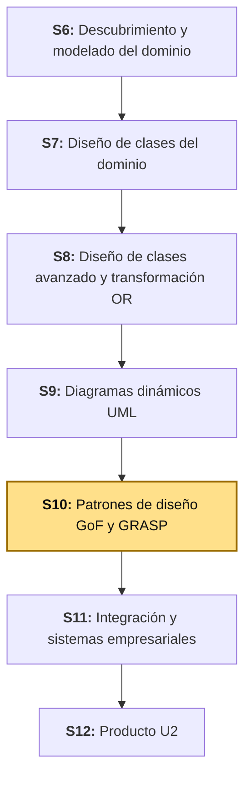
```mermaid
flowchart TB
    S6["`**S6:** Descubrimiento y modelado del dominio`"]
    S7["`**S7:** Diseño de clases del dominio`"]
    S8["`**S8:** Diseño de clases avanzado y transformación OR`"]
    S9["`**S9:** Diagramas dinámicos UML`"]
    S10["`**S10:** Patrones de diseño GoF y GRASP`"]
    S11["`**S11:** Integración y sistemas empresariales`"]
    S12["`**S12:** Producto U2`"]

    S6 --> S7 --> S8 --> S9 --> S10 --> S11 --> S12

    classDef today fill:#ffe08a,stroke:#9a6b00,stroke-width:2px,color:#111;
    class S10 today;
```

## 2. Explica

Tiempo: 55 min.

### 2.1 Arquitectura de la sesión

**Figura 2. De clases con nombre a clases con patrón**

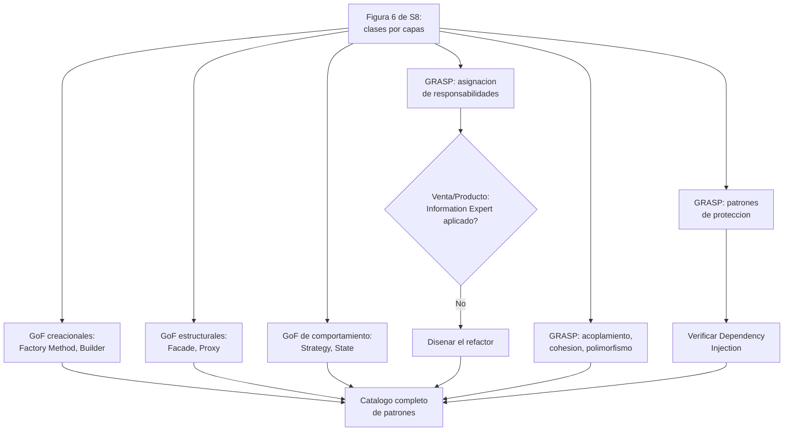
```mermaid
flowchart TB
    A[Figura 6 de S8:<br/>clases por capas] --> B[GoF creacionales:<br/>Factory Method, Builder]
    A --> C[GoF estructurales:<br/>Facade, Proxy]
    A --> D[GoF de comportamiento:<br/>Strategy, State]
    A --> E[GRASP: asignacion<br/>de responsabilidades]
    E --> F{"Venta/Producto:<br/>Information Expert aplicado?"}
    F -- No --> G[Disenar el refactor]
    A --> H[GRASP: acoplamiento,<br/>cohesion, polimorfismo]
    A --> I[GRASP: patrones<br/>de proteccion]
    I --> J[Verificar Dependency<br/>Injection]
    B --> K[Catalogo completo<br/>de patrones]
    C --> K
    D --> K
    G --> K
    H --> K
    J --> K
```

Lectura del diagrama: esta sesión no dibuja clases nuevas — reconoce, en las que S8 ya construyó, los patrones que más aparecen en cualquier sistema empresarial, y decide dónde falta aplicar uno. Cada apartado siguiente desarrolla uno de los bloques del Índice (1.2), abriendo siempre con la definición general del patrón —aplicable a cualquier sistema— antes de llegar al caso concreto de `ventas`.

Antes de entrar al detalle de cada uno, las Tablas 2 y 3 ubican el catálogo completo: todos los patrones de GoF (23), organizados por familia, y todos los de GRASP (9), organizados por las mismas tres categorías que usa esta guía. Solo los marcados "Sí" se desarrollan en esta sesión — el resto existe, es válido, y queda fuera de alcance por curación deliberada (1.1), no por descuido.

**Tabla 2. Catálogo completo de patrones GoF (23), por familia (Gamma et al., 1994)**

| Familia | Patrón | ¿Desarrollado en esta sesión? |
|---|---|---|
| Creacionales (5) | Abstract Factory | Sí (2.2) |
| Creacionales (5) | Builder | Sí (2.2) |
| Creacionales (5) | Factory Method | Sí (2.2) |
| Creacionales (5) | Prototype | No |
| Creacionales (5) | Singleton | Sí (2.2) |
| Estructurales (7) | Adapter | Sí (2.3) |
| Estructurales (7) | Bridge | Sí (2.3, previsto) |
| Estructurales (7) | Composite | No |
| Estructurales (7) | Decorator | No |
| Estructurales (7) | Facade | Sí (2.3) |
| Estructurales (7) | Flyweight | No |
| Estructurales (7) | Proxy | Sí (2.3) |
| Comportamiento (11) | Chain of Responsibility | Sí (2.4) |
| Comportamiento (11) | Command | No |
| Comportamiento (11) | Interpreter | No |
| Comportamiento (11) | Iterator | No |
| Comportamiento (11) | Mediator | No |
| Comportamiento (11) | Memento | No |
| Comportamiento (11) | Observer | Sí (2.4) |
| Comportamiento (11) | State | Sí (2.4, evaluado y descartado para `Venta`) |
| Comportamiento (11) | Strategy | Sí (2.4) |
| Comportamiento (11) | Template Method | No |
| Comportamiento (11) | Visitor | No |

**Tabla 3. Catálogo completo de patrones GRASP (9) (Larman, 2004)**

| Categoría | Patrón | ¿Desarrollado en esta sesión? |
|---|---|---|
| Asignación de responsabilidades | Information Expert | Sí (2.5) |
| Asignación de responsabilidades | Creator | Sí (2.5) |
| Asignación de responsabilidades | Controller | Sí (2.5) |
| Acoplamiento y cohesión | Low Coupling | Sí (2.6) |
| Acoplamiento y cohesión | High Cohesion | Sí (2.6) |
| Acoplamiento y cohesión | Polymorphism | Sí (2.6) |
| Patrones de protección | Pure Fabrication | Sí (2.7) |
| Patrones de protección | Indirection | Sí (2.7) |
| Patrones de protección | Protected Variations | Sí (2.7) |

A diferencia de GoF, GRASP no deja ningún patrón fuera: son solo 9, y el índice del curso (`docs/ads/index.md`) los nombra todos de forma explícita.

**¿Estos patrones están basados en SOLID (S3)?** No en ese orden — la cronología va al revés de lo que parece intuitivo. Sustitución de Liskov (Liskov, 1987) y Abierto/Cerrado (Meyer, 1988) son **anteriores** al catálogo GoF (1994); GRASP (Larman, 1997) y el acrónimo SOLID (consolidado por Robert C. Martin y Michael Feathers a inicios de los 2000) aparecieron casi al mismo tiempo, cada uno por su lado. Ningún patrón de hoy se diseñó "a partir de" SOLID. Lo que sí es cierto, y es la razón por la que ambos catálogos se sienten tan compatibles, es que describen la **misma calidad de diseño** desde ángulos distintos — y en al menos un caso, Larman lo deja explícito él mismo: describe GRASP Protected Variations (2.7) como, en esencia, el mismo principio que Abierto/Cerrado (Larman, 2001).

**Tabla 4. Principios SOLID (S3, Tabla 2) que los patrones de esta sesión evidencian**

| Principio SOLID (S3) | Patrones de esta sesión que lo evidencian |
|---|---|
| **S** — Responsabilidad única | Builder (separa construir de representar, 2.2); GRASP Controller, High Cohesion, Pure Fabrication (2.5-2.7) |
| **O** — Abierto/cerrado | Factory Method, Abstract Factory, Strategy, State, Chain of Responsibility, Observer, Adapter, Bridge (2.2-2.4); GRASP Protected Variations (2.7) — el mismo principio, según Larman (2001) |
| **L** — Sustitución de Liskov | Proxy (sustituye al objeto real sin que el cliente note la diferencia, 2.3); GRASP Polymorphism (2.6) |
| **I** — Segregación de interfaces | Adapter (el cliente solo ve la interfaz que espera, nunca la de `Venta`, 2.3); GRASP Low Coupling (2.6) |
| **D** — Inversión de dependencias | Abstract Factory, Facade, Bridge, Strategy, Observer (2.2-2.4); GRASP Indirection (2.7) y Dependency Injection (2.8, el mecanismo que hace D posible en la práctica, ya citado en S3, 2.2) |

**Información Expert y Creator (2.5) no corresponden a una letra específica de SOLID** — responden una pregunta anterior: *en qué clase* vive cada responsabilidad, antes de evaluar si esa clase cumple **S**.

**Nota honesta sobre Singleton:** es el único patrón de hoy con una relación **tensa**, no positiva, con SOLID — su punto de acceso global incentiva que el código cliente dependa de la clase concreta en vez de una abstracción, justo lo contrario de lo que **D** busca. Se incluye en el catálogo (2.2) porque es real y frecuente en cualquier aplicación Spring, no porque sea un ejemplo de buen cumplimiento de SOLID.

### 2.2 Patrones creacionales GoF: Factory Method, Builder y Singleton

Los patrones **creacionales** resuelven cómo se construye un objeto, sin acoplar al código cliente a una clase concreta ni a los detalles de esa construcción (Gamma et al., 1994). De los cinco patrones creacionales del catálogo original, cuatro aparecen constantemente en sistemas empresariales:

**Factory Method** define un método cuya única responsabilidad es construir un objeto completo y válido, ocultando los detalles de esa construcción al código que lo llama — en cualquier sistema, úsalo cuando construir un objeto requiere combinar datos de más de una fuente, o cuando la construcción en sí misma protege un invariante (Gamma et al., 1994).

**Figura 3. Factory Method mínimo: `Venta` como creadora de sus propios `DetalleVenta` (hueco real, resuelto en 3.1)**

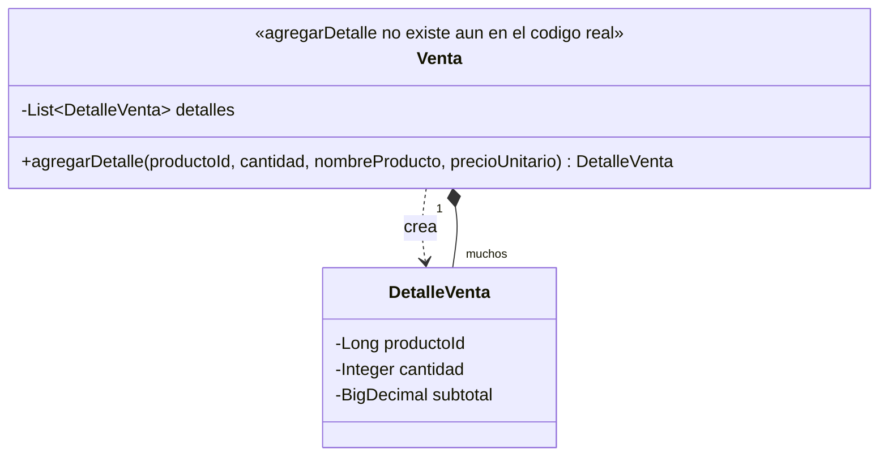
```mermaid
classDiagram
    class Venta {
        <<agregarDetalle no existe aun en el codigo real>>
        -List~DetalleVenta~ detalles
        +agregarDetalle(productoId, cantidad, nombreProducto, precioUnitario) DetalleVenta
    }
    class DetalleVenta {
        -Long productoId
        -Integer cantidad
        -BigDecimal subtotal
    }
    Venta ..> DetalleVenta : crea
    Venta "1" *-- "muchos" DetalleVenta
```

El método de fábrica vive **dentro** de la clase que necesita el objeto construido (`Venta`), no en una clase aparte — eso es lo que distingue a Factory Method de Builder: resuelve una construcción puntual, no un proceso paso a paso. 3.1 implementa este diagrama.

**Builder** separa la construcción de un objeto complejo —con muchos campos opcionales o un orden de inicialización que importa— de su representación final, permitiendo construirlo paso a paso (Gamma et al., 1994). Úsalo cuando un constructor tendría demasiados parámetros, o cuando no todos los campos son obligatorios en todos los casos.

**Figura 4. Builder mínimo: `VentaResponse` construido paso a paso por Lombok**

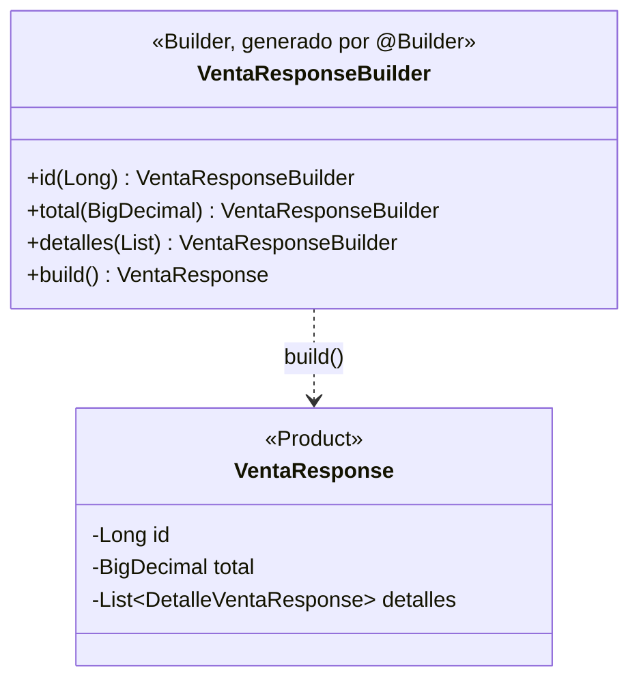
```mermaid
classDiagram
    class VentaResponse {
        <<Product>>
        -Long id
        -BigDecimal total
        -List~DetalleVentaResponse~ detalles
    }
    class VentaResponseBuilder {
        <<Builder, generado por @Builder>>
        +id(Long) VentaResponseBuilder
        +total(BigDecimal) VentaResponseBuilder
        +detalles(List) VentaResponseBuilder
        +build() VentaResponse
    }
    VentaResponseBuilder ..> VentaResponse : build()
```

A diferencia del Builder clásico de GoF (que separa un `Director` de un `Builder` abstracto con varias implementaciones concretas), Lombok genera un único `Builder` concreto por clase — suficiente aquí porque `VentaResponse` no necesita representaciones alternativas, solo construcción paso a paso.

**Singleton** garantiza que una clase tenga una única instancia global, y da un punto de acceso centralizado a ella (Gamma et al., 1994). En cualquier sistema empresarial es, de los cinco patrones creacionales, el que más se repite — porque todo contenedor de inversión de control (Spring, en este caso) lo aplica por defecto, sin que el programador lo pida.

**Figura 5. Singleton mínimo: una sola instancia de `VentaServiceImpl`, compartida por todo el contenedor**

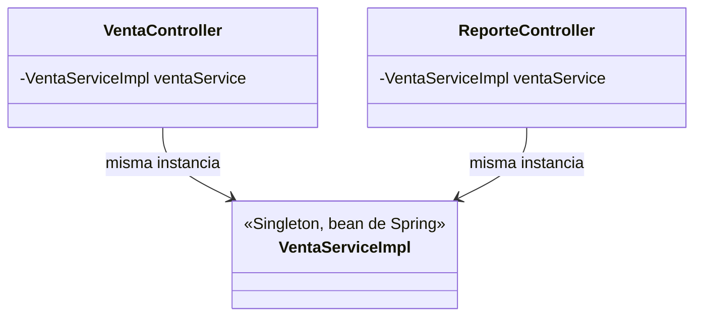
```mermaid
classDiagram
    class VentaServiceImpl {
        <<Singleton, bean de Spring>>
    }
    class VentaController {
        -VentaServiceImpl ventaService
    }
    class ReporteController {
        -VentaServiceImpl ventaService
    }
    VentaController --> VentaServiceImpl : misma instancia
    ReporteController --> VentaServiceImpl : misma instancia
```

A diferencia del Singleton de libro —constructor privado y un método estático `getInstance()`—, Spring resuelve esto con el *scope* del bean (`singleton`, el valor por defecto de cada `@Service`/`@Repository`/`@Component`): la responsabilidad de garantizar una única instancia no vive en la clase misma, sino en el contenedor que la administra. `VentaController` y `ReporteController` reciben, por Dependency Injection (2.8), exactamente el mismo objeto `VentaServiceImpl` — nunca uno cada uno.

**Abstract Factory** provee una interfaz para crear **familias** de objetos relacionados, sin especificar sus clases concretas (Gamma et al., 1994) — a diferencia de Factory Method, que fabrica un solo objeto, Abstract Factory fabrica varios que deben ser consistentes entre sí. En el ecosistema JPA (*Java Persistence API*), `EntityManagerFactory` es exactamente esto: fabrica `EntityManager`, `Query` y el resto de objetos de persistencia de una **misma familia** (Hibernate, en este proyecto) — si BomERP cambiara de proveedor JPA, cambiaría de fábrica concreta, sin que `VentaRepository` ni `ProductoRepository` lo notaran.

**Figura 6. Abstract Factory mínimo: `EntityManagerFactory` fabricando una familia de objetos JPA**

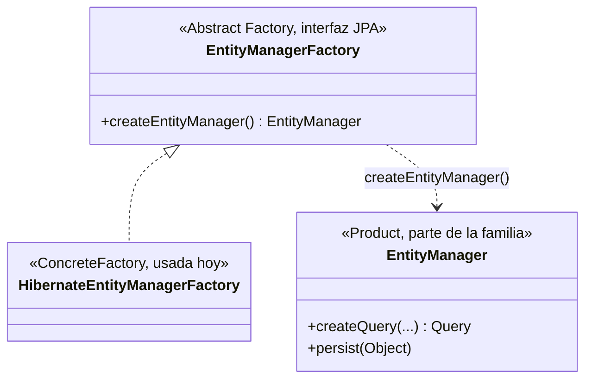
```mermaid
classDiagram
    class EntityManagerFactory {
        <<Abstract Factory, interfaz JPA>>
        +createEntityManager() EntityManager
    }
    class EntityManager {
        <<Product, parte de la familia>>
        +createQuery(...) Query
        +persist(Object)
    }
    class HibernateEntityManagerFactory {
        <<ConcreteFactory, usada hoy>>
    }
    EntityManagerFactory <|.. HibernateEntityManagerFactory
    EntityManagerFactory ..> EntityManager : createEntityManager()
```

Como Proxy y Singleton, `EntityManagerFactory` es un patrón que Spring Boot configura automáticamente a partir de `application.yml` — ningún código de `ventas` o `catalogo` lo instancia a mano, ni siquiera conoce su nombre.

**Tabla 5. Factory Method, Builder, Singleton y Abstract Factory en `ventas`**

| Patrón | Dónde en `ventas` | Por qué |
|---|---|---|
| Builder | `VentaResponse`/`DetalleVentaResponse` (S8, convención de LP2) | `@Builder` de Lombok genera un constructor paso a paso, en vez de uno con todos los campos de una vez — varios de esos campos (`detalles`, por ejemplo) no siempre están disponibles en el mismo punto del código. |
| Factory Method | **Hueco real, diseñado en 3.1** | Hoy, `DetalleVenta` lo construye `VentaMapper`, no `Venta` — 3.1 diseña un método de fábrica dentro de `Venta` que resuelve esto. |
| Singleton | `VentaServiceImpl`, `ProductoServiceImpl`, `VentaRepository`, `VentaMapper` (beans de Spring) | El contenedor crea una sola instancia de cada uno, la primera vez que se necesita, y la reutiliza en cada inyección — nadie escribió un constructor privado ni un `getInstance()`. |
| Abstract Factory | `EntityManagerFactory` (JPA, configurado por Spring Boot) | Fabrica la familia completa de objetos de persistencia de un proveedor (`EntityManager`, `Query`) de forma consistente, sin exponer la clase concreta de Hibernate. |

### 2.3 Patrones estructurales GoF: Facade, Proxy, Adapter y Bridge

Los patrones **estructurales** resuelven cómo se componen clases y objetos para formar estructuras más grandes, sin que una dependa de los detalles internos de otra (Gamma et al., 1994). De los siete patrones estructurales del catálogo original, cuatro aparecen constantemente en sistemas empresariales:

**Facade** ofrece una interfaz simplificada a un subsistema complejo, para que quien lo usa no necesite conocer sus clases internas (Gamma et al., 1994). Es el que más aparece en cualquier backend organizado por capas: `ProductoService` es una *Facade* real — simplifica, para `ventas`, todo lo que `catalogo` hace por dentro (`ProductoRepository`, `CategoriaRepository`, validaciones).

**Figura 7. Facade mínima: `ProductoService` oculta el subsistema `catalogo`**

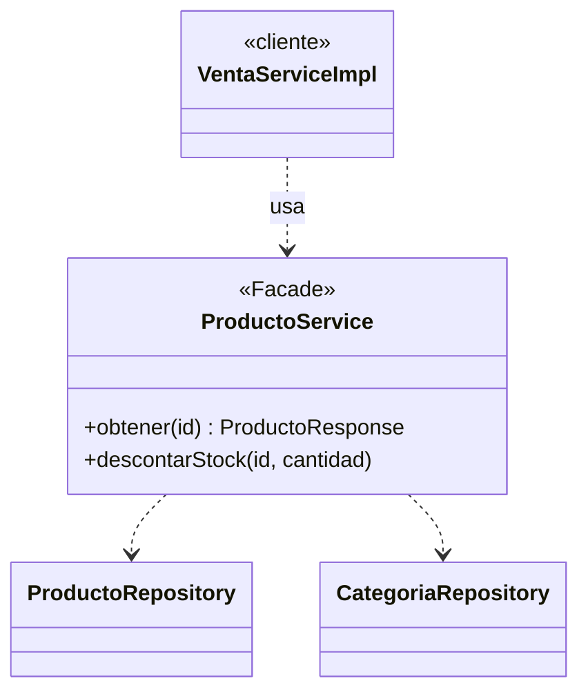
```mermaid
classDiagram
    class VentaServiceImpl {
        <<cliente>>
    }
    class ProductoService {
        <<Facade>>
        +obtener(id) ProductoResponse
        +descontarStock(id, cantidad)
    }
    class ProductoRepository
    class CategoriaRepository
    VentaServiceImpl ..> ProductoService : usa
    ProductoService ..> ProductoRepository
    ProductoService ..> CategoriaRepository
```

`VentaServiceImpl` nunca importa `ProductoRepository` ni `CategoriaRepository` — ni siquiera sabe que existen. Todo lo que necesita de `catalogo` pasa por los dos métodos que `ProductoService` expone.

**Proxy** provee un sustituto o intermediario de otro objeto, para controlar el acceso a él —sin que quien lo usa note la diferencia— por razones de costo (cargarlo es caro), de seguridad (hay que verificar permisos) o de coordinación (hay que envolver la llamada con algo más) (Gamma et al., 1994). Es uno de los patrones GoF más usados **sin que se note**, porque casi siempre lo aplica el framework, no el programador.

**Figura 8. Proxy mínimo: estructura clásica aplicada a la carga perezosa de `Categoria`**

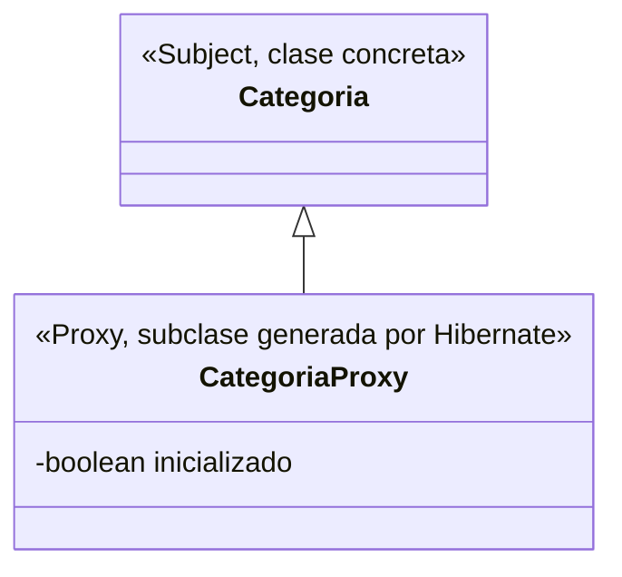
```mermaid
classDiagram
    class Categoria {
        <<Subject, clase concreta>>
    }
    class CategoriaProxy {
        <<Proxy, subclase generada por Hibernate>>
        -boolean inicializado
    }
    Categoria <|-- CategoriaProxy
```

`Producto.categoria` nunca referencia directamente a una fila cargada de la base de datos — referencia una subclase de `Categoria`, generada por Hibernate en tiempo de ejecución (no escrita por ningún programador), que decide cuándo ir realmente a la base de datos. La línea es de **herencia** (sólida), no de **realización** (punteada): a diferencia del Proxy de libro —que suele dibujarse con un `Subject` como interfaz—, Hibernate no necesita que `Categoria` sea una interfaz; le basta con generar una subclase real de la clase concreta.

**Figura 9. Proxy en acción: el *proxy* transaccional interceptando una llamada real**

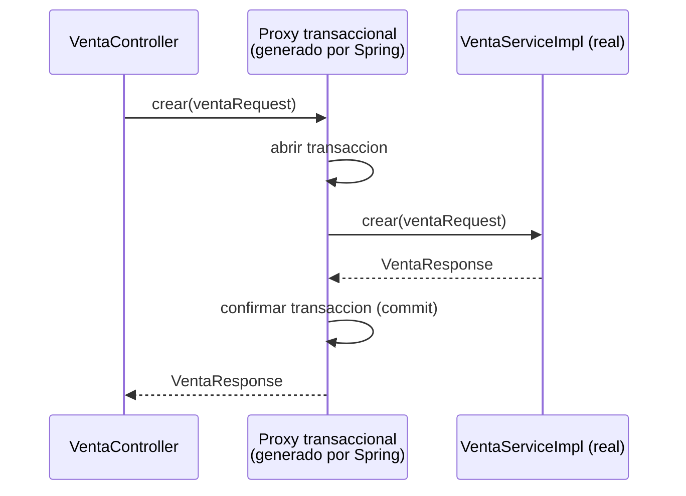
```mermaid
sequenceDiagram
    participant C as VentaController
    participant P as Proxy transaccional<br/>(generado por Spring)
    participant S as VentaServiceImpl (real)
    C->>P: crear(ventaRequest)
    P->>P: abrir transaccion
    P->>S: crear(ventaRequest)
    S-->>P: VentaResponse
    P->>P: confirmar transaccion (commit)
    P-->>C: VentaResponse
```

Este es el caso dinámico que justifica mostrar una secuencia además de la estructura: `VentaController` llama a algo que **cree** que es `VentaServiceImpl`, pero en realidad es el *proxy* de Spring, que envuelve la llamada real con la apertura y el cierre de la transacción — exactamente el mismo mecanismo que la Figura 8, aplicado a un segundo caso real.

**Adapter** convierte la interfaz de una clase en otra que el código cliente espera, permitiendo que colaboren clases cuyas interfaces serían, de otro modo, incompatibles (Gamma et al., 1994). `VentaMapper` cumple exactamente este rol: `Venta` (la entidad, con su forma interna de persistencia) y `VentaResponse` (el contrato HTTP que el cliente REST espera) son dos interfaces distintas — `VentaMapper` adapta una a la otra, sin que `VentaController` ni `Venta` se enteren el uno del otro.

**Figura 10. Adapter mínimo: `VentaMapper` adaptando `Venta` al contrato que `VentaController` espera**

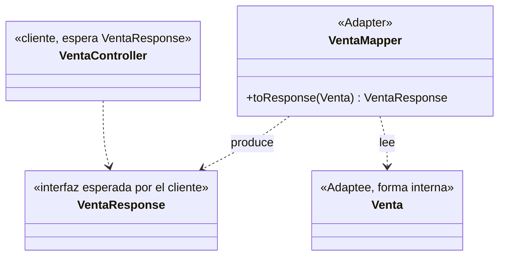
```mermaid
classDiagram
    class VentaController {
        <<cliente, espera VentaResponse>>
    }
    class Venta {
        <<Adaptee, forma interna>>
    }
    class VentaResponse {
        <<interfaz esperada por el cliente>>
    }
    class VentaMapper {
        <<Adapter>>
        +toResponse(Venta) VentaResponse
    }
    VentaController ..> VentaResponse
    VentaMapper ..> Venta : lee
    VentaMapper ..> VentaResponse : produce
```

A diferencia de Facade (que simplifica un subsistema completo) y de Proxy (que sustituye a un objeto sin cambiar su interfaz), Adapter existe específicamente porque las dos interfaces —la de `Venta` y la que `VentaResponse` exige— **no calzan entre sí**, y alguien tiene que traducir.

**Bridge** separa una abstracción de su implementación, para que ambas puedan variar de forma independiente, sin que una jerarquía de clases crezca multiplicando cada combinación posible (Gamma et al., 1994). `ventas` no lo necesita hoy, pero es el diseño natural y previsto para un requisito realista: reportes de ventas e inventario exportables en más de un formato.

**Figura 11. Bridge mínimo: tipos de reporte y formatos de salida, variando por separado (previsto)**

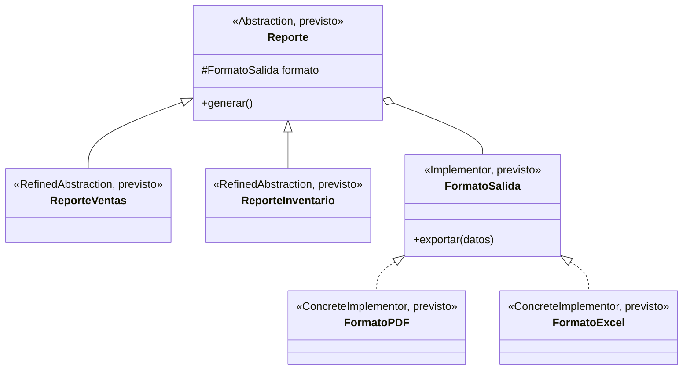
```mermaid
classDiagram
    class Reporte {
        <<Abstraction, previsto>>
        #FormatoSalida formato
        +generar()
    }
    class ReporteVentas {
        <<RefinedAbstraction, previsto>>
    }
    class ReporteInventario {
        <<RefinedAbstraction, previsto>>
    }
    class FormatoSalida {
        <<Implementor, previsto>>
        +exportar(datos)
    }
    class FormatoPDF {
        <<ConcreteImplementor, previsto>>
    }
    class FormatoExcel {
        <<ConcreteImplementor, previsto>>
    }
    Reporte <|-- ReporteVentas
    Reporte <|-- ReporteInventario
    Reporte o-- FormatoSalida
    FormatoSalida <|.. FormatoPDF
    FormatoSalida <|.. FormatoExcel
```

Sin Bridge, agregar un tercer formato (CSV) obligaría a crear `ReporteVentasCSV` y `ReporteInventarioCSV` — una clase por cada combinación. Con Bridge, `Reporte` **tiene** (composición, no herencia) un `FormatoSalida`: agregar `FormatoCSV` no toca ninguna clase de `Reporte`, y agregar un tercer tipo de reporte no toca ningún `FormatoSalida`. Es la misma idea de Low Coupling (2.6) aplicada a dos jerarquías completas, no a una sola clase.

**Error frecuente**: confundir Bridge con Strategy. Strategy (2.4) intercambia un algoritmo dentro de una sola jerarquía; Bridge desacopla **dos** jerarquías independientes (qué se reporta, en qué formato) que varían por separado.

**Tabla 6. Dos *Proxy* reales en el código de LP2, sin que nadie los haya escrito a mano**

| Dónde | Qué intercepta | Tipo de Proxy |
|---|---|---|
| `Producto.categoria` (`@ManyToOne(fetch = FetchType.LAZY)`, S3) | El acceso a `Categoria`: Hibernate entrega un objeto sustituto que solo consulta la base de datos la primera vez que se usa de verdad. | *Virtual Proxy* (carga perezosa) |
| `VentaServiceImpl` con `@Transactional` (S8, 2.3) | Cada llamada al método real: Spring envuelve la clase en un *proxy* generado en tiempo de ejecución que abre la transacción antes de llamar al método real, y la confirma o revierte después. | *Proxy* de framework (intercepción transaccional) |

Ninguno de los dos *Proxy* de la Tabla 6 aparece como una clase escrita a mano en el código — eso es, precisamente, lo que distingue a Proxy de los demás patrones estructurales: su punto es ser invisible para quien usa el objeto real.

### 2.4 Patrones de comportamiento GoF: Strategy, State, Chain of Responsibility y Observer

Los patrones **de comportamiento** resuelven cómo se distribuye la responsabilidad de un algoritmo o un flujo entre objetos que colaboran (Gamma et al., 1994). Es la familia GoF más grande (once patrones) y la que más se nota en sistemas con reglas de negocio reales — cuatro se repiten en casi cualquier ERP:

**Strategy** encapsula una familia de algoritmos intercambiables detrás de una misma interfaz, para que el código cliente pueda cambiar de algoritmo sin cambiar su propia estructura (Gamma et al., 1994). El parámetro `Sort` que `VentaServiceImpl.buscar` arma a partir de `ordenarPor`/`direccion` (S8) encapsula una estrategia de ordenamiento intercambiable, sin que `VentaRepository` sepa cuál.

**Figura 12. Strategy mínimo: `Sort` como estrategia de ordenamiento intercambiable**

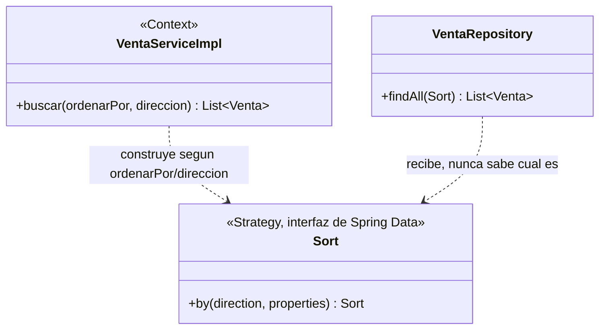
```mermaid
classDiagram
    class VentaServiceImpl {
        <<Context>>
        +buscar(ordenarPor, direccion) List~Venta~
    }
    class Sort {
        <<Strategy, interfaz de Spring Data>>
        +by(direction, properties) Sort
    }
    class VentaRepository {
        +findAll(Sort) List~Venta~
    }
    VentaServiceImpl ..> Sort : construye segun ordenarPor/direccion
    VentaRepository ..> Sort : recibe, nunca sabe cual es
```

Una diferencia honesta con el Strategy de libro: GoF propone una jerarquía de clases concretas (`OrdenPorFecha`, `OrdenPorTotal`...); Spring Data construye su estrategia de forma dinámica, con datos (`ordenarPor`, `direccion`), sin una subclase por cada criterio. El principio es el mismo —`VentaRepository` nunca pregunta cuál estrategia recibió—, pero no toda implementación de Strategy en un sistema real se ve como el diagrama de un libro.

**State** permite que un objeto cambie su comportamiento cuando cambia su estado interno, de forma que parezca que el objeto cambió de clase — cada estado se modela como su propia clase, con su propia implementación de las operaciones que varían (Gamma et al., 1994). No todo atributo de estado necesita este patrón: un `enum` con una validación simple (`if estado != REGISTRADA`) resuelve el mismo problema cuando hay pocos estados y poco comportamiento que varíe. El patrón completo se justifica cuando los estados son varios **y** el comportamiento difiere de forma sustancial entre ellos, no solo en una condición.

**Figura 13. State mínimo: la estructura completa que `Venta` *no* necesita (todavía)**

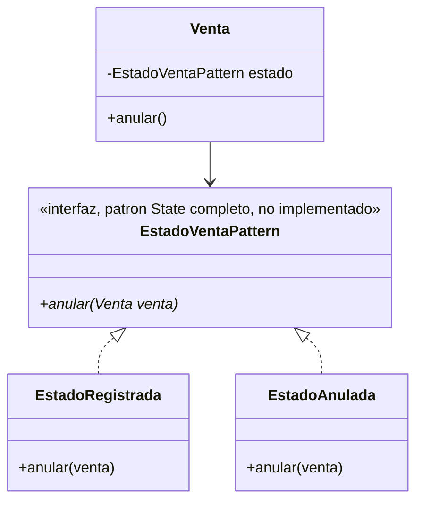
```mermaid
classDiagram
    class Venta {
        -EstadoVentaPattern estado
        +anular()
    }
    class EstadoVentaPattern {
        <<interfaz, patron State completo, no implementado>>
        +anular(Venta venta)*
    }
    class EstadoRegistrada {
        +anular(venta)
    }
    class EstadoAnulada {
        +anular(venta)
    }
    Venta --> EstadoVentaPattern
    EstadoVentaPattern <|.. EstadoRegistrada
    EstadoVentaPattern <|.. EstadoAnulada
```

**Figura 14. El ciclo de vida real de `Venta`, como `enum` con validación**

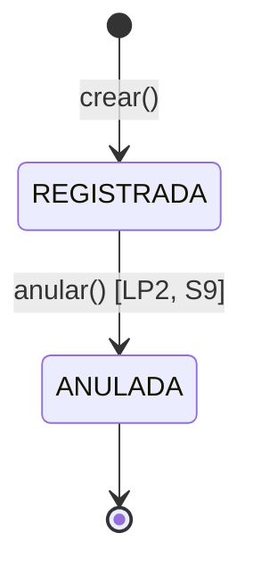
```mermaid
stateDiagram-v2
    [*] --> REGISTRADA : crear()
    REGISTRADA --> ANULADA : anular() [LP2, S9]
    ANULADA --> [*]
```

Las Figuras 13 y 14 son la misma realidad vista dos veces: la Figura 13 es la estructura que el patrón State *exigiría* (una clase por estado); la Figura 14 es la que `Venta` tiene de verdad hoy, un solo atributo `EstadoVenta` con dos valores y una validación. 3.3 aplica la Tabla 7 para justificar, con criterio, por qué la Figura 14 sigue siendo suficiente.

**Tabla 7. Cuándo State (clases) y cuándo un `enum` con validación basta**

| Señal | ¿Justifica el patrón State completo? |
|---|---|
| Dos o tres estados, con una sola regla de transición cada uno | No — un `enum` + una validación por método alcanza. |
| Cinco o más estados, cada uno habilitando o prohibiendo operaciones distintas | Sí — una clase por estado evita que un único método acumule un `switch` gigante. |
| Las transiciones válidas cambian seguido (nuevas reglas de negocio agregan estados con frecuencia) | Sí — agregar una clase de estado nueva no obliga a tocar las demás. |

3.3 aplica esta tabla al `EstadoVenta` real de BomERP, que hoy ya tiene sus dos valores implementados (`REGISTRADA` y `ANULADA`, cerrado en LP2 S9) — y decide, con este criterio, si eso justifica el patrón completo o si el `enum` con validación (como el que LP2 S9 ya implementó) sigue siendo la opción correcta.

**Chain of Responsibility** evita que un objeto que envía una petición conozca de antemano cuál objeto la va a manejar: la petición pasa de un manejador a otro, en una cadena, hasta que uno la resuelve (Gamma et al., 1994). Es, de los patrones de comportamiento, el más reconocible en cualquier ERP: **cualquier flujo de aprobación por niveles** (una compra, un descuento, un reembolso) es, estructuralmente, este patrón. `ventas` no lo tiene implementado todavía, pero es un diseño natural y previsto para una regla de negocio real: una venta de monto alto no debería aprobarse automáticamente.

**Figura 15. Chain of Responsibility: autorización de una venta por monto (previsto)**


```mermaid
flowchart LR
    V[Venta nueva] --> A{"Autorizador<br/>Vendedor"}
    A -- "total <= S/500" --> OK1([Autorizada])
    A -- "total > S/500" --> B{"Autorizador<br/>Supervisor"}
    B -- "total <= S/5000" --> OK2([Autorizada])
    B -- "total > S/5000" --> C{"Autorizador<br/>Admin"}
    C --> OK3([Autorizada])
```

```text
// AutorizadorVenta.java — interfaz de la cadena, pseudocodigo
interface AutorizadorVenta:
    establecerSiguiente(AutorizadorVenta siguiente)
    autorizar(Venta venta)

// AutorizadorVendedor.java — primer eslabon
autorizar(venta):
    si venta.total <= 500:
        devolver AUTORIZADA
    sino si siguiente != null:
        devolver siguiente.autorizar(venta)
    sino:
        devolver RECHAZADA
```

Cada autorizador solo sabe dos cosas: su propia regla, y a quién pasarle la petición si no le corresponde a él. `AutorizadorVendedor` no conoce a `AutorizadorAdmin` directamente —ni cuántos eslabones hay en total—; si BomERP agrega un cuarto nivel de aprobación mañana, ningún autorizador existente cambia una sola línea.

**Error frecuente**: implementar esto como un único método con `if total <= 500 ... else if total <= 5000 ... else ...`. Funciona igual de bien con pocos niveles, pero cada nivel nuevo obliga a tocar el mismo método gigante — exactamente lo que Chain of Responsibility evita, separando cada regla en su propio eslabón.

**Figura 16. Chain of Responsibility mínimo: la interfaz compartida y sus tres eslabones**

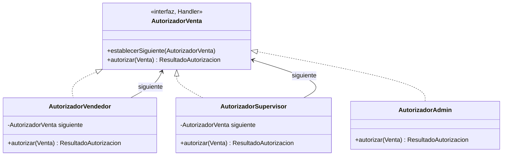
```mermaid
classDiagram
    class AutorizadorVenta {
        <<interfaz, Handler>>
        +establecerSiguiente(AutorizadorVenta)
        +autorizar(Venta) ResultadoAutorizacion
    }
    class AutorizadorVendedor {
        -AutorizadorVenta siguiente
        +autorizar(Venta) ResultadoAutorizacion
    }
    class AutorizadorSupervisor {
        -AutorizadorVenta siguiente
        +autorizar(Venta) ResultadoAutorizacion
    }
    class AutorizadorAdmin {
        +autorizar(Venta) ResultadoAutorizacion
    }
    AutorizadorVenta <|.. AutorizadorVendedor
    AutorizadorVenta <|.. AutorizadorSupervisor
    AutorizadorVenta <|.. AutorizadorAdmin
    AutorizadorVendedor --> AutorizadorVenta : siguiente
    AutorizadorSupervisor --> AutorizadorVenta : siguiente
```

**Figura 17. Chain of Responsibility en el tiempo: una venta de S/2000 recorriendo la cadena**

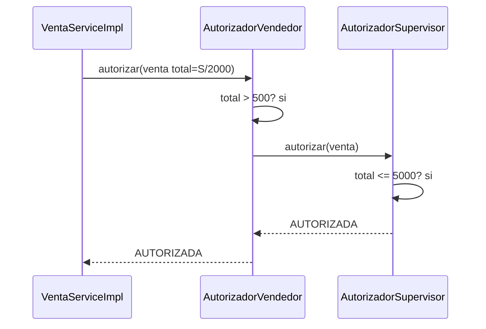
```mermaid
sequenceDiagram
    participant S as VentaServiceImpl
    participant V as AutorizadorVendedor
    participant Sup as AutorizadorSupervisor
    S->>V: autorizar(venta total=S/2000)
    V->>V: total > 500? si
    V->>Sup: autorizar(venta)
    Sup->>Sup: total <= 5000? si
    Sup-->>V: AUTORIZADA
    V-->>S: AUTORIZADA
```

La Figura 16 muestra la estructura (quién implementa qué); la Figura 17 muestra lo que la estructura por sí sola no deja ver: que `AutorizadorAdmin` ni siquiera participa en este caso concreto, porque `AutorizadorSupervisor` ya resolvió la petición — la cadena avanza solo hasta donde hace falta.

**Observer** define una dependencia de uno-a-muchos entre objetos, de forma que cuando uno cambia de estado, todos sus dependientes son notificados automáticamente, sin que el primero los conozca por nombre (Gamma et al., 1994). La publicación de eventos de dominio es Observer aplicado a nivel de módulos: `ventas` (el *sujeto*) no conoce a sus suscriptores (los *observadores*), y puede tener cero, uno o varios al mismo tiempo. Hoy, en esta sesión, es un concepto; S11 lo formaliza con `VentaRegistrada` y `@ApplicationModuleListener` de Spring Modulith — el mismo patrón, con nombre e implementación concretos.

**Figura 18. Observer mínimo: `ventas` publica, sin conocer a sus observadores (previsto)**

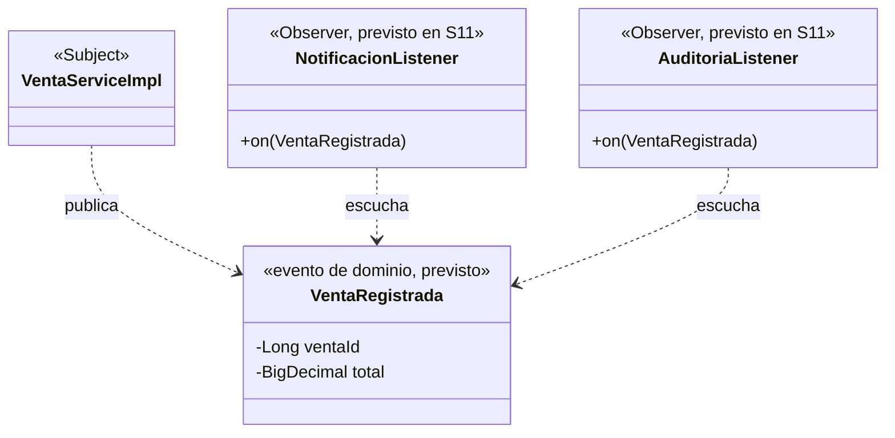
```mermaid
classDiagram
    class VentaServiceImpl {
        <<Subject>>
    }
    class VentaRegistrada {
        <<evento de dominio, previsto>>
        -Long ventaId
        -BigDecimal total
    }
    class NotificacionListener {
        <<Observer, previsto en S11>>
        +on(VentaRegistrada)
    }
    class AuditoriaListener {
        <<Observer, previsto en S11>>
        +on(VentaRegistrada)
    }
    VentaServiceImpl ..> VentaRegistrada : publica
    NotificacionListener ..> VentaRegistrada : escucha
    AuditoriaListener ..> VentaRegistrada : escucha
```

**Figura 19. Observer en el tiempo: publicar no espera a que los observadores respondan**

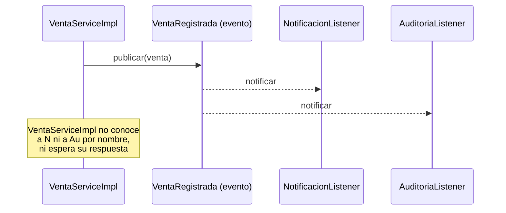
```mermaid
sequenceDiagram
    participant S as VentaServiceImpl
    participant E as VentaRegistrada (evento)
    participant N as NotificacionListener
    participant Au as AuditoriaListener
    S->>E: publicar(venta)
    E-->>N: notificar
    E-->>Au: notificar
    Note over S: VentaServiceImpl no conoce<br/>a N ni a Au por nombre,<br/>ni espera su respuesta
```

Cero, uno o varios observadores pueden escuchar `VentaRegistrada` sin que `VentaServiceImpl` cambie una sola línea — la Figura 19 es la razón por la que Observer se considera bajo acoplamiento temporal, no solo estructural.

### 2.5 GRASP — asignación de responsabilidades: Information Expert, Creator, Controller

Tres de los nueve patrones GRASP (Larman, 2004) responden la misma pregunta de fondo —¿a qué clase le corresponde esta responsabilidad?— desde tres ángulos distintos.

**Information Expert**: asigna una responsabilidad a la clase que tiene la información necesaria para cumplirla. Es el patrón que el caso de 1.6 dejó planteado: `Venta` tiene sus propios `detalles`, así que es la experta en calcular su propio `total` — no `VentaServiceImpl`, que solo coordina. 3.5 aplica este criterio a `Venta` y `Producto`.

**Figura 20. Information Expert mínimo: `Venta` tiene la información para calcular su propio total (objetivo del refactor de 3.5, no en el código real hoy)**

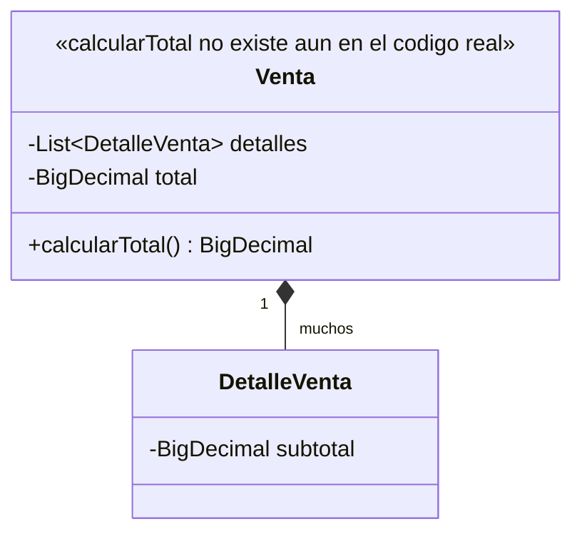
```mermaid
classDiagram
    class Venta {
        <<calcularTotal no existe aun en el codigo real>>
        -List~DetalleVenta~ detalles
        -BigDecimal total
        +calcularTotal() BigDecimal
    }
    class DetalleVenta {
        -BigDecimal subtotal
    }
    Venta "1" *-- "muchos" DetalleVenta
```

**Creator**: asigna la responsabilidad de crear una instancia de una clase A a la clase B, si B agrega o contiene a A, registra instancias de A, las usa íntimamente, o tiene los datos de inicialización que A necesita (Larman, 2004). `Venta` **contiene** (compone) a `DetalleVenta` — por Creator, `Venta` debería ser quien cree sus propios objetos `DetalleVenta`. Hoy no lo es (`VentaMapper.toDetalle(...)` los crea); 3.1 resuelve este hueco con un Factory Method dentro de `Venta`, matando dos pájaros —GRASP Creator y GoF Factory Method— con el mismo refactor.

**Figura 21. Creator mínimo: la misma composición que justifica quién crea a quién (hueco real, resuelto en 3.1)**

```mermaid
classDiagram
    class Venta {
        <<agregarDetalle no existe aun en el codigo real>>
        +agregarDetalle(...) DetalleVenta
    }
    class DetalleVenta
    Venta ..> DetalleVenta : crea (Creator)
    Venta "1" *-- "muchos" DetalleVenta : contiene
```

La Figura 20 y la Figura 21 comparten la misma composición (`Venta` contiene `DetalleVenta`) porque, en este caso, son la misma clase la que tiene la información **y** la que debería crear — no siempre coinciden, pero cuando lo hacen, como aquí, es una señal fuerte de que el diseño está bien encaminado. Es, de hecho, el mismo diagrama que la Figura 3 (2.2, Factory Method) — GRASP Creator y GoF Factory Method resolviendo, desde dos catálogos distintos, el mismo problema.

**Controller**: ya presentado en S8 (2.3) y verificado en S9 — asigna la responsabilidad de recibir un evento del sistema a una clase que no es la interfaz de usuario ni el dominio. `VentaController` lo aplica: recibe la petición HTTP (*HyperText Transfer Protocol*), delega en `VentaService`, no decide ninguna regla de negocio.

**Figura 22. Controller mínimo (versión completa en S8, Figura 6, y S9)**

```mermaid
classDiagram
    class VentaController {
        <<Controller>>
        +crear(VentaRequest) ResponseEntity
    }
    class VentaService {
        <<interfaz>>
    }
    VentaController ..> VentaService : delega
```

### 2.6 GRASP — acoplamiento y cohesión: Low Coupling, High Cohesion, Polymorphism

**Low Coupling**: asigna responsabilidades de forma que la dependencia entre clases se mantenga baja, para que un cambio en una no obligue a cambiar muchas otras (Larman, 2004). El DTO (*Data Transfer Object*, S8) es la aplicación más directa en `ventas`: `VentaController` depende de `VentaRequest`/`VentaResponse`, nunca de la entidad `Venta` — si `Venta` cambia sus columnas internas, el contrato HTTP no tiene por qué cambiar.

**High Cohesion**: asigna responsabilidades de forma que las de una clase estén fuertemente relacionadas y enfocadas (Larman, 2004). `VentaMapper` solo traduce; `VentaRepository` solo persiste y consulta — ninguna de las dos mezcla responsabilidades que no le correspondan.

**Figura 23. Low Coupling y High Cohesion mínimos, en las mismas clases de `ventas`**

```mermaid
classDiagram
    class VentaController {
        +crear(VentaRequest) VentaResponse
    }
    class VentaRequest
    class VentaResponse
    class Venta {
        <<entidad>>
    }
    class VentaMapper {
        +toResponse(Venta) VentaResponse
    }
    class VentaRepository
    VentaController ..> VentaRequest : Low Coupling
    VentaController ..> VentaResponse : Low Coupling
    VentaMapper ..> Venta : High Cohesion
    VentaMapper ..> VentaResponse : High Cohesion
    VentaRepository ..> Venta : High Cohesion
```

`VentaController` no aparece conectado a `Venta` en este diagrama — y esa ausencia **es** Low Coupling aplicado. `VentaMapper` y `VentaRepository`, en cambio, sí dependen de `Venta`, pero cada una con un propósito único y enfocado — esa es High Cohesion.

**Polymorphism**: cuando el comportamiento varía según el tipo de un objeto, esa variación se asigna con operaciones polimórficas definidas en cada tipo, en vez de condicionales que pregunten de qué tipo es cada objeto (Larman, 2004). BomERP todavía no implementa `Cliente`, pero S7 ya diseñó la jerarquía (`Cliente` abstracta, `ClientePersonaNatural`, `ClienteEmpresa`) — el candidato natural para aplicar Polymorphism hoy, en diseño.

**Figura 24. Polymorphism aplicado a la jerarquía prevista de `Cliente`**

```mermaid
classDiagram
    class Cliente {
        <<abstracta, prevista>>
        #Long id
        #String nombreORazonSocial
        +obtenerIdentificadorFiscal()* String
    }
    class ClientePersonaNatural {
        -String dni
        +obtenerIdentificadorFiscal() String
    }
    class ClienteEmpresa {
        -String ruc
        +obtenerIdentificadorFiscal() String
    }
    Cliente <|-- ClientePersonaNatural
    Cliente <|-- ClienteEmpresa
```

```text
// Sin Polymorphism (lo que GRASP pide evitar)
si cliente instanceof ClientePersonaNatural:
    identificador = cliente.getDni()
sino si cliente instanceof ClienteEmpresa:
    identificador = cliente.getRuc()

// Con Polymorphism (lo que la Figura 24 disena)
identificador = cliente.obtenerIdentificadorFiscal()
```

**Polymorphism no es lo mismo que una interfaz con una sola implementación.** En UML, la línea de `Cliente <|-- ClientePersonaNatural` (generalización, **línea sólida**) no es la única forma de dibujar polimorfismo — una interfaz implementada por una clase (`VentaService <|.. VentaServiceImpl`, realización, **línea punteada**) también lo es, como mecanismo de lenguaje. La diferencia que importa para GRASP no es la notación, es si **hay variación real que resolver**:

**Tabla 8. Polymorphism frente a Indirection/Protected Variations: la misma notación `implements`/`extends`, dos patrones distintos**

| | `Cliente` → `ClientePersonaNatural`/`ClienteEmpresa` | `VentaService` → `VentaServiceImpl` |
|---|---|---|
| ¿Cuántas implementaciones hay? | Dos, con comportamiento genuinamente distinto (DNI frente a RUC). | Una sola, hoy. |
| ¿Hay variación que el código cliente deba ignorar? | Sí — `obtenerIdentificadorFiscal()` resuelve esa variación en tiempo de ejecución. | No hay nada que variar todavía; la interfaz protege un punto de cambio *futuro*, no uno que ya exista. |
| Patrón GRASP correcto | **Polymorphism** | **Indirection** / **Protected Variations** (2.7) |

Una interfaz con una sola implementación no es polimorfismo aplicado — es protección contra un cambio que todavía no ocurrió.

### 2.7 GRASP — patrones de protección: Pure Fabrication, Indirection, Protected Variations

**Pure Fabrication**: una clase inventada, que no representa ningún concepto del dominio del negocio, creada exclusivamente para lograr bajo acoplamiento y alta cohesión (Larman, 2004). `VentaMapper` y `VentaRepository` son Pure Fabrication — ningún experto del negocio describe "un mapeador" o "un repositorio" como parte de cómo funciona una venta.

**Figura 25. Pure Fabrication mínimo: clases sin concepto de negocio, inventadas por diseño**

```mermaid
classDiagram
    class Venta {
        <<concepto del negocio>>
    }
    class VentaMapper {
        <<Pure Fabrication>>
        +toResponse(Venta) VentaResponse
    }
    class VentaRepository {
        <<Pure Fabrication>>
    }
    VentaMapper ..> Venta
    VentaRepository ..> Venta
```

**Indirection**: asigna la responsabilidad a un objeto intermediario, para mediar entre otros componentes o servicios y evitar que se acoplen directamente (Larman, 2004). La interfaz `ProductoService` es ese intermediario: `VentaServiceImpl` nunca habla con `ProductoRepository` ni con `ProductoServiceImpl` directamente.

**Protected Variations**: identifica puntos de variación probable y les pone alrededor una interfaz estable, para que el resto del sistema quede protegido de esos cambios (Larman, 2004). La anotación real `@NamedInterface("producto-service")` sobre el paquete `catalogo.producto.service` (Spring Modulith) es la forma concreta en que LP2 declara ese punto protegido en código.

**Figura 26. Indirection y Protected Variations mínimos: la misma interfaz, dos lecturas**

```mermaid
classDiagram
    class VentaServiceImpl {
        <<cliente>>
    }
    class ProductoService {
        <<interfaz, Indirection + Protected Variations>>
    }
    class ProductoServiceImpl {
        <<implementacion real>>
    }
    VentaServiceImpl ..> ProductoService : solo conoce la interfaz
    ProductoService <|.. ProductoServiceImpl
```

**Tabla 9. La misma clase, dos patrones — por qué no es un error**

| Clase | Indirection (el mecanismo) | Protected Variations (el propósito) |
|---|---|---|
| `ProductoService` | Es el objeto intermediario entre `ventas` y la implementación real de `catalogo`. | Protege a `ventas` de que `ProductoServiceImpl` cambie su lógica interna. |

Indirection describe **cómo** se logra (un intermediario); Protected Variations describe **para qué** (proteger un punto de variación). La misma clase puede —y en este caso debe— cumplir los dos a la vez.

### 2.8 Dependency Injection

**Dependency Injection** (inyección de dependencias) es el patrón donde un objeto recibe sus colaboradores desde afuera —por constructor, en el caso de Spring con `@RequiredArgsConstructor`— en vez de crearlos él mismo con `new` (Fowler, 2004). `VentaServiceImpl` ya lo aplica: recibe `VentaRepository`, `ProductoService` y `VentaMapper` como parámetros de su constructor, generado por Lombok.

**Figura 27. Dependency Injection mínimo: `VentaServiceImpl` recibe, no construye**

```mermaid
classDiagram
    class VentaServiceImpl {
        -VentaRepository ventaRepository
        -ProductoService productoService
        -VentaMapper ventaMapper
        +VentaServiceImpl(VentaRepository, ProductoService, VentaMapper)
    }
    class VentaRepository
    class ProductoService
    class VentaMapper
    VentaServiceImpl --> VentaRepository : inyectado por constructor
    VentaServiceImpl --> ProductoService : inyectado por constructor
    VentaServiceImpl --> VentaMapper : inyectado por constructor
```

Ninguna de las tres flechas sale de un `new` dentro de `VentaServiceImpl` — las tres llegan desde afuera, resueltas por el contenedor de Spring al momento de levantar la aplicación, no cuando `VentaServiceImpl` las necesita.

**Error frecuente**: confundir "usar Spring" con "aplicar Dependency Injection". El contenedor de Spring es el *mecanismo* que resuelve las dependencias automáticamente; el *patrón* es la decisión de diseño de que una clase nunca construya sus propios colaboradores.

## 3. Aplica: actividad práctica guiada

Tiempo: 115 min.

**Actividad:** reconocimiento y aplicación de los patrones GoF y GRASP más usados en sistemas empresariales sobre el módulo `ventas`, resolviendo dos huecos reales (Creator/Factory Method, Information Expert) y diseñando tres decisiones previstas (State, Chain of Responsibility, Polymorphism).

**Propósito de la actividad:** salir de la sesión sabiendo reconocer estos patrones en cualquier sistema, no solo en `ventas` — por eso cada paso empieza por decidir **si** el patrón aplica, antes de aplicarlo.

**Orientaciones metodológicas:** en el laboratorio, el docente aplica cada patrón a `ventas` paso a paso frente a la clase; los estudiantes repiten cada paso sobre su propio módulo de S8 (ver sección 4).

**Actividades para realizar:**

- **3.1** Resolver el hueco de Creator con un Factory Method.
- **3.2** Reconocer Proxy, Singleton, Abstract Factory y Adapter en el código real.
- **3.3** Decidir si `Venta` necesita el patrón State completo.
- **3.4** Diseñar la cadena de autorización de ventas (Chain of Responsibility).
- **3.5** Diagnosticar y refactorizar con Information Expert.
- **3.6** Diseñar el polimorfismo de `Cliente`.
- **3.7** Catalogar acoplamiento/cohesión y verificar los patrones de protección y Dependency Injection.

### 3.1 Resolver el hueco de Creator con un Factory Method

**Producto del paso:** el método de fábrica dentro de `Venta`, que la convierte en la creadora de sus propios `DetalleVenta` (2.2, 2.5).

```text
// Venta.java — pseudocodigo, Factory Method que resuelve el hueco de Creator
agregarDetalle(productoId, cantidad, nombreProducto, precioUnitario):
    detalle = nuevo DetalleVenta(
        venta: este,
        productoId: productoId,
        cantidad: cantidad,
        nombreProducto: nombreProducto,
        precioUnitario: precioUnitario,
        subtotal: precioUnitario * cantidad
    )
    detalles.agregar(detalle)
    devolver detalle
```

`VentaServiceImpl.crear` deja de pedirle a `VentaMapper` que construya el `DetalleVenta` — pide los datos del producto (a `ProductoService`, como ya hace hoy) y se los pasa a `venta.agregarDetalle(...)`, que es ahora quien construye y agrega el objeto. `VentaMapper` conserva su trabajo de **traducir** `Venta` a `VentaResponse` (2.3, Adapter) — construir y traducir son responsabilidades distintas, y este refactor las separa en la clase que corresponde a cada una.

### 3.2 Reconocer Proxy, Singleton, Abstract Factory y Adapter en el código real

**Producto del paso:** evidencia de los dos *Proxy* de la Tabla 6 (2.3), del Singleton y el Abstract Factory de la Tabla 5 (2.2), y del Adapter de 2.3, verificados contra el código y el comportamiento real.

```java
// Producto.java — codigo real, S3
@ManyToOne(fetch = FetchType.LAZY)
@JoinColumn(name = "ID_CATEGORIA", nullable = false)
private Categoria categoria;
```

```java
// VentaServiceImpl.java — codigo real, S8
@Transactional
public VentaResponse crear(VentaRequest request) { /* ... */ }
```

Ninguna de las dos líneas menciona la palabra "Proxy" — y esa es la evidencia de que el patrón está aplicado correctamente: Hibernate y Spring lo aplican automáticamente, a partir de una anotación, sin que el código de `ventas` tenga que escribir ninguna clase intermediaria a mano.

**Error frecuente**: serializar una entidad con una relación `LAZY` fuera de una transacción activa (por ejemplo, devolver la entidad directamente desde un controlador). El *proxy* de Hibernate lanza `LazyInitializationException` porque ya no hay transacción para resolver la carga real — es exactamente la razón por la que S8 (2.4) exige exponer siempre un DTO, nunca la entidad directamente.

Singleton se verifica igual de simple: ningún `@Service` o `@Repository` de `ventas` tiene constructor privado ni método `getInstance()` — **y no hace falta**, porque el `scope` por defecto de todo bean de Spring ya es `singleton` (Figura 5). Basta con inyectar `VentaServiceImpl` en dos clases distintas (por ejemplo `VentaController` y un futuro `ReporteController`) e imprimir su `hashCode()` para comprobar que ambas reciben el mismo objeto.

**Error frecuente**: declarar un `@Service` con campos mutables sin pensar en que una sola instancia los comparte entre **todas** las peticiones concurrentes. Si `VentaServiceImpl` guardara estado en un atributo de instancia (no en parámetros ni en la base de datos), dos usuarios distintos podrían pisarse datos sin saberlo — exactamente el riesgo que el Singleton de framework introduce si la clase no se diseña *stateless*.

Abstract Factory se reconoce igual: ningún código de `ventas` ni de `catalogo` importa una clase de Hibernate directamente — toda persistencia pasa por las abstracciones de Spring Data, que internamente usan la familia de objetos que `EntityManagerFactory` fabrica (Figura 6). Adapter se verifica leyendo la firma real de `VentaMapper.toResponse(Venta venta) : VentaResponse`: recibe `Venta` y devuelve `VentaResponse`, sin que ninguna de las dos clases conozca a la otra directamente.

### 3.3 Decidir si `Venta` necesita el patrón State completo

**Producto del paso:** una decisión explícita, aplicando la Tabla 7 (2.4) al `EstadoVenta` real de BomERP.

```java
public enum EstadoVenta {
    REGISTRADA,
    ANULADA
}
```

**Tabla 10. Tabla 7 aplicada a `EstadoVenta`**

| Señal | ¿Se cumple en `Venta` hoy? |
|---|---|
| Dos o tres estados, con una sola regla de transición cada uno | Sí — `REGISTRADA` y `ANULADA`, con una sola precondición cada una (ADS S9, Tabla 8; implementado en LP2 S9). |
| Cinco o más estados con comportamiento muy distinto | No. |
| Las transiciones cambian seguido | No hay evidencia de esto en el sílabo ni en el proyecto. |

**Decisión:** el `enum` con validación, ya implementado en LP2 S9 (`Venta.anular()` comprobando `estado == REGISTRADA` antes de transicionar) — el patrón State completo (una clase `EstadoRegistrada`, una clase `EstadoAnulada`, cada una con su propia implementación de `anular()`) sería sobreingeniería para dos estados con una sola regla. Si en el futuro BomERP agregara una devolución con varios pasos (`ANULADA_PARCIAL`, `EN_REVISION`, `DEVUELTA`, cada una habilitando operaciones distintas), ese sería el momento de migrar a State — no antes.

### 3.4 Diseñar la cadena de autorización de ventas (Chain of Responsibility)

**Producto del paso:** la cadena de autorizadores de la Figura 15 (2.4), con sus tres eslabones y el criterio de monto de cada uno.

```text
// AutorizadorVendedor.java, AutorizadorSupervisor.java, AutorizadorAdmin.java — pseudocodigo
interface AutorizadorVenta:
    establecerSiguiente(AutorizadorVenta siguiente)
    autorizar(Venta venta) ResultadoAutorizacion

class AutorizadorVendedor implements AutorizadorVenta:
    autorizar(venta):
        si venta.total <= 500: devolver AUTORIZADA
        sino: devolver siguiente.autorizar(venta)

class AutorizadorSupervisor implements AutorizadorVenta:
    autorizar(venta):
        si venta.total <= 5000: devolver AUTORIZADA
        sino: devolver siguiente.autorizar(venta)

class AutorizadorAdmin implements AutorizadorVenta:
    autorizar(venta):
        devolver AUTORIZADA  // ultimo eslabon: siempre resuelve

// Construccion de la cadena (una sola vez, al iniciar la aplicacion)
vendedor.establecerSiguiente(supervisor)
supervisor.establecerSiguiente(admin)
```

Cada clase implementa la misma interfaz `AutorizadorVenta` (GRASP Polymorphism, 2.6, aplicado aquí también: las tres variantes se tratan de forma uniforme desde fuera de la cadena) y GRASP Low Coupling (2.6): `VentaServiceImpl.crear` solo necesita conocer el primer eslabón (`vendedor`), nunca a los otros dos.

**Error frecuente**: olvidar el caso del último eslabón (`AutorizadorAdmin`). Si ningún eslabón resuelve la petición y la cadena termina sin un caso por defecto, la autorización queda indefinida — el último eslabón de toda cadena de responsabilidad debe resolver siempre, nunca volver a delegar.

### 3.5 Diagnosticar y refactorizar con Information Expert

**Producto del paso:** el estado real de `Venta` y `Producto` frente al diseño de S7, y el refactor que Information Expert exige.

**Tabla 11. Diagnóstico de Information Expert, operación por operación**

| Operación (diseñada en S7) | ¿Quién tiene la información? | ¿Dónde vive hoy? | ¿Information Expert aplicado? |
|---|---|---|---|
| `Venta.calcularTotal()` | `Venta`, a través de sus propios `detalles` | `VentaServiceImpl.crear` (brecha ya anotada en S8, Tabla 20) | **No** |
| `Producto.descontarStock(cantidad)` | `Producto`, a través de su propio `stock` | `ProductoServiceImpl.descontarStock` | **No** |

```text
// Venta.java — pseudocodigo del refactor
calcularTotal():
    total = suma de detalle.subtotal para cada detalle en detalles
    este.total = total
    devolver total
```

```text
// Producto.java — pseudocodigo del refactor
descontarStock(cantidad):
    si stock < cantidad:
        lanzar StockInsuficienteException(...)
    stock = stock - cantidad
```

`VentaServiceImpl.crear` deja de calcular el total a mano — llama a `venta.calcularTotal()` después de agregar los detalles (3.1). `ProductoServiceImpl.descontarStock` deja de comparar `stock < cantidad` él mismo — llama a `producto.descontarStock(cantidad)`.

**Error frecuente**: mover `calcularTotal()` a `Venta` pero dejar una copia del cálculo en el servicio "por si acaso". Si la regla vive en dos lugares, Information Expert no se aplicó — solo se duplicó el problema.

### 3.6 Diseñar el polimorfismo de `Cliente`

**Producto del paso:** el método polimórfico de `Cliente` (2.6, Figura 24), documentado como parte del catálogo.

Ya diseñado en 2.6 — este paso consiste en agregarlo al catálogo final (3.7) con su justificación: `Cliente.obtenerIdentificadorFiscal()` evita condicionales `instanceof` para decidir si leer `dni` o `ruc`, y el código cliente no cambia si BomERP agrega un tercer tipo de cliente.

### 3.7 Catalogar acoplamiento/cohesión y verificar los patrones de protección y Dependency Injection

**Producto del paso:** el catálogo completo de la sesión, y la verificación de que Pure Fabrication, Indirection, Protected Variations y Dependency Injection ya existen en el código real.

```java
// package-info.java de catalogo.producto.service — código real de LP2
@org.springframework.modulith.NamedInterface("producto-service")
package pe.edu.upeu.bomerp.catalogo.producto.service;
```

```java
// VentaServiceImpl.java — constructor generado por @RequiredArgsConstructor, código real
private final VentaRepository ventaRepository;
private final ProductoService productoService;
private final VentaMapper ventaMapper;
```

**Tabla 12. Catálogo completo de patrones de `ventas`**

| Clase o decisión | Patrón(es) | Catálogo |
|---|---|---|
| `Venta.agregarDetalle(...)` (3.1) | Factory Method; Creator | GoF; GRASP |
| `VentaResponse`/`DetalleVentaResponse` | Builder | GoF |
| `VentaServiceImpl`, `ProductoServiceImpl`, `VentaRepository`, `VentaMapper` (beans de Spring) | Singleton | GoF |
| `EntityManagerFactory` (JPA, configurado por Spring Boot) | Abstract Factory | GoF |
| `ProductoService` | Facade; Indirection; Protected Variations | GoF; GRASP |
| `Producto.categoria` (`LAZY`) | Proxy | GoF |
| `VentaServiceImpl` (`@Transactional`) | Proxy (de framework) | GoF |
| `VentaMapper.toResponse(...)` | Adapter | GoF |
| `Reporte`/`FormatoSalida` (previsto, no implementado) | Bridge | GoF |
| `Sort` en `VentaServiceImpl.buscar` | Strategy | GoF |
| `EstadoVenta` (decisión de 3.3) | `enum` + validación — State completo descartado por sobreingeniería | GoF (evaluado y descartado) |
| `AutorizadorVendedor`/`Supervisor`/`Admin` (3.4) | Chain of Responsibility; también Polymorphism (misma interfaz, tres implementaciones) | GoF; GRASP |
| `VentaRegistrada` (previsto, formalizado en S11) | Observer | GoF |
| `Venta.calcularTotal()`, `Producto.descontarStock()` (3.5) | Information Expert | GRASP |
| `VentaController` | Controller | GRASP |
| `VentaRequest`/`VentaResponse` (DTO) | Low Coupling | GRASP |
| `VentaMapper`, `VentaRepository` | High Cohesion; Pure Fabrication | GRASP |
| `Cliente.obtenerIdentificadorFiscal()` (3.6) | Polymorphism | GRASP |
| Constructor de `VentaServiceImpl` | Dependency Injection | Empresarial (Fowler, 2004) |

**Evidencia de aprendizaje:**

- Factory Method diseñado en `Venta`, resolviendo el hueco de Creator.
- Los dos *Proxy*, el Singleton y el Abstract Factory reales de LP2 reconocidos y explicados (no solo nombrados).
- Adapter (`VentaMapper`) identificado, y Bridge diseñado como previsto para reportes multi-formato.
- Decisión justificada sobre State completo frente a `enum` con validación.
- Cadena de autorización de ventas diseñada (Chain of Responsibility), con sus tres eslabones.
- Evento de dominio identificado como Observer, con su formalización prevista en S11.
- Diagnóstico de Information Expert sobre `Venta` y `Producto`, con el refactor diseñado.
- Polimorfismo de `Cliente` diseñado.
- Catálogo completo (Tabla 12), con los nueve patrones GRASP y los doce patrones GoF seleccionados.

## 4. Crea: actividad autónoma

Tiempo: 2h fuera del aula.

### 4.1 Actividad

Reconocimiento y aplicación de patrones GoF y GRASP del módulo del proyecto propio del equipo ya diseñado en S8, documentado en evidencia individual.

Completa y evidencia estas tareas:

1. Identificar, en tu propio módulo, al menos un ejemplo real (o un hueco real, o un diseño previsto) de Factory Method/Creator, Facade, Proxy, Singleton, Abstract Factory, Adapter, Bridge, Strategy, Chain of Responsibility y Observer, y decidir con la Tabla 7 si State completo o un `enum` simple es lo correcto para tu caso.
2. Catalogar, como la Tabla 12, los nueve patrones GRASP en tu propio módulo — si alguno no aparece todavía, documenta dónde debería aplicarse y por qué no está.
3. Diagnosticar con Information Expert si tus entidades son anémicas o ricas, y diseñar el refactor de al menos una operación que el diagnóstico exija mover al dominio.
4. Si tu dominio tiene (o prevé) una jerarquía de herencia con comportamiento que varía por tipo, diseñar su aplicación de Polymorphism.
5. Verificar que tu propio módulo aplica Dependency Injection y, si colabora con otro módulo, Indirection/Protected Variations — con la evidencia real de tu código.

### 4.2 Propósito

Que cada estudiante demuestre, de forma individual y fuera del aula, que puede reconocer y aplicar los patrones GoF y GRASP más usados en sistemas empresariales sobre su propio módulo, con criterio para decidir cuándo un patrón resuelve un problema real y cuándo es sobreingeniería.

### 4.3 Indicaciones

Entrega un PDF con el siguiente nombre:

```text
S10_ADS_Equipo##_ApellidoNombre.pdf
```

Cada captura de pantalla del informe debe mostrar, sin recortar, el reloj del sistema (fecha y hora) y tu usuario o foto de perfil (Windows, VS Code o navegador) visibles en pantalla — es lo que permite verificar que la evidencia es tuya y que corresponde al momento real de tu trabajo.

#### 4.3.1 Estructura del informe

**Datos del estudiante**

- Nombre:
- Equipo:
- Sesión: S10 - Patrones de Diseño GoF y GRASP
- Rol o aporte realizado:
- Link de GitHub:

**Evidencia técnica**

Incluye capturas o extractos con una breve explicación debajo de cada uno, organizados en los mismos 4 bloques de la rúbrica (4.6):

1. *Patrones GoF reconocidos o aplicados*
    - Factory Method/Creator, Facade, Proxy, Singleton, Abstract Factory, Adapter, Bridge, Strategy, Chain of Responsibility, Observer y la decisión sobre State, cada uno con su justificación.
2. *Catálogo GRASP e Information Expert*
    - Los nueve patrones identificados, y el diagnóstico de Information Expert con su decisión.
3. *Refactor y Polymorphism*
    - El refactor diseñado según el diagnóstico, y el diseño de Polymorphism si tu dominio tiene una jerarquía aplicable.
4. *Dependency Injection y patrones de protección*
    - Evidencia real de tu código de Dependency Injection e Indirection/Protected Variations.

**Error o hallazgo**

Describe un error real: un patrón que al principio catalogaste mal, una decisión de State que reconsideraste después de aplicar la Tabla 7, una operación que el diagnóstico de Information Expert dijo que debía moverse y generó una duplicación que tuviste que limpiar, o un *Proxy* de framework que no habías notado hasta esta sesión.

**Reflexión técnica breve**

Responde en 5 a 8 líneas:

```text
¿Qué patrón de esta sesión reconociste en tu propio proyecto sin
haberlo diseñado a propósito (como los Proxy de framework)? ¿Y qué
operación diagnosticaste con Information Expert? Relaciona tu
respuesta con el caso de Fowler (1.6).
```

### 4.4 Criterios mínimos de aceptación

- El archivo respeta el nombre solicitado.
- Factory Method/Creator, Facade, Proxy, Singleton, Abstract Factory, Adapter, Bridge, Strategy, Chain of Responsibility y Observer están identificados (reales o diseñados) en el módulo propio, con justificación.
- La decisión sobre State aplica el criterio de la Tabla 7, no una preferencia sin justificar.
- El catálogo GRASP cubre los nueve patrones, cada uno con su clase o diseño correspondiente.
- El diagnóstico de Information Expert evalúa al menos dos operaciones, con una decisión justificada.
- El refactor diseñado mueve lógica genuinamente propia de la entidad (la que tiene la información), sin duplicarla en el servicio.
- Si aplica, el diseño de Polymorphism reemplaza condicionales `instanceof` por un método polimórfico.
- La verificación de Dependency Injection e Indirection/Protected Variations usa código real del proyecto propio, no un ejemplo genérico.
- Cada captura de la evidencia técnica muestra el reloj del sistema y el usuario/perfil visible, sin recortar.
- Las fechas y horas de las capturas son coherentes con el historial de commits de su repositorio en GitHub.
- Incluye un error o hallazgo técnico diagnosticado.
- Incluye la reflexión técnica breve solicitada.

### 4.5 Preguntas de defensa

1. ¿Qué patrón de framework (Proxy) identificaste en tu propio proyecto sin haberlo escrito tú?
2. ¿Por qué Information Expert dice que una entidad debe calcular su propio total, y no el servicio?
3. ¿Bajo qué condición tu propio dominio justificaría el patrón State completo, y por qué hoy no lo justifica (o sí)?
4. ¿Qué diferencia hay entre Indirection y Protected Variations, si ambos pueden aplicarse a la misma clase?
5. ¿Por qué Creator predeciría que una clase que compone a otra debería crearla, y qué pasa si en tu código la crea una tercera clase?
6. En tu cadena de Chain of Responsibility (o la que diseñaste), ¿qué pasaría si el último eslabón no resolviera siempre la petición?
7. ¿Por qué un evento de dominio (Observer) no debería obligar a quien lo publica a esperar la respuesta de sus suscriptores?
8. Relaciona el caso de Fowler (1.6) con una regla de tu propio proyecto que hoy vive en el lugar equivocado.
9. ¿Qué riesgo introduce declarar un campo mutable en un `@Service` de Spring, sabiendo que es Singleton y que una sola instancia atiende a todas las peticiones concurrentes?

### 4.6 Rúbrica de evaluación

**Tabla 13. Rúbrica de evaluación**

| Criterio | Peso (%) | A (20 pts) | B (15 pts) | C (10 pts) | D (5 pts) | Nivel obtenido |
|---|---:|---|---|---|---|---:|
| 1. Patrones GoF reconocidos o aplicados* | 25 | Factory Method/Creator, Facade, Proxy, Singleton, Abstract Factory, Adapter, Bridge, Strategy, Chain of Responsibility y Observer identificados y justificados; decisión sobre State justificada con el criterio de la Tabla 7. | Los diez presentes, con alguna justificación imprecisa o la decisión de State sin criterio claro. | Falta más de uno de los diez patrones, o la decisión de State es solo una preferencia. | No presenta patrones GoF reconocidos. | |
| 2. Catálogo GRASP e Information Expert* | 25 | Los nueve patrones identificados; diagnóstico de Information Expert con decisión justificada en al menos dos operaciones. | Catálogo casi completo, diagnóstico presente con alguna justificación débil. | Catálogo incompleto, o diagnóstico sin aplicar el criterio de Information Expert. | No presenta catálogo GRASP ni diagnóstico. | |
| 3. Refactor y Polymorphism* | 25 | Refactor que mueve correctamente la lógica a la entidad experta, sin duplicación; Polymorphism bien diseñado si aplica. | Refactor correcto con alguna duplicación menor, o Polymorphism incompleto. | Refactor que mueve lógica que no le corresponde a la entidad, o Polymorphism mal aplicado. | No presenta refactor ni diseño de Polymorphism. | |
| 4. Dependency Injection y patrones de protección* | 25 | DI e Indirection/Protected Variations verificados con código real propio, bien distinguidos entre sí. | Ambos presentes, con alguna confusión entre los patrones. | Solo uno de los dos verificado correctamente. | No presenta verificación de ninguno. | |

\* Agregado manual.

Nota final = suma de (`Peso` / 100 × `Puntos del nivel obtenido`) = ____ / 20.

Para usar la rúbrica con IA (inteligencia artificial), solicita:

```text
Evalúa el PDF usando la rúbrica de la sesión.
Para cada criterio selecciona el nivel obtenido usando la escala A=20, B=15, C=10, D=5 puntos.
Justifica brevemente cada nivel asignado.
Verifica que cada captura muestre reloj del sistema y usuario/perfil visible, y que las fechas sean coherentes con el historial de commits de GitHub. Si falta esta evidencia o hay inconsistencias, indícalo explícitamente antes de calificar.
Calcula la nota final con la fórmula: suma de (Peso/100 × Puntos del nivel obtenido), directamente sobre 20.
Indica 2 fortalezas y 2 recomendaciones.
```

## 5. Cierre

Tiempo: 5 min.

**Resumen breve:** hoy no se intentó cubrir los 32 patrones de GoF y GRASP — se reconocieron los doce GoF más frecuentes en sistemas empresariales (Factory Method, Builder, Singleton, Abstract Factory, Facade, Proxy, Adapter, Bridge, Strategy, State —evaluado y descartado por ahora—, Chain of Responsibility y Observer) y los nueve GRASP completos, con la profundidad suficiente para reconocerlos en cualquier proyecto futuro, no solo en `ventas`. Tres diseños concretos cerraron huecos reales o previstos: Creator/Factory Method (`Venta.agregarDetalle`), Information Expert (`calcularTotal()`, `descontarStock()`) y la cadena de autorización de ventas (Chain of Responsibility); y dos decisiones quedaron documentadas con su criterio: Polymorphism para `Cliente`, y por qué State completo todavía no se justifica para `Venta`.

**Dinámica participativa:** en una ronda rápida, cada estudiante comparte en una frase qué patrón de framework (Proxy, Singleton o Abstract Factory) descubrió en su propio proyecto sin haberlo escrito a propósito.

**Metacognición:** ¿qué te costó más entender hoy: reconocer un patrón que el framework ya aplica solo (Proxy, Singleton, Abstract Factory), o decidir con un criterio explícito si tu dominio justifica el patrón State completo o una cadena de Chain of Responsibility?

**Proyección:** S11 extiende el mismo criterio de responsabilidades a la frontera completa de la empresa: APIs externas, servicios de terceros y eventos de dominio — donde el *Observer* de hoy se formaliza como el mecanismo central de integración.

## Bibliografía

1. Fowler, M. (2003). *AnemicDomainModel*. martinfowler.com. https://martinfowler.com/bliki/AnemicDomainModel.html
2. Gamma, E., Helm, R., Johnson, R., & Vlissides, J. (1994). *Design Patterns: Elements of Reusable Object-Oriented Software*. Addison-Wesley.
3. Larman, C. (2004). *Applying UML and Patterns: An Introduction to Object-Oriented Analysis and Design and Iterative Development* (3rd ed.). Prentice Hall.
4. Larman, C. (2001). *Protected Variation: The Importance of Being Closed*. IEEE Software, 18(3), 89-91. https://martinfowler.com/ieeeSoftware/protectedVariation.pdf
5. Fowler, M. (2004). *Inversion of Control Containers and the Dependency Injection pattern*. martinfowler.com. https://martinfowler.com/articles/injection.html
