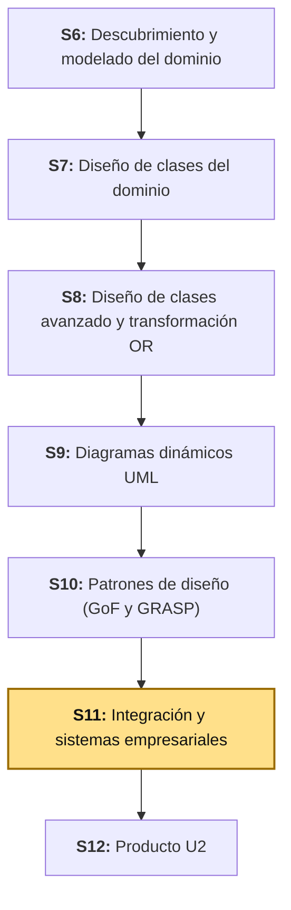
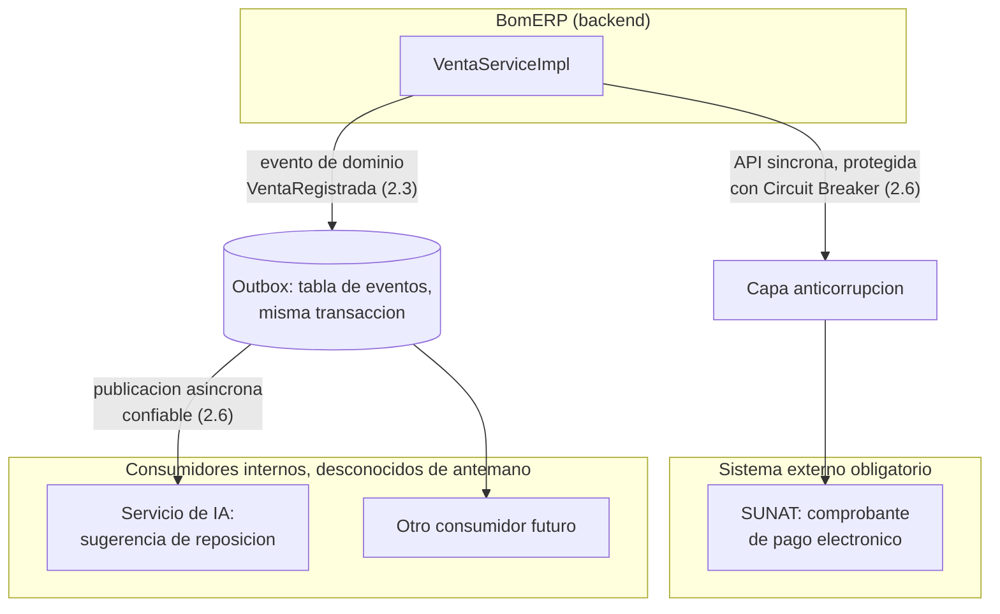
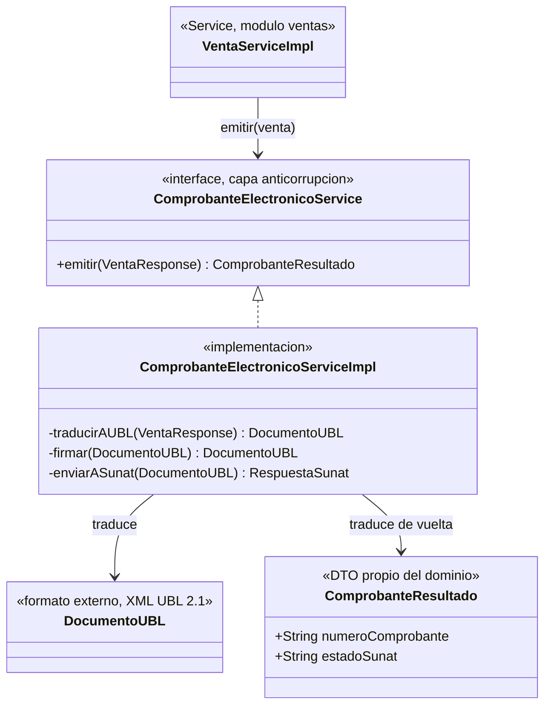

# S11 - Integración y Sistemas Empresariales

## 1. Introducción

Tiempo: 20 min.

### 1.1 Presentación de la sesión

Hasta S10, todas las fronteras que BomERP cruzó fueron internas: `ventas` llamando a `catalogo`, siempre dentro del mismo backend, protegida por `@NamedInterface` y Dependency Injection. Esta sesión cruza la frontera que de verdad importa para un ERP (*Enterprise Resource Planning*) real: la que separa a BomERP del resto del mundo. Una venta registrada en Perú no termina en la base de datos — por ley, tiene que convertirse en un comprobante de pago electrónico y enviarse a SUNAT (*Superintendencia Nacional de Aduanas y de Administración Tributaria*); otros sistemas de la empresa (reposición de inventario, análisis de demanda) necesitan enterarse de que esa venta ocurrió, sin que `ventas` tenga que conocerlos a todos uno por uno. Esta sesión diseña esas dos fronteras — hacia un sistema externo obligatorio y hacia consumidores internos desconocidos de antemano — con los patrones que las protegen de romperse cuando el otro lado falla o cambia.

Esto no es, como S6-S10, una sesión que se queda dentro de los límites que `lp2/bomerp-backend` ya construyó: por el alcance de ADS (Análisis y Diseño de Sistemas de Información) dentro del ciclo —ver la nota de 1.7—, esta sesión diseña infraestructura e integraciones que LP2 (Lenguaje de Programación II) todavía no tiene por qué implementar, y que puede que implemente recién en una sesión futura de ese curso. Diseñar antes de que exista el código es exactamente el mismo patrón ya usado con `Venta.anular()` (S7, S9, S10) — con una frontera distinta: ya no es intra-empresa, es la empresa completa hacia afuera.

El porqué de que una integración sin protección pueda tumbar un sistema entero, aunque el sistema remoto sea el que falla, se desarrolla en 1.6.

### 1.2 Índice

1. APIs externas y servicios de terceros.
2. Eventos de dominio y publicación/suscripción.
3. Integración entre servicios y mensajería asíncrona.
4. Servicios de inteligencia artificial.
5. Patrones de integración: capa anticorrupción, *circuit breaker* y *outbox*.

### 1.3 Propósito de aprendizaje

Al concluir la clase, estarás en condiciones de:

- **Diseñar** la integración de tu proyecto con al menos un sistema externo obligatorio y con consumidores internos desconocidos de antemano, **protegiendo** cada frontera con el patrón de integración correspondiente (capa anticorrupción, *circuit breaker*, *outbox*), y **documentar** qué cruza cada frontera y con qué garantía.

### 1.4 Producto de sesión

Diseño de integración empresarial de `ventas`: contrato conceptual de la integración con SUNAT (comprobante de pago electrónico, formato UBL 2.1, *Unified Business Language*) con su capa anticorrupción, diseño del *circuit breaker* que protege esa llamada, evento de dominio `VentaRegistrada` con su publicación confiable (patrón *Outbox*, el mismo mecanismo que Spring Modulith ya reserva para una sesión futura de LP2), diseño de un consumidor de IA (inteligencia artificial) que se suscribe a ese evento para sugerir reposición de stock, y una matriz de integración que documenta qué cruza cada frontera de la empresa, hacia dónde y con qué patrón protegido.

### 1.5 Metodología

**Tabla 1. Metodología de la sesión**

| Actividades a Realizar en el Periodo | Orientaciones generales (Orientaciones Metodológicas) | Material de estudio recomendado |
|---|---|---|
| Revisión previa individual | Repasar el catálogo completo de patrones GoF y GRASP de `ventas` (S10, Tabla 9) y el contrato REST ya existente del módulo (S8, Tabla 17). Trabajo individual, antes de clase. | S10 (2.7, Indirection/Protected Variations; 2.8, Dependency Injection). |
| Clase presencial | Diseño guiado de la integración con SUNAT, su capa anticorrupción y su *circuit breaker*, del evento de dominio `VentaRegistrada` con publicación confiable, y de un consumidor de IA. Trabajo individual, siguiendo al docente paso a paso; consulta inmediata ante dudas sobre qué patrón corresponde a cada frontera. | Pasos 3.1 a 3.5 de esta guía. |
| Evaluación formativa | Revisión en clase del diseño de la capa anticorrupción y de la matriz de integración completa. La evidencia se completa y sustenta de forma individual, fuera del aula, según los criterios mínimos de la sección 4.4. | Indicaciones de entrega (4.3), rúbrica de evaluación (4.6). |

### 1.6 Motivación de la sesión

#### 1.6.1 Caso: la llamada lenta que Netflix dejó de tolerar

A inicios de la década de 2010, Netflix operaba uno de los sistemas distribuidos más grandes del mundo: cada solicitud de un usuario disparaba docenas de llamadas internas a microservicios distintos. El riesgo que identificaron, documentado en su propio blog de ingeniería, fue este: si **uno solo** de esos servicios empezaba a responder lento —no caído, solo lento—, los hilos (*threads*) que esperaban su respuesta se acumulaban sin liberarse, hasta agotar el *pool* de hilos disponible. Un servicio lento, en vez de fallar solo, terminaba arrastrando a todo el sistema que dependía de él, incluidas partes que no tenían nada que ver con el servicio lento original.

Fuente: Netflix Technology Blog. (2012). *Fault Tolerance in a High Volume, Distributed System*. https://netflixtechblog.com/fault-tolerance-in-a-high-volume-distributed-system-91ab4faae74a

La respuesta de Netflix fue Hystrix, una librería que implementa el patrón **Circuit Breaker** (*interruptor de circuito*, Fowler, 2014): cuando las llamadas a un servicio remoto empiezan a fallar o a demorar más de lo esperado, el circuito "se abre" y las siguientes llamadas fallan de inmediato, sin siquiera intentar contactar al servicio lento — dándole tiempo a ese servicio para recuperarse, en vez de bombardearlo con más tráfico mientras ya está en problemas. Fowler lo resume así: una llamada remota puede fallar o demorar, y cuando varios clientes insisten en contactar a un servicio que no responde, agotan recursos críticos del lado de quien llama, no solo del lado que falló.

Ninguna de las integraciones de S10 (`ventas` llamando a `catalogo`) corre este riesgo: ambos módulos viven en la misma JVM (*Java Virtual Machine*), en el mismo proceso, sin red de por medio. Una llamada a SUNAT sí — es una llamada de red real, a un sistema que BomERP no controla, que puede estar lento, caído o simplemente no responder a tiempo. Diseñar esa llamada sin un *circuit breaker* es exponer a BomERP exactamente al riesgo que Netflix documentó.

**Preguntas de análisis**

**Activación de conocimientos previos**

1. Antes de leer la causa técnica, ¿por qué un servicio **lento** (no caído) puede ser más peligroso para el sistema completo que un servicio que falla de inmediato?

**Comprensión de la integración con sistemas externos**

1. Según el caso, ¿qué diferencia hay entre que SUNAT responda con un error y que SUNAT simplemente no responda nunca? ¿Cuál de los dos es más peligroso para BomERP si no hay ningún límite de tiempo ni *circuit breaker*?
2. En tu propio proyecto, ¿qué sistema externo (de verdad, no inventado) tendría que integrar, y qué pasaría si ese sistema se cayera mientras un usuario está usando tu aplicación?

### 1.7 Ubicación en el curso

- Producto del curso: Diseño Técnico Profesional Documentado.
- Producto de unidad: Catálogo UML con patrones de diseño e integración aplicados.
- Avance del producto en esta sesión: diseño de integración empresarial completo — sistema externo obligatorio, eventos de dominio, consumidor de IA y los patrones de integración que protegen cada frontera.

**Nota sobre el alcance de esta sesión.** ADS es, de los tres cursos del ciclo que comparten BomERP, el que ve el panorama completo de la empresa —infraestructura y sistemas externos—, no solo el backend (LP2) o la base de datos (BD2). Por eso esta sesión diseña una integración con SUNAT y un mecanismo de eventos que LP2 todavía no implementa: ese diseño es la referencia con la que LP2 va a trabajar cuando su propio sílabo llegue a esa funcionalidad, el mismo criterio ya aplicado con `Venta.anular()` desde S7.

**Figura 1. Roadmap del producto de la unidad**



## 2. Explica

Tiempo: 40 min.

### 2.1 Arquitectura de la sesión

**Figura 2. Las dos fronteras que esta sesión diseña**



Lectura del diagrama: hay dos tipos de frontera, con dos formas de protegerse. La llamada a SUNAT es **síncrona y obligatoria** — BomERP necesita la respuesta para continuar, y por eso necesita un *circuit breaker* que falle rápido si SUNAT no responde. La publicación del evento `VentaRegistrada` es **asíncrona y de cardinalidad desconocida** — hoy existe un consumidor de IA, mañana puede haber dos más, y `ventas` no debería tener que cambiar cada vez que aparece uno nuevo; por eso se publica como evento, no como una llamada directa a cada consumidor. Cada apartado siguiente desarrolla una pieza, en el mismo orden del Índice (1.2).

### 2.2 APIs externas y servicios de terceros

Una **API externa** (*Application Programming Interface*) es un contrato que BomERP no controla: su forma, sus reglas de negocio y su disponibilidad las define otra organización, y cambian según el calendario de esa organización, no el de BomERP. La integración con SUNAT es el ejemplo real y obligatorio para cualquier ERP peruano: todo comprobante de pago electrónico se emite como un archivo XML bajo el estándar UBL 2.1 (*Universal Business Language*), firmado digitalmente (X.509 v3) y enviado a SUNAT (directo o a través de un OSE, *Operador de Servicios Electrónicos*), que responde con un CDR (*Comprobante de Recepción*) confirmando o rechazando el comprobante.

Fuente: SUNAT. (2024). *Guía de elaboración de documentos XML - Factura electrónica UBL 2.1*. https://cpe.sunat.gob.pe/sites/default/files/inline-files/guia+xml+factura+version%202-1+1+0%20(2)_0%20(2).pdf

**Tabla 2. Lo que BomERP controla frente a lo que SUNAT impone**

| | BomERP controla | SUNAT impone |
|---|---|---|
| Forma de los datos internos | `Venta`, `DetalleVenta`, con los nombres y tipos que el dominio de S6-S7 ya definió | El XML UBL 2.1, con su propia estructura, sus propios nombres de campo, su propio esquema |
| Cuándo cambia | Cuando el equipo decide evolucionar el dominio | Cuando SUNAT publique una nueva versión del estándar — fuera del control o del calendario de BomERP |
| Disponibilidad | El uptime del backend propio | El uptime de SUNAT, que BomERP no puede garantizar ni influir |

Que BomERP no controle ninguna de las tres filas de la columna derecha es exactamente la razón por la que esta integración necesita los patrones de 2.6: una API externa obligatoria es, por definición, una fuente de cambio y de falla que el diseño tiene que anticipar, no una dependencia más como `catalogo`.

### 2.3 Eventos de dominio y publicación/suscripción

Un **evento de dominio** representa algo que **ya ocurrió** en el negocio y que a otras partes del sistema les interesa saber, aunque no hayan participado en que ocurriera (Evans, 2003). `VentaRegistrada` es ese evento: cuando `VentaServiceImpl.crear` termina con éxito, algo relevante pasó —una venta existe, con sus líneas y su total— y ese hecho puede interesarle a un consumidor que `ventas` nunca necesita conocer por nombre.

**Publicación/suscripción** (*publish/subscribe*) es el patrón de integración donde quien publica un evento no sabe (ni necesita saber) quién lo consume — cualquier número de suscriptores, incluidos consumidores que todavía no existen, puede reaccionar al mismo evento sin que el publicador cambie una sola línea (Hohpe & Woolf, 2003).

**Tabla 3. Llamada directa frente a evento publicado**

| | Llamada directa (S8-S10, `ventas` → `catalogo`) | Evento publicado (`VentaRegistrada`) |
|---|---|---|
| Quién conoce a quién | `ventas` conoce la interfaz de `catalogo` por su nombre | `ventas` no conoce a ningún consumidor del evento |
| Cuántos consumidores | Exactamente uno, fijo en el código | Cero, uno o varios — se agregan sin tocar `ventas` |
| Qué pasa si el consumidor falla | La transacción de `ventas` puede fallar también (están acopladas) | Depende del mecanismo de entrega (2.6, *Outbox*) — el objetivo es que no arrastre a `ventas` |

La llamada a `ProductoService` (S8-S10) sigue siendo correcta tal como está: `ventas` *necesita* la respuesta de `catalogo` para decidir si la venta se completa. `VentaRegistrada` es distinto — ningún consumidor del evento puede impedir que la venta ya registrada exista; por eso es evento, no llamada directa.

### 2.4 Integración entre servicios y mensajería asíncrona

Una integración es **síncrona** cuando quien llama espera la respuesta antes de continuar (la llamada a `ProductoService`, la llamada a SUNAT); es **asíncrona** cuando quien publica continúa sin esperar a que el consumidor procese nada (`VentaRegistrada`). La **mensajería asíncrona** (*asynchronous messaging*) es la infraestructura que hace posible lo segundo: un intermediario (un *broker* de mensajes, o el mecanismo de eventos de Spring Modulith, 2.6) recibe el mensaje y garantiza entregarlo a cada suscriptor, sin que el publicador quede bloqueado esperando a ninguno de ellos.

**Tabla 4. Cuándo cada tipo de integración**

| Tipo | Úsala cuando... | Ejemplo en BomERP |
|---|---|---|
| Síncrona | El resultado de la llamada **cambia** lo que pasa a continuación. | `ProductoService.descontarStock` — si falla, la venta no se completa (S8, RN2). |
| Asíncrona | A quien llama **no le importa** cuándo ni si el consumidor terminó de procesar. | `VentaRegistrada` — la venta ya está completa exista o no un consumidor escuchando. |

**Error frecuente**: hacer síncrona una integración que debería ser asíncrona "para estar seguros de que el consumidor la recibió". Eso reintroduce exactamente el acoplamiento que 2.3 evita — si `ventas` espera una confirmación del servicio de IA antes de responder al usuario, una falla de ese servicio (que no debería importarle a una venta) ahora sí puede tumbar el registro de la venta.

### 2.5 Servicios de inteligencia artificial

Un servicio de IA (inteligencia artificial) se integra, desde el punto de vista de arquitectura, igual que cualquier otro consumidor o proveedor externo — la diferencia está en qué hace con los datos, no en cómo se conecta. Un servicio de **sugerencia de reposición de stock**, por ejemplo, se suscribe a `VentaRegistrada` (2.3): cada vez que una venta descuenta stock, el servicio acumula esa información y, con un modelo entrenado sobre el historial de ventas, sugiere cuándo y cuánto reponer de cada producto — sin que `ventas` sepa que existe, ni que sea IA y no una regla fija la que genera la sugerencia.

**Tabla 5. Dónde encaja un servicio de IA en esta arquitectura**

| Pregunta | Respuesta para el servicio de reposición |
|---|---|
| ¿Síncrono o asíncrono? | Asíncrono — ninguna venta debe esperar a que la IA termine de sugerir nada. |
| ¿Qué consume? | El evento `VentaRegistrada` (2.3), no una llamada directa a `ventas`. |
| ¿Qué patrón lo protege? | El mismo *Outbox* (2.6) que protege a cualquier otro suscriptor del evento. |
| ¿BomERP necesita saber cómo funciona el modelo? | No — es una caja negra desde la arquitectura; solo importa el contrato de entrada (el evento) y de salida (una sugerencia, consumida por otro caso de uso todavía fuera de alcance). |

### 2.6 Patrones de integración: capa anticorrupción, *circuit breaker* y *outbox*

Tres patrones, cada uno protegiendo un riesgo distinto de los dos tipos de frontera de 2.1:

**Capa anticorrupción** (*Anti-Corruption Layer*, Evans, 2003) traduce entre el modelo de un sistema externo y el modelo propio, para que el vocabulario y la estructura de datos del externo nunca se filtren al dominio. `Venta` nunca debe tener un campo que se llame igual que una etiqueta del XML UBL de SUNAT — existe una clase intermedia que traduce `VentaResponse` a ese XML, y nada más que esa clase conoce el formato de SUNAT.

**Circuit Breaker** (Fowler, 2014; 1.6) protege contra un sistema externo que falla o se vuelve lento: monitorea los fallos de una llamada protegida y, al superar un umbral, "abre" el circuito — las siguientes llamadas fallan de inmediato, sin intentar la llamada real, hasta que un temporizador permite una llamada de prueba para ver si el sistema externo se recuperó.

**Tabla 6. Los tres estados de un Circuit Breaker**

| Estado | Comportamiento | Transición |
|---|---|---|
| Cerrado | Las llamadas pasan normalmente a SUNAT. | Si los fallos superan el umbral → Abierto. |
| Abierto | Las llamadas fallan de inmediato, sin contactar a SUNAT. | Después de un tiempo de espera → Semiabierto. |
| Semiabierto | Se permite **una** llamada de prueba. | Si tiene éxito → Cerrado; si falla → Abierto de nuevo. |

**Outbox** (Richardson, 2018) resuelve un problema distinto: ¿cómo se garantiza que un evento se publique si, y solo si, el cambio que lo origina de verdad se guardó? Guardar la venta en la base de datos y publicar `VentaRegistrada` en un *broker* son dos operaciones separadas — si la primera tiene éxito y la segunda falla, el evento se pierde para siempre; si ocurre al revés, se publica un evento de una venta que nunca existió. *Outbox* resuelve esto guardando el evento en una tabla de la **misma** base de datos, dentro de la **misma** transacción que guarda la venta — un proceso aparte, después, se encarga de tomar esos eventos pendientes y publicarlos, reintentando si hace falta, sin arriesgar nunca la atomicidad entre "la venta existe" y "el evento quedó registrado para publicarse".

Esto no es un patrón hipotético para BomERP: Spring Modulith (el framework ya elegido en ADR-002 de LP2) implementa exactamente este patrón con su propia tabla `event_publication` — hoy removida a propósito del `pom.xml` de LP2 porque ningún módulo publica eventos todavía (LP2, nota de arquitectura), reservada para cuando una sesión futura de ese curso adopte comunicación por eventos. El diseño de esta sesión es, literalmente, la especificación de esa sesión futura.

## 3. Aplica: actividad práctica guiada

Tiempo: 100 min.

**Actividad:** diseño de la integración empresarial completa de `ventas`: la llamada obligatoria a SUNAT protegida con capa anticorrupción y *circuit breaker*, el evento de dominio `VentaRegistrada` con publicación confiable, un consumidor de IA, y la matriz que documenta ambas fronteras.

**Propósito de la actividad:** aplicar los patrones de integración de 2.6 a un caso real y obligatorio (SUNAT) y a un caso de cardinalidad abierta (consumidores del evento), con el mismo nivel de rigor que S8-S10 ya aplicaron a las fronteras internas.

**Orientaciones metodológicas:** en el laboratorio, el docente diseña la integración de `ventas` paso a paso frente a la clase; los estudiantes repiten cada paso sobre al menos un sistema externo real de su propio proyecto (ver sección 4).

**Actividades para realizar:**

- **3.1** Diseñar la integración con SUNAT y su capa anticorrupción.
- **3.2** Proteger la llamada con un *Circuit Breaker*.
- **3.3** Diseñar el evento de dominio `VentaRegistrada` y su publicación confiable.
- **3.4** Diseñar el consumidor de IA.
- **3.5** Armar la matriz de integración.

### 3.1 Diseñar la integración con SUNAT y su capa anticorrupción

**Producto del paso:** el contrato conceptual de la integración, con la clase anticorrupción que aísla a `ventas` del formato de SUNAT.

**Figura 3. Capa anticorrupción entre `ventas` y SUNAT**



Dos traducciones, no una: `traducirAUBL` convierte el lenguaje de BomERP al de SUNAT (antes de salir), y el resultado de SUNAT (el CDR, *Comprobante de Recepción*, con su propio formato) se traduce de vuelta a `ComprobanteResultado` — un DTO (*Data Transfer Object*, S8) propio del dominio de BomERP, con solo lo que `ventas` necesita (`numeroComprobante`, `estadoSunat`). Ni `VentaServiceImpl` ni `Venta` importan jamás una clase con el nombre de un campo UBL.

**Error frecuente**: devolver el CDR de SUNAT directamente como respuesta de `VentaServiceImpl`, "para no tener que mapear dos veces". Si el formato de SUNAT cambia (una nueva versión de UBL, por ejemplo), ese cambio se propagaría directo hasta el dominio de `ventas` — exactamente lo que la capa anticorrupción existe para evitar.

### 3.2 Proteger la llamada con un *Circuit Breaker*

**Producto del paso:** el diseño del *circuit breaker* que envuelve `enviarASunat`, con su umbral y su `fallback`.

**Tabla 7. Configuración del *Circuit Breaker* de la integración con SUNAT**

| Parámetro | Valor propuesto | Justificación |
|---|---|---|
| Umbral de fallos | 5 fallos consecutivos | Suficiente para distinguir una falla pasajera de un problema real de SUNAT, sin tardar demasiado en reaccionar. |
| Tiempo en estado Abierto | 30 segundos | Tiempo razonable para que un problema transitorio de red se resuelva, sin bloquear al usuario por minutos. |
| *Fallback* (qué responder mientras el circuito está Abierto) | Guardar la venta igual, marcando el comprobante como "pendiente de emisión", y reintentar más tarde (proceso aparte, fuera de la petición del usuario). | La ley exige emitir el comprobante, pero no exige que la venta **espere** a SUNAT para completarse — emitir el comprobante y registrar la venta son responsabilidades distintas (2.4). |

El *fallback* es la decisión de diseño más importante de este paso: un *circuit breaker* sin un *fallback* pensado simplemente cambia un error lento por un error rápido — sigue siendo un error. El *fallback* elegido aquí convierte una falla externa (SUNAT caída) en una degradación controlada (la venta se completa, el comprobante queda pendiente) en vez de en una falla total (la venta no se puede registrar porque un sistema de terceros está lento).

### 3.3 Diseñar el evento de dominio `VentaRegistrada` y su publicación confiable

**Producto del paso:** la forma del evento y el mecanismo que garantiza que, si la venta se guardó, el evento también quedó registrado para publicarse (2.6, *Outbox*).

```java
// VentaRegistrada.java — evento de dominio, pseudocodigo de diseño
public record VentaRegistrada(
    Long ventaId,
    List<Long> productoIds,
    BigDecimal total,
    LocalDateTime fecha
) {}
```

```text
// VentaServiceImpl.crear(request) — version con publicacion de evento, misma transaccion
crear(request):
    // ... todo lo de S8 3.3: validar productos, descontar stock, armar detalles ...
    ventaGuardada = ventaRepository.guardar(venta)
    publicarEvento(new VentaRegistrada(ventaGuardada.id, productoIds, total, fecha))
    // Spring Modulith (2.6) escribe el evento en su tabla event_publication
    // DENTRO de la misma transaccion que el guardar() de arriba — Outbox
    devolver ventaMapper.toResponse(ventaGuardada)
```

El evento se publica **dentro** del mismo método transaccional que guarda la venta — ninguna línea nueva de coordinación manual hace falta, porque Spring Modulith ya implementa el patrón *Outbox* (2.6) a nivel de framework: si la transacción se revierte (por ejemplo, RN2 de S8 falla a mitad del bucle), el evento tampoco se publica, porque ambas escrituras viven en la misma unidad atómica.

### 3.4 Diseñar el consumidor de IA

**Producto del paso:** el contrato del consumidor que se suscribe a `VentaRegistrada` sin que `ventas` lo conozca.

```java
// SugerenciaReposicionListener.java — modulo nuevo, previsto, pseudocodigo
@ApplicationModuleListener
void onVentaRegistrada(VentaRegistrada evento) {
    para cada productoId en evento.productoIds():
        servicioIA.registrarMovimiento(productoId, fecha: evento.fecha())
    // El modelo de IA, entrenado aparte, usa este historial acumulado
    // para sugerir cuando y cuanto reponer -- fuera del alcance de esta sesion
}
```

`@ApplicationModuleListener` (Spring Modulith) es la anotación que conecta un método con un evento publicado por otro módulo, sin que el módulo publicador (`ventas`) importe ni conozca el módulo que escucha — la misma garantía de 2.3 (publicación/suscripción), ahora expresada en el framework real que el proyecto ya eligió.

**Error frecuente**: hacer que `SugerenciaReposicionListener` llame de vuelta a `VentaService` para pedir más datos de la venta. El evento (3.3) ya debe llevar todo lo que un consumidor razonable necesita (`productoIds`, `total`, `fecha`) — si un consumidor necesita llamar de vuelta al publicador para completar su trabajo, el acoplamiento que 2.3 quiso evitar se reintrodujo por la puerta de atrás.

### 3.5 Armar la matriz de integración

**Producto del paso:** documentación completa de ambas fronteras — qué cruza, hacia dónde, protegido por qué patrón.

**Tabla 8. Matriz de integración empresarial de `ventas`**

| Qué cruza la frontera | Dirección | Tipo | Patrón que la protege |
|---|---|---|---|
| Comprobante de pago electrónico (UBL 2.1) | BomERP → SUNAT | Síncrona, obligatoria | Capa anticorrupción (3.1) + Circuit Breaker (3.2) |
| `VentaRegistrada` | BomERP → consumidores internos (cardinalidad abierta) | Asíncrona | Outbox (3.3) |
| Sugerencia de reposición | Servicio de IA → (consumo futuro, fuera de alcance) | Asíncrona | No corresponde a esta sesión — `ventas` no participa de este lado de la integración |
| `ProductoService` (S8-S10, referencia) | `ventas` → `catalogo` | Síncrona, interna | Protected Variations (S10) — no capa anticorrupción, porque ambos lados son del mismo dominio BomERP |

La última fila es deliberada: no toda integración necesita una capa anticorrupción — solo la que cruza hacia un modelo **ajeno** al de BomERP (SUNAT). `catalogo` habla el mismo lenguaje ubicuo que `ventas` (S6); traducir entre ellos sería trabajo innecesario, por eso S10 resolvió esa frontera con Protected Variations, no con Anti-Corruption Layer.

**Evidencia de aprendizaje:**

- Diseño conceptual de la integración con SUNAT, con su capa anticorrupción documentada.
- Configuración justificada del *Circuit Breaker*, con su *fallback* explícito.
- Evento de dominio `VentaRegistrada` diseñado, con su publicación confiable (*Outbox*, vía Spring Modulith).
- Consumidor de IA diseñado, suscrito al evento sin acoplarse de vuelta al publicador.
- Matriz de integración completa, con el patrón correcto para cada frontera (y la justificación de por qué una frontera interna no necesita capa anticorrupción).

## 4. Crea: actividad autónoma

Tiempo: 2h fuera del aula.

### 4.1 Actividad

Diseño de integración empresarial del proyecto propio del equipo, documentado en evidencia individual.

Completa y evidencia estas tareas:

1. Identificar al menos un sistema externo **real** (no inventado) con el que tu proyecto necesitaría integrarse, y diseñar su capa anticorrupción: qué formato ajeno traduce, y qué DTO propio expone en su lugar.
2. Diseñar el *Circuit Breaker* de esa integración, con su umbral, su tiempo de espera y, sobre todo, un *fallback* justificado — qué hace tu sistema mientras el externo no responde.
3. Diseñar al menos un evento de dominio propio, con los datos que lleva, y explicar por qué se publica como evento y no como llamada directa (criterio de 2.3-2.4).
4. Diseñar un consumidor de ese evento (de IA, o de cualquier otro tipo) que no necesite llamar de vuelta al publicador para completar su trabajo.
5. Armar tu propia matriz de integración, como la Tabla 8, incluyendo al menos una frontera interna (para justificar por qué no necesita capa anticorrupción) y una externa.

### 4.2 Propósito

Que cada estudiante demuestre, de forma individual y fuera del aula, que puede diseñar la integración de su propio sistema con el exterior, protegiendo cada frontera con el patrón correspondiente a su riesgo real, sin el acompañamiento del docente.

### 4.3 Indicaciones

Entrega un PDF con el siguiente nombre:

```text
S11_ADS_Equipo##_ApellidoNombre.pdf
```

Cada captura de pantalla del informe debe mostrar, sin recortar, el reloj del sistema (fecha y hora) y tu usuario o foto de perfil (Windows, VS Code o navegador) visibles en pantalla — es lo que permite verificar que la evidencia es tuya y que corresponde al momento real de tu trabajo.

#### 4.3.1 Estructura del informe

**Datos del estudiante**

- Nombre:
- Equipo:
- Sesión: S11 - Integración y Sistemas Empresariales
- Rol o aporte realizado:
- Link de GitHub:

**Evidencia técnica**

Incluye capturas o extractos con una breve explicación debajo de cada uno, organizados en los mismos 4 bloques de la rúbrica (4.6):

1. *Integración con sistema externo y capa anticorrupción*
    - El sistema externo real elegido, su contrato conceptual y la clase anticorrupción que lo aísla del dominio.
2. *Circuit Breaker*
    - Configuración (umbral, tiempo de espera) y *fallback* justificado.
3. *Evento de dominio y consumidor*
    - El evento diseñado, con su justificación de por qué es asíncrono, y el consumidor que lo escucha.
4. *Matriz de integración*
    - Matriz completa, con al menos una frontera interna y una externa, cada una con su patrón correcto.

**Error o hallazgo**

Describe un error real: un dato del sistema externo que casi se filtró directo al dominio sin traducir, un *fallback* que al principio no tenía sentido de negocio (por ejemplo, "reintentar indefinidamente"), o un evento que diseñaste primero como llamada directa y tuviste que replantear.

**Reflexión técnica breve**

Responde en 5 a 8 líneas:

```text
¿Qué pasaría en tu propio sistema si el sistema externo que elegiste
se cayera durante dos horas, y tu integración no tuviera ningún
Circuit Breaker ni fallback? Relaciona tu respuesta con el caso de
Netflix (1.6).
```

### 4.4 Criterios mínimos de aceptación

- El archivo respeta el nombre solicitado.
- El sistema externo elegido es real (no inventado), con su capa anticorrupción documentada.
- El *Circuit Breaker* tiene umbral, tiempo de espera y un *fallback* con sentido de negocio, no genérico.
- El evento de dominio está justificado como asíncrono (criterio de 2.3-2.4), no como una llamada directa disfrazada.
- El consumidor del evento no llama de vuelta al publicador para completar su trabajo.
- La matriz de integración incluye al menos una frontera interna y una externa, cada una con el patrón correspondiente justificado.
- Cada captura de la evidencia técnica muestra el reloj del sistema y el usuario/perfil visible, sin recortar.
- Las fechas y horas de las capturas son coherentes con el historial de commits de su repositorio en GitHub.
- Incluye un error o hallazgo técnico diagnosticado.
- Incluye la reflexión técnica breve solicitada.

### 4.5 Preguntas de defensa

1. ¿Por qué tu integración con el sistema externo necesita una capa anticorrupción, y tu integración interna (si la tienes) no?
2. ¿Qué le pasaría a tu sistema si tu *Circuit Breaker* no tuviera ningún *fallback*, solo un error genérico?
3. ¿Por qué tu evento de dominio se publica en vez de llamarse directamente? ¿Qué perderías si lo volvieras síncrono?
4. ¿Qué pasaría si dos consumidores distintos de tu evento necesitaran información que el evento no lleva?
5. ¿Por qué `VentaRegistrada` se publica dentro de la misma transacción que guarda la venta, y no después?
6. Relaciona el caso de Netflix (1.6) con qué pasaría en tu propio sistema si el sistema externo elegido respondiera lento en vez de caerse de inmediato.

### 4.6 Rúbrica de evaluación

**Tabla 9. Rúbrica de evaluación**

| Criterio | Peso (%) | A (20 pts) | B (15 pts) | C (10 pts) | D (5 pts) | Nivel obtenido |
|---|---:|---|---|---|---|---:|
| 1. Integración con sistemas externos y capa anticorrupción* | 25 | Sistema externo real, con capa anticorrupción completa que aísla el dominio de su formato. | Integración real, con la capa anticorrupción incompleta (algún dato externo se filtra). | Sistema externo inventado o sin ninguna traducción de formato. | No presenta integración con sistema externo. | |
| 2. Circuit Breaker* | 25 | Umbral, tiempo de espera y *fallback* con sentido de negocio real, justificado. | Configuración completa, con el *fallback* genérico o poco justificado. | Circuit Breaker mencionado sin configuración concreta. | No presenta diseño de Circuit Breaker. | |
| 3. Evento de dominio y consumidor* | 25 | Evento bien justificado como asíncrono, consumidor que no llama de vuelta al publicador. | Evento correcto, con algún acoplamiento menor hacia el publicador. | Evento que en realidad debería ser una llamada síncrona, mal justificado. | No presenta evento ni consumidor. | |
| 4. Matriz de integración* | 25 | Matriz completa, con al menos una frontera interna y una externa, cada patrón correctamente justificado. | Matriz completa, con alguna justificación superficial. | Matriz incompleta o con el patrón equivocado para alguna frontera. | No presenta matriz de integración. | |

\* Agregado manual.

Nota final = suma de (`Peso` / 100 × `Puntos del nivel obtenido`) = ____ / 20.

Para usar la rúbrica con IA (inteligencia artificial), solicita:

```text
Evalúa el PDF usando la rúbrica de la sesión.
Para cada criterio selecciona el nivel obtenido usando la escala A=20, B=15, C=10, D=5 puntos.
Justifica brevemente cada nivel asignado.
Verifica que cada captura muestre reloj del sistema y usuario/perfil visible, y que las fechas sean coherentes con el historial de commits de GitHub. Si falta esta evidencia o hay inconsistencias, indícalo explícitamente antes de calificar.
Calcula la nota final con la fórmula: suma de (Peso/100 × Puntos del nivel obtenido), directamente sobre 20.
Indica 2 fortalezas y 2 recomendaciones.
```

## 5. Cierre

Tiempo: 5 min.

**Resumen breve:** hoy BomERP cruzó, por primera vez, su propia frontera hacia el exterior: una integración obligatoria con SUNAT, aislada del dominio por una capa anticorrupción y protegida de fallas remotas por un *Circuit Breaker* con un *fallback* que tiene sentido de negocio real; y una integración de cardinalidad abierta —el evento `VentaRegistrada`, publicado de forma confiable con el mismo patrón *Outbox* que Spring Modulith ya reserva para una sesión futura de LP2— que permite agregar consumidores (como el servicio de IA de reposición) sin que `ventas` tenga que cambiar. La matriz final dejó claro que no toda frontera necesita el mismo patrón: la interna (`catalogo`) se protege distinto que la externa (SUNAT), porque el riesgo real es distinto.

**Dinámica participativa:** en una ronda rápida, cada estudiante comparte en una frase qué sistema externo real eligió para su propio proyecto, y qué pasaría si se cayera.

**Metacognición:** ¿qué te costó más entender hoy: por qué una integración interna no necesita capa anticorrupción, o cómo diseñar un *fallback* que de verdad tenga sentido de negocio y no sea solo "mostrar un error"?

**Proyección:** S12 integra todo el diseño dinámico de la unidad —diagramas, patrones e integraciones— en el Catálogo UML completo que se presenta y sustenta como producto de la Unidad II.

## Bibliografía

1. Netflix Technology Blog. (2012). *Fault Tolerance in a High Volume, Distributed System*. https://netflixtechblog.com/fault-tolerance-in-a-high-volume-distributed-system-91ab4faae74a
2. Fowler, M. (2014). *CircuitBreaker*. martinfowler.com. https://martinfowler.com/bliki/CircuitBreaker.html
3. SUNAT. (2024). *Guía de elaboración de documentos XML - Factura electrónica UBL 2.1*. https://cpe.sunat.gob.pe/sites/default/files/inline-files/guia+xml+factura+version%202-1+1+0%20(2)_0%20(2).pdf
4. Evans, E. (2003). *Domain-Driven Design: Tackling Complexity in the Heart of Software*. Addison-Wesley.
5. Hohpe, G., & Woolf, B. (2003). *Enterprise Integration Patterns: Designing, Building, and Deploying Messaging Solutions*. Addison-Wesley.
6. Richardson, C. (2018). *Microservices Patterns: With examples in Java*. Manning Publications.
