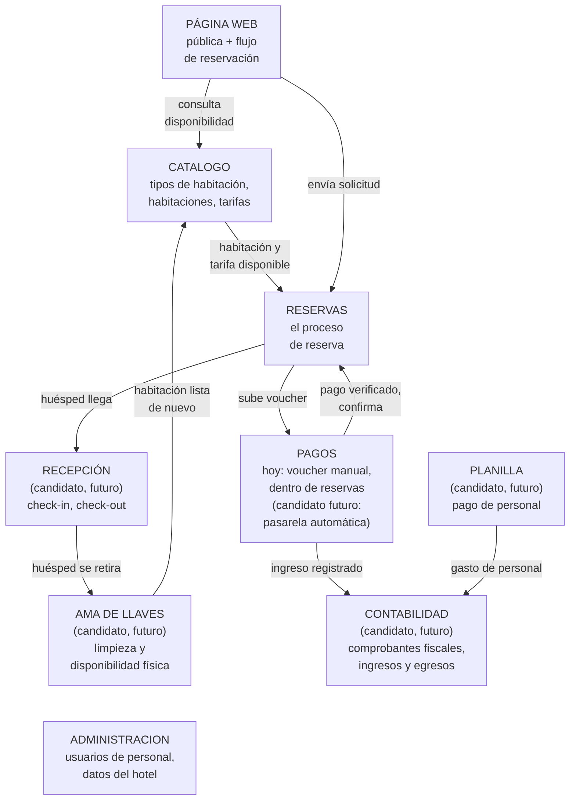
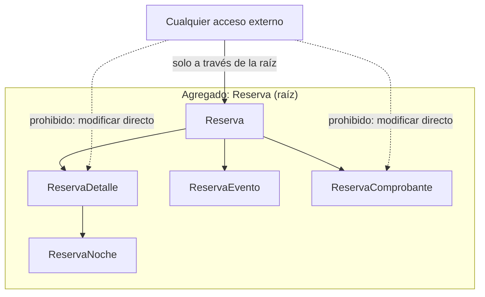
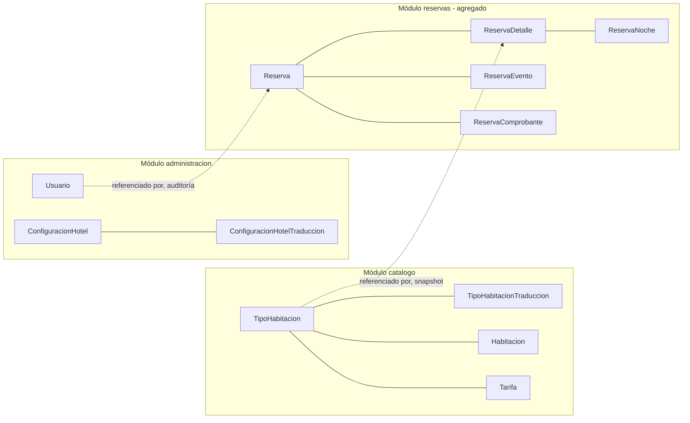
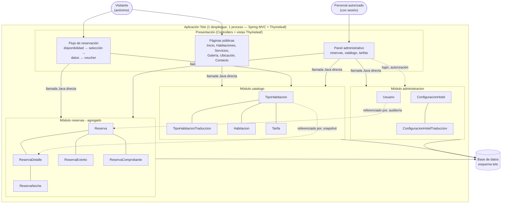

# Telo — Descubrimiento y modelado del dominio (aplicación de S6)

**Este documento aplica la metodología de [S6 - Descubrimiento y Modelado del Dominio](sesiones/S06_Descubrimiento_Modelado_Dominio.md) a un sistema real: Telo, reservas de habitaciones.** Fuente: `alcance-v1.md` (Alcance V1 del proyecto). No es una plantilla del curso — es un ejercicio resuelto, útil como segundo ejemplo real además de BomERP.

Telo es, a propósito, un caso **mixto** — el más realista de los dos: `alcance-v1.md` ya documenta con detalle las entidades de tres módulos (`reservas`, `catalogo`, `administracion`), pero el negocio completo de un hotel tiene más partes que ese alcance todavía no especifica. Por eso este ejercicio no arranca en las entidades documentadas: arranca en el panorama completo del hotel (sección 1), igual que S06, y recién en la sección 3 baja a las entidades — solo donde el alcance ya las da.

## 1. Panorama holístico del negocio y módulos candidatos

El panorama no se arma copiando el flujo de BomERP y cambiándole los nombres — un hotel no compra materia prima ni produce nada que empaquetar. Un hotel vende **estadías**, y su ciclo real es otro: una habitación se reserva, se ocupa (check-in), se libera (check-out) y se limpia antes de volver a estar disponible para una reserva nueva. Ese ciclo, propio de la hospitalidad, es lo que da forma al panorama, no una plantilla genérica de ERP.

**Figura 1. Panorama holístico de Telo: el ciclo de la habitación, sin entidades todavía**

`Administracion` no aparece conectada al ciclo — igual que `Seguridad` en BomERP, no participa de la operación diaria del hotel, la sostiene de forma transversal (cuentas de personal, datos propios del hotel). `PaginaWeb` tampoco es un módulo de dominio: es el canal por el que entra el visitante (la sección "Web pública" del alcance) — se detalla en la sección 9, no se clasifica como subdominio en la Tabla 1.

`Pagos` merece una aclaración aparte: el alcance es explícito en que la reservación **sí** incluye pagos desde V1 — el visitante sube un voucher (Yape o depósito) o lo envía por WhatsApp, y el personal lo verifica antes de confirmar (`alcance-v1.md`, sección "Reservaciones", pasos 6-7). Lo que queda **fuera de alcance de V1** es la automatización de ese cobro: una pasarela de pagos en línea que confirme el pago sin intervención manual (`alcance-v1.md`, "Fuera de alcance": *"...aplicación móvil, API pública y pasarela de pagos"*). Por eso `Pagos` aparece en el panorama con las dos caras a la vez — el paso manual que ya existe hoy (y que la sección 3 encuentra modelado en `ReservaComprobante`, dentro de `reservas`) y el candidato futuro (pasarela automática) que todavía no tiene alcance escrito, igual que `recepcion` o `ama_llaves`.

De los siete módulos candidatos de dominio, `alcance-v1.md` solo detalla entidades para tres — `reservas`, `catalogo` y `administracion` — porque V1 es explícitamente un motor de reservas en línea, no un sistema de gestión hotelera completo (un PMS): no cubre todavía lo que pasa cuando el huésped llega físicamente al hotel. `recepcion` y `ama_llaves` son la continuación natural del mismo ciclo (check-in/check-out, limpieza) que un PMS real sí resuelve; `contabilidad` y `planilla` son necesidades administrativas de cualquier negocio, no solo de hotelería. Ninguno de los cuatro tiene todavía un documento de alcance propio — quedan nombrados como candidatos, el mismo tratamiento que BomERP le da a `inventario`, `compras` y `seguridad` en S6 (2.2-2.3).

**Con qué técnica se llegó a estos cuatro candidatos, y por qué importa decirlo.** S6 (2.2) nombra tres formas legítimas de construir un panorama: juicio de experto, Event Storming (taller en vivo con post-its) o benchmarking contra un sistema de referencia. Este ejercicio no tuvo ni un hotel real ni personal disponible para un taller — no hay Event Storming detrás de `recepcion`, `ama_llaves`, `contabilidad` ni `planilla`. Salieron de **benchmarking**: comparar lo que `alcance-v1.md` sí cubre (un motor de reservas en línea) contra lo que un sistema de gestión hotelera (PMS) resuelve típicamente en la industria — front desk, housekeeping, facturación, planillas. Es la técnica más débil de las tres, y por eso se declara así: estos cuatro son una **hipótesis razonada, no un hecho confirmado por el negocio real de Telo**. Un proyecto real, con el hotel operando, resolvería esta misma pregunta con juicio de experto (preguntar al personal) o, mejor, con un taller de Event Storming.

**Error frecuente**: reutilizar el panorama de otro negocio cambiando solo los nombres de los módulos — un hotel no tiene "almacén" en el sentido en que lo tiene una empresa que compra y revende productos; su ciclo operativo es la habitación, no el inventario. El panorama debe salir del negocio real que se está modelando, no de una plantilla. Otro error igual de común es el opuesto: omitir del panorama un paso que sí ocurre hoy (los pagos) solo porque su versión automatizada está fuera de alcance — que la pasarela sea futura no significa que el negocio no cobre desde ya.

## 2. Clasificación de subdominios

**Tabla 1. Subdominios de Telo**

| Módulo candidato | Tipo de subdominio | Por qué |
|---|---|---|
| `reservas` | **Core** (el negocio mismo) | Ahí vive la complejidad real: disponibilidad por noche, bloqueos, idempotencia, vencimiento automático — la razón de ser del sistema hoy. |
| `catalogo` | Supporting | Necesario para que exista algo que reservar y a qué precio, pero no es el diferenciador — cualquier sistema de reservas tiene tipos, habitaciones y tarifas. |
| `administracion` | **Generic** (problema ya resuelto) | Autenticación de personal y datos del hotel — no es el negocio de reservar ni hospedar, es infraestructura de soporte. |
| `pagos` (embebido en `reservas` hoy) | **Generic** (problema ya resuelto) | Verificar un pago no diferencia a Telo — cualquier pasarela de terceros ya lo resuelve. Se modela hoy dentro de `reservas` (sección 3, `ReservaComprobante`) precisamente porque V1 excluye integrar una pasarela automática; no es todavía un módulo aparte. |
| `recepcion` (candidato) | **Core** (el negocio mismo) | El check-in y el check-out son tan centrales a la experiencia del huésped como la reserva misma — completan el ciclo de la estadía que hoy `reservas` deja a medias. |
| `ama_llaves` (candidato) | Supporting | Sostiene que la habitación esté realmente disponible, pero la lógica de limpieza y turnos es parecida entre hoteles — no es lo que diferencia a Telo. |
| `contabilidad` (candidato) | **Generic** (problema ya resuelto) | Registrar ingresos y egresos no diferencia a Telo de ningún otro hotel — es un problema que software contable ya resuelve. |
| `planilla` (candidato) | **Generic** (problema ya resuelto) | Pagar personal es un proceso estándar de cualquier empleador, no algo propio del negocio de hospedaje. |

Un subdominio **Core** justifica el mayor esfuerzo de modelado — coherente con que la Sección E del alcance (concurrencia e idempotencia) dedica más reglas a `reservas` que a cualquier otro módulo junto. Que `contabilidad` y `planilla` sean Generic es, además, una señal de diseño real: en un proyecto fuera del aula, ninguno de los dos se construiría desde cero — se integraría un software contable o de planillas ya existente en el mercado, en vez de construirlo a mano.

**Aclaración necesaria: `administracion` (módulo de dominio) no es lo mismo que "Administración" (la sección del alcance).** El alcance usa "Administración" para nombrar una pantalla — el panel donde el personal "consulta reservas, confirma o cancela, y administra habitaciones, tipos de habitación y tarifas" — es decir, una vista de presentación que toca `reservas` y `catalogo` además de `Usuario`. El módulo de dominio `administracion` de esta sección es más angosto a propósito: solo `Usuario` y `ConfiguracionHotel`, las dos únicas entidades que no tienen mejor lugar en `reservas` ni en `catalogo`. Confundir el nombre de una pantalla con un límite de dominio es un error real y frecuente — aquí se evita dejándolo explícito, no cambiando el nombre.

## 3. Entidades y reglas de negocio, dentro de cada módulo

Solo `reservas`, `catalogo` y `administracion` tienen hoy una especificación escrita — `alcance-v1.md` — de la que se pueden extraer entidades con precisión. Se descienden esos tres, módulo por módulo:

**Tabla 2. Entidades de Telo, con su regla de negocio más representativa**

| Módulo | Entidad | Identificador | Regla de negocio asociada |
|---|---|---|---|
| `catalogo` | `TipoHabitacion` | id | Código único; capacidad máxima positiva. |
| `catalogo` | `Habitacion` | id | Pertenece a un tipo; `habilitada` define si es inventario vendible. |
| `catalogo` | `Tarifa` | id | Como máximo una tarifa activa por tipo y noche; una versión publicada no se sobrescribe, solo se retira. |
| `catalogo` | `TipoHabitacionTraduccion` | (`tipo_habitacion_id`, `idioma`) | Publicar un tipo exige traducción completa en español e inglés — no se publica a medias en un solo idioma. |
| `reservas` | `Reserva` | id (+ `referencia_publica`) | Salida posterior a llegada; huéspedes positivo; el total es la suma de sus detalles. |
| `reservas` | `ReservaDetalle` | id | Los huéspedes de esa unidad no exceden la capacidad del tipo solicitado. |
| `reservas` | `ReservaNoche` | (`reserva_detalle_id`, fecha) | Exactamente una fila por cada noche del intervalo solicitado, con tarifa vigente esa noche. |
| `reservas` | `ReservaEvento` | id | Se registra en la misma transacción que el cambio que describe — nunca se edita después. |
| `reservas` | `ReservaComprobante` | id | Solo cuenta como recibido a tiempo si `recibido_en` es anterior al plazo (`voucher_limite_en`). |
| `administracion` | `Usuario` | id | Login único; autoriza operaciones administrativas. |
| `administracion` | `ConfiguracionHotel` | id (fija en 1) | Como máximo una fila — un solo hotel en V1. |
| `administracion` | `ConfiguracionHotelTraduccion` | (`hotel_id`, `idioma`) | Publicar el contenido del hotel exige traducción completa en español e inglés. |

El idioma no es un módulo aparte ni una entidad propia: es un **requisito transversal del negocio** (`alcance-v1.md`, "Web pública": *"La experiencia pública y el proceso de reservación estarán disponibles en español e inglés"*), y se resuelve dentro de cada módulo que publica contenido — `catalogo` traduce sus tipos de habitación, `administracion` traduce los datos del hotel — mediante una tabla de traducción por clave compuesta (entidad + idioma), no mediante un catálogo de idiomas independiente. Pasa la prueba de tres partes de forma trivial: una traducción no tiene sentido sin la entidad que traduce (1), no se reutiliza entre entidades distintas (2), y no protege ningún invariante propio más allá de "completa antes de publicar" (3) — por eso compone dentro de `catalogo`/`administracion`, nunca aparte.

**`Huesped` no aparece en esta tabla a propósito: no es una entidad.** El propio alcance lo dice explícito: *"Objeto de valor embebido en reserva — no se requiere maestro de clientes, cuentas ni deduplicación en V1."* Se compara por su contenido (nombre, email, teléfono), no tiene identidad propia ni ciclo de vida independiente de la reserva que lo registró — es objeto de valor (ver sección 5), el mismo concepto que `Dinero` en BomERP, resuelto aquí con datos reales de un proyecto real.

`recepcion`, `ama_llaves`, `contabilidad` y `planilla` **todavía no tienen entidades**: sus entidades tentativas (`Estadia`/`Checkin`, `EstadoLimpieza`, `Factura`/`AsientoContable`, `Boleta`/`Empleado`) esperan a que exista un alcance escrito para ese módulo — el mismo tratamiento que BomERP da hoy a `MovimientoStock` (`inventario`), `OrdenCompra`/`Proveedor` (`compras`) y `Usuario`/`Rol` (`seguridad`) en su propia S6.

## 4. Casos de uso relevantes

**Tabla 3. Casos de uso relevantes de Telo**

| Módulo | Caso de uso | Valor para el negocio |
|---|---|---|
| `catalogo` | Consultar disponibilidad por fechas | Mostrar al visitante qué se puede reservar. |
| `catalogo` | Bloquear tipo de habitación para editar tarifa | Evitar vender a un precio que está cambiando en ese momento. |
| `reservas` | Registrar reserva | Comprometer cupo con un huésped, sin exigir pago inmediato. |
| `reservas` | Subir comprobante de pago | Adjuntar evidencia de pago dentro del plazo pactado. |
| `reservas` | Confirmar reserva | Aprobar el comprobante y pasar la reserva a estado definitivo. |
| `reservas` | Vencer reserva automáticamente | Liberar cupo de una reserva sin voucher a tiempo. |
| `administracion` | Registrar usuario de personal | Habilitar a un miembro del personal para operar el panel. |

## 5. Objetos de valor

**Tabla 4. Objetos de valor de Telo**

| Objeto de valor | Reemplaza a | Por qué es objeto de valor |
|---|---|---|
| `Huesped` | Un maestro de clientes con `Cliente_id` | Se compara por su contenido (nombre, email, teléfono); no necesita historial propio ni deduplicación en V1 — decisión explícita del alcance, no un descuido. |
| `Dinero` (monto + moneda `PEN`) | `BigDecimal` suelto en `Tarifa`, `Reserva`, `ReservaDetalle`, `ReservaNoche` | Todo importe se maneja con la misma regla (base = total ÷ 1.18, redondeo `HALF_UP`) — encapsular esa regla en un solo lugar evita repetirla en cuatro tablas distintas. |
| `RangoFecha` (llegada, salida) | Dos columnas sueltas `llegada`/`salida` | Se compara por contenido; agrupa su propia validación (`salida` posterior a `llegada`) en un solo lugar, igual que el `RangoFecha` de BomERP. |

**Contraste con BomERP, a propósito:** en BomERP, `Cliente` se promovió a entidad y módulo propio. Aquí, `Huesped` se queda como objeto de valor. La prueba es la misma en ambos casos — lo que cambia es el resultado real de aplicarla: BomERP sí necesita rastrear historial y estado de un cliente (suspensión, fidelización); Telo, en su propio alcance V1, declara explícitamente que no. Misma metodología, dos respuestas distintas, porque el dominio real es distinto — no hay una respuesta "correcta" universal, hay una respuesta correcta *para este alcance*.

## 6. Prueba de tres partes: confirmar o corregir los límites

El panorama de la sección 1 y las entidades de la sección 3 son una propuesta — se verifica si resiste la prueba de tres partes de S6 (2.7) antes de darla por buena.

**Tabla 5. Módulos funcionales de Telo, con su razón de cohesión**

| Módulo | Entidades | Razón de cohesión |
|---|---|---|
| `catalogo` | `TipoHabitacion` (raíz), `TipoHabitacionTraduccion`, `Habitacion`, `Tarifa` | Cambian por decisiones de qué se puede vender y a qué precio. `Tarifa` compone aquí, no aparte: el propio alcance exige bloquear `TipoHabitacion` para cambiar sus tarifas ("Para cambiar precios, bloquear el tipo") — comparten el mismo invariante (como máximo una tarifa activa por tipo y noche), la prueba 3 dice que sí componen. |
| `reservas` | `Reserva` (raíz), `ReservaDetalle`, `ReservaNoche`, `ReservaEvento`, `ReservaComprobante` | Todas nacen y mueren con su `Reserva`: ninguna tiene sentido fuera de ella (prueba 1), ninguna se reutiliza entre reservas distintas (prueba 2), y el propio alcance exige que aprobar un comprobante y confirmar la reserva se guarden "en una sola transacción" (prueba 3) — las cinco entidades comparten un solo agregado. |
| `administracion` | `Usuario`, `ConfiguracionHotel`, `ConfiguracionHotelTraduccion` | Entre sí, `Usuario` y `ConfiguracionHotel` no comparten invariante ni ciclo de vida — la prueba de tres partes dice que **no componen el mismo agregado**, y en efecto no lo hacen: son dos aggregate roots distintos dentro del mismo módulo. Que no compartan agregado no obliga a separarlos en módulos distintos: un módulo puede alojar varios agregados que no se transaccionan juntos. Se agrupan aquí por costo/beneficio propio de Telo, no por precedente de otro documento: cambian por razones distintas (`Usuario` por rotación de personal, `ConfiguracionHotel` por decisiones comerciales del hotel), pero en un solo hotel V1 con un puñado de usuarios, ninguno de los dos justifica hoy un módulo propio — separar ahora es más ceremonia (dos módulos, dos paquetes, dos ADRs) que beneficio real. Es la aplicación directa del consejo de Vernon en S6 (2.7): empezar con menos módulos, más grandes, y separar cuando el dolor real de tenerlos juntos aparezca — no una copia de cómo lo resolvió otro proyecto. |

`Reserva`, dentro de su propio agregado, referencia a `catalogo` **por id, no por composición** — cada `ReservaDetalle` guarda `tipo_habitacion_id` y copia (*snapshot*) el nombre, capacidad y precio vigente al momento de reservar, exactamente el mismo patrón que `DetalleVenta` con `Producto`/`Dinero` en BomERP: si mañana cambia una tarifa, una reserva ya registrada no debe cambiar. El propio alcance lo dice explícito: *"Las modificaciones del catálogo y las tarifas no alteran el importe ni la información histórica de reservas ya registradas."*

**Nota metodológica.** Telo aplica los dos caminos de S6 (2.7) a la vez, y por eso es un ejemplo más honesto que uno puramente de un tipo: el panorama de la sección 1 se construyó de forma holística, a partir del ciclo real de una habitación (reservar → ocupar → limpiar → disponible de nuevo), no de las entidades — `recepcion`/`ama_llaves`/`contabilidad`/`planilla` no tienen todavía ningún documento del que partir; las entidades de la sección 3, en cambio, se extrajeron directo de `alcance-v1.md` para los tres módulos que sí lo tienen. En un proyecto real casi nunca se tiene *todo* el negocio documentado a nivel de entidad, ni se empieza *completamente* de cero — se mezcla, módulo por módulo, según qué tan madura esté esa parte del negocio.

## 7. Diseño estratégico: agregado y lenguaje ubicuo

**Figura 2. Agregado `Reserva`**

**Tabla 6. Lenguaje ubicuo de Telo**

| Término del negocio | Significado compartido | Cómo se ve en el código |
|---|---|---|
| Reserva pendiente | Reserva registrada que compromete cupo, en espera de voucher. | `Reserva.estado = PENDIENTE` |
| Confirmar | Aprobar un comprobante válido y pasar la reserva a estado definitivo. | `Reserva.confirmar()` |
| Vencer | Liberar el cupo de una reserva que no recibió voucher a tiempo. | `Reserva.vencer()` |
| Bloque | Una reserva con varias habitaciones, confirmada o cancelada como una sola unidad. | `Reserva.detalles` (1..*) |

## 8. Esquema del módulo, en un solo backend

**Figura 3. Los módulos de Telo, monolito modular**

**Bounded context, no microservicio.** El propio alcance es explícito sobre esto (sección "Fuera de alcance" y "Condiciones técnicas": *"No agregar módulos fuera del alcance ni una arquitectura de múltiples hoteles"*): los tres módulos ya especificados viven en **un solo backend Spring Boot**, con un único esquema PostgreSQL (`telo`). No hay ningún argumento de escala, seguridad o equipo (los tres criterios de S6, sección 2.7) que justifique separar alguno como servicio aparte en V1 — ni siquiera `reservas`, a pesar de ser el módulo con más reglas de concurrencia: todo el bloqueo pesimista descrito en la Sección E del alcance depende de que las transacciones ocurran dentro del mismo proceso y la misma base de datos. Cuando `recepcion`, `ama_llaves`, `contabilidad` o `planilla` reciban su propio alcance, la pregunta de si conviene un módulo propio dentro del mismo backend o un servicio externo (más probable en `contabilidad`/`planilla`, típicamente resueltos con software ya existente) se decide con el mismo criterio, no antes.

## 9. Dónde entra la página web

La Figura 1 ya adelantó la página web como el canal de entrada del panorama holístico; esta sección detalla cómo se implementa. Los módulos de la Figura 3 son módulos de **dominio** — no dicen nada todavía de cómo el visitante o el personal llegan a ellos. El propio alcance ya resuelve esa pregunta con una decisión técnica explícita: *"El proyecto Spring Boot funciona con... Spring MVC, Thymeleaf..."* — es decir, la web pública (Inicio, Habitaciones, Servicios, Galería, Ubicación, Contacto, el flujo de reservación) y el panel administrativo se renderizan **en el mismo proceso**, con Controllers que devuelven vistas Thymeleaf, no una SPA ni una API separada consumida por otro despliegue.

Separar un portal web como su propio desplegable solo se justifica cuando hay un argumento operativo real detrás — por ejemplo, un perímetro de seguridad distinto entre lo público y lo administrativo, tráfico de campañas de marketing que exige escalar la web pública sin tocar el backend, o una v2 de ventas en línea ya anticipada que necesita evolucionar por su cuenta. Telo no tiene ninguno de esos tres argumentos hoy: el alcance excluye explícitamente API pública y aplicación móvil ("Fuera de alcance"), y no anticipa ninguna v2 de portal separado. Por eso **no hay una cuarta caja de "Portal Web"** en la Figura 4 — el visitante y el personal entran directo al mismo monolito, cada uno por sus propias rutas.

**Figura 4. Los módulos de Telo, con la web como capa de presentación del mismo monolito**

Toda flecha dentro de `APP` es una llamada Java directa, no HTTP — la presentación y los tres módulos de dominio corren en el mismo proceso, verificable con la misma herramienta que BomERP usa en Unidad I (`ApplicationModules.verify()` de Spring Modulith, si el proyecto lo adopta). La única flecha que cruza a otro sistema sería una futura pasarela de pago o un WhatsApp Business API — ninguna existe hoy: el alcance es explícito en que el voucher se sube a la propia base de datos (`bytea`) o se registra manualmente desde WhatsApp, sin integración automática.

## 10. Lo que este ejercicio no resuelve

- **No se modelan aquí `recepcion`, `ama_llaves`, `contabilidad` ni `planilla`** — existen en el panorama holístico de la sección 1 porque son necesidades reales del negocio de hospedaje, pero ninguno tiene todavía un alcance escrito del que extraer entidades. Cuando lo tengan, se les aplica la misma secuencia completa de S6 (panorama → subdominio → entidades → casos de uso → objetos de valor → prueba de tres partes → diseño estratégico), no solo la parte de entidades.
- **No se decide aquí si `pagos` necesita separarse de `reservas` como módulo propio** cuando llegue la pasarela automática que hoy está explícitamente fuera de alcance (`alcance-v1.md`, "Fuera de alcance") — hoy `ReservaComprobante` comparte agregado con `Reserva` porque el alcance exige aprobar el voucher en la misma transacción que confirma la reserva; integrar un proveedor de pagos externo típicamente exige su propia capa anticorrupción, y la prueba de tres partes habría que aplicarla de nuevo en ese momento, no antes.
- **No se modela aquí el diagrama de clases completo** (atributos, tipos de columna, `@Version`, snapshots) — eso ya está resuelto con detalle en el propio `alcance-v1.md`, sección "Diseño técnico del dominio"; este documento se queda en el nivel de descubrimiento de dominio (entidades, módulos, agregado), no baja al nivel de implementación.
