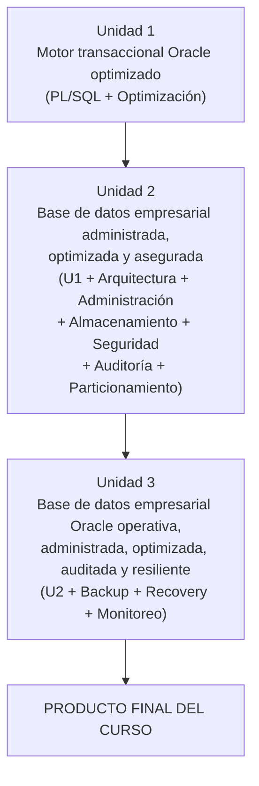

# Base de Datos II (BD2) 2026-2

**Repositorio:** [262ciclo4/bomerp](https://github.com/262ciclo4/bomerp)

## Oracle Database Enterprise Administration

## Producto del curso

**Base de datos empresarial Oracle operativa, administrada, optimizada, auditada y resiliente.**

El producto se desarrolla progresivamente durante el semestre mediante la integración de programación PL/SQL, administración de la instancia, almacenamiento, seguridad, auditoría, optimización, respaldo, recuperación y monitoreo.

---

# Unidad 1: Programación y optimización (Oracle XE)

## Sesiones 1-6

## Producto U1

**Motor transaccional Oracle optimizado.**

Artefacto de referencia para el Proyecto Integrador: [BD2 - Producto de Unidad 1](../proyecto-integrador/u1/bd2-producto.md).

| Ses. | Contenido |
|---:|---|
| 1 | PL/SQL aplicado al negocio: procedimientos, funciones, parámetros `IN` / `OUT` / `IN OUT` y casos empresariales. |
| 2 | Triggers DML: `:OLD`, `:NEW`, reglas automáticas de negocio y auditoría básica. |
| 3 | Manejo de excepciones y robustez: excepciones predefinidas, personalizadas, registro de errores y tolerancia a fallos. |
| 4 | Optimización de consultas SQL: Cost Based Optimizer (CBO), Explain Plan, `DBMS_STATS` y buenas prácticas SQL. |
| 5 | Índices para optimización: B-Tree, Bitmap, Function-Based Index, selectividad y estrategias de indexación. |
| 6 | Evaluación Unidad 1: sustentación del motor transaccional Oracle optimizado. |

---

# Unidad 2: Administración, almacenamiento, seguridad y optimización

## Oracle Database 19c EE + Oracle Linux

## Sesiones 7-12

## Producto U2

**Base de datos empresarial administrada, optimizada y asegurada.**

Continúa el producto de la Unidad 1 incorporando administración del motor Oracle.

Artefacto de referencia para el Proyecto Integrador: [BD2 - Producto de Unidad 2](../proyecto-integrador/u2/bd2-producto.md).

| Ses. | Contenido |
|---:|---|
| 7 | Arquitectura Oracle e instancia: SGA, PGA, procesos background, `ORACLE_HOME`, `ORACLE_SID`, administración desde Oracle Linux y SYSDBA. |
| 8 | Gestión de usuarios, roles y privilegios: privilegios de sistema, objetos y principio de mínimo privilegio. |
| 9 | Administración del almacenamiento y seguridad: tablespaces, segmentos, extents, datafiles, redo logs, undo, archivelog, auditoría de sentencias, auditoría de acceso y Enterprise Manager Express. |
| 10 | Optimización del rendimiento: Explain Plan, Cost Based Optimizer, `DBMS_STATS`, Automatic Workload Repository (AWR) e índices. |
| 11 | Particionamiento y escalabilidad: Range, Hash, List, Composite Partition, estrategias para grandes volúmenes e impacto en el rendimiento. |
| 12 | Evaluación Unidad 2: sustentación de la base de datos administrada, optimizada y asegurada. |

---

# Unidad 3: Continuidad del negocio y operación empresarial

## Oracle Database 19c EE

## Sesiones 13-16

## Producto U3 (Producto Final del Curso)

**Base de datos empresarial Oracle operativa, administrada, optimizada, auditada y resiliente.**

Artefacto de referencia para el Proyecto Integrador: [BD2 - Producto de Unidad 3](../proyecto-integrador/u3/bd2-producto.md).

Continúa el producto de la Unidad 2 incorporando continuidad del negocio y operación empresarial.

| Ses. | Contenido |
|---:|---|
| 13 | Backup y Recovery con RMAN: respaldo completo e incremental (L0/L1), Data Pump, Point-In-Time Recovery (PITR) y escenarios reales de recuperación. |
| 14 | Monitoreo y diagnóstico: vistas `V$`, `DBA_`, sesiones, bloqueos, rendimiento, Enterprise Manager Express y Oracle Cloud Control. |
| 15 | Sustentación del producto final del curso: evidencia técnica de programación PL/SQL, administración, almacenamiento, seguridad, auditoría, optimización, respaldo, recuperación y monitoreo. |
| 16 | Evaluación final individual: recuperaciones, levantamiento de observaciones y cierre académico. |

---

# Evolución del producto

| Unidad | Producto | Evolución |
|---|---|---|
| U1 | Motor transaccional Oracle optimizado | Desarrollo con PL/SQL, triggers, excepciones, optimización e índices. |
| U2 | Base de datos empresarial administrada, optimizada y asegurada | U1 + arquitectura Oracle, administración, almacenamiento, seguridad, auditoría y particionamiento. |
| U3 | Base de datos empresarial Oracle operativa, administrada, optimizada, auditada y resiliente | U2 + backup, recovery, monitoreo y operación empresarial. Este es el producto final del curso. |

---

# Flujo del curso

