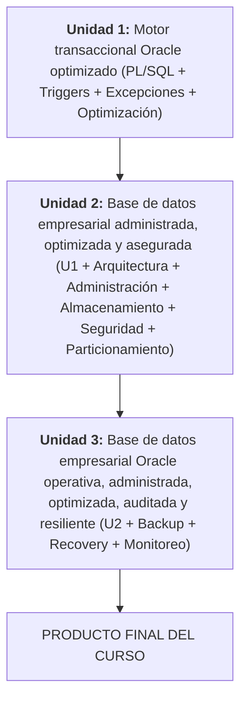

# BD2 - Administración de Base de Datos II

**Repositorio:** [262ciclo4/bomerp](https://github.com/262ciclo4/bomerp)

Oracle Database Enterprise Administration. El producto se desarrolla progresivamente durante el semestre mediante la integración de programación PL/SQL, administración de la instancia, almacenamiento, seguridad, auditoría, optimización, respaldo, recuperación y monitoreo. BD2 ve el sistema completo, pero acotado a la base de datos empresarial — a diferencia de ADS (arquitectura e infraestructura completa) o LP2 (solo una porción del backend).

## Producto del curso

Producto del curso = Producto U3:

```text
Base de datos empresarial Oracle operativa, administrada, optimizada,
auditada y resiliente.
```

Resultado esperado del curso:

Al finalizar el curso, el estudiante entrega una base de datos empresarial Oracle operativa: motor transaccional con PL/SQL, triggers y manejo de excepciones (U1); administrada, optimizada y asegurada con arquitectura de instancia, privilegios, almacenamiento y particionamiento (U2); y resiliente, con backup, recovery y monitoreo (U3). El producto se presenta en equipo, pero cada estudiante evidencia y defiende su aporte individual.

## Contenido

### U1: Programación y optimización (Oracle XE)

Producto U1: motor transaccional Oracle optimizado.

Resultado esperado U1: el estudiante crea el esquema y las tablas base de un caso empresarial en Oracle, con procedimientos, funciones, triggers, manejo de excepciones e índices que validan y protegen reglas del negocio directamente en la base de datos.

Artefacto de referencia para el Proyecto Integrador: [BD2 - Producto de Unidad 1](../proyecto-integrador/u1/bd2-producto.md).

| Sesión | Tema (sílabo) | Objeto Oracle | Trabajo principal |
|---|---|---|---|
| [S1](sesiones/S01_PLSQL_Aplicado_Negocio.md) | PL/SQL aplicado al negocio: creación del esquema y las tablas base del caso empresarial, procedimientos, funciones, parámetros `IN`/`OUT`/`IN OUT` y casos empresariales. | `BOM_CATALOGO` | Esquema y tablas base, procedimientos y funciones con parámetros `IN`/`OUT`/`IN OUT`. |
| [S2](sesiones/S02_Triggers_DML_Auditoria.md) | Triggers DML: `:OLD`, `:NEW`, reglas automáticas de negocio y auditoría básica. | `BOM_CATALOGO` | Triggers `:OLD`/`:NEW`, reglas automáticas de negocio y auditoría básica. |
| S3 | Manejo de excepciones y robustez: excepciones predefinidas, personalizadas, registro de errores y tolerancia a fallos. | `BOM_CATALOGO` | Excepciones predefinidas y personalizadas, registro de errores, tolerancia a fallos. |
| S4 | Optimización de consultas SQL: Cost Based Optimizer (CBO), Explain Plan, `DBMS_STATS` y buenas prácticas SQL. | `BOM_CATALOGO` + `BOM_VENTAS` (nuevo) | Cost Based Optimizer, Explain Plan, `DBMS_STATS` y buenas prácticas SQL. |
| S5 | Índices para optimización: B-Tree, Bitmap, Function-Based Index, selectividad y estrategias de indexación. | `BOM_CATALOGO`, `BOM_VENTAS` | B-Tree, Bitmap, Function-Based Index, selectividad y estrategias de indexación. |
| S6 | Integración del motor transaccional Oracle: programación PL/SQL, transacciones, estructuras de almacenamiento, índices, planes de ejecución y optimización SQL. | — | **Producto U1:** motor transaccional Oracle optimizado. |

### U2: Administración, almacenamiento, seguridad y optimización

Producto U2: base de datos empresarial administrada, optimizada y asegurada.

Resultado esperado U2: el estudiante administra la arquitectura de la instancia Oracle, gestiona usuarios/roles/privilegios con mínimo privilegio, administra almacenamiento y seguridad, optimiza el rendimiento y particiona tablas de gran volumen. Continúa el producto de la Unidad 1. Oracle Database 19c EE + Oracle Linux.

Artefacto de referencia para el Proyecto Integrador: [BD2 - Producto de Unidad 2](../proyecto-integrador/u2/bd2-producto.md).

| Sesión | Tema (sílabo) | Objeto Oracle | Trabajo principal |
|---|---|---|---|
| S7 | Arquitectura Oracle e instancia: SGA, PGA, procesos background, ORACLE_HOME, ORACLE_SID, administración desde Oracle Linux y SYSDBA. | instancia | SGA, PGA, procesos background, `ORACLE_HOME`, `ORACLE_SID`, administración desde Oracle Linux y SYSDBA. |
| S8 | Gestión de usuarios, roles y privilegios: privilegios de sistema, objetos y principio de mínimo privilegio. | usuarios/roles | Privilegios de sistema, privilegios de objetos y principio de mínimo privilegio (`BOMERP_APP` sin ser dueño de objetos). |
| S9 | Administración del almacenamiento y seguridad: tablespaces, segmentos, extents, datafiles, redo logs, undo, archivelog, auditoría de sentencias, auditoría de acceso y Enterprise Manager Express. | tablespaces | Segmentos, extents, datafiles, redo logs, undo, archivelog, auditoría de sentencias y de acceso, Enterprise Manager Express. |
| S10 | Optimización del rendimiento: Explain Plan, Cost Based Optimizer, DBMS_STATS, Automatic Workload Repository (AWR) e índices. | `BOM_CATALOGO`, `BOM_VENTAS` | Explain Plan, Cost Based Optimizer, `DBMS_STATS`, Automatic Workload Repository (AWR) e índices. |
| S11 | Particionamiento y escalabilidad: Range, Hash, List, Composite Partition, estrategias para grandes volúmenes e impacto en el rendimiento. | tablas de gran volumen | Range, Hash, List, Composite Partition; estrategias para grandes volúmenes e impacto en rendimiento. |
| S12 | Integración de la administración de Oracle: almacenamiento, seguridad, auditoría, optimización, automatización y operación del motor. | — | **Producto U2:** base de datos empresarial administrada, optimizada y asegurada. |

### U3: Continuidad del negocio y operación empresarial

Producto U3 / producto del curso: base de datos empresarial Oracle operativa, administrada, optimizada, auditada y resiliente. Oracle Database 19c EE.

Resultado esperado U3: el estudiante implementa respaldo y recuperación con RMAN, monitorea y diagnostica la instancia, y sustenta técnicamente el producto final. Continúa el producto de la Unidad 2 incorporando continuidad del negocio y operación empresarial.

Artefacto de referencia para el Proyecto Integrador: [BD2 - Producto de Unidad 3](../proyecto-integrador/u3/bd2-producto.md).

| Sesión | Tema (sílabo) | Objeto Oracle | Trabajo principal |
|---|---|---|---|
| S13 | Backup y Recovery con RMAN: respaldo completo e incremental (L0/L1), Data Pump, Point-In-Time Recovery (PITR) y escenarios reales de recuperación. | toda la instancia | Respaldo completo e incremental (L0/L1), Data Pump, Point-In-Time Recovery (PITR) y escenarios reales de recuperación. |
| S14 | Monitoreo y diagnóstico: vistas V$, DBA_, sesiones, bloqueos, rendimiento, Enterprise Manager Express y Oracle Cloud Control. | toda la instancia | Vistas `V$`/`DBA_`, sesiones, bloqueos, rendimiento, Enterprise Manager Express y Oracle Cloud Control. |
| S15 | Integración de la operación empresarial en Oracle: programación PL/SQL, administración, almacenamiento, seguridad, auditoría, optimización, respaldo, continuidad y monitoreo. | — | Evidencia técnica de programación PL/SQL, administración, almacenamiento, seguridad, auditoría, optimización, respaldo, recuperación y monitoreo. |
| S16 | Integración de administración y continuidad de bases de datos: programación, seguridad, auditoría, optimización, respaldo, continuidad, monitoreo y diagnóstico en Oracle. | — | Recuperaciones, levantamiento de observaciones y cierre académico. |

## Arquitectura BD2 (esquemas por módulo funcional)



- Un esquema Oracle por módulo funcional: `BOM_CATALOGO` (S1), `BOM_VENTAS` (S4) y `BOM_SEGURIDAD` (S10) — se crean recién cuando LP2 llega a ese módulo, mismo criterio de "no crear por si acaso" que usa LP2 con sus paquetes Java (ver [ADR-002 de LP2](../lp2/adr/ADR-002-spring-modulith.md)).
- Usuario propietario del esquema separado del usuario técnico de aplicación (`BOMERP_APP`, solo `CREATE SESSION` + `GRANT`s puntuales) — mínimo privilegio, nunca un usuario DBA para la app.
- U1 usa Oracle XE local (contenedor `bomerp-oracle`); U2-U3 piden Oracle 19c EE + Oracle Linux, todavía sin operacionalizar en este repo.

## Flujo de trabajo

1. El estudiante crea el esquema y las tablas del caso empresarial antes de escribir PL/SQL sobre ellas (S1).
2. Cada esquema nuevo (`BOM_VENTAS`, `BOM_SEGURIDAD`) se crea recién cuando LP2 llega a ese módulo, no antes.
3. Los objetos PL/SQL se verifican ejecutándolos contra la instancia Oracle real (U1: contenedor local; U2-U3: Oracle 19c EE/Oracle Linux), capturando `DBMS_OUTPUT` y una consulta `SELECT` de verificación — no hay suite automatizada equivalente a `mvn test`.
4. La administración (usuarios, privilegios, almacenamiento) y la optimización (índices, AWR, particionamiento) se desarrollan en U2 sobre el mismo motor que U1 dejó funcional.
5. El producto final (U3) agrega resiliencia: backup, recovery y monitoreo operacional, sustentados técnicamente.

## Enlaces

- [Sílabo 2026-2](silabo_bd2_2026_2.md)
- [ADR-002 de LP2 - Spring Modulith (esquemas por módulo)](../lp2/adr/ADR-002-spring-modulith.md)
