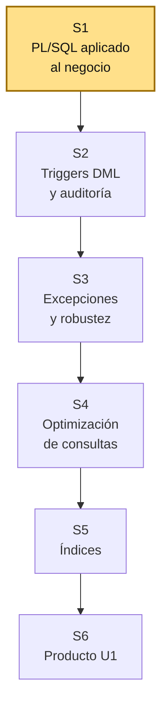
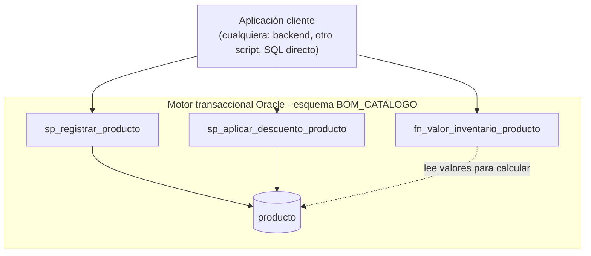

# S1 - PL/SQL Aplicado al Negocio

## 1. Introducción

Tiempo: 20 min.

### 1.1 Contexto

PL/SQL decide qué reglas del negocio quedan protegidas dentro de Oracle, sin importar quién intente saltárselas. Esta sesión crea el esquema y las tablas base del caso empresarial, e inicia el motor transaccional con procedimientos y funciones PL/SQL.

### 1.2 Índice

1. Creación del esquema y las tablas base del caso empresarial.
2. Procedimientos PL/SQL.
3. Funciones PL/SQL.
4. Parámetros `IN`, `OUT` e `IN OUT`.

### 1.3 Propósito de aprendizaje

Al concluir la clase, estarás en condiciones de:

- **Crear y entregar** el esquema y las tablas base de un caso empresarial en Oracle, con procedimientos y funciones PL/SQL que validan reglas básicas del negocio usando parámetros `IN`, `OUT` e `IN OUT`.

### 1.4 Producto de sesión

Esquema `BOM_CATALOGO` con sus tablas base, más procedimientos y funciones iniciales para registrar operaciones transaccionales del ERP.

### 1.5 Metodología

| Fase | Actividades | Orientaciones | Material |
|---|---|---|---|
| Revisión previa individual | Instalar/verificar acceso a Oracle XE y revisar el caso BomERP (ver 1.6). | Trabajo individual, antes de clase. | Acceso a Oracle, sílabo BD2 U1. |
| Clase presencial | Creación guiada del esquema y tablas del catálogo, seguida de la función y los procedimientos PL/SQL. | Trabajo individual en la propia laptop, siguiendo al docente paso a paso; consulta inmediata ante errores de compilación. | Scripts `S01_01_esquemas.sql`, `S01_02_tablas.sql`, `S01_03_plsql.sql`. |
| Evaluación formativa | Verificación en clase de la ejecución de la función y los procedimientos con datos válidos. | La evidencia se completa y sustenta de forma individual, fuera del aula, según los criterios mínimos de la sección 4.2. | Plantilla de evidencia individual (4.1), rúbrica de evaluación (5.4). |

### 1.6 Motivación de la sesión

#### 1.6.1 Caso: catálogo de BomERP (`Categoria`–`Producto`)

LP2 ya expone `GET /api/v1/productos` y `GET /api/v1/categorias` (S1) y está completando su CRUD (S2) sobre las tablas `BOM_CATALOGO.categoria` y `BOM_CATALOGO.producto` — esta misma sesión crea el esquema `BOM_CATALOGO` y esas dos tablas (3.2) antes de construir PL/SQL sobre ellas. El backend puede validar datos, pero ciertos cálculos y reglas del negocio conviene poder resolverlos también del lado de Oracle: el valor de inventario de un producto, el registro de un producto nuevo y el ajuste de su precio son operaciones que un procedimiento o función PL/SQL puede centralizar.

Preguntas para los estudiantes:

1. ¿Qué diferencia hay entre calcular `precio * stock` en Java y calcularlo en una función PL/SQL?
2. ¿Qué procedimiento podría invocar (o replicar) un backend REST como el de LP2?
3. ¿Qué función permite centralizar un cálculo del negocio sin repetirlo en cada consulta?
4. ¿Por qué un parámetro `IN OUT` es distinto de tener un `IN` y un `OUT` por separado?
5. ¿Cómo se evidencia que BD2 no es un ejercicio aislado, sino el motor transaccional detrás del catálogo del negocio?

### 1.7 Ubicación en el curso

- Unidad: U1 - Programación y optimización (Oracle XE).
- Producto de unidad: motor transaccional Oracle optimizado.
- Producto del curso: base de datos empresarial Oracle operativa, administrada, optimizada, auditada y resiliente.
- Avance del producto en esta sesión: procedimientos, funciones y reglas iniciales del motor transaccional.

Roadmap del producto de la unidad:



## 2. Explica

Tiempo: 25 min.

### 2.1 Arquitectura de la sesión



Lectura del diagrama:

- El procedimiento de registro (`sp_registrar_producto`) y el de ajuste de precio (`sp_aplicar_descuento_producto`) escriben sobre `producto`; la función (`fn_valor_inventario_producto`) solo lee y calcula, no modifica nada.
- Esta lógica vive en Oracle y protege la regla **sin importar quién la invoque**: un backend Java, otro cliente, o alguien ejecutando SQL directo — nadie puede saltarse la validación entrando por otro camino. **Error frecuente**: dejar todo del lado del backend sin definir qué reglas son realmente críticas — esas reglas se mueven a PL/SQL o a restricciones de la tabla.
- Integración (referencia, no requisito para esta sesión): LP2 (S2) ya implementa una regla equivalente en `ProductoServiceImpl` vía JPA/Hibernate — este procedimiento es la versión Oracle de esa misma regla, útil incluso para quien no esté llevando LP2 en paralelo. ADS documenta esta separación como decisión arquitectónica (atributo "Integridad"). **Error frecuente**: trabajar PL/SQL como ejercicio aislado, sin relacionarlo con la entidad transaccional real del proyecto.

Este diagrama es el mapa que guía el resto de la explicación: cada apartado siguiente desarrolla uno de sus componentes, en el mismo orden del Índice (1.2).

### 2.2 Creación del esquema y las tablas base del caso empresarial

PL/SQL permite ubicar lógica transaccional cerca de los datos. En un sistema empresarial, esto ayuda a proteger reglas críticas, mejorar consistencia y preparar operaciones que pueden ser consumidas por servicios backend — pero primero necesita un esquema propio y tablas base sobre las cuales operar.

**Error frecuente**: nombrar objetos de forma genérica en vez de usar nombres empresariales que reflejen el proceso real (esquema, tablas, procedimientos y funciones).

Alcance metodológico de S1:

```text
En S1 se construye la primera lógica transaccional.
Todavía no se trabaja auditoría avanzada, excepciones completas,
optimización ni administración Oracle.

Esos aspectos se desarrollan progresivamente durante la unidad.
```

### 2.3 Procedimientos PL/SQL

Un **procedimiento almacenado** ejecuta una acción (registrar, actualizar) y puede declarar **variables locales** para procesar datos antes de escribirlos, aplicando **validación de reglas** del negocio antes de cualquier `INSERT` o `UPDATE`.

**Error frecuente**: no devolver el identificador generado con un parámetro `OUT` — sin él, el backend u otro cliente no puede continuar su flujo (por ejemplo, no sabe qué producto acaba de registrar).

### 2.4 Funciones PL/SQL

Una **función** PL/SQL calcula y retorna un valor (por ejemplo, el valor de inventario de un producto) sin modificar datos — a diferencia de un procedimiento, siempre se ejecuta dentro de una expresión y siempre retorna algo.

**Error frecuente**: asumir que el cálculo funciona sin probarlo — toda función se ejecuta con casos válidos e inválidos antes de darla por buena.

### 2.5 Parámetros `IN`, `OUT` e `IN OUT`

Un parámetro `IN` recibe un valor sin modificarlo, un `OUT` devuelve un resultado sin necesitar un valor de entrada, y un `IN OUT` hace ambas cosas sobre la misma variable (por ejemplo, ajustar un precio recibido y devolver el precio ya ajustado en el mismo parámetro).

**Error frecuente**: insertar datos con valores fijos en vez de recibirlos como parámetros — sin `IN`, `OUT` e `IN OUT`, el procedimiento no es reutilizable ni conectable desde otro cliente.

## 3. Aplica: actividad práctica guiada

Tiempo: 2h.

Hoja de ruta de la sesión práctica:

- **3.1** Definir operación transaccional.
- **3.2** Crear el esquema y las tablas del catálogo.
- **3.3** Crear la función de negocio (parámetros `IN`).
- **3.4** Crear el procedimiento de registro (parámetros `IN` y `OUT`).
- **3.5** Crear el procedimiento de ajuste de precio (parámetro `IN OUT`).
- **3.6** Probar función y procedimientos.
- **3.7** Relacionar con ADS y LP2.

**Scripts completos, listos para ejecutar en este orden** (los pasos siguientes explican cada uno):

1. [`S01_01_esquemas.sql`](../../proyecto-integrador/u1/oracle/S01_01_esquemas.sql) — usuarios `BOM_CATALOGO` y `BOMERP_APP`.
2. [`S01_02_tablas.sql`](../../proyecto-integrador/u1/oracle/S01_02_tablas.sql) — tablas `categoria` y `producto`.
3. [`S01_03_plsql.sql`](../../proyecto-integrador/u1/oracle/S01_03_plsql.sql) — la función y los dos procedimientos de esta sesión.

### 3.1 Definir operación transaccional

**Producto del paso:** operación principal del motor Oracle.

| Elemento | Respuesta |
|---|---|
| Proceso principal | Registro y valorización del catálogo de productos |
| Entidad transaccional | `BOM_CATALOGO.producto` |
| Acción PL/SQL inicial | Función de cálculo + procedimiento de registro + procedimiento de ajuste de precio |
| Regla crítica | El precio y el stock nunca deben quedar negativos |

### 3.2 Crear el esquema y las tablas del catálogo

**Producto del paso:** esquema `BOM_CATALOGO` y las tablas `categoria`/`producto` operativas en Oracle — la base sobre la que esta sesión construye PL/SQL y sobre la que LP2 conecta su backend (S1-S2).

**Nota sobre versión y edición:** esta unidad (U1) trabaja contra el mismo
contenedor Oracle que levanta LP2 en su S1 (`gvenzl/oracle-free:23-slim` —
Oracle Database 23ai **Free**, no Oracle 19c). Alcanza para lo que pide el
sílabo en U1 (Oracle XE). U2-U3 exige Oracle 19c **Enterprise Edition** +
Oracle Linux para temas exclusivos de EE (AWR, particionamiento) que este
contenedor no soporta — ese ambiente todavía no está operacionalizado en
el repo (ver `bd2/README.md`).

Con una cuenta DBA, crea el usuario propietario del catálogo (`BOM_CATALOGO`) y el usuario técnico que usará el backend de LP2 (`BOMERP_APP`). Las contraseñas se piden en tiempo de ejecución; no se versionan:

```sql
ACCEPT pwd_catalogo CHAR PROMPT 'Password BOM_CATALOGO: ' HIDE
ACCEPT pwd_app CHAR PROMPT 'Password BOMERP_APP: ' HIDE

CREATE USER BOM_CATALOGO IDENTIFIED BY "&pwd_catalogo" QUOTA UNLIMITED ON USERS;
CREATE USER BOMERP_APP IDENTIFIED BY "&pwd_app";

GRANT CREATE SESSION, CREATE TABLE, CREATE VIEW, CREATE PROCEDURE, CREATE TRIGGER TO BOM_CATALOGO;
GRANT CREATE SESSION TO BOMERP_APP;

UNDEFINE pwd_catalogo
UNDEFINE pwd_app
```

`ACCEPT ... HIDE` es útil cuando cada quien pone su propia contraseña. Pero en el ambiente **local** de este proyecto (laptop de desarrollo, sin secretos que proteger) conviene que todos usen exactamente la misma credencial, para que nadie se quede sin poder conectar el backend por una contraseña distinta a la de `application-local.yml`. Por eso, en el script real (`S01_01_esquemas.sql`) se usa contraseña fija en texto plano — mismo criterio que `application-local.yml`/`compose-local.yml` (ver `lp2/CLAUDE.md`, sección "Ambientes"):

```sql
CREATE USER BOM_CATALOGO IDENTIFIED BY "123456" QUOTA UNLIMITED ON USERS;
CREATE USER BOMERP_APP IDENTIFIED BY "123456";

GRANT CREATE SESSION, CREATE TABLE, CREATE VIEW, CREATE PROCEDURE, CREATE TRIGGER TO BOM_CATALOGO;
GRANT CREATE SESSION TO BOMERP_APP;
```

La contraseña de `BOMERP_APP` debe coincidir exactamente con la de `application-local.yml`.

#### Ver el esquema `BOM_CATALOGO` desde el cliente gráfico

Con la conexión de `system` (ver LP2 S1, 3.2.2) normalmente solo ves los objetos de `SYSTEM`, no los de `BOM_CATALOGO`, aunque ya exista. Agrega una segunda conexión, igual que ya hiciste con `BOMERP_APP`:

| Campo | Valor |
|---|---|
| Host | `127.0.0.1` |
| Port | `1521` |
| Username | `BOM_CATALOGO` |
| Password | `123456` |
| Database | `FREEPDB1` |

Con esa conexión entras directo como ese usuario y ves su propio árbol (`categoria`, `producto` una vez creadas), sin depender de que el cliente muestre o no otros esquemas.

#### Si necesitas borrar y volver a crear el esquema

Si algo quedó a medio configurar (por ejemplo, corriste `S01_01_esquemas.sql` dos veces y salió `ORA-01920`, usuario ya existente), lo más simple en un ambiente local es borrar y recrear desde cero — conectado como `system`:

```sql
DROP USER BOM_CATALOGO CASCADE;
DROP USER BOMERP_APP CASCADE;
```

`CASCADE` borra también cualquier objeto que ese usuario ya tuviera (tablas, funciones, procedimientos), para no arrastrar nada a medio crear. Después, vuelve a ejecutar `S01_01_esquemas.sql` completo.

#### Verificar desde terminal, sin depender del cliente gráfico

Si el cliente gráfico no muestra un esquema que debería existir (o al revés, quieres confirmar un `ORA-01920` antes de asumir que ya existe), verifica directo con `sqlplus` dentro del contenedor — te da la respuesta real de la base, sin caché de ningún cliente de por medio:

```powershell
docker exec -it bomerp-oracle sqlplus system/123456@localhost:1521/FREEPDB1
```

Eso deja un prompt `SQL>` dentro del contenedor. Ahí escribes la consulta, terminando con `;`, y Enter — esta consulta muestra el **usuario en sí**, no sus tablas (que todavía no existen en este punto de la sesión):

```sql
SELECT username, account_status, default_tablespace, temporary_tablespace, created
FROM dba_users
WHERE username = 'BOM_CATALOGO';
```

Salida esperada (confirma que el usuario existe, con estado `OPEN` y tablespace por defecto `USERS`):

```text
USERNAME                       ACCOUNT_STATUS   DEFAULT_TABLESPACE   TEMPORARY_TABLESPACE   CREATED
------------------------------ ---------------- -------------------- ---------------------- -----------
BOM_CATALOGO                   OPEN             USERS                TEMP                   02-AUG-26
```

Para salir de la sesión: `exit;`

Luego las tablas del catálogo, propiedad de `BOM_CATALOGO`:

```sql
CREATE TABLE BOM_CATALOGO.categoria (
    id_categoria NUMBER GENERATED BY DEFAULT AS IDENTITY PRIMARY KEY,
    nombre VARCHAR2(80) NOT NULL UNIQUE,
    descripcion VARCHAR2(200)
);

CREATE TABLE BOM_CATALOGO.producto (
    id_producto NUMBER GENERATED BY DEFAULT AS IDENTITY PRIMARY KEY,
    id_categoria NUMBER NOT NULL,
    nombre VARCHAR2(120) NOT NULL,
    precio NUMBER(10,2) NOT NULL,
    stock NUMBER(10) NOT NULL,
    CONSTRAINT fk_producto_categoria FOREIGN KEY (id_categoria)
        REFERENCES BOM_CATALOGO.categoria(id_categoria),
    CONSTRAINT ck_producto_precio CHECK (precio >= 0),
    CONSTRAINT ck_producto_stock CHECK (stock >= 0)
);

-- BOMERP_APP ejecuta el backend de LP2, pero no es propietario de los objetos.
GRANT SELECT, INSERT, UPDATE, DELETE ON BOM_CATALOGO.categoria TO BOMERP_APP;
GRANT SELECT, INSERT, UPDATE, DELETE ON BOM_CATALOGO.producto TO BOMERP_APP;
```

Verifica:

```sql
DESC BOM_CATALOGO.producto;

SELECT id_producto, nombre, precio, stock FROM BOM_CATALOGO.producto;
```

#### Ver la lista de tablas creadas

Si quieres confirmar qué tablas existen (no una en particular, sino la lista completa), la consulta depende de con quién estés conectado:

Conectado como `system` (ve tablas de cualquier usuario, filtrando por dueño):

```sql
SELECT table_name FROM dba_tables WHERE owner = 'BOM_CATALOGO';
```

Conectado como `BOM_CATALOGO` (ve solo lo suyo, sin filtrar):

```sql
SELECT table_name FROM user_tables;
```

Deberían aparecer `CATEGORIA` y `PRODUCTO`. Si prefieres verlas en el **árbol** del cliente gráfico: usa la conexión con `Username: BOM_CATALOGO` (ver más arriba), refresca esa conexión (botón de reconectar, no solo refresh) y expande el nodo "Tables" — ahí deberían listarse directamente, sin necesitar SQL.

**Nota de alcance:** esta sesión crea únicamente el esquema `BOM_CATALOGO` y sus dos tablas — lo que LP2 S1-S2 necesitan. Los esquemas `BOM_VENTAS` y `BOM_SEGURIDAD` (y sus tablas) se crean recién en las sesiones de BD2 que los necesitan por primera vez (cuando LP2 llegue a `Venta` en S4, y a seguridad en S10) — mismo criterio de "no crear por si acaso" que ya aplica la arquitectura de LP2 a sus módulos (ver [ADR-002](../../lp2/adr/ADR-002-spring-modulith.md)).

### 3.3 Crear la función de negocio (parámetros `IN`)

**Producto del paso:** función PL/SQL reutilizable, con dos parámetros `IN`.

```sql
CREATE OR REPLACE FUNCTION BOM_CATALOGO.fn_valor_inventario_producto(
    p_precio IN NUMBER,
    p_stock IN NUMBER
) RETURN NUMBER IS
BEGIN
    RETURN p_precio * p_stock;
END;
/
```

### 3.4 Crear el procedimiento de registro (parámetros `IN` y `OUT`)

**Producto del paso:** procedimiento con parámetros `IN` y `OUT`.

```sql
CREATE OR REPLACE PROCEDURE BOM_CATALOGO.sp_registrar_producto(
    p_id_categoria IN NUMBER,
    p_nombre IN VARCHAR2,
    p_precio IN NUMBER,
    p_stock IN NUMBER,
    p_id_producto OUT NUMBER
) IS
BEGIN
    INSERT INTO BOM_CATALOGO.producto (id_categoria, nombre, precio, stock)
    VALUES (p_id_categoria, p_nombre, p_precio, p_stock)
    RETURNING id_producto INTO p_id_producto;
END;
/
```

### 3.5 Crear el procedimiento de ajuste de precio (parámetro `IN OUT`)

**Producto del paso:** procedimiento con un parámetro `IN OUT`, distinto de tener un `IN` y un `OUT` separados: el mismo parámetro entra con el precio actual y sale con el precio ya ajustado.

```sql
CREATE OR REPLACE PROCEDURE BOM_CATALOGO.sp_aplicar_descuento_producto(
    p_precio IN OUT NUMBER,
    p_porcentaje_descuento IN NUMBER
) IS
BEGIN
    p_precio := p_precio - (p_precio * p_porcentaje_descuento / 100);
END;
/
```

### 3.6 Probar función y procedimientos

**Producto del paso:** evidencia de ejecución.

`sp_registrar_producto` exige una categoría existente (`fk_producto_categoria`). Si `categoria` está vacía todavía (por ejemplo, si solo ejecutaste 3.2-3.5 sin datos de prueba), la prueba siguiente falla con `ORA-02291: integrity constraint ... violated - parent key not found`. Antes de probar, registra al menos una categoría:

```sql
INSERT INTO BOM_CATALOGO.categoria (nombre, descripcion) VALUES ('Perifericos', 'Perifericos de computo');
COMMIT;
```

```sql
DECLARE
    v_id_producto  NUMBER;
    v_precio       NUMBER(10,2) := 180.50;
    v_valor_inv    NUMBER;
BEGIN
    -- IN + OUT: registrar un producto nuevo
    BOM_CATALOGO.sp_registrar_producto(1, 'Teclado mecánico', 180.50, 25, v_id_producto);
    DBMS_OUTPUT.PUT_LINE('Producto registrado: ' || v_id_producto);

    -- IN, IN: calcular el valor de inventario
    v_valor_inv := BOM_CATALOGO.fn_valor_inventario_producto(180.50, 25);
    DBMS_OUTPUT.PUT_LINE('Valor de inventario: ' || v_valor_inv);

    -- IN OUT: ajustar el precio en la misma variable
    BOM_CATALOGO.sp_aplicar_descuento_producto(v_precio, 10);
    DBMS_OUTPUT.PUT_LINE('Precio con 10% de descuento: ' || v_precio);
END;
/
```

Resultado esperado: `Producto registrado: <id>`, `Valor de inventario: 4512.5`, `Precio con 10% de descuento: 162.45`.

### 3.7 Relacionar con ADS y LP2

**Producto del paso:** matriz de integración.

| Objeto BD2 | Decisión ADS | Endpoint o servicio LP2 |
|---|---|---|
| `sp_registrar_producto` | Integridad: reglas transaccionales en servicio y Oracle | `POST /api/v1/productos` (S2), regla equivalente |
| `fn_valor_inventario_producto` | Centralizar regla de cálculo del negocio | Cálculo que también podría exponerse en un reporte (S4-S5) |
| `sp_aplicar_descuento_producto` | Mantenibilidad: lógica reutilizable, no repetida | `PUT /api/v1/productos/{id}` (S2), regla equivalente |

Sesión equivalente en los otros dos cursos, misma semana: [ADS - S1 Fundamentos de Arquitectura de Software](../../ads/sesiones/S01_Fundamentos_Arquitectura_Software.md) y [LP2 - S1 Arquitectura Backend REST Profesional](../../lp2/sesiones/S01_Arquitectura_Backend_REST_Profesional.md).

## 4. Crea: actividad autónoma

Tiempo: 2h fuera del aula.

Cada estudiante adapta el ejemplo a la entidad transaccional de su equipo.

### 4.1 Plantilla de evidencia individual

Entrega un PDF con el siguiente nombre:

```text
S01_BD2_Equipo##_ApellidoNombre.pdf
```

#### 4.1.1 Datos del estudiante

- Nombre:
- Equipo:
- Sesión: S01 - PL/SQL Aplicado al Negocio
- Rol o aporte realizado:
- Link de GitHub:

#### 4.1.2 Trabajo autónomo realizado

Completa y evidencia estas tareas:

1. Definir la operación transaccional del proyecto.
2. Crear el esquema (usuario propietario) y las tablas mínimas de prueba.
3. Crear una función PL/SQL de cálculo o validación.
4. Crear un procedimiento con parámetros `IN` y `OUT`.
5. Ejecutar al menos un caso válido.
6. Registrar una mejora que se implementará en S2 o S3.

#### 4.1.3 Evidencia técnica

Incluye:

- Script SQL.
- Captura o salida de ejecución.
- Resultado de consulta a la tabla.
- Breve explicación del procedimiento.

#### 4.1.4 Error o hallazgo

Describe un error técnico encontrado: compilación, tipos, parámetros, claves, reglas o pruebas.

#### 4.1.5 Reflexión técnica breve

Responde en 5 a 8 líneas:

```text
¿Qué regla del negocio conviene proteger en Oracle y por qué no debería quedar solo en el backend?
```

### 4.2 Criterios mínimos de aceptación

La evidencia individual se considera completa si:

- El archivo respeta el nombre solicitado.
- Crea el esquema/usuario propietario y las tablas base antes de la lógica PL/SQL.
- Presenta función y procedimiento compilables.
- Usa parámetros `IN` y `OUT`.
- Ejecuta un caso válido.
- Incluye evidencia de ejecución.

## 5. Cierre evaluativo

Tiempo: 20 min.

### 5.1 Resultados esperados

Al finalizar la sesión, el estudiante debe demostrar que:

- Explica el rol de PL/SQL en un sistema empresarial.
- Crea el esquema/usuario propietario y las tablas base de su dominio.
- Crea funciones y procedimientos.
- Usa parámetros `IN` y `OUT`.
- Implementa reglas iniciales del negocio.
- Prueba la lógica creada.

### 5.2 Evidencia del producto de sesión

Cada estudiante entrega un PDF individual siguiendo la plantilla de la sección 4.1.

Nombre del archivo:

```text
S01_BD2_Equipo##_ApellidoNombre.pdf
```

### 5.3 Preguntas de defensa y reflexión

1. ¿Qué operación transaccional implementaste?
2. ¿Por qué creaste una función y no solo un procedimiento?
3. ¿Qué parámetro `OUT` devuelve tu procedimiento?
4. ¿Qué validación falta mejorar en S2 o S3?

### 5.4 Rúbrica de evaluación

| Dimensión | Peso | 3 - Logro destacado | 2 - Logro | 1 - Proceso | 0 - Inicio | Puntuación obtenida |
|---|---:|---|---|---|---|---:|
| 1. Esquema y tablas del catálogo | 2 | Esquema y tablas creados correctamente, con permisos mínimos para `BOMERP_APP`. | Esquema y tablas funcionales con detalles menores. | Esquema o tablas incompletos. | No crea esquema ni tablas. | |
| 2. Operación transaccional | 2 | Define una operación clara y alineada al proyecto. | Define una operación comprensible. | Operación parcial o poco conectada. | No define operación. | |
| 3. Función PL/SQL | 2 | Función correcta, reutilizable y probada. | Función funcional con detalles menores. | Función incompleta o poco probada. | No presenta función. | |
| 4. Procedimiento PL/SQL | 2 | Procedimiento correcto con parámetros y registro exitoso. | Procedimiento funcional con detalles menores. | Procedimiento parcial o con errores. | No presenta procedimiento. | |
| 5. Evidencia de ejecución | 2 | Presenta ejecución y consulta verificable. | Presenta evidencia suficiente. | Evidencia incompleta. | No evidencia ejecución. | |
| 6. Orden y reflexión | 1 | Evidencia ordenada y reflexión técnica clara. | Evidencia suficiente y reflexión comprensible. | Evidencia incompleta o reflexión superficial. | Evidencia desordenada o sin reflexión. | |

Puntuación acumulada = suma de (`Peso` * `Puntuación obtenida`) = ____.

Nota final = (`Puntuación acumulada` / 33) * 20 = ____.
