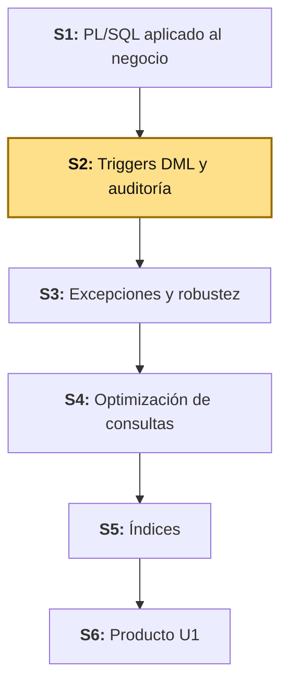
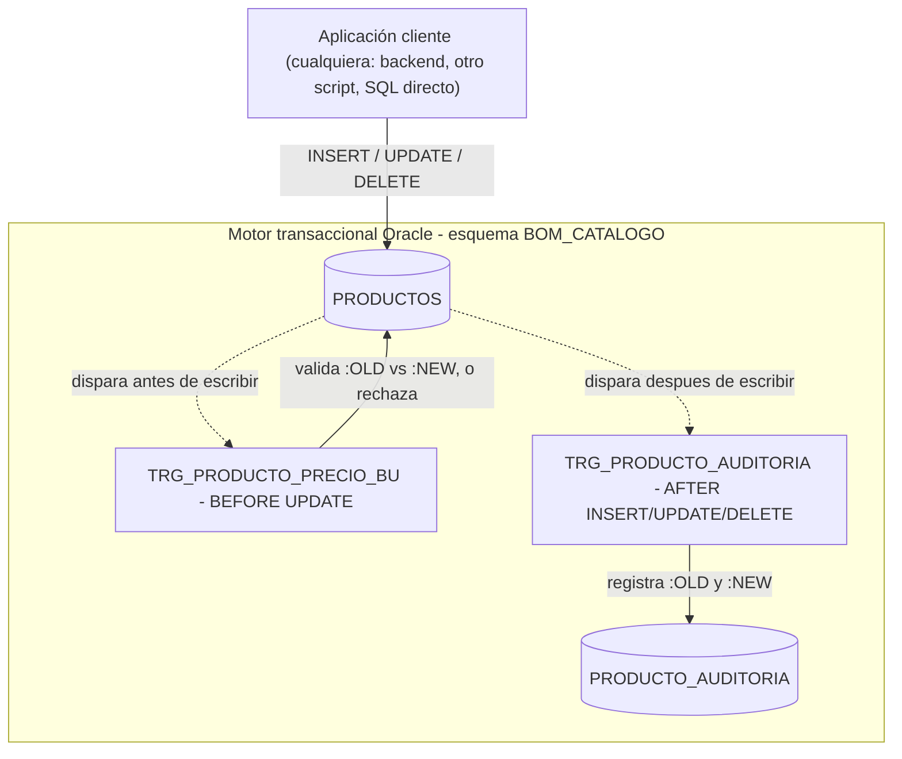

# S2 - Triggers DML y Auditoría

## 1. Introducción

Tiempo: 20 min.

### 1.1 Presentación de la sesión

En S1, `SP_APLICAR_DESCUENTO_PRODUCTO` ajusta el precio de un producto sin que quede registro de quién lo cambió, ni verificación de que el ajuste sea razonable — cualquier procedimiento, o incluso un `UPDATE` directo desde otro cliente, puede dejar el precio en cualquier valor sin dejar rastro. Esta sesión resuelve ambos problemas con **triggers DML**: uno que aplica una regla automática de negocio, y otro que registra auditoría básica — ambos disparados por Oracle mismo, sin depender de que el cliente que hizo el cambio se acuerde de invocarlos.

### 1.2 Índice

1. Triggers DML: momento y evento.
2. Pseudo-registros `:OLD` y `:NEW`.
3. Reglas automáticas de negocio con triggers.
4. Auditoría básica con triggers.

### 1.3 Propósito de aprendizaje

Al concluir la clase, estarás en condiciones de:

- **Implementar y probar** triggers DML que apliquen una regla automática de negocio y registren auditoría básica sobre `PRODUCTOS`, usando `:OLD` y `:NEW` para comparar el estado antes y después de cada operación.

### 1.4 Producto de sesión

Dos triggers sobre `BOM_CATALOGO.PRODUCTOS`: uno que impide un ajuste de precio no razonable (regla de negocio), y otro que registra cada `INSERT`/`UPDATE`/`DELETE` en una tabla de auditoría nueva (`PRODUCTO_AUDITORIA`).

### 1.5 Metodología

**Tabla 1. Metodología de la sesión**

| Actividades a Realizar en el Periodo | Orientaciones generales (Orientaciones Metodológicas) | Material de estudio recomendado |
|---|---|---|
| Revisión previa individual | Revisar `SP_APLICAR_DESCUENTO_PRODUCTO` de S1 y el caso de esta sesión (ver 1.6). Trabajo individual, antes de clase. | S1 (3.5), sílabo BD2 U1. |
| Clase presencial | Creación guiada de la tabla de auditoría y los dos triggers DML sobre `PRODUCTOS`. Trabajo individual en la propia laptop, siguiendo al docente paso a paso; consulta inmediata ante errores de compilación. | Script `S02_triggers_dml_auditoria.sql`. |
| Evaluación formativa | Verificación en clase de los triggers con casos válidos e inválidos (ajuste de precio razonable y no razonable, `INSERT`/`UPDATE`/`DELETE` auditados). La evidencia se completa y sustenta de forma individual, fuera del aula, según los criterios mínimos de la sección 4.4. | Indicaciones de entrega (4.3), rúbrica de evaluación (4.6). |

### 1.6 Motivación de la sesión

#### 1.6.1 Caso: catálogo de BomERP (auditoría de precio)

`SP_APLICAR_DESCUENTO_PRODUCTO` (S1) confía en que quien lo invoca pasa un porcentaje razonable — pero nada impide que alguien, por error o directamente con un `UPDATE`, deje un producto en precio cero. Y si el precio cambia, nadie puede responder después "¿quién lo cambió, cuándo, y de cuánto a cuánto?" sin una auditoría. Un trigger resuelve ambos casos porque se dispara automáticamente ante el evento DML, sin importar qué cliente lo causó — a diferencia de un procedimiento, que solo protege si alguien decide invocarlo.

**Preguntas de análisis**

**Activación de conocimientos previos**

1. `SP_APLICAR_DESCUENTO_PRODUCTO` (S1) valida el porcentaje de descuento en el procedimiento. ¿Qué pasa si alguien actualiza `PRODUCTOS.PRECIO` con un `UPDATE` directo, sin pasar por ese procedimiento?
2. ¿LP2 (S2) también valida el precio en `ProductoRequest`? ¿Por qué esta sesión agrega una segunda capa de protección en Oracle?

**Comprensión de triggers**

1. ¿Qué diferencia hay entre un trigger `BEFORE UPDATE` y uno `AFTER UPDATE`?
2. ¿Por qué `:OLD` no tiene valores en un `INSERT`, ni `:NEW` los tiene en un `DELETE`?

### 1.7 Ubicación en el curso

- Unidad: U1 - Programación y optimización (Oracle XE).
- Producto del curso: base de datos empresarial Oracle operativa, administrada, optimizada, auditada y resiliente.
- Producto de unidad: motor transaccional Oracle optimizado.
- Avance del producto en esta sesión: reglas automáticas de negocio y auditoría básica sobre `PRODUCTOS`.

Roadmap del producto de la unidad:

**Figura 1. Roadmap del producto de la unidad**



## 2. Explica

Tiempo: 25 min.

### 2.1 Arquitectura de la sesión

**Figura 2. Triggers DML sobre `PRODUCTOS`**



Lectura del diagrama:

- Ningún cliente invoca `TRG_PRODUCTO_PRECIO_BU` ni `TRG_PRODUCTO_AUDITORIA` directamente — Oracle los dispara solo, en el momento (`BEFORE`/`AFTER`) y evento (`INSERT`/`UPDATE`/`DELETE`) declarados en cada uno.
- `TRG_PRODUCTO_PRECIO_BU` corre **antes** de escribir: puede rechazar la operación (`RAISE_APPLICATION_ERROR`). `TRG_PRODUCTO_AUDITORIA` corre **después**: la operación ya ocurrió, solo registra lo que pasó.
- Integración (referencia, no requisito para esta sesión): LP2 (S2) ya valida `ProductoRequest` en el backend (Bean Validation) antes de llegar a Oracle. Estos triggers son una segunda capa, independiente de si el cliente es el backend de LP2, otro script, o alguien conectado directo con SQL. **Error frecuente**: pensar que la validación del backend hace innecesaria la de Oracle — son capas distintas, protegen contra clientes distintos.

Este diagrama es el mapa que guía el resto de la explicación: cada apartado siguiente desarrolla uno de sus componentes, en el mismo orden del Índice (1.2).

### 2.2 Triggers DML: momento y evento

Un **trigger DML** es un bloque PL/SQL que Oracle ejecuta automáticamente ante un evento (`INSERT`, `UPDATE`, `DELETE`) sobre una tabla, en un momento determinado (`BEFORE` o `AFTER`) respecto a ese evento, y con un alcance de fila (`FOR EACH ROW`) o de sentencia.

Alcance metodológico de S2:

```text
En S2 se crean triggers FOR EACH ROW sobre una sola tabla
(PRODUCTOS). Triggers compuestos, INSTEAD OF (sobre vistas) y
triggers a nivel de sentencia se dejan fuera de esta sesión.
```

**Error frecuente**: usar `AFTER` cuando se necesita rechazar la operación — un trigger `AFTER` ya no puede impedir el `INSERT`/`UPDATE`/`DELETE`, porque el evento ya ocurrió; para bloquear algo, el trigger debe ser `BEFORE`.

### 2.3 Pseudo-registros `:OLD` y `:NEW`

Dentro de un trigger `FOR EACH ROW`, `:OLD` representa la fila **antes** del cambio y `:NEW` la fila **después**. En un `INSERT`, `:OLD` no tiene valores (la fila no existía); en un `DELETE`, `:NEW` no tiene valores (la fila deja de existir); en un `UPDATE`, ambos están disponibles y se pueden comparar directamente.

**Error frecuente**: intentar modificar `:OLD` (es de solo lectura) — solo `:NEW` puede modificarse, y solo dentro de un trigger `BEFORE`.

### 2.4 Reglas automáticas de negocio con triggers

Una regla de negocio puesta en un trigger `BEFORE` se aplica **siempre**, sin importar qué cliente ejecute el `INSERT`/`UPDATE`/`DELETE` — a diferencia de una regla puesta solo en un procedimiento (S1), que protege únicamente a quien decide invocarlo.

**Error frecuente**: duplicar en el trigger una regla que ya garantiza una restricción `CHECK` de la tabla (por ejemplo, `STOCK >= 0`, ya cubierto por `CK_PRODUCTO_STOCK` desde S1) — el trigger debe agregar una regla que el `CHECK` no puede expresar (como comparar el valor nuevo contra el anterior), no repetir la misma validación dos veces.

### 2.5 Auditoría básica con triggers

Un trigger de auditoría registra, en una tabla aparte, qué cambió, cuándo y en qué operación — usando `:OLD` y `:NEW` para capturar el valor anterior y el nuevo. Como el trigger se ejecuta con los privilegios del dueño del esquema (`BOM_CATALOGO`), no hace falta otorgarle permisos adicionales a `BOMERP_APP` sobre la tabla de auditoría.

## 3. Aplica: actividad práctica guiada

Tiempo: 2h.

**Actividad:** creación guiada de la tabla de auditoría y los dos triggers DML sobre `PRODUCTOS` (Producto de la sesión en 1.4).

**Propósito de la actividad:** construir `PRODUCTO_AUDITORIA` y dos triggers — uno que aplica una regla automática de negocio (`BEFORE UPDATE`) y otro que registra auditoría básica (`AFTER INSERT OR UPDATE OR DELETE`) — verificando cada incremento con casos válidos e inválidos antes de continuar al siguiente.

**Orientaciones metodológicas:** en el laboratorio, el docente crea la tabla de auditoría y los dos triggers paso a paso frente a la clase, probando cada uno con un caso que lo dispare correctamente y otro que lo haga fallar (para la regla de negocio); los estudiantes replican cada paso en su propio equipo, verificando la compilación y el resultado antes de avanzar.

**Actividades para realizar:**

- **3.1** Definir la regla de negocio y el alcance de la auditoría.
- **3.2** Crear la tabla `PRODUCTO_AUDITORIA`.
- **3.3** Crear el trigger de regla de negocio (`BEFORE UPDATE`).
- **3.4** Crear el trigger de auditoría (`AFTER INSERT OR UPDATE OR DELETE`).
- **3.5** Probar ambos triggers con casos válidos e inválidos.
- **3.6** Relacionar con ADS y LP2.

**Script completo, listo para ejecutar** (el paso siguiente explica cada bloque): [`S02_triggers_dml_auditoria.sql`](../../proyecto-integrador/u1/oracle/S02_triggers_dml_auditoria.sql).

### 3.1 Definir la regla de negocio y el alcance de la auditoría

**Producto del paso:** regla de negocio y alcance de auditoría definidos.

**Tabla 2. Regla de negocio y alcance de auditoría**

| Elemento | Respuesta |
|---|---|
| Tabla protegida | `BOM_CATALOGO.PRODUCTOS` |
| Regla automática de negocio | El precio no puede bajar más del 50% en un solo `UPDATE` |
| Operaciones auditadas | `INSERT`, `UPDATE`, `DELETE` sobre `PRODUCTOS` |
| Dato mínimo por evento auditado | `ID_PRODUCTO`, acción, precio y stock (`:OLD`/`:NEW`), fecha, usuario Oracle |

### 3.2 Crear la tabla `PRODUCTO_AUDITORIA`

**Producto del paso:** tabla `PRODUCTO_AUDITORIA` operativa en el esquema `BOM_CATALOGO`.

**Requisito antes de continuar:** conéctate como `BOM_CATALOGO` (misma conexión de S1, 3.2) — la tabla y los triggers de esta sesión son objetos de ese esquema, igual que `CATEGORIAS` y `PRODUCTOS`.

```sql
CREATE TABLE BOM_CATALOGO.PRODUCTO_AUDITORIA (
    ID_AUDITORIA     NUMBER GENERATED BY DEFAULT AS IDENTITY PRIMARY KEY,
    ID_PRODUCTO      NUMBER,
    ACCION           VARCHAR2(10) NOT NULL,
    PRECIO_ANTERIOR  NUMBER(10,2),
    PRECIO_NUEVO     NUMBER(10,2),
    STOCK_ANTERIOR   NUMBER(10),
    STOCK_NUEVO      NUMBER(10),
    FECHA_EVENTO     TIMESTAMP DEFAULT SYSTIMESTAMP,
    USUARIO_ORACLE   VARCHAR2(30) DEFAULT USER
);
```

`ID_PRODUCTO` no lleva `FOREIGN KEY` hacia `PRODUCTOS`: un registro de auditoría de un `DELETE` debe sobrevivir aunque el producto ya no exista — si fuera clave foránea, Oracle impediría borrar el producto auditado.

### 3.3 Crear el trigger de regla de negocio (`BEFORE UPDATE`)

**Producto del paso:** trigger que rechaza un ajuste de precio mayor al 50% en una sola operación.

```sql
CREATE OR REPLACE TRIGGER BOM_CATALOGO.TRG_PRODUCTO_PRECIO_BU
BEFORE UPDATE OF PRECIO ON BOM_CATALOGO.PRODUCTOS
FOR EACH ROW
BEGIN
    IF :NEW.PRECIO < (:OLD.PRECIO * 0.5) THEN
        RAISE_APPLICATION_ERROR(
            -20001,
            'El precio no puede bajar mas del 50% en un solo ajuste. Actual: ' || :OLD.PRECIO || ', propuesto: ' || :NEW.PRECIO
        );
    END IF;
END;
/
```

`BEFORE UPDATE OF PRECIO` limita el trigger a disparar solo cuando la sentencia toca la columna `PRECIO` — un `UPDATE` que solo cambie `NOMBRE` no lo activa.

### 3.4 Crear el trigger de auditoría (`AFTER INSERT OR UPDATE OR DELETE`)

**Producto del paso:** trigger que registra cada operación DML sobre `PRODUCTOS`.

```sql
CREATE OR REPLACE TRIGGER BOM_CATALOGO.TRG_PRODUCTO_AUDITORIA
AFTER INSERT OR UPDATE OR DELETE ON BOM_CATALOGO.PRODUCTOS
FOR EACH ROW
DECLARE
    v_accion VARCHAR2(10);
BEGIN
    IF INSERTING THEN
        v_accion := 'INSERT';
    ELSIF UPDATING THEN
        v_accion := 'UPDATE';
    ELSE
        v_accion := 'DELETE';
    END IF;

    INSERT INTO BOM_CATALOGO.PRODUCTO_AUDITORIA (
        ID_PRODUCTO, ACCION, PRECIO_ANTERIOR, PRECIO_NUEVO, STOCK_ANTERIOR, STOCK_NUEVO
    ) VALUES (
        COALESCE(:NEW.ID, :OLD.ID),
        v_accion,
        :OLD.PRECIO, :NEW.PRECIO,
        :OLD.STOCK, :NEW.STOCK
    );
END;
/
```

`INSERTING`/`UPDATING`/`DELETING` son funciones condicionales disponibles solo dentro de un trigger — permiten que un mismo trigger cubra los tres eventos sin declarar tres triggers separados. `COALESCE(:NEW.ID, :OLD.ID)` resuelve el caso `DELETE` (`:NEW` vacío) y el caso `INSERT` (`:OLD` vacío) con una sola expresión — `ID` es la clave primaria de `PRODUCTOS` (genérica, mismo estándar de S1), no `ID_PRODUCTO`; ese nombre con prefijo se reserva para la columna de `PRODUCTO_AUDITORIA` que referencia ese id desde otra tabla.

### 3.5 Probar ambos triggers con casos válidos e inválidos

**Producto del paso:** evidencia de ejecución de los dos triggers.

Caso válido — registrar y luego ajustar el precio dentro del límite permitido:

```sql
DECLARE
    v_id_producto NUMBER;
BEGIN
    BOM_CATALOGO.SP_REGISTRAR_PRODUCTO(1, 'Mouse inalambrico', 80.00, 40, v_id_producto);
    UPDATE BOM_CATALOGO.PRODUCTOS SET PRECIO = 60.00 WHERE ID = v_id_producto; -- baja 25%, permitido
    DBMS_OUTPUT.PUT_LINE('Producto de prueba: ' || v_id_producto);
END;
/
```

Caso inválido — intentar un ajuste que supera el 50% (debe fallar con `ORA-20001`):

```sql
UPDATE BOM_CATALOGO.PRODUCTOS SET PRECIO = 20.00 WHERE NOMBRE = 'Mouse inalambrico'; -- baja 75% desde 80, rechazado
```

Resultado esperado del caso inválido:

```text
ORA-20001: El precio no puede bajar mas del 50% en un solo ajuste. Actual: 60, propuesto: 20
```

Verifica la auditoría generada por el caso válido (el `INSERT` de `SP_REGISTRAR_PRODUCTO` y el `UPDATE` exitoso, no el rechazado — un trigger `BEFORE` que aborta con `RAISE_APPLICATION_ERROR` nunca deja pasar la operación, así que `TRG_PRODUCTO_AUDITORIA` no llega a dispararse en el caso inválido):

```sql
SELECT ID_PRODUCTO, ACCION, PRECIO_ANTERIOR, PRECIO_NUEVO, FECHA_EVENTO
FROM BOM_CATALOGO.PRODUCTO_AUDITORIA
ORDER BY ID_AUDITORIA DESC;
```

Salida esperada (dos filas: el `INSERT` del registro y el `UPDATE` que bajó el precio a 60):

```text
ID_PRODUCTO   ACCION   PRECIO_ANTERIOR   PRECIO_NUEVO   FECHA_EVENTO
-----------   ------   ---------------   ------------   -------------------------
<id>          UPDATE   80                60             15-AUG-26 ...
<id>          INSERT   (null)            80              15-AUG-26 ...
```

### 3.6 Relacionar con ADS y LP2

**Producto del paso:** matriz de integración.

**Tabla 3. Matriz de integración BD2-ADS-LP2 (S2)**

| Objeto BD2 | Decisión ADS | Endpoint o servicio LP2 |
|---|---|---|
| `TRG_PRODUCTO_PRECIO_BU` | Integridad: regla protegida sin importar el cliente | `PUT /api/v1/productos/{id}` (S2), segunda capa de protección |
| `TRG_PRODUCTO_AUDITORIA` | Auditabilidad (Tabla 4 de ADS S1) | Ninguno directo — el backend no necesita saber que existe |
| `PRODUCTO_AUDITORIA` | Trazabilidad de cambios | Evidencia complementaria a los logs con `traceId` de LP2 (S2, 3.2.2) |

Sesión equivalente en los otros dos cursos, misma semana: [ADS - S2 Modelo C4 y Vistas Arquitectónicas](../../ads/sesiones/S02_Modelo_C4_Vistas_Arquitectonicas.md) y [LP2 - S2 CRUD REST Completo de Producto](../../lp2/sesiones/S02_CRUD_REST_Completo_Producto.md).

**Evidencia de aprendizaje:**

- Tabla `PRODUCTO_AUDITORIA` creada en el esquema `BOM_CATALOGO`.
- Trigger de regla de negocio (`TRG_PRODUCTO_PRECIO_BU`) probado con un caso válido y uno rechazado.
- Trigger de auditoría (`TRG_PRODUCTO_AUDITORIA`) probado, con registros verificados mediante `SELECT`.
- Matriz de integración con ADS y LP2.

## 4. Crea: actividad autónoma

Tiempo: 2h fuera del aula.

### 4.1 Actividad

Creación autónoma de una tabla de auditoría y dos triggers DML (regla de negocio + auditoría) sobre la entidad transaccional del proyecto propio del equipo, documentada en evidencia individual.

Completa y evidencia estas tareas:

1. Definir una regla automática de negocio comparable con `:OLD` y `:NEW`.
2. Crear la tabla de auditoría del proyecto propio.
3. Crear un trigger `BEFORE` que aplique la regla de negocio.
4. Crear un trigger `AFTER` que registre auditoría.
5. Ejecutar un caso válido y uno inválido (rechazado por el trigger de negocio).
6. Verificar los registros de auditoría con una consulta.

### 4.2 Propósito

Que cada estudiante demuestre, de forma individual y fuera del aula, que puede reproducir el patrón de triggers construido en clase sin el acompañamiento del docente.

Cada estudiante adapta el ejemplo a la entidad transaccional de su equipo.

### 4.3 Indicaciones

Entrega un PDF con el siguiente nombre:

```text
S02_BD2_Equipo##_ApellidoNombre.pdf
```

Cada captura de pantalla del informe debe mostrar, sin recortar, el reloj del sistema (fecha y hora) y tu usuario o foto de perfil (Windows, VS Code o navegador) visibles en pantalla — es lo que permite verificar que la evidencia es tuya y que corresponde al momento real de tu trabajo.

#### 4.3.1 Estructura del informe

**Datos del estudiante**

- Nombre:
- Equipo:
- Sesión: S02 - Triggers DML y Auditoría
- Rol o aporte realizado:
- Link de GitHub:

**Evidencia técnica**

Incluye capturas o salidas con una breve explicación debajo de cada una, organizadas en los mismos 4 bloques de la rúbrica (4.6) — así queda claro qué evidencia corresponde a cada criterio evaluado:

1. *Tabla de auditoría del proyecto propio*
    - Script SQL de creación de la tabla de auditoría.
2. *Trigger de regla de negocio*
    - Script del trigger `BEFORE`, con explicación de la regla.
    - Caso rechazado, con el error de Oracle mostrado.
3. *Trigger de auditoría*
    - Script del trigger `AFTER`.
4. *Evidencia de ejecución*
    - Caso válido ejecutado.
    - Consulta a la tabla de auditoría con los registros generados.

**Error o hallazgo**

Describe un error técnico encontrado: momento (`BEFORE`/`AFTER`) equivocado, uso incorrecto de `:OLD`/`:NEW`, o regla mal expresada.

**Reflexión técnica breve**

Responde en 5 a 8 líneas:

```text
¿Por qué una regla de negocio protegida solo en el backend no es suficiente si otro cliente puede escribir directo en la base de datos?
```

### 4.4 Criterios mínimos de aceptación

La evidencia individual se considera completa si:

- El archivo respeta el nombre solicitado.
- Crea la tabla de auditoría antes de los triggers.
- El trigger de regla de negocio usa `:OLD` y `:NEW` para comparar valores.
- El trigger de auditoría cubre `INSERT`, `UPDATE` y `DELETE`.
- Ejecuta un caso válido y uno rechazado por la regla de negocio.
- Verifica los registros de auditoría con una consulta.
- Cada captura de la evidencia técnica muestra el reloj del sistema y el usuario/perfil visible, sin recortar.
- Las fechas y horas de las capturas son coherentes con el historial de commits de su repositorio en GitHub.
- Incluye un error o hallazgo técnico diagnosticado.
- Incluye la reflexión técnica breve solicitada.

### 4.5 Preguntas de defensa

1. ¿Qué regla de negocio implementaste y por qué no bastaba con una restricción `CHECK`?
2. ¿Por qué tu trigger de regla de negocio es `BEFORE` y no `AFTER`?
3. ¿Qué datos captura tu trigger de auditoría, y de dónde los toma (`:OLD` o `:NEW`)?
4. ¿Qué pasaría si tu tabla de auditoría tuviera una `FOREIGN KEY` hacia la tabla auditada?

### 4.6 Rúbrica de evaluación

**Tabla 4. Rúbrica de evaluación**

| Criterio | Peso (%) | A (20 pts) | B (15 pts) | C (10 pts) | D (5 pts) | Nivel obtenido |
|---|---:|---|---|---|---|---:|
| 1. Tabla de auditoría* | 20 | Tabla de auditoría bien diseñada, sin `FOREIGN KEY` hacia la tabla auditada. | Tabla funcional, con algún detalle menor. | Tabla incompleta o mal diseñada. | No crea tabla de auditoría. | |
| 2. Trigger de regla de negocio* | 30 | Trigger `BEFORE` correcto, con regla clara y caso rechazado evidenciado. | Trigger funcional, con regla simple. | Trigger incompleto o regla poco clara. | No presenta trigger de negocio. | |
| 3. Trigger de auditoría* | 30 | Trigger `AFTER` correcto, cubre las tres operaciones DML. | Trigger funcional, cubre la mayoría de operaciones. | Trigger incompleto o cubre solo una operación. | No presenta trigger de auditoría. | |
| 4. Evidencia de ejecución* | 20 | Casos válido e inválido ejecutados, con consulta de verificación clara. | Evidencia suficiente, con detalles menores. | Evidencia incompleta. | No evidencia ejecución. | |

\* Agregado manual.

Nota final = suma de (`Peso` / 100 × `Puntos del nivel obtenido`) = ____ / 20.

Para usar la rúbrica con IA, solicita:

```text
Evalúa el PDF usando la rúbrica de la sesión.
Para cada criterio selecciona el nivel obtenido usando la escala A=20, B=15, C=10, D=5 puntos.
Justifica brevemente cada nivel asignado.
Verifica que cada captura muestre reloj del sistema y usuario/perfil visible, y que las fechas sean coherentes con el historial de commits de GitHub. Si falta esta evidencia o hay inconsistencias, indícalo explícitamente antes de calificar.
Calcula la nota final con la fórmula: suma de (Peso/100 × Puntos del nivel obtenido), directamente sobre 20.
Indica 2 fortalezas y 2 recomendaciones.
```

## 5. Cierre

Tiempo: 5 min.

**Resumen breve:** hoy `PRODUCTOS` pasó de depender de que el cliente respetara las reglas, a estar protegido y auditado automáticamente por Oracle mismo — un trigger que rechaza un ajuste de precio no razonable, y otro que deja registro de cada `INSERT`/`UPDATE`/`DELETE`, sin importar qué cliente los cause.

**Dinámica participativa:** en una ronda rápida (o con una herramienta digital tipo formulario o encuesta en vivo), cada estudiante comparte en una frase qué regla de negocio implementó para su propio proyecto.

**Metacognición:** cada estudiante responde en voz alta o por escrito: ¿qué parte de la sesión te costó más entender, y cómo la resolviste?

**Proyección:** la auditoría de hoy es la base sobre la que S3 agrega manejo de excepciones más robusto, y el mismo patrón (regla en `BEFORE`, auditoría en `AFTER`) se repite en cualquier sistema profesional donde varios clientes escriban sobre los mismos datos.

## Bibliografía

1. Oracle Corporation. (2024). *Oracle Database Free 23ai documentation*. https://docs.oracle.com/en/database/oracle/oracle-database/23/
2. Oracle Corporation. (2024). *Database PL/SQL language reference - Triggers*. https://docs.oracle.com/en/database/oracle/oracle-database/23/lnpls/
