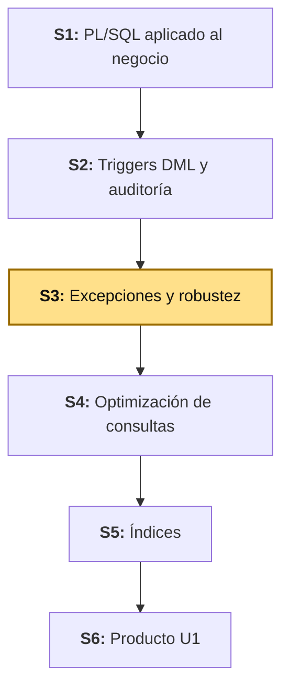
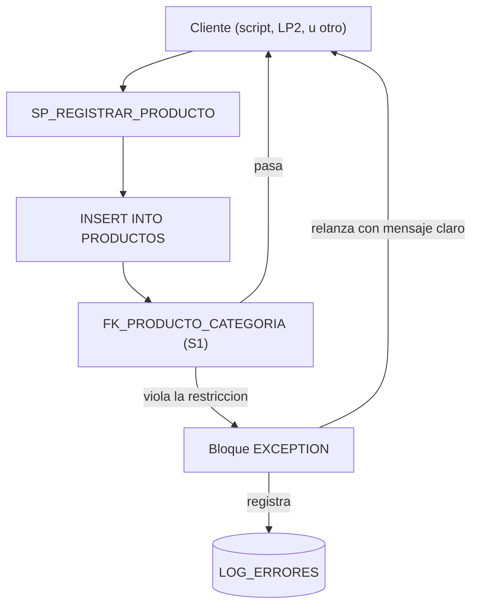

# S3 - Manejo de Excepciones y Robustez

## 1. Introducción

Tiempo: 20 min.

### 1.1 Presentación de la sesión

`SP_REGISTRAR_PRODUCTO` y `SP_APLICAR_DESCUENTO_PRODUCTO` (S1) funcionan mientras alguien los invoque con datos correctos — pero ninguno de los dos anticipa un error: si `p_id_categoria` no existe, Oracle rechaza el `INSERT` con un código interno (`ORA-02291`) que llega crudo hasta quien invocó el procedimiento, sin contexto ni registro; y `SP_APLICAR_DESCUENTO_PRODUCTO` acepta cualquier `p_porcentaje_descuento` — incluido `150` o `-30` — sin cuestionar si eso tiene sentido. Esta sesión agrega manejo de excepciones (predefinidas y personalizadas) y un registro de errores a esos mismos procedimientos, para que un fallo se capture, se documente y responda con un mensaje claro — en vez de propagar un error interno de Oracle sin explicación.

### 1.2 Índice

1. Excepciones predefinidas de PL/SQL.
2. Excepciones personalizadas: `PRAGMA EXCEPTION_INIT` y `RAISE_APPLICATION_ERROR`.
3. Registro de errores.
4. Tolerancia a fallos.

### 1.3 Propósito de aprendizaje

Al concluir la clase, estarás en condiciones de:

- **Incorporar** manejo de excepciones predefinidas y personalizadas en procedimientos y funciones PL/SQL reales, registrando cada fallo en una tabla de errores y respondiendo con un mensaje claro en vez de un código Oracle interno sin contexto.

### 1.4 Producto de sesión

`SP_REGISTRAR_PRODUCTO` y `SP_APLICAR_DESCUENTO_PRODUCTO` (S1) con manejo de excepciones agregado, una función nueva (`FN_OBTENER_PRECIO_PRODUCTO`) con manejo de `NO_DATA_FOUND`, y una tabla `LOG_ERRORES` que registra cada fallo capturado.

### 1.5 Metodología

**Tabla 1. Metodología de la sesión**

| Actividades a Realizar en el Periodo | Orientaciones generales (Orientaciones Metodológicas) | Material de estudio recomendado |
|---|---|---|
| Revisión previa individual | Revisar `SP_REGISTRAR_PRODUCTO` y `SP_APLICAR_DESCUENTO_PRODUCTO` de S1, y `TRG_PRODUCTO_AUDITORIA` de S2. Trabajo individual, antes de clase; identificar qué pasa hoy si se llama a `SP_REGISTRAR_PRODUCTO` con una categoría inexistente. | S1 (3.5), S2 (Tabla 2), sílabo BD2 U1. |
| Clase presencial | Incorporación guiada de manejo de excepciones y registro de errores sobre los procedimientos reales de S1. Trabajo individual en la propia laptop, siguiendo al docente paso a paso; consulta inmediata ante errores de compilación. | Script `S03_excepciones_robustez.sql`. |
| Evaluación formativa | Verificación en clase de cada excepción con un caso que la dispare, y de `LOG_ERRORES` con los registros generados. La evidencia se completa y sustenta de forma individual, fuera del aula, según los criterios mínimos de la sección 4.4. | Indicaciones de entrega (4.3), rúbrica de evaluación (4.6). |

### 1.6 Motivación de la sesión

#### 1.6.1 Caso: el error que nadie explicó

Ejecuta hoy `SP_REGISTRAR_PRODUCTO` con un `p_id_categoria` que no existe en `CATEGORIAS`, y Oracle responde así, sin que el procedimiento haga nada por explicarlo:

```text
ORA-02291: integrity constraint (BOM_CATALOGO.FK_PRODUCTO_CATEGORIA) violated - parent key not found
```

Quien recibe ese error (otro script, un desarrollador, o en el futuro LP2 si algún día invocara el procedimiento directo) no sabe, sin leer el mensaje interno de Oracle, que el problema es "la categoría no existe" — y no queda ningún registro de que ese intento fallido ocurrió. Esta sesión no cambia la restricción `FK_PRODUCTO_CATEGORIA` (sigue protegiendo la integridad, igual que en S1) — agrega una capa que **captura** ese fallo, lo **registra**, y responde con un mensaje que sí explica qué pasó.

**Preguntas de análisis**

**Activación de conocimientos previos**

1. `ORA-02291` no es uno de los nombres de excepción predefinidos de PL/SQL (`NO_DATA_FOUND`, `DUP_VAL_ON_INDEX`, etc.). ¿Cómo le pondrías nombre a un error de Oracle que no tiene uno ya definido?
2. LP2 (S3) ya valida que `categoriaId` exista **antes** de llamar al repositorio (`ProductoServiceImpl.buscarCategoriaOFallar`). Si LP2 ya lo previene, ¿por qué esta sesión igual lo maneja en Oracle?

**Comprensión de excepciones**

1. ¿Qué diferencia hay entre una excepción predefinida y una personalizada?
2. ¿Por qué registrar el error **antes** de volver a lanzarlo (no solo uno de los dos)?

### 1.7 Ubicación en el curso

- Unidad: U1 - Programación y optimización (Oracle XE).
- Producto del curso: base de datos empresarial Oracle operativa, administrada, optimizada, auditada y resiliente.
- Producto de unidad: motor transaccional Oracle optimizado.
- Avance del producto en esta sesión: manejo de excepciones y registro de errores sobre los procedimientos de `BOM_CATALOGO`.

Roadmap del producto de la unidad:

**Figura 1. Roadmap del producto de la unidad**



## 2. Explica

Tiempo: 25 min.

### 2.1 Arquitectura de la sesión

**Figura 2. Manejo de excepciones sobre `SP_REGISTRAR_PRODUCTO`**



Lectura del diagrama:

- La restricción `FK_PRODUCTO_CATEGORIA` (S1) sigue siendo la que impide el dato inválido — esta sesión no la reemplaza, agrega qué pasa **después** de que Oracle la rechaza.
- El bloque `EXCEPTION` captura el fallo, lo registra en `LOG_ERRORES`, y recién ahí decide: relanzar con un mensaje claro (tolerancia a fallos con visibilidad) o continuar, según el caso.
- Integración (referencia, no requisito para esta sesión): LP2 (S3) ya previene este caso específico validando `categoriaId` antes de escribir. Esta capa protege contra cualquier **otro** cliente que no pase por esa validación — mismo criterio que S2 (2.1) usó para los triggers.

Este diagrama es el mapa que guía el resto de la explicación: cada apartado siguiente desarrolla uno de sus componentes, en el mismo orden del Índice (1.2).

### 2.2 Excepciones predefinidas de PL/SQL

Oracle ya tiene nombre para los errores más comunes — no hace falta declararlos, solo capturarlos por su nombre en un bloque `EXCEPTION`.

**Tabla 2. Excepciones predefinidas más comunes**

| Excepción | Cuándo ocurre |
|---|---|
| `NO_DATA_FOUND` | Un `SELECT ... INTO` no encuentra ninguna fila. |
| `TOO_MANY_ROWS` | Un `SELECT ... INTO` encuentra más de una fila (esperaba exactamente una). |
| `DUP_VAL_ON_INDEX` | Un `INSERT`/`UPDATE` viola una restricción `UNIQUE` o la clave primaria. |
| `VALUE_ERROR` | Error de conversión o asignación (por ejemplo, un valor que no cabe en el tipo destino). |
| `ZERO_DIVIDE` | División entre cero. |
| `OTHERS` | No es una excepción específica — captura **cualquier** error no capturado antes por su nombre. Se usa como red de seguridad, nunca como la única rama. |

**Error frecuente**: usar `WHEN OTHERS THEN NULL` — captura el error y no hace nada, ni lo registra ni lo relanza. El fallo desaparece en silencio, sin que nadie se entere de que ocurrió; es peor que no manejarlo, porque simula que todo salió bien.

### 2.3 Excepciones personalizadas: `PRAGMA EXCEPTION_INIT` y `RAISE_APPLICATION_ERROR`

No todos los errores de Oracle tienen un nombre predefinido — `ORA-02291` (violación de llave foránea, el caso de 1.6.1) es uno de ellos. PL/SQL da dos formas de manejar esto, para dos necesidades distintas:

**Tabla 3. Dos formas de excepción personalizada**

| Forma | Qué hace | Cuándo usarla |
|---|---|---|
| `PRAGMA EXCEPTION_INIT` | Le pone nombre a un código de error de Oracle que **ya existe** pero no tiene uno predefinido (como `ORA-02291`). | Cuando el error lo genera Oracle mismo (una restricción, una conversión) y solo quieres capturarlo por nombre en vez de por código numérico. |
| `RAISE_APPLICATION_ERROR` | Genera un error **nuevo**, propio de tu lógica de negocio, con un código en el rango `-20000` a `-20999` (mismo rango que ya usó `TRG_PRODUCTO_PRECIO_BU` en S2) y un mensaje propio. | Cuando la regla no la rompe Oracle — la rompe tu propia validación (por ejemplo, un porcentaje de descuento fuera de rango). |

```sql
-- PRAGMA EXCEPTION_INIT: nombrar un error de Oracle sin nombre predefinido
DECLARE
    e_categoria_inexistente EXCEPTION;
    PRAGMA EXCEPTION_INIT(e_categoria_inexistente, -2291);
BEGIN
    ...
EXCEPTION
    WHEN e_categoria_inexistente THEN
        ...
END;
```

`PRAGMA EXCEPTION_INIT` no cambia el comportamiento de Oracle — solo le da un nombre legible a un código que ya existía, para poder escribir `WHEN e_categoria_inexistente` en vez de comparar `SQLCODE = -2291` a mano.

### 2.4 Registro de errores y tolerancia a fallos

**Registro de errores**: cada excepción capturada se guarda en una tabla propia (`LOG_ERRORES`), con el mismo criterio de auditoría que `PRODUCTO_AUDITORIA` (S2) — qué objeto falló, qué código de error, qué mensaje, cuándo y con qué usuario. `SQLCODE` y `SQLERRM` (dentro del bloque `EXCEPTION`) dan el código y el mensaje exacto que Oracle generó, disponibles solo ahí.

**Tolerancia a fallos**: no significa "que el error no pase" — significa que el sistema no se cae en silencio ni deja al que llama sin explicación. El patrón de esta sesión es: **capturar → registrar → relanzar con mensaje claro** (no solo capturar y registrar, ni solo capturar y relanzar sin registrar). Relanzar es importante: si `SP_REGISTRAR_PRODUCTO` traga la excepción sin relanzarla, quien lo invocó (LP2, otro script) cree que el producto se guardó cuando en realidad no.

## 3. Aplica: actividad práctica guiada

Tiempo: 2h.

**Actividad:** incorporación guiada de manejo de excepciones y registro de errores sobre `SP_REGISTRAR_PRODUCTO`, `SP_APLICAR_DESCUENTO_PRODUCTO` (S1) y una función nueva (Producto de la sesión en 1.4).

**Propósito de la actividad:** capturar excepciones predefinidas y personalizadas sobre procedimientos reales, registrar cada fallo en `LOG_ERRORES`, y verificar que cada caso responde con un mensaje claro en vez de un error interno de Oracle sin contexto.

**Orientaciones metodológicas:** en el laboratorio, el docente incorpora el manejo de excepciones paso a paso frente a la clase, probando cada uno con un caso que lo dispare; los estudiantes replican cada paso en su propio equipo, verificando `LOG_ERRORES` antes de continuar.

**Actividades para realizar:**

- **3.1** Definir el alcance de errores a manejar.
- **3.2** Crear la tabla `LOG_ERRORES`.
- **3.3** Incorporar excepciones en `SP_REGISTRAR_PRODUCTO`.
- **3.4** Incorporar una excepción personalizada en `SP_APLICAR_DESCUENTO_PRODUCTO`.
- **3.5** Crear `FN_OBTENER_PRECIO_PRODUCTO` con manejo de `NO_DATA_FOUND`.
- **3.6** Probar los tres con casos válidos e inválidos.
- **3.7** Relacionar con ADS y LP2.

**Script completo, listo para ejecutar** (el paso siguiente explica cada bloque): [`S03_excepciones_robustez.sql`](../../proyecto-integrador/u1/oracle/S03_excepciones_robustez.sql).

### 3.1 Definir el alcance de errores a manejar

**Producto del paso:** alcance de errores definido.

**Tabla 4. Alcance de errores de esta sesión**

| Objeto | Error a manejar | Tipo de excepción |
|---|---|---|
| `SP_REGISTRAR_PRODUCTO` | Categoría inexistente (`ORA-02291`) | Personalizada (`PRAGMA EXCEPTION_INIT`) |
| `SP_APLICAR_DESCUENTO_PRODUCTO` | Porcentaje de descuento fuera de `[0, 100]` | Personalizada (`RAISE_APPLICATION_ERROR`) |
| `FN_OBTENER_PRECIO_PRODUCTO` (nueva) | Producto inexistente | Predefinida (`NO_DATA_FOUND`) |

### 3.2 Crear la tabla `LOG_ERRORES`

**Producto del paso:** tabla `LOG_ERRORES` operativa en el esquema `BOM_CATALOGO`.

**Requisito antes de continuar:** conéctate como `BOM_CATALOGO` (misma conexión de S1, 3.2) — la tabla y los procedimientos de esta sesión son objetos de ese esquema, igual que `CATEGORIAS`, `PRODUCTOS` y `PRODUCTO_AUDITORIA` (S2).

```sql
CREATE TABLE BOM_CATALOGO.LOG_ERRORES (
    ID_LOG          NUMBER GENERATED BY DEFAULT AS IDENTITY PRIMARY KEY,
    OBJETO          VARCHAR2(60) NOT NULL,
    CODIGO_ERROR    NUMBER,
    MENSAJE_ERROR   VARCHAR2(500),
    FECHA_EVENTO    TIMESTAMP DEFAULT SYSTIMESTAMP,
    USUARIO_ORACLE  VARCHAR2(30) DEFAULT USER
);
```

Mismo criterio que `PRODUCTO_AUDITORIA` (S2): sin `FOREIGN KEY` hacia ninguna tabla — un registro de error debe poder guardarse aunque la operación que falló nunca haya llegado a escribir nada.

### 3.3 Incorporar excepciones en `SP_REGISTRAR_PRODUCTO`

**Producto del paso:** `SP_REGISTRAR_PRODUCTO` captura la categoría inexistente, la registra en `LOG_ERRORES`, y relanza con un mensaje claro.

```sql
CREATE OR REPLACE PROCEDURE BOM_CATALOGO.SP_REGISTRAR_PRODUCTO(
    p_id_categoria IN NUMBER,
    p_nombre IN VARCHAR2,
    p_precio IN NUMBER,
    p_stock IN NUMBER,
    p_id_producto OUT NUMBER
) IS
    e_categoria_inexistente EXCEPTION;
    PRAGMA EXCEPTION_INIT(e_categoria_inexistente, -2291);
BEGIN
    INSERT INTO BOM_CATALOGO.PRODUCTOS (ID_CATEGORIA, NOMBRE, PRECIO, STOCK)
    VALUES (p_id_categoria, p_nombre, p_precio, p_stock)
    RETURNING ID INTO p_id_producto;
EXCEPTION
    WHEN e_categoria_inexistente THEN
        INSERT INTO BOM_CATALOGO.LOG_ERRORES (OBJETO, CODIGO_ERROR, MENSAJE_ERROR)
        VALUES ('SP_REGISTRAR_PRODUCTO', SQLCODE, SQLERRM);
        RAISE_APPLICATION_ERROR(-20010, 'La categoria ' || p_id_categoria || ' no existe. Verifica el id antes de registrar el producto.');
END;
/
```

`e_categoria_inexistente` captura específicamente `ORA-02291`; cualquier otro error (uno que esta sesión no anticipó) sigue sin capturarse — y eso es intencional: capturar solo lo que sabés manejar, no todo con `WHEN OTHERS` (2.2). El `INSERT` a `LOG_ERRORES` ocurre **antes** del `RAISE_APPLICATION_ERROR`: si se invirtiera el orden, el procedimiento terminaría en el `RAISE` y el registro nunca se ejecutaría.

### 3.4 Incorporar una excepción personalizada en `SP_APLICAR_DESCUENTO_PRODUCTO`

**Producto del paso:** `SP_APLICAR_DESCUENTO_PRODUCTO` rechaza un porcentaje fuera de rango, con registro y mensaje propio.

```sql
CREATE OR REPLACE PROCEDURE BOM_CATALOGO.SP_APLICAR_DESCUENTO_PRODUCTO(
    p_precio IN OUT NUMBER,
    p_porcentaje_descuento IN NUMBER
) IS
BEGIN
    IF p_porcentaje_descuento < 0 OR p_porcentaje_descuento > 100 THEN
        INSERT INTO BOM_CATALOGO.LOG_ERRORES (OBJETO, CODIGO_ERROR, MENSAJE_ERROR)
        VALUES ('SP_APLICAR_DESCUENTO_PRODUCTO', -20011, 'Porcentaje fuera de rango: ' || p_porcentaje_descuento);
        RAISE_APPLICATION_ERROR(-20011, 'El porcentaje de descuento debe estar entre 0 y 100. Recibido: ' || p_porcentaje_descuento);
    END IF;

    p_precio := p_precio - (p_precio * p_porcentaje_descuento / 100);
END;
/
```

A diferencia de 3.3 (donde el error lo genera Oracle y esta sesión solo lo captura), acá el error **no existe hasta que este procedimiento lo crea** — nadie más que esta regla de negocio sabe que un descuento de `150%` no tiene sentido. Por eso no hace falta `PRAGMA EXCEPTION_INIT`: no hay ningún código de Oracle que nombrar, se genera uno propio directo con `RAISE_APPLICATION_ERROR`.

### 3.5 Crear `FN_OBTENER_PRECIO_PRODUCTO` con manejo de `NO_DATA_FOUND`

**Producto del paso:** función nueva que consulta el precio de un producto, manejando el caso de id inexistente.

```sql
CREATE OR REPLACE FUNCTION BOM_CATALOGO.FN_OBTENER_PRECIO_PRODUCTO(
    p_id_producto IN NUMBER
) RETURN NUMBER IS
    v_precio NUMBER;
BEGIN
    SELECT PRECIO INTO v_precio
    FROM BOM_CATALOGO.PRODUCTOS
    WHERE ID = p_id_producto;

    RETURN v_precio;
EXCEPTION
    WHEN NO_DATA_FOUND THEN
        INSERT INTO BOM_CATALOGO.LOG_ERRORES (OBJETO, CODIGO_ERROR, MENSAJE_ERROR)
        VALUES ('FN_OBTENER_PRECIO_PRODUCTO', SQLCODE, 'Producto no encontrado: ' || p_id_producto);
        RAISE_APPLICATION_ERROR(-20012, 'No existe un producto con id ' || p_id_producto);
END;
/
```

`SELECT ... INTO` es exactamente el tipo de sentencia donde `NO_DATA_FOUND` aparece en la práctica: espera **una** fila, y si la consulta no encuentra ninguna, PL/SQL la lanza automáticamente — no hace falta un `IF` para comprobarlo antes.

### 3.6 Probar los tres con casos válidos e inválidos

**Producto del paso:** evidencia de ejecución de los tres casos.

Caso válido — registrar un producto con categoría real, aplicar un descuento razonable, y consultar su precio:

```sql
DECLARE
    v_id_producto NUMBER;
    v_precio NUMBER := 100.00;
BEGIN
    BOM_CATALOGO.SP_REGISTRAR_PRODUCTO(1, 'Teclado de prueba', 100.00, 15, v_id_producto);
    BOM_CATALOGO.SP_APLICAR_DESCUENTO_PRODUCTO(v_precio, 20);
    DBMS_OUTPUT.PUT_LINE('Producto: ' || v_id_producto || ', precio con descuento (variable local): ' || v_precio);
    DBMS_OUTPUT.PUT_LINE('Precio real en BD: ' || BOM_CATALOGO.FN_OBTENER_PRECIO_PRODUCTO(v_id_producto));
END;
/
```

Caso inválido 1 — categoría inexistente (debe fallar con `ORA-20010`):

```sql
DECLARE
    v_id_producto NUMBER;
BEGIN
    BOM_CATALOGO.SP_REGISTRAR_PRODUCTO(999999, 'Producto sin categoria', 50.00, 5, v_id_producto);
END;
/
```

Caso inválido 2 — porcentaje de descuento fuera de rango (debe fallar con `ORA-20011`):

```sql
DECLARE
    v_precio NUMBER := 100.00;
BEGIN
    BOM_CATALOGO.SP_APLICAR_DESCUENTO_PRODUCTO(v_precio, 150);
END;
/
```

Caso inválido 3 — producto inexistente (debe fallar con `ORA-20012`):

```sql
SELECT BOM_CATALOGO.FN_OBTENER_PRECIO_PRODUCTO(999999) FROM DUAL;
```

Verifica que los tres casos inválidos quedaron registrados:

```sql
SELECT OBJETO, CODIGO_ERROR, MENSAJE_ERROR, FECHA_EVENTO
FROM BOM_CATALOGO.LOG_ERRORES
ORDER BY ID_LOG DESC;
```

Salida esperada (tres filas, una por cada caso inválido — el caso válido no genera ningún registro en `LOG_ERRORES`):

```text
OBJETO                          CODIGO_ERROR   MENSAJE_ERROR
------------------------------  ------------   ------------------------------------
FN_OBTENER_PRECIO_PRODUCTO      100            Producto no encontrado: 999999
SP_APLICAR_DESCUENTO_PRODUCTO   -20011         Porcentaje fuera de rango: 150
SP_REGISTRAR_PRODUCTO           -2291          ORA-02291: integrity constraint ...
```

`SQLCODE` de `NO_DATA_FOUND` es `100` (no un número negativo `-20XXX`) — es una de las pocas excepciones predefinidas con código positivo; el resto de errores de Oracle (incluidos los de aplicación con `RAISE_APPLICATION_ERROR`) son negativos.

### 3.7 Relacionar con ADS y LP2

**Producto del paso:** matriz de integración.

**Tabla 5. Matriz de integración BD2-ADS-LP2 (S3)**

| Objeto BD2 | Decisión ADS | Endpoint o servicio LP2 |
|---|---|---|
| `SP_REGISTRAR_PRODUCTO` (excepción de categoría) | Tolerancia a fallos (atributo de calidad, ver ADS S1) | `POST /api/v1/productos` — LP2 ya previene este caso en `ProductoServiceImpl.buscarCategoriaOFallar()` (LP2 S3); esta capa protege a cualquier otro cliente. |
| `SP_APLICAR_DESCUENTO_PRODUCTO` (rango de descuento) | Regla de negocio protegida sin importar el cliente (mismo criterio que S2) | Ninguno directo — LP2 todavía no expone un endpoint de descuento. |
| `LOG_ERRORES` | Auditabilidad y diagnóstico (ADS S1) | Complementa (no reemplaza) los logs con `traceId` de LP2 (S2, 3.2.2) — `LOG_ERRORES` registra fallos dentro de Oracle; el `traceId` rastrea la petición HTTP completa. |

Sesión equivalente en los otros dos cursos, misma semana: [ADS - S3 Diseño Estructural y Principios SOLID](../../ads/sesiones/S03_Diseno_Estructural_Principios_SOLID.md) y [LP2 - S3 Objetos Relacionados Categoria-Producto](../../lp2/sesiones/S03_Objetos_Relacionados_Categoria_Producto.md).

**Evidencia de aprendizaje:**

- Tabla `LOG_ERRORES` creada en el esquema `BOM_CATALOGO`.
- `SP_REGISTRAR_PRODUCTO` con excepción personalizada (`PRAGMA EXCEPTION_INIT`) probada con caso inválido.
- `SP_APLICAR_DESCUENTO_PRODUCTO` con excepción personalizada (`RAISE_APPLICATION_ERROR`) probada con caso inválido.
- `FN_OBTENER_PRECIO_PRODUCTO` con manejo de `NO_DATA_FOUND` probado.
- `LOG_ERRORES` verificado con los tres registros de los casos inválidos.
- Matriz de integración con ADS y LP2.

## 4. Crea: actividad autónoma

Tiempo: 2h fuera del aula.

### 4.1 Actividad

Incorporación autónoma de manejo de excepciones (predefinidas y personalizadas) y registro de errores sobre los procedimientos/funciones del proyecto propio del equipo, documentada en evidencia individual.

Completa y evidencia estas tareas:

1. Identificar al menos un error real que hoy no está manejado en tus procedimientos/funciones (S1 propio).
2. Crear tu propia tabla de registro de errores.
3. Incorporar al menos una excepción predefinida (`NO_DATA_FOUND`, `DUP_VAL_ON_INDEX`, u otra).
4. Incorporar al menos una excepción personalizada (`PRAGMA EXCEPTION_INIT` o `RAISE_APPLICATION_ERROR`).
5. Ejecutar un caso válido y uno por cada excepción incorporada.
6. Verificar los registros de tu tabla de errores con una consulta.

### 4.2 Propósito

Que cada estudiante demuestre, de forma individual y fuera del aula, que puede reproducir el patrón de manejo de excepciones construido en clase sin el acompañamiento del docente.

Cada estudiante adapta el ejemplo a los procedimientos/funciones de su propio proyecto.

### 4.3 Indicaciones

Entrega un PDF con el siguiente nombre:

```text
S03_BD2_Equipo##_ApellidoNombre.pdf
```

Cada captura de pantalla del informe debe mostrar, sin recortar, el reloj del sistema (fecha y hora) y tu usuario o foto de perfil (Windows, VS Code o navegador) visibles en pantalla — es lo que permite verificar que la evidencia es tuya y que corresponde al momento real de tu trabajo.

#### 4.3.1 Estructura del informe

**Datos del estudiante**

- Nombre:
- Equipo:
- Sesión: S03 - Manejo de Excepciones y Robustez
- Rol o aporte realizado:
- Link de GitHub:

**Evidencia técnica**

Incluye capturas o salidas con una breve explicación debajo de cada una, organizadas en los mismos 4 bloques de la rúbrica (4.6) — así queda claro qué evidencia corresponde a cada criterio evaluado:

1. *Tabla de registro de errores*
    - Script SQL de creación de la tabla.
2. *Excepción predefinida*
    - Script del bloque que la maneja, con explicación de cuándo ocurre.
    - Caso que la dispara, con el error mostrado.
3. *Excepción personalizada*
    - Script del bloque (`PRAGMA EXCEPTION_INIT` o `RAISE_APPLICATION_ERROR`), con explicación de la regla.
    - Caso que la dispara.
4. *Evidencia de ejecución y registro*
    - Caso válido ejecutado.
    - Consulta a la tabla de errores con los registros generados.

**Error o hallazgo**

Describe un error técnico encontrado: excepción no capturada correctamente, `WHEN OTHERS` mal usado, o un caso donde el registro y el relanzamiento quedaron en el orden incorrecto.

**Reflexión técnica breve**

Responde en 5 a 8 líneas:

```text
¿Por qué capturar un error y no volver a lanzarlo puede ser peor que no
manejarlo? Relaciona tu respuesta con el caso de 1.6.1.
```

### 4.4 Criterios mínimos de aceptación

La evidencia individual se considera completa si:

- El archivo respeta el nombre solicitado.
- Crea una tabla de registro de errores, sin `FOREIGN KEY` hacia la tabla que audita.
- Incorpora al menos una excepción predefinida, con caso de prueba.
- Incorpora al menos una excepción personalizada, con caso de prueba.
- Cada excepción capturada se registra **antes** de relanzarse (no una sola de las dos acciones).
- No usa `WHEN OTHERS THEN NULL` como manejo de error.
- Verifica los registros de la tabla de errores con una consulta.
- Cada captura de la evidencia técnica muestra el reloj del sistema y el usuario/perfil visible, sin recortar.
- Las fechas y horas de las capturas son coherentes con el historial de commits de su repositorio en GitHub.
- Incluye un error o hallazgo técnico diagnosticado.
- Incluye la reflexión técnica breve solicitada.

### 4.5 Preguntas de defensa

1. ¿Qué excepción predefinida usaste y en qué situación real ocurre?
2. ¿Por qué tu excepción personalizada necesitó `PRAGMA EXCEPTION_INIT` o `RAISE_APPLICATION_ERROR` — cuál de los dos, y por qué ese y no el otro?
3. ¿Qué pasaría si tu procedimiento registrara el error pero no lo relanzara?
4. ¿Qué diferencia hay entre el código de `SQLCODE` de una excepción predefinida como `NO_DATA_FOUND` y uno generado con `RAISE_APPLICATION_ERROR`?

### 4.6 Rúbrica de evaluación

**Tabla 6. Rúbrica de evaluación**

| Criterio | Peso (%) | A (20 pts) | B (15 pts) | C (10 pts) | D (5 pts) | Nivel obtenido |
|---|---:|---|---|---|---|---:|
| 1. Tabla de registro de errores* | 20 | Tabla bien diseñada, sin `FOREIGN KEY` hacia la tabla auditada. | Tabla funcional, con algún detalle menor. | Tabla incompleta o mal diseñada. | No crea tabla de errores. | |
| 2. Excepción predefinida* | 25 | Excepción predefinida correcta, con caso de prueba claro y explicación de cuándo ocurre. | Excepción funcional, con explicación básica. | Excepción incompleta o mal aplicada. | No presenta excepción predefinida. | |
| 3. Excepción personalizada* | 25 | Excepción personalizada correcta (forma adecuada al caso), con caso de prueba claro. | Excepción funcional, con detalles menores. | Excepción incompleta o forma incorrecta para el caso. | No presenta excepción personalizada. | |
| 4. Evidencia de ejecución y registro* | 30 | Casos válido e inválidos ejecutados, registro verificado con orden correcto (registrar antes de relanzar). | Evidencia suficiente, con algún detalle menor. | Evidencia incompleta o orden incorrecto. | No evidencia ejecución. | |

\* Agregado manual.

Nota final = suma de (`Peso` / 100 × `Puntos del nivel obtenido`) = ____ / 20.

Para usar la rúbrica con IA, solicita:

```text
Evalúa el PDF usando la rúbrica de la sesión.
Para cada criterio selecciona el nivel obtenido usando la escala A=20, B=15, C=10, D=5 puntos.
Justifica brevemente cada nivel asignado.
Verifica que cada captura muestre reloj del sistema y usuario/perfil visible, y que las fechas sean coherentes con el historial de commits de GitHub. Si falta esta evidencia o hay inconsistencias, indícalo explícitamente antes de calificar.
Calcula la nota final con la fórmula: suma de (Peso/100 × Puntos del nivel obtenido), directamente sobre 20.
Indica 2 fortalezas y 2 recomendaciones.
```

## 5. Cierre

Tiempo: 5 min.

**Resumen breve:** hoy los procedimientos de S1 dejaron de fallar en silencio o con un error interno de Oracle sin contexto — cada fallo anticipado (categoría inexistente, descuento fuera de rango, producto inexistente) se captura, se registra en `LOG_ERRORES`, y responde con un mensaje claro, sin dejar de propagar el error para que quien invocó el procedimiento sepa que la operación no se completó.

**Dinámica participativa:** en una ronda rápida, cada estudiante comparte en una frase qué error real encontró al probar su propio proyecto antes de manejarlo.

**Metacognición:** cada estudiante responde en voz alta o por escrito: ¿qué parte de la sesión te costó más entender, y cómo la resolviste?

**Proyección:** el registro de errores de hoy es insumo directo para S4 (optimización de consultas) — un `LOG_ERRORES` con volumen real es también el primer candidato a necesitar un índice propio, y las excepciones bien manejadas evitan que una consulta mal optimizada falle en silencio en vez de reportar el problema.

## Bibliografía

1. Oracle Corporation. (2024). *Oracle Database Free 23ai documentation*. https://docs.oracle.com/en/database/oracle/oracle-database/23/
2. Oracle Corporation. (2024). *Database PL/SQL language reference - Handling PL/SQL Errors*. https://docs.oracle.com/en/database/oracle/oracle-database/23/lnpls/
