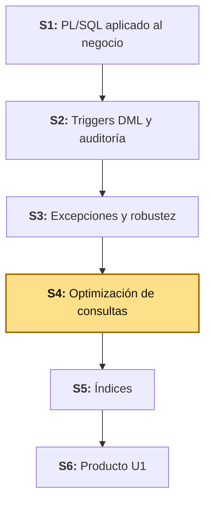
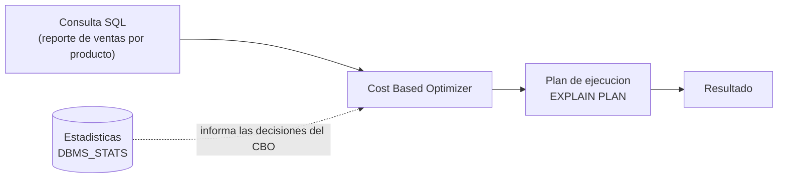

# S4 - Optimización de Consultas SQL

## 1. Introducción

Tiempo: 20 min.

### 1.1 Presentación de la sesión

Hasta ahora, el volumen de datos trabajado fue pequeño — suficiente para probar procedimientos, funciones y excepciones, no para que una consulta lenta se note. Esta sesión trabaja con volumen real de prueba para que el motor de la base de datos tenga algo genuino que decidir: cómo elige un plan de ejecución, qué información necesita para elegir bien, y cómo la forma de escribir una consulta influye en esa elección — sin recurrir todavía a ningún índice nuevo, eso es exactamente el alcance de la sesión siguiente, no de esta.

### 1.2 Índice

1. Cost Based Optimizer (CBO).
2. Explain Plan.
3. DBMS_STATS.
4. Buenas prácticas SQL.

### 1.3 Propósito de aprendizaje

Al concluir la clase, estarás en condiciones de:

- **Analizar y optimizar** una consulta representativa del proyecto, actualizando la información que el optimizador usa para decidir y aplicando buenas prácticas de escritura SQL — documentando evidencia real de antes y después.

### 1.4 Producto de sesión

Esquema `BOM_VENTAS` con `VENTAS`/`DETALLE_VENTAS` operativas y con volumen de prueba, más una consulta representativa del proyecto (reporte de ventas por producto) optimizada: `EXPLAIN PLAN` capturado antes y después de actualizar estadísticas con `DBMS_STATS` y de reescribir la consulta aplicando una buena práctica SQL concreta.

### 1.5 Metodología

**Tabla 1. Metodología de la sesión**

| Actividades a Realizar en el Periodo | Orientaciones generales (Orientaciones Metodológicas) | Material de estudio recomendado |
|---|---|---|
| Revisión previa individual | Repasar `BOM_CATALOGO.PRODUCTOS` (S1) y el criterio de "un esquema por módulo funcional" (S1, 3.2). Trabajo individual, antes de clase; anotar cuántas filas tiene hoy `PRODUCTOS` en tu propia base. | S1 (3.2), sílabo BD2 U1. |
| Clase presencial | Creación guiada del esquema `BOM_VENTAS`, carga de volumen de prueba, análisis de `EXPLAIN PLAN` antes y después de `DBMS_STATS` y de una buena práctica SQL. Trabajo individual en la propia laptop, siguiendo al docente paso a paso. | Script `S04_optimizacion_consultas.sql`. |
| Evaluación formativa | Verificación en clase de `EXPLAIN PLAN` capturado antes y después, con al menos un cambio identificado en el plan. La evidencia se completa y sustenta de forma individual, fuera del aula, según los criterios mínimos de la sección 4.4. | Indicaciones de entrega (4.3), rúbrica de evaluación (4.6). |

### 1.6 Motivación de la sesión

#### 1.6.1 Caso: la consulta que funciona pero es lenta

Una consulta que devuelve el resultado correcto no está necesariamente bien — puede estar recorriendo cientos de miles de filas una por una cuando existía una forma de responder lo mismo revisando muchas menos. Con `PRODUCTOS`/`CATEGORIAS` casi vacías (S1-S3), esa diferencia era invisible: cualquier plan de ejecución respondía en milisegundos, sin importar si era el mejor plan o no. Recién con volumen real — el que esta sesión carga en `BOM_VENTAS` — el costo de una mala consulta se vuelve medible, y `EXPLAIN PLAN` deja de ser un ejercicio teórico.

**Preguntas de análisis**

**Activación de conocimientos previos**

1. ¿Alguna vez una consulta te dio el resultado correcto pero tardó visiblemente más de lo esperado? ¿Llegaste a averiguar por qué?

**Comprensión de optimización de consultas**

1. ¿Por qué el optimizador de Oracle necesita estadísticas (`DBMS_STATS`) para decidir un buen plan, en vez de simplemente ejecutar la consulta tal como está escrita?
2. Si una consulta filtra `FECHA` envuelta en una función (`TRUNC(SYSDATE) - TRUNC(v.FECHA) <= 30`), ¿por qué eso limita las opciones del optimizador, aunque hoy no exista ningún índice sobre `FECHA`?

### 1.7 Ubicación en el curso

- Unidad: U1 - Programación y optimización (Oracle XE).
- Producto del curso: base de datos empresarial Oracle operativa, administrada, optimizada, auditada y resiliente.
- Producto de unidad: motor transaccional Oracle optimizado.
- Avance del producto en esta sesión: esquema `BOM_VENTAS` creado, y primera consulta representativa optimizada con `EXPLAIN PLAN`/`DBMS_STATS`/buenas prácticas.

Roadmap del producto de la unidad:

**Figura 1. Roadmap del producto de la unidad**



## 2. Explica

Tiempo: 25 min.

### 2.1 Arquitectura de la sesión

**Figura 2. De la consulta al plan de ejecución, y de vuelta**



Lectura del diagrama: el CBO no ejecuta la consulta tal como está escrita — primero decide **cómo** ejecutarla (qué tabla recorrer primero, qué método de join usar, si conviene un `FULL TABLE SCAN`) basado en las estadísticas que tiene disponibles. `EXPLAIN PLAN` no muestra el resultado de la consulta — muestra esa decisión, antes de correrla. Esta sesión trabaja sobre las dos entradas que el CBO usa para decidir mejor: estadísticas actualizadas (`DBMS_STATS`) y una consulta escrita de forma que no le oculte información al optimizador (buenas prácticas SQL).

Este diagrama es el mapa que guía el resto de la explicación: cada apartado siguiente desarrolla uno de sus componentes, en el mismo orden del Índice (1.2).

### 2.2 Cost Based Optimizer (CBO)

`BOM_VENTAS` es el segundo esquema del proyecto, con el mismo criterio de "un esquema por módulo funcional" que ya estableció `BOM_CATALOGO` en S1 — se crea recién ahora porque LP2 llega a su módulo `ventas` esta misma semana (LP2 S4), con volumen de prueba real cargado sobre él: sin datos, no hay nada que el optimizador tenga que decidir de verdad.

El **Cost Based Optimizer** es el componente de Oracle que decide, para cada consulta, el plan de ejecución con el menor costo estimado — no necesariamente el más rápido en la realidad, sino el que el CBO *cree* más barato según las estadísticas que tiene disponibles en ese momento (qué tabla recorrer primero, qué método de *join* usar, si conviene un `FULL TABLE SCAN`). Esa decisión es exactamente lo que el resto de esta sesión analiza y, cuando corresponde, ayuda a mejorar.

**Decisión de diseño: `DETALLE_VENTAS.ID_PRODUCTO` no lleva `FOREIGN KEY` hacia `BOM_CATALOGO.PRODUCTOS`.** Podría parecer natural agregarla — Oracle sí permite claves foráneas entre esquemas distintos, con los privilegios adecuados — pero eso acoplaría el DDL de `BOM_VENTAS` a la estructura interna de `BOM_CATALOGO`, exactamente lo que la separación por esquemas busca evitar. `DETALLE_VENTAS` guarda `ID_PRODUCTO` como número simple, más una copia de `NOMBRE_PRODUCTO` y `PRECIO_UNITARIO` al momento de la venta — es el mismo criterio, a nivel de esquema Oracle, que LP2 aplica a nivel de módulo Java con `@NamedInterface` (LP2 S4, 2.4): ninguno de los dos referencia directamente el objeto interno del otro módulo/esquema.

### 2.3 Explain Plan

`EXPLAIN PLAN` muestra la decisión del CBO sin ejecutar la consulta:

```sql
EXPLAIN PLAN FOR
<tu consulta aqui>;

SELECT * FROM TABLE(DBMS_XPLAN.DISPLAY);
```

La salida incluye, entre otras columnas, `OPERATION` (qué hace cada paso: `TABLE ACCESS FULL`, `HASH JOIN`, `NESTED LOOPS`), `COST` (el costo estimado, no un tiempo real) y `ROWS` (cuántas filas espera el CBO en ese paso). Comparar un plan "antes" y un plan "después" de un cambio significa comparar esas columnas, no solo mirar si la consulta "corrió rápido" una vez — el tiempo real varía según la carga del servidor en ese instante; el plan es la decisión estructural.

**Error frecuente**: interpretar `COST` como milisegundos o como una medida absoluta comparable entre consultas distintas. `COST` es una estimación relativa del CBO, útil para comparar **el mismo tipo de operación** antes y después de un cambio (más estadísticas, una consulta reescrita) — no para comparar dos consultas que hacen cosas distintas entre sí.

### 2.4 `DBMS_STATS`: por qué el optimizador necesita estadísticas actualizadas

El CBO no adivina cuántas filas tiene una tabla ni cómo se distribuyen sus valores — lee esa información de las estadísticas que Oracle guarda sobre cada tabla (`NUM_ROWS`, distribución de valores por columna, etc.). Una tabla recién cargada con datos nuevos, sin que nadie haya vuelto a calcular sus estadísticas, puede hacer que el CBO decida con información vieja o inexistente — el mismo problema que decidir sin datos actualizados en cualquier otro contexto.

```sql
EXEC DBMS_STATS.GATHER_TABLE_STATS('BOM_VENTAS', 'DETALLE_VENTAS');
```

`GATHER_TABLE_STATS` recibe el esquema y la tabla, y recalcula sus estadísticas contra los datos reales que hay en ese momento. No cambia ni un solo dato de la tabla — solo actualiza lo que el CBO sabe sobre ella.

**Error frecuente**: cargar un volumen grande de datos de prueba y ejecutar `EXPLAIN PLAN` inmediatamente después, sin correr `DBMS_STATS` — el plan que se ve todavía puede estar basado en estadísticas de cuando la tabla estaba casi vacía (o sin estadísticas en absoluto), no en el volumen real que se acaba de cargar.

### 2.5 Buenas prácticas SQL que cambian el plan de ejecución

No toda mejora de una consulta requiere un índice nuevo (eso es S5) — cómo se **escribe** la consulta también le da o le quita información al CBO. Dos prácticas concretas, aplicables desde hoy:

**Tabla 2. Buenas prácticas SQL que afectan el plan, sin tocar índices**

| Práctica | Por qué importa |
|---|---|
| No envolver la columna filtrada en una función (`TRUNC(v.FECHA)`, `UPPER(p.NOMBRE)`) | Una función sobre la columna oculta su valor real al optimizador — hoy limita las estadísticas que el CBO puede aprovechar sobre esa columna; en S5, además, invalida directamente el uso de un índice sobre esa columna. |
| Mover el cálculo al lado de la constante, no de la columna (`v.FECHA >= SYSDATE - 30`, no `TRUNC(SYSDATE) - TRUNC(v.FECHA) <= 30`) | Es la misma condición lógica, pero la columna queda "limpia" — el CBO puede evaluarla directamente en vez de calcular una expresión por cada fila. |
| Evitar `SELECT *` cuando solo se necesitan algunas columnas | Reduce el volumen de datos que Oracle tiene que leer y transportar, incluso antes de pensar en índices. |
| Usar variables *bind* en vez de literales concatenados (relevante para cualquier cliente, incluido LP2/JPA) | Oracle reutiliza el plan ya calculado para la misma forma de consulta, en vez de volver a analizarla (*hard parse*) cada vez que cambia un literal. |

La práctica que esta sesión aplica de punta a punta es la segunda (3.6) — las otras tres quedan documentadas aquí como criterio general, no como pasos obligatorios de esta sesión.

## 3. Aplica: actividad práctica guiada

Tiempo: 2h.

**Actividad:** creación del esquema `BOM_VENTAS`, carga de volumen de prueba, y optimización guiada de una consulta representativa del proyecto con `EXPLAIN PLAN`, `DBMS_STATS` y una buena práctica SQL (Producto de la sesión en 1.4).

**Propósito de la actividad:** analizar el plan de ejecución de una consulta real antes y después de dos cambios independientes — estadísticas actualizadas y una reescritura de la consulta — documentando evidencia concreta de cada uno, sin recurrir a índices nuevos (S5).

**Orientaciones metodológicas:** en el laboratorio, el docente construye `BOM_VENTAS`, carga el volumen de prueba y compara los planes paso a paso frente a la clase; los estudiantes replican cada paso en su propio equipo, capturando su propio `EXPLAIN PLAN` antes y después (los valores de `COST` variarán entre equipos según el volumen real cargado — lo que se evalúa es el cambio, no un número exacto).

**Actividades para realizar:**

- **3.1** Definir la consulta representativa a optimizar.
- **3.2** Crear el esquema `BOM_VENTAS` y sus tablas.
- **3.3** Cargar volumen de prueba en `VENTAS`/`DETALLE_VENTAS`.
- **3.4** Capturar el `EXPLAIN PLAN` antes de optimizar.
- **3.5** Actualizar estadísticas con `DBMS_STATS`.
- **3.6** Reescribir la consulta aplicando una buena práctica SQL.
- **3.7** Capturar el `EXPLAIN PLAN` después y comparar.
- **3.8** Relacionar con ADS y LP2.

**Script completo, listo para ejecutar** (los pasos siguientes explican cada bloque): [`S04_optimizacion_consultas.sql`](../../proyecto-integrador/u1/oracle/S04_optimizacion_consultas.sql).

### 3.1 Definir la consulta representativa a optimizar

**Producto del paso:** la consulta que esta sesión analiza y mejora de punta a punta.

**Tabla 3. Consulta representativa de esta sesión**

| Elemento | Respuesta |
|---|---|
| Propósito de negocio | Reporte de ventas por producto: unidades y monto total vendido, filtrado a los últimos 30 días |
| Tablas involucradas | `BOM_VENTAS.DETALLE_VENTAS`, `BOM_VENTAS.VENTAS`, `BOM_CATALOGO.PRODUCTOS` (dos esquemas) |
| Problema a evitar en la versión inicial | Filtro de fecha con función sobre la columna (`TRUNC(v.FECHA)`), en vez de dejarla libre |
| Qué NO se hace en esta sesión | Crear ningún índice — eso es S5 |

### 3.2 Crear el esquema `BOM_VENTAS` y sus tablas

**Producto del paso:** esquema `BOM_VENTAS` con `VENTAS`/`DETALLE_VENTAS` operativas, y `BOMERP_APP` con permisos sobre ambas — igual que ya tiene sobre `BOM_CATALOGO` desde S1.

Con una cuenta DBA, crea el usuario propietario del nuevo esquema, con la misma contraseña fija de ambiente DEV que ya usa `BOM_CATALOGO` (S1, 3.2):

```sql
CREATE USER BOM_VENTAS IDENTIFIED BY "123456" QUOTA UNLIMITED ON USERS;
GRANT CREATE SESSION, CREATE TABLE, CREATE VIEW, CREATE PROCEDURE, CREATE TRIGGER TO BOM_VENTAS;
```

Conectado como `BOM_VENTAS`, crea las tablas:

```sql
CREATE TABLE BOM_VENTAS.VENTAS (
    ID      NUMBER GENERATED BY DEFAULT AS IDENTITY PRIMARY KEY,
    FECHA   TIMESTAMP NOT NULL,
    ESTADO  VARCHAR2(20) NOT NULL,
    TOTAL   NUMBER(12,2) NOT NULL,
    CONSTRAINT CK_VENTA_TOTAL CHECK (TOTAL >= 0)
);

CREATE TABLE BOM_VENTAS.DETALLE_VENTAS (
    ID               NUMBER GENERATED BY DEFAULT AS IDENTITY PRIMARY KEY,
    ID_VENTA         NUMBER NOT NULL,
    ID_PRODUCTO      NUMBER NOT NULL,
    NOMBRE_PRODUCTO  VARCHAR2(120) NOT NULL,
    PRECIO_UNITARIO  NUMBER(10,2) NOT NULL,
    CANTIDAD         NUMBER(10) NOT NULL,
    SUBTOTAL         NUMBER(12,2) NOT NULL,
    CONSTRAINT FK_DETALLE_VENTA FOREIGN KEY (ID_VENTA)
        REFERENCES BOM_VENTAS.VENTAS(ID),
    CONSTRAINT CK_DETALLE_CANTIDAD CHECK (CANTIDAD > 0),
    CONSTRAINT CK_DETALLE_SUBTOTAL CHECK (SUBTOTAL >= 0)
);
```

Nota que `FK_DETALLE_VENTA` referencia `VENTAS` (misma tabla, mismo esquema) — es la relación cabecera-detalle real, dentro de `BOM_VENTAS`. `ID_PRODUCTO` no tiene `FOREIGN KEY` hacia `BOM_CATALOGO.PRODUCTOS` (2.2): a propósito, no por descuido.

Concede a `BOMERP_APP` (el mismo usuario técnico que ya opera `BOM_CATALOGO` desde S1) los permisos que el backend de LP2 necesita sobre las tablas nuevas:

```sql
GRANT SELECT, INSERT, UPDATE, DELETE ON BOM_VENTAS.VENTAS TO BOMERP_APP;
GRANT SELECT, INSERT, UPDATE, DELETE ON BOM_VENTAS.DETALLE_VENTAS TO BOMERP_APP;
```

**Error frecuente**: olvidar estos `GRANT`. Sin ellos, el backend de LP2 (conectado como `BOMERP_APP`) compila y arranca sin error, pero cualquier operación sobre `Venta`/`DetalleVenta` falla en tiempo de ejecución con `ORA-01031: insufficient privileges` — un error que solo aparece al primer intento real de guardar una venta, no antes.

### 3.3 Cargar volumen de prueba en `VENTAS`/`DETALLE_VENTAS`

**Producto del paso:** suficiente volumen de datos para que el CBO tenga algo real que optimizar — con tablas casi vacías, cualquier plan responde igual de rápido y la comparación de esta sesión no muestra nada.

Antes de continuar, confirma que `BOM_CATALOGO.PRODUCTOS` tiene al menos un producto real (de S1-S3):

```sql
SELECT ID, NOMBRE FROM BOM_CATALOGO.PRODUCTOS WHERE ROWNUM <= 5;
```

Conectado como `BOMERP_APP`, carga ventas y detalles de prueba, distribuidos en los últimos 90 días y usando los productos que ya existan (ajusta el rango de `ID_PRODUCTO` a los ids reales de tu propia base — el bloque usa `MOD` para no depender de un id fijo):

```sql
DECLARE
    v_id_venta      NUMBER;
    v_max_producto  NUMBER;
BEGIN
    SELECT MAX(ID) INTO v_max_producto FROM BOM_CATALOGO.PRODUCTOS;

    FOR i IN 1..500 LOOP
        INSERT INTO BOM_VENTAS.VENTAS (FECHA, ESTADO, TOTAL)
        VALUES (SYSTIMESTAMP - MOD(i, 90), 'REGISTRADA', 0)
        RETURNING ID INTO v_id_venta;

        FOR j IN 1..(MOD(i, 3) + 1) LOOP
            INSERT INTO BOM_VENTAS.DETALLE_VENTAS
                (ID_VENTA, ID_PRODUCTO, NOMBRE_PRODUCTO, PRECIO_UNITARIO, CANTIDAD, SUBTOTAL)
            VALUES
                (v_id_venta, MOD(i + j, v_max_producto) + 1, 'Producto de prueba', 50.00, j,
                 50.00 * j);
        END LOOP;
    END LOOP;
    COMMIT;
END;
/
```

Verifica el volumen cargado:

```sql
SELECT COUNT(*) AS TOTAL_VENTAS FROM BOM_VENTAS.VENTAS;
SELECT COUNT(*) AS TOTAL_DETALLES FROM BOM_VENTAS.DETALLE_VENTAS;
```

500 ventas con 1-3 líneas cada una es un volumen modesto para producción real, pero suficiente para que el CBO ya tenga que decidir entre un `FULL TABLE SCAN` y otras alternativas — el punto de esta sesión no es simular una carga masiva, es tener datos reales suficientes para que la comparación de 3.4/3.7 sea genuina.

### 3.4 Capturar el `EXPLAIN PLAN` antes de optimizar

**Producto del paso:** el plan de ejecución de la consulta representativa, en su versión inicial (con la función sobre `FECHA` que 3.1 ya identificó como problema).

Conectado como `BOMERP_APP`:

```sql
EXPLAIN PLAN FOR
SELECT p.NOMBRE, SUM(d.CANTIDAD) AS TOTAL_UNIDADES, SUM(d.SUBTOTAL) AS TOTAL_VENDIDO
FROM BOM_VENTAS.DETALLE_VENTAS d
JOIN BOM_VENTAS.VENTAS v ON v.ID = d.ID_VENTA
JOIN BOM_CATALOGO.PRODUCTOS p ON p.ID = d.ID_PRODUCTO
WHERE TRUNC(SYSDATE) - TRUNC(v.FECHA) <= 30
GROUP BY p.NOMBRE
ORDER BY TOTAL_VENDIDO DESC;

SELECT * FROM TABLE(DBMS_XPLAN.DISPLAY);
```

Guarda esta salida completa como tu evidencia "antes" — los valores exactos de `COST` dependen del volumen real que cargaste en 3.3, así que no hay un número único esperado; lo que importa es tener este plan capturado para compararlo con el de 3.7.

### 3.5 Actualizar estadísticas con `DBMS_STATS`

**Producto del paso:** estadísticas de `BOM_VENTAS.VENTAS`, `BOM_VENTAS.DETALLE_VENTAS` y `BOM_CATALOGO.PRODUCTOS` actualizadas contra el volumen real recién cargado.

Con una cuenta DBA (gathering stats sobre tablas de otro esquema requiere privilegio elevado):

```sql
EXEC DBMS_STATS.GATHER_TABLE_STATS('BOM_VENTAS', 'VENTAS');
EXEC DBMS_STATS.GATHER_TABLE_STATS('BOM_VENTAS', 'DETALLE_VENTAS');
EXEC DBMS_STATS.GATHER_TABLE_STATS('BOM_CATALOGO', 'PRODUCTOS');
```

Repite el `EXPLAIN PLAN` de 3.4, sin cambiar la consulta todavía — el único cambio hasta este punto son las estadísticas:

```sql
EXPLAIN PLAN FOR
SELECT p.NOMBRE, SUM(d.CANTIDAD) AS TOTAL_UNIDADES, SUM(d.SUBTOTAL) AS TOTAL_VENDIDO
FROM BOM_VENTAS.DETALLE_VENTAS d
JOIN BOM_VENTAS.VENTAS v ON v.ID = d.ID_VENTA
JOIN BOM_CATALOGO.PRODUCTOS p ON p.ID = d.ID_PRODUCTO
WHERE TRUNC(SYSDATE) - TRUNC(v.FECHA) <= 30
GROUP BY p.NOMBRE
ORDER BY TOTAL_VENDIDO DESC;

SELECT * FROM TABLE(DBMS_XPLAN.DISPLAY);
```

Compara `ROWS` y `COST` de este plan contra el de 3.4 — con la tabla recién cargada y sin estadísticas previas, es común que el CBO haya estimado con valores por defecto o desactualizados en 3.4; después de `DBMS_STATS`, la estimación de `ROWS` debería acercarse más al volumen real que verificaste en 3.3.

### 3.6 Reescribir la consulta aplicando una buena práctica SQL

**Producto del paso:** la misma consulta, con el filtro de fecha reescrito para no envolver la columna en una función (2.5, Tabla 2).

```sql
SELECT p.NOMBRE, SUM(d.CANTIDAD) AS TOTAL_UNIDADES, SUM(d.SUBTOTAL) AS TOTAL_VENDIDO
FROM BOM_VENTAS.DETALLE_VENTAS d
JOIN BOM_VENTAS.VENTAS v ON v.ID = d.ID_VENTA
JOIN BOM_CATALOGO.PRODUCTOS p ON p.ID = d.ID_PRODUCTO
WHERE v.FECHA >= TRUNC(SYSDATE) - 30
GROUP BY p.NOMBRE
ORDER BY TOTAL_VENDIDO DESC;
```

`TRUNC(SYSDATE) - 30` se calcula **una sola vez**, antes de evaluar la primera fila — es una constante, no una expresión por fila. `v.FECHA` queda sin ninguna función encima: el mismo valor que Oracle ya tiene guardado, comparado directamente. La condición es matemáticamente equivalente a la de 3.4/3.5 (ambas dicen "los últimos 30 días"), pero esta versión no le oculta la columna al optimizador.

**Error frecuente**: reescribir la consulta y dar por hecho que el resultado es el mismo, sin comparar filas. Antes de seguir, confirma que ambas versiones devuelven el mismo número de productos y los mismos totales — una reescritura que cambia el resultado no es una optimización, es un bug nuevo.

### 3.7 Capturar el `EXPLAIN PLAN` después y comparar

**Producto del paso:** el plan de ejecución de la consulta reescrita, con estadísticas ya actualizadas — y la comparación explícita contra 3.4.

```sql
EXPLAIN PLAN FOR
SELECT p.NOMBRE, SUM(d.CANTIDAD) AS TOTAL_UNIDADES, SUM(d.SUBTOTAL) AS TOTAL_VENDIDO
FROM BOM_VENTAS.DETALLE_VENTAS d
JOIN BOM_VENTAS.VENTAS v ON v.ID = d.ID_VENTA
JOIN BOM_CATALOGO.PRODUCTOS p ON p.ID = d.ID_PRODUCTO
WHERE v.FECHA >= TRUNC(SYSDATE) - 30
GROUP BY p.NOMBRE
ORDER BY TOTAL_VENDIDO DESC;

SELECT * FROM TABLE(DBMS_XPLAN.DISPLAY);
```

**Tabla 4. Comparación antes/después (completa con tus propios valores)**

| Momento | Cambio aplicado | `COST` | `OPERATION` relevante | Observación |
|---|---|---|---|---|
| 3.4 | Ninguno (consulta inicial, estadísticas sin actualizar) | | | |
| 3.5 | `DBMS_STATS` actualizado | | | |
| 3.7 | `DBMS_STATS` + consulta reescrita | | | |

Los tres planes de esta tabla son tu evidencia principal (4.3.1) — sin ellos, no hay forma de sustentar que algo cambió, más allá de "corrió rápido".

### 3.8 Relacionar con ADS y LP2

**Producto del paso:** matriz de integración.

**Tabla 5. Matriz de integración BD2-ADS-LP2 (S4)**

| Objeto BD2 | Decisión ADS | Endpoint o servicio LP2 |
|---|---|---|
| `BOM_VENTAS.VENTAS`/`DETALLE_VENTAS` (esquema nuevo) | ACID por defecto en monolito modular (ADS S4, 2.6) | `Venta`/`DetalleVenta` (LP2 S4) |
| `DETALLE_VENTAS.ID_PRODUCTO` sin `FOREIGN KEY` cruzada | Acyclic Dependencies Principle (ADS S4, 2.6) | `DetalleVenta.productoId` sin `@ManyToOne` cruzado (LP2 S4, 2.2) |
| `EXPLAIN PLAN`/`DBMS_STATS` sobre la consulta representativa | — | Consultas y reportes de la SPA (LP2 S5, previsto) |

Sesión equivalente en los otros dos cursos, misma semana: [ADS - S4 Arquitecturas Modernas](../../ads/sesiones/S04_Arquitecturas_Modernas.md) y [LP2 - S4 Operación Cabecera-Detalle Venta-DetalleVenta](../../lp2/sesiones/S04_Operacion_Cabecera_Detalle_Venta_DetalleVenta.md).

**Evidencia de aprendizaje:**

- Esquema `BOM_VENTAS` con `VENTAS`/`DETALLE_VENTAS` creadas y con volumen de prueba.
- `EXPLAIN PLAN` capturado antes (3.4), después de `DBMS_STATS` (3.5) y después de reescribir la consulta (3.7).
- Tabla comparativa de `COST`/`OPERATION` completada con valores reales.
- Matriz de integración con ADS y LP2.

## 4. Crea: actividad autónoma

Tiempo: 2h fuera del aula.

### 4.1 Actividad

Optimización autónoma de una consulta representativa del proyecto propio del equipo, documentada en evidencia individual.

Completa y evidencia estas tareas:

1. Elegir una consulta representativa de tu propio proyecto, que cruce al menos dos tablas.
2. Cargar (o confirmar que ya existe) volumen de prueba suficiente para que la comparación tenga sentido.
3. Capturar el `EXPLAIN PLAN` inicial.
4. Actualizar estadísticas con `DBMS_STATS` y volver a capturar el plan.
5. Reescribir la consulta aplicando al menos una buena práctica SQL (2.5, Tabla 2) y capturar el plan final.
6. Completar una tabla comparativa con los tres momentos, igual que la Tabla 4 de esta guía.

### 4.2 Propósito

Que cada estudiante demuestre, de forma individual y fuera del aula, que puede analizar y mejorar el plan de ejecución de una consulta real sin el acompañamiento del docente.

Cada estudiante adapta el ejemplo a una consulta representativa de su propio proyecto.

### 4.3 Indicaciones

Entrega un PDF con el siguiente nombre:

```text
S04_BD2_Equipo##_ApellidoNombre.pdf
```

Cada captura de pantalla del informe debe mostrar, sin recortar, el reloj del sistema (fecha y hora) y tu usuario o foto de perfil (Windows, VS Code o navegador) visibles en pantalla — es lo que permite verificar que la evidencia es tuya y que corresponde al momento real de tu trabajo.

#### 4.3.1 Estructura del informe

**Datos del estudiante**

- Nombre:
- Equipo:
- Sesión: S04 - Optimización de Consultas SQL
- Rol o aporte realizado:
- Link de GitHub:

**Evidencia técnica**

Incluye capturas o salidas con una breve explicación debajo de cada una, organizadas en los mismos 4 bloques de la rúbrica (4.6):

1. *Consulta representativa y volumen de prueba*
    - Consulta elegida, con al menos dos tablas involucradas.
    - Volumen de prueba confirmado (conteo de filas).
2. *`EXPLAIN PLAN` inicial*
    - Salida completa de `DBMS_XPLAN.DISPLAY`, antes de cualquier cambio.
3. *`DBMS_STATS` y comparación*
    - Estadísticas actualizadas, con el plan capturado después.
4. *Buena práctica SQL aplicada*
    - Consulta reescrita, plan final, y tabla comparativa completa.

**Error o hallazgo**

Describe un hallazgo real: un plan que no cambió como esperabas, una estimación de `ROWS` muy alejada del volumen real, o una reescritura que al principio cambió el resultado antes de corregirla.

**Reflexión técnica breve**

Responde en 5 a 8 líneas:

```text
¿Por qué una consulta que responde rápido en un ambiente de pruebas con pocos
datos puede comportarse distinto en producción, y qué papel juega DBMS_STATS
en esa diferencia?
```

**Anexo: Feedback de la sesión**

Pega esta página como la última hoja del PDF, con tus respuestas.

1. ¿Cuál es el aprendizaje más importante que te llevas de la clase de hoy?
2. ¿Qué punto de la clase te resultó más confuso o te dejó con dudas?
3. ¿Tienes alguna pregunta que te gustaría que sea respondida la siguiente clase?
4. Sobre tu nivel de comprensión de la clase de hoy, marca una opción:
    - ¡Entendido! - Lo domino y podría explicarlo.
    - Más o menos. - Entendí la idea general, pero tengo dudas.
    - Necesito ayuda. - Me siento perdido/a con este tema.
5. ¿Cómo puedo ayudarte a comprender mejor el tema?
6. Pensando en tu participación y esfuerzo en la clase de hoy, ¿cómo te autoevaluarías? Marca una opción:
    - Muy Comprometido/a: Me esforcé al máximo.
    - Comprometido/a: Sé que podría haberme esforzado un poco más.
    - Poco Comprometido/a: Hoy no di mi mejor esfuerzo.
7. Mi satisfacción con la clase fue... (califica del 1 al 10, donde 1 es insatisfecho y 10 es muy satisfecho).

### 4.4 Criterios mínimos de aceptación

La evidencia individual se considera completa si:

- El archivo respeta el nombre solicitado.
- Presenta una consulta representativa con al menos dos tablas, y volumen de prueba confirmado.
- Captura el `EXPLAIN PLAN` inicial, antes de cualquier cambio.
- Actualiza estadísticas con `DBMS_STATS` y captura el plan resultante.
- Reescribe la consulta aplicando al menos una buena práctica SQL, con el plan final capturado.
- No crea ningún índice nuevo (alcance de S5).
- Completa la tabla comparativa de los tres momentos.
- Cada captura de la evidencia técnica muestra el reloj del sistema y el usuario/perfil visible, sin recortar.
- Las fechas y horas de las capturas son coherentes con el historial de commits de su repositorio en GitHub.
- Incluye un error o hallazgo técnico diagnosticado.
- Incluye la reflexión técnica breve solicitada.
- Incluye el Anexo de feedback de la sesión respondido, como última página del PDF.

### 4.5 Preguntas de defensa

1. ¿Por qué `EXPLAIN PLAN` no ejecuta realmente la consulta?
2. ¿Qué diferencia encontraste entre el plan de 3.4 y el de 3.5, y a qué la atribuyes?
3. ¿Por qué envolver una columna en una función limita al optimizador, incluso sin ningún índice de por medio?
4. ¿Por qué `DETALLE_VENTAS.ID_PRODUCTO` no tiene una `FOREIGN KEY` hacia `BOM_CATALOGO.PRODUCTOS`?
5. ¿Qué esperarías que cambiara en el plan de esta consulta cuando S5 agregue un índice sobre `VENTAS.FECHA`?

### 4.6 Rúbrica de evaluación

**Tabla 6. Rúbrica de evaluación**

| Criterio | Peso (%) | A (20 pts) | B (15 pts) | C (10 pts) | D (5 pts) | Nivel obtenido |
|---|---:|---|---|---|---|---:|
| 1. Consulta representativa y volumen* | 20 | Consulta real con al menos dos tablas, volumen de prueba suficiente y verificado. | Consulta y volumen presentes, con detalles menores. | Consulta simple o volumen insuficiente para ver diferencias. | No presenta consulta ni volumen. | |
| 2. `EXPLAIN PLAN` antes/después* | 30 | Los tres planes (inicial, con `DBMS_STATS`, final) capturados y comparados correctamente. | Al menos dos planes capturados y comparados. | Un solo plan capturado, sin comparación real. | No presenta ningún `EXPLAIN PLAN`. | |
| 3. `DBMS_STATS`* | 20 | Estadísticas actualizadas correctamente, con su efecto identificado en el plan. | Estadísticas actualizadas, sin identificar el efecto con claridad. | Ejecuta `DBMS_STATS` sin evidenciar ningún cambio. | No actualiza estadísticas. | |
| 4. Buena práctica SQL aplicada* | 30 | Reescritura correcta, con el mismo resultado que la original y el plan final comparado. | Reescritura correcta, con comparación parcial. | Reescritura presente, sin verificar que el resultado sea el mismo. | No aplica ninguna buena práctica SQL. | |

\* Agregado manual.

Nota final = suma de (`Peso` / 100 × `Puntos del nivel obtenido`) = ____ / 20.

Para usar la rúbrica con IA, solicita:

```text
Evalúa el PDF usando la rúbrica de la sesión.
Para cada criterio selecciona el nivel obtenido usando la escala A=20, B=15, C=10, D=5 puntos.
Justifica brevemente cada nivel asignado.
Verifica que cada captura muestre reloj del sistema y usuario/perfil visible, y que las fechas sean coherentes con el historial de commits de GitHub. Si falta esta evidencia o hay inconsistencias, indícalo explícitamente antes de calificar.
Calcula la nota final con la fórmula: suma de (Peso/100 × Puntos del nivel obtenido), directamente sobre 20.
Indica 2 fortalezas y 2 recomendaciones.
```

## 5. Cierre

Tiempo: 5 min.

**Resumen breve:** hoy nació el esquema `BOM_VENTAS` — con volumen real de prueba, no solo estructura — y una consulta representativa del proyecto pasó por tres momentos comparables: plan inicial, plan con estadísticas actualizadas (`DBMS_STATS`) y plan final tras reescribir la consulta con una buena práctica SQL, sin tocar ningún índice todavía.

**Dinámica participativa:** en una ronda rápida, cada estudiante comparte en una frase qué cambió (o no) entre su plan "antes" y su plan "después".

**Metacognición:** cada estudiante responde el Anexo de feedback de la sesión, incluido en su evidencia individual (ver 4.3.1). El docente analiza esas respuestas con IA para identificar temas recurrentes o dudas comunes del equipo, y con esos indicadores construye el cierre real de la sesión — que se entrega al inicio de S5, no al final de esta clase.

**Proyección:** S5 retoma exactamente esta misma consulta (y `LOG_ERRORES`, S3) para decidir qué índice concreto agregar — B-Tree, Bitmap o Function-Based — usando la selectividad real que hoy ya se puede medir con `EXPLAIN PLAN`.

## Bibliografía

1. Oracle Corporation. (2024). *Database Free 23ai documentation*. https://docs.oracle.com/en/database/oracle/oracle-database/23/
2. Oracle Corporation. (2024). *Database SQL Tuning Guide*. https://docs.oracle.com/en/database/oracle/oracle-database/23/tgsql/
3. Oracle Corporation. (2024). *DBMS_STATS package reference*. https://docs.oracle.com/en/database/oracle/oracle-database/23/arpls/DBMS_STATS.html
