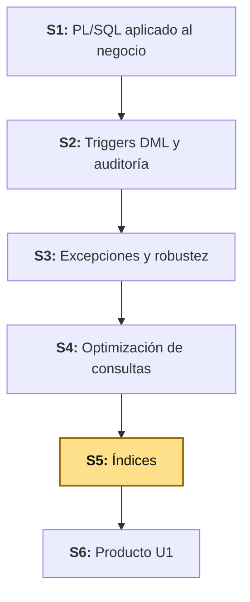
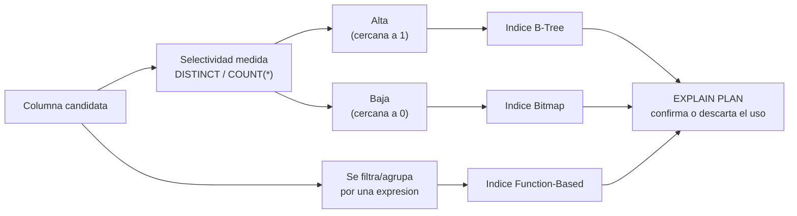

# S5 - Índices para Optimización

## 1. Introducción

Tiempo: 20 min.

### 1.1 Presentación de la sesión

La sesión anterior mejoró una consulta sin tocar ningún índice — estadísticas actualizadas y una reescritura ya cambiaron el plan. Esta sesión retoma esa misma consulta, y suma una tabla de diagnóstico ya construida antes, para decidir qué índice concreto crear — y también cuándo **no** crear uno. La decisión no se toma por intuición ni por copiar lo que otro proyecto hizo: se mide la selectividad real de cada columna candidata, y esa medición dice si conviene un B-Tree, un Bitmap, un Function-Based Index, o ningún índice en absoluto.

### 1.2 Índice

1. Selectividad: la métrica que decide.
2. Índice B-Tree.
3. Índice Bitmap.
4. Índice Function-Based.

### 1.3 Propósito de aprendizaje

Al concluir la clase, estarás en condiciones de:

- **Medir la selectividad real de una columna y, con esa medición, decidir y crear el tipo de índice adecuado** (B-Tree, Bitmap o Function-Based), verificando con el plan de ejecución si el optimizador efectivamente lo usa — y reconocer cuándo un índice no conviene, aunque exista.

### 1.4 Producto de sesión

Tres índices creados sobre datos reales del proyecto — B-Tree (`VENTAS.FECHA`), Bitmap (`LOG_ERRORES.OBJETO`) y Function-Based (`TRUNC(VENTAS.FECHA)`) —, cada uno elegido con selectividad medida y con `EXPLAIN PLAN` capturado antes y después; más evidencia de un índice que, medido, no conviene crear (`VENTAS.ESTADO`).

### 1.5 Metodología

**Tabla 1. Metodología de la sesión**

| Actividades a Realizar en el Periodo | Orientaciones generales (Orientaciones Metodológicas) | Material de estudio recomendado |
|---|---|---|
| Revisión previa individual | Repasar `EXPLAIN PLAN`/`DBMS_STATS` (S4) y la estructura de `LOG_ERRORES` (S3). Trabajo individual, antes de clase; anotar cuántos registros tiene hoy `LOG_ERRORES` en tu propia base. | S3 (3.2), S4 (2.2-2.4). |
| Clase presencial | Medición guiada de selectividad, creación de un índice B-Tree, uno Bitmap y uno Function-Based, cada uno verificado con `EXPLAIN PLAN`, y verificación de un índice que no conviene. Trabajo individual en la propia laptop, siguiendo al docente paso a paso. | Script `S05_indices_optimizacion.sql`. |
| Evaluación formativa | Verificación en clase de los tres índices creados, con `EXPLAIN PLAN` mostrando su uso (o su no uso, en el caso de `ESTADO`), y la selectividad medida que justifica cada decisión. La evidencia se completa y sustenta de forma individual, fuera del aula, según los criterios mínimos de la sección 4.4. | Indicaciones de entrega (4.3), rúbrica de evaluación (4.6). |

### 1.6 Motivación de la sesión

#### 1.6.1 Caso: el índice que el optimizador nunca usó

Un equipo crea un índice sobre `VENTAS.ESTADO`, convencido de que va a acelerar los reportes filtrados por estado. Después de crearlo, `EXPLAIN PLAN` sigue mostrando `TABLE ACCESS FULL` — exactamente el mismo plan que sin el índice. No es un error del optimizador: hoy, `EstadoVenta` (LP2, S4) solo tiene un valor posible, `REGISTRADA` — todas las filas de `VENTAS` comparten el mismo estado. Un índice sobre una columna con un único valor no ayuda a descartar ninguna fila; el optimizador, correctamente, prefiere leer la tabla completa antes que leer un índice que apunta a *todas* las filas y después ir a buscarlas una por una.

El índice no estaba mal escrito — estaba mal elegido. Esta sesión mide selectividad **antes** de crear cualquier índice, precisamente para no repetir este caso.

**Preguntas de análisis**

**Activación de conocimientos previos**

1. En S4, ¿qué le pasaba al plan de una consulta cuando el CBO tenía estadísticas desactualizadas? ¿En qué se parece eso a un índice sobre una columna de un solo valor?

**Comprensión de selectividad e índices**

1. Si `VENTAS.ESTADO` tuviera cinco valores posibles en vez de uno, ¿el índice sobre `ESTADO` automáticamente empezaría a ayudar? ¿Qué más tendría que ser cierto?
2. `LOG_ERRORES.OBJETO` (S3) también tiene pocos valores distintos, igual que `ESTADO` — y sin embargo esta sesión sí le crea un índice. ¿Qué tipo de índice, y por qué la misma "poca selectividad" que descartó un índice en `ESTADO` no descarta uno en `OBJETO`?

### 1.7 Ubicación en el curso

- Unidad: U1 - Programación y optimización (Oracle XE).
- Producto del curso: base de datos empresarial Oracle operativa, administrada, optimizada, auditada y resiliente.
- Producto de unidad: motor transaccional Oracle optimizado.
- Avance del producto en esta sesión: tres índices reales creados con selectividad medida, más evidencia de un índice descartado por la misma medición.

Roadmap del producto de la unidad:

**Figura 1. Roadmap del producto de la unidad**



## 2. Explica

Tiempo: 30 min.

### 2.1 Arquitectura de la sesión

**Figura 2. De la selectividad medida al índice elegido**



Ningún índice se crea antes de medir. La selectividad decide entre B-Tree y Bitmap; si además la consulta necesita filtrar o agrupar por una expresión (no por la columna cruda), el candidato es un Function-Based Index, sin importar qué tan selectiva sea la columna de base. `EXPLAIN PLAN` es el mismo criterio de verificación de S4: no basta con crear el índice, hay que confirmar que el optimizador lo elige para la consulta real.

### 2.2 Selectividad: la métrica que decide, no la intuición

La selectividad de una columna es la proporción de valores distintos frente al total de filas:

```sql
SELECT COUNT(DISTINCT columna) / COUNT(*) AS SELECTIVIDAD FROM tabla;
```

Un valor cercano a `1` significa que casi cada fila tiene un valor distinto (alta selectividad: un id, una fecha con hora, un correo). Un valor cercano a `0` significa que pocos valores se repiten en muchas filas (baja selectividad: un estado con dos o tres opciones, un booleano, una categoría amplia). El caso de 1.6.1 (`ESTADO` con un único valor) es el extremo: selectividad `1 / N`, prácticamente `0`.

**La selectividad de la columna no es lo único que importa.** Un índice puede existir sobre una columna de alta selectividad y aun así no usarse para una consulta puntual, si esa consulta filtra una fracción grande de la tabla (por ejemplo, "el último trimestre" sobre una tabla de un año). Lo que el optimizador evalúa en cada consulta es la selectividad **del predicado** — cuántas filas concretas devuelve *ese* `WHERE`, no solo cuántos valores distintos tiene la columna en general. Por eso 3.3 mide ambas cosas: la columna, y la consulta concreta que se va a ejecutar contra ella.

### 2.3 Índice B-Tree

Es el índice por defecto de Oracle (`CREATE INDEX`, sin calificarlo). Organiza los valores en un árbol balanceado, ideal para columnas de alta selectividad consultadas por igualdad o por rango (`=`, `>`, `<`, `BETWEEN`). `VENTAS.FECHA` es el candidato natural: cada venta ocurre en un instante distinto, y S4 ya construyó una consulta que filtra por rango de fechas.

### 2.4 Índice Bitmap

Representa cada valor distinto de la columna como un mapa de bits (uno por fila: pertenece o no pertenece a ese valor), no como un árbol de punteros. Es eficiente exactamente donde el B-Tree deja de serlo: **baja** selectividad — pocos valores distintos repetidos en muchas filas —, típico de columnas de categoría, estado o tipo en tablas de reporte o auditoría.

**No es gratis en todos los escenarios.** Un índice Bitmap no es recomendable sobre tablas con alta concurrencia de escritura: actualizar un solo bit de un mapa de bits puede bloquear, a nivel de motor, muchas más filas de las que el `UPDATE` realmente tocó. `LOG_ERRORES` es exactamente el tipo de tabla donde sí conviene: se inserta, casi nunca se actualiza, y se consulta mucho para reportes de diagnóstico.

### 2.5 Índice Function-Based

Un índice normal indexa el valor tal como está guardado en la columna. Cuando una consulta necesita filtrar o agrupar por el **resultado de una función** sobre la columna (`TRUNC(FECHA)`, `UPPER(NOMBRE)`), un índice normal sobre la columna cruda no ayuda — la Tabla 2 de S4 ya lo adelantó: "envolver la columna en una función... invalida el uso de un índice sobre esa columna". La solución no siempre es reescribir la consulta como hizo S4 (3.6): a veces la función es el requisito real del negocio (un reporte por *día calendario*, no por rango continuo), y ahí un índice creado directamente sobre esa expresión es la respuesta correcta:

```sql
CREATE INDEX ix_ventas_fecha_dia ON BOM_VENTAS.VENTAS (TRUNC(FECHA));
```

**Tabla 2. Cuándo usar cada tipo de índice**

| Tipo | Selectividad de la columna | Se usa cuando | Candidato de esta sesión |
|---|---|---|---|
| B-Tree | Alta | Igualdad o rango sobre la columna tal como está guardada. | `VENTAS.FECHA` |
| Bitmap | Baja | Pocos valores distintos, tabla de lectura intensiva y baja concurrencia de escritura. | `LOG_ERRORES.OBJETO` |
| Function-Based | La de la expresión, no la de la columna base | El filtro o agrupamiento real necesita el resultado de una función, no la columna cruda. | `TRUNC(VENTAS.FECHA)` |

## 3. Aplica: actividad práctica guiada

Tiempo: 2h.

**Actividad:** medición de selectividad real y creación guiada de un índice B-Tree, uno Bitmap y uno Function-Based sobre datos del proyecto, cada uno verificado con `EXPLAIN PLAN` (Producto de la sesión en 1.4).

**Propósito de la actividad:** decidir cada índice con una medición concreta, no con intuición, y confirmar con evidencia si el optimizador realmente lo usa — incluyendo el caso de un índice que, medido, no conviene.

**Orientaciones metodológicas:** en el laboratorio, el docente mide selectividad, crea cada índice y compara el plan paso a paso frente a la clase; los estudiantes replican cada paso en su propio equipo, capturando su propia selectividad y su propio `EXPLAIN PLAN` (los valores exactos variarán entre equipos según el volumen real cargado en S4 — lo que se evalúa es la decisión tomada a partir de la medición, no un número exacto).

**Actividades para realizar:**

- **3.1** Cargar volumen adicional en `LOG_ERRORES`.
- **3.2** Medir la selectividad de las columnas candidatas.
- **3.3** Crear el índice B-Tree sobre `VENTAS.FECHA` y comparar.
- **3.4** Crear el índice Bitmap sobre `LOG_ERRORES.OBJETO` y comparar.
- **3.5** Crear el índice Function-Based sobre `TRUNC(VENTAS.FECHA)` y comparar.
- **3.6** Verificar un índice que no conviene: `VENTAS.ESTADO`.
- **3.7** Relacionar con ADS y LP2.

**Script completo, listo para ejecutar** (los pasos siguientes explican cada bloque): [`S05_indices_optimizacion.sql`](../../proyecto-integrador/u1/oracle/S05_indices_optimizacion.sql).

### 3.1 Cargar volumen adicional en `LOG_ERRORES`

**Producto del paso:** suficiente volumen en `LOG_ERRORES` (S3) para que medir su selectividad tenga sentido — con solo tres filas (una por caso de S3, 3.6), cualquier medición es anecdótica.

Conectado como `BOM_CATALOGO`:

```sql
BEGIN
    FOR i IN 1..300 LOOP
        INSERT INTO BOM_CATALOGO.LOG_ERRORES (OBJETO, CODIGO_ERROR, MENSAJE_ERROR)
        VALUES (
            CASE MOD(i, 3)
                WHEN 0 THEN 'SP_REGISTRAR_PRODUCTO'
                WHEN 1 THEN 'SP_APLICAR_DESCUENTO_PRODUCTO'
                ELSE 'FN_OBTENER_PRECIO_PRODUCTO'
            END,
            -20010 - MOD(i, 3),
            'Volumen de prueba para selectividad (S5)'
        );
    END LOOP;
    COMMIT;
END;
/
```

Verifica el volumen cargado:

```sql
SELECT COUNT(*) AS TOTAL_LOG FROM BOM_CATALOGO.LOG_ERRORES;
```

Igual que con `VENTAS` en S4 (3.3), el volumen sintético no reemplaza la necesidad real de la tabla — solo le da al optimizador algo genuino que medir.

**Error frecuente**: medir selectividad o capturar `EXPLAIN PLAN` inmediatamente después de esta carga, sin actualizar estadísticas (S4, 2.4). Repite `DBMS_STATS.GATHER_TABLE_STATS` sobre `LOG_ERRORES` antes de continuar:

```sql
EXEC DBMS_STATS.GATHER_TABLE_STATS('BOM_CATALOGO', 'LOG_ERRORES');
```

### 3.2 Medir la selectividad de las columnas candidatas

**Producto del paso:** la selectividad real de las tres columnas que el resto de la sesión indexa (o no indexa).

```sql
SELECT 'VENTAS.FECHA' AS COLUMNA,
       COUNT(DISTINCT FECHA) AS DISTINTOS,
       COUNT(*) AS TOTAL,
       ROUND(COUNT(DISTINCT FECHA) / COUNT(*), 4) AS SELECTIVIDAD
FROM BOM_VENTAS.VENTAS
UNION ALL
SELECT 'VENTAS.ESTADO',
       COUNT(DISTINCT ESTADO),
       COUNT(*),
       ROUND(COUNT(DISTINCT ESTADO) / COUNT(*), 4)
FROM BOM_VENTAS.VENTAS
UNION ALL
SELECT 'LOG_ERRORES.OBJETO',
       COUNT(DISTINCT OBJETO),
       COUNT(*),
       ROUND(COUNT(DISTINCT OBJETO) / COUNT(*), 4)
FROM BOM_CATALOGO.LOG_ERRORES;
```

**Tabla 3. Selectividad medida (completa con tus propios valores)**

| Columna | Distintos | Total | Selectividad | Decisión |
|---|---:|---:|---:|---|
| `VENTAS.FECHA` | | | | B-Tree (3.3) |
| `VENTAS.ESTADO` | | | | Ninguno (3.6) |
| `LOG_ERRORES.OBJETO` | | | | Bitmap (3.4) |

Esta tabla es la que justifica cada decisión de índice del resto de la sesión — sin ella, crear un índice sería, otra vez, por intuición.

### 3.3 Crear el índice B-Tree sobre `VENTAS.FECHA` y comparar

**Producto del paso:** `VENTAS.FECHA` indexado, con `EXPLAIN PLAN` confirmando que el optimizador lo usa para una consulta suficientemente selectiva.

Conectado como `BOM_VENTAS`:

```sql
CREATE INDEX ix_ventas_fecha ON BOM_VENTAS.VENTAS (FECHA);
```

A diferencia de `DBMS_STATS` sobre una tabla (S4), Oracle calcula las estadísticas del índice automáticamente al crearlo — no hace falta un paso adicional para que el CBO sepa que existe.

La consulta de S4 (3.7) filtra 30 días de un rango de 90 — una fracción demasiado grande para que un índice sea siempre la mejor opción (2.2). Para verificar el índice con un predicado claramente selectivo, usa un reporte más acotado, igual de real: ventas de hoy.

```sql
EXPLAIN PLAN FOR
SELECT p.NOMBRE, SUM(d.CANTIDAD) AS TOTAL_UNIDADES, SUM(d.SUBTOTAL) AS TOTAL_VENDIDO
FROM BOM_VENTAS.DETALLE_VENTAS d
JOIN BOM_VENTAS.VENTAS v ON v.ID = d.ID_VENTA
JOIN BOM_CATALOGO.PRODUCTOS p ON p.ID = d.ID_PRODUCTO
WHERE v.FECHA >= TRUNC(SYSDATE)
GROUP BY p.NOMBRE
ORDER BY TOTAL_VENDIDO DESC;

SELECT * FROM TABLE(DBMS_XPLAN.DISPLAY);
```

Con una fracción pequeña del total de filas (un día de 90), lo esperable es ver `INDEX RANGE SCAN` sobre `IX_VENTAS_FECHA` en vez de `TABLE ACCESS FULL` sobre `VENTAS`. Repite la consulta original de 3.7 de S4 (30 días) y compara: es posible — y correcto — que el optimizador siga prefiriendo `TABLE ACCESS FULL` ahí, porque un tercio de la tabla ya no es una fracción pequeña (2.2).

### 3.4 Crear el índice Bitmap sobre `LOG_ERRORES.OBJETO` y comparar

**Producto del paso:** `LOG_ERRORES.OBJETO` indexado con Bitmap, con `EXPLAIN PLAN` confirmando su uso en un reporte de diagnóstico.

Conectado como `BOM_CATALOGO`:

```sql
CREATE BITMAP INDEX ix_log_errores_objeto ON BOM_CATALOGO.LOG_ERRORES (OBJETO);
```

```sql
EXPLAIN PLAN FOR
SELECT OBJETO, COUNT(*) AS TOTAL_ERRORES
FROM BOM_CATALOGO.LOG_ERRORES
WHERE OBJETO = 'SP_REGISTRAR_PRODUCTO'
GROUP BY OBJETO;

SELECT * FROM TABLE(DBMS_XPLAN.DISPLAY);
```

Busca `BITMAP INDEX SINGLE VALUE` (o `BITMAP CONVERSION`) en la columna `OPERATION` de la salida — es el equivalente Bitmap del `INDEX RANGE SCAN` que ya reconoces de un B-Tree (3.3).

**Error frecuente**: crear el índice Bitmap conectado como un usuario sin privilegios sobre el esquema de la tabla (por ejemplo, `BOM_VENTAS` intentando indexar una tabla de `BOM_CATALOGO`). Igual que cualquier `CREATE INDEX`, requiere estar conectado como el propietario del esquema o tener el privilegio `CREATE ANY INDEX`.

### 3.5 Crear el índice Function-Based sobre `TRUNC(VENTAS.FECHA)` y comparar

**Producto del paso:** un reporte por día calendario, resuelto con un índice sobre la expresión, no sobre la columna cruda.

Conectado como `BOM_VENTAS`:

```sql
CREATE INDEX ix_ventas_fecha_dia ON BOM_VENTAS.VENTAS (TRUNC(FECHA));
```

```sql
EXPLAIN PLAN FOR
SELECT TRUNC(FECHA) AS DIA, COUNT(*) AS VENTAS_DEL_DIA, SUM(TOTAL) AS MONTO_DEL_DIA
FROM BOM_VENTAS.VENTAS
WHERE TRUNC(FECHA) = TRUNC(SYSDATE) - 5
GROUP BY TRUNC(FECHA);

SELECT * FROM TABLE(DBMS_XPLAN.DISPLAY);
```

Esta consulta no se puede reescribir para "liberar" la columna como hizo S4 (3.6): el reporte pide explícitamente un día calendario, no un rango continuo — la función es parte del requisito, no un descuido de escritura. `ix_ventas_fecha_dia` es la respuesta a ese requisito, no a un error evitable.

### 3.6 Verificar un índice que no conviene: `VENTAS.ESTADO`

**Producto del paso:** evidencia reproducible del caso de 1.6.1 — un índice creado que el optimizador correctamente ignora.

Conectado como `BOM_VENTAS`:

```sql
CREATE INDEX ix_ventas_estado ON BOM_VENTAS.VENTAS (ESTADO);
```

```sql
EXPLAIN PLAN FOR
SELECT * FROM BOM_VENTAS.VENTAS WHERE ESTADO = 'REGISTRADA';

SELECT * FROM TABLE(DBMS_XPLAN.DISPLAY);
```

Con la selectividad de `ESTADO` medida en 3.2 (cercana a `0`, un único valor para todas las filas), lo esperable es `TABLE ACCESS FULL`, con o sin el índice — el optimizador no tiene ninguna razón para preferirlo, porque el índice no descarta ninguna fila. Elimina el índice: no aporta beneficio y sí agrega costo de mantenimiento en cada `INSERT` sobre `VENTAS`.

```sql
DROP INDEX ix_ventas_estado;
```

**Error frecuente**: dejar creado un índice que la medición ya mostró que no ayuda, "por si acaso". Cada índice adicional hace más lento cada `INSERT`/`UPDATE`/`DELETE` sobre esa tabla (Oracle también tiene que mantener el índice actualizado) y ocupa espacio — un costo real, permanente, a cambio de un beneficio que la Tabla 3 ya midió como inexistente.

### 3.7 Relacionar con ADS y LP2

**Producto del paso:** matriz de integración.

**Tabla 4. Matriz de integración BD2-ADS-LP2 (S5)**

| Objeto BD2 | Decisión ADS | Endpoint o servicio LP2 |
|---|---|---|
| `ix_ventas_fecha` (B-Tree) | Atributo de rendimiento (ADS S1, atributos de calidad) | `GET /api/v1/ventas?desde=&hasta=` (LP2 S5) |
| `ix_log_errores_objeto` (Bitmap) | — | Diagnóstico técnico, sin endpoint propio expuesto |
| `ix_ventas_fecha_dia` (Function-Based) | — | Reporte agregado `GET /api/v1/ventas/resumen` (LP2 S5) |

Sesión equivalente en los otros dos cursos, misma semana: [ADS - S5 Evaluación de la Unidad I](../../ads/sesiones/S05_Evaluacion_Unidad_1.md) evalúa lo construido en S1-S4, sin contenido nuevo esta semana. [LP2 - S5 Consultas Empresariales, Reportes REST y CORS](../../lp2/sesiones/S05_Consultas_Empresariales_Reportes_CORS.md) construye, esta misma semana, los filtros y el reporte que estos índices sostienen del lado de Oracle.

**Evidencia de aprendizaje:**

- Selectividad medida de `VENTAS.FECHA`, `VENTAS.ESTADO` y `LOG_ERRORES.OBJETO`.
- Índice B-Tree, Bitmap y Function-Based creados, cada uno con `EXPLAIN PLAN` confirmando su uso.
- Evidencia del índice descartado sobre `ESTADO`, con la medición que lo justifica.
- Matriz de integración con ADS y LP2.

## 4. Crea: actividad autónoma

Tiempo: 2h fuera del aula.

### 4.1 Actividad

Decisión e implementación autónoma de índices sobre tablas del proyecto propio del equipo, documentada en evidencia individual.

Completa y evidencia estas tareas:

1. Elegir al menos dos columnas candidatas de tu propio proyecto, de tablas y consultas reales (no de `VENTAS`/`LOG_ERRORES`).
2. Medir la selectividad real de cada una.
3. Crear al menos un índice B-Tree y uno Bitmap, cada uno justificado por la selectividad medida — o un Function-Based, si tu proyecto tiene una consulta real que filtra/agrupa por una expresión.
4. Verificar con `EXPLAIN PLAN` que el optimizador usa cada índice creado.
5. Identificar al menos una columna candidata donde la medición desaconseja crear un índice, y documentar por qué.

### 4.2 Propósito

Que cada estudiante demuestre, de forma individual y fuera del aula, que puede decidir y verificar un índice con selectividad medida, sin el acompañamiento del docente.

Cada estudiante adapta el ejemplo a columnas y consultas representativas de su propio proyecto.

### 4.3 Indicaciones

Entrega un PDF con el siguiente nombre:

```text
S05_BD2_Equipo##_ApellidoNombre.pdf
```

Cada captura de pantalla del informe debe mostrar, sin recortar, el reloj del sistema (fecha y hora) y tu usuario o foto de perfil (Windows, VS Code o navegador) visibles en pantalla — es lo que permite verificar que la evidencia es tuya y que corresponde al momento real de tu trabajo.

#### 4.3.1 Estructura del informe

**Datos del estudiante**

- Nombre:
- Equipo:
- Sesión: S05 - Índices para Optimización
- Rol o aporte realizado:
- Link de GitHub:

**Evidencia técnica**

Incluye capturas o salidas con una breve explicación debajo de cada una, organizadas en los mismos 4 bloques de la rúbrica (4.6):

1. *Selectividad medida*
    - Tabla de selectividad de al menos dos columnas candidatas, con la consulta usada para medirla.
2. *Índice B-Tree o Function-Based*
    - Índice creado, con `EXPLAIN PLAN` antes y después mostrando su uso.
3. *Índice Bitmap*
    - Índice creado, con `EXPLAIN PLAN` antes y después mostrando su uso.
4. *Índice descartado*
    - Columna candidata donde la medición desaconseja el índice, con la justificación.

**Error o hallazgo**

Describe un hallazgo real: un índice que esperabas que se usara y no se usó, una selectividad que te sorprendió, o un índice que sí ayudó pero no en la consulta que esperabas.

**Reflexión técnica breve**

Responde en 5 a 8 líneas:

```text
¿Por qué crear un índice sobre cada columna que aparece en un WHERE
no es una buena práctica, aunque técnicamente sea posible?
```

**Anexo: Feedback de la sesión**

Pega esta página como la última hoja del PDF, con tus respuestas.

1. ¿Cuál es el aprendizaje más importante que te llevas de la clase de hoy?
2. ¿Qué punto de la clase te resultó más confuso o te dejó con dudas?
3. ¿Tienes alguna pregunta que te gustaría que sea respondida la siguiente clase?
4. Sobre tu nivel de comprensión de la clase de hoy, marca una opción:
    - ¡Entendido! - Lo domino y podría explicarlo.
    - Más o menos. - Entendí la idea general, pero tengo dudas.
    - Necesito ayuda. - Me siento perdido/a con este tema.
5. ¿Cómo puedo ayudarte a comprender mejor el tema?
6. Pensando en tu participación y esfuerzo en la clase de hoy, ¿cómo te autoevaluarías? Marca una opción:
    - Muy Comprometido/a: Me esforcé al máximo.
    - Comprometido/a: Sé que podría haberme esforzado un poco más.
    - Poco Comprometido/a: Hoy no di mi mejor esfuerzo.
7. Mi satisfacción con la clase fue... (califica del 1 al 10, donde 1 es insatisfecho y 10 es muy satisfecho).

### 4.4 Criterios mínimos de aceptación

La evidencia individual se considera completa si:

- El archivo respeta el nombre solicitado.
- Mide la selectividad real de al menos dos columnas candidatas, con la consulta usada.
- Crea al menos un índice B-Tree o Function-Based, con `EXPLAIN PLAN` confirmando su uso.
- Crea al menos un índice Bitmap, con `EXPLAIN PLAN` confirmando su uso.
- Identifica al menos una columna donde la medición desaconseja crear un índice, con justificación.
- Cada captura de la evidencia técnica muestra el reloj del sistema y el usuario/perfil visible, sin recortar.
- Las fechas y horas de las capturas son coherentes con el historial de commits de su repositorio en GitHub.
- Incluye un error o hallazgo técnico diagnosticado.
- Incluye la reflexión técnica breve solicitada.
- Incluye el Anexo de feedback de la sesión respondido, como última página del PDF.

### 4.5 Preguntas de defensa

1. ¿Por qué la selectividad de una columna no es suficiente por sí sola para decidir si un índice se va a usar en una consulta concreta?
2. ¿Por qué un índice Bitmap no es recomendable sobre una tabla con alta concurrencia de escritura?
3. ¿Por qué `TRUNC(VENTAS.FECHA)` necesita un Function-Based Index y no basta con el B-Tree ya creado sobre `FECHA`?
4. En el caso de 1.6.1, ¿qué tendría que cambiar en los datos de `VENTAS.ESTADO` para que un índice sobre esa columna empiece a tener sentido?
5. Si tu operación autónoma (4.1) no encontró ninguna columna con baja selectividad, ¿cómo lo verificaste, y qué columna consideraste y descartaste como candidata a Bitmap?

### 4.6 Rúbrica de evaluación

**Tabla 5. Rúbrica de evaluación**

| Criterio | Peso (%) | A (20 pts) | B (15 pts) | C (10 pts) | D (5 pts) | Nivel obtenido |
|---|---:|---|---|---|---|---:|
| 1. Selectividad medida* | 25 | Selectividad de al menos dos columnas medida con consulta real, y usada explícitamente para decidir. | Selectividad medida, con la decisión parcialmente justificada. | Selectividad mencionada sin medición real. | No mide selectividad. | |
| 2. Índice B-Tree o Function-Based* | 25 | Índice creado y verificado con `EXPLAIN PLAN` mostrando su uso real. | Índice creado, con verificación parcial del plan. | Índice creado sin verificar su uso. | No crea ningún índice B-Tree ni Function-Based. | |
| 3. Índice Bitmap* | 25 | Índice creado sobre una columna de baja selectividad real, verificado con `EXPLAIN PLAN`. | Índice creado, con verificación parcial. | Índice creado sobre una columna de selectividad inadecuada. | No crea ningún índice Bitmap. | |
| 4. Índice descartado y justificación* | 25 | Columna candidata descartada con medición y justificación técnica clara. | Columna descartada, con justificación parcial. | Menciona un descarte sin medición real. | No identifica ningún índice descartado. | |

\* Agregado manual.

Nota final = suma de (`Peso` / 100 × `Puntos del nivel obtenido`) = ____ / 20.

Para usar la rúbrica con IA, solicita:

```text
Evalúa el PDF usando la rúbrica de la sesión.
Para cada criterio selecciona el nivel obtenido usando la escala A=20, B=15, C=10, D=5 puntos.
Justifica brevemente cada nivel asignado.
Verifica que cada captura muestre reloj del sistema y usuario/perfil visible, y que las fechas sean coherentes con el historial de commits de GitHub. Si falta esta evidencia o hay inconsistencias, indícalo explícitamente antes de calificar.
Calcula la nota final con la fórmula: suma de (Peso/100 × Puntos del nivel obtenido), directamente sobre 20.
Indica 2 fortalezas y 2 recomendaciones.
```

## 5. Cierre

Tiempo: 5 min.

**Resumen breve:** hoy el proyecto ganó tres índices reales — B-Tree sobre `VENTAS.FECHA`, Bitmap sobre `LOG_ERRORES.OBJETO` y Function-Based sobre `TRUNC(VENTAS.FECHA)` —, cada uno decidido con selectividad medida y verificado con `EXPLAIN PLAN`, más la evidencia de un índice que, medido, no convenía crear.

**Dinámica participativa:** en una ronda rápida, cada estudiante comparte en una frase qué columna de su propio proyecto tiene la selectividad más baja, y por qué.

**Metacognición:** cada estudiante responde el Anexo de feedback de la sesión, incluido en su evidencia individual (ver 4.3.1). El docente analiza esas respuestas con IA para identificar temas recurrentes o dudas comunes del equipo, y con esos indicadores construye el cierre real de la sesión — que se entrega al inicio de S6, no al final de esta clase.

**Proyección:** S6 no agrega índices nuevos: integra `BOM_CATALOGO` y `BOM_VENTAS` como un solo motor transaccional optimizado y evalúa lo construido en S1-S5, en la misma semana en que ADS ya cerró su propia Unidad I y LP2 evalúa la suya.

## Bibliografía

1. Oracle Corporation. (2024). *Database SQL Tuning Guide — Using Indexes and Clusters*. https://docs.oracle.com/en/database/oracle/oracle-database/23/tgsql/
2. Oracle Corporation. (2024). *Database Concepts — Indexes and Index-Organized Tables*. https://docs.oracle.com/en/database/oracle/oracle-database/23/cncpt/
3. Oracle Corporation. (2024). *DBMS_STATS package reference*. https://docs.oracle.com/en/database/oracle/oracle-database/23/arpls/DBMS_STATS.html
