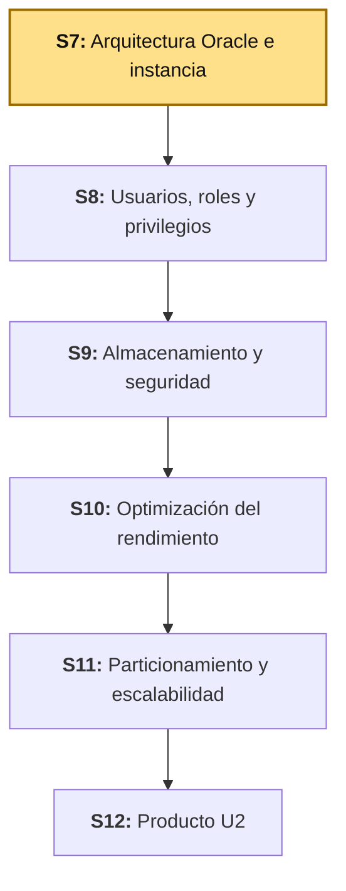
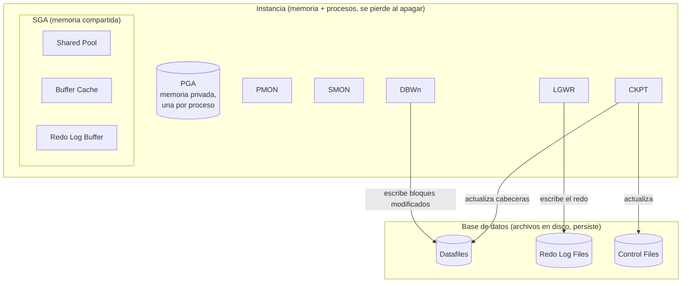

# S7 - Arquitectura Oracle e Instancia

## 1. Introducción

Tiempo: 20 min.

### 1.1 Presentación de la sesión

Hasta S6, cada sesión trabajó **dentro** de un esquema: procedimientos, triggers, excepciones, consultas, índices — siempre como `BOM_CATALOGO`, un usuario con privilegios acotados a sus propios objetos. Esta sesión cambia de nivel: en vez de programar dentro de la base de datos, se explora la instancia que la sostiene por fuera — la memoria que Oracle reserva al arrancar, los procesos que la mantienen viva, y la conexión privilegiada que un usuario de aplicación nunca debería tener. El porqué de necesitar esa distinción se desarrolla en 1.6, a partir del caso.

### 1.2 Índice

1. Arquitectura de una instancia Oracle: SGA y PGA.
2. Procesos background.
3. Variables de entorno: `ORACLE_HOME` y `ORACLE_SID`.
4. Administración como SYSDBA.

### 1.3 Propósito de aprendizaje

Al concluir la clase, estarás en condiciones de:

- **Explorar y documentar** la arquitectura de una instancia Oracle real (memoria SGA/PGA, procesos background, variables de entorno), y **administrarla con una conexión SYSDBA**, distinguiéndola con evidencia de una conexión de aplicación de mínimo privilegio.

### 1.4 Producto de sesión

Informe de arquitectura de la instancia `bomerp-oracle`: componentes de SGA y PGA medidos con vistas dinámicas, procesos background activos identificados, variables de entorno documentadas, y evidencia de una conexión SYSDBA distinguida de una conexión de aplicación (`BOM_CATALOGO`).

### 1.5 Metodología

**Tabla 1. Metodología de la sesión**

| Actividades a Realizar en el Periodo | Orientaciones generales (Orientaciones Metodológicas) | Material de estudio recomendado |
|---|---|---|
| Revisión previa individual | Repasar cómo se conecta hoy la aplicación (`BOMERP_APP`, mínimo privilegio) frente al usuario propietario del esquema (`BOM_CATALOGO`), ambos de S1. Trabajo individual, antes de clase. | S1 (3.2-3.3). |
| Clase presencial | Exploración guiada de la memoria SGA/PGA, los procesos background activos, las variables de entorno de la instancia, y una primera conexión administrativa como SYSDBA. Trabajo individual en la propia laptop, siguiendo al docente paso a paso. | Contenedor `bomerp-oracle` corriendo (S1). |
| Evaluación formativa | Verificación en clase del informe de arquitectura de instancia, con la conexión SYSDBA evidenciada frente al intento fallido de la misma consulta como `BOM_CATALOGO`. La evidencia se completa y sustenta de forma individual, fuera del aula, según los criterios mínimos de la sección 4.4. | Indicaciones de entrega (4.3), rúbrica de evaluación (4.6). |

### 1.6 Motivación de la sesión

#### 1.6.1 Caso: la vista que existía, pero no para todos

Un integrante del equipo quiere justificar ante el cliente cuánta memoria RAM necesita el servidor de producción, y para eso intenta consultar cuánta SGA usa la instancia real, conectado como `BOM_CATALOGO` — el mismo usuario que ya usó en S1-S6 para todo lo demás. Oracle responde `ORA-00942: table or view does not exist`. No es un error de tipeo: la vista `V$SGA` existe, y `BOM_CATALOGO` nunca tuvo, ni debía tener, permiso para verla — las vistas de rendimiento (`V$...`) exponen el estado interno de *toda* la instancia, no de un esquema en particular, y por eso exigen un nivel de privilegio distinto al de cualquier usuario de aplicación.

Esta sesión no cambia ningún privilegio de `BOM_CATALOGO` — sería un error hacerlo, mínimo privilegio sigue siendo la regla (S1). Lo que cambia es que, por primera vez, alguien del equipo se conecta con un usuario administrativo real, separado del usuario de la aplicación, exactamente para responder preguntas que la aplicación no necesita responder.

**Preguntas de análisis**

**Activación de conocimientos previos**

1. En S1, ¿qué diferencia había entre el usuario propietario del esquema (`BOM_CATALOGO`) y el usuario técnico de la aplicación (`BOMERP_APP`)? ¿Por qué ninguno de los dos es SYSDBA?

**Comprensión de arquitectura de instancia**

1. ¿Por qué un desarrollador de aplicación normalmente nunca necesita saber cuánta memoria tiene la SGA de la instancia contra la que trabaja?
2. ¿Qué diferencia hay entre "la base de datos" (los archivos en disco) y "la instancia" (memoria y procesos)? ¿Puede existir una sin la otra, aunque sea por un momento?

### 1.7 Ubicación en el curso

- Unidad: U2 - Administración, almacenamiento, seguridad y optimización.
- Producto del curso: base de datos empresarial Oracle operativa, administrada, optimizada, auditada y resiliente.
- Producto de unidad: base de datos empresarial administrada, optimizada y asegurada.
- Avance del producto en esta sesión: arquitectura de la instancia explorada y documentada; primera conexión administrativa (SYSDBA) distinguida de las conexiones de aplicación.

Roadmap del producto de la unidad:

**Figura 1. Roadmap del producto de la unidad**



**Sobre el ambiente de esta sesión.** El sílabo declara Oracle Database 19c EE sobre Oracle Linux como ambiente de esta unidad — ese ambiente todavía no está aprovisionado en este repositorio. Esta guía explora la arquitectura de instancia sobre `bomerp-oracle` (Oracle XE, el mismo contenedor usado desde S1): los conceptos (SGA, PGA, procesos background, `ORACLE_HOME`/`ORACLE_SID`, SYSDBA) y las consultas de esta sesión son los mismos en cualquier instancia Oracle — lo único que cambiaría al migrar al ambiente oficial de la unidad son los comandos de conexión al sistema operativo, no las vistas ni los conceptos.

## 2. Explica

Tiempo: 25 min.

### 2.1 Arquitectura de la sesión

**Figura 2. Instancia y base de datos: memoria, procesos y archivos**



Lectura del diagrama: la **instancia** (SGA + procesos background) es efímera — se crea al arrancar Oracle y desaparece al apagarlo; la **base de datos** (datafiles, redo logs, control files) es persistente — sobrevive aunque la instancia se caiga. Cada apartado siguiente desarrolla uno de sus componentes, en el mismo orden del Índice (1.2).

### 2.2 Arquitectura de una instancia Oracle: SGA y PGA

Una **instancia** Oracle es la combinación de un área de memoria compartida (la SGA) y el conjunto de procesos background que la administran; se crea al arrancar la base de datos y no sobrevive a un reinicio (Oracle Corporation, 2024a). La **SGA** (*System Global Area*) es memoria compartida entre todos los procesos de la instancia — server y background por igual —, con varios componentes: el *Shared Pool* (cachea sentencias SQL ya parseadas y metadatos del diccionario de datos), el *Buffer Cache* (bloques de datos leídos recientemente, para no volver a leer disco) y el *Redo Log Buffer* (cambios pendientes de escribirse al redo log).

La **PGA** (*Program Global Area*), en cambio, es memoria privada — cada proceso servidor tiene la suya propia, y ningún otro proceso puede leerla. Guarda el estado de una sesión específica: variables de la sesión, áreas de trabajo para ordenar (`ORDER BY`) o agrupar (`GROUP BY`) resultados.

**Error frecuente**: confundir "instancia" con "base de datos" y usar los términos indistintamente. La instancia es memoria y procesos (se pierde al apagar); la base de datos son los archivos físicos en disco (persiste). Una instancia puede arrancar sin haber montado ninguna base de datos todavía (estado `NOMOUNT`) — prueba de que son dos cosas distintas, no sinónimos.

### 2.3 Procesos background

Oracle no resuelve el mantenimiento de una instancia con un único programa monolítico: reparte responsabilidades específicas entre varios procesos del sistema operativo, cada uno con un trabajo acotado (Oracle Corporation, 2024a). Esa separación permite que, por ejemplo, escribir el redo log (`LGWR`) no espere a que termine de escribirse un bloque de datos (`DBWn`) — son procesos independientes, coordinados, no secuenciales.

**Tabla 2. Procesos background principales**

| Proceso | Responsabilidad |
|---|---|
| `PMON` | Limpia sesiones y procesos que terminaron de forma anormal, liberando los recursos que dejaron ocupados. |
| `SMON` | Recuperación de instancia al arrancar (aplica el redo pendiente) y limpieza de segmentos temporales. |
| `DBWn` | Escribe bloques modificados (*dirty buffers*) del Buffer Cache hacia los datafiles. |
| `LGWR` | Escribe el contenido del Redo Log Buffer hacia los archivos de redo log, antes de confirmar un `COMMIT`. |
| `CKPT` | Actualiza las cabeceras de los datafiles y el control file, marcando hasta dónde ya se escribió. |

**Error frecuente**: asumir que un `COMMIT` espera a que `DBWn` escriba los bloques de datos en disco. No es así: `COMMIT` solo espera a `LGWR` (el redo ya está a salvo); `DBWn` escribe los bloques de datos después, de forma diferida — es exactamente lo que hace posible la recuperación de instancia (`SMON`) si el sistema se cae entre medio.

### 2.4 Variables de entorno: `ORACLE_HOME` y `ORACLE_SID`

Un mismo servidor puede tener varias instalaciones de Oracle (`ORACLE_HOME`, la ruta del software) y varias instancias corriendo al mismo tiempo (`ORACLE_SID`, el nombre que identifica a una en particular) — ambas variables de entorno del sistema operativo le dicen a herramientas como `sqlplus` con qué instalación y con qué instancia trabajar cuando hay más de una disponible (Oracle Corporation, 2024a).

`ORACLE_SID` no es cosmético: si apunta a la instancia equivocada, `sqlplus` se conecta sin ningún error — a una base de datos real, solo que no es la que la persona esperaba. Verificar qué instancia responde de verdad (2.5, `V$INSTANCE`) es la forma de confirmarlo, no asumir que el nombre de la variable es correcto porque nadie lo tocó a mano.

### 2.5 Administración como SYSDBA

**SYSDBA** no es un rol ni un privilegio de objeto — es un privilegio administrativo especial, separado por completo del sistema de privilegios normal, que habilita operaciones que ningún otro conjunto de privilegios permite: arrancar y apagar la instancia, crear la base de datos, y acceder a las vistas dinámicas de rendimiento (`V$...`) que exponen el estado interno de toda la instancia (Oracle Corporation, 2024b). Por eso puede autenticarse incluso cuando la base de datos todavía no está abierta — antes de que exista cualquier usuario "normal" para validar contra la base.

Esto es, a propósito, la excepción al mínimo privilegio que el proyecto sigue desde S1: `BOMERP_APP` y `BOM_CATALOGO` nunca deben tener SYSDBA — es un privilegio de administración de la instancia, no de operación de la aplicación. El caso de 1.6.1 (`ORA-00942` sobre `V$SGA`) es exactamente esta separación funcionando como debe.

**Error frecuente**: conectar como SYSDBA para hacer trabajo cotidiano de aplicación (consultas de negocio, pruebas de la API) "porque es más simple y no falla por permisos". Eso invierte la razón de ser del mínimo privilegio: la conexión SYSDBA queda reservada para administración real de la instancia, nunca como atajo para evitar configurar el privilegio correcto.

## 3. Aplica: actividad práctica guiada

Tiempo: 90 min.

### 3.1 Verificar el punto de partida

**Producto del paso:** confirmación de que `bomerp-oracle` sigue corriendo, punto de partida de toda la sesión.

```bash
docker ps --filter name=bomerp-oracle
```

Si el contenedor no aparece, levántalo como en S1 antes de continuar — el resto de esta sesión asume que la instancia ya está arriba.

### 3.2 Consultar la memoria SGA y PGA de la instancia

**Producto del paso:** el tamaño real de cada componente de la SGA y el uso actual de la PGA de la instancia.

Conecta como SYSDBA, con la misma contraseña que ya usa `system` desde S1 (en la mayoría de imágenes Oracle en Docker, `ORACLE_PASSWORD` fija la misma contraseña para `sys`, `system` y el admin de la PDB):

```bash
docker exec -it bomerp-oracle sqlplus sys/123456@localhost:1521/FREEPDB1 as sysdba
```

Si tu contenedor corre como el usuario del sistema operativo `oracle` (lo más común en imágenes Oracle oficiales), también puedes conectarte sin contraseña, por autenticación del sistema operativo:

```bash
docker exec -it bomerp-oracle sqlplus / as sysdba
```

```sql
SELECT * FROM V$SGA;
```

```sql
SELECT NAME, ROUND(BYTES/1024/1024, 2) AS MB FROM V$SGAINFO ORDER BY BYTES DESC;
```

```sql
SELECT NAME, ROUND(VALUE/1024/1024, 2) AS MB FROM V$PGASTAT WHERE NAME IN ('total PGA allocated', 'total PGA used for auto workareas', 'maximum PGA allocated');
```

`V$SGA` da el resumen de más alto nivel (Fixed Size, Variable Size, Database Buffers, Redo Buffers); `V$SGAINFO` desglosa la parte variable en sus componentes reales (Shared Pool, Buffer Cache, Large Pool, entre otros) — la tabla que respalda la explicación de 2.2.

**Precisión importante**: aunque te conectaste vía el servicio de `FREEPDB1` (una PDB, *pluggable database*), la SGA que acabas de consultar no es "de FREEPDB1" — es de la instancia completa (el CDB, *container database*), compartida por todas las PDB que administre esa instancia. `bomerp-oracle` hoy solo tiene una PDB, así que en la práctica es lo mismo; en una instancia con varias PDB, seguiría siendo una sola SGA para todas.

**Error frecuente**: ejecutar la misma consulta conectado como `BOM_CATALOGO` en vez de SYSDBA. El resultado es `ORA-00942: table or view does not exist` — exactamente el caso de 1.6.1, reproducido a propósito para confirmarlo de primera mano.

### 3.3 Identificar los procesos background activos

**Producto del paso:** la lista real de procesos background corriendo en la instancia, contrastada contra la Tabla 2.

```sql
SELECT NAME, DESCRIPTION FROM V$BGPROCESS WHERE PADDR <> '00' ORDER BY NAME;
```

`PADDR <> '00'` filtra solo los procesos efectivamente en ejecución — `V$BGPROCESS` sin ese filtro lista también procesos que Oracle *podría* usar según la configuración actual, pero que no están corriendo ahora (por ejemplo, `ARCn` si la base no está en modo `ARCHIVELOG`).

### 3.4 Consultar variables de entorno y el nombre de la instancia

**Producto del paso:** `ORACLE_HOME`, `ORACLE_SID` documentados, y confirmación de que el nombre de la instancia real coincide con lo esperado.

Desde el sistema operativo del contenedor:

```bash
docker exec -it bomerp-oracle bash -c 'echo ORACLE_HOME=$ORACLE_HOME; echo ORACLE_SID=$ORACLE_SID'
```

Desde SQL, el equivalente que sí se puede verificar sin salir de `sqlplus`:

```sql
SELECT INSTANCE_NAME, HOST_NAME, VERSION, STATUS, STARTUP_TIME FROM V$INSTANCE;
```

`INSTANCE_NAME` (SQL) y `ORACLE_SID` (sistema operativo) deben coincidir — son, en la práctica, el mismo nombre visto desde dos capas distintas. Si no coinciden, alguien conectó por una ruta distinta a la que la variable de entorno sugiere (2.4).

### 3.5 Conectar como SYSDBA y comparar privilegios frente a `BOM_CATALOGO`

**Producto del paso:** evidencia lado a lado de qué puede ver una conexión SYSDBA que una conexión de aplicación no puede.

Con la sesión SYSDBA todavía abierta (3.2), confirma quién tiene ese privilegio otorgado:

```sql
SELECT USERNAME, SYSDBA, SYSOPER FROM V$PWFILE_USERS;
```

**Error frecuente**: si esta consulta no devuelve ninguna fila, no es que nadie tenga SYSDBA — significa que la instancia todavía no tiene un archivo de contraseñas (`orapwd`), el mecanismo que registra qué usuarios pueden autenticarse `AS SYSDBA` con contraseña (Oracle Corporation, 2024f). La mayoría de imágenes Oracle en Docker ya lo crean automáticamente para `sys`; si no aparece, es un dato real que vale la pena documentar en el hallazgo (4.3.1), no un error a ocultar.

Confirma la identidad de la sesión actual:

```sql
SHOW USER
```

`SHOW USER` muestra `SYS`, sin importar si te conectaste escribiendo `sqlplus / as sysdba` o `sqlplus system/123456 as sysdba` — conectar `AS SYSDBA` siempre aterriza en el esquema `SYS`, distinto de conectarse como `system` sin ese calificador.

Ahora reproduce el caso de 1.6.1 a propósito, conectado como `BOM_CATALOGO` (S1):

```bash
docker exec -it bomerp-oracle sqlplus BOM_CATALOGO/123456@localhost:1521/FREEPDB1
```

```sql
SELECT * FROM V$SGA;
```

El resultado esperado es `ORA-00942`, no una lista de valores — la misma consulta de 3.2, con un usuario sin el privilegio administrativo, falla por diseño.

### 3.6 Documentar la arquitectura de la instancia

**Producto del paso:** el informe de arquitectura, consolidando 3.2-3.5 en un solo documento.

**Tabla 3. Informe de arquitectura de la instancia `bomerp-oracle`**

| Componente | Evidencia (paso) | Valor observado |
|---|---|---|
| SGA total y por componente | 3.2 | (completar con los MB reales de tu instancia) |
| PGA en uso | 3.2 | (completar con los MB reales de tu instancia) |
| Procesos background activos | 3.3 | (completar con la lista real, comparada contra la Tabla 2) |
| `ORACLE_HOME` / `ORACLE_SID` | 3.4 | (completar con los valores reales del contenedor) |
| Usuarios con SYSDBA otorgado | 3.5 | (completar con la salida real de `V$PWFILE_USERS`) |
| Acceso a `V$SGA` como `BOM_CATALOGO` | 3.5 | `ORA-00942` (esperado, confirma mínimo privilegio) |

### 3.7 Relacionar con ADS y LP2

Sesión equivalente en los otros dos cursos, misma semana: ADS S7 construye el diagrama de clases completo del dominio (atributos, operaciones, relaciones, multiplicidades, agregación, composición, herencia y restricciones) — sin relación directa con la arquitectura de instancia de hoy, ambos cursos avanzan temas independientes de su propia Unidad II. LP2 S7 construye el proyecto frontend (Angular) y sigue conectándose a Oracle exactamente igual que desde S1 (`jdbc:oracle:thin:@localhost:1521/FREEPDB1`, usuario `BOMERP_APP`) — nada de lo explorado hoy cambia esa conexión: `BOMERP_APP` sigue sin SYSDBA, y así debe quedarse.

## 4. Crea: actividad autónoma

Tiempo: 2h fuera del aula.

### 4.1 Actividad

Exploración autónoma de la arquitectura de instancia del proyecto propio del equipo, documentada en evidencia individual.

Completa y evidencia estas tareas:

1. Consultar la SGA y la PGA de tu propia instancia Oracle.
2. Identificar los procesos background activos, contrastados contra sus responsabilidades.
3. Documentar `ORACLE_HOME` y `ORACLE_SID` (o su equivalente en tu ambiente), verificados contra `V$INSTANCE`.
4. Conectar como SYSDBA y reproducir, con un usuario de aplicación propio, el caso de acceso restringido a una vista `V$` (1.6.1, 3.5).
5. Documentar un hallazgo real.

### 4.2 Propósito

Que cada estudiante demuestre, de forma individual y fuera del aula, que puede explorar la arquitectura de una instancia Oracle real y distinguir una conexión administrativa de una conexión de aplicación, sin el acompañamiento del docente.

Cada estudiante documenta la arquitectura de instancia de su propio proyecto.

### 4.3 Indicaciones

Entrega un PDF con el siguiente nombre:

```text
S07_BD2_Equipo##_ApellidoNombre.pdf
```

Cada captura de pantalla del informe debe mostrar, sin recortar, el reloj del sistema (fecha y hora) y tu usuario o foto de perfil (Windows, VS Code o navegador) visibles en pantalla — es lo que permite verificar que la evidencia es tuya y que corresponde al momento real de tu trabajo.

#### 4.3.1 Estructura del informe

**Datos del estudiante**

- Nombre:
- Equipo:
- Sesión: S07 - Arquitectura Oracle e Instancia
- Rol o aporte realizado:
- Link de GitHub:

**Evidencia técnica**

Incluye capturas o salidas con una breve explicación debajo de cada una, organizadas en los mismos 4 bloques de la rúbrica (4.6):

1. *SGA y PGA*
    - Consulta y resultado de `V$SGA`/`V$SGAINFO` y `V$PGASTAT` sobre tu propia instancia.
2. *Procesos background*
    - Lista de procesos activos (`V$BGPROCESS`), contrastada contra sus responsabilidades.
3. *Variables de entorno*
    - `ORACLE_HOME`/`ORACLE_SID` (o equivalente), verificados contra `V$INSTANCE`.
4. *SYSDBA vs. usuario de aplicación*
    - `V$PWFILE_USERS`, y el caso reproducido de acceso restringido a una vista `V$` con tu propio usuario de aplicación.

**Error o hallazgo**

Describe un hallazgo real: una variable de entorno que no coincidía con lo esperado, un proceso background que no imaginabas que existía, o un intento fallido de acceder a una vista `V$` que te ayudó a entender el privilegio SYSDBA.

**Reflexión técnica breve**

Responde en 5 a 8 líneas:

```text
¿Por qué SYSDBA rompe, a propósito, el principio de mínimo privilegio
que el proyecto sigue desde S1 — y por qué esa excepción está bien?
```

**Anexo: Feedback de la sesión**

Pega esta página como la última hoja del PDF, con tus respuestas.

1. ¿Cuál es el aprendizaje más importante que te llevas de la clase de hoy?
2. ¿Qué punto de la clase te resultó más confuso o te dejó con dudas?
3. ¿Tienes alguna pregunta que te gustaría que sea respondida la siguiente clase?
4. Sobre tu nivel de comprensión de la clase de hoy, marca una opción:
    - ¡Entendido! - Lo domino y podría explicarlo.
    - Más o menos. - Entendí la idea general, pero tengo dudas.
    - Necesito ayuda. - Me siento perdido/a con este tema.
5. ¿Cómo puedo ayudarte a comprender mejor el tema?
6. Pensando en tu participación y esfuerzo en la clase de hoy, ¿cómo te autoevaluarías? Marca una opción:
    - Muy Comprometido/a: Me esforcé al máximo.
    - Comprometido/a: Sé que podría haberme esforzado un poco más.
    - Poco Comprometido/a: Hoy no di mi mejor esfuerzo.
7. Mi satisfacción con la clase fue... (califica del 1 al 10, donde 1 es insatisfecho y 10 es muy satisfecho).

### 4.4 Criterios mínimos de aceptación

La evidencia individual se considera completa si:

- El archivo respeta el nombre solicitado.
- Consulta y documenta SGA y PGA reales de su propia instancia.
- Identifica los procesos background activos, contrastados contra sus responsabilidades.
- Documenta `ORACLE_HOME`/`ORACLE_SID` (o equivalente), verificados contra `V$INSTANCE`.
- Evidencia una conexión SYSDBA distinta de una conexión de aplicación, con el caso de acceso restringido reproducido.
- Cada captura de la evidencia técnica muestra el reloj del sistema y el usuario/perfil visible, sin recortar.
- Las fechas y horas de las capturas son coherentes con el historial de commits de su repositorio en GitHub.
- Incluye un error o hallazgo técnico diagnosticado.
- Incluye la reflexión técnica breve solicitada.
- Incluye el Anexo de feedback de la sesión respondido, como última página del PDF.

### 4.5 Preguntas de defensa

1. ¿Por qué `ORA-00942` al consultar `V$SGA` como `BOM_CATALOGO` no es un error de la vista, sino del privilegio de quien consulta?
2. ¿Qué diferencia hay entre la instancia y la base de datos? ¿Cuál de las dos persiste si Oracle se cae de golpe?
3. ¿Por qué `LGWR` no espera a `DBWn` para que un `COMMIT` se confirme?
4. ¿Por qué `BOMERP_APP` (LP2) nunca debería tener el privilegio SYSDBA?
5. En tu propio proyecto (4.1), ¿qué proceso background te sorprendió encontrar activo, y qué responsabilidad cumple?

### 4.6 Rúbrica de evaluación

**Tabla 4. Rúbrica de evaluación**

| Criterio | Peso (%) | A (20 pts) | B (15 pts) | C (10 pts) | D (5 pts) | Nivel obtenido |
|---|---:|---|---|---|---|---:|
| 1. SGA y PGA* | 25 | Consulta y documenta SGA/PGA reales, con los componentes principales identificados correctamente. | SGA/PGA consultadas, con algún componente sin identificar. | Consulta parcial o sin distinguir SGA de PGA. | No consulta SGA ni PGA. | |
| 2. Procesos background* | 25 | Identifica los procesos activos y explica correctamente la responsabilidad de cada uno. | Procesos identificados, con alguna responsabilidad incompleta. | Lista de procesos sin explicación real. | No identifica procesos background. | |
| 3. Variables de entorno* | 25 | `ORACLE_HOME`/`ORACLE_SID` documentados y verificados contra `V$INSTANCE`, con coincidencia confirmada. | Variables documentadas, sin verificación cruzada contra `V$INSTANCE`. | Variables mencionadas sin evidencia real. | No documenta variables de entorno. | |
| 4. SYSDBA vs. aplicación* | 25 | Conexión SYSDBA evidenciada, con el caso de acceso restringido reproducido y explicado correctamente. | Conexión SYSDBA evidenciada, con el caso reproducido de forma parcial. | Menciona SYSDBA sin reproducir el caso de acceso restringido. | No evidencia ninguna conexión SYSDBA. | |

\* Agregado manual.

Nota final = suma de (`Peso` / 100 × `Puntos del nivel obtenido`) = ____ / 20.

Para usar la rúbrica con IA, solicita:

```text
Evalúa el PDF usando la rúbrica de la sesión.
Para cada criterio selecciona el nivel obtenido usando la escala A=20, B=15, C=10, D=5 puntos.
Justifica brevemente cada nivel asignado.
Verifica que cada captura muestre reloj del sistema y usuario/perfil visible, y que las fechas sean coherentes con el historial de commits de GitHub. Si falta esta evidencia o hay inconsistencias, indícalo explícitamente antes de calificar.
Calcula la nota final con la fórmula: suma de (Peso/100 × Puntos del nivel obtenido), directamente sobre 20.
Indica 2 fortalezas y 2 recomendaciones.
```

## 5. Cierre

Tiempo: 5 min.

**Resumen breve:** hoy el proyecto pasó de programar dentro de un esquema a explorar la instancia que lo sostiene: memoria SGA y PGA medidas con vistas dinámicas, procesos background identificados, variables de entorno documentadas, y una conexión SYSDBA evidenciada frente al mismo intento, fallido por diseño, desde un usuario de aplicación.

**Dinámica participativa:** en una ronda rápida, cada estudiante comparte en una frase qué proceso background le pareció más importante de los que vio activos hoy, y por qué.

**Metacognición:** cada estudiante responde el Anexo de feedback de la sesión, incluido en su evidencia individual (ver 4.3.1). El docente analiza esas respuestas con IA para identificar temas recurrentes o dudas comunes del equipo, y con esos indicadores construye el cierre real de la sesión — que se entrega al inicio de S8, no al final de esta clase.

**Proyección:** S8 retoma exactamente la distinción de hoy (SYSDBA frente a usuario de aplicación) para formalizarla en usuarios, roles y privilegios propios del proyecto — el principio de mínimo privilegio que hoy solo se observó (`BOM_CATALOGO`/`BOMERP_APP`, S1) se diseña desde cero en S8 para un caso empresarial completo.

## Bibliografía

1. Oracle Corporation. (2024a). *Process Architecture*. Database Concepts. https://docs.oracle.com/en/database/oracle/oracle-database/23/cncpt/process-architecture.html
2. Oracle Corporation. (2024b). *Getting Started with Database Administration*. Database Administrator's Guide. https://docs.oracle.com/en/database/oracle/oracle-database/23/admin/getting-started-with-database-administration.html
3. Oracle Corporation. (2024c). *V$SGA*. Database Reference. https://docs.oracle.com/en/database/oracle/oracle-database/23/refrn/V-SGA.html
4. Oracle Corporation. (2024d). *V$BGPROCESS*. Database Reference. https://docs.oracle.com/en/database/oracle/oracle-database/23/refrn/V-BGPROCESS.html
5. Oracle Corporation. (2024e). *V$INSTANCE*. Database Reference. https://docs.oracle.com/en/database/oracle/oracle-database/23/refrn/V-INSTANCE.html
6. Oracle Corporation. (2024f). *V$PWFILE_USERS*. Database Reference. https://docs.oracle.com/en/database/oracle/oracle-database/23/refrn/V-PWFILE_USERS.html
