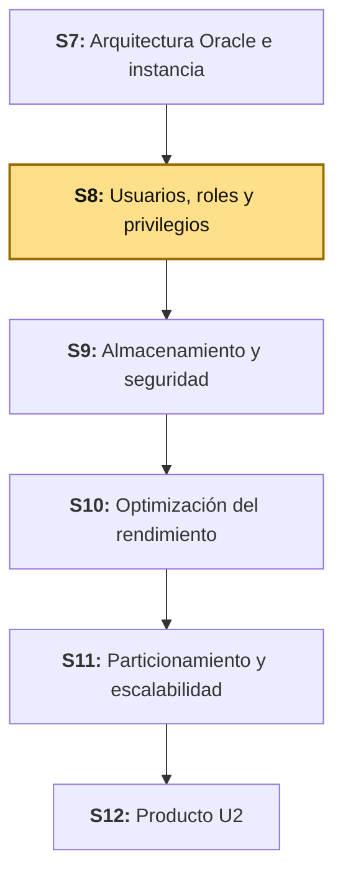
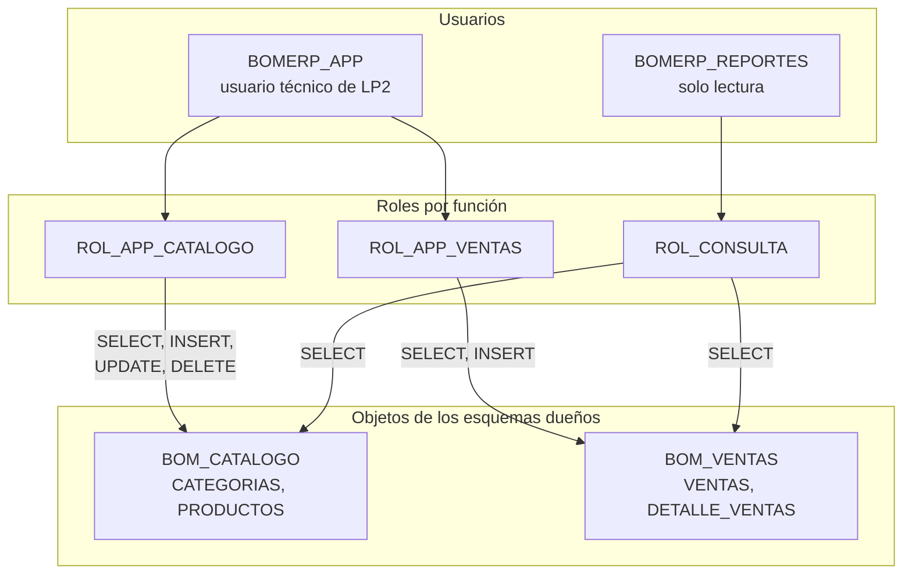

# S8 - Gestión de Usuarios, Roles y Privilegios

## 1. Introducción

Tiempo: 20 min.

### 1.1 Presentación de la sesión

S7 distinguió, con evidencia, una conexión administrativa (SYSDBA) de una conexión de aplicación: el usuario de la aplicación no puede ver lo que solo un administrador debe ver. Esa distinción se observó, pero todavía no se diseñó. Los privilegios que hoy tiene `BOMERP_APP` se fueron concediendo uno a uno, tabla por tabla, a medida que cada sesión los necesitó, sin preguntarse si la aplicación usa de verdad todo lo que se le dio. Esta sesión formaliza el modelo: qué usuarios existen y para qué, qué privilegios de sistema y de objeto necesita cada uno, cómo agruparlos en roles, y cómo verificar con el diccionario de datos que nadie tiene más de lo que necesita. El porqué de hacerlo ahora se desarrolla en 1.6, a partir del caso.

### 1.2 Índice

1. Usuarios de base de datos.
2. Privilegios de sistema y de objeto.
3. Roles.
4. Principio de mínimo privilegio.
5. Consulta de privilegios con el diccionario de datos.

### 1.3 Propósito de aprendizaje

Al concluir la clase, estarás en condiciones de:

- **Diseñar y aplicar** un modelo de usuarios, roles y privilegios bajo el principio de mínimo privilegio sobre el esquema de tu propio proyecto, y **documentar** una matriz de accesos verificada contra el diccionario de datos de Oracle.

### 1.4 Producto de sesión

Modelo de seguridad de `bomerp-oracle`: roles por función (`ROL_APP_CATALOGO`, `ROL_APP_VENTAS`, `ROL_CONSULTA`), `BOMERP_APP` reasignado a roles con los privilegios recortados a lo que LP2 realmente usa, un usuario de solo lectura (`BOMERP_REPORTES`), evidencia de accesos denegados a propósito, y la matriz de accesos verificada con `DBA_SYS_PRIVS`, `DBA_TAB_PRIVS` y `DBA_ROLE_PRIVS`.

### 1.5 Metodología

**Tabla 1. Metodología de la sesión**

| Actividades a Realizar en el Periodo | Orientaciones generales (Orientaciones Metodológicas) | Material de estudio recomendado |
|---|---|---|
| Revisión previa individual | Repasar qué privilegios recibió `BOMERP_APP` en S1 y S4 (`GRANT` directos sobre tablas) y qué operaciones ejecuta realmente LP2 sobre cada tabla. Trabajo individual, antes de clase. | S1 (3.2-3.3), S4, S7 (3.5), controladores de LP2. |
| Clase presencial | Auditoría guiada de los privilegios actuales, diseño de roles por función, reasignación de `BOMERP_APP`, creación de un usuario de solo lectura y verificación con el diccionario de datos. Trabajo individual en la propia laptop, siguiendo al docente paso a paso. | Contenedor `bomerp-oracle` corriendo (S1), Pasos 3.1 a 3.9 de esta guía. |
| Evaluación formativa | Verificación en clase de los accesos denegados a propósito (`ORA-01031`) y de la matriz de accesos. La evidencia se completa y sustenta de forma individual, fuera del aula, según los criterios mínimos de la sección 4.4. | Indicaciones de entrega (4.3), rúbrica de evaluación (4.6). |

El cierre real de S7, construido con las respuestas del Anexo de feedback de esa sesión, se entrega al inicio de esta clase.

### 1.6 Motivación de la sesión

#### 1.6.1 Caso: la prueba que borró todas las ventas

Un integrante del equipo escribe una prueba de integración para LP2 y, para dejar la base limpia entre ejecuciones, agrega una línea que borra todas las filas de `VENTAS` y `DETALLE_VENTAS`. La ejecuta contra el Oracle de desarrollo de todo el equipo. Funciona a la primera: las tablas quedan vacías, incluidas las ventas de prueba que otros compañeros usaban para probar reportes. Ninguna herramienta lo impidió, porque `BOMERP_APP` — el usuario con el que se conecta la aplicación — tiene `DELETE` sobre esas dos tablas, concedido en S4.

Pero la aplicación nunca elimina una venta: los endpoints de `ventas` solo consultan y registran. Ese `DELETE` no lo necesitaba nadie — se concedió "por si acaso" junto con `SELECT`, `INSERT` y `UPDATE`, con la misma línea de `GRANT` que se copió para las demás tablas. Con el privilegio recortado a lo que la aplicación usa, Oracle habría respondido `ORA-01031: insufficient privileges` al primer intento y la prueba habría fallado en ese momento, no después de destruir datos ajenos.

**Preguntas de análisis**

**Activación de conocimientos previos**

1. En S1 y S4, ¿qué privilegios recibió `BOMERP_APP`, sobre qué tablas, y quién los concedió?

**Comprensión de usuarios, roles y privilegios**

1. ¿Qué diferencia hay entre un privilegio de sistema (por ejemplo, `CREATE SESSION`) y un privilegio de objeto (por ejemplo, `DELETE` sobre `VENTAS`)?
2. Si la aplicación nunca elimina ventas, ¿por qué conceder `DELETE` sobre `VENTAS` es un riesgo aunque ningún endpoint lo use?

### 1.7 Ubicación en el curso

- Unidad: U2 - Administración, almacenamiento, seguridad y optimización.
- Producto del curso: base de datos empresarial Oracle operativa, administrada, optimizada, auditada y resiliente.
- Producto de unidad: base de datos empresarial administrada, optimizada y asegurada.
- Avance del producto en esta sesión: modelo de usuarios, roles y privilegios de mínimo privilegio, con la matriz de accesos verificada.

Roadmap del producto de la unidad:

**Figura 1. Roadmap del producto de la unidad**



**Sobre el ambiente de esta sesión.** El sílabo declara Oracle Database 19c EE sobre Oracle Linux como ambiente de esta unidad, todavía no aprovisionado en este repositorio. Esta guía trabaja sobre `bomerp-oracle` (Oracle Database Free, el mismo contenedor de S1 y S7), conectado a la base conectable `FREEPDB1` como `system`. Los conceptos y las sentencias de esta sesión (`CREATE USER`, `CREATE ROLE`, `GRANT`, `REVOKE` y las vistas `DBA_*`) son los mismos en Oracle 19c.

## 2. Explica

Tiempo: 25 min.

### 2.1 Arquitectura de la sesión

**Figura 2. Usuarios, roles y privilegios de BomERP**



Lectura del diagrama: ningún usuario recibe privilegios sobre las tablas de forma directa. Los privilegios se otorgan a **roles**, definidos por función, y los usuarios reciben roles. Los esquemas `BOM_CATALOGO` y `BOM_VENTAS` son los dueños de los objetos; nadie más los es. Cada apartado siguiente desarrolla una de estas piezas, en el mismo orden del Índice (1.2).

### 2.2 Usuarios de base de datos

Un **usuario** de Oracle es una identidad con la que alguien se conecta, y cada usuario tiene un **esquema** con el mismo nombre: la colección de objetos que posee. Crear un usuario y crear un esquema es, en Oracle, la misma sentencia (`CREATE USER`). Lo que distingue a un usuario de otro no es su tipo, sino **qué hace con esa identidad**.

**Tabla 2. Usuarios de `bomerp-oracle`**

| Usuario | Función | Es dueño de objetos | Privilegios de sistema |
|---|---|---|---|
| `SYS`, `SYSTEM` | Administración de la base de datos. | Sí (objetos del diccionario) | Todos, por diseño (S7). |
| `BOM_CATALOGO` | Dueño del esquema de catálogo. | Sí | `CREATE SESSION`, `CREATE TABLE`, `CREATE VIEW`, `CREATE PROCEDURE`, `CREATE TRIGGER` |
| `BOM_VENTAS` | Dueño del esquema de ventas. | Sí | Los mismos que `BOM_CATALOGO` |
| `BOMERP_APP` | Usuario técnico con el que se conecta LP2. | No | `CREATE SESSION` |
| `BOMERP_REPORTES` (nuevo, 3.6) | Consulta de solo lectura, para reportes. | No | `CREATE SESSION` |

La regla que ordena la tabla es la separación entre quien **posee** los objetos y quien los **usa**: la aplicación nunca es dueña de las tablas que consulta, y por eso no puede alterarlas ni eliminarlas, aunque un error de código lo intentara.

En Oracle Database Free, la base contiene una raíz (`CDB$ROOT`) y una base conectable (`FREEPDB1`), donde viven los usuarios del proyecto. Conéctate siempre a `FREEPDB1`: crear un usuario o un rol sin el prefijo `C##` desde la raíz falla con `ORA-65096`.

### 2.3 Privilegios de sistema y de objeto

Un **privilegio** es el derecho a ejecutar un tipo de acción. Oracle los divide en dos clases.

**Tabla 3. Privilegios de sistema y de objeto**

| Clase | Qué permite | Ejemplos | Riesgo principal |
|---|---|---|---|
| Sistema | Realizar una acción sobre la base de datos o sobre objetos de cualquier esquema. | `CREATE SESSION`, `CREATE TABLE`, `SELECT ANY TABLE` | Los privilegios `ANY` valen para todos los esquemas a la vez. |
| Objeto | Realizar una acción sobre **un** objeto concreto de otro usuario. | `SELECT`, `INSERT`, `UPDATE`, `DELETE` sobre `BOM_VENTAS.VENTAS`; `EXECUTE` sobre un procedimiento | Conceder más acciones de las que la aplicación usa. |

Dos opciones convierten un privilegio en una puerta abierta: `WITH ADMIN OPTION` (privilegios de sistema y roles) y `WITH GRANT OPTION` (privilegios de objeto) permiten que quien los recibe los **reparta** a otros, fuera del control de quien los concedió. La regla del proyecto es no usarlas para usuarios de aplicación.

Oracle responde de forma distinta según qué le falta al usuario:

- Si el usuario **no tiene ningún privilegio** sobre el objeto, Oracle responde `ORA-00942: table or view does not exist` — no revela que el objeto existe.
- Si el usuario **tiene algún privilegio** sobre el objeto pero no el que pidió, responde `ORA-01031: insufficient privileges`.

Por eso, en 3.6, el `DELETE` denegado sobre `DETALLE_VENTAS` termina en `ORA-01031`, no en `ORA-00942`: `BOMERP_APP` sí puede consultar esa tabla.

### 2.4 Roles

Un **rol** es un conjunto de privilegios con nombre, que se otorga a usuarios (u otros roles) como un solo bloque. Oracle recomienda otorgar los privilegios a roles y no a usuarios individuales, porque así el modelo se gestiona por función y no usuario por usuario (Oracle Corporation, 2024a): cambiar lo que puede hacer una función es cambiar un rol, no repasar cada usuario que la ejerce.

**Tabla 4. Roles de BomERP**

| Rol | Privilegios de objeto | Quién lo recibe |
|---|---|---|
| `ROL_APP_CATALOGO` | `SELECT`, `INSERT`, `UPDATE`, `DELETE` sobre `CATEGORIAS` y `PRODUCTOS` | `BOMERP_APP` |
| `ROL_APP_VENTAS` | `SELECT`, `INSERT` sobre `VENTAS` y `DETALLE_VENTAS` | `BOMERP_APP` |
| `ROL_CONSULTA` | `SELECT` sobre las cuatro tablas | `BOMERP_REPORTES` |

Tres detalles de los roles evitan sorpresas:

- **Se activan al iniciar la sesión.** Los roles concedidos a un usuario se habilitan como predeterminados al conectarse. Un rol concedido *mientras* la sesión ya está abierta no aparece en ella hasta que el usuario se reconecta.
- **No aplican dentro de procedimientos de derechos del definidor.** Un procedimiento PL/SQL corre por defecto con los privilegios de su **dueño**, y esos privilegios deben estar concedidos directamente al dueño, no a través de un rol (Oracle Corporation, 2024b). Si un procedimiento de `BOM_VENTAS` necesita leer `BOM_CATALOGO.PRODUCTOS`, el `GRANT` va directo a `BOM_VENTAS`.
- **Los roles predefinidos amplios no son para aplicaciones.** `DBA` y `RESOURCE`, entre otros, agrupan muchos más privilegios de los que una aplicación necesita; el proyecto crea sus propios roles, con lo justo.

### 2.5 Principio de mínimo privilegio

El **principio de mínimo privilegio** dice que un usuario debe recibir solo los privilegios que necesita para su trabajo, y ninguno más: los privilegios innecesarios comprometen la seguridad (Oracle Corporation, 2024a). Se aplica derivando los privilegios **de lo que la aplicación hace de verdad**, no de lo que sería cómodo tener.

**Tabla 5. Procedimiento para aplicar el mínimo privilegio**

| Paso | Pregunta | Evidencia en esta sesión |
|---|---|---|
| 1. Inventariar | ¿Qué operaciones ejecuta la aplicación sobre cada tabla? | Controladores de LP2 (3.3). |
| 2. Traducir | ¿Qué privilegio de objeto exige cada operación? | `GET` = `SELECT`, `POST` = `INSERT`, `PUT` = `UPDATE`, `DELETE` = `DELETE`. |
| 3. Otorgar | ¿Qué privilegios faltan, y solo esos? | Roles por función (3.4-3.5). |
| 4. Verificar | ¿Qué debería fallar, y falla? | Accesos denegados a propósito (3.6). |
| 5. Revisar | ¿Sigue haciendo falta cada privilegio? | Matriz de accesos (3.8), revisada al agregar funcionalidad. |

El paso 4 es el que distingue un modelo de seguridad de una lista de deseos: un privilegio recortado solo se puede dar por bueno si se comprobó que el acceso que se quitó ya no funciona.

### 2.6 Consulta de privilegios con el diccionario de datos

Oracle registra cada concesión en el **diccionario de datos**. Las vistas `DBA_*` muestran el estado de toda la base y solo las consultan usuarios administrativos (Oracle Corporation, 2024f).

**Tabla 6. Vistas para consultar privilegios**

| Vista | Qué muestra | Pregunta que responde |
|---|---|---|
| `DBA_SYS_PRIVS` | Privilegios de sistema por usuario o rol. | ¿Qué puede hacer `BOMERP_APP` sobre la base de datos? |
| `DBA_TAB_PRIVS` | Privilegios de objeto por usuario o rol. | ¿Sobre qué tablas, y con qué acciones? |
| `DBA_ROLE_PRIVS` | Roles concedidos a cada usuario o rol. | ¿Qué roles tiene `BOMERP_APP`? |
| `SESSION_ROLES` | Roles activos en la sesión actual. | ¿Qué roles está usando esta conexión ahora mismo? |

Para averiguar qué contiene un rol, se consulta `DBA_TAB_PRIVS` con el nombre del rol como `GRANTEE`: en esa vista, los roles aparecen igual que los usuarios.

## 3. Aplica: actividad práctica guiada

Tiempo: 90 min.

**Actividad:** rediseño guiado del modelo de seguridad de BomERP, de punta a punta: auditoría de los privilegios actuales, derivación de los privilegios necesarios, roles por función, reasignación de `BOMERP_APP`, usuario de solo lectura, accesos denegados a propósito y matriz de accesos (Producto de la sesión en 1.4).

**Propósito de la actividad:** llevar el modelo de privilegios que se fue armando sesión a sesión a un diseño deliberado, con el mismo criterio que cada estudiante aplicará sobre el esquema de su propio proyecto.

**Orientaciones metodológicas:** en el laboratorio, el docente guía el rediseño de BomERP paso a paso frente a la clase; los estudiantes repiten cada paso en su propia instancia y aplican después el mismo criterio a su propio proyecto (ver sección 4).

**Actividades para realizar:**

- **3.1** Verificar el punto de partida y conectar como `system`.
- **3.2** Auditar los privilegios actuales de `BOMERP_APP`.
- **3.3** Determinar los privilegios que LP2 necesita.
- **3.4** Crear los roles por función.
- **3.5** Mover los privilegios de `BOMERP_APP` a los roles.
- **3.6** Crear un usuario de solo lectura y probar los límites.
- **3.7** Verificar con el diccionario de datos y confirmar que LP2 sigue funcionando.
- **3.8** Documentar la matriz de accesos.
- **3.9** Relacionar con ADS y LP2.

### 3.1 Verificar el punto de partida y conectar como `system`

**Producto del paso:** confirmación de que `bomerp-oracle` sigue corriendo y de que existen los usuarios de S1 y S4.

```bash
docker ps --filter name=bomerp-oracle
```

Si el contenedor no aparece, levántalo como en S1. Conéctate a la base conectable como `system`:

```bash
docker exec -it bomerp-oracle sqlplus system/123456@localhost:1521/FREEPDB1
```

Confirma que los cuatro usuarios existen:

```sql
SELECT USERNAME FROM DBA_USERS
WHERE USERNAME IN ('BOM_CATALOGO', 'BOM_VENTAS', 'BOMERP_APP', 'BOMERP_REPORTES')
ORDER BY USERNAME;
```

Resultado esperado: `BOM_CATALOGO`, `BOM_VENTAS` y `BOMERP_APP`. `BOMERP_REPORTES` todavía no aparece: se crea en 3.6.

### 3.2 Auditar los privilegios actuales de `BOMERP_APP`

**Producto del paso:** la lista real de lo que `BOMERP_APP` puede hacer hoy.

```sql
SELECT PRIVILEGE FROM DBA_SYS_PRIVS WHERE GRANTEE = 'BOMERP_APP';

SELECT OWNER, TABLE_NAME, PRIVILEGE
FROM DBA_TAB_PRIVS
WHERE GRANTEE = 'BOMERP_APP'
ORDER BY OWNER, TABLE_NAME, PRIVILEGE;

SELECT GRANTED_ROLE FROM DBA_ROLE_PRIVS WHERE GRANTEE = 'BOMERP_APP';
```

Resultado esperado: un privilegio de sistema (`CREATE SESSION`); dieciséis privilegios de objeto (`SELECT`, `INSERT`, `UPDATE` y `DELETE` sobre cada una de las cuatro tablas); y ningún rol. Esa es la situación de partida: privilegios directos, sin roles, con las mismas cuatro acciones sobre todo.

### 3.3 Determinar los privilegios que LP2 necesita

**Producto del paso:** la comparación entre lo otorgado y lo necesario, tabla por tabla.

Los controladores de LP2 muestran qué hace de verdad la aplicación con cada tabla:

**Tabla 7. Privilegios otorgados frente a necesarios**

| Tabla | Operaciones de LP2 | Necesarios | Otorgados hoy | Exceso |
|---|---|---|---|---|
| `BOM_CATALOGO.CATEGORIAS` | Listar, obtener, crear, actualizar y eliminar (`CategoriaController`) | `SELECT`, `INSERT`, `UPDATE`, `DELETE` | Los cuatro | — |
| `BOM_CATALOGO.PRODUCTOS` | Las cuatro, más el descuento de stock al vender (`ProductoController`, `descontarStock`) | `SELECT`, `INSERT`, `UPDATE`, `DELETE` | Los cuatro | — |
| `BOM_VENTAS.VENTAS` | Listar, obtener y registrar (`VentaController`) | `SELECT`, `INSERT` | Los cuatro | `UPDATE`, `DELETE` |
| `BOM_VENTAS.DETALLE_VENTAS` | Se leen y se insertan junto con su venta | `SELECT`, `INSERT` | Los cuatro | `UPDATE`, `DELETE` |

El exceso está exactamente en las dos tablas de ventas: la aplicación registra y consulta ventas, no las modifica ni las elimina. Cuando LP2 implemente la anulación de una venta (`Venta.anular()`, previsto en ADS S7), `ROL_APP_VENTAS` ganará `UPDATE` sobre `VENTAS` — y solo ese, no `DELETE`.

### 3.4 Crear los roles por función

**Producto del paso:** tres roles con los privilegios de la Tabla 4.

Ejecuta como `system`, en `FREEPDB1`. `CREATE ROLE` crea el rol y `GRANT` le otorga privilegios (Oracle Corporation, 2024d, 2024e). `system` puede conceder privilegios sobre objetos de otros esquemas porque tiene `GRANT ANY OBJECT PRIVILEGE` (a través del rol `DBA`).

```sql
CREATE ROLE ROL_APP_CATALOGO;
GRANT SELECT, INSERT, UPDATE, DELETE ON BOM_CATALOGO.CATEGORIAS TO ROL_APP_CATALOGO;
GRANT SELECT, INSERT, UPDATE, DELETE ON BOM_CATALOGO.PRODUCTOS  TO ROL_APP_CATALOGO;

CREATE ROLE ROL_APP_VENTAS;
GRANT SELECT, INSERT ON BOM_VENTAS.VENTAS         TO ROL_APP_VENTAS;
GRANT SELECT, INSERT ON BOM_VENTAS.DETALLE_VENTAS TO ROL_APP_VENTAS;

CREATE ROLE ROL_CONSULTA;
GRANT SELECT ON BOM_CATALOGO.CATEGORIAS   TO ROL_CONSULTA;
GRANT SELECT ON BOM_CATALOGO.PRODUCTOS    TO ROL_CONSULTA;
GRANT SELECT ON BOM_VENTAS.VENTAS         TO ROL_CONSULTA;
GRANT SELECT ON BOM_VENTAS.DETALLE_VENTAS TO ROL_CONSULTA;
```

Resultado esperado: `Role created.` tres veces y `Grant succeeded.` en cada `GRANT`.

### 3.5 Mover los privilegios de `BOMERP_APP` a los roles

**Producto del paso:** `BOMERP_APP` sin privilegios de objeto directos, con los roles de 3.4.

El orden importa: primero se concede el rol, después se revocan los privilegios directos. Así `BOMERP_APP` nunca queda sin acceso entre un paso y otro.

```sql
GRANT ROL_APP_CATALOGO, ROL_APP_VENTAS TO BOMERP_APP;

REVOKE SELECT, INSERT, UPDATE, DELETE ON BOM_CATALOGO.CATEGORIAS   FROM BOMERP_APP;
REVOKE SELECT, INSERT, UPDATE, DELETE ON BOM_CATALOGO.PRODUCTOS    FROM BOMERP_APP;
REVOKE SELECT, INSERT, UPDATE, DELETE ON BOM_VENTAS.VENTAS         FROM BOMERP_APP;
REVOKE SELECT, INSERT, UPDATE, DELETE ON BOM_VENTAS.DETALLE_VENTAS FROM BOMERP_APP;
```

`system` puede revocar privilegios que concedió el dueño del objeto porque tiene `GRANT ANY OBJECT PRIVILEGE` (Oracle Corporation, 2024c). Resultado esperado: `Revoke succeeded.` cuatro veces. Los privilegios de objeto de `BOMERP_APP` ahora llegan solo a través de los roles, y el recorte de 3.3 ya está aplicado: `UPDATE` y `DELETE` sobre las tablas de ventas desaparecieron.

### 3.6 Crear un usuario de solo lectura y probar los límites

**Producto del paso:** `BOMERP_REPORTES` funcionando, y accesos denegados a propósito evidenciados.

```sql
CREATE USER BOMERP_REPORTES IDENTIFIED BY "123456";
GRANT CREATE SESSION TO BOMERP_REPORTES;
GRANT ROL_CONSULTA TO BOMERP_REPORTES;
```

Prueba primero los límites de `BOMERP_APP`:

```bash
docker exec -it bomerp-oracle sqlplus BOMERP_APP/123456@localhost:1521/FREEPDB1
```

```sql
SELECT COUNT(*) FROM BOM_VENTAS.VENTAS;

DELETE FROM BOM_VENTAS.DETALLE_VENTAS WHERE ID = -1;

CREATE TABLE PRUEBA (ID NUMBER);
```

Resultado esperado: el `SELECT` devuelve un número; el `DELETE` falla con `ORA-01031: insufficient privileges` — aunque `WHERE ID = -1` no afectaría ninguna fila, Oracle valida el privilegio antes de leer datos —; y el `CREATE TABLE` también falla con `ORA-01031`, porque `BOMERP_APP` no tiene ese privilegio de sistema. Es la prueba del caso de 1.6.1: la prueba que borraba ventas habría fallado.

Ahora los límites de `BOMERP_REPORTES`:

```bash
docker exec -it bomerp-oracle sqlplus BOMERP_REPORTES/123456@localhost:1521/FREEPDB1
```

```sql
SELECT COUNT(*) FROM BOM_CATALOGO.PRODUCTOS;

UPDATE BOM_CATALOGO.PRODUCTOS SET STOCK = STOCK WHERE ID = -1;
```

Resultado esperado: el `SELECT` funciona; el `UPDATE` falla con `ORA-01031`.

### 3.7 Verificar con el diccionario de datos y confirmar que LP2 sigue funcionando

**Producto del paso:** el estado final de los privilegios, verificado en el diccionario, y LP2 operando con los roles.

Como `system`, comprueba que `BOMERP_APP` ya no tiene privilegios de objeto directos, y que recibe dos roles:

```sql
SELECT COUNT(*) FROM DBA_TAB_PRIVS WHERE GRANTEE = 'BOMERP_APP';

SELECT GRANTED_ROLE, DEFAULT_ROLE FROM DBA_ROLE_PRIVS WHERE GRANTEE = 'BOMERP_APP';

SELECT GRANTEE, COUNT(*) AS PRIVILEGIOS
FROM DBA_TAB_PRIVS
WHERE GRANTEE IN ('ROL_APP_CATALOGO', 'ROL_APP_VENTAS', 'ROL_CONSULTA')
GROUP BY GRANTEE
ORDER BY GRANTEE;
```

Resultado esperado: `0`; los roles `ROL_APP_CATALOGO` y `ROL_APP_VENTAS`, ambos con `DEFAULT_ROLE = YES`; y `8`, `4` y `4` privilegios de objeto para `ROL_APP_CATALOGO`, `ROL_APP_VENTAS` y `ROL_CONSULTA`.

Luego confirma que LP2 sigue funcionando. **Reinicia `lp2/bomerp-backend`** antes de probar: las conexiones que el backend ya tenía abiertas fueron creadas antes del cambio y no reciben el rol nuevo hasta reconectarse.

```powershell
cd lp2/bomerp-backend
.\mvnw.cmd spring-boot:run
```

En otra terminal, registra una venta y consulta los productos:

```powershell
Invoke-RestMethod -Method Post -Uri "http://localhost:8080/api/v1/ventas" `
  -ContentType "application/json" `
  -Body '{"detalles": [{"productoId": 1, "cantidad": 1}]}'

Invoke-RestMethod -Method Get -Uri "http://localhost:8080/api/v1/productos"
```

```bash
curl -X POST http://localhost:8080/api/v1/ventas \
  -H "Content-Type: application/json" \
  -d '{"detalles": [{"productoId": 1, "cantidad": 1}]}'

curl http://localhost:8080/api/v1/productos
```

Resultado esperado: `201 Created` con la venta registrada, y `200 OK` con la lista de productos. Registrar una venta ejerce todos los privilegios que quedaron: `INSERT` sobre las tablas de ventas y `UPDATE` sobre `PRODUCTOS` (descuento de stock).

**Error frecuente**: el backend responde `500` y su log muestra `ORA-00942` o `ORA-01031` justo después de mover los privilegios. No es que falte un privilegio: el *pool* de conexiones del backend sigue usando sesiones abiertas antes de 3.5, que no tienen los roles activos. Reinicia el backend y repite la prueba. Si el error persiste tras reiniciar, sí falta un privilegio en el rol: revisa la Tabla 7 contra `DBA_TAB_PRIVS`.

### 3.8 Documentar la matriz de accesos

**Producto del paso:** la matriz de accesos, con la evidencia de cada celda.

**Tabla 8. Matriz de accesos de BomERP**

| Usuario | Rol | `CATEGORIAS` | `PRODUCTOS` | `VENTAS` | `DETALLE_VENTAS` | Evidencia |
|---|---|---|---|---|---|---|
| `BOMERP_APP` | `ROL_APP_CATALOGO` | `S`, `I`, `U`, `D` | `S`, `I`, `U`, `D` | — | — | 3.7, `DBA_TAB_PRIVS` |
| `BOMERP_APP` | `ROL_APP_VENTAS` | — | — | `S`, `I` | `S`, `I` | 3.6, `ORA-01031` en `DELETE` |
| `BOMERP_REPORTES` | `ROL_CONSULTA` | `S` | `S` | `S` | `S` | 3.6, `ORA-01031` en `UPDATE` |
| `BOM_CATALOGO` / `BOM_VENTAS` | — (dueños) | todos, sobre sus propias tablas | | | | Tabla 2 |

`S` = `SELECT`, `I` = `INSERT`, `U` = `UPDATE`, `D` = `DELETE`.

### 3.9 Relacionar con ADS y LP2

Sesión equivalente en los otros dos cursos, misma semana: ADS S8 diseña las clases del módulo `ventas` por capas y las transforma a tablas, con la matriz de trazabilidad dominio-clase-tabla — la separación por módulos (`BOM_CATALOGO`, `BOM_VENTAS`) que hoy se refleja en roles distintos (`ROL_APP_CATALOGO`, `ROL_APP_VENTAS`) es la misma que ADS dibuja como límite de módulo. LP2 S8 construye en la SPA el CRUD de `Producto`, dependiente de `Categoria`: consume los mismos endpoints de catálogo, así que exige exactamente los privilegios de `ROL_APP_CATALOGO`, sin cambios en el código de LP2.

**Evidencia de aprendizaje:**

- Privilegios actuales de `BOMERP_APP`, auditados con el diccionario de datos.
- Comparación de privilegios otorgados y necesarios, con el exceso identificado.
- Tres roles por función y `BOMERP_APP` reasignado, con los privilegios directos revocados.
- Usuario de solo lectura y accesos denegados a propósito (`ORA-01031`).
- Estado final verificado en `DBA_TAB_PRIVS` y `DBA_ROLE_PRIVS`, y LP2 operando con los roles.
- Matriz de accesos.

## 4. Crea: actividad autónoma

Tiempo: 2h fuera del aula.

### 4.1 Actividad

Rediseño autónomo del modelo de seguridad de la base de datos del proyecto propio del equipo, documentado en evidencia individual.

Completa y evidencia estas tareas:

1. Auditar con el diccionario de datos los privilegios de tu usuario de aplicación: de sistema, de objeto y roles.
2. Inventariar qué operaciones ejecuta tu aplicación sobre cada tabla y derivar los privilegios que necesita, señalando el exceso si lo hay.
3. Crear al menos dos roles por función, otorgarles solo los privilegios necesarios y reasignar tu usuario de aplicación, revocando los privilegios directos.
4. Crear un usuario de solo lectura y evidenciar, con `ORA-01031`, al menos dos accesos denegados a propósito.
5. Verificar el estado final con `DBA_SYS_PRIVS`, `DBA_TAB_PRIVS` y `DBA_ROLE_PRIVS`, y confirmar que tu aplicación sigue funcionando.
6. Documentar la matriz de accesos del proyecto.

### 4.2 Propósito

Que cada estudiante demuestre, de forma individual y fuera del aula, que puede diseñar y verificar un modelo de usuarios, roles y privilegios de mínimo privilegio sobre su propia base de datos, sin el acompañamiento del docente.

Cada estudiante documenta el modelo de seguridad de su propio proyecto.

### 4.3 Indicaciones

Entrega un PDF con el siguiente nombre:

```text
S08_BD2_Equipo##_ApellidoNombre.pdf
```

Cada captura de pantalla del informe debe mostrar, sin recortar, el reloj del sistema (fecha y hora) y tu usuario o foto de perfil (Windows, VS Code o navegador) visibles en pantalla — es lo que permite verificar que la evidencia es tuya y que corresponde al momento real de tu trabajo.

#### 4.3.1 Estructura del informe

**Datos del estudiante**

- Nombre:
- Equipo:
- Sesión: S08 - Gestión de Usuarios, Roles y Privilegios
- Rol o aporte realizado:
- Link de GitHub:

**Evidencia técnica**

Incluye capturas o salidas con una breve explicación debajo de cada una, organizadas en los mismos 4 bloques de la rúbrica (4.6):

1. *Auditoría de privilegios*
    - Consultas a `DBA_SYS_PRIVS`, `DBA_TAB_PRIVS` y `DBA_ROLE_PRIVS` sobre tu usuario de aplicación, y la comparación de privilegios otorgados y necesarios.
2. *Roles y usuarios*
    - Script de creación de roles y usuarios, con los privilegios directos revocados.
3. *Accesos denegados*
    - Al menos dos intentos fallidos a propósito (`ORA-01031`), con el motivo de cada uno.
4. *Matriz de accesos verificada*
    - La matriz de accesos del proyecto, contrastada con el estado final del diccionario de datos.

**Error o hallazgo**

Describe al menos un hallazgo real: un privilegio que descubriste que tu aplicación nunca usaba, un `ORA-00942` que resultó ser un rol no activado en una sesión ya abierta, o un procedimiento que dejó de funcionar porque un privilegio llegaba por un rol y no directo.

**Reflexión técnica breve**

Responde en 5 a 8 líneas:

```text
¿Por qué conceder un privilegio "por si acaso" es un riesgo aunque la
aplicación nunca lo use — y cómo cambia ese riesgo cuando el privilegio
se otorga a un rol por función en vez de a un usuario?
```

**Anexo: Feedback de la sesión**

Pega esta página como la última hoja del PDF, con tus respuestas.

1. ¿Cuál es el aprendizaje más importante que te llevas de la clase de hoy?
2. ¿Qué punto de la clase te resultó más confuso o te dejó con dudas?
3. ¿Tienes alguna pregunta que te gustaría que sea respondida la siguiente clase?
4. Sobre tu nivel de comprensión de la clase de hoy, marca una opción:
    - ¡Entendido! - Lo domino y podría explicarlo.
    - Más o menos. - Entendí la idea general, pero tengo dudas.
    - Necesito ayuda. - Me siento perdido/a con este tema.
5. ¿Cómo puedo ayudarte a comprender mejor el tema?
6. Pensando en tu participación y esfuerzo en la clase de hoy, ¿cómo te autoevaluarías? Marca una opción:
    - Muy Comprometido/a: Me esforcé al máximo.
    - Comprometido/a: Sé que podría haberme esforzado un poco más.
    - Poco Comprometido/a: Hoy no di mi mejor esfuerzo.
7. Mi satisfacción con la clase fue... (califica del 1 al 10, donde 1 es insatisfecho y 10 es muy satisfecho).

### 4.4 Criterios mínimos de aceptación

La evidencia individual se considera completa si:

- El archivo respeta el nombre solicitado.
- Audita los privilegios de su usuario de aplicación con `DBA_SYS_PRIVS`, `DBA_TAB_PRIVS` y `DBA_ROLE_PRIVS`.
- Compara los privilegios otorgados con los necesarios, derivados de las operaciones reales de su aplicación.
- Crea al menos dos roles por función y reasigna su usuario de aplicación, con los privilegios directos revocados.
- Crea un usuario de solo lectura y evidencia al menos dos accesos denegados a propósito (`ORA-01031`).
- Presenta la matriz de accesos, verificada contra el diccionario de datos.
- Confirma que su aplicación sigue funcionando con el nuevo modelo.
- Cada captura de la evidencia técnica muestra el reloj del sistema y el usuario/perfil visible, sin recortar.
- Las fechas y horas de las capturas son coherentes con el historial de commits de su repositorio en GitHub.
- Incluye un error o hallazgo técnico diagnosticado.
- Incluye la reflexión técnica breve solicitada.
- Incluye el Anexo de feedback de la sesión respondido, como última página del PDF.

### 4.5 Preguntas de defensa

1. ¿Por qué el `DELETE` sobre una tabla que solo tiene `SELECT` termina en `ORA-01031`, y en cambio una tabla sin ningún privilegio termina en `ORA-00942`?
2. ¿Por qué se concede el rol antes de revocar los privilegios directos, y no al revés?
3. ¿Por qué un rol recién concedido no aparece en una sesión que ya estaba abierta?
4. ¿Qué privilegio de tu aplicación descubriste que nunca usaba, y cómo lo descubriste?
5. ¿Por qué `WITH GRANT OPTION` no se usa con un usuario de aplicación?
6. Un procedimiento PL/SQL de un esquema lee una tabla de otro esquema y falla tras pasar el privilegio a un rol. ¿Por qué, y cómo se corrige?

### 4.6 Rúbrica de evaluación

**Tabla 9. Rúbrica de evaluación**

| Criterio | Peso (%) | A (20 pts) | B (15 pts) | C (10 pts) | D (5 pts) | Nivel obtenido |
|---|---:|---|---|---|---|---:|
| 1. Auditoría de privilegios* | 25 | Auditoría completa con las tres vistas y comparación clara entre privilegios otorgados y necesarios, con el exceso identificado. | Auditoría con las tres vistas, con la comparación incompleta. | Auditoría parcial o sin derivar los privilegios necesarios. | No audita los privilegios. | |
| 2. Roles y usuarios* | 25 | Roles por función con solo los privilegios necesarios, usuario de aplicación reasignado y privilegios directos revocados. | Roles funcionales, con algún privilegio directo sin revocar o algún exceso. | Roles creados sin criterio de función, o sin reasignar el usuario. | No crea roles ni usuarios. | |
| 3. Accesos denegados* | 25 | Al menos dos accesos denegados a propósito, evidenciados y explicados correctamente. | Accesos denegados evidenciados, con una explicación parcial. | Un solo acceso denegado, o sin explicar. | No evidencia accesos denegados. | |
| 4. Matriz de accesos verificada* | 25 | Matriz completa, contrastada con el estado final del diccionario, y aplicación confirmada funcionando. | Matriz completa, con la verificación parcial. | Matriz incompleta o sin verificar contra el diccionario. | No presenta matriz de accesos. | |

\* Agregado manual.

Nota final = suma de (`Peso` / 100 × `Puntos del nivel obtenido`) = ____ / 20.

Para usar la rúbrica con IA, solicita:

```text
Evalúa el PDF usando la rúbrica de la sesión.
Para cada criterio selecciona el nivel obtenido usando la escala A=20, B=15, C=10, D=5 puntos.
Justifica brevemente cada nivel asignado.
Verifica que cada captura muestre reloj del sistema y usuario/perfil visible, y que las fechas sean coherentes con el historial de commits de GitHub. Si falta esta evidencia o hay inconsistencias, indícalo explícitamente antes de calificar.
Calcula la nota final con la fórmula: suma de (Peso/100 × Puntos del nivel obtenido), directamente sobre 20.
Indica 2 fortalezas y 2 recomendaciones.
```

## 5. Cierre

Tiempo: 5 min.

**Resumen breve:** hoy los privilegios de `BOMERP_APP`, concedidos uno a uno a lo largo del curso, pasaron a un modelo diseñado: roles por función, privilegios recortados a lo que LP2 realmente usa, un usuario de solo lectura, accesos denegados evidenciados a propósito y una matriz de accesos verificada contra el diccionario de datos.

**Dinámica participativa:** en una ronda rápida, cada estudiante comparte en una frase qué privilegio de su aplicación descubrió que nunca se usaba.

**Metacognición:** cada estudiante responde el Anexo de feedback de la sesión, incluido en su evidencia individual (ver 4.3.1). El docente analiza esas respuestas con IA para identificar temas recurrentes o dudas comunes del equipo, y con esos indicadores construye el cierre real de la sesión — que se entrega al inicio de S9, no al final de esta clase.

**Proyección:** S9 agrega lo que el modelo de hoy todavía no puede responder: quién hizo qué, y cuándo. La auditoría de acceso y de sentencias registra las acciones de cada usuario — incluidos los accesos denegados de hoy — junto con la administración del almacenamiento (tablespaces, redo logs, undo).

## Bibliografía

1. Oracle Corporation. (2024a). *Configuring Privilege and Role Authorization*. Database Security Guide. https://docs.oracle.com/en/database/oracle/oracle-database/23/dbseg/configuring-privilege-and-role-authorization.html
2. Oracle Corporation. (2024b). *Managing Security for Definer's Rights and Invoker's Rights*. Database Security Guide. https://docs.oracle.com/en/database/oracle/oracle-database/23/dbseg/managing-security-for-definers-rights-and-invokers-rights.html
3. Oracle Corporation. (2024c). *REVOKE*. SQL Language Reference. https://docs.oracle.com/en/database/oracle/oracle-database/23/sqlrf/REVOKE.html
4. Oracle Corporation. (2024d). *GRANT*. SQL Language Reference. https://docs.oracle.com/en/database/oracle/oracle-database/23/sqlrf/GRANT.html
5. Oracle Corporation. (2024e). *CREATE ROLE*. SQL Language Reference. https://docs.oracle.com/en/database/oracle/oracle-database/23/sqlrf/CREATE-ROLE.html
6. Oracle Corporation. (2024f). *DBA_TAB_PRIVS*. Database Reference. https://docs.oracle.com/en/database/oracle/oracle-database/23/refrn/DBA_TAB_PRIVS.html
