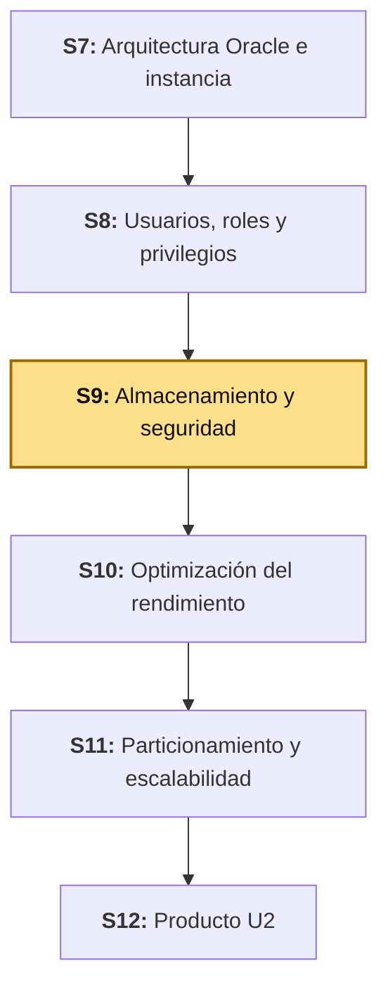
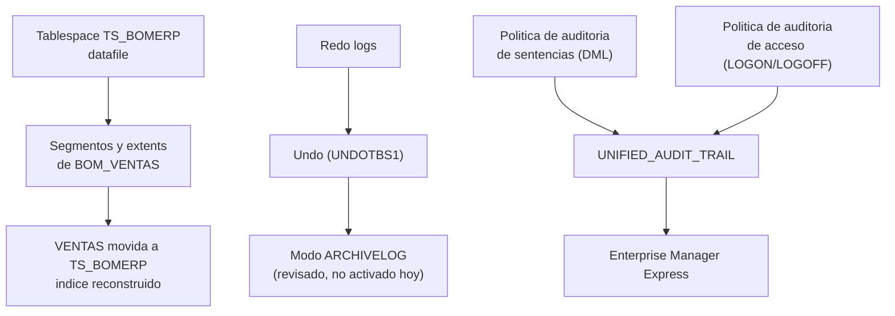

# S9 - Administración del Almacenamiento y Seguridad

## 1. Introducción

Tiempo: 20 min.

### 1.1 Presentación de la sesión

S8 diseñó **quién puede hacer qué**: roles por función, privilegios recortados a lo que LP2 (Lenguaje de Programación II) realmente usa, un usuario de solo lectura, y accesos denegados comprobados contra el motor. Lo que esa sesión no puede responder todavía es **quién hizo qué, y cuándo** — ni dónde vive físicamente cada tabla dentro de la base de datos. Esta sesión cierra las dos preguntas: la estructura de almacenamiento (tablespaces, segmentos, extents, datafiles, redo logs, undo, archivelog) que explica dónde y cómo se guardan los datos, y la auditoría (de sentencias y de acceso) que deja un registro verificable de cada acción — incluidos los accesos denegados que S8 ya provocó a propósito. El porqué de que ese registro tenga que ser imposible de desactivar o borrar por quien lo genera se desarrolla en 1.6, a partir del caso.

### 1.2 Índice

1. Tablespaces, segmentos, extents y datafiles.
2. Redo logs, undo y archivelog.
3. Auditoría de sentencias (Unified Auditing).
4. Auditoría de acceso.
5. Enterprise Manager Express.

### 1.3 Propósito de aprendizaje

Al concluir la clase, estarás en condiciones de:

- **Configurar y revisar** la estructura de almacenamiento físico de un esquema propio, y **activar y verificar** auditoría de sentencias y de acceso con Unified Auditing, documentando la evidencia con el diccionario de datos y Enterprise Manager Express.

### 1.4 Producto de sesión

Estructura de almacenamiento de BomERP: tablespace `TS_BOMERP` creado y explorado (datafile, segmentos, extents), la tabla `VENTAS` movida a ese tablespace con su índice reconstruido, y los redo logs, el tablespace de undo y el modo de archivado revisados con el diccionario de datos. Modelo de auditoría con Unified Auditing: una política de auditoría de sentencias sobre `BOM_VENTAS` (`INSERT`, `UPDATE`, `DELETE`), una política de auditoría de acceso (`LOGON`/`LOGOFF` y intentos fallidos), evidencia real capturada en `UNIFIED_AUDIT_TRAIL` — incluidos los accesos denegados de S8 —, y Enterprise Manager Express habilitado con al menos una captura.

### 1.5 Metodología

**Tabla 1. Metodología de la sesión**

| Actividades a Realizar en el Periodo | Orientaciones generales (Orientaciones Metodológicas) | Material de estudio recomendado |
|---|---|---|
| Revisión previa individual | Repasar los accesos denegados de S8 (3.6: `DELETE` de `BOMERP_APP` sobre `DETALLE_VENTAS`, `UPDATE` de `BOMERP_REPORTES` sobre `PRODUCTOS`) y confirmar que los roles de S8 siguen vigentes. Trabajo individual, antes de clase. | S8 (3.4-3.6, Tabla 8). |
| Clase presencial | Configuración guiada del tablespace `TS_BOMERP`, exploración de segmentos y extents, revisión de redo logs/undo/archivelog, activación de Unified Auditing (sentencias y acceso) con evidencia real, y habilitación de Enterprise Manager Express. Trabajo individual en la propia laptop, siguiendo al docente paso a paso. | Contenedor `bomerp-oracle` corriendo (S1), Pasos 3.1 a 3.9 de esta guía. |
| Evaluación formativa | Verificación en clase de la tabla movida de tablespace, de la auditoría capturando un acceso denegado real, y de Enterprise Manager Express cargando en el navegador. La evidencia se completa y sustenta de forma individual, fuera del aula, según los criterios mínimos de la sección 4.4. | Indicaciones de entrega (4.3), rúbrica de evaluación (4.6). |

El cierre real de S8, construido con las respuestas del Anexo de feedback de esa sesión, se entrega al inicio de esta clase.

### 1.6 Motivación de la sesión

#### 1.6.1 Caso: el atraco de 81 millones de dólares que empezó apagando una impresora

En febrero de 2016, un grupo de atacantes usó credenciales robadas del sistema SWIFT (*Society for Worldwide Interbank Financial Telecommunication*, la red de mensajería que usan los bancos para transferencias internacionales) para ordenar transferencias fraudulentas desde la cuenta del Banco Central de Bangladesh en la Reserva Federal de Nueva York, por un total de 101 millones de dólares. El banco bloqueó 850 millones adicionales en transferencias, pero 81 millones llegaron a cuentas en Filipinas y se lavaron a través de casinos antes de que nadie pudiera reaccionar.

Una parte deliberada del ataque no fue técnica, fue de **auditoría**: el malware usado deshabilitó la impresora que normalmente registraba en papel cada confirmación de transferencia del sistema SWIFT, y alteró los registros de confirmación para no dejar rastro inmediato de las órdenes fraudulentas. El objetivo específico de esa manipulación era retrasar la detección — sin esa evidencia, nadie en el banco supo que algo andaba mal hasta que fue demasiado tarde para revertir la mayoría de las transferencias.

Fuente: Fortune. (2016, 15 de mayo). *SWIFT confirms second cyberattack hit a bank*. https://fortune.com/2016/05/15/swift-responsible-bangladesh-heist/

El caso no trata solo de un atacante externo: trata de qué tan fácil fue para ese atacante **apagar la evidencia** de lo que estaba haciendo. Un registro de auditoría que cualquiera con suficiente acceso puede desactivar, modificar o borrar no es un registro de auditoría — es una sugerencia. Esta sesión activa auditoría sobre BomERP con un criterio distinto: la política de auditoría la crea y administra `SYSTEM`/`SYS`, nunca el usuario de aplicación (`BOMERP_APP`), exactamente para que ningún incidente futuro de BomERP dependa de que el propio usuario auditado haya decidido dejar rastro.

**Preguntas de análisis**

**Activación de conocimientos previos**

1. Antes de leer la causa, ¿por qué un atacante se tomaría el trabajo de apagar una impresora de confirmaciones en vez de solo robar el dinero?

**Comprensión de la auditoría**

1. Según el caso, ¿qué hubiera cambiado si el registro de confirmaciones no hubiera podido desactivarse desde dentro del propio sistema atacado?
2. En BomERP, si `BOMERP_APP` pudiera desactivar la auditoría sobre sus propias sentencias, ¿qué tan confiable sería esa auditoría?

### 1.7 Ubicación en el curso

- Unidad: U2 - Administración, almacenamiento, seguridad y optimización.
- Producto del curso: base de datos empresarial Oracle operativa, administrada, optimizada, auditada y resiliente.
- Producto de unidad: base de datos empresarial administrada, optimizada y asegurada.
- Avance del producto en esta sesión: estructura de almacenamiento configurada y revisada, y auditoría de sentencias y de acceso activada con evidencia real, incluidos los accesos denegados de S8.

**Figura 1. Roadmap del producto de la unidad**



**Sobre el ambiente de esta sesión.** El sílabo declara Oracle Database 19c EE (*Enterprise Edition*) sobre Oracle Linux como ambiente de esta unidad, todavía no aprovisionado en este repositorio. Esta guía trabaja sobre `bomerp-oracle` (Oracle Database Free, el mismo contenedor de S1, S7 y S8), conectado a la base conectable `FREEPDB1` como `system`. Las sentencias de almacenamiento (`CREATE TABLESPACE`, `ALTER TABLE ... MOVE`) son las mismas en Oracle 19c. La auditoría sí tiene una diferencia real de versión, explicada en 2.3: esta guía usa **Unified Auditing**, obligatorio desde Oracle 21c en adelante (y por tanto en este contenedor); en Oracle 19c, Unified Auditing es opcional y la sintaxis clásica (`AUDIT ... BY ACCESS`) todavía puede estar disponible — confírmalo con `SELECT VALUE FROM V$OPTION WHERE PARAMETER = 'Unified Auditing';` antes de asumir cuál aplica en un ambiente 19c real.

## 2. Explica

Tiempo: 30 min.

### 2.1 Arquitectura de la sesión

**Figura 2. De la estructura física a la auditoría verificable**



Lectura del diagrama: el almacenamiento (arriba) y la auditoría (abajo) son dos preocupaciones distintas que conviven en la misma instancia — una decide **dónde** viven los datos, la otra decide **qué queda registrado** sobre quién los tocó. Enterprise Manager Express es la superficie visual donde ambas se pueden inspeccionar sin escribir una sola consulta. Cada apartado siguiente desarrolla una pieza, en el mismo orden del Índice (1.2).

### 2.2 Tablespaces, segmentos, extents y datafiles

Un **tablespace** es la unidad lógica de almacenamiento de Oracle: un contenedor con nombre al que se le asignan uno o más **datafiles**, los archivos físicos reales en disco (Oracle Corporation, 2024a). Toda tabla, índice o cualquier otro objeto que ocupe espacio pertenece a un tablespace — nunca directamente a un archivo.

**Tabla 2. De lo lógico a lo físico**

| Nivel | Qué es | Ejemplo en BomERP |
|---|---|---|
| Tablespace | Unidad lógica de almacenamiento, con nombre. | `TS_BOMERP` (3.2), `USERS` (donde viven las tablas hoy), `SYSTEM`, `UNDOTBS1`. |
| Segmento | El espacio que ocupa **un** objeto concreto dentro de un tablespace. | El segmento de la tabla `VENTAS`. |
| Extent | Un bloque contiguo de espacio dentro de un segmento; un segmento crece agregando extents. | El primer extent de `VENTAS`, 64 KB. |
| Datafile | El archivo físico en disco que respalda un tablespace. | `ts_bomerp01.dbf`. |

Un tablespace puede tener más de un datafile, y un datafile pertenece a un solo tablespace — la relación es de uno (tablespace) a muchos (datafiles), nunca al revés. `AUTOEXTEND ON` deja que el datafile crezca solo cuando el tablespace se queda sin espacio, hasta un límite (`MAXSIZE`) que evita que un error de la aplicación llene el disco completo de la instancia.

### 2.3 Redo logs, undo y archivelog

Tres mecanismos de Oracle, cada uno con un propósito distinto, cubren una pregunta operativa diferente sobre los datos:

**Tabla 3. Redo, undo y archivelog**

| Mecanismo | Pregunta que responde | Qué contiene | Dónde se revisa |
|---|---|---|---|
| Redo logs | Si la instancia se cae a mitad de una transacción, ¿cómo se recupera lo ya confirmado? | Los cambios físicos recientes, en archivos circulares (*online redo log*). | `V$LOG` |
| Undo | Si una transacción se revierte (`ROLLBACK`), o una consulta larga necesita una foto consistente, ¿de dónde sale el valor anterior? | El estado anterior de cada fila modificada, mientras haga falta. | `V$UNDOSTAT`, `DBA_TABLESPACES` (`CONTENTS = 'UNDO'`) |
| Archivelog | Si se pierde un datafile completo, ¿se puede recuperar hasta un punto exacto en el tiempo, no solo hasta el último backup? | Copias de los redo logs ya llenos, antes de que se sobrescriban. | `V$DATABASE.LOG_MODE` |

El modo `ARCHIVELOG` es, de los tres, el único que es una **decisión** y no una estructura que ya existe por defecto: con `NOARCHIVELOG` (el modo por defecto de un contenedor de desarrollo), un redo log se sobrescribe en cuanto se llena, y una recuperación solo puede volver al último backup completo — sin archivelog, no hay *Point-In-Time Recovery* más allá de ese punto (contenido de U3, Backup y Recovery con RMAN). Activarlo exige reiniciar la instancia en modo `MOUNT`, una operación que esta guía solo revisa (3.5), sin ejecutarla sobre el contenedor compartido del curso — es exactamente el tipo de cambio que primero se entiende y se practica en un ambiente propio, antes de aplicarlo donde otros compañeros tienen datos en curso.

### 2.4 Auditoría de sentencias (Unified Auditing)

**Unified Auditing** es el mecanismo de auditoría de Oracle desde la versión 12c, y el único disponible desde la 21c en adelante — la auditoría tradicional (`AUDIT ... BY ACCESS`, la forma clásica) quedó obsoleta y Oracle la rechaza activamente en versiones recientes con el error `ORA-46401` (Oracle Corporation, 2024b). Una política de auditoría se declara una vez, con las acciones que le interesan, y se activa por separado:

```sql
CREATE AUDIT POLICY pol_auditoria_ventas
  ACTIONS INSERT, UPDATE, DELETE ON BOM_VENTAS.VENTAS,
          INSERT, UPDATE, DELETE ON BOM_VENTAS.DETALLE_VENTAS;

AUDIT POLICY pol_auditoria_ventas;
```

**Tabla 4. `AUDIT` tradicional frente a Unified Auditing**

| | Tradicional (`AUDIT ... BY ACCESS`) | Unified Auditing (`CREATE AUDIT POLICY` + `AUDIT POLICY`) |
|---|---|---|
| Disponibilidad | Obsoleta; rechazada desde 21c (`ORA-46401`) | Obligatoria desde 21c; disponible y recomendada desde 12c |
| Declaración | Una sola sentencia por objeto y acción | Una política reutilizable, con varias acciones y objetos |
| Dónde se consulta | `DBA_AUDIT_TRAIL` | `UNIFIED_AUDIT_TRAIL` |

La política registra la sentencia **se cumpla o falle**: cada fila de `UNIFIED_AUDIT_TRAIL` trae `RETURN_CODE` — `0` si la sentencia tuvo éxito, o el número de error de Oracle si falló (Oracle Corporation, 2024c). Por eso una sola política de auditoría de sentencias ya captura tanto el uso normal de la aplicación como un intento de `DELETE` que el motor rechazó por falta de privilegio — como el de S8.

### 2.5 Auditoría de acceso

La auditoría de acceso responde una pregunta distinta a la de 2.4: no qué sentencia se ejecutó sobre una tabla, sino **quién se conectó, cuándo, y si lo logró**. Dos piezas la cubren en Unified Auditing:

**Tabla 5. Piezas de la auditoría de acceso**

| Pieza | Qué registra | Cómo se activa |
|---|---|---|
| Política propia sobre `LOGON`/`LOGOFF` | Cada conexión y desconexión exitosa de un usuario elegido. | `CREATE AUDIT POLICY ... ACTIONS LOGON, LOGOFF; AUDIT POLICY ... BY usuario1, usuario2;` |
| `ORA_LOGON_FAILURES` (política predefinida de Oracle) | Cada intento de conexión **fallido** (contraseña incorrecta, usuario bloqueado), de cualquier usuario. | `AUDIT POLICY ORA_LOGON_FAILURES;` — no se crea, ya viene incluida en toda instancia Oracle (Oracle Corporation, 2024d). |

Una política de `LOGON`/`LOGOFF` **por usuario** (`BY usuario1, usuario2`) es deliberada, no una limitación: auditar las conexiones de todos los usuarios de la instancia, incluidos `SYS`/`SYSTEM` en cada operación administrativa, generaría un volumen de registros que no aporta nada al caso de uso de esta sesión (verificar el acceso de los usuarios de aplicación de BomERP). `ORA_LOGON_FAILURES`, en cambio, sí aplica a cualquier usuario por diseño: un intento fallido de conexión es información de seguridad relevante sin importar de quién venga.

### 2.6 Enterprise Manager Express

**Enterprise Manager Express** (EM Express) es la consola web integrada de administración de Oracle Database, sin instalación aparte — corre embebida en la propia instancia y se accede por HTTPS (Oracle Corporation, 2024e). Antes de poder abrirla hace falta: (1) que la instancia tenga un puerto HTTPS configurado (`DBMS_XDB_CONFIG.SETHTTPSPORT`), y (2) que ese puerto esté accesible desde donde se abre el navegador — en un contenedor Docker, publicado en el `compose` correspondiente.

**Tabla 6. Qué muestra EM Express, relacionado con esta sesión**

| Página de EM Express | Qué muestra | Relación con esta guía |
|---|---|---|
| *Storage → Tablespaces* | Tablespaces, su tamaño usado/libre y sus datafiles. | `TS_BOMERP` de 3.2, visual. |
| *Storage → Segment Advisor* / detalle de tabla | Segmentos y su crecimiento. | La tabla `VENTAS` movida en 3.3. |
| *Security → Audit Policies* | Políticas de auditoría activas. | `pol_auditoria_ventas` y `pol_sesiones_app` de 3.6-3.7. |

## 3. Aplica: actividad práctica guiada

Tiempo: 90 min.

**Actividad:** configuración guiada del almacenamiento físico y de la auditoría de BomERP, de punta a punta: tablespace, segmentos y extents, redo logs/undo/archivelog, auditoría de sentencias y de acceso con evidencia real, y Enterprise Manager Express (Producto de la sesión en 1.4).

**Propósito de la actividad:** dejar una base de datos cuya estructura física es explícita y cuyas acciones —incluidas las denegadas de S8— quedan registradas de forma que ni el propio usuario auditado puede desactivar, con el mismo criterio que el caso de 1.6 muestra que falló.

**Orientaciones metodológicas:** en el laboratorio, el docente configura el almacenamiento y la auditoría de BomERP paso a paso frente a la clase; los estudiantes repiten cada paso en su propia instancia y aplican después el mismo criterio a su propio proyecto (ver sección 4).

**Actividades para realizar:**

- **3.1** Verificar el punto de partida.
- **3.2** Crear el tablespace `TS_BOMERP` y explorar su datafile.
- **3.3** Mover `VENTAS` a `TS_BOMERP` y reconstruir su índice.
- **3.4** Revisar redo logs y undo.
- **3.5** Revisar el modo `ARCHIVELOG` (sin activarlo).
- **3.6** Activar la auditoría de sentencias.
- **3.7** Activar la auditoría de acceso y generar evidencia real.
- **3.8** Habilitar Enterprise Manager Express.
- **3.9** Relacionar con ADS y LP2.

### 3.1 Verificar el punto de partida

**Producto del paso:** confirmación de que `bomerp-oracle` sigue corriendo y de que los roles y usuarios de S8 siguen vigentes.

```bash
docker ps --filter name=bomerp-oracle
```

Conéctate como `system` y confirma el estado de S8:

```bash
docker exec -it bomerp-oracle sqlplus system/123456@localhost:1521/FREEPDB1
```

```sql
SELECT GRANTEE, GRANTED_ROLE FROM DBA_ROLE_PRIVS WHERE GRANTEE = 'BOMERP_APP';
SELECT USERNAME FROM DBA_USERS WHERE USERNAME = 'BOMERP_REPORTES';
```

Resultado esperado: `BOMERP_APP` con los roles `ROL_APP_CATALOGO` y `ROL_APP_VENTAS`; `BOMERP_REPORTES` existe. Si algo falta, repite los pasos 3.4-3.6 de S8 antes de continuar — esta sesión asume ese modelo de seguridad ya aplicado, no lo vuelve a construir.

### 3.2 Crear el tablespace `TS_BOMERP` y explorar su datafile

**Producto del paso:** un tablespace nuevo, con su datafile verificado en el diccionario de datos.

```sql
CREATE TABLESPACE TS_BOMERP
  DATAFILE 'ts_bomerp01.dbf' SIZE 100M
  AUTOEXTEND ON NEXT 50M MAXSIZE 1G;

SELECT TABLESPACE_NAME, FILE_NAME, BYTES/1024/1024 AS MB, AUTOEXTENSIBLE
FROM DBA_DATA_FILES
WHERE TABLESPACE_NAME = 'TS_BOMERP';
```

Resultado real de esta sesión:

```text
TABLESPACE_NAME   FILE_NAME                                                MB  AUT
----------------- -------------------------------------------------------- --- ---
TS_BOMERP         /opt/oracle/product/26ai/dbhomeFree/dbs/ts_bomerp01.dbf  100 YES
```

El nombre de archivo (`ts_bomerp01.dbf`, sin ruta) basta porque Oracle lo crea en el directorio por defecto de datafiles de la instancia (`DB_CREATE_FILE_DEST`, o el `dbs/` del *home* si no está configurado) — en un ambiente real con varios discos, se especifica la ruta completa para controlar en qué disco físico queda cada tablespace.

### 3.3 Mover `VENTAS` a `TS_BOMERP` y reconstruir su índice

**Producto del paso:** la tabla `VENTAS` reubicada físicamente, con la evidencia de qué le pasa a un índice cuando se mueve su tabla.

Antes de mover nada, un usuario necesita **cuota** sobre el tablespace destino — tenga o no privilegios para crear tablas, sin cuota Oracle rechaza la operación:

```sql
ALTER USER BOM_VENTAS QUOTA UNLIMITED ON TS_BOMERP;

ALTER TABLE BOM_VENTAS.VENTAS MOVE TABLESPACE TS_BOMERP;
```

**Error frecuente**: ejecutar el `ALTER TABLE ... MOVE` antes del `ALTER USER ... QUOTA`. Falla con `ORA-01950: the user BOM_VENTAS has insufficient quota on tablespace TS_BOMERP` — ni siquiera el dueño del esquema puede crear o mover objetos a un tablespace sobre el que no tiene cuota asignada, aunque sea el propietario de la tabla.

Verifica el índice de `VENTAS` después del `MOVE`:

```sql
SELECT INDEX_NAME, STATUS, TABLESPACE_NAME FROM DBA_INDEXES WHERE TABLE_NAME = 'VENTAS';
```

Resultado real: el índice (la llave primaria de `VENTAS`) queda en `UNUSABLE`. Mover una tabla no mueve sus índices, y Oracle no los reconstruye solo — hay que hacerlo explícito:

```sql
ALTER INDEX BOM_VENTAS.SYS_C008673 REBUILD;
```

(El nombre exacto del índice de tu instancia puede ser distinto: consúltalo con la misma sentencia `SELECT` de arriba antes del `REBUILD` si no coincide con `SYS_C008673`.)

```sql
SELECT SEGMENT_NAME, TABLESPACE_NAME FROM DBA_SEGMENTS
WHERE OWNER = 'BOM_VENTAS' AND SEGMENT_NAME = 'VENTAS';
```

Resultado esperado: el segmento de `VENTAS` ahora aparece en `TS_BOMERP`, y el índice vuelve a `VALID` (en `USERS`, porque `REBUILD` sin especificar `TABLESPACE` reconstruye donde ya estaba, no donde se movió la tabla — otra decisión explícita, no automática).

**Error frecuente**: después del `MOVE`, una consulta de LP2 sobre `/api/v1/ventas/{id}` responde `500` con `ORA-01502: index ... or partition of such index is in unusable state`. Es justamente el índice `UNUSABLE` de este paso — hasta que no se ejecuta el `REBUILD`, cualquier consulta que dependa de ese índice falla, aunque la tabla en sí esté perfectamente accesible.

### 3.4 Revisar redo logs y undo

**Producto del paso:** el estado real de los redo logs y del tablespace de undo de la instancia (2.3) — revisión, no configuración nueva.

```sql
SELECT GROUP#, BYTES/1024/1024 AS MB, MEMBERS FROM V$LOG;

SELECT TABLESPACE_NAME, CONTENTS FROM DBA_TABLESPACES WHERE CONTENTS = 'UNDO';
```

Resultado real de esta sesión: dos grupos de redo log, de 10 MB cada uno, con un solo miembro por grupo (sin multiplexar — aceptable en un ambiente de desarrollo, no en uno de producción, donde cada grupo debería tener al menos dos miembros en discos distintos); y `UNDOTBS1` como el único tablespace de tipo `UNDO`.

### 3.5 Revisar el modo `ARCHIVELOG` (sin activarlo)

**Producto del paso:** el modo de archivado actual, documentado — sin ejecutar el cambio sobre el contenedor compartido (2.3).

```sql
SELECT LOG_MODE FROM V$DATABASE;
```

Resultado real de esta sesión: `NOARCHIVELOG`. Activar `ARCHIVELOG` exige reiniciar la instancia en modo `MOUNT` (`SHUTDOWN IMMEDIATE; STARTUP MOUNT; ALTER DATABASE ARCHIVELOG; ALTER DATABASE OPEN;`) — una operación que interrumpe a cualquier otra sesión conectada al mismo contenedor. Documenta el procedimiento como parte de tu evidencia (4.1), pero ejecútalo solo sobre una instancia propia, nunca sobre `bomerp-oracle` compartido por todo el curso.

### 3.6 Activar la auditoría de sentencias

**Producto del paso:** `pol_auditoria_ventas` activa, capturando `INSERT`/`UPDATE`/`DELETE` sobre las tablas de `BOM_VENTAS` (2.4).

```sql
CREATE AUDIT POLICY pol_auditoria_ventas
  ACTIONS INSERT, UPDATE, DELETE ON BOM_VENTAS.VENTAS,
          INSERT, UPDATE, DELETE ON BOM_VENTAS.DETALLE_VENTAS;

AUDIT POLICY pol_auditoria_ventas;
```

**Error frecuente**: intentar `AUDIT SELECT, INSERT, UPDATE ON ... BY ACCESS` (la sintaxis clásica). En esta instancia falla con `ORA-46401: No new traditional AUDIT configuration is allowed` — confirmado al ejecutarla contra `bomerp-oracle` en esta misma sesión. Unified Auditing (2.4) es la única forma soportada.

### 3.7 Activar la auditoría de acceso y generar evidencia real

**Producto del paso:** conexiones de los usuarios de aplicación auditadas, y los accesos denegados de S8 capturados con evidencia real en `UNIFIED_AUDIT_TRAIL`.

```sql
CREATE AUDIT POLICY pol_sesiones_app ACTIONS LOGON, LOGOFF;
AUDIT POLICY pol_sesiones_app BY BOMERP_APP, BOMERP_REPORTES;

AUDIT POLICY ORA_LOGON_FAILURES;
```

Repite, ahora con la auditoría activa, el acceso denegado de S8 (3.6 de esa guía):

```bash
docker exec -it bomerp-oracle sqlplus BOMERP_APP/123456@localhost:1521/FREEPDB1
```

```sql
DELETE FROM BOM_VENTAS.DETALLE_VENTAS WHERE ID = -1;
EXIT
```

**Nota de versión**: en esta instancia (Oracle Database Free 23ai/26ai), este intento denegado responde `ORA-41900: missing DELETE privilege on "BOM_VENTAS"."DETALLE_VENTAS"`, no `ORA-01031` como documentó S8 — ambos significan lo mismo (falta el privilegio de objeto), pero esta versión de Oracle introdujo un código más específico para este caso. Si tu instancia responde `ORA-01031`, es la misma situación con el código de una versión anterior de Oracle; documenta el que tu propia instancia realmente te devuelva.

Verifica la evidencia como `system`:

```sql
SELECT DBUSERNAME, ACTION_NAME, OBJECT_SCHEMA, OBJECT_NAME, RETURN_CODE, EVENT_TIMESTAMP
FROM UNIFIED_AUDIT_TRAIL
WHERE DBUSERNAME = 'BOMERP_APP'
ORDER BY EVENT_TIMESTAMP DESC
FETCH FIRST 5 ROWS ONLY;
```

Resultado real de esta sesión: una fila `LOGON` (`RETURN_CODE = 0`), seguida de una fila `DELETE` sobre `BOM_VENTAS.DETALLE_VENTAS` con `RETURN_CODE` distinto de cero (el intento denegado) — el mismo `DELETE` que S8 solo pudo mostrar como un mensaje de error en la consola, ahora queda como un registro permanente, con usuario, objeto y momento exacto.

Ahora el intento fallido de conexión (`ORA_LOGON_FAILURES`):

```bash
docker exec -it bomerp-oracle sqlplus BOMERP_APP/clave_incorrecta@localhost:1521/FREEPDB1
```

Resultado esperado: `ORA-01017: invalid credential or not authorized; logon denied`. Verifica, de nuevo como `system`:

```sql
SELECT DBUSERNAME, ACTION_NAME, RETURN_CODE, EVENT_TIMESTAMP
FROM UNIFIED_AUDIT_TRAIL
WHERE DBUSERNAME = 'BOMERP_APP' AND ACTION_NAME = 'LOGON' AND RETURN_CODE != 0
ORDER BY EVENT_TIMESTAMP DESC
FETCH FIRST 1 ROW ONLY;
```

Resultado real de esta sesión: `RETURN_CODE = 1017` — el número del error `ORA-01017`, capturado aunque la conexión nunca se haya establecido de verdad. `ORA_LOGON_FAILURES` registra el intento, no la sesión.

### 3.8 Habilitar Enterprise Manager Express

**Producto del paso:** EM Express accesible desde el navegador, con al menos una captura de la estructura de almacenamiento o de las políticas de auditoría de esta sesión.

Habilita el puerto HTTPS dentro de la base de datos:

```sql
EXEC DBMS_XDB_CONFIG.SETHTTPSPORT(5500);
```

Resultado real de esta sesión: el puerto queda configurado (verificable con `SELECT DBMS_XDB_CONFIG.GETHTTPSPORT FROM DUAL;`), pero **no basta** para abrirlo desde el navegador del host: el contenedor `bomerp-oracle` solo publica el puerto `1521` (`lp2/bomerp-backend/compose-dev.yml`). Agrega el puerto de EM Express al mismo archivo:

```yaml
    ports:
      - "1521:1521"
      - "5500:5500"
```

Reinicia el contenedor para que tome el cambio (los datos persisten: el volumen `oracle-data` no se toca):

```bash
cd lp2/bomerp-backend
docker compose -f compose-dev.yml up -d
```

Abre `https://localhost:5500/em` en el navegador. El certificado es autofirmado: acepta la advertencia del navegador para continuar. Inicia sesión con `system` / `123456`, contenedor `FREEPDB1`. Navega a *Storage → Tablespaces* y confirma que `TS_BOMERP` aparece con su tamaño; luego a *Security → Audit Policies* y confirma que `pol_auditoria_ventas` y `pol_sesiones_app` aparecen habilitadas.

**Error frecuente**: el navegador no conecta y la pestaña se queda cargando indefinidamente. Confirma primero que el `docker compose up -d` realmente recreó el contenedor con el puerto nuevo (`docker ps --filter name=bomerp-oracle`, columna `PORTS`, debe mostrar `5500->5500` además de `1521->1521`) — un simple reinicio del proceso Oracle dentro del mismo contenedor, sin recrear el contenedor, no agrega un puerto publicado que no existía antes.

### 3.9 Relacionar con ADS y LP2

Sesión equivalente en los otros dos cursos, misma semana: ADS S9 modela con diagramas de secuencia el mismo escenario "registrar una venta" cuyo `INSERT` hoy queda auditado por `pol_auditoria_ventas` — el fragmento `alt` de esa guía para el caso de stock insuficiente es, en esta sesión, la misma operación que aparecería con un `RETURN_CODE` distinto de cero en `UNIFIED_AUDIT_TRAIL` si el `INSERT` llegara a fallar. LP2 S9 construye el formulario transaccional que genera esas mismas sentencias `INSERT` sobre `VENTAS` y `DETALLE_VENTAS` desde la SPA (*Single-Page Application*) — cada venta que un estudiante registre probando esa sesión queda, desde hoy, auditada automáticamente, sin que LP2 tenga que hacer nada distinto.

**Evidencia de aprendizaje:**

- Tablespace `TS_BOMERP` creado, con su datafile verificado.
- Tabla `VENTAS` movida de tablespace, con su índice reconstruido y el segmento verificado en el destino.
- Redo logs, undo y modo `ARCHIVELOG` revisados con el diccionario de datos.
- Política de auditoría de sentencias activa, capturando un acceso denegado real.
- Política de auditoría de acceso activa, capturando una conexión exitosa y un intento fallido real.
- Enterprise Manager Express habilitado y accedido desde el navegador.

## 4. Crea: actividad autónoma

Tiempo: 2h fuera del aula.

### 4.1 Actividad

Configuración autónoma de almacenamiento y auditoría sobre la base de datos del proyecto propio del equipo, documentada en evidencia individual.

Completa y evidencia estas tareas:

1. Crear un tablespace propio para al menos una tabla de tu dominio, con su datafile, y mover esa tabla (reconstruyendo sus índices si los tiene).
2. Revisar y documentar, con el diccionario de datos, los redo logs, el tablespace de undo y el modo `ARCHIVELOG` actual de tu instancia — sin activarlo si está en `NOARCHIVELOG`, documentando en cambio el procedimiento completo para hacerlo.
3. Crear y activar una política de auditoría de sentencias sobre al menos dos tablas de tu dominio.
4. Crear y activar una política de auditoría de acceso sobre tu usuario de aplicación, más `ORA_LOGON_FAILURES`.
5. Generar al menos un acceso denegado real (reutiliza uno de S8 si aplica a tu proyecto) y un intento de conexión fallido, y verificar ambos en `UNIFIED_AUDIT_TRAIL` con su `RETURN_CODE`.
6. Habilitar Enterprise Manager Express sobre tu propia instancia y capturar al menos una pantalla de almacenamiento y una de auditoría.

### 4.2 Propósito

Que cada estudiante demuestre, de forma individual y fuera del aula, que puede configurar almacenamiento físico y activar auditoría verificable sobre su propia base de datos, sin el acompañamiento del docente.

Cada estudiante documenta la estructura de almacenamiento y el modelo de auditoría de su propio proyecto.

### 4.3 Indicaciones

Entrega un PDF con el siguiente nombre:

```text
S09_BD2_Equipo##_ApellidoNombre.pdf
```

Cada captura de pantalla del informe debe mostrar, sin recortar, el reloj del sistema (fecha y hora) y tu usuario o foto de perfil (Windows, VS Code o navegador) visibles en pantalla — es lo que permite verificar que la evidencia es tuya y que corresponde al momento real de tu trabajo.

#### 4.3.1 Estructura del informe

**Datos del estudiante**

- Nombre:
- Equipo:
- Sesión: S09 - Administración del Almacenamiento y Seguridad
- Rol o aporte realizado:
- Link de GitHub:

**Evidencia técnica**

Incluye capturas o salidas con una breve explicación debajo de cada una, organizadas en los mismos 4 bloques de la rúbrica (4.6):

1. *Almacenamiento físico*
    - Tablespace creado, tabla movida, índice reconstruido, segmento verificado en el destino.
2. *Redo logs, undo y archivelog*
    - Estado revisado con el diccionario de datos, y el procedimiento documentado para activar `ARCHIVELOG`.
3. *Auditoría de sentencias y de acceso*
    - Las dos políticas activas, con al menos un acceso denegado y un intento de conexión fallido verificados en `UNIFIED_AUDIT_TRAIL`.
4. *Enterprise Manager Express*
    - Al menos dos capturas (almacenamiento y auditoría) desde tu propia instancia.

**Error o hallazgo**

Describe al menos un hallazgo real: un `ORA-01950` por cuota faltante, un índice `UNUSABLE` después de mover una tabla, un código de error de auditoría distinto al esperado, o un puerto de EM Express que no cargaba hasta recrear el contenedor.

**Reflexión técnica breve**

Responde en 5 a 8 líneas:

```text
¿Por qué una política de auditoría que el propio usuario de aplicación
pudiera desactivar no serviría como evidencia confiable? Relaciona tu
respuesta con el caso del Banco de Bangladesh (1.6).
```

**Anexo: Feedback de la sesión**

Pega esta página como la última hoja del PDF, con tus respuestas.

1. ¿Cuál es el aprendizaje más importante que te llevas de la clase de hoy?
2. ¿Qué punto de la clase te resultó más confuso o te dejó con dudas?
3. ¿Tienes alguna pregunta que te gustaría que sea respondida la siguiente clase?
4. Sobre tu nivel de comprensión de la clase de hoy, marca una opción:
    - ¡Entendido! - Lo domino y podría explicarlo.
    - Más o menos. - Entendí la idea general, pero tengo dudas.
    - Necesito ayuda. - Me siento perdido/a con este tema.
5. ¿Cómo puedo ayudarte a comprender mejor el tema?
6. Pensando en tu participación y esfuerzo en la clase de hoy, ¿cómo te autoevaluarías? Marca una opción:
    - Muy Comprometido/a: Me esforcé al máximo.
    - Comprometido/a: Sé que podría haberme esforzado un poco más.
    - Poco Comprometido/a: Hoy no di mi mejor esfuerzo.
7. Mi satisfacción con la clase fue... (califica del 1 al 10, donde 1 es insatisfecho y 10 es muy satisfecho).

### 4.4 Criterios mínimos de aceptación

La evidencia individual se considera completa si:

- El archivo respeta el nombre solicitado.
- Crea un tablespace propio y mueve al menos una tabla, reconstruyendo sus índices si corresponde.
- Revisa redo logs, undo y modo `ARCHIVELOG` con el diccionario de datos, con el procedimiento de activación documentado aunque no se ejecute.
- Activa una política de auditoría de sentencias sobre al menos dos tablas propias.
- Activa una política de auditoría de acceso, más `ORA_LOGON_FAILURES`.
- Evidencia al menos un acceso denegado y un intento de conexión fallido reales, verificados en `UNIFIED_AUDIT_TRAIL` con su `RETURN_CODE`.
- Habilita Enterprise Manager Express sobre su propia instancia, con al menos dos capturas.
- Cada captura de la evidencia técnica muestra el reloj del sistema y el usuario/perfil visible, sin recortar.
- Las fechas y horas de las capturas son coherentes con el historial de commits de su repositorio en GitHub.
- Incluye un error o hallazgo técnico diagnosticado.
- Incluye la reflexión técnica breve solicitada.
- Incluye el Anexo de feedback de la sesión respondido, como última página del PDF.

### 4.5 Preguntas de defensa

1. ¿Por qué `ALTER TABLE ... MOVE TABLESPACE` deja el índice en estado `UNUSABLE`, y qué pasa si una aplicación consulta esa tabla antes de reconstruirlo?
2. ¿Por qué hace falta `QUOTA` sobre un tablespace aunque el usuario ya sea dueño del esquema?
3. ¿Qué diferencia hay entre auditoría de sentencias y auditoría de acceso, y por qué esta sesión activa las dos por separado?
4. ¿Por qué `UNIFIED_AUDIT_TRAIL` registra una sentencia aunque haya fallado, y qué columna lo indica?
5. ¿Por qué activar `ARCHIVELOG` no se ejecutó sobre `bomerp-oracle`, aunque el procedimiento se haya documentado?
6. Relaciona el caso del Banco de Bangladesh con quién debería (y quién no debería) poder desactivar una política de auditoría en BomERP.

### 4.6 Rúbrica de evaluación

**Tabla 7. Rúbrica de evaluación**

| Criterio | Peso (%) | A (20 pts) | B (15 pts) | C (10 pts) | D (5 pts) | Nivel obtenido |
|---|---:|---|---|---|---|---:|
| 1. Almacenamiento físico* | 25 | Tablespace creado, tabla movida, índice reconstruido y segmento verificado en el destino correcto. | Tablespace y movimiento correctos, con el índice reconstruido en el lugar equivocado o sin verificar. | Tablespace creado sin mover ningún objeto, o movimiento sin reconstruir el índice. | No presenta tablespace ni movimiento de objetos. | |
| 2. Redo logs, undo y archivelog* | 25 | Los tres revisados con el diccionario de datos, con el procedimiento de activación de `ARCHIVELOG` correctamente documentado. | Revisión completa, procedimiento de `ARCHIVELOG` incompleto. | Revisión parcial (uno o dos de los tres mecanismos). | No presenta revisión de estos mecanismos. | |
| 3. Auditoría de sentencias y de acceso* | 25 | Ambas políticas activas, con un acceso denegado y un intento fallido reales verificados en `UNIFIED_AUDIT_TRAIL`. | Ambas políticas activas, con solo uno de los dos casos evidenciado. | Una sola política activa, o sin evidencia verificada en el diccionario. | No presenta políticas de auditoría activas. | |
| 4. Enterprise Manager Express* | 25 | EM Express habilitado y accedido, con capturas de almacenamiento y de auditoría. | EM Express habilitado, con una sola captura o sin mostrar ambas secciones. | EM Express configurado en la base de datos pero no accesible desde el navegador. | No presenta evidencia de EM Express. | |

\* Agregado manual.

Nota final = suma de (`Peso` / 100 × `Puntos del nivel obtenido`) = ____ / 20.

Para usar la rúbrica con IA (inteligencia artificial), solicita:

```text
Evalúa el PDF usando la rúbrica de la sesión.
Para cada criterio selecciona el nivel obtenido usando la escala A=20, B=15, C=10, D=5 puntos.
Justifica brevemente cada nivel asignado.
Verifica que cada captura muestre reloj del sistema y usuario/perfil visible, y que las fechas sean coherentes con el historial de commits de GitHub. Si falta esta evidencia o hay inconsistencias, indícalo explícitamente antes de calificar.
Calcula la nota final con la fórmula: suma de (Peso/100 × Puntos del nivel obtenido), directamente sobre 20.
Indica 2 fortalezas y 2 recomendaciones.
```

## 5. Cierre

Tiempo: 5 min.

**Resumen breve:** hoy BomERP ganó una estructura de almacenamiento explícita —un tablespace propio, con `VENTAS` movida y su índice reconstruido, más redo logs, undo y modo de archivado revisados— y un modelo de auditoría con Unified Auditing que registra tanto el uso normal como los accesos denegados de S8, con `RETURN_CODE` distinto de cero como evidencia, administrado siempre desde `system`, nunca desde el usuario auditado. Enterprise Manager Express cerró la sesión con una vista visual de ambas piezas.

**Dinámica participativa:** en una ronda rápida, cada estudiante comparte en una frase qué evento de `UNIFIED_AUDIT_TRAIL` le pareció más revelador: una sentencia exitosa, un acceso denegado, o un intento de conexión fallido.

**Metacognición:** cada estudiante responde el Anexo de feedback de la sesión, incluido en su evidencia individual (ver 4.3.1). El docente analiza esas respuestas con IA para identificar temas recurrentes o dudas comunes del equipo, y con esos indicadores construye el cierre real de la sesión — que se entrega al inicio de S10, no al final de esta clase.

**Proyección:** S10 toma la misma base de datos ya auditada y optimiza su rendimiento: planes de ejecución, estadísticas con `DBMS_STATS`, `AWR` (*Automatic Workload Repository*) e índices — empezando, justamente, por el índice de `VENTAS` que hoy se reconstruyó sin ninguna estrategia de optimización todavía.

## Anexo: `bomerp-oracle` no abre después de recrear el contenedor (`ORA-01109`)

**Síntoma:** el backend de LP2 falla al arrancar con `ORA-01109: database not open`, y SQL Developer no puede conectar a ningún servicio de `FREEPDB1` — aunque `docker logs bomerp-oracle` ya haya mostrado `DATABASE IS READY TO USE!`.

**Causa:** el `CREATE TABLESPACE TS_BOMERP` de 3.2 crea el datafile sin ruta absoluta (`DATAFILE 'ts_bomerp01.dbf'`), así que Oracle lo guarda en `$ORACLE_HOME/dbs/` — dentro de la capa efímera del contenedor, no en el volumen persistente (`oracle-data`). Si el contenedor se **recrea** (no solo se reinicia), ese datafile se pierde, mientras que los datafiles del sistema (`SYSTEM`, `SYSAUX`, `USERS`, en el volumen persistente) sobreviven. El PDB `FREEPDB1` se queda en `MOUNTED` porque no puede abrir uno de sus datafiles, y eso bloquea **cualquier** conexión a ese *service name* — no solo a `TS_BOMERP`.

**Diagnóstico** (dentro del contenedor, como `sysdba`):

```powershell
docker exec -it bomerp-oracle sqlplus / as sysdba
```

```sql
SELECT name, open_mode FROM v$pdbs;
SELECT con_id, file#, name, status FROM v$datafile WHERE name LIKE '%ts_bomerp%';
```

Si `FREEPDB1` aparece `MOUNTED` (no `READ WRITE`), es exactamente este problema.

**Solución** (el contenido de `TS_BOMERP` es descartable — es el tablespace de práctica de esta misma sesión, ninguna tabla base depende de él):

```sql
ALTER SESSION SET CONTAINER = FREEPDB1;
ALTER DATABASE DATAFILE '/opt/oracle/product/26ai/dbhomeFree/dbs/ts_bomerp01.dbf' OFFLINE DROP;
ALTER PLUGGABLE DATABASE FREEPDB1 OPEN;
DROP TABLESPACE TS_BOMERP INCLUDING CONTENTS;
```

La ruta exacta del `.dbf` puede variar entre instancias — confírmala primero con la consulta de diagnóstico de arriba antes de ejecutar el `OFFLINE DROP`.

**Para que no vuelva a pasar**, al repetir el `CREATE TABLESPACE` de 3.2, usa una ruta dentro del volumen persistente en vez de solo el nombre del archivo:

```sql
CREATE TABLESPACE TS_BOMERP
  DATAFILE '/opt/oracle/oradata/FREE/FREEPDB1/ts_bomerp01.dbf' SIZE 100M
  AUTOEXTEND ON NEXT 50M MAXSIZE 1G;
```

## Bibliografía

1. Fortune. (2016, 15 de mayo). *SWIFT confirms second cyberattack hit a bank*. https://fortune.com/2016/05/15/swift-responsible-bangladesh-heist/
2. Oracle Corporation. (2024a). *Overview of Tablespaces*. Database Concepts. https://docs.oracle.com/en/database/oracle/oracle-database/23/cncpt/data-concurrency-and-consistency.html
3. Oracle Corporation. (2024b). *Transitioning to Unified Auditing*. Database Security Guide. https://docs.oracle.com/en/database/oracle/oracle-database/23/dbseg/transitioning-mixed-mode-unified-auditing.html
4. Oracle Corporation. (2024c). *UNIFIED_AUDIT_TRAIL*. Database Reference. https://docs.oracle.com/en/database/oracle/oracle-database/23/refrn/UNIFIED_AUDIT_TRAIL.html
5. Oracle Corporation. (2024d). *Predefined Unified Audit Policies*. Database Security Guide. https://docs.oracle.com/en/database/oracle/oracle-database/23/dbseg/predefined-unified-audit-policies.html
6. Oracle Corporation. (2024e). *Using Oracle Enterprise Manager Database Express*. 2-Day DBA. https://docs.oracle.com/en/database/oracle/oracle-database/23/admin/getting-started-with-oracle-enterprise-manager-database-express.html
