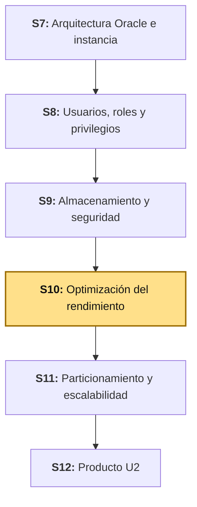
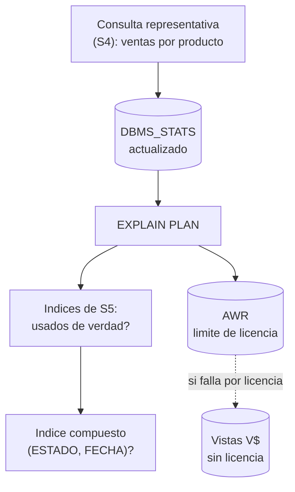

# S10 - Optimización del Rendimiento

## 1. Introducción

Tiempo: 20 min.

### 1.1 Presentación de la sesión

S4 (Unidad 1) ya mostró, con volumen real, cómo el *Cost Based Optimizer* (CBO) elige un plan de ejecución y cómo `DBMS_STATS` y una buena práctica SQL lo cambian. S5 fue más allá: midió selectividad real y, con ese criterio, creó tres índices (`B-Tree`, `Bitmap`, `Function-Based`) — y decidió **no** crear uno sobre `VENTAS.ESTADO`, porque medido, no convenía. Esta sesión retoma exactamente la misma consulta representativa de S4 (el reporte de ventas por producto), ahora sobre el motor administrado, asegurado y auditado que S7-S9 construyeron, y agrega la pieza que faltaba: **Automatic Workload Repository (AWR)**, la herramienta de Oracle para ver el rendimiento de la base de datos como carga de trabajo completa, no consulta por consulta. También revisa una decisión de S5 bajo una luz distinta: `ESTADO` solo no era selectivo — pero `ESTADO` combinado con `FECHA`, en un índice compuesto, puede serlo. El porqué de medir antes de indexar, con un caso real, se desarrolla en 1.6.

### 1.2 Índice

1. Cost Based Optimizer y Explain Plan, con el esquema completo de hoy.
2. `DBMS_STATS`: estadísticas vigentes frente a obsoletas.
3. Verificar el uso real de los índices de S5.
4. Automatic Workload Repository (AWR).
5. Vistas dinámicas `V$` como alternativa sin licencia.
6. Decidir un índice compuesto nuevo, con selectividad medida.

### 1.3 Propósito de aprendizaje

Al concluir la clase, estarás en condiciones de:

- **Diagnosticar** el rendimiento de una consulta representativa con `EXPLAIN PLAN` y estadísticas vigentes, **verificar** si los índices ya creados se usan de verdad, **reconocer** el alcance y el límite de licencia de AWR en Oracle Database Free, y **decidir con criterio** — midiendo selectividad, no por intuición — si un índice compuesto nuevo se justifica.

### 1.4 Producto de sesión

La consulta representativa de S4 (reporte de ventas por producto, `BOM_VENTAS.VENTAS` + `BOM_VENTAS.DETALLE_VENTAS` + `BOM_CATALOGO.PRODUCTOS`) reejecutada con estadísticas actualizadas sobre el volumen actual, con `EXPLAIN PLAN` confirmando el uso real de los índices de S5. Un primer intento de generar un reporte AWR, con su resultado real documentado — funcione o falle por licencia — y, como alternativa que no depende de ninguna licencia, la misma información reconstruida con vistas dinámicas (`V$SQL`, `V$SQL_PLAN`, `V$SESSION`). Decisión medida, con selectividad real, sobre un índice compuesto `(ESTADO, FECHA)` para el filtro de ventas activas recientes — distinto del índice simple sobre `ESTADO` que S5 ya descartó.

### 1.5 Metodología

**Tabla 1. Metodología de la sesión**

| Actividades a Realizar en el Periodo | Orientaciones generales (Orientaciones Metodológicas) | Material de estudio recomendado |
|---|---|---|
| Revisión previa individual | Repasar la consulta representativa de S4 (3.6-3.8) y los tres índices de S5 (3.3-3.8, Tabla 6 de selectividad). Confirmar que `bomerp-oracle` sigue corriendo con el volumen de prueba de S4. Trabajo individual, antes de clase. | S4 (2.1, 3.6-3.8), S5 (Tabla 6, 3.3-3.8). |
| Clase presencial | Reejecución guiada de la consulta representativa con estadísticas actualizadas, verificación de uso real de índices, primer intento de AWR con su resultado real (éxito o límite de licencia documentado), reconstrucción con vistas `V$`, y decisión medida sobre el índice compuesto. Trabajo individual en la propia laptop, siguiendo al docente paso a paso. | Contenedor `bomerp-oracle` corriendo (S1), Pasos 3.1 a 3.8 de esta guía. |
| Evaluación formativa | Revisión en clase del plan de ejecución confirmando los índices de S5, del resultado real del intento de AWR, y de la decisión medida sobre el índice compuesto. La evidencia se completa y sustenta de forma individual, fuera del aula, según los criterios mínimos de la sección 4.4. | Indicaciones de entrega (4.3), rúbrica de evaluación (4.6). |

El cierre real de S9, construido con las respuestas del Anexo de feedback de esa sesión, se entrega al inicio de esta clase.

### 1.6 Motivación de la sesión

#### 1.6.1 Caso: el índice que se creó por intuición, y que nadie usaba

Un patrón documentado en proyectos reales de administración de bases de datos Oracle: un equipo nota que un reporte es lento, y la primera reacción es crear un índice sobre la columna que aparece en el `WHERE` — sin medir selectividad, sin revisar `EXPLAIN PLAN` antes y después, sin confirmar que el optimizador de verdad lo elige. Meses después, una auditoría de rendimiento revisa `DBA_INDEXES` y las estadísticas de uso, y encuentra índices que nunca se usaron ni una sola vez: cada uno de ellos sigue costando espacio en disco y, más caro todavía, sigue costando tiempo de escritura — cada `INSERT`/`UPDATE`/`DELETE` sobre la tabla tiene que mantener también ese índice, aunque ninguna consulta lo aproveche jamás.

Fuente: Oracle Corporation. (2024g). *Verifying That Indexes Are Being Used*. SQL Tuning Guide. https://docs.oracle.com/en/database/oracle/oracle-database/23/tgsql/indexes-and-table-access.html

Este es exactamente el error que S5 evitó al medir selectividad antes de crear cada índice, y el que esta sesión evita de nuevo en 3.6: no basta con crear un índice que "suena razonable" — hay que confirmar, con `EXPLAIN PLAN`, que el CBO de verdad lo usa, y medir la selectividad real antes de decidir si vale la pena uno nuevo.

**Preguntas de análisis**

**Activación de conocimientos previos**

1. En S5, ¿por qué un índice sobre `VENTAS.ESTADO` solo, se midió y se descartó?

**Comprensión de AWR y estadísticas vigentes**

1. Si `DBMS_STATS` se ejecutó una sola vez, en S4, ¿por qué las estadísticas de hoy podrían ya no representar el estado real de las tablas?
2. ¿Qué pregunta responde AWR que `EXPLAIN PLAN` de una sola consulta no puede responder?

### 1.7 Ubicación en el curso

- Unidad: U2 - Administración, almacenamiento, seguridad y optimización.
- Producto del curso: base de datos empresarial Oracle operativa, administrada, optimizada, auditada y resiliente.
- Producto de unidad: base de datos empresarial administrada, optimizada y asegurada.
- Avance del producto en esta sesión: consulta representativa reverificada sobre el motor administrado y auditado, uso real de los índices de S5 confirmado, AWR explorado con su límite de licencia documentado, y decisión medida sobre un índice compuesto nuevo.

**Figura 1. Roadmap del producto de la unidad**



**Sobre el ambiente de esta sesión.** El sílabo declara Oracle Database 19c EE (*Enterprise Edition*) sobre Oracle Linux como ambiente de esta unidad, todavía no aprovisionado en este repositorio. Esta guía trabaja sobre `bomerp-oracle` (Oracle Database Free, el mismo contenedor de S1-S9). AWR (2.4) depende del *Diagnostics Pack*, una opción de pago exclusiva de Enterprise Edition (Oracle Corporation, 2024h) — en Oracle Database Free, usarlo es una zona gris de licenciamiento incluso cuando los procedimientos no fallan técnicamente. 3.5 trata esto con honestidad: documenta el resultado real del intento, no uno simulado.

## 2. Explica

Tiempo: 30 min.

### 2.1 Arquitectura de la sesión

**Figura 2. De una consulta a una decisión de índice, con evidencia en cada paso**



Lectura del diagrama: no hay una sola entrada ni una sola salida — la misma consulta representativa alimenta dos caminos de diagnóstico (el plan de una consulta puntual, y la carga de trabajo completa vía AWR o su alternativa sin licencia), y ambos terminan en la misma pregunta de decisión: ¿hace falta un índice más? Cada apartado siguiente desarrolla una pieza, en el mismo orden del Índice (1.2).

### 2.2 Cost Based Optimizer y Explain Plan, con el esquema completo de hoy

S4 (2.1) ya explicó que el CBO decide un plan de ejecución a partir de estadísticas, no de la sintaxis de la consulta. Lo que cambia hoy no es el mecanismo — es el contexto: la consulta representativa corre ahora sobre un esquema con roles y privilegios recortados (S8), con `VENTAS` viviendo en su propio tablespace (S9), y con los tres índices de S5 ya creados. El CBO vuelve a decidir, desde cero, con toda esa información nueva disponible.

**Tabla 2. Qué cambió desde que S4 ejecutó esta consulta por última vez**

| Cambio | Sesión | Por qué le importa al CBO |
|---|---|---|
| Índices nuevos sobre `VENTAS.FECHA` (B-Tree y Function-Based) | S5 | El CBO solo puede elegir un acceso por índice si el índice existe y sus estadísticas están vigentes. |
| `VENTAS` movida a `TS_BOMERP`, índice reconstruido | S9 | Reconstruir un índice recalcula su estructura física; no cambia su contenido lógico, pero S9 ya lo dejó vigente. |
| `BOMERP_APP` opera por roles, no por privilegios directos | S8 | No afecta al plan de ejecución — el CBO no sabe ni le importa qué privilegio usó la sesión para llegar hasta aquí. |

La última fila es deliberada: conviene distinguir qué sesiones *sí* afectan el plan de ejecución (las que tocan datos, estadísticas o estructuras) de las que no (seguridad y auditoría operan en una capa distinta, antes de que el CBO entre en juego).

### 2.3 `DBMS_STATS`: estadísticas vigentes frente a obsoletas

`DBMS_STATS` no se ejecuta una sola vez: las estadísticas describen el estado de una tabla **en el momento en que se recolectaron**, y quedan obsoletas a medida que la tabla cambia (Oracle Corporation, 2024i). Una tabla con estadísticas de cuando tenía 500 filas, pero que hoy tiene 5000, puede hacer que el CBO elija un plan pensado para una tabla pequeña — por ejemplo, un `FULL TABLE SCAN` que tenía sentido con poco volumen, y que ya no lo tiene.

**Tabla 3. Cómo saber si las estadísticas de una tabla están vigentes**

| Columna de `DBA_TAB_STATISTICS` | Qué responde |
|---|---|
| `LAST_ANALYZED` | ¿Cuándo se recolectaron las estadísticas por última vez? |
| `NUM_ROWS` | ¿Cuántas filas tenía la tabla en ese momento? |
| `STALE_STATS` | ¿Oracle considera, por sí mismo, que las estadísticas ya no representan el estado real? (columna de `DBA_TAB_STATISTICS` cuando el monitoreo automático está activo) |

Comparar `NUM_ROWS` contra un `SELECT COUNT(*)` real es la verificación más directa: si difieren de forma notoria, las estadísticas están obsoletas, sin necesidad de esperar a que `STALE_STATS` lo confirme.

### 2.4 Automatic Workload Repository (AWR)

AWR recolecta, en intervalos regulares (*snapshots*), estadísticas de rendimiento de toda la instancia — no de una consulta, de **todo lo que corrió** entre dos instantes — y las conserva como historial, para poder comparar el rendimiento de hoy contra el de hace una semana (Oracle Corporation, 2024j). Donde `EXPLAIN PLAN` (2.2) responde "¿qué plan elegiría el CBO para esta consulta?", AWR responde una pregunta distinta: "¿qué fue lo más costoso que corrió de verdad, durante este período?"

**Tabla 4. `EXPLAIN PLAN` frente a AWR**

| | `EXPLAIN PLAN` | AWR |
|---|---|---|
| Alcance | Una consulta puntual | Toda la carga de trabajo de la instancia, en un rango de tiempo |
| Cuándo se usa | Antes de ejecutar, o para revisar una consulta específica | Después, para diagnosticar qué fue lento de verdad |
| Requiere licencia | No | Sí — *Diagnostics Pack*, Enterprise Edition (Oracle Corporation, 2024h) |

**Sobre Oracle Database Free y AWR.** Las estructuras de AWR existen en todas las ediciones, pero generarlas y consultarlas (`DBMS_WORKLOAD_REPOSITORY.CREATE_SNAPSHOT`, los reportes `awrrpt.sql`) es, técnicamente, uso del *Diagnostics Pack* — una opción de pago que solo corresponde licenciar en Enterprise Edition (Oracle Corporation, 2024h). Verificado contra `bomerp-oracle`: el procedimiento corre **sin ningún error**, y la instancia ya tenía *snapshots* automáticos propios corriendo solos por defecto — Oracle Database Free no bloquea nada técnicamente. Por eso la advertencia de 2024h importa tanto: no es una limitación que el motor te vaya a avisar con un error, es una regla de licenciamiento que depende de qué edición estés usando de verdad, no de lo que el software te deje hacer. 3.5 confirma esto con evidencia propia.

### 2.5 Vistas dinámicas `V$` como alternativa sin licencia

Las vistas `V$` (vistas dinámicas de rendimiento, *dynamic performance views*) muestran el estado actual de la instancia en memoria — sesiones activas, SQL en ejecución, planes ya calculados — y, a diferencia de AWR, **no requieren ningún licenciamiento adicional**: son parte del motor base, disponibles en cualquier edición (Oracle Corporation, 2024k).

**Tabla 5. Vistas `V$` como alternativa a un reporte AWR**

| Vista | Qué muestra | Qué pregunta de AWR responde, sin licencia |
|---|---|---|
| `V$SQL` | Cada sentencia SQL ya ejecutada, con sus estadísticas acumuladas (ejecuciones, *buffer gets*, tiempo de CPU) | ¿Qué consultas consumieron más recursos? |
| `V$SQL_PLAN` | El plan de ejecución real que usó una sentencia ya ejecutada (no uno hipotético como `EXPLAIN PLAN`) | ¿Qué plan usó de verdad esa consulta cara? |
| `V$SESSION` | Las sesiones activas en este momento, y qué SQL está corriendo cada una | ¿Quién está generando carga ahora mismo? |

La diferencia de fondo con AWR: `V$SQL` y `V$SESSION` solo ven lo que sigue en memoria **ahora** — no conservan historial más allá de lo que el propio *cache* retiene — mientras que AWR persiste *snapshots* para comparar días o semanas distintas. Para esta sesión, sin historial que comparar todavía, la limitación no se nota: 3.6 usa `V$SQL`/`V$SQL_PLAN` exactamente para lo que 3.5 no pudo (o no debió) completar con AWR.

### 2.6 Decidir un índice compuesto nuevo, con selectividad medida

S5 (3.6 de esa guía) midió la selectividad de `VENTAS.ESTADO` sola, la encontró cercana a `0` (un único valor, `REGISTRADA`, para casi todas las filas, con `ANULADA` recién real desde LP2 S9 — ver ADS S10, 3.3), creó el índice, confirmó con `EXPLAIN PLAN` que el CBO lo ignoraba, y lo eliminó. Un **índice compuesto** cambia la pregunta: no mide la selectividad de `ESTADO` en abstracto, mide la selectividad de la **combinación** `(ESTADO, FECHA)` para el patrón de consulta real (`WHERE ESTADO = 'REGISTRADA' ORDER BY FECHA DESC`, el reporte de ventas vigentes recientes).

**Tabla 6. Por qué un índice compuesto puede convenir donde el simple no convenía**

| | Índice simple `(ESTADO)` — descartado en S5 | Índice compuesto `(ESTADO, FECHA)` — a decidir hoy |
|---|---|---|
| Qué mide la selectividad | Cuántas filas distintas de `ESTADO` hay, en general | Cuántas filas quedan **dentro** de cada valor de `ESTADO`, ya ordenadas por `FECHA` |
| Para qué sirve | Filtrar solo por `ESTADO` | Filtrar por `ESTADO` **y** ordenar por `FECHA` sin un paso de ordenamiento aparte |
| El orden de las columnas importa | No aplica (una sola columna) | Sí — `ESTADO` primero (la columna de igualdad) y `FECHA` después (la de rango/orden), la regla general de Oracle para índices compuestos (Oracle Corporation, 2024l) |

El orden de columnas de la Tabla 6 no es arbitrario: Oracle recomienda poner primero las columnas que se filtran por igualdad y después las de rango o `ORDER BY`, porque así el índice ya entrega las filas filtradas en el orden que la consulta necesita, sin un paso adicional de `SORT`. 3.7 mide esto con datos reales antes de decidir.

## 3. Aplica: actividad práctica guiada

Tiempo: 100 min.

**Actividad:** reverificación guiada del rendimiento de la consulta representativa de S4 sobre el motor administrado de hoy, confirmación del uso real de los índices de S5, primer intento de AWR con su resultado real documentado, alternativa sin licencia con vistas `V$`, y decisión medida sobre un índice compuesto nuevo (Producto de la sesión en 1.4).

**Propósito de la actividad:** salir de la sesión con el hábito de verificar con evidencia —nunca asumir— si un índice se usa, si las estadísticas están vigentes, y si una herramienta de diagnóstico está de verdad disponible en el ambiente real, no solo en el de licencia completa.

**Orientaciones metodológicas:** en el laboratorio, el docente guía la reverificación paso a paso frente a la clase, incluido el intento real de AWR (éxito o falla, sin adelantar cuál); los estudiantes repiten cada paso en su propia instancia y aplican después el mismo criterio a su propio proyecto (ver sección 4).

**Actividades para realizar:**

- **3.1** Verificar el punto de partida y el volumen actual.
- **3.2** Actualizar estadísticas y confirmar que estaban obsoletas.
- **3.3** Reejecutar la consulta representativa con `EXPLAIN PLAN`.
- **3.4** Confirmar el uso real de los índices de S5.
- **3.5** Intentar un *snapshot* de AWR, y documentar el resultado real.
- **3.6** Reconstruir el mismo diagnóstico con vistas `V$`.
- **3.7** Medir selectividad y decidir el índice compuesto.
- **3.8** Relacionar con ADS y LP2.

### 3.1 Verificar el punto de partida y el volumen actual

**Producto del paso:** confirmación de qué sobrevivió de S4/S5 en tu propia instancia — y la reconstrucción de lo que falte, antes de seguir.

```bash
docker exec -it bomerp-oracle sqlplus BOM_VENTAS/123456@localhost:1521/FREEPDB1
```

```sql
SELECT COUNT(*) AS TOTAL_VENTAS FROM VENTAS;
SELECT COUNT(*) AS TOTAL_DETALLES FROM DETALLE_VENTAS;

SELECT INDEX_NAME, TABLE_NAME, UNIQUENESS
FROM USER_INDEXES
WHERE TABLE_NAME = 'VENTAS'
ORDER BY INDEX_NAME;
```

**No asumas que el volumen de S4 y los índices de S5 siguen ahí.** Entre una sesión y otra, un contenedor recreado (por ejemplo, tras el incidente del datafile de `TS_BOMERP` sin ruta absoluta de S9) pierde todo lo que no vive en el volumen persistente — y eso incluye el volumen de prueba y cualquier índice creado después del último *restart* limpio. Si `TOTAL_VENTAS` muestra un número pequeño (muy por debajo de 500) o `USER_INDEXES` no devuelve `IX_VENTAS_FECHA` ni `IX_VENTAS_FECHA_DIA`, reconstruye ambos ahora, antes de continuar — no tiene sentido medir rendimiento sobre una tabla casi vacía (2.2).

**Si falta el volumen de prueba**, repite la carga de S4 (3.3 de esa guía) — **conectado como `BOMERP_APP`, no como `BOM_VENTAS`**: `BOM_VENTAS` es dueño de sus tablas, pero no tiene privilegio `SELECT` sobre `BOM_CATALOGO.PRODUCTOS` (S8, Tabla 4) — solo `BOMERP_APP` lo tiene, a través de `ROL_APP_CATALOGO`.

```bash
docker exec -it bomerp-oracle sqlplus BOMERP_APP/123456@localhost:1521/FREEPDB1
```

```sql
DECLARE
    v_id_venta      NUMBER;
    v_max_producto  NUMBER;
BEGIN
    SELECT MAX(ID) INTO v_max_producto FROM BOM_CATALOGO.PRODUCTOS;

    FOR i IN 1..500 LOOP
        INSERT INTO BOM_VENTAS.VENTAS (FECHA, ESTADO, TOTAL)
        VALUES (SYSTIMESTAMP - MOD(i, 90), 'REGISTRADA', 0)
        RETURNING ID INTO v_id_venta;

        FOR j IN 1..(MOD(i, 3) + 1) LOOP
            INSERT INTO BOM_VENTAS.DETALLE_VENTAS
                (ID_VENTA, ID_PRODUCTO, NOMBRE_PRODUCTO, PRECIO_UNITARIO, CANTIDAD, SUBTOTAL)
            VALUES
                (v_id_venta, MOD(i + j, v_max_producto) + 1, 'Producto de prueba', 50.00, j,
                 50.00 * j);
        END LOOP;
    END LOOP;
    COMMIT;
END;
/
```

**Error frecuente**: `ORA-00942: table or view "BOM_CATALOGO"."PRODUCTOS" does not exist`, aunque la tabla sí exista. No es un error de nombre — es de privilegio: estás conectado como `BOM_VENTAS` (o cualquier usuario sin `SELECT` sobre `BOM_CATALOGO.PRODUCTOS`), y Oracle responde `ORA-00942` en vez de `ORA-01031` precisamente porque ni siquiera tiene permiso para saber que la tabla existe (S8, 2.3). Reconéctate como `BOMERP_APP`.

**Si faltan los índices de S5**, recréalos (3.3 y 3.5 de esa guía) — esta vez sí **conectado como `BOM_VENTAS`**, el dueño del esquema (el de `ESTADO` se creó, se midió y se eliminó a propósito en esa misma sesión, así que no lo recrees aquí):

```bash
docker exec -it bomerp-oracle sqlplus BOM_VENTAS/123456@localhost:1521/FREEPDB1
```

```sql
CREATE INDEX ix_ventas_fecha ON VENTAS (FECHA);
CREATE INDEX ix_ventas_fecha_dia ON VENTAS (TRUNC(FECHA));
```

Repite el `SELECT` del inicio de este paso: ahora `TOTAL_VENTAS` debe rondar 500, y `USER_INDEXES` debe mostrar los dos índices. El `Bitmap` de `LOG_ERRORES.OBJETO` vive en `BOM_CATALOGO`, fuera del alcance de esta verificación — revísalo por separado, conectado a ese esquema, si tu proyecto lo necesita para otra consulta.

**Error frecuente**: `USER_INDEXES` no muestra ningún índice aunque sepas que los creaste. Confirma que te conectaste como `BOM_VENTAS` (dueño del esquema), no como `BOMERP_APP` — `USER_INDEXES` solo muestra los objetos del usuario con el que iniciaste sesión, a diferencia de `DBA_INDEXES` (S8, 2.6), que muestra los de toda la base.

### 3.2 Actualizar estadísticas y confirmar que estaban obsoletas

**Producto del paso:** evidencia de que las estadísticas de S4 quedaron desactualizadas, y la corrección.

```sql
SELECT TABLE_NAME, NUM_ROWS, LAST_ANALYZED
FROM USER_TAB_STATISTICS
WHERE TABLE_NAME IN ('VENTAS', 'DETALLE_VENTAS');
```

Compara `NUM_ROWS` contra el conteo real de 3.1. Si el proyecto siguió creciendo desde S4/S5 (nuevas ventas de prueba, nuevos productos), `NUM_ROWS` va a quedarse corto.

```sql
BEGIN
    DBMS_STATS.GATHER_TABLE_STATS(USER, 'VENTAS', CASCADE => TRUE);
    DBMS_STATS.GATHER_TABLE_STATS(USER, 'DETALLE_VENTAS', CASCADE => TRUE);
END;
/
```

`CASCADE => TRUE` recalcula también las estadísticas de los índices de la tabla (Oracle Corporation, 2024i) — sin esto, los índices de S5 quedarían con estadísticas propias desactualizadas aunque la tabla ya esté al día. Repite el `SELECT` de arriba: `LAST_ANALYZED` debe mostrar la fecha de hoy, y `NUM_ROWS` debe coincidir con el conteo real.

### 3.3 Reejecutar la consulta representativa con `EXPLAIN PLAN`

**Producto del paso:** el plan de ejecución de la consulta representativa de S4, con estadísticas ya vigentes.

Esta consulta cruza `BOM_VENTAS` y `BOM_CATALOGO` — ni `BOM_VENTAS` ni `BOM_CATALOGO` tienen privilegio sobre el esquema del otro (S8, Tabla 4), así que, igual que en S4, **conéctate como `BOMERP_APP`**, con los nombres de tabla completamente calificados:

```bash
docker exec -it bomerp-oracle sqlplus BOMERP_APP/123456@localhost:1521/FREEPDB1
```

```sql
EXPLAIN PLAN FOR
SELECT p.NOMBRE, SUM(d.CANTIDAD) AS TOTAL_UNIDADES, SUM(d.SUBTOTAL) AS TOTAL_VENDIDO
FROM BOM_VENTAS.DETALLE_VENTAS d
JOIN BOM_VENTAS.VENTAS v ON v.ID = d.ID_VENTA
JOIN BOM_CATALOGO.PRODUCTOS p ON p.ID = d.ID_PRODUCTO
WHERE v.FECHA >= TRUNC(SYSDATE) - 30
GROUP BY p.NOMBRE
ORDER BY TOTAL_VENDIDO DESC;

SELECT * FROM TABLE(DBMS_XPLAN.DISPLAY);
```

Es la misma consulta, con los mismos alias y las mismas dos sumas, con la que S4 cerró (`v.FECHA >= TRUNC(SYSDATE) - 30`, sin envolver `FECHA` en una función — la buena práctica de esa sesión). Guarda este plan: 3.4 lo compara línea por línea contra lo que S5 prometió.

### 3.4 Confirmar el uso real de los índices de S5

**Producto del paso:** evidencia explícita de que el plan de 3.3 usa (o no) los índices de `FECHA`, y por qué.

En la salida de `DBMS_XPLAN.DISPLAY`, busca las líneas `INDEX RANGE SCAN` o `INDEX FULL SCAN` con el nombre de alguno de los índices de S5 (`FECHA` o el `Function-Based` sobre `TRUNC(FECHA)`), contra `TABLE ACCESS FULL` sobre `VENTAS`.

**Tabla 7. Qué significa cada resultado posible**

| Lo que aparece en el plan | Qué significa |
|---|---|
| `INDEX RANGE SCAN` sobre el índice de `FECHA` | El índice de S5 se está usando de verdad para este filtro. |
| `TABLE ACCESS FULL` sobre `VENTAS`, sin ningún índice de `FECHA` | El CBO decidió que, con el volumen actual, recorrer toda la tabla sigue siendo más barato que usar el índice — no es un error, es una decisión basada en costo (2.2). |

**Error frecuente**: asumir que si el índice existe, el CBO tiene que usarlo. Un índice no es una orden, es una opción — el CBO lo descarta si, con las estadísticas reales, calcula que no reduce el costo. Si tu plan muestra `TABLE ACCESS FULL` y esperabas ver el índice, antes de dudar del índice, revisa si el volumen de la tabla todavía es demasiado pequeño para que la diferencia de costo justifique usarlo (el mismo criterio de selectividad de S5, aplicado ahora al plan completo).

### 3.5 Intentar un *snapshot* de AWR, y documentar el resultado real

**Producto del paso:** el resultado real —éxito o falla— de generar un *snapshot* de AWR sobre `bomerp-oracle`, documentado sin simular nada.

Conectado como `system` o `sys as sysdba`:

```sql
BEGIN
    DBMS_WORKLOAD_REPOSITORY.CREATE_SNAPSHOT();
END;
/
```

Verificado contra `bomerp-oracle` (imagen `gvenzl/oracle-free:23-slim`): el procedimiento corre **sin error**, y la instancia ya tenía *snapshots* automáticos propios corriendo solos, por defecto, antes incluso de este intento (`DBA_HIST_SNAPSHOT` ya traía filas). Confírmalo:

```sql
SELECT SNAP_ID, BEGIN_INTERVAL_TIME FROM DBA_HIST_SNAPSHOT ORDER BY SNAP_ID DESC FETCH FIRST 3 ROWS ONLY;
```

Resultado esperado: al menos una fila con la hora de hace un momento (la que acabas de crear), y probablemente varias más antiguas (las automáticas). Esto confirma algo importante que 2.4 ya anticipó: **la advertencia de licencia no es una limitación técnica de Oracle Database Free** — el procedimiento funciona igual que en Enterprise Edition. Es una limitación exclusivamente de licenciamiento, que aplica aunque el comando nunca falle: usar AWR en un ambiente real sin el *Diagnostics Pack* licenciado sería uso no autorizado, lo haga notar Oracle con un error o no.

Si en tu propia instancia el procedimiento sí falla (por ejemplo, con un error relacionado a `CONTROL_MANAGEMENT_PACK_ACCESS`, posible en otras variantes o versiones de Oracle Database Free), documenta el mensaje completo como evidencia igual de válida — es la prueba directa de que, en tu ambiente, el *Diagnostics Pack* está bloqueado explícitamente.

**Error frecuente**: reportar "AWR funcionó" sin haber corrido el comando de verdad, o inventar una salida de reporte que nunca se generó. La guía de este curso (y el criterio de evaluación de 4.4) exige el resultado real, sea cual sea — fallar aquí con evidencia del error es una entrega válida; simular un éxito no lo es.

### 3.6 Reconstruir el mismo diagnóstico con vistas `V$`

**Producto del paso:** la misma pregunta que un reporte AWR respondería ("¿qué consulta costó más?"), respondida con vistas dinámicas, sin depender de ninguna licencia.

Las vistas `V$` no son de acceso libre para cualquier usuario — igual que `DBA_*` (S8, 2.6), `BOMERP_APP` no tiene privilegio sobre ellas por diseño (principio de mínimo privilegio, S8). **Conéctate como `system`:**

```bash
docker exec -it bomerp-oracle sqlplus system/123456@localhost:1521/FREEPDB1
```

Primero, **ejecuta de verdad** la consulta representativa (no solo `EXPLAIN PLAN` — `DISPLAY_CURSOR` necesita una ejecución real que analizar) conectado como `BOMERP_APP`, y después, ya como `system`, búscala:

```sql
SELECT SQL_ID, SUBSTR(SQL_TEXT, 1, 50) AS SQL_PARCIAL
FROM V$SQL
WHERE SQL_TEXT LIKE 'SELECT p.NOMBRE%'
  AND SQL_TEXT LIKE '%TOTAL_UNIDADES%';
```

Toma el `SQL_ID` que devuelve y consulta su plan **real**, el que de verdad usó al ejecutarse (no el hipotético de `EXPLAIN PLAN`):

```sql
SELECT * FROM TABLE(DBMS_XPLAN.DISPLAY_CURSOR('&sql_id', NULL, 'ALLSTATS LAST'));
```

**Compara este plan contra el de 3.3, con atención — pueden no coincidir, y eso es evidencia válida, no un error.** Verificado contra `bomerp-oracle`: el `EXPLAIN PLAN` de 3.3 mostró `TABLE ACCESS FULL` sobre `VENTAS`; el plan real de `DISPLAY_CURSOR`, ejecutado después de que 3.7 actualizara estadísticas otra vez, mostró `INDEX RANGE SCAN` sobre `IX_VENTAS_FECHA` (combinado con la clave primaria vía *index join*, sin tocar la tabla). `EXPLAIN PLAN` estima un plan **en el momento en que se pide**, con las estadísticas que existen en ese instante — si algo cambia después (más estadísticas recalculadas, más filas insertadas), el plan real de la siguiente ejecución puede ser distinto. `DISPLAY_CURSOR` con `ALLSTATS LAST` es la fuente más confiable precisamente por eso: muestra lo que **de verdad** pasó, no una estimación congelada en el tiempo — además de cuántas filas devolvió realmente cada paso, algo que `EXPLAIN PLAN` nunca puede saber.

### 3.7 Medir selectividad y decidir el índice compuesto

**Producto del paso:** la selectividad real de `(ESTADO, FECHA)` combinados, y la decisión justificada de crear (o no) el índice compuesto.

```sql
SELECT ESTADO, COUNT(*) AS TOTAL,
       ROUND(COUNT(*) / (SELECT COUNT(*) FROM VENTAS) * 100, 2) AS PORCENTAJE
FROM VENTAS
GROUP BY ESTADO;
```

Con el resultado de arriba en mente: si `REGISTRADA` concentra la mayoría de las filas (la situación esperada, la misma que S5 midió), el índice compuesto igual puede convenir **si** el patrón de consulta real filtra por `ESTADO = 'REGISTRADA'` y ordena por `FECHA` — exactamente lo que hace un reporte de ventas vigentes recientes, distinto del filtro simple por `ESTADO` que S5 ya descartó.

```sql
EXPLAIN PLAN FOR
SELECT ID, ESTADO, TOTAL, FECHA
FROM VENTAS
WHERE ESTADO = 'REGISTRADA'
ORDER BY FECHA DESC
FETCH FIRST 20 ROWS ONLY;

SELECT * FROM TABLE(DBMS_XPLAN.DISPLAY);
```

Captura este plan **antes** de crear el índice. Si corresponde (decisión justificada con la evidencia de arriba, no por intuición), con el mismo prefijo `ix_` que ya usa S5:

```sql
CREATE INDEX ix_ventas_estado_fecha ON VENTAS (ESTADO, FECHA DESC);

BEGIN
    DBMS_STATS.GATHER_TABLE_STATS(USER, 'VENTAS', CASCADE => TRUE);
END;
/
```

Repite el mismo `EXPLAIN PLAN` de arriba y compara: si el nuevo plan muestra `INDEX RANGE SCAN` sobre `IX_VENTAS_ESTADO_FECHA` sin un paso `SORT` aparte (porque el índice ya entrega las filas en el orden de `FECHA DESC`), el índice se justificó. Si el plan sigue sin usarlo, documenta también ese resultado — es evidencia igual de válida de que, medido, no convenía (el mismo desenlace honesto que S5 ya tuvo con `ESTADO` solo).

**Error frecuente**: crear el índice compuesto sin capturar el plan "antes" de 3.7. Sin ese punto de comparación, no hay forma de demostrar que el índice cambió algo — la evidencia de esta sesión depende de tener los dos planos, no solo el final.

### 3.8 Relacionar con ADS y LP2

Sesión equivalente en los otros dos cursos, misma semana: ADS S10 cataloga los patrones GoF y GRASP de `ventas`, sin tocar rendimiento — son preocupaciones independientes, el mismo código puede estar bien diseñado y mal indexado, o viceversa. LP2 no tiene una sesión dedicada a índices (eso es responsabilidad de BD2), pero cualquier consulta lenta que un estudiante note en el backend de LP2 (un listado de ventas que tarda, por ejemplo) es, con el criterio de hoy, una invitación a volver a esta guía: medir selectividad antes de pedirle a BD2 "un índice más".

**Evidencia de aprendizaje:**

- Estadísticas de `VENTAS`/`DETALLE_VENTAS` confirmadas obsoletas y actualizadas con `DBMS_STATS` (`CASCADE => TRUE`).
- Plan de ejecución de la consulta representativa, con el uso real de los índices de S5 confirmado o explicado.
- Resultado real (éxito o falla documentada) del intento de *snapshot* de AWR.
- El mismo diagnóstico reconstruido con `V$SQL`/`DISPLAY_CURSOR`, sin depender de licencia.
- Selectividad real de `(ESTADO, FECHA)` medida, y decisión justificada sobre el índice compuesto, con el plan antes y después.

## 4. Crea: actividad autónoma

Tiempo: 2h fuera del aula.

### 4.1 Actividad

Diagnóstico y optimización de rendimiento de la base de datos del proyecto propio del equipo, documentado en evidencia individual.

Completa y evidencia estas tareas:

1. Verificar si las estadísticas de al menos dos tablas propias están vigentes (`LAST_ANALYZED`/`NUM_ROWS` contra el conteo real) y actualizarlas si hace falta.
2. Capturar `EXPLAIN PLAN` de una consulta representativa de tu propio proyecto, y confirmar si usa algún índice existente.
3. Intentar un *snapshot* de AWR sobre tu propia instancia, y documentar el resultado real (éxito o falla).
4. Reconstruir el mismo diagnóstico con `V$SQL`/`V$SQL_PLAN`, sin depender de AWR.
5. Medir selectividad de al menos una combinación de columnas candidata a índice compuesto, y decidir —con esa medición, no por intuición— si se justifica.

### 4.2 Propósito

Que cada estudiante demuestre, de forma individual y fuera del aula, que puede diagnosticar rendimiento con evidencia real (estadísticas vigentes, planes de ejecución, vistas dinámicas) y decidir sobre índices con un criterio medible, reconociendo el límite de licencia de las herramientas de diagnóstico avanzado.

### 4.3 Indicaciones

Entrega un PDF con el siguiente nombre:

```text
S10_BD2_Equipo##_ApellidoNombre.pdf
```

Cada captura de pantalla del informe debe mostrar, sin recortar, el reloj del sistema (fecha y hora) y tu usuario o foto de perfil (Windows, VS Code o navegador) visibles en pantalla — es lo que permite verificar que la evidencia es tuya y que corresponde al momento real de tu trabajo.

#### 4.3.1 Estructura del informe

**Datos del estudiante**

- Nombre:
- Equipo:
- Sesión: S10 - Optimización del Rendimiento
- Rol o aporte realizado:
- Link de GitHub:

**Evidencia técnica**

Incluye capturas o salidas con una breve explicación debajo de cada una, organizadas en los mismos 4 bloques de la rúbrica (4.6):

1. *Estadísticas y Explain Plan*
    - Evidencia de estadísticas desactualizadas, su corrección con `DBMS_STATS`, y el `EXPLAIN PLAN` de tu consulta representativa.
2. *Uso real de índices*
    - Confirmación (o explicación honesta de su ausencia) del uso de un índice existente en el plan.
3. *AWR y alternativa sin licencia*
    - El resultado real del intento de AWR (éxito o falla), y el mismo diagnóstico reconstruido con `V$SQL`/`DISPLAY_CURSOR`.
4. *Decisión de índice compuesto*
    - Selectividad medida, el plan antes y después, y la decisión justificada.

**Error o hallazgo**

Describe un error real: una estadística que creías vigente y no lo estaba, un índice que esperabas ver usado y el CBO descartó, un intento de AWR que falló de una forma que no anticipabas, o un índice compuesto que, medido, no se justificó.

**Reflexión técnica breve**

Responde en 5 a 8 líneas:

```text
¿Por qué un índice que "suena razonable" puede terminar sin usarse
nunca, y qué costo real tiene mantenerlo de todas formas? Relaciona
tu respuesta con el caso de 1.6 y con tu propia decisión sobre el
índice compuesto (o la ausencia de uno justificado).
```

**Anexo: Feedback de la sesión**

Pega esta página como la última hoja del PDF, con tus respuestas.

1. ¿Cuál es el aprendizaje más importante que te llevas de la clase de hoy?
2. ¿Qué punto de la clase te resultó más confuso o te dejó con dudas?
3. ¿Tienes alguna pregunta que te gustaría que sea respondida la siguiente clase?
4. Sobre tu nivel de comprensión de la clase de hoy, marca una opción:
    - ¡Entendido! - Lo domino y podría explicarlo.
    - Más o menos. - Entendí la idea general, pero tengo dudas.
    - Necesito ayuda. - Me siento perdido/a con este tema.
5. ¿Cómo puedo ayudarte a comprender mejor el tema?
6. Pensando en tu participación y esfuerzo en la clase de hoy, ¿cómo te autoevaluarías? Marca una opción:
    - Muy Comprometido/a: Me esforcé al máximo.
    - Comprometido/a: Sé que podría haberme esforzado un poco más.
    - Poco Comprometido/a: Hoy no di mi mejor esfuerzo.
7. Mi satisfacción con la clase fue... (califica del 1 al 10, donde 1 es insatisfecho y 10 es muy satisfecho).

### 4.4 Criterios mínimos de aceptación

La evidencia individual se considera completa si:

- El archivo respeta el nombre solicitado.
- Verifica estadísticas vigentes de al menos dos tablas, con corrección si hacía falta.
- Presenta `EXPLAIN PLAN` de una consulta representativa propia, con el uso de índices explicado (confirmado o descartado con razón).
- Documenta el resultado real del intento de AWR — una falla documentada con honestidad es evidencia válida; un resultado inventado no lo es.
- Reconstruye el mismo diagnóstico con vistas `V$`, sin depender de AWR.
- Mide selectividad real antes de decidir sobre un índice compuesto, con el plan antes y después si lo crea.
- Cada captura de la evidencia técnica muestra el reloj del sistema y el usuario/perfil visible, sin recortar.
- Las fechas y horas de las capturas son coherentes con el historial de commits de su repositorio en GitHub.
- Incluye un error o hallazgo técnico diagnosticado.
- Incluye la reflexión técnica breve solicitada.
- Incluye el Anexo de feedback de la sesión respondido, como última página del PDF.

### 4.5 Preguntas de defensa

1. ¿Por qué las estadísticas de `DBMS_STATS` pueden quedar obsoletas aunque nadie haya cambiado el esquema, solo los datos?
2. ¿Por qué un índice existente puede no aparecer en un `EXPLAIN PLAN`, aunque la columna esté en el `WHERE`?
3. ¿Qué pregunta responde AWR que `EXPLAIN PLAN` de una consulta puntual no puede responder?
4. ¿Por qué usar AWR en Oracle Database Free es una zona gris de licencia, aunque el procedimiento no falle técnicamente?
5. ¿Qué diferencia hay entre el plan de `EXPLAIN PLAN` y el de `DISPLAY_CURSOR` con `ALLSTATS LAST`?
6. ¿Por qué el orden de las columnas en un índice compuesto importa, y cuál va primero: la de igualdad o la de rango?
7. En tu propio proyecto, ¿qué índice candidato mediste y descartaste, y por qué la medición ganó sobre la intuición?

### 4.6 Rúbrica de evaluación

**Tabla 8. Rúbrica de evaluación**

| Criterio | Peso (%) | A (20 pts) | B (15 pts) | C (10 pts) | D (5 pts) | Nivel obtenido |
|---|---:|---|---|---|---|---:|
| 1. Estadísticas y Explain Plan* | 25 | Estadísticas verificadas y corregidas, `EXPLAIN PLAN` capturado e interpretado correctamente. | Ambos presentes, con alguna interpretación imprecisa. | Solo uno de los dos completo. | No presenta ninguno de los dos. | |
| 2. Uso real de índices* | 25 | Confirma o descarta el uso de un índice con evidencia del plan, con explicación correcta de la decisión del CBO. | Confirma o descarta, con la explicación incompleta. | Evidencia presente, sin interpretar el resultado. | No presenta evidencia de uso de índices. | |
| 3. AWR y alternativa sin licencia* | 25 | Resultado real de AWR documentado con honestidad, y el mismo diagnóstico reconstruido con vistas `V$`. | Uno de los dos completo, el otro parcial. | Solo uno de los dos presente. | No presenta ninguno. | |
| 4. Decisión de índice compuesto* | 25 | Selectividad medida, plan antes y después, decisión justificada con los datos (en cualquier sentido). | Medición presente, con la decisión parcialmente justificada. | Índice creado sin medición previa, o medición sin decisión clara. | No presenta medición ni decisión. | |

\* Agregado manual.

Nota final = suma de (`Peso` / 100 × `Puntos del nivel obtenido`) = ____ / 20.

Para usar la rúbrica con IA (inteligencia artificial), solicita:

```text
Evalúa el PDF usando la rúbrica de la sesión.
Para cada criterio selecciona el nivel obtenido usando la escala A=20, B=15, C=10, D=5 puntos.
Justifica brevemente cada nivel asignado.
Verifica que cada captura muestre reloj del sistema y usuario/perfil visible, y que las fechas sean coherentes con el historial de commits de GitHub. Si falta esta evidencia o hay inconsistencias, indícalo explícitamente antes de calificar.
Calcula la nota final con la fórmula: suma de (Peso/100 × Puntos del nivel obtenido), directamente sobre 20.
Indica 2 fortalezas y 2 recomendaciones.
```

## 5. Cierre

Tiempo: 5 min.

**Resumen breve:** hoy la consulta representativa de S4 volvió a pasar por el CBO, esta vez con estadísticas vigentes y sobre el motor administrado, asegurado y auditado de S7-S9 — y los índices de S5 quedaron confirmados (o explicados) con evidencia real de su uso. AWR entró a escena como la herramienta que ve la carga de trabajo completa, con su límite real de licencia en Oracle Database Free documentado con honestidad, y `V$SQL`/`DISPLAY_CURSOR` como la alternativa que no depende de ninguna licencia. Cierra con una decisión medida, no intuida: si `(ESTADO, FECHA)` combinados justifican un índice compuesto donde `ESTADO` solo, en S5, no lo justificaba.

**Dinámica participativa:** en una ronda rápida, cada estudiante comparte en una frase el resultado real de su intento de AWR — si funcionó, si falló, y con qué mensaje.

**Metacognición:** ¿qué te costó más entender hoy: por qué un índice existente puede no usarse, o por qué AWR funciona distinto en Oracle Database Free que en una instancia con licencia completa?

**Proyección:** S11 toma el mismo criterio de medir antes de decidir y lo aplica a tablas de alto volumen: particionamiento `Range`, `Hash`, `List` y `Composite`, para cuando un índice solo ya no basta.

## Bibliografía

1. Fortune. (2016, 15 de mayo). *SWIFT confirms second cyberattack hit a bank*. https://fortune.com/2016/05/15/swift-responsible-bangladesh-heist/
2. Oracle Corporation. (2024g). *Verifying That Indexes Are Being Used*. SQL Tuning Guide. https://docs.oracle.com/en/database/oracle/oracle-database/23/tgsql/indexes-and-table-access.html
3. Oracle Corporation. (2024h). *Oracle Diagnostics Pack*. Licensing Information. https://docs.oracle.com/en/database/oracle/oracle-database/23/dblic/Licensing-Information.html
4. Oracle Corporation. (2024i). *DBMS_STATS*. PL/SQL Packages and Types Reference. https://docs.oracle.com/en/database/oracle/oracle-database/23/arpls/DBMS_STATS.html
5. Oracle Corporation. (2024j). *Managing the Automatic Workload Repository*. Database Performance Tuning Guide. https://docs.oracle.com/en/database/oracle/oracle-database/23/tgdba/gathering-database-statistics.html
6. Oracle Corporation. (2024k). *Dynamic Performance (V$) Views*. Database Reference. https://docs.oracle.com/en/database/oracle/oracle-database/23/refrn/dynamic-performance-V-views.html
7. Oracle Corporation. (2024l). *Using Composite Indexes*. SQL Tuning Guide. https://docs.oracle.com/en/database/oracle/oracle-database/23/tgsql/indexes-and-table-access.html
