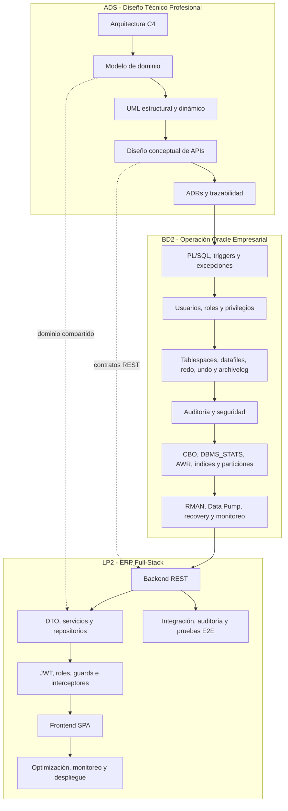

# Integración Curricular del Ciclo 4 - 2026-2

**Repositorio:** [262ciclo4/bomerp](https://github.com/262ciclo4/bomerp)

# Vista General

El Ciclo 4 integra **Análisis y Diseño de Sistemas de Información (ADS)**, **Base de Datos II (BD2)** y **Lenguaje de Programación II (LP2)** alrededor de una misma solución empresarial full-stack.

La secuencia curricular del ciclo es:

```text
ADS -> BD2 -> LP2
```

ADS define el diseño técnico profesional del sistema. BD2 administra la base de datos Oracle que soporta la aplicación. LP2 implementa el ERP Full-Stack mediante backend REST, frontend SPA, seguridad, persistencia, optimización, monitoreo, pruebas y estabilización.

Para el detalle metodológico del proyecto, revisa:

[Proyecto Integrador del Ciclo 4](proyecto-integrador/index.md)

---

# Producto Integrador del Ciclo

**Aplicación Full-Stack Empresarial con Diseño Técnico Profesional y Base de Datos Oracle Administrada.**

Este producto constituye la evidencia integradora del ciclo y articula tres productos parciales:

| Curso | Producto principal |
|---|---|
| ADS | Diseño Técnico Profesional Documentado. |
| BD2 | Base de datos empresarial Oracle operativa, administrada, optimizada, auditada y resiliente. |
| LP2 | ERP Full-Stack integrado, optimizado, monitoreado, estabilizado y preparado para producción, con evidencias y sustentación técnica. |

---

# Cursos Integrados

| Curso | Enfoque | Producto final |
|---|---|---|
| ADS | Arquitectura, modelo de dominio, UML, patrones, APIs, integraciones, ADRs y trazabilidad. | Diseño Técnico Profesional Documentado. |
| BD2 | PL/SQL, administración Oracle, seguridad, auditoría, optimización, backup, recovery y monitoreo. | Base de datos empresarial Oracle operativa, administrada, optimizada, auditada y resiliente. |
| LP2 | Backend REST, frontend SPA, seguridad, persistencia, optimización, monitoreo, pruebas y estabilización. | ERP Full-Stack integrado, optimizado, monitoreado, estabilizado y preparado para producción, con evidencias y sustentación técnica. |

---

# Arquitectura Inicial

La arquitectura inicial organiza el trabajo del ciclo en tres responsabilidades conectadas por artefactos compartidos: **diseño técnico**, **operación de datos Oracle** e **implementación full-stack**.

BD2 no se presenta como un curso de diseño inicial de base de datos. Ese rol ya fue trabajado en BD1. En Ciclo 4, BD2 toma la base que soporta el sistema y la convierte en una base Oracle empresarial: administrada, segura, optimizada, auditada, respaldada, recuperable y monitoreada.



La integración se valida cuando la arquitectura documentada en ADS, la base Oracle administrada en BD2 y la aplicación full-stack desarrollada en LP2 pertenecen al mismo sistema empresarial y pueden sustentarse con evidencias coherentes.

---

# Navegación Recomendada

- [Proyecto Integrador](proyecto-integrador/index.md): desarrollo metodológico completo del proyecto del ciclo.
- [ADS](ads/index.md): contenido final de Análisis y Diseño de Sistemas de Información.
- [BD2](bd2/index.md): contenido final de Base de Datos II.
- [LP2](lp2/index.md): contenido final de Lenguaje de Programación II.

---

# Proyección

El producto del Ciclo 4 sirve como base para cursos posteriores relacionados con sistemas distribuidos, arquitectura de microservicios, aplicaciones móviles, analítica e inteligencia de negocios.

```text
Diseño técnico + Oracle empresarial + API REST + SPA -> servicios distribuidos y aplicaciones móviles
```
