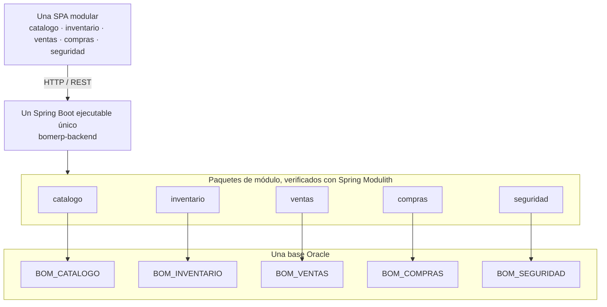

# LP2 - Lenguaje de Programación II

**Repositorio:** [262ciclo4/bomerp](https://github.com/262ciclo4/bomerp)

## Producto del curso

**Base Full-Stack modular de un ERP, integrada, optimizada, monitoreada, estabilizada y preparada académicamente para producción, con evidencias y sustentación técnica.**

BomERP no pretende cubrir todos los procesos de un ERP comercial. Es una base
académica extensible que demuestra arquitectura, persistencia, transacciones,
seguridad e integración mediante un flujo comercial acotado. Se implementa en un único repositorio, con un backend Spring Boot
**único** (un solo proyecto Maven, sin reactor multi-módulo) organizado por
paquetes de módulo verificados con **Spring Modulith**, una SPA organizada por
funcionalidades y una base Oracle organizada mediante esquemas funcionales.

## Decisión de arquitectura para LP2

- `bomerp-backend` es un único proyecto Maven y el único artefacto Spring Boot ejecutable.
- Los módulos de negocio son paquetes directos bajo el paquete raíz, no artefactos Maven ni microservicios; Spring Modulith los detecta y verifica automáticamente (`ModularityTests`).
- Existe un solo datasource y las transacciones pueden abarcar varios esquemas Oracle.
- Los módulos se comunican mediante servicios Java públicos, sin Feign ni llamadas HTTP internas.
- Cada módulo administra sus repositorios y tablas; ningún módulo accede directamente a repositorios ajenos — la regla se verifica automáticamente, no solo se documenta.
- El sílabo expresa estos resultados de manera general; esta página concreta la implementación elegida para BomERP.
- Detalle completo de esta decisión: [ADR-001](adr/ADR-001-arquitectura-backend.md) y [ADR-002](adr/ADR-002-spring-modulith.md).

---

# UNIDAD 1 - Base backend REST modular de BomERP

### Resultado de aprendizaje

Desarrolla la base backend REST modular de BomERP, conectada a la base de datos y preparada para ser consumida posteriormente por una SPA.

### Producto de la unidad

**Base backend modular de BomERP, ensamblada como una sola aplicación Spring Boot y conectada a Oracle, con módulos de Catálogo, Inventario, Ventas y Compras delimitados; recursos REST, persistencia ORM, CRUD, objetos relacionados, una operación cabecera–detalle completamente funcional, consultas, reportes, CORS, logs y pruebas.**

El corte exige implementar con profundidad el flujo heredado
`Categoria–Producto–Venta–DetalleVenta`. Los módulos `inventario` y `compras`
quedan delimitados arquitectónicamente para su evolución sin convertirlos en
microservicios ni multiplicar aplicaciones ejecutables.

Artefacto de referencia para el Proyecto Integrador: [LP2 - Producto de Unidad 1](../proyecto-integrador/u1/lp2-demo.md).

| Sesión | Tema | Producto de sesión |
|--------|------|--------------------|
| [**S1**](sesiones/S01_Arquitectura_Backend_REST_Profesional.md) | Arquitectura backend REST profesional con Java 21 como monolito modular, JPA/ORM, DTO, contrato, versionado básico de API y OpenAPI | Entorno Java 21 verificado y backend ejecutable conectado a Oracle, con módulo `catalogo`, endpoint de verificación y listados REST iniciales de `Categoria` y `Producto`. |
| [**S2**](sesiones/S02_CRUD_Datos_Maestros.md) | CRUD REST completo de `Producto` | API de `Producto` con entidad JPA, repositorio, servicio, DTO, validaciones, excepciones, logs y pruebas. |
| [**S3**](sesiones/S03_Asociacion_Categoria_Producto.md) | Gestión de objetos relacionados mediante REST y ORM | API de `Categoria–Producto`, con asociación ORM, DTO relacionados y control de referencias. |
| [**S4**](sesiones/S04_Operaciones_Transaccionales_Cabecera_Detalle.md) | Procesamiento de operaciones del dominio con cabecera–detalle | API de `Venta–DetalleVenta`, con cálculos, control de stock y transacción JPA. |
| [**S5**](sesiones/S05_Consultas_Reportes_CORS.md) | Consultas empresariales, reportes REST e integración con el futuro frontend | Consultas y reportes de ventas, productos y categorías, con DTO de reporte y configuración CORS. |
| [**S6**](sesiones/S06_Evaluacion_Backend_REST.md) | Evaluación integrada del backend REST | **Producto U1:** aplicación Spring Boot modular con Catálogo y Ventas funcionales, límites preparados para Inventario y Compras, persistencia Oracle, consultas, reportes, CORS, logs y pruebas. |

---

# UNIDAD 2 - SPA modular segura para BomERP

### Resultado de aprendizaje

Construye una SPA empresarial segura, conectada al backend REST y orientada al flujo comercial implementado como base de BomERP.

### Producto de la unidad

**Una SPA empresarial modular y segura, conectada al único backend de BomERP, con shell de navegación, funcionalidades organizadas por módulos de negocio, CRUD, formularios transaccionales, consultas, reportes y control de acceso mediante JWT.**

No se crean frontends independientes para Ventas y Compras. La SPA mantiene
`core`, `shared` y módulos funcionales cargables por rutas.

Artefacto de referencia para el Proyecto Integrador: [LP2 - Producto de Unidad 2](../proyecto-integrador/u2/lp2-demo.md).

| Sesión | Tema | Producto de sesión |
|--------|------|--------------------|
| [**S7**](sesiones/S07_Creacion_SPA_Navegacion_CRUD_Independiente.md) | Creación y arquitectura de la SPA: proyecto frontend, layout, menú bar, sidebar, encabezado, módulos, componentes, rutas, navegación, servicios HTTP y CRUD de una tabla independiente | SPA navegable conectada al backend, con un CRUD independiente. |
| [**S8**](sesiones/S08_CRUD_Tablas_Dependientes.md) | CRUD de tablas dependientes: selección de datos relacionados, listas desplegables, validación de dependencias y presentación de información relacionada | CRUD dependiente integrado al backend. |
| [**S9**](sesiones/S09_Formularios_Transaccionales_Cabecera_Detalle.md) | Formularios transaccionales con cabecera–detalle: detalle dinámico, cálculos, validaciones, confirmación de la operación, consultas y reportes | Flujo transaccional y consultas/reportes operativos desde la SPA. |
| [**S10**](sesiones/S10_Seguridad_Backend_JWT_Roles_Permisos.md) | Seguridad backend: usuarios, hash de contraseñas, autenticación JWT, roles, permisos y protección de endpoints | Backend autenticado y autorizado por roles o permisos. |
| [**S11**](sesiones/S11_Seguridad_Frontend_JWT_Guards_Interceptors.md) | Seguridad frontend: login, sesión, almacenamiento y expiración del token, guards, interceptores, menú por permisos, rutas protegidas y manejo de 401/403 | SPA integrada al backend seguro y con navegación protegida. |
| [**S12**](sesiones/S12_Evaluacion_SPA_Segura.md) | Evaluación de la SPA segura: flujo completo desde autenticación hasta persistencia, consulta y control de acceso | **Producto U2:** una SPA modular segura e integrada con la aplicación Spring Boot y los módulos funcionales de BomERP. |

---

# UNIDAD 3 - Base Full-Stack modular de BomERP

### Resultado de aprendizaje

Consolida la base Full-Stack modular de BomERP como producto integrado, optimizado, monitoreado, estabilizado y preparado académicamente para producción.

### Producto de la unidad

**Base Full-Stack modular de BomERP: una SPA, una aplicación Spring Boot única (módulos verificados con Spring Modulith) y una base Oracle organizada por esquemas funcionales, integradas, optimizadas, monitoreadas, auditadas y estabilizadas.**

Artefacto de referencia para el Proyecto Integrador: [LP2 - Producto de Unidad 3](../proyecto-integrador/u3/lp2-producto.md).

| Sesión | Tema | Producto de sesión |
|--------|------|--------------------|
| [**S13**](sesiones/S13_Optimizacion_Preparacion_Produccion.md) | Optimización y preparación para producción: Lazy Loading, Code Splitting, caché del navegador, caché con Redis, logging, monitoreo básico y buenas prácticas de despliegue | Aplicación Full-Stack optimizada y preparada para producción básica. |
| [**S14**](sesiones/S14_Integracion_Estabilizacion.md) | Integración y estabilización: paginación de listados con alto volumen, integración funcional de módulos, auditoría, pruebas end-to-end, corrección de errores y estabilización | Base Full-Stack integrada, auditada, probada y estabilizada. |
| [**S15**](sesiones/S15_Sustentacion_Proyecto_Integrador_FullStack.md) | Sustentación técnica del Proyecto Integrador Full-Stack | **Producto final:** base Full-Stack modular de BomERP sustentada técnicamente. |
| [**S16**](sesiones/S16_Evaluacion_Final_Individual.md) | Evaluación final individual | Evaluación final individual. |

---

# Evolución del proyecto

## Unidad 1
- Proyecto Maven único (sin reactor multi-módulo), un solo Spring Boot ejecutable conectado a Oracle.
- Límites de `catalogo`, `inventario`, `ventas`, `compras` y `seguridad` definidos como paquetes verificados con Spring Modulith, sin microservicios.
- Módulo `catalogo` con listados REST iniciales de `Categoria` y `Producto` desde Oracle, DTO de salida y documentación OpenAPI.
- CRUD REST completo de `Producto` con validaciones, excepciones, logs y pruebas.
- Gestión de `Categoria–Producto` mediante REST y ORM.
- Operación `Venta–DetalleVenta` mediante DTO compuesto y transacción JPA.
- Consultas y reportes de productos, categorías y ventas.
- Configuración CORS para la integración con el futuro frontend.

## Unidad 2
- Una SPA con `core`, `shared` y módulos funcionales; layout, menu bar, sidebar, componentes, rutas, navegación y servicios HTTP.
- CRUD de tablas independientes y dependientes.
- Formularios cabecera-detalle, consultas y reportes.
- Seguridad backend con JWT, roles y permisos.
- Seguridad frontend con sesión, guards, interceptores y menú por permisos.

## Unidad 3
- Integración verificable entre SPA, aplicación Spring Boot única y esquemas Oracle.
- Lazy Loading, Code Splitting y caché.
- Logging, monitoreo y preparación para despliegue.
- Paginación de listados de alto volumen.
- Integración funcional, auditoría, pruebas end-to-end y estabilización.
- Sustentación exclusiva del Proyecto Integrador.
- Evaluación final.
