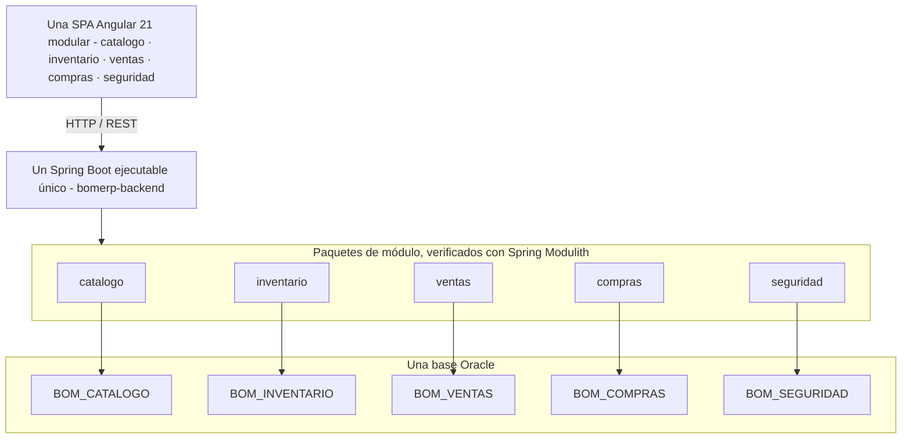

# LP2 - Lenguaje de Programación II

**Repositorio:** [262ciclo4/bomerp](https://github.com/262ciclo4/bomerp)

BomERP no pretende cubrir todos los procesos de un ERP comercial. Es una base académica extensible que demuestra arquitectura, persistencia, transacciones, seguridad e integración mediante un flujo comercial acotado. Se implementa en un único repositorio, con un backend Spring Boot **único** (un solo proyecto Maven, sin reactor multi-módulo) organizado por paquetes de módulo verificados con **Spring Modulith**, una SPA organizada por funcionalidades y una base Oracle organizada mediante esquemas funcionales.

## Producto del curso

Producto del curso = Producto U3:

```text
Base Full-Stack modular de BomERP, integrada, optimizada, monitoreada,
estabilizada y preparada académicamente para producción, con evidencias y
sustentación técnica.
```

Resultado esperado del curso:

Al finalizar el curso, el estudiante entrega una base Full-Stack modular de BomERP: un backend Spring Boot único organizado por módulos verificados con Spring Modulith, una SPA modular conectada por REST, y una base Oracle organizada por esquemas funcionales. El producto se presenta en equipo, pero cada estudiante evidencia y defiende su aporte individual.

## Contenido

### U1: Base backend REST modular de BomERP

Producto U1: base backend modular de BomERP, ensamblada como una sola aplicación Spring Boot y conectada a Oracle, con módulos de Catálogo, Inventario, Ventas y Compras delimitados; recursos REST, persistencia ORM, CRUD, objetos relacionados, una operación cabecera–detalle completamente funcional, consultas, reportes, CORS, logs y pruebas.

Resultado esperado U1: el estudiante desarrolla la base backend REST modular de BomERP, conectada a la base de datos y preparada para ser consumida posteriormente por una SPA. El corte exige implementar con profundidad el flujo heredado `Categoria–Producto–Venta–DetalleVenta`. Los módulos `inventario` y `compras` quedan delimitados arquitectónicamente para su evolución, sin convertirlos en microservicios ni multiplicar aplicaciones ejecutables.

Artefacto de referencia para el Proyecto Integrador: [LP2 - Producto de Unidad 1](../proyecto-integrador/u1/lp2-demo.md).

| Sesión | Tema (sílabo) | Módulo que se toca | Trabajo principal |
|---|---|---|---|
| [S1](sesiones/S01_Arquitectura_Backend_REST_Profesional.md) | Arquitectura backend REST profesional: estructura, dependencias, configuración por ambientes, ORM, driver de base de datos, conexión, endpoint de verificación, recurso REST inicial, DTO, contrato y versionado básico de API y documentación OpenAPI. | `catalogo` | Entorno Java 21 verificado y backend ejecutable conectado a Oracle, con endpoint de verificación y listados REST iniciales de `Categoria` y `Producto`. |
| [S2](sesiones/S02_CRUD_REST_Completo_Producto.md) | CRUD REST completo de una entidad principal: entidad ORM, repositorio, servicio, controlador, DTO, mapeo, validaciones, manejo global de excepciones, logs y pruebas de API. | `catalogo` | API de `Producto` con entidad JPA, repositorio, servicio, DTO, validaciones, excepciones, logs y pruebas. |
| S3 | Gestión de objetos relacionados mediante REST y ORM: asociaciones entre entidades, repositorios, servicios, DTO relacionados, navegación controlada, validación de referencias y prevención de ciclos de serialización. | `catalogo` | API de `Categoria–Producto`, con asociación ORM, DTO relacionados y control de referencias. |
| S4 | Procesamiento de operaciones del dominio con cabecera–detalle: DTO compuesto, colección de detalles, cálculos, estados, actualización de existencias, registro atómico, commit y rollback mediante transacciones ORM. | `catalogo` + `ventas` (nuevo) | API de `Venta–DetalleVenta`, con cálculos, control de stock y transacción JPA. |
| S5 | Consultas empresariales, reportes REST e integración con el futuro frontend: búsquedas, filtros combinados, ordenamiento, proyecciones, agregaciones, DTO de reporte, trazabilidad, logs y configuración CORS. Sin paginación. | `catalogo`, `ventas` | Consultas y reportes de ventas, productos y categorías, con DTO de reporte y configuración CORS. |
| S6 | Integración del backend REST: CRUD, objetos relacionados, operación cabecera–detalle, consultas, reportes, CORS, logs y pruebas. | — | **Producto U1:** aplicación Spring Boot modular con Catálogo y Ventas funcionales, límites preparados para Inventario y Compras, persistencia Oracle, consultas, reportes, CORS, logs y pruebas. |

### U2: SPA modular segura para BomERP

Producto U2: una SPA empresarial modular y segura construida con **Angular 21**, conectada al único backend de BomERP, con shell de navegación, funcionalidades organizadas por módulos de negocio, CRUD, formularios transaccionales, consultas, reportes y control de acceso mediante JWT.

Resultado esperado U2: el estudiante construye una SPA empresarial segura, conectada al backend REST y orientada al flujo comercial implementado como base de BomERP. No se crean frontends independientes para Ventas y Compras — la SPA mantiene `core`, `shared` y módulos funcionales cargables por rutas.

Artefacto de referencia para el Proyecto Integrador: [LP2 - Producto de Unidad 2](../proyecto-integrador/u2/lp2-demo.md).

| Sesión | Tema (sílabo) | Módulo que se toca | Trabajo principal |
|---|---|---|---|
| S7 | Creación y arquitectura de la SPA: proyecto frontend, layout, menú bar, sidebar, encabezado, módulos, componentes, rutas, navegación, servicios HTTP y CRUD de una tabla independiente. | SPA (`catalogo`) | Proyecto Angular 21 creado, SPA navegable conectada al backend, con un CRUD independiente. |
| S8 | CRUD de tablas dependientes: selección de datos relacionados, listas desplegables, validación de dependencias y presentación de información relacionada. | SPA (`catalogo`) | CRUD dependiente integrado al backend. |
| S9 | Formularios transaccionales con cabecera–detalle: detalle dinámico, cálculos, validaciones, confirmación de la operación, consultas y reportes. | SPA (`ventas`) | Flujo transaccional y consultas/reportes operativos desde la SPA. |
| S10 | Seguridad backend: usuarios, hash de contraseñas, autenticación JWT, roles, permisos y protección de endpoints. | `seguridad` (nuevo) | Backend autenticado y autorizado por roles o permisos. |
| S11 | Seguridad frontend: login, sesión, almacenamiento y expiración del token, guards, interceptores, menú por permisos, rutas protegidas y manejo de 401/403. | SPA (`seguridad`) | SPA integrada al backend seguro y con navegación protegida. |
| S12 | Integración de la SPA segura: autenticación, persistencia, consultas, navegación y control de acceso. | — | **Producto U2:** una SPA modular segura e integrada con la aplicación Spring Boot y los módulos funcionales de BomERP. |

### U3: Base Full-Stack modular de BomERP

Producto U3 / producto del curso: base Full-Stack modular de BomERP: una SPA, una aplicación Spring Boot única (módulos verificados con Spring Modulith) y una base Oracle organizada por esquemas funcionales, integradas, optimizadas, monitoreadas, auditadas y estabilizadas.

Resultado esperado U3: el estudiante consolida la base Full-Stack modular de BomERP como producto integrado, optimizado, monitoreado, estabilizado y preparado académicamente para producción.

Artefacto de referencia para el Proyecto Integrador: [LP2 - Producto de Unidad 3](../proyecto-integrador/u3/lp2-producto.md).

| Sesión | Tema (sílabo) | Módulo que se toca | Trabajo principal |
|---|---|---|---|
| S13 | Optimización y preparación para producción: Lazy Loading, Code Splitting, caché del navegador, caché con Redis, logging, monitoreo básico y buenas prácticas de despliegue. | todos | Aplicación Full-Stack optimizada y preparada para producción básica. |
| S14 | Integración y estabilización: paginación de listados con alto volumen, integración funcional de módulos, auditoría, pruebas end-to-end, corrección de errores y estabilización. | todos | Base Full-Stack integrada, auditada, probada y estabilizada. Candidata a reincorporar `spring-modulith-starter-jpa` si se adopta comunicación por eventos (ver `lp2/CLAUDE.md`). |
| S15 | Integración de la aplicación Full-Stack: backend REST, SPA, seguridad, persistencia, módulos funcionales, optimización, monitoreo y pruebas. | — | **Producto final:** base Full-Stack modular de BomERP sustentada técnicamente. |
| S16 | Integración del desarrollo Full-Stack: servicios REST, persistencia, SPA, seguridad, operaciones empresariales, optimización, monitoreo y pruebas. | — | Evaluación final individual. |

## Arquitectura LP2



- `bomerp-backend` es un único proyecto Maven y el único artefacto Spring Boot ejecutable. La SPA (desde S7) se crea como un único proyecto **Angular 21**, organizado por módulos funcionales cargables por rutas, no una SPA por módulo de negocio.
- Los módulos de negocio son paquetes directos bajo el paquete raíz, no artefactos Maven ni microservicios; Spring Modulith los detecta y verifica automáticamente (`ModularityTests`).
- Existe un solo datasource y las transacciones pueden abarcar varios esquemas Oracle.
- Los módulos se comunican mediante servicios Java públicos, sin Feign ni llamadas HTTP internas.
- Cada módulo administra sus repositorios y tablas; ningún módulo accede directamente a repositorios ajenos — la regla se verifica automáticamente, no solo se documenta.
- El sílabo expresa estos resultados de manera general; esta página concreta la implementación elegida para BomERP.
- Detalle completo de esta decisión: [ADR-001](adr/ADR-001-arquitectura-backend.md), [ADR-002](adr/ADR-002-spring-modulith.md), [ADR-003](adr/ADR-003-spring-boot-4.md) y [ADR-004](adr/ADR-004-jwt-diferido.md).

## Flujo de trabajo

1. El estudiante construye primero el módulo `catalogo` sobre `bomerp-backend`, un único proyecto Spring Boot conectado a Oracle.
2. Cada módulo de negocio nuevo (`ventas` en S4, `seguridad` en S10) se agrega recién cuando la sesión le da contenido real — no se crean paquetes vacíos "por si acaso".
3. Los módulos se verifican automáticamente con Spring Modulith (`ModularityTests`): un módulo nunca accede al repositorio o entidad de otro módulo.
4. La SPA (desde S7) se organiza por módulos funcionales cargables por rutas, sin frontends independientes por módulo.
5. La seguridad JWT se implementa recién en S10 (backend) y S11 (frontend) — no antes (ver [ADR-004](adr/ADR-004-jwt-diferido.md)).
6. Cada sesión se verifica con `mvnw test` y arranque real contra Oracle, no solo con que el código compile.
7. El producto final se optimiza, se estabiliza, se integra end-to-end y se defiende técnicamente en U3.

## Enlaces

- [Sílabo 2026-2](silabo_lp2_2026_2.md)
- [ADR-001 - Arquitectura del backend](adr/ADR-001-arquitectura-backend.md)
- [ADR-002 - Spring Modulith](adr/ADR-002-spring-modulith.md)
- [ADR-003 - Versión exacta de Spring Boot](adr/ADR-003-spring-boot-4.md)
- [ADR-004 - JWT diferido a S10](adr/ADR-004-jwt-diferido.md)
