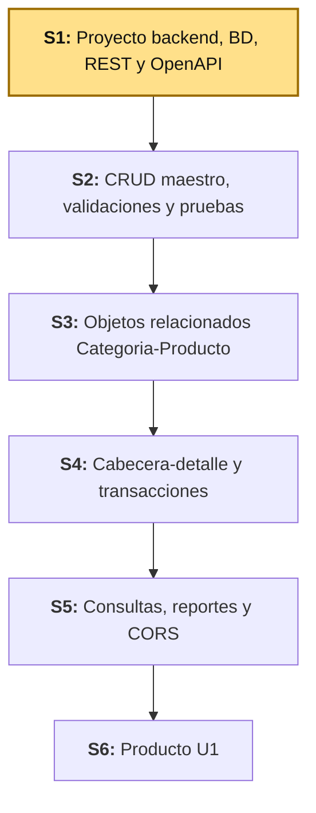
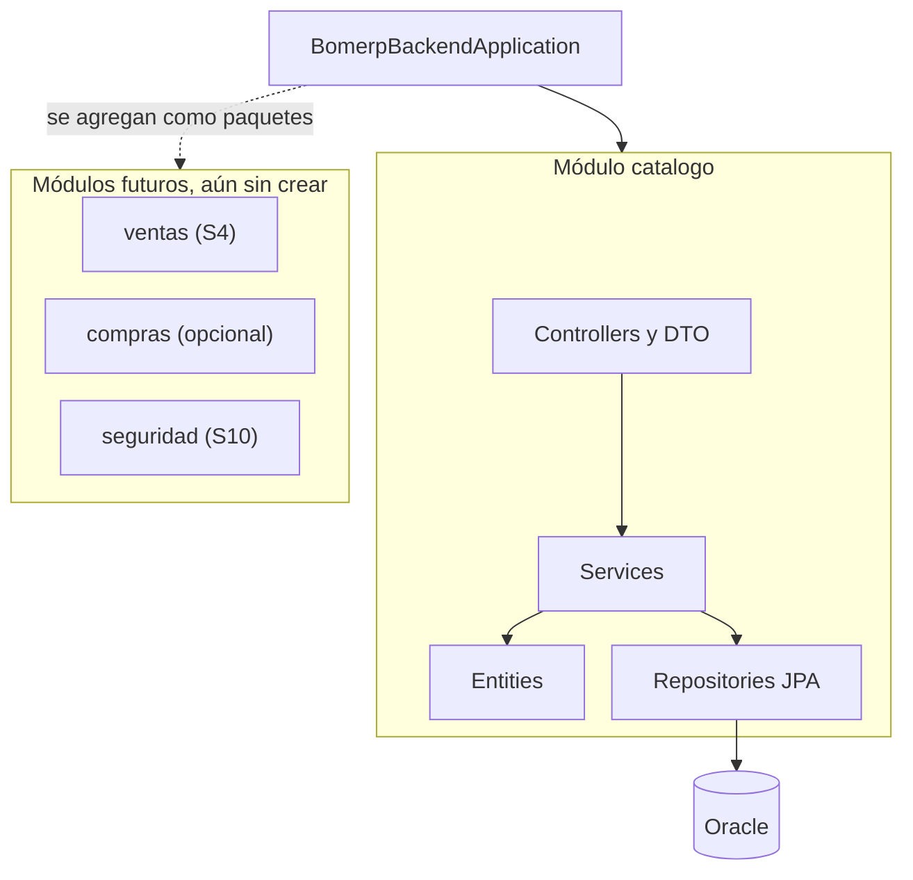
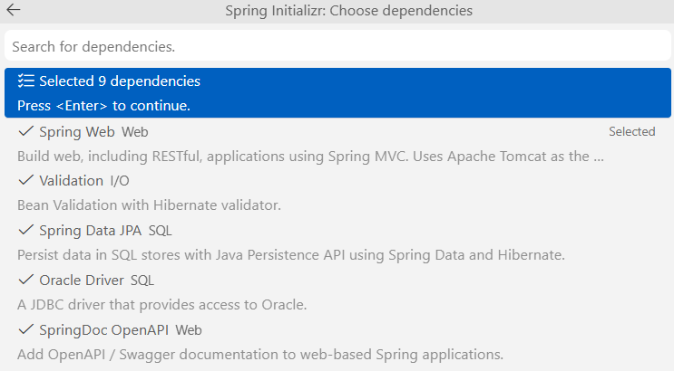
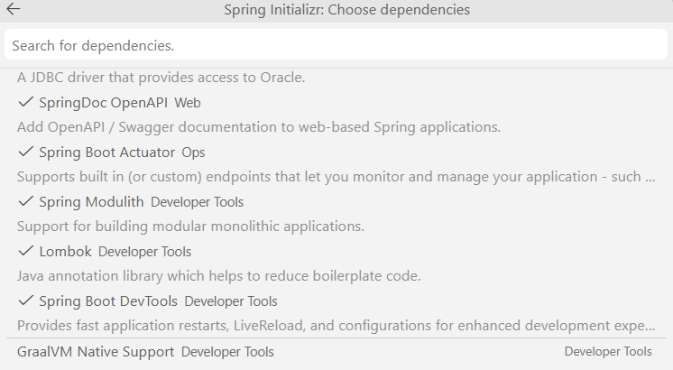
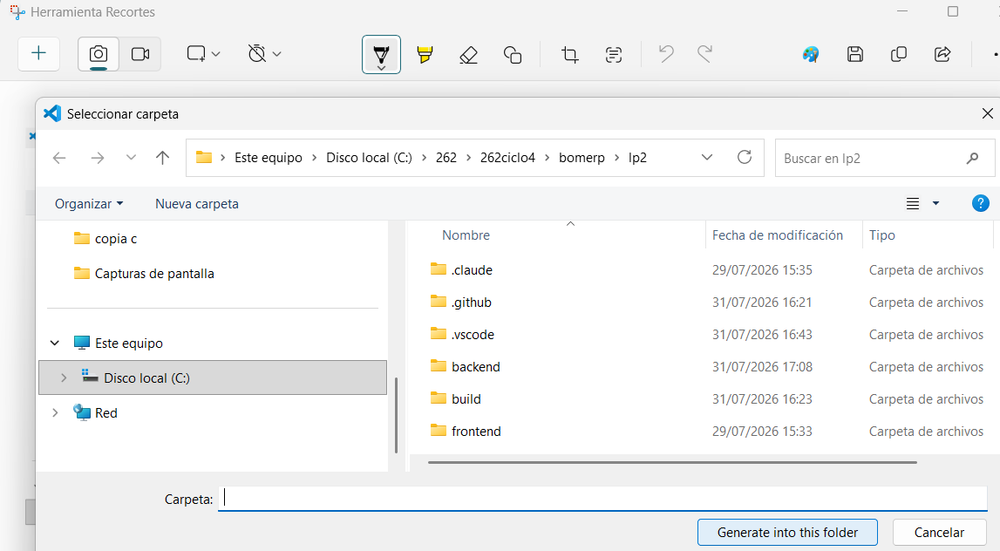
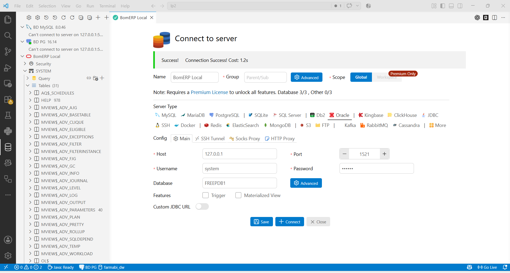

# S1 - Arquitectura Backend REST Profesional

## 1. Introducción

Tiempo: 20 min.

### 1.1 Contexto

La arquitectura de un backend decide qué tan fácil es mantenerlo y hacerlo crecer sin romperse. Esta sesión instala Java 21, crea el proyecto backend como monolito modular conectado a Oracle, y define su contrato REST inicial (`Categoria`, `Producto`, versionado, OpenAPI).

### 1.2 Índice

1. Estructura del proyecto backend y dependencias.
2. Configuración por ambientes, ORM, driver y conexión a Oracle.
3. Endpoint de verificación, recurso REST inicial y DTO.
4. Contrato, versionado básico de API y documentación OpenAPI.

### 1.3 Propósito de aprendizaje

Al concluir la clase, estarás en condiciones de:

- **Crear y entregar** un proyecto backend ejecutable y reproducible, sobre Java 21 LTS, con conexión a Oracle verificada mediante ORM, endpoint de salud, listados de `Categoria` y `Producto`, módulos de negocio, DTO de salida, contrato y versionado básico de API, y documentación OpenAPI inicial.

### 1.4 Producto de sesión

Proyecto backend ejecutable y reproducible, sobre Java 21 LTS, organizado como monolito modular y conectado a Oracle con su conexión verificada mediante ORM, con endpoint de salud, contrato y versionado básico de API definidos, y los listados de `Categoria` y `Producto` documentados mediante OpenAPI.

### 1.5 Metodología

| Fase | Actividades | Orientaciones | Material |
|---|---|---|---|
| Revisión previa individual | Instalar y verificar Java 21 LTS, VS Code y sus extensiones; leer [ADR-001](../adr/ADR-001-arquitectura-backend.md) y [ADR-002](../adr/ADR-002-spring-modulith.md). | Trabajo individual, antes de clase; traer evidencia de `java -version` funcionando. | ADR-001, ADR-002, guía de instalación Java 21. |
| Clase presencial | Explicación guiada de conceptos (REST, DTO, versionado, ambientes) y creación del proyecto backend conectado a Oracle; delimitación de los endpoints del módulo `catalogo`. | Trabajo individual en la propia laptop, siguiendo al docente paso a paso; consulta inmediata ante errores de dependencias o conexión. | `pom.xml` de referencia, `application-local.yml`, Docker Compose de Oracle, cliente REST para verificar endpoints. |
| Evaluación formativa | Verificación en clase de `mvn test` (incluye `ModularityTests`) y de la respuesta del endpoint de salud y los listados; inicio de la plantilla de evidencia individual. | La evidencia se completa y sustenta de forma individual, fuera del aula, según los criterios mínimos de la sección 4.2. | Plantilla de evidencia individual (4.1), rúbrica de evaluación (5.4). |

### 1.6 Motivación de la sesión

#### 1.6.1 Caso: API de productos

En esta sesión se crea una base backend que arranca de forma reproducible, comprueba su conexión a Oracle y expone los listados iniciales del módulo `catalogo`: `Categoria` y `Producto`. 

Preguntas para los estudiantes:

1. ¿Por qué `Categoria` y `Producto` pertenecen al mismo módulo de catálogo?
2. ¿Qué diferencia existe entre una entidad y su DTO de respuesta?
3. ¿Cómo demuestran los listados que Controller, Service, Repository y Oracle están conectados?
4. ¿Qué decisión de ADS condiciona la estructura del backend?
5. ¿Es posible que la aplicación web para este curso (`BomERP`) continúe el dominio comercial desarrollado desde POO (`CoMarket`) y LP1 (`BomStart`)?. 

### 1.7 Ubicación en el curso

- Unidad: U1 - Backend REST empresarial.
- Producto del curso: base Full-Stack modular de BomERP, integrada, optimizada, monitoreada, estabilizada y preparada académicamente para producción.
- Producto de unidad: backend REST empresarial conectado a la base de datos, con CRUD, transacciones, consultas, reglas de negocio, CORS, logs y pruebas.
- Avance del producto en esta sesión: proyecto backend creado, configurado, conectado y verificable.

Roadmap del producto de la unidad:



## 2. Explica

Tiempo: 25 min.

### 2.1 Arquitectura de la sesión



Lectura del diagrama:

- Organización: primero por módulo de negocio, luego por capa (controller, service, repository, entity).
- `Categoria`/`Producto` → `catalogo`; `Venta–DetalleVenta` → `ventas`; `Compra–DetalleCompra` → `compras`.
- Un módulo no accede al repositorio de otro: solo mediante servicios públicos.
- Integración (no exigida en S1): ADS diseña esos componentes; BD2 aporta los objetos que el backend consume.

Este diagrama es el mapa que guía el resto de la explicación, en el mismo orden del Índice (1.2).

### 2.2 Estructura del proyecto backend y dependencias

El proyecto se organiza como monolito modular: un único paquete raíz (`BomerpBackendApplication`) y, dentro de él, un paquete por módulo de negocio (ver 2.1). Esa estructura se sostiene únicamente sobre las dependencias que la sesión necesita:

| Dependencia | Decisión para S1 |
|---|---|
| Spring Web | Se conserva para publicar el recurso REST. |
| Spring Data JPA y driver Oracle | Se conservan para dejar lista y comprobar la persistencia ORM. |
| Validation | Se incorpora al esqueleto; se aplica al CRUD desde S2. |
| Actuator | Se conserva para verificar aplicación y conexión. |
| Springdoc OpenAPI | Se conserva para publicar el contrato inicial. |
| DevTools | Se agrega para reinicio automático y LiveReload durante el desarrollo; Spring Boot la excluye automáticamente del `.jar` empaquetado, así que no afecta producción. |
| Security y OAuth2 Resource Server | Se posponen hasta S10. |
| Prometheus, Flyway y Docker | No son necesarios para alcanzar el producto de S1. |

Alcance metodológico de S1:

```text
En S1 se crea solamente el proyecto backend y se comprueba
su ejecución y conexión a Oracle mediante Actuator y el listado
de Producto. No se crea frontend. El CRUD completo, las relaciones,
las transacciones y la seguridad se implementan progresivamente.
```

### 2.3 Configuración por ambientes, ORM, driver y conexión a Oracle

Un **ambiente** es el conjunto de configuración (variables, credenciales,
infraestructura) que corresponde a un contexto de uso concreto: **local**
(tu laptop, para desarrollar) y **producción** (el sistema real ya en
funcionamiento) son dos ambientes distintos; algunos proyectos agregan
ambientes intermedios (pruebas, staging). No se les llama "ambientes de
desarrollo" en general — ese nombre describe únicamente al ambiente de
desarrollo compartido de un equipo, no al concepto completo.

En BomERP, hoy existe el **ambiente local**, identificado siempre con el
sufijo `-local`:

- `application-local.yml`: configuración de Spring Boot para tu laptop, incluida la conexión ORM/JPA y el driver Oracle hacia `localhost`.
- `compose-local.yml`: el contenedor Docker de Oracle para desarrollo local.

El ambiente de **producción** (`application-prod.yml` y las decisiones de
despliegue) se incorpora recién en S13, cuando el sílabo trata
"buenas prácticas de despliegue" — no se adelanta antes porque todavía no
hay nada real que desplegar.

### 2.4 Endpoint de verificación, recurso REST inicial y DTO

REST permite organizar un backend alrededor de recursos, métodos HTTP y representaciones. El endpoint de verificación (Actuator) confirma que la aplicación arrancó y está conectada a Oracle; el recurso REST inicial (`Categoria`, `Producto`) expone los primeros listados del módulo `catalogo`, y el DTO de salida separa ese contrato de la entidad persistida — la API responde lo que el cliente necesita, no la tabla tal cual.

**Errores frecuentes**: nombrar endpoints con verbos en vez de sustantivos (no se entiende el recurso REST) y diseñar el DTO igual a la tabla de persistencia (mezcla el contrato de API con el modelo de datos) — el DTO se define según lo que necesita el cliente, no según la entidad.

### 2.5 Contrato, versionado básico de API y documentación OpenAPI

En un sistema empresarial, el contrato de API debe ser claro porque luego será consumido por una SPA y deberá estar conectado con persistencia, seguridad, transacciones y reglas del negocio.

**Versionado básico de API**: BomERP versiona su contrato en la propia URL (`/api/v1/...`). Es la forma más simple de versionado: si en el futuro un cambio rompe compatibilidad, se publica `/api/v2/...` sin obligar a los consumidores existentes (la SPA desde S7, o cualquier integración externa) a migrar de inmediato. En S1 basta con fijar el prefijo `v1`; no se implementa todavía coexistencia de versiones.

**Error frecuente**: dejar el contrato sin códigos de error documentados. Un contrato verificable incluye 400, 401, 404, 409 y 500, no solo el camino feliz.

Springdoc OpenAPI (ver 2.2) publica este contrato como documentación viva y siempre sincronizada con el código; la trazabilidad entre API, base de datos y arquitectura se verifica contra esa documentación, no contra un documento aparte.

## 3. Aplica: actividad práctica guiada

Tiempo: 2h.

Hoja de ruta de la sesión práctica:

- **3.1** Instalar y verificar Java 21 LTS, VS Code y sus extensiones.
- **3.2** Crear y verificar el proyecto backend.
- **3.3** Delimitar los endpoints del módulo Catálogo.
- **3.4** Reconocer el DTO de entrada reservado para S2.
- **3.5** Diseñar DTO de salida.
- **3.6** Documentar errores.
- **3.7** Bosquejar estructura del backend modular (Spring Modulith).
- **3.8** Trazar LP2 con ADS y BD2.

### 3.1 Instalar y verificar Java 21 LTS, VS Code y sus extensiones

**Producto del paso:** entorno de desarrollo configurado con Java 21.

**Windows** — **PowerShell** como usuario normal:

```powershell
winget install --id EclipseAdoptium.Temurin.21.JDK --exact
```

**macOS** (Homebrew no viene preinstalado en ningún Mac; una vez instalado,
el comando de Temurin es el mismo para Intel y para Apple Silicon
M1/M2/M3/M4 — Homebrew detecta la arquitectura automáticamente):

```bash
# 1. Instalar Homebrew (si no lo tiene)
/bin/bash -c "$(curl -fsSL https://raw.githubusercontent.com/Homebrew/install/HEAD/install.sh)"

# 2. Solo en Apple Silicon (M1/M2/M3/M4): agregar Homebrew al PATH.
#    Se instala en /opt/homebrew (no en /usr/local como en Intel), y el
#    propio instalador lo pide como paso obligatorio, no opcional.
echo 'eval "$(/opt/homebrew/bin/brew shellenv)"' >> ~/.zprofile
eval "$(/opt/homebrew/bin/brew shellenv)"

# 3. Instalar Temurin 21
brew install --cask temurin@21
```

**Linux (Ubuntu/Debian)** — repositorio oficial de Adoptium vía `apt`:

```bash
sudo apt install -y wget apt-transport-https gpg
wget -qO - https://packages.adoptium.net/artifactory/api/gpg/key/public | gpg --dearmor | sudo tee /etc/apt/trusted.gpg.d/adoptium.gpg > /dev/null
echo "deb https://packages.adoptium.net/artifactory/deb $(awk -F= '/^VERSION_CODENAME/{print$2}' /etc/os-release) main" | sudo tee /etc/apt/sources.list.d/adoptium.list
sudo apt update
sudo apt install -y temurin-21-jdk
```

**Linux (Fedora/RHEL)** — repositorio oficial de Adoptium vía `dnf`:

```bash
sudo tee /etc/yum.repos.d/adoptium.repo > /dev/null <<'EOF'
[Adoptium]
name=Adoptium
baseurl=https://packages.adoptium.net/artifactory/rpm/$(. /etc/os-release; echo $ID)/$releasever/$basearch
enabled=1
gpgcheck=1
gpgkey=https://packages.adoptium.net/artifactory/api/gpg/key/public
EOF
sudo dnf install -y temurin-21-jdk
```

Al finalizar, cierre y vuelva a abrir la terminal. Verifique la instalación:

```powershell
java --version
javac --version
```

**NOTA:** Ambas comprobaciones deben mostrar Java 21. Si conserva una versión anterior, configure `JAVA_HOME` con la ruta del JDK 21 desde las variables de entorno de Windows, actualice `Path` para que `%JAVA_HOME%\bin` tenga prioridad y abra una terminal nueva.

#### 3.1.1 Instalar VS Code y extensiones

**Producto del paso:** VS Code instalado con las extensiones necesarias para el resto de la sesión.

El curso usa **VS Code** como editor por defecto.

**Windows** `PS`:

```powershell
winget install -e --id Microsoft.VisualStudioCode
```

**macOS** :

```bash
brew install --cask visual-studio-code
```

**Linux (Ubuntu/Debian)** :

```bash
sudo snap install --classic code
```

En cualquier sistema también puede descargarse el instalador desde <https://code.visualstudio.com/download>.

Al finalizar, instala las extensiones desde la terminal:

```bash
code --install-extension vscjava.vscode-java-pack
code --install-extension vmware.vscode-boot-dev-pack
```
```bash
code --install-extension cweijan.vscode-database-client2
```
```bash
code --install-extension Oracle.sql-developer
```

| Extensión | ID | Para qué sirve |
|---|---|---|
| Extension Pack for Java | `vscjava.vscode-java-pack` | Soporte base de Java (autocompletado, debug, Maven); incluye Spring Initializr Java Support, usado en 3.2.1. |
| Spring Boot Extension Pack | `vmware.vscode-boot-dev-pack` | Herramientas específicas de Spring Boot: navegación de beans, Spring Boot Dashboard, soporte de `application.yml`. |
| Database Client | `cweijan.vscode-database-client2` | Cliente gráfico multi-motor: MySQL, PostgreSQL, SQLite, SQL Server, entre otros. **No incluye Oracle** — su descripción es genérica, pero puedes usar `cweijan.vscode-mysql-client2`. |
| Oracle SQL Developer for VS Code | `Oracle.sql-developer` | Extensión oficial de Oracle, gratuita, para conectarse a la Oracle de este proyecto (ver 3.2.2). |

### 3.2 Crear y verificar el proyecto backend

**Producto del paso:** proyecto `bomerp-backend` ejecutable y conectado.


#### 3.2.1 Crear el proyecto con Spring Initializr desde VS Code

Usa la extensión **Spring Initializr Java Support** (`vscjava.vscode-spring-initializr`), incluida en el Extension Pack for Java instalado en 3.1.1.

Desde la raíz del monorepo `bomerp-backend`, abre VS Code y abre la **paleta de comandos de vscode**:

- Windows/Linux: `Ctrl+Shift+P`
- macOS: `Cmd+Shift+P`

(No es `Ctrl+P` — ese atajo abre "Ir a archivo", un comando distinto.)

Escribe `Spring Initializr` y selecciona:

```text
Spring Initializr: Create a Maven Project
```

Usa la siguiente configuración:

| Campo | Valor |
|---|---|
| Project | Maven Project |
| Spring Boot | **4.0.7** |
| Language | Java |
| Group Id | `pe.edu.upeu` |
| Artifact Id | `bomerp-backend` |
| Package name | `pe.edu.upeu.bomerp` |
| Packaging | Jar |
| Java | 21 |
| Ubicación | carpeta donde haces clic en "Generate into this folder", deja vacío |

**Por qué 4.0.7 y no otra versión.** Verificado directo en [start.spring.io](https://start.spring.io/) (con `4.1.0` seleccionado, el propio buscador de dependencias muestra en rojo, al escribir "springd": *"Requires Spring Boot >= 4.0.0 and < 4.1.0-M1"*). 

Dependencias a seleccionar:

| Grupo | Dependencias | Propósito |
|---|---|---|
| API REST base | Spring Web, Validation | Exponer endpoints HTTP y validar entradas |
| Persistencia | Spring Data JPA, Oracle Driver | Acceso a datos y conexión a Oracle |
| Documentación y operación | SpringDoc OpenAPI, Spring Boot Actuator | Documentar la API con Swagger y verificar salud |
| Arquitectura modular | Spring Modulith | Verificar y documentar los límites entre módulos de negocio (ver ADR-002) |
| Productividad | Lombok, Spring Boot DevTools | Reducir código repetitivo y reiniciar automáticamente al guardar cambios |

Referencia visual (selección real en VS Code con Spring Boot 4.0.7, las 9 dependencias de la tabla):





Antes de presionar `Enter` para continuar, la lista debe mostrar exactamente:

```text
Selected 9 dependencies
✓ Spring Web
✓ Validation
✓ Spring Data JPA
✓ Oracle Driver
✓ SpringDoc OpenAPI
✓ Spring Boot Actuator
✓ Spring Modulith
✓ Lombok
✓ Spring Boot DevTools
```

Después de `Enter`, el asistente pide dónde guardar el proyecto. Navega hasta la carpeta y da clic en **"Generate into this folder"** — no escribas nada en el campo "Carpeta":



**Sobre dónde queda el proyecto.** Se crea dentro de la carpeta donde diste clic en "Generate into this folder", una **subcarpeta nueva con el nombre del Artifact Id**. Da clic estando parado en `lp2/`: el proyecto queda en `lp2/bomerp-backend/`, que es exactamente la carpeta que usa el resto de esta guía — no hace falta renombrar nada.

!!! danger "Paso obligatorio: elimina `spring-modulith-starter-jpa` del `pom.xml`"
    El Initializr agrega automáticamente `spring-modulith-starter-jpa`
    (scope `compile`) porque también seleccionaste Spring Data JPA. **Ábrelo
    y bórralo del `pom.xml` ahora mismo, antes de continuar** — si lo dejas,
    el proyecto no arranca.

    Por qué: esa dependencia trae el registro de eventos de Modulith
    respaldado por JPA, que exige su propia tabla (`event_publication`).
    Como los módulos de esta ADR se comunican por servicios Java, no por
    eventos, esa tabla no se usa — y con `ddl-auto: validate` (3.2.3),
    Hibernate falla al arrancar porque la tabla no existe en Oracle
    (`Schema-validation: missing table [event_publication]`). Detalle
    completo: [ADR-002](../adr/ADR-002-spring-modulith.md).

    Verifica que quedó eliminada buscando `spring-modulith-starter-jpa` en
    el `pom.xml`: la búsqueda no debe encontrar ninguna coincidencia.

El Initializr deriva el nombre de la clase `@SpringBootApplication` del Artifact Id, así que la genera como `BomerpBackendApplication.java` — se mantiene ese nombre por defecto, sin renombrar (mismo paquete raíz `pe.edu.upeu.bomerp`):

```java
package pe.edu.upeu.bomerp;

import org.springframework.boot.SpringApplication;
import org.springframework.boot.autoconfigure.SpringBootApplication;

@SpringBootApplication
public class BomerpBackendApplication {

    public static void main(String[] args) {
        SpringApplication.run(BomerpBackendApplication.class, args);
    }
}
```

#### 3.2.2 Configurar Oracle en Docker

**Producto del paso:** Oracle disponible en `localhost`, con el esquema de BD2 cargado.

Crea `compose-local.yml` en la raíz de `lp2/bomerp-backend` — levanta **únicamente** Oracle, para tu laptop, con las credenciales en texto plano que también usará `application-local.yml` en el paso siguiente (mismo criterio: sin `.env`):

```yaml
services:
  oracle:
    image: gvenzl/oracle-free:23-slim
    container_name: bomerp-oracle
    restart: unless-stopped
    ports:
      - "1521:1521"
    environment:
      ORACLE_PASSWORD: 123456
      APP_USER: BOMERP_APP
      APP_USER_PASSWORD: 123456
    volumes:
      - oracle-data:/opt/oracle/oradata
    healthcheck:
      test: ["CMD", "healthcheck.sh"]
      interval: 10s
      timeout: 5s
      retries: 10
      start_period: 60s

volumes:
  oracle-data:
```

**Nota sobre versión y edición:** esta imagen (`gvenzl/oracle-free:23-slim`)
es Oracle Database 23ai **Free** — no Oracle 19c ni Enterprise Edition.
Alcanza para conectar el backend y para BD2 U1 (que en el sílabo pide
Oracle XE). BD2 U2-U3 exige explícitamente Oracle 19c EE + Oracle Linux
para temas exclusivos de Enterprise Edition (AWR, particionamiento) que
este contenedor no soporta — ese ambiente todavía no está operacionalizado
en el repo (ver `bd2/README.md`, sección sobre U2-U3).

Levanta Oracle:

```powershell
docker compose -f compose-local.yml up -d
```

Crea el esquema y las tablas del catálogo ejecutando, en orden, [`S01_01_esquemas.sql`](../../proyecto-integrador/u1/oracle/S01_01_esquemas.sql) y [`S01_02_tablas.sql`](../../proyecto-integrador/u1/oracle/S01_02_tablas.sql) (scripts de BD2 — detalle completo si lo necesitas: [BD2 S1](../../bd2/sesiones/S01_PLSQL_Aplicado_Negocio.md)), por cualquiera de estas dos vías. Ambas terminan en "Verificar esquemas, tablas y registros por SQL" más abajo.

!!! danger "Service Name = `FREEPDB1`, usuario `system` — sin excepciones (aplica a las dos opciones)"
    - **Service Name vacío o distinto de `FREEPDB1`**: la conexión no apunta a nuestra base y `S01_01_esquemas.sql` nunca logra crear `BOMERP_APP`.
    - **Conectarte como `BOM_CATALOGO` para `S01_02_tablas.sql`** (parece lo lógico, es su propio esquema) falla con `ORA-01031: insufficient privileges`: el script califica el esquema explícitamente (`CREATE TABLE BOM_CATALOGO.categoria`), y eso exige `CREATE ANY TABLE` — privilegio que solo tiene `system` (rol DBA). `BOM_CATALOGO` solo tiene `CREATE TABLE`, insuficiente cuando el esquema se califica, incluso el propio.

    Ejecuta ambos scripts conectado como `system`, de principio a fin.

##### Opción A: cliente gráfico

| Campo | Valor |
|---|---|
| Connection Type | `Basic` |
| Hostname | `127.0.0.1` |
| Port Number | `1521` |
| Service Name | `FREEPDB1` |
| Username | `system` |
| Password | `123456` |



Ejecuta los dos scripts con esta conexión.

Salida esperada: `Table created.` ×2, `Grant succeeded.` ×2.

Las tablas quedan en el esquema `BOM_CATALOGO`, no en `system` — para verlas en el árbol del cliente, agrega una **segunda conexión**:

| Campo | Valor |
|---|---|
| Connection Type | `Basic` |
| Hostname | `127.0.0.1` |
| Port Number | `1521` |
| Service Name | `FREEPDB1` |
| Username | `BOM_CATALOGO` |
| Password | `123456` |

Opcional: una **tercera conexión** con `Username: BOMERP_APP` (misma contraseña y Service Name) para revisar los permisos con los que realmente corre el backend — no es dueño de las tablas, solo tiene `SELECT`/`INSERT`/`UPDATE`/`DELETE`.

##### Opción B: PowerShell

Si prefieres no instalar un cliente gráfico, copia los scripts dentro del contenedor y ejecútalos con `sqlplus` vía `docker exec`, siempre conectado como `system`. Desde `lp2/bomerp-backend`:

```powershell
docker cp ..\..\docs\proyecto-integrador\u1\oracle\S01_01_esquemas.sql bomerp-oracle:/tmp/S01_01_esquemas.sql
docker cp ..\..\docs\proyecto-integrador\u1\oracle\S01_02_tablas.sql bomerp-oracle:/tmp/S01_02_tablas.sql

docker exec bomerp-oracle sqlplus -s system/123456@localhost:1521/FREEPDB1 '@/tmp/S01_01_esquemas.sql'
docker exec bomerp-oracle sqlplus -s system/123456@localhost:1521/FREEPDB1 '@/tmp/S01_02_tablas.sql'
```

##### Verificar esquemas, tablas y registros por SQL

Si prefieres no depender del árbol del cliente gráfico (o quieres confirmar
exactamente qué existe antes de seguir), verifica entrando directamente al
contenedor con una sesión interactiva de `sqlplus`, conectado como `system`
(sin necesidad de cambiar de usuario):

```powershell
docker exec -it bomerp-oracle sqlplus system/123456@localhost:1521/FREEPDB1
```

Ya dentro del prompt `SQL>`, pega estas consultas una por una (o todas juntas):

```sql
-- ¿Existen los usuarios/esquemas?
SELECT username FROM dba_users WHERE username IN ('BOM_CATALOGO', 'BOMERP_APP');

-- ¿Qué tablas tiene BOM_CATALOGO?
SELECT table_name FROM all_tables WHERE owner = 'BOM_CATALOGO';

-- ¿Qué privilegios tiene BOM_CATALOGO?
SELECT privilege FROM dba_sys_privs WHERE grantee = 'BOM_CATALOGO';

-- Ver los registros de cada tabla
SELECT * FROM BOM_CATALOGO.categoria;
SELECT * FROM BOM_CATALOGO.producto;
```

Para salir de la sesión:

```sql
EXIT;
```

Si conectas como `BOM_CATALOGO` en vez de `system`, usa `user_tables` en lugar de `all_tables` (sin filtrar por `owner`) y quita el prefijo `BOM_CATALOGO.` de los `SELECT *`.

**Sin entrar al contenedor**: envuelve cada consulta con `bash -c` (equivalente al flag `-c` de `psql`, que `sqlplus` no tiene):

```powershell
docker exec bomerp-oracle bash -c "echo \"SELECT table_name FROM all_tables WHERE owner = 'BOM_CATALOGO';\" | sqlplus -s system/123456@localhost:1521/FREEPDB1"
```

O las 5 consultas juntas en un solo comando (here-string de PowerShell):

```powershell
@"
SELECT username FROM dba_users WHERE username IN ('BOM_CATALOGO', 'BOMERP_APP');
SELECT table_name FROM all_tables WHERE owner = 'BOM_CATALOGO';
SELECT privilege FROM dba_sys_privs WHERE grantee = 'BOM_CATALOGO';
SELECT * FROM BOM_CATALOGO.categoria;
SELECT * FROM BOM_CATALOGO.producto;
"@ | docker exec -i bomerp-oracle sqlplus -s system/123456@localhost:1521/FREEPDB1
```

Evidencia esperada tras ejecutar ambos scripts: `BOM_CATALOGO` y `BOMERP_APP` existen, `BOM_CATALOGO` tiene `CATEGORIA` y `PRODUCTO`, y ambas consultas `SELECT *` responden (vacías está bien — todavía no se insertó nada; los datos de ejemplo llegan en 3.2.6).

##### Reiniciar Docker desde cero (opcional, solo si algo quedó en mal estado)

**Advertencia: esto borra *todo* lo que tengas en Docker, no solo el contenedor de BomERP** — cualquier contenedor, imagen, volumen o red de cualquier otro curso o proyecto en tu máquina. Úsalo solo si necesitas dejar Docker como recién instalado, no como parte normal del flujo de S1.

```powershell
docker ps -aq | ForEach-Object { docker stop $_ }
docker ps -aq | ForEach-Object { docker rm -f $_ }
docker images -aq | Sort-Object -Unique | ForEach-Object { docker rmi -f $_ }

# Eliminar todos los volúmenes
docker volume ls -q | ForEach-Object { docker volume rm $_ }

docker network prune -f

# Limpiar recursos no utilizados (opcional)
docker system prune -a --volumes -f

# Limpiar caché de compilación (opcional)
docker builder prune -a -f
```

Después de esto, `compose-local.yml` vuelve a levantar Oracle desde cero (descarga la imagen de nuevo) con `docker compose -f compose-local.yml up -d`.

##### Eliminar solo lo de BomERP (sin tocar otros proyectos en Docker)

Si tienes otros cursos o proyectos corriendo en Docker en la misma máquina, no uses el reinicio total de arriba. La forma correcta es dejar que el propio `compose-local.yml` borre exactamente lo que él mismo creó (contenedor, red y volumen), sin adivinar nombres:

```powershell
cd C:\262\262ciclo4\bomerp\lp2\bomerp-backend
docker compose -f compose-local.yml down -v
```

Ojo con un detalle real: Docker Compose nombra el volumen y la red a partir de la **carpeta** donde corres el comando, no del nombre del contenedor — el contenedor se llama `bomerp-oracle`, pero el volumen queda como `bomerp-backend_oracle-data` y la red como `bomerp-backend_default` (por la carpeta `lp2/bomerp-backend`). `docker compose down -v` ya lo resuelve solo porque usa su propio registro interno, no un filtro de texto.

Si el contenedor quedó suelto (por ejemplo, lo creaste fuera de `docker compose`) y `down -v` no lo encuentra, bórralo manualmente con los nombres reales:

```powershell
docker ps -aq --filter "name=bomerp" | ForEach-Object { docker rm -f $_ }
docker volume ls -q --filter "name=bomerp-backend_oracle-data" | ForEach-Object { docker volume rm -f $_ }
```

#### 3.2.3 Configurar el ambiente local

**Producto del paso:** Spring Boot configurado para conectarse a la Oracle de Docker recién levantada.

El Initializr genera `src/main/resources/application.properties` (vacío). En vez de crear el YAML a mano, clic derecho sobre `application.properties` en el explorador de VS Code → **"Convert .properties to .yaml"**.

Esto genera `application.yaml` **junto al** `application.properties` original — la conversión no borra el archivo viejo. Renombra `application.yaml` a `application.yml` (la extensión que usa el resto del proyecto: `application-local.yml`, `compose-local.yml`), **elimina `application.properties`** (si quedan los dos, Spring Boot carga ambos y puede confundir cuál valor gana) y reemplaza el contenido de `application.yml` por el siguiente:

En `src/main/resources/application.yml` (configuración base, sin datos de ambiente):

```yaml
spring:
  application:
    name: bomerp-backend
  profiles:
    active: ${SPRING_PROFILES_ACTIVE:local}

management:
  endpoints:
    web:
      exposure:
        include: health,info
  endpoint:
    health:
      show-details: always

springdoc:
  swagger-ui:
    path: /swagger-ui.html
```

En `src/main/resources/application-local.yml` (ambiente **local**, ver 2.3). El ambiente local **no usa `.env`**: las credenciales van directo en texto plano, porque son valores de laptop, no secretos — `.env` se reserva para cuando exista un ambiente de producción real (S13):

```yaml
spring:
  datasource:
    url: jdbc:oracle:thin:@localhost:1521/FREEPDB1
    username: BOMERP_APP
    password: 123456
    driver-class-name: oracle.jdbc.OracleDriver
  jpa:
    open-in-view: false
    hibernate:
      ddl-auto: validate
    properties:
      hibernate:
        format_sql: true
    show-sql: true
  devtools:
    restart:
      enabled: true
    livereload:
      enabled: true

logging:
  level:
    pe.edu.upeu.bomerp: DEBUG
```

`ddl-auto: validate` (no `none`): Hibernate no crea ni altera nada —el esquema sigue siendo responsabilidad de BD2— pero sí compara las entidades JPA contra las tablas reales de Oracle al arrancar, avisando temprano si algo quedó desalineado. `devtools` habilita reinicio automático y LiveReload al guardar cambios; Spring Boot lo excluye solo del `.jar` empaquetado, no hace falta desactivarlo a mano para producción.

#### 3.2.4 Configurar OpenAPI

**Producto del paso:** documentación interactiva de la API vía Swagger UI.

Crea `OpenApiConfig.java` junto a `BomerpBackendApplication.java` (paquete raíz, compartido para todos los módulos):

```java
package pe.edu.upeu.bomerp;

import io.swagger.v3.oas.models.OpenAPI;
import io.swagger.v3.oas.models.info.Info;
import org.springframework.context.annotation.Bean;
import org.springframework.context.annotation.Configuration;

@Configuration
public class OpenApiConfig {

    @Bean
    OpenAPI bomErpOpenApi() {
        return new OpenAPI().info(new Info()
                .title("BomERP API")
                .version("v1")
                .description("Contrato REST del backend unico de LP2"));
    }
}
```

El path de Swagger UI (`/swagger-ui.html`) ya quedó definido en el bloque `springdoc` de `application.yml` (paso anterior); `OpenApiConfig` solo agrega el título, la versión y la descripción del contrato.

#### 3.2.5 Probar el ciclo completo con un endpoint "Hola mundo"

**Producto del paso:** confirmar que el ciclo HTTP → `Controller` → respuesta funciona, antes de sumarle JPA y Oracle con el módulo `catalogo`.

Crea `HelloController.java` en el paquete raíz (`pe.edu.upeu.bomerp`, compartido, junto a `OpenApiConfig`):

```java
package pe.edu.upeu.bomerp;

import org.springframework.web.bind.annotation.GetMapping;
import org.springframework.web.bind.annotation.RestController;

@RestController
public class HelloController {

    @GetMapping("/api/v1/hello")
    public String holaMundo() {
        return "Hola BomERP";
    }
}
```

Levanta el proyecto

```powershell
.\mvnw.cmd spring-boot:run
```

Visita http://localhost:8080/api/v1/hello
o http://localhost:8080/swagger-ui.html:

`HelloController` es solo un paso de verificación: una vez que `catalogo` expone sus propios endpoints reales (paso siguiente), puedes eliminarlo — no forma parte del contrato final de la API.

#### 3.2.6 Implementar el módulo `catalogo`: `Categoria` y `Producto`

**Producto del paso:** listados REST de `Categoria` y `Producto` funcionando de punta a punta (controller → service → repository → Oracle).

**Requisito antes de continuar:** las tablas `BOM_CATALOGO.categoria` y `BOM_CATALOGO.producto` deben existir en Oracle *antes* de compilar este paso. Con `ddl-auto: validate` (3.2.3), Hibernate valida el esquema al arrancar — si las tablas no existen, falla igual que pasó con `event_publication` (ADR-002). Se crean ejecutando [`S01_01_esquemas.sql`](../../proyecto-integrador/u1/oracle/S01_01_esquemas.sql) y [`S01_02_tablas.sql`](../../proyecto-integrador/u1/oracle/S01_02_tablas.sql) — si ya lo hiciste en 3.2.2, no hace falta repetirlo aquí. Detalle opcional, solo si quieres entender el porqué de cada bloque: [BD2 S1](../../bd2/sesiones/S01_PLSQL_Aplicado_Negocio.md).

Crea el paquete `pe.edu.upeu.bomerp.catalogo` (Spring Modulith lo detecta automáticamente como módulo por ser un paquete directo bajo el paquete raíz, sin configuración adicional).

**`catalogo/categoria/entity/Categoria.java`**

```java
package pe.edu.upeu.bomerp.catalogo.categoria.entity;

import jakarta.persistence.Column;
import jakarta.persistence.Entity;
import jakarta.persistence.GeneratedValue;
import jakarta.persistence.GenerationType;
import jakarta.persistence.Id;
import jakarta.persistence.Table;
import lombok.Getter;
import lombok.NoArgsConstructor;
import lombok.Setter;

@Entity
@Table(name = "CATEGORIA", schema = "BOM_CATALOGO")
@Getter
@Setter
@NoArgsConstructor
public class Categoria {
    @Id
    @GeneratedValue(strategy = GenerationType.IDENTITY)
    @Column(name = "ID_CATEGORIA")
    private Long id;

    @Column(name = "NOMBRE", nullable = false, unique = true, length = 80)
    private String nombre;

    @Column(name = "DESCRIPCION", length = 200)
    private String descripcion;
}
```

**`catalogo/categoria/repository/CategoriaRepository.java`**

```java
package pe.edu.upeu.bomerp.catalogo.categoria.repository;

import org.springframework.data.jpa.repository.JpaRepository;
import pe.edu.upeu.bomerp.catalogo.categoria.entity.Categoria;

public interface CategoriaRepository extends JpaRepository<Categoria, Long> {
}
```

**`catalogo/categoria/dto/CategoriaResponse.java`**

```java
package pe.edu.upeu.bomerp.catalogo.categoria.dto;

public record CategoriaResponse(Long id, String nombre, String descripcion) {
}
```

**`catalogo/categoria/service/CategoriaService.java`**

```java
package pe.edu.upeu.bomerp.catalogo.categoria.service;

import pe.edu.upeu.bomerp.catalogo.categoria.dto.CategoriaResponse;
import java.util.List;

public interface CategoriaService {
    List<CategoriaResponse> listar();
}
```

**`catalogo/categoria/service/CategoriaServiceImpl.java`**

```java
package pe.edu.upeu.bomerp.catalogo.categoria.service;

import lombok.RequiredArgsConstructor;
import org.springframework.stereotype.Service;
import org.springframework.transaction.annotation.Transactional;
import pe.edu.upeu.bomerp.catalogo.categoria.dto.CategoriaResponse;
import pe.edu.upeu.bomerp.catalogo.categoria.entity.Categoria;
import pe.edu.upeu.bomerp.catalogo.categoria.repository.CategoriaRepository;
import java.util.List;

@Service
@RequiredArgsConstructor
public class CategoriaServiceImpl implements CategoriaService {
    private final CategoriaRepository categoriaRepository;

    @Override
    @Transactional(readOnly = true)
    public List<CategoriaResponse> listar() {
        return categoriaRepository.findAll().stream().map(this::toResponse).toList();
    }

    private CategoriaResponse toResponse(Categoria categoria) {
        return new CategoriaResponse(categoria.getId(), categoria.getNombre(), categoria.getDescripcion());
    }
}
```

**`catalogo/categoria/controller/CategoriaController.java`**

```java
package pe.edu.upeu.bomerp.catalogo.categoria.controller;

import io.swagger.v3.oas.annotations.Operation;
import io.swagger.v3.oas.annotations.tags.Tag;
import lombok.RequiredArgsConstructor;
import org.springframework.http.ResponseEntity;
import org.springframework.web.bind.annotation.GetMapping;
import org.springframework.web.bind.annotation.RequestMapping;
import org.springframework.web.bind.annotation.RestController;
import pe.edu.upeu.bomerp.catalogo.categoria.dto.CategoriaResponse;
import pe.edu.upeu.bomerp.catalogo.categoria.service.CategoriaService;
import java.util.List;

@Tag(name = "Categorías")
@RestController
@RequestMapping("/api/v1/categorias")
@RequiredArgsConstructor
public class CategoriaController {
    private final CategoriaService categoriaService;

    @Operation(summary = "Lista las categorías registradas")
    @GetMapping
    public ResponseEntity<List<CategoriaResponse>> listar() {
        return ResponseEntity.ok(categoriaService.listar());
    }
}
```

`Producto` sigue exactamente el mismo patrón, cambiando `Categoria`→`Producto`, `CATEGORIA`→`PRODUCTO` y agregando los campos propios:

**`catalogo/producto/entity/Producto.java`**

```java
package pe.edu.upeu.bomerp.catalogo.producto.entity;

import jakarta.persistence.Column;
import jakarta.persistence.Entity;
import jakarta.persistence.GeneratedValue;
import jakarta.persistence.GenerationType;
import jakarta.persistence.Id;
import jakarta.persistence.Table;
import lombok.Getter;
import lombok.NoArgsConstructor;
import lombok.Setter;
import java.math.BigDecimal;

@Entity
@Table(name = "PRODUCTO", schema = "BOM_CATALOGO")
@Getter
@Setter
@NoArgsConstructor
public class Producto {
    @Id
    @GeneratedValue(strategy = GenerationType.IDENTITY)
    @Column(name = "ID_PRODUCTO")
    private Long id;

    @Column(name = "NOMBRE", nullable = false, length = 120)
    private String nombre;

    @Column(name = "PRECIO", nullable = false, precision = 10, scale = 2)
    private BigDecimal precio;

    @Column(name = "STOCK", nullable = false)
    private Integer stock;
}
```

**`catalogo/producto/repository/ProductoRepository.java`**

```java
package pe.edu.upeu.bomerp.catalogo.producto.repository;

import org.springframework.data.jpa.repository.JpaRepository;
import pe.edu.upeu.bomerp.catalogo.producto.entity.Producto;

public interface ProductoRepository extends JpaRepository<Producto, Long> {
}
```

**`catalogo/producto/dto/ProductoResponse.java`**

```java
package pe.edu.upeu.bomerp.catalogo.producto.dto;

import java.math.BigDecimal;

public record ProductoResponse(Long id, String nombre, BigDecimal precio, Integer stock) {
}
```

**`catalogo/producto/service/ProductoService.java`**

```java
package pe.edu.upeu.bomerp.catalogo.producto.service;

import pe.edu.upeu.bomerp.catalogo.producto.dto.ProductoResponse;
import java.util.List;

public interface ProductoService {
    List<ProductoResponse> listar();
}
```

**`catalogo/producto/service/ProductoServiceImpl.java`**

```java
package pe.edu.upeu.bomerp.catalogo.producto.service;

import lombok.RequiredArgsConstructor;
import org.springframework.stereotype.Service;
import org.springframework.transaction.annotation.Transactional;
import pe.edu.upeu.bomerp.catalogo.producto.dto.ProductoResponse;
import pe.edu.upeu.bomerp.catalogo.producto.entity.Producto;
import pe.edu.upeu.bomerp.catalogo.producto.repository.ProductoRepository;
import java.util.List;

@Service
@RequiredArgsConstructor
public class ProductoServiceImpl implements ProductoService {
    private final ProductoRepository productoRepository;

    @Override
    @Transactional(readOnly = true)
    public List<ProductoResponse> listar() {
        return productoRepository.findAll().stream().map(this::toResponse).toList();
    }

    private ProductoResponse toResponse(Producto producto) {
        return new ProductoResponse(producto.getId(), producto.getNombre(), producto.getPrecio(), producto.getStock());
    }
}
```

**`catalogo/producto/controller/ProductoController.java`**

```java
package pe.edu.upeu.bomerp.catalogo.producto.controller;

import io.swagger.v3.oas.annotations.Operation;
import io.swagger.v3.oas.annotations.tags.Tag;
import lombok.RequiredArgsConstructor;
import org.springframework.http.ResponseEntity;
import org.springframework.web.bind.annotation.GetMapping;
import org.springframework.web.bind.annotation.RequestMapping;
import org.springframework.web.bind.annotation.RestController;
import pe.edu.upeu.bomerp.catalogo.producto.dto.ProductoResponse;
import pe.edu.upeu.bomerp.catalogo.producto.service.ProductoService;
import java.util.List;

@Tag(name = "Productos")
@RestController
@RequestMapping("/api/v1/productos")
@RequiredArgsConstructor
public class ProductoController {
    private final ProductoService productoService;

    @Operation(summary = "Lista los productos registrados")
    @GetMapping
    public ResponseEntity<List<ProductoResponse>> listar() {
        return ResponseEntity.ok(productoService.listar());
    }
}
```

#### 3.2.7 Ejecutar el proyecto con Maven Wrapper

El proyecto trae Maven Wrapper (`mvnw`/`mvnw.cmd`): no requiere tener Maven
instalado aparte, solo Java 21. Ejecute siempre el wrapper, nunca `mvn` a
secas, para que todos usen la misma versión de Maven:

```powershell
# Windows (PowerShell o cmd)
.\mvnw.cmd spring-boot:run
```

```bash
# macOS / Linux
./mvnw spring-boot:run
```

Si abres `http://localhost:8080/` en el navegador vas a ver una **Whitelabel Error Page** con `404` y el mensaje *"No static resource ."* — es lo esperado: este backend es una API REST, no sirve una página en `/`. No es un error que arreglar. Abre en cambio `http://localhost:8080/swagger-ui/index.html` (la ruta `/swagger-ui.html` configurada en `springdoc.swagger-ui.path` redirige ahí) para ver el contrato interactivo, o revisa directamente `/api/v1/productos` y `/actuator/health` (ver 3.2.8).

Configuración de variables de entorno y detalle de la base de datos en
[`lp2/bomerp-backend/README.md`](../../../lp2/bomerp-backend/README.md).

#### 3.2.8 Verificar el proyecto backend

Antes de verificar, crea `src/test/java/pe/edu/upeu/bomerp/ModularityTests.java` (verifica automáticamente los límites entre módulos, ver [ADR-002](../adr/ADR-002-spring-modulith.md)):

```java
package pe.edu.upeu.bomerp;

import org.junit.jupiter.api.Test;
import org.springframework.modulith.core.ApplicationModules;

class ModularityTests {

    ApplicationModules modules = ApplicationModules.of(BomerpBackendApplication.class);

    @Test
    void verifiesModularStructure() {
        modules.verify();
    }

    @Test
    void writesModuleDocumentation() {
        new org.springframework.modulith.docs.Documenter(modules)
                .writeDocumentation();
    }
}
```

| Verificación | Evidencia esperada |
|---|---|
| Entorno Java | `java` y `javac` reportan Java 21; el Maven Wrapper del proyecto (`mvnw`) también se ejecuta con Java 21. |
| Dependencias mínimas | `pom.xml` con Web, JPA, Validation, Oracle, Actuator, OpenAPI y Spring Modulith. |
| Configuración por ambiente | Perfil local sin secretos incluidos en el repositorio. |
| Conexión a base de datos | Inicio correcto y componente `db` activo en Actuator. |
| Endpoint de verificación | Respuesta `UP` en `/actuator/health`. |
| Recursos iniciales | Los GET de categorías y productos devuelven datos persistidos o listas vacías. |
| Estructura modular | `.\mvnw.cmd test` / `./mvnw test` ejecuta `ModularityTests` sin errores. |

#### 3.2.9 Simular escalamiento horizontal (múltiples instancias)

**Producto del paso:** dos instancias del backend corriendo al mismo tiempo, cada una en un puerto distinto, ambas conectadas a la misma Oracle.

Un backend reproducible también debe poder escalar horizontalmente: correr varias copias idénticas a la vez, cada una en su propio puerto, sin configuración fija que las haga chocar. Con `server.port` fijo en `8080` (el que usa el resto de esta guía), una segunda instancia no puede arrancar en la misma máquina — el puerto ya está ocupado.

**Sin modificar `application-local.yml`** (para no romper el puerto 8080 que usan los pasos anteriores de esta guía), pasa el puerto como argumento de línea de comandos, en dos terminales distintas, desde `lp2/bomerp-backend`:

```powershell
# Terminal 1
.\mvnw.cmd spring-boot:run "-Dspring-boot.run.arguments=--server.port=0"

# Terminal 2 (simultánea, con Oracle y la Terminal 1 ya corriendo)
.\mvnw.cmd spring-boot:run "-Dspring-boot.run.arguments=--server.port=0"
```

`--server.port=0` le indica a Spring Boot que pida al sistema operativo un puerto libre cualquiera, en vez de uno fijo. Cada terminal imprime el suyo al arrancar:

```text
Tomcat started on port 58251 (http) with context path '/'
```

Verificado con dos instancias reales corriendo en paralelo — la primera tomó el puerto `58251` y la segunda el `58252`, cada una respondiendo por su cuenta:

```text
GET http://localhost:58251/api/v1/hello -> Hola BomERP
GET http://localhost:58252/api/v1/hello -> Hola BomERP
```

Y ambas con `/actuator/health` en `UP`, conectadas de forma independiente a la misma Oracle (`db.status: UP` en las dos).

**Alternativa fija en la configuración.** Si en vez de un argumento de línea de comandos prefieres verlo declarado en el YAML, agrega esto a `application-local.yml` — pero ten en cuenta que entonces *todas* las ejecuciones normales de este proyecto (incluidas las de los pasos anteriores) también arrancarán en un puerto aleatorio, no en 8080:

```yaml
server:
  port: 0
```

**Por qué importa esto en S1.** LP2 es un monolito, no un sistema distribuido — no hay Gateway ni balanceador de carga todavía (eso pertenece a Aplicaciones Distribuidas). Pero la capacidad de correr múltiples instancias sin puerto fijo es la base técnica que un balanceador necesita para repartir tráfico entre copias del mismo backend; practicarla desde S1 deja esa evidencia lista para cuando el proyecto integre esa pieza.

### 3.3 Delimitar los endpoints del módulo Catálogo

**Producto del paso:** contrato base.

| Método | Endpoint | Propósito | Implementación en el curso |
|---|---|---|---|
| `GET` | `/api/v1/categorias` | Listar categorías desde Oracle | S1 |
| `GET` | `/api/v1/productos` | Listar productos desde Oracle | S1 |
| `POST`, `PUT`, `DELETE` | `/api/v1/categorias` | Completar operaciones de categoría | S2-S3 |
| `GET` | `/api/v1/productos/{id}` | Consultar un producto | S2 |
| `POST` | `/api/v1/productos` | Registrar un producto | S2 |
| `PUT` | `/api/v1/productos/{id}` | Actualizar un producto | S2 |
| `DELETE` | `/api/v1/productos/{id}` | Eliminar un producto | S2 |

### 3.4 Reconocer el DTO de entrada reservado para S2

**Producto del paso:** request DTO.

```json
{
  "nombre": "Teclado mecánico",
  "precio": 180.50,
  "stock": 25
}
```

En S1 este contrato se documenta, pero no se implementa todavía el registro.

### 3.5 Diseñar DTO de salida

**Producto del paso:** response DTO.

```json
{
  "id": 1,
  "nombre": "Teclado mecánico",
  "precio": 180.50,
  "stock": 25
}
```

### 3.6 Documentar errores

**Producto del paso:** contrato de errores.

| Código HTTP | Caso | Respuesta esperada |
|---:|---|---|
| 400 | Datos inválidos | Mensaje de validación |
| 404 | Producto inexistente | Recurso no encontrado |
| 409 | Producto referenciado en una venta | Conflicto de negocio |
| 500 | Error no controlado | Respuesta técnica sin exponer secretos |

Los códigos 400, 404 y 409 se implementan en S2; 401 y 403 se incorporan con la seguridad de U2.

### 3.7 Bosquejar estructura del backend modular (Spring Modulith)

**Producto del paso:** estructura base.

```text
lp2/bomerp-backend/
├── pom.xml                          # un solo proyecto Maven, sin reactor
└── src/main/java/pe/edu/upeu/bomerp/
    ├── BomerpBackendApplication.java
    ├── OpenApiConfig.java           # compartido, en el paquete raíz
    └── catalogo/                    # módulo Modulith, funcional desde S1
        ├── categoria/{controller,dto,entity,repository,service}
        └── producto/{controller,dto,entity,repository,service}
```

Un solo `pom.xml` y un solo `.jar` ejecutable. `ventas`, `inventario`, `compras` y `seguridad` no se crean como paquetes vacíos "por si acaso" — se agregan como paquetes directos bajo `pe.edu.upeu.bomerp` recién cuando su sesión (S4, S10...) les da contenido real. Spring Modulith detecta cada paquete directo como un módulo y verifica sus límites automáticamente (`ModularityTests`); el detalle de esta decisión está en [ADR-001](../adr/ADR-001-arquitectura-backend.md) y [ADR-002](../adr/ADR-002-spring-modulith.md).

### 3.8 Trazar LP2 con ADS y BD2

**Producto del paso:** matriz de integración inicial.

| Endpoint LP2 | Componente ADS | Objeto BD2 futuro |
|---|---|---|
| `GET /api/v1/categorias` | Módulo Catalogo / CategoriaService | Tabla `CATEGORIA` |
| `GET /api/v1/productos` | ProductoController / ProductoService | Tabla `PRODUCTO` |
| `POST /api/v1/productos` | ProductoController / ProductoService | Restricciones de precio y stock |
| `POST /api/v1/ventas` | VentaController / VentaService | `pkg_venta.registrar_venta` |

Sesión equivalente en los otros dos cursos, misma semana: [ADS - S1 Fundamentos de Arquitectura de Software](../../ads/sesiones/S01_Fundamentos_Arquitectura_Software.md) y [BD2 - S1 PL/SQL Aplicado al Negocio](../../bd2/sesiones/S01_PLSQL_Aplicado_Negocio.md).

## 4. Crea: actividad autónoma

Tiempo: 2h fuera del aula.

Cada estudiante documenta la API base del dominio elegido por su equipo.

### 4.1 Plantilla de evidencia individual

Entrega un PDF con el siguiente nombre:

```text
S01_LP2_Equipo##_ApellidoNombre.pdf
```

#### 4.1.1 Datos del estudiante

- Nombre:
- Equipo:
- Sesión: S01 - Arquitectura Backend REST Profesional
- Rol o aporte realizado:
- Link de GitHub:

#### 4.1.2 Trabajo autónomo realizado

Completa y evidencia estas tareas:

1. Evidenciar la creación y ejecución del proyecto backend.
2. Documentar dependencias y configuración por ambiente.
3. Demostrar la conexión a la base de datos sin publicar secretos.
4. Publicar y probar el endpoint de verificación.
5. Implementar los listados iniciales del módulo principal de tu dominio (equivalente a `catalogo` en el caso guiado).
6. Generar la documentación OpenAPI.

#### 4.1.3 Evidencia técnica

Incluye:

- Evidencia de ejecución y endpoint de verificación.
- Evidencia de conexión a la base de datos.
- Configuración por ambiente sin secretos.
- Respuesta de los listados de las entidades principales de tu dominio (equivalentes a `Categoria` y `Producto` en el caso guiado), tabla de endpoints y consultas ejecutadas en Oracle.
- DTO de salida en JSON y documentación OpenAPI.
- Estructura base del backend.

#### 4.1.4 Error o hallazgo

Describe un error o hallazgo: endpoint mal definido, DTO acoplado a tabla, falta de seguridad, recurso ambiguo o regla no contemplada.

#### 4.1.5 Reflexión técnica breve

Responde en 5 a 8 líneas:

```text
¿Qué decisiones permiten que el proyecto backend pueda ejecutarse de forma reproducible en diferentes ambientes?
```

### 4.2 Criterios mínimos de aceptación

La evidencia individual se considera completa si:

- El archivo respeta el nombre solicitado.
- El entorno utiliza Java 21 y el Maven Wrapper del proyecto reconoce el mismo JDK.
- El backend inicia correctamente y comprueba la conexión a la base de datos.
- La configuración por ambiente no expone secretos.
- El endpoint de verificación responde correctamente.
- Define recursos, endpoints y DTO coherentes.
- Publica documentación OpenAPI.

## 5. Cierre evaluativo

Tiempo: 20 min.

### 5.1 Resultados esperados

Al finalizar la sesión, el estudiante debe demostrar que:

- Crea y ejecuta el proyecto backend de forma reproducible, sobre Java 21 LTS.
- Explica y reproduce la configuración del backend por ambiente.
- Demuestra la conexión a la base de datos, verificada mediante ORM, y el endpoint de verificación.
- Identifica recursos y endpoints iniciales, y su contrato y versionado básico (`/api/v1/...`).
- Diseña DTO y publica documentación OpenAPI.
- Organiza el backend por responsabilidades y verifica sus límites de módulo con Spring Modulith (`ModularityTests`).

### 5.2 Evidencia del producto de sesión

Cada estudiante entrega un PDF individual siguiendo la plantilla de la sección 4.1.

Nombre del archivo:

```text
S01_LP2_Equipo##_ApellidoNombre.pdf
```

### 5.3 Preguntas de defensa y reflexión

1. ¿Cómo se reproduce la ejecución del backend en otro equipo?
2. ¿Cómo se configura la conexión sin publicar credenciales?
3. ¿Qué comprueba el endpoint de verificación?
4. ¿Qué diferencia hay entre DTO y entidad persistente?
5. ¿Por qué `/api/v1/...` cuenta como versionado de API, aunque todavía no exista una `v2`?
6. ¿Qué pasaría si `ventas` importara directamente el `Repository` de `catalogo`? ¿Qué lo impide?

### 5.4 Rúbrica de evaluación

| Dimensión | Peso | 3 - Logro destacado | 2 - Logro | 1 - Proceso | 0 - Inicio | Puntuación obtenida |
|---|---:|---|---|---|---|---:|
| 1. Ejecución y configuración | 2 | Backend reproducible, perfiles claros y secretos protegidos. | Backend ejecutable con configuración suficiente. | Ejecución o configuración incompleta. | El proyecto no ejecuta. | |
| 2. Conexión y verificación | 2 | Conexión a BD y endpoint de salud comprobados. | Ambas evidencias funcionan con detalles menores. | Solo una evidencia es funcional. | No demuestra conexión ni salud. | |
| 3. Recursos, endpoints y DTO | 2 | Contratos claros, coherentes y desacoplados. | Contratos funcionales. | Contratos incompletos. | No presenta contratos. | |
| 4. OpenAPI, versionado y estructura modular | 2 | Documentación navegable, versionado `/api/v1` explicado, estructura por responsabilidades y `ModularityTests` en verde. | Documentación, versionado y estructura básicos. | Evidencia parcial o confusa. | No documenta ni organiza. | |
| 5. Orden y reflexión | 1 | Evidencia ordenada y reflexión técnica clara. | Evidencia suficiente y reflexión comprensible. | Evidencia incompleta o reflexión superficial. | Evidencia desordenada o sin reflexión. | |

Puntuación acumulada = suma de (`Peso` * `Puntuación obtenida`) = ____.

Nota final = (`Puntuación acumulada` / 27) * 20 = ____.
