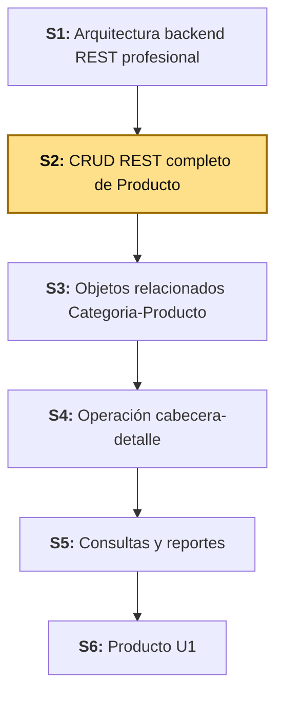
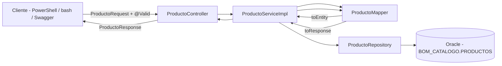

# S2 - CRUD REST Completo de Producto

*Por: Angel Sullon Macalupu @asullom - 2026*

## 1. Introducción

Tiempo: 20 min.

### 1.1 Presentación de la sesión

En S1, `Producto` (si se completó el 3.5.2 opcional) solo exponía un listado de solo lectura. Esta sesión lo convierte en un recurso REST completo: crear, consultar uno por id, actualizar y eliminar, con un DTO de entrada validado, mapeo explícito entre capas y el manejo global de errores de S1 (3.3) puesto a prueba con casos reales de validación y de recurso no encontrado.

### 1.2 Índice

1. Entidad, repositorio, DTO y mapeo.
2. Servicio de aplicación con las cuatro operaciones CRUD.
3. Validación de entrada con Bean Validation.
4. Controlador REST completo y manejo de errores aplicado.

### 1.3 Propósito de aprendizaje

Al concluir la clase, estarás en condiciones de:

- **Construir y probar** un recurso REST completo (crear, consultar, actualizar, eliminar) sobre `Producto`, con DTO de entrada validado, mapeo explícito entidad-DTO mediante una clase `Mapper` dedicada, manejo global de errores verificado con casos reales, y trazabilidad por petición mediante logs.

### 1.4 Producto de sesión

API REST completa de `Producto` (`GET`, `GET /{id}`, `POST`, `PUT`, `DELETE`), con entidad, repositorio, DTO de entrada (`ProductoRequest`) y de salida (`ProductoResponse`), un `ProductoMapper` dedicado, validaciones con Bean Validation, y manejo de errores probado con casos válidos e inválidos.

### 1.5 Metodología

**Tabla 1. Metodología de la sesión**

| Actividades a Realizar en el Periodo | Orientaciones generales (Orientaciones Metodológicas) | Material de estudio recomendado |
|---|---|---|
| Revisión previa individual | Si no completaste el 3.5.2 opcional de S1, revisa esa sección antes de clase (`Producto` con `listar()` debe existir). Repasar Bean Validation (`@NotBlank`, `@Size`, `@NotNull`). Trabajo individual, antes de clase. | S1 (3.5.2), documentación de Jakarta Bean Validation. |
| Clase presencial | Construcción guiada del CRUD REST completo de `Producto`: DTO, mapper, servicio y controlador, con casos de prueba válidos e inválidos. Trabajo individual en la propia laptop, siguiendo al docente paso a paso; consulta inmediata ante errores de compilación o de mapeo. | `pom.xml` ya configurado (S1), backend ejecutable, cliente REST para verificar endpoints. |
| Evaluación formativa | Verificación en clase de `POST`/`GET`/`PUT`/`DELETE` sobre `/api/v1/productos`, incluidos los casos `400` (validación) y `404` (no encontrado). La evidencia se completa y sustenta de forma individual, fuera del aula, según los criterios mínimos de la sección 4.4. | Indicaciones de entrega (4.3), rúbrica de evaluación (4.6). |

### 1.6 Motivación de la sesión

#### 1.6.1 Caso: catálogo de BomERP (`Producto`)

En S1 bastaba con listar productos para verificar que el backend funcionaba. Pero un catálogo real no se mantiene solo — el equipo de compras necesita registrar productos nuevos, corregir un precio mal cargado, o dar de baja un producto discontinuado. Sin esas operaciones, `ventas` (S4) no tendría de dónde tomar un precio o un stock reales para descontar. Esta sesión completa ese ciclo de vida para `Producto`.

**Preguntas de análisis**

**Activación de conocimientos previos**

1. En S1, `CategoriaResponse`/`ProductoResponse` eran `record`. ¿Por qué esta sesión los convierte en clases con `@Builder`?
2. Si dos peticiones actualizan el mismo producto casi al mismo tiempo, ¿qué garantiza JPA (y qué no garantiza) sobre cuál gana?

**Comprensión de CRUD REST**

1. ¿Por qué el DTO de entrada (`ProductoRequest`) es una clase distinta del de salida (`ProductoResponse`), en vez de reutilizar uno solo?
2. ¿Qué responde la API si se intenta actualizar o eliminar un `id` que no existe?
3. ¿Qué responde la API si el `nombre` llega vacío en el `POST`?

### 1.7 Ubicación en el curso

- Unidad: U1 - Base backend REST modular de BomERP.
- Producto del curso: base Full-Stack modular de BomERP.
- Producto de unidad: base backend modular de BomERP, con módulos de Catálogo, Inventario, Ventas y Compras delimitados.
- Avance del producto en esta sesión: `Producto` con CRUD completo, validado y con manejo de errores probado.

Roadmap del producto de la unidad:

**Figura 1. Roadmap del producto de la unidad**



## 2. Explica

Tiempo: 25 min.

### 2.1 Arquitectura de la sesión

**Figura 2. Flujo de una petición de escritura sobre `Producto`**



Lectura del diagrama:

- El controller nunca construye ni lee la entidad `Producto` directamente: siempre entra y sale por un DTO, y el `ProductoMapper` es el único punto que conoce ambos lados (DTO y entidad).
- `@Valid` en el controller corta las peticiones inválidas **antes** de que lleguen al service — el service asume que todo lo que recibe ya pasó validación de forma.
- Integración (referencia, no requisito para esta sesión): ADS diseñó este mismo patrón (Controller-Service-Mapper-Repository-DTO) en su S10 como patrón táctico general; aquí se implementa contra Oracle real. **Error frecuente**: mezclar la validación de forma (`@NotBlank`, `@Size`) con reglas de negocio (por ejemplo, "el precio no puede bajar de la mitad") — esta sesión solo cubre la primera; reglas de negocio más complejas se tratan en sesiones posteriores.

Este diagrama es el mapa que guía el resto de la explicación: cada apartado siguiente desarrolla uno de sus componentes, en el mismo orden del Índice (1.2).

### 2.2 Entidad, repositorio, DTO y mapeo

La entidad `Producto` y `ProductoRepository` ya existen desde S1 (3.5.2) y no cambian en esta sesión. Lo que cambia es el DTO de salida y cómo se construye.

En S1, con solo `listar()`, un `record CategoriaResponse`/`ProductoResponse` alcanzaba: inmutable, sin Lombok, una sola forma de construirlo. Ahora `Producto` necesita dos DTO distintos (`ProductoRequest` para lo que entra, `ProductoResponse` para lo que sale) y un mapeo en ambas direcciones (`toEntity`/`toResponse`) — un `record` no tiene setters ni encaja con `@Builder`, así que `ProductoResponse` pasa a ser una clase con Lombok (`@Getter @Setter @Builder @NoArgsConstructor @AllArgsConstructor`), igual que ya lo hace Distribuidas desde su S1.

**Nota de alcance:** `Categoria` sigue siendo `record` en esta sesión — solo `Producto` recibe CRUD completo en S2. `Categoria` recibe su propio CRUD progresivamente en S2-S3 (ver Tabla 10 de S1).

### 2.3 Validación de entrada con Bean Validation

`ProductoRequest` declara las reglas de forma directamente sobre sus campos (`@NotBlank`, `@Size`, `@NotNull`, `@DecimalMin`), y el controller las activa con `@Valid` en el parámetro `@RequestBody`. Si algo no cumple, Spring nunca llega a ejecutar el método del controller: responde `400` directo, con el mismo `GlobalExceptionHandler` de S1 (3.3.1) manejando `MethodArgumentNotValidException`.

**Error frecuente**: olvidar `@Valid` en el `@RequestBody` del controller. Sin esa anotación, Spring ignora por completo las anotaciones de `ProductoRequest` y deja pasar datos inválidos hasta el service.

### 2.4 Manejo de errores aplicado

El `GlobalExceptionHandler` y el `ResourceNotFoundException` ya existen desde S1 (3.3.1) — hoy es la primera vez que la sesión los ejercita con casos reales: pedir, actualizar o eliminar un `id` que no existe lanza `ResourceNotFoundException`, capturado por el mismo manejador global que ya estaba en pie desde S1 sin usarse todavía.

### 2.5 Logs y trazabilidad en operaciones de escritura

El `CorrelationIdFilter` de S1 (3.3.2) ya asigna un `traceId` a cada petición HTTP, sin importar el método. Hoy, por primera vez, ese `traceId` acompaña también peticiones `POST`/`PUT`/`DELETE` — útil para rastrear, por ejemplo, quién creó o eliminó un producto específico revisando los logs por ese identificador.

## 3. Aplica: actividad práctica guiada

Tiempo: 2h.

**Actividad:** construcción guiada del CRUD REST completo de `Producto` (Producto de la sesión en 1.4).

**Propósito de la actividad:** convertir `Producto` de un listado de solo lectura a un recurso REST completo — con DTO de entrada validado, mapeo explícito mediante `ProductoMapper`, y las cuatro operaciones CRUD probadas con casos válidos e inválidos — verificando cada incremento antes de continuar al siguiente.

**Orientaciones metodológicas:** en el laboratorio, el docente construye el CRUD completo de `Producto` paso a paso frente a la clase, ejecutando cada prueba (válida e inválida) antes de avanzar; los estudiantes replican cada paso en su propio equipo, verificando la respuesta HTTP exacta antes de continuar.

**Actividades para realizar:**

- **3.1** Verificar el punto de partida.
- **3.2** Migrar `ProductoResponse` a clase y crear `ProductoRequest`.
- **3.3** Crear `ProductoMapper`.
- **3.4** Ampliar `ProductoService`/`ProductoServiceImpl`.
- **3.5** Ampliar `ProductoController`.
- **3.6** Probar el CRUD completo.
- **3.7** Relacionar con ADS y BD2.

### 3.1 Verificar el punto de partida

**Producto del paso:** confirmación de que `Producto` (entidad, repositorio y `listar()`) ya existe.

!!! note "Si no completaste el 3.5.2 opcional de S1"
    Esta sesión asume que `catalogo/producto/entity/Producto.java` y `catalogo/producto/repository/ProductoRepository.java` ya existen (S1, 3.5.2). Si en S1 solo hiciste `Categoria` y dejaste `Producto` pendiente por ser opcional, créalos ahora siguiendo exactamente 3.5.2 de S1 antes de continuar — son idénticos, esta sesión no los repite.

**Requisito antes de continuar:** confirma que `http://localhost:8080/api/v1/productos` responde (lista vacía o con datos) antes de tocar código nuevo. Si falla, el problema es de S1 (conexión a Oracle o tablas faltantes, ver 3.5 de S1), no de esta sesión.

### 3.2 Migrar `ProductoResponse` a clase y crear `ProductoRequest`

**Producto del paso:** DTO de entrada y de salida, ambos como clases con Lombok.

Reemplaza el contenido de `catalogo/producto/dto/ProductoResponse.java` (el `record` de S1) por:

**`catalogo/producto/dto/ProductoResponse.java`**

```java
package pe.edu.upeu.bomerp.catalogo.producto.dto;

import lombok.AllArgsConstructor;
import lombok.Builder;
import lombok.Getter;
import lombok.NoArgsConstructor;
import lombok.Setter;
import java.math.BigDecimal;

@Getter
@Setter
@Builder
@NoArgsConstructor
@AllArgsConstructor
public class ProductoResponse {
    private Long id;
    private String nombre;
    private BigDecimal precio;
    private Integer stock;
}
```

**`catalogo/producto/dto/ProductoRequest.java`**

```java
package pe.edu.upeu.bomerp.catalogo.producto.dto;

import jakarta.validation.constraints.DecimalMin;
import jakarta.validation.constraints.NotBlank;
import jakarta.validation.constraints.NotNull;
import jakarta.validation.constraints.PositiveOrZero;
import jakarta.validation.constraints.Size;
import lombok.Getter;
import lombok.Setter;
import java.math.BigDecimal;

@Getter
@Setter
public class ProductoRequest {

    @NotBlank
    @Size(max = 120)
    private String nombre;

    @NotNull
    @DecimalMin(value = "0.0", inclusive = true)
    private BigDecimal precio;

    @NotNull
    @PositiveOrZero
    private Integer stock;
}
```

### 3.3 Crear `ProductoMapper`

**Producto del paso:** clase dedicada al mapeo `Producto` ↔ DTO, en ambas direcciones.

**`catalogo/producto/mapper/ProductoMapper.java`**

```java
package pe.edu.upeu.bomerp.catalogo.producto.mapper;

import org.springframework.stereotype.Component;
import pe.edu.upeu.bomerp.catalogo.producto.dto.ProductoRequest;
import pe.edu.upeu.bomerp.catalogo.producto.dto.ProductoResponse;
import pe.edu.upeu.bomerp.catalogo.producto.entity.Producto;

@Component
public class ProductoMapper {

    public Producto toEntity(ProductoRequest request) {
        Producto producto = new Producto();
        producto.setNombre(request.getNombre());
        producto.setPrecio(request.getPrecio());
        producto.setStock(request.getStock());
        return producto;
    }

    public ProductoResponse toResponse(Producto producto) {
        return ProductoResponse.builder()
                .id(producto.getId())
                .nombre(producto.getNombre())
                .precio(producto.getPrecio())
                .stock(producto.getStock())
                .build();
    }
}
```

`toEntity` usa `new` + setters, no `@Builder`, porque `Producto` (la entidad JPA) mantiene `@Getter @Setter @NoArgsConstructor` desde S1, sin `@Builder` — mezclar `@Builder` en la entidad persistente no aporta nada aquí y agrega una anotación más a mantener.

### 3.4 Ampliar `ProductoService`/`ProductoServiceImpl`

**Producto del paso:** las cuatro operaciones CRUD en el service, con `ResourceNotFoundException` en las que buscan por `id`.

**`catalogo/producto/service/ProductoService.java`**

```java
package pe.edu.upeu.bomerp.catalogo.producto.service;

import pe.edu.upeu.bomerp.catalogo.producto.dto.ProductoRequest;
import pe.edu.upeu.bomerp.catalogo.producto.dto.ProductoResponse;
import java.util.List;

public interface ProductoService {
    List<ProductoResponse> listar();
    ProductoResponse obtener(Long id);
    ProductoResponse crear(ProductoRequest request);
    ProductoResponse actualizar(Long id, ProductoRequest request);
    void eliminar(Long id);
}
```

**`catalogo/producto/service/ProductoServiceImpl.java`**

```java
package pe.edu.upeu.bomerp.catalogo.producto.service;

import lombok.RequiredArgsConstructor;
import org.springframework.stereotype.Service;
import org.springframework.transaction.annotation.Transactional;
import pe.edu.upeu.bomerp.catalogo.producto.dto.ProductoRequest;
import pe.edu.upeu.bomerp.catalogo.producto.dto.ProductoResponse;
import pe.edu.upeu.bomerp.catalogo.producto.entity.Producto;
import pe.edu.upeu.bomerp.catalogo.producto.mapper.ProductoMapper;
import pe.edu.upeu.bomerp.catalogo.producto.repository.ProductoRepository;
import pe.edu.upeu.bomerp.exception.ResourceNotFoundException;
import java.util.List;

@Service
@RequiredArgsConstructor
public class ProductoServiceImpl implements ProductoService {
    private final ProductoRepository productoRepository;
    private final ProductoMapper productoMapper;

    @Override
    @Transactional(readOnly = true)
    public List<ProductoResponse> listar() {
        return productoRepository.findAll().stream().map(productoMapper::toResponse).toList();
    }

    @Override
    @Transactional(readOnly = true)
    public ProductoResponse obtener(Long id) {
        return productoMapper.toResponse(buscarOFallar(id));
    }

    @Override
    public ProductoResponse crear(ProductoRequest request) {
        Producto producto = productoMapper.toEntity(request);
        return productoMapper.toResponse(productoRepository.save(producto));
    }

    @Override
    public ProductoResponse actualizar(Long id, ProductoRequest request) {
        Producto producto = buscarOFallar(id);
        producto.setNombre(request.getNombre());
        producto.setPrecio(request.getPrecio());
        producto.setStock(request.getStock());
        return productoMapper.toResponse(productoRepository.save(producto));
    }

    @Override
    public void eliminar(Long id) {
        productoRepository.delete(buscarOFallar(id));
    }

    private Producto buscarOFallar(Long id) {
        return productoRepository.findById(id)
                .orElseThrow(() -> new ResourceNotFoundException("Producto no encontrado: " + id));
    }
}
```

`pe.edu.upeu.bomerp.exception` es el paquete compartido creado en S1 (3.3.1) — `ResourceNotFoundException` no se repite aquí, se reutiliza tal cual.

### 3.5 Ampliar `ProductoController`

**Producto del paso:** los cinco endpoints (`GET`, `GET /{id}`, `POST`, `PUT`, `DELETE`) sobre `/api/v1/productos`.

**`catalogo/producto/controller/ProductoController.java`**

```java
package pe.edu.upeu.bomerp.catalogo.producto.controller;

import io.swagger.v3.oas.annotations.Operation;
import io.swagger.v3.oas.annotations.tags.Tag;
import jakarta.validation.Valid;
import lombok.RequiredArgsConstructor;
import org.springframework.http.HttpStatus;
import org.springframework.http.ResponseEntity;
import org.springframework.web.bind.annotation.*;
import pe.edu.upeu.bomerp.catalogo.producto.dto.ProductoRequest;
import pe.edu.upeu.bomerp.catalogo.producto.dto.ProductoResponse;
import pe.edu.upeu.bomerp.catalogo.producto.service.ProductoService;
import java.util.List;

@Tag(name = "Productos")
@RestController
@RequestMapping("/api/v1/productos")
@RequiredArgsConstructor
public class ProductoController {
    private final ProductoService productoService;

    @Operation(summary = "Lista los productos registrados")
    @GetMapping
    public ResponseEntity<List<ProductoResponse>> listar() {
        return ResponseEntity.ok(productoService.listar());
    }

    @Operation(summary = "Consulta un producto por id")
    @GetMapping("/{id}")
    public ResponseEntity<ProductoResponse> obtener(@PathVariable Long id) {
        return ResponseEntity.ok(productoService.obtener(id));
    }

    @Operation(summary = "Registra un producto nuevo")
    @PostMapping
    @ResponseStatus(HttpStatus.CREATED)
    public ProductoResponse crear(@Valid @RequestBody ProductoRequest request) {
        return productoService.crear(request);
    }

    @Operation(summary = "Actualiza un producto existente")
    @PutMapping("/{id}")
    public ResponseEntity<ProductoResponse> actualizar(@PathVariable Long id, @Valid @RequestBody ProductoRequest request) {
        return ResponseEntity.ok(productoService.actualizar(id, request));
    }

    @Operation(summary = "Elimina un producto")
    @DeleteMapping("/{id}")
    @ResponseStatus(HttpStatus.NO_CONTENT)
    public void eliminar(@PathVariable Long id) {
        productoService.eliminar(id);
    }
}
```

### 3.6 Probar el CRUD completo

**Producto del paso:** evidencia de los cinco endpoints, incluidos los casos de error.

PowerShell:

```powershell
# Crear (201)
Invoke-RestMethod -Method Post -Uri "http://localhost:8080/api/v1/productos" -ContentType "application/json" -Body '{"nombre":"Teclado mecánico","precio":180.50,"stock":25}'

# Consultar por id (200) - reemplaza {id} por el id devuelto arriba
Invoke-RestMethod -Method Get -Uri "http://localhost:8080/api/v1/productos/{id}"

# Actualizar (200)
Invoke-RestMethod -Method Put -Uri "http://localhost:8080/api/v1/productos/{id}" -ContentType "application/json" -Body '{"nombre":"Teclado mecánico RGB","precio":199.90,"stock":20}'

# Eliminar (204)
Invoke-RestMethod -Method Delete -Uri "http://localhost:8080/api/v1/productos/{id}"

# Caso inválido: nombre vacío (400)
Invoke-RestMethod -Method Post -Uri "http://localhost:8080/api/v1/productos" -ContentType "application/json" -Body '{"nombre":"","precio":10,"stock":1}'

# Caso no encontrado: id inexistente (404)
Invoke-RestMethod -Method Get -Uri "http://localhost:8080/api/v1/productos/999999"
```

bash macOS/Linux:

```bash
# Crear (201)
curl -i -X POST http://localhost:8080/api/v1/productos -H "Content-Type: application/json" -d '{"nombre":"Teclado mecánico","precio":180.50,"stock":25}'

# Consultar por id (200) - reemplaza {id} por el id devuelto arriba
curl -i http://localhost:8080/api/v1/productos/{id}

# Actualizar (200)
curl -i -X PUT http://localhost:8080/api/v1/productos/{id} -H "Content-Type: application/json" -d '{"nombre":"Teclado mecánico RGB","precio":199.90,"stock":20}'

# Eliminar (204)
curl -i -X DELETE http://localhost:8080/api/v1/productos/{id}

# Caso inválido: nombre vacío (400)
curl -i -X POST http://localhost:8080/api/v1/productos -H "Content-Type: application/json" -d '{"nombre":"","precio":10,"stock":1}'

# Caso no encontrado: id inexistente (404)
curl -i http://localhost:8080/api/v1/productos/999999
```

**Tabla 2. Verificación del CRUD antes de continuar**

| Caso | Método | Resultado esperado |
|---|---|---|
| Crear producto válido | `POST` | `201 Created`, cuerpo con `id` asignado |
| Consultar por id existente | `GET /{id}` | `200 OK`, datos del producto |
| Actualizar producto existente | `PUT /{id}` | `200 OK`, datos actualizados |
| Eliminar producto existente | `DELETE /{id}` | `204 No Content` |
| Nombre vacío en `POST` | `POST` | `400`, cuerpo con `error: "Bad Request"` (3.3.1 de S1) |
| Id inexistente en `GET`/`PUT`/`DELETE` | cualquiera | `404`, cuerpo con `error: "Not Found"` (3.3.1 de S1) |
| Trazabilidad | cualquiera | Log de la petición muestra `[traceId]` no vacío (3.3.2 de S1) |

### 3.7 Relacionar con ADS y BD2

**Producto del paso:** matriz de integración actualizada.

**Tabla 3. Matriz de integración LP2-ADS-BD2 (S2)**

| Endpoint LP2 | Componente ADS | Objeto BD2 |
|---|---|---|
| `POST /api/v1/productos` | Patrón Controller-Service-Mapper-Repository (ADS S10) | `sp_registrar_producto` (BD2 S1), regla equivalente |
| `PUT /api/v1/productos/{id}` | Contrato REST versionado (ADS S10) | `sp_aplicar_descuento_producto` (BD2 S1), regla equivalente |
| `DELETE /api/v1/productos/{id}` | — | Trigger de auditoría sobre `producto` (BD2 S2) |

Sesión equivalente en los otros dos cursos, misma semana: [ADS - S2 Modelo C4 y Vistas Arquitectónicas](../../ads/sesiones/S02_Modelo_C4_Vistas_Arquitectonicas.md) y [BD2 - S2 Triggers DML y Auditoría](../../bd2/sesiones/S02_Triggers_DML_Auditoria.md).

**Evidencia de aprendizaje:**

- `Producto` con CRUD REST completo (`GET`, `GET /{id}`, `POST`, `PUT`, `DELETE`), DTO de entrada/salida y `ProductoMapper` dedicado.
- Validaciones de entrada probadas con al menos un caso inválido (`400`).
- Manejo de errores probado con al menos un caso de recurso no encontrado (`404`).

## 4. Crea: actividad autónoma

Tiempo: 2h fuera del aula.

### 4.1 Actividad

Replicación autónoma del CRUD REST completo en la entidad principal del dominio elegido por el equipo, documentada en evidencia individual.

Completa y evidencia estas tareas:

1. Definir el DTO de entrada y de salida de tu entidad principal.
2. Crear el `Mapper` dedicado, con `toEntity`/`toResponse`.
3. Implementar las cuatro operaciones CRUD en el service.
4. Exponer los cinco endpoints en el controller.
5. Probar al menos un caso válido y uno inválido por operación.

### 4.2 Propósito

Que cada estudiante demuestre, de forma individual y fuera del aula, que puede reproducir el patrón CRUD construido en clase sin el acompañamiento del docente.

Cada estudiante documenta el CRUD de la entidad principal de su dominio.

### 4.3 Indicaciones

Entrega un PDF con el siguiente nombre:

```text
S02_LP2_Equipo##_ApellidoNombre.pdf
```

Cada captura de pantalla del informe debe mostrar, sin recortar, el reloj del sistema (fecha y hora) y tu usuario o foto de perfil (Windows, VS Code o navegador) visibles en pantalla — es lo que permite verificar que la evidencia es tuya y que corresponde al momento real de tu trabajo.

#### 4.3.1 Estructura del informe

**Datos del estudiante**

- Nombre:
- Equipo:
- Sesión: S02 - CRUD REST Completo de Producto
- Rol o aporte realizado:
- Link de GitHub:

**Evidencia técnica**

Incluye capturas o salidas de consola con una breve explicación debajo de cada una, organizadas en los mismos 4 bloques de la rúbrica (4.6) — así queda claro qué evidencia corresponde a cada criterio evaluado:

1. *DTO, mapeo y validación*
    - `ProductoRequest`/`ProductoResponse` (o los DTO de tu entidad) y el `Mapper` dedicado.
    - Caso inválido respondiendo `400`.
2. *Operaciones CRUD funcionales*
    - `POST`, `GET /{id}`, `PUT`, `DELETE` respondiendo con el código HTTP esperado.
3. *Manejo de errores y trazabilidad*
    - Caso de `id` inexistente respondiendo `404`.
    - Log de una petición mostrando `traceId`.
4. *Separación de responsabilidades*
    - Estructura de paquetes (`dto`, `mapper`, `service`, `controller`).

**Error o hallazgo**

Describe un error o hallazgo: mapeo incompleto, validación faltante, código HTTP incorrecto o regla de negocio no contemplada.

**Reflexión técnica breve**

Responde en 5 a 8 líneas:

```text
¿Por qué separar el mapeo entidad-DTO en una clase propia, en vez de hacerlo directamente en el controller o el service?
```

**Anexo: Feedback de la sesión**

Pega esta página como la última hoja del PDF, con tus respuestas.

1. ¿Cuál es el aprendizaje más importante que te llevas de la clase de hoy?
2. ¿Qué punto de la clase te resultó más confuso o te dejó con dudas?
3. ¿Tienes alguna pregunta que te gustaría que sea respondida la siguiente clase?
4. Sobre tu nivel de comprensión de la clase de hoy, marca una opción:
    - ¡Entendido! - Lo domino y podría explicarlo.
    - Más o menos. - Entendí la idea general, pero tengo dudas.
    - Necesito ayuda. - Me siento perdido/a con este tema.
5. ¿Cómo puedo ayudarte a comprender mejor el tema?
6. Pensando en tu participación y esfuerzo en la clase de hoy, ¿cómo te autoevaluarías? Marca una opción:
    - Muy Comprometido/a: Me esforcé al máximo.
    - Comprometido/a: Sé que podría haberme esforzado un poco más.
    - Poco Comprometido/a: Hoy no di mi mejor esfuerzo.
7. Mi satisfacción con la clase fue... (califica del 1 al 10, donde 1 es insatisfecho y 10 es muy satisfecho).

### 4.4 Criterios mínimos de aceptación

La evidencia individual se considera completa si:

- El archivo respeta el nombre solicitado.
- Implementa las cuatro operaciones CRUD sobre la entidad principal de su dominio.
- El DTO de entrada valida al menos dos reglas de forma (`@NotBlank`, `@Size`, `@NotNull`, etc.).
- Usa un `Mapper` dedicado, no mapeo manual disperso en el controller o el service.
- Prueba al menos un caso inválido (`400`) y un caso de recurso no encontrado (`404`).
- Cada captura de la evidencia técnica muestra el reloj del sistema y el usuario/perfil visible, sin recortar.
- Las fechas y horas de las capturas son coherentes con el historial de commits de su repositorio en GitHub.
- Incluye un error o hallazgo técnico diagnosticado.
- Incluye la reflexión técnica breve solicitada.
- Incluye el Anexo de feedback de la sesión respondido, como última página del PDF.

### 4.5 Preguntas de defensa

1. ¿Por qué `ProductoResponse` pasó de `record` a clase en esta sesión?
2. ¿Qué diferencia hay entre la validación de forma (`@Valid`) y una regla de negocio?
3. ¿Qué código HTTP corresponde a "recurso no encontrado" y quién lo genera en tu backend?
4. ¿Qué pasaría si el controller construyera la entidad directamente, sin pasar por el `Mapper`?

### 4.6 Rúbrica de evaluación

**Tabla 4. Rúbrica de evaluación**

| Criterio | Peso (%) | A (20 pts) | B (15 pts) | C (10 pts) | D (5 pts) | Nivel obtenido |
|---|---:|---|---|---|---|---:|
| 1. DTO, mapeo y validación* | 25 | DTO de entrada/salida separados, `Mapper` dedicado y validaciones correctas, con caso inválido evidenciado. | DTO y mapeo funcionales, con validación parcial. | DTO o mapeo incompletos. | No presenta DTO ni mapeo. | |
| 2. Operaciones CRUD funcionales* | 25 | Las cuatro operaciones CRUD funcionan con los códigos HTTP correctos. | La mayoría de las operaciones funciona, con detalles menores. | Menos de la mitad de las operaciones funciona. | Ninguna operación funciona. | |
| 3. Manejo de errores y trazabilidad* | 25 | Casos `400` y `404` evidenciados, con `traceId` visible en logs. | Al menos un caso de error evidenciado. | Manejo de errores parcial o sin evidencia. | No maneja errores. | |
| 4. Separación de responsabilidades* | 25 | Estructura por capas (`dto`, `mapper`, `service`, `controller`) clara y consistente con el patrón de la sesión. | Estructura presente, con acoplamiento menor. | Estructura confusa o incompleta. | No separa responsabilidades. | |

\* Agregado manual.

Nota final = suma de (`Peso` / 100 × `Puntos del nivel obtenido`) = ____ / 20.

Para usar la rúbrica con IA, solicita:

```text
Evalúa el PDF usando la rúbrica de la sesión.
Para cada criterio selecciona el nivel obtenido usando la escala A=20, B=15, C=10, D=5 puntos.
Justifica brevemente cada nivel asignado.
Verifica que cada captura muestre reloj del sistema y usuario/perfil visible, y que las fechas sean coherentes con el historial de commits de GitHub. Si falta esta evidencia o hay inconsistencias, indícalo explícitamente antes de calificar.
Calcula la nota final con la fórmula: suma de (Peso/100 × Puntos del nivel obtenido), directamente sobre 20.
Indica 2 fortalezas y 2 recomendaciones.
```

## 5. Cierre

Tiempo: 5 min.

**Resumen breve:** hoy `Producto` pasó de un listado de solo lectura a un recurso REST completo — creación, consulta individual, actualización y eliminación, con validación de entrada, mapeo explícito y el manejo global de errores de S1 finalmente puesto a prueba con casos reales.

**Dinámica participativa:** en una ronda rápida (o con una herramienta digital tipo formulario o encuesta en vivo), cada estudiante comparte en una frase qué caso de error (`400` o `404`) le costó más reproducir.

**Metacognición:** cada estudiante responde el Anexo de feedback de la sesión, incluido en su evidencia individual (ver 4.3.1). El docente analiza esas respuestas con IA para identificar temas recurrentes o dudas comunes del equipo, y con esos indicadores construye el cierre real de la sesión — que se entrega al inicio de S3, no al final de esta clase.

**Proyección:** el `Mapper` y el patrón CRUD de hoy se repiten en S3 cuando `Categoria` y `Producto` se relacionen, y en cada módulo nuevo del curso (`ventas` en S4, `seguridad` en S10) — es el mismo patrón, aplicado una y otra vez a entidades distintas.

## Bibliografía

1. Spring. (2024). *Validation, data binding, and type conversion*. VMware. https://docs.spring.io/spring-framework/reference/core/validation.html
2. Jakarta EE. (2024). *Jakarta Bean Validation specification*. Eclipse Foundation. https://beanvalidation.org/
3. Spring. (2024). *Spring Data JPA reference documentation*. VMware. https://docs.spring.io/spring-data/jpa/reference/
