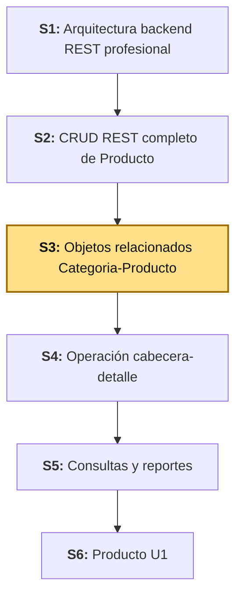
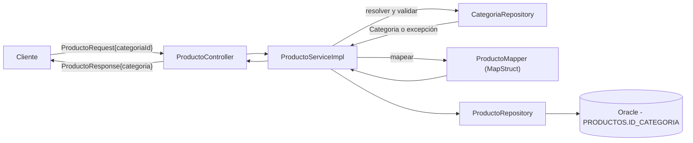
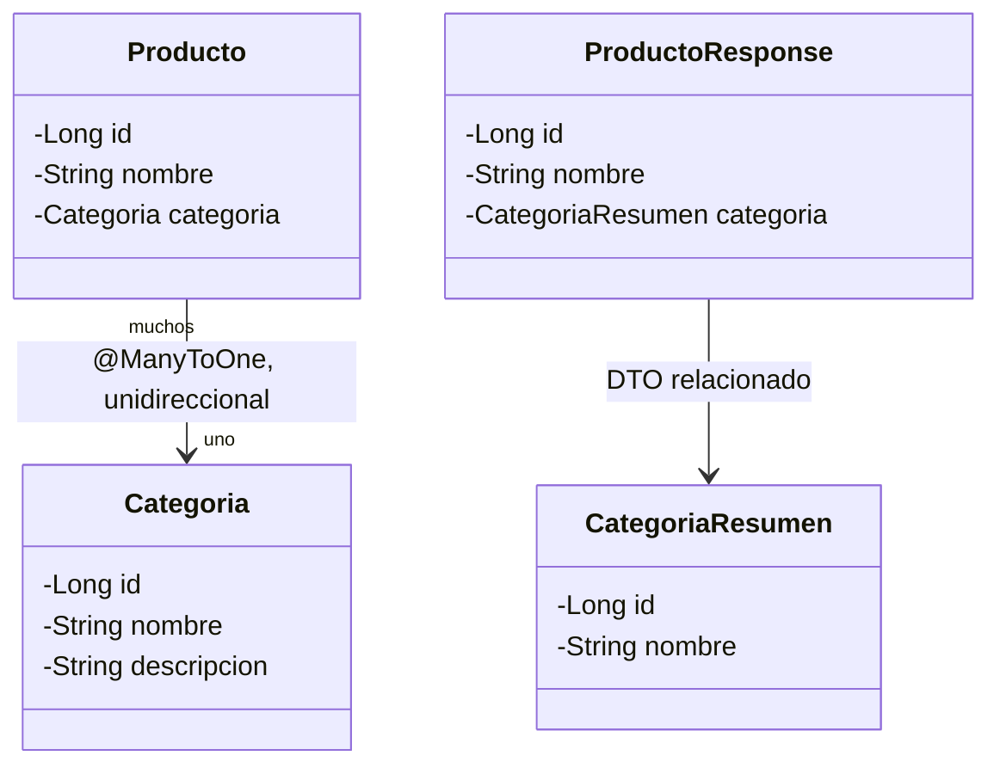
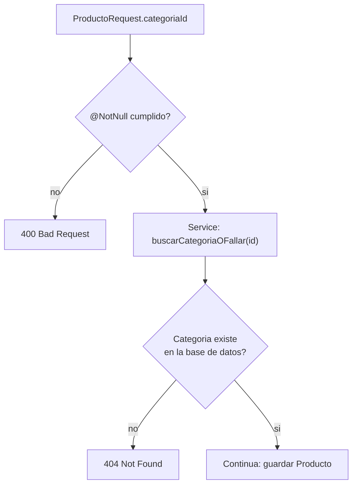
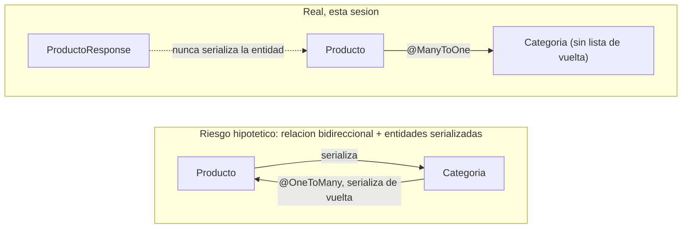
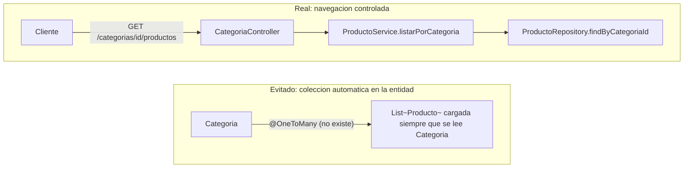
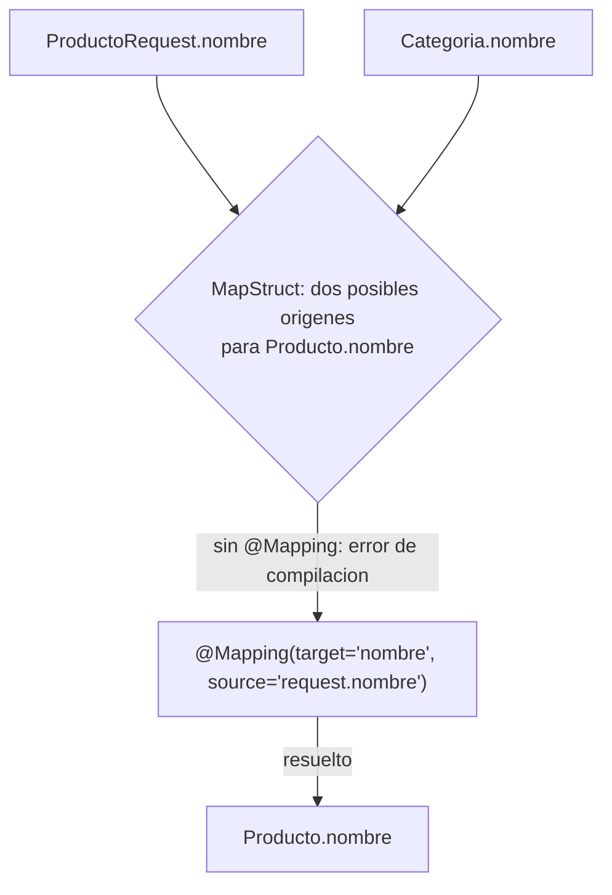
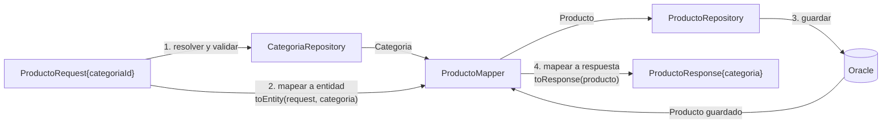

# S3 - Objetos Relacionados Categoria-Producto

*Por: Angel Sullon Macalupu @asullom - 2026*

## 1. Introducción

Tiempo: 20 min.

### 1.1 Presentación de la sesión

Un CRUD REST sobre una sola entidad, aislada, alcanza hasta que el dominio empieza a tener entidades relacionadas entre sí — la mayoría de los recursos reales de un ERP dependen de al menos otro (un producto pertenece a una categoría, una venta a un cliente, y así sucesivamente). Relacionar dos entidades trae preguntas nuevas que un CRUD aislado no enfrenta: cómo modelar la asociación en el ORM, qué forma darle al DTO relacionado que sale por la API, cómo navegar de una entidad a la otra sin cargar todo de una vez, cómo validar que la referencia recibida realmente exista, y cómo evitar que la relación produzca un ciclo infinito al serializar. Esta sesión construye esa asociación sobre `Producto` y `Categoria`, las dos entidades del proyecto que ya están en esa situación.

### 1.2 Índice

1. Asociaciones entre entidades y DTO relacionados.
2. Validación de referencias.
3. Prevención de ciclos de serialización.
4. Navegación controlada y CRUD de la entidad relacionada.

### 1.3 Propósito de aprendizaje

Al concluir la clase, estarás en condiciones de:

- **Modelar y exponer** una asociación muchos a uno entre dos entidades JPA mediante un DTO relacionado, validando referencias inexistentes, evitando ciclos de serialización, y habilitando una navegación controlada entre los dos recursos, completando además el CRUD de la entidad relacionada.

### 1.4 Producto de sesión

API de `Categoria`-`Producto` con asociación ORM (`@ManyToOne`/`@JoinColumn`), `CategoriaResumen` embebido en `ProductoResponse`, validación de `categoriaId`, endpoint de navegación (`GET /api/v1/categorias/{id}/productos`), y CRUD completo de `Categoria` (`GET`, `GET /{id}`, `POST`, `PUT`, `DELETE`).

### 1.5 Metodología

**Tabla 1. Metodología de la sesión**

| Actividades a Realizar en el Periodo | Orientaciones generales (Orientaciones Metodológicas) | Material de estudio recomendado |
|---|---|---|
| Revisión previa individual | Repasar S2 (`Producto` con CRUD completo). Revisar la definición real de `PRODUCTOS` en Oracle — `ID_CATEGORIA` y `FK_PRODUCTO_CATEGORIA` ya existen desde S1, esta sesión recién los usa. Repasar MapStruct (S2, 3.8). | S2, `docs/proyecto-integrador/u1/oracle/S01_02_tablas.sql`. |
| Clase presencial | Construcción guiada de la asociación `Categoria`-`Producto`: entidad, DTO relacionado, mapeo con MapStruct multi-fuente, validación de referencia, navegación controlada y CRUD completo de `Categoria`. Trabajo individual, siguiendo al docente paso a paso. | `pom.xml` (MapStruct ya configurado desde S2), backend ejecutable, cliente REST. |
| Evaluación formativa | Verificación en clase de `POST`/`PUT`/`DELETE` sobre `/api/v1/categorias`, la asociación reflejada en `/api/v1/productos`, el caso `categoriaId` inexistente (`404`), y `GET /api/v1/categorias/{id}/productos`. La evidencia se completa y sustenta de forma individual, fuera del aula, según los criterios mínimos de la sección 4.4. | Indicaciones de entrega (4.3), rúbrica de evaluación (4.6). |

### 1.6 Motivación de la sesión

#### 1.6.1 Caso: relacionar sin exponer de más

Casi cualquier entidad de un dominio real pertenece a otra: un producto pertenece a una categoría, un empleado a un departamento, una factura a un cliente. Modelar esa relación como "muchos a uno" (muchas instancias de una entidad apuntan a una sola instancia de otra) parece trivial hasta que esa relación cruza la frontera de una API REST: hay que decidir qué tanto del dato relacionado exponer en el DTO de salida, qué hacer si el id relacionado que llega en una petición no corresponde a ningún registro real, y cómo evitar que, si la entidad relacionada también necesitara "ver" de vuelta hacia todas sus instancias relacionadas, eso termine en un ciclo infinito al serializar.

Ninguna de estas decisiones depende de si la relación "funciona" a nivel de base de datos — una llave foránea bien definida no las resuelve por sí sola. Son decisiones de diseño de API y de mapeo objeto-relacional, y esta sesión las resuelve una por una.

**Preguntas de análisis**

**Activación de conocimientos previos**

1. ¿Qué significa que una relación sea "muchos a uno"? Da un ejemplo distinto al de esta sesión.

**Comprensión de asociaciones ORM**

1. ¿Por qué el DTO de salida de una entidad no debería incluir la entidad relacionada completa, sino una versión reducida?

### 1.7 Ubicación en el curso

- Unidad: U1 - Base backend REST modular de BomERP.
- Producto del curso: base Full-Stack modular de BomERP.
- Producto de unidad: base backend modular de BomERP, con módulos de Catálogo, Inventario, Ventas y Compras delimitados.
- Avance del producto en esta sesión: `Categoria`-`Producto` asociados mediante ORM, con DTO relacionados, validación de referencias y navegación controlada; `Categoria` con CRUD completo.

Roadmap del producto de la unidad:

**Figura 1. Roadmap del producto de la unidad**



## 2. Explica

Tiempo: 25 min.

### 2.1 Arquitectura de la sesión

**Figura 2. Flujo de una petición que crea un `Producto` asociado a una `Categoria`**



Lectura del diagrama: el service **resuelve** la categoría antes de mapear — el mapper nunca consulta la base de datos, solo transforma objetos que ya recibió resueltos. Esa separación es la misma de S2 (2.4, punto 4): el service es la única capa que valida algo que depende del estado actual del sistema, no de la forma del dato. Esta es la forma general del patrón — el paso a paso exacto de cuántas veces se llama a cada capa se construye en 3.9 (Figura 8), cuando toca escribir el código.

### 2.2 Asociación de entidades y DTO relacionados

**Asociación de entidades (ORM):** cuando dos entidades del dominio están relacionadas en la base de datos mediante una llave foránea, el ORM necesita una anotación que declare esa relación también en el lado Java — sin ella, la columna existe en la tabla pero ninguna consulta JPA la usa. La anotación para el lado "muchos" de una relación uno-a-muchos indica, además, qué columna física guarda la referencia.

**DTO relacionados:** cuando el DTO de salida de una entidad principal necesita mostrar información de su entidad relacionada, hay dos caminos: reutilizar el DTO que ya existe para esa entidad relacionada, o crear uno más chico, pensado solo para lo que se necesita mostrar embebido (por ejemplo, un combo o una etiqueta). El segundo camino no es obligatorio ni es, necesariamente, para ocultar datos sensibles — es una decisión de **desacoplar contratos**: que el DTO de salida de una entidad no cambie de forma solo porque el DTO de la entidad relacionada cambió por una razón que no tiene nada que ver con la primera.

**Ejemplo de referencia (LP2).** `@ManyToOne` declara "muchos `Producto` pueden apuntar a una `Categoria`"; `@JoinColumn(name = "ID_CATEGORIA")` le dice a Hibernate qué columna física de `PRODUCTOS` guarda esa referencia — la misma que ya existe en Oracle desde S1 (1.5). La relación es **unidireccional**: `Producto` conoce a su `Categoria`, pero `Categoria` no mantiene una lista de sus `Producto` como campo de la entidad. Eso no es una limitación, es una decisión — se retoma en 2.4. Del lado del DTO, en vez de reutilizar `CategoriaResponse` (que ya existe, con `id`, `nombre` y `descripcion`), esta sesión introduce `CategoriaResumen` — un `record` con solo `id` y `nombre` —, para que el contrato de `/productos` no dependa de todo lo que `CategoriaResponse` decida mostrar en el futuro. Como `descripcion` no es un dato sensible, la razón no es ocultarlo: es que el contrato de un producto no debería cambiar de forma solo porque el contrato de una categoría cambió por un motivo ajeno a los productos.

**Qué cambia en el código al introducir un DTO relacionado nuevo:**

1. Una clase nueva: `CategoriaResumen` (3.2), sin lógica propia — solo los campos que el cliente necesita ver embebidos.
2. `CategoriaMapper` gana un método nuevo, `toResumen(Categoria): CategoriaResumen` (3.3) — el mismo mapper que ya genera `toResponse`, una conversión más.
3. El campo `categoria` de `ProductoResponse` pasa a tener el tipo `CategoriaResumen`, no `CategoriaResponse` (3.7).
4. `ProductoMapper` no escribe esa conversión a mano: al declarar `uses = CategoriaMapper.class` (3.8), MapStruct encuentra `toResumen` automáticamente y lo usa para resolver `Producto.categoria` → `ProductoResponse.categoria`.
5. Nada cambia en la entidad `Categoria` ni en `CategoriaController`: el DTO relacionado es un asunto exclusivo de cómo `Producto` expone su categoría, no de cómo `Categoria` se expone a sí misma.

Esta cadena — DTO nuevo, mapper con un método más, mapper compuesto vía `uses` — se repite cada vez que una entidad necesita mostrar una versión reducida de otra; se construye paso a paso en 3.2, 3.3, 3.7 y 3.8.

**Figura 3. Asociación de entidades (ORM) vs. asociación de DTO**



Las dos flechas de la Figura 3 no son la misma relación vista dos veces: la de arriba (`Producto` → `Categoria`) es la asociación ORM, mapeada a `ID_CATEGORIA`; la de abajo (`ProductoResponse` → `CategoriaResumen`) es una asociación distinta, entre DTO, que existe solo para la API — `CategoriaResumen` ni siquiera tiene `descripcion`, aunque `Categoria` sí.

### 2.3 Validación de referencias

Que un campo llegue con un valor (`@NotNull`) no significa que ese valor corresponda a un registro real — validar que el id recibido exista en la base es responsabilidad de la capa de servicio, no de Bean Validation, que solo valida la forma del dato, nunca su existencia.

**Ejemplo de referencia (LP2).** `ProductoRequest` declara `categoriaId` con `@NotNull` — eso solo garantiza que el campo no llegue vacío, no que el id corresponda a una `Categoria` real. Esa segunda verificación es responsabilidad del service (mismo criterio de S2, 2.3, punto 4): antes de guardar o actualizar un `Producto`, `ProductoServiceImpl` busca la `Categoria` por id y lanza `ResourceNotFoundException` (ya creada en S2, 3.2.1) si no existe — el mismo manejador global responde `404`, sin código nuevo en `GlobalExceptionHandler`.

Esta búsqueda no es solo para tener el objeto `Categoria` que pide `@ManyToOne` — es lo que evita que un `categoriaId` inválido llegue a violar `FK_PRODUCTO_CATEGORIA` directamente en el `INSERT`. Si esa validación no existiera, Oracle igual rechazaría el dato (la restricción sigue ahí), pero el error llegaría como `DataIntegrityViolationException` sin traducir — exactamente el mismo hueco que `DELETE /api/v1/categorias/{id}` sí deja sin resolver hoy (3.4, "Error frecuente"). `crear`/`actualizar` responden `404` limpio; `eliminar` responde `500` crudo — la diferencia es solo esta validación explícita, no la restricción de la base de datos, que en ambos casos es la misma.

**Figura 4. Validación de referencias, paso a paso**



`@NotNull` (Bean Validation) solo corta el camino si el campo llega vacío — nunca llega a preguntarle nada a la base de datos. La pregunta "¿existe de verdad?" es la segunda mitad del diagrama, y es exclusivamente responsabilidad del service.

### 2.4 Prevención de ciclos de serialización

Un problema clásico de JPA: si una entidad relacionada mantiene una colección de vuelta hacia la entidad principal (una relación bidireccional), y ambas se serializan directamente a JSON, cada instancia intentaría serializar su relación, que intentaría serializar su colección de vuelta, indefinidamente — un `StackOverflowError`. El riesgo se evita con dos decisiones tomadas antes de que el problema pueda aparecer: mantener la relación unidireccional (sin una colección de vuelta en la entidad relacionada) y no serializar entidades directamente, siempre a través de un DTO construido campo por campo.

**Ejemplo de referencia (LP2).** Esta sesión nunca llega a ese problema, por esas mismas dos decisiones:

1. **La relación es unidireccional** (2.2): `Categoria` no tiene un campo `List<Producto>`, así que no hay ciclo posible en el modelo de entidades.
2. **Ninguna entidad se serializa directamente**: el patrón Controller-Service-Mapper-DTO (S2, 2.1) ya garantiza que Jackson nunca ve una `Producto` ni una `Categoria` — siempre ve un `ProductoResponse`/`CategoriaResponse`, construidos a mano (o por MapStruct) campo por campo.

**Error frecuente**: agregar `@OneToMany` en `Categoria` "por si se necesita después" es exactamente el tipo de anticipación que este curso evita (ver `CLAUDE.md`, "no adelantar alcance") — y además reintroduce el riesgo de ciclo que esta sesión evitó a propósito. Si una sesión futura necesita navegar de `Categoria` a sus `Producto`, la forma correcta es una consulta explícita (2.5), no una colección cargada automáticamente en la entidad.

**Figura 5. El ciclo evitado, y las dos decisiones que lo evitan**



El bloque "Riesgo" no es código de esta sesión — es lo que pasaría si se agregara `@OneToMany` en `Categoria` (el error frecuente de arriba): las dos flechas entre `Producto` y `Categoria` se retroalimentan sin fin. El bloque "Real" muestra por qué eso nunca ocurre aquí: la relación va en un solo sentido, y lo que se serializa nunca es la entidad, siempre el DTO.

### 2.5 Navegación controlada y CRUD completo de `Categoria`

**Navegación controlada** significa: para ir de una entidad a las instancias de otra que la referencian, se expone una consulta explícita bajo demanda (un endpoint dedicado), nunca una colección que el ORM carga automáticamente cada vez que se lee la entidad principal — eso sería costoso si esa lista rara vez se necesita, y reintroduce el riesgo de ciclo evitado en 2.4.

**Ejemplo de referencia (LP2).** `GET /api/v1/categorias/{id}/productos` es esa consulta explícita — no una colección cargada dentro de la entidad `Categoria`. De paso, `Categoria` completa en esta sesión el mismo patrón CRUD que S2 aplicó a `Producto`: `CategoriaRequest` (entrada validada), `CategoriaResponse` (salida, ahora clase con `@Builder` en vez de `record` — mismo motivo que S2 documentó para `Producto`, 2.2), y `CategoriaMapper`.

**Figura 6. Navegación controlada: consulta explícita, no colección automática**



El bloque "Evitado" es la alternativa que 2.4 ya descartó por el riesgo de ciclo; acá se ve además su otro costo: cargaría la lista de productos **cada vez** que alguien lee una categoría, aunque nadie la necesite. El bloque "Real" solo consulta bajo demanda, cuando el cliente pide explícitamente ese endpoint — y pasa por `ProductoService`, no por su repositorio directo, aunque lo invoque `CategoriaController` (3.5).

## 3. Aplica: actividad práctica guiada

Tiempo: 2h.

**Actividad:** construcción guiada de la asociación `Categoria`-`Producto` y el CRUD completo de `Categoria` (Producto de la sesión en 1.4).

**Propósito de la actividad:** asociar `Producto` a `Categoria` mediante ORM, con DTO relacionado, validación de referencia y navegación controlada — completando de paso el CRUD de `Categoria` — verificando cada incremento antes de continuar al siguiente.

**Orientaciones metodológicas:** en el laboratorio, el docente construye la asociación paso a paso frente a la clase, ejecutando cada prueba antes de avanzar; los estudiantes replican cada paso en su propio equipo.

**Actividades para realizar:**

- **3.1** Verificar el punto de partida.
- **3.2** Completar los DTO de `Categoria`.
- **3.3** Automatizar el mapeo de `Categoria`.
- **3.4** Habilitar la lógica de negocio de `Categoria`.
- **3.5** Exponer el CRUD de `Categoria` como API REST.
- **3.6** Asociar `Producto` con `Categoria` mediante el ORM.
- **3.7** Adaptar los DTO de `Producto` a la asociación.
- **3.8** Resolver el mapeo de la asociación con MapStruct.
- **3.9** Validar la referencia y habilitar la navegación controlada.
- **3.10** Verificar la asociación completa, de punta a punta.
- **3.11** Cubrir la asociación con pruebas automatizadas.
- **3.12** Relacionar con ADS y BD2.

### 3.1 Verificar el punto de partida

**Punto de partida común:** clona la rama de cierre de S2:

```bash
git clone --branch s02-crud-producto https://github.com/262ciclo4/bomerp.git
```

**Producto del paso:** confirmación de que `Producto` tiene CRUD completo (S2) y de que `Categoria` solo lista (`GET`).

**Requisito antes de continuar:** confirma que `http://localhost:8080/api/v1/productos` y `http://localhost:8080/api/v1/categorias` responden antes de tocar código nuevo.

### 3.2 Completar los DTO de `Categoria`

**Producto del paso:** `CategoriaRequest`, `CategoriaResumen`, y `CategoriaResponse` migrado de `record` a clase.

**`catalogo/categoria/dto/CategoriaRequest.java`**

```java
package pe.edu.upeu.bomerp.catalogo.categoria.dto;

import jakarta.validation.constraints.NotBlank;
import jakarta.validation.constraints.Size;
import lombok.Getter;
import lombok.Setter;

@Getter
@Setter
public class CategoriaRequest {

    @NotBlank
    @Size(max = 80)
    private String nombre;

    @Size(max = 200)
    private String descripcion;
}
```

**`catalogo/categoria/dto/CategoriaResponse.java`** (reemplaza el `record` de S1):

```java
package pe.edu.upeu.bomerp.catalogo.categoria.dto;

import lombok.AllArgsConstructor;
import lombok.Builder;
import lombok.Getter;
import lombok.NoArgsConstructor;
import lombok.Setter;

@Getter
@Setter
@Builder
@NoArgsConstructor
@AllArgsConstructor
public class CategoriaResponse {
    private Long id;
    private String nombre;
    private String descripcion;
}
```

**`catalogo/categoria/dto/CategoriaResumen.java`** (nuevo — el DTO relacionado de 2.2, sin `descripcion`):

```java
package pe.edu.upeu.bomerp.catalogo.categoria.dto;

public record CategoriaResumen(Long id, String nombre) {
}
```

`CategoriaResumen` sigue siendo `record`: es un dato de salida simple, sin necesidad de `@Builder` ni mutabilidad — el mismo criterio que ya usaste en S1 para los DTO de solo lectura.

### 3.3 Automatizar el mapeo de `Categoria`

**Producto del paso:** mapper de `Categoria`, con MapStruct — el mismo camino que S2 (3.8, opcional) terminó adoptando de verdad para `ProductoMapper`, no la versión manual.

**`catalogo/categoria/mapper/CategoriaMapper.java`**

```java
package pe.edu.upeu.bomerp.catalogo.categoria.mapper;

import org.mapstruct.Mapper;
import pe.edu.upeu.bomerp.catalogo.categoria.dto.CategoriaRequest;
import pe.edu.upeu.bomerp.catalogo.categoria.dto.CategoriaResponse;
import pe.edu.upeu.bomerp.catalogo.categoria.dto.CategoriaResumen;
import pe.edu.upeu.bomerp.catalogo.categoria.entity.Categoria;

@Mapper(componentModel = "spring")
public interface CategoriaMapper {
    Categoria toEntity(CategoriaRequest request);
    CategoriaResponse toResponse(Categoria categoria);
    CategoriaResumen toResumen(Categoria categoria);
}
```

Como `Categoria`, `CategoriaRequest`/`CategoriaResponse` y `CategoriaResumen` comparten los nombres `nombre`/`descripcion` (donde aplica), MapStruct genera las tres implementaciones sin ninguna anotación `@Mapping` adicional — exactamente el mismo caso que S2 (3.8) describió para `ProductoMapper`.

### 3.4 Habilitar la lógica de negocio de `Categoria`

**Producto del paso:** las cuatro operaciones CRUD, con el mismo patrón `buscarOFallar` de S2.

**`catalogo/categoria/service/CategoriaService.java`**

```java
package pe.edu.upeu.bomerp.catalogo.categoria.service;

import pe.edu.upeu.bomerp.catalogo.categoria.dto.CategoriaRequest;
import pe.edu.upeu.bomerp.catalogo.categoria.dto.CategoriaResponse;
import java.util.List;

public interface CategoriaService {
    List<CategoriaResponse> listar();
    CategoriaResponse obtener(Long id);
    CategoriaResponse crear(CategoriaRequest request);
    CategoriaResponse actualizar(Long id, CategoriaRequest request);
    void eliminar(Long id);
}
```

**`catalogo/categoria/service/CategoriaServiceImpl.java`**

```java
package pe.edu.upeu.bomerp.catalogo.categoria.service;

import lombok.RequiredArgsConstructor;
import org.springframework.stereotype.Service;
import org.springframework.transaction.annotation.Transactional;
import pe.edu.upeu.bomerp.catalogo.categoria.dto.CategoriaRequest;
import pe.edu.upeu.bomerp.catalogo.categoria.dto.CategoriaResponse;
import pe.edu.upeu.bomerp.catalogo.categoria.entity.Categoria;
import pe.edu.upeu.bomerp.catalogo.categoria.mapper.CategoriaMapper;
import pe.edu.upeu.bomerp.catalogo.categoria.repository.CategoriaRepository;
import pe.edu.upeu.bomerp.exception.ResourceNotFoundException;
import java.util.List;

@Service
@RequiredArgsConstructor
public class CategoriaServiceImpl implements CategoriaService {
    private final CategoriaRepository categoriaRepository;
    private final CategoriaMapper categoriaMapper;

    @Override
    @Transactional(readOnly = true)
    public List<CategoriaResponse> listar() {
        return categoriaRepository.findAll().stream().map(categoriaMapper::toResponse).toList();
    }

    @Override
    @Transactional(readOnly = true)
    public CategoriaResponse obtener(Long id) {
        return categoriaMapper.toResponse(buscarOFallar(id));
    }

    @Override
    public CategoriaResponse crear(CategoriaRequest request) {
        Categoria categoria = categoriaMapper.toEntity(request);
        return categoriaMapper.toResponse(categoriaRepository.save(categoria));
    }

    @Override
    public CategoriaResponse actualizar(Long id, CategoriaRequest request) {
        Categoria categoria = buscarOFallar(id);
        categoria.setNombre(request.getNombre());
        categoria.setDescripcion(request.getDescripcion());
        return categoriaMapper.toResponse(categoriaRepository.save(categoria));
    }

    @Override
    public void eliminar(Long id) {
        categoriaRepository.delete(buscarOFallar(id));
    }

    private Categoria buscarOFallar(Long id) {
        return categoriaRepository.findById(id)
                .orElseThrow(() -> new ResourceNotFoundException("Categoria no encontrada: " + id));
    }
}
```

**Error frecuente (para probar, no para corregir en esta sesión):** si intentas `DELETE /api/v1/categorias/{id}` sobre una categoría que ya tiene productos asociados, Oracle rechaza el borrado por `FK_PRODUCTO_CATEGORIA` (`ORA-02292: integrity constraint violated - child record found`) — y `GlobalExceptionHandler` **todavía no maneja** `DataIntegrityViolationException` (S2, 2.3, ya lo dejó anotado como hallazgo pendiente). El cliente recibe un `500` genérico en vez de un `409`/`400` claro. Repórtalo como el "error o hallazgo" de tu evidencia (4.3.1) si te toca reproducirlo.

Nota la asimetría con `crear`/`actualizar` (2.3, 3.9): ahí `buscarCategoriaOFallar` valida **antes** de llegar a la base de datos y responde `404` limpio; acá nadie valida antes del `DELETE`, así que el mismo tipo de restricción (`FK_PRODUCTO_CATEGORIA`) produce un error crudo en un caso y uno controlado en el otro. No es que la FK proteja distinto — es que solo un lado tiene la validación explícita en el service.

### 3.5 Exponer el CRUD de `Categoria` como API REST

**Producto del paso:** los seis endpoints — el CRUD completo más la navegación controlada.

**`catalogo/categoria/controller/CategoriaController.java`**

```java
package pe.edu.upeu.bomerp.catalogo.categoria.controller;

import io.swagger.v3.oas.annotations.Operation;
import io.swagger.v3.oas.annotations.tags.Tag;
import jakarta.validation.Valid;
import lombok.RequiredArgsConstructor;
import org.springframework.http.HttpStatus;
import org.springframework.http.ResponseEntity;
import org.springframework.web.bind.annotation.*;
import pe.edu.upeu.bomerp.catalogo.categoria.dto.CategoriaRequest;
import pe.edu.upeu.bomerp.catalogo.categoria.dto.CategoriaResponse;
import pe.edu.upeu.bomerp.catalogo.categoria.service.CategoriaService;
import pe.edu.upeu.bomerp.catalogo.producto.dto.ProductoResponse;
import pe.edu.upeu.bomerp.catalogo.producto.service.ProductoService;
import java.util.List;

@Tag(name = "Categorías")
@RestController
@RequestMapping("/api/v1/categorias")
@RequiredArgsConstructor
public class CategoriaController {
    private final CategoriaService categoriaService;
    private final ProductoService productoService;

    @Operation(summary = "Lista las categorías registradas")
    @GetMapping
    public ResponseEntity<List<CategoriaResponse>> listar() {
        return ResponseEntity.ok(categoriaService.listar());
    }

    @Operation(summary = "Consulta una categoría por id")
    @GetMapping("/{id}")
    public ResponseEntity<CategoriaResponse> obtener(@PathVariable Long id) {
        return ResponseEntity.ok(categoriaService.obtener(id));
    }

    @Operation(summary = "Registra una categoría nueva")
    @PostMapping
    @ResponseStatus(HttpStatus.CREATED)
    public CategoriaResponse crear(@Valid @RequestBody CategoriaRequest request) {
        return categoriaService.crear(request);
    }

    @Operation(summary = "Actualiza una categoría existente")
    @PutMapping("/{id}")
    public ResponseEntity<CategoriaResponse> actualizar(@PathVariable Long id, @Valid @RequestBody CategoriaRequest request) {
        return ResponseEntity.ok(categoriaService.actualizar(id, request));
    }

    @Operation(summary = "Elimina una categoría")
    @DeleteMapping("/{id}")
    @ResponseStatus(HttpStatus.NO_CONTENT)
    public void eliminar(@PathVariable Long id) {
        categoriaService.eliminar(id);
    }

    @Operation(summary = "Lista los productos de una categoría")
    @GetMapping("/{id}/productos")
    public ResponseEntity<List<ProductoResponse>> listarProductos(@PathVariable Long id) {
        return ResponseEntity.ok(productoService.listarPorCategoria(id));
    }
}
```

`listarProductos` delega en `ProductoService`, no en `ProductoRepository` — `CategoriaController` nunca toca un repositorio ajeno directamente, el mismo principio que Spring Modulith verifica entre módulos (`ModularityTests`), aplicado aquí también entre paquetes de una misma entidad.

### 3.6 Asociar `Producto` con `Categoria` mediante el ORM

**Producto del paso:** `Producto.categoria`, mapeada a la columna `ID_CATEGORIA` que ya existe en Oracle desde S1 (1.5).

Agrega a `catalogo/producto/entity/Producto.java`:

```java
@ManyToOne(fetch = FetchType.LAZY)
@JoinColumn(name = "ID_CATEGORIA", nullable = false)
private Categoria categoria;
```

`fetch = FetchType.LAZY` evita que cada consulta de `Producto` traiga también su `Categoria` si nadie la va a usar — se carga recién cuando algo llama a `producto.getCategoria()` (por ejemplo, dentro del mapper, en 3.8).

### 3.7 Adaptar los DTO de `Producto` a la asociación

**Producto del paso:** `ProductoRequest` con `categoriaId`, `ProductoResponse` con `CategoriaResumen`.

Agrega a `ProductoRequest`:

```java
@NotNull
private Long categoriaId;
```

Agrega a `ProductoResponse`:

```java
private CategoriaResumen categoria;
```

(el import es `pe.edu.upeu.bomerp.catalogo.categoria.dto.CategoriaResumen`).

### 3.8 Resolver el mapeo de la asociación con MapStruct

**Producto del paso:** `ProductoMapper` recibe la `Categoria` ya resuelta como segundo parámetro, y compone con `CategoriaMapper` para el DTO relacionado.

```java
package pe.edu.upeu.bomerp.catalogo.producto.mapper;

import org.mapstruct.Mapper;
import org.mapstruct.Mapping;
import pe.edu.upeu.bomerp.catalogo.categoria.entity.Categoria;
import pe.edu.upeu.bomerp.catalogo.categoria.mapper.CategoriaMapper;
import pe.edu.upeu.bomerp.catalogo.producto.dto.ProductoRequest;
import pe.edu.upeu.bomerp.catalogo.producto.dto.ProductoResponse;
import pe.edu.upeu.bomerp.catalogo.producto.entity.Producto;

@Mapper(componentModel = "spring", uses = CategoriaMapper.class)
public interface ProductoMapper {

    @Mapping(target = "nombre", source = "request.nombre")
    @Mapping(target = "precio", source = "request.precio")
    @Mapping(target = "stock", source = "request.stock")
    @Mapping(target = "categoria", source = "categoria")
    Producto toEntity(ProductoRequest request, Categoria categoria);

    ProductoResponse toResponse(Producto producto);
}
```

`uses = CategoriaMapper.class` es la pieza nueva: cuando MapStruct necesita convertir el `Categoria` de `Producto.categoria` al `CategoriaResumen` de `ProductoResponse.categoria` (en `toResponse`), busca un método compatible entre los mappers declarados en `uses` — encuentra `CategoriaMapper.toResumen(Categoria): CategoriaResumen` y lo usa automáticamente, sin que escribas una sola línea para esa conversión. Así es como MapStruct resuelve "DTO relacionados" (2.2) en la práctica.

**Error frecuente real:** al escribir `toEntity(ProductoRequest request, Categoria categoria)` con dos parámetros, la primera compilación falla:

```text
[ERROR] .../ProductoMapper.java:[15,14] Several possible source properties for target property "nombre".
```

`ProductoRequest` y `Categoria` **ambos** tienen un campo `nombre` — MapStruct no puede adivinar de cuál de los dos parámetros viene el `nombre` de `Producto`. Con un solo parámetro fuente (como en S2) esto nunca pasa, porque no hay ambigüedad posible. La solución es la de arriba: `@Mapping(target = "nombre", source = "request.nombre")` desambigua explícitamente, calificando el origen con el nombre del parámetro (`request.nombre`, no solo `nombre`). Lo mismo aplica a `precio`/`stock`, aunque `Categoria` no tenga esos campos — una vez que declaras el mapper con más de un parámetro, MapStruct exige que **todos** los campos ambiguos (o potencialmente ambiguos) se resuelvan de forma explícita.

**Figura 7. Por qué `nombre` es ambiguo, y cómo se resuelve**



La ambigüedad no es un error de MapStruct — es correcto que se detenga: con dos parámetros fuente y un campo `nombre` en ambos, no hay forma automática de saber cuál querías. `@Mapping` es la respuesta explícita a esa pregunta, campo por campo.

### 3.9 Validar la referencia y habilitar la navegación controlada

**Producto del paso:** `ProductoServiceImpl` resuelve y valida `categoriaId` antes de guardar; `listarPorCategoria` para la navegación de 3.5.

**Figura 8. `ProductoServiceImpl.crear()`, paso a paso — lo que el código de abajo implementa**



Esta es la versión exacta de la Figura 2 (2.1) — cuatro pasos, no dos, porque el mapper se usa dos veces: el paso 2 arma la entidad antes de guardar; el paso 4, después de guardar, arma la respuesta — y es ahí, en el paso 4, donde `CategoriaMapper.toResumen()` se compone automáticamente (vía `uses`, 3.8) para embeber el `CategoriaResumen`. El código de abajo implementa exactamente estos cuatro pasos, en este orden.

```java
package pe.edu.upeu.bomerp.catalogo.producto.service;

import lombok.RequiredArgsConstructor;
import org.springframework.stereotype.Service;
import org.springframework.transaction.annotation.Transactional;
import pe.edu.upeu.bomerp.catalogo.categoria.entity.Categoria;
import pe.edu.upeu.bomerp.catalogo.categoria.repository.CategoriaRepository;
import pe.edu.upeu.bomerp.catalogo.producto.dto.ProductoRequest;
import pe.edu.upeu.bomerp.catalogo.producto.dto.ProductoResponse;
import pe.edu.upeu.bomerp.catalogo.producto.entity.Producto;
import pe.edu.upeu.bomerp.catalogo.producto.mapper.ProductoMapper;
import pe.edu.upeu.bomerp.catalogo.producto.repository.ProductoRepository;
import pe.edu.upeu.bomerp.exception.ResourceNotFoundException;
import java.util.List;

@Service
@RequiredArgsConstructor
public class ProductoServiceImpl implements ProductoService {
    private final ProductoRepository productoRepository;
    private final CategoriaRepository categoriaRepository;
    private final ProductoMapper productoMapper;

    @Override
    @Transactional(readOnly = true)
    public List<ProductoResponse> listar() {
        return productoRepository.findAll().stream().map(productoMapper::toResponse).toList();
    }

    @Override
    @Transactional(readOnly = true)
    public ProductoResponse obtener(Long id) {
        return productoMapper.toResponse(buscarOFallar(id));
    }

    @Override
    public ProductoResponse crear(ProductoRequest request) {
        Categoria categoria = buscarCategoriaOFallar(request.getCategoriaId());
        Producto producto = productoMapper.toEntity(request, categoria);
        return productoMapper.toResponse(productoRepository.save(producto));
    }

    @Override
    public ProductoResponse actualizar(Long id, ProductoRequest request) {
        Producto producto = buscarOFallar(id);
        Categoria categoria = buscarCategoriaOFallar(request.getCategoriaId());
        producto.setNombre(request.getNombre());
        producto.setPrecio(request.getPrecio());
        producto.setStock(request.getStock());
        producto.setCategoria(categoria);
        return productoMapper.toResponse(productoRepository.save(producto));
    }

    @Override
    public void eliminar(Long id) {
        productoRepository.delete(buscarOFallar(id));
    }

    @Override
    @Transactional(readOnly = true)
    public List<ProductoResponse> listarPorCategoria(Long categoriaId) {
        buscarCategoriaOFallar(categoriaId);
        return productoRepository.findByCategoriaId(categoriaId).stream().map(productoMapper::toResponse).toList();
    }

    private Producto buscarOFallar(Long id) {
        return productoRepository.findById(id)
                .orElseThrow(() -> new ResourceNotFoundException("Producto no encontrado: " + id));
    }

    private Categoria buscarCategoriaOFallar(Long categoriaId) {
        return categoriaRepository.findById(categoriaId)
                .orElseThrow(() -> new ResourceNotFoundException("Categoria no encontrada: " + categoriaId));
    }
}
```

`listarPorCategoria` valida la categoría **antes** de consultar sus productos — así, pedir los productos de una categoría inexistente responde `404`, no una lista vacía que confundiría "categoría sin productos" con "categoría que no existe".

Agrega a `ProductoRepository`:

```java
List<Producto> findByCategoriaId(Long categoriaId);
```

Y a `ProductoService` (interfaz):

```java
List<ProductoResponse> listarPorCategoria(Long categoriaId);
```

### 3.10 Verificar la asociación completa, de punta a punta

**Producto del paso:** evidencia de la asociación funcionando end-to-end.

PowerShell:

```powershell
# Crear categoria (201) - anota el id devuelto
Invoke-RestMethod -Method Post -Uri "http://localhost:8080/api/v1/categorias" -ContentType "application/json" -Body '{"nombre":"Electrodomesticos","descripcion":"Linea blanca y pequenos electrodomesticos"}'

# Crear producto asociado a esa categoria (201) - reemplaza {categoriaId}
Invoke-RestMethod -Method Post -Uri "http://localhost:8080/api/v1/productos" -ContentType "application/json" -Body '{"nombre":"Licuadora","precio":150.00,"stock":10,"categoriaId":{categoriaId}}'

# Listar productos de esa categoria (200)
Invoke-RestMethod -Method Get -Uri "http://localhost:8080/api/v1/categorias/{categoriaId}/productos"

# Caso invalido: categoriaId inexistente (404)
Invoke-RestMethod -Method Post -Uri "http://localhost:8080/api/v1/productos" -ContentType "application/json" -Body '{"nombre":"Licuadora","precio":150.00,"stock":10,"categoriaId":999999}'
```

bash macOS/Linux:

```bash
# Crear categoria (201) - anota el id devuelto
curl -i -X POST http://localhost:8080/api/v1/categorias -H "Content-Type: application/json" -d '{"nombre":"Electrodomesticos","descripcion":"Linea blanca y pequenos electrodomesticos"}'

# Crear producto asociado a esa categoria (201) - reemplaza {categoriaId}
curl -i -X POST http://localhost:8080/api/v1/productos -H "Content-Type: application/json" -d '{"nombre":"Licuadora","precio":150.00,"stock":10,"categoriaId":{categoriaId}}'

# Listar productos de esa categoria (200)
curl -i http://localhost:8080/api/v1/categorias/{categoriaId}/productos

# Caso invalido: categoriaId inexistente (404)
curl -i -X POST http://localhost:8080/api/v1/productos -H "Content-Type: application/json" -d '{"nombre":"Licuadora","precio":150.00,"stock":10,"categoriaId":999999}'
```

**Tabla 2. Verificación de la asociación antes de continuar**

| Caso | Método | Resultado esperado |
|---|---|---|
| Crear categoría válida | `POST /api/v1/categorias` | `201 Created` |
| Crear producto con `categoriaId` válido | `POST /api/v1/productos` | `201 Created`, cuerpo con `categoria.nombre` |
| Listar productos de una categoría | `GET /api/v1/categorias/{id}/productos` | `200 OK`, lista con el producto creado |
| `categoriaId` inexistente en `POST`/`PUT` de producto | cualquiera | `404`, cuerpo con `error: "Not Found"` |
| Categoría inexistente en `GET .../productos` | `GET` | `404` (no una lista vacía) |
| Eliminar categoría con productos asociados | `DELETE /api/v1/categorias/{id}` | `500` (hallazgo conocido, 3.4) |

### 3.11 Cubrir la asociación con pruebas automatizadas

**Producto del paso:** `CategoriaControllerTest`, y `ProductoControllerTest` (S2) actualizado — `ProductoRequest` ahora exige `categoriaId`, así que el caso "datos válidos" de S2 necesita incluirlo o pasa a fallar con `400`.

Actualiza el `crear_conDatosValidos_respondeCreated` de S2 (`ProductoControllerTest`) agregando `request.setCategoriaId(1L);` antes de enviarlo, y agrega un caso nuevo para el campo que esta sesión introduce:

```java
@Test
void crear_conCategoriaIdNulo_respondeBadRequestSinLlegarAlService() throws Exception {
    ProductoRequest request = new ProductoRequest();
    request.setNombre("Teclado mecánico");
    request.setPrecio(new BigDecimal("180.50"));
    request.setStock(25);
    // sin categoriaId

    mockMvc.perform(post("/api/v1/productos")
                    .contentType(MediaType.APPLICATION_JSON)
                    .content(objectMapper.writeValueAsString(request)))
            .andExpect(status().isBadRequest());
}
```

**`src/test/java/pe/edu/upeu/bomerp/catalogo/categoria/controller/CategoriaControllerTest.java`** (mismo patrón que `ProductoControllerTest` de S2, más los dos casos de navegación):

```java
package pe.edu.upeu.bomerp.catalogo.categoria.controller;

import org.junit.jupiter.api.Test;
import org.springframework.beans.factory.annotation.Autowired;
import org.springframework.boot.webmvc.test.autoconfigure.WebMvcTest;
import org.springframework.http.MediaType;
import org.springframework.test.context.bean.override.mockito.MockitoBean;
import org.springframework.test.web.servlet.MockMvc;
import pe.edu.upeu.bomerp.catalogo.categoria.dto.CategoriaRequest;
import pe.edu.upeu.bomerp.catalogo.categoria.dto.CategoriaResponse;
import pe.edu.upeu.bomerp.catalogo.categoria.service.CategoriaService;
import pe.edu.upeu.bomerp.catalogo.producto.dto.ProductoResponse;
import pe.edu.upeu.bomerp.catalogo.producto.service.ProductoService;
import pe.edu.upeu.bomerp.exception.ResourceNotFoundException;
import tools.jackson.databind.ObjectMapper;

import java.math.BigDecimal;
import java.util.List;

import static org.mockito.ArgumentMatchers.any;
import static org.mockito.Mockito.when;
import static org.springframework.test.web.servlet.request.MockMvcRequestBuilders.*;
import static org.springframework.test.web.servlet.result.MockMvcResultMatchers.*;

@WebMvcTest(CategoriaController.class)
class CategoriaControllerTest {

    @Autowired
    private MockMvc mockMvc;

    @Autowired
    private ObjectMapper objectMapper;

    @MockitoBean
    private CategoriaService categoriaService;

    @MockitoBean
    private ProductoService productoService;

    @Test
    void crear_conDatosValidos_respondeCreated() throws Exception {
        CategoriaRequest request = new CategoriaRequest();
        request.setNombre("Electrodomesticos");
        request.setDescripcion("Linea blanca y pequenos electrodomesticos");

        when(categoriaService.crear(any())).thenReturn(
                CategoriaResponse.builder().id(1L).nombre("Electrodomesticos").descripcion("Linea blanca y pequenos electrodomesticos").build()
        );

        mockMvc.perform(post("/api/v1/categorias")
                        .contentType(MediaType.APPLICATION_JSON)
                        .content(objectMapper.writeValueAsString(request)))
                .andExpect(status().isCreated())
                .andExpect(jsonPath("$.id").value(1));
    }

    @Test
    void crear_conNombreVacio_respondeBadRequest() throws Exception {
        CategoriaRequest request = new CategoriaRequest();
        request.setNombre("");

        mockMvc.perform(post("/api/v1/categorias")
                        .contentType(MediaType.APPLICATION_JSON)
                        .content(objectMapper.writeValueAsString(request)))
                .andExpect(status().isBadRequest());
    }

    @Test
    void obtener_conIdInexistente_respondeNotFound() throws Exception {
        when(categoriaService.obtener(999L)).thenThrow(new ResourceNotFoundException("Categoria no encontrada: 999"));

        mockMvc.perform(get("/api/v1/categorias/999"))
                .andExpect(status().isNotFound());
    }

    @Test
    void listarProductos_conCategoriaExistente_respondeOkConSusProductos() throws Exception {
        when(productoService.listarPorCategoria(1L)).thenReturn(List.of(
                ProductoResponse.builder().id(10L).nombre("Teclado mecánico").precio(new BigDecimal("180.50")).stock(25).build()
        ));

        mockMvc.perform(get("/api/v1/categorias/1/productos"))
                .andExpect(status().isOk())
                .andExpect(jsonPath("$[0].id").value(10));
    }

    @Test
    void listarProductos_conCategoriaInexistente_respondeNotFound() throws Exception {
        when(productoService.listarPorCategoria(999L)).thenThrow(new ResourceNotFoundException("Categoria no encontrada: 999"));

        mockMvc.perform(get("/api/v1/categorias/999/productos"))
                .andExpect(status().isNotFound());
    }
}
```

Ejecuta las pruebas:

```powershell
.\mvnw.cmd test
```

```bash
./mvnw test
```

Deberías ver `ModularityTests`, `ProductoControllerTest` y `CategoriaControllerTest` en verde — `ModularityTests` sigue pasando porque `categoria` y `producto` son paquetes dentro del mismo módulo `catalogo`, no módulos distintos; la regla que Spring Modulith verifica es entre módulos de negocio (`catalogo` vs. `ventas`, por ejemplo), no dentro de uno.

### 3.12 Relacionar con ADS y BD2

**Producto del paso:** matriz de integración actualizada.

**Tabla 3. Matriz de integración LP2-ADS-BD2 (S3)**

| Endpoint LP2 | Componente ADS | Objeto BD2 |
|---|---|---|
| `POST /api/v1/productos` (con `categoriaId`) | Asociación entre entidades del modelo de dominio (ADS) | `FK_PRODUCTO_CATEGORIA` sobre `PRODUCTOS.ID_CATEGORIA` (BD2 S1) |
| `GET /api/v1/categorias/{id}/productos` | Navegación controlada entre componentes (ADS) | Consulta con `JOIN` implícito vía `ID_CATEGORIA` |
| `DELETE /api/v1/categorias/{id}` | — | `FK_PRODUCTO_CATEGORIA` como restricción de integridad referencial (BD2 S1) |

Sesión equivalente en los otros dos cursos, misma semana: [ADS - S3 Diseño Estructural y Principios SOLID](../../ads/sesiones/S03_Diseno_Estructural_Principios_SOLID.md) y [BD2 - S3 Manejo de Excepciones y Robustez](../../bd2/sesiones/S03_Excepciones_Robustez.md).

**Evidencia de aprendizaje:**

- `Producto` asociado a `Categoria` mediante `@ManyToOne`/`@JoinColumn`, con `CategoriaResumen` embebido en `ProductoResponse`.
- Validación de `categoriaId` inexistente probada (`404`).
- `GET /api/v1/categorias/{id}/productos` funcionando, con el caso de categoría inexistente probado.
- `Categoria` con CRUD completo (`GET`, `GET /{id}`, `POST`, `PUT`, `DELETE`).
- `CategoriaControllerTest` en verde; `ProductoControllerTest` de S2 actualizado y en verde.

## 4. Crea: actividad autónoma

Tiempo: 2h fuera del aula.

### 4.1 Actividad

Replicación autónoma de una asociación `@ManyToOne` entre la entidad principal del dominio del equipo y su entidad de clasificación relacionada, documentada en evidencia individual.

Completa y evidencia estas tareas:

1. Agregar la asociación `@ManyToOne`/`@JoinColumn` en tu entidad principal, hacia su entidad de clasificación.
2. Agregar el DTO relacionado (equivalente a `CategoriaResumen`) embebido en el DTO de salida de tu entidad principal.
3. Validar que el id de la entidad relacionada exista antes de crear/actualizar, respondiendo `404` si no.
4. Implementar un endpoint de navegación controlada (equivalente a `GET /api/v1/categorias/{id}/productos`) sobre tu propio dominio.
5. Completar el CRUD de tu entidad de clasificación, si todavía no lo tenía.
6. Probar al menos un caso válido y uno inválido de la asociación.
7. Escribir al menos una prueba automatizada (`@WebMvcTest`) que cubra la navegación controlada.

### 4.2 Propósito

Que cada estudiante demuestre, de forma individual y fuera del aula, que puede reproducir el patrón de asociación ORM y DTO relacionados construido en clase sin el acompañamiento del docente.

### 4.3 Indicaciones

Entrega un PDF con el siguiente nombre:

```text
S03_LP2_Equipo##_ApellidoNombre.pdf
```

Cada captura de pantalla del informe debe mostrar, sin recortar, el reloj del sistema (fecha y hora) y tu usuario o foto de perfil (Windows, VS Code o navegador) visibles en pantalla.

#### 4.3.1 Estructura del informe

**Datos del estudiante**

- Nombre:
- Equipo:
- Sesión: S03 - Objetos Relacionados Categoria-Producto
- Rol o aporte realizado:
- Link de GitHub:

**Evidencia técnica**

Incluye capturas o salidas de consola con una breve explicación debajo de cada una, organizadas en los mismos 4 bloques de la rúbrica (4.6):

1. *Asociación ORM y DTO relacionados*
    - Entidad con `@ManyToOne`/`@JoinColumn` y DTO relacionado embebido en la respuesta.
2. *Validación de referencias*
    - Caso de id relacionado inexistente respondiendo `404`.
3. *Navegación controlada*
    - Endpoint que lista los elementos de la entidad principal a partir de su entidad relacionada, con prueba automatizada.
4. *CRUD de la entidad de clasificación*
    - `Categoria` (o tu equivalente) con CRUD completo funcional.

**Error o hallazgo**

Describe un error o hallazgo: ambigüedad de mapeo, referencia inválida no controlada, o restricción de integridad de la base de datos no manejada.

**Reflexión técnica breve**

Responde en 5 a 8 líneas:

```text
¿Por qué la relación entre tu entidad principal y su entidad de clasificación
es unidireccional, y qué problema evita esa decisión?
```

**Anexo: Feedback de la sesión**

Pega esta página como la última hoja del PDF, con tus respuestas.

1. ¿Cuál es el aprendizaje más importante que te llevas de la clase de hoy?
2. ¿Qué punto de la clase te resultó más confuso o te dejó con dudas?
3. ¿Tienes alguna pregunta que te gustaría que sea respondida la siguiente clase?
4. Sobre tu nivel de comprensión de la clase de hoy, marca una opción:
    - ¡Entendido! - Lo domino y podría explicarlo.
    - Más o menos. - Entendí la idea general, pero tengo dudas.
    - Necesito ayuda. - Me siento perdido/a con este tema.
5. ¿Cómo puedo ayudarte a comprender mejor el tema?
6. Pensando en tu participación y esfuerzo en la clase de hoy, ¿cómo te autoevaluarías? Marca una opción:
    - Muy Comprometido/a: Me esforcé al máximo.
    - Comprometido/a: Sé que podría haberme esforzado un poco más.
    - Poco Comprometido/a: Hoy no di mi mejor esfuerzo.
7. Mi satisfacción con la clase fue... (califica del 1 al 10, donde 1 es insatisfecho y 10 es muy satisfecho).

### 4.4 Criterios mínimos de aceptación

La evidencia individual se considera completa si:

- El archivo respeta el nombre solicitado.
- La entidad principal tiene una asociación `@ManyToOne`/`@JoinColumn` funcional hacia su entidad de clasificación.
- El DTO de salida embebe un DTO relacionado (no la entidad completa ni solo un id suelto).
- Valida que el id relacionado exista, respondiendo `404` si no.
- Implementa un endpoint de navegación controlada, probado con al menos un caso válido.
- Completa el CRUD de la entidad de clasificación (o confirma que ya estaba completo).
- Incluye al menos una prueba automatizada de la navegación controlada.
- Cada captura de la evidencia técnica muestra el reloj del sistema y el usuario/perfil visible, sin recortar.
- Las fechas y horas de las capturas son coherentes con el historial de commits de su repositorio en GitHub.
- Incluye un error o hallazgo técnico diagnosticado.
- Incluye la reflexión técnica breve solicitada.
- Incluye el Anexo de feedback de la sesión respondido, como última página del PDF.

### 4.5 Preguntas de defensa

1. ¿Por qué `ProductoResponse` embebe un `CategoriaResumen` y no la entidad `Categoria` completa?
2. ¿Qué garantiza que esta sesión nunca produzca un ciclo de serialización, aunque no uses `@JsonIgnore` en ningún lado?
3. ¿Por qué el mapper no consulta la base de datos para resolver `categoriaId`, y quién lo hace en su lugar?
4. ¿Qué significa "navegación controlada" y en qué se diferencia de un `@OneToMany` cargado automáticamente?
5. ¿Por qué `ModularityTests` sigue pasando aunque `categoria` y `producto` ahora se conocen entre sí?

### 4.6 Rúbrica de evaluación

**Tabla 4. Rúbrica de evaluación**

| Criterio | Peso (%) | A (20 pts) | B (15 pts) | C (10 pts) | D (5 pts) | Nivel obtenido |
|---|---:|---|---|---|---|---:|
| 1. Asociación ORM y DTO relacionados* | 25 | Asociación `@ManyToOne` correcta, con DTO relacionado bien diseñado (sin sobre-exponer ni sub-exponer datos). | Asociación y DTO relacionado funcionales, con detalles menores. | Asociación incompleta o DTO relacionado ausente. | No implementa la asociación. | |
| 2. Validación de referencias* | 25 | Valida la referencia con `404` claro, incluida al menos una prueba del caso inválido. | Valida la referencia correctamente, sin prueba automatizada. | Validación parcial o inconsistente. | No valida la referencia. | |
| 3. Navegación controlada* | 25 | Endpoint de navegación funcional, probado, con manejo explícito del caso "entidad relacionada inexistente". | Endpoint funcional, sin ese caso cubierto. | Navegación incompleta o poco clara. | No implementa navegación controlada. | |
| 4. CRUD de la entidad de clasificación* | 25 | CRUD completo y probado de la entidad de clasificación. | CRUD funcional, con pruebas parciales. | CRUD incompleto. | No completa el CRUD. | |

\* Agregado manual.

Nota final = suma de (`Peso` / 100 × `Puntos del nivel obtenido`) = ____ / 20.

Para usar la rúbrica con IA, solicita:

```text
Evalúa el PDF usando la rúbrica de la sesión.
Para cada criterio selecciona el nivel obtenido usando la escala A=20, B=15, C=10, D=5 puntos.
Justifica brevemente cada nivel asignado.
Verifica que cada captura muestre reloj del sistema y usuario/perfil visible, y que las fechas sean coherentes con el historial de commits de GitHub. Si falta esta evidencia o hay inconsistencias, indícalo explícitamente antes de calificar.
Calcula la nota final con la fórmula: suma de (Peso/100 × Puntos del nivel obtenido), directamente sobre 20.
Indica 2 fortalezas y 2 recomendaciones.
```

## 5. Cierre

Tiempo: 5 min.

**Resumen breve:** hoy `Producto` y `Categoria` se asociaron de verdad, usando una columna (`ID_CATEGORIA`) que existía en Oracle desde S1 pero que ningún código Java había mapeado hasta hoy — con un DTO relacionado (no la entidad completa), validación de la referencia, navegación controlada explícita, y `Categoria` completando su propio CRUD.

**Dinámica participativa:** en una ronda rápida, cada estudiante comparte qué le pareció más contraintuitivo: que la relación exista en la base de datos sin estar en el código, o que evitar el ciclo de serialización no requiriera ninguna anotación especial.

**Metacognición:** cada estudiante responde el Anexo de feedback de la sesión, incluido en su evidencia individual (ver 4.3.1).

**Proyección:** el patrón de asociación y DTO relacionado de hoy se repite en S4, cuando `Venta`-`DetalleVenta` se relacionen entre sí y con `Producto` (para descontar stock) — con la diferencia de que ahí la operación completa (cabecera + detalles) debe ser atómica, no solo una referencia válida.

## Bibliografía

1. Spring. (2024). *Spring Data JPA reference documentation*. VMware. https://docs.spring.io/spring-data/jpa/reference/
2. Hibernate. (2024). *Hibernate ORM User Guide - Association Mappings*. Red Hat. https://docs.jboss.org/hibernate/orm/current/userguide/html_single/Hibernate_User_Guide.html#associations
3. MapStruct. (2024). *MapStruct Reference Guide*. https://mapstruct.org/documentation/stable/reference/html/
