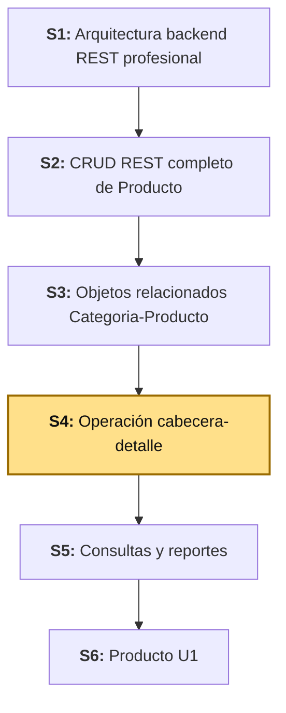
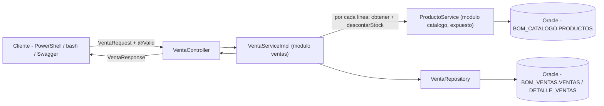
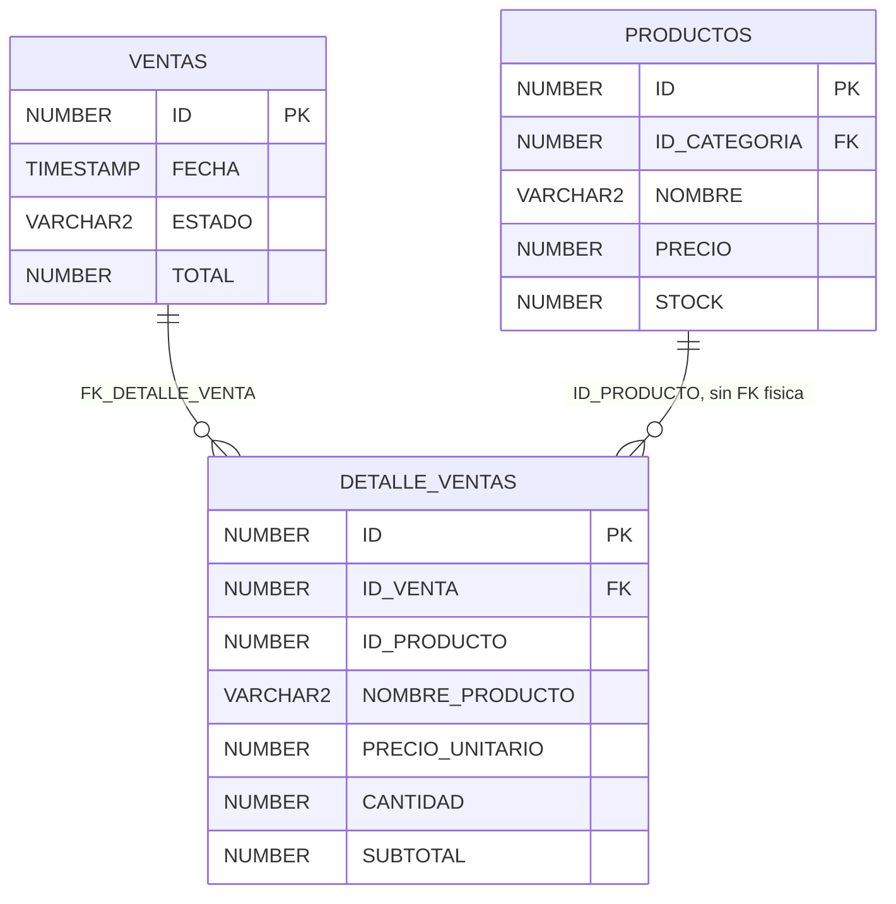
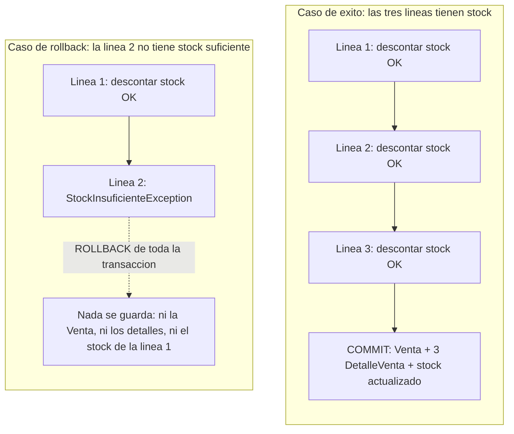

# S4 - Operación Cabecera-Detalle: Venta y DetalleVenta

*Por: Angel Sullon Macalupu @asullom - 2026*

## 1. Introducción

Tiempo: 20 min.

### 1.1 Presentación de la sesión

Hasta ahora, cada operación construida trabajó sobre una sola entidad protagonista por vez — un CRUD, aunque relacionado con otra entidad, sigue siendo eso. Esta sesión agrega un segundo módulo de negocio y con él aparece un tipo de operación distinto: registrar una operación de dominio no es guardar una fila, es guardar una cabecera junto con una colección de líneas, calcular totales, aplicar una regla de negocio real que depende de otro módulo, y que todo eso ocurra junto o no ocurra nada. Esta sesión construye esa operación completa, con su primera regla de negocio real y su primera comunicación entre dos módulos.

### 1.2 Índice

1. DTO compuesto y colección de detalles.
2. Cálculos y estados.
3. Actualización de existencias.
4. Registro atómico, commit y rollback mediante transacciones ORM.

### 1.3 Propósito de aprendizaje

Al concluir la clase, estarás en condiciones de:

- **Construir y probar** una operación de dominio cabecera-detalle, con cálculos, una regla de negocio real, y una transacción atómica verificada con un caso de éxito y un caso de rollback — comunicando dos módulos mediante un servicio público expuesto explícitamente.

### 1.4 Producto de sesión

API REST de `Venta` (`POST`, `GET`, `GET /{id}`) con `DetalleVenta` como colección embebida en el DTO de entrada y de salida, cálculo de subtotales y total, descuento real de stock de `Producto` mediante el servicio público de `catalogo`, transacción atómica probada con un caso de éxito y un caso de rollback por stock insuficiente, y límites de módulo verificados con `ModularityTests`.

### 1.5 Metodología

**Tabla 1. Metodología de la sesión**

| Actividades a Realizar en el Periodo | Orientaciones generales (Orientaciones Metodológicas) | Material de estudio recomendado |
|---|---|---|
| Revisión previa individual | Repasar `ProductoServiceImpl`/`ProductoRepository` (S1, S3) y ADR-002 (verificación de módulos con Spring Modulith). Trabajo individual, antes de clase. | S1 (3.4.2), S3 (3.9), ADR-002. |
| Clase presencial | Construcción guiada de `ventas`: entidades, DTO compuesto, servicio con cálculos y control de stock, transacción atómica, controlador, y verificación de límites de módulo. Trabajo individual en la propia laptop, siguiendo al docente paso a paso. | Backend ejecutable (S1-S3), cliente REST para verificar endpoints. |
| Evaluación formativa | Verificación en clase de `POST /api/v1/ventas` con un caso de éxito (stock suficiente) y un caso de rollback (stock insuficiente), más `ModularityTests` en verde. La evidencia se completa y sustenta de forma individual, fuera del aula, según los criterios mínimos de la sección 4.4. | Indicaciones de entrega (4.3), rúbrica de evaluación (4.6). |

### 1.6 Motivación de la sesión

#### 1.6.1 Caso: el descuento de stock que se aplicó sin la venta

Imagina que `descontarStock` se ejecuta para el primer producto de una venta con tres líneas, se guarda ese cambio, y recién en la segunda línea se descubre que no hay stock suficiente. Si cada paso se guardara por separado, el resultado sería un producto con el stock ya descontado y ninguna venta registrada que lo explique — un dato inconsistente que nadie decidió dejar así, un efecto secundario de tratar una operación de varios pasos como si fueran pasos independientes.

Esa es exactamente la clase de bug que una transacción evita: todo el conjunto de cambios (la cabecera, cada línea, cada descuento de stock) se confirma junto o se revierte junto — no hay un estado intermedio visible para nadie más. Esta sesión no solo implementa `Venta`-`DetalleVenta`: prueba explícitamente que el rollback funciona, provocándolo a propósito.

**Preguntas de análisis**

**Activación de conocimientos previos**

1. En S3, `ProductoServiceImpl.crear()` necesitó `@Transactional` para no romperse al resolver `Categoria`. ¿Qué tienen en común ese caso y el de esta sesión?

**Comprensión de la operación cabecera-detalle**

1. Si `Venta` y `DetalleVenta` se guardaran en dos llamadas a `save()` separadas, en vez de una sola operación transaccional, ¿qué podría quedar inconsistente si la segunda falla?
2. `DetalleVenta` no tiene una relación JPA (`@ManyToOne`) hacia `Producto` — solo guarda su `id`, nombre y precio en el momento de la venta. ¿Por qué, si `Producto` ya existe como entidad en `catalogo`?

### 1.7 Ubicación en el curso

- Unidad: U1 - Base backend REST modular de BomERP.
- Producto del curso: base Full-Stack modular de BomERP.
- Producto de unidad: base backend modular de BomERP, con módulos de Catálogo, Inventario, Ventas y Compras delimitados.
- Avance del producto en esta sesión: módulo `ventas` creado, con `Venta`-`DetalleVenta` funcional, transaccional y verificado contra `catalogo`.

Roadmap del producto de la unidad:

**Figura 1. Roadmap del producto de la unidad**



## 2. Explica

Tiempo: 30 min.

### 2.1 Arquitectura de la sesión

**Figura 2. Flujo de una petición `POST /api/v1/ventas`**



Lectura del diagrama: `VentaServiceImpl` vive en `ventas`, pero no toca `ProductoRepository` ni la entidad `Producto` directamente — pasa siempre por `ProductoService`, el mismo límite que ya impone Spring Modulith dentro de un solo módulo (S3, `ProductoServiceImpl` nunca llama a `CategoriaRepository`), ahora entre dos módulos distintos.

### 2.2 DTO compuesto y colección de detalles

Una **cabecera** (`Venta`) agrupa datos que aplican a toda la operación (fecha, estado, total); un **detalle** (`DetalleVenta`) es cada línea individual (qué producto, cuánto, a qué precio). La relación es uno a muchos: una `Venta` tiene varios `DetalleVenta`, y cada `DetalleVenta` pertenece exactamente a una `Venta` — el mismo patrón `@OneToMany`/`@ManyToOne` de S3, aplicado ahora dentro de un mismo módulo nuevo en vez de entre `Categoria` y `Producto`.

**Figura 3. Esquema real en Oracle: `VENTAS` y `DETALLE_VENTAS`**



Este esquema no lo crea este backend: lo crea BD2 (3.1, más abajo; [BD2 S4](../../bd2/sesiones/S04_Optimizacion_Consultas_SQL.md), 3.2), antes de que exista una sola línea de `Venta`/`DetalleVenta` en Java. `ID_VENTA` sí lleva `FOREIGN KEY` (`FK_DETALLE_VENTA`, con `o{` porque la base de datos no exige que una venta tenga al menos un detalle) — la cabecera-detalle es una relación interna a `BOM_VENTAS`, un solo esquema. `PRODUCTOS` aparece en el diagrama porque es el sentido real del negocio: `DETALLE_VENTAS` es la tabla asociativa que resuelve el muchos-a-muchos entre una venta (varios productos) y un producto (vendido en varias ventas) — pero esa relación con `PRODUCTOS` (otro esquema, `BOM_CATALOGO`) no tiene `FOREIGN KEY` física, por eso la etiqueta lo dice explícitamente ("sin FK física"): es la misma decisión que el párrafo siguiente explica del lado del código Java, ya tomada del lado de la base de datos.

**Decisión de diseño: `DetalleVenta` no referencia la entidad `Producto`.** Podría parecer natural agregar `@ManyToOne private Producto producto;` en `DetalleVenta`, igual que `Producto` referencia `Categoria` en `catalogo` — pero `Producto` es una entidad de **otro módulo**, y la base de datos que sostiene esa relación (Figura 3, más arriba) ya decidió no forzarla con una `FOREIGN KEY` física: si se eliminara un producto que ya tiene ventas registradas, esa `FOREIGN KEY` bloquearía el borrado (o, peor, lo dejaría huérfano) — un registro de venta debe seguir siendo válido aunque el producto que describe ya no exista en el catálogo. Una relación JPA directa, además, obligaría a `ventas` a conocer el mapeo interno de `catalogo` (su tabla, sus columnas, su ciclo de vida), justo el acoplamiento que Spring Modulith existe para evitar (ADR-002). En vez de eso, `DetalleVenta` guarda `productoId` (un `Long` simple, sin relación JPA) más una **copia** de `nombreProducto` y `precioUnitario` tomada en el momento de la venta.

Esa copia no es una limitación — es correcta para el dominio: si `Producto.precio` cambia la próxima semana, una venta ya registrada no debe recalcularse sola. El precio de una venta pasada es el que se cobró ese día, no el que el producto tenga hoy.

**No es una regla general contra las relaciones entre módulos — depende de dos condiciones a la vez, no de "ser de otro módulo" por sí solo:**

**Tabla 2. Cuándo una relación lleva `FOREIGN KEY`/`@ManyToOne` y cuándo no**

| Relación | ¿Mismo esquema/módulo? | ¿El lado que referencia es un registro histórico? | ¿`FOREIGN KEY`/`@ManyToOne`? |
|---|---|---|---|
| `Venta` → `DetalleVenta` | Sí (`ventas`) | — | Sí (`@OneToMany`/`@ManyToOne`) |
| `Producto` → `Categoria` | Sí (`catalogo`) | No, es catálogo vivo | Sí (`@ManyToOne`) |
| `DetalleVenta` → `Producto` | No, cruza módulo | Sí, venta ya cerrada | No |
| `Venta` → `Cliente`* | No, cruza módulo | Sí, venta ya cerrada | No |

\* Caso hipotético: `personas`/`Cliente` todavía no existe en el proyecto — se incluye aquí solo para probar el criterio contra un caso distinto a `Producto`.

Dentro de un mismo módulo, la relación JPA sigue siendo la norma — así quedan `Venta`-`DetalleVenta` (arriba) y `Producto`-`Categoria` (S3): ninguna de las dos es un registro histórico que deba sobrevivir a que el otro lado cambie o desaparezca. La ausencia de relación directa es la excepción, no el punto de partida, y solo se justifica cuando cruza el límite de módulo **y** el lado que referencia es un registro transaccional que no debe depender de que el otro dato siga existiendo igual — exactamente el mismo criterio, ya explicado del lado de Oracle en la Tabla 2 de [BD2 S4](../../bd2/sesiones/S04_Optimizacion_Consultas_SQL.md), 2.2.

**El criterio para copiar un campo no es "podría cambiar" — es "forma parte del documento legal".** Con `Cliente` esto se nota mejor que con `Producto`: el DNI o RUC de una persona prácticamente no cambia nunca, y aun así habría que copiarlo — no por temor a que cambie, sino porque una boleta o factura electrónica es un documento legal autocontenido, y el nombre/razón social y el número de documento son parte de ese documento tal como se emitió, no una referencia que se resuelve consultando `Cliente` cada vez que alguien la revisa:

- **Se copian en `Venta`** (identifican al documento en sí, sin importar qué tan seguido cambien): tipo y número de documento (DNI/RUC), nombre completo o razón social.
- **No se copian en `Venta`**: dirección, teléfono, correo — datos de contacto que sí cambian con más frecuencia, pero que no forman parte de la boleta/factura. Si algún día se necesitara "la dirección del cliente al momento de esta venta", eso no se resuelve copiando la dirección en cada venta: se resuelve con una tabla de auditoría propia sobre `Cliente` en Oracle (mismo patrón que `PRODUCTO_AUDITORIA`, BD2 S2, 3.2 — antes/después con fecha), consultada por fecha, no con una copia repetida en cada transacción que lo mencione.

### 2.3 Cálculos y estados

Cada `DetalleVenta` calcula su `subtotal` como `precioUnitario × cantidad`; el `total` de la `Venta` es la suma de todos los `subtotal` de sus detalles. Ambos cálculos ocurren en el service, no en el controller ni en la entidad — la entidad `Venta`/`DetalleVenta` solo almacena el resultado, no lo recalcula por sí sola cada vez que se lee.

Cada `Venta` también tiene un **estado** (`EstadoVenta`) — hoy con un único valor posible, `REGISTRADA`: toda venta creada en esta sesión queda ahí, sin operación de anulación todavía (3.3). El campo existe desde ahora porque una operación cabecera-detalle real casi siempre necesita más de un estado con el tiempo (por ejemplo, `ANULADA`, con su propia reversión de stock) — aunque esta sesión no lo explote todavía, extenderlo más adelante es agregar un valor al enum y la lógica que lo use, no rediseñar la entidad.

### 2.4 Actualización de existencias

S2 (2.3) ya distinguió cuatro capas de validación, y adelantó que la última — la del service — es la única que puede validar algo que depende del **estado actual del sistema**, no de la forma del dato. "El nombre no puede estar vacío" se valida con `@NotBlank`, sin consultar nada; "hay stock suficiente para vender 5 unidades" **sí** necesita consultar el stock real en ese instante — es una regla de negocio, no de forma, y Bean Validation no puede expresarla.

`ProductoService.descontarStock(id, cantidad)` implementa esa regla: si `cantidad` supera el stock disponible, lanza una excepción de negocio (`StockInsuficienteException`, distinta de `ResourceNotFoundException`) — el mismo mecanismo de `GlobalExceptionHandler` (S2, 3.2.1) que ya maneja errores de forma y de recurso no encontrado, ahora también maneja un tercer tipo de error: uno de regla de negocio.

Esa actualización de stock no ocurre dentro del mismo módulo: vive en `catalogo`, y quien la necesita es `ventas`. ADR-002 estableció la regla y `ModularityTests` la verifica: un módulo se comunica con otro mediante un **servicio Java público**, nunca accediendo al repositorio o a la entidad interna del otro módulo. Hasta S3, esa regla nunca se puso a prueba de verdad — solo existía `catalogo`, no había ningún otro módulo desde donde violarla.

Spring Modulith, por defecto, solo expone como "API pública" de un módulo los tipos que están **directamente** en el paquete raíz del módulo (`pe.edu.upeu.bomerp.catalogo`) — y ese paquete, en este proyecto, está vacío: todo vive anidado en `catalogo.producto.*` y `catalogo.categoria.*`. Sin ningún ajuste, `ventas` no podría importar `ProductoService` aunque quisiera — Modulith lo trataría como interno de `catalogo` y `ModularityTests` fallaría la build. La solución es marcar explícitamente los paquetes que sí deben ser visibles desde otros módulos con `@NamedInterface`, en un `package-info.java` — el paso 3.2 de esta sesión hace exactamente eso, antes de escribir ninguna línea de `ventas`.

### 2.5 Registro atómico, commit y rollback mediante transacciones ORM

`VentaServiceImpl.crear()` recorre cada línea del `VentaRequest` y, por cada una, llama a `ProductoService.descontarStock()` **antes** de terminar de construir la `Venta`. Todo el método está anotado `@Transactional` — y, como `descontarStock()` en `catalogo` también lo está, Spring no abre una transacción nueva para cada llamada: por defecto (`Propagation.REQUIRED`), una llamada transaccional hecha *dentro* de otra transaccional se une a la que ya está abierta, no crea una independiente.

Esa es la pieza que hace posible el rollback completo: si la línea 2 de 3 falla por stock insuficiente, la excepción se propaga fuera de `crear()` sin que nada la capture — Spring revierte **toda** la transacción, incluido el descuento de stock ya aplicado a la línea 1. Nada queda a medias, ni en `ventas` ni en `catalogo`, aunque sean tablas de esquemas Oracle distintos (`BOM_VENTAS`, `BOM_CATALOGO`): siguen siendo la misma base de datos, el mismo `DataSource`, la misma transacción JDBC.

**Todo esto es implícito: en ningún lado del código hay un `commit()` ni un `rollback()`.** `@Transactional` funciona mediante un ***proxy***: Spring envuelve `VentaServiceImpl` (y `ProductoServiceImpl`) en un objeto intermedio que abre la transacción antes de ejecutar el método real, y decide qué hacer según cómo termine — el código de `crear()` no sabe nada de esto, ni lo controla.

- Si `crear()` retorna normalmente, el proxy hace `commit()`.
- Si `crear()` deja escapar una excepción sin capturarla, el proxy hace `rollback()`.

**La regla exacta que activa el rollback, sin ninguna configuración extra:** por defecto, Spring solo revierte la transacción ante excepciones ***unchecked*** (las que extienden `RuntimeException` o `Error`) — una excepción ***checked*** (que extiende `Exception` directamente) deja que el proxy haga `commit()` igual, aunque haya interrumpido el método a medio camino. `StockInsuficienteException` (3.5, de esta sesión) y `ResourceNotFoundException` (S2, 3.2.1) extienden `RuntimeException` justamente por esto: no es una elección de estilo, es la condición que hace posible el rollback automático de esta sesión sin escribir una sola línea de manejo de transacciones. Si algún día una regla de negocio se expresara con una excepción *checked*, el rollback automático dejaría de funcionar a menos que se declare explícito: `@Transactional(rollbackFor = Exception.class)`.

**Figura 4. Transacción atómica: caso de éxito vs. caso de rollback**



**Error frecuente**: pensar que el rollback "deshace" el `UPDATE` de stock de la línea 1 con un segundo `UPDATE` correctivo. No es así — el `UPDATE` de la línea 1 nunca se confirmó (`COMMIT`) en la base de datos; hasta que la transacción completa termina bien, todos los cambios viven solo en la sesión de Hibernate, no en Oracle.

## 3. Aplica: actividad práctica guiada

Tiempo: 2h.

**Actividad:** construcción guiada del módulo `ventas` con la operación `Venta`-`DetalleVenta` completa (Producto de la sesión en 1.4).

**Propósito de la actividad:** crear el segundo módulo de negocio de BomERP, con una operación cabecera-detalle real: cálculos, una regla de negocio verdadera (stock), una transacción atómica probada con éxito y con rollback, y comunicación entre módulos verificada mecánicamente, no solo por convención.

**Orientaciones metodológicas:** en el laboratorio, el docente construye `ventas` paso a paso frente a la clase, ejecutando el caso de éxito y el caso de rollback antes de avanzar; los estudiantes replican cada paso en su propio equipo, verificando la respuesta HTTP y el estado de la base de datos antes de continuar.

**Actividades para realizar:**

- **3.1** Verificar el punto de partida.
- **3.2** Exponer `ProductoService` a otros módulos con `@NamedInterface`.
- **3.3** Crear las entidades `Venta`, `DetalleVenta` y `EstadoVenta`.
- **3.4** Crear los DTO compuestos.
- **3.5** Ampliar `ProductoService` con `descontarStock` y `StockInsuficienteException`.
- **3.6** Crear `VentaMapper`.
- **3.7** Crear `VentaRepository`.
- **3.8** Crear `VentaService`/`VentaServiceImpl`.
- **3.9** Crear `VentaController`.
- **3.10** Probar la operación completa, incluido el rollback.
- **3.11** Verificar los límites de módulo con `ModularityTests`.
- **3.12** Relacionar con ADS y BD2.
- **3.13** (opcional, anexo) Exponer métricas de `bomerp-backend` para Prometheus.
- **3.14** (opcional, anexo) Enviar logs de `bomerp-backend` a Loki y verificarlos.
- **3.15** (opcional, anexo) Visualizar métricas y logs juntos en Grafana.

### 3.1 Verificar el punto de partida

**Punto de partida común:** todo el equipo debe comenzar exactamente desde donde quedó S3, no desde su propio avance individual. Clona la rama `s03-objetos-relacionados` (el snapshot de cierre de S3):

```bash
git clone --branch s03-objetos-relacionados https://github.com/262ciclo4/bomerp.git
```

**Producto del paso:** confirmación de que `catalogo` (`Categoria`, `Producto`, con su relación y su `@Transactional`) sigue funcionando antes de tocar código nuevo.

**Requisito antes de continuar:** confirma que `http://localhost:8080/api/v1/productos` responde con datos antes de continuar. Si falla, el problema es de una sesión anterior, no de esta.

**Requisito adicional para esta sesión:** el esquema `BOM_VENTAS` (tablas `VENTAS` y `DETALLE_VENTAS`) no lo crea este backend — es responsabilidad de BD2 S04 (3.2). Crea el esquema y las tablas de ventas ejecutando, en orden, [`S04_01_esquemas.sql`](../../proyecto-integrador/u1/oracle/S04_01_esquemas.sql) y [`S04_02_tablas.sql`](../../proyecto-integrador/u1/oracle/S04_02_tablas.sql) (scripts de BD2 — detalle completo si lo necesitas: [BD2 S4](../../bd2/sesiones/S04_Optimizacion_Consultas_SQL.md)), antes de escribir las entidades `Venta`/`DetalleVenta` (3.3) o de intentar levantar la aplicación. Si arrancas el backend sin ese esquema, Hibernate falla al iniciar con `SchemaManagementException: Schema validation: missing table [bom_ventas.detalle_ventas]` — no es un error en tu código Java, es que la tabla física todavía no existe.

### 3.2 Exponer `ProductoService` a otros módulos con `@NamedInterface`

**Producto del paso:** `catalogo.producto.service` y `catalogo.producto.dto` marcados como interfaces con nombre, visibles desde `ventas`.

**`catalogo/producto/service/package-info.java`**

```java
/**
 * ProductoService es la unica forma en que otros modulos (ventas, desde S4)
 * pueden leer o modificar productos - nunca accediendo a ProductoRepository
 * ni a la entidad Producto directamente (ADR-002).
 */
@org.springframework.modulith.NamedInterface("producto-service")
package pe.edu.upeu.bomerp.catalogo.producto.service;
```

**`catalogo/producto/dto/package-info.java`**

```java
/**
 * ProductoResponse es el unico tipo de catalogo.producto que otros modulos
 * pueden recibir de vuelta - nunca la entidad Producto (ADR-002).
 */
@org.springframework.modulith.NamedInterface("producto-dto")
package pe.edu.upeu.bomerp.catalogo.producto.dto;
```

**Error frecuente**: crear el `package-info.java` en el paquete equivocado (por ejemplo, en `catalogo.producto` en vez de `catalogo.producto.service`). `@NamedInterface` expone exactamente el paquete donde vive el `package-info.java`, no sus subpaquetes ni su paquete padre.

Sin este paso, `mvnw test -Dtest=ModularityTests` fallará en cuanto `ventas` importe `ProductoService` — no es opcional, es lo que hace lícita la comunicación entre módulos que el resto de esta sesión necesita.

### 3.3 Crear las entidades `Venta`, `DetalleVenta` y `EstadoVenta`

**Producto del paso:** el modelo de datos de la operación, con la relación cabecera-detalle y sin ninguna relación JPA hacia `catalogo`.

**`ventas/venta/entity/EstadoVenta.java`**

```java
package pe.edu.upeu.bomerp.ventas.venta.entity;

public enum EstadoVenta {
    REGISTRADA
}
```

!!! note "Nota de alcance"
    `EstadoVenta` hoy solo tiene `REGISTRADA` — toda venta creada en esta sesión queda en ese estado, sin operación de anulación todavía. Un estado `ANULADA` (con su propio endpoint y su propia regla de reversión de stock) es una extensión natural para una sesión posterior, no parte del alcance de S4.

**`ventas/venta/entity/Venta.java`**

```java
package pe.edu.upeu.bomerp.ventas.venta.entity;

import jakarta.persistence.CascadeType;
import jakarta.persistence.Column;
import jakarta.persistence.Entity;
import jakarta.persistence.EnumType;
import jakarta.persistence.Enumerated;
import jakarta.persistence.GeneratedValue;
import jakarta.persistence.GenerationType;
import jakarta.persistence.Id;
import jakarta.persistence.OneToMany;
import jakarta.persistence.Table;
import lombok.Getter;
import lombok.NoArgsConstructor;
import lombok.Setter;
import java.math.BigDecimal;
import java.time.LocalDateTime;
import java.util.ArrayList;
import java.util.List;

@Entity
@Table(name = "VENTAS", schema = "BOM_VENTAS")
@Getter
@Setter
@NoArgsConstructor
public class Venta {
    @Id
    @GeneratedValue(strategy = GenerationType.IDENTITY)
    @Column(name = "ID")
    private Long id;

    @Column(name = "FECHA", nullable = false)
    private LocalDateTime fecha;

    @Enumerated(EnumType.STRING)
    @Column(name = "ESTADO", nullable = false, length = 20)
    private EstadoVenta estado;

    @Column(name = "TOTAL", nullable = false, precision = 12, scale = 2)
    private BigDecimal total;

    @OneToMany(mappedBy = "venta", cascade = CascadeType.ALL, orphanRemoval = true)
    private List<DetalleVenta> detalles = new ArrayList<>();
}
```

**`ventas/venta/entity/DetalleVenta.java`**

```java
package pe.edu.upeu.bomerp.ventas.venta.entity;

import jakarta.persistence.Column;
import jakarta.persistence.Entity;
import jakarta.persistence.GeneratedValue;
import jakarta.persistence.GenerationType;
import jakarta.persistence.Id;
import jakarta.persistence.JoinColumn;
import jakarta.persistence.ManyToOne;
import jakarta.persistence.Table;
import lombok.Getter;
import lombok.NoArgsConstructor;
import lombok.Setter;
import java.math.BigDecimal;

@Entity
@Table(name = "DETALLE_VENTAS", schema = "BOM_VENTAS")
@Getter
@Setter
@NoArgsConstructor
public class DetalleVenta {
    @Id
    @GeneratedValue(strategy = GenerationType.IDENTITY)
    @Column(name = "ID")
    private Long id;

    @ManyToOne
    @JoinColumn(name = "ID_VENTA", nullable = false)
    private Venta venta;

    @Column(name = "ID_PRODUCTO", nullable = false)
    private Long productoId;

    @Column(name = "NOMBRE_PRODUCTO", nullable = false, length = 120)
    private String nombreProducto;

    @Column(name = "PRECIO_UNITARIO", nullable = false, precision = 10, scale = 2)
    private BigDecimal precioUnitario;

    @Column(name = "CANTIDAD", nullable = false)
    private Integer cantidad;

    @Column(name = "SUBTOTAL", nullable = false, precision = 12, scale = 2)
    private BigDecimal subtotal;
}
```

`productoId` es un `Long` sin `@ManyToOne` — como ya se explicó en 2.2, `DetalleVenta` no tiene una relación JPA hacia `Producto`, solo guarda su identificador y una copia de los datos relevantes al momento de la venta.

### 3.4 Crear los DTO compuestos

**Producto del paso:** `VentaRequest`, con una colección de `DetalleVentaRequest`, y `VentaResponse`, con una colección de `DetalleVentaResponse`.

**`ventas/venta/dto/DetalleVentaRequest.java`**

```java
package pe.edu.upeu.bomerp.ventas.venta.dto;

import jakarta.validation.constraints.NotNull;
import jakarta.validation.constraints.Positive;
import lombok.Getter;
import lombok.Setter;

@Getter
@Setter
public class DetalleVentaRequest {

    @NotNull
    private Long productoId;

    @NotNull
    @Positive
    private Integer cantidad;
}
```

**`ventas/venta/dto/VentaRequest.java`**

```java
package pe.edu.upeu.bomerp.ventas.venta.dto;

import jakarta.validation.Valid;
import jakarta.validation.constraints.NotEmpty;
import lombok.Getter;
import lombok.Setter;
import java.util.List;

@Getter
@Setter
public class VentaRequest {

    @NotEmpty
    @Valid
    private List<DetalleVentaRequest> detalles;
}
```

**Error frecuente**: olvidar `@Valid` sobre `List<DetalleVentaRequest> detalles`. Sin esa anotación, Spring valida que la lista no esté vacía (`@NotEmpty`), pero **no** entra a validar cada `DetalleVentaRequest` dentro de ella — un `productoId` nulo o una `cantidad` negativa pasarían sin error.

**`ventas/venta/dto/DetalleVentaResponse.java`**

```java
package pe.edu.upeu.bomerp.ventas.venta.dto;

import lombok.AllArgsConstructor;
import lombok.Builder;
import lombok.Getter;
import lombok.NoArgsConstructor;
import lombok.Setter;
import java.math.BigDecimal;

@Getter
@Setter
@Builder
@NoArgsConstructor
@AllArgsConstructor
public class DetalleVentaResponse {
    private Long productoId;
    private String nombreProducto;
    private BigDecimal precioUnitario;
    private Integer cantidad;
    private BigDecimal subtotal;
}
```

**`ventas/venta/dto/VentaResponse.java`**

```java
package pe.edu.upeu.bomerp.ventas.venta.dto;

import lombok.AllArgsConstructor;
import lombok.Builder;
import lombok.Getter;
import lombok.NoArgsConstructor;
import lombok.Setter;
import java.math.BigDecimal;
import java.time.LocalDateTime;
import java.util.List;

@Getter
@Setter
@Builder
@NoArgsConstructor
@AllArgsConstructor
public class VentaResponse {
    private Long id;
    private LocalDateTime fecha;
    private String estado;
    private BigDecimal total;
    private List<DetalleVentaResponse> detalles;
}
```

### 3.5 Ampliar `ProductoService` con `descontarStock` y `StockInsuficienteException`

**Producto del paso:** la regla de negocio de stock, disponible como método público de `catalogo` para que `ventas` la use.

**`exception/StockInsuficienteException.java`**

```java
package pe.edu.upeu.bomerp.exception;

public class StockInsuficienteException extends RuntimeException {
    public StockInsuficienteException(String mensaje) {
        super(mensaje);
    }
}
```

Amplía `GlobalExceptionHandler` (S2, 3.2.1) con un tercer `@ExceptionHandler`, esta vez respondiendo `409 Conflict` — no es un error de forma (`400`) ni de recurso inexistente (`404`), es un conflicto entre lo pedido y el estado actual del sistema:

```java
@ExceptionHandler(StockInsuficienteException.class)
public ResponseEntity<Map<String, Object>> handleStockInsuficiente(StockInsuficienteException ex) {
    Map<String, Object> body = new HashMap<>();
    body.put("timestamp", Instant.now().toString());
    body.put("status", HttpStatus.CONFLICT.value());
    body.put("error", "Conflict");
    body.put("message", ex.getMessage());
    return ResponseEntity.status(HttpStatus.CONFLICT).body(body);
}
```

**Error frecuente**: al guardar `StockInsuficienteException`, la extensión de Spring Boot en el IDE puede marcarla con `MODULITH_TYPE_REF_VIOLATION` ("Invalid reference to non-exposed type of module 'exception'"). No es un error en el código que acabas de escribir — es Spring Modulith haciendo exactamente lo que hace desde S1 (ADR-002): trata **cada paquete directo bajo la raíz** (`pe.edu.upeu.bomerp.*`) como su propio módulo, y eso incluye `exception`, aunque nunca lo pensaste como un "módulo de negocio".

La diferencia con `catalogo.producto.service` (3.2) es que ahí expusiste una interfaz puntual con `@NamedInterface`, porque `ventas` necesita consumir *ese* servicio específico. `exception` es distinto: es un paquete transversal que **todos** los módulos deben poder usar, no la API propia de uno solo. Para ese caso, Spring Modulith ofrece un mecanismo dedicado — marcar el paquete completo como **abierto**:

**`exception/package-info.java`**

```java
/**
 * Paquete transversal: excepciones y su manejo son compartidos por todos
 * los modulos, no la API de uno solo (a diferencia de @NamedInterface).
 */
@org.springframework.modulith.ApplicationModule(type = org.springframework.modulith.ApplicationModule.Type.OPEN)
package pe.edu.upeu.bomerp.exception;
```

Con esto, `StockInsuficienteException`, `ResourceNotFoundException` y `GlobalExceptionHandler` quedan visibles para cualquier módulo sin necesitar un `@NamedInterface` por cada uno — y de paso limpia la misma advertencia que `ResourceNotFoundException` ya arrastraba desde S2, solo que nadie la había mirado con dos módulos de negocio a la vez. Corre `mvnw test -Dtest=ModularityTests` para confirmar que ya no aparece.

Amplía la interfaz `ProductoService` (S1) con el nuevo método:

```java
void descontarStock(Long id, Integer cantidad);
```

Y su implementación en `ProductoServiceImpl`:

```java
@Override
@Transactional
public void descontarStock(Long id, Integer cantidad) {
    Producto producto = buscarOFallar(id);
    if (producto.getStock() < cantidad) {
        throw new StockInsuficienteException(
                "Stock insuficiente para " + producto.getNombre()
                        + ": disponible " + producto.getStock() + ", solicitado " + cantidad);
    }
    producto.setStock(producto.getStock() - cantidad);
    productoRepository.save(producto);
}
```

`buscarOFallar(id)` ya existe en `ProductoServiceImpl` desde S2 — `descontarStock` lo reutiliza, no lo repite.

### 3.6 Crear `VentaMapper`

**Producto del paso:** conversión entre `Venta`/`DetalleVenta` y sus DTO, en ambas direcciones — sin recibir la entidad `Producto`, solo `ProductoResponse` (el DTO expuesto de `catalogo`).

Desde S3, `CategoriaMapper`/`ProductoMapper` ya son interfaces MapStruct, no clases escritas a mano — `VentaMapper` sigue el mismo criterio, no vuelve al mapeo manual de S2. La dependencia y el `annotation processor` de MapStruct en el `pom.xml` ya están configurados desde S2 (3.8); este paso no los repite.

**`ventas/venta/mapper/VentaMapper.java`**

```java
package pe.edu.upeu.bomerp.ventas.venta.mapper;

import org.mapstruct.Mapper;
import org.mapstruct.Mapping;
import pe.edu.upeu.bomerp.catalogo.producto.dto.ProductoResponse;
import pe.edu.upeu.bomerp.ventas.venta.dto.DetalleVentaRequest;
import pe.edu.upeu.bomerp.ventas.venta.dto.DetalleVentaResponse;
import pe.edu.upeu.bomerp.ventas.venta.dto.VentaResponse;
import pe.edu.upeu.bomerp.ventas.venta.entity.DetalleVenta;
import pe.edu.upeu.bomerp.ventas.venta.entity.Venta;

@Mapper(componentModel = "spring")
public interface VentaMapper {

    @Mapping(target = "id", ignore = true)
    @Mapping(target = "venta", ignore = true)
    @Mapping(target = "productoId", source = "producto.id")
    @Mapping(target = "nombreProducto", source = "producto.nombre")
    @Mapping(target = "precioUnitario", source = "producto.precio")
    @Mapping(target = "subtotal", expression = "java(producto.getPrecio().multiply(java.math.BigDecimal.valueOf(request.getCantidad())))")
    DetalleVenta toDetalle(DetalleVentaRequest request, ProductoResponse producto);

    VentaResponse toResponse(Venta venta);

    DetalleVentaResponse toDetalleResponse(DetalleVenta detalle);
}
```

`toDetalle` recibe `ProductoResponse`, no `Producto` — es el tipo que `ProductoService.obtener()` ya devuelve, y el único que `catalogo.producto.dto` expone (3.2). `VentaMapper` nunca ve la entidad `Producto`, ni podría importarla aunque quisiera: no está en un `@NamedInterface`.

Con dos parámetros de origen (`request`, `producto`) y **ningún** nombre de campo coincidente entre ellos y `DetalleVenta` (`productoId` no es `id`, `nombreProducto` no es `nombre`, `precioUnitario` no es `precio`), MapStruct no puede resolver la ambigüedad solo — el mismo criterio ya verificado empíricamente en S3 (`ProductoMapper.toEntity`): campos con nombre coincidente se mapean solos, campos sin coincidencia exacta necesitan `@Mapping` explícito. `subtotal` no es una simple copia de campo — es un cálculo — así que usa `expression` en vez de `source`: el único caso en esta sesión donde el mapper hace algo más que mover datos de un lado a otro. `id` y `venta` se ignoran explícitamente porque `DetalleVenta` los recibe después, fuera del mapper (`id` lo genera Oracle, `venta` lo asigna `VentaServiceImpl` al agregar el detalle a la colección, 3.8).

`toResponse` no necesita ningún `@Mapping`: `id`, `fecha` y `total` coinciden en nombre y tipo; `estado` coincide en nombre pero cambia de tipo (`EstadoVenta` a `String`) — MapStruct genera automáticamente `venta.getEstado().name()`, la misma conversión implícita enum-a-`String` que ya usa el resto del proyecto de forma transparente; `detalles` coincide en nombre y usa automáticamente `toDetalleResponse` (declarado en el mismo mapper) para convertir cada elemento de la lista.

**Verifica antes de continuar**: corre `mvnw compile` y confirma que `VentaMapperImpl` se genera sin advertencias de `unmapped target property` — si aparece alguna, falta un `@Mapping` (o un `ignore = true`) para ese campo.

### 3.7 Crear `VentaRepository`

**Producto del paso:** el repositorio de `Venta` — `DetalleVenta` no necesita uno propio, se persiste en cascada desde `Venta` (`CascadeType.ALL` en 3.3).

**`ventas/venta/repository/VentaRepository.java`**

```java
package pe.edu.upeu.bomerp.ventas.venta.repository;

import org.springframework.data.jpa.repository.EntityGraph;
import org.springframework.data.jpa.repository.JpaRepository;
import pe.edu.upeu.bomerp.ventas.venta.entity.Venta;
import java.util.List;
import java.util.Optional;

public interface VentaRepository extends JpaRepository<Venta, Long> {

    @Override
    @EntityGraph(attributePaths = "detalles")
    List<Venta> findAll();

    @Override
    @EntityGraph(attributePaths = "detalles")
    Optional<Venta> findById(Long id);
}
```

Mismo criterio que `ProductoRepository.findAll()` (S3, 3.10): sin `@EntityGraph`, listar ventas con sus detalles caería en el problema N+1 — una consulta por `Venta` más una consulta adicional por cada colección `detalles` que se toque.

### 3.8 Crear `VentaService`/`VentaServiceImpl`

**Producto del paso:** la operación completa — cálculos, descuento de stock por cada línea, y todo dentro de una sola transacción.

**`ventas/venta/service/VentaService.java`**

```java
package pe.edu.upeu.bomerp.ventas.venta.service;

import pe.edu.upeu.bomerp.ventas.venta.dto.VentaRequest;
import pe.edu.upeu.bomerp.ventas.venta.dto.VentaResponse;
import java.util.List;

public interface VentaService {
    List<VentaResponse> listar();
    VentaResponse obtener(Long id);
    VentaResponse crear(VentaRequest request);
}
```

**`ventas/venta/service/VentaServiceImpl.java`**

```java
package pe.edu.upeu.bomerp.ventas.venta.service;

import lombok.RequiredArgsConstructor;
import org.springframework.stereotype.Service;
import org.springframework.transaction.annotation.Transactional;
import pe.edu.upeu.bomerp.catalogo.producto.dto.ProductoResponse;
import pe.edu.upeu.bomerp.catalogo.producto.service.ProductoService;
import pe.edu.upeu.bomerp.exception.ResourceNotFoundException;
import pe.edu.upeu.bomerp.ventas.venta.dto.DetalleVentaRequest;
import pe.edu.upeu.bomerp.ventas.venta.dto.VentaRequest;
import pe.edu.upeu.bomerp.ventas.venta.dto.VentaResponse;
import pe.edu.upeu.bomerp.ventas.venta.entity.DetalleVenta;
import pe.edu.upeu.bomerp.ventas.venta.entity.EstadoVenta;
import pe.edu.upeu.bomerp.ventas.venta.entity.Venta;
import pe.edu.upeu.bomerp.ventas.venta.mapper.VentaMapper;
import pe.edu.upeu.bomerp.ventas.venta.repository.VentaRepository;
import java.math.BigDecimal;
import java.time.LocalDateTime;
import java.util.List;

@Service
@RequiredArgsConstructor
public class VentaServiceImpl implements VentaService {
    private final VentaRepository ventaRepository;
    private final ProductoService productoService;
    private final VentaMapper ventaMapper;

    @Override
    @Transactional(readOnly = true)
    public List<VentaResponse> listar() {
        return ventaRepository.findAll().stream().map(ventaMapper::toResponse).toList();
    }

    @Override
    @Transactional(readOnly = true)
    public VentaResponse obtener(Long id) {
        Venta venta = ventaRepository.findById(id)
                .orElseThrow(() -> new ResourceNotFoundException("Venta no encontrada: " + id));
        return ventaMapper.toResponse(venta);
    }

    @Override
    @Transactional
    public VentaResponse crear(VentaRequest request) {
        Venta venta = new Venta();
        venta.setFecha(LocalDateTime.now());
        venta.setEstado(EstadoVenta.REGISTRADA);

        BigDecimal total = BigDecimal.ZERO;
        for (DetalleVentaRequest detalleRequest : request.getDetalles()) {
            ProductoResponse producto = productoService.obtener(detalleRequest.getProductoId());
            productoService.descontarStock(detalleRequest.getProductoId(), detalleRequest.getCantidad());

            DetalleVenta detalle = ventaMapper.toDetalle(detalleRequest, producto);
            detalle.setVenta(venta);
            venta.getDetalles().add(detalle);
            total = total.add(detalle.getSubtotal());
        }
        venta.setTotal(total);

        return ventaMapper.toResponse(ventaRepository.save(venta));
    }
}
```

`productoService.obtener(...)` ya lanza `ResourceNotFoundException` (S2) si el `productoId` no existe, y `productoService.descontarStock(...)` (3.5) lanza `StockInsuficienteException` si no alcanza el stock — `VentaServiceImpl.crear()` no repite ninguna de las dos validaciones, confía en que `ProductoService` (el servicio público de `catalogo`) ya las hace.

**Error frecuente**: llamar a `productoService.descontarStock(...)` **después** de agregar el detalle a `venta.getDetalles()`, no antes. El orden en el código de arriba no es casual: si `descontarStock` falla, la excepción interrumpe el `for` antes de que ese detalle se agregue a la colección — y como toda la transacción se revierte, ni siquiera importa en qué momento exacto se agregó, pero mantener el descuento de stock como el primer paso de cada iteración hace el flujo más fácil de leer y de depurar.

### 3.9 Crear `VentaController`

**Producto del paso:** los tres endpoints (`GET`, `GET /{id}`, `POST`) sobre `/api/v1/ventas`.

**`ventas/venta/controller/VentaController.java`**

```java
package pe.edu.upeu.bomerp.ventas.venta.controller;

import io.swagger.v3.oas.annotations.Operation;
import io.swagger.v3.oas.annotations.tags.Tag;
import jakarta.validation.Valid;
import lombok.RequiredArgsConstructor;
import org.springframework.http.HttpStatus;
import org.springframework.http.ResponseEntity;
import org.springframework.web.bind.annotation.*;
import pe.edu.upeu.bomerp.ventas.venta.dto.VentaRequest;
import pe.edu.upeu.bomerp.ventas.venta.dto.VentaResponse;
import pe.edu.upeu.bomerp.ventas.venta.service.VentaService;
import java.util.List;

@Tag(name = "Ventas")
@RestController
@RequestMapping("/api/v1/ventas")
@RequiredArgsConstructor
public class VentaController {
    private final VentaService ventaService;

    @Operation(summary = "Lista las ventas registradas")
    @GetMapping
    public ResponseEntity<List<VentaResponse>> listar() {
        return ResponseEntity.ok(ventaService.listar());
    }

    @Operation(summary = "Consulta una venta por id, con sus detalles")
    @GetMapping("/{id}")
    public ResponseEntity<VentaResponse> obtener(@PathVariable Long id) {
        return ResponseEntity.ok(ventaService.obtener(id));
    }

    @Operation(summary = "Registra una venta con sus detalles, descontando stock")
    @PostMapping
    @ResponseStatus(HttpStatus.CREATED)
    public VentaResponse crear(@Valid @RequestBody VentaRequest request) {
        return ventaService.crear(request);
    }
}
```

No hay `PUT` ni `DELETE` en esta sesión: modificar una venta ya registrada (¿recalcular stock? ¿qué pasa con el detalle eliminado?) es una operación con reglas propias que el sílabo no pide todavía — el mismo criterio de alcance que ya aplicó `Categoria` en S2-S3.

### 3.10 Probar la operación completa, incluido el rollback

**Producto del paso:** evidencia del caso de éxito y del caso de rollback, más el stock verificado antes y después de cada uno.

Antes de empezar, confirma el stock actual de dos productos que vayas a usar (reemplaza `{id}` por ids reales de tu base):

```powershell
Invoke-RestMethod -Method Get -Uri "http://localhost:8080/api/v1/productos/{id}"
```

**Caso de éxito** — una venta con stock suficiente en todas sus líneas:

```powershell
Invoke-RestMethod -Method Post -Uri "http://localhost:8080/api/v1/ventas" -ContentType "application/json" -Body '{"detalles":[{"productoId":1,"cantidad":2},{"productoId":2,"cantidad":1}]}'
```

Verifica: la respuesta trae `201`, un `total` calculado, y el stock de los productos 1 y 2 bajó exactamente en 2 y 1.

**Caso de rollback** — una de las líneas pide más cantidad de la que hay en stock:

```powershell
try {
    Invoke-RestMethod -Method Post -Uri "http://localhost:8080/api/v1/ventas" -ContentType "application/json" -Body '{"detalles":[{"productoId":1,"cantidad":1},{"productoId":2,"cantidad":999999}]}'
} catch {
    $_.ErrorDetails.Message
}
```

```bash
curl -i -X POST http://localhost:8080/api/v1/ventas -H "Content-Type: application/json" -d '{"detalles":[{"productoId":1,"cantidad":1},{"productoId":2,"cantidad":999999}]}'
```

**Error frecuente**: `Invoke-RestMethod` lanza una excepción ante cualquier respuesta que no sea 2xx (a diferencia de `curl`, que siempre muestra el cuerpo) — sin el `try`/`catch`, PowerShell solo muestra "Error en el servidor remoto: (409) Conflicto" y esconde el `message` real (`Stock insuficiente para...`) que sí viajó en el cuerpo de la respuesta. `$_.ErrorDetails.Message` es lo que lo recupera.

Verifica: la respuesta trae `409`, **ninguna** venta nueva aparece en `GET /api/v1/ventas`, y el stock del producto 1 (la línea que sí tenía stock suficiente) queda **exactamente igual** que antes de este intento — la prueba real de que la transacción se revirtió completa, no solo la línea que falló.

**Tabla 3. Verificación de la operación antes de continuar**

| Caso | Resultado esperado | Cómo se verifica |
|---|---|---|
| Venta con stock suficiente en todas las líneas | `201 Created`, `total` correcto | `GET` del producto: stock bajó exactamente lo pedido |
| Venta con una línea sin stock suficiente | `409 Conflict` | `GET /api/v1/ventas`: no aparece ninguna venta nueva |
| Rollback real (no solo la línea que falló) | Stock de la línea previa sin cambios | `GET` del producto de la primera línea: stock igual al de antes del intento |
| `productoId` inexistente en una línea | `404 Not Found` | `GET` del producto inexistente confirma que nunca existió |
| Límites de módulo | `ModularityTests` en verde | Ver 3.11 |

### 3.11 Verificar los límites de módulo con `ModularityTests`

**Producto del paso:** confirmación de que `ventas` solo accede a `catalogo` a través de `ProductoService`/`ProductoResponse`, nunca a `ProductoRepository` ni a la entidad `Producto`.

```powershell
.\mvnw.cmd test -Dtest=ModularityTests
```

```bash
./mvnw test -Dtest=ModularityTests
```

Si en algún momento un archivo de `ventas` importa `pe.edu.upeu.bomerp.catalogo.producto.entity.Producto` o `...repository.ProductoRepository` directamente, `ModularityTests` falla la build con un mensaje que señala exactamente esa dependencia no permitida — antes de que nadie tenga que descubrirlo revisando código a mano.

### 3.12 Relacionar con ADS y BD2

**Producto del paso:** matriz de integración actualizada.

**Tabla 4. Matriz de integración LP2-ADS-BD2 (S4)**

| Endpoint/Componente LP2 | Componente ADS | Objeto BD2 |
|---|---|---|
| `POST /api/v1/ventas` (cabecera-detalle, transaccional) | Arquitecturas modernas: ACID por defecto en monolito modular (ADS S4, 2.6) | `VENTAS`/`DETALLE_VENTAS` en `BOM_VENTAS` (BD2, previsto) |
| `ProductoService.descontarStock` (regla de negocio, no de forma) | — | `CK_PRODUCTO_STOCK` sobre `PRODUCTOS` (BD2 S1), última línea de defensa |
| `@NamedInterface` en `catalogo.producto.service`/`dto` | Acyclic Dependencies Principle (ADS S4, 2.6) | — |

Sesión equivalente en los otros dos cursos, misma semana: [ADS - S4 Arquitecturas Modernas](../../ads/sesiones/S04_Arquitecturas_Modernas.md) y [BD2 - S4 Optimización de Consultas SQL](../../bd2/sesiones/S04_Optimizacion_Consultas_SQL.md).

**Evidencia de aprendizaje:**

- `Venta`-`DetalleVenta` con cálculo de subtotales y total correcto.
- Caso de éxito probado, con stock descontado exactamente lo pedido.
- Caso de rollback probado, con stock sin cambios en las líneas previas a la que falló.
- `StockInsuficienteException` manejada por `GlobalExceptionHandler`, respondiendo `409`.
- `ModularityTests` en verde, con `@NamedInterface` expuesto explícitamente.

### 3.13 (opcional, anexo) Exponer métricas de `bomerp-backend` para Prometheus

!!! note "3.13 es opcional"
    El alcance evaluado de S4 termina en 3.12 (4.4, 4.6). Levantar Prometheus junto con Oracle y `bomerp-backend` puede exigir más memoria de la que tiene la laptop de un estudiante que además lleva DIST o BigData corriendo — por eso este paso queda como anexo, no como requisito. Quien lo complete deja evidencia real de observabilidad sobre su propio backend, con el mismo patrón que DIST (pagatu S3, 3.10-3.11), pero en puertos distintos para poder correr los dos a la vez.

**Producto del paso:** `bomerp-backend` exponiendo un endpoint de métricas en formato Prometheus, y un Prometheus propio corriendo en paralelo al de DIST sin chocar puertos.

Agrega la dependencia en `lp2/bomerp-backend/pom.xml`:

```xml
<dependency>
    <groupId>io.micrometer</groupId>
    <artifactId>micrometer-registry-prometheus</artifactId>
    <scope>runtime</scope>
</dependency>
```

En `application-dev.yml`, agrega `prometheus` a los endpoints ya expuestos:

```yaml
management:
  endpoints:
    web:
      exposure:
        include: health,info,metrics,prometheus
```

Reinicia `bomerp-backend` y verifica:

```powershell
Invoke-RestMethod -Method Get -Uri "http://localhost:8080/actuator/prometheus"
```

```bash
curl http://localhost:8080/actuator/prometheus
```

Resultado esperado: una respuesta en texto plano, con métricas como `process_uptime_seconds` o `http_server_requests_seconds_count` — igual que en DIST (pagatu S3, 3.10).

**Diferencia real con DIST:** `bomerp-backend` no tiene un service registry — no hay Eureka de por medio. Prometheus no puede *descubrir* instancias preguntándole a nadie; alguien tiene que decirle dónde están, a mano, en `static_configs`. Si solo corres una instancia (`8080`), un único *target* alcanza. Si tienes dos (`8080`/`8081`, como en LP2 S1, 3.3), agrégalas ambas a la lista — es la forma correcta de hacerlo aquí, no un rodeo: sin registro, cada instancia nueva se agrega manualmente al archivo, y Prometheus la recoge en el siguiente *scrape*, sin reiniciar nada.

Crea `lp2/obs/prometheus/prometheus-dev.yml`:

```yaml
global:
  scrape_interval: 15s

scrape_configs:
  - job_name: "bomerp-backend"
    static_configs:
      - targets: ["host.docker.internal:8080", "host.docker.internal:8081"]
    metrics_path: "/actuator/prometheus"
```

**Si más adelante cansa editar el archivo a mano** (muchas instancias, o que suban y bajen seguido), el siguiente paso — sin llegar a montar un Eureka completo solo para esto — es `file_sd_configs`: Prometheus lee la lista de *targets* desde un archivo JSON/YAML aparte, y basta con reescribir ese archivo (a mano o con un script) para que el siguiente *scrape* ya vea el cambio, sin tocar la configuración principal de Prometheus ni reiniciar el contenedor. Sigue siendo alguien escribiendo la lista — no es descubrimiento real como el de DIST — pero separa "qué instancias existen ahora" de la configuración fija de Prometheus. Fuera del alcance de este anexo; queda como referencia si la necesitas.

Crea `lp2/obs/compose-dev.yml`:

```yaml
name: bomerp-obs-dev

services:
  bomerp-prometheus:
    image: prom/prometheus:v3.14.0
    container_name: bomerp-prometheus-dev
    restart: unless-stopped
    ports:
      - "39090:9090"
    volumes:
      - ./prometheus/prometheus-dev.yml:/etc/prometheus/prometheus.yml:ro
    extra_hosts:
      - "host.docker.internal:host-gateway"
```

**El puerto `39090` es la parte que importa aquí.** DIST ya usa el rango `9090` dos veces: `19090` para su Prometheus de DEV y `29090` para el de PROD (pagatu S3, `obs/compose-dev.yml` y `obs/compose.yml`, 3.15) — si `bomerp-obs-dev` reutilizara cualquiera de los dos, el segundo `docker compose up` fallaría con el puerto ya ocupado, o peor, uno de los dos Prometheus terminaría sirviendo datos del otro proyecto. `39090` deja los dos puertos de DIST intactos. El `name: bomerp-obs-dev` (distinto de `pagatu-obs-dev`) evita el mismo choque de identidad de proyecto Compose que ya se explicó en DIST (S3, 3.11): Compose identifica contenedores por *proyecto + servicio*, no por `container_name`.

Levanta el contenedor:

```bash
cd lp2/obs
docker compose -f compose-dev.yml up -d
```

Verifica en el navegador: `http://localhost:39090/targets` — el target `bomerp-backend` debe aparecer en estado `UP` (o `1/2 up` si solo tienes una de las dos instancias de 3.13 corriendo — la otra queda en `DOWN` con "connection refused", esperado, no un error de configuración).

Con el target en `UP`, abre `http://localhost:39090/query` y prueba estas consultas — el mismo criterio que DIST (S3, 3.12): ¿la instancia está realmente sana, no solo "arriba"?

- `up{job="bomerp-backend"}` — `1` si Prometheus pudo scrapear esa instancia en el último intento, `0` si no. Con las dos instancias de 3.13, deberías ver dos series, una por `instance` (`host.docker.internal:8080` y `:8081`).
- `application_ready_time_seconds` — cuánto tardó cada instancia en quedar lista.
- `process_uptime_seconds` — cuánto tiempo lleva corriendo cada instancia.
- `http_server_requests_seconds_count` — cuántas peticiones ha atendido cada instancia, separadas por `uri`, `status` y `outcome` — la evidencia de que `POST /api/v1/ventas` (3.10) realmente sirvió tráfico.
- `sum(rate(http_server_requests_seconds_count{status=~"5.."}[5m])) by (instance)` — tasa de errores 5xx por instancia. Si nunca respondiste un 500, esta consulta devuelve **"Empty query result"**, no `0` — esa serie recién existe la primera vez que ocurre un 500 de verdad. "Empty" es la respuesta correcta de un servicio sano.
- `hikaricp_connections_active` frente a `hikaricp_connections_max` — conexiones a Oracle en uso ahora mismo, contra el máximo configurado (a diferencia de DIST, que mide esto contra PostgreSQL — la métrica es la misma, la base de datos detrás cambia).

### 3.14 (opcional, anexo) Enviar logs de `bomerp-backend` a Loki y verificarlos

**Producto del paso:** Promtail leyendo los logs que `bomerp-backend` ya escribe a archivo (`logback-spring.xml`, desde S1), y enviándolos a un Loki propio, en paralelo al de DIST.

`bomerp-backend` ya escribe a `logs/bomerp.log` (rotado diariamente a `logs/bomerp-AAAA-MM-DD.log`, `maxHistory: 7`) — el mismo mecanismo que `pagatu-catalogo-ms` (DIST S3, 3.13), y de hecho un poco más completo: `LOG_PATTERN` ya incluye `[%X{traceId}]` desde el inicio, sin necesitar el paso extra que DIST agregó en 3.14 para rastrear una petición específica.

Crea `lp2/obs/promtail/promtail-config-dev.yml`:

```yaml
server:
  http_listen_port: 9080

positions:
  filename: /tmp/positions.yaml

clients:
  - url: http://bomerp-loki:3100/loki/api/v1/push

scrape_configs:
  - job_name: bomerp-backend
    static_configs:
      - targets: [localhost]
        labels:
          application: bomerp-backend
          __path__: /var/log/bomerp-backend/*.log
```

Agrega Loki y Promtail a `lp2/obs/compose-dev.yml` (junto a `bomerp-prometheus`, 3.13):

```yaml
  bomerp-loki:
    image: grafana/loki:3.7.6
    container_name: bomerp-loki-dev
    restart: unless-stopped
    ports:
      - "33100:3100"

  bomerp-promtail:
    image: grafana/promtail:3.6.8
    container_name: bomerp-promtail-dev
    restart: unless-stopped
    volumes:
      - ./promtail/promtail-config-dev.yml:/etc/promtail/config.yml:ro
      - ../bomerp-backend/logs:/var/log/bomerp-backend:ro
    command: -config.file=/etc/promtail/config.yml
    depends_on:
      - bomerp-loki
```

Igual que con Prometheus, el puerto de host es el que evita el choque: DIST ya usa `13100` (Loki DEV) y `23100` (Loki PROD) — `33100` deja los dos intactos.

Vuelve a levantar el stack con el archivo actualizado:

```bash
cd lp2/obs
docker compose -f compose-dev.yml up -d
```

Reinicia `bomerp-backend` (para que Promtail, al arrancar, empiece a leer el archivo activo desde el final) y confirma que los logs llegan a Loki:

```powershell
(Invoke-RestMethod -Method Get -Uri "http://localhost:33100/loki/api/v1/query_range?query={application=`"bomerp-backend`"}") | ConvertTo-Json -Depth 10
```

```bash
curl -G http://localhost:33100/loki/api/v1/query_range --data-urlencode 'query={application="bomerp-backend"}'
```

Resultado esperado: una respuesta JSON con líneas de log reales de `bomerp-backend` (por ejemplo, el mensaje de arranque de Tomcat en el puerto `8080`). Con el Loki de DIST corriendo en `13100`/`23100` al mismo tiempo, los dos deben convivir sin interferirse.

Con los logs llegando, prueba estas consultas — mismo criterio que DIST (S3, 3.14), adaptadas a lo que esta sesión realmente construyó:

- `{application="bomerp-backend"} |= "Started BomerpBackendApplication"` — la línea "Started ... in X seconds" de cada arranque. El número de segundos debería coincidir con `application_ready_time_seconds` de esa misma instancia en Prometheus (3.13): es la misma medición, solo que aquí la ves como texto y allá como métrica.
- `{application="bomerp-backend"} |= "HikariPool"` — cuándo el pool de conexiones abrió o cerró conexiones a Oracle. Corrobora los valores de `hikaricp_connections_active` frente a `hikaricp_connections_max` que consultaste en Prometheus.
- `{application="bomerp-backend"} |= "StockInsuficienteException"` — el rollback de esta sesión (3.10), visto desde el log en vez del `409` que ya viste en PowerShell. Debería aparecer una línea `WARN` por cada intento de venta con stock insuficiente que hayas provocado.
- `{application="bomerp-backend", detected_level="error"}` — errores de arranque o de ejecución. Esta es la consulta que Prometheus **no puede** responder: si una instancia nunca llegó a levantar, jamás va a existir una métrica suya — no hay proceso vivo del cual medir nada. El log es la única forma de saber *por qué* nunca apareció como target.

A diferencia de DIST, no hay una consulta equivalente a `EurekaServiceRegistry` — `bomerp-backend` no se registra en ningún lado (2.4, más arriba: sin service registry, sin altas ni bajas que loguear).

Su equivalente para pegar directo en el navegador — no hace falta codificar comillas ni espacios a mano, el navegador los codifica solo al pegar la URL:

```text
http://localhost:33100/loki/api/v1/query_range?query={application="bomerp-backend"} |= "Started BomerpBackendApplication"

http://localhost:33100/loki/api/v1/query_range?query={application="bomerp-backend"} |= "HikariPool"

http://localhost:33100/loki/api/v1/query_range?query={application="bomerp-backend"} |= "StockInsuficienteException"

http://localhost:33100/loki/api/v1/query_range?query={application="bomerp-backend", detected_level="error"}
```

**Rastrear una petición específica por traceId (opcional)**

El mecanismo para esto ya existe desde S1 (`CorrelationIdFilter`): cada request que llega ya recibe un `traceId` (UUID) guardado en el MDC y devuelto como header `X-Trace-ID` en la respuesta — el propio `LOG_PATTERN` de `logback-spring.xml` ya lo imprime (`[%X{traceId}]`, ver más arriba). Lo único que falta es una línea de log real durante el request — sin eso, el `traceId` viaja pero no queda escrito en ningún lado. Agrega `@Slf4j` (Lombok, ya está en el `pom.xml` desde S1) y una línea `log.info(...)` a `VentaController.listar()`:

```java
package pe.edu.upeu.bomerp.ventas.venta.controller;

import io.swagger.v3.oas.annotations.Operation;
import io.swagger.v3.oas.annotations.tags.Tag;
import jakarta.validation.Valid;
import lombok.RequiredArgsConstructor;
import lombok.extern.slf4j.Slf4j;
import org.springframework.http.HttpStatus;
import org.springframework.http.ResponseEntity;
import org.springframework.web.bind.annotation.*;
import pe.edu.upeu.bomerp.ventas.venta.dto.VentaRequest;
import pe.edu.upeu.bomerp.ventas.venta.dto.VentaResponse;
import pe.edu.upeu.bomerp.ventas.venta.service.VentaService;
import java.util.List;

@Slf4j
@Tag(name = "Ventas")
@RestController
@RequestMapping("/api/v1/ventas")
@RequiredArgsConstructor
public class VentaController {
    private final VentaService ventaService;

    @Operation(summary = "Lista las ventas registradas")
    @GetMapping
    public ResponseEntity<List<VentaResponse>> listar() {
        log.info("Listando ventas");
        return ResponseEntity.ok(ventaService.listar());
    }

    @Operation(summary = "Consulta una venta por id, con sus detalles")
    @GetMapping("/{id}")
    public ResponseEntity<VentaResponse> obtener(@PathVariable Long id) {
        return ResponseEntity.ok(ventaService.obtener(id));
    }

    @Operation(summary = "Registra una venta con sus detalles, descontando stock")
    @PostMapping
    @ResponseStatus(HttpStatus.CREATED)
    public VentaResponse crear(@Valid @RequestBody VentaRequest request) {
        return ventaService.crear(request);
    }
}
```

Solo cambió el `@Slf4j` de la clase y el `log.info(...)` dentro de `listar()` — el resto del archivo queda igual. Reinicia `bomerp-backend` y haz el request capturando el header de respuesta (`Invoke-WebRequest`, no `Invoke-RestMethod` — este último no expone los headers):

```powershell
$resp = Invoke-WebRequest -Method Get -Uri "http://localhost:8080/api/v1/ventas"
$traceId = $resp.Headers['X-Trace-ID']
$traceId
```

Con el `traceId` capturado, filtra Loki por ese valor exacto — vas a ver únicamente la línea de este request, no las de arranque:

```powershell
$query = "{application=`"bomerp-backend`"} |= `"$traceId`""
$uri = "http://localhost:33100/loki/api/v1/query_range?query=$([uri]::EscapeDataString($query))"
(Invoke-RestMethod -Method Get -Uri $uri) | ConvertTo-Json -Depth 10
```

O directo en el navegador, filtrando por el texto del propio `log.info(...)` en vez del `traceId` (más simple si solo quieres confirmar que la línea llegó a Loki):

```text
http://localhost:33100/loki/api/v1/query_range?query={application="bomerp-backend"} |= "Listando"
```

Esto solo rastrea el `traceId` **dentro de `bomerp-backend`** — como todavía es un único proceso (2.4, más arriba), no hay ningún otro servicio al que propagárselo.

**Nota de puertos ocupados:** `lp2/obs/` también incluye un `compose.yml` de PROD (placeholder, `49090`/`43100`), a la espera de que exista un PROD real de `bomerp-backend` — no se ejecuta hasta entonces (ADR-002, "no crear por si acaso"). Cuando BigData (lambda26) construya su propio `obs/` (previsto para su S6+), el siguiente puerto libre es `59090` (Prometheus) / `53100` (Loki) — se decide en ese momento, no antes.

### 3.15 (opcional, anexo) Visualizar métricas y logs juntos en Grafana

!!! note "3.15 es opcional"
    Depende de 3.13 y 3.14: sin Prometheus ni Loki corriendo, Grafana no tiene qué mostrar. El alcance evaluado de S4 sigue terminando en 3.12 (4.4, 4.6); este paso es para quien ya completó los dos anteriores y quiere verlos juntos en un solo tablero, en vez de alternar entre la UI de Prometheus y las consultas de Loki por separado.

**Producto del paso:** un Grafana propio, con Prometheus y Loki agregados como fuentes de datos automáticamente (sin configurarlos a mano desde la UI), corriendo en paralelo al resto del stack.

Crea `lp2/obs/grafana/provisioning/datasources/datasources.yml`:

```yaml
apiVersion: 1

datasources:
  - name: Prometheus
    type: prometheus
    access: proxy
    url: http://bomerp-prometheus:9090
    isDefault: true

  - name: Loki
    type: loki
    access: proxy
    url: http://bomerp-loki:3100
```

`url` usa el nombre del servicio de Docker Compose (`bomerp-prometheus`, `bomerp-loki`), no `localhost`: Grafana consulta a los otros contenedores por la red interna que Compose crea automáticamente, la misma razón por la que `prometheus-dev.yml` (3.13) usa `host.docker.internal` para llegar a `bomerp-backend`, que corre fuera de Docker.

Agrega Grafana a `lp2/obs/compose-dev.yml` (junto a `bomerp-prometheus`, `bomerp-loki` y `bomerp-promtail`):

```yaml
  bomerp-grafana:
    image: grafana/grafana:11.4.0
    container_name: bomerp-grafana-dev
    restart: unless-stopped
    ports:
      - "33000:3000"
    environment:
      - GF_SECURITY_ADMIN_PASSWORD=admin
    volumes:
      - ./grafana/provisioning:/etc/grafana/provisioning:ro
    depends_on:
      - bomerp-prometheus
      - bomerp-loki
```

`33000` sigue el mismo criterio de puertos que Prometheus (`39090`) y Loki (`33100`): el prefijo `3` identifica a LP2 DEV, evitando cualquier Grafana que DIST agregue después en `1????`/`2????`.

Vuelve a levantar el stack con el archivo actualizado:

```bash
cd lp2/obs
docker compose -f compose-dev.yml up -d
```

Abre `http://localhost:33000` (usuario `admin`, contraseña `admin` — Grafana pide cambiarla al primer ingreso; en DEV puedes omitirlo). Ve a **Connections → Data sources** y confirma que `Prometheus` y `Loki` ya aparecen configurados, sin haberlos agregado a mano — eso es lo que hizo `datasources.yml` al arrancar el contenedor.

Para verificar que ambas fuentes responden, crea un panel nuevo (**Dashboards → New → New dashboard → Add visualization**) y prueba una consulta de cada una:

- Con la fuente `Prometheus`: `up{job="bomerp-backend"}` (3.13) — el mismo dato que ya viste en la UI de Prometheus, ahora dentro de Grafana.
- Con la fuente `Loki`: `{application="bomerp-backend"} |= "Started BomerpBackendApplication"` (3.14) — el mismo log, con el mismo lenguaje de consulta (LogQL) que ya usaste por API.

Lo que cambia no es el dato ni la consulta — es tener ambas fuentes, métricas y logs, en el mismo tablero, algo que ni Prometheus ni Loki ofrecen por separado.

**Nota de puertos ocupados (actualizada):** con Grafana, LP2 DEV ocupa `39090` (Prometheus), `33100` (Loki) y `33000` (Grafana) — los tres bajo el prefijo `3`. Si más adelante DIST agrega su propio Grafana, el puerto que le corresponde por el mismo criterio es `13000` (prefijo `1`, DEV) o `23000` (prefijo `2`, PROD); si BigData agrega el suyo, `53000` (prefijo `5`).

## 4. Crea: actividad autónoma

Tiempo: 2h fuera del aula.

### 4.1 Actividad

Replicación autónoma de una operación cabecera-detalle sobre el dominio elegido por el equipo, documentada en evidencia individual.

Completa y evidencia estas tareas:

1. Definir la cabecera y el detalle de tu propia operación de dominio (equivalente a `Venta`/`DetalleVenta`).
2. Identificar al menos una regla de negocio real (no de forma) que tu operación deba cumplir, equivalente al control de stock.
3. Implementar la operación completa dentro de una única transacción, con sus cálculos.
4. Probar un caso de éxito y un caso de rollback provocado a propósito.
5. Si tu operación cruza dos módulos, exponer el servicio necesario con `@NamedInterface` y verificar con `ModularityTests`.

### 4.2 Propósito

Que cada estudiante demuestre, de forma individual y fuera del aula, que puede construir una operación transaccional con una regla de negocio real, sin el acompañamiento del docente.

Cada estudiante documenta la operación cabecera-detalle de su propio dominio.

### 4.3 Indicaciones

Entrega un PDF con el siguiente nombre:

```text
S04_LP2_Equipo##_ApellidoNombre.pdf
```

Cada captura de pantalla del informe debe mostrar, sin recortar, el reloj del sistema (fecha y hora) y tu usuario o foto de perfil (Windows, VS Code o navegador) visibles en pantalla — es lo que permite verificar que la evidencia es tuya y que corresponde al momento real de tu trabajo.

#### 4.3.1 Estructura del informe

**Datos del estudiante**

- Nombre:
- Equipo:
- Sesión: S04 - Operación Cabecera-Detalle
- Rol o aporte realizado:
- Link de GitHub:

**Evidencia técnica**

Incluye capturas o salidas de consola con una breve explicación debajo de cada una, organizadas en los mismos 4 bloques de la rúbrica (4.6):

1. *Modelo cabecera-detalle y cálculos*
    - Entidades de cabecera y detalle, con el cálculo de totales evidenciado.
2. *Regla de negocio real*
    - La regla identificada, con su código y un caso que la activa.
3. *Transacción atómica*
    - Caso de éxito y caso de rollback, con el estado de los datos antes y después de cada uno.
4. *Límites de módulo (si aplica)*
    - `@NamedInterface` y `ModularityTests` en verde, si tu operación cruza dos módulos.

**Error o hallazgo**

Describe al menos un hallazgo real: un caso donde el rollback no se comportó como esperabas, una regla de negocio que olvidaste cubrir, o un límite de módulo que tuviste que exponer.

**Reflexión técnica breve**

Responde en 5 a 8 líneas:

```text
¿Por qué una regla como "hay stock suficiente" no se puede expresar con
Bean Validation, y qué capa sí puede validarla?
```

**Anexo: Feedback de la sesión**

Pega esta página como la última hoja del PDF, con tus respuestas.

1. ¿Cuál es el aprendizaje más importante que te llevas de la clase de hoy?
2. ¿Qué punto de la clase te resultó más confuso o te dejó con dudas?
3. ¿Tienes alguna pregunta que te gustaría que sea respondida la siguiente clase?
4. Sobre tu nivel de comprensión de la clase de hoy, marca una opción:
    - ¡Entendido! - Lo domino y podría explicarlo.
    - Más o menos. - Entendí la idea general, pero tengo dudas.
    - Necesito ayuda. - Me siento perdido/a con este tema.
5. ¿Cómo puedo ayudarte a comprender mejor el tema?
6. Pensando en tu participación y esfuerzo en la clase de hoy, ¿cómo te autoevaluarías? Marca una opción:
    - Muy Comprometido/a: Me esforcé al máximo.
    - Comprometido/a: Sé que podría haberme esforzado un poco más.
    - Poco Comprometido/a: Hoy no di mi mejor esfuerzo.
7. Mi satisfacción con la clase fue... (califica del 1 al 10, donde 1 es insatisfecho y 10 es muy satisfecho).

### 4.4 Criterios mínimos de aceptación

La evidencia individual se considera completa si:

- El archivo respeta el nombre solicitado.
- Implementa una operación cabecera-detalle con al menos una colección de líneas.
- Calcula subtotales y un total, con el resultado evidenciado.
- Implementa al menos una regla de negocio real (no de forma), con una excepción propia manejada por `GlobalExceptionHandler`.
- Prueba un caso de éxito y un caso de rollback, con el estado de los datos verificado antes y después.
- Si la operación cruza dos módulos, expone el servicio necesario con `@NamedInterface` y `ModularityTests` está en verde.
- Cada captura de la evidencia técnica muestra el reloj del sistema y el usuario/perfil visible, sin recortar.
- Las fechas y horas de las capturas son coherentes con el historial de commits de su repositorio en GitHub.
- Incluye un error o hallazgo técnico diagnosticado.
- Incluye la reflexión técnica breve solicitada.
- Incluye el Anexo de feedback de la sesión respondido, como última página del PDF.

### 4.5 Preguntas de defensa

1. ¿Por qué `DetalleVenta` guarda una copia del nombre y del precio del producto, en vez de consultarlos siempre en vivo desde `catalogo`?
2. ¿Qué pasaría si `descontarStock` no estuviera anotada `@Transactional` y el método `crear()` de `VentaServiceImpl` sí?
3. ¿Por qué "hay stock suficiente" es una regla de negocio y no una validación de forma?
4. ¿Qué error concreto habría dado `ModularityTests` si hubieras olvidado el `@NamedInterface` de `catalogo.producto.service`?
5. Si tu operación autónoma (4.1) no cruza dos módulos, ¿qué evidencia reemplaza el requisito de `ModularityTests`?

### 4.6 Rúbrica de evaluación

**Tabla 5. Rúbrica de evaluación**

| Criterio | Peso (%) | A (20 pts) | B (15 pts) | C (10 pts) | D (5 pts) | Nivel obtenido |
|---|---:|---|---|---|---|---:|
| 1. Modelo cabecera-detalle y cálculos* | 25 | Cabecera y detalle correctos, cálculos de subtotal/total exactos y evidenciados. | Modelo correcto, con algún cálculo impreciso o sin evidenciar del todo. | Modelo incompleto o cálculos incorrectos. | No presenta modelo cabecera-detalle. | |
| 2. Regla de negocio real* | 25 | Regla de negocio real implementada y probada, con excepción propia manejada por `GlobalExceptionHandler`. | Regla implementada, con manejo de error parcial. | Regla presente pero no verificable con evidencia. | No implementa ninguna regla de negocio real. | |
| 3. Transacción atómica* | 25 | Caso de éxito y caso de rollback probados, con el estado de los datos verificado antes y después de cada uno. | Uno de los dos casos probado con evidencia sólida. | Transacción presente, sin evidencia clara de rollback. | No hay evidencia de comportamiento transaccional. | |
| 4. Límites de módulo (si aplica)* | 25 | `@NamedInterface` correcto y `ModularityTests` en verde, evidenciado. | Límite de módulo respetado, sin evidencia de `ModularityTests`. | Límite de módulo violado o resuelto sin `@NamedInterface`. | No aplica ningún criterio de módulo (operación en un solo módulo, sin justificar por qué). | |

\* Agregado manual.

Nota final = suma de (`Peso` / 100 × `Puntos del nivel obtenido`) = ____ / 20.

Para usar la rúbrica con IA, solicita:

```text
Evalúa el PDF usando la rúbrica de la sesión.
Para cada criterio selecciona el nivel obtenido usando la escala A=20, B=15, C=10, D=5 puntos.
Justifica brevemente cada nivel asignado.
Verifica que cada captura muestre reloj del sistema y usuario/perfil visible, y que las fechas sean coherentes con el historial de commits de GitHub. Si falta esta evidencia o hay inconsistencias, indícalo explícitamente antes de calificar.
Calcula la nota final con la fórmula: suma de (Peso/100 × Puntos del nivel obtenido), directamente sobre 20.
Indica 2 fortalezas y 2 recomendaciones.
```

## 5. Cierre

Tiempo: 5 min.

**Resumen breve:** hoy BomERP ganó su segundo módulo de negocio, `ventas`, con una operación cabecera-detalle real: `Venta`-`DetalleVenta`, con cálculos, una regla de negocio genuina (stock, no forma), una transacción atómica probada con éxito y con rollback, y comunicación entre módulos verificada mecánicamente con `@NamedInterface` y `ModularityTests` — no solo documentada.

**Dinámica participativa:** en una ronda rápida, cada estudiante comparte en una frase qué le sorprendió más al provocar el rollback a propósito.

**Metacognición:** cada estudiante responde el Anexo de feedback de la sesión, incluido en su evidencia individual (ver 4.3.1). El docente analiza esas respuestas con IA para identificar temas recurrentes o dudas comunes del equipo, y con esos indicadores construye el cierre real de la sesión — que se entrega al inicio de S5, no al final de esta clase.

**Proyección:** S5 construye consultas y reportes sobre `Venta`, `DetalleVenta` y `Producto` juntos — proyecciones y agregaciones que solo tienen sentido ahora que existe una operación real que generó datos para consultar.

## Bibliografía

1. Spring. (2024). *Declarative Transaction Management*. VMware. https://docs.spring.io/spring-framework/reference/data-access/transaction/declarative.html
2. Spring. (2024). *Transaction Propagation*. VMware. https://docs.spring.io/spring-framework/reference/data-access/transaction/declarative/tx-propagation.html
3. Spring Modulith. (2024). *Working with Application Modules — Named Interfaces*. VMware. https://docs.spring.io/spring-modulith/reference/fundamentals.html
