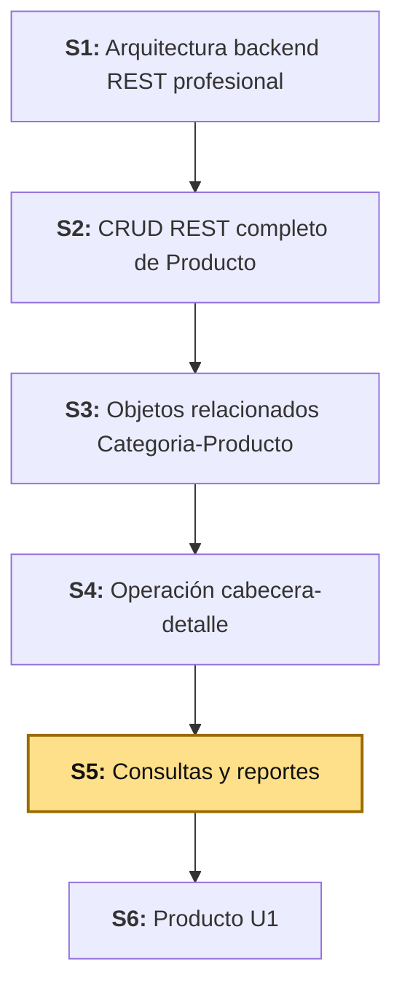
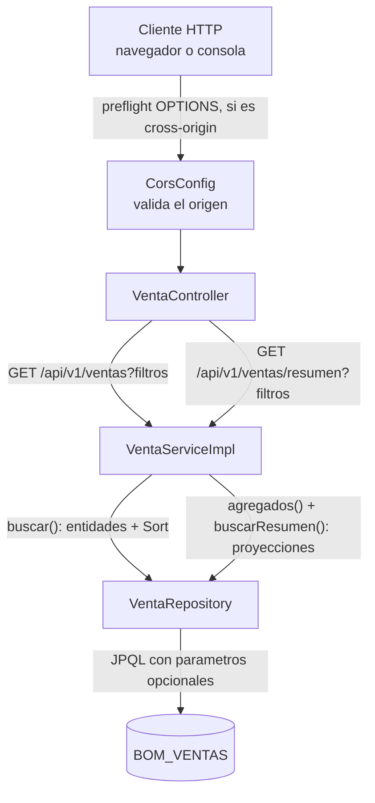

# S5 - Consultas Empresariales, Reportes REST y CORS

*Por: Angel Sullon Macalupu @asullom - 2026*

## 1. Introducción

Tiempo: 20 min.

### 1.1 Presentación de la sesión

La operación transaccional construida la sesión anterior ya registra datos reales — pero leerlos todos, sin filtros ni orden, deja de servir en cuanto el volumen crece: alcanza con tres registros de prueba, no con miles. Esta sesión no agrega un nuevo módulo de negocio: enseña a consultar bien lo que el módulo anterior ya escribe, con filtros combinados, ordenamiento y una proyección más liviana pensada para reportes — y cierra habilitando el acceso desde otro origen, la primera pieza que existe únicamente porque, dos sesiones más adelante, un navegador va a llamar a esta API desde fuera.

### 1.2 Índice

1. Filtros combinados y ordenamiento.
2. Proyecciones: DTO de reporte en vez de la entidad completa.
3. Agregaciones con funciones JPQL.
4. CORS para el futuro frontend.

### 1.3 Propósito de aprendizaje

Al concluir la clase, estarás en condiciones de:

- **Construir y probar** consultas REST con filtros combinados opcionales, ordenamiento configurable, una proyección ligera para reporte y un endpoint de agregados sobre datos reales generados por la operación transaccional de S4, y **configurar CORS** para que el futuro frontend (S7) pueda consumir la API sin que el navegador lo bloquee.

### 1.4 Producto de sesión

`GET /api/v1/ventas` ampliado con filtros combinados (`estado`, rango de fechas) y ordenamiento configurable, un nuevo `GET /api/v1/ventas/resumen` que devuelve agregados (conteo, monto total, ticket promedio) junto con un detalle resumido, y CORS configurado para el origen del futuro frontend.

### 1.5 Metodología

**Tabla 1. Metodología de la sesión**

| Actividades a Realizar en el Periodo | Orientaciones generales (Orientaciones Metodológicas) | Material de estudio recomendado |
|---|---|---|
| Revisión previa individual | Repasar `VentaRepository`/`VentaServiceImpl` (S4) y `ProductoRepository.findByCategoriaId` (S1, S3) como caso de filtro simple. Trabajo individual, antes de clase. | S1 (3.4.2), S3 (3.9), S4 (3.7-3.8). |
| Clase presencial | Construcción guiada de filtros combinados con parámetros opcionales, ordenamiento con `Sort`, proyecciones con expresión de constructor, agregaciones JPQL y configuración de CORS. Trabajo individual en la propia laptop, siguiendo al docente paso a paso. | Backend ejecutable (S1-S4), cliente REST para verificar endpoints. |
| Evaluación formativa | Verificación en clase de `GET /api/v1/ventas` con distintas combinaciones de filtros y orden, y de `GET /api/v1/ventas/resumen` con y sin resultados. La evidencia se completa y sustenta de forma individual, fuera del aula, según los criterios mínimos de la sección 4.4. | Indicaciones de entrega (4.3), rúbrica de evaluación (4.6). |

### 1.6 Motivación de la sesión

#### 1.6.1 Caso: el reporte que devolvió null

Un gerente revisa el dashboard de ventas del mes y filtra por una fecha en la que, esa semana, todavía no se registró ninguna venta. La pantalla muestra `montoTotal: null` en vez de `montoTotal: 0`. El frontend, que esperaba un número para hacer un cálculo, se rompe silenciosamente o muestra `NaN`. Nadie programó ese error a propósito: `SUM()` en SQL simplemente devuelve `NULL` cuando no hay filas que sumar, no `0` — es una propiedad conocida y documentada del lenguaje, no un bug de la base de datos.

Esta sesión no solo construye el reporte: prueba explícitamente el caso sin resultados, el que casi nunca se prueba, y lo obliga a devolver `0`, no `null`.

**Preguntas de análisis**

**Activación de conocimientos previos**

1. En S3, `ProductoRepository.findByCategoriaId(Long)` ya filtraba por un solo criterio, siempre obligatorio. ¿Qué cambia cuando el filtro combina varios criterios, todos opcionales?

**Comprensión de proyecciones y agregaciones**

1. Si no hay ninguna venta en el rango de fechas consultado, ¿qué debería devolver `montoTotal`: `null` o `0`? ¿Por qué le importa esa diferencia a quien consume la API?
2. `SIZE(v.detalles)` en una proyección de resumen no carga la colección `detalles` en memoria. ¿Por qué eso hace la consulta más liviana que `GET /api/v1/ventas/{id}`?

### 1.7 Ubicación en el curso

- Unidad: U1 - Base backend REST modular de BomERP.
- Producto del curso: base Full-Stack modular de BomERP.
- Producto de unidad: base backend modular de BomERP, con módulos de Catálogo, Inventario, Ventas y Compras delimitados.
- Avance del producto en esta sesión: `ventas` gana consultas con filtros, orden y reporte agregado; el backend queda listo para que un frontend (S7) lo consuma sin bloqueo de CORS.

Roadmap del producto de la unidad:

**Figura 1. Roadmap del producto de la unidad**



## 2. Explica

Tiempo: 30 min.

### 2.1 Arquitectura de la sesión

**Figura 2. Flujo de consulta filtrada y de reporte agregado**



`GET /api/v1/ventas` sigue devolviendo la entidad completa mapeada (con sus `detalles`), ahora filtrable y ordenable. `GET /api/v1/ventas/resumen` no reutiliza esa consulta: usa dos proyecciones distintas, más livianas, pensadas solo para lectura de reporte.

### 2.2 Filtros combinados con parámetros opcionales

Hasta ahora (S1-S4), cada consulta se resolvió con el nombre del método (`findByCategoriaId`, S3): Spring Data genera solo la consulta a partir de ese nombre, sin escribir nada más. Un filtro combinado y opcional ya no se puede expresar con un nombre de método — necesita su propia consulta, escrita a mano con `@Query`.

`@Query` recibe JPQL (*Jakarta Persistence Query Language*), no SQL: `FROM Venta v` nombra la **entidad** Java `Venta`, no la tabla Oracle `VENTAS`; `v.estado` nombra un **atributo** de esa entidad, no una columna — Spring Data traduce esa JPQL a SQL real recién al ejecutarla, el mismo motor de traducción que ya usa por detrás cualquier método derivado. Los `:estado`, `:desde` y `:hasta` que aparecen en el texto de la consulta son parámetros con nombre; `@Param("estado")` en la firma del método es lo que conecta cada uno con su parámetro Java — sin `@Param`, Spring Data no sabría qué valor corresponde a cada nombre dentro del texto.

Encadenar métodos derivados (`findByEstado`, `findByFechaBetween`, `findByEstadoAndFechaBetween`...) por cada combinación de filtros crece combinatoriamente: tres filtros opcionales ya son ocho combinaciones posibles. La alternativa es una sola consulta JPQL donde cada filtro se auto-anula cuando no se envía:

```jpql
WHERE (:estado IS NULL OR v.estado = :estado)
  AND (:desde IS NULL OR v.fecha >= :desde)
  AND (:hasta IS NULL OR v.fecha <= :hasta)
```

Cuando un parámetro llega `null`, la condición `:param IS NULL` es verdadera y esa cláusula no filtra nada; cuando llega con valor, filtra normalmente. Una sola consulta cubre las ocho combinaciones.

**`@EntityGraph` sobre una consulta propia, no solo sobre un método heredado.** S3 (2.6) ya usó `@EntityGraph` para evitar el problema N+1, siempre sobre un método que Spring Data generaba solo (`findAll()`). La consulta de filtros combina las dos cosas: el texto de la consulta lo escribes tú (`@Query`, arriba), y la carga optimizada de la colección `detalles` la sigue resolviendo `@EntityGraph`, aplicada sobre el resultado de esa misma consulta — no hace falta escribir `JOIN FETCH` a mano para lograr lo mismo que ya resolvía S3.

### 2.3 Ordenamiento con `Sort`

Un método de repositorio anotado con `@Query` puede recibir un parámetro `Sort` adicional: Spring Data lo traduce en una cláusula `ORDER BY` sobre el **tipo de la entidad consultada**, no sobre el DTO de salida. Pedir orden por un campo que no existe en `Venta` (por ejemplo, un campo que solo existe en la proyección de resumen) falla en tiempo de ejecución, no en compilación — se retoma en 3.7 como error frecuente.

### 2.4 Proyecciones: DTO de reporte en vez de la entidad completa

Una expresión de constructor JPQL (`SELECT new paquete.Clase(...)`) arma directamente un DTO desde la consulta, sin pasar por la entidad ni por su grafo de relaciones:

```jpql
SELECT new pe.edu.upeu.bomerp.ventas.venta.dto.VentaResumen(
    v.id, v.fecha, v.estado, v.total, SIZE(v.detalles))
FROM Venta v
```

`SIZE(v.detalles)` cuenta las filas de `DETALLE_VENTAS` en la propia base de datos; nunca carga la colección en memoria. Usa la entidad completa (`VentaResponse`, con `detalles`) cuando el cliente necesita accionar sobre cada línea; usa una proyección cuando solo necesita leer un resumen — un reporte de cien ventas con detalle completo carga cientos de filas de `DETALLE_VENTAS` que nadie va a mostrar.

Por la misma razón, esta consulta no lleva `@EntityGraph` (2.2): no devuelve la entidad `Venta` con su colección `detalles`, devuelve un DTO ya armado por la propia consulta — no hay ninguna colección perezosa que optimizar, porque no hay ninguna colección en el resultado.

### 2.5 Agregaciones con funciones JPQL

`COUNT`, `SUM` y `AVG` también pueden combinarse en una expresión de constructor, siempre que la consulta no mezcle columnas agregadas con columnas sueltas sin `GROUP BY`:

```jpql
SELECT new pe.edu.upeu.bomerp.ventas.venta.dto.VentaAgregado(
    COUNT(v), COALESCE(SUM(v.total), 0), COALESCE(AVG(v.total), 0))
FROM Venta v
```

`COALESCE(expresion, 0)` devuelve `0` cuando `expresion` es `NULL` — exactamente el caso de 1.6.1: sin filas que sumar, `SUM`/`AVG` son `NULL` por definición del lenguaje, y `COALESCE` es lo que evita propagar ese `null` hasta el cliente.

### 2.6 CORS: qué protege el navegador y qué no protege

CORS (*Cross-Origin Resource Sharing*) es una restricción que aplica el **navegador**, no el servidor. Cuando una página cargada desde un origen (por ejemplo, `http://localhost:4200`) hace `fetch` a otro origen (`http://localhost:8080`), el navegador exige que el servidor declare explícitamente ese origen como permitido; si no lo hace, el navegador descarta la respuesta antes de que el JavaScript de la página la vea — la petición HTTP sí llegó y sí se ejecutó en el servidor, la protección ocurre después, en el navegador.

Por eso `curl`, Postman o `Invoke-RestMethod` nunca muestran un error de CORS: ninguno de los dos es un navegador ejecutando JavaScript de una página, así que ninguno aplica esa restricción. Confirmar CORS exige probar desde un navegador real (3.8).

## 3. Aplica: actividad práctica guiada

Tiempo: 90 min.

### 3.1 Verificar el punto de partida

**Punto de partida común:** todo el equipo debe comenzar exactamente desde donde quedó S4, no desde su propio avance individual. Clona la rama `s04-operacion-cabecera-detalle` (el snapshot de cierre de S4):

```bash
git clone --branch s04-operacion-cabecera-detalle https://github.com/262ciclo4/bomerp.git
```

**Producto del paso:** confirmación de que `POST /api/v1/ventas` sigue registrando ventas correctamente antes de tocar código nuevo.

**Requisito antes de continuar:** confirma que `http://localhost:8080/api/v1/ventas` responde con datos antes de continuar. Si falla, el problema es de una sesión anterior, no de esta.

**Dato de prueba necesario para esta sesión:** los filtros y el reporte solo se pueden verificar con datos que los distingan. Registra al menos tres ventas más con `POST /api/v1/ventas` (3.10 de S4), variando la cantidad de detalles y dejando que ocurran en momentos distintos, para tener suficiente variedad al filtrar y ordenar en 3.7.

### 3.2 Ampliar `VentaRepository` con filtros, orden, proyección y agregado

**Producto del paso:** tres métodos nuevos en el repositorio: consulta filtrable/ordenable de entidades completas, proyección de resumen y agregado.

**`ventas/venta/repository/VentaRepository.java`**

```java
package pe.edu.upeu.bomerp.ventas.venta.repository;

import org.springframework.data.domain.Sort;
import org.springframework.data.jpa.repository.EntityGraph;
import org.springframework.data.jpa.repository.JpaRepository;
import org.springframework.data.jpa.repository.Query;
import org.springframework.data.repository.query.Param;
import pe.edu.upeu.bomerp.ventas.venta.dto.VentaAgregado;
import pe.edu.upeu.bomerp.ventas.venta.dto.VentaResumen;
import pe.edu.upeu.bomerp.ventas.venta.entity.EstadoVenta;
import pe.edu.upeu.bomerp.ventas.venta.entity.Venta;
import java.time.LocalDateTime;
import java.util.List;
import java.util.Optional;

public interface VentaRepository extends JpaRepository<Venta, Long> {

    @Override
    @EntityGraph(attributePaths = "detalles")
    Optional<Venta> findById(Long id);

    @EntityGraph(attributePaths = "detalles")
    @Query("""
        SELECT v FROM Venta v
        WHERE (:estado IS NULL OR v.estado = :estado)
          AND (:desde IS NULL OR v.fecha >= :desde)
          AND (:hasta IS NULL OR v.fecha <= :hasta)
        """)
    List<Venta> buscar(@Param("estado") EstadoVenta estado,
                        @Param("desde") LocalDateTime desde,
                        @Param("hasta") LocalDateTime hasta,
                        Sort sort);

    @Query("""
        SELECT new pe.edu.upeu.bomerp.ventas.venta.dto.VentaResumen(
            v.id, v.fecha, v.estado, v.total, SIZE(v.detalles))
        FROM Venta v
        WHERE (:estado IS NULL OR v.estado = :estado)
          AND (:desde IS NULL OR v.fecha >= :desde)
          AND (:hasta IS NULL OR v.fecha <= :hasta)
        """)
    List<VentaResumen> buscarResumen(@Param("estado") EstadoVenta estado,
                                      @Param("desde") LocalDateTime desde,
                                      @Param("hasta") LocalDateTime hasta,
                                      Sort sort);

    @Query("""
        SELECT new pe.edu.upeu.bomerp.ventas.venta.dto.VentaAgregado(
            COUNT(v), COALESCE(SUM(v.total), 0), COALESCE(AVG(v.total), 0))
        FROM Venta v
        WHERE (:estado IS NULL OR v.estado = :estado)
          AND (:desde IS NULL OR v.fecha >= :desde)
          AND (:hasta IS NULL OR v.fecha <= :hasta)
        """)
    VentaAgregado agregados(@Param("estado") EstadoVenta estado,
                             @Param("desde") LocalDateTime desde,
                             @Param("hasta") LocalDateTime hasta);
}
```

`findAll()` (S4) desaparece: `buscar()` con los tres parámetros en `null` produce el mismo resultado (todas las ventas, sin filtrar), así que ya no hace falta mantener las dos consultas por separado.

### 3.3 Crear los DTO de reporte: `VentaResumen`, `VentaAgregado` y `VentaReporte`

**Producto del paso:** los tres DTO que arman las expresiones de constructor de 3.2 y la respuesta final del endpoint de reporte.

**`ventas/venta/dto/VentaResumen.java`**

```java
package pe.edu.upeu.bomerp.ventas.venta.dto;

import lombok.Getter;
import pe.edu.upeu.bomerp.ventas.venta.entity.EstadoVenta;
import java.math.BigDecimal;
import java.time.LocalDateTime;

@Getter
public class VentaResumen {
    private final Long id;
    private final LocalDateTime fecha;
    private final String estado;
    private final BigDecimal total;
    private final long cantidadDetalles;

    public VentaResumen(Long id, LocalDateTime fecha, EstadoVenta estado, BigDecimal total, long cantidadDetalles) {
        this.id = id;
        this.fecha = fecha;
        this.estado = estado.name();
        this.total = total;
        this.cantidadDetalles = cantidadDetalles;
    }
}
```

**`ventas/venta/dto/VentaAgregado.java`**

```java
package pe.edu.upeu.bomerp.ventas.venta.dto;

import lombok.AllArgsConstructor;
import lombok.Getter;
import java.math.BigDecimal;

@Getter
@AllArgsConstructor
public class VentaAgregado {
    private final long totalVentas;
    private final BigDecimal montoTotal;
    private final BigDecimal ticketPromedio;
}
```

**`ventas/venta/dto/VentaReporte.java`**

```java
package pe.edu.upeu.bomerp.ventas.venta.dto;

import lombok.AllArgsConstructor;
import lombok.Getter;
import java.util.List;

@Getter
@AllArgsConstructor
public class VentaReporte {
    private final VentaAgregado agregado;
    private final List<VentaResumen> ventas;
}
```

`VentaResumen` recibe `EstadoVenta` en el constructor (el tipo real de la columna en la consulta JPQL) y lo convierte a `String` con `.name()` para exponerlo — el mismo criterio que ya usa `VentaResponse` (S4).

### 3.4 Ampliar `VentaService`/`VentaServiceImpl`

**Producto del paso:** `listar()` se reemplaza por `buscar()` con filtros y orden; se agrega `reporte()`.

**`ventas/venta/service/VentaService.java`**

```java
package pe.edu.upeu.bomerp.ventas.venta.service;

import pe.edu.upeu.bomerp.ventas.venta.dto.VentaReporte;
import pe.edu.upeu.bomerp.ventas.venta.dto.VentaRequest;
import pe.edu.upeu.bomerp.ventas.venta.dto.VentaResponse;
import pe.edu.upeu.bomerp.ventas.venta.entity.EstadoVenta;
import java.time.LocalDateTime;
import java.util.List;

public interface VentaService {
    List<VentaResponse> buscar(EstadoVenta estado, LocalDateTime desde, LocalDateTime hasta,
                                String ordenarPor, String direccion);
    VentaResponse obtener(Long id);
    VentaResponse crear(VentaRequest request);
    VentaReporte reporte(EstadoVenta estado, LocalDateTime desde, LocalDateTime hasta);
}
```

**`ventas/venta/service/VentaServiceImpl.java`** (agrega estos dos métodos y quita `listar()`; `obtener()` y `crear()` no cambian)

```java
    @Override
    @Transactional(readOnly = true)
    public List<VentaResponse> buscar(EstadoVenta estado, LocalDateTime desde, LocalDateTime hasta,
                                       String ordenarPor, String direccion) {
        Sort.Direction dir = "ASC".equalsIgnoreCase(direccion) ? Sort.Direction.ASC : Sort.Direction.DESC;
        Sort sort = Sort.by(dir, ordenarPor);
        return ventaRepository.buscar(estado, desde, hasta, sort).stream().map(ventaMapper::toResponse).toList();
    }

    @Override
    @Transactional(readOnly = true)
    public VentaReporte reporte(EstadoVenta estado, LocalDateTime desde, LocalDateTime hasta) {
        VentaAgregado agregado = ventaRepository.agregados(estado, desde, hasta);
        Sort sort = Sort.by(Sort.Direction.DESC, "fecha");
        List<VentaResumen> ventas = ventaRepository.buscarResumen(estado, desde, hasta, sort);
        return new VentaReporte(agregado, ventas);
    }
```

Agrega los imports que falten: `org.springframework.data.domain.Sort`, `pe.edu.upeu.bomerp.ventas.venta.dto.VentaAgregado`, `pe.edu.upeu.bomerp.ventas.venta.dto.VentaReporte` y `pe.edu.upeu.bomerp.ventas.venta.dto.VentaResumen`.

`reporte()` hace dos consultas, no una: `agregados()` (una fila con `COUNT`/`SUM`/`AVG`) y `buscarResumen()` (una fila por venta) no se pueden combinar en una sola consulta JPQL sin `GROUP BY` — mezclar una columna agregada con columnas sueltas de la misma fila no es válido en SQL/JPQL.

### 3.5 Ampliar `VentaController`

**Producto del paso:** `GET /api/v1/ventas` acepta filtros y orden opcionales; nuevo `GET /api/v1/ventas/resumen`.

**`ventas/venta/controller/VentaController.java`**

```java
package pe.edu.upeu.bomerp.ventas.venta.controller;

import io.swagger.v3.oas.annotations.Operation;
import io.swagger.v3.oas.annotations.tags.Tag;
import jakarta.validation.Valid;
import lombok.RequiredArgsConstructor;
import lombok.extern.slf4j.Slf4j;
import org.springframework.format.annotation.DateTimeFormat;
import org.springframework.http.HttpStatus;
import org.springframework.http.ResponseEntity;
import org.springframework.web.bind.annotation.*;
import pe.edu.upeu.bomerp.ventas.venta.dto.VentaReporte;
import pe.edu.upeu.bomerp.ventas.venta.dto.VentaRequest;
import pe.edu.upeu.bomerp.ventas.venta.dto.VentaResponse;
import pe.edu.upeu.bomerp.ventas.venta.entity.EstadoVenta;
import pe.edu.upeu.bomerp.ventas.venta.service.VentaService;
import java.time.LocalDateTime;
import java.util.List;

@Slf4j
@Tag(name = "Ventas")
@RestController
@RequestMapping("/api/v1/ventas")
@RequiredArgsConstructor
public class VentaController {
    private final VentaService ventaService;

    @Operation(summary = "Consulta ventas con filtros combinados y ordenamiento opcionales")
    @GetMapping
    public ResponseEntity<List<VentaResponse>> buscar(
            @RequestParam(required = false) EstadoVenta estado,
            @RequestParam(required = false) @DateTimeFormat(iso = DateTimeFormat.ISO.DATE_TIME) LocalDateTime desde,
            @RequestParam(required = false) @DateTimeFormat(iso = DateTimeFormat.ISO.DATE_TIME) LocalDateTime hasta,
            @RequestParam(defaultValue = "fecha") String ordenarPor,
            @RequestParam(defaultValue = "DESC") String direccion) {
        log.info("Consultando ventas estado={} desde={} hasta={} ordenarPor={} direccion={}",
                estado, desde, hasta, ordenarPor, direccion);
        return ResponseEntity.ok(ventaService.buscar(estado, desde, hasta, ordenarPor, direccion));
    }

    @Operation(summary = "Genera un reporte de ventas: agregados y detalle resumido")
    @GetMapping("/resumen")
    public ResponseEntity<VentaReporte> resumen(
            @RequestParam(required = false) EstadoVenta estado,
            @RequestParam(required = false) @DateTimeFormat(iso = DateTimeFormat.ISO.DATE_TIME) LocalDateTime desde,
            @RequestParam(required = false) @DateTimeFormat(iso = DateTimeFormat.ISO.DATE_TIME) LocalDateTime hasta) {
        return ResponseEntity.ok(ventaService.reporte(estado, desde, hasta));
    }

    @Operation(summary = "Consulta una venta por id, con sus detalles")
    @GetMapping("/{id}")
    public ResponseEntity<VentaResponse> obtener(@PathVariable Long id) {
        return ResponseEntity.ok(ventaService.obtener(id));
    }

    @Operation(summary = "Registra una venta con sus detalles, descontando stock")
    @PostMapping
    @ResponseStatus(HttpStatus.CREATED)
    public VentaResponse crear(@Valid @RequestBody VentaRequest request) {
        return ventaService.crear(request);
    }
}
```

El método que antes se llamaba `listar()` ahora es `buscar()`, con los mismos parámetros que el servicio. `obtener()` y `crear()` no cambian.

### 3.6 Configurar CORS para el futuro frontend

**Producto del paso:** el backend acepta peticiones cross-origin desde `http://localhost:4200` (el puerto por defecto de Angular, que se usará desde S7), configurable por ambiente.

**`application-dev.yml`** (agrega al final)

```yaml
bomerp:
  cors:
    allowed-origin: http://localhost:4200
```

**`CorsConfig.java`** (nuevo, en la raíz del paquete `pe.edu.upeu.bomerp`, junto a `OpenApiConfig`)

```java
package pe.edu.upeu.bomerp;

import org.springframework.beans.factory.annotation.Value;
import org.springframework.context.annotation.Configuration;
import org.springframework.web.servlet.config.annotation.CorsRegistry;
import org.springframework.web.servlet.config.annotation.WebMvcConfigurer;

@Configuration
public class CorsConfig implements WebMvcConfigurer {

    @Value("${bomerp.cors.allowed-origin}")
    private String allowedOrigin;

    @Override
    public void addCorsMappings(CorsRegistry registry) {
        registry.addMapping("/api/**")
                .allowedOrigins(allowedOrigin)
                .allowedMethods("GET", "POST", "PUT", "PATCH", "DELETE")
                .allowedHeaders("*");
    }
}
```

El origen permitido queda en `application-dev.yml`, no fijo en el código: en producción va a ser otro dominio, y esta clase no debería cambiar entre ambientes — solo la propiedad. `allowedOrigins` exige un valor explícito y nunca `"*"` en este proyecto: S10 incorpora JWT, y un origen comodín es incompatible con credenciales (cookies o cabeceras de autenticación) en la especificación CORS.

### 3.7 Probar filtros, ordenamiento y el reporte

Con el backend corriendo y al menos cuatro ventas registradas (3.1):

```powershell
# Sin filtros: todas las ventas, ordenadas por fecha descendente (valor por defecto)
Invoke-RestMethod -Uri "http://localhost:8080/api/v1/ventas"

# Filtrar por estado
Invoke-RestMethod -Uri "http://localhost:8080/api/v1/ventas?estado=REGISTRADA"

# Filtrar por rango de fechas (formato ISO completo, con hora)
Invoke-RestMethod -Uri "http://localhost:8080/api/v1/ventas?desde=2026-09-01T00:00:00&hasta=2026-09-30T23:59:59"

# Ordenar por total, ascendente
Invoke-RestMethod -Uri "http://localhost:8080/api/v1/ventas?ordenarPor=total&direccion=ASC"

# Reporte agregado de todas las ventas
Invoke-RestMethod -Uri "http://localhost:8080/api/v1/ventas/resumen"

# Reporte agregado de un rango sin ventas (verifica que monto y ticket sean 0, no null)
Invoke-RestMethod -Uri "http://localhost:8080/api/v1/ventas/resumen?desde=2020-01-01T00:00:00&hasta=2020-01-02T00:00:00"
```

**Error frecuente**: pedir `ordenarPor=cantidadDetalles`. `cantidadDetalles` existe en `VentaResumen` (la proyección), no en `Venta` (la entidad que consulta `buscar()`); Spring Data valida `Sort` contra los campos de `Venta`, y responde con un error 500 y un mensaje de la forma `PropertyReferenceException: No property 'cantidadDetalles' found for type 'Venta'`. Los valores válidos de `ordenarPor` para `GET /api/v1/ventas` son los campos de `Venta`: `id`, `fecha`, `estado`, `total`.

**Error frecuente**: enviar `desde=2026-09-01` sin la hora. `@DateTimeFormat(iso = DateTimeFormat.ISO.DATE_TIME)` exige el formato completo (`2026-09-01T00:00:00`); una fecha sin hora falla la conversión del parámetro y Spring responde `400 Bad Request` antes de que la petición llegue al controlador.

### 3.8 Probar CORS

Ni `Invoke-RestMethod` ni Postman muestran un error de CORS (2.6) — hace falta un navegador ejecutando JavaScript desde otro origen. Como el frontend real recién se construye en S7, simula un origen distinto con un servidor estático mínimo:

```bash
mkdir origen-prueba
cd origen-prueba
python -m http.server 5500
```

Abre `http://localhost:5500` en el navegador, abre las herramientas de desarrollador (consola) y ejecuta:

```javascript
fetch("http://localhost:8080/api/v1/ventas").then(r => r.json()).then(console.log);
```

**Con `allowed-origin: http://localhost:4200`** (3.6), esta llamada desde `http://localhost:5500` debe fallar en la consola con un mensaje que menciona CORS y `Access-Control-Allow-Origin`. Cambia temporalmente la propiedad a `http://localhost:5500`, reinicia el backend y repite el `fetch`: ahora debe completarse y mostrar el arreglo de ventas en consola. Vuelve a dejar la propiedad en `http://localhost:4200` antes de continuar — es el puerto real que va a usar la SPA desde S7.

### 3.9 Relacionar con ADS y BD2

Sesión equivalente en los otros dos cursos, misma semana: [ADS - S5 Evaluación de la Unidad I](../../ads/sesiones/S05_Evaluacion_Unidad_1.md) evalúa lo construido en S1-S4, sin contenido nuevo esta semana. BD2 S5 construye índices B-Tree y por selectividad — los mismos campos que esta sesión usa para filtrar y ordenar (`ESTADO`, `FECHA`) son los candidatos naturales a indexar; sin ese índice, `GET /api/v1/ventas?estado=REGISTRADA` funciona igual desde el backend, pero Oracle recorre toda la tabla para resolverlo. BD2 todavía no publica su guía de S5.

### 3.10 (opcional, anexo) Levantar Grafana con Prometheus y Loki como fuentes de datos

!!! note "3.10-3.14 son opcionales"
    Dependen de 3.13 y 3.14 de S4: sin Prometheus ni Loki corriendo, Grafana no tiene qué mostrar. El alcance evaluado de S5 termina en 3.9 (4.4, 4.6); este paso es para quien ya completó los dos anteriores y quiere verlos juntos en un solo tablero, en vez de alternar entre la UI de Prometheus y las consultas de Loki por separado.

**Producto del paso:** un Grafana propio, con Prometheus y Loki agregados como fuentes de datos automáticamente (sin configurarlos a mano desde la UI), corriendo en paralelo al resto del stack.

Crea `lp2/obs/grafana/provisioning/datasources/datasources-dev.yml`:

```yaml
apiVersion: 1

datasources:
  - name: Prometheus
    type: prometheus
    access: proxy
    url: http://bomerp-prometheus:9090
    isDefault: true

  - name: Loki
    type: loki
    access: proxy
    url: http://bomerp-loki:3100
```

`url` usa el nombre del servicio de Docker Compose (`bomerp-prometheus`, `bomerp-loki`), no `localhost`: Grafana consulta a los otros contenedores por la red interna que Compose crea automáticamente, la misma razón por la que `prometheus-dev.yml` (S4, 3.13) usa `host.docker.internal` para llegar a `bomerp-backend`, que corre fuera de Docker.

Agrega Grafana a `lp2/obs/compose-dev.yml` (junto a `bomerp-prometheus`, `bomerp-loki` y `bomerp-promtail`, ya construidos en S4):

```yaml
  bomerp-grafana:
    image: grafana/grafana:11.4.0
    container_name: bomerp-grafana-dev
    restart: unless-stopped
    ports:
      - "33000:3000"
    environment:
      - GF_SECURITY_ADMIN_PASSWORD=admin
    volumes:
      - ./grafana/provisioning:/etc/grafana/provisioning:ro
    depends_on:
      - bomerp-prometheus
      - bomerp-loki
```

`33000` sigue el mismo criterio de puertos que Prometheus (`39090`) y Loki (`33100`): el prefijo `3` identifica a LP2 DEV, evitando cualquier Grafana que DIST agregue después en `1????`/`2????`. Si más adelante DIST agrega su propio Grafana, el puerto que le corresponde por el mismo criterio es `13000` (prefijo `1`, DEV) o `23000` (prefijo `2`, PROD); si BigData agrega el suyo, `53000` (prefijo `5`).

Vuelve a levantar el stack con el archivo actualizado:

```bash
cd lp2/obs
docker compose -f compose-dev.yml up -d
```

Abre `http://localhost:33000` (usuario `admin`, contraseña `admin` — Grafana pide cambiarla al primer ingreso; en DEV puedes omitirlo). Ve a **Connections → Data sources** y confirma que `Prometheus` y `Loki` ya aparecen configurados, sin haberlos agregado a mano — eso es lo que hizo `datasources-dev.yml` al arrancar el contenedor.

Para verificar que ambas fuentes responden, crea un panel nuevo (**Dashboards → New → New dashboard → Add visualization**) y prueba una consulta de cada una:

- Con la fuente `Prometheus`: `up{job="bomerp-backend"}` (S4, 3.13) — el mismo dato que ya viste en la UI de Prometheus, ahora dentro de Grafana.
- Con la fuente `Loki`: `{application="bomerp-backend"} |= "Started BomerpBackendApplication"` (S4, 3.14) — el mismo log, con el mismo lenguaje de consulta (LogQL) que ya usaste por API.

Lo que cambia no es el dato ni la consulta — es tener ambas fuentes, métricas y logs, en el mismo tablero, algo que ni Prometheus ni Loki ofrecen por separado. Los pasos siguientes (3.11-3.14) construyen un tablero real sobre esta base, no solo un panel de prueba.

### 3.11 (opcional, anexo) Tablero y alertas de infraestructura

**Producto del paso:** un tablero de infraestructura con las métricas y los logs que ya construiste en S4 (3.13-3.14) — ahora visualizados en Grafana, no solo consultados por API —, más alertas que avisan solas cuando algo falla.

Antes de construir nada de negocio (3.12-3.13), lo primero que un equipo real pone en un tablero es la salud de lo que ya tiene corriendo. Ninguna de las consultas de este paso es nueva: son exactamente las que S4 ya verificó por API o por navegador; lo único distinto es que ahora quedan visibles todo el tiempo, en un tablero, no una vez, en una terminal.

**Cómo se agrega cada panel (primera vez en Grafana, sigue estos pasos para los seis paneles):**

1. Abre `http://localhost:33000`. En el menú de la izquierda, entra a **Dashboards** → botón **New** (arriba a la derecha) → **New dashboard**.
2. Clic en **+ Add visualization**. En el diálogo que aparece, elige la fuente de datos: `Prometheus` para métricas, `Loki` para logs.
3. Se abre el editor de panel. En el campo de consulta, debajo del gráfico, pega la consulta del panel. Si el panel necesita una segunda consulta en el mismo gráfico (el Panel 3, más abajo), clic en **+ Query** para agregar una fila más.
4. A la derecha del editor, en **Panel options → Title**, escribe el título del panel (por ejemplo, "Estado del backend").
5. Justo arriba de **Panel options**, hay un selector de tipo de visualización — cámbialo a **Stat**, **Time series** o **Logs**, según lo que indica cada panel.
6. Clic en **Save** (arriba a la derecha del editor) para volver al tablero, ya con el panel agregado.
7. Para el siguiente panel, desde la vista del tablero, clic en **+ Add** (arriba) → **Visualization**, y repite desde el paso 2.

**Panel 1 — Estado del backend (Stat):**

```promql
up{job="bomerp-backend"}
```

**Panel 2 — Tiempo de actividad (Stat):**

```promql
process_uptime_seconds{job="bomerp-backend"}
```

**Panel 3 — Conexiones a Oracle (Time series, dos consultas en el mismo panel):**

```promql
hikaricp_connections_active
hikaricp_connections_max
```

**Panel 4 — Peticiones HTTP por segundo (Time series):**

```promql
rate(http_server_requests_seconds_count{job="bomerp-backend"}[1m])
```

**Panel 5 — Logs recientes (Logs, fuente `Loki`):**

```logql
{application="bomerp-backend"}
```

**Panel 6 — Errores recientes (Logs, fuente `Loki`):**

```logql
{application="bomerp-backend", detected_level="error"}
```

Guarda el tablero con el nombre `BomERP - Infraestructura` — distinto del tablero de negocio que construyen 3.12-3.13.

**Buscar una línea específica, sin pegar URLs a mano: `Explore`.** S4 (3.14) encontró líneas puntuales pegando la consulta directo en la URL del navegador contra la API de Loki — funciona, pero es incómodo para explorar: cada búsqueda nueva significa editar la URL a mano. Grafana tiene una herramienta dedicada justo para esto:

1. En el menú de la izquierda, entra a **Explore** (ícono de brújula).
2. Elige la fuente `Loki` en el selector de arriba.
3. En el campo de consulta, pega el mismo LogQL que ya usaste por API — por ejemplo, para encontrar el arranque de la sesión de traceId de S4 (3.14):

```logql
{application="bomerp-backend"} |= "Listando"
```

4. Clic en **Run query** (o Ctrl+Enter). Las líneas que contienen `"Listando"` aparecen resaltadas, con el término buscado marcado en el texto — la misma "aguja en el pajar" que antes tenías que encontrar leyendo el JSON crudo de la API.

Prueba también el rollback de S4 (3.10 de S4), con la misma mecánica, solo cambiando el texto buscado:

```logql
{application="bomerp-backend"} |= "StockInsuficienteException"
```

`Explore` no reemplaza los paneles del tablero (3.11, arriba): un panel muestra siempre lo mismo, para cualquiera que abra el tablero; `Explore` es para preguntas puntuales, del momento — la herramienta correcta cuando no sabes de antemano qué vas a buscar, en vez de crear un panel nuevo por cada búsqueda.

**Alertas: que Grafana avise, no que alguien tenga que quedarse mirando el tablero.** Un tablero sirve mientras alguien lo está viendo; una alerta sigue funcionando aunque nadie lo mire.

**Cómo se crea cada regla de alerta (sigue estos pasos para las dos alertas):**

1. En el menú de la izquierda, entra a **Alerting** → **Alert rules** → botón **+ New alert rule** (arriba a la derecha).
2. En **Enter alert rule name**, escribe el nombre de la regla (por ejemplo, "Backend caído").
3. En **Define query and alert condition**, confirma que la fuente sea `Prometheus` y pega la consulta en el editor de la consulta **A**.
4. Debajo, en la pestaña **Threshold**, define la condición: elige el operador (`IS BELOW` o `IS ABOVE`, según la alerta) y escribe el valor.
5. En **Set evaluation behavior**, crea una carpeta nueva escribiendo su nombre (por ejemplo, `BomERP`) y un grupo de evaluación; en **Evaluate every** define cada cuánto se revisa la condición, y en **for**, cuánto tiempo debe sostenerse antes de pasar a *Firing*.
6. Sin tocar **Configure labels and notifications** (queda sin *contact point* por ahora, ver más abajo), clic en **Save rule and exit** (arriba a la derecha).

**Alerta 1 — Backend caído:**

- Consulta (fuente `Prometheus`): `up{job="bomerp-backend"}`
- Condición: `IS BELOW 1`
- Evaluar cada `10s`, durante (`for`) `1m` antes de pasar a *Firing* — evita que una caída de un segundo (un reinicio normal) dispare la alerta de más.

**Alerta 2 — Pool de conexiones cerca del límite:**

- Consulta (fuente `Prometheus`): `hikaricp_connections_active / hikaricp_connections_max`
- Condición: `IS ABOVE 0.8`
- Evaluar cada `30s`, durante `2m`.

Sin *contact point* configurado, la alerta igual cambia de estado (*Normal* → *Pending* → *Firing*) y queda visible en **Alerting → Alert rules**, que alcanza para esta sesión. Conectar un canal real de notificación (correo, Slack) queda fuera de este anexo.

**Prueba la Alerta 1 provocándola de verdad:** detén `bomerp-backend` (`Ctrl+C` en la terminal donde corre) y observa el estado de la regla en **Alerting → Alert rules** — debería pasar de *Normal* a *Pending* y, pasado el minuto configurado, a *Firing*. Vuelve a levantar el backend y confirma que regresa solo a *Normal*.

### 3.12 (opcional, anexo) Métricas de negocio con Micrometer

Con la infraestructura ya en su propio tablero y con alertas (3.11), esta es la pieza que le falta al negocio: métricas propias de lo que la aplicación hace, no de cómo está corriendo.

**Producto del paso:** `bomerp-backend` emitiendo métricas propias del negocio, listas para Prometheus.

`up{job="bomerp-backend"}` o `hikaricp_connections_active` (S4, 3.13) dicen si el backend está vivo y cuántas conexiones usa — nada sobre cuántas ventas se registraron ni cuántas se rechazaron. Esas preguntas no las responde ninguna métrica que Spring Boot exponga por defecto: hay que emitirlas explícitamente, en el momento exacto en que el evento de negocio ocurre.

**Por qué no simplemente hacer que Grafana consulte Oracle cada pocos segundos:** parecería más directo — el dato ya vive ahí —, pero convierte cada refresco del tablero en una consulta más contra la base de datos de producción, y no es así como Prometheus/Grafana están pensados para trabajar: un `Counter` en memoria, incrementado por la propia aplicación en el instante del evento, cuesta prácticamente nada, y Prometheus solo lo *raspa* (`scrape`) cada 15 segundos (`prometheus-dev.yml`, S4 3.13) — la aplicación nunca es consultada más seguido de lo que ella misma decide.

Agrega `MeterRegistry` a `VentaServiceImpl` (registra una venta exitosa):

```java
package pe.edu.upeu.bomerp.ventas.venta.service;

import io.micrometer.core.instrument.MeterRegistry;
import lombok.RequiredArgsConstructor;
import org.springframework.stereotype.Service;
import org.springframework.transaction.annotation.Transactional;
import pe.edu.upeu.bomerp.catalogo.producto.dto.ProductoResponse;
import pe.edu.upeu.bomerp.catalogo.producto.service.ProductoService;
import pe.edu.upeu.bomerp.exception.ResourceNotFoundException;
import pe.edu.upeu.bomerp.ventas.venta.dto.*;
import pe.edu.upeu.bomerp.ventas.venta.entity.DetalleVenta;
import pe.edu.upeu.bomerp.ventas.venta.entity.EstadoVenta;
import pe.edu.upeu.bomerp.ventas.venta.entity.Venta;
import pe.edu.upeu.bomerp.ventas.venta.mapper.VentaMapper;
import pe.edu.upeu.bomerp.ventas.venta.repository.VentaRepository;
import java.math.BigDecimal;
import java.time.LocalDateTime;
import java.util.List;

@Service
@RequiredArgsConstructor
public class VentaServiceImpl implements VentaService {
    private final VentaRepository ventaRepository;
    private final ProductoService productoService;
    private final VentaMapper ventaMapper;
    private final MeterRegistry meterRegistry;

    // ... buscar(), obtener() sin cambios ...

    @Override
    @Transactional
    public VentaResponse crear(VentaRequest request) {
        Venta venta = new Venta();
        venta.setFecha(LocalDateTime.now());
        venta.setEstado(EstadoVenta.REGISTRADA);

        BigDecimal total = BigDecimal.ZERO;
        for (DetalleVentaRequest detalleRequest : request.getDetalles()) {
            ProductoResponse producto = productoService.obtener(detalleRequest.getProductoId());
            productoService.descontarStock(detalleRequest.getProductoId(), detalleRequest.getCantidad());

            DetalleVenta detalle = ventaMapper.toDetalle(detalleRequest, producto);
            detalle.setVenta(venta);
            venta.getDetalles().add(detalle);
            total = total.add(detalle.getSubtotal());
        }
        venta.setTotal(total);

        VentaResponse response = ventaMapper.toResponse(ventaRepository.save(venta));
        meterRegistry.counter("bomerp_ventas_registradas_total").increment();
        meterRegistry.summary("bomerp_ventas_monto").record(total.doubleValue());
        return response;
    }
}
```

Solo se agregó el campo `meterRegistry` (Spring lo inyecta solo: `micrometer-registry-prometheus` ya está en el `pom.xml` desde S4, 3.13) y dos líneas al final de `crear()` — el resto del método no cambia. `counter(...).increment()` suma uno cada vez que se llama; `summary(...).record(valor)` acumula el valor (aquí, el monto de cada venta), y Prometheus lo expone como dos series: `bomerp_ventas_monto_count` (cuántas ventas) y `bomerp_ventas_monto_sum` (cuánto sumaron en total) — de ahí se calculan tanto el total vendido como el ticket promedio (3.13).

Registra el rechazo en `GlobalExceptionHandler` — un solo lugar captura **todas** las ventas rechazadas por stock insuficiente, sin importar desde qué método se dispare la excepción:

```java
package pe.edu.upeu.bomerp.exception;

import io.micrometer.core.instrument.MeterRegistry;
import lombok.RequiredArgsConstructor;
import org.springframework.http.HttpStatus;
import org.springframework.http.ResponseEntity;
import org.springframework.web.bind.MethodArgumentNotValidException;
import org.springframework.web.bind.annotation.ExceptionHandler;
import org.springframework.web.bind.annotation.RestControllerAdvice;

import java.time.Instant;
import java.util.HashMap;
import java.util.Map;

@RestControllerAdvice
@RequiredArgsConstructor
public class GlobalExceptionHandler {
    private final MeterRegistry meterRegistry;

    // ... handleNotFound(), handleValidation() sin cambios ...

    @ExceptionHandler(StockInsuficienteException.class)
    public ResponseEntity<Map<String, Object>> handleStockInsuficiente(StockInsuficienteException ex) {
        meterRegistry.counter("bomerp_ventas_rechazadas_total", "motivo", "stock_insuficiente").increment();

        Map<String, Object> body = new HashMap<>();
        body.put("timestamp", Instant.now().toString());
        body.put("status", HttpStatus.CONFLICT.value());
        body.put("error", "Conflict");
        body.put("message", ex.getMessage());
        return ResponseEntity.status(HttpStatus.CONFLICT).body(body);
    }
}
```

El `"motivo"` como etiqueta (*tag*), no como parte del nombre de la métrica, es lo que permite en 3.13 desglosar rechazos por causa sin crear una métrica nueva por cada una — hoy solo existe `"stock_insuficiente"`, pero si más adelante aparece otro motivo de rechazo, se suma como un valor más de la misma etiqueta.

Reinicia `bomerp-backend`, genera al menos tres ventas exitosas (`POST /api/v1/ventas`, 3.10 de S4) y al menos una rechazada por stock insuficiente, y verifica que las métricas nuevas aparezcan:

```powershell
(Invoke-RestMethod -Uri "http://localhost:8080/actuator/prometheus") -match "bomerp_ventas"
```

Resultado esperado: líneas con `bomerp_ventas_registradas_total`, `bomerp_ventas_monto_count`, `bomerp_ventas_monto_sum` y `bomerp_ventas_rechazadas_total{motivo="stock_insuficiente",...}`.

### 3.13 (opcional, anexo) Diseñar el tablero de ventas en tiempo real

**Producto del paso:** un tablero de Grafana con el negocio en vivo — ventas por minuto, monto vendido, ticket promedio y rechazos por motivo —, actualizándose solo.

Abre `http://localhost:33000` (3.10, más arriba) y crea un tablero **nuevo**, distinto del de infraestructura (3.11): **Dashboards → New → New dashboard**. Cada panel se agrega con **Add visualization**, eligiendo la fuente `Prometheus`, pegando la consulta, y ajustando el tipo de visualización a la derecha.

**Panel 1 — Ventas por minuto (Time series):**

```promql
rate(bomerp_ventas_registradas_total[1m]) * 60
```

`rate()` calcula la velocidad de crecimiento del contador por segundo, dentro de la ventana `[1m]`; multiplicar por `60` la convierte a "ventas por minuto", una unidad que se lee de un vistazo — el mismo tipo de cálculo que ya usaste conceptualmente en BD2 (tasa sobre una ventana de tiempo), ahora en PromQL en vez de SQL.

**Panel 2 — Monto vendido, últimos 5 minutos (Stat):**

```promql
increase(bomerp_ventas_monto_sum[5m])
```

`increase()` es `rate()` sin normalizar a "por segundo" — directamente cuánto creció la suma dentro de la ventana. Este panel responde una versión en vivo, aproximada y barata, de lo que `GET /api/v1/ventas/resumen` (3.5) responde bajo demanda, exacto y consultando Oracle: son dos herramientas distintas para preguntas parecidas, no una que reemplaza a la otra.

**Panel 3 — Ticket promedio, tiempo real (Gauge):**

```promql
rate(bomerp_ventas_monto_sum[5m]) / rate(bomerp_ventas_monto_count[5m])
```

Dividir la tasa de la suma entre la tasa del conteo da el promedio dentro de la ventana — el mismo `AVG(v.total)` de `VentaAgregado` (3.3), calculado aquí sin tocar la base de datos.

**Panel 4 — Ventas rechazadas por motivo (Bar gauge):**

```promql
sum by (motivo) (bomerp_ventas_rechazadas_total)
```

`sum by (motivo)` agrupa por la etiqueta agregada en 3.12 — con un solo motivo hoy, la barra es una; el panel ya queda listo para el día en que exista un segundo motivo de rechazo, sin cambiar la consulta.

**Actualización casi en vivo:** en la esquina superior derecha del tablero, abre el selector de rango de tiempo y elige **Last 30 minutes**; al lado, en el selector de refresco, escribe `10s`. Con eso el tablero vuelve a consultar Prometheus cada 10 segundos — coherente con las ventanas `[1m]`/`[5m]` de las consultas: un refresco más lento que la ventana haría que el tablero se sintiera desactualizado; uno mucho más rápido no aporta nada, porque Prometheus solo tiene datos nuevos cada 15 segundos (el `scrape_interval` de `prometheus-dev.yml`).

Guarda el tablero (ícono de guardar, arriba) con el nombre `BomERP - Ventas en tiempo real`.

**Negocio e infraestructura, uno al lado del otro:** con los dos tableros abiertos en pestañas distintas — `BomERP - Infraestructura` (3.11) y `BomERP - Ventas en tiempo real` (arriba) —, un salto en "Ventas rechazadas por motivo" se explica mirando, en el mismo rango de tiempo, el panel de errores del tablero de infraestructura: las líneas `StockInsuficienteException` reales del instante en que ocurrió el salto. Es la misma correlación métricas-logs de S4 (3.14), ahora visible sin cambiar de herramienta ni escribir una consulta nueva — solo cambiando de pestaña.

### 3.14 (opcional, anexo) Guardar los tableros como código

**Producto del paso:** los dos tableros (3.11 y 3.12-3.13) provisionados automáticamente, igual que ya están las fuentes de datos (3.10) — sobreviven a un `docker compose down` sin reconstruirlos a mano.

Exporta el JSON de cada tablero por separado: ícono de engranaje (**Dashboard settings**) → **JSON Model** → copia el contenido completo. Guarda cada uno con su propio nombre:

- `lp2/obs/grafana/provisioning/dashboards/bomerp-infraestructura.json` (3.11)
- `lp2/obs/grafana/provisioning/dashboards/bomerp-ventas.json` (3.12-3.13)

Las reglas de alerta (3.11) se exportan aparte, desde **Alerting → Alert rules**, con el mismo ícono de exportar de cada regla; guárdalas como `lp2/obs/grafana/provisioning/alerting/bomerp-alertas-dev.yml` si quieres que también se autoprovisionen — opcional, no imprescindible para esta sesión.

Crea `lp2/obs/grafana/provisioning/dashboards/dashboards-dev.yml`:

```yaml
apiVersion: 1

providers:
  - name: BomERP
    folder: BomERP
    type: file
    options:
      path: /etc/grafana/provisioning/dashboards
```

Un único proveedor carga **todos** los archivos `.json` que encuentre en esa carpeta, sin necesitar una entrada por tablero. No hace falta agregar ningún volumen nuevo a `compose-dev.yml`: `./grafana/provisioning:/etc/grafana/provisioning:ro` (3.10, más arriba) ya monta toda la carpeta, incluidas estas subcarpetas nuevas.

Reinicia el contenedor de Grafana y confirma que los dos tableros aparecen solos, en la carpeta `BomERP`, sin haberlos importado a mano:

```bash
cd lp2/obs
docker compose -f compose-dev.yml restart bomerp-grafana
```

Con esto, el stack completo de observabilidad de LP2 (Prometheus, Loki, Grafana, datasources y los dos tableros) queda como código en el repositorio — reproducible por cualquier integrante del equipo con un solo `docker compose up`, sin pasos manuales en la UI.

## 4. Crea: actividad autónoma

Tiempo: 2h fuera del aula.

### 4.1 Actividad

Replicación autónoma de consultas con filtros combinados, ordenamiento, proyección de reporte y CORS sobre el dominio elegido por el equipo, documentada en evidencia individual.

Completa y evidencia estas tareas:

1. Ampliar la consulta principal de tu propia operación con al menos dos filtros opcionales combinables y ordenamiento configurable.
2. Crear una proyección de resumen (DTO con expresión de constructor) distinta de la entidad completa.
3. Crear un endpoint de reporte agregado (conteo y al menos una función `SUM` o `AVG`), probando explícitamente el caso sin resultados.
4. Configurar CORS para tu backend, con el origen leído desde configuración, no fijo en el código.
5. Probar CORS desde un navegador real, no solo desde consola o Postman.

### 4.2 Propósito

Que cada estudiante demuestre, de forma individual y fuera del aula, que puede construir consultas filtrables, proyecciones de reporte y CORS sin el acompañamiento del docente.

Cada estudiante documenta las consultas y el reporte de su propio dominio.

### 4.3 Indicaciones

Entrega un PDF con el siguiente nombre:

```text
S05_LP2_Equipo##_ApellidoNombre.pdf
```

Cada captura de pantalla del informe debe mostrar, sin recortar, el reloj del sistema (fecha y hora) y tu usuario o foto de perfil (Windows, VS Code o navegador) visibles en pantalla — es lo que permite verificar que la evidencia es tuya y que corresponde al momento real de tu trabajo.

#### 4.3.1 Estructura del informe

**Datos del estudiante**

- Nombre:
- Equipo:
- Sesión: S05 - Consultas Empresariales, Reportes REST y CORS
- Rol o aporte realizado:
- Link de GitHub:

**Evidencia técnica**

Incluye capturas o salidas de consola con una breve explicación debajo de cada una, organizadas en los mismos 4 bloques de la rúbrica (4.6):

1. *Filtros combinados y ordenamiento*
    - Al menos tres combinaciones de filtros distintas y un cambio de orden, con resultados evidenciados.
2. *Proyección de resumen*
    - El DTO de resumen y la consulta que lo arma con expresión de constructor.
3. *Reporte agregado*
    - El caso con resultados y el caso sin resultados (monto y promedio en `0`, no `null`).
4. *CORS*
    - El bloqueo desde un origen no permitido y la llamada exitosa desde el origen configurado, ambos desde un navegador real.

**Error o hallazgo**

Describe al menos un hallazgo real: un filtro que no se combinó como esperabas, un `ordenarPor` inválido, un `null` que se filtró hasta la respuesta, o un bloqueo de CORS que tardaste en diagnosticar.

**Reflexión técnica breve**

Responde en 5 a 8 líneas:

```text
¿Por qué CORS no protege tu API de un ataque hecho con curl o Postman,
y qué SÍ protege entonces?
```

**Anexo: Feedback de la sesión**

Pega esta página como la última hoja del PDF, con tus respuestas.

1. ¿Cuál es el aprendizaje más importante que te llevas de la clase de hoy?
2. ¿Qué punto de la clase te resultó más confuso o te dejó con dudas?
3. ¿Tienes alguna pregunta que te gustaría que sea respondida la siguiente clase?
4. Sobre tu nivel de comprensión de la clase de hoy, marca una opción:
    - ¡Entendido! - Lo domino y podría explicarlo.
    - Más o menos. - Entendí la idea general, pero tengo dudas.
    - Necesito ayuda. - Me siento perdido/a con este tema.
5. ¿Cómo puedo ayudarte a comprender mejor el tema?
6. Pensando en tu participación y esfuerzo en la clase de hoy, ¿cómo te autoevaluarías? Marca una opción:
    - Muy Comprometido/a: Me esforcé al máximo.
    - Comprometido/a: Sé que podría haberme esforzado un poco más.
    - Poco Comprometido/a: Hoy no di mi mejor esfuerzo.
7. Mi satisfacción con la clase fue... (califica del 1 al 10, donde 1 es insatisfecho y 10 es muy satisfecho).

### 4.4 Criterios mínimos de aceptación

La evidencia individual se considera completa si:

- El archivo respeta el nombre solicitado.
- Implementa al menos dos filtros combinables opcionales y ordenamiento configurable, con resultados evidenciados.
- Implementa una proyección de resumen distinta de la entidad completa, con expresión de constructor.
- Implementa un reporte agregado, probando el caso con resultados y el caso sin resultados (`0`, no `null`).
- Configura CORS con el origen leído desde configuración, no fijo en el código.
- Prueba CORS desde un navegador real: un caso bloqueado y un caso permitido.
- Cada captura de la evidencia técnica muestra el reloj del sistema y el usuario/perfil visible, sin recortar.
- Las fechas y horas de las capturas son coherentes con el historial de commits de su repositorio en GitHub.
- Incluye un error o hallazgo técnico diagnosticado.
- Incluye la reflexión técnica breve solicitada.
- Incluye el Anexo de feedback de la sesión respondido, como última página del PDF.

### 4.5 Preguntas de defensa

1. ¿Por qué `(:estado IS NULL OR v.estado = :estado)` evita escribir una consulta por cada combinación de filtros?
2. ¿Por qué `Sort` valida sus propiedades contra `Venta` y no contra `VentaResumen`, si ambos aparecen en el mismo repositorio?
3. ¿Por qué `agregados()` y `buscarResumen()` son dos consultas separadas y no una sola?
4. ¿Por qué un bloqueo de CORS nunca aparece al probar con `Invoke-RestMethod` o Postman?
5. Si tu operación autónoma (4.1) no usa `SUM` ni `AVG`, ¿qué otra función de agregación JPQL usaste, y por qué era la adecuada para tu dominio?

### 4.6 Rúbrica de evaluación

**Tabla 2. Rúbrica de evaluación**

| Criterio | Peso (%) | A (20 pts) | B (15 pts) | C (10 pts) | D (5 pts) | Nivel obtenido |
|---|---:|---|---|---|---|---:|
| 1. Filtros combinados y ordenamiento* | 25 | Al menos dos filtros combinables y orden configurable, evidenciados con resultados correctos. | Filtros y orden presentes, con alguna combinación no evidenciada. | Filtros u orden incompletos o parcialmente correctos. | No implementa filtros combinables ni orden. | |
| 2. Proyección y reporte agregado* | 25 | Proyección de resumen y reporte agregado correctos, con el caso sin resultados devolviendo `0`, no `null`. | Proyección y reporte correctos, sin evidenciar el caso sin resultados. | Proyección o reporte presentes pero con `null` sin resolver. | No implementa proyección ni reporte agregado. | |
| 3. CORS configurado y probado* | 25 | Origen configurado por propiedad, con caso bloqueado y caso permitido probados desde un navegador real. | CORS configurado correctamente, con evidencia parcial de la prueba en navegador. | CORS configurado pero probado solo con Postman/consola, sin navegador. | No configura CORS. | |
| 4. Evidencia y trazabilidad* | 25 | Evidencia completa, verificable y coherente con el historial de commits; hallazgo real diagnosticado. | Evidencia mayormente completa, con alguna captura sin verificar. | Evidencia parcial o poco verificable. | No presenta evidencia suficiente. | |

\* Agregado manual.

Nota final = suma de (`Peso` / 100 × `Puntos del nivel obtenido`) = ____ / 20.

Para usar la rúbrica con IA, solicita:

```text
Evalúa el PDF usando la rúbrica de la sesión.
Para cada criterio selecciona el nivel obtenido usando la escala A=20, B=15, C=10, D=5 puntos.
Justifica brevemente cada nivel asignado.
Verifica que cada captura muestre reloj del sistema y usuario/perfil visible, y que las fechas sean coherentes con el historial de commits de GitHub. Si falta esta evidencia o hay inconsistencias, indícalo explícitamente antes de calificar.
Calcula la nota final con la fórmula: suma de (Peso/100 × Puntos del nivel obtenido), directamente sobre 20.
Indica 2 fortalezas y 2 recomendaciones.
```

## 5. Cierre

Tiempo: 5 min.

**Resumen breve:** hoy `ventas` ganó consultas con filtros combinados y orden configurable, una proyección de reporte más liviana que la entidad completa, un endpoint de agregados que resuelve explícitamente el caso sin resultados, y CORS configurado por propiedad — probado desde un navegador real, no solo desde consola o Postman.

**Dinámica participativa:** en una ronda rápida, cada estudiante comparte en una frase el filtro o el orden que más le costó combinar correctamente.

**Metacognición:** cada estudiante responde el Anexo de feedback de la sesión, incluido en su evidencia individual (ver 4.3.1). El docente analiza esas respuestas con IA para identificar temas recurrentes o dudas comunes del equipo, y con esos indicadores construye el cierre real de la sesión — que se entrega al inicio de S6, no al final de esta clase.

**Proyección:** S6 no agrega funcionalidad nueva: integra `catalogo` y `ventas` como un solo producto de Unidad I y evalúa lo construido en S1-S5, en la misma semana en que ADS y BD2 ya cerraron o cierran su propia Unidad I.

## Bibliografía

1. Spring Data. (2024). *Query Methods*. VMware. https://docs.spring.io/spring-data/jpa/reference/jpa/query-methods.html
2. Spring Data. (2024). *Projections*. VMware. https://docs.spring.io/spring-data/jpa/reference/repositories/projections.html
3. Spring. (2024). *CORS*. VMware. https://docs.spring.io/spring-framework/reference/web/webmvc-cors.html
4. MDN Web Docs. (2024). *Cross-Origin Resource Sharing (CORS)*. Mozilla. https://developer.mozilla.org/en-US/docs/Web/HTTP/CORS
