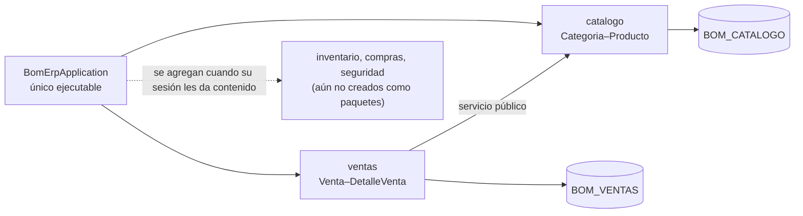

# S06 - Evaluación de la Unidad I

## 1. Propósito de la evaluación

Esta sesión no enseña contenido nuevo: cierra la Unidad I de **LP2**. El sílabo (sesión 6) define dos actividades para esta evaluación:

1. Resolver la evaluación teórico-práctica de los temas de la Unidad I (sesiones 1 a 5).
2. Presentar y sustentar el Backend REST empresarial.

**Esta sesión coincide con el "Primer corte integrado" de los tres cursos**, según el cronograma del Proyecto Integrador. ADS ya evaluó su arquitectura en su propia sesión 5, la semana anterior; BD2 evalúa su motor transaccional Oracle esta misma semana, en su propia sesión 6. La sustentación de hoy es individual de LP2 — tu backend, tu código, tu evidencia —, pero la sección 4 exige además evidencia de que ese backend funciona sobre la arquitectura de ADS y el motor transaccional de BD2, no aislado.

## 2. Producto evaluado

Del sílabo, el producto de la Unidad I es:

> Backend REST empresarial con ORM, CRUD, objetos relacionados, operación cabecera–detalle, consultas, reportes, CORS, logs y pruebas.

Ese producto ya existe como [`docs/proyecto-integrador/u1/lp2-demo.md`](../../proyecto-integrador/u1/lp2-demo.md). Esta sección lo reproduce completo para que la sesión sea autocontenida; `lp2-demo.md` sigue siendo la fuente única — si hay una edición futura, se hace ahí y se refleja aquí.

**Lo que sigue (2.1-2.4) es el ejemplo BomERP del docente, no una plantilla obligatoria.** Cada sede (Lima, Juliaca, Tarapoto) y cada grupo dentro de una misma sede tiene su propio dominio, definido en su propio `brief.md` de S2 — no todos siguen CoMarket/BomERP. Lo que sí es exigible a todos es la estructura: monolito modular verificado con Spring Modulith, un módulo transaccional con cabecera-detalle real, persistencia, consultas, CORS, logs y pruebas.

### Lo que acumulaste sesión por sesión

Este producto no se construye en S06: se ensambla con lo que cada sesión anterior ya te pidió sobre tu propio proyecto.

**Tabla 1. De la sesión al backend evaluado**

| Sesión | Qué produjiste (tu propio proyecto) | Dónde queda en tu backend evaluado |
|---|---|---|
| S1 | Proyecto backend ejecutable, conectado a Oracle, con endpoint de verificación y un primer recurso REST. | 2.1 Alcance arquitectónico y 2.2 Contrato REST |
| S2 | CRUD REST completo de tu recurso principal, con DTO validado, mapeo explícito y manejo global de errores. | 2.2 Contrato REST |
| S3 | Objetos relacionados entre dos entidades, con DTO relacionado y navegación controlada. | 2.2 Contrato REST |
| S4 | Tu propia operación cabecera-detalle, con cálculos, una regla de negocio real y transacción atómica probada. | 2.2 Contrato REST y 2.3 DTO principales |
| S5 | Filtros combinados, ordenamiento, proyecciones, agregaciones y CORS configurado. | 2.2 Contrato REST |
| S6 (esta sesión) | Ensamblas todo lo anterior en un backend único y lo sustentas. | El backend completo + sección 4 de esta guía |

Lo que sustentas en S06 es **tu backend**: los recursos que tú construiste, con los datos y reglas de tu propio dominio — no el de BomERP. Las secciones 2.1-2.4 muestran cómo se ve ese backend terminado usando el ejemplo del docente; tu entregable real es un backend con la misma estructura, pero con el contenido que tú construiste en S1-S5.

### 2.1 Alcance arquitectónico (ejemplo BomERP)

```text
backend/                     # un solo proyecto Maven, sin reactor multi-módulo
└── src/main/java/pe/edu/upeu/bomerp/
    ├── BomErpApplication.java   # único Spring Boot ejecutable
    ├── catalogo/                # funcional en U1
    ├── ventas/                  # funcional en U1
    ├── inventario/              # aún no existe, se agrega cuando su sesión le dé contenido
    ├── compras/                 # aún no existe, se agrega cuando su sesión le dé contenido
    └── seguridad/               # se implementa en U2
```

Cada paquete directo bajo el paquete raíz es un módulo de aplicación verificado por Spring Modulith (`ModularityTests`), no un artefacto Maven separado. La autenticación JWT no forma parte de U1 y se incorpora en S10.

### 2.2 Contrato REST (ejemplo BomERP)

**Tabla 2. Contrato REST de referencia (ejemplo BomERP)**

| Método | Endpoint | Propósito | Sesión relacionada |
|---|---|---|---|
| `GET` | `/api/v1/categorias` | Listar categorías. | S1-S3 |
| `GET` | `/api/v1/productos` | Listar productos con categoría. | S1-S3 |
| `POST` | `/api/v1/productos` | Registrar un producto. | S2 |
| `POST` | `/api/v1/ventas` | Registrar cabecera y colección de detalles. | S4 |
| `GET` | `/api/v1/ventas` | Consultar ventas mediante filtros y ordenamiento. | S5 |
| `GET` | `/api/v1/ventas/resumen` | Devolver agregaciones y respuestas resumidas. | S5 |

### 2.3 DTO principales (ejemplo BomERP)

```json
{
  "detalles": [
    { "productoId": 1, "cantidad": 2 },
    { "productoId": 2, "cantidad": 3 }
  ]
}
```

```json
{
  "id": 1001,
  "fecha": "2026-09-01T10:15:00",
  "estado": "REGISTRADA",
  "total": 145.50,
  "detalles": [
    { "productoId": 1, "nombreProducto": "Producto de prueba", "precioUnitario": 50.00, "cantidad": 2, "subtotal": 100.00 }
  ]
}
```

### 2.4 Arquitectura backend (ejemplo BomERP)

**Figura 1. Arquitectura backend U1 (ejemplo BomERP)**



Todos los módulos se ejecutan en la misma JVM y utilizan un datasource. No existe Feign ni comunicación HTTP interna. Cada módulo conserva sus controllers, casos de uso, entidades y repositorios; los repositorios no se comparten.

## 3. Evaluación teórico-práctica (S1-S5)

Cubre los cinco temas dictados antes de esta sesión. El docente puede tomarla escrita, oral o mixta.

**Tabla 3. Temario de la evaluación teórico-práctica**

| Sesión | Tema | Qué puede evaluar el docente |
|---|---|---|
| S1 | Arquitectura backend REST profesional | Estructura del proyecto, configuración por ambientes, ORM, driver, conexión, contrato y versionado básico de API. |
| S2 | CRUD REST completo de una entidad principal | DTO de entrada/salida, mapeo explícito, validaciones, manejo global de errores y trazabilidad por petición. |
| S3 | Objetos relacionados mediante REST y ORM | Asociación entre entidades, DTO relacionado, navegación controlada y prevención de ciclos de serialización. |
| S4 | Operación de dominio con cabecera-detalle | DTO compuesto, cálculos, una regla de negocio real, transacción atómica y comunicación entre módulos. |
| S5 | Consultas empresariales y CORS | Filtros combinados, ordenamiento, proyecciones, agregaciones y por qué CORS es una restricción del navegador, no del servidor. |

Preguntas de referencia (el docente puede formular equivalentes):

1. ¿Por qué tu backend es un único proyecto Maven, y qué verificación automática impide que un módulo acceda al repositorio de otro?
2. En tu operación cabecera-detalle, ¿qué línea de código hace posible que un fallo a mitad de la operación revierta todo, no solo la última línea?
3. ¿Por qué tu DTO de entrada es una clase distinta del de salida, en vez de reutilizar uno solo?
4. Si tu filtro combina tres criterios opcionales, ¿por qué una sola consulta con `(:param IS NULL OR ...)` es mejor que encadenar métodos derivados?
5. ¿Qué evidencia concreta demuestra que CORS está configurado por propiedad y no fijo en el código?

## 4. Sustentación del backend

**Tabla 4. Distribución de tiempo por integrante**

| Momento | Tiempo | Propósito |
|---|---:|---|
| Presentación técnica | 8 min | Explicar el backend (sección 2), las decisiones tomadas y su justificación. |
| Demo técnica | 5 min | Ejecutar el CRUD, la operación cabecera-detalle y las consultas en vivo, incluido un caso de error. |
| Preguntas individuales | 5 min | Verificar dominio y aporte propio, con base en la Tabla 3. |

**Tabla 5. Entregables obligatorios**

| Entregable | Evidencia mínima | Criterio de aceptación |
|---|---|---|
| Producto de unidad | `lp2-demo.md` (sección 2 de esta guía) completo | Coherente con el sílabo y con el código real ejecutable |
| Evidencia de integración | Backend conectado a los esquemas Oracle de BD2, endpoints vivos, `ModularityTests` en verde | Trazabilidad verificable con ADS y BD2, no solo documentada |
| Sustentación individual | Preguntas y defensa por integrante (sección 3) | Autoría demostrada |

**Tabla 6. Evidencia de integración con ADS y BD2**

| Elemento LP2 | ADS | BD2 |
|---|---|---|
| Configuración por ambientes | Un ejecutable desplegable y configuración externa | Conexión Oracle sin credenciales versionadas. |
| Monolito modular con capas internas | Vista C3, límites y dependencias | Esquemas y tablas con propiedad funcional definida. |
| Validación de total y stock | Regla de integridad | Restricciones y excepciones PL/SQL. |
| Filtros por fecha | Atributo de rendimiento | Índice `IX_VENTAS_FECHA`. |

Secuencia sugerida de presentación:

1. Presentar el alcance arquitectónico (2.1) y el contrato REST (2.2).
2. Ejecutar el CRUD completo en vivo: un caso de éxito y un caso inválido (`400`).
3. Ejecutar la operación cabecera-detalle: un caso de éxito y un caso de rollback provocado a propósito.
4. Ejecutar una consulta con filtros combinados y el reporte agregado (`/resumen`).
5. Mostrar `ModularityTests` en verde y los esquemas Oracle reales de BD2 conectados.
6. Cerrar con la Tabla 6, explicando al menos una fila con evidencia en vivo.

Criterios mínimos de aceptación:

- El backend arranca y conecta con Oracle sin errores, contra el esquema real que BD2 construyó.
- El CRUD y la operación cabecera-detalle funcionan con al menos un caso de éxito y uno de error cada uno.
- Al menos un filtro combinado y el reporte agregado responden con datos reales.
- `ModularityTests` está en verde y se muestra en vivo, no solo se menciona.
- Cada integrante responde individualmente al menos una pregunta de la Tabla 3.

## 5. Rúbrica de evaluación

Los cinco criterios son cita literal del resultado de aprendizaje de la Unidad I en el sílabo de LP2.

**Tabla 7. Rúbrica de evaluación**

| Criterio | Peso | A (20 pts) | B (15 pts) | C (10 pts) | D (5 pts) | Nivel obtenido |
|---|---:|---|---|---|---|---:|
| 1. Crea y configura el proyecto backend con ORM, conexión a la base de datos, recurso REST inicial, DTO y documentación de API | 20% | Proyecto ejecutable, conectado a Oracle, con contrato y versionado de API documentados y verificables en vivo. | Proyecto ejecutable y conectado, con documentación parcial. | Proyecto ejecutable con conexión o documentación incompleta. | No presenta un proyecto backend ejecutable. | |
| 2. Implementa un CRUD REST completo, con validaciones, excepciones, logs y pruebas transversales | 20% | CRUD completo con validación, manejo de errores y trazabilidad probados con casos reales. | CRUD completo con validación parcial o trazabilidad incompleta. | CRUD incompleto o sin manejo de errores. | No presenta CRUD funcional. | |
| 3. Gestiona objetos relacionados mediante ORM, DTO y reglas de asociación | 20% | Asociación entre entidades con DTO relacionado y navegación controlada, verificada en vivo. | Asociación funcional, con detalles menores en la navegación o el DTO. | Asociación incompleta o sin control de referencias. | No implementa objetos relacionados. | |
| 4. Implementa una operación cabecera-detalle con registro atómico, cálculos, estados, consistencia, commit y rollback | 20% | Operación completa, con caso de éxito y caso de rollback probados y explicados. | Operación completa, con un caso probado. | Operación presente, sin evidencia clara de atomicidad. | No implementa la operación cabecera-detalle. | |
| 5. Implementa consultas, filtros, ordenamiento, agregaciones, reportes y configuración CORS | 20% | Filtros combinados, reporte agregado y CORS configurado por propiedad, probados en vivo. | La mayoría de estos elementos funciona, con detalles menores. | Consultas o CORS incompletos. | No implementa consultas ni CORS. | |

Nota final = suma de (`Peso` × `Puntos del nivel obtenido`) / 100 × 20 = ____.

Para usar la rúbrica con IA, solicita:

```text
Evalúa la sustentación y el producto (lp2-demo.md o la sección 2 de esta guía) usando la rúbrica de esta sesión.
Para cada criterio selecciona el nivel obtenido: A=20, B=15, C=10, D=5.
Justifica brevemente cada nivel con evidencia concreta (endpoints, código, pruebas en vivo).
Calcula la nota final con la fórmula: suma de (Peso × Puntos del nivel obtenido) / 100 × 20.
Indica 2 fortalezas y 2 recomendaciones para lo que sigue en Unidad II.
```
