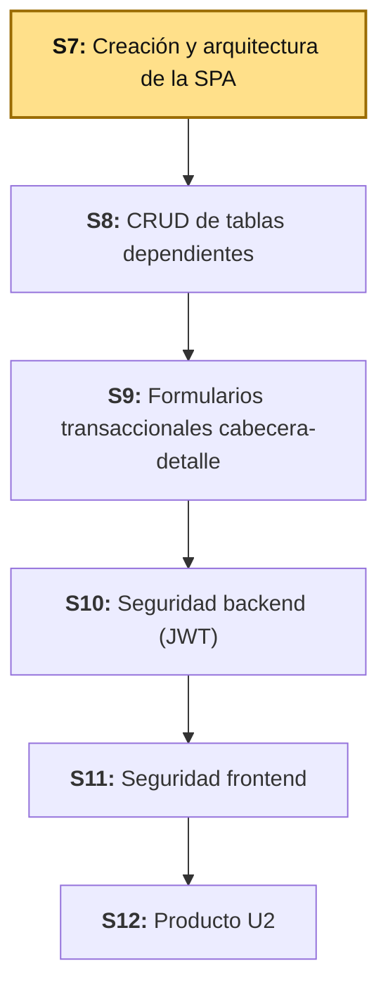
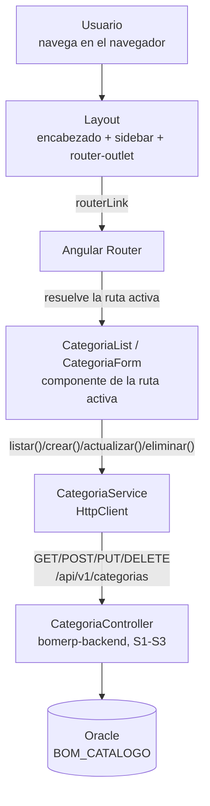
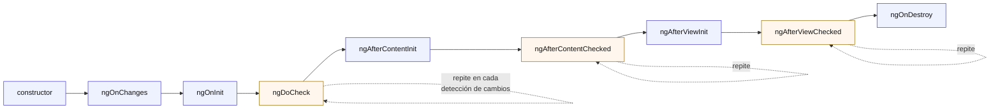

# S7 - Creación y Arquitectura de la SPA

*Por: Angel Sullon Macalupu @asullom - 2026*

## 1. Introducción

Tiempo: 20 min.

### 1.1 Presentación de la sesión

Hasta la sesión anterior, BomERP existe solo como una API: cada endpoint se probó desde Swagger, PowerShell o un `fetch` suelto en la consola del navegador, nunca desde una aplicación real que alguien abra y use sin escribir código. Esta sesión construye ese cliente: nace el proyecto frontend, con su propia navegación (menú, layout) organizada por funcionalidades — el mismo patrón de carpetas que el resto de pantallas de la unidad va a repetir, sin inventarlo de nuevo en cada sesión — y un primer flujo completo conectado al backend real. El porqué de partir por la arquitectura antes que por las pantallas se desarrolla en 1.6, a partir del caso.

### 1.2 Índice

1. Creación del proyecto frontend.
2. Layout y navegación: menú, sidebar y encabezado.
3. Módulos, componentes y rutas.
4. Servicios HTTP hacia el backend.
5. CRUD de una tabla independiente.

### 1.3 Propósito de aprendizaje

Al concluir la clase, estarás en condiciones de:

- **Crear y estructurar** un proyecto frontend con navegación principal organizada por funcionalidades, y **construir** un primer flujo CRUD completo consumiendo el backend REST ya construido, sin mezclar responsabilidades entre componentes, servicios y rutas.

### 1.4 Producto de sesión

Proyecto Angular 22 (`lp2/bomerp-frontend`), con navegación principal (encabezado, sidebar y menú) organizada en `core`/`shared`/`features`, una página de inicio real en `/`, ruteo funcional entre pantallas, un interceptor HTTP que agrega `X-Trace-ID` a cada petición, y un CRUD completo (listar, crear, editar, eliminar) de `Categoria` (`catalogo`), conectado a `http://localhost:8080/api/v1/categorias`.

### 1.5 Metodología

**Tabla 1. Metodología de la sesión**

| Actividades a Realizar en el Periodo | Orientaciones generales (Orientaciones Metodológicas) | Material de estudio recomendado |
|---|---|---|
| Revisión previa individual | Confirmar que `lp2/bomerp-backend` sigue respondiendo en `http://localhost:8080` con CORS habilitado para `http://localhost:4200` (S5). Instalar Node.js LTS si aún no está instalado. Trabajo individual, antes de clase. | S5 (3.7-3.8), documentación de Node.js. |
| Clase presencial | Construcción guiada del proyecto Angular, el layout con navegación, la estructura de carpetas por funcionalidad, el servicio HTTP y el CRUD completo de `Categoria`. Trabajo individual en la propia laptop, siguiendo al docente paso a paso. | Backend ejecutable (S1-S5), Pasos 3.1 a 3.15 de esta guía. |
| Evaluación formativa | Verificación en clase de la navegación entre pantallas y del CRUD de `Categoria` reflejado en tiempo real contra el backend. La evidencia se completa y sustenta de forma individual, fuera del aula, según los criterios mínimos de la sección 4.4. | Indicaciones de entrega (4.3), rúbrica de evaluación (4.6). |

### 1.6 Motivación de la sesión

#### 1.6.1 Caso: la API que nadie fuera del equipo podía usar

Los endpoints construidos hasta S5 funcionan perfectamente — pero solo alguien que sepa escribir una petición HTTP a mano (Postman, PowerShell, Swagger) puede usarlos. Un encargado de almacén que necesita registrar una categoría nueva de producto no va a abrir Swagger ni escribir un JSON a mano: necesita un formulario, un botón y una lista en pantalla. Sin una interfaz real, un backend técnicamente perfecto sigue siendo inutilizable para quien no programa.

Esta sesión no reemplaza el backend ni cambia ninguno de sus endpoints: construye la primera aplicación real que cualquier persona del negocio puede abrir y usar.

**Preguntas de análisis**

**Activación de conocimientos previos**

1. De los endpoints de `catalogo` construidos en S1-S3, ¿cuáles va a consumir esta pantalla, y qué datos espera cada uno?

**Comprensión de arquitectura frontend**

1. ¿Por qué separar la navegación principal (menú, layout) de las pantallas de cada funcionalidad, en vez de repetir el mismo menú dentro de cada componente?
2. ¿Qué pasaría si cada componente hiciera sus propias llamadas HTTP directamente, sin pasar por un servicio dedicado?

### 1.7 Ubicación en el curso

- Unidad: U2 - SPA modular segura para BomERP.
- Producto del curso: base Full-Stack modular de BomERP.
- Producto de unidad: SPA modular y segura, conectada al backend, con navegación por funcionalidades, CRUD de tablas independientes y dependientes, formularios transaccionales, consultas, reportes y control de acceso.
- Avance del producto en esta sesión: nace el proyecto frontend, con su navegación principal, una página de inicio, un interceptor HTTP de trazabilidad y el primer CRUD independiente (`Categoria`, módulo `catalogo`), conectado al backend real.

**Figura 1. Roadmap del producto de la unidad**



## 2. Explica

Tiempo: 30 min.

### 2.1 Arquitectura de la sesión

**Figura 2. De la navegación en el navegador al backend real**



Lectura del diagrama: el usuario nunca navega recargando la página — el Layout (2.4) se mantiene fijo, y solo el contenido dentro de `router-outlet` cambia según la ruta activa. Ningún componente llama a `HttpClient` directamente: siempre pasa por `CategoriaService` (2.7), que es el único que conoce la URL real del backend.

### 2.2 Creación del proyecto frontend

Un proyecto frontend de tipo SPA (*Single Page Application*) es una aplicación que corre completa en el navegador: una sola carga inicial de HTML/JS/CSS, y toda navegación posterior ocurre sin recargar la página — el propio JavaScript decide qué mostrar según la ruta, no el servidor pidiendo una página nueva cada vez. Un generador de proyecto (CLI) arma la estructura base — compilación, enrutamiento, inyección de dependencias — para no construir eso a mano en cada proyecto nuevo.

El generador de Angular crea, por defecto, componentes **standalone** (sin `NgModule`) y una aplicación **zoneless**, sin que haga falta declarar ningún provider para eso — desde Angular 21, zoneless es el comportamiento por defecto del framework (Angular, 2026a): la detección de cambios ya no depende de parchear las APIs asíncronas del navegador (temporizadores, promesas, eventos) como hacía Zone.js — reacciona a los `signal()` que un componente declara explícitamente. Esto no cambia cómo se estructura un CRUD (3.7-3.13), pero sí explica por qué esta guía nunca importa `NgModule` en ningún archivo.

### 2.3 Ciclo de vida de un componente

Desde que Angular crea un componente hasta que lo destruye, lo hace pasar por una secuencia fija de fases. Por cada fase, Angular invoca automáticamente un método con un nombre reservado — un *lifecycle hook* — si la clase del componente lo implementa; ningún hook es obligatorio, cada uno existe para un momento distinto del ciclo.

**Figura 3. Secuencia del ciclo de vida de un componente Angular**



*Nota.* Adaptado de la secuencia de hooks del ciclo de vida de un componente (Angular, 2026h).

| Momento | Hook | Cuándo se ejecuta | Para qué sirve |
|---|---|---|---|
| Creación | `constructor` | Antes que cualquier hook de Angular, al instanciar la clase. No es un hook de Angular: es JavaScript puro. | Solo inyección de dependencias (`inject()`, S6-S7). Ningún dato de entrada (`@Input()`) está disponible todavía. |
| Entradas | `ngOnChanges` | Antes de `ngOnInit`, y de nuevo cada vez que cambia un `@Input()` del componente. No se ejecuta si el componente no declara ningún `@Input()`. | Reaccionar a un valor que el componente padre le pasa desde afuera. |
| Inicialización | `ngOnInit` | Una sola vez, ya con los `@Input()` (si existen) asignados. | El lugar donde va la lógica de arranque de un componente: la primera carga de datos (`CategoriaList`, 3.10). |
| Cada ciclo | `ngDoCheck` | En cada pasada de detección de cambios, además de `ngOnChanges`. | Comprobación manual de algo que Angular no detecta por sí solo. Poco común: se usa recién cuando `ngOnChanges` no alcanza. |
| Contenido proyectado | `ngAfterContentInit` / `ngAfterContentChecked` | Después de inicializar (una vez) y de revisar (en cada ciclo) el contenido que otro componente proyecta dentro de este vía `<ng-content>`. | Solo aplica a un componente que recibe contenido proyectado — ninguno de esta sesión lo usa. |
| Vista propia | `ngAfterViewInit` / `ngAfterViewChecked` | Después de inicializar (una vez) y de revisar (en cada ciclo) la propia plantilla del componente y las de sus hijos. | Leer o medir algo del DOM ya renderizado (por ejemplo, con `@ViewChild`). |
| Destrucción | `ngOnDestroy` | Una sola vez, justo antes de que Angular elimine el componente (al navegar a otra ruta, por ejemplo). | Limpiar lo que el componente abrió y que Angular no cierra solo: una suscripción manual, un `setInterval`, un listener agregado a mano. |

Los hooks marcados en azul en la Figura 3 ocurren **una vez**; los marcados en naranja se repiten **en cada pasada** de detección de cambios mientras el componente sigue vivo — que en una aplicación zoneless (2.2) ocurre cuando cambia un `signal()` que la plantilla lee, no en cualquier evento asíncrono del navegador.

**Ejemplo: los nueve momentos de la Figura 3, sobre el mismo `CategoriaCard`.** Va en un componente aparte y autónomo —no forma parte de los pasos de 3.1-3.13, no tiene ruta ni se usa desde ningún otro componente— para no mezclarlo con `CategoriaForm` real (3.13). Con un HTML corto, va con `template` inline en vez de `templateUrl`. Y, a diferencia de un intento con `[value]`, `formControlName` sí funciona porque el `<input>` está dentro de un `<form [formGroup]="form">` real, con su propio `FormGroup` declarado en la clase — no un objeto suelto:

```ts
import {
  Component, Input, OnChanges, OnInit, DoCheck, AfterContentInit, AfterContentChecked,
  AfterViewInit, AfterViewChecked, OnDestroy, SimpleChanges, ContentChild, ViewChild,
  ElementRef, inject,
} from '@angular/core';
import { FormBuilder, ReactiveFormsModule, Validators } from '@angular/forms';
import { Subscription } from 'rxjs';

@Component({
  selector: 'app-categoria-card',
  imports: [ReactiveFormsModule],
  template: `
    <ng-content></ng-content>
    <form [formGroup]="form">
      <input type="text" formControlName="nombre" #nombreInput />
    </form>
  `,
})
export class CategoriaCard
  implements OnChanges, OnInit, DoCheck, AfterContentInit, AfterContentChecked,
    AfterViewInit, AfterViewChecked, OnDestroy
{
  @Input() nombreInicial = '';

  @ContentChild('etiqueta') etiqueta?: ElementRef;
  @ViewChild('nombreInput') nombreInput?: ElementRef<HTMLInputElement>;

  private readonly fb = inject(FormBuilder);
  private cambiosSub?: Subscription;

  protected readonly form = this.fb.nonNullable.group({
    nombre: ['', [Validators.required, Validators.maxLength(80)]],
  });

  constructor() {
    // Solo inyección de dependencias (fb ya se resolvió arriba, al declarar
    // el campo). `nombreInicial` todavía no tiene ningún valor aquí.
    console.log('constructor');
  }

  ngOnChanges(changes: SimpleChanges): void {
    // Antes de ngOnInit, y de nuevo cada vez que el padre cambia [nombreInicial].
    if (changes['nombreInicial']) {
      console.log('Valor anterior:', changes['nombreInicial'].previousValue);
      console.log('Valor cambiado:', changes['nombreInicial'].currentValue);
    }
  }

  ngOnInit(): void {
    // Una sola vez, ya con nombreInicial asignado: arranca el formulario con ese valor.
    this.form.controls.nombre.setValue(this.nombreInicial);

    this.cambiosSub = this.form.controls.nombre.valueChanges.subscribe((nombre) => {
      console.log(nombre);
    });
  }

  ngDoCheck(): void {
    // En cada pasada, incluso si nada "cambió de verdad" según Angular.
    // Sirve para detectar una mutación dentro del mismo objeto/valor de entrada
    // (por ejemplo, si nombreInicial fuera un objeto y alguien lo mutara sin
    // reasignarlo), algo que ngOnChanges no vería.
  }

  ngAfterContentInit(): void {
    // Una sola vez, cuando el contenido proyectado por <ng-content> ya existe.
    console.log('Etiqueta proyectada:', this.etiqueta?.nativeElement.textContent);
  }

  ngAfterContentChecked(): void {
    // En cada pasada, después de revisar ese contenido proyectado.
  }

  ngAfterViewInit(): void {
    // Una sola vez, cuando la propia plantilla ya está en el DOM.
    this.nombreInput?.nativeElement.focus();
  }

  ngAfterViewChecked(): void {
    // En cada pasada, después de revisar la propia vista.
  }

  ngOnDestroy(): void {
    // Cierra lo que ngOnInit dejó abierto.
    this.cambiosSub?.unsubscribe();
  }
}
```

Se usaría así, desde otro componente: `<app-categoria-card nombreInicial="Bebidas"><span #etiqueta>Destacada</span></app-categoria-card>`.

`ngOnChanges` es el único hook de los nueve que necesitaba algo nuevo: `CategoriaCard` no tenía ningún `@Input()` antes, así que se le agregó `nombreInicial` solo para tener algo que cambie desde afuera. `changes['nombreInicial'].previousValue` y `.currentValue` son las dos propiedades que `SimpleChanges` siempre trae por cada `@Input()` que cambió — el primer valor que llega (cuando el padre recién crea el componente) también cuenta como cambio, y ahí `previousValue` es `undefined`.

`ngOnInit` ahora sí hace dos cosas que antes vivían sueltas: usa `nombreInicial` (ya garantizado por `ngOnChanges`, que siempre corre antes) para poner el valor inicial del formulario, y recién ahí se suscribe a `nombre.valueChanges` — moverlo del `constructor` a `ngOnInit` es lo que la convención recomienda cuando el componente sí depende de un `@Input()` (a diferencia del ejemplo anterior de `CategoriaForm`, que no lo necesitaba).

`ngAfterContentInit`/`ngAfterContentChecked` necesitan el `<ng-content>` que se agregó a la plantilla — ahora `@ContentChild('etiqueta')` sí tiene algo que buscar, a diferencia de un componente sin contenido proyectado. `ngAfterViewInit` reutiliza el mismo `<input formControlName="nombre">`, con `#nombreInput` como referencia de plantilla, para enfocarlo apenas la vista está lista — `#nombreInput` no choca con `formControlName`: una variable de plantilla sin asignarle nada siempre apunta al elemento del DOM, sin importar qué directivas tenga encima (`formControlName` ni siquiera declara un `exportAs` con el que pudiera confundirse).

`ngOnDestroy` cierra la suscripción que `ngOnInit` abrió. Para este componente en concreto no era estrictamente necesario —`this.form` es propio de `CategoriaCard`, nadie más lo referencia desde afuera, así que al destruirse el componente no queda nada externo sosteniéndolo con vida—, pero es el hábito correcto: la regla general no es "¿esta suscripción en particular se filtra?", sino "toda suscripción manual se cierra en `ngOnDestroy`", para no depender de analizar caso por caso cada vez.

Para probarlo, agrégalo a cualquier plantilla ya visible — por ejemplo, en `inicio.html` (3.6), con el import correspondiente en `inicio.ts`:

```html
<app-categoria-card nombreInicial="Bebidas">
  <span #etiqueta>Destacada</span>
</app-categoria-card>
```

Abre `http://localhost:4200/` y mira la consola del navegador: primero `constructor`, luego `ngOnChanges` (valor anterior `undefined`, valor cambiado `"Bebidas"`), luego `ngOnInit`, `ngAfterContentInit` (con "Destacada"), `ngAfterViewInit` con el campo ya enfocado, y desde ahí un `console.log` nuevo por cada letra que escribas en **Nombre**. Ese orden es la Figura 3 en vivo, línea por línea — nada que adivinar, todo lo que corre deja su propio rastro en la consola.

**Opcional: probarlo con su propia URL.** En vez de pegarlo dentro de `inicio.html`, puedes darle una ruta propia — como `children` de `Layout`, mismo patrón que 3.10 — y abrir `http://localhost:4200/card` directo:

```ts
{
  path: 'card',
  loadComponent: () =>
    import('./features/catalogo/categoria/categoria-card').then((m) => m.CategoriaCard),
},
```

No forma parte de los pasos de 3.1-3.13 ni de las rutas que arma esa sección (3.6, 3.10, 3.13) — es solo para experimentar con este ejemplo aislado, sin el resto de `Inicio` alrededor. Quítala cuando termines de probar, para no dejar una ruta de prueba mezclada con las rutas reales del CRUD.

### 2.4 Layout y navegación: menú, sidebar y encabezado

El layout es la estructura visual que se repite en toda la aplicación sin importar qué pantalla esté activa: encabezado, menú de navegación y un área de contenido que sí cambia. Separarlo de las pantallas de cada funcionalidad evita repetir el mismo menú, el mismo encabezado y el mismo sidebar dentro de cada componente nuevo que se agregue.

En Angular, esa separación se resuelve con una ruta padre: un componente de layout con su propio `router-outlet`, y las pantallas de cada funcionalidad como rutas hijas que se renderizan dentro de ese `router-outlet` (Angular, 2026b). El componente raíz de la aplicación (`App`) ya no contiene el layout — solo un `router-outlet` de nivel superior; todo el menú, sidebar y encabezado vive en un componente de layout aparte, dentro de `core/` (3.5).

### 2.5 Módulos, componentes y rutas

El *routing* conecta una URL con el componente que debe mostrarse — sin él, la única forma de cambiar de pantalla sería recargar todo el documento. Organizar los componentes **por funcionalidad de negocio** (todo lo de `catalogo` junto, todo lo de `ventas` junto) en vez de **por tipo** (todos los componentes en una carpeta, todos los servicios en otra) es la recomendación oficial del propio equipo de Angular para cualquier aplicación que crezca más allá de un ejemplo pequeño (Angular, 2026c).

Esta sesión adopta la convención ya definida para el producto de la unidad ([`docs/lp2/index.md`](../index.md)): `core/` (el layout de hoy, el servicio base de conexión al backend de 2.6, y más adelante sesión de seguridad, guards e interceptores), `shared/` (piezas reutilizables entre funcionalidades) y `features/` (una carpeta por módulo de negocio — `catalogo` hoy, `ventas`/`seguridad` en sesiones posteriores). Cada ruta se carga de forma perezosa (`loadComponent`): el navegador descarga el código de una pantalla recién cuando el usuario navega a ella, no todo de una vez al abrir la aplicación (3.6).

### 2.6 Modelos de datos: `interface`, no `class`

Un **modelo de datos** en el frontend describe la forma de lo que viaja por HTTP — sus campos y sus tipos —, no el comportamiento de una entidad de dominio: esa lógica vive en el backend (ADS/BD2), el frontend solo necesita saber qué campos esperar. TypeScript ofrece dos formas de describir esa forma: `interface`/`type` (contratos que el compilador verifica y luego desaparecen, sin generar ningún código JavaScript) y `class` (que sí genera un constructor real en tiempo de ejecución, con o sin métodos).

Esa diferencia no es cosmética para un modelo de datos: `HttpClient` arma la respuesta de un endpoint con `JSON.parse()`, que siempre produce un objeto plano — nunca una instancia real de ninguna clase, sin importar con qué tipo se anote la respuesta. Tipar un modelo como `class` sugeriría, falsamente, que el objeto recibido tiene los métodos de esa clase disponibles; en la práctica, `instanceof` sobre ese objeto daría `false`, y cualquier método que la clase declarara simplemente no existiría en tiempo de ejecución. `interface` no tiene ese riesgo, porque nunca promete comportamiento: solo describe forma, que es exactamente lo único que un dato que cruza la red puede garantizar.

La regla general: `interface` (o `type`) para cualquier dato que cruce una frontera de red (un DTO); `class` solo para objetos que sí necesitan comportamiento real construido en el navegador (por ejemplo, un `FormGroup` o un servicio inyectable, 2.7). El modelo `Categoria` de esta sesión (3.7) aplica el primer caso.

### 2.7 Servicios HTTP hacia el backend

Un servicio HTTP es una clase inyectable dedicada exclusivamente a hablar con el backend — arma la URL, hace la petición y devuelve el resultado — para que ningún componente necesite saber cómo se llama un endpoint ni qué verbo HTTP usa (Angular, 2026d). Separar esa responsabilidad del componente tiene una razón concreta: si la URL del backend cambia, o si el endpoint se reorganiza, se corrige en un solo archivo, no en cada componente que lo consume.

Esa misma idea se aplica dos veces, en dos capas distintas: un servicio de infraestructura (`ApiService`, 3.8) sabe *dónde* está el backend (host, puerto, ambiente), sin saber nada de negocio; un servicio de funcionalidad (`CategoriaService`, 3.9) sabe *qué* endpoints existen para su propio recurso, sin saber dónde vive el backend. Ningún servicio de funcionalidad futuro (`ProductoService`, `VentaService`, S8-S9) repite la URL base — todos reutilizan el mismo `ApiService`.

`CategoriaService` (3.9, 3.11) es esa segunda pieza para esta sesión: los componentes `CategoriaList` y `CategoriaForm` (3.10, 3.12-3.13) nunca importan `HttpClient` — solo conocen los métodos que `CategoriaService` expone (`listar()`, `crear()`, `actualizar()`, `eliminar()`).

**Nota sobre `httpResource()`, para no confundirte si lo ves en otro lado.** Angular 22 también estabiliza `httpResource()` (`@angular/common/http`, Angular 2026f), una forma más nueva de leer datos que integra la petición directamente con signals — sin `subscribe()` manual:

```ts
protected readonly categorias = httpResource<Categoria[]>(() => this.api.buildUrl('/api/v1/categorias'));
```

En la plantilla, `categorias.value()`, `categorias.isLoading()` y `categorias.error()` reemplazarían al `signal()` y al `error` que `CategoriaList` construye a mano (3.10). `httpResource()` existe desde antes (Angular 19.2), pero marcado como experimental; recién en Angular 22 —la versión de esta guía— pasó a ser una API estable, lista para código nuevo. Por eso, si le pides ayuda a una IA para un CRUD en Angular 22, es probable que te proponga esto para el caso de solo lectura (`listar()`): ya no es una apuesta arriesgada, es una recomendación válida del propio equipo de Angular. Esta guía sigue enseñando `HttpClient` + `subscribe()` (3.9-3.10) a propósito, no por desactualizada: es la forma con más años de documentación y respuestas de la comunidad para cuando algo falla, y esta es tu primera sesión de Angular — además, `httpResource()` es solo para lectura: la propia documentación de Angular advierte explícitamente "avoid using httpResource for mutations like POST or PUT — instead, prefer directly using the underlying HttpClient APIs" (Angular, 2026e) — `crear()`, `actualizar()` y `eliminar()` siguen siendo `HttpClient` normal pase lo que pase, así que `httpResource()` tampoco resuelve todo el CRUD por sí solo.

### 2.8 CRUD de una tabla independiente

Una **tabla independiente** no necesita ningún otro dato para poder crearse o mostrarse — no depende de seleccionar antes un registro de otra entidad. `Categoria` (S1-S3) es exactamente ese caso: no lleva ninguna llave foránea hacia otra tabla. Una **tabla dependiente**, en cambio, sí necesita eso — `Producto` depende de `Categoria` (llave foránea `ID_CATEGORIA`, S1/S3), así que su formulario necesita, además, una lista desplegable con las categorías existentes para poder elegir una.

Esta sesión construye el caso independiente (`Categoria`); el caso dependiente (`Producto`, con su selector de categoría) es exactamente el contenido de S8 — no una repetición de esta sesión, sino el mismo patrón con un problema nuevo: qué hacer cuando el formulario necesita datos de otra entidad antes de poder guardar.

## 3. Aplica: actividad práctica guiada

Tiempo: 120 min.

### 3.1 Verificar el punto de partida

**Punto de partida común:** todo el equipo debe comenzar exactamente desde donde quedó S5, no desde su propio avance individual. Clona la rama `s05-consultas-reportes-cors` (el snapshot de cierre de S5):

```bash
git clone --branch s05-consultas-reportes-cors https://github.com/262ciclo4/bomerp.git
```

**Producto del paso:** confirmación de que el backend responde y acepta peticiones desde el origen que usará Angular.

**Requisito antes de continuar:** con `lp2/bomerp-backend` corriendo (`.\mvnw.cmd spring-boot:run`), confirma que `http://localhost:8080/api/v1/categorias` responde antes de tocar código nuevo. Si falla, el problema es de una sesión anterior, no de esta.

### 3.2 Instalar Node.js y la CLI de Angular

**Producto del paso:** entorno listo para crear y correr un proyecto Angular.

Párate de preferencia en `lp2/` (la misma terminal que usarás en 3.3 para crear el proyecto) — aunque, al ser una instalación global (`-g`), el resultado de esta sección es el mismo sin importar desde qué carpeta la ejecutes.

Instala [Node.js LTS](https://nodejs.org/) (incluye `npm`). Verifica la instalación:

```bash
node --version
npm --version
```

**Solo en Windows.** `npm` y `ng` se instalan como scripts de PowerShell (`.ps1`), y PowerShell bloquea por defecto la ejecución de cualquier script local — sin este permiso, el siguiente comando (o cualquier `ng` que corras después) falla con `no se puede cargar el archivo ... porque la ejecución de scripts está deshabilitada en este sistema`. Habilítalo una sola vez por usuario:

```powershell
Set-ExecutionPolicy -ExecutionPolicy RemoteSigned -Scope CurrentUser
```

`-Scope CurrentUser` limita el cambio a tu propio usuario, no a toda la máquina — no hace falta ser administrador. `RemoteSigned` es el nivel mínimo que lo resuelve: permite correr scripts locales sin firmar (los que instala `npm`), pero sigue exigiendo firma digital para cualquier script descargado de internet. En macOS/Linux este paso no aplica: la terminal no restringe ejecutar scripts por defecto.

Instala la CLI de Angular de forma global, fijando la versión 22:

```bash
npm install -g @angular/cli@22
```

Verifica:

```bash
ng version
```

Debe mostrar `Angular CLI: 22.x.x`. Si aparece una versión distinta (por ejemplo, una instalación previa de otro curso), **no hace falta desinstalarla primero**: vuelve a correr `npm install -g @angular/cli@22` — `npm` sobrescribe en el mismo lugar la versión global que ya tengas, sin un `npm uninstall -g @angular/cli` aparte. Forzar la versión exacta importa porque dos versiones mayores distintas de la CLI pueden generar proyectos con estructuras distintas.

### 3.3 Crear el proyecto Angular

**Producto del paso:** `lp2/bomerp-frontend` creado y ejecutándose por primera vez.

Desde la raíz del repositorio, dentro de `lp2/`:

```bash
cd lp2
ng new bomerp-frontend --routing --style=css --ssr=false
```

La CLI hace un par de preguntas interactivas antes de generar el proyecto:

- **"Which AI tools should Angular integrate with?"** — elige **None**. Cada opción (Claude Code, Cursor, Gemini CLI, etc.) agrega archivos de configuración (`CLAUDE.md`/`AGENTS.md` + config del servidor MCP de Angular) que no son parte de lo que esta sesión enseña — ningún curso del proyecto agrega infraestructura que la sesión concreta no necesita (mismo criterio que ya evitó módulos o paquetes "por si acaso" desde LP2 S1).
- **Motor de pruebas end-to-end**, elige "No" (no es tema de esta sesión).

El proyecto queda en `lp2/bomerp-frontend/` — mismo criterio de ubicación y de nombre que ya usa `lp2/bomerp-backend` (S1): un proyecto por tecnología, directo bajo `lp2/`, sin carpeta intermedia.

Levanta el servidor de desarrollo:

```bash
cd bomerp-frontend
ng serve
```

Abre `http://localhost:4200`. Debe mostrarse la página de bienvenida por defecto de Angular — confirma que `4200` es exactamente el origen que `lp2/bomerp-backend` ya permite desde S5 (3.7), sin ningún ajuste adicional de CORS.

### 3.4 Recorrer la estructura generada

**Producto del paso:** entender qué generó `ng new` antes de agregar nada propio.

```text
bomerp-frontend/
├── src/
│   ├── app/
│   │   ├── app.ts            # componente raíz
│   │   ├── app.html
│   │   ├── app.config.ts     # providers de la aplicación
│   │   └── app.routes.ts     # rutas de la aplicación
│   ├── main.ts                # arranque de la aplicación
│   └── index.html
├── angular.json
└── package.json
```

No hay ningún `NgModule` en todo el proyecto (2.2): `app.ts` es un componente standalone, y `app.config.ts` declara los `providers` que antes vivían en un `AppModule`. Lo que trae `app.config.ts` recién generado es `provideBrowserGlobalErrorListeners()` (reenvía errores no capturados del navegador al `ErrorHandler` de Angular) y `provideRouter(routes)` — **no** `provideZonelessChangeDetection()`: desde Angular 21, zoneless es el comportamiento por defecto del framework, sin necesidad de declararlo con ningún provider (Angular, 2026a). Esta guía sí lo agrega explícitamente en 3.8, no porque haga falta, sino para que quede visible en el código qué modo de detección de cambios está usando el proyecto.

### 3.5 Crear el layout: encabezado, sidebar y menú

**Producto del paso:** `Layout`, el componente que va a envolver el resto de pantallas de la aplicación.

Desde `bomerp-frontend/`, genera el componente con la CLI en vez de crear los archivos a mano:

```bash
ng generate component core/layout
```

Esto crea `core/layout/layout.ts`, `layout.html`, `layout.css` y `layout.spec.ts`, ya registrados como standalone — sin `NgModule` que editar y sin el sufijo `Component` en el nombre de archivo ni en la clase (`Layout`, no `LayoutComponent`): desde Angular 20, la CLI ya no agrega ese sufijo por defecto (se retoma en 3.9, con `CategoriaService`). El `core/layout/layout.ts` que acaba de generar la CLI trae el `@Component` vacío de imports:

```ts
import { Component } from '@angular/core';

@Component({
  imports: [],
  selector: 'app-layout',
  styleUrl: './layout.css',
  templateUrl: './layout.html',
})
export class Layout {}
```

Reemplaza el contenido de los tres archivos generados:

**`core/layout/layout.ts`**

```ts
import { Component } from '@angular/core';
import { RouterOutlet, RouterLink, RouterLinkActive } from '@angular/router';

@Component({
  selector: 'app-layout',
  imports: [RouterOutlet, RouterLink, RouterLinkActive],
  templateUrl: './layout.html',
  styleUrl: './layout.css',
})
export class Layout {}
```

Dos cambios reales frente a lo que generó la CLI (arriba), ambos por la misma razón — el `layout.html` de abajo usa `routerLink`, `routerLinkActive` y `<router-outlet>`, y al ser un componente standalone nadie los importa por él:

- **Se agrega la línea** `import { RouterOutlet, RouterLink, RouterLinkActive } from '@angular/router';` — sin ella, TypeScript no reconoce esos tres nombres.
- **`imports: []` pasa a `imports: [RouterOutlet, RouterLink, RouterLinkActive]`** — un standalone component debe declarar en su propio `imports` cada directiva o componente que usa en su plantilla; a diferencia de un `NgModule` (2.2), aquí no hay un lugar central que los registre por todos.

El orden de las propiedades dentro de `@Component({...})` (`selector`, `imports`, `templateUrl`, `styleUrl`) no importa — es un objeto de JavaScript, no una lista con secuencia obligatoria; que la CLI las genere en un orden y este documento las muestre en otro no es un error de ninguno de los dos lados.

**`core/layout/layout.html`**

```html
<header class="header">
  <h1>
    <a routerLink="/" class="home-link">
      
    </a>
    BomERP
  </h1>
</header>

<div class="body">
  <aside class="sidebar">
    <nav>
      <a routerLink="/catalogo/categorias" routerLinkActive="active">Categorías</a>
    </nav>
  </aside>

  <main class="content">
    <router-outlet />
  </main>
</div>
```

**`core/layout/layout.css`**

```css
.body {
  display: flex;
}

.sidebar {
  width: 200px;
}

.sidebar a.active {
  font-weight: bold;
}

.content {
  flex: 1;
  padding: 1rem;
}

.home-link {
  display: inline-flex;
  align-items: center;
  vertical-align: middle;
}
```

`routerLinkActive="active"` resalta el enlace de la pantalla que está activa en ese momento — un detalle pequeño, pero es lo que le permite a quien usa la aplicación saber en qué sección está sin leer la URL. El ícono junto a "BomERP" ahora es un enlace a `/` — la convención habitual de cualquier aplicación web para volver al inicio desde cualquier pantalla, sin depender de un botón "Atrás" del navegador. Ese enlace no funciona todavía: `/` recién tiene una pantalla real (`Inicio`) en 3.6.

**Por qué `favicon.ico` y no un ícono nuevo.** `ng new` (3.3) ya genera `public/favicon.ico` — la CLI copia todo lo que hay en `public/` a la raíz del sitio compilado, por eso `favicon.ico` (sin ninguna ruta delante) alcanza para encontrarlo. Reusar un archivo que el proyecto ya tiene evita agregar una dependencia nueva (Font Awesome, Material Icons) o escribir un ícono a mano — infraestructura de más para un solo ícono (mismo criterio de 2.4, sin paquetes "por si acaso").

Reemplaza `app.html` (el componente raíz) para que quede vacío de layout propio:

**`app.html`**

```html
<router-outlet />
```

`App` (el componente raíz) deja de tener menú, encabezado o sidebar — esos ahora viven exclusivamente en `Layout` (2.4), como ruta padre (3.6).

### 3.6 Configurar rutas y navegación principal

**Producto del paso:** `Layout` como ruta padre, con una página de inicio real en `''` — el proyecto debe compilar y mostrarse en el navegador ya en este paso, no recién al final de 3.13.

`''` necesita cargar algo desde ya: dejarlo vacío (`children: []`) mostraría el layout con el área de contenido en blanco, y un redirect hacia `catalogo/categorias` sería forzar al usuario a la única pantalla que existe hoy, en vez de dejarlo elegir desde el menú — el sidebar (3.5) ya tiene el enlace **Categorías** para eso. Genera una página de inicio mínima, sin lógica:

```bash
ng generate component core/inicio
```

Reemplaza el contenido de `core/inicio/inicio.html`:

```html
<h2>Bienvenido a BomERP</h2>
<p>Usa el menú de la izquierda para navegar entre los módulos disponibles.</p>
```

`core/inicio/inicio.ts` no necesita ningún cambio: la CLI ya genera una clase vacía (`export class Inicio {}`), y esta pantalla no tiene ningún estado ni lógica propia — solo texto.

**`app.routes.ts`**

```ts
import { Routes } from '@angular/router';

export const routes: Routes = [
  {
    path: '',
    loadComponent: () => import('./core/layout/layout').then((m) => m.Layout),
    children: [
      {
        path: '',
        loadComponent: () => import('./core/inicio/inicio').then((m) => m.Inicio),
      },
    ],
  },
];
```

`loadComponent` recibe una función que hace el `import()` recién cuando el navegador entra a esa ruta (2.5) — por ahora eso aplica a `Layout` e `Inicio`, los dos únicos componentes que ya existen (3.5, arriba). Las rutas de `Categoria` todavía no aparecen: `CategoriaList`/`CategoriaForm` todavía no existen (se crean recién en 3.10 y 3.13) — agregar ya sus rutas haría que el proyecto no compilara desde este paso, sin ninguna forma de comprobar el avance hasta el final. Cada ruta se agrega en el mismo paso en que su componente queda listo, nunca antes: 3.10 agrega la ruta de `CategoriaList`, 3.13 agrega las de `CategoriaForm`.

**Error frecuente**: escribir las rutas de `Categoria` como hermanas de `Layout` en el mismo arreglo, en vez de como `children`. El resultado visual es que la pantalla de categorías reemplaza *todo* el documento (sin encabezado ni sidebar), en vez de aparecer dentro de `router-outlet` de `Layout` — la estructura del arreglo de rutas es la que decide si una pantalla hereda el layout o no, no una decisión del componente de la pantalla. Este error recién se puede ver a partir de 3.10, cuando exista la primera ruta hija además de `Inicio`.

Verifica antes de seguir:

```bash
ng serve
```

Abre `http://localhost:4200`. Debe mostrarse el encabezado ("BomERP"), el sidebar con el enlace **Categorías**, y el mensaje de bienvenida de `Inicio` dentro del área de contenido — ya no queda en blanco. Ningún error en la consola del navegador ni en la terminal de `ng serve` significa que el proyecto compiló correctamente hasta este punto.

### 3.7 Crear el modelo `Categoria`

**Producto del paso:** el contrato de datos que el frontend comparte con `CategoriaResponse`/`CategoriaRequest` del backend (S3).

`Categoria` se modela como `interface`, no como `class` (2.6): es un dato que solo cruza la red, sin comportamiento propio.

Crea `features/catalogo/categoria/categoria.model.ts`:

```ts
export interface Categoria {
  id?: number;
  nombre: string;
  descripcion?: string;
}
```

`id` es opcional porque una categoría nueva, antes de guardarse, todavía no tiene uno — el backend lo asigna recién al crearla (S1). Los campos y sus nombres calzan exactamente con `CategoriaResponse`/`CategoriaRequest` (S3): el frontend no inventa un contrato propio, consume el que el backend ya expone.

**¿Por qué a mano y no con `ng generate interface`?** La CLI sí tiene ese generador (`ng generate interface categoria model` crearía `categoria.model.ts`), pero a diferencia de un componente o un servicio (3.5, 3.8-3.9), no genera ningún `.spec.ts` — una interfaz no tiene comportamiento propio que probar (2.6), así que la CLI no tendría nada que escribir ahí. El único ahorro real sería no teclear `export interface Categoria {}` a mano, sin ninguna ventaja adicional — por eso esta guía sí lo escribe directo.

### 3.8 Crear el archivo de ambientes y el servicio base de API

**Producto del paso:** la URL del backend declarada en un solo lugar, no repetida dentro de cada servicio HTTP.

Antes de crear ningún archivo, una aclaración: el bloque de código siguiente **no se crea, es solo para entender el problema que este paso evita** — nada de esta guía pide construir un `CategoriaService` así. Es la forma en que se vería *si* no existiera un archivo de ambientes, cada servicio HTTP escribiendo la URL completa del backend a mano, repetida en cada método:

<div style="background-color:#ffffff; border:1px solid #d0d0d0; border-radius:4px; padding:0.75rem 1rem;" markdown="1">

```ts
// Ejemplo del problema — no crear este archivo.
@Injectable({ providedIn: 'root' })
export class CategoriaService {
  private readonly http = inject(HttpClient);

  listar(): Observable<Categoria[]> {
    return this.http.get<Categoria[]>('http://localhost:8080/api/v1/categorias');
  }

  obtener(id: number): Observable<Categoria> {
    return this.http.get<Categoria>(`http://localhost:8080/api/v1/categorias/${id}`);
  }
}
```

</div>

El problema no es solo la repetición dentro de un mismo servicio: `http://localhost:8080` volvería a escribirse, idéntico, en `ProductoService`, `VentaService` y cualquier otro servicio de funcionalidad futuro. El día que el backend cambie de host o puerto (por ejemplo, al desplegar en producción, S13), habría que buscar y corregir esa cadena en cada archivo, uno por uno — un error de tipeo en cualquiera de ellos apunta silenciosamente al backend equivocado, sin que TypeScript pueda avisar nada (es un `string`, no una referencia).

Los archivos que sí vas a crear en este paso son los tres que siguen.

**Con archivo de ambientes** (lo que esta guía construye), la URL vive en un solo lugar, y cada servicio la consume sin conocerla directamente. Agrega `provideZonelessChangeDetection()` y `provideHttpClient()` a `app.config.ts`, **sin quitar** lo que `ng new` ya generó (`provideBrowserGlobalErrorListeners()`, `provideRouter(routes)`):

```ts
import {
  ApplicationConfig,
  provideBrowserGlobalErrorListeners,
  provideZonelessChangeDetection,
} from '@angular/core';
import { provideRouter } from '@angular/router';
import { provideHttpClient } from '@angular/common/http';
import { routes } from './app.routes';

export const appConfig: ApplicationConfig = {
  providers: [
    provideBrowserGlobalErrorListeners(),
    provideZonelessChangeDetection(),
    provideRouter(routes),
    provideHttpClient(),
  ],
};
```

`provideBrowserGlobalErrorListeners()` no se toca: es lo que la CLI ya trae para reenviar al `ErrorHandler` cualquier error no capturado del navegador (una promesa rechazada sin `.catch()`, un error fuera de cualquier `try/catch`) — quitarlo no rompe nada visible hoy, pero apaga sin darse cuenta un mecanismo de manejo de errores que Angular ya trae activado por defecto.

Crea `src/environments/environment.ts`:

```ts
export const environment = {
  apiBaseUrl: 'http://localhost:8080',
};
```

Crea `core/services/api-service.ts`:

```ts
import { Injectable } from '@angular/core';
import { environment } from '../../../environments/environment';

@Injectable({ providedIn: 'root' })
export class ApiService {
  private readonly baseUrl = environment.apiBaseUrl;

  buildUrl(path: string): string {
    const normalizedPath = path.startsWith('/') ? path : `/${path}`;
    return `${this.baseUrl}${normalizedPath}`;
  }
}
```

`ApiService` no sabe nada de `Categoria` ni de ningún otro recurso — solo arma una URL completa a partir de una ruta relativa (`/api/v1/categorias`) y la URL base del backend, leída de `environment.ts`. Cuando el backend cambie de host o puerto (por ejemplo, al desplegar en producción, S13), se corrige en ese único archivo — ningún servicio de funcionalidad (`CategoriaService`, 3.9) necesita tocarse.

**Sobre el nombre de archivo y de clase.** Desde Angular 20, la CLI ya no agrega el sufijo `Service`/`Component` por defecto (Angular, 2026f): `ng generate service api` generaría un archivo `api.ts` con una clase `Api`. Esta guía nombra explícitamente sus servicios inyectables con el sufijo `Service` (`ApiService`, `CategoriaService`, 3.9), a mano — no solo por estilo: en el caso de `CategoriaService`, evita además un choque de nombres real con la interfaz `Categoria` del modelo (3.7), que sí usa el nombre corto.

**Segunda forma, con la CLI (opcional).** No todo tiene que generarse con `ng generate` — un servicio con pocas líneas es igual de rápido a mano. Si prefieres la CLI de todas formas, nombra el propio comando con el sufijo incluido, para que la clase salga con el nombre correcto:

```bash
ng generate service core/services/api-service
```

Esto crea `api-service.ts` (con `ApiService` ya registrado como `@Injectable({ providedIn: 'root' })`) y `api-service.spec.ts` — igual que `ng generate component .../categoria-list` (3.10) genera la clase `CategoriaList`, porque la CLI convierte a PascalCase el último segmento de la ruta que le des. Cualquiera de las dos formas termina en el mismo archivo; solo falta reemplazar el contenido generado por el de arriba.

**El backend ya espera un `X-Trace-ID`, falta que el frontend lo mande.** El filtro `CorrelationIdFilter` (`lp2/bomerp-backend`, S5) ya lee ese header en cada petición y lo agrega a cada línea de log (`logback-spring.xml`, `%X{traceId}`) — si nadie lo manda, genera uno aleatorio por su cuenta, así que el backend nunca falla por su ausencia. El problema es otro: un UUID que el backend inventa por su cuenta no sirve para correlacionar nada desde el frontend — si una petición falla, no hay ningún valor que el navegador conozca de antemano para buscarlo en los logs. Lo acordado (S5) fue que el frontend genere su propio `X-Trace-ID` y lo mande en cada petición, para que el mismo valor visible en la consola del navegador sea el que se busca en `logs/bomerp.log`.

Crea `core/interceptors/trace-id-interceptor.ts`:

```ts
import { HttpInterceptorFn } from '@angular/common/http';

export const traceIdInterceptor: HttpInterceptorFn = (req, next) => {
  const traceId = crypto.randomUUID();
  return next(req.clone({ headers: req.headers.set('X-Trace-ID', traceId) }));
};
```

Un interceptor HTTP es una función que Angular ejecuta para *cada* petición que salga por `HttpClient` — ningún servicio de funcionalidad (`CategoriaService`, 3.9) necesita saber que existe ni recordar agregar nada, mismo principio que `ApiService` (arriba), aplicado a un header en vez de a una URL. `crypto.randomUUID()` es una API nativa del navegador (Web Crypto): genera un identificador único sin agregar ninguna librería.

Registra el interceptor en `app.config.ts`, agregando `withInterceptors([traceIdInterceptor])` a `provideHttpClient()`:

```ts
import {
  ApplicationConfig,
  provideBrowserGlobalErrorListeners,
  provideZonelessChangeDetection,
} from '@angular/core';
import { provideRouter } from '@angular/router';
import { provideHttpClient, withInterceptors } from '@angular/common/http';
import { routes } from './app.routes';
import { traceIdInterceptor } from './core/interceptors/trace-id-interceptor';

export const appConfig: ApplicationConfig = {
  providers: [
    provideBrowserGlobalErrorListeners(),
    provideZonelessChangeDetection(),
    provideRouter(routes),
    provideHttpClient(withInterceptors([traceIdInterceptor])),
  ],
};
```

`withInterceptors()` recibe un arreglo porque puede haber más de uno (autenticación en S10, logging, reintentos) — cada petición pasa por todos, en el mismo orden en que se listan. Con uno solo por ahora alcanza.

### 3.9 Crear `CategoriaService` (solo `listar`)

**Producto del paso:** el único punto del frontend que sabe cómo se llega a `/api/v1/categorias` — por ahora, solo para leer.

Crea `features/catalogo/categoria/categoria-service.ts`, con un único método por ahora:

```ts
import { Injectable, inject } from '@angular/core';
import { HttpClient } from '@angular/common/http';
import { Observable } from 'rxjs';
import { ApiService } from '../../../core/services/api-service';
import { Categoria } from './categoria.model';

@Injectable({ providedIn: 'root' })
export class CategoriaService {
  private readonly http = inject(HttpClient);
  private readonly api = inject(ApiService);
  private readonly resource = '/api/v1/categorias';

  listar(): Observable<Categoria[]> {
    return this.http.get<Categoria[]>(this.api.buildUrl(this.resource));
  }
}
```

`CategoriaService` ya no arma ninguna URL completa por su cuenta: le pide a `ApiService` (3.8) que la construya a partir de `resource`, la ruta relativa propia de esta funcionalidad. `obtener()`, `crear()`, `actualizar()` y `eliminar()` se agregan recién en 3.11, cuando exista una pantalla que los necesite — construir los cinco métodos ahora, sin nada todavía que los llame, alargaría este paso sin ningún resultado visible en el camino.

**Segunda forma, con la CLI (opcional, 3.8):** `ng generate service features/catalogo/categoria/categoria-service` genera `categoria-service.ts` (con la clase `CategoriaService` ya registrada) y `categoria-service.spec.ts` — luego reemplazas el contenido igual que arriba.

### 3.10 Crear `CategoriaList` y ver el primer resultado

**Producto del paso:** la lista de categorías, visible en el navegador con datos reales del backend — el primer resultado end-to-end de la sesión.

```bash
ng generate component features/catalogo/categoria/categoria-list --flat
```

`--flat` es necesario aquí: por defecto, `ng generate component` crea una subcarpeta con el nombre del componente (`categoria/categoria-list/categoria-list.ts`) — el comportamiento correcto cuando un componente vive solo. Pero `categoria/` ya es la carpeta por *recurso* (2.5): `categoria-list.ts` debe quedar directo dentro de ella, al mismo nivel que `categoria-service.ts` y `categoria.model.ts` (3.7, 3.9), no en una subcarpeta propia — `--flat` es lo que evita esa carpeta extra.

Reemplaza el contenido de `features/catalogo/categoria/categoria-list.ts`:

```ts
import { Component, OnInit, inject, signal } from '@angular/core';
import { RouterLink } from '@angular/router';
import { CategoriaService } from './categoria-service';
import { Categoria } from './categoria.model';

@Component({
  selector: 'app-categoria-list',
  imports: [RouterLink],
  templateUrl: './categoria-list.html',
})
export class CategoriaList implements OnInit {
  private readonly categoriaService = inject(CategoriaService);

  protected readonly categorias = signal<Categoria[]>([]);
  protected readonly error = signal<string | null>(null);
  protected readonly loading = signal(false);

  ngOnInit(): void {
    this.loading.set(true);
    this.categoriaService.listar().subscribe({
      next: (data) => this.categorias.set(data),
      error: () => {
        this.error.set('No se pudo cargar la lista de categorías.');
        this.loading.set(false);
      },
      complete: () => this.loading.set(false),
    });
  }
}
```

`loading` necesita apagarse en `error` explícitamente, no solo en `complete`: en RxJS, `error` y `complete` son notificaciones terminales que se excluyen entre sí — si la petición falla, `complete` nunca se dispara, y sin esa línea el mensaje "Cargando..." se quedaría fijo en pantalla para siempre.

Reemplaza el contenido de `features/catalogo/categoria/categoria-list.html`:

```html
@if (loading()) {
  <p>Cargando categorías...</p>
}

@if (error()) {
  <p class="error">{{ error() }}</p>
}

<a routerLink="/catalogo/categorias/nueva">Nueva categoría</a>

<table>
  <thead>
    <tr>
      <th>Nombre</th>
      <th>Descripción</th>
    </tr>
  </thead>
  <tbody>
    @for (categoria of categorias(); track categoria.id) {
      <tr>
        <td>{{ categoria.nombre }}</td>
        <td>{{ categoria.descripcion }}</td>
      </tr>
    } @empty {
      @if (!loading() && !error()) {
        <tr>
          <td colspan="2">No hay categorías registradas.</td>
        </tr>
      }
    }
  </tbody>
</table>
```

La tabla ya no se oculta entera — solo el texto "No hay categorías registradas" queda detrás de `@if (!loading() && !error())`. Las dos condiciones importan, no solo una: `categorias()` está vacío en tres casos distintos — mientras la petición todavía está en curso, si la petición falló, o si la lista de verdad no tiene datos — y el mensaje "no hay categorías" solo es cierto en el tercero. Sin `!loading()`, el mensaje aparecería un instante antes de que llegue la respuesta real, dando a entender que el catálogo está vacío cuando en realidad la carga ni siquiera terminó. La tabla en sí (`<table>`, `<thead>`) no tiene ninguna razón para desaparecer en ningún caso: sigue siendo la estructura correcta incluso vacía.

`categorias` y `error` son `signal()`, no propiedades sueltas (2.2): la plantilla se vuelve a renderizar cuando cualquiera de los dos cambia de valor, sin depender de Zone.js. `@for`/`@if`/`@empty` es el control de flujo nativo de plantillas de Angular — reemplaza a `*ngFor`/`*ngIf` sin necesitar importar `CommonModule`. Todavía no hay columna de acciones ni botón **Eliminar**: `CategoriaService` (3.9) solo sabe `listar()` por ahora — agregarlos ya generaría un error de compilación, llamando a un método que la clase no tiene.

Agrega a `src/styles.css` (el estilo global, generado por `ng new`, 3.3) la clase que usa `<p class="error">` (arriba):

```css
.error {
  color: #b42318;
}
```

`.error` va en el CSS global, no en un `styleUrl` propio de `CategoriaList`: es una convención visual de toda la aplicación (cualquier mensaje de error, en cualquier componente futuro, la va a reutilizar tal cual), no un estilo exclusivo de esta pantalla — declararla una sola vez en `styles.css` evita repetir la misma regla en cada componente que necesite mostrar un error (mismo criterio que `ApiService`, 3.8, aplicado a CSS en vez de a una URL). Sin esto, `<p class="error">` es solo un párrafo con una clase que ningún estilo todavía reconoce — el texto sale del mismo color que el resto de la página.

Ahora que `CategoriaList` ya existe, agrega su ruta a `children` (3.6) — como hermana de `''`/`Inicio`, no en su lugar:

```ts
import { Routes } from '@angular/router';

export const routes: Routes = [
  {
    path: '',
    loadComponent: () => import('./core/layout/layout').then((m) => m.Layout),
    children: [
      {
        path: '',
        loadComponent: () => import('./core/inicio/inicio').then((m) => m.Inicio),
      },
      {
        path: 'catalogo/categorias',
        loadComponent: () =>
          import('./features/catalogo/categoria/categoria-list').then((m) => m.CategoriaList),
      },
    ],
  },
];
```

`Inicio` sigue siendo la página de `''` — nadie la reemplaza por un redirect hacia `catalogo/categorias`, porque el sidebar ya le da al usuario esa opción por su cuenta (3.6). Corre `ng serve` y entra a `http://localhost:4200` — debe seguir mostrando `Inicio`; clic en **Categorías** (sidebar) para ver la lista (vacía o con datos, según lo que ya tenga tu base). El enlace **Nueva categoría** todavía no funciona (`CategoriaForm` se crea recién en 3.13) — es el único comportamiento pendiente en este paso exacto. Con esto ya tienes el primer resultado real de la sesión antes de seguir agregando código.

### 3.11 Completar `CategoriaService`: crear, actualizar, eliminar

**Producto del paso:** los cuatro métodos que le faltaban a `CategoriaService` (3.9), ahora que ya viste funcionar el quinto (`listar`).

Agrega a `features/catalogo/categoria/categoria-service.ts`:

```ts
import { Injectable, inject } from '@angular/core';
import { HttpClient } from '@angular/common/http';
import { Observable } from 'rxjs';
import { ApiService } from '../../../core/services/api-service';
import { Categoria } from './categoria.model';

@Injectable({ providedIn: 'root' })
export class CategoriaService {
  private readonly http = inject(HttpClient);
  private readonly api = inject(ApiService);
  private readonly resource = '/api/v1/categorias';

  listar(): Observable<Categoria[]> {
    return this.http.get<Categoria[]>(this.api.buildUrl(this.resource));
  }

  obtener(id: number): Observable<Categoria> {
    return this.http.get<Categoria>(this.api.buildUrl(`${this.resource}/${id}`));
  }

  crear(categoria: Categoria): Observable<Categoria> {
    return this.http.post<Categoria>(this.api.buildUrl(this.resource), categoria);
  }

  actualizar(id: number, categoria: Categoria): Observable<Categoria> {
    return this.http.put<Categoria>(this.api.buildUrl(`${this.resource}/${id}`), categoria);
  }

  eliminar(id: number): Observable<void> {
    return this.http.delete<void>(this.api.buildUrl(`${this.resource}/${id}`));
  }
}
```

Mismo patrón que `listar()` en los cuatro métodos nuevos: nunca arman la URL a mano, siempre vía `ApiService.buildUrl()` (3.8). Si el equipo despliega el backend en otro host, se cambia `environment.ts` una sola vez — ni `CategoriaService` ni ningún otro servicio de funcionalidad se modifican.

### 3.12 Agregar eliminar a `CategoriaList`

**Producto del paso:** el botón **Eliminar** funcionando, ahora que `CategoriaService.eliminar()` (3.11) ya existe.

Agrega a `features/catalogo/categoria/categoria-list.ts`:

```ts
import { Component, OnInit, inject, signal } from '@angular/core';
import { HttpErrorResponse } from '@angular/common/http';
import { RouterLink } from '@angular/router';
import { CategoriaService } from './categoria-service';
import { Categoria } from './categoria.model';

@Component({
  selector: 'app-categoria-list',
  imports: [RouterLink],
  templateUrl: './categoria-list.html',
})
export class CategoriaList implements OnInit {
  private readonly categoriaService = inject(CategoriaService);

  protected readonly categorias = signal<Categoria[]>([]);
  protected readonly error = signal<string | null>(null);
  protected readonly loading = signal(false);

  ngOnInit(): void {
    this.cargar();
  }

  cargar(): void {
    this.loading.set(true);
    this.error.set(null);
    this.categoriaService.listar().subscribe({
      next: (data) => this.categorias.set(data),
      error: () => {
        this.error.set('No se pudo cargar la lista de categorías.');
        this.loading.set(false);
      },
      complete: () => this.loading.set(false),
    });
  }

  eliminar(id: number): void {
    if (!confirm(`¿Está seguro de eliminar la categoría ${id}?`)) {
      return;
    }

    this.categoriaService.eliminar(id).subscribe({
      next: () => this.cargar(),
      error: (err: HttpErrorResponse) => {
        if (err.status === 500) {
          this.error.set('No se puede eliminar: la categoría tiene productos asociados.');
        } else {
          this.error.set('No se pudo eliminar la categoría.');
        }
      },
    });
  }
}
```

`eliminar()` reutiliza el mismo `error` (sin crear un segundo signal para lo mismo): la tabla (abajo) ya no depende de `error` para decidir si se muestra, así que un fallo al eliminar no le hace nada a la tabla — solo agrega el mensaje de arriba, y `categorias()` sigue teniendo la lista que ya se había cargado, sin tocarse. `cargar()` limpia `error` al empezar (`this.error.set(null)`): sin esa línea, un error de una llamada anterior (una eliminación fallida, o una recarga que falló una vez) se quedaría pegado en pantalla para siempre, incluso después de una recarga exitosa. `ngOnInit` ahora delega en `cargar()` en vez de llamar a `listar()` directamente (3.10): `eliminar()` necesita volver a cargar la lista después de borrar, y `cargar()` es ese mismo código, reutilizado, no repetido dos veces. `confirm()` (nativo del navegador, sin ninguna librería) corta el método antes de llamar al backend si el usuario cancela — sin esa confirmación, un clic accidental en **Eliminar** borraría la categoría sin ninguna forma de deshacerlo.

Agrega a `features/catalogo/categoria/categoria-list.html` la columna de acciones:

```html
@if (loading()) {
  <p>Cargando categorías...</p>
}

@if (error()) {
  <p class="error">{{ error() }}</p>
}

<a routerLink="/catalogo/categorias/nueva">Nueva categoría</a>

<table>
  <thead>
    <tr>
      <th>Nombre</th>
      <th>Descripción</th>
      <th></th>
    </tr>
  </thead>
  <tbody>
    @for (categoria of categorias(); track categoria.id) {
      <tr>
        <td>{{ categoria.nombre }}</td>
        <td>{{ categoria.descripcion }}</td>
        <td>
          <a [routerLink]="['/catalogo/categorias', categoria.id, 'editar']">Editar</a>
          <button (click)="eliminar(categoria.id!)">Eliminar</button>
        </td>
      </tr>
    } @empty {
      @if (!loading() && !error()) {
        <tr>
          <td colspan="3">No hay categorías registradas.</td>
        </tr>
      }
    }
  </tbody>
</table>
```

El manejo del error `500` al eliminar (`err.status === 500`) no es un caso inventado para esta guía: es exactamente el hallazgo conocido de S3 (`FK_PRODUCTO_CATEGORIA`) — intentar eliminar una categoría con productos asociados. El frontend no puede evitar esa restricción (vive en la base de datos, BD2), pero sí puede mostrar un mensaje entendible en vez de dejar que la aplicación falle en silencio. `err` se tipa explícitamente como `HttpErrorResponse` (de `@angular/common/http`) en vez de dejarlo implícito: es el tipo real que `HttpClient` entrega en el callback de error, con `status` como propiedad tipada — sin esa anotación, TypeScript no puede advertir si el código intenta leer una propiedad que no existe.

El enlace **Editar** sigue sin funcionar (`CategoriaForm` se crea en 3.13) — es el único comportamiento pendiente después de este paso.

### 3.13 Crear `CategoriaForm`

**Producto del paso:** una sola pantalla que sirve tanto para crear como para editar, según si la ruta trae un `id`.

```bash
ng generate component features/catalogo/categoria/categoria-form --flat
```

`--flat` de nuevo (3.10): sin él, la CLI crearía `categoria/categoria-form/categoria-form.ts` en vez de dejarlo directo dentro de `categoria/`.

Reemplaza el contenido de `features/catalogo/categoria/categoria-form.ts`:

```ts
import { Component, inject, signal } from '@angular/core';
import { ActivatedRoute, Router } from '@angular/router';
import { FormBuilder, ReactiveFormsModule, Validators } from '@angular/forms';
import { CategoriaService } from './categoria-service';

@Component({
  selector: 'app-categoria-form',
  imports: [ReactiveFormsModule],
  templateUrl: './categoria-form.html',
})
export class CategoriaForm {
  private readonly fb = inject(FormBuilder);
  private readonly categoriaService = inject(CategoriaService);
  private readonly route = inject(ActivatedRoute);
  private readonly router = inject(Router);

  protected readonly id = signal<number | null>(null);
  protected readonly error = signal<string | null>(null);
  protected readonly loading = signal(false);
  protected readonly errorCarga = signal(false);

  protected readonly form = this.fb.nonNullable.group({
    nombre: ['', [Validators.required, Validators.maxLength(80)]],
    descripcion: ['', [Validators.maxLength(200)]],
  });

  constructor() {
    const idParam = this.route.snapshot.paramMap.get('id');
    if (idParam) {
      const id = Number(idParam);
      this.id.set(id);
      this.loading.set(true);
      this.categoriaService.obtener(id).subscribe({
        next: (categoria) => {
          this.form.patchValue(categoria);
          this.loading.set(false);
        },
        error: () => {
          this.errorCarga.set(true);
          this.error.set('No se pudo cargar la categoría.');
          this.loading.set(false);
        },
      });
    }
  }

  guardar(): void {
    if (this.loading() || this.errorCarga()) return;

    this.error.set(null);

    const nombre = this.form.controls.nombre;
    nombre.setValue(nombre.value.trim());

    if (this.form.invalid) {
      this.form.markAllAsTouched();
      return;
    }
    const valor = this.form.getRawValue();
    const id = this.id();
    const peticion = id ? this.categoriaService.actualizar(id, valor) : this.categoriaService.crear(valor);

    this.loading.set(true);
    peticion.subscribe({
      next: () => this.router.navigate(['/catalogo/categorias']),
      error: () => {
        this.error.set('No se pudo guardar la categoría.');
        this.loading.set(false);
      },
    });
  }

  cancelar(): void {
    this.router.navigate(['/catalogo/categorias']);
  }

  protected mensajeValidacion(campo: 'nombre' | 'descripcion'): string {
    const control = this.form.controls[campo];

    if (!control.touched) return '';

    if (control.hasError('required')) {
      return 'Este campo es obligatorio.';
    }

    if (control.hasError('maxlength')) {
      return `Máximo ${control.getError('maxlength').requiredLength} caracteres.`;
    }

    return '';
  }
}
```

Reemplaza el contenido de `features/catalogo/categoria/categoria-form.html`:

```html
<form [formGroup]="form" (ngSubmit)="guardar()">
  @if (loading()) {
    <p>Cargando...</p>
  }

  <label>
    Nombre
    <input type="text" formControlName="nombre" />
  </label>
  @if (mensajeValidacion('nombre'); as mensaje) {
    <p class="error">{{ mensaje }}</p>
  }

  <label>
    Descripción
    <textarea formControlName="descripcion"></textarea>
  </label>
  @if (mensajeValidacion('descripcion'); as mensaje) {
    <p class="error">{{ mensaje }}</p>
  }

  @if (error()) {
    <p class="error">{{ error() }}</p>
  }

  <button type="submit" [disabled]="loading() || errorCarga()">Guardar</button>
  <button type="button" (click)="cancelar()">Cancelar</button>
</form>
```

`class="error"` (arriba, en los dos mensajes de validación) ya se ve en rojo sin ningún paso adicional: es la misma clase `.error` que se declaró una sola vez en `src/styles.css` (3.10) — ningún componente necesita su propio archivo de estilos para reutilizarla.

Las validaciones (`Validators.required`, `Validators.maxLength(80)`) calzan exactamente con `@NotBlank`/`@Size(max = 80)` de `CategoriaRequest` (S3, backend) — no son coincidencia: el formulario evita mandar una petición que el backend va a rechazar de todas formas, pero la validación real y definitiva sigue siendo la del backend, no la del formulario (el frontend nunca reemplaza esa responsabilidad).

`type="button"` en **Cancelar** no es opcional: sin él, el botón heredaría el tipo por defecto de cualquier `<button>` dentro de un `<form>` (`submit`), y haría clic en "Cancelar" dispararía igual el `(ngSubmit)="guardar()"` del formulario — justo lo que se quiere evitar. `cancelar()` no necesita descartar nada del `form` explícitamente: como nunca llama a `guardar()`, ningún dato llega al backend, y al salir de la ruta Angular destruye el componente completo, incluido el `FormGroup`.

`this.form.markAllAsTouched()` antes del `return` sigue haciendo falta: `mensajeValidacion()` devuelve `''` mientras el campo no esté `touched`, y un campo queda `touched` recién cuando el usuario hace clic dentro y sale de él — no al hacer clic en **Guardar** directamente. Sin `markAllAsTouched()`, alguien que nunca tocó ningún campo y hace clic en **Guardar** ve que "no pasa nada", sin ningún mensaje que le explique por qué.

Dos líneas nuevas al principio de `guardar()`, antes de tocar el formulario. `if (this.loading()) return;` refuerza, dentro del propio método, lo que `[disabled]="loading()"` ya hace en la plantilla — una segunda barrera contra un doble envío, no una redundante: el `disabled` del botón depende de que Angular vuelva a renderizar a tiempo, mientras que este `return` corta la ejecución sin depender de ningún repintado. `this.error.set(null)` limpia el mensaje de un intento anterior fallido contra el backend — sin esa línea, si guardar falla una vez, se corrige algo y el segundo intento resulta con el formulario inválido, quedarían visibles a la vez el mensaje viejo del backend (ya no tiene nada que ver con este intento) y el mensaje de validación nuevo.

`nombre.setValue(nombre.value.trim())`, justo antes de revisar `this.form.invalid`, corrige un hueco real de `Validators.required`: ese validador solo rechaza una cadena vacía (`''`), no una cadena que solo tiene espacios (`'   '`) — un usuario que escribe únicamente espacios y sale del campo pasa la validación tal cual, y `crear()`/`actualizar()` mandarían ese valor al backend. `trim()` antes de validar convierte `'   '` en `''`, y ahí sí `Validators.required` lo rechaza como corresponde; de paso, un nombre como `' Bebidas '` llega al backend ya como `'Bebidas'`, sin espacios sueltos al principio o al final que nadie escribió a propósito.

**Un mensaje por campo, no uno genérico** — la versión final. `mensajeValidacion()` recibe el nombre del campo (`'nombre'` o `'descripcion'`) y devuelve el mensaje correcto leyendo los errores reales de ese control (`control.hasError('required')`, `control.hasError('maxlength')`) — sin repetir la misma función para cada campo, y sin escribir el `80` de `Validators.maxLength(80)` a mano en el mensaje: `control.getError('maxlength').requiredLength` lo lee directo del propio error, así que si el validador cambia, el mensaje se actualiza solo. Es la misma idea que evitar 30 funciones casi idénticas si el formulario tuviera 30 campos (2.8) — pero sin perder el detalle de qué error específico falló, que un mensaje único para todo el formulario sí perdía. `@if (mensajeValidacion('nombre'); as mensaje)` aprovecha que Angular permite capturar en `mensaje` el valor devuelto por la expresión del `@if` — si `mensajeValidacion()` devuelve `''` (cadena vacía, un valor falsy), el bloque no se muestra, sin necesitar una condición aparte para "está vacío o no".

`loading` cumple dos funciones, no una: mientras `obtener(id)` trae los datos para editar, evita que alguien alcance a hacer clic en **Guardar** antes de que el formulario tenga algo real que enviar — el propio caso que generó el bug de Angular de 3.14 era justo esa ventana. Mientras `guardar()` espera la respuesta del backend, `[disabled]="loading()"` evita un doble clic en **Guardar** que mandaría dos peticiones (dos `crear()`, o dos `actualizar()` compitiendo). `obtener(id)` ahora también tiene su propio `error`: antes, si el `id` de la URL no existía (categoría borrada por otra persona, URL editada a mano), el formulario quedaba en blanco sin ningún aviso — parecía un "crear" nuevo, no un error real.

`errorCarga` resuelve un caso que `loading` por sí solo no cubre: una vez que `obtener(id)` termina (falló), `loading` vuelve a `false` — el botón **Guardar** quedaría habilitado de nuevo, sobre un formulario vacío que nunca llegó a cargar los datos reales. Sin `errorCarga`, hacer clic ahí no rompería nada por casualidad — `nombre` sigue vacío, así que `Validators.required` igual bloquearía el envío —, pero el mensaje que vería la persona sería "Este campo es obligatorio", que no es la causa real del problema (la carga falló, no que alguien haya olvidado escribir el nombre). `errorCarga` corta antes de eso y deja visible el único mensaje que sí explica lo que pasó: "No se pudo cargar la categoría."

**Sobre Reactive Forms.** Angular 22 estabiliza una alternativa más nueva basada en `signal()` para formularios (Signal Forms, Angular 2026g). Esta guía enseña Reactive Forms (`FormBuilder`, `FormGroup`) a propósito: sigue siendo la forma estable y ampliamente documentada de construir formularios en Angular, y es la base que Signal Forms todavía está migrando a reemplazar — no una técnica obsoleta.

**"Reactive" aquí no tiene nada que ver con el backend.** Angular ofrece dos formas de manejar el estado de un formulario: `FormsModule` (dirigido por plantilla, con `ngModel`) y `ReactiveFormsModule` (`FormBuilder`/`FormGroup`, el modelo del formulario declarado en TypeScript). El nombre viene de que por dentro usa `Observable`s para reaccionar a los cambios de valor — no de que el backend sea reactivo (Spring WebFlux) en vez de bloqueante (Spring MVC, lo que este proyecto usa desde S1). Son dos capas que no se comunican en ese sentido: `ReactiveFormsModule` funciona igual contra cualquier backend, sea cual sea su arquitectura. Se elige aquí porque las validaciones (`Validators.required`, `Validators.maxLength(80)`) quedan declaradas en TypeScript, calzando 1 a 1 con `@NotBlank`/`@Size(max = 80)` del backend (S3) — no por ninguna relación con cómo Spring maneja las peticiones.

Con `CategoriaForm` ya creado, completa `children` (3.6, 3.10) con las dos rutas que faltaban:

```ts
import { Routes } from '@angular/router';

export const routes: Routes = [
  {
    path: '',
    loadComponent: () => import('./core/layout/layout').then((m) => m.Layout),
    children: [
      {
        path: '',
        loadComponent: () => import('./core/inicio/inicio').then((m) => m.Inicio),
      },
      {
        path: 'catalogo/categorias',
        loadComponent: () =>
          import('./features/catalogo/categoria/categoria-list').then((m) => m.CategoriaList),
      },
      {
        path: 'catalogo/categorias/nueva',
        loadComponent: () =>
          import('./features/catalogo/categoria/categoria-form').then((m) => m.CategoriaForm),
      },
      {
        path: 'catalogo/categorias/:id/editar',
        loadComponent: () =>
          import('./features/catalogo/categoria/categoria-form').then((m) => m.CategoriaForm),
      },
    ],
  },
];
```

Recién ahora el CRUD queda completo: los enlaces **Nueva categoría** (3.10) y **Editar** (3.12) de `categoria-list.html`, que ya apuntaban a estas rutas desde antes, por fin encuentran un componente real que cargar. `''` sigue siendo `Inicio` (3.6) — nunca hizo falta ningún redirect.

### 3.14 Probar el CRUD completo

Con `lp2/bomerp-backend` corriendo y `ng serve` activo:

1. Abre `http://localhost:4200`. Debe mostrarse `Inicio` (3.6). Clic en **Categorías** (sidebar) para ir a `/catalogo/categorias`.
2. Clic en **Nueva categoría**, completa el formulario y guarda. Debe volver a la lista, con la categoría nueva visible.
3. Clic en **Editar** sobre una categoría existente. El formulario debe cargar sus datos actuales (no en blanco).
4. Cambia el nombre y guarda. El cambio debe reflejarse en la lista.
5. Intenta **Eliminar** una categoría que ya tiene productos asociados (S3, datos de prueba). Debe aparecer el mensaje de error controlado (3.12), con la tabla y el resto de categorías todavía visibles — no una pantalla rota, ni la tabla desaparecida, ni un error de consola sin explicación.
6. Elimina una categoría sin productos asociados. Debe desaparecer de la lista.

**Error frecuente**: dejar `lp2/bomerp-backend` apagado y solo revisar la consola del navegador. El error de red (`ERR_CONNECTION_REFUSED` o similar) aparece en la pestaña **Network**/**Console** de las herramientas de desarrollador — revisa ahí antes de asumir que el código de Angular está mal.

**Error frecuente**: navegar a **Editar** y hacer clic en **Guardar** casi de inmediato (o cualquier navegación rápida seguida de otra acción) puede mostrar en consola `Uncaught TypeError: Cannot read properties of undefined (reading 'startTime')`, lanzado desde `reportAllChanges`. No es un bug de esta guía ni de `guardar()`: es un bug conocido de Angular 22 (`angular/angular#70464`), propio de la instrumentación interna de Chrome DevTools para apps zoneless durante una navegación — ocurre solo con la consola de Chrome abierta, nunca en Firefox/Edge, y el equipo de Angular ya lo cerró como "not planned". La operación real (guardar, navegar) ya se ejecutó antes de que la excepción se lance; no afecta los datos. Si aparece durante una sustentación o una captura de evidencia, aclara que es este bug conocido, no un error de tu código.

### 3.15 Relacionar con ADS y BD2

Sesión equivalente en los otros dos cursos, misma semana: ADS S7 construye el diagrama de clases completo del dominio (atributos, operaciones, relaciones, multiplicidades, agregación, composición, herencia y restricciones de `Categoria`, `Producto`, `Cliente`, `Venta`, `DetalleVenta`) — sin relación directa con esta sesión, que consume esas mismas entidades ya construidas en LP2 (S1-S3), no las redefine. BD2 S7 tampoco toca ningún esquema esta semana: explora la arquitectura de la instancia Oracle (memoria, procesos, conexión administrativa) — ningún cambio de este frontend requiere nada de BD2 esta unidad.

## 4. Crea: actividad autónoma

Tiempo: 2h fuera del aula.

### 4.1 Actividad

Replicación autónoma del proyecto frontend y de un CRUD de tabla independiente sobre el dominio elegido por el equipo, documentada en evidencia individual.

Completa y evidencia estas tareas:

1. Si tu equipo aún no comparte un proyecto Angular común, créalo con la misma estructura `core`/`shared`/`features` de esta sesión.
2. Construye el layout (encabezado, sidebar, menú) con al menos dos rutas de navegación, y una página de inicio real en `/` (3.6) — sin redirect hacia ninguna otra pantalla.
3. Crea (o reutiliza, si ya existe) un `ApiService` en `core/` con la URL base de tu propio backend, y un servicio HTTP de funcionalidad que lo use para un CRUD completo (listar, crear, editar, eliminar) de una tabla independiente de tu propio dominio — una entidad que no dependa de seleccionar antes un dato de otra tabla (2.8).
4. Agrega un interceptor HTTP (3.8) que adjunte un identificador único (`crypto.randomUUID()`) a cada petición saliente, en un header propio de tu proyecto.
5. Prueba el CRUD completo contra tu propio backend real, no con datos simulados.
6. Documenta un error real encontrado.

### 4.2 Propósito

Que cada estudiante demuestre, de forma individual y fuera del aula, que puede construir la arquitectura base de una SPA y un CRUD independiente conectado a un backend real, sin el acompañamiento del docente.

Cada estudiante documenta el proyecto frontend y el CRUD de su propio dominio.

### 4.3 Indicaciones

Entrega un PDF con el siguiente nombre:

```text
S07_LP2_Equipo##_ApellidoNombre.pdf
```

Cada captura de pantalla del informe debe mostrar, sin recortar, el reloj del sistema (fecha y hora) y tu usuario o foto de perfil (Windows, VS Code o navegador) visibles en pantalla — es lo que permite verificar que la evidencia es tuya y que corresponde al momento real de tu trabajo.

#### 4.3.1 Estructura del informe

**Datos del estudiante**

- Nombre:
- Equipo:
- Sesión: S07 - Creación y Arquitectura de la SPA
- Rol o aporte realizado:
- Link de GitHub:

**Evidencia técnica**

Incluye capturas con una breve explicación debajo de cada una, organizadas en los mismos 4 bloques de la rúbrica (4.6):

1. *Proyecto y arquitectura*
    - Estructura de carpetas `core`/`shared`/`features` del proyecto.
2. *Layout y navegación*
    - La aplicación corriendo, con el menú, sidebar y encabezado visibles, navegando entre al menos dos rutas, incluida la página de inicio en `/`.
3. *Servicio HTTP*
    - El servicio HTTP de tu tabla independiente, tu interceptor agregando el header a la petición (pestaña Network, Request Headers) y una petición exitosa contra tu backend real.
4. *CRUD independiente*
    - Los cuatro casos (crear, listar, editar, eliminar) funcionando contra el backend real.

**Error o hallazgo**

Describe al menos un hallazgo real: una ruta hija que no heredó el layout, un formulario que mandó un dato que el backend rechazó, o un CRUD que no reflejaba los cambios hasta recargar la página a mano.

**Reflexión técnica breve**

Responde en 5 a 8 líneas:

```text
¿Por qué separar CategoriaService del componente que lo usa facilita
un cambio futuro en la URL o en la forma de consumir el backend?
```

**Anexo: Feedback de la sesión**

Pega esta página como la última hoja del PDF, con tus respuestas.

1. ¿Cuál es el aprendizaje más importante que te llevas de la clase de hoy?
2. ¿Qué punto de la clase te resultó más confuso o te dejó con dudas?
3. ¿Tienes alguna pregunta que te gustaría que sea respondida la siguiente clase?
4. Sobre tu nivel de comprensión de la clase de hoy, marca una opción:
    - ¡Entendido! - Lo domino y podría explicarlo.
    - Más o menos. - Entendí la idea general, pero tengo dudas.
    - Necesito ayuda. - Me siento perdido/a con este tema.
5. ¿Cómo puedo ayudarte a comprender mejor el tema?
6. Pensando en tu participación y esfuerzo en la clase de hoy, ¿cómo te autoevaluarías? Marca una opción:
    - Muy Comprometido/a: Me esforcé al máximo.
    - Comprometido/a: Sé que podría haberme esforzado un poco más.
    - Poco Comprometido/a: Hoy no di mi mejor esfuerzo.
7. Mi satisfacción con la clase fue... (califica del 1 al 10, donde 1 es insatisfecho y 10 es muy satisfecho).

### 4.4 Criterios mínimos de aceptación

La evidencia individual se considera completa si:

- El archivo respeta el nombre solicitado.
- El proyecto sigue la estructura `core`/`shared`/`features`.
- El layout (encabezado, sidebar, menú) funciona con al menos dos rutas navegables, con una página de inicio real en `/` (sin redirect).
- Implementa un servicio HTTP dedicado, sin llamadas a `HttpClient` directamente desde un componente.
- Implementa un interceptor HTTP que agrega un identificador único a cada petición saliente.
- Implementa un CRUD independiente completo (crear, listar, editar, eliminar), probado contra un backend real.
- Cada captura de la evidencia técnica muestra el reloj del sistema y el usuario/perfil visible, sin recortar.
- Las fechas y horas de las capturas son coherentes con el historial de commits de su repositorio en GitHub.
- Incluye un error o hallazgo técnico diagnosticado.
- Incluye la reflexión técnica breve solicitada.
- Incluye el Anexo de feedback de la sesión respondido, como última página del PDF.

### 4.5 Preguntas de defensa

1. ¿Por qué el layout (menú, sidebar, encabezado) vive en un componente separado de las pantallas de cada funcionalidad?
2. ¿Qué diferencia hay entre organizar componentes por tipo (todos los componentes juntos) y organizarlos por funcionalidad (`core`/`shared`/`features`)?
3. ¿Por qué `CategoriaService` no expone directamente el `HttpClient` a los componentes que lo usan?
4. ¿Por qué `Categoria` es una tabla independiente, y qué cambiaría si tuviera una relación con otra entidad?
5. ¿Por qué `ApiService` no sabe nada sobre `Categoria`, y qué otro servicio de funcionalidad futuro reutilizaría exactamente el mismo `ApiService`?
6. ¿Por qué el interceptor HTTP agrega su header en un solo lugar, en vez de que cada servicio de funcionalidad lo agregue por su cuenta? ¿Qué otro problema, además de este, se resolvería con el mismo mecanismo?
7. Si tu CRUD autónomo (4.1) usa una tabla distinta a `Categoria`, ¿qué validaciones del backend tuviste que respetar en el formulario del frontend?

### 4.6 Rúbrica de evaluación

**Tabla 2. Rúbrica de evaluación**

| Criterio | Peso (%) | A (20 pts) | B (15 pts) | C (10 pts) | D (5 pts) | Nivel obtenido |
|---|---:|---|---|---|---|---:|
| 1. Proyecto y arquitectura* | 25 | Estructura `core`/`shared`/`features` correcta y coherente con el dominio propio. | Estructura presente, con alguna carpeta mal ubicada. | Estructura parcial o poco organizada. | No sigue la estructura solicitada. | |
| 2. Layout y navegación* | 25 | Layout con encabezado, sidebar y menú, con página de inicio real en `/` (sin redirect), navegando correctamente entre rutas hijas. | Layout funcional, con algún detalle visual, de ruta o de la página de inicio incompleto. | Layout presente pero con navegación incompleta o rota. | No implementa layout ni navegación. | |
| 3. Servicio HTTP* | 25 | Servicio HTTP dedicado, sin llamadas a `HttpClient` desde componentes, con interceptor de trazabilidad funcionando, probado contra un backend real. | Servicio HTTP funcional, con el interceptor o alguna llamada directa desde un componente incompleta. | Servicio HTTP incompleto o parcialmente probado, sin interceptor. | No implementa servicio HTTP. | |
| 4. CRUD independiente* | 25 | Los cuatro casos (crear, listar, editar, eliminar) funcionando contra el backend real, con manejo de errores. | CRUD funcional, con algún caso sin evidenciar. | CRUD parcial (algunos casos faltan o fallan). | No implementa CRUD funcional. | |

\* Agregado manual.

Nota final = suma de (`Peso` / 100 × `Puntos del nivel obtenido`) = ____ / 20.

Para usar la rúbrica con IA, solicita:

```text
Evalúa el PDF usando la rúbrica de la sesión.
Para cada criterio selecciona el nivel obtenido usando la escala A=20, B=15, C=10, D=5 puntos.
Justifica brevemente cada nivel asignado.
Verifica que cada captura muestre reloj del sistema y usuario/perfil visible, y que las fechas sean coherentes con el historial de commits de GitHub. Si falta esta evidencia o hay inconsistencias, indícalo explícitamente antes de calificar.
Calcula la nota final con la fórmula: suma de (Peso/100 × Puntos del nivel obtenido), directamente sobre 20.
Indica 2 fortalezas y 2 recomendaciones.
```

## 5. Cierre

Tiempo: 5 min.

**Resumen breve:** hoy nació el proyecto frontend de BomERP: navegación principal con layout propio (encabezado, sidebar, menú), una página de inicio real, estructura de carpetas por funcionalidad (`core`/`shared`/`features`), un servicio HTTP dedicado con un interceptor de trazabilidad, y el primer CRUD completo — de `Categoria` — conectado al backend real, sin recargar la página en ninguna operación.

**Dinámica participativa:** en una ronda rápida, cada estudiante comparte en qué carpeta (`core`, `shared` o `features`) le costó más decidir dónde poner algo, y por qué.

**Metacognición:** cada estudiante responde el Anexo de feedback de la sesión, incluido en su evidencia individual (ver 4.3.1). El docente analiza esas respuestas con IA para identificar temas recurrentes o dudas comunes del equipo, y con esos indicadores construye el cierre real de la sesión — que se entrega al inicio de S8, no al final de esta clase.

**Proyección:** S8 no cambia la arquitectura de hoy: agrega el primer CRUD dependiente (`Producto`, dependiente de `Categoria`), con selección de datos relacionados desde una lista desplegable poblada por el mismo `CategoriaService` construido hoy.

## Bibliografía

1. Angular. (2026a). *Zoneless*. Google. https://angular.dev/guide/zoneless
2. Angular. (2026b). *Routing*. Google. https://angular.dev/guide/routing
3. Angular. (2026c). *Angular coding style guide*. Google. https://angular.dev/style-guide
4. Angular. (2026d). *HTTP Client*. Google. https://angular.dev/guide/http
5. Angular. (2026e). *Reactive data fetching with httpResource*. Google. https://angular.dev/guide/http/http-resource
6. Angular. (2026f). *ng generate component*. Google. https://angular.dev/cli/generate/component
7. Angular. (2026g). *Reactive forms*. Google. https://angular.dev/guide/forms/reactive-forms
8. Angular. (2026h). *Lifecycle hooks*. Google. https://angular.dev/guide/components/lifecycle
