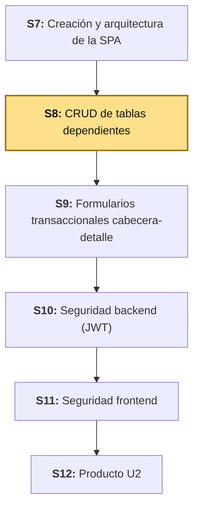
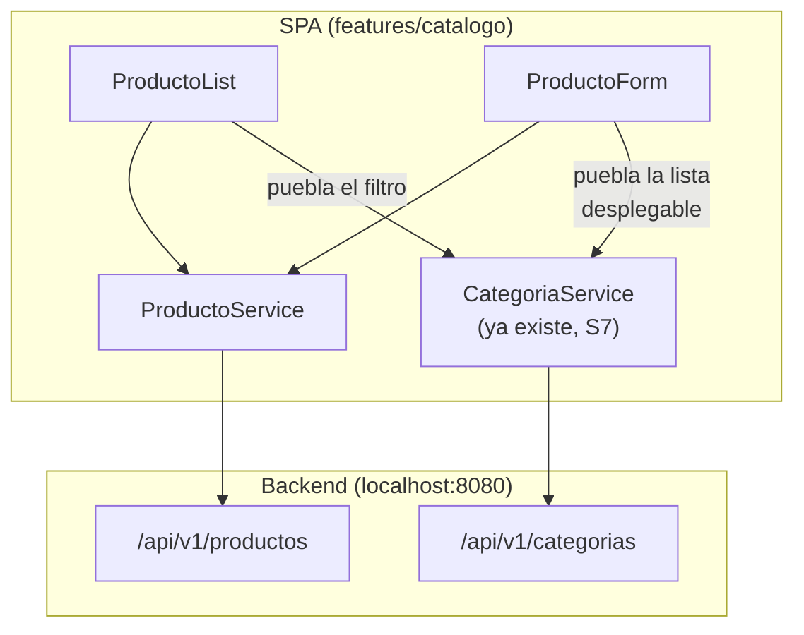

# S8 - CRUD de Tablas Dependientes

*Por: Angel Sullon Macalupu @asullom - 2026*

## 1. Introducción

Tiempo: 20 min.

### 1.1 Presentación de la sesión

El CRUD de `Categoria` (S7) es el caso más simple de una pantalla de datos: todo lo que el formulario pide pertenece a la propia entidad. Casi ninguna tabla de un sistema real es así. Un `Producto` no existe solo: siempre pertenece a una categoría, y nadie debería tener que escribir a mano el identificador de esa categoría para registrarlo. Esta sesión construye el primer CRUD **dependiente** de la SPA: el formulario de un producto le muestra al usuario las categorías que existen y le deja elegir una, la lista muestra a qué categoría pertenece cada producto, y las dependencias entre las dos tablas se validan antes y después de llamar al backend. El porqué de tratarlo como un problema aparte se desarrolla en 1.6, a partir del caso.

### 1.2 Índice

1. Selección de datos relacionados.
2. Listas desplegables.
3. Validación de dependencias.
4. Presentación de información relacionada.

### 1.3 Propósito de aprendizaje

Al concluir la clase, estarás en condiciones de:

- **Construir** un CRUD completo de una tabla dependiente conectado al backend real, con selección de datos relacionados mediante una lista desplegable, validación de las dependencias entre tablas y presentación de la información relacionada en la pantalla.

### 1.4 Producto de sesión

CRUD completo de `Producto` (`catalogo`) en la SPA (`lp2/bomerp-frontend`): modelo `Producto`, `ProductoService`, `ProductoList` (con el nombre de la categoría de cada producto y un filtro por categoría), `ProductoForm` (con una lista desplegable de categorías cargada desde `CategoriaService`, validación de los campos y de la dependencia), rutas y enlace en el sidebar, conectado a `http://localhost:8080/api/v1/productos`.

### 1.5 Metodología

**Tabla 1. Metodología de la sesión**

| Actividades a Realizar en el Periodo | Orientaciones generales (Orientaciones Metodológicas) | Material de estudio recomendado |
|---|---|---|
| Revisión previa individual | Confirmar que el CRUD de `Categoria` de S7 funciona, que `lp2/bomerp-backend` responde en `http://localhost:8080` con al menos dos categorías registradas, y revisar los campos de `ProductoRequest`/`ProductoResponse` en Swagger. Trabajo individual, antes de clase. | S7 (3.7-3.14), S3 (objetos relacionados), Swagger de `productos`. |
| Clase presencial | Construcción guiada del CRUD de `Producto`: modelo, servicio, lista con categoría y filtro, formulario con lista desplegable, validación de dependencias y prueba del flujo completo. Trabajo individual en la propia laptop, siguiendo al docente paso a paso. | Backend ejecutable y SPA de S7, Pasos 3.1 a 3.11 de esta guía. |
| Evaluación formativa | Verificación en clase del CRUD de `Producto` reflejado en tiempo real contra el backend, con la lista desplegable preseleccionada al editar. La evidencia se completa y sustenta de forma individual, fuera del aula, según los criterios mínimos de la sección 4.4. | Indicaciones de entrega (4.3), rúbrica de evaluación (4.6). |

El cierre real de S7, construido con las respuestas del Anexo de feedback de esa sesión, se entrega al inicio de esta clase.

### 1.6 Motivación de la sesión

#### 1.6.1 Caso: el producto que nadie sabía a qué categoría pertenecía

El formulario de `Producto` de un equipo tiene un campo de texto llamado "Categoría (id)". El encargado de almacén, que no es programador, no sabe qué número corresponde a "Bebidas" y escribe el primero que recuerda. El backend acepta el número si la categoría existe — y la lista de productos muestra, en la columna "Categoría", ese mismo número: `3`, `1`, `7`. Un mes después, nadie puede leer la lista sin tener a la vista la tabla de categorías, y dos productos quedaron registrados en una categoría equivocada porque el número "casi coincidía".

Otro día, un compañero elimina una categoría desde Swagger mientras el encargado ya tiene el formulario abierto. El encargado guarda el producto: el backend responde con un error, y la pantalla solo dice "No se pudo guardar", sin decir que el problema fue precisamente que la categoría elegida ya no existe.

Ninguno de los dos problemas está en el backend, que respondió correctamente en ambos casos. Los dos son de la pantalla: no mostró los datos relacionados por su nombre, y no distinguió el error de dependencia de cualquier otro error.

**Preguntas de análisis**

**Activación de conocimientos previos**

1. En el CRUD de `Categoria` de S7, ¿qué campos pedía el formulario, y de dónde salían todos?

**Comprensión de tablas dependientes**

1. ¿Qué información necesita el formulario de `Producto` que el de `Categoria` nunca necesitó, y de qué endpoint sale?
2. Si el formulario ya no permite elegir una categoría inexistente, ¿por qué el backend sigue validando que la categoría exista?

### 1.7 Ubicación en el curso

- Unidad: U2 - SPA modular segura para BomERP.
- Producto del curso: base Full-Stack modular de BomERP.
- Producto de unidad: SPA modular y segura, conectada al backend, con navegación por funcionalidades, CRUD de tablas independientes y dependientes, formularios transaccionales, consultas, reportes y control de acceso.
- Avance del producto en esta sesión: CRUD dependiente de `Producto` (módulo `catalogo`), con selección de categoría, validación de dependencias y presentación de información relacionada, conectado al backend real.

**Figura 1. Roadmap del producto de la unidad**



## 2. Explica

Tiempo: 25 min.

### 2.1 Arquitectura de la sesión

**Figura 2. Cómo se conectan las piezas del CRUD dependiente**



Lectura del diagrama: la arquitectura de S7 no cambia. Lo nuevo es una dependencia entre funcionalidades: `ProductoForm` y `ProductoList` usan el `CategoriaService` que ya existe, sin volver a escribir ninguna llamada a `/api/v1/categorias`. Cada apartado siguiente desarrolla una de las piezas de la sesión, en el mismo orden del Índice (1.2).

### 2.2 Selección de datos relacionados

Una **tabla dependiente** es la que necesita una referencia a otra para existir: `Producto` pertenece a una `Categoria`. En una pantalla, eso cambia cómo se construye el formulario: el usuario no escribe la referencia, la **elige** entre los datos que ya existen en la tabla de la que depende. Para eso el formulario necesita cargar **dos** cosas: el registro que se edita (si lo hay) y la lista de opciones de la tabla padre.

También cambia la forma de los datos. El backend usa una forma para enviar y otra para recibir:

**Tabla 2. Tabla independiente frente a tabla dependiente**

| | `Categoria` (independiente) | `Producto` (dependiente) |
|---|---|---|
| Datos que necesita el formulario | Solo los suyos | Los suyos, más la lista de categorías |
| Endpoints que consume | `/api/v1/categorias` | `/api/v1/productos` y `/api/v1/categorias` |
| Lo que el backend **devuelve** | `{ id, nombre, descripcion }` | `{ id, nombre, precio, stock, categoria: { id, nombre } }` |
| Lo que el backend **recibe** | `{ nombre, descripcion }` | `{ nombre, precio, stock, categoriaId }` |

Como las dos formas son distintas (la respuesta trae un objeto `categoria`, la petición un `categoriaId`), el frontend define **dos** modelos para `Producto`: uno para lo que llega y otro para lo que se envía. Ambos son `interface`, no `class` (S7, 2.5): solo describen la forma de los datos.

### 2.3 Listas desplegables

Una **lista desplegable** (`<select>`) le muestra al usuario un texto legible (el nombre de la categoría) y guarda en el formulario un valor que el backend entiende (su `id`). Las opciones salen de los datos reales de la tabla padre, no de una lista fija escrita en el código: si mañana se crea una categoría, aparece sola.

En un formulario reactivo (Angular, 2026a), cada opción usa `[ngValue]` para guardar el valor tal cual, sin convertirlo a texto (Angular, 2026b):

```html
<select formControlName="categoriaId">
  <option [ngValue]="0" disabled>Selecciona una categoría</option>
  @for (categoria of categorias(); track categoria.id) {
    <option [ngValue]="categoria.id">{{ categoria.nombre }}</option>
  }
</select>
```

La primera opción, deshabilitada, es el estado "todavía no elegí nada": su valor (`0`) no es un `id` real, y por eso el formulario lo rechaza al validar (2.4). Al **editar**, el formulario asigna al control el `id` de la categoría actual del producto y la lista aparece con esa opción ya seleccionada.

**Error frecuente**: usar `[value]` en vez de `[ngValue]` en cada `<option>`. Con `[value]` el control del formulario recibe siempre **texto** (`"3"`, no `3`): la pestaña **Network** muestra el `categoriaId` entre comillas en el cuerpo de la petición, y cualquier comparación estricta (`===`) con el `id` numérico falla sin ningún error visible.

### 2.4 Validación de dependencias

Una dependencia se puede romper en tres momentos distintos, y cada uno se valida en un lugar distinto:

**Tabla 3. Niveles de validación de una dependencia**

| Nivel | Qué valida | Ejemplo | Respuesta de la pantalla |
|---|---|---|---|
| Formulario (frontend) | Que el usuario haya elegido una opción válida antes de enviar. | Categoría sin seleccionar. | Mensaje junto al campo, sin llamar al backend. |
| Existencia previa (frontend) | Que exista al menos una opción para elegir. | No hay ninguna categoría registrada. | Aviso con enlace para crear una, y botón de guardar deshabilitado. |
| Backend | Que la referencia enviada exista de verdad. | La categoría elegida se eliminó mientras el formulario estaba abierto: `404`. | Mensaje específico, y recarga de las opciones. |

La validación del frontend **ayuda** al usuario a no equivocarse; la del backend **protege** los datos, porque cualquiera puede llamar a la API sin pasar por la pantalla. Por eso las dos existen, y ninguna reemplaza a la otra. El mensaje de la pantalla depende de qué falló: un `404` cuyo mensaje habla de la categoría es una dependencia rota; cualquier otro error es un error genérico de guardado.

### 2.5 Presentación de información relacionada

La lista de productos no debe mostrar `3` en la columna de categoría, sino su nombre. El backend ya lo entrega: `ProductoResponse` trae un objeto `categoria` con `id` y `nombre` (un resumen, no la categoría completa), así que la pantalla solo lo lee de cada fila. No hay que pedir cada categoría por separado: llamar a `/api/v1/categorias/{id}` una vez por fila multiplicaría las peticiones sin ningún beneficio.

Dos formas de mostrar la información relacionada:

- **Como columna**: `producto.categoria.nombre` en cada fila.
- **Como filtro**: una lista desplegable con las categorías que, al cambiar, pide al backend solo los productos de esa categoría (`GET /api/v1/productos?categoriaId=3`). El filtrado ocurre en el servidor, no en el navegador, para que siga funcionando cuando haya miles de productos.

Los montos se formatean con el `CurrencyPipe` de Angular (Angular, 2026e), para no mostrar `12.5` donde el usuario espera `S/ 12.50`.

## 3. Aplica: actividad práctica guiada

Tiempo: 120 min.

**Actividad:** construcción guiada del CRUD dependiente de `Producto` en la SPA, de punta a punta: modelo, servicio, lista con categoría y filtro, formulario con lista desplegable, validación de dependencias y prueba del flujo completo (Producto de la sesión en 1.4).

**Propósito de la actividad:** extender la arquitectura de S7 a una tabla que depende de otra, con el mismo patrón de carpetas y de servicios, sin repetir código de `Categoria`.

**Orientaciones metodológicas:** en el laboratorio, el docente construye el CRUD de `Producto` paso a paso frente a la clase; los estudiantes repiten cada paso en su propia laptop y aplican después el mismo patrón a una tabla dependiente de su propio dominio (ver sección 4).

**Actividades para realizar:**

- **3.1** Verificar el punto de partida.
- **3.2** Crear el modelo `Producto`.
- **3.3** Crear `ProductoService`.
- **3.4** Crear `ProductoList` con la categoría de cada producto.
- **3.5** Agregar el filtro por categoría a `ProductoList`.
- **3.6** Agregar eliminar a `ProductoList`.
- **3.7** Crear `ProductoForm` con la lista desplegable de categorías.
- **3.8** Validar las dependencias en `ProductoForm`.
- **3.9** Registrar las rutas y el enlace del sidebar.
- **3.10** Probar el CRUD dependiente completo.
- **3.11** Relacionar con ADS y BD2.

### 3.1 Verificar el punto de partida

**Producto del paso:** confirmación de que el backend responde con la categoría anidada y de que la SPA de S7 arranca.

Con `lp2/bomerp-backend` corriendo, consulta los productos:

```powershell
Invoke-RestMethod -Method Get -Uri "http://localhost:8080/api/v1/productos"
```

```bash
curl http://localhost:8080/api/v1/productos
```

Resultado esperado: una lista donde cada producto trae `id`, `nombre`, `precio`, `stock` y un objeto `categoria` con `id` y `nombre`. Si la lista está vacía, crea un producto desde Swagger antes de continuar. Luego levanta la SPA:

```powershell
cd lp2/bomerp-frontend
npm start
```

Abre `http://localhost:4200` y confirma que **Categorías** (S7) sigue funcionando.

### 3.2 Crear el modelo `Producto`

**Producto del paso:** las dos formas de `Producto`: la que llega y la que se envía (2.2).

Agrega el resumen de categoría a **`lp2/bomerp-frontend/src/app/features/catalogo/categoria/categoria.model.ts`**:

```ts
export interface Categoria {
  id?: number;
  nombre: string;
  descripcion?: string;
}

export interface CategoriaResumen {
  id: number;
  nombre: string;
}
```

Crea **`lp2/bomerp-frontend/src/app/features/catalogo/producto/producto.model.ts`**:

```ts
import { CategoriaResumen } from '../categoria/categoria.model';

export interface Producto {
  id: number;
  nombre: string;
  precio: number;
  stock: number;
  categoria: CategoriaResumen;
}

export interface ProductoRequest {
  nombre: string;
  precio: number;
  stock: number;
  categoriaId: number;
}
```

`Producto` es lo que devuelve el backend (con `categoria` anidada); `ProductoRequest` es lo que acepta (con `categoriaId`).

### 3.3 Crear `ProductoService`

**Producto del paso:** el servicio HTTP de `Producto`, con el filtro por categoría.

Crea **`lp2/bomerp-frontend/src/app/features/catalogo/producto/producto-service.ts`**:

```ts
import { Injectable, inject } from '@angular/core';
import { HttpClient, HttpParams } from '@angular/common/http';
import { Observable } from 'rxjs';
import { ApiService } from '../../../core/services/api-service';
import { Producto, ProductoRequest } from './producto.model';

@Injectable({ providedIn: 'root' })
export class ProductoService {
  private readonly http = inject(HttpClient);
  private readonly api = inject(ApiService);
  private readonly resource = '/api/v1/productos';

  listar(categoriaId?: number): Observable<Producto[]> {
    let params = new HttpParams();
    if (categoriaId) {
      params = params.set('categoriaId', categoriaId);
    }
    return this.http.get<Producto[]>(this.api.buildUrl(this.resource), { params });
  }

  obtener(id: number): Observable<Producto> {
    return this.http.get<Producto>(this.api.buildUrl(`${this.resource}/${id}`));
  }

  crear(producto: ProductoRequest): Observable<Producto> {
    return this.http.post<Producto>(this.api.buildUrl(this.resource), producto);
  }

  actualizar(id: number, producto: ProductoRequest): Observable<Producto> {
    return this.http.put<Producto>(this.api.buildUrl(`${this.resource}/${id}`), producto);
  }

  eliminar(id: number): Observable<void> {
    return this.http.delete<void>(this.api.buildUrl(`${this.resource}/${id}`));
  }
}
```

Es el mismo patrón que `CategoriaService` (S7): el servicio no sabe nada de pantallas, y usa `ApiService` para la URL base. La única novedad es `listar(categoriaId?)`, que agrega el parámetro `categoriaId` solo cuando se le pasa uno (Angular, 2026d).

### 3.4 Crear `ProductoList` con la categoría de cada producto

**Producto del paso:** la lista de productos, con el nombre de la categoría y el precio formateado.

Crea **`lp2/bomerp-frontend/src/app/features/catalogo/producto/producto-list.ts`**:

```ts
import { CurrencyPipe } from '@angular/common';
import { Component, OnInit, inject, signal } from '@angular/core';
import { RouterLink } from '@angular/router';
import { CategoriaService } from '../categoria/categoria-service';
import { Categoria } from '../categoria/categoria.model';
import { ProductoService } from './producto-service';
import { Producto } from './producto.model';

@Component({
  selector: 'app-producto-list',
  imports: [RouterLink, CurrencyPipe],
  templateUrl: './producto-list.html',
})
export class ProductoList implements OnInit {
  private readonly productoService = inject(ProductoService);
  private readonly categoriaService = inject(CategoriaService);

  protected readonly productos = signal<Producto[]>([]);
  protected readonly categorias = signal<Categoria[]>([]);
  protected readonly categoriaFiltro = signal<number | null>(null);
  protected readonly error = signal<string | null>(null);
  protected readonly loading = signal(false);

  ngOnInit(): void {
    this.categoriaService.listar().subscribe({
      next: (data) => this.categorias.set(data),
      error: () => this.error.set('No se pudo cargar la lista de categorías.'),
    });
    this.cargar();
  }

  cargar(): void {
    this.loading.set(true);
    this.error.set(null);
    this.productoService.listar(this.categoriaFiltro() ?? undefined).subscribe({
      next: (data) => this.productos.set(data),
      error: () => {
        this.error.set('No se pudo cargar la lista de productos.');
        this.loading.set(false);
      },
      complete: () => this.loading.set(false),
    });
  }
}
```

Crea **`lp2/bomerp-frontend/src/app/features/catalogo/producto/producto-list.html`**:

```html
@if (loading()) {
  <p>Cargando productos...</p>
}

@if (error()) {
  <p class="error">{{ error() }}</p>
}

<a routerLink="/catalogo/productos/nuevo">Nuevo producto</a>

<table>
  <thead>
    <tr>
      <th>Nombre</th>
      <th>Categoría</th>
      <th>Precio</th>
      <th>Stock</th>
      <th></th>
    </tr>
  </thead>
  <tbody>
    @for (producto of productos(); track producto.id) {
      <tr>
        <td>{{ producto.nombre }}</td>
        <td>{{ producto.categoria.nombre }}</td>
        <td>{{ producto.precio | currency: 'PEN' : 'S/ ' }}</td>
        <td>{{ producto.stock }}</td>
        <td>
          <a [routerLink]="['/catalogo/productos', producto.id, 'editar']">Editar</a>
        </td>
      </tr>
    } @empty {
      @if (!loading() && !error()) {
        <tr>
          <td colspan="5">No hay productos registrados.</td>
        </tr>
      }
    }
  </tbody>
</table>
```

`producto.categoria.nombre` es la información relacionada de 2.5: sale de la misma respuesta, sin ninguna llamada extra. La ruta y el enlace del sidebar se registran en 3.9; hasta entonces la pantalla todavía no es alcanzable desde el menú.

### 3.5 Agregar el filtro por categoría a `ProductoList`

**Producto del paso:** una lista desplegable que pide al backend solo los productos de la categoría elegida.

En `producto-list.ts`, agrega el método `filtrar` dentro de la clase, debajo de `cargar()`:

```ts
  filtrar(categoriaId: number): void {
    this.categoriaFiltro.set(categoriaId || null);
    this.cargar();
  }
```

En `producto-list.html`, agrega el filtro justo debajo del enlace **Nuevo producto**:

```html
<label>
  Filtrar por categoría
  <select #filtro (change)="filtrar(+filtro.value)">
    <option value="0">Todas</option>
    @for (categoria of categorias(); track categoria.id) {
      <option [value]="categoria.id">{{ categoria.nombre }}</option>
    }
  </select>
</label>
```

Aquí `[value]` sí es correcto, a diferencia del formulario (2.3): el filtro no guarda el valor en un formulario reactivo, sino que lo convierte a número al instante con `+filtro.value`. El valor `0` de "Todas" hace que `filtrar` quite el filtro (`categoriaId || null`).

### 3.6 Agregar eliminar a `ProductoList`

**Producto del paso:** eliminar un producto con confirmación y con manejo de error controlado.

En `producto-list.ts`, agrega la importación de `HttpErrorResponse` (`import { HttpErrorResponse } from '@angular/common/http';`) y este método:

```ts
  eliminar(id: number): void {
    if (!confirm(`¿Está seguro de eliminar el producto ${id}?`)) {
      return;
    }

    this.productoService.eliminar(id).subscribe({
      next: () => this.cargar(),
      error: (err: HttpErrorResponse) => {
        if (err.status === 404) {
          this.error.set('El producto ya no existe. Se recargó la lista.');
          this.cargar();
        } else {
          this.error.set('No se pudo eliminar el producto.');
        }
      },
    });
  }
```

En `producto-list.html`, agrega el botón junto al enlace **Editar**:

```html
          <button (click)="eliminar(producto.id)">Eliminar</button>
```

### 3.7 Crear `ProductoForm` con la lista desplegable de categorías

**Producto del paso:** el formulario de `Producto`, con la lista desplegable poblada desde `CategoriaService`.

Crea **`lp2/bomerp-frontend/src/app/features/catalogo/producto/producto-form.ts`**:

```ts
import { Component, inject, signal } from '@angular/core';
import { HttpErrorResponse } from '@angular/common/http';
import { ActivatedRoute, Router } from '@angular/router';
import {
  AbstractControl,
  FormBuilder,
  ReactiveFormsModule,
  ValidationErrors,
  Validators,
} from '@angular/forms';
import { CategoriaService } from '../categoria/categoria-service';
import { Categoria } from '../categoria/categoria.model';
import { ProductoService } from './producto-service';

function entero(control: AbstractControl): ValidationErrors | null {
  return Number.isInteger(control.value) ? null : { entero: true };
}

@Component({
  selector: 'app-producto-form',
  imports: [ReactiveFormsModule],
  templateUrl: './producto-form.html',
})
export class ProductoForm {
  private readonly fb = inject(FormBuilder);
  private readonly productoService = inject(ProductoService);
  private readonly categoriaService = inject(CategoriaService);
  private readonly route = inject(ActivatedRoute);
  private readonly router = inject(Router);

  protected readonly id = signal<number | null>(null);
  protected readonly categorias = signal<Categoria[]>([]);
  protected readonly categoriasCargadas = signal(false);
  protected readonly error = signal<string | null>(null);
  protected readonly loading = signal(false);
  protected readonly errorCarga = signal(false);

  protected readonly form = this.fb.nonNullable.group({
    nombre: ['', [Validators.required, Validators.maxLength(120)]],
    precio: [0, [Validators.required, Validators.min(0)]],
    stock: [0, [Validators.required, Validators.min(0), entero]],
    categoriaId: [0, [Validators.min(1)]],
  });

  constructor() {
    this.cargarCategorias();

    const idParam = this.route.snapshot.paramMap.get('id');
    if (idParam) {
      const id = Number(idParam);
      this.id.set(id);
      this.loading.set(true);
      this.productoService.obtener(id).subscribe({
        next: (producto) => {
          this.form.patchValue({
            nombre: producto.nombre,
            precio: producto.precio,
            stock: producto.stock,
            categoriaId: producto.categoria.id,
          });
          this.loading.set(false);
        },
        error: () => {
          this.errorCarga.set(true);
          this.error.set('No se pudo cargar el producto.');
          this.loading.set(false);
        },
      });
    }
  }

  private cargarCategorias(): void {
    this.categoriaService.listar().subscribe({
      next: (data) => {
        this.categorias.set(data);
        this.categoriasCargadas.set(true);
      },
      error: () => this.error.set('No se pudieron cargar las categorías.'),
    });
  }

  guardar(): void {
    if (this.loading() || this.errorCarga()) return;
    this.error.set(null);
    const nombre = this.form.controls.nombre;
    nombre.setValue(nombre.value.trim());

    if (this.form.invalid) {
      this.form.markAllAsTouched();
      return;
    }
    const valor = this.form.getRawValue();
    const id = this.id();
    const peticion = id
      ? this.productoService.actualizar(id, valor)
      : this.productoService.crear(valor);

    this.loading.set(true);
    peticion.subscribe({
      next: () => this.router.navigate(['/catalogo/productos']),
      error: (err: HttpErrorResponse) => this.manejarErrorGuardado(err),
    });
  }

  cancelar(): void {
    this.router.navigate(['/catalogo/productos']);
  }

  private manejarErrorGuardado(err: HttpErrorResponse): void {
    this.error.set('No se pudo guardar el producto.');
    this.loading.set(false);
  }

  protected mensajeValidacion(campo: 'nombre' | 'precio' | 'stock' | 'categoriaId'): string {
    const control = this.form.controls[campo];

    if (!control.touched) return '';

    if (control.hasError('required')) {
      return 'Este campo es obligatorio.';
    }

    if (control.hasError('maxlength')) {
      return `Máximo ${control.getError('maxlength').requiredLength} caracteres.`;
    }

    if (control.hasError('min')) {
      return campo === 'categoriaId' ? 'Selecciona una categoría.' : 'Debe ser mayor o igual a 0.';
    }

    if (control.hasError('entero')) {
      return 'Debe ser un número entero.';
    }

    return '';
  }
}
```

`categoriaId` arranca en `0`, el valor de la opción deshabilitada (2.3), y `Validators.min(1)` lo rechaza: mientras el usuario no elija, el formulario es inválido (Angular, 2026c). `cargarCategorias()` corre siempre, tanto al crear como al editar, porque en los dos casos hace falta la lista de opciones.

Crea **`lp2/bomerp-frontend/src/app/features/catalogo/producto/producto-form.html`**:

```html
<form [formGroup]="form" (ngSubmit)="guardar()">
  @if (loading()) {
    <p>Cargando...</p>
  }

  <label>
    Nombre
    <input type="text" formControlName="nombre" />
  </label>
  @if (mensajeValidacion('nombre'); as mensaje) {
    <p class="error">{{ mensaje }}</p>
  }

  <label>
    Precio (S/)
    <input type="number" step="0.01" min="0" formControlName="precio" />
  </label>
  @if (mensajeValidacion('precio'); as mensaje) {
    <p class="error">{{ mensaje }}</p>
  }

  <label>
    Stock
    <input type="number" step="1" min="0" formControlName="stock" />
  </label>
  @if (mensajeValidacion('stock'); as mensaje) {
    <p class="error">{{ mensaje }}</p>
  }

  <label>
    Categoría
    <select formControlName="categoriaId">
      <option [ngValue]="0" disabled>Selecciona una categoría</option>
      @for (categoria of categorias(); track categoria.id) {
        <option [ngValue]="categoria.id">{{ categoria.nombre }}</option>
      }
    </select>
  </label>
  @if (mensajeValidacion('categoriaId'); as mensaje) {
    <p class="error">{{ mensaje }}</p>
  }

  @if (error()) {
    <p class="error">{{ error() }}</p>
  }

  <button type="submit" [disabled]="loading() || errorCarga()">Guardar</button>
  <button type="button" (click)="cancelar()">Cancelar</button>
</form>
```

### 3.8 Validar las dependencias en `ProductoForm`

**Producto del paso:** los dos casos de dependencia rota de 1.6.1 resueltos: sin categorías disponibles, y categoría que desaparece mientras el formulario está abierto.

**Sin categorías disponibles.** En `producto-form.html`, agrega este aviso justo debajo de `@if (loading())` y cambia la condición del botón **Guardar**:

```html
  @if (categoriasCargadas() && categorias().length === 0) {
    <p class="error">
      No hay categorías registradas. Un producto necesita una categoría:
      <a routerLink="/catalogo/categorias/nueva">crea una primero</a>.
    </p>
  }
```

```html
  <button type="submit" [disabled]="loading() || errorCarga() || categorias().length === 0">
    Guardar
  </button>
```

`categoriasCargadas()` distingue "todavía no llegó la lista" de "llegó vacía": sin esa señal, el aviso parpadearía al abrir el formulario. El aviso usa `routerLink`, así que agrega también `RouterLink` al componente: en `producto-form.ts`, cambia la importación a `import { ActivatedRoute, Router, RouterLink } from '@angular/router';` y el decorador a `imports: [ReactiveFormsModule, RouterLink]`.

**Categoría que desaparece.** Reemplaza `manejarErrorGuardado` en `producto-form.ts` por esta versión, que distingue el error de dependencia de los demás:

```ts
  private manejarErrorGuardado(err: HttpErrorResponse): void {
    const mensaje: string = err.error?.message ?? '';

    if (err.status === 404 && mensaje.startsWith('Categoria')) {
      this.error.set('La categoría seleccionada ya no existe. Elige otra de la lista.');
      this.form.controls.categoriaId.setValue(0);
      this.cargarCategorias();
    } else if (err.status === 400) {
      this.error.set('Los datos enviados no son válidos. Revisa los campos del formulario.');
    } else {
      this.error.set('No se pudo guardar el producto.');
    }
    this.loading.set(false);
  }
```

El backend responde un `404` con un cuerpo `{ status, error, message }`, y `message` empieza con `Categoria no encontrada` cuando la dependencia es la que falló (y con `Producto no encontrado` si es el propio producto): esa diferencia es lo que permite mostrar un mensaje específico. Además de mostrarlo, el formulario vuelve a la opción "Selecciona una categoría" y recarga la lista de opciones, para que el usuario elija de las categorías que existen ahora.

### 3.9 Registrar las rutas y el enlace del sidebar

**Producto del paso:** las tres pantallas de `Producto` alcanzables desde el menú.

En **`lp2/bomerp-frontend/src/app/app.routes.ts`**, agrega estas tres rutas hijas junto a las de `Categoria`, dentro del `children` del layout:

```ts
      {
        path: 'catalogo/productos',
        loadComponent: () =>
          import('./features/catalogo/producto/producto-list').then((m) => m.ProductoList),
      },
      {
        path: 'catalogo/productos/nuevo',
        loadComponent: () =>
          import('./features/catalogo/producto/producto-form').then((m) => m.ProductoForm),
      },
      {
        path: 'catalogo/productos/:id/editar',
        loadComponent: () =>
          import('./features/catalogo/producto/producto-form').then((m) => m.ProductoForm),
      },
```

En **`lp2/bomerp-frontend/src/app/core/layout/layout.html`**, agrega el enlace dentro de `<nav>`, debajo de **Categorías**:

```html
      <a routerLink="/catalogo/productos" routerLinkActive="active">Productos</a>
```

Las rutas se declaran con `loadComponent`, igual que las de `Categoria` (S7): cada pantalla se carga cuando el usuario la visita (Angular, 2026f).

### 3.10 Probar el CRUD dependiente completo

Con `lp2/bomerp-backend` corriendo y `npm start` activo:

1. Abre `http://localhost:4200` y haz clic en **Productos** (sidebar). La lista debe mostrar el **nombre** de la categoría de cada producto, no un número, y el precio con formato `S/ 12.50`.
2. Usa el filtro **Filtrar por categoría**: la lista debe mostrar solo los productos de esa categoría. Elige **Todas** para volver a verlos todos.
3. Clic en **Nuevo producto**. Deja la categoría sin elegir e intenta **Guardar**: debe aparecer "Selecciona una categoría." junto al campo, sin ninguna petición nueva en la pestaña **Network**.
4. Completa el formulario con una categoría real y guarda. Debe volver a la lista con el producto nuevo visible.
5. Clic en **Editar** sobre un producto existente. La lista desplegable debe aparecer con **su categoría ya seleccionada**, no con "Selecciona una categoría". Cambia la categoría, guarda, y confirma el cambio en la lista.
6. Abre **Nuevo producto** y, sin cerrarlo, elimina esa categoría desde Swagger (usa una categoría sin productos, o una creada para la prueba). Elige esa misma categoría en el formulario y guarda: debe aparecer "La categoría seleccionada ya no existe. Elige otra de la lista.", la lista de opciones se recarga sin esa categoría, y la selección vuelve a "Selecciona una categoría".
7. Elimina un producto. Debe desaparecer de la lista. Prueba también eliminar uno que ya haya aparecido en una venta (S4): funciona, porque las ventas guardan su propia copia del nombre y del precio y no dependen del producto (ADS S8, 2.6).

**Error frecuente**: la lista desplegable de **Editar** aparece en blanco (o en "Selecciona una categoría") aunque el producto sí tiene categoría. Revisa que `producto.categoria.id` llegue en el `patchValue` de 3.7 y que las opciones usen `[ngValue]` y no `[value]` (2.3): con `[value]` el control recibe texto y no coincide con el `id` numérico.

### 3.11 Relacionar con ADS y BD2

Sesión equivalente en los otros dos cursos, misma semana: ADS S8 diseña las clases de un módulo por capas, con sus DTO y su contrato REST — el `ProductoResponse` con su `categoria` anidada, un resumen y no la categoría completa, es exactamente el tipo de DTO que esa sesión diseña, y la matriz de trazabilidad de ADS S8 documenta que `PRODUCTOS.ID_CATEGORIA` hoy admite valores nulos en la base de datos aunque el diseño de clases la exige. BD2 S8 rediseña los privilegios del usuario `BOMERP_APP` con roles por función: el CRUD de `Producto` de hoy consume los mismos endpoints de catálogo, así que ejerce exactamente los privilegios de `ROL_APP_CATALOGO`, sin ningún cambio en el código de esta sesión.

**Evidencia de aprendizaje:**

- Modelos `Producto` y `ProductoRequest`, y `ProductoService` con el filtro por categoría.
- `ProductoList` mostrando el nombre de la categoría de cada producto, con filtro y eliminación.
- `ProductoForm` con la lista desplegable de categorías, preseleccionada al editar.
- Validación de las dependencias: categoría sin elegir, sin categorías disponibles y categoría que desaparece.
- Rutas y enlace del sidebar, con el CRUD completo probado contra el backend real.

## 4. Crea: actividad autónoma

Tiempo: 2h fuera del aula.

### 4.1 Actividad

Replicación autónoma de un CRUD de tabla dependiente sobre el dominio elegido por el equipo, documentada en evidencia individual.

Completa y evidencia estas tareas:

1. Elige una tabla de tu propio dominio que dependa de otra (que tenga una referencia a una tabla padre) y define sus dos modelos: el que devuelve tu backend y el que recibe.
2. Crea (o reutiliza, si ya existe) el servicio HTTP de la tabla padre, y construye el servicio HTTP de la tabla dependiente, sin llamadas a `HttpClient` desde componentes.
3. Construye la lista de la tabla dependiente mostrando la información relacionada de la tabla padre por su nombre, y un filtro por la tabla padre que use un parámetro del backend.
4. Construye el formulario con una lista desplegable poblada desde el servicio de la tabla padre, preseleccionada al editar.
5. Valida la dependencia en dos niveles: en el formulario (opción sin elegir) y frente a una respuesta de error del backend cuando la referencia ya no existe.
6. Prueba el CRUD completo contra tu propio backend real, no con datos simulados, y documenta un error real encontrado.

### 4.2 Propósito

Que cada estudiante demuestre, de forma individual y fuera del aula, que puede construir un CRUD dependiente conectado a un backend real, con selección de datos relacionados y validación de dependencias, sin el acompañamiento del docente.

Cada estudiante documenta el CRUD dependiente de su propio dominio.

### 4.3 Indicaciones

Entrega un PDF con el siguiente nombre:

```text
S08_LP2_Equipo##_ApellidoNombre.pdf
```

Cada captura de pantalla del informe debe mostrar, sin recortar, el reloj del sistema (fecha y hora) y tu usuario o foto de perfil (Windows, VS Code o navegador) visibles en pantalla — es lo que permite verificar que la evidencia es tuya y que corresponde al momento real de tu trabajo.

#### 4.3.1 Estructura del informe

**Datos del estudiante**

- Nombre:
- Equipo:
- Sesión: S08 - CRUD de Tablas Dependientes
- Rol o aporte realizado:
- Link de GitHub:

**Evidencia técnica**

Incluye capturas con una breve explicación debajo de cada una, organizadas en los mismos 4 bloques de la rúbrica (4.6):

1. *Modelos y servicios*
    - Los dos modelos de tu tabla dependiente (el que devuelve y el que recibe el backend), y sus servicios HTTP.
2. *Lista con información relacionada*
    - La lista mostrando el nombre de la tabla padre en cada fila, y el filtro por tabla padre funcionando (pestaña Network con el parámetro enviado).
3. *Lista desplegable y formulario*
    - El formulario con la lista desplegable poblada desde la tabla padre, y la edición de un registro con su opción preseleccionada.
4. *Validación de dependencias*
    - El mensaje del formulario ante una opción sin elegir, y el mensaje específico ante una referencia que el backend ya no encuentra.

**Error o hallazgo**

Describe al menos un hallazgo real: una lista desplegable que no preseleccionaba la opción al editar, un valor que llegaba al backend como texto en vez de número, o una diferencia entre lo que el backend devuelve y lo que recibe que no habías contemplado.

**Reflexión técnica breve**

Responde en 5 a 8 líneas:

```text
¿Por qué el formulario valida que se haya elegido una categoría si el
backend ya rechaza una categoría inexistente — y qué pasaría si solo
existiera una de las dos validaciones?
```

**Anexo: Feedback de la sesión**

Pega esta página como la última hoja del PDF, con tus respuestas.

1. ¿Cuál es el aprendizaje más importante que te llevas de la clase de hoy?
2. ¿Qué punto de la clase te resultó más confuso o te dejó con dudas?
3. ¿Tienes alguna pregunta que te gustaría que sea respondida la siguiente clase?
4. Sobre tu nivel de comprensión de la clase de hoy, marca una opción:
    - ¡Entendido! - Lo domino y podría explicarlo.
    - Más o menos. - Entendí la idea general, pero tengo dudas.
    - Necesito ayuda. - Me siento perdido/a con este tema.
5. ¿Cómo puedo ayudarte a comprender mejor el tema?
6. Pensando en tu participación y esfuerzo en la clase de hoy, ¿cómo te autoevaluarías? Marca una opción:
    - Muy Comprometido/a: Me esforcé al máximo.
    - Comprometido/a: Sé que podría haberme esforzado un poco más.
    - Poco Comprometido/a: Hoy no di mi mejor esfuerzo.
7. Mi satisfacción con la clase fue... (califica del 1 al 10, donde 1 es insatisfecho y 10 es muy satisfecho).

### 4.4 Criterios mínimos de aceptación

La evidencia individual se considera completa si:

- El archivo respeta el nombre solicitado.
- Define dos modelos distintos para la tabla dependiente: el que devuelve y el que recibe el backend.
- Implementa un servicio HTTP dedicado para la tabla dependiente, sin llamadas a `HttpClient` desde componentes, y reutiliza el servicio de la tabla padre para poblar la lista desplegable.
- La lista muestra la información relacionada de la tabla padre por su nombre, y ofrece un filtro por la tabla padre que usa un parámetro del backend.
- El formulario usa una lista desplegable preseleccionada al editar, con el valor guardado como número (no como texto).
- Valida la dependencia en el formulario y frente a un error del backend, con mensajes distintos.
- Implementa el CRUD completo (crear, listar, editar, eliminar), probado contra un backend real.
- Cada captura de la evidencia técnica muestra el reloj del sistema y el usuario/perfil visible, sin recortar.
- Las fechas y horas de las capturas son coherentes con el historial de commits de su repositorio en GitHub.
- Incluye un error o hallazgo técnico diagnosticado.
- Incluye la reflexión técnica breve solicitada.
- Incluye el Anexo de feedback de la sesión respondido, como última página del PDF.

### 4.5 Preguntas de defensa

1. ¿Por qué el backend devuelve la categoría anidada (`categoria: { id, nombre }`) pero recibe solo `categoriaId`? ¿Qué problema evita separar los dos modelos?
2. ¿Qué diferencia hay entre `[value]` y `[ngValue]` en una opción de una lista desplegable, y qué síntoma produce usar la equivocada?
3. ¿Por qué el filtro por categoría se hace en el servidor y no filtrando la lista en el navegador?
4. ¿Por qué el formulario y el backend validan la misma dependencia? ¿Cuál de las dos protege los datos, y por qué?
5. ¿Por qué `ProductoForm` no vuelve a escribir las llamadas a `/api/v1/categorias`?
6. Un compañero elimina la categoría mientras tu formulario está abierto. ¿Qué responde el backend y cómo lo distingue tu pantalla de otro error de guardado?
7. En tu propio dominio (4.1), ¿qué tabla es la dependiente, de cuál depende, y qué cambiaría en tu formulario si esa relación fuera opcional?

### 4.6 Rúbrica de evaluación

**Tabla 4. Rúbrica de evaluación**

| Criterio | Peso (%) | A (20 pts) | B (15 pts) | C (10 pts) | D (5 pts) | Nivel obtenido |
|---|---:|---|---|---|---|---:|
| 1. Modelos y servicios* | 25 | Dos modelos distintos (respuesta y petición), servicio dedicado para la tabla dependiente y reutilización del servicio de la tabla padre, sin `HttpClient` en componentes. | Modelos y servicios correctos, con algún acceso directo a `HttpClient` o un solo modelo. | Servicios o modelos incompletos. | No implementa servicios HTTP. | |
| 2. Lista con información relacionada* | 25 | Lista con el nombre de la tabla padre en cada fila y filtro por tabla padre resuelto en el servidor, evidenciado en la pestaña Network. | Lista con información relacionada, con el filtro incompleto o resuelto en el navegador. | Lista sin la información relacionada o sin filtro. | No presenta la lista. | |
| 3. Lista desplegable y formulario* | 25 | Lista desplegable poblada desde la tabla padre, preseleccionada al editar, con el valor guardado como número. | Lista desplegable funcional, con la preselección o el tipo del valor incorrectos. | Lista desplegable con datos fijos, o formulario incompleto. | No implementa lista desplegable. | |
| 4. Validación de dependencias* | 25 | Validación en el formulario y frente al backend, con mensajes distintos y explicados. | Validación en un solo nivel, o mensajes sin distinguir. | Validación parcial o sin evidenciar. | No valida las dependencias. | |

\* Agregado manual.

Nota final = suma de (`Peso` / 100 × `Puntos del nivel obtenido`) = ____ / 20.

Para usar la rúbrica con IA, solicita:

```text
Evalúa el PDF usando la rúbrica de la sesión.
Para cada criterio selecciona el nivel obtenido usando la escala A=20, B=15, C=10, D=5 puntos.
Justifica brevemente cada nivel asignado.
Verifica que cada captura muestre reloj del sistema y usuario/perfil visible, y que las fechas sean coherentes con el historial de commits de GitHub. Si falta esta evidencia o hay inconsistencias, indícalo explícitamente antes de calificar.
Calcula la nota final con la fórmula: suma de (Peso/100 × Puntos del nivel obtenido), directamente sobre 20.
Indica 2 fortalezas y 2 recomendaciones.
```

## 5. Cierre

Tiempo: 5 min.

**Resumen breve:** hoy la SPA de BomERP ganó su primer CRUD dependiente: `Producto` se registra y se edita eligiendo su categoría de una lista desplegable poblada por el mismo `CategoriaService` de S7, la lista muestra a qué categoría pertenece cada producto y se puede filtrar por ella, y las dependencias entre las dos tablas se validan tanto en el formulario como frente a la respuesta del backend.

**Dinámica participativa:** en una ronda rápida, cada estudiante comparte en una frase qué tabla de su propio dominio es dependiente, y de cuál depende.

**Metacognición:** cada estudiante responde el Anexo de feedback de la sesión, incluido en su evidencia individual (ver 4.3.1). El docente analiza esas respuestas con IA para identificar temas recurrentes o dudas comunes del equipo, y con esos indicadores construye el cierre real de la sesión — que se entrega al inicio de S9, no al final de esta clase.

**Proyección:** S9 lleva la misma idea un paso más lejos: un formulario transaccional de cabecera y detalle (`Venta` con sus líneas), donde el detalle es dinámico, el total se calcula en pantalla y cada línea depende de un producto elegido — con la lista desplegable de hoy repetida tantas veces como líneas tenga la venta.

## Bibliografía

1. Angular. (2026a). *Reactive forms*. Google. https://angular.dev/guide/forms/reactive-forms
2. Angular. (2026b). *SelectControlValueAccessor*. Google. https://angular.dev/api/forms/SelectControlValueAccessor
3. Angular. (2026c). *Validators*. Google. https://angular.dev/api/forms/Validators
4. Angular. (2026d). *HTTP Client*. Google. https://angular.dev/guide/http
5. Angular. (2026e). *CurrencyPipe*. Google. https://angular.dev/api/common/CurrencyPipe
6. Angular. (2026f). *Routing*. Google. https://angular.dev/guide/routing
