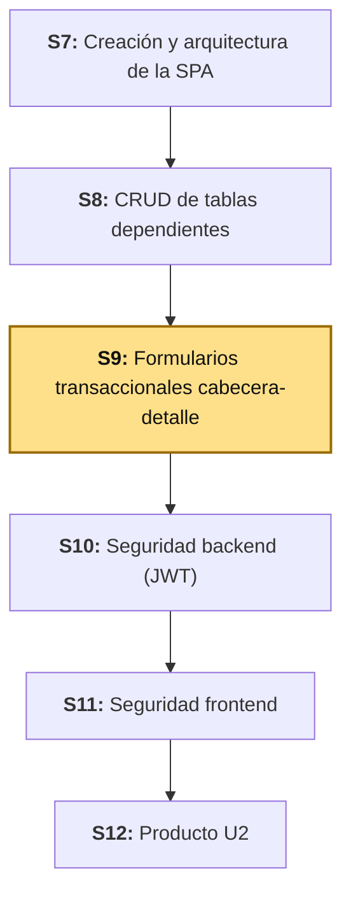
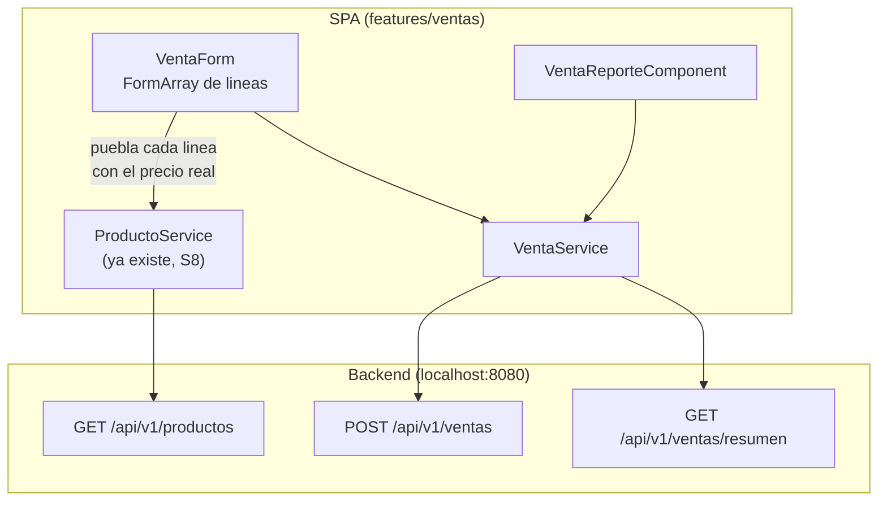
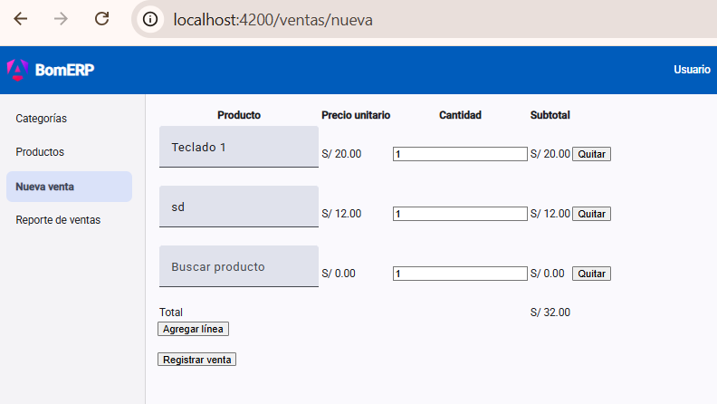

# S9 - Formularios Transaccionales Cabecera-Detalle

*Por: Angel Sullon Macalupu @asullom - 2026*

## 1. Introducción

Tiempo: 20 min.

### 1.1 Presentación de la sesión

El CRUD de `Producto` (S8) edita **una** fila a la vez: un formulario, una entidad, un `POST` o un `PUT`. Una venta no funciona así — el backend ya lo resolvió en S4 (`VentaServiceImpl.crear`): una cabecera (`Venta`) que se guarda junto con una lista variable de líneas (`DetalleVenta`), en una sola operación, con un total que el servidor calcula y nunca el cliente. Esta sesión construye el formulario que arma esa misma estructura en el navegador: líneas que se agregan y quitan en vivo, un total que se recalcula con cada cambio, una confirmación antes de enviar la operación, y una vista de consulta que trae el reporte agregado que el backend ya expone. El porqué de exigir una confirmación explícita antes de enviar una operación irreversible se desarrolla en 1.6, a partir del caso.

### 1.2 Índice

1. Formularios con detalle dinámico (`FormArray`).
2. Cálculos derivados en el formulario.
3. Validaciones de una operación compuesta.
4. Confirmación antes de una operación irreversible.
5. Consultas y reportes agregados.

### 1.3 Propósito de aprendizaje

Al concluir la clase, estarás en condiciones de:

- **Construir** un formulario transaccional con detalle dinámico que calcula sus propios totales, **validar** la operación completa antes de confirmarla, **presentar** una vista de consulta con agregados, detalle y filtros (estado y rango de fechas), y **diseñar e implementar** de punta a punta una transición de estado con regla de negocio real (anular una venta, restaurando el stock asociado).

### 1.4 Producto de sesión

`VentaForm` en la SPA (`lp2/bomerp-frontend`): formulario con `FormArray` de líneas (producto elegido por autocomplete con su precio visible, cantidad, precio unitario y subtotal calculados en vivo), total general recalculado con cada cambio, validación de que exista al menos una línea y de que cada una tenga producto y cantidad válidos, confirmación explícita antes de enviar, y manejo específico de los errores reales del backend (producto inexistente, stock insuficiente). Además, `VentaReporteComponent`, una vista de consulta que trae `GET /api/v1/ventas` con filtro por estado y por rango de fechas, calculando en el navegador los agregados (cantidad de ventas, monto total, ticket promedio) a partir de los totales ya calculados por el servidor, mostrando siempre, debajo de cada venta, su detalle real línea por línea, ya incluido en la misma respuesta, con la posibilidad de anular una venta `REGISTRADA` (`PATCH /api/v1/ventas/{id}/anular`), restaurando el stock de sus productos.

### 1.5 Metodología

**Tabla 1. Metodología de la sesión**

| Actividades a Realizar en el Periodo | Orientaciones generales (Orientaciones Metodológicas) | Material de estudio recomendado |
|---|---|---|
| Revisión previa individual | Repasar el pseudocódigo de `VentaServiceImpl.crear` (S4) y el contrato REST de `ventas` (ADS S8, Tabla 17): qué campos decide el servidor y qué errores puede devolver (404, 409). Trabajo individual, antes de clase. | S4 (backend), ADS S8 (Tablas 10, 17), S8 LP2 (2.2-2.4). |
| Clase presencial | Construcción guiada de `VentaForm` con detalle dinámico, selección de producto por autocomplete con precio, cálculo de totales, validación, confirmación, y de `VentaReporteComponent` con sus filtros (estado y rango de fechas), el detalle real de cada venta y la anulación con restauración de stock. Trabajo individual en la propia laptop, siguiendo al docente paso a paso. | Backend ejecutable y SPA de S8, Pasos 3.1 a 3.15 de esta guía. |
| Evaluación formativa | Verificación en clase de una venta registrada de punta a punta (con sus líneas, su total y la confirmación) y del reporte reflejando esa venta. La evidencia se completa y sustenta de forma individual, fuera del aula, según los criterios mínimos de la sección 4.4. | Indicaciones de entrega (4.3), rúbrica de evaluación (4.6). |

### 1.6 Motivación de la sesión

#### 1.6.1 Caso: los 45 minutos de Knight Capital, sin nadie que pudiera confirmar o detener nada

El 1 de agosto de 2012, Knight Capital Group desplegó un nuevo módulo de *trading* en ocho servidores, pero el proceso de despliegue falló en uno de ellos: ese octavo servidor se quedó con una bandera de código antigua, reutilizada por error para activar una función obsoleta (*Power Peg*) en vez de la nueva. Durante 45 minutos, ese servidor interpretó órdenes normales del mercado como señal para disparar millones de órdenes de compra y venta reales, sin que ningún mecanismo detuviera o pidiera confirmar la operación antes de ejecutarla. El resultado: 4 millones de ejecuciones sobre 397 millones de acciones, y una pérdida de aproximadamente 440 millones de dólares en menos de una hora.

Fuente: U.S. Securities and Exchange Commission. (2013). *In the Matter of Knight Capital Americas LLC* (Release No. 34-70694). https://www.sec.gov/litigation/admin/2013/34-70694.pdf

Ninguna persona decidió ejecutar esas órdenes: el sistema las generó solo, sin ningún punto donde un humano pudiera revisar el total antes de comprometerlo. Para cuando alguien notó el problema, el daño ya estaba hecho. Una operación financiera automática, sin ningún resumen ni confirmación entre "calcular" y "comprometer", no deja margen para que nadie detecte un error antes de que sea irreversible — exactamente el riesgo que un paso de confirmación, con el total visible, existe para reducir.

**Preguntas de análisis**

**Activación de conocimientos previos**

1. En el CRUD de `Producto` (S8), ¿el usuario veía algún resumen antes de confirmar "Guardar"? ¿Por qué ahí no hacía tanta falta?

**Comprensión de la confirmación en operaciones compuestas**

1. Según el caso, ¿qué hubiera cambiado si hubiera existido un punto de control donde alguien pudiera ver el efecto de la operación antes de que se ejecutara de verdad?
2. En el formulario de venta de hoy, ¿qué información mínima debería mostrar la confirmación para que el usuario detecte un error antes de enviarla?

### 1.7 Ubicación en el curso

- Unidad: U2 - SPA modular segura para BomERP.
- Producto del curso: base Full-Stack modular de BomERP.
- Producto de unidad: SPA modular y segura, conectada al backend, con navegación por funcionalidades, CRUD de tablas independientes y dependientes, formularios transaccionales, consultas, reportes y control de acceso.
- Avance del producto en esta sesión: formulario transaccional cabecera-detalle de `Venta`, con cálculo de totales, validación compuesta y confirmación, y una vista de consulta/reporte agregado.

**Figura 1. Roadmap del producto de la unidad**



## 2. Explica

Tiempo: 25 min.

### 2.1 Arquitectura de la sesión

**Figura 2. Cómo se conectan las piezas del formulario transaccional**



Lectura del diagrama: `VentaForm` reutiliza `ProductoService` de S8 para poblar cada línea con productos reales (y su precio, necesario para calcular el subtotal sin esperar la respuesta del backend), exactamente la misma dependencia entre funcionalidades que S8 ya estableció con `CategoriaService`. Cada apartado siguiente desarrolla una pieza de la sesión, en el mismo orden del Índice (1.2).

### 2.2 Formularios con detalle dinámico (`FormArray`)

Un `FormGroup` (S7-S8) tiene una cantidad fija de controles, conocida al construirlo. Una venta no: tiene una línea, o cinco, o ninguna todavía, y el usuario decide cuántas agregar mientras llena el formulario. Angular resuelve esto con `FormArray`: una colección de controles (o de `FormGroup`) del mismo tipo, a la que se le puede agregar o quitar elementos en tiempo de ejecución (Angular, 2026a).

```ts
protected readonly form = this.fb.nonNullable.group({
  detalles: this.fb.array([this.crearLinea()]),
});

private crearLinea() {
  return this.fb.nonNullable.group({
    productoId: [0, [Validators.min(1)]],
    cantidad: [1, [Validators.required, Validators.min(1)]],
  });
}
```

**Tabla 2. `FormGroup` frente a `FormArray`**

| | `FormGroup` (S7-S8) | `FormArray` (hoy) |
|---|---|---|
| Cantidad de controles | Fija, declarada una vez | Variable, cambia mientras el usuario completa el formulario |
| Acceso en la plantilla | Por nombre (`formControlName="nombre"`) | Por índice, con `@for` sobre `.controls` |
| Agregar/quitar | No aplica | `.push(grupo)` / `.removeAt(indice)` |
| Ejemplo en BomERP | `ProductoForm` completo (S8) | `detalles` dentro de `VentaForm` |

El `FormGroup` raíz de `VentaForm` tiene un solo campo, `detalles`, que es el `FormArray`. No hay campos de cabecera editables por el usuario: `fecha`, `estado` y `total` los decide el servidor (ADS S8, 2.4) — el mismo criterio que ya rigió `VentaRequest` en el backend desde S4.

### 2.3 Cálculos derivados en el formulario

Cada línea tiene un subtotal (`precioUnitario × cantidad`) y el formulario completo tiene un total (la suma de los subtotales) — ninguno de los dos es un campo que el usuario escriba: son **valores derivados** de otros campos, y se recalculan solos cuando cualquiera de sus entradas cambia.

En Angular, un valor derivado de señales se expresa con `computed` (Angular, 2026b), no con un método que haya que acordarse de llamar:

```ts
protected readonly subtotales = computed(() =>
  this.lineas().map((linea) => {
    const producto = this.productos().find((p) => p.id === linea.productoId);
    return (producto?.precio ?? 0) * linea.cantidad;
  }),
);

protected readonly total = computed(() =>
  this.subtotales().reduce((suma, s) => suma + s, 0),
);
```

El subtotal se calcula en el navegador **con el precio que el frontend ya tiene cargado** (`ProductoService.listar()`, S8) — es una vista anticipada para el usuario, no el valor que termina guardado. El subtotal real lo calcula el backend en el momento de guardar (`VentaMapper.toDetalle`, S4), con el precio vigente en ese instante exacto, que podría ser distinto si el precio del producto cambió entre que el usuario abrió el formulario y lo envió. Esa diferencia es intencional, no un error: el formulario nunca debe enviar un subtotal o un total calculados por el cliente — solo `productoId` y `cantidad` por línea (RN3, RN4 de ADS S8, Tabla 10), exactamente como ya hace `DetalleVentaRequest` en el backend.

### 2.4 Validaciones de una operación compuesta

Un formulario con una sola entidad (S7-S8) es válido o inválido según sus propios campos. Un formulario con detalle dinámico agrega una validación que no vive en ningún campo individual: la **colección completa** tiene que cumplir una regla propia.

**Tabla 3. Niveles de validación de un formulario cabecera-detalle**

| Nivel | Qué valida | Ejemplo en `VentaForm` |
|---|---|---|
| Campo de la línea | Que el valor de ese campo sea válido por sí solo. | `cantidad` mayor que cero; `productoId` distinto de `0` (S8, 2.3). |
| Colección completa | Que el conjunto de líneas cumpla una regla que ningún campo aislado puede expresar. | Debe existir **al menos una** línea (`detalles` no vacío) — la misma regla que ya valida `VentaRequest.detalles` en el backend con `@NotEmpty`. |
| Backend | Que las referencias y las reglas de negocio se cumplan con los datos reales, en el momento de guardar. | `productoId` existe (404 si no) y hay stock suficiente (409 si no) — RN1 y RN2 de ADS S8. |

El validador de la colección completa se declara sobre el propio `FormArray`, no sobre ninguna línea:

```ts
detalles: this.fb.array([this.crearLinea()], [Validators.minLength(1)]),
```

### 2.5 Confirmación antes de una operación irreversible

Guardar una venta no es como editar una categoría: descuenta stock real de uno o más productos y, una vez guardada, no hay una operación de "deshacer" en esta sesión (ADS S9 dejó el ciclo de vida de `Venta` con la anulación como diseño **previsto**, todavía sin implementar). Por eso, antes de enviarla, el formulario muestra un resumen — cuántas líneas, qué productos, el total calculado — y pide una confirmación explícita, igual que `eliminar()` ya pide confirmación en `ProductoList` (S8, 3.6) para una acción distinta pero igual de irreversible desde la pantalla.

```ts
confirmarYGuardar(): void {
  if (this.form.invalid) {
    this.form.markAllAsTouched();
    return;
  }
  const resumen = `Vas a registrar una venta de ${this.lineas().length} línea(s) por un total de S/ ${this.total().toFixed(2)}. ¿Confirmar?`;
  if (!confirm(resumen)) return;
  this.guardar();
}
```

El total que aparece en la confirmación es el mismo `computed` de 2.3 — no un cálculo aparte que podría desincronizarse del que ve el usuario en el formulario. Esta confirmación es el punto de control que, en el caso de 1.6, no existía en ningún punto de los 45 minutos: un resumen legible, revisado por una persona, antes de comprometer la operación de verdad.

### 2.6 Consultas y reportes agregados

El backend ya expone un endpoint distinto para consultar, no solo para listar: `GET /api/v1/ventas/resumen` no devuelve ventas una por una, devuelve un `VentaReporte` con dos partes — un agregado (`VentaAgregado`: cantidad de ventas, monto total, ticket promedio, ya calculado en el servidor) y una lista resumida (`VentaResumen`, sin el detalle línea por línea). La pantalla de consulta de hoy consume esa forma de datos directamente, sin recalcular en el navegador nada que el backend ya entregó calculado.

**Tabla 4. Lista (S7-S8) frente a reporte (hoy)**

| | Lista (`ProductoList`, S8) | Reporte (`VentaReporteComponent`, hoy) |
|---|---|---|
| Qué trae | Filas completas, una por registro | Agregados ya calculados, más filas resumidas |
| Filtro | Por una referencia (categoría) | Por estado y por rango de fechas |
| Dónde se calcula el total | No aplica | En el servidor (`VentaAgregado`), nunca en el navegador |

## 3. Aplica: actividad práctica guiada

Tiempo: 120 min.

**Actividad:** construcción guiada de `VentaForm` (cabecera-detalle, con cálculo y confirmación) y de `VentaReporteComponent` (consulta con filtros), de punta a punta (Producto de la sesión en 1.4).

**Propósito de la actividad:** extender la arquitectura de S7-S8 a una operación que involucra una colección variable de líneas y una vista de agregados, sin romper la regla de que el cliente nunca calcula lo que el servidor debe calcular.

**Orientaciones metodológicas:** en el laboratorio, el docente construye `VentaForm` y `VentaReporteComponent` paso a paso frente a la clase; los estudiantes repiten cada paso en su propia laptop y aplican después el mismo patrón a una operación cabecera-detalle de su propio dominio (ver sección 4).

**Actividades para realizar:**

- **3.1** Verificar el punto de partida.
- **3.2** Crear los modelos de `Venta`.
- **3.3** Crear `VentaService`.
- **3.4** Crear `VentaForm` con el `FormArray` de líneas.
- **3.5** Agregar el cálculo de subtotales y total.
- **3.6** Agregar y quitar líneas dinámicamente.
- **3.7** Crear `VentaReporteComponent` con filtros.
- **3.8** Validar la operación y agregar la confirmación.
- **3.9** Manejar los errores reales del backend (404, 409).
- **3.10** Rediseñar el reporte para mostrar el detalle de cada venta.
- **3.11** Agregar filtro por rango de fechas al reporte.
- **3.12** Agregar la facilidad de anular una venta.
- **3.13** Agregar autocomplete con precio a la selección de producto.
- **3.14** Probar el formulario transaccional completo.
- **3.15** Relacionar con ADS y BD2.

### 3.1 Verificar el punto de partida

**Punto de partida común:** todo el equipo debe comenzar exactamente desde donde quedó S8, no desde su propio avance individual. Clona la rama `s08-crud-tablas-dependientes` (el snapshot de cierre de S8):

```bash
git clone --branch s08-crud-tablas-dependientes https://github.com/262ciclo4/bomerp.git
```

**Producto del paso:** confirmación de que el backend responde en `/api/v1/ventas` y `/api/v1/ventas/resumen`, y de que hay al menos dos productos con stock disponible.

```powershell
Invoke-RestMethod -Method Get -Uri "http://localhost:8080/api/v1/productos"
Invoke-RestMethod -Method Get -Uri "http://localhost:8080/api/v1/ventas/resumen"
```

```bash
curl http://localhost:8080/api/v1/productos
curl http://localhost:8080/api/v1/ventas/resumen
```

Si no hay productos con `stock` mayor que cero, crea o actualiza uno desde Swagger antes de continuar — sin stock, cualquier venta de prueba fallará con `409` desde el primer intento. Luego levanta la SPA (`npm start` en `lp2/bomerp-frontend`) y confirma que **Productos** (S8) sigue funcionando.

### 3.2 Crear los modelos de `Venta`

**Producto del paso:** los modelos que reflejan exactamente los DTO reales del backend (S4) — ninguno inventa un campo que el backend no tenga.

Crea **`lp2/bomerp-frontend/src/app/features/ventas/venta/venta.model.ts`**:

```ts
export interface DetalleVentaRequest {
  productoId: number;
  cantidad: number;
}

export interface DetalleVentaResponse {
  productoId: number;
  nombreProducto: string;
  precioUnitario: number;
  cantidad: number;
  subtotal: number;
}

export interface VentaRequest {
  detalles: DetalleVentaRequest[];
}

export interface VentaResponse {
  id: number;
  fecha: string;
  estado: string;
  total: number;
  detalles: DetalleVentaResponse[];
}

export interface VentaResumen {
  id: number;
  fecha: string;
  estado: string;
  total: number;
  cantidadDetalles: number;
}

export interface VentaAgregado {
  totalVentas: number;
  montoTotal: number;
  ticketPromedio: number;
}

export interface VentaReporte {
  agregado: VentaAgregado;
  ventas: VentaResumen[];
}
```

`VentaRequest` tiene exactamente un campo, `detalles` — igual que la clase real `VentaRequest.java` del backend (ADS S8, Tabla 16): ni `fecha`, ni `estado`, ni `total` se escriben desde el cliente.

**Tabla 5. Los 6 modelos del frontend, comparados campo a campo contra los DTO reales del backend**

| Modelo | Backend (`lp2/bomerp-backend/.../ventas/venta/dto/`) | Frontend (`venta.model.ts`) |
|---|---|---|
| `DetalleVentaRequest` | `productoId: Long`, `cantidad: Integer` | `productoId: number`, `cantidad: number` |
| `DetalleVentaResponse` | `productoId: Long`, `nombreProducto: String`, `precioUnitario: BigDecimal`, `cantidad: Integer`, `subtotal: BigDecimal` | mismos 5 campos |
| `VentaRequest` | solo `detalles: List<DetalleVentaRequest>` | solo `detalles: DetalleVentaRequest[]` |
| `VentaResponse` | `id: Long`, `fecha: LocalDateTime`, `estado: String`, `total: BigDecimal`, `detalles: List<DetalleVentaResponse>` | mismos 5 campos |
| `VentaResumen` | `id`, `fecha`, `estado`, `total`, `cantidadDetalles: long` | mismos 5 campos |
| `VentaAgregado` | `totalVentas: long`, `montoTotal: BigDecimal`, `ticketPromedio: BigDecimal` | mismos 3 campos |
| `VentaReporte` | `agregado: VentaAgregado`, `ventas: List<VentaResumen>` | mismos 2 campos |

Los tipos también calzan: `Long`/`Integer`/`long` se mapean a `number`, `BigDecimal` se mapea a `number` (Jackson lo serializa como número JSON), y `LocalDateTime` se mapea a `string` — Spring Boot desactiva `SerializationFeature.WRITE_DATES_AS_TIMESTAMPS` por defecto (sin configuración explícita de Jackson en `application.yml`), así que `fecha` sale como texto ISO-8601, no como un arreglo de timestamp.

### 3.3 Crear `VentaService`

**Producto del paso:** el servicio HTTP de `Venta`, con `crear` y `reporte`.

Crea **`lp2/bomerp-frontend/src/app/features/ventas/venta/venta-service.ts`**:

```ts
import { Injectable, inject } from '@angular/core';
import { HttpClient, HttpParams } from '@angular/common/http';
import { Observable } from 'rxjs';
import { ApiService } from '../../../core/services/api-service';
import { VentaRequest, VentaResponse, VentaReporte } from './venta.model';

@Injectable({ providedIn: 'root' })
export class VentaService {
  private readonly http = inject(HttpClient);
  private readonly api = inject(ApiService);
  private readonly resource = '/api/v1/ventas';

  crear(venta: VentaRequest): Observable<VentaResponse> {
    return this.http.post<VentaResponse>(this.api.buildUrl(this.resource), venta);
  }

  reporte(estado?: string, desde?: string, hasta?: string): Observable<VentaReporte> {
    let params = new HttpParams();
    if (estado) params = params.set('estado', estado);
    if (desde) params = params.set('desde', desde);
    if (hasta) params = params.set('hasta', hasta);
    return this.http.get<VentaReporte>(this.api.buildUrl(`${this.resource}/resumen`), { params });
  }
}
```

Mismo patrón de `ProductoService` (S8): el servicio no sabe nada de pantallas, y los parámetros opcionales del reporte se agregan solo cuando tienen valor (S8, 3.3).

### 3.4 Crear `VentaForm` con el `FormArray` de líneas

**Producto del paso:** el formulario con su `FormArray`, poblado con una línea inicial, y la lista de productos cargada para las líneas.

Crea **`lp2/bomerp-frontend/src/app/features/ventas/venta/venta-form.ts`**:

```ts
import { Component, computed, inject, signal } from '@angular/core';
import { HttpErrorResponse } from '@angular/common/http';
import { Router, RouterLink } from '@angular/router';
import { FormBuilder, ReactiveFormsModule, Validators } from '@angular/forms';
import { ProductoService } from '../../catalogo/producto/producto-service';
import { Producto } from '../../catalogo/producto/producto.model';
import { VentaService } from './venta-service';

@Component({
  selector: 'app-venta-form',
  imports: [ReactiveFormsModule, RouterLink],
  templateUrl: './venta-form.html',
})
export class VentaForm {
  private readonly fb = inject(FormBuilder);
  private readonly productoService = inject(ProductoService);
  private readonly ventaService = inject(VentaService);
  private readonly router = inject(Router);

  protected readonly productos = signal<Producto[]>([]);
  protected readonly error = signal<string | null>(null);
  protected readonly loading = signal(false);

  protected readonly form = this.fb.nonNullable.group({
    detalles: this.fb.array([this.crearLinea()], [Validators.minLength(1)]),
  });

  constructor() {
    this.productoService.listar().subscribe({
      next: (data) => this.productos.set(data),
      error: () => this.error.set('No se pudieron cargar los productos.'),
    });
  }

  protected get lineasForm() {
    return this.form.controls.detalles;
  }

  private crearLinea() {
    return this.fb.nonNullable.group({
      productoId: [0, [Validators.min(1)]],
      cantidad: [1, [Validators.required, Validators.min(1)]],
    });
  }
}
```

`crearLinea()` es privado y reutilizable: lo vuelve a usar 3.6 cuando el usuario agrega una línea nueva, así la línea agregada en vivo tiene exactamente las mismas reglas que la inicial.

Crea **`lp2/bomerp-frontend/src/app/features/ventas/venta/venta-form.html`** (versión inicial, sin cálculos ni botones de línea todavía — eso llega en 3.5-3.6):

```html
<form [formGroup]="form">
  @if (error()) {
    <p class="error">{{ error() }}</p>
  }

  <table formArrayName="detalles">
    <thead>
      <tr>
        <th>Producto</th>
        <th>Cantidad</th>
      </tr>
    </thead>
    <tbody>
      @for (linea of lineasForm.controls; track linea) {
        <tr [formGroupName]="$index">
          <td>
            <select formControlName="productoId">
              <option [ngValue]="0" disabled>Selecciona un producto</option>
              @for (producto of productos(); track producto.id) {
                <option [ngValue]="producto.id">{{ producto.nombre }}</option>
              }
            </select>
          </td>
          <td>
            <input type="number" step="1" min="1" formControlName="cantidad" />
          </td>
        </tr>
      }
    </tbody>
  </table>
</form>
```

`track linea` (no `track $index`) importa desde ahora, aunque todavía no se note: 3.6 agrega quitar líneas, y una línea que no es la última puede quitarse — cuando eso pasa, el `FormGroup` que vivía en el índice 2 pasa a vivir en el índice 1, y todo lo demás se corre un puesto. Si Angular rastreara por `$index`, interpretaría "la fila del índice 1 sigue siendo la misma de antes" y reutilizaría el `<input>` tal cual estaba, sin pedirle al formulario reactivo que reescriba su valor visible — el nombre y la cantidad mostrados quedarían pegados a los de la línea que ya no existe. Un `FormGroup` conserva su identidad como objeto aunque cambie de posición en el arreglo; rastrear por ese objeto le permite a Angular reconocer correctamente qué fila es cuál, sin importar cuántas se hayan quitado antes.

Regístralo ya en **`lp2/bomerp-frontend/src/app/app.routes.ts`**:

```ts
      {
        path: 'ventas/nueva',
        loadComponent: () => import('./features/ventas/venta/venta-form').then((m) => m.VentaForm),
      },
```

Y el enlace en **`lp2/bomerp-frontend/src/app/core/layout/layout.html`**, en una nueva sección del menú:

```html
      <a routerLink="/ventas/nueva" routerLinkActive="active">Nueva venta</a>
```

Abre `http://localhost:4200/ventas/nueva`: debes ver una fila con la lista desplegable de productos y un campo de cantidad. Todavía no calcula nada ni se puede guardar — eso es 3.5 en adelante.

### 3.5 Agregar el cálculo de subtotales y total

**Producto del paso:** subtotal por línea y total general, recalculados en vivo (2.3).

En `venta-form.ts`, el `FormArray` guarda controles, pero el cálculo necesita **valores**, no controles — y los controles de Angular no son señales por sí mismos. Se conecta `valueChanges` del formulario a una señal, con `toSignal` (Angular, 2026c):

```ts
import { toSignal } from '@angular/core/rxjs-interop';
```

```ts
  protected readonly valoresDetalles = toSignal(
    this.form.controls.detalles.valueChanges,
    { initialValue: this.form.controls.detalles.getRawValue() },
  );

  protected readonly subtotales = computed(() =>
    this.valoresDetalles().map((linea) => {
      const producto = this.productos().find((p) => p.id === linea.productoId);
      return (producto?.precio ?? 0) * (linea.cantidad ?? 0);
    }),
  );

  protected readonly total = computed(() => this.subtotales().reduce((suma, s) => suma + s, 0));
```

`valueChanges` emite cada vez que el usuario cambia **cualquier** campo de **cualquier** línea — exactamente cuándo hace falta recalcular. `toSignal` lo convierte en una señal legible desde la plantilla, con un valor inicial para que `subtotales` no falle antes de la primera emisión.

En `venta-form.html`, agrega la columna de subtotal y la fila de total, dentro de la tabla:

```html
          <th>Subtotal</th>
```

```html
          <td>{{ subtotales()[$index] | currency: 'PEN' : 'S/ ' }}</td>
```

```html
    </tbody>
    <tfoot>
      <tr>
        <td colspan="2">Total</td>
        <td>{{ total() | currency: 'PEN' : 'S/ ' }}</td>
      </tr>
    </tfoot>
```

Agrega `CurrencyPipe` a los imports del componente (`import { CurrencyPipe } from '@angular/common';` y súmalo al arreglo `imports` del `@Component`, igual que en `ProductoList`, S8). Recarga, cambia un producto o una cantidad, y confirma que el subtotal de esa fila y el total cambian solos, sin recargar la página.

**Error frecuente**: `subtotales()` siempre marca `0`, aunque los productos ya cargaron. Si `this.productos` carga **después** de que `valoresDetalles` emite su primer valor, el primer cálculo no encuentra ningún producto con ese `id` todavía — pero como ambas son señales, `computed` se vuelve a ejecutar solo en cuanto `productos()` cambia. Si el total sigue en `0` después de eso, revisa que `producto.id` y `linea.productoId` sean del mismo tipo (ambos `number`, no uno `number` y otro `string`).

### 3.6 Agregar y quitar líneas dinámicamente

**Producto del paso:** botones para agregar una línea nueva y para quitar una existente, con al menos una línea siempre presente.

En `venta-form.ts`, agrega estos dos métodos debajo del constructor:

```ts
  protected agregarLinea(): void {
    this.lineasForm.push(this.crearLinea());
  }

  protected quitarLinea(indice: number): void {
    if (this.lineasForm.length > 1) {
      this.lineasForm.removeAt(indice);
    }
  }
```

La condición `length > 1` en `quitarLinea` no es una validación de formulario (esa es 2.4, `Validators.minLength(1)`) — es una ayuda de interfaz: evita que el usuario se quede sin ninguna fila visible en la pantalla, lo que sería confuso incluso antes de intentar enviar el formulario.

En `venta-form.html`, agrega el botón de quitar en cada fila y el de agregar debajo de la tabla:

```html
          <td>
            <button type="button" (click)="quitarLinea($index)">Quitar</button>
          </td>
```

(agrega también `<th></th>` al `<thead>`, para la nueva columna)

```html
  <button type="button" (click)="agregarLinea()">Agregar línea</button>
```

Prueba: agrega dos líneas más, elige productos distintos en cada una, confirma que el total suma las tres, y quita la **primera** (no la última) — el total debe bajar de inmediato, y las dos líneas que quedan deben mostrar, cada una, su propio producto y su propia cantidad, no los de la línea que acabas de quitar.

**Error frecuente**: pegar el botón `agregarLinea()` dentro del `<td>` de cada fila, junto al de `quitarLinea()`, en vez de ponerlo una sola vez después de `</table>`. El resultado funciona (cada botón llama al mismo método sin argumentos), pero deja un botón "Agregar línea" repetido por cada línea en pantalla — confuso para quien usa el formulario, y no es el diseño de esta guía: "agregar" es una acción sobre el formulario completo, no sobre una fila en particular, así que su botón vive fuera de la tabla, no dentro de cada `<tr>`.

### 3.7 Crear `VentaReporteComponent` con filtros

**Producto del paso:** la vista de consulta, con los agregados del backend y filtro por estado (2.6) — construida **antes** que la confirmación de 3.8, porque `guardar()` necesita poder navegar a una ruta que ya exista.

Crea **`lp2/bomerp-frontend/src/app/features/ventas/venta/venta-reporte.ts`**:

```ts
import { CurrencyPipe, DatePipe } from '@angular/common';
import { Component, OnInit, inject, signal } from '@angular/core';
import { VentaService } from './venta-service';
import { VentaReporte } from './venta.model';

@Component({
  selector: 'app-venta-reporte',
  imports: [CurrencyPipe, DatePipe],
  templateUrl: './venta-reporte.html',
})
export class VentaReporteComponent implements OnInit {
  private readonly ventaService = inject(VentaService);

  protected readonly reporte = signal<VentaReporte | null>(null);
  protected readonly estadoFiltro = signal('');
  protected readonly error = signal<string | null>(null);
  protected readonly loading = signal(false);

  ngOnInit(): void {
    this.cargar();
  }

  cargar(): void {
    this.loading.set(true);
    this.error.set(null);
    this.ventaService.reporte(this.estadoFiltro() || undefined).subscribe({
      next: (data) => this.reporte.set(data),
      error: () => this.error.set('No se pudo cargar el reporte de ventas.'),
      complete: () => this.loading.set(false),
    });
  }

  filtrarPorEstado(estado: string): void {
    this.estadoFiltro.set(estado);
    this.cargar();
  }
}
```

Crea **`lp2/bomerp-frontend/src/app/features/ventas/venta/venta-reporte.html`**:

```html
@if (loading()) {
  <p>Cargando reporte...</p>
}
@if (error()) {
  <p class="error">{{ error() }}</p>
}

<label>
  Filtrar por estado
  <select #filtro (change)="filtrarPorEstado(filtro.value)">
    <option value="">Todos</option>
    <option value="REGISTRADA">Registrada</option>
  </select>
</label>

@if (reporte(); as r) {
  <section>
    <p>Total de ventas: {{ r.agregado.totalVentas }}</p>
    <p>Monto total: {{ r.agregado.montoTotal | currency: 'PEN' : 'S/ ' }}</p>
    <p>Ticket promedio: {{ r.agregado.ticketPromedio | currency: 'PEN' : 'S/ ' }}</p>
  </section>

  <table>
    <thead>
      <tr>
        <th>Fecha</th>
        <th>Estado</th>
        <th>Líneas</th>
        <th>Total</th>
      </tr>
    </thead>
    <tbody>
      @for (venta of r.ventas; track venta.id) {
        <tr>
          <td>{{ venta.fecha | date: 'short' }}</td>
          <td>{{ venta.estado }}</td>
          <td>{{ venta.cantidadDetalles }}</td>
          <td>{{ venta.total | currency: 'PEN' : 'S/ ' }}</td>
        </tr>
      } @empty {
        <tr>
          <td colspan="4">No hay ventas registradas para este filtro.</td>
        </tr>
      }
    </tbody>
  </table>
}
```

El `<select>` de estado hoy solo ofrece `REGISTRADA`, porque es el único valor real de `EstadoVenta` (ADS S9, 3.3) — cuando LP2 implemente `ANULADA` (previsto en esa misma guía), esta lista se actualiza con la opción nueva, no antes.

Registra la ruta en `app.routes.ts` y el enlace en el layout, junto al de **Nueva venta**:

```ts
      {
        path: 'ventas/reporte',
        loadComponent: () =>
          import('./features/ventas/venta/venta-reporte').then((m) => m.VentaReporteComponent),
      },
```

```html
      <a routerLink="/ventas/reporte" routerLinkActive="active">Reporte de ventas</a>
```

Abre `http://localhost:4200/ventas/reporte`: debe cargar (sin ventas todavía, la tabla mostrará "No hay ventas registradas para este filtro") — confirma que la ruta existe de verdad antes de seguir a 3.8, que va a depender de ella.

### 3.8 Validar la operación y agregar la confirmación

**Producto del paso:** el formulario completo, que no deja enviar una operación inválida y pide confirmación antes de guardar (2.4, 2.5).

En `venta-form.ts`, agrega el método de confirmación y el de guardado (todavía sin el manejo específico de errores, eso es 3.9):

```ts
  protected confirmarYGuardar(): void {
    if (this.form.invalid) {
      this.form.markAllAsTouched();
      return;
    }
    const cantidadLineas = this.lineasForm.length;
    const resumen = `Vas a registrar una venta de ${cantidadLineas} línea(s) por un total de ` +
      `S/ ${this.total().toFixed(2)}. ¿Confirmar?`;
    if (!confirm(resumen)) return;
    this.guardar();
  }

  private guardar(): void {
    this.error.set(null);
    this.loading.set(true);
    this.ventaService.crear(this.form.getRawValue()).subscribe({
      next: () => this.router.navigate(['/ventas/reporte']),
      error: (err: HttpErrorResponse) => this.manejarErrorGuardado(err),
    });
  }

  private manejarErrorGuardado(err: HttpErrorResponse): void {
    this.error.set('No se pudo registrar la venta.');
    this.loading.set(false);
  }
```

En `venta-form.html`, reemplaza el cierre del `<form>` para agregar el botón de confirmar:

```html
  <button type="button" (click)="confirmarYGuardar()" [disabled]="loading()">Registrar venta</button>
</form>
```

Prueba: deja una línea sin elegir producto e intenta **Registrar venta** — no debe aparecer ningún `confirm()`, porque el formulario es inválido antes de llegar a esa pregunta. Completa las líneas, haz clic en **Registrar venta** y cancela el diálogo una vez — nada debe enviarse. Vuelve a intentarlo confirmando esta vez: como `/ventas/reporte` ya existe (3.7), la venta se guarda de verdad y la SPA te lleva al reporte, donde la venta recién creada debe aparecer.

### 3.9 Manejar los errores reales del backend (404, 409)

**Producto del paso:** los dos errores de negocio reales de `VentaServiceImpl.crear` (ADS S8, RN1 y RN2) distinguidos con un mensaje específico — mismo criterio que `ProductoForm` ya aplicó para la categoría que desaparece (S8, 3.8).

Reemplaza `manejarErrorGuardado` en `venta-form.ts`:

```ts
  private manejarErrorGuardado(err: HttpErrorResponse): void {
    const mensaje: string = err.error?.message ?? '';

    if (err.status === 404 && mensaje.startsWith('Producto no encontrado')) {
      this.error.set('Uno de los productos elegidos ya no existe. Revisa las líneas de la venta.');
    } else if (err.status === 409) {
      this.error.set(mensaje || 'No hay stock suficiente para completar la venta.');
    } else if (err.status === 400) {
      this.error.set('Los datos enviados no son válidos. Revisa las líneas de la venta.');
    } else {
      this.error.set('No se pudo registrar la venta.');
    }
    this.loading.set(false);
  }
```

El `409` de `StockInsuficienteException` ya trae, en su propio mensaje (ADS S8, código real del backend), el nombre del producto y las cantidades disponible/solicitada — por eso este caso muestra `mensaje` directo en vez de un texto genérico: el backend ya construyó el mensaje más útil posible, repetirlo a mano sería peor que reutilizarlo.

**Error frecuente**: probar el caso de stock insuficiente y no conseguir que el backend lo rechace. La transacción de `crear` (ADS S8, RN6) descuenta el stock línea por línea, en el orden en que aparecen en el formulario — si quieres forzar el `409` de la segunda línea, asegúrate de que la **primera** línea sí tenga stock suficiente; si la primera ya falla, el error que ves es el mismo `409`, pero sobre un producto distinto al que pensabas probar.

### 3.10 Rediseñar el reporte para mostrar el detalle de cada venta

**Producto del paso:** este paso **reemplaza** la fuente de datos que 3.7 dejó funcionando — no la extiende. `GET /api/v1/ventas/resumen` nunca trae el detalle línea por línea de una venta (2.6, `VentaResumen` lo omite a propósito), así que mostrarlo exige cambiar de dónde viene la lista: `GET /api/v1/ventas` (el mismo endpoint real de `buscar`, S4) sí devuelve cada venta completa, con su `detalles` incluido. Como consecuencia, los tres números del agregado (cantidad de ventas, monto total, ticket promedio) dejan de venir pre-calculados del servidor y pasan a calcularse en el propio navegador, a partir de la lista.

Esto es una excepción deliberada, no una vuelta atrás sobre la regla de 2.3 y 2.5: lo que nunca debe calcular el cliente es el **total de una venta individual** — `venta.total` sigue viniendo siempre de `VentaServiceImpl.crear` (S4), nunca recalculado aquí. Lo que sí se calcula en el navegador, desde este paso, es un **agregado sobre totales que ya son de confianza**: sumar y promediar valores que el servidor ya certificó no tiene el mismo riesgo que inventar el total de una transacción nueva. Si prefieres no tocar lo que 3.7 ya dejó funcionando, puedes detenerte ahí — el reporte agregado sigue siendo una entrega válida, solo sin el detalle por venta.

**En `venta.model.ts`**, `VentaResumen`, `VentaAgregado` y `VentaReporte` ya no hacen falta en el frontend — bórralas. `VentaResponse` (la que ya tenías) alcanza para todo lo que el reporte necesita ahora.

**En `venta-service.ts`, reemplaza el método `reporte` completo por este `buscar`:**

```ts
  buscar(estado?: string, ordenarPor = 'fecha', direccion = 'DESC'): Observable<VentaResponse[]> {
    let params = new HttpParams().set('ordenarPor', ordenarPor).set('direccion', direccion);
    if (estado) params = params.set('estado', estado);
    return this.http.get<VentaResponse[]>(this.api.buildUrl(this.resource), { params });
  }
```

Quita también `VentaReporte` del `import` de `venta.model.ts` en este archivo (ya no se usa ningún tipo de ahí salvo `VentaRequest`/`VentaResponse`).

**En `venta-reporte.ts`, reemplaza la clase completa:**

```ts
import { CurrencyPipe, DatePipe } from '@angular/common';
import { Component, OnInit, computed, inject, signal } from '@angular/core';
import { VentaService } from './venta-service';
import { VentaResponse } from './venta.model';

@Component({
  selector: 'app-venta-reporte',
  imports: [CurrencyPipe, DatePipe],
  templateUrl: './venta-reporte.html',
})
export class VentaReporteComponent implements OnInit {
  private readonly ventaService = inject(VentaService);

  protected readonly ventas = signal<VentaResponse[]>([]);
  protected readonly estadoFiltro = signal('');
  protected readonly error = signal<string | null>(null);
  protected readonly loading = signal(false);

  protected readonly totalVentas = computed(() => this.ventas().length);
  protected readonly montoTotal = computed(() =>
    this.ventas().reduce((suma, v) => suma + v.total, 0),
  );
  protected readonly ticketPromedio = computed(() =>
    this.totalVentas() === 0 ? 0 : this.montoTotal() / this.totalVentas(),
  );

  ngOnInit(): void {
    this.cargar();
  }

  cargar(): void {
    this.loading.set(true);
    this.error.set(null);
    this.ventaService.buscar(this.estadoFiltro() || undefined).subscribe({
      next: (data) => this.ventas.set(data),
      error: () => this.error.set('No se pudo cargar el reporte de ventas.'),
      complete: () => this.loading.set(false),
    });
  }

  filtrarPorEstado(estado: string): void {
    this.estadoFiltro.set(estado);
    this.cargar();
  }
}
```

Tres cambios respecto a 3.7, todos consecuencia del mismo cambio de fuente: `reporte` (una señal con la forma `VentaReporte`) se reemplaza por `ventas` (la lista plana `VentaResponse[]`); `totalVentas`/`montoTotal`/`ticketPromedio` pasan de ser campos de esa forma a ser `computed` sobre `ventas()`, recalculándose solos cada vez que `cargar()` trae una lista nueva (mismo patrón de 2.3, aplicado a un agregado en vez de a un subtotal por línea); y `cargar()` llama a `buscar` en vez de `reporte`. No hace falta ningún estado para mostrar u ocultar el detalle — se muestra siempre, porque `ventas()` ya trae el `detalles` de cada una.

**En `venta-reporte.html`, reemplaza la plantilla completa:**

```html
@if (loading()) {
  <p>Cargando reporte...</p>
}
@if (error()) {
  <p class="error">{{ error() }}</p>
}

<label>
  Filtrar por estado
  <select #filtro (change)="filtrarPorEstado(filtro.value)">
    <option value="">Todos</option>
    <option value="REGISTRADA">Registrada</option>
  </select>
</label>

@if (!loading() && !error()) {
  <section>
    <p>Total de ventas: {{ totalVentas() }}</p>
    <p>Monto total: {{ montoTotal() | currency: 'PEN' : 'S/ ' }}</p>
    <p>Ticket promedio: {{ ticketPromedio() | currency: 'PEN' : 'S/ ' }}</p>
  </section>

  <table class="reporte-ventas">
    <thead>
      <tr>
        <th>Fecha</th>
        <th>Estado</th>
        <th>Líneas</th>
        <th>Total</th>
      </tr>
    </thead>
    <tbody>
      @for (venta of ventas(); track venta.id) {
        <tr class="fila-venta">
          <td>{{ venta.fecha | date: 'short' }}</td>
          <td>{{ venta.estado }}</td>
          <td>{{ venta.detalles.length }}</td>
          <td>{{ venta.total | currency: 'PEN' : 'S/ ' }}</td>
        </tr>
        <tr class="fila-detalle">
          <td colspan="4">
            <table class="tabla-detalle">
              <thead>
                <tr>
                  <th>Producto</th>
                  <th>Cantidad</th>
                  <th>Precio unitario</th>
                  <th>Subtotal</th>
                </tr>
              </thead>
              <tbody>
                @for (detalle of venta.detalles; track detalle.productoId) {
                  <tr>
                    <td>{{ detalle.nombreProducto }}</td>
                    <td>{{ detalle.cantidad }}</td>
                    <td>{{ detalle.precioUnitario | currency: 'PEN' : 'S/ ' }}</td>
                    <td>{{ detalle.subtotal | currency: 'PEN' : 'S/ ' }}</td>
                  </tr>
                }
              </tbody>
            </table>
          </td>
        </tr>
      } @empty {
        <tr>
          <td colspan="4">No hay ventas registradas para este filtro.</td>
        </tr>
      }
    </tbody>
  </table>
}
```

Tres diferencias con la plantilla de 3.7: el bloque `@if (reporte(); as r)` se reemplaza por `@if (!loading() && !error())` (ya no hay un único objeto `reporte` que envuelva todo, así que la condición de visibilidad se arma con las señales de carga/error directamente); `r.agregado.*`/`r.ventas` se reemplazan por `totalVentas()`/`montoTotal()`/`ticketPromedio()`/`ventas()`; y `venta.cantidadDetalles` (un número que `VentaResumen` ya traía contado) se reemplaza por `venta.detalles.length` (el mismo conteo, calculado sobre el arreglo que ahora sí está disponible). La fila nueva con la tabla anidada del detalle es agregado puro — no reemplaza nada de 3.7, y se muestra **siempre**, sin ningún botón ni estado que la abra o la cierre: cada venta ya trae su detalle, así que no hay razón para ocultarlo detrás de un clic.

El segundo `<tr>` de cada venta vive **dentro** del mismo `@for`, justo después del primero — en Angular, dos elementos hermanos dentro de un mismo bloque `@for` se repiten juntos en cada iteración, sin que haga falta ningún contenedor extra que rompa la estructura de `<table>`.

**Error frecuente**: que el `<td colspan="4">` de la fila de detalle no coincida con el número real de columnas del `<thead>` — la tabla anidada queda descuadrada respecto a las columnas de arriba. Si más adelante agregas una columna nueva a la tabla principal (como el botón de 3.12), este `colspan` tiene que subir en la misma proporción.

Sin ningún estilo, las dos tablas (la de ventas y la de detalle anidada en cada una) se ven idénticas — nada le indica al ojo dónde termina una venta y empieza la siguiente, ni que la segunda tabla es un detalle de la primera, no una fila más. Por eso la plantilla de arriba ya trae las clases `reporte-ventas`, `fila-venta`, `fila-detalle` y `tabla-detalle`: agrega este bloque a `lp2/bomerp-frontend/src/styles.css` (el único stylesheet de la app — ningún componente tiene uno propio todavía, S7-S8):

```css
.reporte-ventas {
  width: 100%;
  border-collapse: collapse;
}

.reporte-ventas thead th {
  text-align: left;
  padding: 0.5rem;
  border-bottom: 2px solid #333;
}

.reporte-ventas .fila-venta {
  border-top: 2px solid #ccc;
}

.reporte-ventas .fila-venta td {
  padding: 0.5rem;
  font-weight: 600;
}

.reporte-ventas .fila-detalle td {
  padding: 0 0.5rem 0.75rem 2rem;
}

.tabla-detalle {
  width: 100%;
  background: #f4f4f4;
  border-radius: 4px;
}

.tabla-detalle th {
  text-align: left;
  font-size: 0.85em;
  font-weight: 600;
  color: #555;
  padding: 0.25rem 0.5rem;
}

.tabla-detalle td {
  padding: 0.25rem 0.5rem;
  font-size: 0.9em;
}
```

La idea es simple: `fila-venta` queda en negrita y con un borde superior que marca dónde empieza cada venta nueva; `tabla-detalle` tiene un fondo gris claro y letra más chica, para que se lea como "lo de adentro de la fila de arriba", no como una tabla al mismo nivel. Ningún selector de aquí toca `table` a secas — `ProductoList` (S8) y cualquier otra tabla de la SPA siguen exactamente igual que antes.

Prueba: abre **Reporte de ventas** con al menos dos ventas registradas — debajo de cada fila debe aparecer, sin ningún clic, su lista de productos con cantidad, precio unitario y subtotal, exactamente lo mismo que mostraba el formulario al registrarla, con un fondo gris claro que la distingue de la fila de la venta. Confirma que donde empieza cada venta nueva se nota un borde — no debe verse como una sola tabla continua de filas sueltas. Verifica también, con las herramientas de desarrollador del navegador (pestaña Red), que cargar el reporte sigue siendo **una sola petición** (`GET /api/v1/ventas`) — el detalle de todas las ventas llega de una vez, no una por una.

### 3.11 Agregar filtro por rango de fechas al reporte

**Producto del paso:** dos campos de fecha ("Desde"/"Hasta") y un botón "Filtrar por fecha" en `VentaReporteComponent`, que usan los parámetros `desde`/`hasta` que `GET /api/v1/ventas` ya acepta (visible en Swagger, `VentaController.buscar`) pero que `buscar` (3.3) todavía no mandaba — hasta este paso, el filtro de la pantalla solo cubría `estado`.

**En `venta-service.ts`, reemplaza la firma de `buscar` por esta, con `desde` y `hasta` agregados:**

```ts
  buscar(
    estado?: string,
    desde?: string,
    hasta?: string,
    ordenarPor = 'fecha',
    direccion = 'DESC',
  ): Observable<VentaResponse[]> {
    let params = new HttpParams().set('ordenarPor', ordenarPor).set('direccion', direccion);
    if (estado) params = params.set('estado', estado);
    if (desde) params = params.set('desde', desde);
    if (hasta) params = params.set('hasta', hasta);
    return this.http.get<VentaResponse[]>(this.api.buildUrl(this.resource), { params });
  }
```

**En `venta-reporte.ts`, agrega dos señales y actualiza `cargar`:**

```ts
  protected readonly desdeFiltro = signal('');
  protected readonly hastaFiltro = signal('');
```

```ts
  cargar(): void {
    this.loading.set(true);
    this.error.set(null);
    const desde = this.desdeFiltro() ? `${this.desdeFiltro()}T00:00:00` : undefined;
    const hasta = this.hastaFiltro() ? `${this.hastaFiltro()}T23:59:59` : undefined;
    this.ventaService.buscar(this.estadoFiltro() || undefined, desde, hasta).subscribe({
      next: (data) => this.ventas.set(data),
      error: () => this.error.set('No se pudo cargar el reporte de ventas.'),
      complete: () => this.loading.set(false),
    });
  }

  filtrarPorFecha(desde: string, hasta: string): void {
    this.desdeFiltro.set(desde);
    this.hastaFiltro.set(hasta);
    this.cargar();
  }
```

El backend espera `LocalDateTime` en formato ISO (`2026-10-01T00:00:00`, ADS S8), pero un `<input type="date">` del navegador solo entrega la fecha (`2026-10-01`, sin hora) — por eso `cargar()` completa la hora: `T00:00:00` para "desde" (desde el inicio del día) y `T23:59:59` para "hasta" (hasta el final del día), así el rango incluye el día completo en ambos extremos, no solo el instante exacto de medianoche.

**En `venta-reporte.html`, agrega los dos campos y el botón, después del filtro de estado:**

```html
<label>
  Desde
  <input type="date" #desde />
</label>

<label>
  Hasta
  <input type="date" #hasta />
</label>

<button type="button" (click)="filtrarPorFecha(desde.value, hasta.value)">Filtrar por fecha</button>
```

A diferencia del `<select>` de estado, que filtra en cuanto cambia (`(change)="filtrarPorEstado(...)"`), el rango de fechas necesita un botón explícito: con dos campos, filtrar en cuanto uno cambia dispararía una consulta con la fecha a medio completar (por ejemplo, "desde" puesto y "hasta" todavía vacío) — el botón espera a que ambos campos tengan el valor que el usuario realmente quiere antes de consultar.

**Error frecuente**: elegir una fecha "Desde" posterior a "Hasta" y no entender por qué el reporte queda vacío. El backend no valida ese caso como error — simplemente no hay ninguna venta cuya fecha caiga en un rango invertido, así que la respuesta es una lista vacía, no un `400`. Si el reporte se queda sin filas después de filtrar, revisa primero el orden de las fechas antes de sospechar de otra cosa.

Prueba: con al menos dos ventas registradas en días distintos, filtra con un rango que incluya solo una — debe desaparecer la otra de la tabla y los tres agregados de arriba deben recalcularse sobre la que queda. Deja ambos campos vacíos y haz clic en **Filtrar por fecha** de nuevo: deben volver a aparecer todas.

### 3.12 Agregar la facilidad de anular una venta

**Producto del paso:** la transición `REGISTRADA → ANULADA` del ciclo de vida de `Venta`, diseñada desde ADS S9 (2.5, Figura 6 y Tabla 8 de esa guía) pero nunca implementada hasta hoy — ni `ANULADA` existía en el backend. Este paso cierra esa brecha de punta a punta: el `enum` real, el endpoint, la restauración de stock, y el botón en el reporte.

El permiso de quién puede anular (ADS S9 lo deja condicionado a `SUPERVISOR`/`ADMIN`, "mismo criterio que RN8 de S8") **no se implementa todavía** — RN8 depende del `vendedorId` que viene del JWT, y LP2 recién construye autenticación en S10. Por ahora, cualquiera que use la SPA puede anular cualquier venta `REGISTRADA`; restringirlo por rol es trabajo de S10-S11, no de hoy.

#### Backend

**En `EstadoVenta.java`, agrega el valor que faltaba:**

```java
public enum EstadoVenta {
    REGISTRADA,
    ANULADA
}
```

**En `ProductoService.java` y `ProductoServiceImpl.java`, agrega la operación inversa a `descontarStock` (S4):**

```java
// ProductoService.java — nueva firma
void restaurarStock(Long id, Integer cantidad);
```

```java
// ProductoServiceImpl.java — nueva implementación
@Override
@Transactional
public void restaurarStock(Long id, Integer cantidad) {
    Producto producto = buscarOFallar(id);
    producto.setStock(producto.getStock() + cantidad);
    productoRepository.save(producto);
}
```

A diferencia de `descontarStock` (S4), `restaurarStock` no valida nada — no hay un "stock máximo" que pueda excederse al devolver unidades, así que no hace falta ningún `if` antes de sumar.

**Crea `pe/edu/upeu/bomerp/exception/VentaYaAnuladaException.java`**, siguiendo el mismo patrón que `StockInsuficienteException` (S4):

```java
package pe.edu.upeu.bomerp.exception;

public class VentaYaAnuladaException extends RuntimeException {
    public VentaYaAnuladaException(String mensaje) {
        super(mensaje);
    }
}
```

**En `GlobalExceptionHandler.java`, agrega su manejador** (mismo código `409 Conflict` que `StockInsuficienteException`, porque es la misma clase de problema: un estado del recurso que impide la operación, no un dato inválido):

```java
@ExceptionHandler(VentaYaAnuladaException.class)
public ResponseEntity<Map<String, Object>> handleVentaYaAnulada(VentaYaAnuladaException ex) {
    Map<String, Object> body = new HashMap<>();
    body.put("timestamp", Instant.now().toString());
    body.put("status", HttpStatus.CONFLICT.value());
    body.put("error", "Conflict");
    body.put("message", ex.getMessage());
    return ResponseEntity.status(HttpStatus.CONFLICT).body(body);
}
```

**En `VentaService.java`, agrega la firma:**

```java
VentaResponse anular(Long id);
```

**En `VentaServiceImpl.java`, agrega la implementación:**

```java
@Override
@Transactional
public VentaResponse anular(Long id) {
    Venta venta = ventaRepository.findById(id)
            .orElseThrow(() -> new ResourceNotFoundException("Venta no encontrada: " + id));
    if (venta.getEstado() != EstadoVenta.REGISTRADA) {
        throw new VentaYaAnuladaException("La venta " + id + " ya está anulada");
    }
    for (DetalleVenta detalle : venta.getDetalles()) {
        productoService.restaurarStock(detalle.getProductoId(), detalle.getCantidad());
    }
    venta.setEstado(EstadoVenta.ANULADA);
    return ventaMapper.toResponse(ventaRepository.save(venta));
}
```

El `for` recorre `venta.getDetalles()` — no `request`, no un DTO nuevo: la propia relación `@OneToMany` que `Venta` ya tiene (S4) basta para saber qué productos y qué cantidades devolver, sin que el cliente mande nada más que el `id`. El `if` es la misma regla de la Tabla 8 de ADS S9 ("la venta está en `REGISTRADA`"): sin él, anular una venta ya anulada devolvería stock una segunda vez, inflándolo.

**En `VentaController.java`, agrega el endpoint:**

```java
@Operation(summary = "Anula una venta registrada, restaurando el stock de sus productos")
@PatchMapping("/{id}/anular")
public ResponseEntity<VentaResponse> anular(@PathVariable Long id) {
    return ResponseEntity.ok(ventaService.anular(id));
}
```

`PATCH`, no `PUT` ni `DELETE`: la venta no se reemplaza completa (`PUT`) ni desaparece (`DELETE`) — cambia un solo campo, su estado. `PATCH /ventas/{id}/anular` es la misma convención de acción-sobre-recurso que ya usa el resto de la API (ADS S8).

**Error frecuente**: olvidar que `restaurarStock` debe ir **antes** de `venta.setEstado(EstadoVenta.ANULADA)`, no después. El orden en sí no rompe nada (los dos cambios están dentro de la misma transacción, `@Transactional`, y se confirman juntos o ninguno) — pero sí importa para la legibilidad: el código debe leerse en el mismo orden en que ocurre la regla de negocio real ("se devuelve el stock, y por eso queda anulada"), no al revés.

#### Frontend

**En `venta-service.ts`, agrega el método:**

```ts
  anular(id: number): Observable<VentaResponse> {
    return this.http.patch<VentaResponse>(this.api.buildUrl(`${this.resource}/${id}/anular`), {});
  }
```

El segundo argumento de `patch` (`{}`) es el *body* de la petición — vacío, porque `anular` no necesita que el cliente mande ningún dato: toda la información que la operación usa (qué productos, qué cantidades) ya vive en el backend, asociada al `id` de la URL.

**En `venta-reporte.ts`, agrega el método con su confirmación:**

```ts
  anular(id: number): void {
    if (!confirm('¿Anular esta venta? El stock de sus productos se restaurará.')) return;
    this.ventaService.anular(id).subscribe({
      next: () => this.cargar(),
      error: () => this.error.set('No se pudo anular la venta.'),
    });
  }
```

Igual que `confirmarYGuardar` (3.8), una operación que no se puede deshacer desde la pantalla pide confirmación explícita antes de ejecutarse. Si la anulación tiene éxito, `next` no actualiza la venta a mano — llama a `cargar()` de nuevo, la misma estrategia que ya usa `guardar()` al registrar: la fuente de verdad es siempre lo que el backend devuelve en la próxima consulta, no un cálculo local de "cómo debería quedar" el estado.

**En `venta-reporte.html`, agrega la opción `ANULADA` al filtro de estado:**

```html
    <option value="REGISTRADA">Registrada</option>
    <option value="ANULADA">Anulada</option>
```

**Y el botón "Anular", visible solo en ventas `REGISTRADA`:**

```html
          <td>
            @if (venta.estado === 'REGISTRADA') {
              <button type="button" (click)="anular(venta.id)">Anular</button>
            }
          </td>
```

(agrega también `<th></th>` al `<thead>` para la columna nueva, y sube los `colspan` de `4` a `5` en la fila de detalle y en la fila `@empty` — la tabla ahora tiene cinco columnas)

El `@if` sobre `venta.estado === 'REGISTRADA'` no es una validación de formulario — es la misma regla de negocio que el backend ya aplica en `anular()` (una venta `ANULADA` no puede volver a anularse), mostrada en pantalla **antes** de que el usuario intente hacer algo que el servidor rechazaría. Si el botón no estuviera condicionado, una venta ya anulada seguiría mostrando "Anular", y el clic terminaría en un `409` — funcionalmente inofensivo (el backend lo rechaza igual), pero confuso para quien usa el reporte.

**Error frecuente**: anular una venta y no ver el stock restaurado en **Productos**. Confirma que `anular()` en el frontend realmente llama a `cargar()` después de la respuesta exitosa (no antes) — y que estás mirando la lista de productos actualizada (recárgala si la tenías abierta en otra pestaña desde antes de anular).

Prueba: registra una venta de prueba, anota el stock de uno de sus productos antes de anularla. Haz clic en **Anular**, confirma el diálogo, y verifica tres cosas: la venta pasa a `ANULADA` en el reporte (y su botón "Anular" desaparece), el stock del producto en **Productos** sube exactamente la cantidad que tenía esa línea, y los tres agregados del reporte (total de ventas, monto total, ticket promedio) **no** cambian — siguen contando la venta anulada, porque `ventas()` (3.7) trae todas las ventas que calcen con el filtro, sin excluir las anuladas por defecto. Intenta anular la misma venta una segunda vez (el botón ya no debería estar, pero si fuerzas la petición con Swagger): debe responder `409`, con el mensaje "ya está anulada".

### 3.13 Agregar autocomplete con precio a la selección de producto

**Producto del paso:** reemplaza el `<select>` de 3.4 por un campo de autocompletado (Angular Material, ya usado en `ProductoList`, S8) — con un catálogo grande (500 productos, por ejemplo), un `<select>` nativo obliga a desplazar una lista larguísima sin poder buscar por texto. El autocomplete filtra mientras el usuario escribe, y cada opción muestra el precio junto al nombre, para comparar antes de elegir. Además, se agrega una columna "Precio unitario" visible una vez elegido el producto, distinta del "Subtotal" que ya existía desde 3.5.

**En `venta-form.ts`, agrega los imports de Angular Material y ajusta el arreglo `imports` del componente:**

```ts
import { MatAutocompleteModule, MatAutocompleteSelectedEvent } from '@angular/material/autocomplete';
import { MatFormFieldModule } from '@angular/material/form-field';
import { MatInputModule } from '@angular/material/input';
```

```ts
@Component({
  selector: 'app-venta-form',
  imports: [
    ReactiveFormsModule,
    RouterLink,
    CurrencyPipe,
    MatAutocompleteModule,
    MatFormFieldModule,
    MatInputModule,
  ],
  templateUrl: './venta-form.html',
})
```

**Agrega un campo de búsqueda a cada línea, en `crearLinea()`:**

```ts
  private crearLinea() {
    return this.fb.nonNullable.group({
      productoId: [0, [Validators.min(1)]],
      busqueda: [''],
      cantidad: [1, [Validators.required, Validators.min(1)]],
    });
  }
```

`busqueda` no es un campo que el backend conozca — es solo el texto que el usuario escribe para filtrar, y nunca se envía (eso se resuelve más abajo, en `guardar()`). `productoId` sigue siendo el valor real: el autocomplete solo decide **qué** valor escribirle, nunca deja de ser la fuente de verdad que `Validators.min(1)` ya validaba desde 3.4.

**Agrega dos `computed` nuevos, junto a `subtotales` (3.5):**

```ts
  protected readonly preciosUnitarios = computed(() =>
    this.valoresDetalles().map((linea) => {
      const producto = this.productos().find((p) => p.id === linea.productoId);
      return producto?.precio ?? 0;
    }),
  );

  protected readonly opcionesPorLinea = computed(() =>
    this.valoresDetalles().map((linea) => {
      const texto = (linea.busqueda ?? '').toLowerCase();
      return this.productos().filter((p) => p.nombre.toLowerCase().includes(texto));
    }),
  );
```

`preciosUnitarios` es casi idéntico a `subtotales` (3.5): la misma búsqueda del producto por `id`, pero devolviendo `precio` solo, sin multiplicar por `cantidad`. `opcionesPorLinea` reutiliza el mismo `valoresDetalles` (3.5) que ya reacciona a cada tecla que el usuario escribe — una lista de productos filtrados, una por cada línea del formulario.

**Agrega el método que aplica la selección:**

```ts
  protected seleccionarProducto(indice: number, evento: MatAutocompleteSelectedEvent): void {
    const producto: Producto = evento.option.value;
    this.lineasForm.at(indice).patchValue({ productoId: producto.id, busqueda: producto.nombre });
  }
```

Cuando el usuario hace clic en una opción, `mat-autocomplete` entrega el objeto `Producto` completo que se le pasó a `[value]` en cada `mat-option` (abajo) — `seleccionarProducto` toma ese objeto y escribe **dos** campos a la vez: `productoId` (el que de verdad se envía) y `busqueda` (para que el campo de texto muestre el nombre elegido, no se quede con lo que el usuario tecleó a medias).

**Reemplaza el `<select>` en `venta-form.html` por el autocomplete, y agrega la columna de precio unitario:**

```html
<th>Producto</th>
<th>Precio unitario</th>
<th>Cantidad</th>
```

```html
          <td>
            <mat-form-field>
              <input
                type="text"
                matInput
                formControlName="busqueda"
                [matAutocomplete]="auto"
                placeholder="Buscar producto"
              />
              <mat-autocomplete #auto="matAutocomplete" (optionSelected)="seleccionarProducto($index, $event)">
                @for (producto of opcionesPorLinea()[$index]; track producto.id) {
                  <mat-option [value]="producto">
                    {{ producto.nombre }} — {{ producto.precio | currency: 'PEN' : 'S/ ' }}
                  </mat-option>
                }
              </mat-autocomplete>
            </mat-form-field>
          </td>
          <td>{{ preciosUnitarios()[$index] | currency: 'PEN' : 'S/ ' }}</td>
```

Y sube el `colspan` del `<tfoot>` de `2` a `3` (ahora "Producto", "Precio unitario" y "Cantidad" son tres columnas antes de "Total", no dos):

```html
<td colspan="3">Total</td>
```

**En `guardar()`, construye `detalles` explícitamente en vez de usar `form.getRawValue()` directo:**

```ts
  private guardar(): void {
    this.error.set(null);
    this.loading.set(true);
    const detalles = this.lineasForm.getRawValue().map(({ productoId, cantidad }) => ({ productoId, cantidad }));
    this.ventaService.crear({ detalles }).subscribe({
      next: () => this.router.navigate(['/ventas/reporte']),
      error: (err: HttpErrorResponse) => this.manejarErrorGuardado(err),
    });
  }
```

`form.getRawValue()` ahora incluiría `busqueda` en cada línea — un campo que `DetalleVentaRequest` (backend) no tiene. Jackson lo ignoraría igual (no hay `FAIL_ON_UNKNOWN_PROPERTIES` configurado), así que no rompería nada, pero enviar un campo que el backend nunca pidió no es el criterio de esta guía (2.3, RN3/RN4): el formulario nunca debe mandar más de lo que el contrato real espera. Construir `detalles` explícitamente, campo por campo, deja en el propio código qué se envía y qué no, sin depender de que el backend sea tolerante.

**Error frecuente**: poner `[value]="producto.id"` en vez de `[value]="producto"` en `mat-option`. Si la opción entrega solo el `id`, `seleccionarProducto` recibiría un número en `evento.option.value`, y `producto.id`/`producto.nombre` dentro del método fallarían en tiempo de ejecución (`Cannot read properties of undefined`) — un número no tiene esas propiedades.

Prueba: abre **Nueva venta**, haz clic en el campo de producto de la primera línea y escribe parte del nombre de un producto real — la lista debe filtrarse mientras escribes, mostrando nombre y precio en cada opción. Selecciona una: el campo debe mostrar el nombre completo, la columna "Precio unitario" debe llenarse, y el "Subtotal" debe calcularse igual que antes. Escribe texto que no coincida con ningún producto: la lista debe quedar vacía. Intenta **Registrar venta** sin haber seleccionado ninguna opción real (solo con texto escrito): el formulario debe seguir inválido, igual que antes con el `<select>` en `0`.

**Figura 3. Resultado final: `VentaForm` con autocomplete, precio unitario y subtotal en vivo**



La tercera línea de la Figura 3, todavía sin producto elegido, es exactamente el caso que `Validators.min(1)` sobre `productoId` bloquea: su precio unitario y su subtotal se quedan en `S/ 0.00` — no porque el cálculo falle, sino porque `preciosUnitarios`/`subtotales` (ambos `computed`) no encuentran ningún producto con `id` igual a `0` en `productos()`, y el formulario completo seguiría inválido si se intentara **Registrar venta** en este estado.

### 3.14 Probar el formulario transaccional completo

Con `lp2/bomerp-backend` corriendo y `npm start` activo:

1. Abre **Nueva venta**, agrega dos líneas buscando productos distintos por nombre en el autocomplete (3.13) y cantidades válidas. Confirma que el precio unitario, el subtotal de cada línea y el total se actualizan en vivo.
2. Intenta **Registrar venta** con una línea sin seleccionar ningún producto del autocomplete: debe quedar marcada como inválida, sin que aparezca el diálogo de confirmación.
3. Completa las líneas y haz clic en **Registrar venta**: el diálogo debe mostrar la cantidad de líneas y el total exacto. Cancela una vez (nada debe enviarse) y vuelve a intentarlo confirmando.
4. Confirma que la SPA te lleva a **Reporte de ventas** y que la venta recién creada aparece en la tabla, con el total correcto, y que los agregados de arriba (total de ventas, monto total, ticket promedio) cambiaron respecto a antes de registrarla.
5. Confirma que el detalle de la venta recién creada (3.10) ya aparece debajo de su fila, sin ningún clic: las líneas deben coincidir exactamente con las que completaste en el formulario.
6. Filtra el reporte por un rango de fechas que excluya la venta recién creada (3.11): debe desaparecer de la tabla, y los agregados deben recalcularse sin ella.
7. Anula la venta recién creada (3.12): verifica que su estado cambia a `ANULADA`, que el botón "Anular" desaparece, y que el stock de sus productos se restauró en **Productos**.
8. Repite el registro eligiendo una cantidad mayor al stock disponible de un producto: debe aparecer el mensaje específico de stock insuficiente, con el nombre del producto, sin que la venta quede registrada ni el reporte cambie.

**Error frecuente**: el reporte no refleja la venta recién creada. Confirma que `guardar()` navega a `/ventas/reporte` **después** de que el `POST` responda (dentro de `next`, no antes) — si la navegación ocurriera antes de la respuesta, `VentaReporteComponent` cargaría el reporte con los datos de antes de guardar.

### 3.15 Relacionar con ADS y BD2

Sesión equivalente en los otros dos cursos, misma semana: ADS S9 modela el mismo escenario de "registrar una venta" con diagramas de secuencia y de actividades — el `confirm()` de 2.5 y 3.8 es, en el frontend, la misma decisión que esa guía documenta como el punto donde el usuario autoriza la operación antes de que el backend la ejecute. La transición `REGISTRADA → ANULADA` que ADS S9 diseñó (su Tabla 8) y dejó marcada como brecha sin implementar queda cerrada con 3.12 — la próxima vez que se dicte ADS S9 o S11, esa nota de "brecha en S8/LP2" ya no describe el estado real del proyecto. BD2 S9 continúa con las vistas y procedimientos que alimentan reportes agregados a nivel de base de datos — el backend expone `GET /api/v1/ventas/resumen`, con su agregado resuelto en SQL (`VentaRepository.agregados`), que el reporte de 3.7 consume directamente; desde 3.10, el reporte deja de depender de ese agregado (2.6), pero la consulta SQL sigue siendo exactamente el tipo de trabajo que esa sesión profundiza del lado de la base de datos.

**Evidencia de aprendizaje:**

- Modelos de `Venta` y sus DTO, reflejando exactamente los del backend (sin campos inventados).
- `VentaForm` con `FormArray` de líneas, subtotales y total calculados en vivo.
- Agregar y quitar líneas dinámicamente, con al menos una línea siempre presente.
- Selección de producto por autocomplete, con su precio visible al elegir y en una columna propia.
- Validación de la operación completa y confirmación explícita antes de enviar.
- Manejo específico de los errores 404 y 409 del backend.
- `VentaReporteComponent` con filtro por estado, filtro por rango de fechas, y agregados reales del servidor.
- Detalle real de cada venta mostrado siempre en el reporte, sin peticiones adicionales por venta.
- `ANULADA` implementada de punta a punta (enum, endpoint, restauración de stock, botón condicionado) — cierra una brecha diseñada desde ADS S9.
- Flujo completo probado: registrar una venta, ver el reporte actualizado, ver su detalle, anularla, y el caso de stock insuficiente.

## 4. Crea: actividad autónoma

Tiempo: 2h fuera del aula.

### 4.1 Actividad

Replicación autónoma de un formulario transaccional cabecera-detalle sobre el dominio elegido por el equipo, documentada en evidencia individual.

Completa y evidencia estas tareas:

1. Elige una operación cabecera-detalle de tu propio dominio (una cabecera con una colección variable de líneas, equivalente a `Venta`/`DetalleVenta`) y define sus modelos, reflejando exactamente los DTO de tu backend.
2. Construye el formulario con `FormArray`, con al menos una línea inicial, botones para agregar y quitar líneas (manteniendo siempre al menos una), y selección del elemento de cada línea por búsqueda/autocomplete (no un `<select>` con todas las opciones cargadas), mostrando su precio u otro dato relevante antes de elegir.
3. Calcula en vivo al menos un valor derivado por línea y un total general, usando `computed` sobre los valores del formulario — ninguno enviado como campo editable al backend.
4. Valida la colección completa (al menos una línea) además de los campos de cada línea, y agrega una confirmación explícita antes de enviar, mostrando el resumen de la operación.
5. Maneja al menos dos errores reales distintos que tu backend pueda devolver para esta operación, con un mensaje específico para cada uno.
6. Construye una vista de consulta o reporte que traiga la colección completa (con su detalle, no solo un resumen) y calcule al menos un agregado a partir de ella, con un filtro por estado o por categoría probado.
7. Agrega un filtro por rango de fechas (u otro campo numérico/fecha relevante de tu dominio) a esa misma vista.
8. Diseña e implementa, de punta a punta (backend y frontend), una transición de estado con regla de negocio real sobre tu propia cabecera — equivalente a anular una venta: un nuevo valor de estado, un endpoint que la aplique con al menos una validación (que no se pueda repetir la transición, o la que corresponda a tu dominio), y un botón en la pantalla que la dispare, condicionado al estado actual del registro.

### 4.2 Propósito

Que cada estudiante demuestre, de forma individual y fuera del aula, que puede construir un formulario transaccional con detalle dinámico, cálculos derivados, validación compuesta y confirmación, una vista de consulta con agregados, detalle y filtros, y una transición de estado con regla de negocio real (equivalente a anular) — sin el acompañamiento del docente.

Cada estudiante documenta el formulario transaccional de su propio dominio.

### 4.3 Indicaciones

Entrega un PDF con el siguiente nombre:

```text
S09_LP2_Equipo##_ApellidoNombre.pdf
```

Cada captura de pantalla del informe debe mostrar, sin recortar, el reloj del sistema (fecha y hora) y tu usuario o foto de perfil (Windows, VS Code o navegador) visibles en pantalla — es lo que permite verificar que la evidencia es tuya y que corresponde al momento real de tu trabajo.

#### 4.3.1 Estructura del informe

**Datos del estudiante**

- Nombre:
- Equipo:
- Sesión: S09 - Formularios Transaccionales Cabecera-Detalle
- Rol o aporte realizado:
- Link de GitHub:

**Evidencia técnica**

Incluye capturas con una breve explicación debajo de cada una, organizadas en los mismos 5 bloques de la rúbrica (4.6):

1. *Formulario con detalle dinámico*
    - `FormArray` funcionando, con líneas agregadas y quitadas en vivo.
2. *Cálculos y validación*
    - Subtotales y total recalculados en vivo, y la validación de la colección completa en acción.
3. *Confirmación y manejo de errores*
    - El diálogo de confirmación con el resumen real, y al menos dos errores distintos del backend manejados con mensajes específicos.
4. *Consulta o reporte*
    - La vista de agregados funcionando, con su detalle y al menos dos filtros probados (estado y rango de fechas, o los que correspondan a tu dominio).
5. *Transición de estado con regla de negocio*
    - El botón que dispara la transición (equivalente a anular), condicionado al estado actual; evidencia de que repetirla una segunda vez es rechazada por el backend; y el efecto colateral real de la operación (por ejemplo, el stock restaurado).

**Error o hallazgo**

Describe un error real: un cálculo que no se actualizaba porque dependía de datos que llegaban después, una validación de colección que dejaba pasar una operación sin líneas, o un mensaje de error genérico que reemplazaste por uno específico del backend.

**Reflexión técnica breve**

Responde en 5 a 8 líneas:

```text
¿Qué parte de tu operación cabecera-detalle sería más riesgosa si se
enviara sin ningún paso de confirmación? Relaciona tu respuesta con el
caso de Knight Capital (1.6).
```

### 4.4 Criterios mínimos de aceptación

- El archivo respeta el nombre solicitado.
- El formulario usa `FormArray` para la colección de líneas, con al menos una siempre presente.
- Al menos un valor derivado por línea y el total general se calculan con `computed`, sin enviarse como campo editable.
- Existe una validación de la colección completa (no solo de campos individuales) y una confirmación explícita con el resumen de la operación antes de enviar.
- Al menos dos errores reales del backend se manejan con mensajes específicos y distintos entre sí.
- La vista de consulta o reporte trae la colección completa con su detalle (no solo un resumen) y calcula al menos un agregado real a partir de ella.
- Existe al menos un filtro por rango de fechas (o campo equivalente), probado con datos reales.
- La transición de estado (equivalente a anular) está implementada en backend y frontend: endpoint real, validación que impide repetirla, botón condicionado al estado actual, y su efecto colateral (por ejemplo, restaurar stock) verificado con datos reales.
- Cada captura de la evidencia técnica muestra el reloj del sistema y el usuario/perfil visible, sin recortar.
- Las fechas y horas de las capturas son coherentes con el historial de commits de su repositorio en GitHub.
- Incluye un error o hallazgo técnico diagnosticado.
- Incluye la reflexión técnica breve solicitada.

### 4.5 Preguntas de defensa

1. ¿Por qué el total de tu formulario se calcula con `computed` y no con un método que se llama manualmente?
2. ¿Qué diferencia hay entre validar cada línea y validar la colección completa, y por qué hacen falta las dos?
3. ¿Qué información mínima debería mostrar tu diálogo de confirmación para que sea útil, y no solo un trámite?
4. De los errores que manejaste en el punto 5 de tu actividad, ¿cómo distingue tu código cuál mensaje mostrar para cada uno?
5. Relaciona el caso de Knight Capital con un escenario concreto de tu propio formulario donde la ausencia de confirmación tendría consecuencias reales.
6. En tu transición de estado (equivalente a anular), ¿qué evita que se aplique dos veces sobre el mismo registro, y qué código HTTP responde tu backend si alguien lo intenta?
7. ¿Por qué el filtro por rango de fechas de tu reporte necesita un botón explícito, y no basta con disparar la consulta en cuanto cambia un solo campo de fecha?

### 4.6 Rúbrica de evaluación

**Tabla 6. Rúbrica de evaluación**

| Criterio | Peso (%) | A (20 pts) | B (15 pts) | C (10 pts) | D (5 pts) | Nivel obtenido |
|---|---:|---|---|---|---|---:|
| 1. Formulario con detalle dinámico* | 20 | `FormArray` completo, agregar/quitar líneas funcional, al menos una línea siempre presente, producto elegido por búsqueda/autocomplete con su precio visible. | Funcional, con algún caso borde (quitar la última línea, o selección sin búsqueda) sin resolver. | `FormArray` incompleto o sin agregar/quitar en vivo. | No presenta formulario con detalle dinámico. | |
| 2. Cálculos y validación* | 20 | Subtotales y total recalculados en vivo con `computed`, validación de colección completa correcta. | Cálculos correctos, validación de colección incompleta. | Cálculos manuales (no reactivos) o validación solo de campos individuales. | No presenta cálculos ni validación de colección. | |
| 3. Confirmación y manejo de errores* | 20 | Confirmación con resumen real antes de enviar, al menos dos errores del backend manejados con mensajes específicos. | Confirmación presente, manejo de errores parcial o genérico. | Confirmación sin resumen útil, o un solo error manejado. | No presenta confirmación ni manejo de errores. | |
| 4. Consulta o reporte, con detalle y filtros* | 20 | Vista con agregados, detalle real de cada registro, y al menos dos filtros (estado y rango de fechas) probados. | Vista funcional con detalle, pero con un solo filtro o agregados incompletos. | Vista que muestra solo un resumen, sin el detalle real, o sin ningún filtro. | No presenta vista de consulta o reporte. | |
| 5. Transición de estado con regla de negocio* | 20 | Endpoint real que aplica la transición, con validación que impide repetirla, botón condicionado en el frontend, y efecto colateral (ej. stock) verificado. | Transición funcional, con la validación o el efecto colateral incompletos. | Transición que cambia el estado pero sin ninguna validación de negocio (se puede repetir sin control). | No presenta la transición de estado. | |

\* Agregado manual.

Nota final = suma de (`Peso` / 100 × `Puntos del nivel obtenido`) = ____ / 20.

Para usar la rúbrica con IA (inteligencia artificial), solicita:

```text
Evalúa el PDF usando la rúbrica de la sesión.
Para cada criterio selecciona el nivel obtenido usando la escala A=20, B=15, C=10, D=5 puntos.
Justifica brevemente cada nivel asignado.
Verifica que cada captura muestre reloj del sistema y usuario/perfil visible, y que las fechas sean coherentes con el historial de commits de GitHub. Si falta esta evidencia o hay inconsistencias, indícalo explícitamente antes de calificar.
Calcula la nota final con la fórmula: suma de (Peso/100 × Puntos del nivel obtenido), directamente sobre 20.
Indica 2 fortalezas y 2 recomendaciones.
```

## 5. Cierre

Tiempo: 5 min.

**Resumen breve:** hoy el formulario de la SPA dejó de editar una sola entidad a la vez: `VentaForm` arma una cabecera con una colección variable de líneas (`FormArray`), calcula subtotales y total en vivo con `computed` sin invadir nunca lo que el servidor debe calcular, valida la operación completa (no solo cada línea), pide una confirmación explícita con el resumen real antes de enviar, y distingue los errores de negocio del backend (producto inexistente, stock insuficiente) con mensajes específicos. `VentaReporteComponent` cierra el ciclo mostrando el detalle real de cada venta con filtros por estado y rango de fechas, y la sesión terminó implementando de punta a punta —backend y frontend— una transición de estado con regla de negocio real: anular una venta, restaurando el stock de sus productos, cerrando una brecha que ADS S9 había diseñado pero nunca implementado.

**Dinámica participativa:** en una ronda rápida, cada estudiante comparte qué información puso en el resumen de su diálogo de confirmación, y por qué eligió esa y no otra.

**Metacognición:** ¿qué te costó más entender hoy: que un `FormArray` necesita una validación propia además de la de cada línea, o por qué el subtotal que calcula el navegador no es el mismo que termina guardado en el backend?

**Proyección:** S10 protege el backend con usuarios, JWT (*JSON Web Token*) y roles — el mismo endpoint `POST /api/v1/ventas` de hoy va a exigir un usuario autenticado, el `vendedorId` que ADS S8 marcó como brecha en la matriz de trazabilidad por fin tendrá de dónde salir, y `PATCH /api/v1/ventas/{id}/anular` (3.12) podrá por fin restringirse a `SUPERVISOR`/`ADMIN`, como ADS S9 lo diseñó desde un principio.

## Bibliografía

1. U.S. Securities and Exchange Commission. (2013). *In the Matter of Knight Capital Americas LLC* (Release No. 34-70694). https://www.sec.gov/litigation/admin/2013/34-70694.pdf
2. Angular. (2026a). *Reactive forms: FormArray*. https://angular.dev/guide/forms/reactive-forms
3. Angular. (2026b). *Signals: computed*. https://angular.dev/guide/signals
4. Angular. (2026c). *RxJS interop: toSignal*. https://angular.dev/ecosystem/rxjs-interop
