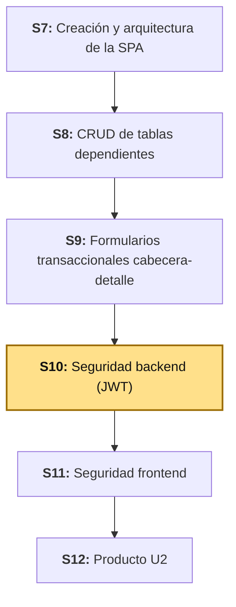
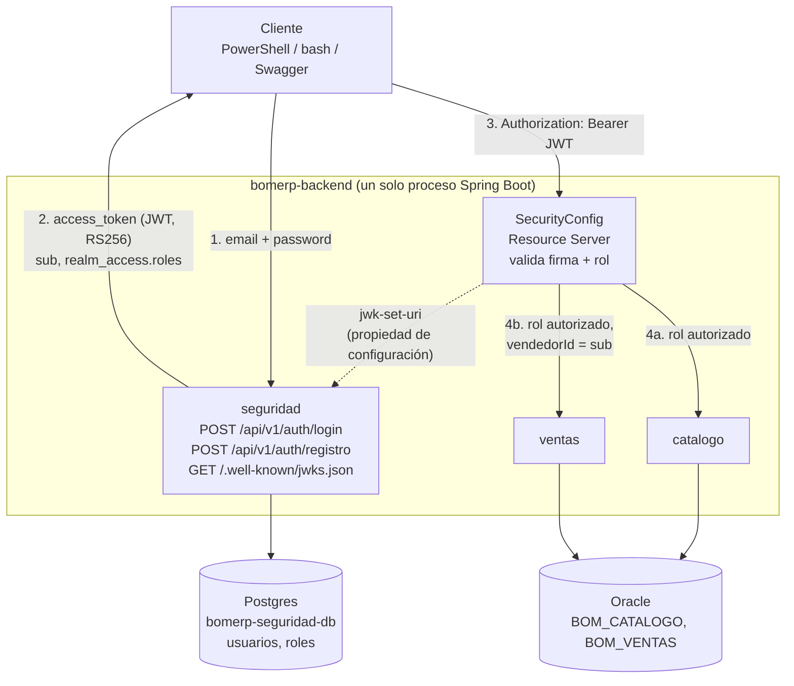

# S10 - Seguridad Backend: Autenticación JWT y Autorización por Roles

*Por: Angel Sullon Macalupu @asullom - 2026*

## 1. Introducción

Tiempo: 20 min.

### 1.1 Presentación de la sesión

Desde S1, el backend de BomERP responde a cualquiera que le pregunte: sin usuario, sin contraseña, sin ninguna noción de quién hace cada petición (ADR-004). Eso fue una decisión deliberada para no construir seguridad antes de tener módulos reales que proteger (ADR-004) — pero también significa que, hoy, cualquiera con Swagger puede crear una venta, consultarla por `id`, o pedir el reporte completo, sin que el sistema le pregunte nada. Esta sesión cierra esa puerta: aparece el módulo `seguridad` — usuarios con contraseña hasheada, un login que emite un JWT (*JSON Web Token*) firmado, roles (`VENDEDOR`, `SUPERVISOR`, `ADMIN`) y endpoints de `catalogo` y `ventas` protegidos por rol. El `vendedorId` que ADS (Aplicaciones Distribuidas) ya diseñó como regla de negocio (RN5/RN8, S8) por fin tiene de dónde salir: del propio JWT, nunca de un campo que el cliente declare sobre sí mismo. El porqué de construir esta pieza a mano, en vez de delegarla a un proveedor externo como Keycloak, se desarrolla en 1.6 y en 2.6, a partir de una decisión de arquitectura documentada (ADR-005).

### 1.2 Índice

1. Usuarios, contraseñas con hash y datos semilla.
2. Autenticación stateless con JWT (clave asimétrica).
3. Autorización basada en roles (RBAC).
4. `vendedorId` tomado del JWT, no del request.
5. Hacia un proveedor de identidad externo: qué queda listo para el reemplazo.
6. Observabilidad y diagnóstico de 401/403.

### 1.3 Propósito de aprendizaje

Al concluir la clase, estarás en condiciones de:

- **Implementar** autenticación stateless con JWT firmado con clave asimétrica y **autorizar**, con Spring Security, los endpoints de `catalogo` y `ventas` por rol, **migrando** `vendedorId` de una idea pendiente (ADS S8, RN5/RN8) a un claim confiable tomado del token ya validado, con evidencia real de accesos permitidos y denegados.

### 1.4 Producto de sesión

Módulo `seguridad` (paquete nuevo, con su propio Postgres — no Oracle, 2.1): entidades `Usuario` y `Rol` (muchos a muchos), contraseñas con BCrypt, `AuthController` con `POST /api/v1/auth/login` y `POST /api/v1/auth/registro`, emisión de JWT firmado con clave RSA (RS256) con los claims `sub` (identificador del usuario) y `realm_access.roles`, y su clave pública publicada en `/.well-known/jwks.json`; `SecurityConfig` protegiendo `catalogo` (consulta para cualquier autenticado, escritura solo `ADMIN`) y `ventas` (`crear`: `VENDEDOR`/`SUPERVISOR`; `buscar`/`obtener`: todas las ventas para `SUPERVISOR`/`ADMIN`, solo las propias para `VENDEDOR`, RN8; `reporte` y `anular`: `SUPERVISOR`/`ADMIN`); `Venta` con la columna `VENDEDOR_ID` (en Oracle), poblada por el servidor desde el JWT en `crear` (RN5); y una matriz de accesos verificada con los tres roles reales.

### 1.5 Metodología

**Tabla 1. Metodología de la sesión**

| Actividades a Realizar en el Periodo | Orientaciones generales (Orientaciones Metodológicas) | Material de estudio recomendado |
|---|---|---|
| Revisión previa individual | Repasar ADS S8 (Tabla 10, RN5, RN8) y ADS S9 (Figura 6, Tabla 8): qué rol ejecuta cada operación de `ventas` y qué transición de estado quedó sin permiso definido. Confirmar que el backend y la SPA de S9 siguen corriendo sin autenticación. Trabajo individual, antes de clase. | ADS S8 (Tabla 10), ADS S9 (Tabla 8), S9 LP2 (3.12). |
| Clase presencial | Construcción guiada del módulo `seguridad` de punta a punta (Postgres propio, usuarios, roles, JWT, login), protección de `catalogo` y `ventas` por rol, y migración de `vendedorId` del request al claim del JWT. Trabajo individual en la propia laptop, siguiendo al docente paso a paso; consulta inmediata ante un `401`/`403` inesperado. | Pasos 3.1 a 3.16 de esta guía. |
| Evaluación formativa | Revisión en clase de la matriz de accesos (3.15): login con cada rol, un acceso permitido y uno denegado por rol para `ventas`, y una venta creada con el `vendedorId` tomado del JWT. La evidencia se completa y sustenta de forma individual, fuera del aula, según los criterios mínimos de la sección 4.4. | Indicaciones de entrega (4.3), rúbrica de evaluación (4.6). |

### 1.6 Motivación de la sesión

#### 1.6.1 Caso: 885 millones de documentos, sin ninguna contraseña de por medio

En mayo de 2019, el periodista de seguridad Brian Krebs reveló que First American Financial Corporation, una de las mayores aseguradoras de títulos de propiedad de Estados Unidos, exponía en su sitio web hasta 885 millones de documentos de transacciones inmobiliarias, algunos con casi veinte años de antigüedad: números de cuenta bancaria, extractos, registros hipotecarios y tributarios, números de Seguro Social e imágenes de licencias de conducir. La causa fue una vulnerabilidad conocida como **IDOR** (*Insecure Direct Object Reference*, referencia directa insegura a un objeto): cada documento se servía desde una URL con un número consecutivo al final, y ese número era el **único** control de acceso. Nadie necesitaba una contraseña, ni una sesión, ni absolutamente nada: bastaba con cambiar un dígito de la URL para ver el documento de otra persona. Ben Shoval, un desarrollador inmobiliario, descubrió el problema por accidente y lo reportó a Krebs; First American desconectó esa parte de su sitio unas horas después. El estado de Nueva York llegó después a un acuerdo de 1 millón de dólares con la empresa por este incidente.

Fuente: Krebs, B. (2019, 24 de mayo). *First American Financial Corp. Leaked Hundreds of Millions of Title Insurance Records*. KrebsOnSecurity. https://krebsonsecurity.com/2019/05/first-american-financial-corp-leaked-hundreds-of-millions-of-title-insurance-records/

El problema de fondo no fue un error de cálculo ni un bug de lógica de negocio: fue que el sistema confiaba en un número de la URL como si fuera, por sí solo, una prueba de que quien lo pedía tenía derecho a verlo. Es exactamente la situación de `GET /api/v1/ventas/{id}` en BomERP hasta hoy: cualquiera que conozca (o adivine) un `id` puede consultar esa venta completa, sin que el sistema pregunte nada sobre quién la pide. RN8 de ADS S8 ya identificó esta necesidad — un `VENDEDOR` solo debería ver sus propias ventas — pero hasta esta sesión no existía ningún mecanismo para saber quién es "el usuario" en primer lugar.

**Preguntas de análisis**

**Activación de conocimientos previos**

1. ¿Qué tienen en común la URL de un documento de First American y el `id` de una venta en `GET /api/v1/ventas/{id}` de BomERP hasta S9?
2. Si BomERP exigiera hoy un JWT válido para consultar una venta, ¿bastaría con eso para que RN8 (un `VENDEDOR` solo ve las suyas) quede cumplida? ¿Por qué sí o por qué no?

**Comprensión de autorización en BomERP**

1. ¿Qué código HTTP debería responder BomERP si un `VENDEDOR` pide, por `id`, una venta que no es suya: el mismo `404` que si la venta no existiera, o uno distinto? Relaciona tu respuesta con qué información le regala al atacante cada opción.
2. `reporte()` y `anular()` ya están diseñados por ADS como operaciones de `SUPERVISOR`/`ADMIN` (S9, Tabla 8). ¿Por qué esta sesión puede, por fin, implementar esa restricción, cuando S9 de LP2 todavía no pudo?

### 1.7 Ubicación en el curso

- Unidad: U2 - SPA modular segura para BomERP.
- Producto del curso: base Full-Stack modular de BomERP.
- Producto de unidad: SPA modular y segura, conectada al backend, con navegación por funcionalidades, CRUD de tablas independientes y dependientes, formularios transaccionales, consultas, reportes y control de acceso.
- Avance del producto en esta sesión: backend autenticado y autorizado por roles — módulo `seguridad` nuevo (con su propio Postgres), `catalogo` y `ventas` protegidos, `vendedorId` tomado del JWT.

**Figura 1. Roadmap del producto de la unidad**



## 2. Explica

Tiempo: 30 min.

### 2.1 Arquitectura de la sesión

**Figura 2. `seguridad` vive en su propio Postgres; `SecurityConfig` lo consume por configuración, no por código**



Dos decisiones, no una, separan esta arquitectura del resto de BomERP. **Dónde vive el dato**: `seguridad` no persiste en el Oracle de `catalogo`/`ventas` — vive en su propio Postgres (`bomerp-seguridad-db`, contenedor nuevo), porque ningún proveedor de identidad real (Keycloak incluido) comparte motor de base de datos con la aplicación que protege (ADR-005). El proceso Spring Boot sigue siendo **uno solo** (ADR-001, ADR-002 no cambian): lo que gana son dos pares explícitos de `DataSource`/`EntityManagerFactory` en vez del único autoconfigurado (3.4). **Cómo se validan los tokens**: `SecurityConfig` no recibe la clave de firma por una referencia directa de código a `JwtKeyConfig` — la descubre por la propiedad `jwk-set-uri`, apuntando hoy a la propia aplicación (`http://localhost:8080/.well-known/jwks.json`, 3.7/3.10). Es el mismo mecanismo con el que DIST conecta dos *procesos* distintos (S07, 3.17); aquí conecta dos *configuraciones* dentro del mismo proceso, pero por la misma razón: que reemplazar el emisor después sea cambiar una URL, no recompilar nada. Cada apartado siguiente desarrolla una pieza de la sesión, en el mismo orden del Índice (1.2).

### 2.2 Usuarios, contraseñas con hash y datos semilla

Guardar una contraseña tal cual la escribió el usuario es el error de seguridad más antiguo y más costoso que existe: cualquiera con acceso a la base de datos (un atacante, un empleado malicioso, una copia de respaldo filtrada) lee cada contraseña en texto plano, y como las personas reutilizan contraseñas entre sistemas, esa filtración compromete cuentas de la persona en *otros* sistemas también.

Un **hash** resuelve esto de forma asimétrica a propósito: es fácil calcular `hash(contraseña)`, pero (si el algoritmo es bueno) prácticamente imposible reconstruir la contraseña a partir del hash. Verificar un login no compara contraseñas: vuelve a calcular el hash de lo que el usuario escribió y compara ese resultado con el que ya está guardado.

Esta sesión usa **BCrypt**, el algoritmo que trae Spring Security listo para usar (`BCryptPasswordEncoder`). BCrypt agrega automáticamente una **sal** (*salt*, datos aleatorios únicos por contraseña) antes de calcular el hash, así que dos usuarios con la misma contraseña obtienen hashes completamente distintos — eso evita que un atacante con una tabla precalculada de hashes comunes (*rainbow table*) reconozca contraseñas repetidas con solo mirar la base de datos. BCrypt también es deliberadamente **lento** (ajustable con un factor de costo): un algoritmo rápido como SHA-256 es excelente para verificar integridad de archivos, pero pésimo para contraseñas, porque permite a un atacante probar miles de millones de combinaciones por segundo si llega a robar la tabla de hashes.

**Tabla 2. Qué guarda `usuarios.password` antes y después de esta sesión**

| | Sin hash (nunca se hizo así en BomERP) | Con BCrypt (esta sesión) |
|---|---|---|
| Valor guardado | `"admin123"` | `"$2a$10$N9qo8uLOickgx2ZMRZoHKe..."` |
| Si se filtra la base de datos | El atacante lee la contraseña real de cada usuario | El atacante tiene que romper cada hash por fuerza bruta, uno por uno, y BCrypt está diseñado para que eso sea costoso |
| Dos usuarios con la misma contraseña | Mismo valor guardado — visible a simple vista | Hashes distintos (sal distinta por fila) |

**Error frecuente**: confundir *hash* con *cifrado* (*encryption*). Un valor cifrado se puede **descifrar** con la clave correcta — tiene sentido cuando alguien necesita recuperar el original (por ejemplo, un número de tarjeta). Un hash de contraseña **no se descifra nunca**: ni la propia aplicación puede recuperar la contraseña original a partir de su hash. Por eso "recuperar contraseña" en cualquier sistema real nunca muestra la contraseña anterior — genera una nueva.

Los datos semilla de esta sesión (3.9) no se insertan con una contraseña en texto plano en un script SQL: se crean a través del propio endpoint de registro (`POST /api/v1/auth/registro`), para que el hash lo calcule el mismo código que lo calculará para cualquier usuario real más adelante.

### 2.3 Autenticación stateless con JWT (clave asimétrica)

Un sistema con sesiones tradicional guarda, en el servidor, quién está autenticado — una cookie de sesión es solo una referencia a ese estado guardado en memoria o en una tabla. Un **JWT** (*JSON Web Token*) resuelve esto sin guardar nada en el servidor: es un token que lleva **dentro de sí mismo** toda la información necesaria (sus *claims*: quién es el usuario, sus roles, cuándo expira), firmado con una **clave privada** que solo conoce quien lo emitió. Por eso es **stateless**: el propio token es la prueba, no una referencia a un estado guardado en otro lado — cualquier petición se valida sola, sin consultar ninguna tabla de sesiones.

Hay dos formas de firmar un JWT, y la diferencia importa incluso dentro de un solo proceso:

- **Simétrica (HS256):** una única clave secreta firma *y* verifica. Quien conoce el secreto también puede *fabricar* un token válido de cualquier rol — si ese secreto apareciera alguna vez en un log o en un commit, cualquiera con él podría emitir un JWT de `ADMIN`.
- **Asimétrica (RS256, usada hoy):** un par de claves. La **privada** firma (vive solo dentro de `JwtKeyConfig`); la **pública** verifica, y puede exponerse sin riesgo — de hecho, es exactamente lo que Keycloak expone en su documento de descubrimiento (2.6), y lo que `seguridad` expone en `/.well-known/jwks.json` (2.1). Nadie que solo tenga la clave pública puede fabricar un token nuevo, solo verificar uno existente.

El par de claves se genera **una sola vez, al arrancar** la aplicación (3.7) y vive en memoria durante toda la ejecución. Eso significa que cada vez que reinicias el backend, los JWT emitidos antes del reinicio dejan de verificar (la firma ya no coincide con ninguna clave que la aplicación recuerde) — tendrás que volver a hacer login después de cada reinicio durante esta sesión.

**Error frecuente**: asumir que un JWT se puede "cerrar sesión" de la misma forma que una sesión tradicional. Como el token no depende de ningún estado en el servidor, invalidarlo antes de su expiración natural exige un mecanismo aparte (una lista negra de tokens revocados) — fuera del alcance de esta sesión. Por eso `jwt.expiracion-segundos` (3.7) es un valor corto en un sistema real; aquí se deja en una hora para no complicar las pruebas manuales de la clase.

### 2.4 Autorización basada en roles (RBAC)

Autenticación responde *quién eres*; autorización responde *qué puedes hacer* — un JWT válido solo resuelve la primera. Esta sesión usa **RBAC** (*Role-Based Access Control*): los permisos no se asignan usuario por usuario, sino a **roles**, y cada usuario tiene uno o más. ADS ya diseñó los tres roles de `ventas` (S8, Tabla 10) y su permiso exacto por operación:

**Tabla 3. Permisos de `ventas` por rol (ADS S8, Tabla 10)**

| Operación | `VENDEDOR` | `SUPERVISOR` | `ADMIN` |
|---|---|---|---|
| `crear` | Sí | Sí | No |
| `buscar` / `obtener` | Solo las propias (RN8) | Todas | Todas |
| `reporte` | No | Sí | Sí |
| `anular` | No | Sí | Sí |

`catalogo` no tiene un diseño de roles propio en ADS (su sílabo no lo pidió hasta ahora), así que esta sesión aplica el criterio más simple que no contradice nada ya construido: consultar (`GET`) exige solo estar autenticado, con cualquier rol; modificar (`POST`/`PUT`/`DELETE`) exige `ADMIN`.

Los roles de un usuario viajan dentro del JWT como el claim `realm_access.roles` (`["VENDEDOR"]`, `["ADMIN"]`) — el mismo nombre de claim que usa Keycloak (2.6) — y Spring Security los compara contra cada regla `hasRole(...)` o `hasAnyRole(...)` declarada en `SecurityConfig` (3.12, 3.14).

Cuando la autorización falla, el código HTTP dice **cuál** de las dos preguntas falló: `401 Unauthorized` significa que no se pudo confirmar *quién eres* (sin token, token mal formado, firma inválida o expirado); `403 Forbidden` significa que sí se confirmó, pero ese rol (o ese dueño, en el caso de RN8) no alcanza para esa operación.

### 2.5 `vendedorId` tomado del JWT, no del request

Hasta S9, `VentaRequest` nunca tuvo un campo `vendedorId` — no porque no hiciera falta, sino porque todavía no existía ningún usuario autenticado del que tomarlo (ADR-004). El error que evitamos no es "quitarle un campo peligroso al DTO (*Data Transfer Object*, objeto de transferencia de datos) de entrada", como sí tuvo que hacer DIST con `idCliente` (S7, 3.20): es no agregarlo nunca ahí, directamente. Cualquier dato que el propio cliente declare sobre sí mismo en el cuerpo de un request (igual que el `idCliente` del caso de DIST, igual que el número de documento de First American) no es un dato confiable — hay que tomarlo de algo que el cliente no controla.

`VentaController.crear` (3.13) toma el identificador del usuario autenticado del claim **`sub`** del JWT ya validado, vía `@AuthenticationPrincipal Jwt jwt`, y se lo pasa al servicio aparte del `request` — exactamente el mismo mecanismo que usa DIST para `idCliente` (S7, 3.22), aplicado aquí desde el principio, sin DTO que migrar. `buscar`/`obtener` (3.14) usan el mismo claim para aplicar RN8: si el rol autenticado es `VENDEDOR`, el servicio filtra por su propio `vendedorId`; si es `SUPERVISOR` o `ADMIN`, ve todas.

### 2.6 Hacia un proveedor de identidad externo: qué queda listo para el reemplazo

La recomendación profesional actual es delegar identidad a un proveedor dedicado (Keycloak, Auth0, Amazon Cognito) en vez de construirla a mano: custodia de credenciales fuera del código propio, *Single Sign-On* (SSO) entre varias aplicaciones y login social. Es, de hecho, el camino que ya sigue `proyecto-sello` (Sistema Universitario Integrado) con Keycloak como IAM (*Identity and Access Management*) externo. Esta sesión no integra Keycloak — el sílabo de S10 pide construir esta pieza, no delegarla ([ADR-005](../adr/ADR-005-seguridad-jwt-propio-listo-para-reemplazo.md)) —, pero la construye de forma que ese reemplazo, si el proyecto lo adopta más adelante, sea barato:

**Tabla 4. Qué reemplazaría un IdP (*Identity Provider*) externo del módulo `seguridad`, y qué código cambiaría**

| Pieza | Hoy: módulo `seguridad` | Con un IdP externo (Keycloak u otro) | ¿Cambia el código de `catalogo`/`ventas`? |
|---|---|---|---|
| Emisor del token | `AuthController` + `JwtService` | El IdP externo | No |
| Usuarios, contraseñas y roles | Tablas `usuarios`, `roles`, `usuario_rol` en Postgres propio (`bomerp-seguridad-db`) | Usuarios y roles del IdP, en su propio almacén (también separado de Oracle) | No |
| Claim de roles | `realm_access.roles` | `realm_access.roles` (mismo formato en Keycloak) | No |
| Identificador del usuario (`sub`) | `id` numérico de `usuarios` | Identificador propio del IdP (un UUID, en Keycloak) | **Sí** — `VentaController` lee `vendedorId` de `jwt.getSubject()` (3.13-3.14); con un IdP real, `sub` deja de ser ese `id`, y `vendedorId` tiene que viajar en un claim propio aparte (detalle completo en la guía de referencia de Keycloak) |
| Dónde se valida la firma | `SecurityConfig`, por la propiedad `jwk-set-uri` → `http://localhost:8080/.well-known/jwks.json` (2.1) | `SecurityConfig`, por la misma propiedad → `issuer-uri` del IdP | **No el código** — solo el valor de una propiedad |
| SSO, login social, refresh token | No existen | Incluidos | — |

Esta sesión no implementa ningún paso de la columna central: queda como dirección documentada (ADR-005), no como entregable de U3 — el sílabo de S13-S16 no la menciona. Lo que esta sesión garantiza es que, si esa decisión se toma más adelante, el cambio queda casi todo acotado a una propiedad de configuración y a dónde los clientes piden su token — con una única excepción real, ya anotada en la Tabla 4: cómo `VentaController` lee `vendedorId` del token, porque ese dato depende de qué pone el emisor en `sub`, y eso sí cambia de un emisor a otro.

### 2.7 Observabilidad y diagnóstico de 401/403

Cuando una petición falla con `401` o `403`, el problema puede estar en tres lugares distintos, y diagnosticarlo bien depende de saber cuál:

1. **El JWT no se envió o está mal formado** — revisa el header `Authorization` que realmente salió del cliente (`Bearer ` + token, sin comillas ni espacios de más).
2. **El JWT no se pudo verificar o expiró** — revisa que no hayas **reiniciado** el backend desde que pediste el token (2.3: el par de claves se regenera al arrancar, y los tokens anteriores dejan de verificar), y que `GET /.well-known/jwks.json` responda (2.1) — sin él, `SecurityConfig` no tiene con qué verificar ninguna firma.
3. **El JWT es válido pero el rol (o el dueño, RN8) no alcanza para esa operación** — revisa la regla de `SecurityConfig` (3.12, 3.14) contra el rol real del claim `realm_access.roles`, o la comparación de `vendedorId` en el servicio.

Para distinguir estos tres casos sin adivinar, sube el nivel de log de seguridad mientras diagnosticas (`logging.level.org.springframework.security: DEBUG`): el log dice el motivo exacto del rechazo.

## 3. Aplica: actividad práctica guiada

Tiempo: 4h.

**Actividad:** construcción guiada del módulo `seguridad` (Postgres propio, usuarios, roles, JWT), protección de `catalogo` y `ventas` por rol, y migración de `vendedorId` del request al claim del JWT (Producto de la sesión en 1.4).

**Propósito de la actividad:** que cada estudiante implemente autenticación stateless con JWT firmado con clave asimétrica y autorización basada en roles, aplicando exactamente los permisos que ADS ya diseñó para `ventas` (S8, Tabla 10), y verificando con evidencia real accesos permitidos y denegados — no solo el caso feliz.

**Orientaciones metodológicas:** el docente construye el módulo `seguridad` de punta a punta frente a la clase (Parte A), protege `catalogo` y `ventas` (Parte B), y cierra con diagnóstico de 401/403 (Parte C); los estudiantes replican cada paso en su propia laptop, y provocan ellos mismos los casos denegados (3.15) para ver el `401`/`403` real en su propia consola.

**Actividades para realizar:**

*Parte A — Construir el módulo `seguridad`:*

- **3.1** Verificar el punto de partida.
- **3.2** Levantar Postgres para `seguridad` y crear sus tablas.
- **3.3** Agregar Spring Security, el driver de Postgres y la librería de firma JWT.
- **3.4** Configurar el datasource de Postgres y el `EntityManager` de `seguridad`.
- **3.5** Crear las entidades `Usuario` y `Rol`.
- **3.6** Crear el repositorio y el `UserDetailsService`.
- **3.7** Generar el par de claves RSA, crear el servicio de JWT y publicar la clave pública.
- **3.8** Hashear contraseñas y crear el servicio de autenticación.
- **3.9** Crear `AuthController` y los usuarios semilla.
- **3.10** Configurar Spring Security como Resource Server.
- **3.11** Levantar y probar el módulo `seguridad` de punta a punta.

*Parte B — Proteger `catalogo` y `ventas` por rol:*

- **3.12** Proteger las rutas de `catalogo` por rol.
- **3.13** Agregar `vendedorId` a `Venta` y tomarlo del JWT en `crear`.
- **3.14** Filtrar y restringir `ventas` por rol (RN8, `reporte`, `anular`).
- **3.15** Probar accesos permitidos y denegados.

*Parte C — Diagnóstico:*

- **3.16** Diagnosticar 401 vs. 403 con logs.

**Punto de partida común:** todo el equipo debe comenzar exactamente desde donde quedó S9. Confirma que el backend (`lp2/bomerp-backend`) y la SPA (`lp2/bomerp-frontend`) de S9 siguen corriendo sin autenticación — si alguno falla en arrancar, el problema es de una sesión anterior, no de esta.

### Parte A — Construir el módulo `seguridad`

#### 3.1 Verificar el punto de partida

**Producto del paso:** confirmación de que `bomerp-backend` sigue corriendo contra Oracle, y de que hoy ningún endpoint pide autenticación.

```powershell
cd lp2\bomerp-backend
.\mvnw.cmd spring-boot:run
```

```bash
cd lp2/bomerp-backend
./mvnw spring-boot:run
```

Con el backend arriba, confirma que `GET /api/v1/ventas` responde `200 OK` sin ningún header `Authorization` — es el comportamiento esperado hoy (ADR-004), y el que esta sesión cambia.

#### 3.2 Levantar Postgres para `seguridad` y crear sus tablas

**Producto del paso:** el contenedor `bomerp-seguridad-db` (Postgres) corriendo, con las tablas `usuarios`, `roles` y `usuario_rol`; `BOM_VENTAS.VENTAS` (Oracle) gana la columna `VENDEDOR_ID`.

`seguridad` es el primer módulo de BomERP que **no** persiste en Oracle (2.1, ADR-005). Agrega el servicio nuevo a `lp2/bomerp-backend/compose-dev.yml`, junto al de `oracle` que ya existe:

```yaml
  seguridad-db:
    image: postgres:17-alpine
    container_name: bomerp-seguridad-db
    restart: unless-stopped
    ports:
      - "5432:5432"
    environment:
      POSTGRES_DB: bomerp_seguridad
      POSTGRES_USER: bomerp_seguridad
      POSTGRES_PASSWORD: 123456
    volumes:
      - seguridad-db-data:/var/lib/postgresql/data
    healthcheck:
      test: ["CMD-SHELL", "pg_isready -U bomerp_seguridad -d bomerp_seguridad"]
      interval: 10s
      timeout: 5s
      retries: 10
      start_period: 15s
```

Y agrega `seguridad-db-data:` junto a `oracle-data:`, bajo `volumes:`. Levanta el contenedor nuevo sin tocar el de Oracle que ya está corriendo:

```powershell
cd lp2\bomerp-backend
docker compose -f compose-dev.yml up -d seguridad-db
```

```bash
cd lp2/bomerp-backend
docker compose -f compose-dev.yml up -d seguridad-db
```

Con el contenedor arriba, crea las tablas:

```bash
docker exec -i bomerp-seguridad-db psql -U bomerp_seguridad -d bomerp_seguridad <<'EOF'
CREATE TABLE usuarios (
    id       BIGINT GENERATED ALWAYS AS IDENTITY PRIMARY KEY,
    email    VARCHAR(150) NOT NULL UNIQUE,
    password VARCHAR(100) NOT NULL,
    activo   BOOLEAN NOT NULL DEFAULT TRUE
);

CREATE TABLE roles (
    id     BIGINT GENERATED ALWAYS AS IDENTITY PRIMARY KEY,
    nombre VARCHAR(30) NOT NULL UNIQUE
);

CREATE TABLE usuario_rol (
    usuario_id BIGINT NOT NULL REFERENCES usuarios(id),
    rol_id     BIGINT NOT NULL REFERENCES roles(id),
    PRIMARY KEY (usuario_id, rol_id)
);

INSERT INTO roles (nombre) VALUES ('VENDEDOR');
INSERT INTO roles (nombre) VALUES ('SUPERVISOR');
INSERT INTO roles (nombre) VALUES ('ADMIN');
EOF
```

`docker exec` necesita el flag `-i` (sin `-t`) para que el heredoc llegue al `psql` de adentro: sin él, `docker exec` no conecta el `stdin` del host con el del contenedor, y `psql` no recibe ningún comando. Nota también los nombres en **minúsculas** (`usuarios`, no `USUARIOS`): a diferencia de Oracle (mayúsculas, en el resto de BomERP), Postgres pliega a minúsculas cualquier identificador sin comillas — es la primera vez que el proyecto convive con dos motores de base de datos con convenciones distintas. Los tres roles (`VENDEDOR`, `SUPERVISOR`, `ADMIN`) son exactamente los que ADS ya diseñó para `ventas` (S8, Tabla 10) — esta sesión no inventa roles nuevos, los hace reales.

Ahora, en Oracle, agrega la columna que `ventas` necesita para RN5:

```bash
docker exec -i bomerp-oracle bash -c "sqlplus -s BOM_VENTAS/bom_ventas_pwd@localhost:1521/FREEPDB1" <<'EOF'
ALTER TABLE VENTAS ADD VENDEDOR_ID NUMBER;
EOF
```

`VENDEDOR_ID` se agrega **sin** `NOT NULL`: las ventas creadas en S4-S9 (antes de que existiera ningún usuario autenticado) quedan con esta columna en `NULL`, y eso está bien — no se reescribe el pasado. Toda venta creada **desde hoy en adelante** sí la trae, porque el propio servicio la completa (3.13). Ajusta la contraseña de `BOM_VENTAS` a la que tu equipo usó en S4, si fue distinta a este ejemplo.

**Error frecuente**: arrancar el backend (3.11) antes de que `bomerp-seguridad-db` termine de iniciar. El `healthcheck` del servicio tarda unos segundos; si el backend intenta conectarse antes, falla con un error de conexión rechazada. Confirma con `docker ps` que `bomerp-seguridad-db` diga `healthy`, no solo `Up`, antes de levantar el backend.

#### 3.3 Agregar Spring Security, el driver de Postgres y la librería de firma JWT

**Producto del paso:** `pom.xml` con las cuatro dependencias necesarias: validar JWT, firmar JWT, Spring Security base, y hablar con Postgres.

Como `bomerp-backend` ya existe (no se regenera desde Spring Initializr), estas dependencias se agregan a mano en `lp2/bomerp-backend/pom.xml`, dentro de `<dependencies>`:

```xml
<dependency>
    <groupId>org.springframework.boot</groupId>
    <artifactId>spring-boot-starter-security</artifactId>
</dependency>
<dependency>
    <groupId>org.springframework.boot</groupId>
    <artifactId>spring-boot-starter-security-oauth2-resource-server</artifactId>
</dependency>
<dependency>
    <groupId>org.springframework.security</groupId>
    <artifactId>spring-security-oauth2-jose</artifactId>
</dependency>
<dependency>
    <groupId>org.postgresql</groupId>
    <artifactId>postgresql</artifactId>
    <scope>runtime</scope>
</dependency>
```

Sin `<version>` en ninguna: las gestiona `spring-boot-starter-parent` (4.0.7, ADR-003). La primera trae Spring Security base (autenticación, `PasswordEncoder`); la segunda, el soporte de *Resource Server* para **validar** JWT (`JwtDecoder` autoconfigurado a partir de una propiedad, 3.10); la tercera (`spring-security-oauth2-jose`, la misma que usa DIST en `pagatu-auth-ms`) trae `NimbusJwtEncoder` para **firmar**; la cuarta es el driver JDBC de Postgres — `bomerp-backend` ya traía el de Oracle (`ojdbc11`) desde S1; ahora convive con el segundo.

#### 3.4 Configurar el datasource de Postgres y el `EntityManager` de `seguridad`

**Producto del paso:** dos pares independientes de `DataSource`/`EntityManagerFactory`/`PlatformTransactionManager` dentro del mismo proceso — uno para Oracle (`catalogo`, `ventas`), otro para Postgres (`seguridad`) — reemplazando la configuración única que Spring Boot autoconfiguraba hasta S9.

Hasta ahora, `bomerp-backend` tenía un solo `DataSource` (Oracle), que Spring Boot armaba solo a partir de `spring.datasource.*` (`application-dev.yml`). En cuanto el proceso necesita **dos** motores, hay que declarar ambos explícitamente — Spring Boot deja de autoconfigurar cualquiera de los dos apenas detecta beans propios de ese tipo.

Agrega la propiedad del datasource de Postgres en `lp2/bomerp-backend/src/main/resources/application-dev.yml`, junto al bloque `spring.datasource` que ya existe:

```yaml
bomerp:
  datasource:
    seguridad:
      url: jdbc:postgresql://localhost:5432/bomerp_seguridad
      username: bomerp_seguridad
      password: 123456
      driver-class-name: org.postgresql.Driver
```

**`lp2/bomerp-backend/src/main/java/pe/edu/upeu/bomerp/OracleDataSourceConfig.java`** (paquete raíz: gobierna **todos** los módulos que persisten en Oracle, no uno solo):

```java
package pe.edu.upeu.bomerp;

import org.springframework.boot.context.properties.ConfigurationProperties;
import org.springframework.boot.jdbc.DataSourceBuilder;
import org.springframework.context.annotation.Bean;
import org.springframework.context.annotation.Configuration;
import org.springframework.context.annotation.Primary;
import org.springframework.data.jpa.repository.config.EnableJpaRepositories;
import org.springframework.orm.jpa.JpaTransactionManager;
import org.springframework.orm.jpa.LocalContainerEntityManagerFactoryBean;
import org.springframework.orm.jpa.vendor.HibernateJpaVendorAdapter;
import org.springframework.transaction.PlatformTransactionManager;

import javax.sql.DataSource;
import java.util.Map;

@Configuration
@EnableJpaRepositories(
        basePackages = {"pe.edu.upeu.bomerp.catalogo", "pe.edu.upeu.bomerp.ventas"},
        entityManagerFactoryRef = "oracleEntityManagerFactory",
        transactionManagerRef = "oracleTransactionManager")
public class OracleDataSourceConfig {

    @Primary
    @Bean
    @ConfigurationProperties("spring.datasource")
    public DataSource oracleDataSource() {
        return DataSourceBuilder.create().build();
    }

    @Primary
    @Bean
    public LocalContainerEntityManagerFactoryBean oracleEntityManagerFactory(DataSource oracleDataSource) {
        LocalContainerEntityManagerFactoryBean factory = new LocalContainerEntityManagerFactoryBean();
        factory.setDataSource(oracleDataSource);
        factory.setPackagesToScan("pe.edu.upeu.bomerp.catalogo", "pe.edu.upeu.bomerp.ventas");
        factory.setJpaVendorAdapter(new HibernateJpaVendorAdapter());
        factory.setJpaPropertyMap(Map.of(
                "hibernate.hbm2ddl.auto", "validate",
                "hibernate.format_sql", "true"));
        return factory;
    }

    @Primary
    @Bean
    public PlatformTransactionManager oracleTransactionManager(
            LocalContainerEntityManagerFactoryBean oracleEntityManagerFactory) {
        return new JpaTransactionManager(oracleEntityManagerFactory.getObject());
    }
}
```

**`lp2/bomerp-backend/src/main/java/pe/edu/upeu/bomerp/seguridad/SeguridadDataSourceConfig.java`** (dentro del propio módulo: es infraestructura que solo `seguridad` usa):

```java
package pe.edu.upeu.bomerp.seguridad;

import org.springframework.boot.context.properties.ConfigurationProperties;
import org.springframework.boot.jdbc.DataSourceBuilder;
import org.springframework.context.annotation.Bean;
import org.springframework.context.annotation.Configuration;
import org.springframework.data.jpa.repository.config.EnableJpaRepositories;
import org.springframework.orm.jpa.JpaTransactionManager;
import org.springframework.orm.jpa.LocalContainerEntityManagerFactoryBean;
import org.springframework.orm.jpa.vendor.HibernateJpaVendorAdapter;
import org.springframework.transaction.PlatformTransactionManager;

import javax.sql.DataSource;
import java.util.Map;

@Configuration
@EnableJpaRepositories(
        basePackages = "pe.edu.upeu.bomerp.seguridad",
        entityManagerFactoryRef = "seguridadEntityManagerFactory",
        transactionManagerRef = "seguridadTransactionManager")
public class SeguridadDataSourceConfig {

    @Bean
    @ConfigurationProperties("bomerp.datasource.seguridad")
    public DataSource seguridadDataSource() {
        return DataSourceBuilder.create().build();
    }

    @Bean
    public LocalContainerEntityManagerFactoryBean seguridadEntityManagerFactory(DataSource seguridadDataSource) {
        LocalContainerEntityManagerFactoryBean factory = new LocalContainerEntityManagerFactoryBean();
        factory.setDataSource(seguridadDataSource);
        factory.setPackagesToScan("pe.edu.upeu.bomerp.seguridad");
        factory.setJpaVendorAdapter(new HibernateJpaVendorAdapter());
        factory.setJpaPropertyMap(Map.of("hibernate.hbm2ddl.auto", "validate"));
        return factory;
    }

    @Bean
    public PlatformTransactionManager seguridadTransactionManager(
            LocalContainerEntityManagerFactoryBean seguridadEntityManagerFactory) {
        return new JpaTransactionManager(seguridadEntityManagerFactory.getObject());
    }
}
```

Cada `@EnableJpaRepositories` acota, con `basePackages`, qué repositorios usa cada `EntityManagerFactory` — sin eso, Spring Data JPA no sabría si `UsuarioRepository` habla con Oracle o con Postgres. `@Primary` en los tres *beans* de Oracle importa: cualquier otro *bean* del proyecto que pida un `DataSource`/`EntityManagerFactory`/`PlatformTransactionManager` genérico (por ejemplo, un futuro `@Transactional` sin especificar cuál) recibe el de Oracle por defecto, ya que es el motor de la mayoría de los módulos.

**Error frecuente**: olvidar `@Primary` en el lado de Oracle. Sin él, Spring Boot no sabe cuál de los dos `DataSource` usar quién no especifica uno, y el arranque falla con `NoUniqueBeanDefinitionException`. Esta infraestructura se configura una sola vez, en esta sesión, y no se vuelve a tocar.

#### 3.5 Crear las entidades `Usuario` y `Rol`

**Producto del paso:** `Usuario` y `Rol`, relacionados de muchos a muchos, mapeados contra las tablas de Postgres (3.2).

**`lp2/bomerp-backend/src/main/java/pe/edu/upeu/bomerp/seguridad/usuario/entity/Rol.java`:**

```java
package pe.edu.upeu.bomerp.seguridad.usuario.entity;

import jakarta.persistence.Column;
import jakarta.persistence.Entity;
import jakarta.persistence.GeneratedValue;
import jakarta.persistence.GenerationType;
import jakarta.persistence.Id;
import jakarta.persistence.Table;
import lombok.Getter;
import lombok.NoArgsConstructor;
import lombok.Setter;

@Entity
@Table(name = "roles")
@Getter
@Setter
@NoArgsConstructor
public class Rol {
    @Id
    @GeneratedValue(strategy = GenerationType.IDENTITY)
    @Column(name = "id")
    private Long id;

    @Column(name = "nombre", nullable = false, length = 30)
    private String nombre;
}
```

**`lp2/bomerp-backend/src/main/java/pe/edu/upeu/bomerp/seguridad/usuario/entity/Usuario.java`:**

```java
package pe.edu.upeu.bomerp.seguridad.usuario.entity;

import jakarta.persistence.Column;
import jakarta.persistence.Entity;
import jakarta.persistence.FetchType;
import jakarta.persistence.GeneratedValue;
import jakarta.persistence.GenerationType;
import jakarta.persistence.Id;
import jakarta.persistence.JoinColumn;
import jakarta.persistence.JoinTable;
import jakarta.persistence.ManyToMany;
import jakarta.persistence.Table;
import lombok.Getter;
import lombok.NoArgsConstructor;
import lombok.Setter;
import java.util.HashSet;
import java.util.Set;

@Entity
@Table(name = "usuarios")
@Getter
@Setter
@NoArgsConstructor
public class Usuario {
    @Id
    @GeneratedValue(strategy = GenerationType.IDENTITY)
    @Column(name = "id")
    private Long id;

    @Column(name = "email", nullable = false, length = 150)
    private String email;

    @Column(name = "password", nullable = false, length = 100)
    private String password;

    @Column(name = "activo", nullable = false)
    private boolean activo = true;

    @ManyToMany(fetch = FetchType.EAGER)
    @JoinTable(
            name = "usuario_rol",
            joinColumns = @JoinColumn(name = "usuario_id"),
            inverseJoinColumns = @JoinColumn(name = "rol_id"))
    private Set<Rol> roles = new HashSet<>();
}
```

Ningún `@Table`/`@JoinTable` lleva `schema = "..."`: en Postgres, `seguridad` usa el esquema `public` por defecto (su propia base de datos ya aísla sus tablas, 2.1) — a diferencia de Oracle, donde cada módulo necesita su propio esquema **dentro** de la misma base. `roles` usa `FetchType.EAGER` (a diferencia del `LAZY` por defecto que rige el resto de BomERP, CLAUDE.md) **a propósito**: Spring Security necesita los roles del usuario en el mismo momento en que lo autentica, dentro de la misma petición de login — no hay ningún riesgo de N+1 porque `Usuario` se carga una sola vez por login, no en un listado.

#### 3.6 Crear el repositorio y el `UserDetailsService`

**Producto del paso:** Spring Security puede cargar un `Usuario` por su email y leer sus roles.

**`lp2/bomerp-backend/src/main/java/pe/edu/upeu/bomerp/seguridad/usuario/repository/UsuarioRepository.java`:**

```java
package pe.edu.upeu.bomerp.seguridad.usuario.repository;

import org.springframework.data.jpa.repository.JpaRepository;
import pe.edu.upeu.bomerp.seguridad.usuario.entity.Usuario;
import java.util.Optional;

public interface UsuarioRepository extends JpaRepository<Usuario, Long> {
    Optional<Usuario> findByEmail(String email);
}
```

**`lp2/bomerp-backend/src/main/java/pe/edu/upeu/bomerp/seguridad/usuario/service/UsuarioDetailsService.java`:**

```java
package pe.edu.upeu.bomerp.seguridad.usuario.service;

import lombok.RequiredArgsConstructor;
import org.springframework.security.core.GrantedAuthority;
import org.springframework.security.core.authority.SimpleGrantedAuthority;
import org.springframework.security.core.userdetails.User;
import org.springframework.security.core.userdetails.UserDetails;
import org.springframework.security.core.userdetails.UserDetailsService;
import org.springframework.security.core.userdetails.UsernameNotFoundException;
import org.springframework.stereotype.Service;
import pe.edu.upeu.bomerp.seguridad.usuario.entity.Rol;
import pe.edu.upeu.bomerp.seguridad.usuario.repository.UsuarioRepository;
import java.util.List;

@Service
@RequiredArgsConstructor
public class UsuarioDetailsService implements UserDetailsService {
    private final UsuarioRepository usuarioRepository;

    @Override
    public UserDetails loadUserByUsername(String email) {
        var usuario = usuarioRepository.findByEmail(email)
                .orElseThrow(() -> new UsernameNotFoundException("Usuario no encontrado: " + email));

        List<GrantedAuthority> authorities = usuario.getRoles().stream()
                .map(Rol::getNombre)
                .map(nombre -> (GrantedAuthority) new SimpleGrantedAuthority("ROLE_" + nombre))
                .toList();

        return User.builder()
                .username(usuario.getEmail())
                .password(usuario.getPassword())
                .authorities(authorities)
                .disabled(!usuario.isActivo())
                .build();
    }
}
```

Spring Security descubre este `UserDetailsService` solo (es el único *bean* de ese tipo) y lo usa dentro del `AuthenticationManager` (3.10) para validar email y contraseña en el login (3.8) — ningún código propio compara contraseñas a mano.

#### 3.7 Generar el par de claves RSA, crear el servicio de JWT y publicar la clave pública

**Producto del paso:** un par de claves RSA en memoria, el servicio que firma un JWT con la clave privada, y `/.well-known/jwks.json` publicando la pública.

**`lp2/bomerp-backend/src/main/java/pe/edu/upeu/bomerp/JwtKeyConfig.java`** (paquete raíz, igual que `OpenApiConfig`: es configuración compartida, no lógica de negocio de ningún módulo — CLAUDE.md):

```java
package pe.edu.upeu.bomerp;

import com.nimbusds.jose.jwk.JWKSet;
import com.nimbusds.jose.jwk.RSAKey;
import com.nimbusds.jose.jwk.source.ImmutableJWKSet;
import org.springframework.context.annotation.Bean;
import org.springframework.context.annotation.Configuration;
import org.springframework.security.oauth2.jwt.JwtEncoder;
import org.springframework.security.oauth2.jwt.NimbusJwtEncoder;

import java.security.KeyPair;
import java.security.KeyPairGenerator;
import java.security.interfaces.RSAPrivateKey;
import java.security.interfaces.RSAPublicKey;
import java.util.UUID;

@Configuration
public class JwtKeyConfig {

    @Bean
    public RSAKey rsaKey() throws Exception {
        KeyPairGenerator generador = KeyPairGenerator.getInstance("RSA");
        generador.initialize(2048);
        KeyPair par = generador.generateKeyPair();

        return new RSAKey.Builder((RSAPublicKey) par.getPublic())
                .privateKey((RSAPrivateKey) par.getPrivate())
                .keyID(UUID.randomUUID().toString())
                .build();
    }

    @Bean
    public JwtEncoder jwtEncoder(RSAKey rsaKey) {
        return new NimbusJwtEncoder(new ImmutableJWKSet<>(new JWKSet(rsaKey)));
    }
}
```

`JwtKeyConfig` **no** declara ningún `JwtDecoder`: a diferencia de una primera versión de este diseño, el validador no recibe la clave por una referencia directa de código. La publica por HTTP, igual que `pagatu-auth-ms` en DIST (S07, 3.11-3.12):

**`lp2/bomerp-backend/src/main/java/pe/edu/upeu/bomerp/seguridad/auth/controller/JwksController.java`:**

```java
package pe.edu.upeu.bomerp.seguridad.auth.controller;

import com.nimbusds.jose.jwk.JWKSet;
import com.nimbusds.jose.jwk.RSAKey;
import lombok.RequiredArgsConstructor;
import org.springframework.web.bind.annotation.GetMapping;
import org.springframework.web.bind.annotation.RestController;

import java.util.Map;

@RestController
@RequiredArgsConstructor
public class JwksController {
    private final RSAKey rsaKey;

    @GetMapping("/.well-known/jwks.json")
    public Map<String, Object> jwks() {
        return new JWKSet(rsaKey.toPublicJWK()).toJSONObject();
    }
}
```

`toPublicJWK()` descarta la mitad privada: este endpoint **solo** puede exponer la clave pública. `SecurityConfig` (3.10) la consume por configuración (`jwk-set-uri`), apuntando hoy a la propia aplicación — es lo que de verdad permite que un IdP externo lo reemplace después cambiando solo esa URL (2.1, ADR-005), aunque hoy ambos extremos vivan en el mismo proceso.

**`lp2/bomerp-backend/src/main/java/pe/edu/upeu/bomerp/seguridad/auth/service/JwtService.java`:**

```java
package pe.edu.upeu.bomerp.seguridad.auth.service;

import com.nimbusds.jose.jwk.RSAKey;
import lombok.Getter;
import lombok.RequiredArgsConstructor;
import org.springframework.beans.factory.annotation.Value;
import org.springframework.security.oauth2.jose.jws.SignatureAlgorithm;
import org.springframework.security.oauth2.jwt.JwsHeader;
import org.springframework.security.oauth2.jwt.JwtClaimsSet;
import org.springframework.security.oauth2.jwt.JwtEncoder;
import org.springframework.security.oauth2.jwt.JwtEncoderParameters;
import org.springframework.stereotype.Service;
import pe.edu.upeu.bomerp.seguridad.usuario.entity.Rol;
import pe.edu.upeu.bomerp.seguridad.usuario.entity.Usuario;

import java.time.Instant;
import java.util.List;
import java.util.Map;

@Service
@RequiredArgsConstructor
public class JwtService {
    private final JwtEncoder jwtEncoder;
    private final RSAKey rsaKey;

    @Value("${jwt.issuer}")
    private String issuer;

    @Getter
    @Value("${jwt.expiracion-segundos}")
    private long expiracionSegundos;

    public String generarToken(Usuario usuario) {
        Instant ahora = Instant.now();
        List<String> roles = usuario.getRoles().stream()
                .map(Rol::getNombre)
                .sorted()
                .toList();

        JwtClaimsSet claims = JwtClaimsSet.builder()
                .issuer(issuer)
                .subject(String.valueOf(usuario.getId()))
                .issuedAt(ahora)
                .expiresAt(ahora.plusSeconds(expiracionSegundos))
                .claim("email", usuario.getEmail())
                .claim("realm_access", Map.of("roles", roles))
                .build();

        JwsHeader header = JwsHeader.with(SignatureAlgorithm.RS256)
                .keyId(rsaKey.getKeyID())
                .build();

        return jwtEncoder.encode(JwtEncoderParameters.from(header, claims)).getTokenValue();
    }
}
```

Los nombres de los claims no son arbitrarios: `sub` (identificador del usuario) y `realm_access.roles` son los mismos que emite Keycloak (2.6) — por eso el conversor de roles de `SecurityConfig` (3.10) funcionaría igual si, más adelante, el emisor cambiara.

Agrega las dos propiedades que `JwtService` necesita, en `lp2/bomerp-backend/src/main/resources/application-dev.yml`, al final del archivo:

```yaml
jwt:
  issuer: bomerp-backend
  expiracion-segundos: 3600
```

#### 3.8 Hashear contraseñas y crear el servicio de autenticación

**Producto del paso:** `PasswordEncoder` disponible como *bean*, y el servicio que valida credenciales y emite el token.

**`lp2/bomerp-backend/src/main/java/pe/edu/upeu/bomerp/seguridad/auth/dto/LoginRequest.java`:**

```java
package pe.edu.upeu.bomerp.seguridad.auth.dto;

import jakarta.validation.constraints.Email;
import jakarta.validation.constraints.NotBlank;
import lombok.Getter;
import lombok.Setter;

@Getter
@Setter
public class LoginRequest {
    @NotBlank
    @Email
    private String email;

    @NotBlank
    private String password;
}
```

**`lp2/bomerp-backend/src/main/java/pe/edu/upeu/bomerp/seguridad/auth/dto/LoginResponse.java`:**

```java
package pe.edu.upeu.bomerp.seguridad.auth.dto;

import lombok.Builder;
import lombok.Getter;

@Getter
@Builder
public class LoginResponse {
    private String accessToken;
    private String tokenType;
    private long expiresIn;
}
```

**`lp2/bomerp-backend/src/main/java/pe/edu/upeu/bomerp/seguridad/auth/service/AuthService.java`:**

```java
package pe.edu.upeu.bomerp.seguridad.auth.service;

import pe.edu.upeu.bomerp.seguridad.auth.dto.LoginRequest;
import pe.edu.upeu.bomerp.seguridad.auth.dto.LoginResponse;
import pe.edu.upeu.bomerp.seguridad.auth.dto.RegistroRequest;

public interface AuthService {
    LoginResponse login(LoginRequest request);
    void registrar(RegistroRequest request);
}
```

**`lp2/bomerp-backend/src/main/java/pe/edu/upeu/bomerp/seguridad/auth/dto/RegistroRequest.java`:**

```java
package pe.edu.upeu.bomerp.seguridad.auth.dto;

import jakarta.validation.constraints.Email;
import jakarta.validation.constraints.NotBlank;
import jakarta.validation.constraints.Size;
import lombok.Getter;
import lombok.Setter;

@Getter
@Setter
public class RegistroRequest {
    @NotBlank
    @Email
    private String email;

    @NotBlank
    @Size(min = 6)
    private String password;
}
```

**`lp2/bomerp-backend/src/main/java/pe/edu/upeu/bomerp/seguridad/auth/service/AuthServiceImpl.java`:**

```java
package pe.edu.upeu.bomerp.seguridad.auth.service;

import lombok.RequiredArgsConstructor;
import org.springframework.security.authentication.AuthenticationManager;
import org.springframework.security.authentication.UsernamePasswordAuthenticationToken;
import org.springframework.security.crypto.password.PasswordEncoder;
import org.springframework.stereotype.Service;
import pe.edu.upeu.bomerp.seguridad.auth.dto.LoginRequest;
import pe.edu.upeu.bomerp.seguridad.auth.dto.LoginResponse;
import pe.edu.upeu.bomerp.seguridad.auth.dto.RegistroRequest;
import pe.edu.upeu.bomerp.seguridad.usuario.entity.Rol;
import pe.edu.upeu.bomerp.seguridad.usuario.entity.Usuario;
import pe.edu.upeu.bomerp.seguridad.usuario.repository.RolRepository;
import pe.edu.upeu.bomerp.seguridad.usuario.repository.UsuarioRepository;
import java.util.Set;

@Service
@RequiredArgsConstructor
public class AuthServiceImpl implements AuthService {
    private final AuthenticationManager authenticationManager;
    private final UsuarioRepository usuarioRepository;
    private final RolRepository rolRepository;
    private final PasswordEncoder passwordEncoder;
    private final JwtService jwtService;

    @Override
    public LoginResponse login(LoginRequest request) {
        authenticationManager.authenticate(
                new UsernamePasswordAuthenticationToken(request.getEmail(), request.getPassword()));

        Usuario usuario = usuarioRepository.findByEmail(request.getEmail()).orElseThrow();
        String token = jwtService.generarToken(usuario);

        return LoginResponse.builder()
                .accessToken(token)
                .tokenType("Bearer")
                .expiresIn(jwtService.getExpiracionSegundos())
                .build();
    }

    @Override
    public void registrar(RegistroRequest request) {
        Rol vendedor = rolRepository.findByNombre("VENDEDOR").orElseThrow();

        Usuario usuario = new Usuario();
        usuario.setEmail(request.getEmail());
        usuario.setPassword(passwordEncoder.encode(request.getPassword()));
        usuario.setRoles(Set.of(vendedor));

        usuarioRepository.save(usuario);
    }
}
```

`authenticate(...)` lanza una excepción si las credenciales no son válidas — nunca devuelve "falso". Si llega a la línea siguiente, el usuario **ya está autenticado**, y recién ahí se lo vuelve a cargar para armar el JWT con su `id` y sus roles. `registrar` siempre asigna el rol `VENDEDOR`: el registro público **no debe poder elegir su propio rol** — eso sería dejar que cualquiera se autoasigne `ADMIN`. Promover a un usuario a `SUPERVISOR` o `ADMIN` es, en esta sesión, una operación administrativa directa sobre la base de datos (3.9) — no existe todavía ninguna pantalla de gestión de usuarios, igual criterio que BD2 ya usa para sus propios roles de Oracle (S8 BD2).

Agrega `RolRepository`, en `lp2/bomerp-backend/src/main/java/pe/edu/upeu/bomerp/seguridad/usuario/repository/RolRepository.java`:

```java
package pe.edu.upeu.bomerp.seguridad.usuario.repository;

import org.springframework.data.jpa.repository.JpaRepository;
import pe.edu.upeu.bomerp.seguridad.usuario.entity.Rol;
import java.util.Optional;

public interface RolRepository extends JpaRepository<Rol, Long> {
    Optional<Rol> findByNombre(String nombre);
}
```

`GlobalExceptionHandler` (de S1) gana un método para credenciales inválidas. Agrega el `import` y este método dentro de la clase existente:

```java
import org.springframework.security.core.AuthenticationException;
```

```java
@ExceptionHandler(AuthenticationException.class)
public ResponseEntity<Map<String, Object>> handleAuthentication(AuthenticationException ex) {
    Map<String, Object> body = new HashMap<>();
    body.put("timestamp", Instant.now().toString());
    body.put("status", HttpStatus.UNAUTHORIZED.value());
    body.put("error", "Unauthorized");
    body.put("message", "Credenciales invalidas");
    return ResponseEntity.status(HttpStatus.UNAUTHORIZED).body(body);
}
```

Mismo patrón que ya usan `handleNotFound`/`handleStockInsuficiente` en este archivo (`Map<String, Object>` con `timestamp`/`status`/`error`/`message`) — no un `Map<String, String>` de un solo campo nuevo.

El mensaje es **fijo**, sin importar la causa (contraseña incorrecta o email inexistente): revelar cuál falló le regala información a quien intenta adivinar credenciales ajenas.

#### 3.9 Crear `AuthController` y los usuarios semilla

**Producto del paso:** `POST /api/v1/auth/login` y `POST /api/v1/auth/registro` funcionales, y cuatro usuarios reales (dos `VENDEDOR`, un `SUPERVISOR`, un `ADMIN`).

**`lp2/bomerp-backend/src/main/java/pe/edu/upeu/bomerp/seguridad/auth/controller/AuthController.java`:**

```java
package pe.edu.upeu.bomerp.seguridad.auth.controller;

import jakarta.validation.Valid;
import lombok.RequiredArgsConstructor;
import org.springframework.http.HttpStatus;
import org.springframework.web.bind.annotation.*;
import pe.edu.upeu.bomerp.seguridad.auth.dto.LoginRequest;
import pe.edu.upeu.bomerp.seguridad.auth.dto.LoginResponse;
import pe.edu.upeu.bomerp.seguridad.auth.dto.RegistroRequest;
import pe.edu.upeu.bomerp.seguridad.auth.service.AuthService;

@RestController
@RequestMapping("/api/v1/auth")
@RequiredArgsConstructor
public class AuthController {
    private final AuthService authService;

    @PostMapping("/login")
    public LoginResponse login(@Valid @RequestBody LoginRequest request) {
        return authService.login(request);
    }

    @PostMapping("/registro")
    @ResponseStatus(HttpStatus.CREATED)
    public void registro(@Valid @RequestBody RegistroRequest request) {
        authService.registrar(request);
    }
}
```

No levantes el backend todavía: `AuthServiceImpl` inyecta un `AuthenticationManager` que recién se declara como *bean* en 3.10, y sin él el arranque falla.

Con 3.10 escrito y el backend arriba (3.11), registra los cuatro usuarios semilla vía Swagger (`POST /api/v1/auth/registro`): `vendedor1@bomerp.com`, `vendedor2@bomerp.com`, `supervisor@bomerp.com`, `admin@bomerp.com`, todos con la misma contraseña de prueba (ej. `Bomerp2026!`). Los cuatro nacen `VENDEDOR` (3.8); promueve manualmente a los dos últimos, ahora en Postgres:

```bash
docker exec -i bomerp-seguridad-db psql -U bomerp_seguridad -d bomerp_seguridad <<'EOF'
UPDATE usuario_rol SET rol_id = (SELECT id FROM roles WHERE nombre = 'SUPERVISOR')
WHERE usuario_id = (SELECT id FROM usuarios WHERE email = 'supervisor@bomerp.com');

UPDATE usuario_rol SET rol_id = (SELECT id FROM roles WHERE nombre = 'ADMIN')
WHERE usuario_id = (SELECT id FROM usuarios WHERE email = 'admin@bomerp.com');
EOF
```

#### 3.10 Configurar Spring Security como Resource Server

**Producto del paso:** `PasswordEncoder` y `AuthenticationManager` disponibles para inyectar, el conversor que traduce `realm_access.roles` al formato que Spring Security espera, y el validador apuntando a `/.well-known/jwks.json` por configuración.

Agrega la propiedad que le dice al *Resource Server* dónde verificar la firma, en `application-dev.yml`:

```yaml
spring:
  security:
    oauth2:
      resourceserver:
        jwt:
          jwk-set-uri: http://localhost:8080/.well-known/jwks.json
```

Con solo esta propiedad, Spring Boot arma el `JwtDecoder` por su cuenta: descarga el JWKS (*JSON Web Key Set*, 2.3) la primera vez que llega un token, lo guarda en memoria, y verifica firma y expiración de cada token siguiente. **No hay ningún `JwtDecoder` que escribir a mano** — es, además, la única línea que cambiaría el día que un IdP externo reemplace a `seguridad` (2.6, Tabla 4).

**`lp2/bomerp-backend/src/main/java/pe/edu/upeu/bomerp/SecurityConfig.java`** (paquete raíz, junto a `JwtKeyConfig` y `OpenApiConfig`):

```java
package pe.edu.upeu.bomerp;

import org.springframework.context.annotation.Bean;
import org.springframework.context.annotation.Configuration;
import org.springframework.security.authentication.AuthenticationManager;
import org.springframework.security.config.annotation.authentication.configuration.AuthenticationConfiguration;
import org.springframework.security.config.annotation.web.builders.HttpSecurity;
import org.springframework.security.config.http.SessionCreationPolicy;
import org.springframework.security.core.GrantedAuthority;
import org.springframework.security.core.authority.SimpleGrantedAuthority;
import org.springframework.security.crypto.bcrypt.BCryptPasswordEncoder;
import org.springframework.security.crypto.password.PasswordEncoder;
import org.springframework.security.oauth2.server.resource.authentication.JwtAuthenticationConverter;
import org.springframework.security.web.SecurityFilterChain;

import java.util.Collection;
import java.util.List;
import java.util.Map;

@Configuration
public class SecurityConfig {

    @Bean
    public PasswordEncoder passwordEncoder() {
        return new BCryptPasswordEncoder();
    }

    @Bean
    public AuthenticationManager authenticationManager(AuthenticationConfiguration configuration) throws Exception {
        return configuration.getAuthenticationManager();
    }

    @Bean
    public JwtAuthenticationConverter jwtAuthenticationConverter() {
        JwtAuthenticationConverter converter = new JwtAuthenticationConverter();
        converter.setJwtGrantedAuthoritiesConverter(jwt -> {
            Map<String, Object> realmAccess = jwt.getClaimAsMap("realm_access");
            Object roles = realmAccess == null ? null : realmAccess.get("roles");
            if (!(roles instanceof Collection<?> lista)) {
                return List.<GrantedAuthority>of();
            }
            return lista.stream()
                    .map(rol -> (GrantedAuthority) new SimpleGrantedAuthority("ROLE_" + rol))
                    .toList();
        });
        return converter;
    }

    @Bean
    public SecurityFilterChain securityFilterChain(HttpSecurity http,
                                                     JwtAuthenticationConverter jwtAuthenticationConverter) throws Exception {
        http
                .csrf(csrf -> csrf.disable())
                .sessionManagement(session -> session.sessionCreationPolicy(SessionCreationPolicy.STATELESS))
                .authorizeHttpRequests(auth -> auth
                        .requestMatchers("/api/v1/auth/**").permitAll()
                        .requestMatchers("/.well-known/jwks.json").permitAll()
                        .requestMatchers("/actuator/**", "/swagger-ui.html", "/swagger-ui/**", "/v3/api-docs/**").permitAll()
                        .anyRequest().authenticated()
                )
                .oauth2ResourceServer(oauth2 -> oauth2
                        .jwt(jwt -> jwt.jwtAuthenticationConverter(jwtAuthenticationConverter)));
        return http.build();
    }
}
```

`SessionCreationPolicy.STATELESS` le indica a Spring Security que no cree ninguna sesión HTTP (2.3). `/api/v1/auth/**`, `/.well-known/jwks.json` y Swagger quedan abiertos — nadie tiene JWT antes de hacer login, y la clave pública es pública por definición —; **todo lo demás** exige, como mínimo, un token válido (`anyRequest().authenticated()`). Las reglas por rol específicas de `catalogo` y `ventas` llegan en 3.12 y 3.14, agregadas **antes** de esta línea final (Spring Security aplica la primera regla que coincide).

**Error frecuente**: agregar `spring-boot-starter-security` y no declarar ningún `SecurityFilterChain` propio. Spring Security se autoconfigura por defecto en cuanto detecta la dependencia — bloquea todo con un formulario de login y una contraseña generada al azar (visible en el log de arranque). Este `SecurityFilterChain` explícito reemplaza esa configuración por defecto.

#### 3.11 Levantar y probar el módulo `seguridad` de punta a punta

**Producto del paso:** login real, con un JWT firmado y verificable, y la clave pública publicada.

```powershell
cd lp2\bomerp-backend
.\mvnw.cmd spring-boot:run
```

```bash
cd lp2/bomerp-backend
./mvnw spring-boot:run
```

Confirma primero que la clave pública se publica:

```powershell
Invoke-RestMethod -Method Get -Uri "http://localhost:8080/.well-known/jwks.json" | ConvertTo-Json -Depth 5
```

```bash
curl http://localhost:8080/.well-known/jwks.json
```

Resultado esperado: un JSON con un arreglo `keys`, un único elemento con `kty: "RSA"` y el `kid` que `JwtKeyConfig` generó al arrancar. Registra y luego autentica al usuario `vendedor1@bomerp.com` (3.9):

```powershell
Invoke-RestMethod -Method Post -Uri "http://localhost:8080/api/v1/auth/login" `
  -ContentType "application/json" `
  -Body '{"email": "vendedor1@bomerp.com", "password": "Bomerp2026!"}' | ConvertTo-Json
```

```bash
curl -X POST http://localhost:8080/api/v1/auth/login \
  -H "Content-Type: application/json" \
  -d '{"email": "vendedor1@bomerp.com", "password": "Bomerp2026!"}'
```

Resultado esperado — `200 OK`:

```json
{
  "accessToken": "eyJraWQiOiI0ZjJi...",
  "tokenType": "Bearer",
  "expiresIn": 3600
}
```

Puedes pegar el valor de `accessToken` en [jwt.io](https://jwt.io) **solo para inspección visual** de sus claims (`sub`, `realm_access.roles`, `exp`) — eso no es "validarlo": decodificar un JWT no comprueba su firma (2.3), y jwt.io no conoce la clave pública de tu backend.

### Parte B — Proteger `catalogo` y `ventas` por rol

#### 3.12 Proteger las rutas de `catalogo` por rol

**Producto del paso:** consultar `catalogo` exige estar autenticado (cualquier rol); modificarlo exige `ADMIN`.

En `SecurityConfig.securityFilterChain` (3.10), agrega estas reglas **antes** de `.anyRequest().authenticated()`:

```java
.requestMatchers(HttpMethod.GET, "/api/v1/productos/**", "/api/v1/categorias/**").authenticated()
.requestMatchers(HttpMethod.POST, "/api/v1/productos/**", "/api/v1/categorias/**").hasRole("ADMIN")
.requestMatchers(HttpMethod.PUT, "/api/v1/productos/**", "/api/v1/categorias/**").hasRole("ADMIN")
.requestMatchers(HttpMethod.DELETE, "/api/v1/productos/**", "/api/v1/categorias/**").hasRole("ADMIN")
```

Agrega el import que falta:

```java
import org.springframework.http.HttpMethod;
```

ADS no diseñó roles para `catalogo` (su sílabo no lo pidió) — este es el criterio más simple que no contradice nada ya construido: cualquier usuario autenticado consulta, solo `ADMIN` modifica.

#### 3.13 Agregar `vendedorId` a `Venta` y tomarlo del JWT en `crear`

**Producto del paso:** `Venta` tiene `vendedorId`; `crear` lo toma del claim `sub` del JWT ya validado (RN5, ADS S8).

**`lp2/bomerp-backend/.../ventas/venta/entity/Venta.java`** — agrega el campo:

```java
@Column(name = "VENDEDOR_ID")
private Long vendedorId;
```

**`VentaController.crear`** — reemplaza la firma del método:

```java
@PostMapping
@ResponseStatus(HttpStatus.CREATED)
public VentaResponse crear(@Valid @RequestBody VentaRequest request, @AuthenticationPrincipal Jwt jwt) {
    Long vendedorId = Long.valueOf(jwt.getSubject());
    return ventaService.crear(request, vendedorId);
}
```

Agrega los imports:

```java
import org.springframework.security.core.annotation.AuthenticationPrincipal;
import org.springframework.security.oauth2.jwt.Jwt;
```

**`VentaService`** — actualiza la firma:

```java
VentaResponse crear(VentaRequest request, Long vendedorId);
```

**`VentaServiceImpl.crear`** — recibe `vendedorId` aparte y lo asigna a la cabecera; el resto del método (validar cada línea, descontar stock, calcular el total) no tiene ninguna relación con `vendedorId` y queda intacto:

```java
@Override
@Transactional
public VentaResponse crear(VentaRequest request, Long vendedorId) {
    Venta venta = new Venta();
    venta.setFecha(LocalDateTime.now());
    venta.setEstado(EstadoVenta.REGISTRADA);
    venta.setVendedorId(vendedorId);

    // el resto del método sigue exactamente igual que en S9
```

`jwt.getSubject()` entrega el claim `sub` como texto — el mismo `id` numérico que `JwtService.generarToken` (3.7) escribió con `String.valueOf(usuario.getId())`. `VentaRequest` **nunca** tuvo un campo `vendedorId` (a diferencia de `idCliente` en DIST, que sí hubo que quitar de `OrdenRequest`): esta sesión no migra nada en el DTO de entrada, solo agrega el dato por un canal que el cliente nunca controló.

#### 3.14 Filtrar y restringir `ventas` por rol

**Producto del paso:** `crear` exige `VENDEDOR` o `SUPERVISOR`; `buscar`/`obtener` filtran por `vendedorId` cuando el rol es `VENDEDOR` (RN8); `reporte` y `anular` exigen `SUPERVISOR` o `ADMIN` — cerrando la brecha que ADS S9 (Figura 6, Tabla 8) dejó pendiente.

En `SecurityConfig.securityFilterChain` (3.10), agrega, también antes de `.anyRequest().authenticated()`:

```java
.requestMatchers(HttpMethod.POST, "/api/v1/ventas").hasAnyRole("VENDEDOR", "SUPERVISOR")
.requestMatchers(HttpMethod.GET, "/api/v1/ventas/resumen").hasAnyRole("SUPERVISOR", "ADMIN")
.requestMatchers(HttpMethod.PATCH, "/api/v1/ventas/*/anular").hasAnyRole("SUPERVISOR", "ADMIN")
.requestMatchers("/api/v1/ventas/**").hasAnyRole("VENDEDOR", "SUPERVISOR", "ADMIN")
```

**Error frecuente**: escribir esta regla como `/api/v1/ventas/reporte` (el nombre de la operación tal como la diseñó ADS, S9) en vez de `/api/v1/ventas/resumen` — el endpoint real que `VentaController` ya expone (3.8 de S9) se llama `resumen`, no `reporte`. Si el *matcher* no coincide con la ruta real, Spring Security nunca la intercepta con esta regla específica: la petición cae en la regla general `/api/v1/ventas/**` de abajo, que permite los tres roles — el reporte quedaría accesible para `VENDEDOR`, exactamente lo que esta regla debía impedir.

El orden importa: la regla de `resumen` y la de `anular` van **antes** de la regla general `/api/v1/ventas/**`, porque Spring Security aplica la primera que coincide (2.4) — si la regla general fuera primera, `resumen` y `anular` nunca llegarían a exigir el rol correcto.

RN8 (un `VENDEDOR` solo ve sus propias ventas) no se resuelve por ruta — las tres roles pueden llamar a `buscar`/`obtener`, pero el **contenido** que cada uno ve depende de su identidad, no solo de su rol (2.4, ABAC). Eso se resuelve dentro del servicio. **`VentaController`** — agrega `@AuthenticationPrincipal Jwt jwt` a `buscar` y `obtener`, y pasa el rol/`vendedorId` al servicio:

```java
@GetMapping
public ResponseEntity<List<VentaResponse>> buscar(
        @RequestParam(required = false) EstadoVenta estado,
        @RequestParam(required = false) @DateTimeFormat(iso = DateTimeFormat.ISO.DATE_TIME) LocalDateTime desde,
        @RequestParam(required = false) @DateTimeFormat(iso = DateTimeFormat.ISO.DATE_TIME) LocalDateTime hasta,
        @RequestParam(defaultValue = "fecha") String ordenarPor,
        @RequestParam(defaultValue = "DESC") String direccion,
        @AuthenticationPrincipal Jwt jwt) {
    Long vendedorId = esVendedor(jwt) ? Long.valueOf(jwt.getSubject()) : null;
    return ResponseEntity.ok(ventaService.buscar(estado, desde, hasta, ordenarPor, direccion, vendedorId));
}

@GetMapping("/{id}")
public ResponseEntity<VentaResponse> obtener(@PathVariable Long id, @AuthenticationPrincipal Jwt jwt) {
    Long vendedorId = esVendedor(jwt) ? Long.valueOf(jwt.getSubject()) : null;
    return ResponseEntity.ok(ventaService.obtener(id, vendedorId));
}

private boolean esVendedor(Jwt jwt) {
    Map<String, Object> realmAccess = jwt.getClaim("realm_access");
    Object roles = realmAccess == null ? null : realmAccess.get("roles");
    return roles instanceof Collection<?> lista && lista.size() == 1 && lista.contains("VENDEDOR");
}
```

Mantén el resto de la firma tal cual ya está en tu código (`@Operation`, el `log.info(...)` de `buscar`) — el único cambio real es el parámetro `@AuthenticationPrincipal Jwt jwt` nuevo y el `vendedorId` calculado a partir de él; el tipo de retorno (`ResponseEntity<...>`) no cambia respecto a S9.

`vendedorId` llega `null` para `SUPERVISOR`/`ADMIN` (ven todas) y con un valor real solo para `VENDEDOR` — el mismo patrón que ADS ya anticipó en su diseño de `VentaRepository` (S8, Tabla 14: "`vendedorId` es el parámetro que agrega el diseño para RN8; LP2 aún no lo tiene"). Actualiza `VentaService`/`VentaServiceImpl`:

```java
List<VentaResponse> buscar(EstadoVenta estado, LocalDateTime desde, LocalDateTime hasta,
                            String ordenarPor, String direccion, Long vendedorId);
VentaResponse obtener(Long id, Long vendedorId);
```

```java
@Override
@Transactional(readOnly = true)
public List<VentaResponse> buscar(EstadoVenta estado, LocalDateTime desde, LocalDateTime hasta,
                                   String ordenarPor, String direccion, Long vendedorId) {
    Sort.Direction dir = "ASC".equalsIgnoreCase(direccion) ? Sort.Direction.ASC : Sort.Direction.DESC;
    Sort sort = Sort.by(dir, ordenarPor);
    return ventaRepository.buscar(estado, desde, hasta, vendedorId, sort).stream()
            .map(ventaMapper::toResponse).toList();
}

@Override
@Transactional(readOnly = true)
public VentaResponse obtener(Long id, Long vendedorId) {
    Venta venta = ventaRepository.findById(id)
            .orElseThrow(() -> new ResourceNotFoundException("Venta no encontrada: " + id));
    if (vendedorId != null && !vendedorId.equals(venta.getVendedorId())) {
        throw new AccesoDenegadoException("No tienes acceso a esta venta");
    }
    return ventaMapper.toResponse(venta);
}
```

`VentaRepository.buscar` gana un parámetro `Long vendedorId` (`null` = sin filtrar), igual que ADS ya diseñó. Crea `AccesoDenegadoException` (en `pe.edu.upeu.bomerp.exception`, mismo paquete que `ResourceNotFoundException`) y su manejador en `GlobalExceptionHandler`, respondiendo `403`:

```java
public class AccesoDenegadoException extends RuntimeException {
    public AccesoDenegadoException(String mensaje) {
        super(mensaje);
    }
}
```

```java
@ExceptionHandler(AccesoDenegadoException.class)
public ResponseEntity<Map<String, Object>> handleAccesoDenegado(AccesoDenegadoException ex) {
    Map<String, Object> body = new HashMap<>();
    body.put("timestamp", Instant.now().toString());
    body.put("status", HttpStatus.FORBIDDEN.value());
    body.put("error", "Forbidden");
    body.put("message", ex.getMessage());
    return ResponseEntity.status(HttpStatus.FORBIDDEN).body(body);
}
```

Mismo patrón que el resto de `GlobalExceptionHandler` (`Map<String, Object>` con `timestamp`/`status`/`error`/`message`), no uno nuevo de un solo campo.

Responder `403` (y no `404`) cuando un `VENDEDOR` pide, por `id`, una venta ajena es una decisión deliberada: `403` le dice "existe, pero no es tuya"; `404` escondería incluso esa información. Esta sesión elige `403` porque ya existe un mecanismo de autorización explícito (RBAC) que lo justifica — la pregunta de 1.6.2 queda abierta a propósito para que la discutas en clase.

#### 3.15 Probar accesos permitidos y denegados

**Producto del paso:** evidencia real de los tres roles contra `ventas`.

Obtén un token por cada rol (3.11) y guárdalo en una variable (`$tokenVendedor1`, `$tokenVendedor2`, `$tokenSupervisor`). Con el token de `vendedor1`, crea una venta (queda con su `vendedorId`). Con el token de `vendedor2`, intenta consultarla por `id`:

```powershell
try {
  Invoke-RestMethod -Method Get -Uri "http://localhost:8080/api/v1/ventas/1" `
    -Headers @{ Authorization = "Bearer $tokenVendedor2" }
} catch {
  $_.Exception.Response.StatusCode.value__
}
```

Resultado esperado: `403` — la venta existe, pero no es de `vendedor2`. Con el token de `supervisor`, la misma consulta responde `200 OK` con la venta completa. Con el token de `vendedor1` intentando `GET /api/v1/ventas/resumen`, responde `403` (el rol no alcanza, 3.14); con `supervisor`, `200 OK`.

**Tabla 5. Matriz de accesos verificada**

| Operación | `VENDEDOR` (propia) | `VENDEDOR` (ajena) | `SUPERVISOR` | Sin token |
|---|---|---|---|---|
| `POST /api/v1/ventas` | `201` | — | `201` | `401` |
| `GET /api/v1/ventas/{id}` | `200` | `403` | `200` | `401` |
| `GET /api/v1/ventas/resumen` | `403` | `403` | `200` | `401` |
| `PATCH /api/v1/ventas/{id}/anular` | `403` | `403` | `200` | `401` |

### Parte C — Diagnóstico

#### 3.16 Diagnosticar 401 vs. 403 con logs

**Producto del paso:** capacidad de distinguir, con evidencia, por qué una petición concreta falló.

Sube temporalmente el nivel de log en `application-dev.yml`:

```yaml
logging:
  level:
    org.springframework.security: DEBUG
```

Repite el caso 2 de 3.15 (token válido, rol insuficiente) y el caso de un token vencido (espera a que pase `jwt.expiracion-segundos`, o reduce ese valor temporalmente a `10` para la prueba) y compara, en el log, el motivo exacto de cada rechazo (2.7). Vuelve el nivel de log a su valor anterior al terminar.

## 4. Crea: actividad autónoma

Tiempo: 2h fuera del aula.

### 4.1 Actividad

Replicación autónoma del patrón de protección por rol sobre `categoria` (no trabajada en clase) y una primera pieza hacia ABAC (*Attribute-Based Access Control*, DIST S07, 2.3), documentada en evidencia individual.

Completa y evidencia estas tareas:

1. Protege `CategoriaController` con el mismo criterio de `catalogo` en general (3.12): consultar exige cualquier rol autenticado; crear, editar y eliminar exigen `ADMIN`.
2. Agrega `GET /api/v1/auth/perfil`, que devuelva el email y los roles del usuario autenticado leyendo directamente el `Jwt` (sin consultar la base de datos) — el primer paso hacia comparar un atributo del usuario con un atributo del recurso (DIST S07, 2.3).
3. Prueba, con los cuatro usuarios semilla (3.9), los cuatro casos de `categoria`: sin token, con rol `VENDEDOR` consultando, con rol `VENDEDOR` intentando modificar (denegado), con rol `ADMIN` modificando (permitido).
4. Documenta la matriz de accesos de `categoria`, con el mismo formato de la Tabla 5 (3.15).

### 4.2 Propósito

Que cada estudiante demuestre, de forma individual y fuera del aula, que puede aplicar el patrón de protección por rol a una entidad distinta de la trabajada en clase, y que puede leer un claim propio del JWT sin apoyo del docente.

### 4.3 Indicaciones

Entrega un PDF con el siguiente nombre:

```text
S10_LP2_Equipo##_ApellidoNombre.pdf
```

Cada captura de pantalla del informe debe mostrar, sin recortar, el reloj del sistema (fecha y hora) y tu usuario o foto de perfil (Windows, VS Code o navegador) visibles en pantalla.

#### 4.3.1 Estructura del informe

**Datos del estudiante**

- Nombre:
- Equipo:
- Sesión: S10 - Seguridad Backend: Autenticación JWT y Autorización por Roles
- Rol o aporte realizado:
- Link de GitHub:

**Evidencia técnica**

Incluye capturas con una breve explicación debajo de cada una, organizadas en los mismos 5 bloques de la rúbrica (4.6):

1. *Login y token*
    - Login real con un usuario semilla, con el `accessToken` recibido.
2. *Protección de `categoria`*
    - Consulta permitida sin rol específico, y modificación denegada (`403`) con un rol que no es `ADMIN`.
3. *Modificación permitida*
    - La misma modificación anterior, ahora con el token de `ADMIN`, respondiendo `201`/`200`.
4. *Perfil desde el JWT*
    - `GET /api/v1/auth/perfil` devolviendo el email y los roles reales del token usado.
5. *Matriz de accesos*
    - La tabla de `categoria` completa, con los cuatro casos probados.

**Error o hallazgo**

Describe un error real: una regla de `SecurityConfig` en el orden incorrecto que dejó pasar algo que no debía, un rol mal escrito (`"Admin"` en vez de `"ADMIN"`) que nunca coincidía, o un `401` que en realidad era un login fallido.

**Reflexión técnica breve**

Responde en 5 a 8 líneas:

```text
¿Qué hubiera pasado en BomERP si, como en el caso de First American (1.6),
el id de una venta fuera el único control de acceso a ella? Relaciona tu
respuesta con lo que hace distinto a RN8 de una simple protección por rol.
```

### 4.4 Criterios mínimos de aceptación

- El archivo respeta el nombre solicitado.
- `CategoriaController` exige autenticación para consultar y rol `ADMIN` para crear, editar y eliminar.
- `GET /api/v1/auth/perfil` devuelve el email y los roles reales del usuario autenticado, leídos del `Jwt`, sin consultar la base de datos.
- Existe evidencia real de los cuatro casos (sin token, rol insuficiente, rol correcto, consulta libre) contra `categoria`.
- La matriz de accesos de `categoria` está completa, sin filas vacías.
- Cada captura de la evidencia técnica muestra el reloj del sistema y el usuario/perfil visible, sin recortar.
- Las fechas y horas de las capturas son coherentes con el historial de commits de su repositorio en GitHub.
- Incluye un error o hallazgo técnico diagnosticado.
- Incluye la reflexión técnica breve solicitada.

### 4.5 Preguntas de defensa

1. ¿Por qué esta sesión firma el JWT con RS256 (clave asimétrica) y no con HS256 (clave simétrica), si ambos viven dentro del mismo proceso?
2. ¿Qué pasaría si alguien, sin ningún token, llamara directamente a `POST /api/v1/categorias`? ¿Y si tuviera un token válido de `VENDEDOR`?
3. ¿Por qué `vendedorId` nunca estuvo en `VentaRequest`, a diferencia de `idCliente` en el caso de DIST que sí hubo que quitar del DTO?
4. ¿Qué diferencia de fondo hay entre que `buscar`/`obtener` nieguen el acceso por **rol** (RBAC) y que lo nieguen por **ser dueño del registro** (RN8)? ¿Cuál de las dos resuelve `SecurityConfig` y cuál el servicio?
5. Si BomERP reemplazara el módulo `seguridad` por Keycloak (2.6, ADR-005), ¿qué cambiaría y qué no, según lo que implementaste hoy?
6. ¿Por qué `seguridad` vive en su propio Postgres y no en el Oracle de `catalogo`/`ventas`?
7. ¿Por qué el registro público (`/auth/registro`) nunca debería permitir que quien se registra elija su propio rol?

### 4.6 Rúbrica de evaluación

**Tabla 6. Rúbrica de evaluación**

| Criterio | Peso (%) | A (20 pts) | B (15 pts) | C (10 pts) | D (5 pts) | Nivel obtenido |
|---|---:|---|---|---|---|---:|
| 1. Autenticación JWT* | 20 | Login real funcional, token firmado con RS256, claims `sub` y `realm_access.roles` correctos, clave pública publicada en `/.well-known/jwks.json`. | Login funcional, con algún claim incompleto o mal nombrado. | Login funcional, pero sin verificación real de la firma. | No presenta login ni token funcional. | |
| 2. Protección de `categoria` por rol* | 20 | Consulta abierta a cualquier autenticado, escritura restringida a `ADMIN`, verificado con los cuatro casos. | Protección funcional, con algún caso sin verificar. | Protección parcial (solo algunos métodos HTTP cubiertos). | No protege `categoria`. | |
| 3. Perfil desde el JWT* | 20 | `GET /api/v1/auth/perfil` devuelve email y roles reales, leídos directo del `Jwt`. | Funcional, pero consulta innecesariamente la base de datos. | Endpoint presente pero con datos incorrectos o incompletos. | No presenta el endpoint. | |
| 4. Matriz de accesos* | 20 | Matriz completa de `categoria`, con los cuatro casos reales y sus códigos HTTP correctos. | Matriz completa, con algún código HTTP incorrecto. | Matriz incompleta. | No presenta matriz de accesos. | |
| 5. Error/hallazgo y reflexión* | 20 | Error real diagnosticado con causa y solución claras; reflexión conecta RN8 con el caso de First American. | Ambos presentes, con alguno superficial. | Solo uno de los dos presentado con profundidad. | No presenta ninguno de los dos. | |

\* Agregado manual.

Nota final = suma de (`Peso` / 100 × `Puntos del nivel obtenido`) = ____ / 20.

Para usar la rúbrica con IA (inteligencia artificial), solicita:

```text
Evalúa el PDF usando la rúbrica de la sesión.
Para cada criterio selecciona el nivel obtenido usando la escala A=20, B=15, C=10, D=5 puntos.
Justifica brevemente cada nivel asignado.
Verifica que cada captura muestre reloj del sistema y usuario/perfil visible, y que las fechas sean coherentes con el historial de commits de GitHub. Si falta esta evidencia o hay inconsistencias, indícalo explícitamente antes de calificar.
Calcula la nota final con la fórmula: suma de (Peso/100 × Puntos del nivel obtenido), directamente sobre 20.
Indica 2 fortalezas y 2 recomendaciones.
```

## 5. Cierre

Tiempo: 5 min.

**Resumen breve:** hoy el backend de BomERP dejó de responder a cualquiera sin preguntar nada. El módulo `seguridad` — con su propio Postgres, separado del Oracle de `catalogo`/`ventas` — construye usuarios con contraseña BCrypt, roles `VENDEDOR`/`SUPERVISOR`/`ADMIN`, y un JWT firmado con clave asimétrica cuya mitad pública se publica en `/.well-known/jwks.json`, consumida por `SecurityConfig` mediante una propiedad de configuración y no por código. `vendedorId` — la brecha que ADS S8 identificó desde su diseño (RN5/RN8) — por fin tiene de dónde salir: del claim `sub` de un token ya validado, nunca de un campo que el cliente declare sobre sí mismo. `reporte` y `anular`, diseñados por ADS S9 como operaciones de `SUPERVISOR`/`ADMIN` pero sin ningún mecanismo para hacerlo cumplir hasta hoy, quedaron por fin restringidos. Todo esto se construyó a mano, de forma deliberadamente temporal (ADR-005): el dato aislado y la validación por configuración quedan listos para que un proveedor de identidad externo lo reemplace más adelante, si el proyecto lo adopta, con el cambio acotado casi del todo a configuración — salvo una excepción real y ya documentada (2.6, Tabla 4): cómo `VentaController` lee `vendedorId` del token.

**Dinámica participativa:** en una ronda rápida, cada estudiante comparte qué código HTTP eligió para "un `VENDEDOR` pide una venta ajena" (`403` o `404`) y por qué.

**Metacognición:** ¿qué te costó más entender hoy: por qué `seguridad` necesita su propio Postgres en vez de un esquema más de Oracle, o por qué RN8 no se resuelve con una regla de `SecurityConfig` sino dentro del servicio?

**Proyección:** S11 construye la mitad que falta — login, guardado del token, interceptor HTTP que lo agregue a cada petición, *guards* de ruta y un menú que se adapte al rol real del usuario autenticado. La SPA de S7-S9, hasta hoy, llama a un backend que ya no la va a dejar pasar sin ese token.

## Bibliografía

1. Krebs, B. (2019, 24 de mayo). *First American Financial Corp. Leaked Hundreds of Millions of Title Insurance Records*. KrebsOnSecurity. https://krebsonsecurity.com/2019/05/first-american-financial-corp-leaked-hundreds-of-millions-of-title-insurance-records/
2. Spring Security. (2026). *OAuth2 Resource Server: JWT*. https://docs.spring.io/spring-security/reference/servlet/oauth2/resource-server/jwt.html
3. Spring Security. (2026). *Password Storage*. https://docs.spring.io/spring-security/reference/features/authentication/password-storage.html
