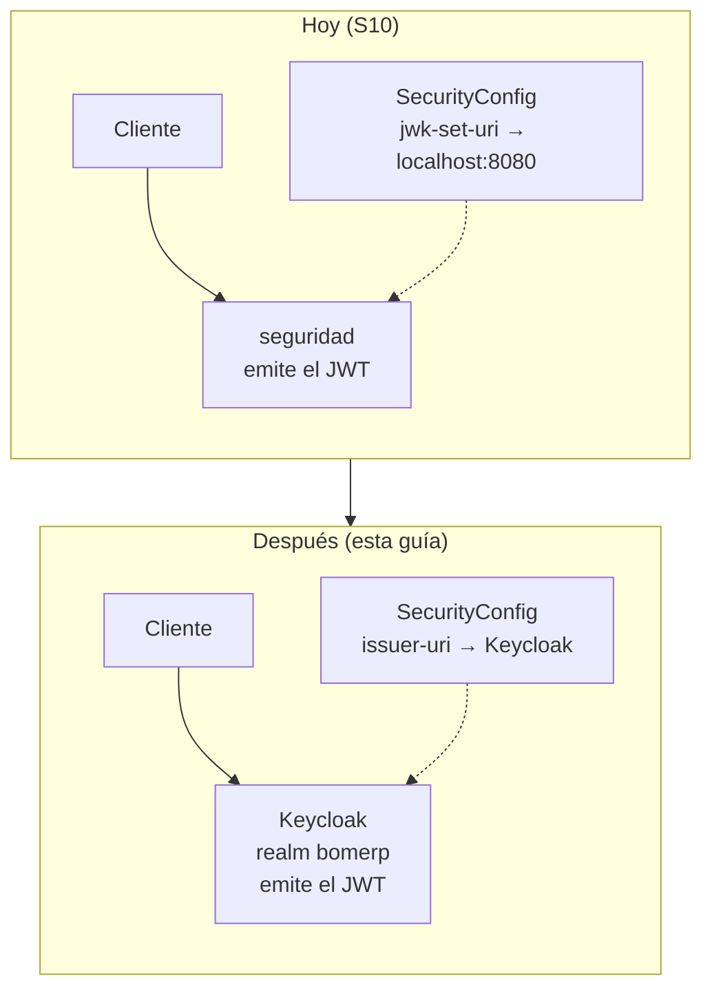

# S10 - Reemplazo del módulo `seguridad` por Keycloak (guía de referencia)

*Por: Angel Sullon Macalupu @asullom - 2026*

## 0. Qué es esta guía y qué no es

Esta guía **no** es una sesión del sílabo: ninguna fila de `silabo_lp2_2026_2.md` ni de `docs/lp2/index.md` la pide, no tiene metodología, caso de motivación, actividad autónoma ni rúbrica, y no se evalúa. Es la continuación directa de [S10_Seguridad_Backend_JWT_Roles.md](S10_Seguridad_Backend_JWT_Roles.md) — la sesión real y evaluada —, que construyó el módulo `seguridad` deliberadamente temporal y "listo para reemplazo" ([ADR-005](../adr/ADR-005-seguridad-jwt-propio-listo-para-reemplazo.md), 2.6 de esa guía, Tabla 4). Esta guía documenta, paso a paso y verificado, el reemplazo que esa ADR dejó como dirección arquitectónica sin construir: **desde descargar Keycloak hasta que `bomerp-backend` valide tokens suyos en vez de los propios**.

Úsala si tu equipo decide adoptar Keycloak en U3 o después — no antes, y no como parte de la evaluación de S10 o S11. La sesión S10 real queda exactamente como está; esta guía no le resta ni le agrega alcance.

**Requisito:** haber completado S10 (`seguridad` funcionando, con Postgres propio y `SecurityConfig` validando por `jwk-set-uri`) — esta guía parte de ese estado y lo reemplaza.

## 1. Qué cambia y qué no

**Figura 1. Antes y después del reemplazo**



Confirmando lo que ya decía la Tabla 4 de S10 (2.6), ahora con el detalle que faltaba:

**Tabla 1. Qué cambia exactamente en `bomerp-backend`**

| Pieza | Cambia |
|---|---|
| `SecurityConfig` (propiedad `jwk-set-uri` → `issuer-uri`) | Sí — una línea de `application-dev.yml` |
| `JwtAuthenticationConverter` (lee `realm_access.roles`) | **No** — Keycloak emite el claim con el mismo nombre |
| `catalogo`, `ventas` (controllers, services, reglas `hasRole`) | **No** |
| Cómo se lee `vendedorId` en `VentaController` | Sí — de `jwt.getSubject()` a un claim propio (3 más abajo) |
| Paquete `seguridad` (`AuthController`, `JwtService`, `JwksController`, `JwtKeyConfig`, entidades) | Se retira — queda sin uso, ver sección 7 |
| Contenedor `bomerp-seguridad-db` (Postgres) | Se retira — Keycloak trae su propio almacenamiento |

El único punto que **sí** exige un cambio de código (no solo de configuración) es cómo se obtiene `vendedorId`: hoy sale de `jwt.getSubject()` porque el `sub` que emite `seguridad` es, por diseño, el `id` numérico de `Usuario`. El `sub` que emite Keycloak es un UUID (*Universally Unique Identifier*) propio del usuario en el realm — nunca el `vendedorId` de BomERP. La sección 5 resuelve esto exactamente como ya lo resuelve DIST para su propio `idCliente` (S07, Tabla 6): un **atributo de usuario** en Keycloak más un **protocol mapper** que lo agrega al token como un claim propio, separado de `sub`.

## 2. Descargar y levantar Keycloak

**Producto del paso:** Keycloak corriendo en modo desarrollo, con consola de administración accesible.

Agrega el servicio a `lp2/bomerp-backend/compose-dev.yml`:

```yaml
  keycloak:
    image: quay.io/keycloak/keycloak:26.8.0
    container_name: bomerp-keycloak
    restart: unless-stopped
    command: start-dev
    ports:
      - "8081:8080"
    environment:
      KC_BOOTSTRAP_ADMIN_USERNAME: admin
      KC_BOOTSTRAP_ADMIN_PASSWORD: admin123
    volumes:
      - keycloak-data:/opt/keycloak/data
```

Y agrega `keycloak-data:` junto a `oracle-data:`/`seguridad-db-data:`, bajo `volumes:`.

```powershell
cd lp2\bomerp-backend
docker compose -f compose-dev.yml up -d keycloak
```

```bash
cd lp2/bomerp-backend
docker compose -f compose-dev.yml up -d keycloak
```

El puerto externo es **8081**, no 8080: `bomerp-backend` ya usa el 8080 en DEV (S1), y Keycloak escucha internamente también en el 8080 de su propio contenedor. `start-dev` es el modo de arranque rápido para desarrollo: no pide configurar TLS ni un `hostname` explícito, y por defecto guarda sus datos en un H2 embebido dentro del contenedor, en `/opt/keycloak/data` — **sin el volumen de arriba, ese directorio se pierde en cada `docker compose down` o recreación del contenedor**, y el realm/usuarios de las secciones 3-5 habría que rehacerlos desde cero. Con el volumen, sobrevive igual que `oracle-data`/`seguridad-db-data` ya lo hacen para los otros dos motores. **En producción real, Keycloak nunca se levanta con `start-dev`**: usa `start` (modo *production*, que exige TLS) y su propia base de datos persistente — habitualmente Postgres, igual que `bomerp-seguridad-db` lo fue para el `seguridad` propio (S10, ADR-005) — no el H2 embebido. Esta guía se queda en modo desarrollo porque el objetivo es verificar la integración, no operar Keycloak en producción.

`KC_BOOTSTRAP_ADMIN_USERNAME`/`KC_BOOTSTRAP_ADMIN_PASSWORD` (Keycloak 26+; versiones anteriores usaban `KEYCLOAK_ADMIN`/`KEYCLOAK_ADMIN_PASSWORD`, ya retiradas) solo crean el usuario administrador la **primera** vez que arranca — cambiarlas después, con el usuario ya creado, no tiene efecto.

Confirma que levantó accediendo a `http://localhost:8081` — debe aparecer la pantalla de bienvenida de Keycloak. Entra a la consola de administración (`Administration Console`) con `admin` / `admin123`.

## 3. Configurar el realm `bomerp`

**Producto del paso:** un realm propio (no el `master` por defecto, reservado para administrar Keycloak mismo), con los tres roles que `ventas` ya usa.

1. En la esquina superior izquierda, donde dice `master`, abre el selector de *realm* y elige **Create realm**.
2. *Realm name*: `bomerp`. Crear.
3. Dentro del realm `bomerp`, ve a **Realm roles** → **Create role**, y crea los tres, uno por uno: `VENDEDOR`, `SUPERVISOR`, `ADMIN`.

Estos son **realm roles** (no *client roles*) a propósito: Keycloak los agrega al token bajo el claim `realm_access.roles` — el mismo nombre que `JwtService` de `seguridad` ya usaba (S10, 3.7) y que `JwtAuthenticationConverter` ya sabe leer (S10, 3.10). Es el primer punto donde se confirma la promesa de la Tabla 4: cero cambios en ese conversor.

## 4. Crear el cliente para pruebas

**Producto del paso:** un *client* en el realm `bomerp` que permita pedir un token para probar la integración antes de construir la SPA real (S11).

1. **Clients** → **Create client**.
2. *Client type*: `OpenID Connect`. *Client ID*: `bomerp-frontend`. Siguiente.
3. *Client authentication*: **desactivado** (es un *public client* — la SPA de S11 no puede guardar un secreto, 2.4 de S10). Siguiente.
4. En **Capability config**, activa **Direct access grants** — habilita el flujo *Resource Owner Password Credentials* **solo para las pruebas de esta guía**. Guardar.

**Error frecuente, y por qué es intencional dejarlo así documentado**: *Direct access grants* corresponde al mismo flujo que la RFC 9700 desaconseja (S10, 2.4, cita textual: *"MUST NOT be used"*) — la razón por la que `seguridad` también lo usaba era la misma: es un atajo de laboratorio, no el diseño final. Úsalo aquí únicamente para verificar que Keycloak emite tokens válidos antes de construir el flujo real; S11 reconfigura este mismo cliente para *Authorization Code* + PKCE (*Proof Key for Code Exchange*) y **desactiva** *Direct access grants* como parte de ese trabajo — no antes.

## 5. Crear los usuarios semilla con su `vendedorId`

**Producto del paso:** los mismos cuatro usuarios de S10 (3.9), ahora en Keycloak, con el dato que RN5/RN8 necesitan (ADS S8) viajando en un claim propio, no en `sub`.

### 5.1 Crear los usuarios y asignarles rol

Por cada uno de `vendedor1@bomerp.com`, `vendedor2@bomerp.com`, `supervisor@bomerp.com`, `admin@bomerp.com`:

1. **Users** → **Add user**. *Username*: el email. *Email verified*: activado (para no complicar el flujo con verificación de correo en esta guía).
2. Pestaña **Credentials** → **Set password**: `Bomerp2026!`, *Temporary*: **desactivado** (si queda activado, Keycloak exige cambiarla en el primer login, lo que rompe el flujo de *Direct access grants* de la sección 6).
3. Pestaña **Role mapping** → **Assign role**: `VENDEDOR` para los dos primeros, `SUPERVISOR` y `ADMIN` para los otros dos, respectivamente — el mismo criterio de promoción manual que S10 ya aplicaba a mano sobre Postgres (3.9), ahora sobre la consola de Keycloak.

### 5.2 Agregar el atributo `vendedorId`

Pestaña **Attributes**, de cada usuario → agrega la clave `vendedorId` con un valor numérico.

Si quieres que las ventas ya registradas con el emisor propio de S10 sigan teniendo un `vendedorId` coherente, usa el mismo `id` que ese usuario tenía en `bomerp-seguridad-db` (`SELECT id FROM usuarios WHERE email = '...'`, Postgres) como valor del atributo aquí — Keycloak no migra ese dato solo, porque son dos almacenes de identidad completamente independientes (2.1 de S10).

### 5.3 Agregar el *protocol mapper* que lleva `vendedorId` al token

Un atributo de usuario, por sí solo, **no** viaja en el token — hay que decirle a Keycloak explícitamente que lo agregue como claim.

1. **Clients** → `bomerp-frontend` → pestaña **Client scopes** → abre el *scope* dedicado (`bomerp-frontend-dedicated`).
2. Pestaña **Mappers** → **Add mapper** → **By configuration** → **User Attribute**.
3. *Name*: `vendedorId`. *User Attribute*: `vendedorId`. *Token Claim Name*: `vendedorId`. *Claim JSON Type*: `long`. Activa **Add to access token**. Guardar.

Este mapper es el equivalente exacto del que DIST describe para `idCliente` (S07, Tabla 6: *"User attribute + protocol mapper que lo agrega al token"*) — la técnica es la misma, solo cambia el nombre del claim.

## 6. Verificar el token antes de tocar `bomerp-backend`

**Producto del paso:** confirmación, con un token real, de que `realm_access.roles` y `vendedorId` llegan con el formato esperado — antes de cambiar nada en el código.

```powershell
$login = Invoke-RestMethod -Method Post -Uri "http://localhost:8081/realms/bomerp/protocol/openid-connect/token" `
  -ContentType "application/x-www-form-urlencoded" `
  -Body "grant_type=password&client_id=bomerp-frontend&username=vendedor1@bomerp.com&password=Bomerp2026!"
$login.access_token
```

```bash
curl -X POST http://localhost:8081/realms/bomerp/protocol/openid-connect/token \
  -H "Content-Type: application/x-www-form-urlencoded" \
  -d "grant_type=password&client_id=bomerp-frontend&username=vendedor1@bomerp.com&password=Bomerp2026!"
```

Pega el `access_token` recibido en [jwt.io](https://jwt.io) (inspección visual únicamente, 2.3 de S10) y confirma tres cosas: `realm_access.roles` trae `["VENDEDOR"]`; existe un claim `vendedorId` con el valor numérico que pusiste en 5.2; y `sub` es un UUID, no el mismo número — exactamente la diferencia que la sección 1 anticipó.

`POST /realms/bomerp/protocol/openid-connect/token` es el endpoint estándar de token de Keycloak (OAuth 2.0/OpenID Connect, S10 2.4) — equivalente a `POST /api/v1/auth/login` de `seguridad`, pero ya no es un endpoint propio de BomERP.

**Error frecuente**: comparar el `expires_in` de este token con el de `seguridad` y asumir que algo está mal. Por defecto, el realm nuevo trae el *access token* del propio Keycloak (*Realm settings* → *Tokens* → *Access Token Lifespan*) en **5 minutos**, no en la hora que `jwt.expiracion-segundos` dejaba en S10 (3.7) — token expirado a mitad de una prueba no es un bug de la integración, solo un valor por defecto distinto. Ajusta ese campo en el realm si las pruebas de la sección 8 te quedan cortas de tiempo.

## 7. Integrar `bomerp-backend` con Keycloak

**Producto del paso:** `SecurityConfig` valida tokens de Keycloak; `catalogo` y `ventas` siguen funcionando sin que se les toque una línea.

### 7.1 Cambiar la propiedad de validación

En `lp2/bomerp-backend/src/main/resources/application-dev.yml`, reemplaza el bloque que S10 dejó (3.10):

```yaml
spring:
  security:
    oauth2:
      resourceserver:
        jwt:
          jwk-set-uri: http://localhost:8080/.well-known/jwks.json
```

por:

```yaml
spring:
  security:
    oauth2:
      resourceserver:
        jwt:
          issuer-uri: http://localhost:8081/realms/bomerp
```

Con `issuer-uri` (en vez de `jwk-set-uri`), Spring no solo descubre dónde están las claves — además valida que el claim `iss` (*issuer*, emisor) de cada token coincida exactamente con esta URL, y descarga la configuración del realm (incluida su ubicación de JWKS) del documento de descubrimiento estándar de OpenID Connect (`/.well-known/openid-configuration`) que Keycloak sí publica (a diferencia de `seguridad`, que no lo implementaba — S10, 2.4, Tabla 3). Es la única propiedad que cambia; `JwtAuthenticationConverter` (S10, 3.10) no se toca.

### 7.2 Cambiar cómo se lee `vendedorId`

**`VentaController.crear`** — reemplaza `jwt.getSubject()` por el claim propio:

```java
@PostMapping
@ResponseStatus(HttpStatus.CREATED)
public VentaResponse crear(@Valid @RequestBody VentaRequest request, @AuthenticationPrincipal Jwt jwt) {
    Number claimVendedorId = jwt.getClaim("vendedorId");
    Long vendedorId = claimVendedorId.longValue();
    return ventaService.crear(request, vendedorId);
}
```

Mismo ajuste en `buscar`/`obtener` (S10, 3.14), reemplazando `Long.valueOf(jwt.getSubject())` por la misma lectura:

```java
private Long vendedorIdDe(Jwt jwt) {
    Number claim = jwt.getClaim("vendedorId");
    return claim == null ? null : claim.longValue();
}
```

El claim se lee como `Number` (no `Long` directo) porque el JSON (*JavaScript Object Notation*) no distingue tamaños de entero — el mismo detalle que DIST ya documentó para `idCliente` (S07, 3.22). `VentaServiceImpl`, `VentaRepository` y las reglas `hasRole`/`hasAnyRole` de `SecurityConfig` (S10, 3.12, 3.14) **no cambian**: siguen recibiendo exactamente el mismo `Long vendedorId` que recibían antes, solo que ahora llega por un claim distinto.

### 7.3 Confirmar que `catalogo` y `ventas` no se tocan

Revisa `SecurityConfig.securityFilterChain`, `CategoriaController`/`ProductoController` y el resto de `VentaController` (lo que no sea `crear`/`buscar`/`obtener`): ningún `hasRole`, ningún `requestMatchers`, ninguna regla cambia. Si encuentras que necesitas tocar algo ahí, la migración se desvió de lo que esta guía describe — revisa el paso anterior.

## 8. Probar de punta a punta

**Producto del paso:** la misma matriz de accesos que S10 verificó (3.15, Tabla 5), ahora contra tokens de Keycloak.

Reinicia `bomerp-backend` (lee la propiedad nueva de 7.1) y repite exactamente las pruebas de S10 (3.15), pero obteniendo cada token con el comando de la sección 6 (cambiando el usuario). Resultado esperado: **la misma Tabla 5** — mismos códigos HTTP, para los mismos casos, con tokens que ahora vienen de un proceso distinto.

**Error frecuente**: `403` donde S10 esperaba `200`, con un token que en jwt.io se ve correcto. Causa más común: el usuario de Keycloak no tiene el *realm role* asignado (5.1), o el *client scope* con el mapper de `vendedorId` (5.3) no quedó asociado al cliente `bomerp-frontend` que usaste para pedir el token.

## 9. Qué queda pendiente

- **S11** reconfigura el cliente `bomerp-frontend` para *Authorization Code* + PKCE (S10, 2.4) — el flujo real que usará la SPA, desactivando *Direct access grants* (sección 4). El login deja de ser un formulario propio de BomERP: redirige a la pantalla de Keycloak.
- **Limpieza del paquete `seguridad`**: `AuthController`, `JwtService`, `JwksController`, `JwtKeyConfig`, `SecurityConfig` (las piezas de `seguridad`, no `OracleDataSourceConfig`), `SeguridadDataSourceConfig` y las entidades `Usuario`/`Rol` quedan sin ningún código que los invoque — pueden borrarse de `bomerp-backend` en un commit aparte, sin que eso afecte a `catalogo` ni a `ventas` (la discusión de por qué esto es una limpieza de archivos y no una migración se documentó en el chat de diseño de S10, no en una guía).
- **`compose-dev.yml`**: el servicio `seguridad-db` (Postgres) deja de usarse — puedes quitarlo, o dejarlo mientras conserves datos históricos que quieras consultar.
- **`pom.xml`**: `spring-security-oauth2-jose` (firmaba el JWT propio) deja de hacer falta; `spring-boot-starter-security-oauth2-resource-server` **sigue haciendo falta** (sigue validando, ahora contra Keycloak); el driver `org.postgresql:postgresql` se retira solo si ningún otro módulo de BomERP usa Postgres.
- **Producción real**: `start-dev` (sección 2) no es apto para producción — exige modo `start`, TLS y una base de datos persistente propia para Keycloak (ver la nota de la sección 2).

## Bibliografía

1. Krebs, B. (2019, 24 de mayo). *First American Financial Corp. Leaked Hundreds of Millions of Title Insurance Records*. KrebsOnSecurity. https://krebsonsecurity.com/2019/05/first-american-financial-corp-leaked-hundreds-of-millions-of-title-insurance-records/ — mismo caso citado en S10 (1.6), relevante aquí porque un `vendedorId` tomado de un claim mal configurado reabre el mismo problema de fondo.
2. Keycloak. (2026). *Getting Started with Docker*. https://www.keycloak.org/getting-started/getting-started-docker
3. Keycloak. (2026). *Server Administration Guide: User-defined attributes*. https://www.keycloak.org/docs/latest/server_admin/#_user-attributes
4. Keycloak. (2026). *Server Administration Guide: Mapping token claims*. https://www.keycloak.org/docs/latest/server_admin/#_protocol-mappers
