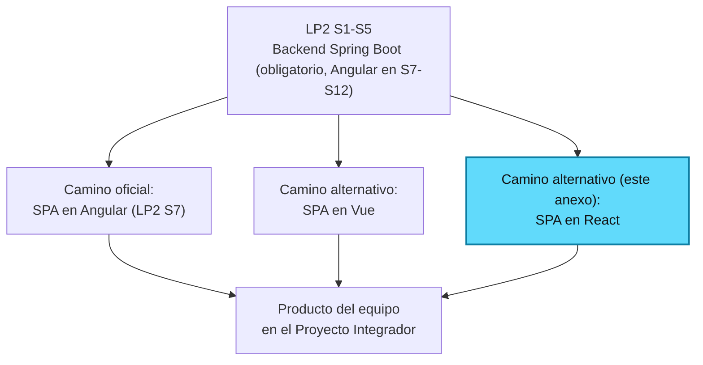
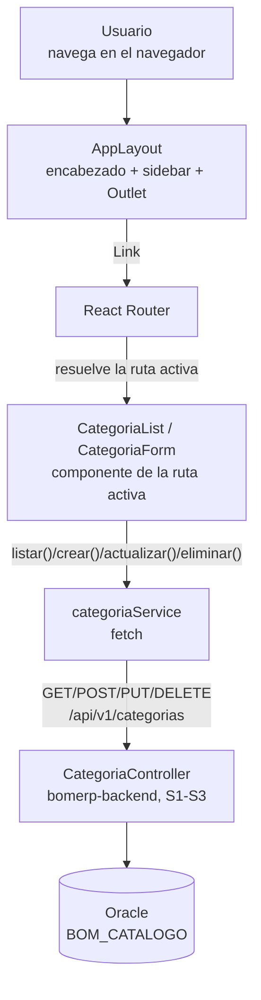
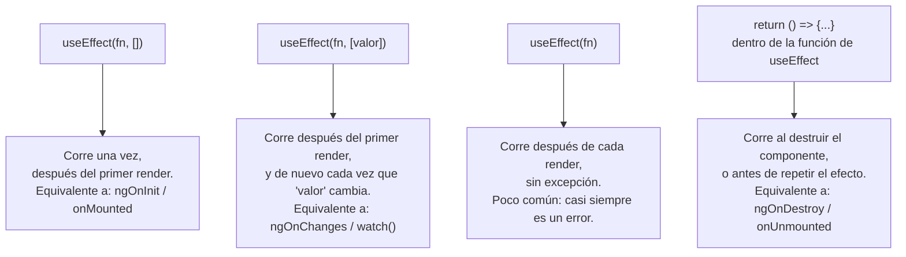

# S7 (Anexo) - Creación y Arquitectura de la SPA con React

*Por: Angel Sullon Macalupu @asullom - 2026*

!!! info "Anexo del Proyecto Integrador, no la sesión oficial de LP2"
    LP2 enseña Angular (S7-S12, [`docs/lp2/sesiones/S07_Creacion_Arquitectura_SPA.md`](../../lp2/sesiones/S07_Creacion_Arquitectura_SPA.md)): esa es la sesión que se dicta en clase y la que evalúa la rúbrica del curso. Este anexo replica exactamente el mismo problema, el mismo backend y el mismo dominio (`Categoria`) en **React**, para el equipo del Proyecto Integrador que elija React como stack de su propio frontend, o para quien quiera comparar tres formas distintas de resolver la misma arquitectura (ver también el [anexo de Vue](S07_Creacion_Arquitectura_SPA_Vue.md)). Sigue la misma plantilla de la guía de Angular a propósito: mismos encabezados, mismo orden, mismas decisiones explicadas — solo cambia el framework.

## 1. Introducción

### 1.1 Presentación de la sesión

Hasta S5, `lp2/bomerp-backend` existe solo como una API — cada endpoint se probó desde Swagger, PowerShell o un `fetch` suelto en la consola del navegador, nunca desde una aplicación real que alguien abra y use sin escribir código. Esta guía construye ese cliente en React: nace el proyecto frontend, con su propia navegación (menú, layout) organizada por funcionalidades, y un primer flujo completo conectado al backend real — el mismo backend, la misma URL, el mismo dominio que ya usan las versiones en Angular y en Vue.

### 1.2 Índice

1. Creación del proyecto React.
2. Layout y navegación: menú, sidebar y encabezado.
3. Vistas, componentes y rutas.
4. Servicios HTTP hacia el backend.
5. CRUD de una tabla independiente.

### 1.3 Propósito de aprendizaje

Al concluir esta guía, estarás en condiciones de:

- **Crear y estructurar** un proyecto React con navegación principal organizada por funcionalidades, y **construir** un primer flujo CRUD completo consumiendo el backend REST de BomERP, aplicando los mismos principios de arquitectura que la sesión de Angular (separación de capas, navegación por rutas, servicios dedicados), en un framework distinto.

### 1.4 Producto de sesión

Proyecto React (`lp2/bomerp-frontend-react`), con navegación principal (encabezado, sidebar y menú) organizada en `core`/`features`, una página de inicio real en `/`, ruteo funcional entre pantallas, una función de trazabilidad que agrega `X-Trace-ID` a cada petición, y un CRUD completo (listar, crear, editar, eliminar) de `Categoria` (`catalogo`), conectado a `http://localhost:8080/api/v1/categorias`.

### 1.5 Metodología

**Tabla 1. Metodología de la guía**

| Actividades a Realizar en el Periodo | Orientaciones generales (Orientaciones Metodológicas) | Material de estudio recomendado |
|---|---|---|
| Revisión previa individual | Confirmar que `lp2/bomerp-backend` sigue respondiendo en `http://localhost:8080` con CORS habilitado para `http://localhost:5173` (el puerto por defecto de Vite). Instalar Node.js LTS si aún no está instalado. | S5 (3.7-3.8) de la guía de Angular, documentación de React. |
| Trabajo autónomo guiado | Construcción del proyecto React, el layout con navegación, la estructura de carpetas por funcionalidad, el servicio HTTP y el CRUD completo de `Categoria`, siguiendo esta guía paso a paso. | Backend ejecutable (S1-S5), Pasos 3.1 a 3.16 de esta guía. |
| Autoevaluación | Verificación de la navegación entre pantallas y del CRUD de `Categoria` reflejado en tiempo real contra el backend, usando los criterios de la sección 4.4. | Indicaciones (4.3), rúbrica (4.6). |

### 1.6 Motivación de la sesión

#### 1.6.1 Caso: la misma API, tres equipos, tres frameworks

Tres equipos del mismo ciclo terminan S1-S5 con el mismo backend funcionando. El primero arma su SPA en Angular, siguiendo la sesión oficial de LP2. El segundo elige Vue. El tercero, para su Proyecto Integrador, decide construir su propio frontend en React — la librería de UI más usada en el mercado, con un modelo mental distinto a los otros dos: sin plantillas propias, todo se declara con JSX (JavaScript con marcado embebido). Los tres resuelven exactamente el mismo problema, y los tres terminan con la misma arquitectura de fondo: un layout separado de las pantallas, rutas por funcionalidad, un servicio dedicado a hablar con el backend. Lo que cambia es la sintaxis y las herramientas de cada opción, no las decisiones de diseño.

**Preguntas de análisis**

**Activación de conocimientos previos**

1. De los endpoints de `catalogo` construidos en S1-S3, ¿cuáles va a consumir esta pantalla, y qué datos espera cada uno?

**Comprensión de arquitectura frontend**

1. ¿Qué decisiones de la sesión de Angular (separar el layout, no llamar a `fetch` directo desde un componente) siguen siendo necesarias en React, y cuáles cambian solo de sintaxis?
2. ¿Por qué React no tiene un mecanismo de `@Input()`/`ngOnChanges` propio, y qué lo reemplaza?

### 1.7 Ubicación en el curso

- Este anexo no forma parte de la evaluación oficial de LP2 (Angular, S7-S12) — es una ruta alternativa para el Proyecto Integrador.
- Unidad: U2 - SPA modular segura para BomERP (equivalente, en React, a la unidad que Angular resuelve en LP2 S7-S12).
- Producto del anexo: la misma base Full-Stack modular de BomERP, resuelta con React en vez de Angular, para el equipo que elija ese stack en su propio proyecto.
- Avance en esta guía: nace el proyecto frontend en React, con su navegación principal, una página de inicio, trazabilidad de peticiones y el primer CRUD independiente (`Categoria`), conectado al backend real.

**Figura 1. Ruta de esta guía dentro del Proyecto Integrador**



## 2. Explica

### 2.1 Arquitectura de la sesión

**Figura 2. De la navegación en el navegador al backend real**



Lectura del diagrama: es la misma Figura 2 de las guías de Angular y Vue, con los nombres propios de React. El usuario nunca navega recargando la página — `AppLayout` se mantiene fijo, y solo el contenido dentro de `<Outlet />` cambia según la ruta activa. Ningún componente llama a `fetch` directamente: siempre pasa por `categoriaService` (2.7).

### 2.2 Creación del proyecto React

React, a diferencia de Angular y Vue, no es un framework completo — es una librería para construir interfaces de usuario. El *routing*, el manejo de formularios y el cliente HTTP no vienen incluidos: cada equipo elige sus propias piezas. Esta guía usa **Vite** para el proyecto (el mismo empaquetador que Vue, 2.2 del anexo de Vue) y **React Router** para las rutas — las opciones más usadas del ecosistema, no las únicas (React, 2026a).

Un componente de React es una función de TypeScript que devuelve JSX — marcado que se parece a HTML pero es JavaScript real, compilado por Vite. No existe una plantilla separada como en Angular (`templateUrl`) o Vue (`<template>`): el marcado vive dentro de la misma función, junto con la lógica.

### 2.3 Ciclo de vida de un componente

Angular y Vue exponen hooks nombrados para cada fase del ciclo de vida (S07 2.3 de Angular; 2.3 del anexo de Vue). React resolvió este mismo problema de una forma completamente distinta desde 2019: en vez de varios hooks para varios momentos, **un solo hook**, `useEffect`, cuyo comportamiento depende de un arreglo de dependencias que tú declaras.

**Figura 3. `useEffect` según su arreglo de dependencias**



**Tabla 2. `useEffect` frente a los hooks de Angular y Vue**

| Momento | React | Angular (S07, 2.3) | Vue (anexo, 2.3) |
|---|---|---|---|
| Arranque del componente | `useEffect(fn, [])` | `ngOnInit` | `onMounted` |
| Reaccionar a un valor que cambia | `useEffect(fn, [valor])` | `ngOnChanges` | `watch(() => valor, ...)` |
| Limpieza al destruir | `return () => {...}` dentro de `useEffect` | `ngOnDestroy` | `onUnmounted` |
| Estado propio del componente | `useState` | `signal()` | `ref()` |

No hay una fase separada para "antes de crear" (`constructor`): el cuerpo de la función del componente corre en cada render, y `useState`/`useEffect` son los que Realmente "recuerdan" algo entre un render y el siguiente. Esta diferencia de diseño —un hook genérico con un arreglo de dependencias, en vez de varios hooks con nombre propio— es la que más cuesta al llegar desde Angular o Vue, y también la fuente más común de bugs en React: un arreglo de dependencias incompleto hace que el efecto no se vuelva a ejecutar cuando debería (React, 2026b).

### 2.4 Layout y navegación: menú, sidebar y encabezado

El mismo argumento que en Angular (S07, 2.4) y Vue (anexo, 2.4): separar el layout de las pantallas evita repetir el mismo menú, encabezado y sidebar en cada componente nuevo. React Router resuelve esto con una ruta padre que renderiza un componente de layout, y un `<Outlet />` dentro de ese layout donde aparecen las rutas hijas (React Router, 2026c) — el mismo mecanismo exacto que `router-outlet` en Angular y `<RouterView>` en Vue, con otro nombre.

### 2.5 Vistas, componentes y rutas

Organizar por **funcionalidad de negocio** en vez de por **tipo** es también la recomendación de la comunidad de React para cualquier proyecto que crezca (React, 2026d) — la misma idea que ya vimos dos veces (Angular S07 2.5; Vue anexo 2.5). Esta guía usa `core/` y `features/`. React Router carga cada ruta de forma perezosa con `React.lazy()`, el equivalente de `loadComponent` en Angular y de `() => import(...)` en Vue Router.

### 2.6 Modelos de datos: `interface`, no `class`

Exactamente el mismo argumento que en Angular (S07, 2.6) y Vue (anexo, 2.6): `fetch` arma la respuesta con `JSON.parse()`, un objeto plano sin comportamiento — `interface` describe forma, no comportamiento, y es lo único que un dato de red puede garantizar. `Categoria` se modela como `interface` (3.8).

### 2.7 Servicios HTTP hacia el backend

Como Vue, React tampoco trae un cliente HTTP incorporado. Esta guía usa `fetch` nativo, envuelto en funciones dedicadas (`src/core/api.ts`), exactamente con la misma estructura de dos capas que ya vimos en Vue (2.7 del anexo): un módulo de infraestructura que sabe *dónde* está el backend, y un módulo de funcionalidad que sabe *qué* endpoints existen para `Categoria`.

### 2.8 CRUD de una tabla independiente

Igual que en las otras dos guías (Angular S07 2.8; Vue anexo 2.8): una **tabla independiente** no necesita ningún otro dato para crearse o mostrarse. `Categoria` es ese caso; el caso dependiente (`Producto`) queda como ejercicio autónomo (4.1).

## 3. Aplica: actividad práctica guiada

### 3.1 Verificar el punto de partida

**Punto de partida:** el mismo backend que usan las guías de Angular y Vue.

```bash
cd lp2/bomerp-backend
.\mvnw.cmd spring-boot:run
```

**Producto del paso:** confirmación de que el backend responde y acepta peticiones desde el origen que va a usar React.

**Requisito antes de continuar:** con el backend corriendo, confirma que `http://localhost:8080/api/v1/categorias` responde, y que `http://localhost:5173` (el puerto por defecto de Vite) está habilitado en la configuración de CORS del backend (S5) — sin eso, cada petición desde React va a fallar con un error de CORS en la consola, no un error de tu código.

### 3.2 Instalar Node.js

**Producto del paso:** entorno listo para crear y correr un proyecto React.

Instala [Node.js LTS](https://nodejs.org/) (incluye `npm`). Verifica:

```bash
node --version
npm --version
```

Igual que Vue, React no exige instalar una CLI global antes de crear el proyecto — a diferencia de Angular (`npm install -g @angular/cli@22`), no hay ningún paquete que instalar por adelantado ni ninguna versión que fijar todavía. `npm create vite@latest` descarga el generador (`create-vite`) una sola vez, lo ejecuta, y no deja nada instalado de forma global: la verificación con `ng version` de Angular no tiene un equivalente *antes* de crear el proyecto — recién lo tiene después (3.3), porque recién después existe algo instalado que verificar.

### 3.3 Crear el proyecto React

**Producto del paso:** `lp2/bomerp-frontend-react` creado y ejecutándose por primera vez, con su versión de Vite confirmada.

Desde la raíz del repositorio, dentro de `lp2/`:

```bash
cd lp2
npm create vite@9.2.1 bomerp-frontend-react -- --template react-ts
```

La primera vez que corres este comando en tu máquina, npm todavía no tiene descargado el paquete real detrás de `npm create vite` (`create-vite`) — te va a pedir confirmación antes de bajarlo:

```text
Need to install the following packages:
create-vite@9.2.1
Ok to proceed? (y)
```

Escribe `y` (o solo Enter, `(y)` ya es la opción por defecto). Es la prueba en vivo de lo que dice el párrafo siguiente: nada de esto queda instalado de forma global (3.2) — cada vez que lo corras en una máquina nueva, vas a ver este mismo prompt una sola vez.

Según la versión de `create-vite` que se descargue, puede seguir una pregunta más, aunque `--template react-ts` ya fijó la plantilla:

```text
◆  Which linter to use?
│  ● Oxlint
│  ○ ESLint
```

Deja la opción marcada por defecto (`Oxlint`) y presiona Enter. Es un chequeo de estilo de código, no una decisión de arquitectura — no afecta ningún paso de esta guía, ni el CRUD ni las rutas.

Puede seguir todavía una pregunta más:

```text
◇  Install with npm and start now?
│  Yes
```

Responde **No** — instala y levanta el servidor a mano, en los pasos siguientes, para dejar cada comando explícito.

`--template react-ts` fija de una vez React con TypeScript — el mismo criterio de Angular y Vue (2.6): los modelos de datos necesitan tipos reales, no hace falta agregarlo después. `@9.2.1` fija la versión de `create-vite`, con el mismo criterio que Angular fija `@angular/cli@22` (S07, 3.2): dos versiones mayores distintas de un generador pueden producir proyectos con estructuras distintas — fijar la versión evita que cada estudiante del curso termine con un punto de partida distinto según cuándo corrió el comando. Como alternativa, si prefieres siempre la versión más nueva (y estás dispuesto a que la guía se desactualice con el tiempo, S07 3.2), reemplaza `@9.2.1` por `@latest`.

Instala dependencias, agrega React Router (no viene incluido, 2.2), y levanta el servidor:

```bash
cd bomerp-frontend-react
npm install
npm install react-router-dom
npm run dev
```

Verifica qué versión de Vite quedó instalada — recién ahora existe una, como dependencia local del proyecto, no global:

```bash
npx vite --version
```

Esto cumple el mismo rol que `ng version` en Angular (3.2): confirmar la herramienta real que vas a usar antes de seguir. La diferencia es el momento — en Angular se verifica *antes* de crear el proyecto (la CLI es global, existe independiente de cualquier proyecto); en React/Vite se verifica *después* (Vite queda registrado en `package.json`, dentro de `devDependencies`, propio de este proyecto y de ningún otro).

Abre la URL que muestra la terminal (por defecto `http://localhost:5173`). Debe mostrarse la página de bienvenida por defecto de Vite + React.

### 3.4 Recorrer la estructura generada

**Producto del paso:** entender qué generó `npm create vite@9.2.1`, en el mismo orden de prioridad que las guías de Angular (S07, 3.4) y Vue (anexo, 3.4).

```text
bomerp-frontend-react/
├── src/
│   ├── App.tsx               # componente raíz
│   ├── main.tsx               # arranque de la aplicación
│   └── assets/
├── index.html
├── vite.config.ts
└── package.json
```

1. **`package.json`.** Dependencias (`react`, `react-dom`, `react-router-dom`), versión, *scripts* (`dev`, `build`). No lo tocas hoy.
2. **`vite.config.ts`.** Configuración de build, con el plugin `@vitejs/plugin-react`. Ya lo dejó listo el generador.
3. **`index.html` y `main.tsx`.** `index.html` trae un `<div id="root"></div>` vacío. `main.tsx` es el primer código que corre, y es donde registras React Router — envuélvelo dentro de `<StrictMode>`:

**`src/main.tsx`**

```tsx
import { StrictMode } from 'react'
import { createRoot } from 'react-dom/client'
import { BrowserRouter } from 'react-router-dom'
import './index.css'
import App from './App.tsx'

createRoot(document.getElementById('root')!).render(
  <StrictMode>
    <BrowserRouter>
      <App />
    </BrowserRouter>
  </StrictMode>,
)
```

`createRoot(...).render(...)` monta el componente raíz dentro de ese `div`. `<StrictMode>` es una ayuda de React que solo existe en modo desarrollo (React, 2026e): duplica a propósito ciertas llamadas (por ejemplo, el cuerpo de un componente) para exponer efectos secundarios mal escritos que de otro modo pasarían inadvertidos — no genera nada en producción, y esta guía no la toca; se queda como la etiqueta más externa, sin relación con el router. `<BrowserRouter>` es lo único que agrega esta guía. `import App from './App.tsx'`, con la extensión `.tsx` incluida, es el estilo que trae esta plantilla del generador (`react-ts`) por defecto — Vite resuelve el import igual con o sin extensión; el resto de esta guía la omite (como en el resto del ecosistema), y ambas formas son válidas en este mismo proyecto.

4. **`App.tsx`.** El componente raíz. Reemplázalo para que quede vacío de layout propio:

**`src/App.tsx`**

```tsx
import { Routes, Route } from 'react-router-dom'

export default function App() {
  return (
    <Routes>
    </Routes>
  )
}
```

Guarda y mira la página: queda en blanco — `<Routes>` todavía no tiene ninguna `<Route>` que resolver a `/`. Es lo esperado, se completa en 3.5.

### 3.5 Crear el layout: encabezado, sidebar y menú

**Producto del paso:** `AppLayout`, el componente que va a envolver el resto de pantallas.

Como Vue, React no trae un generador de componentes — los archivos `.tsx` se crean a mano. Crea `src/core/AppLayout.tsx`:

```tsx
import { Link, NavLink, Outlet } from 'react-router-dom'
import './AppLayout.css'

export default function AppLayout() {
  return (
    <>
      <header className="header">
        <h1>
          <Link to="/" className="home-link">
            
          </Link>
          BomERP
        </h1>
      </header>

      <div className="body">
        <aside className="sidebar">
          <nav>
            <NavLink to="/catalogo/categorias" className={({ isActive }) => (isActive ? 'active' : '')}>
              Categorías
            </NavLink>
          </nav>
        </aside>

        <main className="content">
          <Outlet />
        </main>
      </div>
    </>
  )
}
```

**`src/core/AppLayout.css`**

```css
.body {
  display: flex;
}

.sidebar {
  width: 200px;
}

.sidebar a.active {
  font-weight: bold;
}

.content {
  flex: 1;
  padding: 1rem;
}

.home-link {
  display: inline-flex;
  align-items: center;
  vertical-align: middle;
}
```

`className` reemplaza a `class` en JSX — `class` es una palabra reservada de JavaScript, por eso React necesita un nombre distinto. `<Link>` navega sin recargar la página, como `routerLink`/`RouterLink`; `<NavLink>` es la variante que además sabe si su propia ruta está activa —la función `({ isActive }) => ...` que recibe `className` es la forma de React de lograr lo mismo que `routerLinkActive="active"` en Angular o `active-class="active"` en Vue: aquí no hay un atributo dedicado, se resuelve con una función. `<Outlet />` es el `router-outlet`/`<RouterView>` de React Router.

Conecta `AppLayout` a las rutas, en `App.tsx`:

**`src/App.tsx`**

```tsx
import { Routes, Route } from 'react-router-dom'
import AppLayout from './core/AppLayout'

export default function App() {
  return (
    <Routes>
      <Route path="/" element={<AppLayout />} />
    </Routes>
  )
}
```

Guarda y mira la página: ahora se ve el encabezado ("BomERP") y el sidebar con el enlace **Categorías**, aunque el área de contenido quede vacía — `/` todavía no tiene ninguna ruta hija (recién en 3.6).

### 3.6 Crear la vista de inicio

**Producto del paso:** `AppLayout` (3.5) pasa a ser ruta padre, con una página de inicio real en `''` como su primera hija.

Crea `src/core/InicioView.tsx`, sin lógica ni estilos propios:

```tsx
export default function InicioView() {
  return (
    <>
      <h2>Bienvenido a BomERP</h2>
      <p>Usa el menú de la izquierda para navegar entre los módulos disponibles.</p>
    </>
  )
}
```

Agrega la ruta hija, anidada dentro de la de `AppLayout`:

**`src/App.tsx`**

```tsx
import { Routes, Route } from 'react-router-dom'
import AppLayout from './core/AppLayout'
import InicioView from './core/InicioView'

export default function App() {
  return (
    <Routes>
      <Route path="/" element={<AppLayout />}>
        <Route index element={<InicioView />} />
      </Route>
    </Routes>
  )
}
```

`<Route index>` es la forma que tiene React Router de declarar "la ruta hija que se muestra cuando no hay ningún segmento adicional después de `/`" — el equivalente de `path: ''` dentro de `children` en Angular y Vue.

La ruta de `Categoria` todavía no aparece aquí: se agrega recién en 3.7, primero vacía.

**Error frecuente**: escribir la ruta de una pantalla nueva como `<Route>` hermana de `AppLayout`, fuera de sus hijas, en vez de anidada dentro de ella. El resultado es el mismo que en Angular y Vue: esa pantalla reemplaza *todo* el documento, sin encabezado ni sidebar, en vez de aparecer dentro del `<Outlet />` de `AppLayout`.

Verifica: la página debe mostrar el encabezado, el sidebar, y el mensaje de bienvenida dentro del área de contenido.

### 3.7 Practicar la navegación con una vista vacía

**Producto del paso:** el enlace **Categorías** funcionando de punta a punta — sin datos, sin backend, solo para entrenar el patrón de rutas.

Crea `src/features/catalogo/categoria/CategoriaListView.tsx`, todavía sin contenido real:

```tsx
export default function CategoriaListView() {
  return <p>categoria list works!</p>
}
```

Agrega su ruta, anidada junto a `index`:

```tsx
<Route path="catalogo/categorias" element={<CategoriaListView />} />
```

Haz clic en **Categorías**. Debe mostrarse "categoria list works!" dentro del área de contenido de `AppLayout`, con el encabezado y el sidebar todavía visibles, y el enlace **Categorías** resaltado. Eso es lo único que importa en este paso: la navegación completa funciona, antes de que `CategoriaListView` tenga una sola línea de lógica real.

### 3.8 Crear el modelo `Categoria`

**Producto del paso:** el contrato de datos que el frontend comparte con `CategoriaResponse`/`CategoriaRequest` del backend (S3).

Crea `src/features/catalogo/categoria/categoria.model.ts`:

```ts
export interface Categoria {
  id?: number
  nombre: string
  descripcion?: string
}
```

Idéntico al de Angular y Vue: `id` opcional, campos calzando con `CategoriaResponse`/`CategoriaRequest` (S3).

### 3.9 Crear el archivo de ambientes y el servicio base de API

**Producto del paso:** la URL del backend declarada en un solo lugar.

Vite (el mismo empaquetador de la guía de Vue) expone variables de ambiente con el prefijo `VITE_` vía `import.meta.env` — funciona igual en un proyecto React con Vite. Crea `.env` en la raíz de `bomerp-frontend-react/`:

```text
VITE_API_BASE_URL=http://localhost:8080
```

Crea `src/core/api.ts`:

```ts
const baseUrl = import.meta.env.VITE_API_BASE_URL as string

export function buildUrl(path: string): string {
  const normalizedPath = path.startsWith('/') ? path : `/${path}`
  return `${baseUrl}${normalizedPath}`
}

export async function apiFetch(path: string, init: RequestInit = {}): Promise<Response> {
  const traceId = crypto.randomUUID()
  const response = await fetch(buildUrl(path), {
    ...init,
    headers: {
      ...init.headers,
      'X-Trace-ID': traceId,
    },
  })

  if (!response.ok) {
    throw new Error(`Error ${response.status} en ${path}`)
  }

  return response
}
```

Archivo idéntico al de la guía de Vue (3.9): React tampoco trae un cliente HTTP ni un mecanismo de interceptores, así que envolver `fetch` en una única función reutilizable resuelve, sin librerías externas, lo mismo que `withInterceptors` en Angular.

### 3.10 Crear `categoriaService` (solo `listar`)

**Producto del paso:** el único punto del frontend que sabe cómo se llega a `/api/v1/categorias` — por ahora, solo para leer.

Crea `src/features/catalogo/categoria/categoria-service.ts`:

```ts
import { apiFetch } from '../../../core/api'
import type { Categoria } from './categoria.model'

const resource = '/api/v1/categorias'

export async function listar(): Promise<Categoria[]> {
  const response = await apiFetch(resource)
  return response.json()
}
```

Igual que en Vue: un módulo con funciones exportadas, no una clase inyectable — React tampoco trae un contenedor de inyección de dependencias para servicios simples.

### 3.11 Crear `CategoriaList` y ver el primer resultado

**Producto del paso:** la lista de categorías, visible en el navegador con datos reales del backend.

`CategoriaListView.tsx` ya existe desde 3.7. Reemplázalo:

```tsx
import { useState, useEffect } from 'react'
import { Link } from 'react-router-dom'
import { listar } from './categoria-service'
import type { Categoria } from './categoria.model'

export default function CategoriaListView() {
  const [categorias, setCategorias] = useState<Categoria[]>([])
  const [error, setError] = useState<string | null>(null)
  const [loading, setLoading] = useState(false)

  useEffect(() => {
    setLoading(true)
    listar()
      .then(setCategorias)
      .catch(() => setError('No se pudo cargar la lista de categorías.'))
      .finally(() => setLoading(false))
  }, [])

  return (
    <>
      {loading && <p>Cargando categorías...</p>}
      {error && <p className="error">{error}</p>}

      <Link to="/catalogo/categorias/nueva">Nueva categoría</Link>

      <table>
        <thead>
          <tr>
            <th>Nombre</th>
            <th>Descripción</th>
          </tr>
        </thead>
        <tbody>
          {categorias.map((categoria) => (
            <tr key={categoria.id}>
              <td>{categoria.nombre}</td>
              <td>{categoria.descripcion}</td>
            </tr>
          ))}
          {!loading && !error && categorias.length === 0 && (
            <tr>
              <td colSpan={2}>No hay categorías registradas.</td>
            </tr>
          )}
        </tbody>
      </table>
    </>
  )
}
```

`useState<Categoria[]>([])` es el equivalente de `signal<Categoria[]>([])` en Angular y de `ref<Categoria[]>([])` en Vue: un valor que, al cambiar (`setCategorias(...)`), hace que React vuelva a renderizar el componente. `useEffect(fn, [])` —arreglo de dependencias vacío— es el equivalente de `ngOnInit`/`onMounted` (2.3): corre una sola vez, después del primer render. `.finally(() => setLoading(false))` cumple el mismo rol que en Vue y Angular: apagar `loading` tanto si la petición tuvo éxito como si falló.

JSX usa `{...}` para insertar una expresión de JavaScript dentro del marcado — `{loading && <p>...}` es la forma de React de escribir un `@if`/`v-if`: si `loading` es `false`, la expresión completa vale `false`, y React no renderiza nada. `key={categoria.id}` cumple el mismo rol que `track categoria.id` en Angular o `:key="categoria.id"` en Vue: identifica cada fila para que React sepa cuál cambió, sin tener que redibujar la tabla entera. `colSpan` (con mayúscula en la "S") es el nombre que usa React para el atributo HTML `colspan` — JSX convierte los atributos HTML a *camelCase*.

Agrega el estilo global de error, en `src/index.css` (el CSS global que ya trae el proyecto):

```css
.error {
  color: #b42318;
}
```

La ruta ya existe desde 3.7. Recarga la página y haz clic en **Categorías**: debe verse la lista en el lugar donde antes decía "categoria list works!".

### 3.12 Completar `categoriaService`: crear, actualizar, eliminar

**Producto del paso:** los cuatro métodos que le faltaban.

Agrega a `categoria-service.ts`:

```ts
import { apiFetch } from '../../../core/api'
import type { Categoria } from './categoria.model'

const resource = '/api/v1/categorias'

export async function listar(): Promise<Categoria[]> {
  const response = await apiFetch(resource)
  return response.json()
}

export async function obtener(id: number): Promise<Categoria> {
  const response = await apiFetch(`${resource}/${id}`)
  return response.json()
}

export async function crear(categoria: Categoria): Promise<Categoria> {
  const response = await apiFetch(resource, {
    method: 'POST',
    headers: { 'Content-Type': 'application/json' },
    body: JSON.stringify(categoria),
  })
  return response.json()
}

export async function actualizar(id: number, categoria: Categoria): Promise<Categoria> {
  const response = await apiFetch(`${resource}/${id}`, {
    method: 'PUT',
    headers: { 'Content-Type': 'application/json' },
    body: JSON.stringify(categoria),
  })
  return response.json()
}

export async function eliminar(id: number): Promise<void> {
  await apiFetch(`${resource}/${id}`, { method: 'DELETE' })
}
```

Idéntico al archivo de la guía de Vue (3.12) — la capa de servicio no depende del framework de UI, así que su código es exactamente el mismo en las dos guías.

### 3.13 Agregar eliminar a `CategoriaList`

**Producto del paso:** el botón **Eliminar** funcionando.

Agrega a `CategoriaListView.tsx`:

```tsx
import { useState, useEffect, useCallback } from 'react'
import { Link } from 'react-router-dom'
import { listar, eliminar } from './categoria-service'
import type { Categoria } from './categoria.model'

export default function CategoriaListView() {
  const [categorias, setCategorias] = useState<Categoria[]>([])
  const [error, setError] = useState<string | null>(null)
  const [loading, setLoading] = useState(false)

  const cargar = useCallback(() => {
    setLoading(true)
    setError(null)
    listar()
      .then(setCategorias)
      .catch(() => setError('No se pudo cargar la lista de categorías.'))
      .finally(() => setLoading(false))
  }, [])

  useEffect(() => {
    cargar()
  }, [cargar])

  function onEliminar(id: number) {
    if (!confirm(`¿Está seguro de eliminar la categoría ${id}?`)) return

    eliminar(id)
      .then(cargar)
      .catch(() => setError('No se pudo eliminar la categoría. Puede tener productos asociados.'))
  }

  return (
    <>
      {loading && <p>Cargando categorías...</p>}
      {error && <p className="error">{error}</p>}

      <Link to="/catalogo/categorias/nueva">Nueva categoría</Link>

      <table>
        <thead>
          <tr>
            <th>Nombre</th>
            <th>Descripción</th>
            <th></th>
          </tr>
        </thead>
        <tbody>
          {categorias.map((categoria) => (
            <tr key={categoria.id}>
              <td>{categoria.nombre}</td>
              <td>{categoria.descripcion}</td>
              <td>
                <Link to={`/catalogo/categorias/${categoria.id}/editar`}>Editar</Link>
                <button onClick={() => onEliminar(categoria.id!)}>Eliminar</button>
              </td>
            </tr>
          ))}
          {!loading && !error && categorias.length === 0 && (
            <tr>
              <td colSpan={3}>No hay categorías registradas.</td>
            </tr>
          )}
        </tbody>
      </table>
    </>
  )
}
```

`useCallback` envuelve `cargar` para que la misma función no se recree en cada render — sin esto, `useEffect(() => cargar(), [cargar])` volvería a dispararse en cada repintado, porque React compara las dependencias por referencia, no por contenido: una función nueva en cada render *siempre* cuenta como "cambió". Esto es exactamente el tipo de detalle que la Tabla 2 (2.3) advierte como la fuente más común de bugs en React — un `useEffect` que se ejecuta más veces de las que debería, no por un error de lógica, sino por no entender cómo React decide si una dependencia "cambió". `onClick={() => onEliminar(categoria.id!)}` es el equivalente de `(click)="eliminar(categoria.id!)"` en Angular y `@click="onEliminar(categoria.id!)"` en Vue.

### 3.14 Crear `CategoriaForm`

**Producto del paso:** una sola vista que sirve tanto para crear como para editar, según si la ruta trae un `id`.

Crea `src/features/catalogo/categoria/CategoriaFormView.tsx`:

```tsx
import { useState, useEffect, useMemo } from 'react'
import { useParams, useNavigate } from 'react-router-dom'
import { crear, actualizar, obtener } from './categoria-service'

const LIMITES = { nombre: 80, descripcion: 200 } as const
const REQUERIDO = { nombre: true, descripcion: false } as const

function mensajeValidacion(campo: 'nombre' | 'descripcion', valor: string, tocado: boolean): string {
  if (!tocado) return ''
  const limpio = valor.trim()
  if (REQUERIDO[campo] && !limpio) return 'Este campo es obligatorio.'
  if (limpio.length > LIMITES[campo]) return `Máximo ${LIMITES[campo]} caracteres.`
  return ''
}

export default function CategoriaFormView() {
  const { id: idParam } = useParams()
  const navigate = useNavigate()
  const id = idParam ? Number(idParam) : null

  const [nombre, setNombre] = useState('')
  const [descripcion, setDescripcion] = useState('')
  const [tocado, setTocado] = useState({ nombre: false, descripcion: false })
  const [error, setError] = useState<string | null>(null)
  const [loading, setLoading] = useState(false)
  const [errorCarga, setErrorCarga] = useState(false)

  useEffect(() => {
    if (!id) return

    setLoading(true)
    obtener(id)
      .then((categoria) => {
        setNombre(categoria.nombre)
        setDescripcion(categoria.descripcion ?? '')
      })
      .catch(() => {
        setErrorCarga(true)
        setError('No se pudo cargar la categoría.')
      })
      .finally(() => setLoading(false))
  }, [id])

  const mensajeNombre = useMemo(
    () => mensajeValidacion('nombre', nombre, tocado.nombre),
    [nombre, tocado.nombre],
  )
  const mensajeDescripcion = useMemo(
    () => mensajeValidacion('descripcion', descripcion, tocado.descripcion),
    [descripcion, tocado.descripcion],
  )

  function guardar(evento: React.FormEvent) {
    evento.preventDefault()
    if (loading || errorCarga) return

    setError(null)
    setTocado({ nombre: true, descripcion: true })
    const nombreLimpio = nombre.trim()
    setNombre(nombreLimpio)

    const nombreInvalido = mensajeValidacion('nombre', nombreLimpio, true)
    const descripcionInvalida = mensajeValidacion('descripcion', descripcion, true)
    if (nombreInvalido || descripcionInvalida) return

    const valor = { nombre: nombreLimpio, descripcion }
    const peticion = id ? actualizar(id, valor) : crear(valor)

    setLoading(true)
    peticion
      .then(() => navigate('/catalogo/categorias'))
      .catch(() => setError('No se pudo guardar la categoría.'))
      .finally(() => setLoading(false))
  }

  return (
    <form onSubmit={guardar}>
      {loading && <p>Cargando...</p>}

      <label>
        Nombre
        <input
          type="text"
          value={nombre}
          onChange={(e) => setNombre(e.target.value)}
          onBlur={() => setTocado((t) => ({ ...t, nombre: true }))}
        />
      </label>
      {mensajeNombre && <p className="error">{mensajeNombre}</p>}

      <label>
        Descripción
        <textarea
          value={descripcion}
          onChange={(e) => setDescripcion(e.target.value)}
          onBlur={() => setTocado((t) => ({ ...t, descripcion: true }))}
        />
      </label>
      {mensajeDescripcion && <p className="error">{mensajeDescripcion}</p>}

      {error && <p className="error">{error}</p>}

      <button type="submit" disabled={loading || errorCarga}>Guardar</button>
      <button type="button" onClick={() => navigate('/catalogo/categorias')}>Cancelar</button>
    </form>
  )
}
```

React no tiene un equivalente a Reactive Forms de Angular ni a los `ref`/`v-model` de Vue: un formulario **controlado** en React declara cada campo como un par `useState` + `onChange` — el valor del input siempre viene de `nombre` (el estado), y cada tecla dispara `setNombre(e.target.value)`, que actualiza el estado y vuelve a renderizar el input con ese nuevo valor. Es de dos vías, como `formControlName`/`v-model`, pero explícito en cada campo: React no oculta ese mecanismo detrás de una directiva.

`mensajeValidacion(campo, valor, tocado)` es la misma función genérica que ya viste en la guía de Vue (3.14) y en `CategoriaForm` de Angular (S07, 3.13) — una sola definición de las reglas por campo (`LIMITES`/`REQUERIDO`), reutilizada para `nombre` y `descripcion`. `tocado` pasa de un solo `useState(false)` a un objeto `{ nombre, descripcion }`: cada campo lleva su propio estado de "tocado", igual que cada `FormControl` de Angular trae el suyo — con un solo booleano para todo el formulario, tocar **nombre** habría mostrado también el mensaje de **descripción** antes de tiempo.

`useMemo` envuelve `mensajeNombre`/`mensajeDescripcion` para no recalcular la validación en *cada* render del componente, solo cuando su propio valor o su propio `tocado` cambian — sin `useMemo`, una función común (`const mensajeNombre = mensajeValidacion(...)`, sin envoltorio) se ejecutaría de nuevo en cada render, así el render lo haya disparado otra parte del componente que no tiene nada que ver con este campo. Para una validación tan liviana como esta, la diferencia de rendimiento es insignificante, pero es el mismo mecanismo de fondo que un `computed()` de Vue trae gratis (Vue solo recalcula cuando sus dependencias reactivas cambian) y que Angular resuelve distinto: `mensajeValidacion(campo)` en Angular no está memoizado, pero se ejecuta desde la plantilla, no en cada render de JavaScript.

`useParams()` es el equivalente de `inject(ActivatedRoute)` en Angular y `useRoute()` en Vue; `useNavigate()` el de `inject(Router)`/`useRouter()`. `evento.preventDefault()` dentro de `guardar` cumple el rol de `@submit.prevent` en Vue (Angular no lo necesita: `(ngSubmit)` ya evita el comportamiento por defecto del navegador).

Completa las rutas que faltaban, en `App.tsx`:

```tsx
<Route path="catalogo/categorias/nueva" element={<CategoriaFormView />} />
<Route path="catalogo/categorias/:id/editar" element={<CategoriaFormView />} />
```

### 3.15 Probar el CRUD completo

Con `lp2/bomerp-backend` corriendo y `npm run dev` activo:

1. Abre la URL de Vite. Debe mostrarse `InicioView` (3.6). Clic en **Categorías**.
2. Clic en **Nueva categoría**, completa el formulario y guarda. Debe volver a la lista, con la categoría nueva visible.
3. Clic en **Editar** sobre una categoría existente. El formulario debe cargar sus datos actuales.
4. Cambia el nombre y guarda. El cambio debe reflejarse en la lista.
5. Intenta **Eliminar** una categoría que ya tiene productos asociados (S3). Debe aparecer el mensaje de error controlado.
6. Elimina una categoría sin productos asociados. Debe desaparecer de la lista.

**Error frecuente**: dejar `lp2/bomerp-backend` apagado. El error aparece como `Failed to fetch` en la consola — revisa la pestaña **Network** antes de asumir que el código React está mal.

### 3.16 Comparar con Angular y Vue

**Tabla 3. Mismas decisiones, tres frameworks**

| Decisión de arquitectura | Angular (LP2 S07) | Vue (anexo) | React (este anexo) |
|---|---|---|---|
| Layout separado de las pantallas | Ruta padre + `router-outlet` | Ruta padre + `<RouterView>` | Ruta padre + `<Outlet />` |
| Marcado | Plantilla HTML separada | `<template>` en el mismo `.vue` | JSX, dentro de la misma función |
| Estado reactivo | `signal()` | `ref()` | `useState()` |
| Efectos/ciclo de vida | 9 hooks con nombre propio | 6-7 hooks con nombre propio | 1 hook genérico (`useEffect`) + arreglo de dependencias |
| Servicio HTTP dedicado | Clase `@Injectable` | Módulo con funciones | Módulo con funciones |
| Cliente HTTP | `HttpClient` incorporado | `fetch` envuelto a mano | `fetch` envuelto a mano |
| Formularios | Reactive Forms (`FormGroup`) | `v-model` + validación en `computed()` | Componentes controlados (`useState` + `onChange`) |
| Generación de archivos | CLI (`ng generate component`) | A mano | A mano |

La capa de servicio (`api.ts`, `categoria-service.ts`) es literalmente el mismo código en Vue y en React — no depende de qué librería de UI la consume. Lo que cambia entre los tres frameworks es solo cómo se declara un componente y cómo reacciona a los datos, no cómo se habla con el backend.

## 4. Crea: actividad autónoma

### 4.1 Actividad

Replicación autónoma de esta arquitectura sobre el dominio elegido por tu equipo para el Proyecto Integrador, si tu equipo decidió React como stack de frontend.

Completa y evidencia estas tareas:

1. Crea el proyecto React con la misma estructura `core`/`features` de esta guía, sobre el dominio de tu propio proyecto.
2. Construye el layout (encabezado, sidebar, menú) con al menos dos rutas de navegación, y una vista de inicio real en `/`.
3. Crea un servicio HTTP de funcionalidad que use `apiFetch()`/`buildUrl()` para un CRUD completo de una tabla independiente de tu propio dominio.
4. Prueba el CRUD completo contra tu propio backend real.
5. Documenta un error real encontrado.

### 4.2 Propósito

Que el equipo que eligió React demuestre que puede construir la misma arquitectura de la sesión oficial de LP2, aplicada a su propio dominio y con las herramientas propias de React, sin el acompañamiento del docente.

### 4.3 Indicaciones

Este anexo no reemplaza la entrega oficial de LP2 (Angular): documenta esta actividad como evidencia interna del equipo para su Proyecto Integrador, con el mismo estándar de honestidad que cualquier evidencia técnica del curso — capturas con el reloj del sistema y tu usuario visibles, coherentes con el historial de commits de GitHub del equipo.

### 4.4 Criterios mínimos de aceptación

- El proyecto sigue la estructura `core`/`features`.
- El layout funciona con al menos dos rutas navegables y una vista de inicio real en `/`.
- Implementa un servicio HTTP dedicado, sin llamadas a `fetch` directamente desde un componente.
- Implementa un CRUD independiente completo, probado contra un backend real.
- Incluye un error o hallazgo técnico diagnosticado.

### 4.5 Preguntas de defensa

1. ¿Qué decisiones de esta guía son idénticas a las de las guías de Angular y Vue, y cuáles cambiaron solo por las herramientas de React?
2. ¿Por qué `useEffect(cargar, [])` corre una sola vez, y qué pasaría si se le quitara el arreglo de dependencias?
3. ¿Por qué `useCallback` es necesario en `cargar()`, y qué error concreto evita?

### 4.6 Autoevaluación

**Tabla 4. Autoevaluación de la actividad**

| Criterio | Cumple | No cumple |
|---|---|---|
| Estructura `core`/`features` coherente con el dominio propio. | | |
| Layout y navegación funcionando, con vista de inicio real. | | |
| Servicio HTTP dedicado, sin `fetch` directo desde componentes. | | |
| CRUD independiente completo, probado contra el backend real. | | |

## 5. Cierre

**Resumen breve:** este anexo replicó, en React, la misma arquitectura que las guías de Angular y Vue construyen: layout separado de las pantallas, rutas por funcionalidad, un servicio HTTP dedicado, y un CRUD completo de `Categoria` conectado al mismo backend real.

**Proyección:** el mismo patrón aplicado aquí a `Categoria` se repite para cualquier otra tabla independiente del dominio propio del equipo — la arquitectura no cambia, solo el nombre de las entidades.

## Bibliografía

1. React. (2026a). *Quick Start*. https://react.dev/learn
2. React. (2026b). *Synchronizing with Effects*. https://react.dev/learn/synchronizing-with-effects
3. React Router. (2026c). *Nested Routes*. https://reactrouter.com/start/framework/routing#nested-routes
4. React. (2026d). *Thinking in React*. https://react.dev/learn/thinking-in-react
5. React. (2026e). *`<StrictMode>`*. https://react.dev/reference/react/StrictMode
