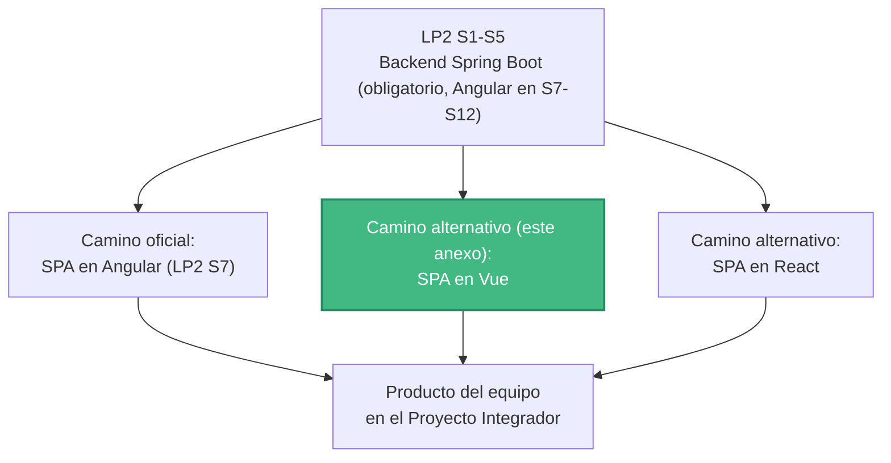
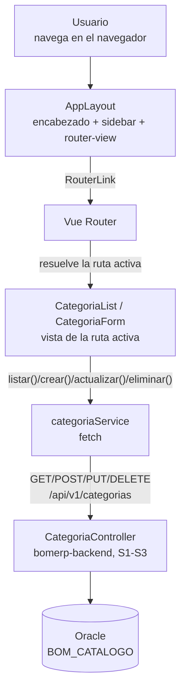
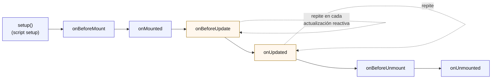

# S7 (Anexo) - Creación y Arquitectura de la SPA con Vue

*Por: Angel Sullon Macalupu @asullom - 2026*

!!! info "Anexo del Proyecto Integrador, no la sesión oficial de LP2"
    LP2 enseña Angular (S7-S12, [`docs/lp2/sesiones/S07_Creacion_Arquitectura_SPA.md`](../../lp2/sesiones/S07_Creacion_Arquitectura_SPA.md)): esa es la sesión que se dicta en clase y la que evalúa la rúbrica del curso. Este anexo replica exactamente el mismo problema, el mismo backend y el mismo dominio (`Categoria`) en **Vue**, para el equipo del Proyecto Integrador que elija Vue como stack de su propio frontend, o para quien quiera comparar dos formas distintas de resolver la misma arquitectura. Sigue la misma plantilla de la guía de Angular a propósito: mismos encabezados, mismo orden, mismas decisiones explicadas — solo cambia el framework.

## 1. Introducción

### 1.1 Presentación de la sesión

Hasta S5, `lp2/bomerp-backend` existe solo como una API — cada endpoint se probó desde Swagger, PowerShell o un `fetch` suelto en la consola del navegador, nunca desde una aplicación real que alguien abra y use sin escribir código. Esta guía construye ese cliente en Vue: nace el proyecto frontend, con su propia navegación (menú, layout) organizada por funcionalidades, y un primer flujo completo conectado al backend real — el mismo backend, la misma URL, el mismo dominio que ya usa la versión en Angular.

### 1.2 Índice

1. Creación del proyecto Vue.
2. Layout y navegación: menú, sidebar y encabezado.
3. Vistas, componentes y rutas.
4. Servicios HTTP hacia el backend.
5. CRUD de una tabla independiente.

### 1.3 Propósito de aprendizaje

Al concluir esta guía, estarás en condiciones de:

- **Crear y estructurar** un proyecto Vue con navegación principal organizada por funcionalidades, y **construir** un primer flujo CRUD completo consumiendo el backend REST de BomERP, aplicando los mismos principios de arquitectura que la sesión de Angular (separación de capas, navegación por rutas, servicios dedicados), en un framework distinto.

### 1.4 Producto de sesión

Proyecto Vue (`lp2/bomerp-frontend-vue`), con navegación principal (encabezado, sidebar y menú) organizada en `core`/`features`, una página de inicio real en `/`, ruteo funcional entre pantallas, una función de trazabilidad que agrega `X-Trace-ID` a cada petición, y un CRUD completo (listar, crear, editar, eliminar) de `Categoria` (`catalogo`), conectado a `http://localhost:8080/api/v1/categorias`.

### 1.5 Metodología

**Tabla 1. Metodología de la guía**

| Actividades a Realizar en el Periodo | Orientaciones generales (Orientaciones Metodológicas) | Material de estudio recomendado |
|---|---|---|
| Revisión previa individual | Confirmar que `lp2/bomerp-backend` sigue respondiendo en `http://localhost:8080` con CORS habilitado para `http://localhost:5173` (el puerto por defecto de Vite). Instalar Node.js LTS si aún no está instalado. | S5 (3.7-3.8) de la guía de Angular, documentación de Vue. |
| Trabajo autónomo guiado | Construcción del proyecto Vue, el layout con navegación, la estructura de carpetas por funcionalidad, el servicio HTTP y el CRUD completo de `Categoria`, siguiendo esta guía paso a paso. | Backend ejecutable (S1-S5), Pasos 3.1 a 3.16 de esta guía. |
| Autoevaluación | Verificación de la navegación entre pantallas y del CRUD de `Categoria` reflejado en tiempo real contra el backend, usando los criterios de la sección 4.4. | Indicaciones (4.3), rúbrica (4.6). |

### 1.6 Motivación de la sesión

#### 1.6.1 Caso: la misma API, dos equipos, dos frameworks

Dos equipos del mismo ciclo terminan S1-S5 con el mismo backend funcionando. Un equipo arma su SPA en Angular, siguiendo la sesión oficial de LP2. El otro equipo, para su Proyecto Integrador, decide construir su propio frontend en Vue — un framework más liviano, con menos convenciones impuestas por el propio framework. Los dos resuelven exactamente el mismo problema (un backend técnicamente perfecto que nadie fuera del equipo puede usar sin una interfaz real), y los dos terminan con la misma arquitectura de fondo: un layout separado de las pantallas, rutas por funcionalidad, un servicio dedicado a hablar con el backend. Lo que cambia es la sintaxis y las herramientas de cada framework, no las decisiones de diseño.

**Preguntas de análisis**

**Activación de conocimientos previos**

1. De los endpoints de `catalogo` construidos en S1-S3, ¿cuáles va a consumir esta pantalla, y qué datos espera cada uno?

**Comprensión de arquitectura frontend**

1. ¿Qué decisiones de la sesión de Angular (separar el layout, no llamar a `fetch` directo desde un componente) siguen siendo necesarias en Vue, y cuáles cambian solo de sintaxis?
2. ¿Qué pasaría si cada componente hiciera sus propias llamadas HTTP directamente, sin pasar por un servicio dedicado?

### 1.7 Ubicación en el curso

- Este anexo no forma parte de la evaluación oficial de LP2 (Angular, S7-S12) — es una ruta alternativa para el Proyecto Integrador.
- Unidad: U2 - SPA modular segura para BomERP (equivalente, en Vue, a la unidad que Angular resuelve en LP2 S7-S12).
- Producto del anexo: la misma base Full-Stack modular de BomERP, resuelta con Vue en vez de Angular, para el equipo que elija ese stack en su propio proyecto.
- Avance en esta guía: nace el proyecto frontend en Vue, con su navegación principal, una página de inicio, trazabilidad de peticiones y el primer CRUD independiente (`Categoria`), conectado al backend real.

**Figura 1. Ruta de esta guía dentro del Proyecto Integrador**



## 2. Explica

### 2.1 Arquitectura de la sesión

**Figura 2. De la navegación en el navegador al backend real**



Lectura del diagrama: es exactamente la Figura 2 de la sesión de Angular, con los nombres propios de Vue. El usuario nunca navega recargando la página — `AppLayout` se mantiene fijo, y solo el contenido dentro de `<router-view>` cambia según la ruta activa. Ninguna vista llama a `fetch` directamente: siempre pasa por `categoriaService` (2.7), que es el único que conoce la URL real del backend.

### 2.2 Creación del proyecto Vue

Un proyecto frontend de tipo SPA es una aplicación que corre completa en el navegador: una sola carga inicial de HTML/JS/CSS, y toda navegación posterior ocurre sin recargar la página. Angular resuelve esto con su propia CLI (`ng new`, `ng serve`); Vue lo resuelve con **Vite**, una herramienta de build genérica que Vue adopta como su empaquetador oficial — no es exclusiva de Vue, pero es la que su propio equipo recomienda y la que scaffoldea el proyecto (Vue, 2026a).

Un componente de Vue con Composition API y `<script setup>` es el equivalente directo a un componente standalone de Angular: un archivo `.vue` con tres bloques (`<script setup>`, `<template>`, `<style>`), sin ningún registro global — lo que se usa en la plantilla se importa arriba, en `<script setup>`, igual que un componente de Angular declara su `imports: []` (2.4).

### 2.3 Ciclo de vida de un componente

Igual que Angular (S07, 2.3), un componente de Vue pasa por una secuencia de fases desde que se crea hasta que se destruye, y Vue expone un hook por cada una — pero el conjunto de hooks es distinto, porque el modelo de reactividad de Vue también lo es.

**Figura 3. Secuencia del ciclo de vida de un componente Vue (Composition API)**



**Tabla 2. Hooks de Vue frente a los de Angular**

| Momento | Vue (Composition API) | Angular (equivalente, S07 2.3) | Diferencia real |
|---|---|---|---|
| Antes de crear el componente | — (el propio `<script setup>` es el "constructor") | `constructor` | En Vue no hay una fase separada: el cuerpo de `<script setup>` corre una sola vez, al crear la instancia. |
| Reaccionar a props que cambian | `watch(() => props.algo, (nuevo, viejo) => {...})` | `ngOnChanges` | Angular tiene un hook dedicado con `previousValue`/`currentValue`; Vue usa `watch()` sobre la prop puntual que te interese, no un hook genérico para todas. |
| Inicialización | `onMounted` | `ngOnInit` | Ambos corren una vez; `onMounted` además garantiza que el DOM ya existe (Angular separa eso en `ngAfterViewInit`). |
| Antes/después de repintar | `onBeforeUpdate` / `onUpdated` | `ngDoCheck` / `ngAfterViewChecked` | Vue solo dispara esto cuando una dependencia reactiva usada en la plantilla cambió — no en cada ciclo de detección como Angular con Zone.js clásico (aunque Angular zoneless, S07 2.2, se acerca más a este modelo). |
| Leer el DOM ya montado | `onMounted` (con `ref` de plantilla) | `ngAfterViewInit` (con `@ViewChild`) | Mismo propósito; Vue no separa un hook aparte para esto, `onMounted` ya lo garantiza. |
| Destrucción | `onUnmounted` | `ngOnDestroy` | Mismo propósito exacto: cerrar suscripciones, temporizadores o listeners manuales. |

Vue no tiene un equivalente a `ngAfterContentInit`/`ngAfterContentChecked` (contenido proyectado, `<slot>` en Vue): el contenido que un componente padre pasa vía `<slot>` está disponible desde el primer render, sin una fase de "inicializar contenido proyectado" aparte.

### 2.4 Layout y navegación: menú, sidebar y encabezado

El layout es la estructura visual que se repite en toda la aplicación sin importar qué pantalla esté activa: encabezado, menú de navegación y un área de contenido que sí cambia. Separarlo de las pantallas de cada funcionalidad evita repetir el mismo menú, el mismo encabezado y el mismo sidebar dentro de cada componente nuevo que se agregue — el mismo argumento exacto que la sesión de Angular (S07, 2.4).

Vue Router resuelve esto igual que Angular Router: una ruta padre con un componente de layout que trae su propio `<router-view>`, y las pantallas de cada funcionalidad como rutas hijas que se renderizan dentro de ese `<router-view>` (Vue Router, 2026b). `App.vue` (el componente raíz) no contiene el layout — solo un `<router-view>` de nivel superior; todo el menú, sidebar y encabezado vive en `AppLayout.vue`, dentro de `src/core/` (3.5).

### 2.5 Vistas, componentes y rutas

El *routing* conecta una URL con el componente que debe mostrarse. Organizar por **funcionalidad de negocio** (todo lo de `catalogo` junto) en vez de por **tipo** (todas las vistas en una carpeta, todos los servicios en otra) es también la recomendación del propio equipo de Vue para cualquier proyecto que crezca más allá de un ejemplo pequeño (Vue, 2026c).

Esta guía adopta una convención análoga a la de Angular: `core/` (el layout, el servicio base de conexión al backend), y `features/` (una carpeta por módulo de negocio — `catalogo` hoy). Cada ruta se carga de forma perezosa con una función `() => import('...')`, el mismo mecanismo que `loadComponent` en Angular (3.6): el navegador descarga el código de una pantalla recién cuando el usuario navega a ella.

### 2.6 Modelos de datos: `interface`, no `class`

La misma razón exacta que en Angular (S07, 2.6): TypeScript ofrece `interface`/`type` (contratos que el compilador verifica y desaparecen, sin generar código) y `class` (que sí genera un constructor real). El `fetch` que trae la respuesta de un endpoint arma el resultado con `JSON.parse()`, que siempre produce un objeto plano — nunca una instancia real de ninguna clase. `Categoria` se modela como `interface` (3.8): describe forma, no comportamiento, que es exactamente lo único que un dato que cruza la red puede garantizar.

### 2.7 Servicios HTTP hacia el backend

Vue no trae un cliente HTTP incorporado — a diferencia de Angular, que sí lo tiene (`HttpClient`, `provideHttpClient()`). Esta guía usa `fetch`, la API nativa del navegador, envuelta en funciones dedicadas — para que ningún componente necesite saber cómo se llama un endpoint ni qué verbo HTTP usa, exactamente la misma razón que separa `ApiService`/`CategoriaService` en Angular (S07, 2.7).

Esa misma idea se aplica en dos capas: `src/core/api.ts` sabe *dónde* está el backend (host, puerto, ambiente, 3.9), sin saber nada de negocio; `src/features/catalogo/categoria/categoria-service.ts` sabe *qué* endpoints existen para `Categoria`, sin saber dónde vive el backend (3.10). Ningún servicio de funcionalidad futuro (`producto-service.ts`) repite la URL base.

### 2.8 CRUD de una tabla independiente

Igual que en Angular (S07, 2.8): una **tabla independiente** no necesita ningún otro dato para crearse o mostrarse — `Categoria` no lleva ninguna llave foránea. Esta guía construye ese caso; el caso dependiente (`Producto`, con selector de categoría) queda fuera del alcance de este anexo — el mismo patrón, aplicado a `Producto`, es un ejercicio autónomo válido para quien ya completó esta guía (4.1).

## 3. Aplica: actividad práctica guiada

### 3.1 Verificar el punto de partida

**Punto de partida:** el mismo backend que usa la sesión de Angular. Si tu equipo ya clonó `bomerp` para LP2, no hace falta clonarlo de nuevo — solo confirma que sigue corriendo:

```bash
cd lp2/bomerp-backend
.\mvnw.cmd spring-boot:run
```

**Producto del paso:** confirmación de que el backend responde y acepta peticiones desde el origen que va a usar Vue.

**Requisito antes de continuar:** con el backend corriendo, confirma que `http://localhost:8080/api/v1/categorias` responde. El puerto por defecto de Vite es `5173` (no `4200`, como Angular) — si el backend todavía no tiene ese origen en su configuración de CORS (S5), agrégalo antes de seguir; sin eso, cada petición desde Vue va a fallar con un error de CORS en la consola del navegador, no un error de tu código Vue.

### 3.2 Instalar Node.js

**Producto del paso:** entorno listo para crear y correr un proyecto Vue.

Instala [Node.js LTS](https://nodejs.org/) (incluye `npm`). Verifica:

```bash
node --version
npm --version
```

A diferencia de Angular, Vue no exige instalar una CLI global aparte (`@angular/cli`) — el proyecto se crea con `npm create vue@latest`, que descarga el generador una sola vez, lo ejecuta, y no deja nada instalado globalmente. Un detalle menos que administrar frente a la versión de Angular.

### 3.3 Crear el proyecto Vue

**Producto del paso:** `lp2/bomerp-frontend-vue` creado y ejecutándose por primera vez.

Desde la raíz del repositorio, dentro de `lp2/`:

```bash
cd lp2
npm create vue@latest
```

El generador hace preguntas interactivas:

- **Project name:** `bomerp-frontend-vue`.
- **TypeScript:** Sí — mismo criterio que Angular (2.6): los modelos de datos necesitan tipos reales.
- **Vue Router:** Sí — sin esto no hay navegación por rutas (2.5).
- **Pinia** (manejo de estado global): No — el CRUD de esta guía no necesita estado compartido entre componentes que no tengan relación padre-hijo; agregar Pinia ahora sería infraestructura que la sesión no necesita (mismo criterio que evitó paquetes "por si acaso" en Angular, S07 2.2).
- **Vitest / ESLint / Playwright:** No — no son tema de esta guía.

Instala dependencias y levanta el servidor de desarrollo:

```bash
cd bomerp-frontend-vue
npm install
npm run dev
```

Abre la URL que muestra la terminal (por defecto `http://localhost:5173`). Debe mostrarse la página de bienvenida por defecto de Vue.

### 3.4 Recorrer la estructura generada

**Producto del paso:** entender qué generó `npm create vue@latest`, en el mismo orden de prioridad que la sesión de Angular (S07, 3.4).

```text
bomerp-frontend-vue/
├── src/
│   ├── App.vue              # componente raíz
│   ├── main.ts               # arranque de la aplicación
│   ├── router/
│   │   └── index.ts          # rutas de la aplicación
│   └── views/                # vistas generadas por defecto (se reemplazan)
├── index.html
├── vite.config.ts
└── package.json
```

1. **`package.json`.** El manifiesto del proyecto: dependencias (`vue`, `vue-router`), versión, y los *scripts* que `npm run` termina ejecutando (`dev`, `build`). No lo tocas hoy.
2. **`vite.config.ts`.** La configuración de build de Vite: plugins (`@vitejs/plugin-vue`), alias de rutas (`@` apunta a `src/`). El generador ya lo dejó listo — tampoco lo tocas hoy.
3. **`index.html` y `main.ts`.** El arranque real. `index.html` es el único HTML que el navegador carga de verdad: trae un `<div id="app"></div>` vacío. `main.ts` es el primer código que corre: `createApp(App).use(router).mount('#app')` monta el componente raíz `App` dentro de ese `div`, con el router ya registrado.
4. **`App.vue` y `router/index.ts`.** La raíz de la aplicación. `App.vue` recién generado trae contenido de bienvenida propio — igual que Angular, esa página nunca es parte de BomERP. `router/index.ts` empieza con una ruta de ejemplo (`HomeView`) — se reemplaza en 3.6.

Reemplaza `App.vue` para que quede vacío de layout propio:

**`src/App.vue`**

```vue
<script setup lang="ts">
import { RouterView } from 'vue-router'
</script>

<template>
  <RouterView />
</template>
```

Guarda y mira la página: queda en blanco, porque `router/index.ts` todavía no tiene ninguna ruta real que resolver a `''`. Es lo esperado — se completa en 3.5.

### 3.5 Crear el layout: encabezado, sidebar y menú

**Producto del paso:** `AppLayout`, el componente que va a envolver el resto de pantallas.

A diferencia de Angular, Vue no trae un generador de componentes por defecto (no existe un `vue generate component` equivalente a `ng generate component`) — los archivos `.vue` se crean a mano. Crea `src/core/AppLayout.vue`:

```vue
<script setup lang="ts">
import { RouterLink, RouterView } from 'vue-router'
</script>

<template>
  <header class="header">
    <h1>
      <RouterLink to="/" class="home-link">
        
      </RouterLink>
      BomERP
    </h1>
  </header>

  <div class="body">
    <aside class="sidebar">
      <nav>
        <RouterLink to="/catalogo/categorias" active-class="active">Categorías</RouterLink>
      </nav>
    </aside>

    <main class="content">
      <RouterView />
    </main>
  </div>
</template>

<style scoped>
.body {
  display: flex;
}

.sidebar {
  width: 200px;
}

.sidebar a.active {
  font-weight: bold;
}

.content {
  flex: 1;
  padding: 1rem;
}

.home-link {
  display: inline-flex;
  align-items: center;
  vertical-align: middle;
}
</style>
```

`RouterLink` y `RouterView` se importan arriba, en `<script setup>` — igual que Angular necesita declarar `imports: [RouterLink, RouterOutlet]` en su `@Component` (S07, 3.5), pero sin un arreglo aparte: en Vue, lo que importas en `<script setup>` queda disponible en la plantilla automáticamente. No hay un `imports: []` que se te pueda olvidar completar — la única forma de que `<RouterLink>` no funcione es no haberlo importado del todo, y ahí el error es directo: "`RouterLink` is not defined".

`active-class="active"` es el equivalente de `routerLinkActive="active"` en Angular: resalta el enlace de la pantalla activa. `<style scoped>` es propio de Vue — el atributo `scoped` hace que esas reglas de CSS solo apliquen dentro de este componente, sin que se filtren a otros (Vue, 2026d) — el mismo problema que Angular resuelve con `styleUrl` por componente, pero declarado directamente en el mismo archivo `.vue`.

Conecta `AppLayout` al router:

**`src/router/index.ts`**

```ts
import { createRouter, createWebHistory } from 'vue-router'

const routes = [
  {
    path: '/',
    component: () => import('../core/AppLayout.vue'),
  },
]

export const router = createRouter({
  history: createWebHistory(),
  routes,
})
```

Guarda y mira la página: ahora se ve el encabezado ("BomERP") y el sidebar con el enlace **Categorías**, aunque el área de contenido quede vacía — `/` todavía no tiene ninguna ruta hija que cargar ahí (recién en 3.6).

### 3.6 Crear la vista de inicio

**Producto del paso:** `AppLayout` (3.5) pasa a ser ruta padre, con una página de inicio real en `''` como su primera hija.

Crea `src/core/InicioView.vue`, sin lógica ni estilos propios:

```vue
<script setup lang="ts"></script>

<template>
  <h2>Bienvenido a BomERP</h2>
  <p>Usa el menú de la izquierda para navegar entre los módulos disponibles.</p>
</template>
```

Agrega `children` a la ruta de `AppLayout`:

**`src/router/index.ts`**

```ts
import { createRouter, createWebHistory } from 'vue-router'

const routes = [
  {
    path: '/',
    component: () => import('../core/AppLayout.vue'),
    children: [
      {
        path: '',
        component: () => import('../core/InicioView.vue'),
      },
    ],
  },
]

export const router = createRouter({
  history: createWebHistory(),
  routes,
})
```

La ruta de `Categoria` todavía no aparece aquí: se agrega recién en el siguiente paso (3.7), primero vacía — cada ruta se agrega en el mismo paso en que su componente empieza a existir, nunca antes.

**Error frecuente**: escribir la ruta de una pantalla nueva como hermana de `AppLayout` en el mismo arreglo, en vez de como `children`. El resultado visual es idéntico al de Angular (S07, 3.6): esa pantalla reemplaza *todo* el documento, sin encabezado ni sidebar, en vez de aparecer dentro del `<RouterView>` de `AppLayout` — la estructura del arreglo de rutas es la que decide si una pantalla hereda el layout o no.

Verifica: la página debe mostrar el encabezado, el sidebar, y el mensaje de bienvenida dentro del área de contenido.

### 3.7 Practicar la navegación con una vista vacía

**Producto del paso:** el enlace **Categorías** funcionando de punta a punta — sin datos, sin backend, solo para entrenar el patrón de rutas.

Crea `src/features/catalogo/categoria/CategoriaListView.vue`, todavía sin contenido real:

```vue
<script setup lang="ts"></script>

<template>
  <p>categoria list works!</p>
</template>
```

Agrega su ruta a `children`, como hermana de `''`/`InicioView`:

```ts
{
  path: 'catalogo/categorias',
  component: () => import('../features/catalogo/categoria/CategoriaListView.vue'),
},
```

Haz clic en **Categorías**, en el sidebar. Debe mostrarse "categoria list works!" dentro del área de contenido de `AppLayout`, con el encabezado y el sidebar todavía visibles, y el enlace **Categorías** resaltado (`active-class`, 3.5). Eso es lo único que importa en este paso: la navegación completa funciona, antes de que `CategoriaListView` tenga una sola línea de lógica real.

De aquí en adelante, el resto de la guía reemplaza ese "categoria list works!" por datos reales (3.11) — pero la navegación que lo trae hasta la pantalla ya no vuelve a cambiar.

### 3.8 Crear el modelo `Categoria`

**Producto del paso:** el contrato de datos que el frontend comparte con `CategoriaResponse`/`CategoriaRequest` del backend (S3).

Crea `src/features/catalogo/categoria/categoria.model.ts`:

```ts
export interface Categoria {
  id?: number
  nombre: string
  descripcion?: string
}
```

Idéntico al modelo de Angular (S07, 3.7): `id` es opcional porque una categoría nueva todavía no tiene uno, y los campos calzan con `CategoriaResponse`/`CategoriaRequest` (S3) — el frontend no inventa un contrato propio.

### 3.9 Crear el archivo de ambientes y el servicio base de API

**Producto del paso:** la URL del backend declarada en un solo lugar, no repetida dentro de cada servicio.

Vite trae su propio mecanismo de variables de ambiente, sin agregar ninguna dependencia — cualquier variable que empiece con `VITE_` en un archivo `.env` queda disponible en el código vía `import.meta.env` (Vite, 2026e). Crea `.env` en la raíz de `bomerp-frontend-vue/`:

```text
VITE_API_BASE_URL=http://localhost:8080
```

Crea `src/core/api.ts`:

```ts
const baseUrl = import.meta.env.VITE_API_BASE_URL as string

export function buildUrl(path: string): string {
  const normalizedPath = path.startsWith('/') ? path : `/${path}`
  return `${baseUrl}${normalizedPath}`
}

export async function apiFetch(path: string, init: RequestInit = {}): Promise<Response> {
  const traceId = crypto.randomUUID()
  const response = await fetch(buildUrl(path), {
    ...init,
    headers: {
      ...init.headers,
      'X-Trace-ID': traceId,
    },
  })

  if (!response.ok) {
    throw new Error(`Error ${response.status} en ${path}`)
  }

  return response
}
```

`api.ts` cumple dos roles en un solo archivo, los mismos dos que en Angular se separan en `ApiService` y un interceptor HTTP (S07, 3.8-3.9): `buildUrl()` arma la URL completa a partir de una ruta relativa y `VITE_API_BASE_URL`; `apiFetch()` es el punto único por el que pasa toda petición, y ahí se agrega `X-Trace-ID` — el mismo header que ya lee `CorrelationIdFilter` en el backend (`lp2/bomerp-backend`, S5). Vue no tiene un mecanismo de interceptores incorporado como `HttpClient` de Angular (`withInterceptors`, S07 3.8); envolver `fetch` en una sola función que todos los servicios reutilizan logra lo mismo sin necesitar una librería aparte (como Axios).

`crypto.randomUUID()` es la misma API nativa del navegador que usa la versión de Angular — no cambia entre frameworks, porque es del navegador, no del framework.

### 3.10 Crear `categoriaService` (solo `listar`)

**Producto del paso:** el único punto del frontend que sabe cómo se llega a `/api/v1/categorias` — por ahora, solo para leer.

Crea `src/features/catalogo/categoria/categoria-service.ts`:

```ts
import { apiFetch } from '@/core/api'
import type { Categoria } from './categoria.model'

const resource = '/api/v1/categorias'

export async function listar(): Promise<Categoria[]> {
  const response = await apiFetch(resource)
  return response.json()
}
```

`categoria-service.ts` no es una clase inyectable como `CategoriaService` en Angular — Vue no tiene un contenedor de inyección de dependencias incorporado para servicios simples; un módulo con funciones exportadas cumple exactamente el mismo rol (un único lugar que sabe hablar con `/api/v1/categorias`), sin necesitar `@Injectable` ni `inject()`. `obtener()`, `crear()`, `actualizar()` y `eliminar()` se agregan recién en 3.12, cuando exista una pantalla que los necesite.

### 3.11 Crear `CategoriaList` y ver el primer resultado

**Producto del paso:** la lista de categorías, visible en el navegador con datos reales del backend.

`CategoriaListView.vue` ya existe desde 3.7, todavía con el contenido vacío. Reemplázalo:

```vue
<script setup lang="ts">
import { ref, onMounted } from 'vue'
import { RouterLink } from 'vue-router'
import { listar } from './categoria-service'
import type { Categoria } from './categoria.model'

const categorias = ref<Categoria[]>([])
const error = ref<string | null>(null)
const loading = ref(false)

onMounted(async () => {
  loading.value = true
  try {
    categorias.value = await listar()
  } catch {
    error.value = 'No se pudo cargar la lista de categorías.'
  } finally {
    loading.value = false
  }
})
</script>

<template>
  <p v-if="loading">Cargando categorías...</p>
  <p v-if="error" class="error">{{ error }}</p>

  <RouterLink to="/catalogo/categorias/nueva">Nueva categoría</RouterLink>

  <table>
    <thead>
      <tr>
        <th>Nombre</th>
        <th>Descripción</th>
      </tr>
    </thead>
    <tbody>
      <tr v-for="categoria in categorias" :key="categoria.id">
        <td>{{ categoria.nombre }}</td>
        <td>{{ categoria.descripcion }}</td>
      </tr>
      <tr v-if="!loading && !error && categorias.length === 0">
        <td colspan="2">No hay categorías registradas.</td>
      </tr>
    </tbody>
  </table>
</template>
```

`ref<Categoria[]>([])` es el equivalente directo de `signal<Categoria[]>([])` en Angular (S07, 3.10): un valor reactivo — la plantilla se vuelve a renderizar cuando `categorias.value` cambia. `onMounted` es donde va la primera carga, el mismo lugar que `ngOnInit` en Angular, por la misma razón: el componente ya existe, listo para arrancar (2.3). El `try/catch/finally` cumple el mismo rol que los tres callbacks de `.subscribe({ next, error, complete })` en Angular — `finally` es lo que garantiza que `loading.value` se apague tanto si la petición tuvo éxito como si falló, igual que Angular necesita apagarlo explícitamente en `error` porque `complete` nunca se dispara si la petición falla.

`v-if`/`v-for` son las directivas nativas de plantillas de Vue — equivalentes a `@if`/`@for` de Angular (S07, 3.10), sin necesitar importar nada aparte. `:key="categoria.id"` es obligatorio en un `v-for` sobre una lista que puede reordenarse o cambiar — el equivalente de `track categoria.id` en Angular.

Agrega el estilo global de error, en `src/assets/main.css` (el CSS global que ya trae el proyecto):

```css
.error {
  color: #b42318;
}
```

La ruta ya existe desde 3.7 — no hay que tocar `router/index.ts` en este paso. Recarga la página y haz clic en **Categorías**: debe verse la lista (vacía o con datos, según lo que ya tenga tu base) en el lugar donde antes decía "categoria list works!".

### 3.12 Completar `categoriaService`: crear, actualizar, eliminar

**Producto del paso:** los cuatro métodos que le faltaban, ahora que ya viste funcionar el quinto (`listar`).

Agrega a `categoria-service.ts`:

```ts
import { apiFetch } from '@/core/api'
import type { Categoria } from './categoria.model'

const resource = '/api/v1/categorias'

export async function listar(): Promise<Categoria[]> {
  const response = await apiFetch(resource)
  return response.json()
}

export async function obtener(id: number): Promise<Categoria> {
  const response = await apiFetch(`${resource}/${id}`)
  return response.json()
}

export async function crear(categoria: Categoria): Promise<Categoria> {
  const response = await apiFetch(resource, {
    method: 'POST',
    headers: { 'Content-Type': 'application/json' },
    body: JSON.stringify(categoria),
  })
  return response.json()
}

export async function actualizar(id: number, categoria: Categoria): Promise<Categoria> {
  const response = await apiFetch(`${resource}/${id}`, {
    method: 'PUT',
    headers: { 'Content-Type': 'application/json' },
    body: JSON.stringify(categoria),
  })
  return response.json()
}

export async function eliminar(id: number): Promise<void> {
  await apiFetch(`${resource}/${id}`, { method: 'DELETE' })
}
```

Mismo patrón que `listar()` en los cuatro métodos nuevos: nunca arman la URL a mano, siempre vía `apiFetch()` (3.9). A diferencia de `HttpClient` en Angular, que ya distingue `.get()`/`.post()`/`.put()`/`.delete()` como métodos separados, `fetch` recibe siempre el mismo verbo por `method` dentro de `init` — por eso cada función de aquí fija su propio `method` y, para `crear()`/`actualizar()`, el header `Content-Type: application/json` (Angular lo agrega solo, `fetch` no).

### 3.13 Agregar eliminar a `CategoriaList`

**Producto del paso:** el botón **Eliminar** funcionando.

Agrega a `CategoriaListView.vue`:

```vue
<script setup lang="ts">
import { ref, onMounted } from 'vue'
import { RouterLink } from 'vue-router'
import { listar, eliminar } from './categoria-service'
import type { Categoria } from './categoria.model'

const categorias = ref<Categoria[]>([])
const error = ref<string | null>(null)
const loading = ref(false)

async function cargar() {
  loading.value = true
  error.value = null
  try {
    categorias.value = await listar()
  } catch {
    error.value = 'No se pudo cargar la lista de categorías.'
  } finally {
    loading.value = false
  }
}

async function onEliminar(id: number) {
  if (!confirm(`¿Está seguro de eliminar la categoría ${id}?`)) return

  try {
    await eliminar(id)
    await cargar()
  } catch {
    error.value = 'No se pudo eliminar la categoría. Puede tener productos asociados.'
  }
}

onMounted(cargar)
</script>

<template>
  <p v-if="loading">Cargando categorías...</p>
  <p v-if="error" class="error">{{ error }}</p>

  <RouterLink to="/catalogo/categorias/nueva">Nueva categoría</RouterLink>

  <table>
    <thead>
      <tr>
        <th>Nombre</th>
        <th>Descripción</th>
        <th></th>
      </tr>
    </thead>
    <tbody>
      <tr v-for="categoria in categorias" :key="categoria.id">
        <td>{{ categoria.nombre }}</td>
        <td>{{ categoria.descripcion }}</td>
        <td>
          <RouterLink :to="`/catalogo/categorias/${categoria.id}/editar`">Editar</RouterLink>
          <button @click="onEliminar(categoria.id!)">Eliminar</button>
        </td>
      </tr>
      <tr v-if="!loading && !error && categorias.length === 0">
        <td colspan="3">No hay categorías registradas.</td>
      </tr>
    </tbody>
  </table>
</template>
```

`cargar()` se extrae como función propia por la misma razón que en Angular (S07, 3.12): `onEliminar()` necesita volver a cargar la lista después de borrar, y reutiliza exactamente el mismo código, no lo repite. El manejo del error al eliminar una categoría con productos asociados (`FK_PRODUCTO_CATEGORIA`, S3) es el mismo hallazgo real que ya documentó la versión de Angular. `@click` es la forma nativa de Vue de escuchar un evento del DOM — el equivalente de `(click)` en Angular.

### 3.14 Crear `CategoriaForm`

**Producto del paso:** una sola vista que sirve tanto para crear como para editar, según si la ruta trae un `id`.

Crea `src/features/catalogo/categoria/CategoriaFormView.vue`:

```vue
<script setup lang="ts">
import { ref, computed, onMounted } from 'vue'
import { useRoute, useRouter } from 'vue-router'
import { crear, actualizar, obtener } from './categoria-service'

const route = useRoute()
const router = useRouter()

const id = computed(() => route.params.id ? Number(route.params.id) : null)

const nombre = ref('')
const descripcion = ref('')
const tocado = ref(false)
const error = ref<string | null>(null)
const loading = ref(false)
const errorCarga = ref(false)

const mensajeNombre = computed(() => {
  if (!tocado.value) return ''
  const valor = nombre.value.trim()
  if (!valor) return 'Este campo es obligatorio.'
  if (valor.length > 80) return 'Máximo 80 caracteres.'
  return ''
})

onMounted(async () => {
  if (!id.value) return

  loading.value = true
  try {
    const categoria = await obtener(id.value)
    nombre.value = categoria.nombre
    descripcion.value = categoria.descripcion ?? ''
  } catch {
    errorCarga.value = true
    error.value = 'No se pudo cargar la categoría.'
  } finally {
    loading.value = false
  }
})

async function guardar() {
  if (loading.value || errorCarga.value) return

  error.value = null
  tocado.value = true
  nombre.value = nombre.value.trim()

  if (mensajeNombre.value) return

  const valor = { nombre: nombre.value, descripcion: descripcion.value }

  loading.value = true
  try {
    if (id.value) {
      await actualizar(id.value, valor)
    } else {
      await crear(valor)
    }
    router.push('/catalogo/categorias')
  } catch {
    error.value = 'No se pudo guardar la categoría.'
  } finally {
    loading.value = false
  }
}

function cancelar() {
  router.push('/catalogo/categorias')
}
</script>

<template>
  <form @submit.prevent="guardar">
    <p v-if="loading">Cargando...</p>

    <label>
      Nombre
      <input type="text" v-model="nombre" @blur="tocado = true" />
    </label>
    <p v-if="mensajeNombre" class="error">{{ mensajeNombre }}</p>

    <label>
      Descripción
      <textarea v-model="descripcion"></textarea>
    </label>

    <p v-if="error" class="error">{{ error }}</p>

    <button type="submit" :disabled="loading || errorCarga">Guardar</button>
    <button type="button" @click="cancelar">Cancelar</button>
  </form>
</template>
```

Vue no tiene un equivalente directo a Reactive Forms de Angular (`FormBuilder`/`FormGroup`, S07 2.4-2.6): la forma idiomática de un formulario en Vue es `v-model` sobre `ref`s sueltos, con la validación armada a mano en `computed()` — no hace falta ninguna librería aparte para un formulario de dos campos (mismo criterio que evitó Pinia en 3.3). `v-model="nombre"` es de dos vías, igual que `formControlName` en Angular: escribir en el input actualiza `nombre.value`, y asignar `nombre.value = ...` (como hace `onMounted` al cargar la categoría) actualiza el input.

`tocado` cumple el rol de `touched` en Angular: el mensaje de validación no aparece hasta que el usuario sale del campo (`@blur`) o intenta guardar. `useRoute()`/`useRouter()` son *composables* — funciones que empiezan con `use` y devuelven estado reactivo o utilidades, el patrón central de la Composition API de Vue (Vue, 2026f); son el equivalente de `inject(ActivatedRoute)`/`inject(Router)` en Angular. `@submit.prevent` evita que el formulario recargue la página al enviarse — el equivalente de que Angular no necesite nada especial porque `(ngSubmit)` ya se comporta así por defecto.

Completa las rutas que faltaban:

```ts
{
  path: 'catalogo/categorias/nueva',
  component: () => import('../features/catalogo/categoria/CategoriaFormView.vue'),
},
{
  path: 'catalogo/categorias/:id/editar',
  component: () => import('../features/catalogo/categoria/CategoriaFormView.vue'),
},
```

### 3.15 Probar el CRUD completo

Con `lp2/bomerp-backend` corriendo y `npm run dev` activo:

1. Abre la URL de Vite. Debe mostrarse `InicioView` (3.6). Clic en **Categorías**.
2. Clic en **Nueva categoría**, completa el formulario y guarda. Debe volver a la lista, con la categoría nueva visible.
3. Clic en **Editar** sobre una categoría existente. El formulario debe cargar sus datos actuales.
4. Cambia el nombre y guarda. El cambio debe reflejarse en la lista.
5. Intenta **Eliminar** una categoría que ya tiene productos asociados (S3). Debe aparecer el mensaje de error controlado.
6. Elimina una categoría sin productos asociados. Debe desaparecer de la lista.

**Error frecuente**: dejar `lp2/bomerp-backend` apagado. El error aparece como `Failed to fetch` en la consola del navegador — revisa la pestaña **Network** antes de asumir que el código Vue está mal.

### 3.16 Comparar con la versión de Angular

**Tabla 3. Mismas decisiones, dos frameworks**

| Decisión de arquitectura | Angular (LP2 S07) | Vue (este anexo) |
|---|---|---|
| Layout separado de las pantallas | Ruta padre + `router-outlet` | Ruta padre + `<router-view>` |
| Modelo de datos | `interface` | `interface` |
| Servicio HTTP dedicado | Clase `@Injectable`, `inject()` | Módulo con funciones exportadas |
| Cliente HTTP | `HttpClient` incorporado | `fetch` nativo, envuelto a mano |
| Trazabilidad de peticiones | Interceptor (`withInterceptors`) | Función `apiFetch()` que envuelve `fetch` |
| Reactividad | `signal()` | `ref()`/`computed()` |
| Formularios | Reactive Forms (`FormGroup`) | `v-model` + validación en `computed()` |
| Generación de archivos | CLI (`ng generate component`) | A mano (Vue no trae generador) |

Ninguna de las dos soluciones es "más correcta" que la otra — las decisiones de fondo (separar el layout, no llamar al backend directo desde una vista, un modelo por dato que cruza la red) son las mismas; lo que cambia es qué herramientas trae cada framework por defecto y cuáles hay que armar a mano.

## 4. Crea: actividad autónoma

### 4.1 Actividad

Replicación autónoma de esta arquitectura sobre el dominio elegido por tu equipo para el Proyecto Integrador, si tu equipo decidió Vue como stack de frontend.

Completa y evidencia estas tareas:

1. Crea el proyecto Vue con la misma estructura `core`/`features` de esta guía, sobre el dominio de tu propio proyecto.
2. Construye el layout (encabezado, sidebar, menú) con al menos dos rutas de navegación, y una vista de inicio real en `/`.
3. Crea un servicio HTTP de funcionalidad (`categoria-service.ts` o el equivalente de tu dominio) que use `apiFetch()`/`buildUrl()` para un CRUD completo de una tabla independiente de tu propio dominio.
4. Prueba el CRUD completo contra tu propio backend real.
5. Documenta un error real encontrado.

### 4.2 Propósito

Que el equipo que eligió Vue demuestre que puede construir la misma arquitectura de la sesión oficial de LP2, aplicada a su propio dominio y con las herramientas propias de Vue, sin el acompañamiento del docente.

### 4.3 Indicaciones

Este anexo no reemplaza la entrega oficial de LP2 (Angular): documenta esta actividad como evidencia interna del equipo para su Proyecto Integrador, con el mismo estándar de honestidad que cualquier evidencia técnica del curso — capturas con el reloj del sistema y tu usuario visibles, coherentes con el historial de commits de GitHub del equipo.

### 4.4 Criterios mínimos de aceptación

- El proyecto sigue la estructura `core`/`features`.
- El layout funciona con al menos dos rutas navegables y una vista de inicio real en `/`.
- Implementa un servicio HTTP dedicado, sin llamadas a `fetch` directamente desde un componente.
- Implementa un CRUD independiente completo, probado contra un backend real.
- Incluye un error o hallazgo técnico diagnosticado.

### 4.5 Preguntas de defensa

1. ¿Qué decisiones de esta guía son idénticas a las de la sesión de Angular, y cuáles cambiaron solo por las herramientas de Vue?
2. ¿Por qué `categoria-service.ts` no es una clase, a diferencia de `CategoriaService` en Angular?
3. ¿Qué reemplaza, en Vue, al interceptor HTTP de Angular?

### 4.6 Autoevaluación

**Tabla 4. Autoevaluación de la actividad**

| Criterio | Cumple | No cumple |
|---|---|---|
| Estructura `core`/`features` coherente con el dominio propio. | | |
| Layout y navegación funcionando, con vista de inicio real. | | |
| Servicio HTTP dedicado, sin `fetch` directo desde componentes. | | |
| CRUD independiente completo, probado contra el backend real. | | |

## 5. Cierre

**Resumen breve:** este anexo replicó, en Vue, la misma arquitectura que la sesión oficial de LP2 construye en Angular: layout separado de las pantallas, rutas por funcionalidad, un servicio HTTP dedicado, y un CRUD completo de `Categoria` conectado al mismo backend real.

**Proyección:** el mismo patrón aplicado aquí a `Categoria` se repite para cualquier otra tabla independiente del dominio propio del equipo — la arquitectura no cambia, solo el nombre de las entidades.

## Bibliografía

1. Vue. (2026a). *Getting Started*. Vue.js. https://vuejs.org/guide/quick-start
2. Vue Router. (2026b). *Nested Routes*. https://router.vuejs.org/guide/essentials/nested-routes
3. Vue. (2026c). *Application Structure*. Vue.js. https://vuejs.org/guide/scaling-up/state-management
4. Vue. (2026d). *Scoped CSS*. Vue.js. https://vuejs.org/api/sfc-css-features
5. Vite. (2026e). *Env Variables and Modes*. https://vite.dev/guide/env-and-mode
6. Vue. (2026f). *Composables*. Vue.js. https://vuejs.org/guide/reusability/composables
