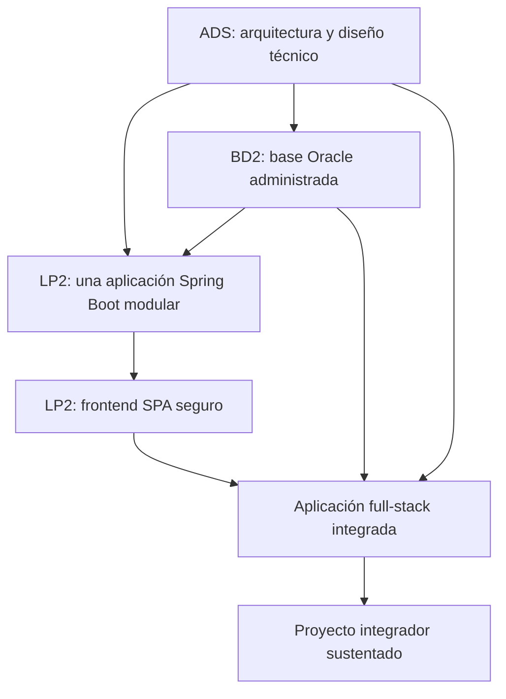

# Guía del Proyecto Integrador del Ciclo 4

## 1. Propósito

El Proyecto Integrador del Ciclo 4 articula **Análisis y Diseño de Sistemas de Información (ADS)**, **Administración de Base de Datos II (BD2)** y **Lenguaje de Programación II (LP2)** alrededor de un mismo sistema empresarial.

```text
Diseño técnico -> Base Oracle administrada -> Backend REST -> Frontend SPA -> Integración -> Sustentación
```

ADS define el diseño técnico profesional. BD2 administra y fortalece la base Oracle que soporta el sistema. LP2 implementa la aplicación full-stack empresarial usando el diseño técnico y la base de datos operativa.

### Composición de equipos e integración

No todos los integrantes de un equipo llevan necesariamente los 3 cursos (hay estudiantes irregulares que solo cursan ADS, solo BD2, solo LP2, o 2 de los 3). Por eso:

- **Cada sesión de cada curso se evalúa de forma autónoma**, sin depender de que el estudiante lleve los otros dos cursos en paralelo — la integración entre ADS, BD2 y LP2 nunca es requisito para aprobar la rúbrica de una sesión individual.
- **La integración se evalúa únicamente a nivel del Proyecto Integrador** (dimensión 6 de la rúbrica de la sección 6, "Integración del producto y calidad técnica"), y se aplica sobre el **equipo como conjunto**, no sobre cada estudiante individual: si el equipo tiene integrantes en los 3 cursos, esa evidencia de integración existe naturalmente porque cada uno construyó su parte; si el equipo no cubre los 3 cursos, esa dimensión se evalúa sobre lo que el equipo sí integró (por ejemplo, solo ADS+LP2, o solo BD2), sin penalizar la ausencia de un curso que ningún integrante lleva.
- La sustentación (sección 7) se reparte igual: cada integrante defiende la parte que efectivamente construyó, según los cursos que lleva.

### Competencia o capacidad del proyecto

Al finalizar el Proyecto Integrador, el equipo demuestra que puede diseñar, implementar, operar y defender una aplicación full-stack empresarial, integrando arquitectura técnica, base Oracle administrada, backend REST, frontend SPA, seguridad, operación, validación, documentación y sustentación integral del producto.

### Competencias relacionadas

| Código | Curso asociado | Competencia | Relación con el proyecto |
|---|---|---|---|
| CE021 | ADS | Ingeniería de Requerimientos | Evidencia diseño técnico, arquitectura, UML, decisiones y trazabilidad. |
| CE022 | BD2 | Ingeniería de la Información | Evidencia base Oracle administrada, segura, optimizada, auditada y resiliente. |
| CE023 | LP2 | Programación | Evidencia backend REST, frontend SPA e integración full-stack empresarial. |
| CE024 | Transversal | Calidad de Software | Evidencia pruebas, operación, documentación, repositorio, estándares, reproducibilidad y sustentación integral. |

Fuente oficial de los códigos: [Transcripción de evidencias por competencia — Ingeniería de Software](https://upeuoficial.github.io/planb/transcripcion/#c-area-de-ingenieria-de-software).

## 2. El Proyecto

El producto integrador es una **Aplicación Full-Stack Empresarial con Diseño Técnico Profesional y Base de Datos Oracle Administrada**.

El caso de referencia continúa el producto final de Ciclo 3: `Producto`, `Categoria`, `Venta`, `DetalleVenta` y `Usuario`. Ciclo 4 no reinicia el dominio; transforma el sistema Web MVC en una base Full-Stack modular de BomERP con una aplicación Spring Boot, una SPA, seguridad JWT, operación Oracle y preparación académica para producción. No pretende cubrir todos los procesos de un ERP comercial. Catálogo y Ventas forman el flujo funcional obligatorio; Inventario y Compras se delimitan como módulos de evolución sin ampliar artificialmente la evaluación.

BD2 no se integra como curso de diseño inicial de base de datos. Ese rol se trabajó en BD1. En ciclo 4, BD2 se integra como administración empresarial de la base que sostiene la aplicación: operación, rendimiento, seguridad, auditoría, respaldo, recuperación y monitoreo.

No se considera proyecto integrador:

- Diseño técnico que no se refleja en la aplicación.
- Base Oracle trabajada como ejercicios aislados.
- Backend y frontend sin trazabilidad con ADS.
- Evidencias de BD2 que no correspondan al sistema empresarial.
- Tres productos separados sin integración técnica.

## 3. Evolución del Proyecto

| Curso | Aporte principal | Producto |
|---|---|---|
| ADS | Arquitectura, vistas, modelo de dominio, UML, patrones, APIs, integraciones, ADRs y trazabilidad. | Diseño Técnico Profesional Documentado. |
| BD2 | PL/SQL, administración Oracle, seguridad, auditoría, optimización, backup, recovery y monitoreo. | Base Oracle operativa, administrada, optimizada, auditada y resiliente. |
| LP2 | Una aplicación Spring Boot única organizada en módulos verificados con Spring Modulith, una SPA modular, seguridad, persistencia, optimización, monitoreo, pruebas y estabilización. | Base Full-Stack modular de BomERP integrada, optimizada, monitoreada y estabilizada. |



### Alineamiento por sesiones

Este alineamiento sirve como referencia metodológica para coordinar los avances de los tres cursos sin convertir el documento principal en una lista extensa de sesiones.

| Sesiones | ADS | BD2 | LP2 | Integración esperada |
|---|---|---|---|---|
| S1-S2 | Fundamentos de arquitectura, stakeholders, atributos de calidad, modelo C4 y vistas arquitectónicas. | PL/SQL aplicado al negocio y triggers DML con auditoría básica. | Un Spring Boot ejecutable, módulos delimitados, conexión, verificación, DTO, OpenAPI y CRUD REST de `Producto`. | El diseño de ADS orienta el monolito modular; BD2 soporta la persistencia y LP2 expone por REST el primer recurso heredado de Ciclo 3. |
| S3-S4 | Diseño estructural, principios SOLID y arquitecturas modernas. | Excepciones, robustez y optimización de consultas con CBO, Explain Plan y DBMS_STATS. | Asociación `Categoria–Producto` y operación transaccional `Venta–DetalleVenta`. | Las decisiones de diseño se convierten en objetos relacionados y en el proceso transaccional de la base de BomERP. |
| S5-S6 | Evaluación U1 de arquitectura documentada. | Índices y evaluación U1 del motor transaccional Oracle optimizado. | Consultas y reportes REST, reglas, trazabilidad, CORS y evaluación del backend. | Primer corte integrado: arquitectura, motor transaccional y backend preparado para el consumo frontend. |
| S7-S8 | Modelado del dominio y diseño de clases. | Arquitectura Oracle, instancia, usuarios, roles y privilegios. | Una SPA con `core`, `shared`, módulos funcionales, layout, menú, rutas, servicios y CRUD. | La SPA modular implementa el diseño y consume recursos reales sobre la base administrada. |
| S9-S10 | Diagramas dinámicos, patrones de diseño y arquitectura empresarial. | Almacenamiento, auditoría, optimización de rendimiento, AWR e índices. | Formularios cabecera-detalle, consultas/reportes y seguridad backend con JWT, roles y permisos. | Los flujos empresariales se implementan y se protegen en el backend. |
| S11-S12 | Integración empresarial y evaluación U2 del catálogo UML con patrones e integración. | Particionamiento, escalabilidad y evaluación U2 de la base administrada, optimizada y asegurada. | Seguridad frontend con guards e interceptores y evaluación de la SPA segura integrada. | Segundo corte integrado: diseño de integración, base administrada y aplicación full-stack segura y funcional. |
| S13-S15 | Integración del diseño técnico, ADRs, trazabilidad y sustentación. | Backup, recovery, monitoreo, diagnóstico y sustentación del producto final BD2. | Lazy Loading, Code Splitting, caché, Redis cuando corresponda, logging, monitoreo, paginación de alto volumen, auditoría, pruebas end-to-end, estabilización y sustentación. | Consolidación final de la base de BomERP con evidencias técnicas de diseño, datos, aplicación y operación. |
| S16 | Evaluación final. | Evaluación final individual. | Evaluación final individual teórico-práctica. | Cierre académico y verificación individual de competencias. |

## 4. Cronograma

| Hito | Momento | Producto esperado |
|---|---|---|
| S2 | Brief técnico | Dominio, arquitectura inicial, recursos REST, objetos Oracle iniciales y alcance full-stack. |
| S6 | Primer corte integrado | Arquitectura base, motor transaccional Oracle optimizado y backend REST preparado para la SPA. |
| S12 | Producto intermedio | Catálogo UML, base Oracle administrada y SPA segura integrada al backend. |
| S15 | Producto final | Diseño técnico, base Oracle resiliente y base Full-Stack de BomERP optimizada, monitoreada y sustentada. |
| S16 | Cierre individual | Evaluación final individual teórico-práctica, separada de la sustentación del producto. |

### Entregables de Unidad 1

La Unidad 1 debe cerrar con un backend empresarial funcional y preparado para la SPA, sustentado por arquitectura y motor transaccional Oracle. La autenticación JWT se incorpora en U2; no es requisito de este primer corte.

Los artefactos desarrollados como ejemplo base se encuentran en [Unidad 1 - Producto integrado](u1/index.md).

| Curso | Producto U1 del curso | Artefactos mínimos | Evidencia de integración |
|---|---|---|---|
| ADS | **Arquitectura documentada mediante vistas arquitectónicas y principios de diseño aplicados.** | Contexto técnico, atributos de calidad, C4, componentes, principios SOLID y ADRs iniciales. | La arquitectura define endpoints, componentes y decisiones que LP2 implementa y BD2 soporta. |
| BD2 | **Motor transaccional Oracle optimizado.** | Tablas, paquetes PL/SQL, triggers, excepciones, auditoría básica, consultas optimizadas e índices. | Los objetos Oracle sostienen reglas, transacciones y consultas del backend. |
| LP2 | **Aplicación Spring Boot REST modular para Categoria–Producto y Venta–DetalleVenta.** | Un ejecutable, módulos delimitados, DTO, OpenAPI, CRUD maestro, proceso cabecera–detalle, consultas, CORS, logs, pruebas y demo API. | La API conserva el dominio de Ciclo 3, respeta límites ADS, consume estructuras Oracle alineadas con BD2 y queda preparada para una SPA. |

### Entregables de Unidad 2

La Unidad 2 debe cerrar con una aplicación full-stack funcional, donde el diseño UML, la administración Oracle y la SPA segura ya se evidencian como un solo sistema empresarial.

Los artefactos desarrollados como ejemplo base se encuentran en [Unidad 2 - Producto integrado](u2/index.md).

| Curso | Producto U2 del curso | Artefactos mínimos | Evidencia de integración |
|---|---|---|---|
| ADS | **Catálogo UML con patrones de diseño e integración aplicados.** | Modelo de dominio, clases, secuencia, actividad, patrones y diseño de integración. | Los modelos orientan servicios, DTO, endpoints, tablas y flujos SPA. |
| BD2 | **Base de datos empresarial administrada, optimizada y asegurada.** | Usuarios, roles, privilegios, almacenamiento, auditoría, rendimiento, particionamiento y scripts. | Oracle sostiene seguridad, rendimiento y operación de la aplicación. |
| LP2 | **Una SPA empresarial modular y segura, conectada a la aplicación Spring Boot.** | `core`, `shared`, módulos funcionales, layout, menú, rutas, CRUD, cabecera–detalle, consultas, JWT, roles, guards e interceptores. | La SPA única consume endpoints y evidencia flujos funcionales y protegidos con datos consistentes. |

### Entregables de Unidad 3

La Unidad 3 cierra el producto final del ciclo. No repite la funcionalidad de U2; agrega optimización, caché, observabilidad, paginación de alto volumen, auditoría, pruebas end-to-end, resiliencia, estabilización y defensa técnica del producto.

Los artefactos desarrollados como ejemplo base se encuentran en [Unidad 3 - Producto integrado](u3/index.md).

| Curso | Producto U3 del curso | Artefactos mínimos | Evidencia de integración |
|---|---|---|---|
| ADS | **Diseño Técnico Profesional Documentado.** | Arquitectura final, UML, patrones, ADRs y matriz de trazabilidad. | El diseño explica y justifica la aplicación, la base Oracle y las decisiones finales. |
| BD2 | **Base Oracle operativa, administrada, optimizada, auditada y resiliente.** | Backup, recovery, monitoreo, diagnóstico, seguridad, auditoría y rendimiento. | Oracle se muestra como soporte operable y recuperable del sistema. |
| LP2 | **Base Full-Stack modular de BomERP integrada, optimizada, monitoreada y estabilizada.** | Una SPA, una aplicación Spring Boot única con módulos verificados por Spring Modulith, esquemas funcionales Oracle, optimización, caché, logging, monitoreo, paginación, auditoría, E2E y guía de ejecución. | La aplicación ejecuta el flujo final respetando límites modulares (verificados con `ModularityTests`) y se sustenta en S15. |

## 5. Producto Final

### Repositorio académico y topics

Desde la primera presentación del proyecto, el repositorio debe estar creado y configurado con los topics académicos mínimos. Esta configuración es obligatoria porque permite identificar campus, semestre, línea, tipo de proyecto, cursos participantes, sección y grupo.

El detalle oficial del estándar se encuentra en [Estándar transversal de topics para repositorios académicos](https://upeuoficial.github.io/planb/anexos/estandar-topics-repositorios/).

Ejemplo base para el Proyecto Integrador del Ciclo 4:

```text
campus-juliaca
semestre-2026-2
linea-software
tipo-pi
ads
bd2
lp2
seccion-g1
grupo-<numero>-<nombre-proyecto>
```

Componentes mínimos:

- Diseño técnico profesional con arquitectura, vistas, UML, patrones, APIs conceptuales y ADRs.
- Trazabilidad entre diseño, endpoints, base de datos, vistas SPA y pruebas.
- Base Oracle con PL/SQL, triggers, excepciones, índices y optimización.
- Administración de usuarios, roles, privilegios, almacenamiento y auditoría.
- Evidencias de backup, recovery, monitoreo y diagnóstico.
- Un backend Spring Boot único que organiza módulos de negocio (verificados con Spring Modulith) con repositorios propios, DTO, CRUD maestro, transacciones cabecera–detalle, consultas, reglas y seguridad JWT.
- Una SPA con `core`, `shared`, módulos funcionales, CRUD, formularios transaccionales, consultas, reportes, guards e interceptores.
- Lazy Loading, Code Splitting, caché del navegador, Redis cuando corresponda, logging y monitoreo básico.
- Paginación de alto volumen, auditoría, pruebas end-to-end, corrección de errores y estabilización.
- Evidencias comparativas de optimización, pruebas de regresión y estabilización final.

## 6. Evaluación por competencias

Los criterios se organizan según una matriz común de evaluación de proyectos académicos: problema, diseño técnico, datos, implementación, integración y calidad, operación, validación y sustentación. El PI se evalúa con una sola rúbrica integrada; cada dimensión indica el curso que aporta principalmente al criterio, sin separar el producto en entregas inconexas.

| Dimensión común | Criterio del PI | Curso asociado | Capacidad evaluada | Evidencias esperadas |
|---|---|---|---|---|
| 1. Problema y alcance | Alcance y diseño técnico del sistema | ADS | Analiza el contexto del sistema y define alcance, restricciones y atributos de calidad. | Problema, alcance, stakeholders, atributos de calidad, restricciones y decisiones. |
| 2. Requerimientos o funcionalidad esperada | Funcionalidad full-stack esperada | ADS + LP2 | Traduce necesidades y diseño en funcionalidades empresariales verificables. | Flujos, casos, pantallas, endpoints, criterios de aceptación y experiencia esperada. |
| 3. Diseño, modelo o arquitectura | Arquitectura y diseño técnico | ADS | Diseña una arquitectura trazable, aplicable y justificable para el sistema. | C4, UML, patrones, ADRs, componentes, integración, decisiones técnicas y, cuando el módulo lo amerite por sus invariantes de negocio, diseño estratégico/táctico de Domain-Driven Design (agregado, lenguaje ubicuo). |
| 4. Implementación técnica | Backend REST modular y una SPA modular | LP2 | Implementa una base Full-Stack empresarial segura, transaccional, modular y funcional. | Un ejecutable backend, módulos cohesionados, APIs, DTO, CRUD, cabecera–detalle, seguridad, navegación, formularios y reportes. |
| 5. Datos, persistencia o procesamiento | Administración Oracle | BD2 | Administra datos empresariales con seguridad, rendimiento, auditoría y continuidad. | Usuarios, roles, privilegios, tablespaces, auditoría, optimización, backup/recovery y monitoreo. |
| 6. Integración del producto y calidad técnica | Integración full-stack y calidad técnica | ADS + BD2 + LP2 | Integra diseño, base Oracle, backend y frontend como un sistema empresarial verificable y reproducible. | Demo end-to-end, trazabilidad diseño-BD-API-SPA, repositorio, estructura, documentación, estándares, pruebas, scripts y forma de ejecución. |
| 7. Validación, pruebas o resultados | Operación, resiliencia y validación | BD2 + LP2 | Verifica funcionamiento, seguridad, operación, recuperación y resultados del sistema. | Pruebas end-to-end, monitoreo, auditoría, paginación, backup/recovery, fallos controlados y resultados verificables. |
| 8. Sustentación técnica y profesional | Sustentación integral | ADS + BD2 + LP2 | Defiende técnica y profesionalmente el PI, evidenciando autoría, integración y responsabilidad académica. | Pitch, demo, defensa técnica, aporte individual, repositorio, topics y MkDocs o equivalente. |

### Rúbrica

| Criterios | % | A (20) | B (15) | C (10) | D (5) |
|---|---:|---|---|---|---|
| 1. Problema y alcance | 10% | Problema claro, viable y bien delimitado; el alcance responde al contexto y está justificado. | Problema y alcance comprensibles, con algunos límites o justificaciones por precisar. | Problema poco delimitado o alcance parcialmente viable. | Problema confuso, sin alcance definido o sin relación clara con el producto. |
| 2. Requerimientos o funcionalidad esperada | 10% | Funcionalidades o requerimientos completos, coherentes y verificables según la necesidad planteada. | Funcionalidades principales cubiertas, con detalles menores pendientes o poco precisos. | Funcionalidades incompletas o parcialmente alineadas al problema. | Funcionalidades ausentes, inconexas o sin relación verificable con la necesidad. |
| 3. Diseño, modelo o arquitectura | 10% | Diseño, modelo o arquitectura coherente, aplicado y alineado al producto; muestra estructura y decisiones claras. | Diseño funcional con limitaciones menores o decisiones parcialmente justificadas. | Diseño poco claro, incompleto o aplicado de forma parcial. | No presenta diseño, modelo o arquitectura verificable. |
| 4. Implementación técnica | 10% | Implementación correcta, funcional y alineada a los contenidos centrales del curso. | Implementación funcional con detalles técnicos menores por corregir. | Implementación parcial, con errores o uso limitado de los contenidos del curso. | Implementación insuficiente, no funcional o no relacionada con los contenidos del curso. |
| 5. Datos, persistencia o procesamiento | 10% | Los datos se gestionan, almacenan, consultan o procesan correctamente según el tipo de proyecto. | Gestión de datos funcional con detalles menores de consistencia, estructura o procesamiento. | Gestión de datos parcial, limitada o con errores relevantes. | No hay manejo de datos verificable o este impide el funcionamiento del producto. |
| 6. Integración del producto y calidad técnica | 10% | El producto funciona como sistema integrado, ordenado, documentado y reproducible. | Integración funcional con detalles menores de organización, documentación o reproducibilidad. | Integración parcial; existen componentes aislados, desorden o evidencias incompletas. | Componentes desconectados, sin organización técnica ni evidencia reproducible. |
| 7. Validación, pruebas o resultados | 10% | Presenta pruebas, evidencias o resultados claros que comprueban el funcionamiento y el valor del producto. | Presenta evidencias suficientes, con algunos casos o resultados por completar. | Evidencias limitadas, poco claras o con validación parcial. | No presenta pruebas, evidencias ni resultados verificables. |
| 8. Sustentación técnica y profesional | 30% | Explica y defiende el producto con solvencia; demuestra aporte individual, dominio técnico, comunicación clara, repositorio, documentación y actitud profesional. | Sustentación clara y funcional, con detalles menores en defensa técnica, evidencias, comunicación o documentación. | Sustentación parcial; dominio, evidencias, comunicación o aporte individual insuficientemente demostrados. | No sustenta adecuadamente, no demuestra autoría o no presenta evidencias mínimas del producto. |

### Subaspectos de la sustentación integral

La sustentación integral debe representar como mínimo el 30% de la evaluación del proyecto. Se revisa mediante los siguientes subaspectos:

| Subaspecto | Qué observa |
|---|---|
| 1. Defensa técnica | Explicación de arquitectura, base de datos, código, decisiones, limitaciones, evidencias y trazabilidad del sistema. |
| 2. Comunicación y orden | Claridad, estructura, tiempo y lenguaje técnico. |
| 3. Presentación personal y actitud | Puntualidad, vestimenta limpia y adecuada, higiene, cabello ordenado, actitud profesional, respeto, honestidad y coherencia con los valores y principios cristianos de la institución. |
| 4. Aporte individual | Cada integrante demuestra lo que hizo. |
| 5. Repositorio y estándares | Topics, organización, commits, documentación y reproducibilidad. |
| 6. MkDocs o equivalente | Documentación publicada, navegable y alineada al producto. |
| 7. Pitch/demo ejecutiva | Introducción clara del problema, solución y valor, seguida de una demo funcional. |

La sustentación profesional forma parte de la evaluación porque el producto final no solo debe funcionar; también debe ser presentado, explicado y defendido con responsabilidad académica, ética, respeto, honestidad y coherencia con los valores y principios cristianos de la institución.

## 7. Sustentación

La sustentación inicia con un video pitch breve o introducción ejecutiva de 1 a 3 minutos para presentar el problema, la solución, el valor del producto y la participación del equipo o estudiante.

| Momento | Tiempo sugerido | Propósito |
|---|---:|---|
| Exposición técnica | 10 minutos | Presentar arquitectura, diseño, Oracle, backend, frontend, trazabilidad y evidencias. |
| Demostración en vivo | 5 minutos | Ejecutar flujo full-stack, seguridad, transacción, persistencia, monitoreo o recuperación. |

Cada integrante debe defender una parte verificable: diseño ADS, administración BD2, backend LP2, frontend LP2, seguridad, pruebas, observabilidad, integración o documentación. La base Oracle debe mostrarse como soporte real del sistema, no como componente paralelo.

## 8. Resultado Esperado

Al cierre del ciclo, el estudiante debe demostrar que puede convertir un diseño técnico profesional en una solución full-stack empresarial operativa.

```text
Diseño técnico -> Oracle administrado -> Backend REST -> Frontend SPA -> Sistema empresarial -> Sustentación
```

El valor del proyecto integrador está en evidenciar que la arquitectura, la base Oracle y la aplicación full-stack pertenecen al mismo sistema y evolucionaron de manera coordinada.

## Anexo. Secuencia sugerida de presentación

La presentación puede organizarse con una secuencia breve de apoyo visual. El video pitch o introducción ejecutiva abre la sustentación y no reemplaza la demo ni la defensa técnica.

| Orden | Slide o momento | Propósito | Competencia evidenciada |
|---:|---|---|---|
| 1 | Título del proyecto y equipo | Identificar el proyecto, integrantes y dominio elegido. | CE024 |
| 2 | Video pitch o introducción ejecutiva | Presentar problema, solución, valor y participación del equipo. | CE024 |
| 3 | Alcance y diseño técnico | Explicar necesidad, restricciones, atributos de calidad y decisiones. | CE021 |
| 4 | Arquitectura | Mostrar C4, UML, patrones, componentes y trazabilidad. | CE021 |
| 5 | Base Oracle | Presentar administración, seguridad, rendimiento, auditoría, respaldo y recuperación. | CE022 |
| 6 | Backend REST | Explicar conexión, CRUD, DTO, transacciones, consultas, reglas y seguridad. | CE023 |
| 7 | Frontend SPA | Mostrar navegación, CRUD, cabecera–detalle, consultas, guards, interceptores y control de acceso. | CE023 |
| 8 | Integración full-stack | Evidenciar relación entre diseño, base, API, frontend y pruebas. | CE021 + CE022 + CE023 |
| 9 | Operación y resiliencia | Mostrar monitoreo, recuperación, auditoría, fallos y resultados. | CE022 + CE024 |
| 10 | Demo en vivo | Ejecutar un flujo empresarial completo. | CE023 + CE024 |
| 11 | 4. Aporte individual | Indicar qué hizo cada integrante por curso o componente. | CE024 |
| 12 | Repositorio, estándares y mejoras | Mostrar topics, documentación publicada en MkDocs o equivalente, reproducibilidad, límites y mejora. | CE024 |

## Anexo. Plantilla mínima de documentación MkDocs o equivalente

La documentación publicada no reemplaza al informe. Su función es permitir que otra persona comprenda, ejecute, revise y verifique el producto desde el repositorio.

| Página o sección | Contenido mínimo | Evidencia esperada |
|---|---|---|
| Inicio | Nombre del proyecto, problema, solución, curso o cursos, integrantes y enlace al repositorio. | Presentación clara del producto. |
| Instalación o ejecución | Requisitos, dependencias, configuración y comandos para ejecutar el proyecto. | Instrucciones reproducibles. |
| Uso del sistema | Flujo principal, pantallas, comandos, endpoints, notebooks o casos de uso según corresponda. | Guía breve para probar el producto. |
| Arquitectura o estructura | Diagrama, componentes, carpetas principales y decisiones técnicas. | Vista técnica comprensible. |
| Módulos o funcionalidades | Descripción de las funciones principales del producto. | Relación entre funcionalidades y problema. |
| Datos | Modelo, archivos, base de datos, datasets, fuentes o estructura de almacenamiento según el curso. | Evidencia de gestión de datos. |
| Pruebas y evidencias | Casos de prueba, capturas, resultados, métricas, validaciones o salidas generadas. | Verificación del funcionamiento. |
| Equipo y aporte individual | Integrantes, responsabilidades, aportes y evidencias de participación. | Autoría verificable. |
| 5. Repositorio y estándares | Topics académicos, estructura, commits, ramas si aplica y criterios de reproducibilidad. | Cumplimiento de estándares técnicos. |
| Limitaciones y mejoras | Restricciones del producto y mejoras futuras priorizadas. | Cierre reflexivo y realista. |

La documentación debe estar disponible desde las primeras presentaciones y crecer con el proyecto. Para FP puede ser una documentación sencilla; para proyectos integradores y cursos avanzados debe ser más completa y técnica.
## Anexo. Plantilla sugerida de informe del proyecto

El informe debe documentar el producto integrador como un solo sistema empresarial, no como tres entregables separados. Debe evidenciar la trazabilidad entre ADS, BD2 y LP2.

| Sección | Contenido mínimo | Evidencia esperada |
|---|---|---|
| Portada | Nombre del proyecto, cursos, sección, integrantes, docentes y semestre. | Datos completos del equipo. |
| Resumen ejecutivo | Problema, solución full-stack y valor para el negocio. | Síntesis de 10 a 15 líneas. |
| Competencia y trazabilidad | Competencia/capacidad del PI y competencias relacionadas. | CE021, CE022, CE023 y CE024 vinculadas al producto. |
| Alcance y diseño técnico | Contexto, restricciones, atributos de calidad y decisiones. | Documento de diseño, ADRs o diagramas. |
| Arquitectura | C4, UML, patrones, componentes e integración. | Diagramas y explicación técnica. |
| Base Oracle | Administración, seguridad, auditoría, rendimiento, backup y recovery. | Scripts, capturas, planes, evidencias y monitoreo. |
| Backend REST | Conexión, APIs, DTO, CRUD, transacciones, consultas, reglas y seguridad. | Código, endpoints, pruebas y documentación. |
| Frontend SPA | Navegación, CRUD, formularios cabecera–detalle, consultas, guards, interceptores y UX. | Capturas, componentes y demo funcional. |
| Integración y operación | Relación diseño-BD-API-SPA, optimización, monitoreo, auditoría y validación. | Demo end-to-end, paginación, pruebas, logs, métricas y evidencias. |
| Repositorio y documentación | Repositorio, topics, estructura, instrucciones y documentación publicada. | URL del repositorio y MkDocs o equivalente. |
| 4. Aporte individual | Responsabilidad de cada integrante por curso o componente. | Tabla de tareas, commits o evidencias por integrante. |
| Limitaciones y mejoras | Límites del sistema y mejoras posibles. | Lista priorizada y realista. |


