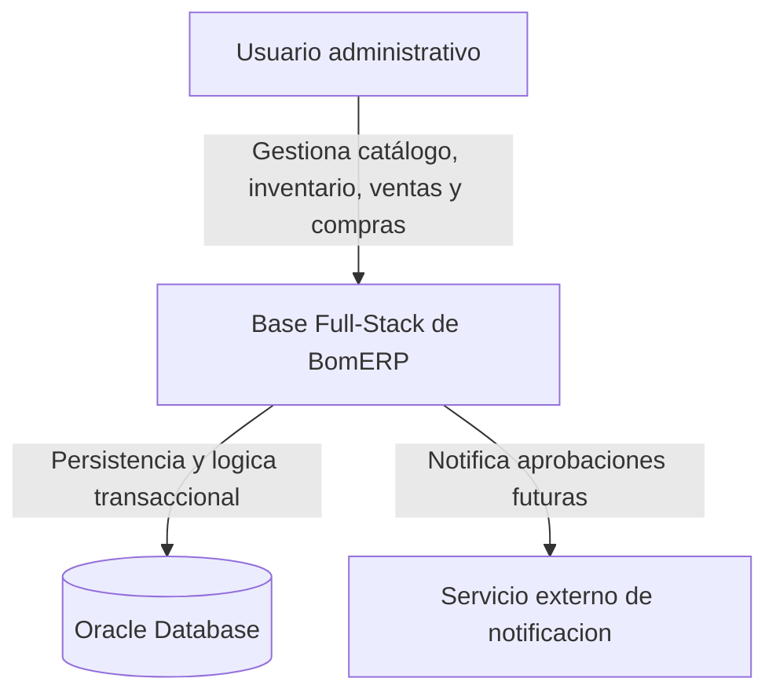
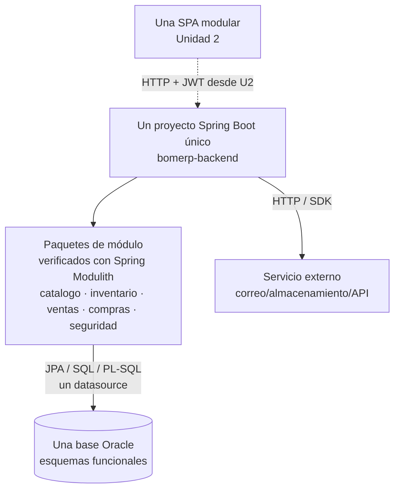
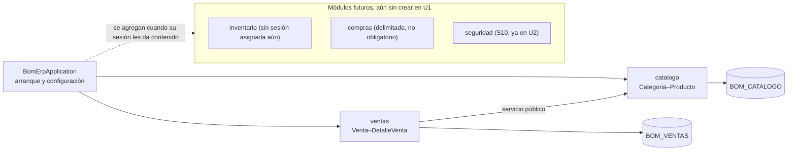

# ADS - Producto de Unidad 1

**Esta es la plantilla-ejemplo del producto de Unidad 1.** La estructura de secciones (contexto técnico, atributos de calidad, vistas C1-C3, principios de diseño, ADR y trazabilidad técnica U1) es exigible a todos; el contenido de BomERP es el ejemplo real que muestra cómo se ve terminada — cada sede (Lima, Juliaca, Tarapoto) y cada grupo reemplaza ese contenido por el de su propio dominio, definido en su propio [brief.md](../brief.md) de S2, sin cambiar la estructura.

## Producto

**Arquitectura documentada mediante vistas arquitectonicas y principios de diseno aplicados.**

Este producto define la base tecnica que BD2 y LP2 deben respetar. ADS no entrega codigo de aplicacion; entrega decisiones, vistas y estructura para que el backend, la base Oracle y la futura SPA se construyan sobre una arquitectura justificable.

## 1. Contexto tecnico

| Elemento | Definicion |
|---|---|
| Dominio | Continuidad de CoMarket: catálogo, inventario, ventas, compras y seguridad. El flujo funcional obligatorio parte de `Categoria–Producto–Venta–DetalleVenta`. |
| Problema técnico | La organización debe evolucionar el sistema MVC de Ciclo 3 hacia una API REST, una SPA y una base Oracle operable sin perder las reglas del dominio. |
| Producto U1 integrado | Arquitectura base + motor transaccional Oracle + backend REST empresarial. |
| Estilo inicial | Monolito modular basado en dominios funcionales, con arquitectura interna en capas. |
| Restriccion | La base de datos empresarial se administra en Oracle. |
| Usuarios tecnicos | Arquitecto, DBA, desarrollador backend, futuro desarrollador frontend y auditor. |

## 2. Atributos de calidad

| Atributo | Decision inicial | Evidencia |
|---|---|---|
| Seguridad futura | Decisión de autenticación y autorización para U2. | ADR previsto; JWT no se implementa en el corte U1. |
| Mantenibilidad | Un ejecutable Spring Boot único, con paquetes de módulo cohesionados por dominio y capas internas. | Límites, dependencias y componentes documentados; verificados por `ModularityTests`. |
| Integridad | Reglas transaccionales en servicio y Oracle. | Paquetes PL/SQL y restricciones. |
| Rendimiento | Índices y consultas optimizadas por fecha. | Script BD2 e índices. |
| Auditabilidad | Trigger de auditoría de cambios de precio y stock de producto (`TRG_PRODUCTO_AUDITORIA`). | Tabla y trigger de auditoría. |
| Escalabilidad inicial | API stateless preparada para SPA. | Decision arquitectonica ADR-001. |

## 3. Vista C1 - Contexto

## 4. Vista C2 - Contenedores

## 5. Vista C3 - Componentes backend

Al cierre de U1 (S6) solo existen `catalogo` y `ventas` como paquetes reales — `inventario`, `compras` y `seguridad` se dibujan como módulos futuros para no adelantar alcance de sesiones que todavía no llegaron (mismo criterio que [ADR-001](../../lp2/adr/ADR-001-arquitectura-backend.md)).

Reglas de la vista:

- Un solo proyecto Maven (`bomerp-backend`), sin reactor multi-módulo; `BomErpApplication` es su única clase de arranque y genera el único artefacto ejecutable.
- Cada módulo de negocio es un paquete directo bajo el paquete raíz (`catalogo`, `ventas`, ...), verificado como módulo de aplicación por **Spring Modulith**, no por límites de artefacto Maven.
- Los módulos se comunican en la misma JVM mediante servicios Java públicos; no usan Feign ni HTTP interno.
- Cada módulo organiza internamente sus capas (controller, dto, entity, repository, service).
- Un módulo puede consumir el servicio público de otro, pero nunca su repositorio ni su entidad — Spring Modulith verifica esta regla automáticamente (`ModularityTests`), no queda solo como convención documentada.
- No se crea un `shared-kernel` inicial: los tipos permanecen en su módulo propietario y solo se extraen cuando exista una semántica compartida real y estable.
- Todos usan un datasource; `@Transactional` conserva atomicidad entre esquemas Oracle.
- Las FK entre esquemas se permiten con una dirección controlada hacia Catálogo y Seguridad, evitando ciclos.
- Detalle completo de esta decisión: [ADR-001](../../lp2/adr/ADR-001-arquitectura-backend.md) y [ADR-002](../../lp2/adr/ADR-002-spring-modulith.md) en `docs/lp2/adr/`.

## 6. Principios de diseno aplicados

| Principio | Aplicacion |
|---|---|
| Responsabilidad unica | Cada módulo concentra una capacidad del negocio; sus controladores reciben peticiones, los servicios coordinan casos de uso y los repositorios administran persistencia propia. |
| Abierto/cerrado | Nuevas reglas de venta o anulación pueden agregarse sin cambiar el controlador. |
| Inversion de dependencias | Servicios dependen de contratos de repositorio, no de detalles de persistencia. |
| Bajo acoplamiento | Los módulos se comunican mediante servicios públicos y no comparten repositorios; JWT se incorpora en U2. |
| Alta cohesion | Catálogo, Inventario, Ventas, Compras y Seguridad concentran reglas y datos de su dominio funcional. |

## 7. ADR iniciales

Las decisiones de arquitectura del backend ya están formalizadas como ADR reales en `docs/lp2/adr/` — verificadas contra el código (`mvnw test`), no solo documentadas aquí. Esta página no repite esos códigos con otro significado, para no colisionar con ellos:

| ADR real | Decisión | Justificación |
|---|---|---|
| [ADR-001](../../lp2/adr/ADR-001-arquitectura-backend.md) | Un único proyecto Spring Boot, sin reactor Maven multi-módulo. | Reduce fricción de build sin introducir distribución que el sílabo no evalúa. |
| [ADR-002](../../lp2/adr/ADR-002-spring-modulith.md) | Módulos de negocio verificados con Spring Modulith. | Verifica límites de dependencia automáticamente (`ModularityTests`), no solo por convención documentada. |
| [ADR-003](../../lp2/adr/ADR-003-spring-boot-4.md) | Spring Boot exacto en 4.0.7. | Versión que exige SpringDoc OpenAPI dentro del rango compatible, verificada contra `start.spring.io`. |

Decisiones adicionales, previstas pero **aún no formalizadas** como ADR de código (se registran como ADR real recién cuando su sesión les dé contenido, no antes):

| Código previsto | Decisión | Se formaliza en |
|---|---|---|
| ADR-004 | API REST protegida con JWT. | S10 (Seguridad backend) |
| ADR-005 | Una sola SPA organizada por funcionalidades (`core`/`shared`/módulos). | S7 (Creación de la SPA) |

## 8. Trazabilidad tecnica U1

| Decision ADS | Evidencia BD2 | Evidencia LP2 |
|---|---|---|
| Auditoría de cambios | Trigger `TRG_PRODUCTO_AUDITORIA` sobre precio/stock | `POST`/`PUT` sobre `/api/v1/productos` (cualquier alta o cambio dispara el trigger, sin que el backend lo sepa). |
| Monolito modular y capas internas | Esquemas `BOM_CATALOGO` y `BOM_VENTAS` (los únicos que existen al cierre de U1; `BOM_INVENTARIO`, `BOM_COMPRAS` y `BOM_SEGURIDAD` se crean recién cuando su sesión los necesite) | Paquetes de módulo Spring Modulith, servicios públicos, controllers, services y repositories propios. |
| Seguridad stateless prevista | Usuario/rol como soporte futuro | ADR y contrato para implementación en S10-S11. |
| Rendimiento por consultas frecuentes | Índice `IX_VENTAS_FECHA` sobre `FECHA` | Filtro `desde`/`hasta` en `GET /api/v1/ventas`. |

## Rúbrica de Evaluación

Los cinco criterios son cita literal del resultado de aprendizaje de la Unidad I en el sílabo de ADS.

| Criterio | Peso | A (20 pts) | B (15 pts) | C (10 pts) | D (5 pts) |
|---|---:|---|---|---|---|
| 1. Representa vistas arquitectónicas mediante C4 o equivalente | 20% | C1, C2 y C3 completas, coherentes entre sí y con el código real. | Las tres vistas están presentes, con alguna inconsistencia menor frente al código. | Falta una vista o hay inconsistencias relevantes. | No presenta vistas arquitectónicas verificables. |
| 2. Define límites, responsabilidades y componentes del sistema | 20% | Límites de módulo claros y verificados por `ModularityTests`; responsabilidades sin solapamiento. | Límites claros, verificación parcial. | Límites confusos o con solapamiento de responsabilidades. | No define límites ni responsabilidades. |
| 3. Aplica principios SOLID, cohesión, acoplamiento, modularidad y abstracción | 20% | Cada principio de la sección 6 se sustenta con un ejemplo real del código. | La mayoría de principios se sustenta con ejemplos reales. | Aplicación superficial o solo teórica. | No aplica los principios. |
| 4. Justifica estilos arquitectónicos y trade-offs | 20% | Justifica el estilo elegido frente a al menos una alternativa, citando trade-offs reales. | Justifica el estilo elegido con trade-offs generales. | Menciona el estilo sin justificar trade-offs. | No justifica el estilo elegido. |
| 5. Mantiene coherencia con los requerimientos del negocio | 20% | La arquitectura resuelve el dominio (sección 1) y la trazabilidad (sección 8) es verificable en vivo. | La arquitectura resuelve el dominio; la trazabilidad es mayormente verificable. | Coherencia parcial con el dominio o trazabilidad débil. | No hay coherencia demostrable con el dominio. |

Nota final = suma de (`Peso` × `Puntos del nivel obtenido`) / 100 × 20.
