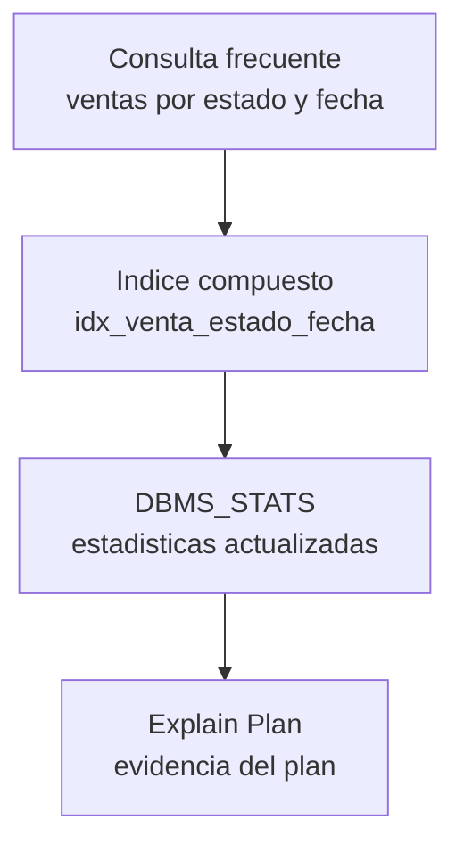

# BD2 - Producto de Unidad 1

## Producto

**Motor transaccional Oracle optimizado.**

Este producto implementa logica de negocio en Oracle mediante PL/SQL, triggers, excepciones, auditoria basica, consultas optimizadas e indices. La base no se trabaja como ejercicio aislado: soporta los endpoints y reglas del backend LP2.

## 1. Scripts del producto

Los scripts se agregan **por sesión de BD2**, a medida que cada una les da contenido real — no se pre-crean tablas/objetos de sesiones que todavía no se dictaron (mismo criterio que la arquitectura de módulos de LP2, ver [ADR-002](../../lp2/adr/ADR-002-spring-modulith.md)).

| Script | Sesión BD2 | Uso |
|---|---|---|
| [S01_01_esquemas.sql](oracle/S01_01_esquemas.sql) | [S1](../../bd2/sesiones/S01_PLSQL_Aplicado_Negocio.md) | Usuarios `BOM_CATALOGO` (propietario) y `BOMERP_APP` (técnico de LP2). |
| [S01_02_tablas.sql](oracle/S01_02_tablas.sql) | [S1](../../bd2/sesiones/S01_PLSQL_Aplicado_Negocio.md) | Tablas `CATEGORIAS`/`PRODUCTOS` y permisos de `BOMERP_APP` sobre ellas. |
| [S01_03_plsql.sql](oracle/S01_03_plsql.sql) | [S1](../../bd2/sesiones/S01_PLSQL_Aplicado_Negocio.md) | Función y procedimientos PL/SQL del catálogo. |

Pendientes (se agregan cuando esas sesiones de BD2 se documenten): `producto_auditoria` y trigger de auditoría (S2), esquema `BOM_VENTAS` y tablas `venta`/`detalle_venta` (S3-S4 de LP2), paquete `pkg_venta` y trigger `trg_venta_estado_audit`, índice `idx_venta_estado_fecha`, esquema `BOM_SEGURIDAD` (S10 de LP2).

## 2. Objetos Oracle U1

**Estado al cierre de la Unidad 1 (S6), no al día de hoy** (S1-S2 solo tienen creados `BOM_CATALOGO.CATEGORIAS`/`PRODUCTOS`, ver sección 1): las filas de `BOM_VENTAS` y `BOM_SEGURIDAD.usuario_app` son el objetivo de esta unidad, que se completa progresivamente en S3-S6.

| Objeto | Proposito | Relacion con LP2 |
|---|---|---|
| `BOM_CATALOGO.CATEGORIAS` y `PRODUCTOS` | Catálogo heredado de Ciclo 3. | Recursos `/api/v1/categorias` y `/api/v1/productos`. |
| `BOM_VENTAS.venta` y `detalle_venta` | Operación transaccional principal. | Recurso `/api/v1/ventas`. |
| `BOM_SEGURIDAD.usuario_app` | Soporte para JWT, roles y trazabilidad. | Identidad autenticada desde S10. |
| `BOM_VENTAS.venta_audit` | Auditoría de cambios de estado. | Evidencia de anulación. |
| `BOM_VENTAS.pkg_venta` | Registro y anulación transaccional. | Servicio backend coordina reglas equivalentes. |
| `idx_venta_estado_fecha` | Optimiza consultas por estado y fecha. | Filtros de ventas. |

## 3. Reglas transaccionales

| Regla | Implementacion Oracle |
|---|---|
| Una venta inicia en estado `ACTIVA`. | Valor por defecto y procedimiento `registrar_venta`. |
| La venta contiene al menos un detalle. | Validación en paquete. |
| Cantidad no supera el stock. | Bloqueo de producto y validación PL/SQL. |
| Sólo una venta activa puede anularse. | Procedimiento `anular_venta`. |
| Todo cambio de estado queda auditado. | Trigger `trg_venta_estado_audit`. |

## 4. Manejo de excepciones

| Situacion | Excepcion esperada |
|---|---|
| Cabecera, detalle o cantidad inválida. | `raise_application_error(-20001/-20002, ...)`. |
| Stock insuficiente. | `raise_application_error(-20003, ...)`. |
| Venta inexistente o no anulable. | `raise_application_error(-20004/-20005, ...)`. |

## 5. Optimizacion inicial

## 6. Evidencia de integracion

| BD2 | ADS | LP2 |
|---|---|---|
| Paquete `pkg_venta` | Componente de lógica transaccional | Servicio de ventas. |
| Trigger de auditoría | Atributo de auditabilidad | Acción anular venta. |
| Índice por estado-fecha | Atributo de rendimiento | Filtro de ventas. |
| Excepciones PL/SQL | Robustez del motor | Manejo global de errores. |

Las FK entre esquemas conservan la integridad porque todos los objetos pertenecen a una sola base Oracle. `BOMERP_APP` ejecuta la aplicación, pero no es propietario de tablas ni paquetes.
