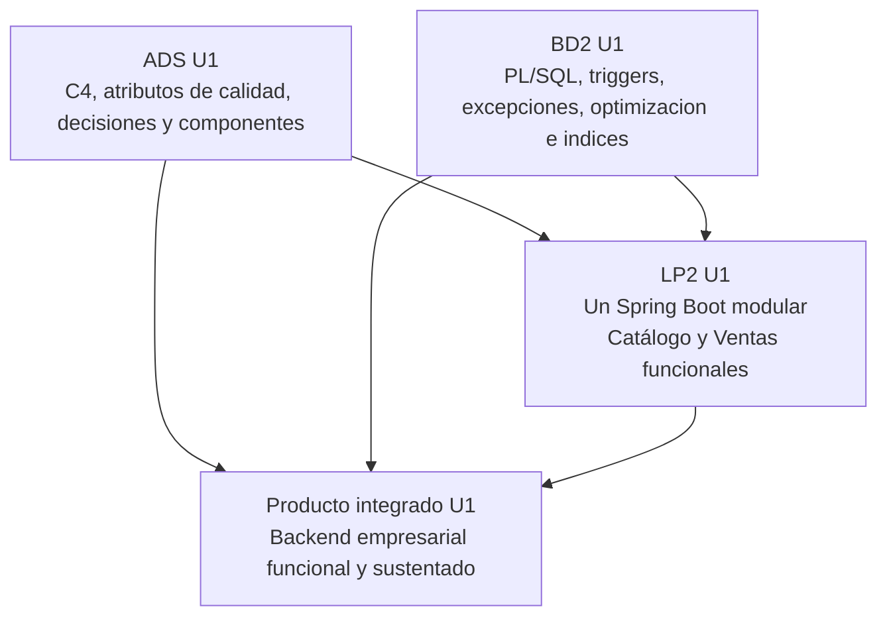
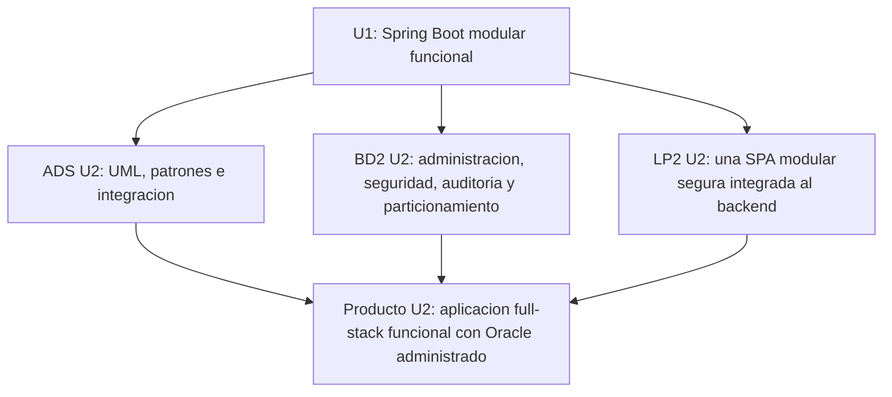

# Unidad 1 - Producto integrado

## Corte U1

El corte de Unidad 1 demuestra que el equipo transformó el sistema MVC heredado de Ciclo 3 en una base técnica empresarial: arquitectura modular, motor transaccional Oracle y una aplicación Spring Boot REST preparada para la SPA. JWT se implementará en U2.

## Dominio de ejemplo

**Base de BomERP: gestión de productos y ventas.**

El sistema MVC de Ciclo 3 ya gestiona `Producto`, `Categoria`, `Venta`, `DetalleVenta` y `Usuario`. En Ciclo 4 se conserva ese flujo, se organiza el backend mediante módulos de negocio, se expone mediante una API REST conectada a Oracle y se prepara su consumo desde una SPA empresarial. Catálogo y Ventas constituyen el alcance funcional obligatorio; Inventario, Compras y Seguridad quedan delimitados para evolucionar sin mezclar responsabilidades.

## Producto integrado U1

**Arquitectura modular base + motor transaccional Oracle optimizado + una aplicación Spring Boot REST funcional y preparada para la SPA.**

## Productos por curso

| Curso | Producto U1 | Archivo |
|---|---|---|
| ADS | Arquitectura documentada mediante vistas arquitectonicas y principios de diseno aplicados. | [Producto ADS U1](ads-producto.md) |
| BD2 | Motor transaccional Oracle optimizado. | [Producto BD2 U1](bd2-producto.md) |
| LP2 | Backend REST modular ensamblado como una sola aplicación Spring Boot, con Catálogo y Ventas funcionales, límites de Inventario y Compras, persistencia, consultas, CORS, logs y pruebas. | [Producto LP2 U1](lp2-demo.md) |

## Alcance relativo de cada curso

Los tres cursos no tienen el mismo alcance de visión sobre BomERP:

- **ADS** ve todo el sistema: arquitectura completa de la empresa, incluyendo infraestructura y sistemas externos con los que BomERP se integra (notificaciones, servicios de IA, etc.), no solo lo que BD2 o LP2 construyen.
- **BD2** también ve el sistema completo, pero acotado a la base de datos empresarial: motor transaccional, optimización, auditoría y resiliencia de Oracle.
- **LP2** no alcanza a construir todo el ERP: su producto es una porción concreta — Catálogo y Ventas (2 módulos) —, con Inventario, Compras y Seguridad delimitados para sesiones futuras.

## Integracion esperada

## Evidencia minima para presentar

- Repositorio creado con topics academicos.
- Contexto, alcance tecnico y atributos de calidad.
- Vistas C4 iniciales: contexto, contenedores y componentes.
- Decisiones arquitectonicas iniciales.
- Paquetes PL/SQL, triggers, manejo de excepciones e indices.
- Esquemas funcionales y usuario técnico de aplicación con privilegios mínimos; FK verificables entre Catálogo y Ventas (Seguridad no existe hasta S10, ya en U2).
- Consultas optimizadas con evidencia de criterio de optimizacion.
- Proyecto backend ejecutable, configuración por ambientes, conexión a BD y endpoint de verificación.
- Un único `BomErpApplication`; módulos de negocio con dependencias unidireccionales y repositorios propios.
- Contrato REST, DTO y documentación OpenAPI.
- CRUD completo de `Producto`, con validaciones, excepciones, logs y pruebas.
- Asociación `Categoria–Producto` mediante ORM y DTO relacionados.
- Operación `Venta–DetalleVenta` con cálculos, estados, commit y rollback.
- Consultas, filtros, ordenamiento, agregaciones y resúmenes; la paginación se reserva para S14.
- Reglas de negocio, trazabilidad, CORS, logs y pruebas.
- Demo o consola API ejecutable.
- Trazabilidad entre arquitectura, objetos Oracle, endpoints y pruebas.

## Pruebas minimas del corte U1

| Caso | Entrada o accion | Resultado esperado | Curso que aporta evidencia |
|---|---|---|---|
| Verificación del backend | Ejecutar el proyecto con el ambiente local. | El backend conecta con Oracle y responde en el endpoint de verificación. | LP2 + BD2 |
| Verificación modular | Revisar dependencias y acceso a persistencia. | Existe un solo ejecutable y ningún módulo consume directamente repositorios ajenos. | ADS + LP2 |
| CRUD maestro | Crear, consultar, actualizar y eliminar un producto con categoría. | Las operaciones persisten y responden con estados HTTP consistentes. | LP2 + BD2 |
| Registro de venta válida | Cliente y dos detalles con cantidades válidas. | La venta se registra en estado `ACTIVA`, actualiza stock y calcula el total. | LP2 + BD2 |
| Rechazo de cantidad invalida | Cantidad cero o negativa. | La API responde con error de validacion. | ADS + LP2 |
| Cambio de estado | Anular una venta activa. | El estado cambia a `ANULADA`, se repone stock y queda evidencia de auditoría. | BD2 + LP2 |
| Consulta filtrada | Filtrar ventas por fecha, estado, usuario o producto. | Se devuelven sólo ventas coincidentes. | BD2 + LP2 |
| Trazabilidad | Seleccionar un endpoint y explicar su componente, tabla, paquete y regla. | El equipo demuestra relacion ADS-BD2-LP2. | ADS + BD2 + LP2 |

## Estado de aprobacion del corte U1

| Estado | Significado | Decision metodologica |
|---|---|---|
| Aprobado para continuar a U2 | Arquitectura, motor transaccional y API REST funcional son coherentes y verificables. | El equipo puede construir la SPA e incorporar seguridad backend y frontend. |
| Aprobado con observaciones | El backend funciona, pero existen ajustes en arquitectura, PL/SQL, transacciones o trazabilidad. | El equipo continúa a U2 corrigiendo observaciones antes del segundo corte. |
| No aprobado | No existe integracion verificable entre ADS, BD2 y LP2, o la API no ejecuta el flujo principal. | El equipo debe rehacer U1 antes de avanzar. |

## Transicion hacia Unidad 2

| Curso | En U1 queda | En U2 se convierte en |
|---|---|---|
| ADS | Arquitectura base, C4, decisiones y componentes. | Modelo de dominio, UML, patrones, integracion y catalogo tecnico. |
| BD2 | Motor transaccional Oracle con PL/SQL, triggers, excepciones, optimizacion e indices. | Base Oracle administrada, optimizada, asegurada y particionada. |
| LP2 | Una aplicación Spring Boot modular con Catálogo y Ventas funcionales, CRUD, cabecera–detalle, consultas, CORS, logs y pruebas. | Una SPA modular segura con navegación, CRUD, formularios transaccionales, JWT, roles, guards e interceptores. |

