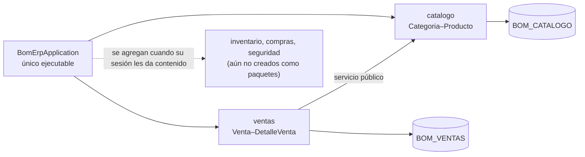

# LP2 - Producto de Unidad 1

## Producto

**Backend REST modular ensamblado como una sola aplicación Spring Boot, conectado a Oracle, con persistencia ORM, CRUD, una operación cabecera–detalle, consultas, CORS, logs y pruebas.**

La demo representa una consola académica de API REST y muestra el flujo obligatorio `Categoria–Producto–Venta–DetalleVenta`, heredado del sistema MVC de Ciclo 3. El backend real se organiza como monolito modular: `catalogo` y `ventas` quedan funcionales en U1; `inventario`, `compras` y `seguridad` conservan límites preparados para su evolución. Para publicarse en MkDocs sin servidor, la demo simula servicios, repositorios y persistencia en el navegador; no reemplaza la aplicación Spring Boot conectada a Oracle. La autenticación JWT no forma parte de U1 y se incorpora en S10.

## Alcance arquitectónico del corte

```text
backend/                     # un solo proyecto Maven, sin reactor multi-módulo
└── src/main/java/pe/edu/upeu/bomerp/
    ├── BomErpApplication.java   # único Spring Boot ejecutable
    ├── catalogo/                # funcional en U1
    ├── ventas/                  # funcional en U1
    ├── inventario/              # aún no existe, se agrega cuando su sesión le dé contenido
    ├── compras/                 # aún no existe, se agrega cuando su sesión le dé contenido
    └── seguridad/               # se implementa en U2
```

Cada paquete directo bajo `pe.edu.upeu.bomerp` es un módulo de aplicación verificado por Spring Modulith (`ModularityTests`), no un artefacto Maven separado.

Compras no es un segundo flujo obligatorio de U1. Su límite se documenta para evitar que el código de compras termine mezclado con ventas, pero la evaluación mantiene una sola operación cabecera–detalle implementada con profundidad.

## Demo ejecutable

[Abrir consola API U1](demo-api/index.html)

## Contrato REST de referencia

| Método | Endpoint | Propósito | Sesión relacionada |
|---|---|---|---|
| `GET` | `/api/v1/categorias` | Listar categorías. | S1-S3 |
| `GET` | `/api/v1/productos` | Listar productos con categoría. | S1-S3 |
| `POST` | `/api/v1/productos` | Registrar un producto. | S2 |
| `POST` | `/api/v1/ventas` | Registrar cabecera y colección de detalles. | S4 |
| `PATCH` | `/api/v1/ventas/{id}/anular` | Anular venta y reponer existencias. | S4-S5 |
| `GET` | `/api/v1/ventas` | Consultar ventas mediante filtros y ordenamiento. | S5 |
| `GET` | `/api/v1/ventas/resumen` | Devolver agregaciones y respuestas resumidas. | S5 |

## DTO principales

```json
{
  "cliente": "María Quispe",
  "detalles": [
    { "productoId": 1, "cantidad": 2 },
    { "productoId": 2, "cantidad": 3 }
  ]
}
```

```json
{
  "id": 1001,
  "cliente": "María Quispe",
  "total": 145.50,
  "estado": "ACTIVA",
  "cantidadDetalles": 2
}
```

## Arquitectura backend U1



Todos los módulos se ejecutan en la misma JVM y utilizan un datasource. No existe Feign ni comunicación HTTP interna. Cada módulo conserva sus controllers, casos de uso, entidades y repositorios; los repositorios no se comparten.

## Casos de prueba de la demo

| Caso | Accion | Resultado esperado |
|---|---|---|
| Verificar backend | Ejecutar con el ambiente local. | Conecta con Oracle y responde en `/health` o equivalente. |
| Verificar límites | Revisar dependencias y paquetes de negocio. | Existe un solo ejecutable y ningún módulo accede a repositorios ajenos. |
| CRUD maestro | Crear, consultar, actualizar y eliminar un producto. | Las operaciones persisten con respuestas HTTP consistentes. |
| Crear venta válida | Cliente y dos detalles válidos. | Se registra venta `ACTIVA` con total y stock consistentes. |
| Crear venta inválida | Cantidad cero o stock insuficiente. | Se devuelve error `400` sin persistencia parcial. |
| Anular venta | Anular una venta activa. | Cambia a `ANULADA`, repone stock y registra auditoría. |
| Filtrar ventas | Filtrar por estado, fecha o producto. | La lista muestra coincidencias. |

## Trazabilidad con ADS y BD2

| Elemento LP2 | ADS | BD2 |
|---|---|---|
| Configuración por ambientes | Un ejecutable desplegable y configuración externa | Conexión Oracle sin credenciales versionadas. |
| Monolito modular con capas internas | Vista C3, límites y dependencias | Esquemas y tablas con propiedad funcional definida. |
| Validación de total y stock | Regla de integridad | Restricciones y excepciones PL/SQL. |
| Anular venta | Caso transaccional | Trigger de auditoría. |
| Filtros | Atributo rendimiento | Índice `idx_venta_estado_fecha`. |
