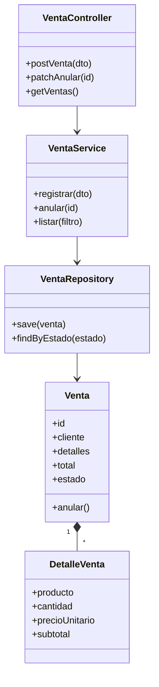

# ADS - Producto de Unidad 2

## Producto

**Catálogo UML con patrones de diseño e integración aplicados.**

## Artefactos mínimos

| Artefacto | Evidencia |
|---|---|
| Modelo de dominio | Entidades, objetos de valor, reglas y módulos. |
| Diagrama de clases | Clases, atributos, operaciones, relaciones y multiplicidades. |
| Transformación objeto-relacional | Relación clase-tabla-clave-DTO. |
| Diagramas dinámicos | Secuencia y actividad del flujo principal. |
| Patrones aplicados | Controller, Service, Repository, DTO, Mapper. |
| Diseño de integración | Interacción entre SPA, API, módulos y base Oracle. |

## Diagrama de clases de referencia

Este diagrama usa Service Layer clásico (la lógica de registrar/anular vive en `VentaService`, no en `Venta`). `Venta` es justamente el candidato natural para diseño táctico de Domain-Driven Design (S10): tiene invariantes reales que proteger siempre — el total debe cuadrar con los detalles, el stock nunca queda negativo, solo una venta `ACTIVA` puede anularse. Si el equipo aplica DDD aquí, esas reglas se mueven de `VentaService` hacia dentro de `Venta` como *aggregate root* (`Venta.registrarDetalle()`, `Venta.anular()` validando su propio estado), y `VentaRepository` se declara como interfaz del propio módulo de dominio, no como repositorio JPA directo. `catalogo` (CRUD simple de `Producto`/`Categoria`) no necesita este tratamiento — la decisión de aplicar DDD táctico es por módulo, no para todo el sistema (ver ADS S4).

## Trazabilidad U2

| Diseño ADS | Evidencia BD2 | Evidencia LP2 |
|---|---|---|
| Clases Venta y DetalleVenta | Tablas `venta` y `detalle_venta` | Modelos y DTO de venta |
| Service Layer | Paquete PL/SQL y reglas | Servicio frontend/backend |
| Repository Pattern | Usuario y privilegios Oracle | Repositorio/API service |
| Diagrama de secuencia anular | Trigger de auditoría | Acción anular desde SPA |
| Integración full-stack | Persistencia y auditoría Oracle | Flujo SPA -> API -> Oracle |
