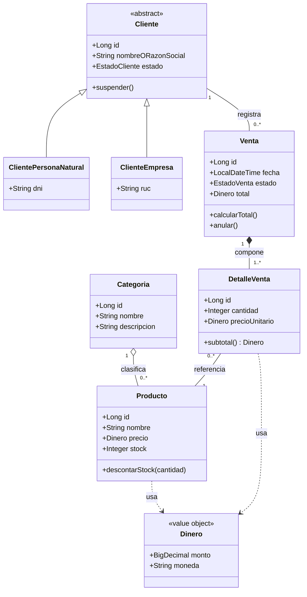

# ADS - Producto de Unidad 2

**Este documento es el ejemplo BomERP del docente, no una plantilla obligatoria.** Cada sede (Lima, Juliaca, Tarapoto) y cada grupo dentro de una misma sede sustenta su propio catálogo UML sobre su propio dominio, definido desde el [brief.md](../brief.md) de S2 y consolidado en su [Producto ADS U1](../u1/ads-producto.md). El diagrama de clases y la matriz de trazabilidad de este documento son los del ejemplo BomERP; cada equipo los reemplaza por los de su propio módulo transaccional (equivalente a `ventas`) y no transaccional (equivalente a `catalogo`). Lo exigible a todos es la estructura: modelo de dominio, diagrama de clases, transformación objeto-relacional, diagramas dinámicos, patrones aplicados y diseño de integración.

## Producto

**Catálogo UML con patrones de diseño e integración aplicados.**

## Artefactos mínimos

| Artefacto | Evidencia |
|---|---|
| Modelo de dominio | Entidades, objetos de valor, reglas y módulos. |
| Diagrama de clases | Clases, atributos, operaciones, relaciones y multiplicidades. |
| Transformación objeto-relacional | Relación clase-tabla-clave-DTO. |
| Diagramas dinámicos | Secuencia y actividad del flujo principal. |
| Patrones aplicados | Controller, Service, Repository, DTO, Mapper. |
| Diseño de integración | Interacción entre SPA, API, módulos y base Oracle. |

## Diagrama de clases de referencia

**Este es el diagrama de dominio (UML/DDD, S6-S7), no una vista de Código C4** — no mezcla entidades con clases de implementación (`Service`/`Repository`/`Controller`, esas sí viven en la Vista de código de C4, ADS S2 2.6). Cruza los módulos `catalogo`, `ventas` y `clientes` a propósito: ese es precisamente el trabajo del modelo de dominio, mostrar el negocio completo, no cómo se organiza el código en componentes desplegables (S7, 3.6).

`Venta.anular()` y `Venta.calcularTotal()` ya viven en la entidad, no en un `VentaService` externo (Information Expert, ADS S7 2.3) — evitar el Anemic Domain Model no es un paso opcional que "el equipo puede aplicar si quiere": ya está hecho desde S7. Lo que sí queda como trabajo específico de **S10** ("Patrones y arquitectura empresarial") es el diseño táctico *completo* de DDD sobre el agregado `Venta`-`DetalleVenta` — declarar `VentaRepository` como interfaz propia del módulo de dominio (no un `JpaRepository` expuesto directo), y formalizar `Venta` como *aggregate root* con acceso controlado a `DetalleVenta`. `catalogo` (CRUD simple de `Categoria`/`Producto`) no necesita ese tratamiento completo — la decisión de aplicar DDD táctico a fondo es por módulo, no para todo el sistema (S7, 2.8 vía S6).

## Trazabilidad U2

| Diseño ADS | Evidencia BD2 | Evidencia LP2 |
|---|---|---|
| `Categoria` agregación `Producto` | Tablas `categorias`/`productos`, FK sin `ON DELETE CASCADE` | `@ManyToOne` de `Producto` hacia `Categoria` |
| `Venta` composición `DetalleVenta` | FK `NOT NULL` de `detalle_venta` hacia `venta` | `@OneToMany(cascade = ALL)` en `Venta` |
| `Cliente` con herencia (persona natural/empresa) | Estrategia de mapeo objeto-relacional (S8) | Aún no implementado en LP2 (módulo `clientes` sin sesión propia) |
| `Venta.anular()`/`calcularTotal()` como operaciones de entidad | Trigger/`CHECK` de auditoría e integridad | Lógica movida de `VentaService` a `Venta` |
| Diagrama de secuencia anular (S9) | Trigger de auditoría | Acción anular desde SPA |
| Integración full-stack | Persistencia y auditoría Oracle | Flujo SPA -> API -> Oracle |
